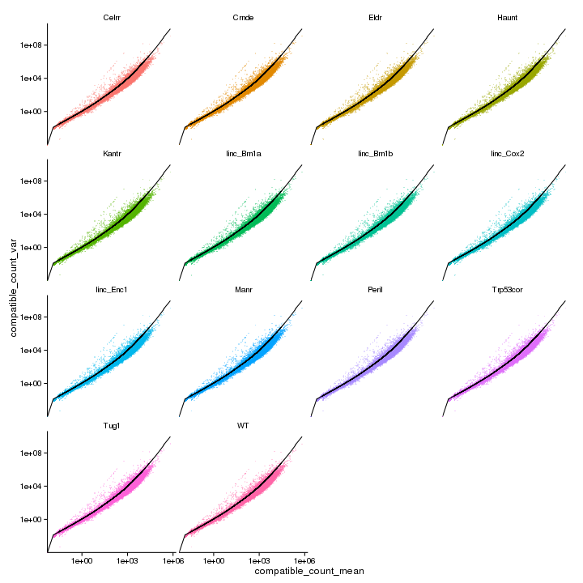
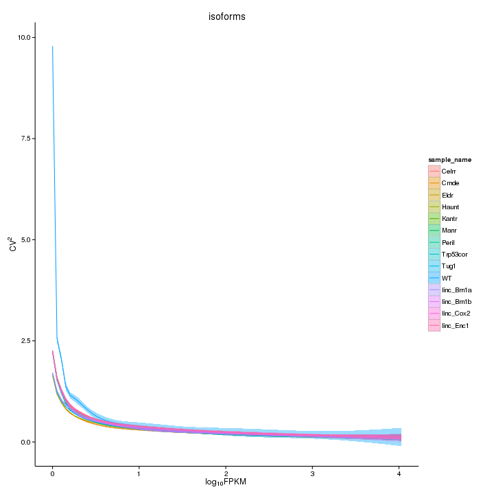
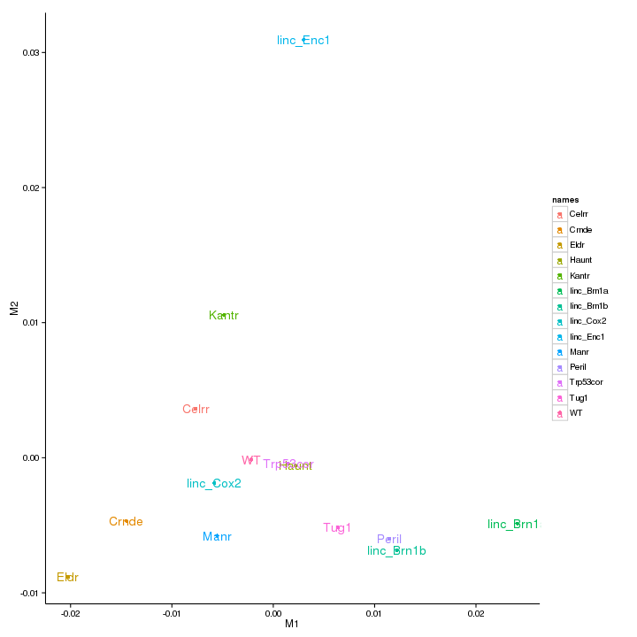
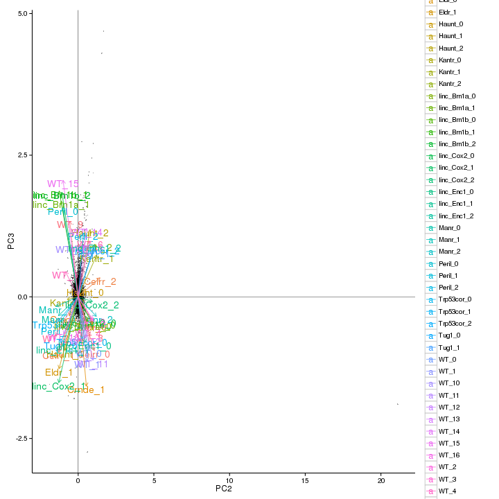
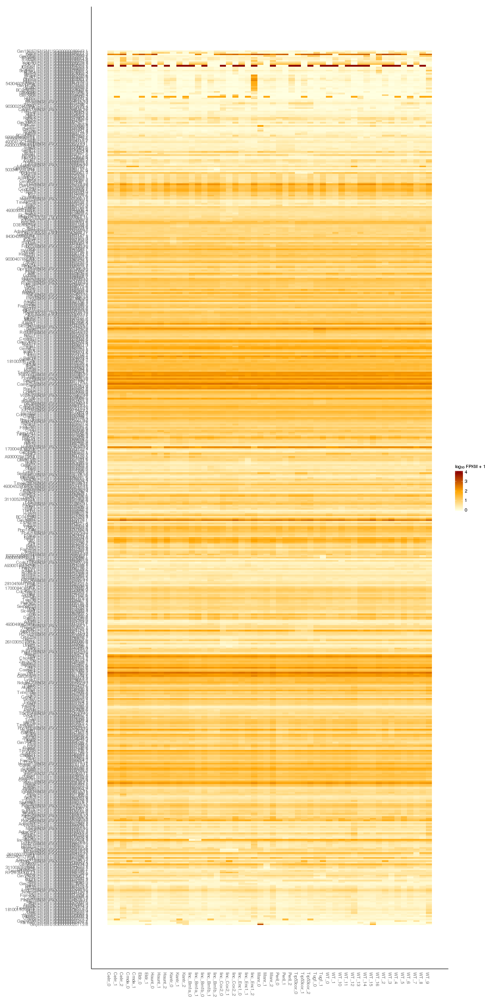
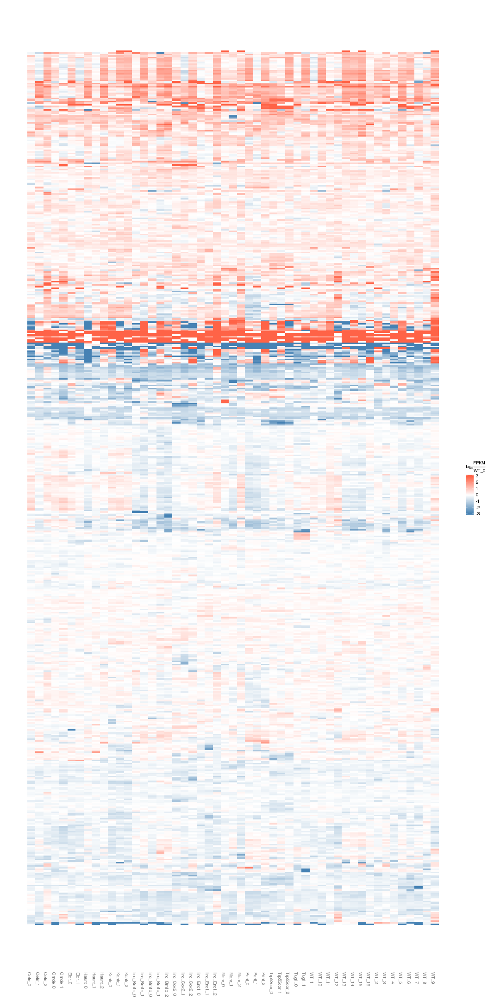
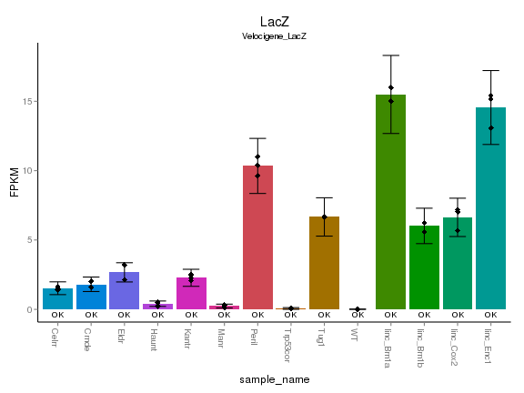

BrainMap Adult Full Analysis
=====================================

#Setup and Imports

```r
# basedir = '/Volumes/Odyssey/seq/lgoff/Projects/BrainMap/'
basedir = "/n/rinn_data1/seq/lgoff/Projects/BrainMap/"
setwd(paste(basedir, "analysis/Adult_full/", sep = ""))
```


```r
library(cummeRbund)
library(ggplot2)
library(stringr)
library(reshape2)

brainmap_theme_opts <- function() {
    theme(strip.background = element_rect(colour = "white", fill = "white")) + 
        theme(panel.border = element_blank(), axis.line = element_line()) + 
        theme(panel.grid.minor.x = element_blank(), panel.grid.minor.y = element_blank()) + 
        theme(panel.grid.major.x = element_blank(), panel.grid.major.y = element_blank()) + 
        theme(panel.background = element_rect(fill = "white"))
}
```


## Initialize cuffData.db and establish connection

```r
refGTF <- paste(basedir, "data/annotation/mm10_gencode_vM2_with_lncRNAs_and_LacZ.gtf", 
    sep = "")
cuffdir <- paste(basedir, "data/diffs/Adult_full/", sep = "")

cuffdir
```

```
## [1] "/n/rinn_data1/seq/lgoff/Projects/BrainMap/data/diffs/Adult_full/"
```

```r

cuff <- readCufflinks(dir = cuffdir, gtfFile = refGTF, genome = "mm10")

samples(cuff)
```

```
##    sample_index sample_name sample_name parameter value
## 1             1       Celrr        <NA>      <NA>  <NA>
## 2             2       Crnde        <NA>      <NA>  <NA>
## 3             3        Eldr        <NA>      <NA>  <NA>
## 4             4       Haunt        <NA>      <NA>  <NA>
## 5             5       Kantr        <NA>      <NA>  <NA>
## 6             6        Manr        <NA>      <NA>  <NA>
## 7             7       Peril        <NA>      <NA>  <NA>
## 8             8    Trp53cor        <NA>      <NA>  <NA>
## 9             9        Tug1        <NA>      <NA>  <NA>
## 10           10          WT        <NA>      <NA>  <NA>
## 11           11  linc_Brn1a        <NA>      <NA>  <NA>
## 12           12  linc_Brn1b        <NA>      <NA>  <NA>
## 13           13   linc_Cox2        <NA>      <NA>  <NA>
## 14           14   linc_Enc1        <NA>      <NA>  <NA>
```

```r

replicates(cuff)
```

```
##                                                                          file
## 1  /n/rinn_data1/seq/lgoff/Projects/BrainMap/data/quants/JR739/abundances.cxb
## 2  /n/rinn_data1/seq/lgoff/Projects/BrainMap/data/quants/JR783/abundances.cxb
## 3  /n/rinn_data1/seq/lgoff/Projects/BrainMap/data/quants/JR804/abundances.cxb
## 4  /n/rinn_data1/seq/lgoff/Projects/BrainMap/data/quants/JR741/abundances.cxb
## 5  /n/rinn_data1/seq/lgoff/Projects/BrainMap/data/quants/JR784/abundances.cxb
## 6  /n/rinn_data1/seq/lgoff/Projects/BrainMap/data/quants/JR799/abundances.cxb
## 7  /n/rinn_data1/seq/lgoff/Projects/BrainMap/data/quants/JR777/abundances.cxb
## 8  /n/rinn_data1/seq/lgoff/Projects/BrainMap/data/quants/JR738/abundances.cxb
## 9  /n/rinn_data1/seq/lgoff/Projects/BrainMap/data/quants/JR782/abundances.cxb
## 10 /n/rinn_data1/seq/lgoff/Projects/BrainMap/data/quants/JR826/abundances.cxb
## 11 /n/rinn_data1/seq/lgoff/Projects/BrainMap/data/quants/JR742/abundances.cxb
## 12 /n/rinn_data1/seq/lgoff/Projects/BrainMap/data/quants/JR819/abundances.cxb
## 13 /n/rinn_data1/seq/lgoff/Projects/BrainMap/data/quants/JR823/abundances.cxb
## 14 /n/rinn_data1/seq/lgoff/Projects/BrainMap/data/quants/JR780/abundances.cxb
## 15 /n/rinn_data1/seq/lgoff/Projects/BrainMap/data/quants/JR737/abundances.cxb
## 16 /n/rinn_data1/seq/lgoff/Projects/BrainMap/data/quants/JR801/abundances.cxb
## 17 /n/rinn_data1/seq/lgoff/Projects/BrainMap/data/quants/JR806/abundances.cxb
## 18 /n/rinn_data1/seq/lgoff/Projects/BrainMap/data/quants/JR744/abundances.cxb
## 19 /n/rinn_data1/seq/lgoff/Projects/BrainMap/data/quants/JR822/abundances.cxb
## 20 /n/rinn_data1/seq/lgoff/Projects/BrainMap/data/quants/JR743/abundances.cxb
## 21 /n/rinn_data1/seq/lgoff/Projects/BrainMap/data/quants/JR786/abundances.cxb
## 22 /n/rinn_data1/seq/lgoff/Projects/BrainMap/data/quants/JR805/abundances.cxb
## 23 /n/rinn_data1/seq/lgoff/Projects/BrainMap/data/quants/JR745/abundances.cxb
## 24 /n/rinn_data1/seq/lgoff/Projects/BrainMap/data/quants/JR807/abundances.cxb
## 25 /n/rinn_data1/seq/lgoff/Projects/BrainMap/data/quants/JR729/abundances.cxb
## 26 /n/rinn_data1/seq/lgoff/Projects/BrainMap/data/quants/JR728/abundances.cxb
## 27 /n/rinn_data1/seq/lgoff/Projects/BrainMap/data/quants/JR796/abundances.cxb
## 28 /n/rinn_data1/seq/lgoff/Projects/BrainMap/data/quants/JR797/abundances.cxb
## 29 /n/rinn_data1/seq/lgoff/Projects/BrainMap/data/quants/JR740/abundances.cxb
## 30 /n/rinn_data1/seq/lgoff/Projects/BrainMap/data/quants/JR800/abundances.cxb
## 31 /n/rinn_data1/seq/lgoff/Projects/BrainMap/data/quants/JR827/abundances.cxb
## 32 /n/rinn_data1/seq/lgoff/Projects/BrainMap/data/quants/JR778/abundances.cxb
## 33 /n/rinn_data1/seq/lgoff/Projects/BrainMap/data/quants/JR734/abundances.cxb
## 34 /n/rinn_data1/seq/lgoff/Projects/BrainMap/data/quants/JR802/abundances.cxb
## 35 /n/rinn_data1/seq/lgoff/Projects/BrainMap/data/quants/JR803/abundances.cxb
## 36 /n/rinn_data1/seq/lgoff/Projects/BrainMap/data/quants/JR735/abundances.cxb
## 37 /n/rinn_data1/seq/lgoff/Projects/BrainMap/data/quants/JR785/abundances.cxb
## 38 /n/rinn_data1/seq/lgoff/Projects/BrainMap/data/quants/JR824/abundances.cxb
## 39 /n/rinn_data1/seq/lgoff/Projects/BrainMap/data/quants/JR820/abundances.cxb
## 40 /n/rinn_data1/seq/lgoff/Projects/BrainMap/data/quants/JR821/abundances.cxb
## 41 /n/rinn_data1/seq/lgoff/Projects/BrainMap/data/quants/JR781/abundances.cxb
## 42 /n/rinn_data1/seq/lgoff/Projects/BrainMap/data/quants/JR730/abundances.cxb
## 43 /n/rinn_data1/seq/lgoff/Projects/BrainMap/data/quants/JR837/abundances.cxb
## 44 /n/rinn_data1/seq/lgoff/Projects/BrainMap/data/quants/JR731/abundances.cxb
## 45 /n/rinn_data1/seq/lgoff/Projects/BrainMap/data/quants/JR835/abundances.cxb
## 46 /n/rinn_data1/seq/lgoff/Projects/BrainMap/data/quants/JR836/abundances.cxb
## 47 /n/rinn_data1/seq/lgoff/Projects/BrainMap/data/quants/JR732/abundances.cxb
## 48 /n/rinn_data1/seq/lgoff/Projects/BrainMap/data/quants/JR776/abundances.cxb
## 49 /n/rinn_data1/seq/lgoff/Projects/BrainMap/data/quants/JR798/abundances.cxb
## 50 /n/rinn_data1/seq/lgoff/Projects/BrainMap/data/quants/JR736/abundances.cxb
## 51 /n/rinn_data1/seq/lgoff/Projects/BrainMap/data/quants/JR779/abundances.cxb
## 52 /n/rinn_data1/seq/lgoff/Projects/BrainMap/data/quants/JR825/abundances.cxb
##    sample_name replicate     rep_name total_mass norm_mass internal_scale
## 1        Celrr         0      Celrr_0   23325900  35062900         0.6671
## 2        Celrr         1      Celrr_1   37161800  35062900         1.0628
## 3        Celrr         2      Celrr_2   39715300  35062900         1.1157
## 4        Crnde         0      Crnde_0   37686800  35062900         1.0782
## 5        Crnde         1      Crnde_1   37652200  35062900         1.0700
## 6         Eldr         0       Eldr_0   36453400  35062900         1.0253
## 7         Eldr         1       Eldr_1   42739700  35062900         1.2205
## 8        Haunt         0      Haunt_0   26084100  35062900         0.7473
## 9        Haunt         1      Haunt_1   43523200  35062900         1.2486
## 10       Haunt         2      Haunt_2   33775800  35062900         0.9660
## 11       Kantr         0      Kantr_0   35615300  35062900         1.0078
## 12       Kantr         1      Kantr_1   32408700  35062900         0.9218
## 13       Kantr         2      Kantr_2   33428000  35062900         0.9522
## 14        Manr         0       Manr_0   40782700  35062900         1.1635
## 15        Manr         1       Manr_1   40835900  35062900         1.1785
## 16        Manr         2       Manr_2   34495500  35062900         0.9590
## 17       Peril         0      Peril_0   40528700  35062900         1.1555
## 18       Peril         1      Peril_1   38767500  35062900         1.1200
## 19       Peril         2      Peril_2   33329500  35062900         0.9582
## 20    Trp53cor         0   Trp53cor_0   32358500  35062900         0.9265
## 21    Trp53cor         1   Trp53cor_1   38185400  35062900         1.0853
## 22    Trp53cor         2   Trp53cor_2   41355100  35062900         1.1746
## 23        Tug1         0       Tug1_0   38091200  35062900         1.0886
## 24        Tug1         1       Tug1_1   29979900  35062900         0.8518
## 25          WT         0         WT_0   26334400  35062900         0.7505
## 26          WT         1         WT_1   20329200  35062900         0.5785
## 27          WT         2         WT_2   34089000  35062900         0.9689
## 28          WT         3         WT_3   28103300  35062900         0.7921
## 29          WT         4         WT_4   35808200  35062900         1.0233
## 30          WT         5         WT_5   37012200  35062900         1.0574
## 31          WT         6         WT_6   27786600  35062900         0.7966
## 32          WT         7         WT_7   39541900  35062900         1.1420
## 33          WT         8         WT_8   34480600  35062900         0.9977
## 34          WT         9         WT_9   45467400  35062900         1.2834
## 35          WT        10        WT_10   52130400  35062900         1.4882
## 36          WT        11        WT_11   34994400  35062900         1.0026
## 37          WT        12        WT_12   34173600  35062900         0.9608
## 38          WT        13        WT_13   34306900  35062900         0.9927
## 39          WT        14        WT_14   36256500  35062900         1.0407
## 40          WT        15        WT_15   45848800  35062900         1.3234
## 41          WT        16        WT_16   41538900  35062900         1.1918
## 42  linc_Brn1a         0 linc_Brn1a_0   24947000  35062900         0.7154
## 43  linc_Brn1a         1 linc_Brn1a_1   38529800  35062900         1.1155
## 44  linc_Brn1b         0 linc_Brn1b_0   24288100  35062900         0.6926
## 45  linc_Brn1b         1 linc_Brn1b_1   44561200  35062900         1.2765
## 46  linc_Brn1b         2 linc_Brn1b_2   43675800  35062900         1.2519
## 47   linc_Cox2         0  linc_Cox2_0   27439100  35062900         0.7850
## 48   linc_Cox2         1  linc_Cox2_1   39517800  35062900         1.1061
## 49   linc_Cox2         2  linc_Cox2_2   35636800  35062900         1.0017
## 50   linc_Enc1         0  linc_Enc1_0   30101500  35062900         0.8569
## 51   linc_Enc1         1  linc_Enc1_1   38936900  35062900         1.1113
## 52   linc_Enc1         2  linc_Enc1_2   33174000  35062900         0.9326
##    external_scale
## 1               1
## 2               1
## 3               1
## 4               1
## 5               1
## 6               1
## 7               1
## 8               1
## 9               1
## 10              1
## 11              1
## 12              1
## 13              1
## 14              1
## 15              1
## 16              1
## 17              1
## 18              1
## 19              1
## 20              1
## 21              1
## 22              1
## 23              1
## 24              1
## 25              1
## 26              1
## 27              1
## 28              1
## 29              1
## 30              1
## 31              1
## 32              1
## 33              1
## 34              1
## 35              1
## 36              1
## 37              1
## 38              1
## 39              1
## 40              1
## 41              1
## 42              1
## 43              1
## 44              1
## 45              1
## 46              1
## 47              1
## 48              1
## 49              1
## 50              1
## 51              1
## 52              1
```


## Quality Control

## Overdispersion fit

```r
dispersionPlot(cuff) + brainmap_theme_opts()
```

 


### Dendrogram

```r
csDendro(genes(cuff), rep = T) + brainmap_theme_opts()
```

 

```
## NULL
```


### Squared Coefficient of Variation
Evaluates cross-replicate variability across expression regime for gene- and isoform-level expression estimates per condition.

```r
fpkmSCVPlot(genes(cuff)) + brainmap_theme_opts()
```

```
## Scale for 'x' is already present. Adding another scale for 'x', which will
## replace the existing scale.
```

```
## geom_smooth: method="auto" and size of largest group is >=1000, so using
## gam with formula: y ~ s(x, bs = "cs"). Use 'method = x' to change the
## smoothing method.
```

 

```r

fpkmSCVPlot(isoforms(cuff)) + brainmap_theme_opts()
```

```
## Scale for 'x' is already present. Adding another scale for 'x', which will
## replace the existing scale.
```

```
## geom_smooth: method="auto" and size of largest group is >=1000, so using
## gam with formula: y ~ s(x, bs = "cs"). Use 'method = x' to change the
## smoothing method.
```

```
## Warning: the matrix is either rank-deficient or indefinite
```

```
## Warning: the matrix is either rank-deficient or indefinite
```

```
## Warning: the matrix is either rank-deficient or indefinite
```

```
## Warning: the matrix is either rank-deficient or indefinite
```

 


### Dimensionality reduction


```r
MDSplot(genes(cuff)) + brainmap_theme_opts()
```

 

```r

PCAplot(genes(cuff), "PC2", "PC3", rep = TRUE) + brainmap_theme_opts()
```

 


## Significant gene expression differences (global)

```r
alpha <- 0.1
sigGeneIDs <- getSig(cuff, alpha = alpha)
sigGenes <- getGenes(cuff, sigGeneIDs)
```


## Global Analysis

```r
csHeatmap(sigGenes, rep = T, clustering = "row") + brainmap_theme_opts()
```

```
## Using tracking_id, rep_name as id variables
```

```
## Using as id variables
```

 

```r

csFoldChangeHeatmap(sigGenes, control_condition = "WT", replicate_num = 0, clustering = "row", 
    replicates = TRUE, labRow = FALSE)
```

```
## Using tracking_id, rep_name as id variables
```

```
## Using as id variables
```

 


## Digital Genotyping

```r
KOgeneIDs <- samples(cuff)$sample_name

KOgeneIDs <- c(KOgeneIDs, "LacZ")
KOgeneIDs <- str_replace(KOgeneIDs, "_", "-")
KOgeneIDs <- str_replace(KOgeneIDs, "Trp53cor", "Trp53cor1")

KOGenes <- getGenes(cuff, KOgeneIDs)

```


### LacZ expression

```r
LacZ <- getGene(cuff, "LacZ")

expressionBarplot(LacZ, rep = T) + brainmap_theme_opts()
```

 

```r

KOGenes_WT_only <- getGenes(cuff, KOgeneIDs, sampleIdList = "WT")

expressionBarplot(KOGenes_WT_only, rep = T) + brainmap_theme_opts()
```

```
## Scale for 'colour' is already present. Adding another scale for 'colour',
## which will replace the existing scale.
```

```
## ymax not defined: adjusting position using y instead
```

 

### Male vs Femail

### Correlation between LacZ expression and WT lncRNA (Stability?)

```r


fpkms <- fpkmMatrix(KOGenes, fullname = T)
```

```
## Using tracking_id, sample_name as id variables
```

```r
fpkms$gene_id <- rownames(fpkms)

fpkms <- melt(fpkms)
```

```
## Using gene_id as id variables
```

```r
fpkms$gene <- str_split_fixed(fpkms$gene_id, "\\|", 2)[, 1]

```


## GSEA

## Guilt-by-association on FC values

# Figures

## Figure 1

```r
pdf("sigMatrix.pdf", width = 6, height = 3)
sigMatrix(cuff, level = "genes") + scale_fill_gradient(limits = c(0, 300), low = "white", 
    high = "darkgreen")
```

```
## Scale for 'fill' is already present. Adding another scale for 'fill',
## which will replace the existing scale.
```

```r
sigMatrix(cuff, level = "isoforms") + scale_fill_gradient(limits = c(0, 300), 
    low = "white", high = "darkred")
```

```
## Scale for 'fill' is already present. Adding another scale for 'fill',
## which will replace the existing scale.
```

```r
sigMatrix(cuff, level = "CDS") + scale_fill_gradient(limits = c(0, 300), low = "white", 
    high = "purple")
```

```
## Scale for 'fill' is already present. Adding another scale for 'fill',
## which will replace the existing scale.
```

```r
dev.off()
```

```
## pdf 
##   2
```


 ## Session Info

```r
sessionInfo()
```

```
## R version 3.0.0 (2013-04-03)
## Platform: x86_64-unknown-linux-gnu (64-bit)
## 
## locale:
##  [1] LC_CTYPE=en_US.UTF-8       LC_NUMERIC=C              
##  [3] LC_TIME=en_US.UTF-8        LC_COLLATE=en_US.UTF-8    
##  [5] LC_MONETARY=en_US.UTF-8    LC_MESSAGES=en_US.UTF-8   
##  [7] LC_PAPER=C                 LC_NAME=C                 
##  [9] LC_ADDRESS=C               LC_TELEPHONE=C            
## [11] LC_MEASUREMENT=en_US.UTF-8 LC_IDENTIFICATION=C       
## 
## attached base packages:
## [1] grid      parallel  stats     graphics  grDevices utils     datasets 
## [8] methods   base     
## 
## other attached packages:
##  [1] mgcv_1.7-22          stringr_0.6.2        knitr_1.2           
##  [4] cummeRbund_2.7.3     Gviz_1.4.1           rtracklayer_1.20.1  
##  [7] GenomicRanges_1.12.2 IRanges_1.18.0       fastcluster_1.1.9   
## [10] reshape2_1.2.2       ggplot2_0.9.3.1      RSQLite_0.11.3      
## [13] DBI_0.2-6            BiocGenerics_0.6.0   colorout_1.0-2      
## 
## loaded via a namespace (and not attached):
##  [1] AnnotationDbi_1.22.3   Biobase_2.20.0         biomaRt_2.16.0        
##  [4] Biostrings_2.28.0      biovizBase_1.8.0       bitops_1.0-5          
##  [7] BSgenome_1.28.0        cluster_1.14.4         colorspace_1.2-2      
## [10] dichromat_2.0-0        digest_0.6.3           evaluate_0.4.3        
## [13] formatR_0.7            GenomicFeatures_1.12.1 gtable_0.1.2          
## [16] Hmisc_3.10-1.1         labeling_0.1           lattice_0.20-15       
## [19] MASS_7.3-26            Matrix_1.0-12          munsell_0.4           
## [22] nlme_3.1-109           plyr_1.8               proto_0.3-10          
## [25] RColorBrewer_1.0-5     RCurl_1.95-4.1         Rsamtools_1.12.2      
## [28] scales_0.2.3           stats4_3.0.0           tools_3.0.0           
## [31] XML_3.96-1.1           zlibbioc_1.6.0
```


