Celrr KO vs WT (Embryonic)
======================================


- add labels, descriptions
- turn off all caching ! 
- other heatmap labels (csHeatmap)
- overlap figure
- tracks 
- should import litter info


# Intialize


# Design Overview

This file shows the wt-v-ko comparison for Celrr. 

Cuff overview:

```
## CuffSet instance with:
## 	 2 samples
## 	 26754 genes
## 	 77524 isoforms
## 	 0 TSS
## 	 0 CDS
## 	 0 promoters
## 	 0 splicing
## 	 0 relCDS
```


# QC

## Dispersion

Dispersion plot for genes in cuff:
(Overdispersion can lead to innacurate quants)


```
## Error: 'from' cannot be NA, NaN or infinite
```

## Cross-replicate variability (fpkmSCVplot)
Differences in CV 2 can result in lower numbers of differentially expressed genes due to a higher degree of variability between replicate fpkm estimates.

Genes:

```
## Scale for 'x' is already present. Adding another scale for 'x', which will replace the existing scale.
## geom_smooth: method="auto" and size of largest group is >=1000, so using gam with formula: y ~ s(x, bs = "cs"). Use 'method = x' to change the smoothing method.
```

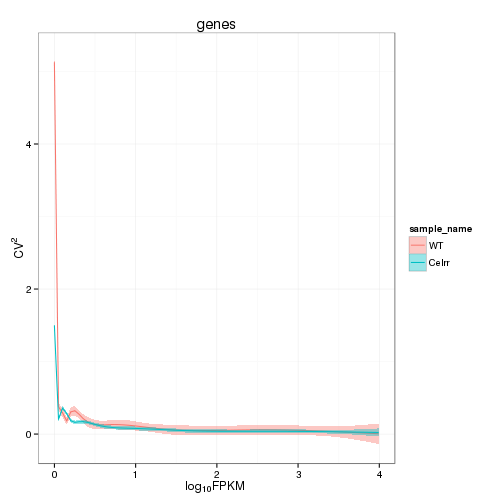 


Isoforms: 

```
## Warning: RS-DBI driver warning: (closing pending result sets before
## closing this connection)
```

```
## Scale for 'x' is already present. Adding another scale for 'x', which will replace the existing scale.
## geom_smooth: method="auto" and size of largest group is >=1000, so using gam with formula: y ~ s(x, bs = "cs"). Use 'method = x' to change the smoothing method.
```

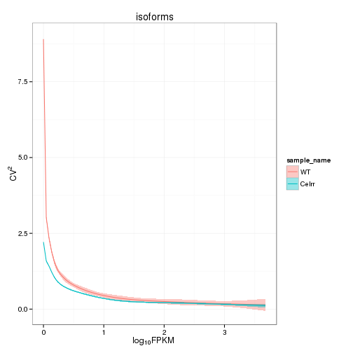 

## Volcano

```
## Error: One or more values of 'x' or 'y' are not valid sample names!
```

### Volcano matrix (replicates)

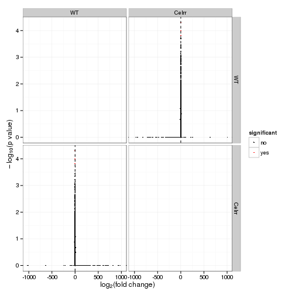 

## MvA plot

```
## Error: non-numeric argument to binary operator
```
   
### MvA plot counts

```
## Error: non-numeric argument to binary operator
```

## Scatterplot
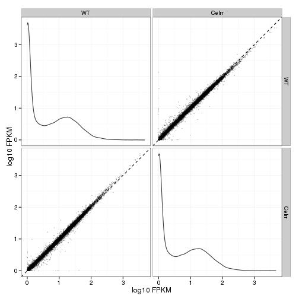 

### Scatter matrix (replicates) -- SKIP FOR NOW CAUSING PROBLEMS 


## Distributions

### Boxplots

Boxplot (genes)

 

Boxplot (genes, replicates)

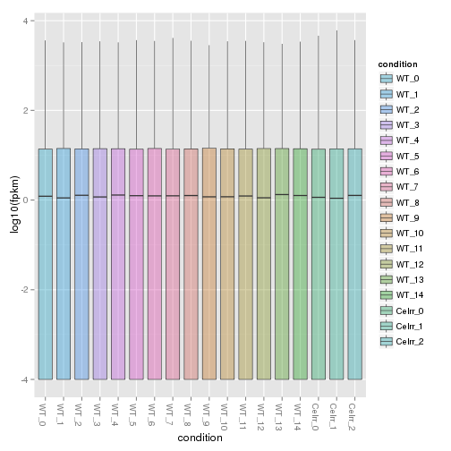 

Boxplot (isoforms)

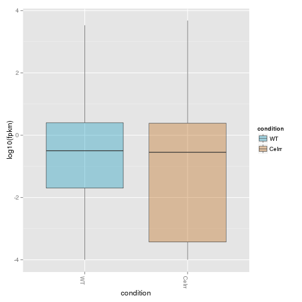 

Boxplot (isoforms, replicates)

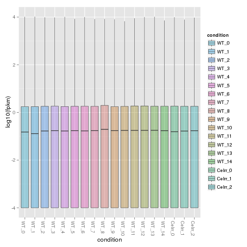 

### Density

Density (genes)

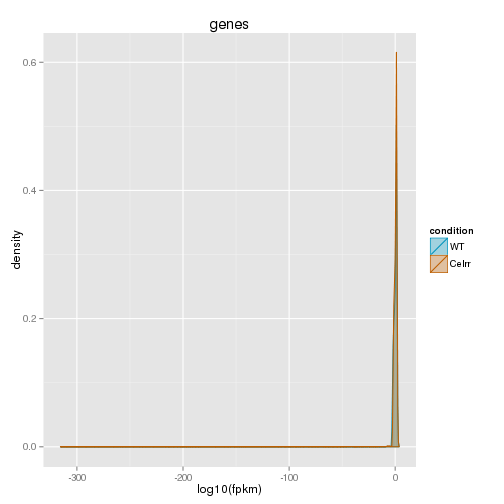 

Density (genes, replicates)

 


## Clustering

### Replicate Clusters
 

```
## 'dendrogram' with 2 branches and 18 members total, at height 0.09197
```

### PCA (genes)
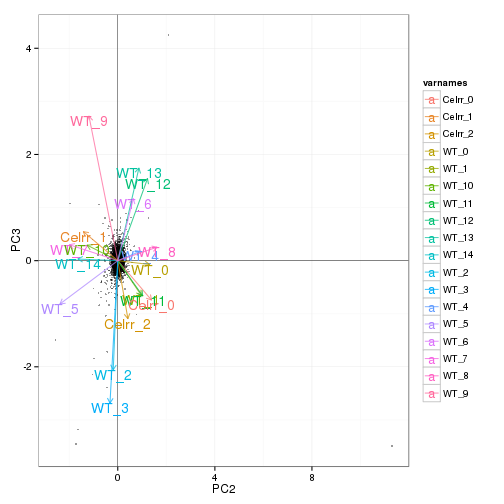 

### MDS (genes)
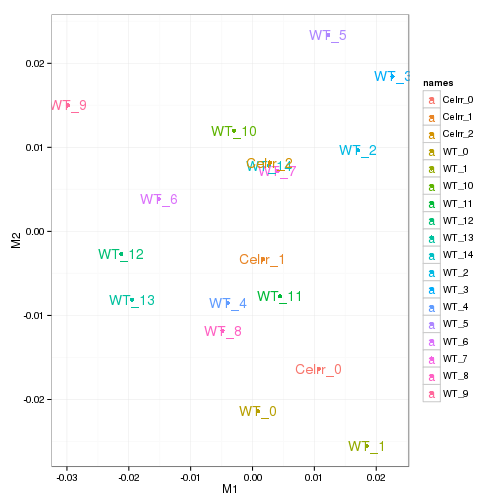 

### Distance Heat Map (genes)
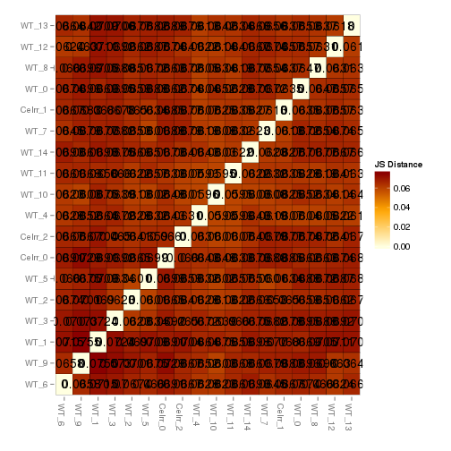 


# KO assessment

## Endogenous lncRNA expression

<!-- html table generated in R 3.0.2 by xtable 1.7-3 package -->
<!-- Mon Jun 16 14:36:15 2014 -->
<TABLE border=1>
<TR> <TH>  </TH> <TH> gene_id </TH> <TH> sample_name </TH> <TH> fpkm </TH> <TH> conf_hi </TH> <TH> conf_lo </TH> <TH> quant_status </TH>  </TR>
  <TR> <TD align="right"> 1 </TD> <TD> ENSMUSG00000097881.1 </TD> <TD> Celrr </TD> <TD align="right"> 0.19 </TD> <TD align="right"> 0.38 </TD> <TD align="right"> 0.01 </TD> <TD> OK </TD> </TR>
  <TR> <TD align="right"> 2 </TD> <TD> ENSMUSG00000097881.1 </TD> <TD> WT </TD> <TD align="right"> 0.39 </TD> <TD align="right"> 0.68 </TD> <TD align="right"> 0.10 </TD> <TD> OK </TD> </TR>
   </TABLE>
<!-- html table generated in R 3.0.2 by xtable 1.7-3 package -->
<!-- Mon Jun 16 14:36:15 2014 -->
<TABLE border=1>
<TR> <TH>  </TH> <TH> isoform_id </TH> <TH> sample_name </TH> <TH> fpkm </TH> <TH> conf_hi </TH> <TH> conf_lo </TH> <TH> quant_status </TH>  </TR>
  <TR> <TD align="right"> 1 </TD> <TD> ENSMUST00000181183.1 </TD> <TD> Celrr </TD> <TD align="right"> 0.00 </TD> <TD align="right"> 0.05 </TD> <TD align="right"> 0.00 </TD> <TD> OK </TD> </TR>
  <TR> <TD align="right"> 2 </TD> <TD> ENSMUST00000181433.1 </TD> <TD> Celrr </TD> <TD align="right"> 0.19 </TD> <TD align="right"> 0.37 </TD> <TD align="right"> 0.02 </TD> <TD> OK </TD> </TR>
  <TR> <TD align="right"> 3 </TD> <TD> ENSMUST00000181183.1 </TD> <TD> WT </TD> <TD align="right"> 0.09 </TD> <TD align="right"> 0.26 </TD> <TD align="right"> 0.00 </TD> <TD> OK </TD> </TR>
  <TR> <TD align="right"> 4 </TD> <TD> ENSMUST00000181433.1 </TD> <TD> WT </TD> <TD align="right"> 0.30 </TD> <TD align="right"> 0.56 </TD> <TD align="right"> 0.05 </TD> <TD> OK </TD> </TR>
   </TABLE>
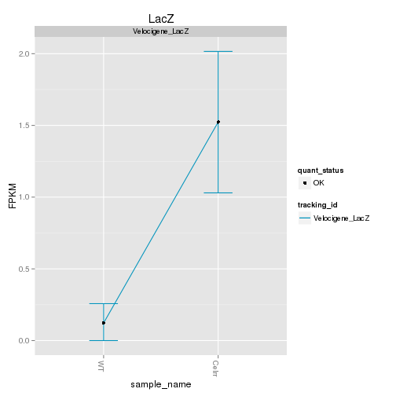 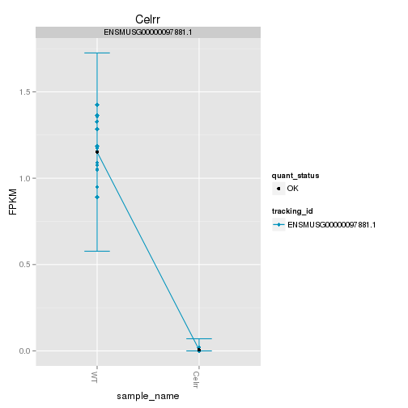 

Endogenous expression of Celrr isoforms:

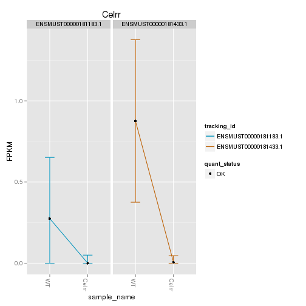 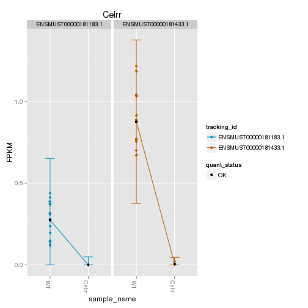 

Barplot of gene expression:

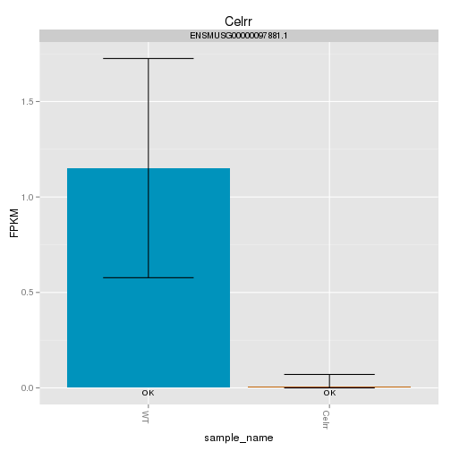 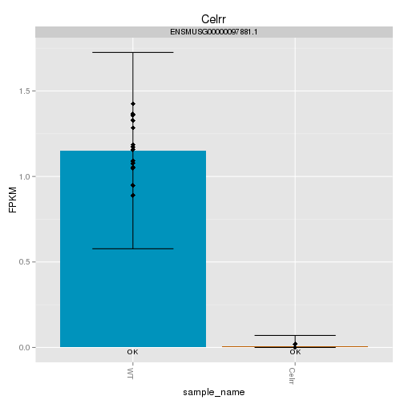 

Barplot of isoform expression:

 


## LacZ expression

<!-- html table generated in R 3.0.2 by xtable 1.7-3 package -->
<!-- Mon Jun 16 14:36:26 2014 -->
<TABLE border=1>
<TR> <TH>  </TH> <TH> gene_id </TH> <TH> sample_name </TH> <TH> fpkm </TH> <TH> conf_hi </TH> <TH> conf_lo </TH> <TH> quant_status </TH>  </TR>
  <TR> <TD align="right"> 1 </TD> <TD> Velocigene_LacZ </TD> <TD> Celrr </TD> <TD align="right"> 2.71 </TD> <TD align="right"> 3.80 </TD> <TD align="right"> 1.61 </TD> <TD> OK </TD> </TR>
  <TR> <TD align="right"> 2 </TD> <TD> Velocigene_LacZ </TD> <TD> WT </TD> <TD align="right"> 0.02 </TD> <TD align="right"> 0.06 </TD> <TD align="right"> 0.00 </TD> <TD> OK </TD> </TR>
   </TABLE>
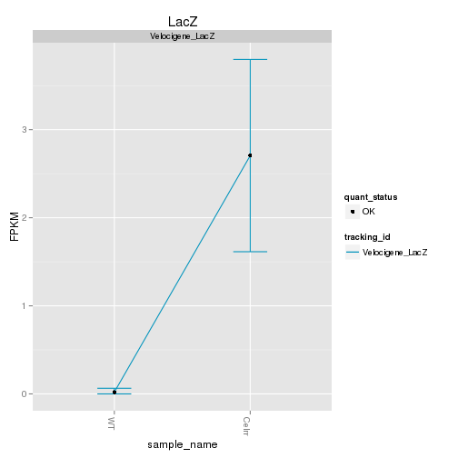 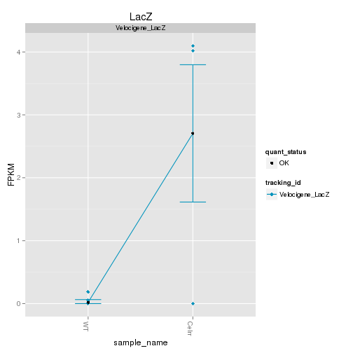 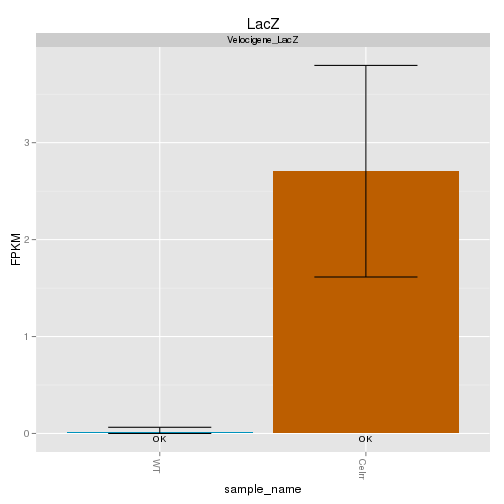 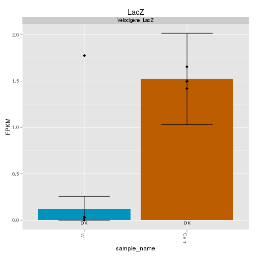 


## Digital Genotyping (LacZ vs Endogenous lncRNA and Sex)
Expression plot (endogenous linc, lacZ, Y-expressed gene):


```
## Scale for 'colour' is already present. Adding another scale for 'colour', which will replace the existing scale.
## ymax not defined: adjusting position using y instead
```

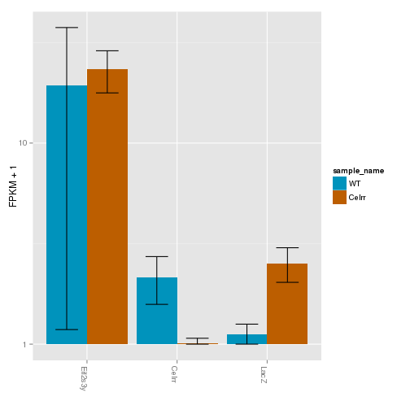 

Expression heatmap:

```
## Using tracking_id, rep_name as id variables
## No id variables; using all as measure variables
```

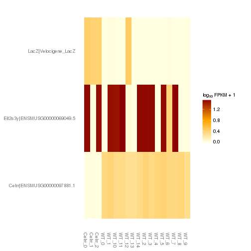 

# Differential Analysis

## Differential Genes 


There are 207 significantly differentially expressed genes. They are:

<!-- html table generated in R 3.0.2 by xtable 1.7-3 package -->
<!-- Mon Jun 16 14:36:40 2014 -->
<TABLE border=1>
<TR> <TH>  </TH> <TH> geneAnnot$gene_short_name </TH>  </TR>
  <TR> <TD align="right"> 1 </TD> <TD> Ngfr </TD> </TR>
  <TR> <TD align="right"> 2 </TD> <TD> Col6a1 </TD> </TR>
  <TR> <TD align="right"> 3 </TD> <TD> Zmat2 </TD> </TR>
  <TR> <TD align="right"> 4 </TD> <TD> Col1a1 </TD> </TR>
  <TR> <TD align="right"> 5 </TD> <TD> Evx2 </TD> </TR>
  <TR> <TD align="right"> 6 </TD> <TD> Pax2 </TD> </TR>
  <TR> <TD align="right"> 7 </TD> <TD> Pax3 </TD> </TR>
  <TR> <TD align="right"> 8 </TD> <TD> Polr2a </TD> </TR>
  <TR> <TD align="right"> 9 </TD> <TD> Corin </TD> </TR>
  <TR> <TD align="right"> 10 </TD> <TD> Nid1 </TD> </TR>
  <TR> <TD align="right"> 11 </TD> <TD> Mef2c </TD> </TR>
  <TR> <TD align="right"> 12 </TD> <TD> Pvalb </TD> </TR>
  <TR> <TD align="right"> 13 </TD> <TD> Trh </TD> </TR>
  <TR> <TD align="right"> 14 </TD> <TD> Rplp1 </TD> </TR>
  <TR> <TD align="right"> 15 </TD> <TD> Ubc </TD> </TR>
  <TR> <TD align="right"> 16 </TD> <TD> Dynll1 </TD> </TR>
  <TR> <TD align="right"> 17 </TD> <TD> Ebf3 </TD> </TR>
  <TR> <TD align="right"> 18 </TD> <TD> Phox2b </TD> </TR>
  <TR> <TD align="right"> 19 </TD> <TD> Bcas1 </TD> </TR>
  <TR> <TD align="right"> 20 </TD> <TD> Cad </TD> </TR>
  <TR> <TD align="right"> 21 </TD> <TD> Gata2 </TD> </TR>
  <TR> <TD align="right"> 22 </TD> <TD> Hspa8 </TD> </TR>
  <TR> <TD align="right"> 23 </TD> <TD> Sulf1 </TD> </TR>
  <TR> <TD align="right"> 24 </TD> <TD> Lhx1 </TD> </TR>
  <TR> <TD align="right"> 25 </TD> <TD> Dync1h1 </TD> </TR>
  <TR> <TD align="right"> 26 </TD> <TD> Slc16a10 </TD> </TR>
  <TR> <TD align="right"> 27 </TD> <TD> Lama2 </TD> </TR>
  <TR> <TD align="right"> 28 </TD> <TD> Rfx4 </TD> </TR>
  <TR> <TD align="right"> 29 </TD> <TD> Meis1 </TD> </TR>
  <TR> <TD align="right"> 30 </TD> <TD> Col6a2 </TD> </TR>
  <TR> <TD align="right"> 31 </TD> <TD> Aebp1 </TD> </TR>
  <TR> <TD align="right"> 32 </TD> <TD> Fam49a </TD> </TR>
  <TR> <TD align="right"> 33 </TD> <TD> Ntn1 </TD> </TR>
  <TR> <TD align="right"> 34 </TD> <TD> Smoc1 </TD> </TR>
  <TR> <TD align="right"> 35 </TD> <TD> Vsx2 </TD> </TR>
  <TR> <TD align="right"> 36 </TD> <TD> Esrrb </TD> </TR>
  <TR> <TD align="right"> 37 </TD> <TD> Tfap2a </TD> </TR>
  <TR> <TD align="right"> 38 </TD> <TD> Ptch1 </TD> </TR>
  <TR> <TD align="right"> 39 </TD> <TD> Msx2 </TD> </TR>
  <TR> <TD align="right"> 40 </TD> <TD> Cxcl14 </TD> </TR>
  <TR> <TD align="right"> 41 </TD> <TD> Irx4 </TD> </TR>
  <TR> <TD align="right"> 42 </TD> <TD> Ebf2 </TD> </TR>
  <TR> <TD align="right"> 43 </TD> <TD> Psmb5 </TD> </TR>
  <TR> <TD align="right"> 44 </TD> <TD> Npr3 </TD> </TR>
  <TR> <TD align="right"> 45 </TD> <TD> Skor1 </TD> </TR>
  <TR> <TD align="right"> 46 </TD> <TD> Sla </TD> </TR>
  <TR> <TD align="right"> 47 </TD> <TD> Col2a1 </TD> </TR>
  <TR> <TD align="right"> 48 </TD> <TD> Plec </TD> </TR>
  <TR> <TD align="right"> 49 </TD> <TD> Prkdc </TD> </TR>
  <TR> <TD align="right"> 50 </TD> <TD> Clic6 </TD> </TR>
  <TR> <TD align="right"> 51 </TD> <TD> Wnt1 </TD> </TR>
  <TR> <TD align="right"> 52 </TD> <TD> Sncg </TD> </TR>
  <TR> <TD align="right"> 53 </TD> <TD> Prph </TD> </TR>
  <TR> <TD align="right"> 54 </TD> <TD> Tiam2 </TD> </TR>
  <TR> <TD align="right"> 55 </TD> <TD> Igf2r </TD> </TR>
  <TR> <TD align="right"> 56 </TD> <TD> Pla2g7 </TD> </TR>
  <TR> <TD align="right"> 57 </TD> <TD> Slc5a7 </TD> </TR>
  <TR> <TD align="right"> 58 </TD> <TD> Prss41 </TD> </TR>
  <TR> <TD align="right"> 59 </TD> <TD> Megf10 </TD> </TR>
  <TR> <TD align="right"> 60 </TD> <TD> Fbn2 </TD> </TR>
  <TR> <TD align="right"> 61 </TD> <TD> Rps14 </TD> </TR>
  <TR> <TD align="right"> 62 </TD> <TD> Slit1 </TD> </TR>
  <TR> <TD align="right"> 63 </TD> <TD> Bhlhe22 </TD> </TR>
  <TR> <TD align="right"> 64 </TD> <TD> Lbx1 </TD> </TR>
  <TR> <TD align="right"> 65 </TD> <TD> Rps24 </TD> </TR>
  <TR> <TD align="right"> 66 </TD> <TD> Msx3 </TD> </TR>
  <TR> <TD align="right"> 67 </TD> <TD> Tfap2b </TD> </TR>
  <TR> <TD align="right"> 68 </TD> <TD> Sumo1 </TD> </TR>
  <TR> <TD align="right"> 69 </TD> <TD> Col5a2 </TD> </TR>
  <TR> <TD align="right"> 70 </TD> <TD> Col3a1 </TD> </TR>
  <TR> <TD align="right"> 71 </TD> <TD> Fn1 </TD> </TR>
  <TR> <TD align="right"> 72 </TD> <TD> Lhx4 </TD> </TR>
  <TR> <TD align="right"> 73 </TD> <TD> Lamc1 </TD> </TR>
  <TR> <TD align="right"> 74 </TD> <TD> Col5a1 </TD> </TR>
  <TR> <TD align="right"> 75 </TD> <TD> Lamc3 </TD> </TR>
  <TR> <TD align="right"> 76 </TD> <TD> Notch1 </TD> </TR>
  <TR> <TD align="right"> 77 </TD> <TD> Lrp2 </TD> </TR>
  <TR> <TD align="right"> 78 </TD> <TD> Fbn1 </TD> </TR>
  <TR> <TD align="right"> 79 </TD> <TD> Lamp5 </TD> </TR>
  <TR> <TD align="right"> 80 </TD> <TD> Notch2 </TD> </TR>
  <TR> <TD align="right"> 81 </TD> <TD> Sfrp2 </TD> </TR>
  <TR> <TD align="right"> 82 </TD> <TD> Rps3a1 </TD> </TR>
  <TR> <TD align="right"> 83 </TD> <TD> Rps20 </TD> </TR>
  <TR> <TD align="right"> 84 </TD> <TD> Tnc </TD> </TR>
  <TR> <TD align="right"> 85 </TD> <TD> Tal2 </TD> </TR>
  <TR> <TD align="right"> 86 </TD> <TD> Col9a2 </TD> </TR>
  <TR> <TD align="right"> 87 </TD> <TD> Dmbx1 </TD> </TR>
  <TR> <TD align="right"> 88 </TD> <TD> Slc30a3 </TD> </TR>
  <TR> <TD align="right"> 89 </TD> <TD> Uncx </TD> </TR>
  <TR> <TD align="right"> 90 </TD> <TD> Col1a2 </TD> </TR>
  <TR> <TD align="right"> 91 </TD> <TD> Dync1i1 </TD> </TR>
  <TR> <TD align="right"> 92 </TD> <TD> Lrig1 </TD> </TR>
  <TR> <TD align="right"> 93 </TD> <TD> A2m </TD> </TR>
  <TR> <TD align="right"> 94 </TD> <TD> Dbx1 </TD> </TR>
  <TR> <TD align="right"> 95 </TD> <TD> Fgf3 </TD> </TR>
  <TR> <TD align="right"> 96 </TD> <TD> Col4a6 </TD> </TR>
  <TR> <TD align="right"> 97 </TD> <TD> Col4a5 </TD> </TR>
  <TR> <TD align="right"> 98 </TD> <TD> Slit2 </TD> </TR>
  <TR> <TD align="right"> 99 </TD> <TD> Irx3 </TD> </TR>
  <TR> <TD align="right"> 100 </TD> <TD> Irx5 </TD> </TR>
  <TR> <TD align="right"> 101 </TD> <TD> Hsd11b2 </TD> </TR>
  <TR> <TD align="right"> 102 </TD> <TD> Tbx20 </TD> </TR>
  <TR> <TD align="right"> 103 </TD> <TD> Thy1 </TD> </TR>
  <TR> <TD align="right"> 104 </TD> <TD> Robo3 </TD> </TR>
  <TR> <TD align="right"> 105 </TD> <TD> Crabp1 </TD> </TR>
  <TR> <TD align="right"> 106 </TD> <TD> Cox7a2 </TD> </TR>
  <TR> <TD align="right"> 107 </TD> <TD> Lama1 </TD> </TR>
  <TR> <TD align="right"> 108 </TD> <TD> Ptpn13 </TD> </TR>
  <TR> <TD align="right"> 109 </TD> <TD> Lrrn1 </TD> </TR>
  <TR> <TD align="right"> 110 </TD> <TD> Fras1 </TD> </TR>
  <TR> <TD align="right"> 111 </TD> <TD> Eif2s3x </TD> </TR>
  <TR> <TD align="right"> 112 </TD> <TD> Nkx6-1 </TD> </TR>
  <TR> <TD align="right"> 113 </TD> <TD> Rpl39-ps </TD> </TR>
  <TR> <TD align="right"> 114 </TD> <TD> Prss56 </TD> </TR>
  <TR> <TD align="right"> 115 </TD> <TD> Kirrel2 </TD> </TR>
  <TR> <TD align="right"> 116 </TD> <TD> Frem2 </TD> </TR>
  <TR> <TD align="right"> 117 </TD> <TD> Neurod6 </TD> </TR>
  <TR> <TD align="right"> 118 </TD> <TD> Notch3 </TD> </TR>
  <TR> <TD align="right"> 119 </TD> <TD> Spon1 </TD> </TR>
  <TR> <TD align="right"> 120 </TD> <TD> Neurod2 </TD> </TR>
  <TR> <TD align="right"> 121 </TD> <TD> Satb2 </TD> </TR>
  <TR> <TD align="right"> 122 </TD> <TD> Hoxb4 </TD> </TR>
  <TR> <TD align="right"> 123 </TD> <TD> Lmx1b </TD> </TR>
  <TR> <TD align="right"> 124 </TD> <TD> Zfp503 </TD> </TR>
  <TR> <TD align="right"> 125 </TD> <TD> En2 </TD> </TR>
  <TR> <TD align="right"> 126 </TD> <TD> Pcsk1n </TD> </TR>
  <TR> <TD align="right"> 127 </TD> <TD> Slc6a5 </TD> </TR>
  <TR> <TD align="right"> 128 </TD> <TD> Nxph4 </TD> </TR>
  <TR> <TD align="right"> 129 </TD> <TD> Daam2 </TD> </TR>
  <TR> <TD align="right"> 130 </TD> <TD> Tlx3 </TD> </TR>
  <TR> <TD align="right"> 131 </TD> <TD> Npnt </TD> </TR>
  <TR> <TD align="right"> 132 </TD> <TD> Chd7 </TD> </TR>
  <TR> <TD align="right"> 133 </TD> <TD> Nkx6-2 </TD> </TR>
  <TR> <TD align="right"> 134 </TD> <TD> Mpped1 </TD> </TR>
  <TR> <TD align="right"> 135 </TD> <TD> Tbca </TD> </TR>
  <TR> <TD align="right"> 136 </TD> <TD> Rassf4 </TD> </TR>
  <TR> <TD align="right"> 137 </TD> <TD> Shfm1 </TD> </TR>
  <TR> <TD align="right"> 138 </TD> <TD> Tuba1c </TD> </TR>
  <TR> <TD align="right"> 139 </TD> <TD> Rpl7 </TD> </TR>
  <TR> <TD align="right"> 140 </TD> <TD> BC024139 </TD> </TR>
  <TR> <TD align="right"> 141 </TD> <TD> Gm9493 </TD> </TR>
  <TR> <TD align="right"> 142 </TD> <TD> Acp1 </TD> </TR>
  <TR> <TD align="right"> 143 </TD> <TD> Cnpy1 </TD> </TR>
  <TR> <TD align="right"> 144 </TD> <TD> Rpl18a </TD> </TR>
  <TR> <TD align="right"> 145 </TD> <TD> Cenpe </TD> </TR>
  <TR> <TD align="right"> 146 </TD> <TD> Penk </TD> </TR>
  <TR> <TD align="right"> 147 </TD> <TD> Dync2h1 </TD> </TR>
  <TR> <TD align="right"> 148 </TD> <TD> Dynlrb1 </TD> </TR>
  <TR> <TD align="right"> 149 </TD> <TD> Fgfbp3 </TD> </TR>
  <TR> <TD align="right"> 150 </TD> <TD> Rpsa-ps10 </TD> </TR>
  <TR> <TD align="right"> 151 </TD> <TD> Pirt </TD> </TR>
  <TR> <TD align="right"> 152 </TD> <TD> Gm9843 </TD> </TR>
  <TR> <TD align="right"> 153 </TD> <TD> Gm8394 </TD> </TR>
  <TR> <TD align="right"> 154 </TD> <TD> Hbb-y </TD> </TR>
  <TR> <TD align="right"> 155 </TD> <TD> Hbb-bh1 </TD> </TR>
  <TR> <TD align="right"> 156 </TD> <TD> Lamb2 </TD> </TR>
  <TR> <TD align="right"> 157 </TD> <TD> C130021I20Rik </TD> </TR>
  <TR> <TD align="right"> 158 </TD> <TD> Sox14 </TD> </TR>
  <TR> <TD align="right"> 159 </TD> <TD> Hba-x </TD> </TR>
  <TR> <TD align="right"> 160 </TD> <TD> Dach1 </TD> </TR>
  <TR> <TD align="right"> 161 </TD> <TD> Myh8 </TD> </TR>
  <TR> <TD align="right"> 162 </TD> <TD> Col8a2 </TD> </TR>
  <TR> <TD align="right"> 163 </TD> <TD> Ebf1 </TD> </TR>
  <TR> <TD align="right"> 164 </TD> <TD> Mab21l2 </TD> </TR>
  <TR> <TD align="right"> 165 </TD> <TD> Rpl32 </TD> </TR>
  <TR> <TD align="right"> 166 </TD> <TD> Gm5148 </TD> </TR>
  <TR> <TD align="right"> 167 </TD> <TD> Espl1 </TD> </TR>
  <TR> <TD align="right"> 168 </TD> <TD> Znrf2 </TD> </TR>
  <TR> <TD align="right"> 169 </TD> <TD> Gda </TD> </TR>
  <TR> <TD align="right"> 170 </TD> <TD> En1 </TD> </TR>
  <TR> <TD align="right"> 171 </TD> <TD> Unc5c </TD> </TR>
  <TR> <TD align="right"> 172 </TD> <TD> Gm10073 </TD> </TR>
  <TR> <TD align="right"> 173 </TD> <TD> Alox5ap </TD> </TR>
  <TR> <TD align="right"> 174 </TD> <TD> Dcc </TD> </TR>
  <TR> <TD align="right"> 175 </TD> <TD> Rpl26 </TD> </TR>
  <TR> <TD align="right"> 176 </TD> <TD> Irx1 </TD> </TR>
  <TR> <TD align="right"> 177 </TD> <TD> Rps7 </TD> </TR>
  <TR> <TD align="right"> 178 </TD> <TD> Rps12 </TD> </TR>
  <TR> <TD align="right"> 179 </TD> <TD> Rpl17 </TD> </TR>
  <TR> <TD align="right"> 180 </TD> <TD> Rpl35 </TD> </TR>
  <TR> <TD align="right"> 181 </TD> <TD> Cyp26b1 </TD> </TR>
  <TR> <TD align="right"> 182 </TD> <TD> Zbtb18 </TD> </TR>
  <TR> <TD align="right"> 183 </TD> <TD> Gm8730 </TD> </TR>
  <TR> <TD align="right"> 184 </TD> <TD> Uqcrh </TD> </TR>
  <TR> <TD align="right"> 185 </TD> <TD> Slc4a5 </TD> </TR>
  <TR> <TD align="right"> 186 </TD> <TD> Flnc </TD> </TR>
  <TR> <TD align="right"> 187 </TD> <TD> Gm10250 </TD> </TR>
  <TR> <TD align="right"> 188 </TD> <TD> Gm10275 </TD> </TR>
  <TR> <TD align="right"> 189 </TD> <TD> Fat1 </TD> </TR>
  <TR> <TD align="right"> 190 </TD> <TD> Gm10288 </TD> </TR>
  <TR> <TD align="right"> 191 </TD> <TD> Rpl23 </TD> </TR>
  <TR> <TD align="right"> 192 </TD> <TD> Atoh1 </TD> </TR>
  <TR> <TD align="right"> 193 </TD> <TD> Myeov2 </TD> </TR>
  <TR> <TD align="right"> 194 </TD> <TD> Hbb-bt </TD> </TR>
  <TR> <TD align="right"> 195 </TD> <TD> Rpl23a-ps3 </TD> </TR>
  <TR> <TD align="right"> 196 </TD> <TD> Gm2000 </TD> </TR>
  <TR> <TD align="right"> 197 </TD> <TD> Abracl </TD> </TR>
  <TR> <TD align="right"> 198 </TD> <TD> Rpl39 </TD> </TR>
  <TR> <TD align="right"> 199 </TD> <TD> Fzd10 </TD> </TR>
  <TR> <TD align="right"> 200 </TD> <TD> Gm12688 </TD> </TR>
  <TR> <TD align="right"> 201 </TD> <TD> 1500016L03Rik </TD> </TR>
  <TR> <TD align="right"> 202 </TD> <TD> Vgll3 </TD> </TR>
  <TR> <TD align="right"> 203 </TD> <TD> Skor2 </TD> </TR>
  <TR> <TD align="right"> 204 </TD> <TD> AA465934 </TD> </TR>
  <TR> <TD align="right"> 205 </TD> <TD> Rpl41 </TD> </TR>
  <TR> <TD align="right"> 206 </TD> <TD> Lhx8 </TD> </TR>
  <TR> <TD align="right"> 207 </TD> <TD> Gm19980 </TD> </TR>
   </TABLE>

### Matrix of gene significant differences between conditions

(skip for Brainmap wt-v-ko comparisons)

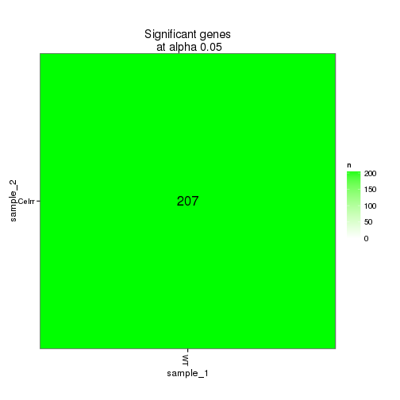 

### Significant gene expression differences between conditions

Expression plot (genes):
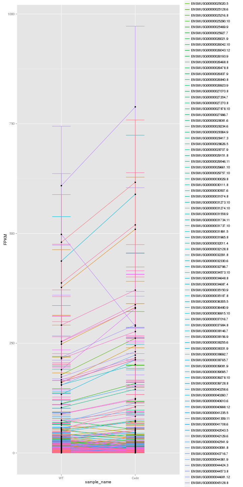 

```
## Using tracking_id, rep_name as id variables
## No id variables; using all as measure variables
```

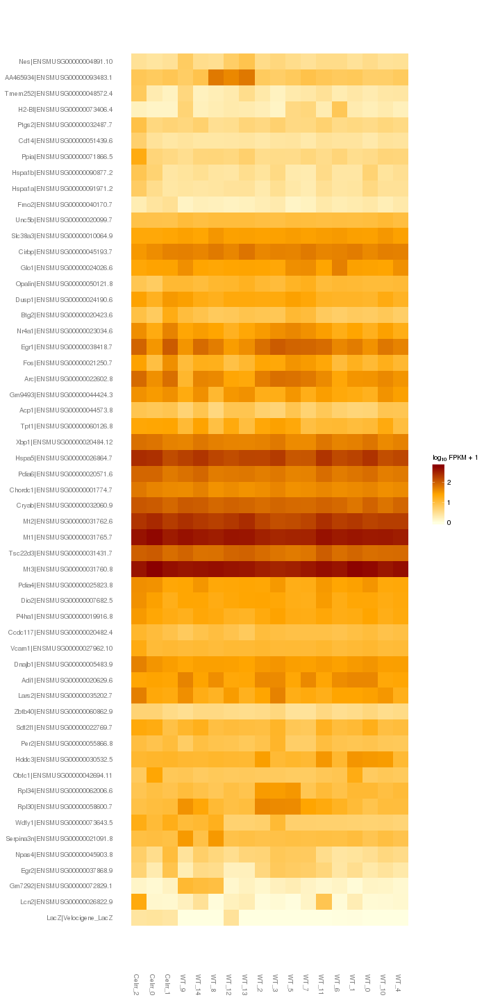 

Significant genes with expression >50fpkm (any condition):

```
## Using tracking_id, sample_name as id variables
```

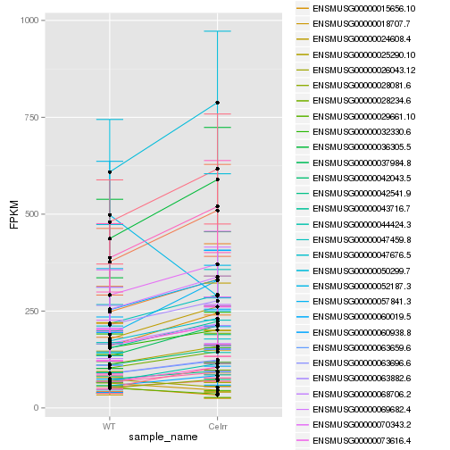 

An individual look at each of the highly expressed significantly differentially regulated genes:
(eval=false for first pass)


### Expression-level/significance relationship

Scatter plot of significant genes only:

```
## Using tracking_id, sample_name as id variables
```

```
## Error: One or more values of 'x' or 'y' are not valid sample names!
```

Volcano plot with significant genes only:

```
## Error: One or more values of 'x' or 'y' are not valid sample names!
```


## Differential Splicing

### Differential Isoforms between conditions
Per isoform difference between conditions:
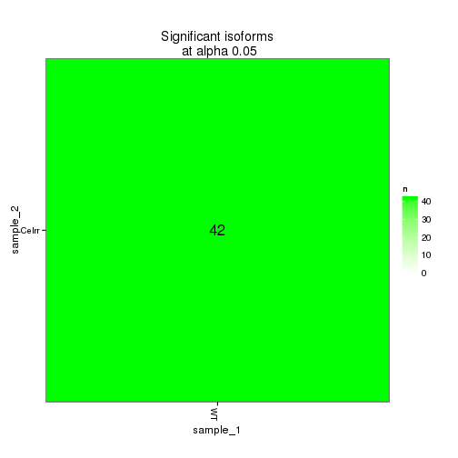 

These isoforms are:

```
## Error: no applicable method for 'xtable' applied to an object of class
## "character"
```


```
## Using tracking_id, rep_name as id variables
```

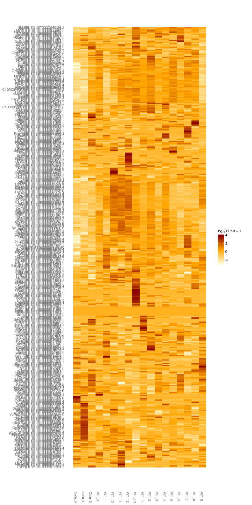 

### Differential Splicing between conditions

(eval false for first pass)

Per condition differences in isoforms (Does gene have diff piechart between conditions?)


These genes are:


Splicing heatmap by isoform:


Splicing heatmap by gene


The following are significantly differentially spliced genes (relative portion of isoform per condition): 


 


# Gene/Pathway Analysis

## GSEA


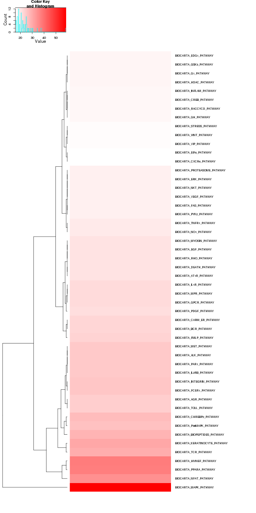 

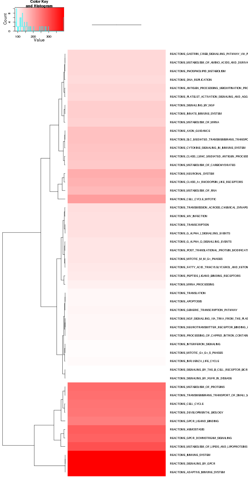 

## GO enrichment 
Cluster profiler used to call enichments of significantly differentially regulated genes that map to Entrez IDs. 

Description/explanation of what's here, and justify all choices. 


biomart to get entrez gene IDS
clusterProfiler does GO enrichment 

BP, MF, CC
enrichKEGG
enrichPathway


```
## 
## KEGG.db contains mappings based on older data because the original
##   resource was removed from the the public domain before the most
##   recent update was produced. This package should now be
##   considered deprecated and future versions of Bioconductor may
##   not have it available.  Users who want more current data are
##   encouraged to look at the KEGGREST or reactome.db packages
## 
## Loading required package: biomaRt
## 
## Attaching package: 'biomaRt'
## 
## The following object is masked from 'package:cummeRbund':
## 
##     getGene
## 
## Loading required package: org.Mm.eg.db
## 
## Loading required package: GO.db
```

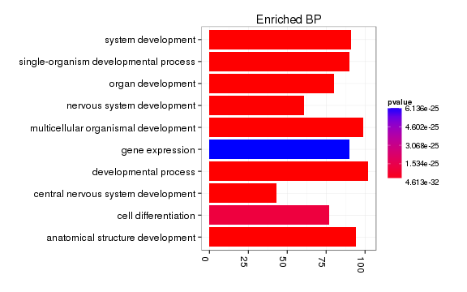 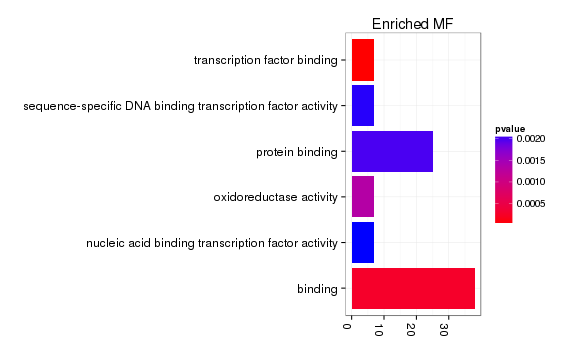 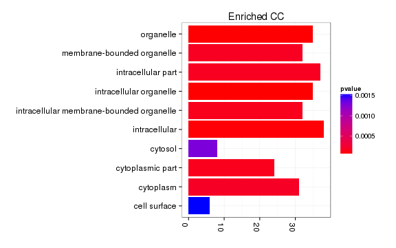 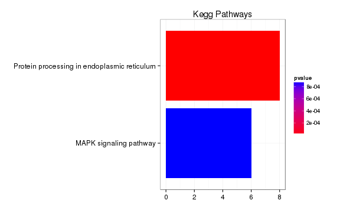 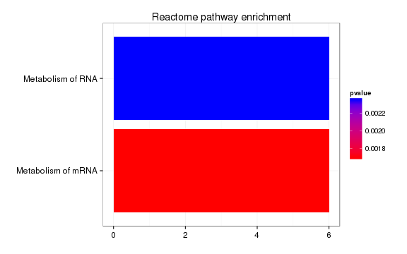 

# Cis vs Trans (locally)


# Notes

## Samples used are:
<!-- html table generated in R 3.0.2 by xtable 1.7-3 package -->
<!-- Mon Jun 16 14:40:34 2014 -->
<TABLE border=1>
<TR> <TH>  </TH> <TH> 10 </TH>  </TR>
  <TR> <TD align="right"> 1 </TD> <TD> JR753 </TD> </TR>
  <TR> <TD align="right"> 2 </TD> <TD> JR750 </TD> </TR>
  <TR> <TD align="right"> 3 </TD> <TD> JR771 </TD> </TR>
  <TR> <TD align="right"> 4 </TD> <TD> JR755 </TD> </TR>
  <TR> <TD align="right"> 5 </TD> <TD> JR811 </TD> </TR>
  <TR> <TD align="right"> 6 </TD> <TD> JR768 </TD> </TR>
  <TR> <TD align="right"> 7 </TD> <TD> JR761 </TD> </TR>
  <TR> <TD align="right"> 8 </TD> <TD> JR815 </TD> </TR>
  <TR> <TD align="right"> 9 </TD> <TD> JR789 </TD> </TR>
  <TR> <TD align="right"> 10 </TD> <TD> JR748 </TD> </TR>
  <TR> <TD align="right"> 11 </TD> <TD> JR716 </TD> </TR>
  <TR> <TD align="right"> 12 </TD> <TD> JR717 </TD> </TR>
  <TR> <TD align="right"> 13 </TD> <TD> JR719 </TD> </TR>
  <TR> <TD align="right"> 14 </TD> <TD> JR791 </TD> </TR>
  <TR> <TD align="right"> 15 </TD> <TD> JR756 </TD> </TR>
  <TR> <TD align="right"> 16 </TD> <TD> JR769 </TD> </TR>
  <TR> <TD align="right"> 17 </TD> <TD> JR773 </TD> </TR>
  <TR> <TD align="right"> 18 </TD> <TD> JR760 </TD> </TR>
   </TABLE>

## Replicates
<!-- html table generated in R 3.0.2 by xtable 1.7-3 package -->
<!-- Mon Jun 16 14:40:34 2014 -->
<TABLE border=1>
<TR> <TH>  </TH> <TH> file </TH> <TH> sample_name </TH> <TH> replicate </TH> <TH> rep_name </TH> <TH> total_mass </TH> <TH> norm_mass </TH> <TH> internal_scale </TH> <TH> external_scale </TH>  </TR>
  <TR> <TD align="right"> 1 </TD> <TD> /n/rinn_data1/seq/lgoff/Projects/BrainMap/data/quants/JR753/abundances.cxb </TD> <TD> WT </TD> <TD align="right">   0 </TD> <TD> WT_0 </TD> <TD align="right"> 39343800.00 </TD> <TD align="right"> 30542000.00 </TD> <TD align="right"> 1.34 </TD> <TD align="right"> 1.00 </TD> </TR>
  <TR> <TD align="right"> 2 </TD> <TD> /n/rinn_data1/seq/lgoff/Projects/BrainMap/data/quants/JR750/abundances.cxb </TD> <TD> WT </TD> <TD align="right">   1 </TD> <TD> WT_1 </TD> <TD align="right"> 36041100.00 </TD> <TD align="right"> 30542000.00 </TD> <TD align="right"> 1.16 </TD> <TD align="right"> 1.00 </TD> </TR>
  <TR> <TD align="right"> 3 </TD> <TD> /n/rinn_data1/seq/lgoff/Projects/BrainMap/data/quants/JR771/abundances.cxb </TD> <TD> WT </TD> <TD align="right">   2 </TD> <TD> WT_2 </TD> <TD align="right"> 38877000.00 </TD> <TD align="right"> 30542000.00 </TD> <TD align="right"> 1.30 </TD> <TD align="right"> 1.00 </TD> </TR>
  <TR> <TD align="right"> 4 </TD> <TD> /n/rinn_data1/seq/lgoff/Projects/BrainMap/data/quants/JR755/abundances.cxb </TD> <TD> WT </TD> <TD align="right">   3 </TD> <TD> WT_3 </TD> <TD align="right"> 41822800.00 </TD> <TD align="right"> 30542000.00 </TD> <TD align="right"> 1.36 </TD> <TD align="right"> 1.00 </TD> </TR>
  <TR> <TD align="right"> 5 </TD> <TD> /n/rinn_data1/seq/lgoff/Projects/BrainMap/data/quants/JR811/abundances.cxb </TD> <TD> WT </TD> <TD align="right">   4 </TD> <TD> WT_4 </TD> <TD align="right"> 38186700.00 </TD> <TD align="right"> 30542000.00 </TD> <TD align="right"> 1.28 </TD> <TD align="right"> 1.00 </TD> </TR>
  <TR> <TD align="right"> 6 </TD> <TD> /n/rinn_data1/seq/lgoff/Projects/BrainMap/data/quants/JR768/abundances.cxb </TD> <TD> WT </TD> <TD align="right">   5 </TD> <TD> WT_5 </TD> <TD align="right"> 28382500.00 </TD> <TD align="right"> 30542000.00 </TD> <TD align="right"> 0.95 </TD> <TD align="right"> 1.00 </TD> </TR>
  <TR> <TD align="right"> 7 </TD> <TD> /n/rinn_data1/seq/lgoff/Projects/BrainMap/data/quants/JR761/abundances.cxb </TD> <TD> WT </TD> <TD align="right">   6 </TD> <TD> WT_6 </TD> <TD align="right"> 31711800.00 </TD> <TD align="right"> 30542000.00 </TD> <TD align="right"> 1.03 </TD> <TD align="right"> 1.00 </TD> </TR>
  <TR> <TD align="right"> 8 </TD> <TD> /n/rinn_data1/seq/lgoff/Projects/BrainMap/data/quants/JR815/abundances.cxb </TD> <TD> WT </TD> <TD align="right">   7 </TD> <TD> WT_7 </TD> <TD align="right"> 29744300.00 </TD> <TD align="right"> 30542000.00 </TD> <TD align="right"> 0.98 </TD> <TD align="right"> 1.00 </TD> </TR>
  <TR> <TD align="right"> 9 </TD> <TD> /n/rinn_data1/seq/lgoff/Projects/BrainMap/data/quants/JR789/abundances.cxb </TD> <TD> WT </TD> <TD align="right">   8 </TD> <TD> WT_8 </TD> <TD align="right"> 27686600.00 </TD> <TD align="right"> 30542000.00 </TD> <TD align="right"> 0.91 </TD> <TD align="right"> 1.00 </TD> </TR>
  <TR> <TD align="right"> 10 </TD> <TD> /n/rinn_data1/seq/lgoff/Projects/BrainMap/data/quants/JR748/abundances.cxb </TD> <TD> WT </TD> <TD align="right">   9 </TD> <TD> WT_9 </TD> <TD align="right"> 32374600.00 </TD> <TD align="right"> 30542000.00 </TD> <TD align="right"> 1.02 </TD> <TD align="right"> 1.00 </TD> </TR>
  <TR> <TD align="right"> 11 </TD> <TD> /n/rinn_data1/seq/lgoff/Projects/BrainMap/data/quants/JR716/abundances.cxb </TD> <TD> WT </TD> <TD align="right">  10 </TD> <TD> WT_10 </TD> <TD align="right"> 26148700.00 </TD> <TD align="right"> 30542000.00 </TD> <TD align="right"> 0.86 </TD> <TD align="right"> 1.00 </TD> </TR>
  <TR> <TD align="right"> 12 </TD> <TD> /n/rinn_data1/seq/lgoff/Projects/BrainMap/data/quants/JR717/abundances.cxb </TD> <TD> WT </TD> <TD align="right">  11 </TD> <TD> WT_11 </TD> <TD align="right"> 25571500.00 </TD> <TD align="right"> 30542000.00 </TD> <TD align="right"> 0.85 </TD> <TD align="right"> 1.00 </TD> </TR>
  <TR> <TD align="right"> 13 </TD> <TD> /n/rinn_data1/seq/lgoff/Projects/BrainMap/data/quants/JR719/abundances.cxb </TD> <TD> WT </TD> <TD align="right">  12 </TD> <TD> WT_12 </TD> <TD align="right"> 22702200.00 </TD> <TD align="right"> 30542000.00 </TD> <TD align="right"> 0.73 </TD> <TD align="right"> 1.00 </TD> </TR>
  <TR> <TD align="right"> 14 </TD> <TD> /n/rinn_data1/seq/lgoff/Projects/BrainMap/data/quants/JR791/abundances.cxb </TD> <TD> WT </TD> <TD align="right">  13 </TD> <TD> WT_13 </TD> <TD align="right"> 12886300.00 </TD> <TD align="right"> 30542000.00 </TD> <TD align="right"> 0.43 </TD> <TD align="right"> 1.00 </TD> </TR>
  <TR> <TD align="right"> 15 </TD> <TD> /n/rinn_data1/seq/lgoff/Projects/BrainMap/data/quants/JR756/abundances.cxb </TD> <TD> WT </TD> <TD align="right">  14 </TD> <TD> WT_14 </TD> <TD align="right"> 38957200.00 </TD> <TD align="right"> 30542000.00 </TD> <TD align="right"> 1.29 </TD> <TD align="right"> 1.00 </TD> </TR>
  <TR> <TD align="right"> 16 </TD> <TD> /n/rinn_data1/seq/lgoff/Projects/BrainMap/data/quants/JR769/abundances.cxb </TD> <TD> Celrr </TD> <TD align="right">   0 </TD> <TD> Celrr_0 </TD> <TD align="right"> 28552300.00 </TD> <TD align="right"> 30542000.00 </TD> <TD align="right"> 0.93 </TD> <TD align="right"> 1.00 </TD> </TR>
  <TR> <TD align="right"> 17 </TD> <TD> /n/rinn_data1/seq/lgoff/Projects/BrainMap/data/quants/JR773/abundances.cxb </TD> <TD> Celrr </TD> <TD align="right">   1 </TD> <TD> Celrr_1 </TD> <TD align="right"> 37964300.00 </TD> <TD align="right"> 30542000.00 </TD> <TD align="right"> 1.20 </TD> <TD align="right"> 1.00 </TD> </TR>
  <TR> <TD align="right"> 18 </TD> <TD> /n/rinn_data1/seq/lgoff/Projects/BrainMap/data/quants/JR760/abundances.cxb </TD> <TD> Celrr </TD> <TD align="right">   2 </TD> <TD> Celrr_2 </TD> <TD align="right"> 30678400.00 </TD> <TD align="right"> 30542000.00 </TD> <TD align="right"> 1.00 </TD> <TD align="right"> 1.00 </TD> </TR>
   </TABLE>

## Session Info

```
## R version 3.0.2 (2013-09-25)
## Platform: x86_64-unknown-linux-gnu (64-bit)
## 
## locale:
##  [1] LC_CTYPE=en_US.UTF-8       LC_NUMERIC=C              
##  [3] LC_TIME=en_US.UTF-8        LC_COLLATE=en_US.UTF-8    
##  [5] LC_MONETARY=en_US.UTF-8    LC_MESSAGES=en_US.UTF-8   
##  [7] LC_PAPER=en_US.UTF-8       LC_NAME=C                 
##  [9] LC_ADDRESS=C               LC_TELEPHONE=C            
## [11] LC_MEASUREMENT=en_US.UTF-8 LC_IDENTIFICATION=C       
## 
## attached base packages:
## [1] grid      parallel  stats     graphics  grDevices utils     datasets 
## [8] methods   base     
## 
## other attached packages:
##  [1] GO.db_2.10.1           org.Mm.eg.db_2.10.1    clusterProfiler_1.13.1
##  [4] DOSE_2.0.0             ReactomePA_1.6.1       AnnotationDbi_1.24.0  
##  [7] Biobase_2.22.0         mgcv_1.7-29            nlme_3.1-117          
## [10] gridExtra_0.9.1        gtable_0.1.2           marray_1.40.0         
## [13] gplots_2.13.0          GSA_1.03               limma_3.18.13         
## [16] xtable_1.7-3           knitr_1.6              cummeRbund_2.7.2      
## [19] Gviz_1.6.0             rtracklayer_1.22.7     GenomicRanges_1.14.4  
## [22] XVector_0.2.0          IRanges_1.20.7         fastcluster_1.1.13    
## [25] reshape2_1.4           ggplot2_1.0.0          RSQLite_0.11.4        
## [28] DBI_0.2-7              BiocGenerics_0.8.0    
## 
## loaded via a namespace (and not attached):
##  [1] biomaRt_2.18.0         Biostrings_2.30.1      biovizBase_1.10.8     
##  [4] bitops_1.0-6           BSgenome_1.30.0        caTools_1.17          
##  [7] cluster_1.15.2         colorspace_1.2-4       dichromat_2.0-0       
## [10] digest_0.6.4           DO.db_2.7              evaluate_0.5.5        
## [13] formatR_0.10           Formula_1.1-1          gdata_2.13.3          
## [16] GenomicFeatures_1.14.5 GOSemSim_1.20.3        graph_1.40.1          
## [19] graphite_1.8.1         gtools_3.4.1           Hmisc_3.14-4          
## [22] igraph_0.7.1           KEGG.db_2.10.1         KernSmooth_2.23-12    
## [25] labeling_0.2           lattice_0.20-29        latticeExtra_0.6-26   
## [28] markdown_0.7           MASS_7.3-33            Matrix_1.1-3          
## [31] mime_0.1.1             munsell_0.4.2          org.Hs.eg.db_2.10.1   
## [34] plyr_1.8.1             proto_0.3-10           qvalue_1.36.0         
## [37] RColorBrewer_1.0-5     Rcpp_0.11.1            RCurl_1.95-4.1        
## [40] reactome.db_1.46.1     Rsamtools_1.14.3       scales_0.2.4          
## [43] splines_3.0.2          stats4_3.0.2           stringr_0.6.2         
## [46] survival_2.37-7        tcltk_3.0.2            tools_3.0.2           
## [49] XML_3.98-1.1           zlibbioc_1.8.0
```

## Run Info

```
##           param
## 1      cmd_line
## 2       version
## 3  SVN_revision
## 4 boost_version
## 5        genome
##                                                                                                                                                                                                                                                                                                                                                                                                                                                                                                                                                                                                                                                                                                                                                                                                                                                                                                                                                                                                                                                                                                                                                                                                                                                                                                                                                                                                                                                                                                                                                                                                             value
## 1 cuffdiff -p 10 -L WT,Celrr -o /n/rinn_data1/seq/lgoff/Projects/BrainMap/diffs/Celrr_vs_WT_Embryonic /n/rinn_data1/seq/lgoff/Projects/BrainMap/data/annotation/mm10_gencode_vM2_with_lncRNAs_and_LacZ.gtf /n/rinn_data1/seq/lgoff/Projects/BrainMap/data/quants/JR753/abundances.cxb,/n/rinn_data1/seq/lgoff/Projects/BrainMap/data/quants/JR750/abundances.cxb,/n/rinn_data1/seq/lgoff/Projects/BrainMap/data/quants/JR771/abundances.cxb,/n/rinn_data1/seq/lgoff/Projects/BrainMap/data/quants/JR755/abundances.cxb,/n/rinn_data1/seq/lgoff/Projects/BrainMap/data/quants/JR811/abundances.cxb,/n/rinn_data1/seq/lgoff/Projects/BrainMap/data/quants/JR768/abundances.cxb,/n/rinn_data1/seq/lgoff/Projects/BrainMap/data/quants/JR761/abundances.cxb,/n/rinn_data1/seq/lgoff/Projects/BrainMap/data/quants/JR815/abundances.cxb,/n/rinn_data1/seq/lgoff/Projects/BrainMap/data/quants/JR789/abundances.cxb,/n/rinn_data1/seq/lgoff/Projects/BrainMap/data/quants/JR748/abundances.cxb,/n/rinn_data1/seq/lgoff/Projects/BrainMap/data/quants/JR716/abundances.cxb,/n/rinn_data1/seq/lgoff/Projects/BrainMap/data/quants/JR717/abundances.cxb,/n/rinn_data1/seq/lgoff/Projects/BrainMap/data/quants/JR719/abundances.cxb,/n/rinn_data1/seq/lgoff/Projects/BrainMap/data/quants/JR791/abundances.cxb,/n/rinn_data1/seq/lgoff/Projects/BrainMap/data/quants/JR756/abundances.cxb /n/rinn_data1/seq/lgoff/Projects/BrainMap/data/quants/JR769/abundances.cxb,/n/rinn_data1/seq/lgoff/Projects/BrainMap/data/quants/JR773/abundances.cxb,/n/rinn_data1/seq/lgoff/Projects/BrainMap/data/quants/JR760/abundances.cxb 
## 2                                                                                                                                                                                                                                                                                                                                                                                                                                                                                                                                                                                                                                                                                                                                                                                                                                                                                                                                                                                                                                                                                                                                                                                                                                                                                                                                                                                                                                                                                                                                                                                                           2.2.1
## 3                                                                                                                                                                                                                                                                                                                                                                                                                                                                                                                                                                                                                                                                                                                                                                                                                                                                                                                                                                                                                                                                                                                                                                                                                                                                                                                                                                                                                                                                                                                                                                                                            4237
## 4                                                                                                                                                                                                                                                                                                                                                                                                                                                                                                                                                                                                                                                                                                                                                                                                                                                                                                                                                                                                                                                                                                                                                                                                                                                                                                                                                                                                                                                                                                                                                                                                          104700
## 5                                                                                                                                                                                                                                                                                                                                                                                                                                                                                                                                                                                                                                                                                                                                                                                                                                                                                                                                                                                                                                                                                                                                                                                                                                                                                                                                                                                                                                                                                                                                                                                                            mm10
```
