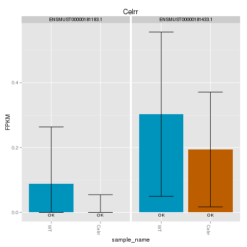
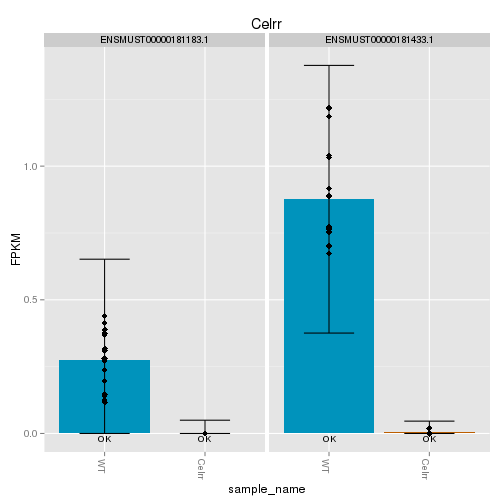

Celrr KO vs WT (Embryonic)
======================================


- add labels, descriptions
- turn off all caching 
- other heatmap labels (csHeatmap)
- break into individual replicate bargraphs for genotyping... 
- overlap figure
- tracks 


# Intialize


# Design Overview

This file shows the wt-v-ko comparison for Celrr. 

Samples used are:
<!-- html table generated in R 3.0.2 by xtable 1.7-3 package -->
<!-- Sun Jun 15 22:45:29 2014 -->
<TABLE border=1>
<TR> <TH>  </TH> <TH> 10 </TH>  </TR>
  <TR> <TD align="right"> 1 </TD> <TD> JR753 </TD> </TR>
  <TR> <TD align="right"> 2 </TD> <TD> JR750 </TD> </TR>
  <TR> <TD align="right"> 3 </TD> <TD> JR771 </TD> </TR>
  <TR> <TD align="right"> 4 </TD> <TD> JR755 </TD> </TR>
  <TR> <TD align="right"> 5 </TD> <TD> JR811 </TD> </TR>
  <TR> <TD align="right"> 6 </TD> <TD> JR768 </TD> </TR>
  <TR> <TD align="right"> 7 </TD> <TD> JR761 </TD> </TR>
  <TR> <TD align="right"> 8 </TD> <TD> JR815 </TD> </TR>
  <TR> <TD align="right"> 9 </TD> <TD> JR789 </TD> </TR>
  <TR> <TD align="right"> 10 </TD> <TD> JR748 </TD> </TR>
  <TR> <TD align="right"> 11 </TD> <TD> JR716 </TD> </TR>
  <TR> <TD align="right"> 12 </TD> <TD> JR717 </TD> </TR>
  <TR> <TD align="right"> 13 </TD> <TD> JR719 </TD> </TR>
  <TR> <TD align="right"> 14 </TD> <TD> JR791 </TD> </TR>
  <TR> <TD align="right"> 15 </TD> <TD> JR756 </TD> </TR>
  <TR> <TD align="right"> 16 </TD> <TD> JR769 </TD> </TR>
  <TR> <TD align="right"> 17 </TD> <TD> JR773 </TD> </TR>
  <TR> <TD align="right"> 18 </TD> <TD> JR760 </TD> </TR>
   </TABLE>


Cuff overview:

```
## CuffSet instance with:
## 	 2 samples
## 	 26754 genes
## 	 77524 isoforms
## 	 0 TSS
## 	 0 CDS
## 	 0 promoters
## 	 0 splicing
## 	 0 relCDS
```

## Replicates
<!-- html table generated in R 3.0.2 by xtable 1.7-3 package -->
<!-- Sun Jun 15 22:45:30 2014 -->
<TABLE border=1>
<TR> <TH>  </TH> <TH> file </TH> <TH> sample_name </TH> <TH> replicate </TH> <TH> rep_name </TH> <TH> total_mass </TH> <TH> norm_mass </TH> <TH> internal_scale </TH> <TH> external_scale </TH>  </TR>
  <TR> <TD align="right"> 1 </TD> <TD> /n/rinn_data1/seq/lgoff/Projects/BrainMap/data/quants/JR753/abundances.cxb </TD> <TD> WT </TD> <TD align="right">   0 </TD> <TD> WT_0 </TD> <TD align="right"> 39343800.00 </TD> <TD align="right"> 30542000.00 </TD> <TD align="right"> 1.34 </TD> <TD align="right"> 1.00 </TD> </TR>
  <TR> <TD align="right"> 2 </TD> <TD> /n/rinn_data1/seq/lgoff/Projects/BrainMap/data/quants/JR750/abundances.cxb </TD> <TD> WT </TD> <TD align="right">   1 </TD> <TD> WT_1 </TD> <TD align="right"> 36041100.00 </TD> <TD align="right"> 30542000.00 </TD> <TD align="right"> 1.16 </TD> <TD align="right"> 1.00 </TD> </TR>
  <TR> <TD align="right"> 3 </TD> <TD> /n/rinn_data1/seq/lgoff/Projects/BrainMap/data/quants/JR771/abundances.cxb </TD> <TD> WT </TD> <TD align="right">   2 </TD> <TD> WT_2 </TD> <TD align="right"> 38877000.00 </TD> <TD align="right"> 30542000.00 </TD> <TD align="right"> 1.30 </TD> <TD align="right"> 1.00 </TD> </TR>
  <TR> <TD align="right"> 4 </TD> <TD> /n/rinn_data1/seq/lgoff/Projects/BrainMap/data/quants/JR755/abundances.cxb </TD> <TD> WT </TD> <TD align="right">   3 </TD> <TD> WT_3 </TD> <TD align="right"> 41822800.00 </TD> <TD align="right"> 30542000.00 </TD> <TD align="right"> 1.36 </TD> <TD align="right"> 1.00 </TD> </TR>
  <TR> <TD align="right"> 5 </TD> <TD> /n/rinn_data1/seq/lgoff/Projects/BrainMap/data/quants/JR811/abundances.cxb </TD> <TD> WT </TD> <TD align="right">   4 </TD> <TD> WT_4 </TD> <TD align="right"> 38186700.00 </TD> <TD align="right"> 30542000.00 </TD> <TD align="right"> 1.28 </TD> <TD align="right"> 1.00 </TD> </TR>
  <TR> <TD align="right"> 6 </TD> <TD> /n/rinn_data1/seq/lgoff/Projects/BrainMap/data/quants/JR768/abundances.cxb </TD> <TD> WT </TD> <TD align="right">   5 </TD> <TD> WT_5 </TD> <TD align="right"> 28382500.00 </TD> <TD align="right"> 30542000.00 </TD> <TD align="right"> 0.95 </TD> <TD align="right"> 1.00 </TD> </TR>
  <TR> <TD align="right"> 7 </TD> <TD> /n/rinn_data1/seq/lgoff/Projects/BrainMap/data/quants/JR761/abundances.cxb </TD> <TD> WT </TD> <TD align="right">   6 </TD> <TD> WT_6 </TD> <TD align="right"> 31711800.00 </TD> <TD align="right"> 30542000.00 </TD> <TD align="right"> 1.03 </TD> <TD align="right"> 1.00 </TD> </TR>
  <TR> <TD align="right"> 8 </TD> <TD> /n/rinn_data1/seq/lgoff/Projects/BrainMap/data/quants/JR815/abundances.cxb </TD> <TD> WT </TD> <TD align="right">   7 </TD> <TD> WT_7 </TD> <TD align="right"> 29744300.00 </TD> <TD align="right"> 30542000.00 </TD> <TD align="right"> 0.98 </TD> <TD align="right"> 1.00 </TD> </TR>
  <TR> <TD align="right"> 9 </TD> <TD> /n/rinn_data1/seq/lgoff/Projects/BrainMap/data/quants/JR789/abundances.cxb </TD> <TD> WT </TD> <TD align="right">   8 </TD> <TD> WT_8 </TD> <TD align="right"> 27686600.00 </TD> <TD align="right"> 30542000.00 </TD> <TD align="right"> 0.91 </TD> <TD align="right"> 1.00 </TD> </TR>
  <TR> <TD align="right"> 10 </TD> <TD> /n/rinn_data1/seq/lgoff/Projects/BrainMap/data/quants/JR748/abundances.cxb </TD> <TD> WT </TD> <TD align="right">   9 </TD> <TD> WT_9 </TD> <TD align="right"> 32374600.00 </TD> <TD align="right"> 30542000.00 </TD> <TD align="right"> 1.02 </TD> <TD align="right"> 1.00 </TD> </TR>
  <TR> <TD align="right"> 11 </TD> <TD> /n/rinn_data1/seq/lgoff/Projects/BrainMap/data/quants/JR716/abundances.cxb </TD> <TD> WT </TD> <TD align="right">  10 </TD> <TD> WT_10 </TD> <TD align="right"> 26148700.00 </TD> <TD align="right"> 30542000.00 </TD> <TD align="right"> 0.86 </TD> <TD align="right"> 1.00 </TD> </TR>
  <TR> <TD align="right"> 12 </TD> <TD> /n/rinn_data1/seq/lgoff/Projects/BrainMap/data/quants/JR717/abundances.cxb </TD> <TD> WT </TD> <TD align="right">  11 </TD> <TD> WT_11 </TD> <TD align="right"> 25571500.00 </TD> <TD align="right"> 30542000.00 </TD> <TD align="right"> 0.85 </TD> <TD align="right"> 1.00 </TD> </TR>
  <TR> <TD align="right"> 13 </TD> <TD> /n/rinn_data1/seq/lgoff/Projects/BrainMap/data/quants/JR719/abundances.cxb </TD> <TD> WT </TD> <TD align="right">  12 </TD> <TD> WT_12 </TD> <TD align="right"> 22702200.00 </TD> <TD align="right"> 30542000.00 </TD> <TD align="right"> 0.73 </TD> <TD align="right"> 1.00 </TD> </TR>
  <TR> <TD align="right"> 14 </TD> <TD> /n/rinn_data1/seq/lgoff/Projects/BrainMap/data/quants/JR791/abundances.cxb </TD> <TD> WT </TD> <TD align="right">  13 </TD> <TD> WT_13 </TD> <TD align="right"> 12886300.00 </TD> <TD align="right"> 30542000.00 </TD> <TD align="right"> 0.43 </TD> <TD align="right"> 1.00 </TD> </TR>
  <TR> <TD align="right"> 15 </TD> <TD> /n/rinn_data1/seq/lgoff/Projects/BrainMap/data/quants/JR756/abundances.cxb </TD> <TD> WT </TD> <TD align="right">  14 </TD> <TD> WT_14 </TD> <TD align="right"> 38957200.00 </TD> <TD align="right"> 30542000.00 </TD> <TD align="right"> 1.29 </TD> <TD align="right"> 1.00 </TD> </TR>
  <TR> <TD align="right"> 16 </TD> <TD> /n/rinn_data1/seq/lgoff/Projects/BrainMap/data/quants/JR769/abundances.cxb </TD> <TD> Celrr </TD> <TD align="right">   0 </TD> <TD> Celrr_0 </TD> <TD align="right"> 28552300.00 </TD> <TD align="right"> 30542000.00 </TD> <TD align="right"> 0.93 </TD> <TD align="right"> 1.00 </TD> </TR>
  <TR> <TD align="right"> 17 </TD> <TD> /n/rinn_data1/seq/lgoff/Projects/BrainMap/data/quants/JR773/abundances.cxb </TD> <TD> Celrr </TD> <TD align="right">   1 </TD> <TD> Celrr_1 </TD> <TD align="right"> 37964300.00 </TD> <TD align="right"> 30542000.00 </TD> <TD align="right"> 1.20 </TD> <TD align="right"> 1.00 </TD> </TR>
  <TR> <TD align="right"> 18 </TD> <TD> /n/rinn_data1/seq/lgoff/Projects/BrainMap/data/quants/JR760/abundances.cxb </TD> <TD> Celrr </TD> <TD align="right">   2 </TD> <TD> Celrr_2 </TD> <TD align="right"> 30678400.00 </TD> <TD align="right"> 30542000.00 </TD> <TD align="right"> 1.00 </TD> <TD align="right"> 1.00 </TD> </TR>
   </TABLE>

# QC

## Dispersion

Dispersion plot for genes in cuff:
(Overdispersion can lead to innacurate quants)


```
## Error: 'from' cannot be NA, NaN or infinite
```

## Cross-replicate variability (fpkmSCVplot)
Differences in CV 2 can result in lower numbers of differentially expressed genes due to a higher degree of variability between replicate fpkm estimates.

Genes:

```
## Scale for 'x' is already present. Adding another scale for 'x', which will replace the existing scale.
## geom_smooth: method="auto" and size of largest group is >=1000, so using gam with formula: y ~ s(x, bs = "cs"). Use 'method = x' to change the smoothing method.
```

 


Isoforms: 

```
## Scale for 'x' is already present. Adding another scale for 'x', which will replace the existing scale.
## geom_smooth: method="auto" and size of largest group is >=1000, so using gam with formula: y ~ s(x, bs = "cs"). Use 'method = x' to change the smoothing method.
```

 

## Volcano

```
## Error: One or more values of 'x' or 'y' are not valid sample names!
```

### Volcano matrix (replicates)

 

## MvA plot

```
## Error: non-numeric argument to binary operator
```
   
### MvA plot counts

```
## Error: non-numeric argument to binary operator
```

## Scatterplot
 

### Scatter matrix (replicates) -- SKIP FOR NOW CAUSING PROBLEMS 


## Distributions

### Boxplots

Boxplot (genes)
 
Boxplot (genes, replicates)
 
Boxplot (isoforms)
 
Boxplot (isoforms, replicates)
 

### Density
Density (genes)

```
## Warning: Removed 4349 rows containing non-finite values (stat_density).
## Warning: Removed 5751 rows containing non-finite values (stat_density).
```

 
Density (genes, replicates)

```
## Warning: Removed 6674 rows containing non-finite values (stat_density).
## Warning: Removed 7002 rows containing non-finite values (stat_density).
## Warning: Removed 6665 rows containing non-finite values (stat_density).
## Warning: Removed 6660 rows containing non-finite values (stat_density).
## Warning: Removed 6658 rows containing non-finite values (stat_density).
## Warning: Removed 6924 rows containing non-finite values (stat_density).
## Warning: Removed 6924 rows containing non-finite values (stat_density).
## Warning: Removed 6977 rows containing non-finite values (stat_density).
## Warning: Removed 6968 rows containing non-finite values (stat_density).
## Warning: Removed 6936 rows containing non-finite values (stat_density).
## Warning: Removed 7397 rows containing non-finite values (stat_density).
## Warning: Removed 7319 rows containing non-finite values (stat_density).
## Warning: Removed 7685 rows containing non-finite values (stat_density).
## Warning: Removed 7859 rows containing non-finite values (stat_density).
## Warning: Removed 6664 rows containing non-finite values (stat_density).
## Warning: Removed 7183 rows containing non-finite values (stat_density).
## Warning: Removed 6894 rows containing non-finite values (stat_density).
## Warning: Removed 6878 rows containing non-finite values (stat_density).
```

 


## Clustering

### Replicate Clusters
 

```
## 'dendrogram' with 2 branches and 18 members total, at height 0.09197
```

### PCA (genes)
 

### MDS (genes)
 

### Distance Heat Map (genes)
 


# KO assessment

## Endogenous lncRNA expression
<!-- html table generated in R 3.0.2 by xtable 1.7-3 package -->
<!-- Sun Jun 15 22:48:21 2014 -->
<TABLE border=1>
<TR> <TH>  </TH> <TH> gene_id </TH> <TH> sample_name </TH> <TH> fpkm </TH> <TH> conf_hi </TH> <TH> conf_lo </TH> <TH> quant_status </TH>  </TR>
  <TR> <TD align="right"> 1 </TD> <TD> ENSMUSG00000097881.1 </TD> <TD> Celrr </TD> <TD align="right"> 0.19 </TD> <TD align="right"> 0.38 </TD> <TD align="right"> 0.01 </TD> <TD> OK </TD> </TR>
  <TR> <TD align="right"> 2 </TD> <TD> ENSMUSG00000097881.1 </TD> <TD> WT </TD> <TD align="right"> 0.39 </TD> <TD align="right"> 0.68 </TD> <TD align="right"> 0.10 </TD> <TD> OK </TD> </TR>
   </TABLE>
<!-- html table generated in R 3.0.2 by xtable 1.7-3 package -->
<!-- Sun Jun 15 22:48:21 2014 -->
<TABLE border=1>
<TR> <TH>  </TH> <TH> isoform_id </TH> <TH> sample_name </TH> <TH> fpkm </TH> <TH> conf_hi </TH> <TH> conf_lo </TH> <TH> quant_status </TH>  </TR>
  <TR> <TD align="right"> 1 </TD> <TD> ENSMUST00000181183.1 </TD> <TD> Celrr </TD> <TD align="right"> 0.00 </TD> <TD align="right"> 0.05 </TD> <TD align="right"> 0.00 </TD> <TD> OK </TD> </TR>
  <TR> <TD align="right"> 2 </TD> <TD> ENSMUST00000181433.1 </TD> <TD> Celrr </TD> <TD align="right"> 0.19 </TD> <TD align="right"> 0.37 </TD> <TD align="right"> 0.02 </TD> <TD> OK </TD> </TR>
  <TR> <TD align="right"> 3 </TD> <TD> ENSMUST00000181183.1 </TD> <TD> WT </TD> <TD align="right"> 0.09 </TD> <TD align="right"> 0.26 </TD> <TD align="right"> 0.00 </TD> <TD> OK </TD> </TR>
  <TR> <TD align="right"> 4 </TD> <TD> ENSMUST00000181433.1 </TD> <TD> WT </TD> <TD align="right"> 0.30 </TD> <TD align="right"> 0.56 </TD> <TD align="right"> 0.05 </TD> <TD> OK </TD> </TR>
   </TABLE>
  

Endogenous expression of Celrr isoforms:
  

Barplot of gene expression:
  

Barplot of isoform expression:
  


## LacZ expression
<!-- html table generated in R 3.0.2 by xtable 1.7-3 package -->
<!-- Sun Jun 15 22:48:31 2014 -->
<TABLE border=1>
<TR> <TH>  </TH> <TH> gene_id </TH> <TH> sample_name </TH> <TH> fpkm </TH> <TH> conf_hi </TH> <TH> conf_lo </TH> <TH> quant_status </TH>  </TR>
  <TR> <TD align="right"> 1 </TD> <TD> Velocigene_LacZ </TD> <TD> Celrr </TD> <TD align="right"> 2.71 </TD> <TD align="right"> 3.80 </TD> <TD align="right"> 1.61 </TD> <TD> OK </TD> </TR>
  <TR> <TD align="right"> 2 </TD> <TD> Velocigene_LacZ </TD> <TD> WT </TD> <TD align="right"> 0.02 </TD> <TD align="right"> 0.06 </TD> <TD align="right"> 0.00 </TD> <TD> OK </TD> </TR>
   </TABLE>
    


## Digital Genotyping (LacZ vs Endogenous lncRNA and Sex)
Expression plot (endogenous linc, lacZ, Y-expressed gene):

```
## Scale for 'colour' is already present. Adding another scale for 'colour', which will replace the existing scale.
## ymax not defined: adjusting position using y instead
```

 
Expression heatmap:

```
## Using tracking_id, rep_name as id variables
## No id variables; using all as measure variables
```

 

# Differential Analysis

## Differential Genes 


There are 207 significantly differentially expressed genes. They are:


```
## Error: no applicable method for 'xtable' applied to an object of class
## "character"
```

### Matrix of gene significant differences between conditions
(skip for Brainmap wt-v-ko comparisons)

 

### Significant gene expression differences between conditions

Expression plot (genes):

```
## Using tracking_id, rep_name as id variables
## No id variables; using all as measure variables
```

  

Significant genes with expression >50fpkm (any condition):

```
## Using tracking_id, sample_name as id variables
```

```
## Error: could not find function "expresionPlot"
```

An individual look at each of the highly expressed significantly differentially regulated genes:
(eval=false for first pass)


### Expression-level/significance relationship

Scatter plot of significant genes only:

```
## Using tracking_id, sample_name as id variables
```

```
## Error: One or more values of 'x' or 'y' are not valid sample names!
```

Volcano plot with significant genes only:

```
## Error: One or more values of 'x' or 'y' are not valid sample names!
```


## Differential Splicing

### Differential Isoforms between conditions
Per isoform difference between conditions:
 

These isoforms are:

```
## Error: no applicable method for 'xtable' applied to an object of class
## "character"
```


```
## Using tracking_id, rep_name as id variables
```

 

### Differential Splicing between conditions

(eval false for first pass)

Per condition differences in isoforms (Does gene have diff piechart between conditions?)


These genes are:


Splicing heatmap by isoform:


Splicing heatmap by gene


The following are significantly differentially spliced genes (relative portion of isoform per condition): 


 


# Gene/Pathway Analysis

## GSEA


 

 

## GO enrichment 
Cluster profiler used to call enichments of significantly differentially regulated genes that map to Entrez IDs. 

Description/explanation of what's here, and justify all choices. 


```
## Loading required package: AnnotationDbi
## Loading required package: Biobase
## Welcome to Bioconductor
## 
##     Vignettes contain introductory material; view with
##     'browseVignettes()'. To cite Bioconductor, see
##     'citation("Biobase")', and for packages 'citation("pkgname")'.
## 
## 
## Attaching package: 'Biobase'
## 
## The following object is masked from 'package:cummeRbund':
## 
##     samples
```

```
## Warning: Can't find a usable tk.tcl in the following directories: 
##     /n/sw/centos6/tcl8.5.14/lib/tcl8.5/tk8.5 /n/sw/centos6/tcl8.5.14/lib/tk8.5 ./lib/tk8.5 ./library
## 
## 
## 
## This probably means that tk wasn't installed properly.
```

```
## 
## 
## Attaching package: 'DOSE'
## 
## The following object is masked from 'package:ReactomePA':
## 
##     gseAnalyzer
```

biomart to get entrez gene IDS
clusterProfiler does GO enrichment 

BP, MF, CC
enrichKEGG
enrichPathway


```
## Error: error in evaluating the argument 'x' in selecting a method for function 'plot': Error: object 'goBP' not found
```

```
## Error: error in evaluating the argument 'x' in selecting a method for function 'plot': Error: object 'goMF' not found
```

```
## Error: error in evaluating the argument 'x' in selecting a method for function 'plot': Error: object 'goCC' not found
```

```
## Error: error in evaluating the argument 'x' in selecting a method for function 'plot': Error: object 'kegg' not found
```

```
## Error: error in evaluating the argument 'x' in selecting a method for function 'plot': Error: object 'pathway' not found
```

```
## Error: invalid 'name' argument
```

# Cis vs Trans (locally)


# Notes

# Session Info

```
## R version 3.0.2 (2013-09-25)
## Platform: x86_64-unknown-linux-gnu (64-bit)
## 
## locale:
##  [1] LC_CTYPE=en_US.UTF-8       LC_NUMERIC=C              
##  [3] LC_TIME=en_US.UTF-8        LC_COLLATE=en_US.UTF-8    
##  [5] LC_MONETARY=en_US.UTF-8    LC_MESSAGES=en_US.UTF-8   
##  [7] LC_PAPER=en_US.UTF-8       LC_NAME=C                 
##  [9] LC_ADDRESS=C               LC_TELEPHONE=C            
## [11] LC_MEASUREMENT=en_US.UTF-8 LC_IDENTIFICATION=C       
## 
## attached base packages:
## [1] grid      parallel  stats     graphics  grDevices utils     datasets 
## [8] methods   base     
## 
## other attached packages:
##  [1] DOSE_2.0.0           ReactomePA_1.6.1     AnnotationDbi_1.24.0
##  [4] Biobase_2.22.0       mgcv_1.7-29          nlme_3.1-117        
##  [7] gridExtra_0.9.1      gtable_0.1.2         marray_1.40.0       
## [10] gplots_2.13.0        GSA_1.03             limma_3.18.13       
## [13] xtable_1.7-3         cummeRbund_2.7.2     Gviz_1.6.0          
## [16] rtracklayer_1.22.7   GenomicRanges_1.14.4 XVector_0.2.0       
## [19] IRanges_1.20.7       fastcluster_1.1.13   reshape2_1.4        
## [22] ggplot2_1.0.0        RSQLite_0.11.4       DBI_0.2-7           
## [25] BiocGenerics_0.8.0   knitr_1.6           
## 
## loaded via a namespace (and not attached):
##  [1] biomaRt_2.18.0         Biostrings_2.30.1      biovizBase_1.10.8     
##  [4] bitops_1.0-6           BSgenome_1.30.0        caTools_1.17          
##  [7] cluster_1.15.2         colorspace_1.2-4       dichromat_2.0-0       
## [10] digest_0.6.4           DO.db_2.7              evaluate_0.5.5        
## [13] formatR_0.10           Formula_1.1-1          gdata_2.13.3          
## [16] GenomicFeatures_1.14.5 GO.db_2.10.1           GOSemSim_1.20.3       
## [19] graph_1.40.1           graphite_1.8.1         gtools_3.4.1          
## [22] Hmisc_3.14-4           igraph_0.7.1           KernSmooth_2.23-12    
## [25] labeling_0.2           lattice_0.20-29        latticeExtra_0.6-26   
## [28] MASS_7.3-33            Matrix_1.1-3           munsell_0.4.2         
## [31] org.Hs.eg.db_2.10.1    plyr_1.8.1             proto_0.3-10          
## [34] qvalue_1.36.0          RColorBrewer_1.0-5     Rcpp_0.11.1           
## [37] RCurl_1.95-4.1         reactome.db_1.46.1     Rsamtools_1.14.3      
## [40] scales_0.2.4           splines_3.0.2          stats4_3.0.2          
## [43] stringr_0.6.2          survival_2.37-7        tcltk_3.0.2           
## [46] tools_3.0.2            XML_3.98-1.1           zlibbioc_1.8.0
```

#Run Info

```
##           param
## 1      cmd_line
## 2       version
## 3  SVN_revision
## 4 boost_version
## 5        genome
##                                                                                                                                                                                                                                                                                                                                                                                                                                                                                                                                                                                                                                                                                                                                                                                                                                                                                                                                                                                                                                                                                                                                                                                                                                                                                                                                                                                                                                                                                                                                                                                                             value
## 1 cuffdiff -p 10 -L WT,Celrr -o /n/rinn_data1/seq/lgoff/Projects/BrainMap/diffs/Celrr_vs_WT_Embryonic /n/rinn_data1/seq/lgoff/Projects/BrainMap/data/annotation/mm10_gencode_vM2_with_lncRNAs_and_LacZ.gtf /n/rinn_data1/seq/lgoff/Projects/BrainMap/data/quants/JR753/abundances.cxb,/n/rinn_data1/seq/lgoff/Projects/BrainMap/data/quants/JR750/abundances.cxb,/n/rinn_data1/seq/lgoff/Projects/BrainMap/data/quants/JR771/abundances.cxb,/n/rinn_data1/seq/lgoff/Projects/BrainMap/data/quants/JR755/abundances.cxb,/n/rinn_data1/seq/lgoff/Projects/BrainMap/data/quants/JR811/abundances.cxb,/n/rinn_data1/seq/lgoff/Projects/BrainMap/data/quants/JR768/abundances.cxb,/n/rinn_data1/seq/lgoff/Projects/BrainMap/data/quants/JR761/abundances.cxb,/n/rinn_data1/seq/lgoff/Projects/BrainMap/data/quants/JR815/abundances.cxb,/n/rinn_data1/seq/lgoff/Projects/BrainMap/data/quants/JR789/abundances.cxb,/n/rinn_data1/seq/lgoff/Projects/BrainMap/data/quants/JR748/abundances.cxb,/n/rinn_data1/seq/lgoff/Projects/BrainMap/data/quants/JR716/abundances.cxb,/n/rinn_data1/seq/lgoff/Projects/BrainMap/data/quants/JR717/abundances.cxb,/n/rinn_data1/seq/lgoff/Projects/BrainMap/data/quants/JR719/abundances.cxb,/n/rinn_data1/seq/lgoff/Projects/BrainMap/data/quants/JR791/abundances.cxb,/n/rinn_data1/seq/lgoff/Projects/BrainMap/data/quants/JR756/abundances.cxb /n/rinn_data1/seq/lgoff/Projects/BrainMap/data/quants/JR769/abundances.cxb,/n/rinn_data1/seq/lgoff/Projects/BrainMap/data/quants/JR773/abundances.cxb,/n/rinn_data1/seq/lgoff/Projects/BrainMap/data/quants/JR760/abundances.cxb 
## 2                                                                                                                                                                                                                                                                                                                                                                                                                                                                                                                                                                                                                                                                                                                                                                                                                                                                                                                                                                                                                                                                                                                                                                                                                                                                                                                                                                                                                                                                                                                                                                                                           2.2.1
## 3                                                                                                                                                                                                                                                                                                                                                                                                                                                                                                                                                                                                                                                                                                                                                                                                                                                                                                                                                                                                                                                                                                                                                                                                                                                                                                                                                                                                                                                                                                                                                                                                            4237
## 4                                                                                                                                                                                                                                                                                                                                                                                                                                                                                                                                                                                                                                                                                                                                                                                                                                                                                                                                                                                                                                                                                                                                                                                                                                                                                                                                                                                                                                                                                                                                                                                                          104700
## 5                                                                                                                                                                                                                                                                                                                                                                                                                                                                                                                                                                                                                                                                                                                                                                                                                                                                                                                                                                                                                                                                                                                                                                                                                                                                                                                                                                                                                                                                                                                                                                                                            mm10
```
