Celrr KO vs WT (Embryonic)
======================================

- other heatmap labels (csHeatmap)
- cache gsea and overlap figure!! 
- tracks 
- should import litter info


# Intialize


# Design Overview

This file shows the wt-v-ko comparison for Celrr. 

Cuff overview:

```
## CuffSet instance with:
## 	 2 samples
## 	 26754 genes
## 	 77524 isoforms
## 	 0 TSS
## 	 23066 CDS
## 	 0 promoters
## 	 0 splicing
## 	 19954 relCDS
```


# QC

## Dispersion

Dispersion plot for genes in cuff:
(Overdispersion can lead to innacurate quants)


```
## Error: 'from' cannot be NA, NaN or infinite
```

## Cross-replicate variability (fpkmSCVplot)
Differences in CV 2 can result in lower numbers of differentially expressed genes due to a higher degree of variability between replicate fpkm estimates.

Genes:
 


Isoforms: 
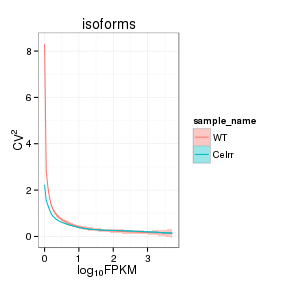 

## Volcano


### Volcano matrix (replicates)

 

## MvA plot

   
### MvA plot counts


## Scatterplot
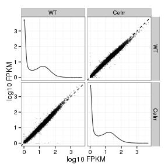 

### Scatter matrix (replicates) -- SKIP FOR NOW CAUSING PROBLEMS 


## Distributions

### Boxplots

Boxplot (genes)

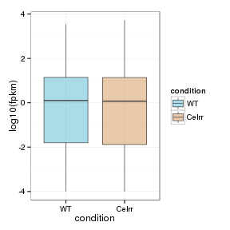 

Boxplot (genes, replicates)

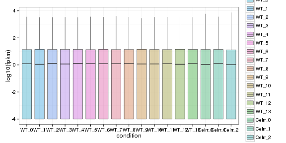 

Boxplot (isoforms)

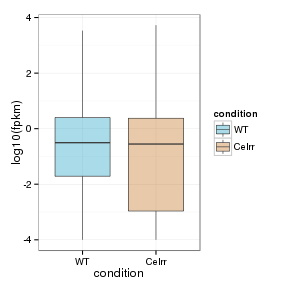 

Boxplot (isoforms, replicates)

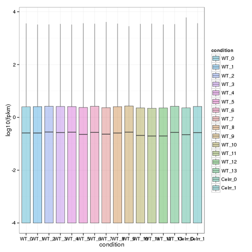 

### Density

Density (genes)

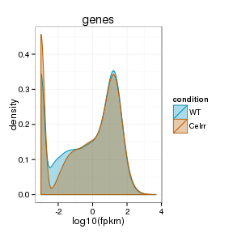 

Density (genes, replicates)

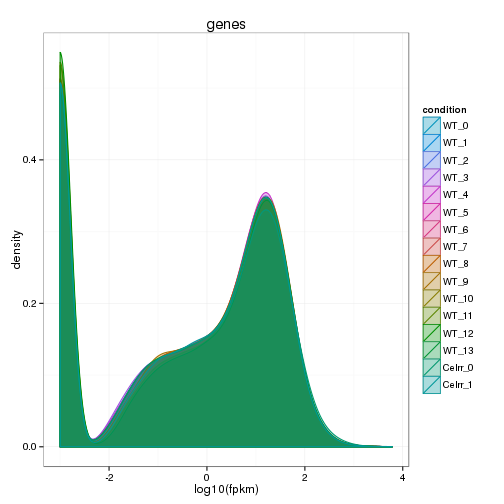 


## Clustering

### Replicate Clusters
 

```
## 'dendrogram' with 2 branches and 16 members total, at height 0.08451
```

### PCA (genes)
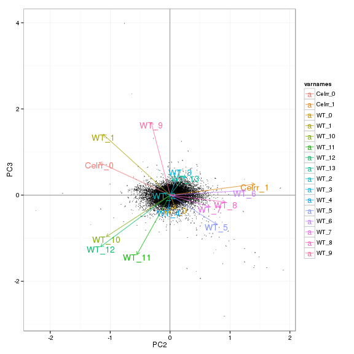 

### MDS (genes)
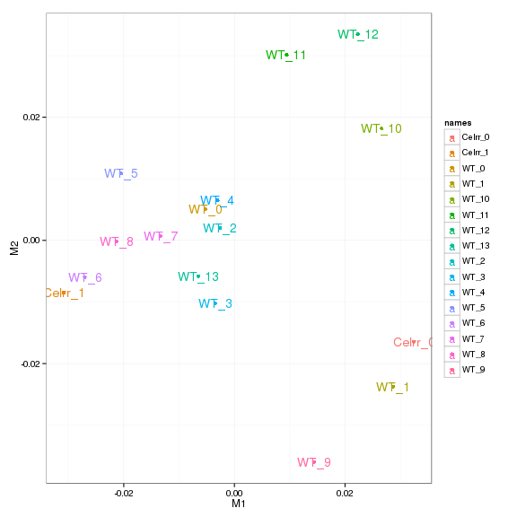 


# KO assessment

## Endogenous lncRNA expression

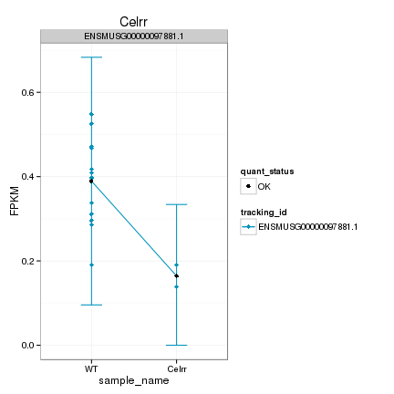 

Endogenous expression of Celrr isoforms:

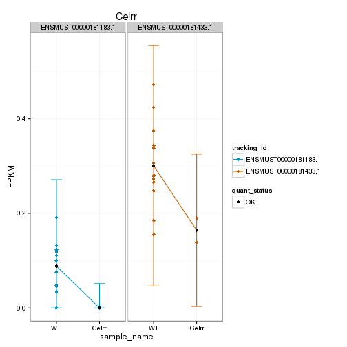 

Barplot of gene expression:

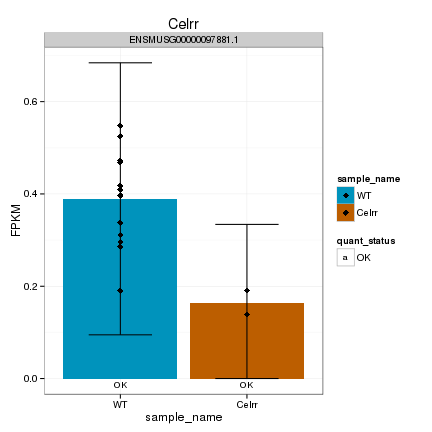 

Barplot of isoform expression:

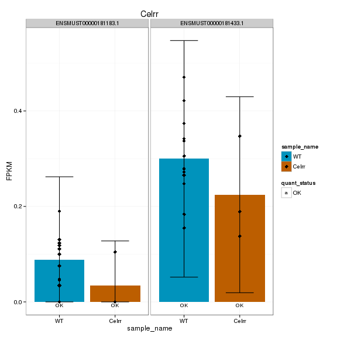 


## LacZ expression

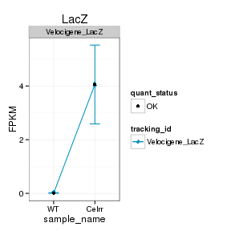 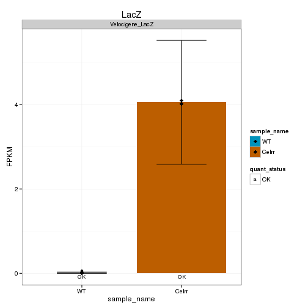 


## Digital Genotyping (LacZ vs Endogenous lncRNA and Sex)
Expression plot (endogenous linc, lacZ, Y-expressed gene):

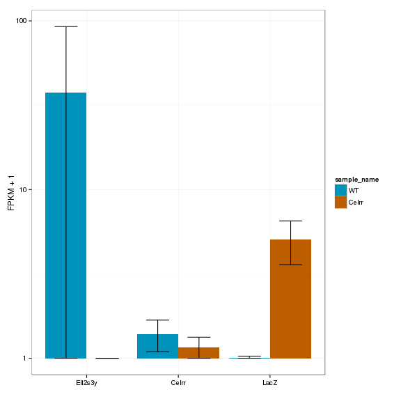 

Expression heatmap:
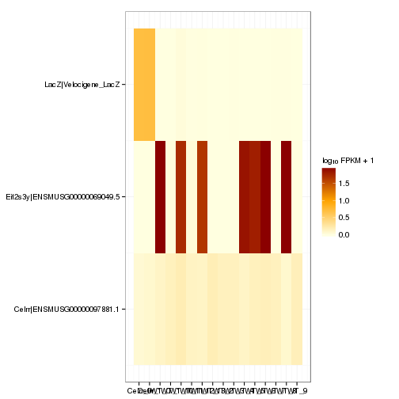 

# Differential Analysis

## Differential Genes 


There are 37 significantly differentially expressed genes. They are:

<!-- html table generated in R 3.0.2 by xtable 1.7-3 package -->
<!-- Mon Jun 23 20:34:19 2014 -->
<TABLE border=1>
<TR> <TH>  </TH> <TH> geneAnnot$gene_short_name </TH>  </TR>
  <TR> <TD align="right"> 1 </TD> <TD> Phox2b </TD> </TR>
  <TR> <TD align="right"> 2 </TD> <TD> Sulf1 </TD> </TR>
  <TR> <TD align="right"> 3 </TD> <TD> Slc16a10 </TD> </TR>
  <TR> <TD align="right"> 4 </TD> <TD> Fam49a </TD> </TR>
  <TR> <TD align="right"> 5 </TD> <TD> Sla </TD> </TR>
  <TR> <TD align="right"> 6 </TD> <TD> Clic6 </TD> </TR>
  <TR> <TD align="right"> 7 </TD> <TD> Rps14 </TD> </TR>
  <TR> <TD align="right"> 8 </TD> <TD> Msx3 </TD> </TR>
  <TR> <TD align="right"> 9 </TD> <TD> Fn1 </TD> </TR>
  <TR> <TD align="right"> 10 </TD> <TD> Notch2 </TD> </TR>
  <TR> <TD align="right"> 11 </TD> <TD> Dync1i1 </TD> </TR>
  <TR> <TD align="right"> 12 </TD> <TD> Dbx1 </TD> </TR>
  <TR> <TD align="right"> 13 </TD> <TD> Slit2 </TD> </TR>
  <TR> <TD align="right"> 14 </TD> <TD> Robo3 </TD> </TR>
  <TR> <TD align="right"> 15 </TD> <TD> Lama1 </TD> </TR>
  <TR> <TD align="right"> 16 </TD> <TD> Fras1 </TD> </TR>
  <TR> <TD align="right"> 17 </TD> <TD> Kirrel2 </TD> </TR>
  <TR> <TD align="right"> 18 </TD> <TD> Neurod6 </TD> </TR>
  <TR> <TD align="right"> 19 </TD> <TD> Notch3 </TD> </TR>
  <TR> <TD align="right"> 20 </TD> <TD> Spon1 </TD> </TR>
  <TR> <TD align="right"> 21 </TD> <TD> Satb2 </TD> </TR>
  <TR> <TD align="right"> 22 </TD> <TD> Mpped1 </TD> </TR>
  <TR> <TD align="right"> 23 </TD> <TD> Tuba1c </TD> </TR>
  <TR> <TD align="right"> 24 </TD> <TD> Acp1 </TD> </TR>
  <TR> <TD align="right"> 25 </TD> <TD> Cnpy1 </TD> </TR>
  <TR> <TD align="right"> 26 </TD> <TD> Hbb-y </TD> </TR>
  <TR> <TD align="right"> 27 </TD> <TD> Hba-x </TD> </TR>
  <TR> <TD align="right"> 28 </TD> <TD> Rpl32 </TD> </TR>
  <TR> <TD align="right"> 29 </TD> <TD> Rps7 </TD> </TR>
  <TR> <TD align="right"> 30 </TD> <TD> Rpl35 </TD> </TR>
  <TR> <TD align="right"> 31 </TD> <TD> Cyp26b1 </TD> </TR>
  <TR> <TD align="right"> 32 </TD> <TD> Slc4a5 </TD> </TR>
  <TR> <TD align="right"> 33 </TD> <TD> Ddx3y </TD> </TR>
  <TR> <TD align="right"> 34 </TD> <TD> Fat1 </TD> </TR>
  <TR> <TD align="right"> 35 </TD> <TD> Rpl23 </TD> </TR>
  <TR> <TD align="right"> 36 </TD> <TD> Rpl39 </TD> </TR>
  <TR> <TD align="right"> 37 </TD> <TD> AA465934 </TD> </TR>
   </TABLE>

### Matrix of gene significant differences between conditions

(skip for Brainmap wt-v-ko comparisons)

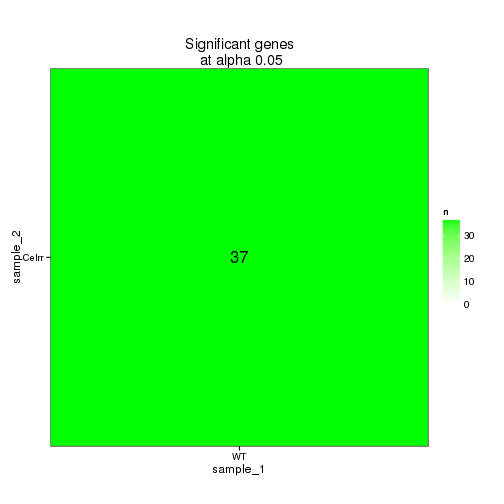 

### Significant gene expression differences between conditions

Expression plot (genes):
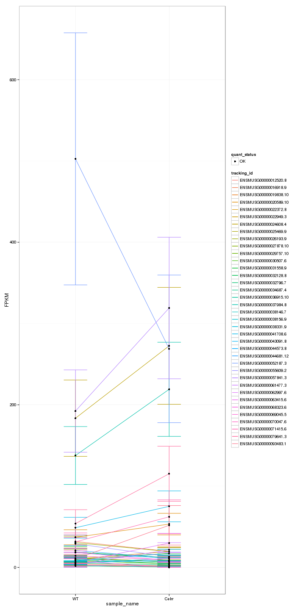 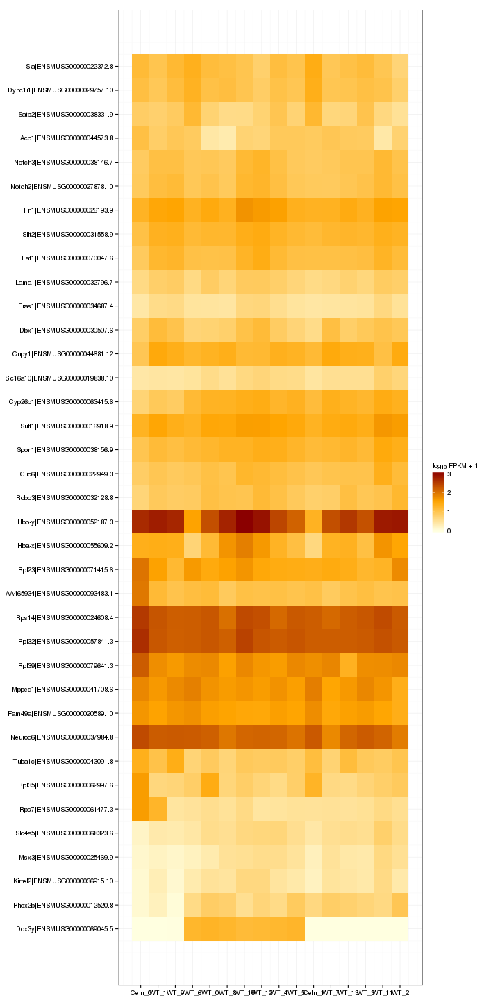 

Significant genes with expression >50fpkm (any condition):
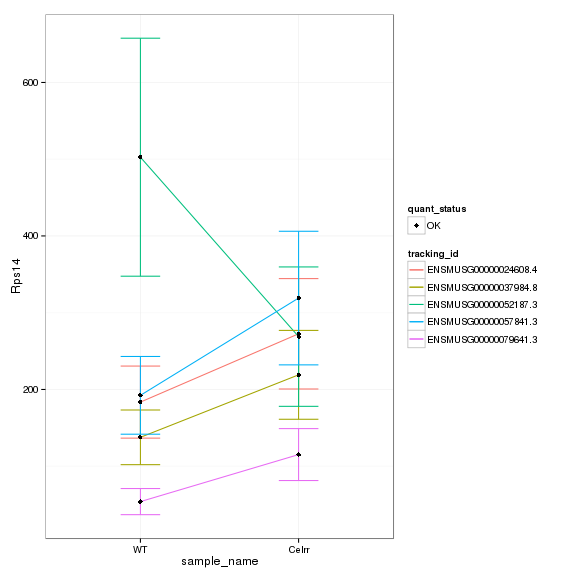 

An individual look at each of the highly expressed significantly differentially regulated genes:
(eval=false for first pass)


### Expression-level/significance relationship

Scatter plot of significant genes only:

```
## Error: One or more values of 'x' or 'y' are not valid sample names!
```

Volcano plot with significant genes only:

```
## Error: One or more values of 'x' or 'y' are not valid sample names!
```


## Differential Splicing

### Differential Isoforms between conditions
Per isoform difference between conditions:
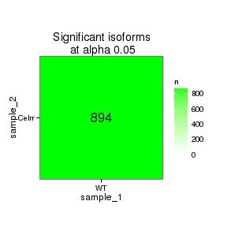 

```
## Error: RS-DBI driver: (error in statement: near ")": syntax error)
```

These isoforms are:


```
## Error: NaN dissimilarity value.
```

### Differential Splicing between conditions

(eval false for first pass)

Per condition differences in isoforms (Does gene have diff piechart between conditions?)


These genes are:


Splicing heatmap by isoform:


Splicing heatmap by gene


The following are significantly differentially spliced genes (relative portion of isoform per condition): 


 


# Gene/Pathway Analysis

## GSEA


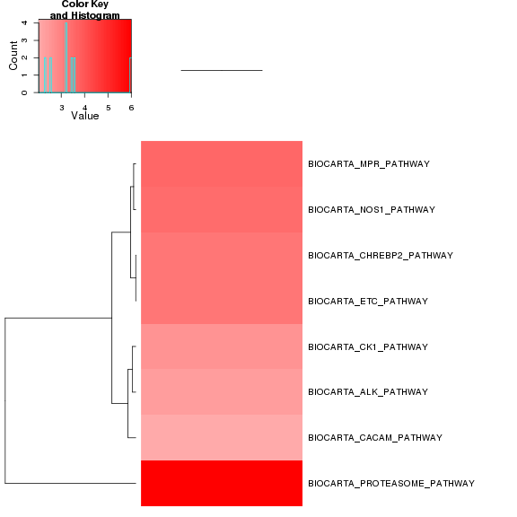 

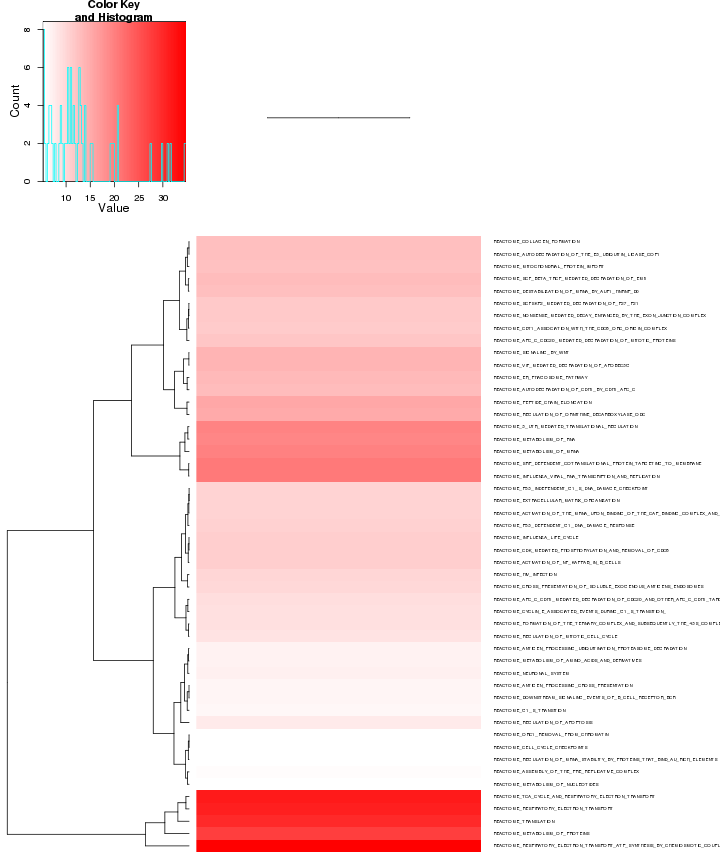 

## GO enrichment 
Cluster profiler used to call enichments of significantly differentially regulated genes that map to Entrez IDs. 


```
## [1] "ERROR: The estimated pi0 <= 0. Check that you have valid p-values or use another lambda method."
```

```
## [1] "ERROR: The estimated pi0 <= 0. Check that you have valid p-values or use another lambda method."
```

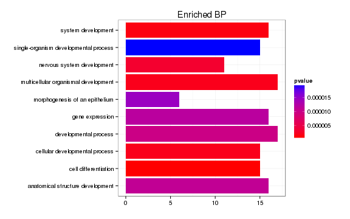 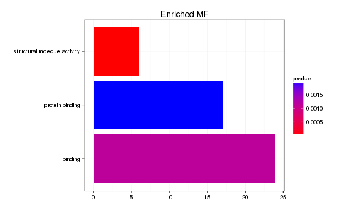 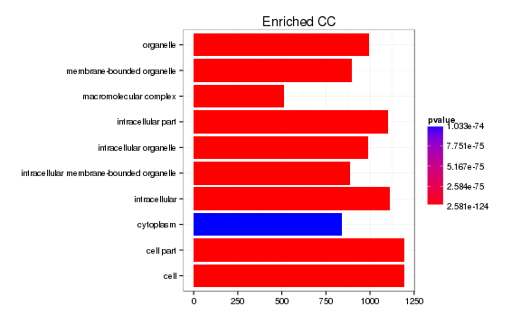 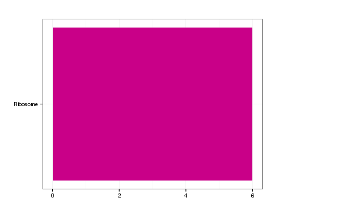 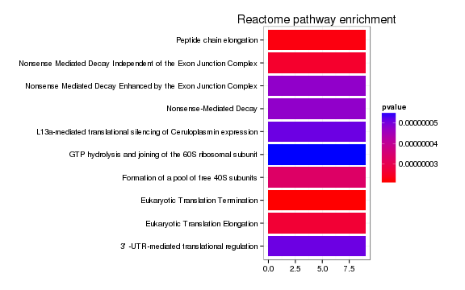 

# Cis vs Trans (locally)

```
## Error: argument "seed" is missing, with no default
```

The pvalue for 0 genes significantly regulated in this region is: 1 

 

# Notes

## Samples used are:
<!-- html table generated in R 3.0.2 by xtable 1.7-3 package -->
<!-- Mon Jun 23 20:39:15 2014 -->
<TABLE border=1>
<TR> <TH>  </TH> <TH> 10 </TH>  </TR>
  <TR> <TD align="right"> 1 </TD> <TD> JR753 </TD> </TR>
  <TR> <TD align="right"> 2 </TD> <TD> JR750 </TD> </TR>
  <TR> <TD align="right"> 3 </TD> <TD> JR771 </TD> </TR>
  <TR> <TD align="right"> 4 </TD> <TD> JR755 </TD> </TR>
  <TR> <TD align="right"> 5 </TD> <TD> JR811 </TD> </TR>
  <TR> <TD align="right"> 6 </TD> <TD> JR768 </TD> </TR>
  <TR> <TD align="right"> 7 </TD> <TD> JR761 </TD> </TR>
  <TR> <TD align="right"> 8 </TD> <TD> JR815 </TD> </TR>
  <TR> <TD align="right"> 9 </TD> <TD> JR789 </TD> </TR>
  <TR> <TD align="right"> 10 </TD> <TD> JR748 </TD> </TR>
  <TR> <TD align="right"> 11 </TD> <TD> JR716 </TD> </TR>
  <TR> <TD align="right"> 12 </TD> <TD> JR717 </TD> </TR>
  <TR> <TD align="right"> 13 </TD> <TD> JR719 </TD> </TR>
  <TR> <TD align="right"> 14 </TD> <TD> JR756 </TD> </TR>
  <TR> <TD align="right"> 15 </TD> <TD> JR773 </TD> </TR>
  <TR> <TD align="right"> 16 </TD> <TD> JR760 </TD> </TR>
   </TABLE>

## Replicates
<!-- html table generated in R 3.0.2 by xtable 1.7-3 package -->
<!-- Mon Jun 23 20:39:15 2014 -->
<TABLE border=1>
<TR> <TH>  </TH> <TH> file </TH> <TH> sample_name </TH> <TH> replicate </TH> <TH> rep_name </TH> <TH> total_mass </TH> <TH> norm_mass </TH> <TH> internal_scale </TH> <TH> external_scale </TH>  </TR>
  <TR> <TD align="right"> 1 </TD> <TD> /n/rinn_data1/seq/lgoff/Projects/BrainMap/data/quants/JR753/abundances.cxb </TD> <TD> WT </TD> <TD align="right">   0 </TD> <TD> WT_0 </TD> <TD align="right"> 39343800.00 </TD> <TD align="right"> 32387000.00 </TD> <TD align="right"> 1.26 </TD> <TD align="right"> 1.00 </TD> </TR>
  <TR> <TD align="right"> 2 </TD> <TD> /n/rinn_data1/seq/lgoff/Projects/BrainMap/data/quants/JR750/abundances.cxb </TD> <TD> WT </TD> <TD align="right">   1 </TD> <TD> WT_1 </TD> <TD align="right"> 36041100.00 </TD> <TD align="right"> 32387000.00 </TD> <TD align="right"> 1.10 </TD> <TD align="right"> 1.00 </TD> </TR>
  <TR> <TD align="right"> 3 </TD> <TD> /n/rinn_data1/seq/lgoff/Projects/BrainMap/data/quants/JR771/abundances.cxb </TD> <TD> WT </TD> <TD align="right">   2 </TD> <TD> WT_2 </TD> <TD align="right"> 38877000.00 </TD> <TD align="right"> 32387000.00 </TD> <TD align="right"> 1.23 </TD> <TD align="right"> 1.00 </TD> </TR>
  <TR> <TD align="right"> 4 </TD> <TD> /n/rinn_data1/seq/lgoff/Projects/BrainMap/data/quants/JR755/abundances.cxb </TD> <TD> WT </TD> <TD align="right">   3 </TD> <TD> WT_3 </TD> <TD align="right"> 41822800.00 </TD> <TD align="right"> 32387000.00 </TD> <TD align="right"> 1.29 </TD> <TD align="right"> 1.00 </TD> </TR>
  <TR> <TD align="right"> 5 </TD> <TD> /n/rinn_data1/seq/lgoff/Projects/BrainMap/data/quants/JR811/abundances.cxb </TD> <TD> WT </TD> <TD align="right">   4 </TD> <TD> WT_4 </TD> <TD align="right"> 38186700.00 </TD> <TD align="right"> 32387000.00 </TD> <TD align="right"> 1.20 </TD> <TD align="right"> 1.00 </TD> </TR>
  <TR> <TD align="right"> 6 </TD> <TD> /n/rinn_data1/seq/lgoff/Projects/BrainMap/data/quants/JR768/abundances.cxb </TD> <TD> WT </TD> <TD align="right">   5 </TD> <TD> WT_5 </TD> <TD align="right"> 28382500.00 </TD> <TD align="right"> 32387000.00 </TD> <TD align="right"> 0.89 </TD> <TD align="right"> 1.00 </TD> </TR>
  <TR> <TD align="right"> 7 </TD> <TD> /n/rinn_data1/seq/lgoff/Projects/BrainMap/data/quants/JR761/abundances.cxb </TD> <TD> WT </TD> <TD align="right">   6 </TD> <TD> WT_6 </TD> <TD align="right"> 31711800.00 </TD> <TD align="right"> 32387000.00 </TD> <TD align="right"> 0.97 </TD> <TD align="right"> 1.00 </TD> </TR>
  <TR> <TD align="right"> 8 </TD> <TD> /n/rinn_data1/seq/lgoff/Projects/BrainMap/data/quants/JR815/abundances.cxb </TD> <TD> WT </TD> <TD align="right">   7 </TD> <TD> WT_7 </TD> <TD align="right"> 29744300.00 </TD> <TD align="right"> 32387000.00 </TD> <TD align="right"> 0.92 </TD> <TD align="right"> 1.00 </TD> </TR>
  <TR> <TD align="right"> 9 </TD> <TD> /n/rinn_data1/seq/lgoff/Projects/BrainMap/data/quants/JR789/abundances.cxb </TD> <TD> WT </TD> <TD align="right">   8 </TD> <TD> WT_8 </TD> <TD align="right"> 27686600.00 </TD> <TD align="right"> 32387000.00 </TD> <TD align="right"> 0.86 </TD> <TD align="right"> 1.00 </TD> </TR>
  <TR> <TD align="right"> 10 </TD> <TD> /n/rinn_data1/seq/lgoff/Projects/BrainMap/data/quants/JR748/abundances.cxb </TD> <TD> WT </TD> <TD align="right">   9 </TD> <TD> WT_9 </TD> <TD align="right"> 32374600.00 </TD> <TD align="right"> 32387000.00 </TD> <TD align="right"> 0.96 </TD> <TD align="right"> 1.00 </TD> </TR>
  <TR> <TD align="right"> 11 </TD> <TD> /n/rinn_data1/seq/lgoff/Projects/BrainMap/data/quants/JR716/abundances.cxb </TD> <TD> WT </TD> <TD align="right">  10 </TD> <TD> WT_10 </TD> <TD align="right"> 26148700.00 </TD> <TD align="right"> 32387000.00 </TD> <TD align="right"> 0.81 </TD> <TD align="right"> 1.00 </TD> </TR>
  <TR> <TD align="right"> 12 </TD> <TD> /n/rinn_data1/seq/lgoff/Projects/BrainMap/data/quants/JR717/abundances.cxb </TD> <TD> WT </TD> <TD align="right">  11 </TD> <TD> WT_11 </TD> <TD align="right"> 25571500.00 </TD> <TD align="right"> 32387000.00 </TD> <TD align="right"> 0.80 </TD> <TD align="right"> 1.00 </TD> </TR>
  <TR> <TD align="right"> 13 </TD> <TD> /n/rinn_data1/seq/lgoff/Projects/BrainMap/data/quants/JR719/abundances.cxb </TD> <TD> WT </TD> <TD align="right">  12 </TD> <TD> WT_12 </TD> <TD align="right"> 22702200.00 </TD> <TD align="right"> 32387000.00 </TD> <TD align="right"> 0.68 </TD> <TD align="right"> 1.00 </TD> </TR>
  <TR> <TD align="right"> 14 </TD> <TD> /n/rinn_data1/seq/lgoff/Projects/BrainMap/data/quants/JR756/abundances.cxb </TD> <TD> WT </TD> <TD align="right">  13 </TD> <TD> WT_13 </TD> <TD align="right"> 38957200.00 </TD> <TD align="right"> 32387000.00 </TD> <TD align="right"> 1.21 </TD> <TD align="right"> 1.00 </TD> </TR>
  <TR> <TD align="right"> 15 </TD> <TD> /n/rinn_data1/seq/lgoff/Projects/BrainMap/data/quants/JR773/abundances.cxb </TD> <TD> Celrr </TD> <TD align="right">   0 </TD> <TD> Celrr_0 </TD> <TD align="right"> 37964300.00 </TD> <TD align="right"> 32387000.00 </TD> <TD align="right"> 1.13 </TD> <TD align="right"> 1.00 </TD> </TR>
  <TR> <TD align="right"> 16 </TD> <TD> /n/rinn_data1/seq/lgoff/Projects/BrainMap/data/quants/JR760/abundances.cxb </TD> <TD> Celrr </TD> <TD align="right">   1 </TD> <TD> Celrr_1 </TD> <TD align="right"> 30678400.00 </TD> <TD align="right"> 32387000.00 </TD> <TD align="right"> 0.94 </TD> <TD align="right"> 1.00 </TD> </TR>
   </TABLE>

## Session Info

```
## R version 3.0.2 (2013-09-25)
## Platform: x86_64-unknown-linux-gnu (64-bit)
## 
## locale:
##  [1] LC_CTYPE=en_US.UTF-8       LC_NUMERIC=C              
##  [3] LC_TIME=en_US.UTF-8        LC_COLLATE=en_US.UTF-8    
##  [5] LC_MONETARY=en_US.UTF-8    LC_MESSAGES=en_US.UTF-8   
##  [7] LC_PAPER=en_US.UTF-8       LC_NAME=C                 
##  [9] LC_ADDRESS=C               LC_TELEPHONE=C            
## [11] LC_MEASUREMENT=en_US.UTF-8 LC_IDENTIFICATION=C       
## 
## attached base packages:
## [1] grid      parallel  stats     graphics  grDevices utils     datasets 
## [8] methods   base     
## 
## other attached packages:
##  [1] GO.db_2.10.1           org.Mm.eg.db_2.10.1    clusterProfiler_1.13.1
##  [4] DOSE_2.0.0             ReactomePA_1.6.1       AnnotationDbi_1.24.0  
##  [7] Biobase_2.22.0         mgcv_1.7-29            nlme_3.1-117          
## [10] gridExtra_0.9.1        gtable_0.1.2           marray_1.40.0         
## [13] gplots_2.13.0          GSA_1.03               limma_3.18.13         
## [16] xtable_1.7-3           cummeRbund_2.7.2       Gviz_1.6.0            
## [19] rtracklayer_1.22.7     GenomicRanges_1.14.4   XVector_0.2.0         
## [22] IRanges_1.20.7         fastcluster_1.1.13     reshape2_1.4          
## [25] ggplot2_1.0.0          RSQLite_0.11.4         DBI_0.2-7             
## [28] BiocGenerics_0.8.0     knitr_1.6             
## 
## loaded via a namespace (and not attached):
##  [1] biomaRt_2.18.0         Biostrings_2.30.1      biovizBase_1.10.8     
##  [4] bitops_1.0-6           BSgenome_1.30.0        caTools_1.17          
##  [7] cluster_1.15.2         colorspace_1.2-4       dichromat_2.0-0       
## [10] digest_0.6.4           DO.db_2.7              evaluate_0.5.5        
## [13] formatR_0.10           Formula_1.1-1          gdata_2.13.3          
## [16] GenomicFeatures_1.14.5 GOSemSim_1.20.3        graph_1.40.1          
## [19] graphite_1.8.1         gtools_3.4.1           Hmisc_3.14-4          
## [22] igraph_0.7.1           KEGG.db_2.10.1         KernSmooth_2.23-12    
## [25] labeling_0.2           lattice_0.20-29        latticeExtra_0.6-26   
## [28] MASS_7.3-33            Matrix_1.1-3           munsell_0.4.2         
## [31] org.Hs.eg.db_2.10.1    plyr_1.8.1             proto_0.3-10          
## [34] qvalue_1.36.0          RColorBrewer_1.0-5     Rcpp_0.11.1           
## [37] RCurl_1.95-4.1         reactome.db_1.46.1     Rsamtools_1.14.3      
## [40] scales_0.2.4           splines_3.0.2          stats4_3.0.2          
## [43] stringr_0.6.2          survival_2.37-7        tcltk_3.0.2           
## [46] tools_3.0.2            XML_3.98-1.1           zlibbioc_1.8.0
```

## Run Info

```
##           param
## 1      cmd_line
## 2       version
## 3  SVN_revision
## 4 boost_version
## 5        genome
##                                                                                                                                                                                                                                                                                                                                                                                                                                                                                                                                                                                                                                                                                                                                                                                                                                                                                                                                                                                                                                                                                                                                                                                                                                                                                                                                                                                                                                                            value
## 1 cuffdiff -p 10 -L WT,Celrr -o /n/rinn_data1/seq/lgoff/Projects/BrainMap/data/diffs/Celrr_vs_WT_Embryonic /n/rinn_data1/seq/lgoff/Projects/BrainMap/data/annotation/mm10_gencode_vM2_with_lncRNAs_and_LacZ.gtf /n/rinn_data1/seq/lgoff/Projects/BrainMap/data/quants/JR753/abundances.cxb,/n/rinn_data1/seq/lgoff/Projects/BrainMap/data/quants/JR750/abundances.cxb,/n/rinn_data1/seq/lgoff/Projects/BrainMap/data/quants/JR771/abundances.cxb,/n/rinn_data1/seq/lgoff/Projects/BrainMap/data/quants/JR755/abundances.cxb,/n/rinn_data1/seq/lgoff/Projects/BrainMap/data/quants/JR811/abundances.cxb,/n/rinn_data1/seq/lgoff/Projects/BrainMap/data/quants/JR768/abundances.cxb,/n/rinn_data1/seq/lgoff/Projects/BrainMap/data/quants/JR761/abundances.cxb,/n/rinn_data1/seq/lgoff/Projects/BrainMap/data/quants/JR815/abundances.cxb,/n/rinn_data1/seq/lgoff/Projects/BrainMap/data/quants/JR789/abundances.cxb,/n/rinn_data1/seq/lgoff/Projects/BrainMap/data/quants/JR748/abundances.cxb,/n/rinn_data1/seq/lgoff/Projects/BrainMap/data/quants/JR716/abundances.cxb,/n/rinn_data1/seq/lgoff/Projects/BrainMap/data/quants/JR717/abundances.cxb,/n/rinn_data1/seq/lgoff/Projects/BrainMap/data/quants/JR719/abundances.cxb,/n/rinn_data1/seq/lgoff/Projects/BrainMap/data/quants/JR756/abundances.cxb /n/rinn_data1/seq/lgoff/Projects/BrainMap/data/quants/JR773/abundances.cxb,/n/rinn_data1/seq/lgoff/Projects/BrainMap/data/quants/JR760/abundances.cxb 
## 2                                                                                                                                                                                                                                                                                                                                                                                                                                                                                                                                                                                                                                                                                                                                                                                                                                                                                                                                                                                                                                                                                                                                                                                                                                                                                                                                                                                                                                                          2.2.1
## 3                                                                                                                                                                                                                                                                                                                                                                                                                                                                                                                                                                                                                                                                                                                                                                                                                                                                                                                                                                                                                                                                                                                                                                                                                                                                                                                                                                                                                                                           4237
## 4                                                                                                                                                                                                                                                                                                                                                                                                                                                                                                                                                                                                                                                                                                                                                                                                                                                                                                                                                                                                                                                                                                                                                                                                                                                                                                                                                                                                                                                         104700
## 5                                                                                                                                                                                                                                                                                                                                                                                                                                                                                                                                                                                                                                                                                                                                                                                                                                                                                                                                                                                                                                                                                                                                                                                                                                                                                                                                                                                                                                                           mm10
```
