Celrr KO vs WT (Embryonic)
======================================


This file shows the wt-v-ko comparison for Celrr. 

Cuff overview:


```
## CuffSet instance with:
## 	 2 samples
## 	 26754 genes
## 	 77524 isoforms
## 	 0 TSS
## 	 23066 CDS
## 	 0 promoters
## 	 0 splicing
## 	 19954 relCDS
```

# QC

## Dispersion

Dispersion plot for genes in cuff:
(Overdispersion can lead to innacurate quants)

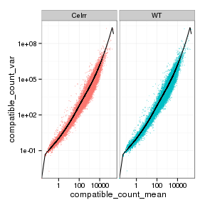 

## Cross-replicate variability (fpkmSCVplot)
Differences in CV 2 can result in lower numbers of differentially expressed genes due to a higher degree of variability between replicate fpkm estimates.

Genes:

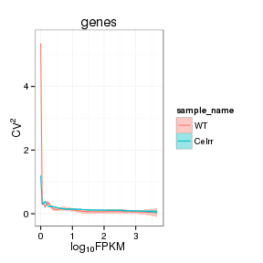 

Isoforms: 

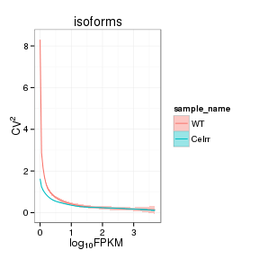 


## MvA plot

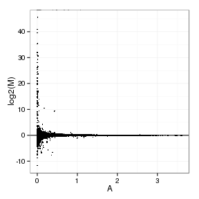 
   
### MvA plot counts

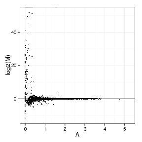 

## Scatterplot matrix

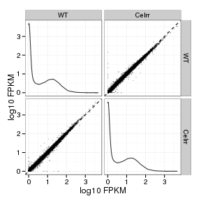 

## Distributions

### Boxplots

Boxplot (genes)

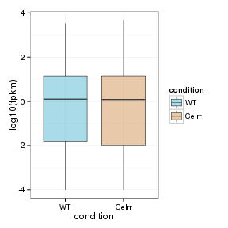 

Boxplot (genes, replicates)

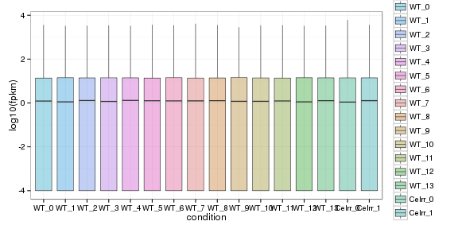 

Boxplot (isoforms)

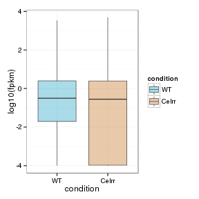 

Boxplot (isoforms, replicates)

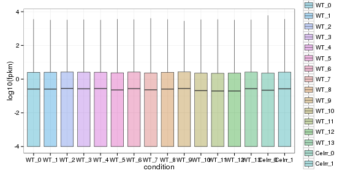 

### Density

Density (genes)

 

Density (genes, replicates)

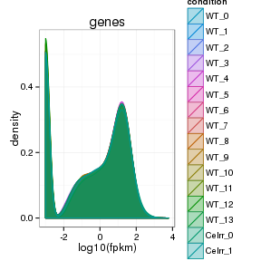 


## Clustering

### Replicate Clusters

 

```
## NULL
```

### PCA (genes)

 

### MDS (genes)

 


# KO assessment

## Endogenous lncRNA expression

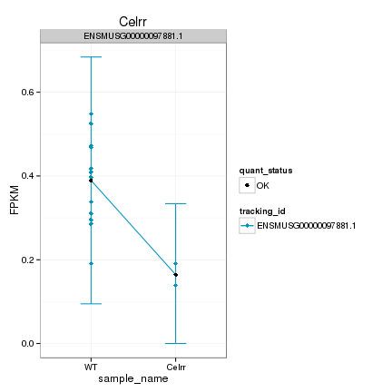 

Endogenous expression of Celrr isoforms:

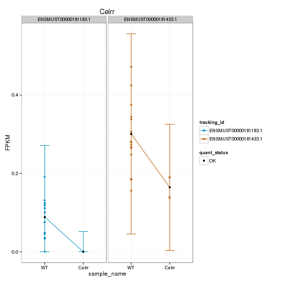 

Barplot of gene expression:

 

Barplot of isoform expression:

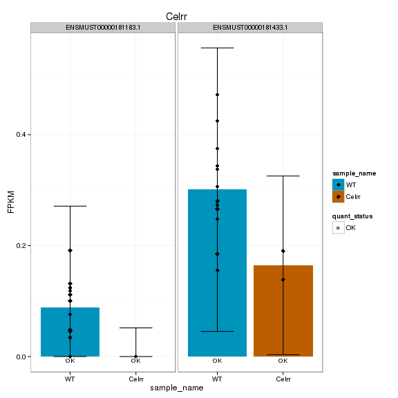 


## LacZ expression

 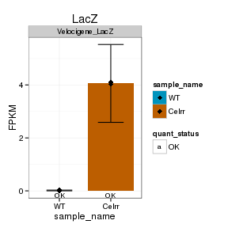 


## Digital Genotyping (LacZ vs Endogenous lncRNA and Sex)

Eif2s3y is a y-expressed gene, Xist is an x-expressed gene 
Expression plot (endogenous linc, lacZ, Y-expressed gene):

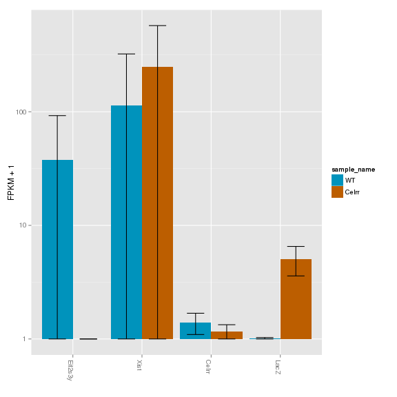 

Expression heatmap:

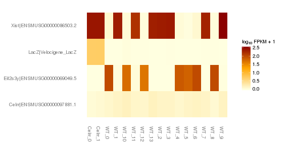 


### Track visualization 

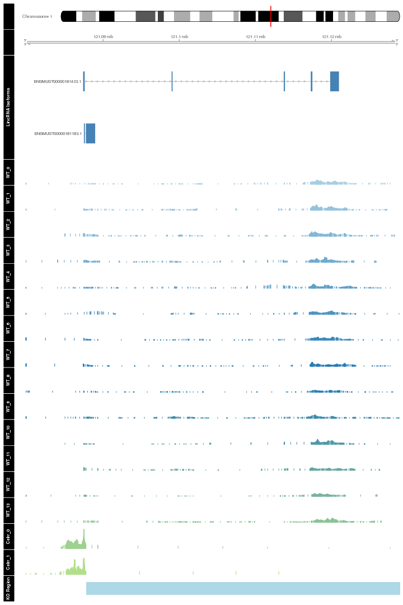 

# Differential Analysis

## Differential Genes 


There are 1516 significantly differentially expressed genes. They are:

<!-- html table generated in R 3.0.2 by xtable 1.7-3 package -->
<!-- Mon Jul 14 18:06:42 2014 -->
<TABLE border=1>
<TR> <TH>  </TH> <TH> geneAnnot$gene_short_name </TH>  </TR>
  <TR> <TD align="right"> 1 </TD> <TD> Tbx2 </TD> </TR>
  <TR> <TD align="right"> 2 </TD> <TD> Ngfr </TD> </TR>
  <TR> <TD align="right"> 3 </TD> <TD> Axin2 </TD> </TR>
  <TR> <TD align="right"> 4 </TD> <TD> Sdhd </TD> </TR>
  <TR> <TD align="right"> 5 </TD> <TD> Hddc2 </TD> </TR>
  <TR> <TD align="right"> 6 </TD> <TD> Cdh1 </TD> </TR>
  <TR> <TD align="right"> 7 </TD> <TD> Mcts1 </TD> </TR>
  <TR> <TD align="right"> 8 </TD> <TD> Ndufa9 </TD> </TR>
  <TR> <TD align="right"> 9 </TD> <TD> Zfp385a </TD> </TR>
  <TR> <TD align="right"> 10 </TD> <TD> Itga5 </TD> </TR>
  <TR> <TD align="right"> 11 </TD> <TD> Atp5f1 </TD> </TR>
  <TR> <TD align="right"> 12 </TD> <TD> Sox9 </TD> </TR>
  <TR> <TD align="right"> 13 </TD> <TD> Hk2 </TD> </TR>
  <TR> <TD align="right"> 14 </TD> <TD> Sez6 </TD> </TR>
  <TR> <TD align="right"> 15 </TD> <TD> Serpinf1 </TD> </TR>
  <TR> <TD align="right"> 16 </TD> <TD> Col6a1 </TD> </TR>
  <TR> <TD align="right"> 17 </TD> <TD> Pcnt </TD> </TR>
  <TR> <TD align="right"> 18 </TD> <TD> Snrnp27 </TD> </TR>
  <TR> <TD align="right"> 19 </TD> <TD> Dpp9 </TD> </TR>
  <TR> <TD align="right"> 20 </TD> <TD> Gabrg1 </TD> </TR>
  <TR> <TD align="right"> 21 </TD> <TD> Zmat2 </TD> </TR>
  <TR> <TD align="right"> 22 </TD> <TD> Mef2d </TD> </TR>
  <TR> <TD align="right"> 23 </TD> <TD> Col18a1 </TD> </TR>
  <TR> <TD align="right"> 24 </TD> <TD> Cyp51 </TD> </TR>
  <TR> <TD align="right"> 25 </TD> <TD> Col1a1 </TD> </TR>
  <TR> <TD align="right"> 26 </TD> <TD> Jup </TD> </TR>
  <TR> <TD align="right"> 27 </TD> <TD> Eef1e1 </TD> </TR>
  <TR> <TD align="right"> 28 </TD> <TD> Chordc1 </TD> </TR>
  <TR> <TD align="right"> 29 </TD> <TD> Sept7 </TD> </TR>
  <TR> <TD align="right"> 30 </TD> <TD> Nup214 </TD> </TR>
  <TR> <TD align="right"> 31 </TD> <TD> Cpa3 </TD> </TR>
  <TR> <TD align="right"> 32 </TD> <TD> Ltbp1 </TD> </TR>
  <TR> <TD align="right"> 33 </TD> <TD> Ssr4 </TD> </TR>
  <TR> <TD align="right"> 34 </TD> <TD> Bcap31 </TD> </TR>
  <TR> <TD align="right"> 35 </TD> <TD> Kmt2a </TD> </TR>
  <TR> <TD align="right"> 36 </TD> <TD> Psmc3 </TD> </TR>
  <TR> <TD align="right"> 37 </TD> <TD> Peg3 </TD> </TR>
  <TR> <TD align="right"> 38 </TD> <TD> Gmpr2 </TD> </TR>
  <TR> <TD align="right"> 39 </TD> <TD> Ndufa11 </TD> </TR>
  <TR> <TD align="right"> 40 </TD> <TD> Use1 </TD> </TR>
  <TR> <TD align="right"> 41 </TD> <TD> Snrpd1 </TD> </TR>
  <TR> <TD align="right"> 42 </TD> <TD> Cse1l </TD> </TR>
  <TR> <TD align="right"> 43 </TD> <TD> Lamb1 </TD> </TR>
  <TR> <TD align="right"> 44 </TD> <TD> Med25 </TD> </TR>
  <TR> <TD align="right"> 45 </TD> <TD> Fam32a </TD> </TR>
  <TR> <TD align="right"> 46 </TD> <TD> Dvl3 </TD> </TR>
  <TR> <TD align="right"> 47 </TD> <TD> Glg1 </TD> </TR>
  <TR> <TD align="right"> 48 </TD> <TD> Abhd17a </TD> </TR>
  <TR> <TD align="right"> 49 </TD> <TD> Grik5 </TD> </TR>
  <TR> <TD align="right"> 50 </TD> <TD> Rabac1 </TD> </TR>
  <TR> <TD align="right"> 51 </TD> <TD> Rps11 </TD> </TR>
  <TR> <TD align="right"> 52 </TD> <TD> Ddr1 </TD> </TR>
  <TR> <TD align="right"> 53 </TD> <TD> Zfp81 </TD> </TR>
  <TR> <TD align="right"> 54 </TD> <TD> Fam162a </TD> </TR>
  <TR> <TD align="right"> 55 </TD> <TD> Rpl8 </TD> </TR>
  <TR> <TD align="right"> 56 </TD> <TD> Dnmt1 </TD> </TR>
  <TR> <TD align="right"> 57 </TD> <TD> Pax2 </TD> </TR>
  <TR> <TD align="right"> 58 </TD> <TD> Atn1 </TD> </TR>
  <TR> <TD align="right"> 59 </TD> <TD> Atp6v1f </TD> </TR>
  <TR> <TD align="right"> 60 </TD> <TD> Utp20 </TD> </TR>
  <TR> <TD align="right"> 61 </TD> <TD> Aqp1 </TD> </TR>
  <TR> <TD align="right"> 62 </TD> <TD> Pax3 </TD> </TR>
  <TR> <TD align="right"> 63 </TD> <TD> Tmem242 </TD> </TR>
  <TR> <TD align="right"> 64 </TD> <TD> Cstb </TD> </TR>
  <TR> <TD align="right"> 65 </TD> <TD> Wisp1 </TD> </TR>
  <TR> <TD align="right"> 66 </TD> <TD> Man2b1 </TD> </TR>
  <TR> <TD align="right"> 67 </TD> <TD> Prdx2 </TD> </TR>
  <TR> <TD align="right"> 68 </TD> <TD> Polr2a </TD> </TR>
  <TR> <TD align="right"> 69 </TD> <TD> Corin </TD> </TR>
  <TR> <TD align="right"> 70 </TD> <TD> Nid1 </TD> </TR>
  <TR> <TD align="right"> 71 </TD> <TD> Pafah1b3 </TD> </TR>
  <TR> <TD align="right"> 72 </TD> <TD> Dnajb1 </TD> </TR>
  <TR> <TD align="right"> 73 </TD> <TD> Evx1 </TD> </TR>
  <TR> <TD align="right"> 74 </TD> <TD> Igf1r </TD> </TR>
  <TR> <TD align="right"> 75 </TD> <TD> Insr </TD> </TR>
  <TR> <TD align="right"> 76 </TD> <TD> Mef2c </TD> </TR>
  <TR> <TD align="right"> 77 </TD> <TD> Kit </TD> </TR>
  <TR> <TD align="right"> 78 </TD> <TD> Pan2 </TD> </TR>
  <TR> <TD align="right"> 79 </TD> <TD> Psmb4 </TD> </TR>
  <TR> <TD align="right"> 80 </TD> <TD> Rsl1d1 </TD> </TR>
  <TR> <TD align="right"> 81 </TD> <TD> Trh </TD> </TR>
  <TR> <TD align="right"> 82 </TD> <TD> Ephb3 </TD> </TR>
  <TR> <TD align="right"> 83 </TD> <TD> Osgep </TD> </TR>
  <TR> <TD align="right"> 84 </TD> <TD> Arpc2 </TD> </TR>
  <TR> <TD align="right"> 85 </TD> <TD> Tmem147 </TD> </TR>
  <TR> <TD align="right"> 86 </TD> <TD> Rps9 </TD> </TR>
  <TR> <TD align="right"> 87 </TD> <TD> Fbln1 </TD> </TR>
  <TR> <TD align="right"> 88 </TD> <TD> Gcat </TD> </TR>
  <TR> <TD align="right"> 89 </TD> <TD> Usp19 </TD> </TR>
  <TR> <TD align="right"> 90 </TD> <TD> Cdc42 </TD> </TR>
  <TR> <TD align="right"> 91 </TD> <TD> Acot13 </TD> </TR>
  <TR> <TD align="right"> 92 </TD> <TD> Sulf2 </TD> </TR>
  <TR> <TD align="right"> 93 </TD> <TD> Chrd </TD> </TR>
  <TR> <TD align="right"> 94 </TD> <TD> Khsrp </TD> </TR>
  <TR> <TD align="right"> 95 </TD> <TD> Ccdc124 </TD> </TR>
  <TR> <TD align="right"> 96 </TD> <TD> Cct4 </TD> </TR>
  <TR> <TD align="right"> 97 </TD> <TD> 0610009B22Rik </TD> </TR>
  <TR> <TD align="right"> 98 </TD> <TD> Zmiz1 </TD> </TR>
  <TR> <TD align="right"> 99 </TD> <TD> Arid1a </TD> </TR>
  <TR> <TD align="right"> 100 </TD> <TD> Rplp1 </TD> </TR>
  <TR> <TD align="right"> 101 </TD> <TD> Snrpb2 </TD> </TR>
  <TR> <TD align="right"> 102 </TD> <TD> Ubc </TD> </TR>
  <TR> <TD align="right"> 103 </TD> <TD> Prpf31 </TD> </TR>
  <TR> <TD align="right"> 104 </TD> <TD> Arpc5 </TD> </TR>
  <TR> <TD align="right"> 105 </TD> <TD> Rala </TD> </TR>
  <TR> <TD align="right"> 106 </TD> <TD> Vdac3 </TD> </TR>
  <TR> <TD align="right"> 107 </TD> <TD> Bmp7 </TD> </TR>
  <TR> <TD align="right"> 108 </TD> <TD> Dynll1 </TD> </TR>
  <TR> <TD align="right"> 109 </TD> <TD> Tmem184b </TD> </TR>
  <TR> <TD align="right"> 110 </TD> <TD> Nav1 </TD> </TR>
  <TR> <TD align="right"> 111 </TD> <TD> Srp14 </TD> </TR>
  <TR> <TD align="right"> 112 </TD> <TD> Bcr </TD> </TR>
  <TR> <TD align="right"> 113 </TD> <TD> Sdhb </TD> </TR>
  <TR> <TD align="right"> 114 </TD> <TD> Rps25 </TD> </TR>
  <TR> <TD align="right"> 115 </TD> <TD> Raver1 </TD> </TR>
  <TR> <TD align="right"> 116 </TD> <TD> Nedd8 </TD> </TR>
  <TR> <TD align="right"> 117 </TD> <TD> Mrpl52 </TD> </TR>
  <TR> <TD align="right"> 118 </TD> <TD> Ebf3 </TD> </TR>
  <TR> <TD align="right"> 119 </TD> <TD> Odc1 </TD> </TR>
  <TR> <TD align="right"> 120 </TD> <TD> Git1 </TD> </TR>
  <TR> <TD align="right"> 121 </TD> <TD> Scarf2 </TD> </TR>
  <TR> <TD align="right"> 122 </TD> <TD> Med15 </TD> </TR>
  <TR> <TD align="right"> 123 </TD> <TD> Rpl15 </TD> </TR>
  <TR> <TD align="right"> 124 </TD> <TD> Rpa3 </TD> </TR>
  <TR> <TD align="right"> 125 </TD> <TD> Phox2b </TD> </TR>
  <TR> <TD align="right"> 126 </TD> <TD> Rps5 </TD> </TR>
  <TR> <TD align="right"> 127 </TD> <TD> Slc41a1 </TD> </TR>
  <TR> <TD align="right"> 128 </TD> <TD> Iglon5 </TD> </TR>
  <TR> <TD align="right"> 129 </TD> <TD> Aldh1a2 </TD> </TR>
  <TR> <TD align="right"> 130 </TD> <TD> Cad </TD> </TR>
  <TR> <TD align="right"> 131 </TD> <TD> Atad1 </TD> </TR>
  <TR> <TD align="right"> 132 </TD> <TD> Elof1 </TD> </TR>
  <TR> <TD align="right"> 133 </TD> <TD> Cacybp </TD> </TR>
  <TR> <TD align="right"> 134 </TD> <TD> Ndufa2 </TD> </TR>
  <TR> <TD align="right"> 135 </TD> <TD> Cox6c </TD> </TR>
  <TR> <TD align="right"> 136 </TD> <TD> Tsg101 </TD> </TR>
  <TR> <TD align="right"> 137 </TD> <TD> Map3k4 </TD> </TR>
  <TR> <TD align="right"> 138 </TD> <TD> Srp19 </TD> </TR>
  <TR> <TD align="right"> 139 </TD> <TD> Csf1 </TD> </TR>
  <TR> <TD align="right"> 140 </TD> <TD> Psmb1 </TD> </TR>
  <TR> <TD align="right"> 141 </TD> <TD> Gata2 </TD> </TR>
  <TR> <TD align="right"> 142 </TD> <TD> Edf1 </TD> </TR>
  <TR> <TD align="right"> 143 </TD> <TD> Actn1 </TD> </TR>
  <TR> <TD align="right"> 144 </TD> <TD> Abca1 </TD> </TR>
  <TR> <TD align="right"> 145 </TD> <TD> Nipsnap3b </TD> </TR>
  <TR> <TD align="right"> 146 </TD> <TD> Sash1 </TD> </TR>
  <TR> <TD align="right"> 147 </TD> <TD> Mocs2 </TD> </TR>
  <TR> <TD align="right"> 148 </TD> <TD> Atp6v0e </TD> </TR>
  <TR> <TD align="right"> 149 </TD> <TD> Gata3 </TD> </TR>
  <TR> <TD align="right"> 150 </TD> <TD> Hspa8 </TD> </TR>
  <TR> <TD align="right"> 151 </TD> <TD> Psma2 </TD> </TR>
  <TR> <TD align="right"> 152 </TD> <TD> Mrpl32 </TD> </TR>
  <TR> <TD align="right"> 153 </TD> <TD> Capza2 </TD> </TR>
  <TR> <TD align="right"> 154 </TD> <TD> Cnih1 </TD> </TR>
  <TR> <TD align="right"> 155 </TD> <TD> Rxra </TD> </TR>
  <TR> <TD align="right"> 156 </TD> <TD> Dstn </TD> </TR>
  <TR> <TD align="right"> 157 </TD> <TD> Lbp </TD> </TR>
  <TR> <TD align="right"> 158 </TD> <TD> Celsr1 </TD> </TR>
  <TR> <TD align="right"> 159 </TD> <TD> Atp5e </TD> </TR>
  <TR> <TD align="right"> 160 </TD> <TD> Slc25a5 </TD> </TR>
  <TR> <TD align="right"> 161 </TD> <TD> Ndufa1 </TD> </TR>
  <TR> <TD align="right"> 162 </TD> <TD> Plgrkt </TD> </TR>
  <TR> <TD align="right"> 163 </TD> <TD> Scube1 </TD> </TR>
  <TR> <TD align="right"> 164 </TD> <TD> Mrps18c </TD> </TR>
  <TR> <TD align="right"> 165 </TD> <TD> Sulf1 </TD> </TR>
  <TR> <TD align="right"> 166 </TD> <TD> Pigt </TD> </TR>
  <TR> <TD align="right"> 167 </TD> <TD> Slc12a7 </TD> </TR>
  <TR> <TD align="right"> 168 </TD> <TD> Med13l </TD> </TR>
  <TR> <TD align="right"> 169 </TD> <TD> Erbb3 </TD> </TR>
  <TR> <TD align="right"> 170 </TD> <TD> Uchl5 </TD> </TR>
  <TR> <TD align="right"> 171 </TD> <TD> Psmb6 </TD> </TR>
  <TR> <TD align="right"> 172 </TD> <TD> Spag7 </TD> </TR>
  <TR> <TD align="right"> 173 </TD> <TD> Pcgf2 </TD> </TR>
  <TR> <TD align="right"> 174 </TD> <TD> Gabarap </TD> </TR>
  <TR> <TD align="right"> 175 </TD> <TD> Glra2 </TD> </TR>
  <TR> <TD align="right"> 176 </TD> <TD> Lhx1 </TD> </TR>
  <TR> <TD align="right"> 177 </TD> <TD> Dync1h1 </TD> </TR>
  <TR> <TD align="right"> 178 </TD> <TD> Rars </TD> </TR>
  <TR> <TD align="right"> 179 </TD> <TD> Ict1 </TD> </TR>
  <TR> <TD align="right"> 180 </TD> <TD> Pelp1 </TD> </TR>
  <TR> <TD align="right"> 181 </TD> <TD> Fis1 </TD> </TR>
  <TR> <TD align="right"> 182 </TD> <TD> Plod1 </TD> </TR>
  <TR> <TD align="right"> 183 </TD> <TD> Tmem160 </TD> </TR>
  <TR> <TD align="right"> 184 </TD> <TD> Atp6v1e1 </TD> </TR>
  <TR> <TD align="right"> 185 </TD> <TD> Map1s </TD> </TR>
  <TR> <TD align="right"> 186 </TD> <TD> Gdpd2 </TD> </TR>
  <TR> <TD align="right"> 187 </TD> <TD> D8Ertd738e </TD> </TR>
  <TR> <TD align="right"> 188 </TD> <TD> Cops3 </TD> </TR>
  <TR> <TD align="right"> 189 </TD> <TD> Ubb </TD> </TR>
  <TR> <TD align="right"> 190 </TD> <TD> D17Wsu104e </TD> </TR>
  <TR> <TD align="right"> 191 </TD> <TD> Sema6a </TD> </TR>
  <TR> <TD align="right"> 192 </TD> <TD> 1110001J03Rik </TD> </TR>
  <TR> <TD align="right"> 193 </TD> <TD> Lyst </TD> </TR>
  <TR> <TD align="right"> 194 </TD> <TD> Hdac2 </TD> </TR>
  <TR> <TD align="right"> 195 </TD> <TD> Utrn </TD> </TR>
  <TR> <TD align="right"> 196 </TD> <TD> Wasf1 </TD> </TR>
  <TR> <TD align="right"> 197 </TD> <TD> Slc16a10 </TD> </TR>
  <TR> <TD align="right"> 198 </TD> <TD> Lama4 </TD> </TR>
  <TR> <TD align="right"> 199 </TD> <TD> Fabp7 </TD> </TR>
  <TR> <TD align="right"> 200 </TD> <TD> Serinc1 </TD> </TR>
  <TR> <TD align="right"> 201 </TD> <TD> Nts </TD> </TR>
  <TR> <TD align="right"> 202 </TD> <TD> Lama2 </TD> </TR>
  <TR> <TD align="right"> 203 </TD> <TD> Zwint </TD> </TR>
  <TR> <TD align="right"> 204 </TD> <TD> Arid5b </TD> </TR>
  <TR> <TD align="right"> 205 </TD> <TD> Actr6 </TD> </TR>
  <TR> <TD align="right"> 206 </TD> <TD> Stx7 </TD> </TR>
  <TR> <TD align="right"> 207 </TD> <TD> Moxd1 </TD> </TR>
  <TR> <TD align="right"> 208 </TD> <TD> Ndufa12 </TD> </TR>
  <TR> <TD align="right"> 209 </TD> <TD> Rfx4 </TD> </TR>
  <TR> <TD align="right"> 210 </TD> <TD> Mybpc1 </TD> </TR>
  <TR> <TD align="right"> 211 </TD> <TD> Ppa1 </TD> </TR>
  <TR> <TD align="right"> 212 </TD> <TD> Eif4ebp2 </TD> </TR>
  <TR> <TD align="right"> 213 </TD> <TD> Unc5b </TD> </TR>
  <TR> <TD align="right"> 214 </TD> <TD> Lrig3 </TD> </TR>
  <TR> <TD align="right"> 215 </TD> <TD> Srgap1 </TD> </TR>
  <TR> <TD align="right"> 216 </TD> <TD> Meis1 </TD> </TR>
  <TR> <TD align="right"> 217 </TD> <TD> Uqcr11 </TD> </TR>
  <TR> <TD align="right"> 218 </TD> <TD> Tcf3 </TD> </TR>
  <TR> <TD align="right"> 219 </TD> <TD> Yeats4 </TD> </TR>
  <TR> <TD align="right"> 220 </TD> <TD> Grb10 </TD> </TR>
  <TR> <TD align="right"> 221 </TD> <TD> Snrpd3 </TD> </TR>
  <TR> <TD align="right"> 222 </TD> <TD> Csrp2 </TD> </TR>
  <TR> <TD align="right"> 223 </TD> <TD> Cabin1 </TD> </TR>
  <TR> <TD align="right"> 224 </TD> <TD> Phlda1 </TD> </TR>
  <TR> <TD align="right"> 225 </TD> <TD> Col6a2 </TD> </TR>
  <TR> <TD align="right"> 226 </TD> <TD> Hint1 </TD> </TR>
  <TR> <TD align="right"> 227 </TD> <TD> Tpgs1 </TD> </TR>
  <TR> <TD align="right"> 228 </TD> <TD> Mdh1 </TD> </TR>
  <TR> <TD align="right"> 229 </TD> <TD> Flt4 </TD> </TR>
  <TR> <TD align="right"> 230 </TD> <TD> Gnb2l1 </TD> </TR>
  <TR> <TD align="right"> 231 </TD> <TD> Sar1b </TD> </TR>
  <TR> <TD align="right"> 232 </TD> <TD> Gabrg2 </TD> </TR>
  <TR> <TD align="right"> 233 </TD> <TD> Drg1 </TD> </TR>
  <TR> <TD align="right"> 234 </TD> <TD> Ccdc104 </TD> </TR>
  <TR> <TD align="right"> 235 </TD> <TD> Aebp1 </TD> </TR>
  <TR> <TD align="right"> 236 </TD> <TD> Supt4a </TD> </TR>
  <TR> <TD align="right"> 237 </TD> <TD> Bzw2 </TD> </TR>
  <TR> <TD align="right"> 238 </TD> <TD> Tspan13 </TD> </TR>
  <TR> <TD align="right"> 239 </TD> <TD> Fam49a </TD> </TR>
  <TR> <TD align="right"> 240 </TD> <TD> Dld </TD> </TR>
  <TR> <TD align="right"> 241 </TD> <TD> Ddx52 </TD> </TR>
  <TR> <TD align="right"> 242 </TD> <TD> Rasl10b </TD> </TR>
  <TR> <TD align="right"> 243 </TD> <TD> Mrc2 </TD> </TR>
  <TR> <TD align="right"> 244 </TD> <TD> Nf1 </TD> </TR>
  <TR> <TD align="right"> 245 </TD> <TD> Psmd12 </TD> </TR>
  <TR> <TD align="right"> 246 </TD> <TD> Hn1 </TD> </TR>
  <TR> <TD align="right"> 247 </TD> <TD> Cluh </TD> </TR>
  <TR> <TD align="right"> 248 </TD> <TD> Txndc17 </TD> </TR>
  <TR> <TD align="right"> 249 </TD> <TD> Rhbdf2 </TD> </TR>
  <TR> <TD align="right"> 250 </TD> <TD> Prpf8 </TD> </TR>
  <TR> <TD align="right"> 251 </TD> <TD> Hoxb9 </TD> </TR>
  <TR> <TD align="right"> 252 </TD> <TD> Myh10 </TD> </TR>
  <TR> <TD align="right"> 253 </TD> <TD> Ntn1 </TD> </TR>
  <TR> <TD align="right"> 254 </TD> <TD> Kat2a </TD> </TR>
  <TR> <TD align="right"> 255 </TD> <TD> Scfd1 </TD> </TR>
  <TR> <TD align="right"> 256 </TD> <TD> Npas3 </TD> </TR>
  <TR> <TD align="right"> 257 </TD> <TD> Psma6 </TD> </TR>
  <TR> <TD align="right"> 258 </TD> <TD> Tmx1 </TD> </TR>
  <TR> <TD align="right"> 259 </TD> <TD> Actr10 </TD> </TR>
  <TR> <TD align="right"> 260 </TD> <TD> Atp6v1d </TD> </TR>
  <TR> <TD align="right"> 261 </TD> <TD> Eif2s1 </TD> </TR>
  <TR> <TD align="right"> 262 </TD> <TD> Vti1b </TD> </TR>
  <TR> <TD align="right"> 263 </TD> <TD> Zfp36l1 </TD> </TR>
  <TR> <TD align="right"> 264 </TD> <TD> Smoc1 </TD> </TR>
  <TR> <TD align="right"> 265 </TD> <TD> Mta1 </TD> </TR>
  <TR> <TD align="right"> 266 </TD> <TD> Gtpbp4 </TD> </TR>
  <TR> <TD align="right"> 267 </TD> <TD> Psmc1 </TD> </TR>
  <TR> <TD align="right"> 268 </TD> <TD> Ccdc88c </TD> </TR>
  <TR> <TD align="right"> 269 </TD> <TD> Unc79 </TD> </TR>
  <TR> <TD align="right"> 270 </TD> <TD> Tshz3 </TD> </TR>
  <TR> <TD align="right"> 271 </TD> <TD> Vsx2 </TD> </TR>
  <TR> <TD align="right"> 272 </TD> <TD> Esrrb </TD> </TR>
  <TR> <TD align="right"> 273 </TD> <TD> Ccnk </TD> </TR>
  <TR> <TD align="right"> 274 </TD> <TD> Hsp90aa1 </TD> </TR>
  <TR> <TD align="right"> 275 </TD> <TD> Cdc42bpb </TD> </TR>
  <TR> <TD align="right"> 276 </TD> <TD> 2010107E04Rik </TD> </TR>
  <TR> <TD align="right"> 277 </TD> <TD> Gli3 </TD> </TR>
  <TR> <TD align="right"> 278 </TD> <TD> Tfap2a </TD> </TR>
  <TR> <TD align="right"> 279 </TD> <TD> Hivep1 </TD> </TR>
  <TR> <TD align="right"> 280 </TD> <TD> Kif13a </TD> </TR>
  <TR> <TD align="right"> 281 </TD> <TD> Ly86 </TD> </TR>
  <TR> <TD align="right"> 282 </TD> <TD> Ror2 </TD> </TR>
  <TR> <TD align="right"> 283 </TD> <TD> Ptch1 </TD> </TR>
  <TR> <TD align="right"> 284 </TD> <TD> Msx2 </TD> </TR>
  <TR> <TD align="right"> 285 </TD> <TD> Txndc15 </TD> </TR>
  <TR> <TD align="right"> 286 </TD> <TD> Cxcl14 </TD> </TR>
  <TR> <TD align="right"> 287 </TD> <TD> 1700001L19Rik </TD> </TR>
  <TR> <TD align="right"> 288 </TD> <TD> Cetn3 </TD> </TR>
  <TR> <TD align="right"> 289 </TD> <TD> Ndufs6 </TD> </TR>
  <TR> <TD align="right"> 290 </TD> <TD> Serf1 </TD> </TR>
  <TR> <TD align="right"> 291 </TD> <TD> Ptcd2 </TD> </TR>
  <TR> <TD align="right"> 292 </TD> <TD> Btf3 </TD> </TR>
  <TR> <TD align="right"> 293 </TD> <TD> Iqgap2 </TD> </TR>
  <TR> <TD align="right"> 294 </TD> <TD> Otp </TD> </TR>
  <TR> <TD align="right"> 295 </TD> <TD> Thbs4 </TD> </TR>
  <TR> <TD align="right"> 296 </TD> <TD> Psmd6 </TD> </TR>
  <TR> <TD align="right"> 297 </TD> <TD> BC067074 </TD> </TR>
  <TR> <TD align="right"> 298 </TD> <TD> Ndufs4 </TD> </TR>
  <TR> <TD align="right"> 299 </TD> <TD> Fam213a </TD> </TR>
  <TR> <TD align="right"> 300 </TD> <TD> Zswim8 </TD> </TR>
  <TR> <TD align="right"> 301 </TD> <TD> Psmc6 </TD> </TR>
  <TR> <TD align="right"> 302 </TD> <TD> Gm6768 </TD> </TR>
  <TR> <TD align="right"> 303 </TD> <TD> Kpna3 </TD> </TR>
  <TR> <TD align="right"> 304 </TD> <TD> Rnaseh2b </TD> </TR>
  <TR> <TD align="right"> 305 </TD> <TD> Mapk8 </TD> </TR>
  <TR> <TD align="right"> 306 </TD> <TD> Gdf10 </TD> </TR>
  <TR> <TD align="right"> 307 </TD> <TD> N6amt2 </TD> </TR>
  <TR> <TD align="right"> 308 </TD> <TD> Wnt5a </TD> </TR>
  <TR> <TD align="right"> 309 </TD> <TD> Esd </TD> </TR>
  <TR> <TD align="right"> 310 </TD> <TD> Dnajc15 </TD> </TR>
  <TR> <TD align="right"> 311 </TD> <TD> Sugt1 </TD> </TR>
  <TR> <TD align="right"> 312 </TD> <TD> Pbk </TD> </TR>
  <TR> <TD align="right"> 313 </TD> <TD> Ccdc25 </TD> </TR>
  <TR> <TD align="right"> 314 </TD> <TD> Stmn4 </TD> </TR>
  <TR> <TD align="right"> 315 </TD> <TD> Bnip3l </TD> </TR>
  <TR> <TD align="right"> 316 </TD> <TD> Ebf2 </TD> </TR>
  <TR> <TD align="right"> 317 </TD> <TD> Bmp1 </TD> </TR>
  <TR> <TD align="right"> 318 </TD> <TD> Sucla2 </TD> </TR>
  <TR> <TD align="right"> 319 </TD> <TD> Uchl3 </TD> </TR>
  <TR> <TD align="right"> 320 </TD> <TD> Nipbl </TD> </TR>
  <TR> <TD align="right"> 321 </TD> <TD> Dab2 </TD> </TR>
  <TR> <TD align="right"> 322 </TD> <TD> Dad1 </TD> </TR>
  <TR> <TD align="right"> 323 </TD> <TD> Lrp10 </TD> </TR>
  <TR> <TD align="right"> 324 </TD> <TD> Psmb5 </TD> </TR>
  <TR> <TD align="right"> 325 </TD> <TD> Sub1 </TD> </TR>
  <TR> <TD align="right"> 326 </TD> <TD> Npr3 </TD> </TR>
  <TR> <TD align="right"> 327 </TD> <TD> Cct5 </TD> </TR>
  <TR> <TD align="right"> 328 </TD> <TD> Skor1 </TD> </TR>
  <TR> <TD align="right"> 329 </TD> <TD> Dcaf13 </TD> </TR>
  <TR> <TD align="right"> 330 </TD> <TD> Eif3h </TD> </TR>
  <TR> <TD align="right"> 331 </TD> <TD> Matn2 </TD> </TR>
  <TR> <TD align="right"> 332 </TD> <TD> Stk3 </TD> </TR>
  <TR> <TD align="right"> 333 </TD> <TD> Eif3e </TD> </TR>
  <TR> <TD align="right"> 334 </TD> <TD> Kcnv1 </TD> </TR>
  <TR> <TD align="right"> 335 </TD> <TD> Ndufb9 </TD> </TR>
  <TR> <TD align="right"> 336 </TD> <TD> Mrpl13 </TD> </TR>
  <TR> <TD align="right"> 337 </TD> <TD> Sla </TD> </TR>
  <TR> <TD align="right"> 338 </TD> <TD> Gtse1 </TD> </TR>
  <TR> <TD align="right"> 339 </TD> <TD> Rbx1 </TD> </TR>
  <TR> <TD align="right"> 340 </TD> <TD> Slc25a17 </TD> </TR>
  <TR> <TD align="right"> 341 </TD> <TD> Enpp2 </TD> </TR>
  <TR> <TD align="right"> 342 </TD> <TD> Tomm22 </TD> </TR>
  <TR> <TD align="right"> 343 </TD> <TD> Cby1 </TD> </TR>
  <TR> <TD align="right"> 344 </TD> <TD> Myh9 </TD> </TR>
  <TR> <TD align="right"> 345 </TD> <TD> Ndufa6 </TD> </TR>
  <TR> <TD align="right"> 346 </TD> <TD> Pmm1 </TD> </TR>
  <TR> <TD align="right"> 347 </TD> <TD> Col2a1 </TD> </TR>
  <TR> <TD align="right"> 348 </TD> <TD> Crebbp </TD> </TR>
  <TR> <TD align="right"> 349 </TD> <TD> Plec </TD> </TR>
  <TR> <TD align="right"> 350 </TD> <TD> Scrib </TD> </TR>
  <TR> <TD align="right"> 351 </TD> <TD> Lmf2 </TD> </TR>
  <TR> <TD align="right"> 352 </TD> <TD> Cblb </TD> </TR>
  <TR> <TD align="right"> 353 </TD> <TD> Tagln3 </TD> </TR>
  <TR> <TD align="right"> 354 </TD> <TD> Prkdc </TD> </TR>
  <TR> <TD align="right"> 355 </TD> <TD> Fopnl </TD> </TR>
  <TR> <TD align="right"> 356 </TD> <TD> Mpv17l </TD> </TR>
  <TR> <TD align="right"> 357 </TD> <TD> Boc </TD> </TR>
  <TR> <TD align="right"> 358 </TD> <TD> Nit2 </TD> </TR>
  <TR> <TD align="right"> 359 </TD> <TD> Arhgap31 </TD> </TR>
  <TR> <TD align="right"> 360 </TD> <TD> Mylk </TD> </TR>
  <TR> <TD align="right"> 361 </TD> <TD> Robo1 </TD> </TR>
  <TR> <TD align="right"> 362 </TD> <TD> Adamts1 </TD> </TR>
  <TR> <TD align="right"> 363 </TD> <TD> Psmg1 </TD> </TR>
  <TR> <TD align="right"> 364 </TD> <TD> Dopey2 </TD> </TR>
  <TR> <TD align="right"> 365 </TD> <TD> Clic6 </TD> </TR>
  <TR> <TD align="right"> 366 </TD> <TD> Sod1 </TD> </TR>
  <TR> <TD align="right"> 367 </TD> <TD> Scaf4 </TD> </TR>
  <TR> <TD align="right"> 368 </TD> <TD> Wnt1 </TD> </TR>
  <TR> <TD align="right"> 369 </TD> <TD> Tuba1b </TD> </TR>
  <TR> <TD align="right"> 370 </TD> <TD> Smarcd1 </TD> </TR>
  <TR> <TD align="right"> 371 </TD> <TD> Cox14 </TD> </TR>
  <TR> <TD align="right"> 372 </TD> <TD> Dip2b </TD> </TR>
  <TR> <TD align="right"> 373 </TD> <TD> Mospd1 </TD> </TR>
  <TR> <TD align="right"> 374 </TD> <TD> Ndufa5 </TD> </TR>
  <TR> <TD align="right"> 375 </TD> <TD> Rpp14 </TD> </TR>
  <TR> <TD align="right"> 376 </TD> <TD> Bsg </TD> </TR>
  <TR> <TD align="right"> 377 </TD> <TD> Scg5 </TD> </TR>
  <TR> <TD align="right"> 378 </TD> <TD> Nfatc4 </TD> </TR>
  <TR> <TD align="right"> 379 </TD> <TD> Celsr3 </TD> </TR>
  <TR> <TD align="right"> 380 </TD> <TD> Prph </TD> </TR>
  <TR> <TD align="right"> 381 </TD> <TD> Pigx </TD> </TR>
  <TR> <TD align="right"> 382 </TD> <TD> Igf2r </TD> </TR>
  <TR> <TD align="right"> 383 </TD> <TD> Acat2 </TD> </TR>
  <TR> <TD align="right"> 384 </TD> <TD> Thbs2 </TD> </TR>
  <TR> <TD align="right"> 385 </TD> <TD> Ubr2 </TD> </TR>
  <TR> <TD align="right"> 386 </TD> <TD> Brd4 </TD> </TR>
  <TR> <TD align="right"> 387 </TD> <TD> Ndufv3 </TD> </TR>
  <TR> <TD align="right"> 388 </TD> <TD> Arhgap28 </TD> </TR>
  <TR> <TD align="right"> 389 </TD> <TD> Wiz </TD> </TR>
  <TR> <TD align="right"> 390 </TD> <TD> Dpy30 </TD> </TR>
  <TR> <TD align="right"> 391 </TD> <TD> Man2a1 </TD> </TR>
  <TR> <TD align="right"> 392 </TD> <TD> Cyp1b1 </TD> </TR>
  <TR> <TD align="right"> 393 </TD> <TD> Ndufv2 </TD> </TR>
  <TR> <TD align="right"> 394 </TD> <TD> Prss41 </TD> </TR>
  <TR> <TD align="right"> 395 </TD> <TD> Epas1 </TD> </TR>
  <TR> <TD align="right"> 396 </TD> <TD> Cript </TD> </TR>
  <TR> <TD align="right"> 397 </TD> <TD> Rfx2 </TD> </TR>
  <TR> <TD align="right"> 398 </TD> <TD> Uqcc2 </TD> </TR>
  <TR> <TD align="right"> 399 </TD> <TD> Anks1 </TD> </TR>
  <TR> <TD align="right"> 400 </TD> <TD> Svil </TD> </TR>
  <TR> <TD align="right"> 401 </TD> <TD> Cox7a2l </TD> </TR>
  <TR> <TD align="right"> 402 </TD> <TD> Polr2d </TD> </TR>
  <TR> <TD align="right"> 403 </TD> <TD> Slc25a46 </TD> </TR>
  <TR> <TD align="right"> 404 </TD> <TD> Sap130 </TD> </TR>
  <TR> <TD align="right"> 405 </TD> <TD> Syt4 </TD> </TR>
  <TR> <TD align="right"> 406 </TD> <TD> Adamts10 </TD> </TR>
  <TR> <TD align="right"> 407 </TD> <TD> H2-Ke2 </TD> </TR>
  <TR> <TD align="right"> 408 </TD> <TD> Pfdn1 </TD> </TR>
  <TR> <TD align="right"> 409 </TD> <TD> Epb4.1l4a </TD> </TR>
  <TR> <TD align="right"> 410 </TD> <TD> Prrc2a </TD> </TR>
  <TR> <TD align="right"> 411 </TD> <TD> Ap3s1 </TD> </TR>
  <TR> <TD align="right"> 412 </TD> <TD> Yipf5 </TD> </TR>
  <TR> <TD align="right"> 413 </TD> <TD> Tcerg1 </TD> </TR>
  <TR> <TD align="right"> 414 </TD> <TD> Ppp2r2b </TD> </TR>
  <TR> <TD align="right"> 415 </TD> <TD> Sec11c </TD> </TR>
  <TR> <TD align="right"> 416 </TD> <TD> Grp </TD> </TR>
  <TR> <TD align="right"> 417 </TD> <TD> Lox </TD> </TR>
  <TR> <TD align="right"> 418 </TD> <TD> Cep192 </TD> </TR>
  <TR> <TD align="right"> 419 </TD> <TD> Sall3 </TD> </TR>
  <TR> <TD align="right"> 420 </TD> <TD> C330018D20Rik </TD> </TR>
  <TR> <TD align="right"> 421 </TD> <TD> Megf10 </TD> </TR>
  <TR> <TD align="right"> 422 </TD> <TD> Fbn2 </TD> </TR>
  <TR> <TD align="right"> 423 </TD> <TD> Rps14 </TD> </TR>
  <TR> <TD align="right"> 424 </TD> <TD> Tcof1 </TD> </TR>
  <TR> <TD align="right"> 425 </TD> <TD> Pdgfrb </TD> </TR>
  <TR> <TD align="right"> 426 </TD> <TD> Psat1 </TD> </TR>
  <TR> <TD align="right"> 427 </TD> <TD> Cyb5 </TD> </TR>
  <TR> <TD align="right"> 428 </TD> <TD> Incenp </TD> </TR>
  <TR> <TD align="right"> 429 </TD> <TD> Tmem2 </TD> </TR>
  <TR> <TD align="right"> 430 </TD> <TD> Cdc42bpg </TD> </TR>
  <TR> <TD align="right"> 431 </TD> <TD> Atg2a </TD> </TR>
  <TR> <TD align="right"> 432 </TD> <TD> Rpp30 </TD> </TR>
  <TR> <TD align="right"> 433 </TD> <TD> Tjp2 </TD> </TR>
  <TR> <TD align="right"> 434 </TD> <TD> Pacs1 </TD> </TR>
  <TR> <TD align="right"> 435 </TD> <TD> Cbwd1 </TD> </TR>
  <TR> <TD align="right"> 436 </TD> <TD> Cpt1a </TD> </TR>
  <TR> <TD align="right"> 437 </TD> <TD> Mrpl11 </TD> </TR>
  <TR> <TD align="right"> 438 </TD> <TD> Lrp5 </TD> </TR>
  <TR> <TD align="right"> 439 </TD> <TD> Drap1 </TD> </TR>
  <TR> <TD align="right"> 440 </TD> <TD> Rela </TD> </TR>
  <TR> <TD align="right"> 441 </TD> <TD> Plcb3 </TD> </TR>
  <TR> <TD align="right"> 442 </TD> <TD> Prdx3 </TD> </TR>
  <TR> <TD align="right"> 443 </TD> <TD> Plce1 </TD> </TR>
  <TR> <TD align="right"> 444 </TD> <TD> Sorbs1 </TD> </TR>
  <TR> <TD align="right"> 445 </TD> <TD> Slit1 </TD> </TR>
  <TR> <TD align="right"> 446 </TD> <TD> Arl3 </TD> </TR>
  <TR> <TD align="right"> 447 </TD> <TD> Fundc1 </TD> </TR>
  <TR> <TD align="right"> 448 </TD> <TD> Btbd1 </TD> </TR>
  <TR> <TD align="right"> 449 </TD> <TD> Bhlhe22 </TD> </TR>
  <TR> <TD align="right"> 450 </TD> <TD> Fasn </TD> </TR>
  <TR> <TD align="right"> 451 </TD> <TD> Ndufb8 </TD> </TR>
  <TR> <TD align="right"> 452 </TD> <TD> Lbx1 </TD> </TR>
  <TR> <TD align="right"> 453 </TD> <TD> Gbf1 </TD> </TR>
  <TR> <TD align="right"> 454 </TD> <TD> Hsd17b10 </TD> </TR>
  <TR> <TD align="right"> 455 </TD> <TD> Huwe1 </TD> </TR>
  <TR> <TD align="right"> 456 </TD> <TD> Flnb </TD> </TR>
  <TR> <TD align="right"> 457 </TD> <TD> Prdx4 </TD> </TR>
  <TR> <TD align="right"> 458 </TD> <TD> Rps24 </TD> </TR>
  <TR> <TD align="right"> 459 </TD> <TD> Rps26 </TD> </TR>
  <TR> <TD align="right"> 460 </TD> <TD> Esyt1 </TD> </TR>
  <TR> <TD align="right"> 461 </TD> <TD> Cnpy2 </TD> </TR>
  <TR> <TD align="right"> 462 </TD> <TD> R3hdm2 </TD> </TR>
  <TR> <TD align="right"> 463 </TD> <TD> Gli1 </TD> </TR>
  <TR> <TD align="right"> 464 </TD> <TD> Msx3 </TD> </TR>
  <TR> <TD align="right"> 465 </TD> <TD> Taldo1 </TD> </TR>
  <TR> <TD align="right"> 466 </TD> <TD> Crcp </TD> </TR>
  <TR> <TD align="right"> 467 </TD> <TD> Gaa </TD> </TR>
  <TR> <TD align="right"> 468 </TD> <TD> Podxl </TD> </TR>
  <TR> <TD align="right"> 469 </TD> <TD> Rps6ka6 </TD> </TR>
  <TR> <TD align="right"> 470 </TD> <TD> Gdap1 </TD> </TR>
  <TR> <TD align="right"> 471 </TD> <TD> Itih5 </TD> </TR>
  <TR> <TD align="right"> 472 </TD> <TD> Atp5c1 </TD> </TR>
  <TR> <TD align="right"> 473 </TD> <TD> St8sia2 </TD> </TR>
  <TR> <TD align="right"> 474 </TD> <TD> Rpl14 </TD> </TR>
  <TR> <TD align="right"> 475 </TD> <TD> Cops5 </TD> </TR>
  <TR> <TD align="right"> 476 </TD> <TD> Tfap2b </TD> </TR>
  <TR> <TD align="right"> 477 </TD> <TD> Ube2w </TD> </TR>
  <TR> <TD align="right"> 478 </TD> <TD> Tmem70 </TD> </TR>
  <TR> <TD align="right"> 479 </TD> <TD> Idh1 </TD> </TR>
  <TR> <TD align="right"> 480 </TD> <TD> Eef1b2 </TD> </TR>
  <TR> <TD align="right"> 481 </TD> <TD> Nop58 </TD> </TR>
  <TR> <TD align="right"> 482 </TD> <TD> Sumo1 </TD> </TR>
  <TR> <TD align="right"> 483 </TD> <TD> Ndufb3 </TD> </TR>
  <TR> <TD align="right"> 484 </TD> <TD> Col5a2 </TD> </TR>
  <TR> <TD align="right"> 485 </TD> <TD> Col3a1 </TD> </TR>
  <TR> <TD align="right"> 486 </TD> <TD> Pdcl3 </TD> </TR>
  <TR> <TD align="right"> 487 </TD> <TD> Mrpl30 </TD> </TR>
  <TR> <TD align="right"> 488 </TD> <TD> Asnsd1 </TD> </TR>
  <TR> <TD align="right"> 489 </TD> <TD> Ormdl1 </TD> </TR>
  <TR> <TD align="right"> 490 </TD> <TD> Tmem131 </TD> </TR>
  <TR> <TD align="right"> 491 </TD> <TD> 1110058L19Rik </TD> </TR>
  <TR> <TD align="right"> 492 </TD> <TD> Igfbp5 </TD> </TR>
  <TR> <TD align="right"> 493 </TD> <TD> Fn1 </TD> </TR>
  <TR> <TD align="right"> 494 </TD> <TD> Psmd1 </TD> </TR>
  <TR> <TD align="right"> 495 </TD> <TD> Ptma </TD> </TR>
  <TR> <TD align="right"> 496 </TD> <TD> Farsb </TD> </TR>
  <TR> <TD align="right"> 497 </TD> <TD> Hdac4 </TD> </TR>
  <TR> <TD align="right"> 498 </TD> <TD> Mki67ip </TD> </TR>
  <TR> <TD align="right"> 499 </TD> <TD> Dbi </TD> </TR>
  <TR> <TD align="right"> 500 </TD> <TD> Pik3c2b </TD> </TR>
  <TR> <TD align="right"> 501 </TD> <TD> Lamc1 </TD> </TR>
  <TR> <TD align="right"> 502 </TD> <TD> Kif26b </TD> </TR>
  <TR> <TD align="right"> 503 </TD> <TD> Srp9 </TD> </TR>
  <TR> <TD align="right"> 504 </TD> <TD> Dpt </TD> </TR>
  <TR> <TD align="right"> 505 </TD> <TD> Astn1 </TD> </TR>
  <TR> <TD align="right"> 506 </TD> <TD> Ptpn14 </TD> </TR>
  <TR> <TD align="right"> 507 </TD> <TD> Ddr2 </TD> </TR>
  <TR> <TD align="right"> 508 </TD> <TD> Nuf2 </TD> </TR>
  <TR> <TD align="right"> 509 </TD> <TD> Mgst3 </TD> </TR>
  <TR> <TD align="right"> 510 </TD> <TD> Mrc1 </TD> </TR>
  <TR> <TD align="right"> 511 </TD> <TD> Psmb7 </TD> </TR>
  <TR> <TD align="right"> 512 </TD> <TD> Lypd6b </TD> </TR>
  <TR> <TD align="right"> 513 </TD> <TD> Col5a1 </TD> </TR>
  <TR> <TD align="right"> 514 </TD> <TD> Lamc3 </TD> </TR>
  <TR> <TD align="right"> 515 </TD> <TD> Psmd14 </TD> </TR>
  <TR> <TD align="right"> 516 </TD> <TD> Notch1 </TD> </TR>
  <TR> <TD align="right"> 517 </TD> <TD> Sec16a </TD> </TR>
  <TR> <TD align="right"> 518 </TD> <TD> Cybrd1 </TD> </TR>
  <TR> <TD align="right"> 519 </TD> <TD> Lrp2 </TD> </TR>
  <TR> <TD align="right"> 520 </TD> <TD> Timm10 </TD> </TR>
  <TR> <TD align="right"> 521 </TD> <TD> Itgav </TD> </TR>
  <TR> <TD align="right"> 522 </TD> <TD> Phospho2 </TD> </TR>
  <TR> <TD align="right"> 523 </TD> <TD> Ola1 </TD> </TR>
  <TR> <TD align="right"> 524 </TD> <TD> Nop10 </TD> </TR>
  <TR> <TD align="right"> 525 </TD> <TD> Ccdc34 </TD> </TR>
  <TR> <TD align="right"> 526 </TD> <TD> Lin7c </TD> </TR>
  <TR> <TD align="right"> 527 </TD> <TD> B230118H07Rik </TD> </TR>
  <TR> <TD align="right"> 528 </TD> <TD> Eif3m </TD> </TR>
  <TR> <TD align="right"> 529 </TD> <TD> Sema6d </TD> </TR>
  <TR> <TD align="right"> 530 </TD> <TD> Fbn1 </TD> </TR>
  <TR> <TD align="right"> 531 </TD> <TD> Cops2 </TD> </TR>
  <TR> <TD align="right"> 532 </TD> <TD> Tspan18 </TD> </TR>
  <TR> <TD align="right"> 533 </TD> <TD> Creb3l1 </TD> </TR>
  <TR> <TD align="right"> 534 </TD> <TD> Lrp4 </TD> </TR>
  <TR> <TD align="right"> 535 </TD> <TD> Lamp5 </TD> </TR>
  <TR> <TD align="right"> 536 </TD> <TD> Jag1 </TD> </TR>
  <TR> <TD align="right"> 537 </TD> <TD> Ndufaf5 </TD> </TR>
  <TR> <TD align="right"> 538 </TD> <TD> Cst3 </TD> </TR>
  <TR> <TD align="right"> 539 </TD> <TD> Pkia </TD> </TR>
  <TR> <TD align="right"> 540 </TD> <TD> Fabp5 </TD> </TR>
  <TR> <TD align="right"> 541 </TD> <TD> Snx16 </TD> </TR>
  <TR> <TD align="right"> 542 </TD> <TD> Psma7 </TD> </TR>
  <TR> <TD align="right"> 543 </TD> <TD> Chrna4 </TD> </TR>
  <TR> <TD align="right"> 544 </TD> <TD> Stmn3 </TD> </TR>
  <TR> <TD align="right"> 545 </TD> <TD> 1110008F13Rik </TD> </TR>
  <TR> <TD align="right"> 546 </TD> <TD> Ndufb5 </TD> </TR>
  <TR> <TD align="right"> 547 </TD> <TD> Sec62 </TD> </TR>
  <TR> <TD align="right"> 548 </TD> <TD> Dcun1d1 </TD> </TR>
  <TR> <TD align="right"> 549 </TD> <TD> Serpini1 </TD> </TR>
  <TR> <TD align="right"> 550 </TD> <TD> Notch2 </TD> </TR>
  <TR> <TD align="right"> 551 </TD> <TD> Ints3 </TD> </TR>
  <TR> <TD align="right"> 552 </TD> <TD> Col11a1 </TD> </TR>
  <TR> <TD align="right"> 553 </TD> <TD> Lef1 </TD> </TR>
  <TR> <TD align="right"> 554 </TD> <TD> Sfrp2 </TD> </TR>
  <TR> <TD align="right"> 555 </TD> <TD> Plrg1 </TD> </TR>
  <TR> <TD align="right"> 556 </TD> <TD> Aimp1 </TD> </TR>
  <TR> <TD align="right"> 557 </TD> <TD> Apoa1bp </TD> </TR>
  <TR> <TD align="right"> 558 </TD> <TD> Rps3a1 </TD> </TR>
  <TR> <TD align="right"> 559 </TD> <TD> Rprd2 </TD> </TR>
  <TR> <TD align="right"> 560 </TD> <TD> Abca4 </TD> </TR>
  <TR> <TD align="right"> 561 </TD> <TD> Adh5 </TD> </TR>
  <TR> <TD align="right"> 562 </TD> <TD> Them4 </TD> </TR>
  <TR> <TD align="right"> 563 </TD> <TD> Eif4e </TD> </TR>
  <TR> <TD align="right"> 564 </TD> <TD> Nfkb1 </TD> </TR>
  <TR> <TD align="right"> 565 </TD> <TD> Rpf1 </TD> </TR>
  <TR> <TD align="right"> 566 </TD> <TD> Tmem68 </TD> </TR>
  <TR> <TD align="right"> 567 </TD> <TD> Rps20 </TD> </TR>
  <TR> <TD align="right"> 568 </TD> <TD> Gtf2b </TD> </TR>
  <TR> <TD align="right"> 569 </TD> <TD> Smim8 </TD> </TR>
  <TR> <TD align="right"> 570 </TD> <TD> Tnc </TD> </TR>
  <TR> <TD align="right"> 571 </TD> <TD> Txn1 </TD> </TR>
  <TR> <TD align="right"> 572 </TD> <TD> Svep1 </TD> </TR>
  <TR> <TD align="right"> 573 </TD> <TD> Bag1 </TD> </TR>
  <TR> <TD align="right"> 574 </TD> <TD> Chmp5 </TD> </TR>
  <TR> <TD align="right"> 575 </TD> <TD> Nol6 </TD> </TR>
  <TR> <TD align="right"> 576 </TD> <TD> Ubap2 </TD> </TR>
  <TR> <TD align="right"> 577 </TD> <TD> Nudt2 </TD> </TR>
  <TR> <TD align="right"> 578 </TD> <TD> Cntfr </TD> </TR>
  <TR> <TD align="right"> 579 </TD> <TD> Clta </TD> </TR>
  <TR> <TD align="right"> 580 </TD> <TD> Ppap2b </TD> </TR>
  <TR> <TD align="right"> 581 </TD> <TD> Pum1 </TD> </TR>
  <TR> <TD align="right"> 582 </TD> <TD> Scp2 </TD> </TR>
  <TR> <TD align="right"> 583 </TD> <TD> Magoh </TD> </TR>
  <TR> <TD align="right"> 584 </TD> <TD> Col9a2 </TD> </TR>
  <TR> <TD align="right"> 585 </TD> <TD> Ybx1 </TD> </TR>
  <TR> <TD align="right"> 586 </TD> <TD> Ccdc23 </TD> </TR>
  <TR> <TD align="right"> 587 </TD> <TD> Eif2b3 </TD> </TR>
  <TR> <TD align="right"> 588 </TD> <TD> Prdx1 </TD> </TR>
  <TR> <TD align="right"> 589 </TD> <TD> Akr1a1 </TD> </TR>
  <TR> <TD align="right"> 590 </TD> <TD> Dmbx1 </TD> </TR>
  <TR> <TD align="right"> 591 </TD> <TD> Cmpk1 </TD> </TR>
  <TR> <TD align="right"> 592 </TD> <TD> Eif4g3 </TD> </TR>
  <TR> <TD align="right"> 593 </TD> <TD> Zcchc17 </TD> </TR>
  <TR> <TD align="right"> 594 </TD> <TD> Ccdc28b </TD> </TR>
  <TR> <TD align="right"> 595 </TD> <TD> Eif3i </TD> </TR>
  <TR> <TD align="right"> 596 </TD> <TD> Zfp362 </TD> </TR>
  <TR> <TD align="right"> 597 </TD> <TD> Tmem50a </TD> </TR>
  <TR> <TD align="right"> 598 </TD> <TD> Psmb2 </TD> </TR>
  <TR> <TD align="right"> 599 </TD> <TD> Trappc3 </TD> </TR>
  <TR> <TD align="right"> 600 </TD> <TD> Map7d1 </TD> </TR>
  <TR> <TD align="right"> 601 </TD> <TD> Wasf2 </TD> </TR>
  <TR> <TD align="right"> 602 </TD> <TD> Psmc2 </TD> </TR>
  <TR> <TD align="right"> 603 </TD> <TD> Rpl22 </TD> </TR>
  <TR> <TD align="right"> 604 </TD> <TD> Ube4b </TD> </TR>
  <TR> <TD align="right"> 605 </TD> <TD> Casz1 </TD> </TR>
  <TR> <TD align="right"> 606 </TD> <TD> Mtor </TD> </TR>
  <TR> <TD align="right"> 607 </TD> <TD> Tomm7 </TD> </TR>
  <TR> <TD align="right"> 608 </TD> <TD> Orc5 </TD> </TR>
  <TR> <TD align="right"> 609 </TD> <TD> Trp73 </TD> </TR>
  <TR> <TD align="right"> 610 </TD> <TD> Ssu72 </TD> </TR>
  <TR> <TD align="right"> 611 </TD> <TD> Rer1 </TD> </TR>
  <TR> <TD align="right"> 612 </TD> <TD> Ski </TD> </TR>
  <TR> <TD align="right"> 613 </TD> <TD> Mrpl20 </TD> </TR>
  <TR> <TD align="right"> 614 </TD> <TD> Sorcs2 </TD> </TR>
  <TR> <TD align="right"> 615 </TD> <TD> Afap1 </TD> </TR>
  <TR> <TD align="right"> 616 </TD> <TD> Rab28 </TD> </TR>
  <TR> <TD align="right"> 617 </TD> <TD> Slc30a3 </TD> </TR>
  <TR> <TD align="right"> 618 </TD> <TD> Ociad1 </TD> </TR>
  <TR> <TD align="right"> 619 </TD> <TD> Spata18 </TD> </TR>
  <TR> <TD align="right"> 620 </TD> <TD> Grpel1 </TD> </TR>
  <TR> <TD align="right"> 621 </TD> <TD> Pdgfra </TD> </TR>
  <TR> <TD align="right"> 622 </TD> <TD> Paics </TD> </TR>
  <TR> <TD align="right"> 623 </TD> <TD> Tgfbr3 </TD> </TR>
  <TR> <TD align="right"> 624 </TD> <TD> Aff1 </TD> </TR>
  <TR> <TD align="right"> 625 </TD> <TD> Shroom3 </TD> </TR>
  <TR> <TD align="right"> 626 </TD> <TD> Cct6a </TD> </TR>
  <TR> <TD align="right"> 627 </TD> <TD> Vps29 </TD> </TR>
  <TR> <TD align="right"> 628 </TD> <TD> Arpc3 </TD> </TR>
  <TR> <TD align="right"> 629 </TD> <TD> Ncor2 </TD> </TR>
  <TR> <TD align="right"> 630 </TD> <TD> Dhx37 </TD> </TR>
  <TR> <TD align="right"> 631 </TD> <TD> Ep400 </TD> </TR>
  <TR> <TD align="right"> 632 </TD> <TD> Ulk1 </TD> </TR>
  <TR> <TD align="right"> 633 </TD> <TD> Triap1 </TD> </TR>
  <TR> <TD align="right"> 634 </TD> <TD> Ints1 </TD> </TR>
  <TR> <TD align="right"> 635 </TD> <TD> Ube3b </TD> </TR>
  <TR> <TD align="right"> 636 </TD> <TD> Rpl6 </TD> </TR>
  <TR> <TD align="right"> 637 </TD> <TD> Ccz1 </TD> </TR>
  <TR> <TD align="right"> 638 </TD> <TD> Ndufa4 </TD> </TR>
  <TR> <TD align="right"> 639 </TD> <TD> Polr1d </TD> </TR>
  <TR> <TD align="right"> 640 </TD> <TD> Pomp </TD> </TR>
  <TR> <TD align="right"> 641 </TD> <TD> Col1a2 </TD> </TR>
  <TR> <TD align="right"> 642 </TD> <TD> Auts2 </TD> </TR>
  <TR> <TD align="right"> 643 </TD> <TD> Ephb4 </TD> </TR>
  <TR> <TD align="right"> 644 </TD> <TD> Dync1i1 </TD> </TR>
  <TR> <TD align="right"> 645 </TD> <TD> Nt5c3 </TD> </TR>
  <TR> <TD align="right"> 646 </TD> <TD> Svopl </TD> </TR>
  <TR> <TD align="right"> 647 </TD> <TD> Slc13a4 </TD> </TR>
  <TR> <TD align="right"> 648 </TD> <TD> Zyx </TD> </TR>
  <TR> <TD align="right"> 649 </TD> <TD> Cct7 </TD> </TR>
  <TR> <TD align="right"> 650 </TD> <TD> Adamts9 </TD> </TR>
  <TR> <TD align="right"> 651 </TD> <TD> Lrig1 </TD> </TR>
  <TR> <TD align="right"> 652 </TD> <TD> Mrpl53 </TD> </TR>
  <TR> <TD align="right"> 653 </TD> <TD> Cnbp </TD> </TR>
  <TR> <TD align="right"> 654 </TD> <TD> Plxna1 </TD> </TR>
  <TR> <TD align="right"> 655 </TD> <TD> Chchd6 </TD> </TR>
  <TR> <TD align="right"> 656 </TD> <TD> A2m </TD> </TR>
  <TR> <TD align="right"> 657 </TD> <TD> Plxnd1 </TD> </TR>
  <TR> <TD align="right"> 658 </TD> <TD> Emp1 </TD> </TR>
  <TR> <TD align="right"> 659 </TD> <TD> Atf7ip </TD> </TR>
  <TR> <TD align="right"> 660 </TD> <TD> Wbp11 </TD> </TR>
  <TR> <TD align="right"> 661 </TD> <TD> Strap </TD> </TR>
  <TR> <TD align="right"> 662 </TD> <TD> Ldhb </TD> </TR>
  <TR> <TD align="right"> 663 </TD> <TD> Cmas </TD> </TR>
  <TR> <TD align="right"> 664 </TD> <TD> Ccdc91 </TD> </TR>
  <TR> <TD align="right"> 665 </TD> <TD> Cand2 </TD> </TR>
  <TR> <TD align="right"> 666 </TD> <TD> D6Wsu163e </TD> </TR>
  <TR> <TD align="right"> 667 </TD> <TD> Fkbp4 </TD> </TR>
  <TR> <TD align="right"> 668 </TD> <TD> Mark4 </TD> </TR>
  <TR> <TD align="right"> 669 </TD> <TD> Nova2 </TD> </TR>
  <TR> <TD align="right"> 670 </TD> <TD> Pop4 </TD> </TR>
  <TR> <TD align="right"> 671 </TD> <TD> Herc2 </TD> </TR>
  <TR> <TD align="right"> 672 </TD> <TD> Dbx1 </TD> </TR>
  <TR> <TD align="right"> 673 </TD> <TD> Tjp1 </TD> </TR>
  <TR> <TD align="right"> 674 </TD> <TD> Furin </TD> </TR>
  <TR> <TD align="right"> 675 </TD> <TD> Iqgap1 </TD> </TR>
  <TR> <TD align="right"> 676 </TD> <TD> Sema4b </TD> </TR>
  <TR> <TD align="right"> 677 </TD> <TD> Nr2f2 </TD> </TR>
  <TR> <TD align="right"> 678 </TD> <TD> Sipa1l3 </TD> </TR>
  <TR> <TD align="right"> 679 </TD> <TD> Psmd8 </TD> </TR>
  <TR> <TD align="right"> 680 </TD> <TD> Tmem126a </TD> </TR>
  <TR> <TD align="right"> 681 </TD> <TD> Ndufc2 </TD> </TR>
  <TR> <TD align="right"> 682 </TD> <TD> Arl6ip1 </TD> </TR>
  <TR> <TD align="right"> 683 </TD> <TD> Smg1 </TD> </TR>
  <TR> <TD align="right"> 684 </TD> <TD> Xylt1 </TD> </TR>
  <TR> <TD align="right"> 685 </TD> <TD> 1110004F10Rik </TD> </TR>
  <TR> <TD align="right"> 686 </TD> <TD> Rps3 </TD> </TR>
  <TR> <TD align="right"> 687 </TD> <TD> Nsmce1 </TD> </TR>
  <TR> <TD align="right"> 688 </TD> <TD> Psma1 </TD> </TR>
  <TR> <TD align="right"> 689 </TD> <TD> Lcmt1 </TD> </TR>
  <TR> <TD align="right"> 690 </TD> <TD> Arhgap17 </TD> </TR>
  <TR> <TD align="right"> 691 </TD> <TD> Disp1 </TD> </TR>
  <TR> <TD align="right"> 692 </TD> <TD> Mettl9 </TD> </TR>
  <TR> <TD align="right"> 693 </TD> <TD> Uqcrc2 </TD> </TR>
  <TR> <TD align="right"> 694 </TD> <TD> Mki67 </TD> </TR>
  <TR> <TD align="right"> 695 </TD> <TD> Tmem9b </TD> </TR>
  <TR> <TD align="right"> 696 </TD> <TD> St5 </TD> </TR>
  <TR> <TD align="right"> 697 </TD> <TD> Ndufb11 </TD> </TR>
  <TR> <TD align="right"> 698 </TD> <TD> Glrx3 </TD> </TR>
  <TR> <TD align="right"> 699 </TD> <TD> Rab33a </TD> </TR>
  <TR> <TD align="right"> 700 </TD> <TD> Gpc4 </TD> </TR>
  <TR> <TD align="right"> 701 </TD> <TD> Praf2 </TD> </TR>
  <TR> <TD align="right"> 702 </TD> <TD> Ftsj1 </TD> </TR>
  <TR> <TD align="right"> 703 </TD> <TD> Vbp1 </TD> </TR>
  <TR> <TD align="right"> 704 </TD> <TD> Igbp1 </TD> </TR>
  <TR> <TD align="right"> 705 </TD> <TD> Pbdc1 </TD> </TR>
  <TR> <TD align="right"> 706 </TD> <TD> Cox7b </TD> </TR>
  <TR> <TD align="right"> 707 </TD> <TD> Hmgn5 </TD> </TR>
  <TR> <TD align="right"> 708 </TD> <TD> Col4a6 </TD> </TR>
  <TR> <TD align="right"> 709 </TD> <TD> Col4a5 </TD> </TR>
  <TR> <TD align="right"> 710 </TD> <TD> Rps4x </TD> </TR>
  <TR> <TD align="right"> 711 </TD> <TD> Cetn2 </TD> </TR>
  <TR> <TD align="right"> 712 </TD> <TD> Bgn </TD> </TR>
  <TR> <TD align="right"> 713 </TD> <TD> Hcfc1 </TD> </TR>
  <TR> <TD align="right"> 714 </TD> <TD> Morf4l2 </TD> </TR>
  <TR> <TD align="right"> 715 </TD> <TD> Psmd10 </TD> </TR>
  <TR> <TD align="right"> 716 </TD> <TD> Gpr124 </TD> </TR>
  <TR> <TD align="right"> 717 </TD> <TD> Col4a1 </TD> </TR>
  <TR> <TD align="right"> 718 </TD> <TD> Col4a2 </TD> </TR>
  <TR> <TD align="right"> 719 </TD> <TD> Gpm6a </TD> </TR>
  <TR> <TD align="right"> 720 </TD> <TD> Polb </TD> </TR>
  <TR> <TD align="right"> 721 </TD> <TD> Plat </TD> </TR>
  <TR> <TD align="right"> 722 </TD> <TD> Kat6a </TD> </TR>
  <TR> <TD align="right"> 723 </TD> <TD> Gins4 </TD> </TR>
  <TR> <TD align="right"> 724 </TD> <TD> Tm2d2 </TD> </TR>
  <TR> <TD align="right"> 725 </TD> <TD> Slit2 </TD> </TR>
  <TR> <TD align="right"> 726 </TD> <TD> Tenm3 </TD> </TR>
  <TR> <TD align="right"> 727 </TD> <TD> Sc4mol </TD> </TR>
  <TR> <TD align="right"> 728 </TD> <TD> Casp3 </TD> </TR>
  <TR> <TD align="right"> 729 </TD> <TD> Slc25a4 </TD> </TR>
  <TR> <TD align="right"> 730 </TD> <TD> Nkd1 </TD> </TR>
  <TR> <TD align="right"> 731 </TD> <TD> Sall1 </TD> </TR>
  <TR> <TD align="right"> 732 </TD> <TD> Vps35 </TD> </TR>
  <TR> <TD align="right"> 733 </TD> <TD> Orc6 </TD> </TR>
  <TR> <TD align="right"> 734 </TD> <TD> Itfg1 </TD> </TR>
  <TR> <TD align="right"> 735 </TD> <TD> Rfx1 </TD> </TR>
  <TR> <TD align="right"> 736 </TD> <TD> Gab1 </TD> </TR>
  <TR> <TD align="right"> 737 </TD> <TD> Mmp2 </TD> </TR>
  <TR> <TD align="right"> 738 </TD> <TD> Gpr56 </TD> </TR>
  <TR> <TD align="right"> 739 </TD> <TD> Mmp15 </TD> </TR>
  <TR> <TD align="right"> 740 </TD> <TD> Pgls </TD> </TR>
  <TR> <TD align="right"> 741 </TD> <TD> Mast3 </TD> </TR>
  <TR> <TD align="right"> 742 </TD> <TD> Cdh5 </TD> </TR>
  <TR> <TD align="right"> 743 </TD> <TD> Hsd11b2 </TD> </TR>
  <TR> <TD align="right"> 744 </TD> <TD> Nip7 </TD> </TR>
  <TR> <TD align="right"> 745 </TD> <TD> Ankrd49 </TD> </TR>
  <TR> <TD align="right"> 746 </TD> <TD> Gabarapl2 </TD> </TR>
  <TR> <TD align="right"> 747 </TD> <TD> Cfdp1 </TD> </TR>
  <TR> <TD align="right"> 748 </TD> <TD> Bcar1 </TD> </TR>
  <TR> <TD align="right"> 749 </TD> <TD> Tbx20 </TD> </TR>
  <TR> <TD align="right"> 750 </TD> <TD> Dcun1d5 </TD> </TR>
  <TR> <TD align="right"> 751 </TD> <TD> Pvrl1 </TD> </TR>
  <TR> <TD align="right"> 752 </TD> <TD> Pts </TD> </TR>
  <TR> <TD align="right"> 753 </TD> <TD> Ddx25 </TD> </TR>
  <TR> <TD align="right"> 754 </TD> <TD> Hyou1 </TD> </TR>
  <TR> <TD align="right"> 755 </TD> <TD> Robo4 </TD> </TR>
  <TR> <TD align="right"> 756 </TD> <TD> Robo3 </TD> </TR>
  <TR> <TD align="right"> 757 </TD> <TD> Pin1 </TD> </TR>
  <TR> <TD align="right"> 758 </TD> <TD> Smarca4 </TD> </TR>
  <TR> <TD align="right"> 759 </TD> <TD> Kank2 </TD> </TR>
  <TR> <TD align="right"> 760 </TD> <TD> Dock6 </TD> </TR>
  <TR> <TD align="right"> 761 </TD> <TD> Myo1e </TD> </TR>
  <TR> <TD align="right"> 762 </TD> <TD> Cgnl1 </TD> </TR>
  <TR> <TD align="right"> 763 </TD> <TD> Itga11 </TD> </TR>
  <TR> <TD align="right"> 764 </TD> <TD> Idh3a </TD> </TR>
  <TR> <TD align="right"> 765 </TD> <TD> Tle3 </TD> </TR>
  <TR> <TD align="right"> 766 </TD> <TD> Imp3 </TD> </TR>
  <TR> <TD align="right"> 767 </TD> <TD> 1700017B05Rik </TD> </TR>
  <TR> <TD align="right"> 768 </TD> <TD> Psma4 </TD> </TR>
  <TR> <TD align="right"> 769 </TD> <TD> Stra6 </TD> </TR>
  <TR> <TD align="right"> 770 </TD> <TD> Cox7a2 </TD> </TR>
  <TR> <TD align="right"> 771 </TD> <TD> Loxl1 </TD> </TR>
  <TR> <TD align="right"> 772 </TD> <TD> Neo1 </TD> </TR>
  <TR> <TD align="right"> 773 </TD> <TD> Car12 </TD> </TR>
  <TR> <TD align="right"> 774 </TD> <TD> Ppib </TD> </TR>
  <TR> <TD align="right"> 775 </TD> <TD> Igdcc3 </TD> </TR>
  <TR> <TD align="right"> 776 </TD> <TD> Snapc5 </TD> </TR>
  <TR> <TD align="right"> 777 </TD> <TD> Rpl4 </TD> </TR>
  <TR> <TD align="right"> 778 </TD> <TD> Smad3 </TD> </TR>
  <TR> <TD align="right"> 779 </TD> <TD> Copb2 </TD> </TR>
  <TR> <TD align="right"> 780 </TD> <TD> Mrps22 </TD> </TR>
  <TR> <TD align="right"> 781 </TD> <TD> Rpsa </TD> </TR>
  <TR> <TD align="right"> 782 </TD> <TD> Deb1 </TD> </TR>
  <TR> <TD align="right"> 783 </TD> <TD> Cck </TD> </TR>
  <TR> <TD align="right"> 784 </TD> <TD> Ephb1 </TD> </TR>
  <TR> <TD align="right"> 785 </TD> <TD> Pik3r4 </TD> </TR>
  <TR> <TD align="right"> 786 </TD> <TD> Bsn </TD> </TR>
  <TR> <TD align="right"> 787 </TD> <TD> Thsd7a </TD> </TR>
  <TR> <TD align="right"> 788 </TD> <TD> Atxn2l </TD> </TR>
  <TR> <TD align="right"> 789 </TD> <TD> Syde1 </TD> </TR>
  <TR> <TD align="right"> 790 </TD> <TD> Abtb2 </TD> </TR>
  <TR> <TD align="right"> 791 </TD> <TD> Inppl1 </TD> </TR>
  <TR> <TD align="right"> 792 </TD> <TD> Tpcn1 </TD> </TR>
  <TR> <TD align="right"> 793 </TD> <TD> Gtf3c1 </TD> </TR>
  <TR> <TD align="right"> 794 </TD> <TD> Lama1 </TD> </TR>
  <TR> <TD align="right"> 795 </TD> <TD> Arhgef17 </TD> </TR>
  <TR> <TD align="right"> 796 </TD> <TD> Hspa13 </TD> </TR>
  <TR> <TD align="right"> 797 </TD> <TD> Sox10 </TD> </TR>
  <TR> <TD align="right"> 798 </TD> <TD> Polr2f </TD> </TR>
  <TR> <TD align="right"> 799 </TD> <TD> Cdo1 </TD> </TR>
  <TR> <TD align="right"> 800 </TD> <TD> Resp18 </TD> </TR>
  <TR> <TD align="right"> 801 </TD> <TD> Gga1 </TD> </TR>
  <TR> <TD align="right"> 802 </TD> <TD> Atp1a1 </TD> </TR>
  <TR> <TD align="right"> 803 </TD> <TD> Ptprm </TD> </TR>
  <TR> <TD align="right"> 804 </TD> <TD> Ptprf </TD> </TR>
  <TR> <TD align="right"> 805 </TD> <TD> Lpp </TD> </TR>
  <TR> <TD align="right"> 806 </TD> <TD> Mif </TD> </TR>
  <TR> <TD align="right"> 807 </TD> <TD> Antxr1 </TD> </TR>
  <TR> <TD align="right"> 808 </TD> <TD> Adamts15 </TD> </TR>
  <TR> <TD align="right"> 809 </TD> <TD> Tmem35 </TD> </TR>
  <TR> <TD align="right"> 810 </TD> <TD> Ndn </TD> </TR>
  <TR> <TD align="right"> 811 </TD> <TD> Lgi3 </TD> </TR>
  <TR> <TD align="right"> 812 </TD> <TD> Cep350 </TD> </TR>
  <TR> <TD align="right"> 813 </TD> <TD> Adra2a </TD> </TR>
  <TR> <TD align="right"> 814 </TD> <TD> Atp6v1h </TD> </TR>
  <TR> <TD align="right"> 815 </TD> <TD> Mrpl15 </TD> </TR>
  <TR> <TD align="right"> 816 </TD> <TD> Map9 </TD> </TR>
  <TR> <TD align="right"> 817 </TD> <TD> Chmp2a </TD> </TR>
  <TR> <TD align="right"> 818 </TD> <TD> Ndufb7 </TD> </TR>
  <TR> <TD align="right"> 819 </TD> <TD> Zswim5 </TD> </TR>
  <TR> <TD align="right"> 820 </TD> <TD> Slc16a2 </TD> </TR>
  <TR> <TD align="right"> 821 </TD> <TD> Cpsf1 </TD> </TR>
  <TR> <TD align="right"> 822 </TD> <TD> Rpap1 </TD> </TR>
  <TR> <TD align="right"> 823 </TD> <TD> Fstl5 </TD> </TR>
  <TR> <TD align="right"> 824 </TD> <TD> Irf2bpl </TD> </TR>
  <TR> <TD align="right"> 825 </TD> <TD> Lsm3 </TD> </TR>
  <TR> <TD align="right"> 826 </TD> <TD> Plekhm1 </TD> </TR>
  <TR> <TD align="right"> 827 </TD> <TD> Iqsec1 </TD> </TR>
  <TR> <TD align="right"> 828 </TD> <TD> Tmem132c </TD> </TR>
  <TR> <TD align="right"> 829 </TD> <TD> Ina </TD> </TR>
  <TR> <TD align="right"> 830 </TD> <TD> Gtf2h5 </TD> </TR>
  <TR> <TD align="right"> 831 </TD> <TD> Cmip </TD> </TR>
  <TR> <TD align="right"> 832 </TD> <TD> Zfp395 </TD> </TR>
  <TR> <TD align="right"> 833 </TD> <TD> Atp5h </TD> </TR>
  <TR> <TD align="right"> 834 </TD> <TD> Ptpn13 </TD> </TR>
  <TR> <TD align="right"> 835 </TD> <TD> Mon2 </TD> </TR>
  <TR> <TD align="right"> 836 </TD> <TD> Sema3f </TD> </TR>
  <TR> <TD align="right"> 837 </TD> <TD> Fras1 </TD> </TR>
  <TR> <TD align="right"> 838 </TD> <TD> Gns </TD> </TR>
  <TR> <TD align="right"> 839 </TD> <TD> Mfrp </TD> </TR>
  <TR> <TD align="right"> 840 </TD> <TD> Mast4 </TD> </TR>
  <TR> <TD align="right"> 841 </TD> <TD> Tet3 </TD> </TR>
  <TR> <TD align="right"> 842 </TD> <TD> Nudt19 </TD> </TR>
  <TR> <TD align="right"> 843 </TD> <TD> Sidt2 </TD> </TR>
  <TR> <TD align="right"> 844 </TD> <TD> Rnf44 </TD> </TR>
  <TR> <TD align="right"> 845 </TD> <TD> Zc4h2 </TD> </TR>
  <TR> <TD align="right"> 846 </TD> <TD> Eif2s3x </TD> </TR>
  <TR> <TD align="right"> 847 </TD> <TD> Tanc1 </TD> </TR>
  <TR> <TD align="right"> 848 </TD> <TD> Heatr5a </TD> </TR>
  <TR> <TD align="right"> 849 </TD> <TD> Nkx6-1 </TD> </TR>
  <TR> <TD align="right"> 850 </TD> <TD> Spcs2 </TD> </TR>
  <TR> <TD align="right"> 851 </TD> <TD> Trim13 </TD> </TR>
  <TR> <TD align="right"> 852 </TD> <TD> Pkig </TD> </TR>
  <TR> <TD align="right"> 853 </TD> <TD> Tpbg </TD> </TR>
  <TR> <TD align="right"> 854 </TD> <TD> Ssc5d </TD> </TR>
  <TR> <TD align="right"> 855 </TD> <TD> Cops4 </TD> </TR>
  <TR> <TD align="right"> 856 </TD> <TD> Ror1 </TD> </TR>
  <TR> <TD align="right"> 857 </TD> <TD> Tgfbi </TD> </TR>
  <TR> <TD align="right"> 858 </TD> <TD> Krt17 </TD> </TR>
  <TR> <TD align="right"> 859 </TD> <TD> Midn </TD> </TR>
  <TR> <TD align="right"> 860 </TD> <TD> Lrfn5 </TD> </TR>
  <TR> <TD align="right"> 861 </TD> <TD> Sbno2 </TD> </TR>
  <TR> <TD align="right"> 862 </TD> <TD> Ndufa3 </TD> </TR>
  <TR> <TD align="right"> 863 </TD> <TD> Cox8a </TD> </TR>
  <TR> <TD align="right"> 864 </TD> <TD> Fbxw2 </TD> </TR>
  <TR> <TD align="right"> 865 </TD> <TD> Dock4 </TD> </TR>
  <TR> <TD align="right"> 866 </TD> <TD> Rusc2 </TD> </TR>
  <TR> <TD align="right"> 867 </TD> <TD> Ptpn23 </TD> </TR>
  <TR> <TD align="right"> 868 </TD> <TD> Myrf </TD> </TR>
  <TR> <TD align="right"> 869 </TD> <TD> Colec12 </TD> </TR>
  <TR> <TD align="right"> 870 </TD> <TD> Metap2 </TD> </TR>
  <TR> <TD align="right"> 871 </TD> <TD> Ndufa13 </TD> </TR>
  <TR> <TD align="right"> 872 </TD> <TD> Fstl4 </TD> </TR>
  <TR> <TD align="right"> 873 </TD> <TD> Edc4 </TD> </TR>
  <TR> <TD align="right"> 874 </TD> <TD> Lrrk2 </TD> </TR>
  <TR> <TD align="right"> 875 </TD> <TD> BC031181 </TD> </TR>
  <TR> <TD align="right"> 876 </TD> <TD> Rpl39-ps </TD> </TR>
  <TR> <TD align="right"> 877 </TD> <TD> Serbp1 </TD> </TR>
  <TR> <TD align="right"> 878 </TD> <TD> Tmem258 </TD> </TR>
  <TR> <TD align="right"> 879 </TD> <TD> Ppp1r11 </TD> </TR>
  <TR> <TD align="right"> 880 </TD> <TD> Pcdh8 </TD> </TR>
  <TR> <TD align="right"> 881 </TD> <TD> Calm2 </TD> </TR>
  <TR> <TD align="right"> 882 </TD> <TD> Prss56 </TD> </TR>
  <TR> <TD align="right"> 883 </TD> <TD> Ttyh3 </TD> </TR>
  <TR> <TD align="right"> 884 </TD> <TD> Plxnb2 </TD> </TR>
  <TR> <TD align="right"> 885 </TD> <TD> Cuedc2 </TD> </TR>
  <TR> <TD align="right"> 886 </TD> <TD> Cox6b1 </TD> </TR>
  <TR> <TD align="right"> 887 </TD> <TD> Dner </TD> </TR>
  <TR> <TD align="right"> 888 </TD> <TD> Rps27l </TD> </TR>
  <TR> <TD align="right"> 889 </TD> <TD> Klhl13 </TD> </TR>
  <TR> <TD align="right"> 890 </TD> <TD> Mrpl41 </TD> </TR>
  <TR> <TD align="right"> 891 </TD> <TD> Arhgap33 </TD> </TR>
  <TR> <TD align="right"> 892 </TD> <TD> Gtdc1 </TD> </TR>
  <TR> <TD align="right"> 893 </TD> <TD> Kirrel2 </TD> </TR>
  <TR> <TD align="right"> 894 </TD> <TD> Bcorl1 </TD> </TR>
  <TR> <TD align="right"> 895 </TD> <TD> Wnt8b </TD> </TR>
  <TR> <TD align="right"> 896 </TD> <TD> Anapc10 </TD> </TR>
  <TR> <TD align="right"> 897 </TD> <TD> Tenc1 </TD> </TR>
  <TR> <TD align="right"> 898 </TD> <TD> Frem2 </TD> </TR>
  <TR> <TD align="right"> 899 </TD> <TD> Paip2 </TD> </TR>
  <TR> <TD align="right"> 900 </TD> <TD> Rbmxl1 </TD> </TR>
  <TR> <TD align="right"> 901 </TD> <TD> Sep15 </TD> </TR>
  <TR> <TD align="right"> 902 </TD> <TD> Ddx1 </TD> </TR>
  <TR> <TD align="right"> 903 </TD> <TD> Ndufc1 </TD> </TR>
  <TR> <TD align="right"> 904 </TD> <TD> Islr </TD> </TR>
  <TR> <TD align="right"> 905 </TD> <TD> Fam193a </TD> </TR>
  <TR> <TD align="right"> 906 </TD> <TD> Lsm1 </TD> </TR>
  <TR> <TD align="right"> 907 </TD> <TD> Man1c1 </TD> </TR>
  <TR> <TD align="right"> 908 </TD> <TD> 0610009D07Rik </TD> </TR>
  <TR> <TD align="right"> 909 </TD> <TD> Uggt1 </TD> </TR>
  <TR> <TD align="right"> 910 </TD> <TD> Ubr5 </TD> </TR>
  <TR> <TD align="right"> 911 </TD> <TD> Cib2 </TD> </TR>
  <TR> <TD align="right"> 912 </TD> <TD> Nenf </TD> </TR>
  <TR> <TD align="right"> 913 </TD> <TD> Wdtc1 </TD> </TR>
  <TR> <TD align="right"> 914 </TD> <TD> Cldn11 </TD> </TR>
  <TR> <TD align="right"> 915 </TD> <TD> Vps13b </TD> </TR>
  <TR> <TD align="right"> 916 </TD> <TD> Gdf7 </TD> </TR>
  <TR> <TD align="right"> 917 </TD> <TD> Cisd1 </TD> </TR>
  <TR> <TD align="right"> 918 </TD> <TD> Avp </TD> </TR>
  <TR> <TD align="right"> 919 </TD> <TD> Fam222b </TD> </TR>
  <TR> <TD align="right"> 920 </TD> <TD> Neurod6 </TD> </TR>
  <TR> <TD align="right"> 921 </TD> <TD> Wnk2 </TD> </TR>
  <TR> <TD align="right"> 922 </TD> <TD> Rara </TD> </TR>
  <TR> <TD align="right"> 923 </TD> <TD> Wipf2 </TD> </TR>
  <TR> <TD align="right"> 924 </TD> <TD> Fam120a </TD> </TR>
  <TR> <TD align="right"> 925 </TD> <TD> Phf2 </TD> </TR>
  <TR> <TD align="right"> 926 </TD> <TD> Notch3 </TD> </TR>
  <TR> <TD align="right"> 927 </TD> <TD> Spon1 </TD> </TR>
  <TR> <TD align="right"> 928 </TD> <TD> Atg5 </TD> </TR>
  <TR> <TD align="right"> 929 </TD> <TD> Cep250 </TD> </TR>
  <TR> <TD align="right"> 930 </TD> <TD> Ncapd2 </TD> </TR>
  <TR> <TD align="right"> 931 </TD> <TD> Bcl9 </TD> </TR>
  <TR> <TD align="right"> 932 </TD> <TD> Fau </TD> </TR>
  <TR> <TD align="right"> 933 </TD> <TD> 1700066M21Rik </TD> </TR>
  <TR> <TD align="right"> 934 </TD> <TD> Mlxip </TD> </TR>
  <TR> <TD align="right"> 935 </TD> <TD> Ncoa6 </TD> </TR>
  <TR> <TD align="right"> 936 </TD> <TD> Pcp4l1 </TD> </TR>
  <TR> <TD align="right"> 937 </TD> <TD> Uqcrfs1 </TD> </TR>
  <TR> <TD align="right"> 938 </TD> <TD> Rgs4 </TD> </TR>
  <TR> <TD align="right"> 939 </TD> <TD> Akap12 </TD> </TR>
  <TR> <TD align="right"> 940 </TD> <TD> Fam65a </TD> </TR>
  <TR> <TD align="right"> 941 </TD> <TD> Gng10 </TD> </TR>
  <TR> <TD align="right"> 942 </TD> <TD> Med30 </TD> </TR>
  <TR> <TD align="right"> 943 </TD> <TD> Polr3k </TD> </TR>
  <TR> <TD align="right"> 944 </TD> <TD> Fam103a1 </TD> </TR>
  <TR> <TD align="right"> 945 </TD> <TD> Creb3l2 </TD> </TR>
  <TR> <TD align="right"> 946 </TD> <TD> Scube3 </TD> </TR>
  <TR> <TD align="right"> 947 </TD> <TD> Atp5j2 </TD> </TR>
  <TR> <TD align="right"> 948 </TD> <TD> Hoxb4 </TD> </TR>
  <TR> <TD align="right"> 949 </TD> <TD> Atp5l </TD> </TR>
  <TR> <TD align="right"> 950 </TD> <TD> Bud31 </TD> </TR>
  <TR> <TD align="right"> 951 </TD> <TD> Lmx1b </TD> </TR>
  <TR> <TD align="right"> 952 </TD> <TD> Kdm3b </TD> </TR>
  <TR> <TD align="right"> 953 </TD> <TD> Zfhx3 </TD> </TR>
  <TR> <TD align="right"> 954 </TD> <TD> Irs2 </TD> </TR>
  <TR> <TD align="right"> 955 </TD> <TD> Sccpdh </TD> </TR>
  <TR> <TD align="right"> 956 </TD> <TD> Lmtk2 </TD> </TR>
  <TR> <TD align="right"> 957 </TD> <TD> Rps21 </TD> </TR>
  <TR> <TD align="right"> 958 </TD> <TD> Bmp6 </TD> </TR>
  <TR> <TD align="right"> 959 </TD> <TD> Timm8b </TD> </TR>
  <TR> <TD align="right"> 960 </TD> <TD> Myo16 </TD> </TR>
  <TR> <TD align="right"> 961 </TD> <TD> Anpep </TD> </TR>
  <TR> <TD align="right"> 962 </TD> <TD> Psmd7 </TD> </TR>
  <TR> <TD align="right"> 963 </TD> <TD> Zfp503 </TD> </TR>
  <TR> <TD align="right"> 964 </TD> <TD> Atp6v1g1 </TD> </TR>
  <TR> <TD align="right"> 965 </TD> <TD> Fam102a </TD> </TR>
  <TR> <TD align="right"> 966 </TD> <TD> Akna </TD> </TR>
  <TR> <TD align="right"> 967 </TD> <TD> AW209491 </TD> </TR>
  <TR> <TD align="right"> 968 </TD> <TD> Adk </TD> </TR>
  <TR> <TD align="right"> 969 </TD> <TD> Srrm2 </TD> </TR>
  <TR> <TD align="right"> 970 </TD> <TD> Ppp1r10 </TD> </TR>
  <TR> <TD align="right"> 971 </TD> <TD> Rpl22l1 </TD> </TR>
  <TR> <TD align="right"> 972 </TD> <TD> Prrc2b </TD> </TR>
  <TR> <TD align="right"> 973 </TD> <TD> Fndc3b </TD> </TR>
  <TR> <TD align="right"> 974 </TD> <TD> Tnrc18 </TD> </TR>
  <TR> <TD align="right"> 975 </TD> <TD> Tusc3 </TD> </TR>
  <TR> <TD align="right"> 976 </TD> <TD> Ncam1 </TD> </TR>
  <TR> <TD align="right"> 977 </TD> <TD> Prex1 </TD> </TR>
  <TR> <TD align="right"> 978 </TD> <TD> Mrpl12 </TD> </TR>
  <TR> <TD align="right"> 979 </TD> <TD> Sdk1 </TD> </TR>
  <TR> <TD align="right"> 980 </TD> <TD> Ralyl </TD> </TR>
  <TR> <TD align="right"> 981 </TD> <TD> Bahcc1 </TD> </TR>
  <TR> <TD align="right"> 982 </TD> <TD> Epg5 </TD> </TR>
  <TR> <TD align="right"> 983 </TD> <TD> Rere </TD> </TR>
  <TR> <TD align="right"> 984 </TD> <TD> Dag1 </TD> </TR>
  <TR> <TD align="right"> 985 </TD> <TD> Clstn1 </TD> </TR>
  <TR> <TD align="right"> 986 </TD> <TD> Hip1 </TD> </TR>
  <TR> <TD align="right"> 987 </TD> <TD> Ccdc32 </TD> </TR>
  <TR> <TD align="right"> 988 </TD> <TD> Bahd1 </TD> </TR>
  <TR> <TD align="right"> 989 </TD> <TD> Disp2 </TD> </TR>
  <TR> <TD align="right"> 990 </TD> <TD> Ndufb10 </TD> </TR>
  <TR> <TD align="right"> 991 </TD> <TD> Baz2a </TD> </TR>
  <TR> <TD align="right"> 992 </TD> <TD> Thbs1 </TD> </TR>
  <TR> <TD align="right"> 993 </TD> <TD> Prrc2c </TD> </TR>
  <TR> <TD align="right"> 994 </TD> <TD> Lrp1 </TD> </TR>
  <TR> <TD align="right"> 995 </TD> <TD> Nxph4 </TD> </TR>
  <TR> <TD align="right"> 996 </TD> <TD> Daam2 </TD> </TR>
  <TR> <TD align="right"> 997 </TD> <TD> Mrps28 </TD> </TR>
  <TR> <TD align="right"> 998 </TD> <TD> Bcor </TD> </TR>
  <TR> <TD align="right"> 999 </TD> <TD> Pex2 </TD> </TR>
  <TR> <TD align="right"> 1000 </TD> <TD> Aqr </TD> </TR>
  <TR> <TD align="right"> 1001 </TD> <TD> Akap9 </TD> </TR>
  <TR> <TD align="right"> 1002 </TD> <TD> Plekha4 </TD> </TR>
  <TR> <TD align="right"> 1003 </TD> <TD> Zfp609 </TD> </TR>
  <TR> <TD align="right"> 1004 </TD> <TD> Otud6b </TD> </TR>
  <TR> <TD align="right"> 1005 </TD> <TD> Abcb1a </TD> </TR>
  <TR> <TD align="right"> 1006 </TD> <TD> Tlx3 </TD> </TR>
  <TR> <TD align="right"> 1007 </TD> <TD> Ildr2 </TD> </TR>
  <TR> <TD align="right"> 1008 </TD> <TD> Plekhg1 </TD> </TR>
  <TR> <TD align="right"> 1009 </TD> <TD> Phc1 </TD> </TR>
  <TR> <TD align="right"> 1010 </TD> <TD> St8sia4 </TD> </TR>
  <TR> <TD align="right"> 1011 </TD> <TD> Sh3pxd2b </TD> </TR>
  <TR> <TD align="right"> 1012 </TD> <TD> Il17rd </TD> </TR>
  <TR> <TD align="right"> 1013 </TD> <TD> Snrnp25 </TD> </TR>
  <TR> <TD align="right"> 1014 </TD> <TD> Snrpd2 </TD> </TR>
  <TR> <TD align="right"> 1015 </TD> <TD> Six5 </TD> </TR>
  <TR> <TD align="right"> 1016 </TD> <TD> Tiprl </TD> </TR>
  <TR> <TD align="right"> 1017 </TD> <TD> Npnt </TD> </TR>
  <TR> <TD align="right"> 1018 </TD> <TD> Trim62 </TD> </TR>
  <TR> <TD align="right"> 1019 </TD> <TD> Ghitm </TD> </TR>
  <TR> <TD align="right"> 1020 </TD> <TD> Nacad </TD> </TR>
  <TR> <TD align="right"> 1021 </TD> <TD> Fzd7 </TD> </TR>
  <TR> <TD align="right"> 1022 </TD> <TD> Ostc </TD> </TR>
  <TR> <TD align="right"> 1023 </TD> <TD> Msantd4 </TD> </TR>
  <TR> <TD align="right"> 1024 </TD> <TD> Brca2 </TD> </TR>
  <TR> <TD align="right"> 1025 </TD> <TD> Zmiz2 </TD> </TR>
  <TR> <TD align="right"> 1026 </TD> <TD> 2310036O22Rik </TD> </TR>
  <TR> <TD align="right"> 1027 </TD> <TD> Phf8 </TD> </TR>
  <TR> <TD align="right"> 1028 </TD> <TD> Chd7 </TD> </TR>
  <TR> <TD align="right"> 1029 </TD> <TD> Vps41 </TD> </TR>
  <TR> <TD align="right"> 1030 </TD> <TD> Ttc1 </TD> </TR>
  <TR> <TD align="right"> 1031 </TD> <TD> Atg2b </TD> </TR>
  <TR> <TD align="right"> 1032 </TD> <TD> Ssr2 </TD> </TR>
  <TR> <TD align="right"> 1033 </TD> <TD> Dicer1 </TD> </TR>
  <TR> <TD align="right"> 1034 </TD> <TD> Fmod </TD> </TR>
  <TR> <TD align="right"> 1035 </TD> <TD> Kif21b </TD> </TR>
  <TR> <TD align="right"> 1036 </TD> <TD> Amot </TD> </TR>
  <TR> <TD align="right"> 1037 </TD> <TD> Cox6a1 </TD> </TR>
  <TR> <TD align="right"> 1038 </TD> <TD> Mpped1 </TD> </TR>
  <TR> <TD align="right"> 1039 </TD> <TD> Kirrel </TD> </TR>
  <TR> <TD align="right"> 1040 </TD> <TD> Plekha6 </TD> </TR>
  <TR> <TD align="right"> 1041 </TD> <TD> Tram2 </TD> </TR>
  <TR> <TD align="right"> 1042 </TD> <TD> Abca9 </TD> </TR>
  <TR> <TD align="right"> 1043 </TD> <TD> Ndufa7 </TD> </TR>
  <TR> <TD align="right"> 1044 </TD> <TD> Nol4 </TD> </TR>
  <TR> <TD align="right"> 1045 </TD> <TD> Agrn </TD> </TR>
  <TR> <TD align="right"> 1046 </TD> <TD> Zbed3 </TD> </TR>
  <TR> <TD align="right"> 1047 </TD> <TD> Foxn4 </TD> </TR>
  <TR> <TD align="right"> 1048 </TD> <TD> Igsf3 </TD> </TR>
  <TR> <TD align="right"> 1049 </TD> <TD> Tbca </TD> </TR>
  <TR> <TD align="right"> 1050 </TD> <TD> Bend6 </TD> </TR>
  <TR> <TD align="right"> 1051 </TD> <TD> Kdm5b </TD> </TR>
  <TR> <TD align="right"> 1052 </TD> <TD> Tmem183a </TD> </TR>
  <TR> <TD align="right"> 1053 </TD> <TD> Rbm7 </TD> </TR>
  <TR> <TD align="right"> 1054 </TD> <TD> Ccno </TD> </TR>
  <TR> <TD align="right"> 1055 </TD> <TD> Fbrs </TD> </TR>
  <TR> <TD align="right"> 1056 </TD> <TD> Dctpp1 </TD> </TR>
  <TR> <TD align="right"> 1057 </TD> <TD> Shfm1 </TD> </TR>
  <TR> <TD align="right"> 1058 </TD> <TD> Asxl1 </TD> </TR>
  <TR> <TD align="right"> 1059 </TD> <TD> Sh2b3 </TD> </TR>
  <TR> <TD align="right"> 1060 </TD> <TD> Itpr3 </TD> </TR>
  <TR> <TD align="right"> 1061 </TD> <TD> Immp1l </TD> </TR>
  <TR> <TD align="right"> 1062 </TD> <TD> Garem </TD> </TR>
  <TR> <TD align="right"> 1063 </TD> <TD> Selk </TD> </TR>
  <TR> <TD align="right"> 1064 </TD> <TD> Wbp5 </TD> </TR>
  <TR> <TD align="right"> 1065 </TD> <TD> Gm15800 </TD> </TR>
  <TR> <TD align="right"> 1066 </TD> <TD> Bex2 </TD> </TR>
  <TR> <TD align="right"> 1067 </TD> <TD> Smg7 </TD> </TR>
  <TR> <TD align="right"> 1068 </TD> <TD> Gpr151 </TD> </TR>
  <TR> <TD align="right"> 1069 </TD> <TD> Egflam </TD> </TR>
  <TR> <TD align="right"> 1070 </TD> <TD> Tuba1c </TD> </TR>
  <TR> <TD align="right"> 1071 </TD> <TD> B3galnt1 </TD> </TR>
  <TR> <TD align="right"> 1072 </TD> <TD> Fbrsl1 </TD> </TR>
  <TR> <TD align="right"> 1073 </TD> <TD> A030009H04Rik </TD> </TR>
  <TR> <TD align="right"> 1074 </TD> <TD> Eif3j2 </TD> </TR>
  <TR> <TD align="right"> 1075 </TD> <TD> Zfp536 </TD> </TR>
  <TR> <TD align="right"> 1076 </TD> <TD> Rab9b </TD> </TR>
  <TR> <TD align="right"> 1077 </TD> <TD> Tril </TD> </TR>
  <TR> <TD align="right"> 1078 </TD> <TD> Rai2 </TD> </TR>
  <TR> <TD align="right"> 1079 </TD> <TD> Fbxl7 </TD> </TR>
  <TR> <TD align="right"> 1080 </TD> <TD> Tox3 </TD> </TR>
  <TR> <TD align="right"> 1081 </TD> <TD> Rpl7 </TD> </TR>
  <TR> <TD align="right"> 1082 </TD> <TD> Mrpl50 </TD> </TR>
  <TR> <TD align="right"> 1083 </TD> <TD> Foxo1 </TD> </TR>
  <TR> <TD align="right"> 1084 </TD> <TD> Phlpp1 </TD> </TR>
  <TR> <TD align="right"> 1085 </TD> <TD> Sptssa </TD> </TR>
  <TR> <TD align="right"> 1086 </TD> <TD> Gm9493 </TD> </TR>
  <TR> <TD align="right"> 1087 </TD> <TD> Dock5 </TD> </TR>
  <TR> <TD align="right"> 1088 </TD> <TD> Tram1l1 </TD> </TR>
  <TR> <TD align="right"> 1089 </TD> <TD> Rps2 </TD> </TR>
  <TR> <TD align="right"> 1090 </TD> <TD> Acp1 </TD> </TR>
  <TR> <TD align="right"> 1091 </TD> <TD> Zbtb39 </TD> </TR>
  <TR> <TD align="right"> 1092 </TD> <TD> Rnf208 </TD> </TR>
  <TR> <TD align="right"> 1093 </TD> <TD> Cnpy1 </TD> </TR>
  <TR> <TD align="right"> 1094 </TD> <TD> Uqcrq </TD> </TR>
  <TR> <TD align="right"> 1095 </TD> <TD> Megf8 </TD> </TR>
  <TR> <TD align="right"> 1096 </TD> <TD> Rpl18a </TD> </TR>
  <TR> <TD align="right"> 1097 </TD> <TD> Sox3 </TD> </TR>
  <TR> <TD align="right"> 1098 </TD> <TD> Asxl3 </TD> </TR>
  <TR> <TD align="right"> 1099 </TD> <TD> 1110012L19Rik </TD> </TR>
  <TR> <TD align="right"> 1100 </TD> <TD> Cenpe </TD> </TR>
  <TR> <TD align="right"> 1101 </TD> <TD> Onecut3 </TD> </TR>
  <TR> <TD align="right"> 1102 </TD> <TD> Penk </TD> </TR>
  <TR> <TD align="right"> 1103 </TD> <TD> Olig3 </TD> </TR>
  <TR> <TD align="right"> 1104 </TD> <TD> Plekha7 </TD> </TR>
  <TR> <TD align="right"> 1105 </TD> <TD> Col27a1 </TD> </TR>
  <TR> <TD align="right"> 1106 </TD> <TD> Zfp36l2 </TD> </TR>
  <TR> <TD align="right"> 1107 </TD> <TD> Gm9803 </TD> </TR>
  <TR> <TD align="right"> 1108 </TD> <TD> E2f8 </TD> </TR>
  <TR> <TD align="right"> 1109 </TD> <TD> AI464131 </TD> </TR>
  <TR> <TD align="right"> 1110 </TD> <TD> Rpl37a </TD> </TR>
  <TR> <TD align="right"> 1111 </TD> <TD> Gjb2 </TD> </TR>
  <TR> <TD align="right"> 1112 </TD> <TD> Rpl27a </TD> </TR>
  <TR> <TD align="right"> 1113 </TD> <TD> Ngfrap1 </TD> </TR>
  <TR> <TD align="right"> 1114 </TD> <TD> Hnrnpa1 </TD> </TR>
  <TR> <TD align="right"> 1115 </TD> <TD> Zfp319 </TD> </TR>
  <TR> <TD align="right"> 1116 </TD> <TD> Prr12 </TD> </TR>
  <TR> <TD align="right"> 1117 </TD> <TD> Ticrr </TD> </TR>
  <TR> <TD align="right"> 1118 </TD> <TD> Olfml2a </TD> </TR>
  <TR> <TD align="right"> 1119 </TD> <TD> Cystm1 </TD> </TR>
  <TR> <TD align="right"> 1120 </TD> <TD> Fat4 </TD> </TR>
  <TR> <TD align="right"> 1121 </TD> <TD> Atp10d </TD> </TR>
  <TR> <TD align="right"> 1122 </TD> <TD> D030056L22Rik </TD> </TR>
  <TR> <TD align="right"> 1123 </TD> <TD> Cd24a </TD> </TR>
  <TR> <TD align="right"> 1124 </TD> <TD> Rab2a </TD> </TR>
  <TR> <TD align="right"> 1125 </TD> <TD> Dync2h1 </TD> </TR>
  <TR> <TD align="right"> 1126 </TD> <TD> C2cd3 </TD> </TR>
  <TR> <TD align="right"> 1127 </TD> <TD> Mc4r </TD> </TR>
  <TR> <TD align="right"> 1128 </TD> <TD> Dynlrb1 </TD> </TR>
  <TR> <TD align="right"> 1129 </TD> <TD> Adamts12 </TD> </TR>
  <TR> <TD align="right"> 1130 </TD> <TD> Rpsa-ps10 </TD> </TR>
  <TR> <TD align="right"> 1131 </TD> <TD> Bex4 </TD> </TR>
  <TR> <TD align="right"> 1132 </TD> <TD> Arxes2 </TD> </TR>
  <TR> <TD align="right"> 1133 </TD> <TD> Tenm4 </TD> </TR>
  <TR> <TD align="right"> 1134 </TD> <TD> Kmt2d </TD> </TR>
  <TR> <TD align="right"> 1135 </TD> <TD> Gpr85 </TD> </TR>
  <TR> <TD align="right"> 1136 </TD> <TD> Mfap1b </TD> </TR>
  <TR> <TD align="right"> 1137 </TD> <TD> Scrt1 </TD> </TR>
  <TR> <TD align="right"> 1138 </TD> <TD> Osr1 </TD> </TR>
  <TR> <TD align="right"> 1139 </TD> <TD> Msx1 </TD> </TR>
  <TR> <TD align="right"> 1140 </TD> <TD> Thnsl1 </TD> </TR>
  <TR> <TD align="right"> 1141 </TD> <TD> Myof </TD> </TR>
  <TR> <TD align="right"> 1142 </TD> <TD> Tpcn2 </TD> </TR>
  <TR> <TD align="right"> 1143 </TD> <TD> Ccdc6 </TD> </TR>
  <TR> <TD align="right"> 1144 </TD> <TD> Foxo3 </TD> </TR>
  <TR> <TD align="right"> 1145 </TD> <TD> C1galt1c1 </TD> </TR>
  <TR> <TD align="right"> 1146 </TD> <TD> Gm8186 </TD> </TR>
  <TR> <TD align="right"> 1147 </TD> <TD> Pdp1 </TD> </TR>
  <TR> <TD align="right"> 1148 </TD> <TD> Apoo-ps </TD> </TR>
  <TR> <TD align="right"> 1149 </TD> <TD> Trappc1 </TD> </TR>
  <TR> <TD align="right"> 1150 </TD> <TD> Upk1b </TD> </TR>
  <TR> <TD align="right"> 1151 </TD> <TD> Sall2 </TD> </TR>
  <TR> <TD align="right"> 1152 </TD> <TD> Tceal1 </TD> </TR>
  <TR> <TD align="right"> 1153 </TD> <TD> Polr1a </TD> </TR>
  <TR> <TD align="right"> 1154 </TD> <TD> Rpl36al </TD> </TR>
  <TR> <TD align="right"> 1155 </TD> <TD> 2410015M20Rik </TD> </TR>
  <TR> <TD align="right"> 1156 </TD> <TD> Tmsb4x </TD> </TR>
  <TR> <TD align="right"> 1157 </TD> <TD> Mrps16 </TD> </TR>
  <TR> <TD align="right"> 1158 </TD> <TD> Bex1 </TD> </TR>
  <TR> <TD align="right"> 1159 </TD> <TD> Ubqln2 </TD> </TR>
  <TR> <TD align="right"> 1160 </TD> <TD> D8Ertd82e </TD> </TR>
  <TR> <TD align="right"> 1161 </TD> <TD> Foxc1 </TD> </TR>
  <TR> <TD align="right"> 1162 </TD> <TD> Gm9843 </TD> </TR>
  <TR> <TD align="right"> 1163 </TD> <TD> Gm9844 </TD> </TR>
  <TR> <TD align="right"> 1164 </TD> <TD> Gm8394 </TD> </TR>
  <TR> <TD align="right"> 1165 </TD> <TD> Lamtor4 </TD> </TR>
  <TR> <TD align="right"> 1166 </TD> <TD> Maml1 </TD> </TR>
  <TR> <TD align="right"> 1167 </TD> <TD> Gm9846 </TD> </TR>
  <TR> <TD align="right"> 1168 </TD> <TD> Ftl1 </TD> </TR>
  <TR> <TD align="right"> 1169 </TD> <TD> Atp5k </TD> </TR>
  <TR> <TD align="right"> 1170 </TD> <TD> Gja1 </TD> </TR>
  <TR> <TD align="right"> 1171 </TD> <TD> Sepn1 </TD> </TR>
  <TR> <TD align="right"> 1172 </TD> <TD> Commd3 </TD> </TR>
  <TR> <TD align="right"> 1173 </TD> <TD> Bzw1 </TD> </TR>
  <TR> <TD align="right"> 1174 </TD> <TD> Rnf7 </TD> </TR>
  <TR> <TD align="right"> 1175 </TD> <TD> Gm6563 </TD> </TR>
  <TR> <TD align="right"> 1176 </TD> <TD> 2900026A02Rik </TD> </TR>
  <TR> <TD align="right"> 1177 </TD> <TD> Tacstd2 </TD> </TR>
  <TR> <TD align="right"> 1178 </TD> <TD> Plagl2 </TD> </TR>
  <TR> <TD align="right"> 1179 </TD> <TD> Cbr1 </TD> </TR>
  <TR> <TD align="right"> 1180 </TD> <TD> Tceal8 </TD> </TR>
  <TR> <TD align="right"> 1181 </TD> <TD> AU021092 </TD> </TR>
  <TR> <TD align="right"> 1182 </TD> <TD> Coa6 </TD> </TR>
  <TR> <TD align="right"> 1183 </TD> <TD> Pfdn4 </TD> </TR>
  <TR> <TD align="right"> 1184 </TD> <TD> Klf13 </TD> </TR>
  <TR> <TD align="right"> 1185 </TD> <TD> Taf9 </TD> </TR>
  <TR> <TD align="right"> 1186 </TD> <TD> Hbb-bs </TD> </TR>
  <TR> <TD align="right"> 1187 </TD> <TD> 2610001J05Rik </TD> </TR>
  <TR> <TD align="right"> 1188 </TD> <TD> Tmco1 </TD> </TR>
  <TR> <TD align="right"> 1189 </TD> <TD> Prmt1 </TD> </TR>
  <TR> <TD align="right"> 1190 </TD> <TD> Nav2 </TD> </TR>
  <TR> <TD align="right"> 1191 </TD> <TD> Serp2 </TD> </TR>
  <TR> <TD align="right"> 1192 </TD> <TD> BC004004 </TD> </TR>
  <TR> <TD align="right"> 1193 </TD> <TD> Suclg1 </TD> </TR>
  <TR> <TD align="right"> 1194 </TD> <TD> Dnah6 </TD> </TR>
  <TR> <TD align="right"> 1195 </TD> <TD> Lamb2 </TD> </TR>
  <TR> <TD align="right"> 1196 </TD> <TD> Ctif </TD> </TR>
  <TR> <TD align="right"> 1197 </TD> <TD> Glis3 </TD> </TR>
  <TR> <TD align="right"> 1198 </TD> <TD> Yap1 </TD> </TR>
  <TR> <TD align="right"> 1199 </TD> <TD> Mllt11 </TD> </TR>
  <TR> <TD align="right"> 1200 </TD> <TD> Pom121 </TD> </TR>
  <TR> <TD align="right"> 1201 </TD> <TD> Sec61b </TD> </TR>
  <TR> <TD align="right"> 1202 </TD> <TD> Zfp952 </TD> </TR>
  <TR> <TD align="right"> 1203 </TD> <TD> Thoc7 </TD> </TR>
  <TR> <TD align="right"> 1204 </TD> <TD> Eif3k </TD> </TR>
  <TR> <TD align="right"> 1205 </TD> <TD> Sh3pxd2a </TD> </TR>
  <TR> <TD align="right"> 1206 </TD> <TD> Plxnb1 </TD> </TR>
  <TR> <TD align="right"> 1207 </TD> <TD> Mast1 </TD> </TR>
  <TR> <TD align="right"> 1208 </TD> <TD> Sox14 </TD> </TR>
  <TR> <TD align="right"> 1209 </TD> <TD> Chchd3 </TD> </TR>
  <TR> <TD align="right"> 1210 </TD> <TD> Exoc6 </TD> </TR>
  <TR> <TD align="right"> 1211 </TD> <TD> Srcap </TD> </TR>
  <TR> <TD align="right"> 1212 </TD> <TD> Zfp14 </TD> </TR>
  <TR> <TD align="right"> 1213 </TD> <TD> Krt15 </TD> </TR>
  <TR> <TD align="right"> 1214 </TD> <TD> Msi1 </TD> </TR>
  <TR> <TD align="right"> 1215 </TD> <TD> Mrps21 </TD> </TR>
  <TR> <TD align="right"> 1216 </TD> <TD> Dnajc8 </TD> </TR>
  <TR> <TD align="right"> 1217 </TD> <TD> Tmem74 </TD> </TR>
  <TR> <TD align="right"> 1218 </TD> <TD> Atpif1 </TD> </TR>
  <TR> <TD align="right"> 1219 </TD> <TD> Vsnl1 </TD> </TR>
  <TR> <TD align="right"> 1220 </TD> <TD> Pcnxl3 </TD> </TR>
  <TR> <TD align="right"> 1221 </TD> <TD> Ep300 </TD> </TR>
  <TR> <TD align="right"> 1222 </TD> <TD> Nfic </TD> </TR>
  <TR> <TD align="right"> 1223 </TD> <TD> Gabra5 </TD> </TR>
  <TR> <TD align="right"> 1224 </TD> <TD> Adh7 </TD> </TR>
  <TR> <TD align="right"> 1225 </TD> <TD> Tead1 </TD> </TR>
  <TR> <TD align="right"> 1226 </TD> <TD> Tns1 </TD> </TR>
  <TR> <TD align="right"> 1227 </TD> <TD> Soga1 </TD> </TR>
  <TR> <TD align="right"> 1228 </TD> <TD> Hba-x </TD> </TR>
  <TR> <TD align="right"> 1229 </TD> <TD> Dach1 </TD> </TR>
  <TR> <TD align="right"> 1230 </TD> <TD> Gpc3 </TD> </TR>
  <TR> <TD align="right"> 1231 </TD> <TD> Abcd2 </TD> </TR>
  <TR> <TD align="right"> 1232 </TD> <TD> Tcf7l1 </TD> </TR>
  <TR> <TD align="right"> 1233 </TD> <TD> Tceb2 </TD> </TR>
  <TR> <TD align="right"> 1234 </TD> <TD> Zfp277 </TD> </TR>
  <TR> <TD align="right"> 1235 </TD> <TD> Irs1 </TD> </TR>
  <TR> <TD align="right"> 1236 </TD> <TD> Col8a2 </TD> </TR>
  <TR> <TD align="right"> 1237 </TD> <TD> Usp39 </TD> </TR>
  <TR> <TD align="right"> 1238 </TD> <TD> Slit3 </TD> </TR>
  <TR> <TD align="right"> 1239 </TD> <TD> Cd248 </TD> </TR>
  <TR> <TD align="right"> 1240 </TD> <TD> Foxk1 </TD> </TR>
  <TR> <TD align="right"> 1241 </TD> <TD> Mpz </TD> </TR>
  <TR> <TD align="right"> 1242 </TD> <TD> Fry </TD> </TR>
  <TR> <TD align="right"> 1243 </TD> <TD> Ppp1r14b </TD> </TR>
  <TR> <TD align="right"> 1244 </TD> <TD> Hmga2 </TD> </TR>
  <TR> <TD align="right"> 1245 </TD> <TD> Foxb2 </TD> </TR>
  <TR> <TD align="right"> 1246 </TD> <TD> Gm6851 </TD> </TR>
  <TR> <TD align="right"> 1247 </TD> <TD> Gadl1 </TD> </TR>
  <TR> <TD align="right"> 1248 </TD> <TD> Hist3h2ba </TD> </TR>
  <TR> <TD align="right"> 1249 </TD> <TD> Sipa1 </TD> </TR>
  <TR> <TD align="right"> 1250 </TD> <TD> Magel2 </TD> </TR>
  <TR> <TD align="right"> 1251 </TD> <TD> Gm7536 </TD> </TR>
  <TR> <TD align="right"> 1252 </TD> <TD> Gm6139 </TD> </TR>
  <TR> <TD align="right"> 1253 </TD> <TD> Rit2 </TD> </TR>
  <TR> <TD align="right"> 1254 </TD> <TD> Fam136a </TD> </TR>
  <TR> <TD align="right"> 1255 </TD> <TD> Mab21l2 </TD> </TR>
  <TR> <TD align="right"> 1256 </TD> <TD> Rpl32 </TD> </TR>
  <TR> <TD align="right"> 1257 </TD> <TD> Mdn1 </TD> </TR>
  <TR> <TD align="right"> 1258 </TD> <TD> Palld </TD> </TR>
  <TR> <TD align="right"> 1259 </TD> <TD> Gm10036 </TD> </TR>
  <TR> <TD align="right"> 1260 </TD> <TD> Sez6l </TD> </TR>
  <TR> <TD align="right"> 1261 </TD> <TD> Gm5148 </TD> </TR>
  <TR> <TD align="right"> 1262 </TD> <TD> Mrps14 </TD> </TR>
  <TR> <TD align="right"> 1263 </TD> <TD> Espl1 </TD> </TR>
  <TR> <TD align="right"> 1264 </TD> <TD> Upf1 </TD> </TR>
  <TR> <TD align="right"> 1265 </TD> <TD> Dock1 </TD> </TR>
  <TR> <TD align="right"> 1266 </TD> <TD> Abce1 </TD> </TR>
  <TR> <TD align="right"> 1267 </TD> <TD> Txndc9 </TD> </TR>
  <TR> <TD align="right"> 1268 </TD> <TD> Fam133b </TD> </TR>
  <TR> <TD align="right"> 1269 </TD> <TD> Gpc6 </TD> </TR>
  <TR> <TD align="right"> 1270 </TD> <TD> Gda </TD> </TR>
  <TR> <TD align="right"> 1271 </TD> <TD> En1 </TD> </TR>
  <TR> <TD align="right"> 1272 </TD> <TD> Col13a1 </TD> </TR>
  <TR> <TD align="right"> 1273 </TD> <TD> 2810428I15Rik </TD> </TR>
  <TR> <TD align="right"> 1274 </TD> <TD> Zfp516 </TD> </TR>
  <TR> <TD align="right"> 1275 </TD> <TD> Zfp708 </TD> </TR>
  <TR> <TD align="right"> 1276 </TD> <TD> Gm10053 </TD> </TR>
  <TR> <TD align="right"> 1277 </TD> <TD> Zc3h4 </TD> </TR>
  <TR> <TD align="right"> 1278 </TD> <TD> Lsmd1 </TD> </TR>
  <TR> <TD align="right"> 1279 </TD> <TD> Rpl11 </TD> </TR>
  <TR> <TD align="right"> 1280 </TD> <TD> Mamld1 </TD> </TR>
  <TR> <TD align="right"> 1281 </TD> <TD> 2610301B20Rik </TD> </TR>
  <TR> <TD align="right"> 1282 </TD> <TD> Uqcr10 </TD> </TR>
  <TR> <TD align="right"> 1283 </TD> <TD> Ndufs8 </TD> </TR>
  <TR> <TD align="right"> 1284 </TD> <TD> Rps26-ps1 </TD> </TR>
  <TR> <TD align="right"> 1285 </TD> <TD> Eif4a1 </TD> </TR>
  <TR> <TD align="right"> 1286 </TD> <TD> Unc5c </TD> </TR>
  <TR> <TD align="right"> 1287 </TD> <TD> Gm10073 </TD> </TR>
  <TR> <TD align="right"> 1288 </TD> <TD> H2afj </TD> </TR>
  <TR> <TD align="right"> 1289 </TD> <TD> Rpl3 </TD> </TR>
  <TR> <TD align="right"> 1290 </TD> <TD> Tpt1 </TD> </TR>
  <TR> <TD align="right"> 1291 </TD> <TD> Zdhhc8 </TD> </TR>
  <TR> <TD align="right"> 1292 </TD> <TD> Scrt2 </TD> </TR>
  <TR> <TD align="right"> 1293 </TD> <TD> Gtf2i </TD> </TR>
  <TR> <TD align="right"> 1294 </TD> <TD> Hnrnpc </TD> </TR>
  <TR> <TD align="right"> 1295 </TD> <TD> linc-Brn1a </TD> </TR>
  <TR> <TD align="right"> 1296 </TD> <TD> Rps10-ps1 </TD> </TR>
  <TR> <TD align="right"> 1297 </TD> <TD> Dcc </TD> </TR>
  <TR> <TD align="right"> 1298 </TD> <TD> Fhit </TD> </TR>
  <TR> <TD align="right"> 1299 </TD> <TD> H3f3a </TD> </TR>
  <TR> <TD align="right"> 1300 </TD> <TD> Arl1 </TD> </TR>
  <TR> <TD align="right"> 1301 </TD> <TD> Rpl26 </TD> </TR>
  <TR> <TD align="right"> 1302 </TD> <TD> Irx1 </TD> </TR>
  <TR> <TD align="right"> 1303 </TD> <TD> Mmgt1 </TD> </TR>
  <TR> <TD align="right"> 1304 </TD> <TD> Phf5a </TD> </TR>
  <TR> <TD align="right"> 1305 </TD> <TD> Hipk2 </TD> </TR>
  <TR> <TD align="right"> 1306 </TD> <TD> Rps7 </TD> </TR>
  <TR> <TD align="right"> 1307 </TD> <TD> Sox21 </TD> </TR>
  <TR> <TD align="right"> 1308 </TD> <TD> Zic2 </TD> </TR>
  <TR> <TD align="right"> 1309 </TD> <TD> Bod1l </TD> </TR>
  <TR> <TD align="right"> 1310 </TD> <TD> Rps12 </TD> </TR>
  <TR> <TD align="right"> 1311 </TD> <TD> Rpl34 </TD> </TR>
  <TR> <TD align="right"> 1312 </TD> <TD> Gmfb </TD> </TR>
  <TR> <TD align="right"> 1313 </TD> <TD> Pgk1 </TD> </TR>
  <TR> <TD align="right"> 1314 </TD> <TD> Rpl13a-ps1 </TD> </TR>
  <TR> <TD align="right"> 1315 </TD> <TD> Zfp954 </TD> </TR>
  <TR> <TD align="right"> 1316 </TD> <TD> Morf4l1 </TD> </TR>
  <TR> <TD align="right"> 1317 </TD> <TD> Rpl17 </TD> </TR>
  <TR> <TD align="right"> 1318 </TD> <TD> Vps28 </TD> </TR>
  <TR> <TD align="right"> 1319 </TD> <TD> Arf2 </TD> </TR>
  <TR> <TD align="right"> 1320 </TD> <TD> Rpl9-ps6 </TD> </TR>
  <TR> <TD align="right"> 1321 </TD> <TD> Rps3a2 </TD> </TR>
  <TR> <TD align="right"> 1322 </TD> <TD> Gm10123 </TD> </TR>
  <TR> <TD align="right"> 1323 </TD> <TD> Kdr </TD> </TR>
  <TR> <TD align="right"> 1324 </TD> <TD> Ufc1 </TD> </TR>
  <TR> <TD align="right"> 1325 </TD> <TD> Mrpl42 </TD> </TR>
  <TR> <TD align="right"> 1326 </TD> <TD> Rpl35 </TD> </TR>
  <TR> <TD align="right"> 1327 </TD> <TD> Scoc </TD> </TR>
  <TR> <TD align="right"> 1328 </TD> <TD> Zfp35 </TD> </TR>
  <TR> <TD align="right"> 1329 </TD> <TD> Bcl9l </TD> </TR>
  <TR> <TD align="right"> 1330 </TD> <TD> Cyp26b1 </TD> </TR>
  <TR> <TD align="right"> 1331 </TD> <TD> Nmral1 </TD> </TR>
  <TR> <TD align="right"> 1332 </TD> <TD> D630045J12Rik </TD> </TR>
  <TR> <TD align="right"> 1333 </TD> <TD> Rps15 </TD> </TR>
  <TR> <TD align="right"> 1334 </TD> <TD> Nhp2l1 </TD> </TR>
  <TR> <TD align="right"> 1335 </TD> <TD> Gm5616 </TD> </TR>
  <TR> <TD align="right"> 1336 </TD> <TD> Nup98 </TD> </TR>
  <TR> <TD align="right"> 1337 </TD> <TD> Col23a1 </TD> </TR>
  <TR> <TD align="right"> 1338 </TD> <TD> Zbtb18 </TD> </TR>
  <TR> <TD align="right"> 1339 </TD> <TD> Nkx6-3 </TD> </TR>
  <TR> <TD align="right"> 1340 </TD> <TD> Gm8730 </TD> </TR>
  <TR> <TD align="right"> 1341 </TD> <TD> Utp14a </TD> </TR>
  <TR> <TD align="right"> 1342 </TD> <TD> Chchd1 </TD> </TR>
  <TR> <TD align="right"> 1343 </TD> <TD> Prpf38a </TD> </TR>
  <TR> <TD align="right"> 1344 </TD> <TD> Gpx1 </TD> </TR>
  <TR> <TD align="right"> 1345 </TD> <TD> Uqcrh </TD> </TR>
  <TR> <TD align="right"> 1346 </TD> <TD> Trerf1 </TD> </TR>
  <TR> <TD align="right"> 1347 </TD> <TD> Fbln2 </TD> </TR>
  <TR> <TD align="right"> 1348 </TD> <TD> Gm10146 </TD> </TR>
  <TR> <TD align="right"> 1349 </TD> <TD> mt-Nd1 </TD> </TR>
  <TR> <TD align="right"> 1350 </TD> <TD> mt-Nd2 </TD> </TR>
  <TR> <TD align="right"> 1351 </TD> <TD> mt-Nd4 </TD> </TR>
  <TR> <TD align="right"> 1352 </TD> <TD> mt-Cytb </TD> </TR>
  <TR> <TD align="right"> 1353 </TD> <TD> Aurkaip1 </TD> </TR>
  <TR> <TD align="right"> 1354 </TD> <TD> Ubr4 </TD> </TR>
  <TR> <TD align="right"> 1355 </TD> <TD> Phactr4 </TD> </TR>
  <TR> <TD align="right"> 1356 </TD> <TD> Cdc26 </TD> </TR>
  <TR> <TD align="right"> 1357 </TD> <TD> Numa1 </TD> </TR>
  <TR> <TD align="right"> 1358 </TD> <TD> Zfyve26 </TD> </TR>
  <TR> <TD align="right"> 1359 </TD> <TD> Rdh11 </TD> </TR>
  <TR> <TD align="right"> 1360 </TD> <TD> Gm5786 </TD> </TR>
  <TR> <TD align="right"> 1361 </TD> <TD> Rpl36-ps3 </TD> </TR>
  <TR> <TD align="right"> 1362 </TD> <TD> Fxyd6 </TD> </TR>
  <TR> <TD align="right"> 1363 </TD> <TD> Rplp0 </TD> </TR>
  <TR> <TD align="right"> 1364 </TD> <TD> Tmem128 </TD> </TR>
  <TR> <TD align="right"> 1365 </TD> <TD> Tspan6 </TD> </TR>
  <TR> <TD align="right"> 1366 </TD> <TD> Zfp763 </TD> </TR>
  <TR> <TD align="right"> 1367 </TD> <TD> Pcna-ps2 </TD> </TR>
  <TR> <TD align="right"> 1368 </TD> <TD> Gm10221 </TD> </TR>
  <TR> <TD align="right"> 1369 </TD> <TD> Gtf2f2 </TD> </TR>
  <TR> <TD align="right"> 1370 </TD> <TD> Tcp1 </TD> </TR>
  <TR> <TD align="right"> 1371 </TD> <TD> 1500009C09Rik </TD> </TR>
  <TR> <TD align="right"> 1372 </TD> <TD> Ndufaf2 </TD> </TR>
  <TR> <TD align="right"> 1373 </TD> <TD> Gm11808 </TD> </TR>
  <TR> <TD align="right"> 1374 </TD> <TD> Gm608 </TD> </TR>
  <TR> <TD align="right"> 1375 </TD> <TD> Slc4a5 </TD> </TR>
  <TR> <TD align="right"> 1376 </TD> <TD> Gmnc </TD> </TR>
  <TR> <TD align="right"> 1377 </TD> <TD> Uty </TD> </TR>
  <TR> <TD align="right"> 1378 </TD> <TD> Flnc </TD> </TR>
  <TR> <TD align="right"> 1379 </TD> <TD> Gm10250 </TD> </TR>
  <TR> <TD align="right"> 1380 </TD> <TD> Celsr2 </TD> </TR>
  <TR> <TD align="right"> 1381 </TD> <TD> Ptprz1 </TD> </TR>
  <TR> <TD align="right"> 1382 </TD> <TD> Psma5 </TD> </TR>
  <TR> <TD align="right"> 1383 </TD> <TD> Gstm6 </TD> </TR>
  <TR> <TD align="right"> 1384 </TD> <TD> Ddx3y </TD> </TR>
  <TR> <TD align="right"> 1385 </TD> <TD> Gm10260 </TD> </TR>
  <TR> <TD align="right"> 1386 </TD> <TD> Hist1h3c </TD> </TR>
  <TR> <TD align="right"> 1387 </TD> <TD> Gm4950 </TD> </TR>
  <TR> <TD align="right"> 1388 </TD> <TD> Gm10275 </TD> </TR>
  <TR> <TD align="right"> 1389 </TD> <TD> Arid1b </TD> </TR>
  <TR> <TD align="right"> 1390 </TD> <TD> Psmb3 </TD> </TR>
  <TR> <TD align="right"> 1391 </TD> <TD> Ahnak </TD> </TR>
  <TR> <TD align="right"> 1392 </TD> <TD> Hba-a1 </TD> </TR>
  <TR> <TD align="right"> 1393 </TD> <TD> Fat1 </TD> </TR>
  <TR> <TD align="right"> 1394 </TD> <TD> Ndufaf3 </TD> </TR>
  <TR> <TD align="right"> 1395 </TD> <TD> Eif3g </TD> </TR>
  <TR> <TD align="right"> 1396 </TD> <TD> Gm10288 </TD> </TR>
  <TR> <TD align="right"> 1397 </TD> <TD> Capza1 </TD> </TR>
  <TR> <TD align="right"> 1398 </TD> <TD> Tmem256 </TD> </TR>
  <TR> <TD align="right"> 1399 </TD> <TD> Chchd2 </TD> </TR>
  <TR> <TD align="right"> 1400 </TD> <TD> Rgma </TD> </TR>
  <TR> <TD align="right"> 1401 </TD> <TD> Mn1 </TD> </TR>
  <TR> <TD align="right"> 1402 </TD> <TD> Sox13 </TD> </TR>
  <TR> <TD align="right"> 1403 </TD> <TD> Utp3 </TD> </TR>
  <TR> <TD align="right"> 1404 </TD> <TD> Gltscr1 </TD> </TR>
  <TR> <TD align="right"> 1405 </TD> <TD> Gm1673 </TD> </TR>
  <TR> <TD align="right"> 1406 </TD> <TD> Trabd2b </TD> </TR>
  <TR> <TD align="right"> 1407 </TD> <TD> Arhgef10 </TD> </TR>
  <TR> <TD align="right"> 1408 </TD> <TD> Rpl23 </TD> </TR>
  <TR> <TD align="right"> 1409 </TD> <TD> Eef1g </TD> </TR>
  <TR> <TD align="right"> 1410 </TD> <TD> Polr2g </TD> </TR>
  <TR> <TD align="right"> 1411 </TD> <TD> Apcdd1 </TD> </TR>
  <TR> <TD align="right"> 1412 </TD> <TD> Mcc </TD> </TR>
  <TR> <TD align="right"> 1413 </TD> <TD> Nanos1 </TD> </TR>
  <TR> <TD align="right"> 1414 </TD> <TD> Ptrh2 </TD> </TR>
  <TR> <TD align="right"> 1415 </TD> <TD> Gm13826 </TD> </TR>
  <TR> <TD align="right"> 1416 </TD> <TD> Grcc10 </TD> </TR>
  <TR> <TD align="right"> 1417 </TD> <TD> Cep170b </TD> </TR>
  <TR> <TD align="right"> 1418 </TD> <TD> Gm7292 </TD> </TR>
  <TR> <TD align="right"> 1419 </TD> <TD> Atoh1 </TD> </TR>
  <TR> <TD align="right"> 1420 </TD> <TD> Srp54a </TD> </TR>
  <TR> <TD align="right"> 1421 </TD> <TD> Myeov2 </TD> </TR>
  <TR> <TD align="right"> 1422 </TD> <TD> Rab18 </TD> </TR>
  <TR> <TD align="right"> 1423 </TD> <TD> Hbb-bt </TD> </TR>
  <TR> <TD align="right"> 1424 </TD> <TD> Ggh </TD> </TR>
  <TR> <TD align="right"> 1425 </TD> <TD> Rpl13a </TD> </TR>
  <TR> <TD align="right"> 1426 </TD> <TD> Zfp628 </TD> </TR>
  <TR> <TD align="right"> 1427 </TD> <TD> S100a16 </TD> </TR>
  <TR> <TD align="right"> 1428 </TD> <TD> Spc24 </TD> </TR>
  <TR> <TD align="right"> 1429 </TD> <TD> Gm10704 </TD> </TR>
  <TR> <TD align="right"> 1430 </TD> <TD> Fat3 </TD> </TR>
  <TR> <TD align="right"> 1431 </TD> <TD> Mafb </TD> </TR>
  <TR> <TD align="right"> 1432 </TD> <TD> Mcidas </TD> </TR>
  <TR> <TD align="right"> 1433 </TD> <TD> Thbd </TD> </TR>
  <TR> <TD align="right"> 1434 </TD> <TD> Gm561 </TD> </TR>
  <TR> <TD align="right"> 1435 </TD> <TD> Slc4a11 </TD> </TR>
  <TR> <TD align="right"> 1436 </TD> <TD> Ranbp6 </TD> </TR>
  <TR> <TD align="right"> 1437 </TD> <TD> Vdac3-ps1 </TD> </TR>
  <TR> <TD align="right"> 1438 </TD> <TD> Wipf1 </TD> </TR>
  <TR> <TD align="right"> 1439 </TD> <TD> Nrbp2 </TD> </TR>
  <TR> <TD align="right"> 1440 </TD> <TD> Nynrin </TD> </TR>
  <TR> <TD align="right"> 1441 </TD> <TD> Selt </TD> </TR>
  <TR> <TD align="right"> 1442 </TD> <TD> Ywhaq </TD> </TR>
  <TR> <TD align="right"> 1443 </TD> <TD> Acsf2 </TD> </TR>
  <TR> <TD align="right"> 1444 </TD> <TD> 2700094K13Rik </TD> </TR>
  <TR> <TD align="right"> 1445 </TD> <TD> Rpl23a-ps3 </TD> </TR>
  <TR> <TD align="right"> 1446 </TD> <TD> Gm12355 </TD> </TR>
  <TR> <TD align="right"> 1447 </TD> <TD> Psme2b </TD> </TR>
  <TR> <TD align="right"> 1448 </TD> <TD> Gm2000 </TD> </TR>
  <TR> <TD align="right"> 1449 </TD> <TD> Klhdc7a </TD> </TR>
  <TR> <TD align="right"> 1450 </TD> <TD> Foxd1 </TD> </TR>
  <TR> <TD align="right"> 1451 </TD> <TD> Ctdsp2 </TD> </TR>
  <TR> <TD align="right"> 1452 </TD> <TD> Abracl </TD> </TR>
  <TR> <TD align="right"> 1453 </TD> <TD> Hs3st4 </TD> </TR>
  <TR> <TD align="right"> 1454 </TD> <TD> Tomm5 </TD> </TR>
  <TR> <TD align="right"> 1455 </TD> <TD> Rab9 </TD> </TR>
  <TR> <TD align="right"> 1456 </TD> <TD> Gbp6 </TD> </TR>
  <TR> <TD align="right"> 1457 </TD> <TD> Gm2974 </TD> </TR>
  <TR> <TD align="right"> 1458 </TD> <TD> Rpl36a </TD> </TR>
  <TR> <TD align="right"> 1459 </TD> <TD> Rpl39 </TD> </TR>
  <TR> <TD align="right"> 1460 </TD> <TD> Tceb1 </TD> </TR>
  <TR> <TD align="right"> 1461 </TD> <TD> Gm11273 </TD> </TR>
  <TR> <TD align="right"> 1462 </TD> <TD> Fzd10 </TD> </TR>
  <TR> <TD align="right"> 1463 </TD> <TD> Nap1l2 </TD> </TR>
  <TR> <TD align="right"> 1464 </TD> <TD> Ubl5 </TD> </TR>
  <TR> <TD align="right"> 1465 </TD> <TD> Zfp703 </TD> </TR>
  <TR> <TD align="right"> 1466 </TD> <TD> Gm12688 </TD> </TR>
  <TR> <TD align="right"> 1467 </TD> <TD> Gm15500 </TD> </TR>
  <TR> <TD align="right"> 1468 </TD> <TD> Lamtor5 </TD> </TR>
  <TR> <TD align="right"> 1469 </TD> <TD> Gm15501 </TD> </TR>
  <TR> <TD align="right"> 1470 </TD> <TD> Pet100 </TD> </TR>
  <TR> <TD align="right"> 1471 </TD> <TD> Dlx6os1 </TD> </TR>
  <TR> <TD align="right"> 1472 </TD> <TD> Gm10177 </TD> </TR>
  <TR> <TD align="right"> 1473 </TD> <TD> Pcp4 </TD> </TR>
  <TR> <TD align="right"> 1474 </TD> <TD> Bloc1s1 </TD> </TR>
  <TR> <TD align="right"> 1475 </TD> <TD> 2810055G20Rik </TD> </TR>
  <TR> <TD align="right"> 1476 </TD> <TD> Nav1 </TD> </TR>
  <TR> <TD align="right"> 1477 </TD> <TD> Snrpe </TD> </TR>
  <TR> <TD align="right"> 1478 </TD> <TD> Zfp712 </TD> </TR>
  <TR> <TD align="right"> 1479 </TD> <TD> Srcap </TD> </TR>
  <TR> <TD align="right"> 1480 </TD> <TD> Myl6 </TD> </TR>
  <TR> <TD align="right"> 1481 </TD> <TD> Rps13 </TD> </TR>
  <TR> <TD align="right"> 1482 </TD> <TD> Lrrc32 </TD> </TR>
  <TR> <TD align="right"> 1483 </TD> <TD> Gm5428 </TD> </TR>
  <TR> <TD align="right"> 1484 </TD> <TD> Vgll3 </TD> </TR>
  <TR> <TD align="right"> 1485 </TD> <TD> Eid1 </TD> </TR>
  <TR> <TD align="right"> 1486 </TD> <TD> Gm10269 </TD> </TR>
  <TR> <TD align="right"> 1487 </TD> <TD> Skor2 </TD> </TR>
  <TR> <TD align="right"> 1488 </TD> <TD> Lsm5 </TD> </TR>
  <TR> <TD align="right"> 1489 </TD> <TD> Gm4353 </TD> </TR>
  <TR> <TD align="right"> 1490 </TD> <TD> Rps2-ps10 </TD> </TR>
  <TR> <TD align="right"> 1491 </TD> <TD> Peg10 </TD> </TR>
  <TR> <TD align="right"> 1492 </TD> <TD> Bend4 </TD> </TR>
  <TR> <TD align="right"> 1493 </TD> <TD> Gm4540 </TD> </TR>
  <TR> <TD align="right"> 1494 </TD> <TD> Gm10320 </TD> </TR>
  <TR> <TD align="right"> 1495 </TD> <TD> AA465934 </TD> </TR>
  <TR> <TD align="right"> 1496 </TD> <TD> Rpl41 </TD> </TR>
  <TR> <TD align="right"> 1497 </TD> <TD> Tomm20 </TD> </TR>
  <TR> <TD align="right"> 1498 </TD> <TD> Gm9866 </TD> </TR>
  <TR> <TD align="right"> 1499 </TD> <TD> Rpl7a-ps10 </TD> </TR>
  <TR> <TD align="right"> 1500 </TD> <TD> Gm9830 </TD> </TR>
  <TR> <TD align="right"> 1501 </TD> <TD> Zfp955a </TD> </TR>
  <TR> <TD align="right"> 1502 </TD> <TD> Gm5619 </TD> </TR>
  <TR> <TD align="right"> 1503 </TD> <TD> Rps2-ps6 </TD> </TR>
  <TR> <TD align="right"> 1504 </TD> <TD> Gm6472 </TD> </TR>
  <TR> <TD align="right"> 1505 </TD> <TD> Dynlt1f </TD> </TR>
  <TR> <TD align="right"> 1506 </TD> <TD> Gm8226 </TD> </TR>
  <TR> <TD align="right"> 1507 </TD> <TD> Fam120aos </TD> </TR>
  <TR> <TD align="right"> 1508 </TD> <TD> Foxl2os </TD> </TR>
  <TR> <TD align="right"> 1509 </TD> <TD> Gm26825 </TD> </TR>
  <TR> <TD align="right"> 1510 </TD> <TD> Gm26951 </TD> </TR>
  <TR> <TD align="right"> 1511 </TD> <TD> Gm17750 </TD> </TR>
  <TR> <TD align="right"> 1512 </TD> <TD> Gm26924 </TD> </TR>
  <TR> <TD align="right"> 1513 </TD> <TD> Snhg6 </TD> </TR>
  <TR> <TD align="right"> 1514 </TD> <TD> RP23-59B16.8 </TD> </TR>
  <TR> <TD align="right"> 1515 </TD> <TD> RP23-103I12.13 </TD> </TR>
  <TR> <TD align="right"> 1516 </TD> <TD> Gm19980 </TD> </TR>
   </TABLE>

### Matrix of gene significant differences between conditions

(skip for Brainmap wt-v-ko comparisons)

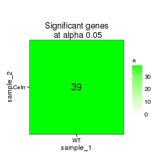 

### Significant gene expression differences between conditions

Expression plot (genes):(turned off)


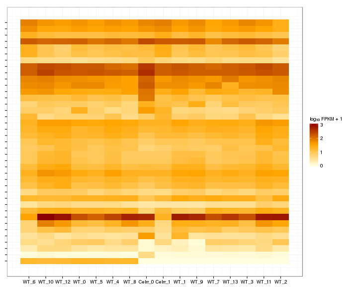 

Significant genes with expression >50fpkm (any condition):(turned off)


An individual look at each of the highly expressed significantly differentially regulated genes:
(eval=false for first pass)


### Expression-level/significance relationship

Scatter plot of significant genes only:

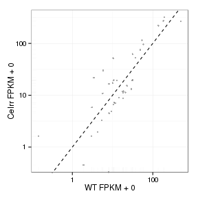 

Volcano Plot

 

Volcano plot with significant genes only:

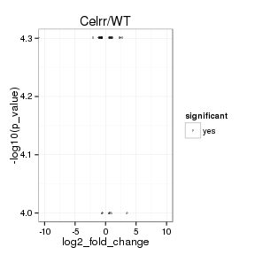 

FoldChange Heatmap

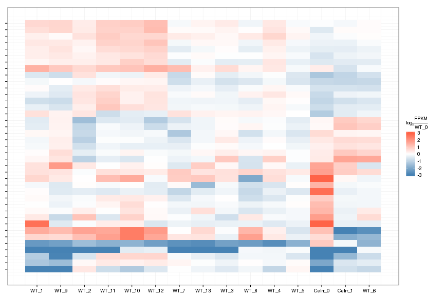 


## Differential Splicing

### Differential Isoforms between conditions

Per isoform difference between conditions:

 

These isoforms are:

<!-- html table generated in R 3.0.2 by xtable 1.7-3 package -->
<!-- Mon Jul 14 18:11:30 2014 -->
<TABLE border=1>
<TR> <TH>  </TH> <TH> isoAnnot$gene_short_name </TH>  </TR>
  <TR> <TD align="right"> 1 </TD> <TD> Ngfr </TD> </TR>
  <TR> <TD align="right"> 2 </TD> <TD> Axin2 </TD> </TR>
  <TR> <TD align="right"> 3 </TD> <TD> Sdhd </TD> </TR>
  <TR> <TD align="right"> 4 </TD> <TD> Mnt </TD> </TR>
  <TR> <TD align="right"> 5 </TD> <TD> Mcts1 </TD> </TR>
  <TR> <TD align="right"> 6 </TD> <TD> Ndufa9 </TD> </TR>
  <TR> <TD align="right"> 7 </TD> <TD> Zfp385a </TD> </TR>
  <TR> <TD align="right"> 8 </TD> <TD> Sox9 </TD> </TR>
  <TR> <TD align="right"> 9 </TD> <TD> C1d </TD> </TR>
  <TR> <TD align="right"> 10 </TD> <TD> Hk2 </TD> </TR>
  <TR> <TD align="right"> 11 </TD> <TD> Col6a1 </TD> </TR>
  <TR> <TD align="right"> 12 </TD> <TD> Pcnt </TD> </TR>
  <TR> <TD align="right"> 13 </TD> <TD> Snrnp27 </TD> </TR>
  <TR> <TD align="right"> 14 </TD> <TD> Dpp9 </TD> </TR>
  <TR> <TD align="right"> 15 </TD> <TD> Gabrg1 </TD> </TR>
  <TR> <TD align="right"> 16 </TD> <TD> Zmat2 </TD> </TR>
  <TR> <TD align="right"> 17 </TD> <TD> Col18a1 </TD> </TR>
  <TR> <TD align="right"> 18 </TD> <TD> Cyp51 </TD> </TR>
  <TR> <TD align="right"> 19 </TD> <TD> Irx2 </TD> </TR>
  <TR> <TD align="right"> 20 </TD> <TD> Col1a1 </TD> </TR>
  <TR> <TD align="right"> 21 </TD> <TD> Jup </TD> </TR>
  <TR> <TD align="right"> 22 </TD> <TD> Eef1e1 </TD> </TR>
  <TR> <TD align="right"> 23 </TD> <TD> Nup214 </TD> </TR>
  <TR> <TD align="right"> 24 </TD> <TD> Cpa3 </TD> </TR>
  <TR> <TD align="right"> 25 </TD> <TD> Psmc3 </TD> </TR>
  <TR> <TD align="right"> 26 </TD> <TD> Sf3a1 </TD> </TR>
  <TR> <TD align="right"> 27 </TD> <TD> Ppard </TD> </TR>
  <TR> <TD align="right"> 28 </TD> <TD> Use1 </TD> </TR>
  <TR> <TD align="right"> 29 </TD> <TD> Snrpd1 </TD> </TR>
  <TR> <TD align="right"> 30 </TD> <TD> Ccdc97 </TD> </TR>
  <TR> <TD align="right"> 31 </TD> <TD> Cse1l </TD> </TR>
  <TR> <TD align="right"> 32 </TD> <TD> Lamb1 </TD> </TR>
  <TR> <TD align="right"> 33 </TD> <TD> Med25 </TD> </TR>
  <TR> <TD align="right"> 34 </TD> <TD> Fam32a </TD> </TR>
  <TR> <TD align="right"> 35 </TD> <TD> Glg1 </TD> </TR>
  <TR> <TD align="right"> 36 </TD> <TD> Rabac1 </TD> </TR>
  <TR> <TD align="right"> 37 </TD> <TD> Rps11 </TD> </TR>
  <TR> <TD align="right"> 38 </TD> <TD> Fam162a </TD> </TR>
  <TR> <TD align="right"> 39 </TD> <TD> Rpl8 </TD> </TR>
  <TR> <TD align="right"> 40 </TD> <TD> Stat3 </TD> </TR>
  <TR> <TD align="right"> 41 </TD> <TD> Dnmt1 </TD> </TR>
  <TR> <TD align="right"> 42 </TD> <TD> Atn1 </TD> </TR>
  <TR> <TD align="right"> 43 </TD> <TD> Atp6v1f </TD> </TR>
  <TR> <TD align="right"> 44 </TD> <TD> Hif3a </TD> </TR>
  <TR> <TD align="right"> 45 </TD> <TD> Aqp1 </TD> </TR>
  <TR> <TD align="right"> 46 </TD> <TD> Tmem242 </TD> </TR>
  <TR> <TD align="right"> 47 </TD> <TD> Wisp1 </TD> </TR>
  <TR> <TD align="right"> 48 </TD> <TD> Polr2a </TD> </TR>
  <TR> <TD align="right"> 49 </TD> <TD> Corin </TD> </TR>
  <TR> <TD align="right"> 50 </TD> <TD> Nid1 </TD> </TR>
  <TR> <TD align="right"> 51 </TD> <TD> Igf1r </TD> </TR>
  <TR> <TD align="right"> 52 </TD> <TD> Pan2 </TD> </TR>
  <TR> <TD align="right"> 53 </TD> <TD> Psmb4 </TD> </TR>
  <TR> <TD align="right"> 54 </TD> <TD> Ephb3 </TD> </TR>
  <TR> <TD align="right"> 55 </TD> <TD> Kmt2b </TD> </TR>
  <TR> <TD align="right"> 56 </TD> <TD> Rps9 </TD> </TR>
  <TR> <TD align="right"> 57 </TD> <TD> Nphs1 </TD> </TR>
  <TR> <TD align="right"> 58 </TD> <TD> Sulf2 </TD> </TR>
  <TR> <TD align="right"> 59 </TD> <TD> Pole </TD> </TR>
  <TR> <TD align="right"> 60 </TD> <TD> Khsrp </TD> </TR>
  <TR> <TD align="right"> 61 </TD> <TD> Cct4 </TD> </TR>
  <TR> <TD align="right"> 62 </TD> <TD> Zmiz1 </TD> </TR>
  <TR> <TD align="right"> 63 </TD> <TD> Arid1a </TD> </TR>
  <TR> <TD align="right"> 64 </TD> <TD> Rplp1 </TD> </TR>
  <TR> <TD align="right"> 65 </TD> <TD> Snrpb2 </TD> </TR>
  <TR> <TD align="right"> 66 </TD> <TD> Ubc </TD> </TR>
  <TR> <TD align="right"> 67 </TD> <TD> Arpc5 </TD> </TR>
  <TR> <TD align="right"> 68 </TD> <TD> Rala </TD> </TR>
  <TR> <TD align="right"> 69 </TD> <TD> Vdac3 </TD> </TR>
  <TR> <TD align="right"> 70 </TD> <TD> Bmp7 </TD> </TR>
  <TR> <TD align="right"> 71 </TD> <TD> Srp14 </TD> </TR>
  <TR> <TD align="right"> 72 </TD> <TD> Bcr </TD> </TR>
  <TR> <TD align="right"> 73 </TD> <TD> Sdhb </TD> </TR>
  <TR> <TD align="right"> 74 </TD> <TD> Rps25 </TD> </TR>
  <TR> <TD align="right"> 75 </TD> <TD> Raver1 </TD> </TR>
  <TR> <TD align="right"> 76 </TD> <TD> Nedd8 </TD> </TR>
  <TR> <TD align="right"> 77 </TD> <TD> Mrpl52 </TD> </TR>
  <TR> <TD align="right"> 78 </TD> <TD> Ebf3 </TD> </TR>
  <TR> <TD align="right"> 79 </TD> <TD> Odc1 </TD> </TR>
  <TR> <TD align="right"> 80 </TD> <TD> Gltp </TD> </TR>
  <TR> <TD align="right"> 81 </TD> <TD> Scarf2 </TD> </TR>
  <TR> <TD align="right"> 82 </TD> <TD> Med15 </TD> </TR>
  <TR> <TD align="right"> 83 </TD> <TD> Dhdds </TD> </TR>
  <TR> <TD align="right"> 84 </TD> <TD> Phox2b </TD> </TR>
  <TR> <TD align="right"> 85 </TD> <TD> Rps5 </TD> </TR>
  <TR> <TD align="right"> 86 </TD> <TD> Iglon5 </TD> </TR>
  <TR> <TD align="right"> 87 </TD> <TD> Igf2bp1 </TD> </TR>
  <TR> <TD align="right"> 88 </TD> <TD> Cad </TD> </TR>
  <TR> <TD align="right"> 89 </TD> <TD> Atad1 </TD> </TR>
  <TR> <TD align="right"> 90 </TD> <TD> Clip3 </TD> </TR>
  <TR> <TD align="right"> 91 </TD> <TD> Cacybp </TD> </TR>
  <TR> <TD align="right"> 92 </TD> <TD> Ndufa2 </TD> </TR>
  <TR> <TD align="right"> 93 </TD> <TD> Glis2 </TD> </TR>
  <TR> <TD align="right"> 94 </TD> <TD> Cox6c </TD> </TR>
  <TR> <TD align="right"> 95 </TD> <TD> Tsg101 </TD> </TR>
  <TR> <TD align="right"> 96 </TD> <TD> Map3k4 </TD> </TR>
  <TR> <TD align="right"> 97 </TD> <TD> Psmb1 </TD> </TR>
  <TR> <TD align="right"> 98 </TD> <TD> Dll1 </TD> </TR>
  <TR> <TD align="right"> 99 </TD> <TD> Lrrk1 </TD> </TR>
  <TR> <TD align="right"> 100 </TD> <TD> Abca1 </TD> </TR>
  <TR> <TD align="right"> 101 </TD> <TD> Sash1 </TD> </TR>
  <TR> <TD align="right"> 102 </TD> <TD> Gata3 </TD> </TR>
  <TR> <TD align="right"> 103 </TD> <TD> Lama5 </TD> </TR>
  <TR> <TD align="right"> 104 </TD> <TD> Psma2 </TD> </TR>
  <TR> <TD align="right"> 105 </TD> <TD> Vps45 </TD> </TR>
  <TR> <TD align="right"> 106 </TD> <TD> Dstn </TD> </TR>
  <TR> <TD align="right"> 107 </TD> <TD> Celsr1 </TD> </TR>
  <TR> <TD align="right"> 108 </TD> <TD> Atp5e </TD> </TR>
  <TR> <TD align="right"> 109 </TD> <TD> Slc25a5 </TD> </TR>
  <TR> <TD align="right"> 110 </TD> <TD> Ndufa1 </TD> </TR>
  <TR> <TD align="right"> 111 </TD> <TD> Plgrkt </TD> </TR>
  <TR> <TD align="right"> 112 </TD> <TD> Sulf1 </TD> </TR>
  <TR> <TD align="right"> 113 </TD> <TD> Pigt </TD> </TR>
  <TR> <TD align="right"> 114 </TD> <TD> Mmp9 </TD> </TR>
  <TR> <TD align="right"> 115 </TD> <TD> Slc12a7 </TD> </TR>
  <TR> <TD align="right"> 116 </TD> <TD> Psmb6 </TD> </TR>
  <TR> <TD align="right"> 117 </TD> <TD> Spag7 </TD> </TR>
  <TR> <TD align="right"> 118 </TD> <TD> Kdm6b </TD> </TR>
  <TR> <TD align="right"> 119 </TD> <TD> Glra2 </TD> </TR>
  <TR> <TD align="right"> 120 </TD> <TD> Lhx1 </TD> </TR>
  <TR> <TD align="right"> 121 </TD> <TD> Dync1h1 </TD> </TR>
  <TR> <TD align="right"> 122 </TD> <TD> Rars </TD> </TR>
  <TR> <TD align="right"> 123 </TD> <TD> Pelp1 </TD> </TR>
  <TR> <TD align="right"> 124 </TD> <TD> Fis1 </TD> </TR>
  <TR> <TD align="right"> 125 </TD> <TD> Tmem160 </TD> </TR>
  <TR> <TD align="right"> 126 </TD> <TD> Atp6v1e1 </TD> </TR>
  <TR> <TD align="right"> 127 </TD> <TD> Map1s </TD> </TR>
  <TR> <TD align="right"> 128 </TD> <TD> D8Ertd738e </TD> </TR>
  <TR> <TD align="right"> 129 </TD> <TD> Cops3 </TD> </TR>
  <TR> <TD align="right"> 130 </TD> <TD> Ubb </TD> </TR>
  <TR> <TD align="right"> 131 </TD> <TD> D17Wsu104e </TD> </TR>
  <TR> <TD align="right"> 132 </TD> <TD> Hdac2 </TD> </TR>
  <TR> <TD align="right"> 133 </TD> <TD> Plagl1 </TD> </TR>
  <TR> <TD align="right"> 134 </TD> <TD> Utrn </TD> </TR>
  <TR> <TD align="right"> 135 </TD> <TD> Slc16a10 </TD> </TR>
  <TR> <TD align="right"> 136 </TD> <TD> Lama4 </TD> </TR>
  <TR> <TD align="right"> 137 </TD> <TD> Nts </TD> </TR>
  <TR> <TD align="right"> 138 </TD> <TD> Lama2 </TD> </TR>
  <TR> <TD align="right"> 139 </TD> <TD> Zwint </TD> </TR>
  <TR> <TD align="right"> 140 </TD> <TD> Arid5b </TD> </TR>
  <TR> <TD align="right"> 141 </TD> <TD> Actr6 </TD> </TR>
  <TR> <TD align="right"> 142 </TD> <TD> Fgd6 </TD> </TR>
  <TR> <TD align="right"> 143 </TD> <TD> Rfx4 </TD> </TR>
  <TR> <TD align="right"> 144 </TD> <TD> Mybpc1 </TD> </TR>
  <TR> <TD align="right"> 145 </TD> <TD> Ppa1 </TD> </TR>
  <TR> <TD align="right"> 146 </TD> <TD> Unc5b </TD> </TR>
  <TR> <TD align="right"> 147 </TD> <TD> Srgap1 </TD> </TR>
  <TR> <TD align="right"> 148 </TD> <TD> Meis1 </TD> </TR>
  <TR> <TD align="right"> 149 </TD> <TD> Grb10 </TD> </TR>
  <TR> <TD align="right"> 150 </TD> <TD> Snrpd3 </TD> </TR>
  <TR> <TD align="right"> 151 </TD> <TD> Csrp2 </TD> </TR>
  <TR> <TD align="right"> 152 </TD> <TD> Cabin1 </TD> </TR>
  <TR> <TD align="right"> 153 </TD> <TD> Phlda1 </TD> </TR>
  <TR> <TD align="right"> 154 </TD> <TD> Col6a2 </TD> </TR>
  <TR> <TD align="right"> 155 </TD> <TD> Hint1 </TD> </TR>
  <TR> <TD align="right"> 156 </TD> <TD> Tpgs1 </TD> </TR>
  <TR> <TD align="right"> 157 </TD> <TD> Mdh1 </TD> </TR>
  <TR> <TD align="right"> 158 </TD> <TD> Flt4 </TD> </TR>
  <TR> <TD align="right"> 159 </TD> <TD> Gnb2l1 </TD> </TR>
  <TR> <TD align="right"> 160 </TD> <TD> Sar1b </TD> </TR>
  <TR> <TD align="right"> 161 </TD> <TD> Tns3 </TD> </TR>
  <TR> <TD align="right"> 162 </TD> <TD> Drg1 </TD> </TR>
  <TR> <TD align="right"> 163 </TD> <TD> Ccdc104 </TD> </TR>
  <TR> <TD align="right"> 164 </TD> <TD> Aebp1 </TD> </TR>
  <TR> <TD align="right"> 165 </TD> <TD> Supt4a </TD> </TR>
  <TR> <TD align="right"> 166 </TD> <TD> Bzw2 </TD> </TR>
  <TR> <TD align="right"> 167 </TD> <TD> Mrc2 </TD> </TR>
  <TR> <TD align="right"> 168 </TD> <TD> Psmd12 </TD> </TR>
  <TR> <TD align="right"> 169 </TD> <TD> Txndc17 </TD> </TR>
  <TR> <TD align="right"> 170 </TD> <TD> Ntn1 </TD> </TR>
  <TR> <TD align="right"> 171 </TD> <TD> Npas3 </TD> </TR>
  <TR> <TD align="right"> 172 </TD> <TD> Psma6 </TD> </TR>
  <TR> <TD align="right"> 173 </TD> <TD> Tmx1 </TD> </TR>
  <TR> <TD align="right"> 174 </TD> <TD> Actr10 </TD> </TR>
  <TR> <TD align="right"> 175 </TD> <TD> Atp6v1d </TD> </TR>
  <TR> <TD align="right"> 176 </TD> <TD> Eif2s1 </TD> </TR>
  <TR> <TD align="right"> 177 </TD> <TD> Vti1b </TD> </TR>
  <TR> <TD align="right"> 178 </TD> <TD> Zfp36l1 </TD> </TR>
  <TR> <TD align="right"> 179 </TD> <TD> Smoc1 </TD> </TR>
  <TR> <TD align="right"> 180 </TD> <TD> Psmc1 </TD> </TR>
  <TR> <TD align="right"> 181 </TD> <TD> Tshz3 </TD> </TR>
  <TR> <TD align="right"> 182 </TD> <TD> Ylpm1 </TD> </TR>
  <TR> <TD align="right"> 183 </TD> <TD> Esrrb </TD> </TR>
  <TR> <TD align="right"> 184 </TD> <TD> Hsp90aa1 </TD> </TR>
  <TR> <TD align="right"> 185 </TD> <TD> 2010107E04Rik </TD> </TR>
  <TR> <TD align="right"> 186 </TD> <TD> Gli3 </TD> </TR>
  <TR> <TD align="right"> 187 </TD> <TD> Hivep1 </TD> </TR>
  <TR> <TD align="right"> 188 </TD> <TD> Ptch1 </TD> </TR>
  <TR> <TD align="right"> 189 </TD> <TD> Msx2 </TD> </TR>
  <TR> <TD align="right"> 190 </TD> <TD> Cxcl14 </TD> </TR>
  <TR> <TD align="right"> 191 </TD> <TD> Cetn3 </TD> </TR>
  <TR> <TD align="right"> 192 </TD> <TD> Otp </TD> </TR>
  <TR> <TD align="right"> 193 </TD> <TD> Psmd6 </TD> </TR>
  <TR> <TD align="right"> 194 </TD> <TD> Ndufs4 </TD> </TR>
  <TR> <TD align="right"> 195 </TD> <TD> Zswim8 </TD> </TR>
  <TR> <TD align="right"> 196 </TD> <TD> Psmc6 </TD> </TR>
  <TR> <TD align="right"> 197 </TD> <TD> Gm6768 </TD> </TR>
  <TR> <TD align="right"> 198 </TD> <TD> Kpna3 </TD> </TR>
  <TR> <TD align="right"> 199 </TD> <TD> Rnaseh2b </TD> </TR>
  <TR> <TD align="right"> 200 </TD> <TD> Gdf10 </TD> </TR>
  <TR> <TD align="right"> 201 </TD> <TD> N6amt2 </TD> </TR>
  <TR> <TD align="right"> 202 </TD> <TD> Sugt1 </TD> </TR>
  <TR> <TD align="right"> 203 </TD> <TD> Ccdc25 </TD> </TR>
  <TR> <TD align="right"> 204 </TD> <TD> Bnip3l </TD> </TR>
  <TR> <TD align="right"> 205 </TD> <TD> Nipbl </TD> </TR>
  <TR> <TD align="right"> 206 </TD> <TD> Dad1 </TD> </TR>
  <TR> <TD align="right"> 207 </TD> <TD> Psmb5 </TD> </TR>
  <TR> <TD align="right"> 208 </TD> <TD> Sub1 </TD> </TR>
  <TR> <TD align="right"> 209 </TD> <TD> Npr3 </TD> </TR>
  <TR> <TD align="right"> 210 </TD> <TD> Cct5 </TD> </TR>
  <TR> <TD align="right"> 211 </TD> <TD> Dcaf13 </TD> </TR>
  <TR> <TD align="right"> 212 </TD> <TD> Eif3h </TD> </TR>
  <TR> <TD align="right"> 213 </TD> <TD> Eif3e </TD> </TR>
  <TR> <TD align="right"> 214 </TD> <TD> Ndufb9 </TD> </TR>
  <TR> <TD align="right"> 215 </TD> <TD> Sla </TD> </TR>
  <TR> <TD align="right"> 216 </TD> <TD> Gtse1 </TD> </TR>
  <TR> <TD align="right"> 217 </TD> <TD> Rbx1 </TD> </TR>
  <TR> <TD align="right"> 218 </TD> <TD> Slc25a17 </TD> </TR>
  <TR> <TD align="right"> 219 </TD> <TD> Tomm22 </TD> </TR>
  <TR> <TD align="right"> 220 </TD> <TD> Myh9 </TD> </TR>
  <TR> <TD align="right"> 221 </TD> <TD> Ndufa6 </TD> </TR>
  <TR> <TD align="right"> 222 </TD> <TD> Pmm1 </TD> </TR>
  <TR> <TD align="right"> 223 </TD> <TD> Col2a1 </TD> </TR>
  <TR> <TD align="right"> 224 </TD> <TD> Crebbp </TD> </TR>
  <TR> <TD align="right"> 225 </TD> <TD> Boc </TD> </TR>
  <TR> <TD align="right"> 226 </TD> <TD> Arhgap31 </TD> </TR>
  <TR> <TD align="right"> 227 </TD> <TD> Adamts1 </TD> </TR>
  <TR> <TD align="right"> 228 </TD> <TD> Psmg1 </TD> </TR>
  <TR> <TD align="right"> 229 </TD> <TD> Dopey2 </TD> </TR>
  <TR> <TD align="right"> 230 </TD> <TD> Clic6 </TD> </TR>
  <TR> <TD align="right"> 231 </TD> <TD> Sod1 </TD> </TR>
  <TR> <TD align="right"> 232 </TD> <TD> Scaf4 </TD> </TR>
  <TR> <TD align="right"> 233 </TD> <TD> Wnt1 </TD> </TR>
  <TR> <TD align="right"> 234 </TD> <TD> Tuba1b </TD> </TR>
  <TR> <TD align="right"> 235 </TD> <TD> Nckap5l </TD> </TR>
  <TR> <TD align="right"> 236 </TD> <TD> Smarcd1 </TD> </TR>
  <TR> <TD align="right"> 237 </TD> <TD> Dip2b </TD> </TR>
  <TR> <TD align="right"> 238 </TD> <TD> Rpp14 </TD> </TR>
  <TR> <TD align="right"> 239 </TD> <TD> Scg5 </TD> </TR>
  <TR> <TD align="right"> 240 </TD> <TD> Tpi1 </TD> </TR>
  <TR> <TD align="right"> 241 </TD> <TD> Celsr3 </TD> </TR>
  <TR> <TD align="right"> 242 </TD> <TD> Prph </TD> </TR>
  <TR> <TD align="right"> 243 </TD> <TD> Igf2r </TD> </TR>
  <TR> <TD align="right"> 244 </TD> <TD> Acat2 </TD> </TR>
  <TR> <TD align="right"> 245 </TD> <TD> Brd4 </TD> </TR>
  <TR> <TD align="right"> 246 </TD> <TD> Dpy30 </TD> </TR>
  <TR> <TD align="right"> 247 </TD> <TD> Man2a1 </TD> </TR>
  <TR> <TD align="right"> 248 </TD> <TD> Ndufv2 </TD> </TR>
  <TR> <TD align="right"> 249 </TD> <TD> Cacna1h </TD> </TR>
  <TR> <TD align="right"> 250 </TD> <TD> Epas1 </TD> </TR>
  <TR> <TD align="right"> 251 </TD> <TD> Cript </TD> </TR>
  <TR> <TD align="right"> 252 </TD> <TD> Uqcc2 </TD> </TR>
  <TR> <TD align="right"> 253 </TD> <TD> Svil </TD> </TR>
  <TR> <TD align="right"> 254 </TD> <TD> Cox7a2l </TD> </TR>
  <TR> <TD align="right"> 255 </TD> <TD> H2-Ke2 </TD> </TR>
  <TR> <TD align="right"> 256 </TD> <TD> Pfdn1 </TD> </TR>
  <TR> <TD align="right"> 257 </TD> <TD> Prrc2a </TD> </TR>
  <TR> <TD align="right"> 258 </TD> <TD> Ppp2r2b </TD> </TR>
  <TR> <TD align="right"> 259 </TD> <TD> Sall3 </TD> </TR>
  <TR> <TD align="right"> 260 </TD> <TD> Megf10 </TD> </TR>
  <TR> <TD align="right"> 261 </TD> <TD> Fbn2 </TD> </TR>
  <TR> <TD align="right"> 262 </TD> <TD> Rps14 </TD> </TR>
  <TR> <TD align="right"> 263 </TD> <TD> Pdgfrb </TD> </TR>
  <TR> <TD align="right"> 264 </TD> <TD> Tjp2 </TD> </TR>
  <TR> <TD align="right"> 265 </TD> <TD> Pacs1 </TD> </TR>
  <TR> <TD align="right"> 266 </TD> <TD> Cpt1a </TD> </TR>
  <TR> <TD align="right"> 267 </TD> <TD> Mrpl11 </TD> </TR>
  <TR> <TD align="right"> 268 </TD> <TD> Plcb3 </TD> </TR>
  <TR> <TD align="right"> 269 </TD> <TD> Slit1 </TD> </TR>
  <TR> <TD align="right"> 270 </TD> <TD> Arl3 </TD> </TR>
  <TR> <TD align="right"> 271 </TD> <TD> Btbd1 </TD> </TR>
  <TR> <TD align="right"> 272 </TD> <TD> Fasn </TD> </TR>
  <TR> <TD align="right"> 273 </TD> <TD> Ndufb8 </TD> </TR>
  <TR> <TD align="right"> 274 </TD> <TD> Lbx1 </TD> </TR>
  <TR> <TD align="right"> 275 </TD> <TD> Sufu </TD> </TR>
  <TR> <TD align="right"> 276 </TD> <TD> Hsd17b10 </TD> </TR>
  <TR> <TD align="right"> 277 </TD> <TD> Flnb </TD> </TR>
  <TR> <TD align="right"> 278 </TD> <TD> Prdx4 </TD> </TR>
  <TR> <TD align="right"> 279 </TD> <TD> Rps24 </TD> </TR>
  <TR> <TD align="right"> 280 </TD> <TD> Rps26 </TD> </TR>
  <TR> <TD align="right"> 281 </TD> <TD> Cnpy2 </TD> </TR>
  <TR> <TD align="right"> 282 </TD> <TD> Rnf165 </TD> </TR>
  <TR> <TD align="right"> 283 </TD> <TD> Crcp </TD> </TR>
  <TR> <TD align="right"> 284 </TD> <TD> Podxl </TD> </TR>
  <TR> <TD align="right"> 285 </TD> <TD> Gdap1 </TD> </TR>
  <TR> <TD align="right"> 286 </TD> <TD> Itih5 </TD> </TR>
  <TR> <TD align="right"> 287 </TD> <TD> Atp5c1 </TD> </TR>
  <TR> <TD align="right"> 288 </TD> <TD> Rpl14 </TD> </TR>
  <TR> <TD align="right"> 289 </TD> <TD> Cops5 </TD> </TR>
  <TR> <TD align="right"> 290 </TD> <TD> Eef1b2 </TD> </TR>
  <TR> <TD align="right"> 291 </TD> <TD> Nop58 </TD> </TR>
  <TR> <TD align="right"> 292 </TD> <TD> Sumo1 </TD> </TR>
  <TR> <TD align="right"> 293 </TD> <TD> Ndufb3 </TD> </TR>
  <TR> <TD align="right"> 294 </TD> <TD> Col5a2 </TD> </TR>
  <TR> <TD align="right"> 295 </TD> <TD> Col3a1 </TD> </TR>
  <TR> <TD align="right"> 296 </TD> <TD> Pdcl3 </TD> </TR>
  <TR> <TD align="right"> 297 </TD> <TD> Mrpl30 </TD> </TR>
  <TR> <TD align="right"> 298 </TD> <TD> Asnsd1 </TD> </TR>
  <TR> <TD align="right"> 299 </TD> <TD> Tmem131 </TD> </TR>
  <TR> <TD align="right"> 300 </TD> <TD> 1110058L19Rik </TD> </TR>
  <TR> <TD align="right"> 301 </TD> <TD> Igfbp5 </TD> </TR>
  <TR> <TD align="right"> 302 </TD> <TD> Fn1 </TD> </TR>
  <TR> <TD align="right"> 303 </TD> <TD> Ptma </TD> </TR>
  <TR> <TD align="right"> 304 </TD> <TD> Mki67ip </TD> </TR>
  <TR> <TD align="right"> 305 </TD> <TD> Pik3c2b </TD> </TR>
  <TR> <TD align="right"> 306 </TD> <TD> Lamc1 </TD> </TR>
  <TR> <TD align="right"> 307 </TD> <TD> Srp9 </TD> </TR>
  <TR> <TD align="right"> 308 </TD> <TD> Fh1 </TD> </TR>
  <TR> <TD align="right"> 309 </TD> <TD> Cenpf </TD> </TR>
  <TR> <TD align="right"> 310 </TD> <TD> Ddr2 </TD> </TR>
  <TR> <TD align="right"> 311 </TD> <TD> Mgst3 </TD> </TR>
  <TR> <TD align="right"> 312 </TD> <TD> Psmb7 </TD> </TR>
  <TR> <TD align="right"> 313 </TD> <TD> Col5a1 </TD> </TR>
  <TR> <TD align="right"> 314 </TD> <TD> Lamc3 </TD> </TR>
  <TR> <TD align="right"> 315 </TD> <TD> Psmd14 </TD> </TR>
  <TR> <TD align="right"> 316 </TD> <TD> Notch1 </TD> </TR>
  <TR> <TD align="right"> 317 </TD> <TD> Abca2 </TD> </TR>
  <TR> <TD align="right"> 318 </TD> <TD> Pax8 </TD> </TR>
  <TR> <TD align="right"> 319 </TD> <TD> Lrp2 </TD> </TR>
  <TR> <TD align="right"> 320 </TD> <TD> Phospho2 </TD> </TR>
  <TR> <TD align="right"> 321 </TD> <TD> Nop10 </TD> </TR>
  <TR> <TD align="right"> 322 </TD> <TD> Ccdc34 </TD> </TR>
  <TR> <TD align="right"> 323 </TD> <TD> Eif3m </TD> </TR>
  <TR> <TD align="right"> 324 </TD> <TD> Fbn1 </TD> </TR>
  <TR> <TD align="right"> 325 </TD> <TD> Tspan18 </TD> </TR>
  <TR> <TD align="right"> 326 </TD> <TD> Lrp4 </TD> </TR>
  <TR> <TD align="right"> 327 </TD> <TD> Jag1 </TD> </TR>
  <TR> <TD align="right"> 328 </TD> <TD> Ndufaf5 </TD> </TR>
  <TR> <TD align="right"> 329 </TD> <TD> Rrbp1 </TD> </TR>
  <TR> <TD align="right"> 330 </TD> <TD> Cst3 </TD> </TR>
  <TR> <TD align="right"> 331 </TD> <TD> Pkia </TD> </TR>
  <TR> <TD align="right"> 332 </TD> <TD> Fabp5 </TD> </TR>
  <TR> <TD align="right"> 333 </TD> <TD> Psma7 </TD> </TR>
  <TR> <TD align="right"> 334 </TD> <TD> Chrna4 </TD> </TR>
  <TR> <TD align="right"> 335 </TD> <TD> Stmn3 </TD> </TR>
  <TR> <TD align="right"> 336 </TD> <TD> Ufm1 </TD> </TR>
  <TR> <TD align="right"> 337 </TD> <TD> Serpini1 </TD> </TR>
  <TR> <TD align="right"> 338 </TD> <TD> Notch2 </TD> </TR>
  <TR> <TD align="right"> 339 </TD> <TD> Col11a1 </TD> </TR>
  <TR> <TD align="right"> 340 </TD> <TD> Sfrp2 </TD> </TR>
  <TR> <TD align="right"> 341 </TD> <TD> Plrg1 </TD> </TR>
  <TR> <TD align="right"> 342 </TD> <TD> Aimp1 </TD> </TR>
  <TR> <TD align="right"> 343 </TD> <TD> Apoa1bp </TD> </TR>
  <TR> <TD align="right"> 344 </TD> <TD> Rps3a1 </TD> </TR>
  <TR> <TD align="right"> 345 </TD> <TD> Abca4 </TD> </TR>
  <TR> <TD align="right"> 346 </TD> <TD> Adh5 </TD> </TR>
  <TR> <TD align="right"> 347 </TD> <TD> Eif4e </TD> </TR>
  <TR> <TD align="right"> 348 </TD> <TD> Rpf1 </TD> </TR>
  <TR> <TD align="right"> 349 </TD> <TD> Calb1 </TD> </TR>
  <TR> <TD align="right"> 350 </TD> <TD> Tmem68 </TD> </TR>
  <TR> <TD align="right"> 351 </TD> <TD> Rps20 </TD> </TR>
  <TR> <TD align="right"> 352 </TD> <TD> Gtf2b </TD> </TR>
  <TR> <TD align="right"> 353 </TD> <TD> Tnc </TD> </TR>
  <TR> <TD align="right"> 354 </TD> <TD> Txn1 </TD> </TR>
  <TR> <TD align="right"> 355 </TD> <TD> Svep1 </TD> </TR>
  <TR> <TD align="right"> 356 </TD> <TD> Mpdz </TD> </TR>
  <TR> <TD align="right"> 357 </TD> <TD> Bag1 </TD> </TR>
  <TR> <TD align="right"> 358 </TD> <TD> Nol6 </TD> </TR>
  <TR> <TD align="right"> 359 </TD> <TD> Ubap2 </TD> </TR>
  <TR> <TD align="right"> 360 </TD> <TD> Cachd1 </TD> </TR>
  <TR> <TD align="right"> 361 </TD> <TD> Laptm5 </TD> </TR>
  <TR> <TD align="right"> 362 </TD> <TD> Scp2 </TD> </TR>
  <TR> <TD align="right"> 363 </TD> <TD> Magoh </TD> </TR>
  <TR> <TD align="right"> 364 </TD> <TD> Col9a2 </TD> </TR>
  <TR> <TD align="right"> 365 </TD> <TD> Ybx1 </TD> </TR>
  <TR> <TD align="right"> 366 </TD> <TD> Ccdc23 </TD> </TR>
  <TR> <TD align="right"> 367 </TD> <TD> Prdx1 </TD> </TR>
  <TR> <TD align="right"> 368 </TD> <TD> Dmbx1 </TD> </TR>
  <TR> <TD align="right"> 369 </TD> <TD> Cmpk1 </TD> </TR>
  <TR> <TD align="right"> 370 </TD> <TD> Hspg2 </TD> </TR>
  <TR> <TD align="right"> 371 </TD> <TD> Zcchc17 </TD> </TR>
  <TR> <TD align="right"> 372 </TD> <TD> Ccdc28b </TD> </TR>
  <TR> <TD align="right"> 373 </TD> <TD> Eif3i </TD> </TR>
  <TR> <TD align="right"> 374 </TD> <TD> Csmd2 </TD> </TR>
  <TR> <TD align="right"> 375 </TD> <TD> Tmem50a </TD> </TR>
  <TR> <TD align="right"> 376 </TD> <TD> Trappc3 </TD> </TR>
  <TR> <TD align="right"> 377 </TD> <TD> Slc9a1 </TD> </TR>
  <TR> <TD align="right"> 378 </TD> <TD> Psmc2 </TD> </TR>
  <TR> <TD align="right"> 379 </TD> <TD> Ube4b </TD> </TR>
  <TR> <TD align="right"> 380 </TD> <TD> Mtor </TD> </TR>
  <TR> <TD align="right"> 381 </TD> <TD> Tomm7 </TD> </TR>
  <TR> <TD align="right"> 382 </TD> <TD> Orc5 </TD> </TR>
  <TR> <TD align="right"> 383 </TD> <TD> Rer1 </TD> </TR>
  <TR> <TD align="right"> 384 </TD> <TD> Mrpl20 </TD> </TR>
  <TR> <TD align="right"> 385 </TD> <TD> Sorcs2 </TD> </TR>
  <TR> <TD align="right"> 386 </TD> <TD> Afap1 </TD> </TR>
  <TR> <TD align="right"> 387 </TD> <TD> Htt </TD> </TR>
  <TR> <TD align="right"> 388 </TD> <TD> Tgfbr3 </TD> </TR>
  <TR> <TD align="right"> 389 </TD> <TD> Cct6a </TD> </TR>
  <TR> <TD align="right"> 390 </TD> <TD> Arpc3 </TD> </TR>
  <TR> <TD align="right"> 391 </TD> <TD> Dhx37 </TD> </TR>
  <TR> <TD align="right"> 392 </TD> <TD> Ep400 </TD> </TR>
  <TR> <TD align="right"> 393 </TD> <TD> Ulk1 </TD> </TR>
  <TR> <TD align="right"> 394 </TD> <TD> Cit </TD> </TR>
  <TR> <TD align="right"> 395 </TD> <TD> Ints1 </TD> </TR>
  <TR> <TD align="right"> 396 </TD> <TD> Ndufa4 </TD> </TR>
  <TR> <TD align="right"> 397 </TD> <TD> Polr1d </TD> </TR>
  <TR> <TD align="right"> 398 </TD> <TD> Pomp </TD> </TR>
  <TR> <TD align="right"> 399 </TD> <TD> Col1a2 </TD> </TR>
  <TR> <TD align="right"> 400 </TD> <TD> Zyx </TD> </TR>
  <TR> <TD align="right"> 401 </TD> <TD> Mrpl53 </TD> </TR>
  <TR> <TD align="right"> 402 </TD> <TD> Pole4 </TD> </TR>
  <TR> <TD align="right"> 403 </TD> <TD> Plxna1 </TD> </TR>
  <TR> <TD align="right"> 404 </TD> <TD> Chchd6 </TD> </TR>
  <TR> <TD align="right"> 405 </TD> <TD> Nup210 </TD> </TR>
  <TR> <TD align="right"> 406 </TD> <TD> A2m </TD> </TR>
  <TR> <TD align="right"> 407 </TD> <TD> Plxnd1 </TD> </TR>
  <TR> <TD align="right"> 408 </TD> <TD> Emp1 </TD> </TR>
  <TR> <TD align="right"> 409 </TD> <TD> Atf7ip </TD> </TR>
  <TR> <TD align="right"> 410 </TD> <TD> Wbp11 </TD> </TR>
  <TR> <TD align="right"> 411 </TD> <TD> Ldhb </TD> </TR>
  <TR> <TD align="right"> 412 </TD> <TD> Ccdc91 </TD> </TR>
  <TR> <TD align="right"> 413 </TD> <TD> Cand2 </TD> </TR>
  <TR> <TD align="right"> 414 </TD> <TD> Nova2 </TD> </TR>
  <TR> <TD align="right"> 415 </TD> <TD> Dbx1 </TD> </TR>
  <TR> <TD align="right"> 416 </TD> <TD> Iqgap1 </TD> </TR>
  <TR> <TD align="right"> 417 </TD> <TD> Nr2f2 </TD> </TR>
  <TR> <TD align="right"> 418 </TD> <TD> Psmd8 </TD> </TR>
  <TR> <TD align="right"> 419 </TD> <TD> Ndufc2 </TD> </TR>
  <TR> <TD align="right"> 420 </TD> <TD> Arl6ip1 </TD> </TR>
  <TR> <TD align="right"> 421 </TD> <TD> Nsmce1 </TD> </TR>
  <TR> <TD align="right"> 422 </TD> <TD> Psma1 </TD> </TR>
  <TR> <TD align="right"> 423 </TD> <TD> Lcmt1 </TD> </TR>
  <TR> <TD align="right"> 424 </TD> <TD> Mettl9 </TD> </TR>
  <TR> <TD align="right"> 425 </TD> <TD> Uqcrc2 </TD> </TR>
  <TR> <TD align="right"> 426 </TD> <TD> Tmem9b </TD> </TR>
  <TR> <TD align="right"> 427 </TD> <TD> Ndufb11 </TD> </TR>
  <TR> <TD align="right"> 428 </TD> <TD> Glrx3 </TD> </TR>
  <TR> <TD align="right"> 429 </TD> <TD> Elf4 </TD> </TR>
  <TR> <TD align="right"> 430 </TD> <TD> Ftsj1 </TD> </TR>
  <TR> <TD align="right"> 431 </TD> <TD> Vbp1 </TD> </TR>
  <TR> <TD align="right"> 432 </TD> <TD> Fundc2 </TD> </TR>
  <TR> <TD align="right"> 433 </TD> <TD> Igbp1 </TD> </TR>
  <TR> <TD align="right"> 434 </TD> <TD> Cox7b </TD> </TR>
  <TR> <TD align="right"> 435 </TD> <TD> Col4a6 </TD> </TR>
  <TR> <TD align="right"> 436 </TD> <TD> Nono </TD> </TR>
  <TR> <TD align="right"> 437 </TD> <TD> Rps4x </TD> </TR>
  <TR> <TD align="right"> 438 </TD> <TD> Bgn </TD> </TR>
  <TR> <TD align="right"> 439 </TD> <TD> Hcfc1 </TD> </TR>
  <TR> <TD align="right"> 440 </TD> <TD> Plxna3 </TD> </TR>
  <TR> <TD align="right"> 441 </TD> <TD> Gpr124 </TD> </TR>
  <TR> <TD align="right"> 442 </TD> <TD> Col4a1 </TD> </TR>
  <TR> <TD align="right"> 443 </TD> <TD> Col4a2 </TD> </TR>
  <TR> <TD align="right"> 444 </TD> <TD> Gpm6a </TD> </TR>
  <TR> <TD align="right"> 445 </TD> <TD> Polb </TD> </TR>
  <TR> <TD align="right"> 446 </TD> <TD> Plat </TD> </TR>
  <TR> <TD align="right"> 447 </TD> <TD> Tm2d2 </TD> </TR>
  <TR> <TD align="right"> 448 </TD> <TD> Slit2 </TD> </TR>
  <TR> <TD align="right"> 449 </TD> <TD> Sc4mol </TD> </TR>
  <TR> <TD align="right"> 450 </TD> <TD> Casp3 </TD> </TR>
  <TR> <TD align="right"> 451 </TD> <TD> Slc25a4 </TD> </TR>
  <TR> <TD align="right"> 452 </TD> <TD> Nkd1 </TD> </TR>
  <TR> <TD align="right"> 453 </TD> <TD> Sall1 </TD> </TR>
  <TR> <TD align="right"> 454 </TD> <TD> Vps35 </TD> </TR>
  <TR> <TD align="right"> 455 </TD> <TD> Itfg1 </TD> </TR>
  <TR> <TD align="right"> 456 </TD> <TD> Gab1 </TD> </TR>
  <TR> <TD align="right"> 457 </TD> <TD> Mmp2 </TD> </TR>
  <TR> <TD align="right"> 458 </TD> <TD> Gpr56 </TD> </TR>
  <TR> <TD align="right"> 459 </TD> <TD> Mmp15 </TD> </TR>
  <TR> <TD align="right"> 460 </TD> <TD> Pgls </TD> </TR>
  <TR> <TD align="right"> 461 </TD> <TD> Cdh5 </TD> </TR>
  <TR> <TD align="right"> 462 </TD> <TD> Hsd11b2 </TD> </TR>
  <TR> <TD align="right"> 463 </TD> <TD> Nip7 </TD> </TR>
  <TR> <TD align="right"> 464 </TD> <TD> Gabarapl2 </TD> </TR>
  <TR> <TD align="right"> 465 </TD> <TD> Cfdp1 </TD> </TR>
  <TR> <TD align="right"> 466 </TD> <TD> Tbx20 </TD> </TR>
  <TR> <TD align="right"> 467 </TD> <TD> Pvrl1 </TD> </TR>
  <TR> <TD align="right"> 468 </TD> <TD> Acat1 </TD> </TR>
  <TR> <TD align="right"> 469 </TD> <TD> Pts </TD> </TR>
  <TR> <TD align="right"> 470 </TD> <TD> Robo3 </TD> </TR>
  <TR> <TD align="right"> 471 </TD> <TD> Smarca4 </TD> </TR>
  <TR> <TD align="right"> 472 </TD> <TD> Kank2 </TD> </TR>
  <TR> <TD align="right"> 473 </TD> <TD> Dock6 </TD> </TR>
  <TR> <TD align="right"> 474 </TD> <TD> Cgnl1 </TD> </TR>
  <TR> <TD align="right"> 475 </TD> <TD> Itga11 </TD> </TR>
  <TR> <TD align="right"> 476 </TD> <TD> 1700017B05Rik </TD> </TR>
  <TR> <TD align="right"> 477 </TD> <TD> Psma4 </TD> </TR>
  <TR> <TD align="right"> 478 </TD> <TD> Cox7a2 </TD> </TR>
  <TR> <TD align="right"> 479 </TD> <TD> Col12a1 </TD> </TR>
  <TR> <TD align="right"> 480 </TD> <TD> Neo1 </TD> </TR>
  <TR> <TD align="right"> 481 </TD> <TD> Ppib </TD> </TR>
  <TR> <TD align="right"> 482 </TD> <TD> Igdcc3 </TD> </TR>
  <TR> <TD align="right"> 483 </TD> <TD> Snapc5 </TD> </TR>
  <TR> <TD align="right"> 484 </TD> <TD> Rpl4 </TD> </TR>
  <TR> <TD align="right"> 485 </TD> <TD> Smad3 </TD> </TR>
  <TR> <TD align="right"> 486 </TD> <TD> Mrps22 </TD> </TR>
  <TR> <TD align="right"> 487 </TD> <TD> Rpsa </TD> </TR>
  <TR> <TD align="right"> 488 </TD> <TD> Pik3r4 </TD> </TR>
  <TR> <TD align="right"> 489 </TD> <TD> Bsn </TD> </TR>
  <TR> <TD align="right"> 490 </TD> <TD> Tpcn1 </TD> </TR>
  <TR> <TD align="right"> 491 </TD> <TD> Gtf3c1 </TD> </TR>
  <TR> <TD align="right"> 492 </TD> <TD> Lama1 </TD> </TR>
  <TR> <TD align="right"> 493 </TD> <TD> Arhgef17 </TD> </TR>
  <TR> <TD align="right"> 494 </TD> <TD> Cdo1 </TD> </TR>
  <TR> <TD align="right"> 495 </TD> <TD> Szt2 </TD> </TR>
  <TR> <TD align="right"> 496 </TD> <TD> Ttll4 </TD> </TR>
  <TR> <TD align="right"> 497 </TD> <TD> Ptprf </TD> </TR>
  <TR> <TD align="right"> 498 </TD> <TD> Mif </TD> </TR>
  <TR> <TD align="right"> 499 </TD> <TD> Antxr1 </TD> </TR>
  <TR> <TD align="right"> 500 </TD> <TD> Adamts15 </TD> </TR>
  <TR> <TD align="right"> 501 </TD> <TD> Tmem35 </TD> </TR>
  <TR> <TD align="right"> 502 </TD> <TD> Atp6v1h </TD> </TR>
  <TR> <TD align="right"> 503 </TD> <TD> Map9 </TD> </TR>
  <TR> <TD align="right"> 504 </TD> <TD> Chmp2a </TD> </TR>
  <TR> <TD align="right"> 505 </TD> <TD> Ndufb7 </TD> </TR>
  <TR> <TD align="right"> 506 </TD> <TD> Rpap1 </TD> </TR>
  <TR> <TD align="right"> 507 </TD> <TD> Irf2bpl </TD> </TR>
  <TR> <TD align="right"> 508 </TD> <TD> Lsm3 </TD> </TR>
  <TR> <TD align="right"> 509 </TD> <TD> Iqsec1 </TD> </TR>
  <TR> <TD align="right"> 510 </TD> <TD> Cmip </TD> </TR>
  <TR> <TD align="right"> 511 </TD> <TD> Zfp395 </TD> </TR>
  <TR> <TD align="right"> 512 </TD> <TD> Ptpn13 </TD> </TR>
  <TR> <TD align="right"> 513 </TD> <TD> Fras1 </TD> </TR>
  <TR> <TD align="right"> 514 </TD> <TD> Mast4 </TD> </TR>
  <TR> <TD align="right"> 515 </TD> <TD> Tet3 </TD> </TR>
  <TR> <TD align="right"> 516 </TD> <TD> Zc4h2 </TD> </TR>
  <TR> <TD align="right"> 517 </TD> <TD> Eif2s3x </TD> </TR>
  <TR> <TD align="right"> 518 </TD> <TD> 1110059E24Rik </TD> </TR>
  <TR> <TD align="right"> 519 </TD> <TD> Heatr5a </TD> </TR>
  <TR> <TD align="right"> 520 </TD> <TD> Nkx6-1 </TD> </TR>
  <TR> <TD align="right"> 521 </TD> <TD> Spcs2 </TD> </TR>
  <TR> <TD align="right"> 522 </TD> <TD> Trim13 </TD> </TR>
  <TR> <TD align="right"> 523 </TD> <TD> Cops4 </TD> </TR>
  <TR> <TD align="right"> 524 </TD> <TD> Ror1 </TD> </TR>
  <TR> <TD align="right"> 525 </TD> <TD> Sec31a </TD> </TR>
  <TR> <TD align="right"> 526 </TD> <TD> Midn </TD> </TR>
  <TR> <TD align="right"> 527 </TD> <TD> Ndufa3 </TD> </TR>
  <TR> <TD align="right"> 528 </TD> <TD> Cox8a </TD> </TR>
  <TR> <TD align="right"> 529 </TD> <TD> Dock4 </TD> </TR>
  <TR> <TD align="right"> 530 </TD> <TD> Ptpn23 </TD> </TR>
  <TR> <TD align="right"> 531 </TD> <TD> Myrf </TD> </TR>
  <TR> <TD align="right"> 532 </TD> <TD> Colec12 </TD> </TR>
  <TR> <TD align="right"> 533 </TD> <TD> Ndufa13 </TD> </TR>
  <TR> <TD align="right"> 534 </TD> <TD> BC031181 </TD> </TR>
  <TR> <TD align="right"> 535 </TD> <TD> Rpl39-ps </TD> </TR>
  <TR> <TD align="right"> 536 </TD> <TD> Ppp1r11 </TD> </TR>
  <TR> <TD align="right"> 537 </TD> <TD> Calm2 </TD> </TR>
  <TR> <TD align="right"> 538 </TD> <TD> Prss56 </TD> </TR>
  <TR> <TD align="right"> 539 </TD> <TD> Ttyh3 </TD> </TR>
  <TR> <TD align="right"> 540 </TD> <TD> Plxnb2 </TD> </TR>
  <TR> <TD align="right"> 541 </TD> <TD> Cox6b1 </TD> </TR>
  <TR> <TD align="right"> 542 </TD> <TD> Dner </TD> </TR>
  <TR> <TD align="right"> 543 </TD> <TD> Rps27l </TD> </TR>
  <TR> <TD align="right"> 544 </TD> <TD> Mrpl41 </TD> </TR>
  <TR> <TD align="right"> 545 </TD> <TD> Arhgap33 </TD> </TR>
  <TR> <TD align="right"> 546 </TD> <TD> Kirrel2 </TD> </TR>
  <TR> <TD align="right"> 547 </TD> <TD> Wnt8b </TD> </TR>
  <TR> <TD align="right"> 548 </TD> <TD> Frem2 </TD> </TR>
  <TR> <TD align="right"> 549 </TD> <TD> Paip2 </TD> </TR>
  <TR> <TD align="right"> 550 </TD> <TD> Rbmxl1 </TD> </TR>
  <TR> <TD align="right"> 551 </TD> <TD> Ndufc1 </TD> </TR>
  <TR> <TD align="right"> 552 </TD> <TD> 4932438A13Rik </TD> </TR>
  <TR> <TD align="right"> 553 </TD> <TD> Lsm1 </TD> </TR>
  <TR> <TD align="right"> 554 </TD> <TD> 0610009D07Rik </TD> </TR>
  <TR> <TD align="right"> 555 </TD> <TD> Cldn11 </TD> </TR>
  <TR> <TD align="right"> 556 </TD> <TD> Vps13b </TD> </TR>
  <TR> <TD align="right"> 557 </TD> <TD> Cisd1 </TD> </TR>
  <TR> <TD align="right"> 558 </TD> <TD> Eef1a1 </TD> </TR>
  <TR> <TD align="right"> 559 </TD> <TD> Neurod6 </TD> </TR>
  <TR> <TD align="right"> 560 </TD> <TD> Phf2 </TD> </TR>
  <TR> <TD align="right"> 561 </TD> <TD> Notch3 </TD> </TR>
  <TR> <TD align="right"> 562 </TD> <TD> Spon1 </TD> </TR>
  <TR> <TD align="right"> 563 </TD> <TD> Atg5 </TD> </TR>
  <TR> <TD align="right"> 564 </TD> <TD> Ncapd2 </TD> </TR>
  <TR> <TD align="right"> 565 </TD> <TD> Bcl9 </TD> </TR>
  <TR> <TD align="right"> 566 </TD> <TD> 1700066M21Rik </TD> </TR>
  <TR> <TD align="right"> 567 </TD> <TD> Ncoa6 </TD> </TR>
  <TR> <TD align="right"> 568 </TD> <TD> Dennd2a </TD> </TR>
  <TR> <TD align="right"> 569 </TD> <TD> Rgs4 </TD> </TR>
  <TR> <TD align="right"> 570 </TD> <TD> Akap12 </TD> </TR>
  <TR> <TD align="right"> 571 </TD> <TD> Fam65a </TD> </TR>
  <TR> <TD align="right"> 572 </TD> <TD> Gng10 </TD> </TR>
  <TR> <TD align="right"> 573 </TD> <TD> Med30 </TD> </TR>
  <TR> <TD align="right"> 574 </TD> <TD> Polr3k </TD> </TR>
  <TR> <TD align="right"> 575 </TD> <TD> Creb3l2 </TD> </TR>
  <TR> <TD align="right"> 576 </TD> <TD> Herc1 </TD> </TR>
  <TR> <TD align="right"> 577 </TD> <TD> Scube3 </TD> </TR>
  <TR> <TD align="right"> 578 </TD> <TD> Atp5j2 </TD> </TR>
  <TR> <TD align="right"> 579 </TD> <TD> Hoxb4 </TD> </TR>
  <TR> <TD align="right"> 580 </TD> <TD> Atp5l </TD> </TR>
  <TR> <TD align="right"> 581 </TD> <TD> Bud31 </TD> </TR>
  <TR> <TD align="right"> 582 </TD> <TD> Lmx1b </TD> </TR>
  <TR> <TD align="right"> 583 </TD> <TD> Kdm3b </TD> </TR>
  <TR> <TD align="right"> 584 </TD> <TD> Zfhx3 </TD> </TR>
  <TR> <TD align="right"> 585 </TD> <TD> Irs2 </TD> </TR>
  <TR> <TD align="right"> 586 </TD> <TD> Rps21 </TD> </TR>
  <TR> <TD align="right"> 587 </TD> <TD> Bmp6 </TD> </TR>
  <TR> <TD align="right"> 588 </TD> <TD> Timm8b </TD> </TR>
  <TR> <TD align="right"> 589 </TD> <TD> Zfp503 </TD> </TR>
  <TR> <TD align="right"> 590 </TD> <TD> Atp6v1g1 </TD> </TR>
  <TR> <TD align="right"> 591 </TD> <TD> Akna </TD> </TR>
  <TR> <TD align="right"> 592 </TD> <TD> Rpl22l1 </TD> </TR>
  <TR> <TD align="right"> 593 </TD> <TD> Fndc3b </TD> </TR>
  <TR> <TD align="right"> 594 </TD> <TD> Tusc3 </TD> </TR>
  <TR> <TD align="right"> 595 </TD> <TD> Prex1 </TD> </TR>
  <TR> <TD align="right"> 596 </TD> <TD> Mrpl12 </TD> </TR>
  <TR> <TD align="right"> 597 </TD> <TD> Ralyl </TD> </TR>
  <TR> <TD align="right"> 598 </TD> <TD> Bahcc1 </TD> </TR>
  <TR> <TD align="right"> 599 </TD> <TD> Cercam </TD> </TR>
  <TR> <TD align="right"> 600 </TD> <TD> Epg5 </TD> </TR>
  <TR> <TD align="right"> 601 </TD> <TD> Rere </TD> </TR>
  <TR> <TD align="right"> 602 </TD> <TD> Disp2 </TD> </TR>
  <TR> <TD align="right"> 603 </TD> <TD> Negr1 </TD> </TR>
  <TR> <TD align="right"> 604 </TD> <TD> Ndufb10 </TD> </TR>
  <TR> <TD align="right"> 605 </TD> <TD> Thbs1 </TD> </TR>
  <TR> <TD align="right"> 606 </TD> <TD> Lrp1 </TD> </TR>
  <TR> <TD align="right"> 607 </TD> <TD> Nxph4 </TD> </TR>
  <TR> <TD align="right"> 608 </TD> <TD> Daam2 </TD> </TR>
  <TR> <TD align="right"> 609 </TD> <TD> Zfp609 </TD> </TR>
  <TR> <TD align="right"> 610 </TD> <TD> Otud6b </TD> </TR>
  <TR> <TD align="right"> 611 </TD> <TD> Tlx3 </TD> </TR>
  <TR> <TD align="right"> 612 </TD> <TD> Sh3pxd2b </TD> </TR>
  <TR> <TD align="right"> 613 </TD> <TD> Snrpd2 </TD> </TR>
  <TR> <TD align="right"> 614 </TD> <TD> Npnt </TD> </TR>
  <TR> <TD align="right"> 615 </TD> <TD> Trim62 </TD> </TR>
  <TR> <TD align="right"> 616 </TD> <TD> Nacad </TD> </TR>
  <TR> <TD align="right"> 617 </TD> <TD> Ostc </TD> </TR>
  <TR> <TD align="right"> 618 </TD> <TD> Msantd4 </TD> </TR>
  <TR> <TD align="right"> 619 </TD> <TD> Brca2 </TD> </TR>
  <TR> <TD align="right"> 620 </TD> <TD> 2310036O22Rik </TD> </TR>
  <TR> <TD align="right"> 621 </TD> <TD> Chd7 </TD> </TR>
  <TR> <TD align="right"> 622 </TD> <TD> Sdk2 </TD> </TR>
  <TR> <TD align="right"> 623 </TD> <TD> Amot </TD> </TR>
  <TR> <TD align="right"> 624 </TD> <TD> Cox6a1 </TD> </TR>
  <TR> <TD align="right"> 625 </TD> <TD> Mpped1 </TD> </TR>
  <TR> <TD align="right"> 626 </TD> <TD> Coro2b </TD> </TR>
  <TR> <TD align="right"> 627 </TD> <TD> Tram2 </TD> </TR>
  <TR> <TD align="right"> 628 </TD> <TD> Ndufa7 </TD> </TR>
  <TR> <TD align="right"> 629 </TD> <TD> Foxn4 </TD> </TR>
  <TR> <TD align="right"> 630 </TD> <TD> Tbca </TD> </TR>
  <TR> <TD align="right"> 631 </TD> <TD> Bend6 </TD> </TR>
  <TR> <TD align="right"> 632 </TD> <TD> Tmem183a </TD> </TR>
  <TR> <TD align="right"> 633 </TD> <TD> Rbm7 </TD> </TR>
  <TR> <TD align="right"> 634 </TD> <TD> Fbrs </TD> </TR>
  <TR> <TD align="right"> 635 </TD> <TD> Reln </TD> </TR>
  <TR> <TD align="right"> 636 </TD> <TD> Dctpp1 </TD> </TR>
  <TR> <TD align="right"> 637 </TD> <TD> Shfm1 </TD> </TR>
  <TR> <TD align="right"> 638 </TD> <TD> Itpr3 </TD> </TR>
  <TR> <TD align="right"> 639 </TD> <TD> Selk </TD> </TR>
  <TR> <TD align="right"> 640 </TD> <TD> Gm15800 </TD> </TR>
  <TR> <TD align="right"> 641 </TD> <TD> Bex2 </TD> </TR>
  <TR> <TD align="right"> 642 </TD> <TD> Tuba1c </TD> </TR>
  <TR> <TD align="right"> 643 </TD> <TD> Hic1 </TD> </TR>
  <TR> <TD align="right"> 644 </TD> <TD> A030009H04Rik </TD> </TR>
  <TR> <TD align="right"> 645 </TD> <TD> Tril </TD> </TR>
  <TR> <TD align="right"> 646 </TD> <TD> Fbxl7 </TD> </TR>
  <TR> <TD align="right"> 647 </TD> <TD> Rpl7 </TD> </TR>
  <TR> <TD align="right"> 648 </TD> <TD> Wdfy3 </TD> </TR>
  <TR> <TD align="right"> 649 </TD> <TD> Sptssa </TD> </TR>
  <TR> <TD align="right"> 650 </TD> <TD> Gm9493 </TD> </TR>
  <TR> <TD align="right"> 651 </TD> <TD> Dock5 </TD> </TR>
  <TR> <TD align="right"> 652 </TD> <TD> Cnpy1 </TD> </TR>
  <TR> <TD align="right"> 653 </TD> <TD> Rpl18a </TD> </TR>
  <TR> <TD align="right"> 654 </TD> <TD> 1110012L19Rik </TD> </TR>
  <TR> <TD align="right"> 655 </TD> <TD> Zfp36l2 </TD> </TR>
  <TR> <TD align="right"> 656 </TD> <TD> AI464131 </TD> </TR>
  <TR> <TD align="right"> 657 </TD> <TD> Rpl37a </TD> </TR>
  <TR> <TD align="right"> 658 </TD> <TD> Gjb2 </TD> </TR>
  <TR> <TD align="right"> 659 </TD> <TD> Rpl27a </TD> </TR>
  <TR> <TD align="right"> 660 </TD> <TD> Zfp319 </TD> </TR>
  <TR> <TD align="right"> 661 </TD> <TD> Prr12 </TD> </TR>
  <TR> <TD align="right"> 662 </TD> <TD> Olfml2a </TD> </TR>
  <TR> <TD align="right"> 663 </TD> <TD> Fat4 </TD> </TR>
  <TR> <TD align="right"> 664 </TD> <TD> Cd24a </TD> </TR>
  <TR> <TD align="right"> 665 </TD> <TD> C2cd3 </TD> </TR>
  <TR> <TD align="right"> 666 </TD> <TD> Mc4r </TD> </TR>
  <TR> <TD align="right"> 667 </TD> <TD> Dynlrb1 </TD> </TR>
  <TR> <TD align="right"> 668 </TD> <TD> Adamts12 </TD> </TR>
  <TR> <TD align="right"> 669 </TD> <TD> Rpsa-ps10 </TD> </TR>
  <TR> <TD align="right"> 670 </TD> <TD> Bex4 </TD> </TR>
  <TR> <TD align="right"> 671 </TD> <TD> Arxes2 </TD> </TR>
  <TR> <TD align="right"> 672 </TD> <TD> Col6a3 </TD> </TR>
  <TR> <TD align="right"> 673 </TD> <TD> Scrt1 </TD> </TR>
  <TR> <TD align="right"> 674 </TD> <TD> Osr1 </TD> </TR>
  <TR> <TD align="right"> 675 </TD> <TD> Gli2 </TD> </TR>
  <TR> <TD align="right"> 676 </TD> <TD> Thnsl1 </TD> </TR>
  <TR> <TD align="right"> 677 </TD> <TD> Igf2 </TD> </TR>
  <TR> <TD align="right"> 678 </TD> <TD> Gm8186 </TD> </TR>
  <TR> <TD align="right"> 679 </TD> <TD> Apoo-ps </TD> </TR>
  <TR> <TD align="right"> 680 </TD> <TD> Tenm2 </TD> </TR>
  <TR> <TD align="right"> 681 </TD> <TD> Proser1 </TD> </TR>
  <TR> <TD align="right"> 682 </TD> <TD> Sall2 </TD> </TR>
  <TR> <TD align="right"> 683 </TD> <TD> Tceal1 </TD> </TR>
  <TR> <TD align="right"> 684 </TD> <TD> 2410015M20Rik </TD> </TR>
  <TR> <TD align="right"> 685 </TD> <TD> Tmsb4x </TD> </TR>
  <TR> <TD align="right"> 686 </TD> <TD> Ubqln2 </TD> </TR>
  <TR> <TD align="right"> 687 </TD> <TD> D8Ertd82e </TD> </TR>
  <TR> <TD align="right"> 688 </TD> <TD> Gm9843 </TD> </TR>
  <TR> <TD align="right"> 689 </TD> <TD> Gm8394 </TD> </TR>
  <TR> <TD align="right"> 690 </TD> <TD> Lamtor4 </TD> </TR>
  <TR> <TD align="right"> 691 </TD> <TD> Gm9846 </TD> </TR>
  <TR> <TD align="right"> 692 </TD> <TD> Atp5k </TD> </TR>
  <TR> <TD align="right"> 693 </TD> <TD> Sepn1 </TD> </TR>
  <TR> <TD align="right"> 694 </TD> <TD> Commd3 </TD> </TR>
  <TR> <TD align="right"> 695 </TD> <TD> Gm6563 </TD> </TR>
  <TR> <TD align="right"> 696 </TD> <TD> 2900026A02Rik </TD> </TR>
  <TR> <TD align="right"> 697 </TD> <TD> Plagl2 </TD> </TR>
  <TR> <TD align="right"> 698 </TD> <TD> Sema5b </TD> </TR>
  <TR> <TD align="right"> 699 </TD> <TD> Hbb-bs </TD> </TR>
  <TR> <TD align="right"> 700 </TD> <TD> Tmco1 </TD> </TR>
  <TR> <TD align="right"> 701 </TD> <TD> Lamb2 </TD> </TR>
  <TR> <TD align="right"> 702 </TD> <TD> Glis3 </TD> </TR>
  <TR> <TD align="right"> 703 </TD> <TD> C130021I20Rik </TD> </TR>
  <TR> <TD align="right"> 704 </TD> <TD> Yap1 </TD> </TR>
  <TR> <TD align="right"> 705 </TD> <TD> Eif3k </TD> </TR>
  <TR> <TD align="right"> 706 </TD> <TD> Plxnb1 </TD> </TR>
  <TR> <TD align="right"> 707 </TD> <TD> Chchd3 </TD> </TR>
  <TR> <TD align="right"> 708 </TD> <TD> Exoc6 </TD> </TR>
  <TR> <TD align="right"> 709 </TD> <TD> Srcap </TD> </TR>
  <TR> <TD align="right"> 710 </TD> <TD> Krt15 </TD> </TR>
  <TR> <TD align="right"> 711 </TD> <TD> Msi1 </TD> </TR>
  <TR> <TD align="right"> 712 </TD> <TD> Tmem74 </TD> </TR>
  <TR> <TD align="right"> 713 </TD> <TD> Atpif1 </TD> </TR>
  <TR> <TD align="right"> 714 </TD> <TD> Vsnl1 </TD> </TR>
  <TR> <TD align="right"> 715 </TD> <TD> Pcnxl3 </TD> </TR>
  <TR> <TD align="right"> 716 </TD> <TD> Ep300 </TD> </TR>
  <TR> <TD align="right"> 717 </TD> <TD> Nfic </TD> </TR>
  <TR> <TD align="right"> 718 </TD> <TD> Gabra5 </TD> </TR>
  <TR> <TD align="right"> 719 </TD> <TD> Tead1 </TD> </TR>
  <TR> <TD align="right"> 720 </TD> <TD> Tns1 </TD> </TR>
  <TR> <TD align="right"> 721 </TD> <TD> Soga1 </TD> </TR>
  <TR> <TD align="right"> 722 </TD> <TD> Hba-x </TD> </TR>
  <TR> <TD align="right"> 723 </TD> <TD> Dach1 </TD> </TR>
  <TR> <TD align="right"> 724 </TD> <TD> Gpc3 </TD> </TR>
  <TR> <TD align="right"> 725 </TD> <TD> Tcf7l1 </TD> </TR>
  <TR> <TD align="right"> 726 </TD> <TD> Tceb2 </TD> </TR>
  <TR> <TD align="right"> 727 </TD> <TD> Zfp277 </TD> </TR>
  <TR> <TD align="right"> 728 </TD> <TD> Irs1 </TD> </TR>
  <TR> <TD align="right"> 729 </TD> <TD> Col8a2 </TD> </TR>
  <TR> <TD align="right"> 730 </TD> <TD> Slit3 </TD> </TR>
  <TR> <TD align="right"> 731 </TD> <TD> Cd248 </TD> </TR>
  <TR> <TD align="right"> 732 </TD> <TD> Foxk1 </TD> </TR>
  <TR> <TD align="right"> 733 </TD> <TD> Fry </TD> </TR>
  <TR> <TD align="right"> 734 </TD> <TD> Gm6851 </TD> </TR>
  <TR> <TD align="right"> 735 </TD> <TD> Gadl1 </TD> </TR>
  <TR> <TD align="right"> 736 </TD> <TD> Hist3h2ba </TD> </TR>
  <TR> <TD align="right"> 737 </TD> <TD> Magel2 </TD> </TR>
  <TR> <TD align="right"> 738 </TD> <TD> Gm7536 </TD> </TR>
  <TR> <TD align="right"> 739 </TD> <TD> Fam136a </TD> </TR>
  <TR> <TD align="right"> 740 </TD> <TD> Ece1 </TD> </TR>
  <TR> <TD align="right"> 741 </TD> <TD> Megf6 </TD> </TR>
  <TR> <TD align="right"> 742 </TD> <TD> Rpl32 </TD> </TR>
  <TR> <TD align="right"> 743 </TD> <TD> Gm10036 </TD> </TR>
  <TR> <TD align="right"> 744 </TD> <TD> Gm5148 </TD> </TR>
  <TR> <TD align="right"> 745 </TD> <TD> Espl1 </TD> </TR>
  <TR> <TD align="right"> 746 </TD> <TD> Upf1 </TD> </TR>
  <TR> <TD align="right"> 747 </TD> <TD> Gda </TD> </TR>
  <TR> <TD align="right"> 748 </TD> <TD> En1 </TD> </TR>
  <TR> <TD align="right"> 749 </TD> <TD> Col13a1 </TD> </TR>
  <TR> <TD align="right"> 750 </TD> <TD> Gm10053 </TD> </TR>
  <TR> <TD align="right"> 751 </TD> <TD> Zc3h4 </TD> </TR>
  <TR> <TD align="right"> 752 </TD> <TD> Uqcr10 </TD> </TR>
  <TR> <TD align="right"> 753 </TD> <TD> Ndufs8 </TD> </TR>
  <TR> <TD align="right"> 754 </TD> <TD> Rps26-ps1 </TD> </TR>
  <TR> <TD align="right"> 755 </TD> <TD> Eif4a1 </TD> </TR>
  <TR> <TD align="right"> 756 </TD> <TD> Gm10073 </TD> </TR>
  <TR> <TD align="right"> 757 </TD> <TD> Rpl3 </TD> </TR>
  <TR> <TD align="right"> 758 </TD> <TD> Zfp462 </TD> </TR>
  <TR> <TD align="right"> 759 </TD> <TD> Scrt2 </TD> </TR>
  <TR> <TD align="right"> 760 </TD> <TD> Hnrnpc </TD> </TR>
  <TR> <TD align="right"> 761 </TD> <TD> linc-Brn1a </TD> </TR>
  <TR> <TD align="right"> 762 </TD> <TD> Rps10-ps1 </TD> </TR>
  <TR> <TD align="right"> 763 </TD> <TD> Dcc </TD> </TR>
  <TR> <TD align="right"> 764 </TD> <TD> H3f3a </TD> </TR>
  <TR> <TD align="right"> 765 </TD> <TD> Arl1 </TD> </TR>
  <TR> <TD align="right"> 766 </TD> <TD> Rpl26 </TD> </TR>
  <TR> <TD align="right"> 767 </TD> <TD> Hipk2 </TD> </TR>
  <TR> <TD align="right"> 768 </TD> <TD> Rps7 </TD> </TR>
  <TR> <TD align="right"> 769 </TD> <TD> Zic2 </TD> </TR>
  <TR> <TD align="right"> 770 </TD> <TD> Mdc1 </TD> </TR>
  <TR> <TD align="right"> 771 </TD> <TD> Bod1l </TD> </TR>
  <TR> <TD align="right"> 772 </TD> <TD> Rps12 </TD> </TR>
  <TR> <TD align="right"> 773 </TD> <TD> Pgk1 </TD> </TR>
  <TR> <TD align="right"> 774 </TD> <TD> Rpl17 </TD> </TR>
  <TR> <TD align="right"> 775 </TD> <TD> Arf2 </TD> </TR>
  <TR> <TD align="right"> 776 </TD> <TD> Rpl9-ps6 </TD> </TR>
  <TR> <TD align="right"> 777 </TD> <TD> Rps3a2 </TD> </TR>
  <TR> <TD align="right"> 778 </TD> <TD> Gm10123 </TD> </TR>
  <TR> <TD align="right"> 779 </TD> <TD> Kdr </TD> </TR>
  <TR> <TD align="right"> 780 </TD> <TD> Mrpl42 </TD> </TR>
  <TR> <TD align="right"> 781 </TD> <TD> Zfp35 </TD> </TR>
  <TR> <TD align="right"> 782 </TD> <TD> Bcl9l </TD> </TR>
  <TR> <TD align="right"> 783 </TD> <TD> Cyp26b1 </TD> </TR>
  <TR> <TD align="right"> 784 </TD> <TD> D630045J12Rik </TD> </TR>
  <TR> <TD align="right"> 785 </TD> <TD> Rps15 </TD> </TR>
  <TR> <TD align="right"> 786 </TD> <TD> Nhp2l1 </TD> </TR>
  <TR> <TD align="right"> 787 </TD> <TD> Col23a1 </TD> </TR>
  <TR> <TD align="right"> 788 </TD> <TD> Gm8730 </TD> </TR>
  <TR> <TD align="right"> 789 </TD> <TD> Chchd1 </TD> </TR>
  <TR> <TD align="right"> 790 </TD> <TD> Prpf38a </TD> </TR>
  <TR> <TD align="right"> 791 </TD> <TD> Gpx1 </TD> </TR>
  <TR> <TD align="right"> 792 </TD> <TD> Uqcrh </TD> </TR>
  <TR> <TD align="right"> 793 </TD> <TD> Trerf1 </TD> </TR>
  <TR> <TD align="right"> 794 </TD> <TD> Fbln2 </TD> </TR>
  <TR> <TD align="right"> 795 </TD> <TD> Gm10146 </TD> </TR>
  <TR> <TD align="right"> 796 </TD> <TD> mt-Nd2 </TD> </TR>
  <TR> <TD align="right"> 797 </TD> <TD> mt-Nd4 </TD> </TR>
  <TR> <TD align="right"> 798 </TD> <TD> Ubr4 </TD> </TR>
  <TR> <TD align="right"> 799 </TD> <TD> Phactr4 </TD> </TR>
  <TR> <TD align="right"> 800 </TD> <TD> Numa1 </TD> </TR>
  <TR> <TD align="right"> 801 </TD> <TD> Zfyve26 </TD> </TR>
  <TR> <TD align="right"> 802 </TD> <TD> Gm5786 </TD> </TR>
  <TR> <TD align="right"> 803 </TD> <TD> Rpl36-ps3 </TD> </TR>
  <TR> <TD align="right"> 804 </TD> <TD> Eif1ax </TD> </TR>
  <TR> <TD align="right"> 805 </TD> <TD> Tmem128 </TD> </TR>
  <TR> <TD align="right"> 806 </TD> <TD> Tspan6 </TD> </TR>
  <TR> <TD align="right"> 807 </TD> <TD> Zfp763 </TD> </TR>
  <TR> <TD align="right"> 808 </TD> <TD> Pcna-ps2 </TD> </TR>
  <TR> <TD align="right"> 809 </TD> <TD> Gm10221 </TD> </TR>
  <TR> <TD align="right"> 810 </TD> <TD> Gtf2f2 </TD> </TR>
  <TR> <TD align="right"> 811 </TD> <TD> Ndufaf2 </TD> </TR>
  <TR> <TD align="right"> 812 </TD> <TD> Gm11808 </TD> </TR>
  <TR> <TD align="right"> 813 </TD> <TD> Gmnc </TD> </TR>
  <TR> <TD align="right"> 814 </TD> <TD> Gm10250 </TD> </TR>
  <TR> <TD align="right"> 815 </TD> <TD> Celsr2 </TD> </TR>
  <TR> <TD align="right"> 816 </TD> <TD> Ptprz1 </TD> </TR>
  <TR> <TD align="right"> 817 </TD> <TD> Psma5 </TD> </TR>
  <TR> <TD align="right"> 818 </TD> <TD> Ddx3y </TD> </TR>
  <TR> <TD align="right"> 819 </TD> <TD> Gm10260 </TD> </TR>
  <TR> <TD align="right"> 820 </TD> <TD> Gpr98 </TD> </TR>
  <TR> <TD align="right"> 821 </TD> <TD> Gm4950 </TD> </TR>
  <TR> <TD align="right"> 822 </TD> <TD> Gm10275 </TD> </TR>
  <TR> <TD align="right"> 823 </TD> <TD> Psmb3 </TD> </TR>
  <TR> <TD align="right"> 824 </TD> <TD> Ahnak </TD> </TR>
  <TR> <TD align="right"> 825 </TD> <TD> Fat1 </TD> </TR>
  <TR> <TD align="right"> 826 </TD> <TD> Gm10288 </TD> </TR>
  <TR> <TD align="right"> 827 </TD> <TD> Mn1 </TD> </TR>
  <TR> <TD align="right"> 828 </TD> <TD> Utp3 </TD> </TR>
  <TR> <TD align="right"> 829 </TD> <TD> Gltscr1 </TD> </TR>
  <TR> <TD align="right"> 830 </TD> <TD> Trabd2b </TD> </TR>
  <TR> <TD align="right"> 831 </TD> <TD> Rpl23 </TD> </TR>
  <TR> <TD align="right"> 832 </TD> <TD> Gm13826 </TD> </TR>
  <TR> <TD align="right"> 833 </TD> <TD> Atoh1 </TD> </TR>
  <TR> <TD align="right"> 834 </TD> <TD> Srp54a </TD> </TR>
  <TR> <TD align="right"> 835 </TD> <TD> Myeov2 </TD> </TR>
  <TR> <TD align="right"> 836 </TD> <TD> Hbb-bt </TD> </TR>
  <TR> <TD align="right"> 837 </TD> <TD> Ggh </TD> </TR>
  <TR> <TD align="right"> 838 </TD> <TD> Rpl13a </TD> </TR>
  <TR> <TD align="right"> 839 </TD> <TD> Zfp628 </TD> </TR>
  <TR> <TD align="right"> 840 </TD> <TD> Gm10704 </TD> </TR>
  <TR> <TD align="right"> 841 </TD> <TD> Fat3 </TD> </TR>
  <TR> <TD align="right"> 842 </TD> <TD> Tox2 </TD> </TR>
  <TR> <TD align="right"> 843 </TD> <TD> Mafb </TD> </TR>
  <TR> <TD align="right"> 844 </TD> <TD> Vdac3-ps1 </TD> </TR>
  <TR> <TD align="right"> 845 </TD> <TD> Nynrin </TD> </TR>
  <TR> <TD align="right"> 846 </TD> <TD> Selt </TD> </TR>
  <TR> <TD align="right"> 847 </TD> <TD> Ywhaq </TD> </TR>
  <TR> <TD align="right"> 848 </TD> <TD> Acsf2 </TD> </TR>
  <TR> <TD align="right"> 849 </TD> <TD> Rpl23a-ps3 </TD> </TR>
  <TR> <TD align="right"> 850 </TD> <TD> Gm12355 </TD> </TR>
  <TR> <TD align="right"> 851 </TD> <TD> Psme2b </TD> </TR>
  <TR> <TD align="right"> 852 </TD> <TD> Gm2000 </TD> </TR>
  <TR> <TD align="right"> 853 </TD> <TD> Foxd1 </TD> </TR>
  <TR> <TD align="right"> 854 </TD> <TD> Abracl </TD> </TR>
  <TR> <TD align="right"> 855 </TD> <TD> Col22a1 </TD> </TR>
  <TR> <TD align="right"> 856 </TD> <TD> Rab9 </TD> </TR>
  <TR> <TD align="right"> 857 </TD> <TD> Gbp6 </TD> </TR>
  <TR> <TD align="right"> 858 </TD> <TD> Rpl39 </TD> </TR>
  <TR> <TD align="right"> 859 </TD> <TD> Tceb1 </TD> </TR>
  <TR> <TD align="right"> 860 </TD> <TD> Gm11273 </TD> </TR>
  <TR> <TD align="right"> 861 </TD> <TD> Fzd10 </TD> </TR>
  <TR> <TD align="right"> 862 </TD> <TD> Zfp703 </TD> </TR>
  <TR> <TD align="right"> 863 </TD> <TD> Gm12688 </TD> </TR>
  <TR> <TD align="right"> 864 </TD> <TD> Gm15500 </TD> </TR>
  <TR> <TD align="right"> 865 </TD> <TD> Lamtor5 </TD> </TR>
  <TR> <TD align="right"> 866 </TD> <TD> Gm15501 </TD> </TR>
  <TR> <TD align="right"> 867 </TD> <TD> Tmsb15b2 </TD> </TR>
  <TR> <TD align="right"> 868 </TD> <TD> Gm10177 </TD> </TR>
  <TR> <TD align="right"> 869 </TD> <TD> Pcp4 </TD> </TR>
  <TR> <TD align="right"> 870 </TD> <TD> 2810055G20Rik </TD> </TR>
  <TR> <TD align="right"> 871 </TD> <TD> Snrpe </TD> </TR>
  <TR> <TD align="right"> 872 </TD> <TD> Srcap </TD> </TR>
  <TR> <TD align="right"> 873 </TD> <TD> Myl6 </TD> </TR>
  <TR> <TD align="right"> 874 </TD> <TD> Gm5428 </TD> </TR>
  <TR> <TD align="right"> 875 </TD> <TD> Vgll3 </TD> </TR>
  <TR> <TD align="right"> 876 </TD> <TD> Eid1 </TD> </TR>
  <TR> <TD align="right"> 877 </TD> <TD> Gm10269 </TD> </TR>
  <TR> <TD align="right"> 878 </TD> <TD> Skor2 </TD> </TR>
  <TR> <TD align="right"> 879 </TD> <TD> Rps2-ps10 </TD> </TR>
  <TR> <TD align="right"> 880 </TD> <TD> Bend4 </TD> </TR>
  <TR> <TD align="right"> 881 </TD> <TD> Gm4540 </TD> </TR>
  <TR> <TD align="right"> 882 </TD> <TD> Rpl41 </TD> </TR>
  <TR> <TD align="right"> 883 </TD> <TD> Tomm20 </TD> </TR>
  <TR> <TD align="right"> 884 </TD> <TD> Rpl7a-ps10 </TD> </TR>
  <TR> <TD align="right"> 885 </TD> <TD> Gm5619 </TD> </TR>
  <TR> <TD align="right"> 886 </TD> <TD> Gm6472 </TD> </TR>
  <TR> <TD align="right"> 887 </TD> <TD> Dynlt1f </TD> </TR>
  <TR> <TD align="right"> 888 </TD> <TD> Gm8226 </TD> </TR>
  <TR> <TD align="right"> 889 </TD> <TD> 4930480K23Rik </TD> </TR>
  <TR> <TD align="right"> 890 </TD> <TD> Gm26951 </TD> </TR>
  <TR> <TD align="right"> 891 </TD> <TD> Gm17750 </TD> </TR>
  <TR> <TD align="right"> 892 </TD> <TD> Gm19980 </TD> </TR>
   </TABLE>

Gene-level DE isoform heatmap

 

Isoform foldchange heatmap by isoform:

 


### Differential Splicing between conditions

(eval false for first pass)

Per condition differences in isoforms (Does gene have diff piechart between conditions?)


These genes are:


Splicing heatmap by isoform:


Splicing heatmap by gene


The following are significantly differentially spliced genes (relative portion of isoform per condition): 


 


# Gene/Pathway Analysis

## GSEA

Enrichment and zscores are calculated based on expression in KO vs WT (fpkmKO/fpkmWT), so genes that are down regulated in KO are shown in blue, while upregulation is shown in red. 

KO/WT
Blue = down in KO
Red = Up in KO


Biocarta enrichment: 

 

Biocarta zscore: 

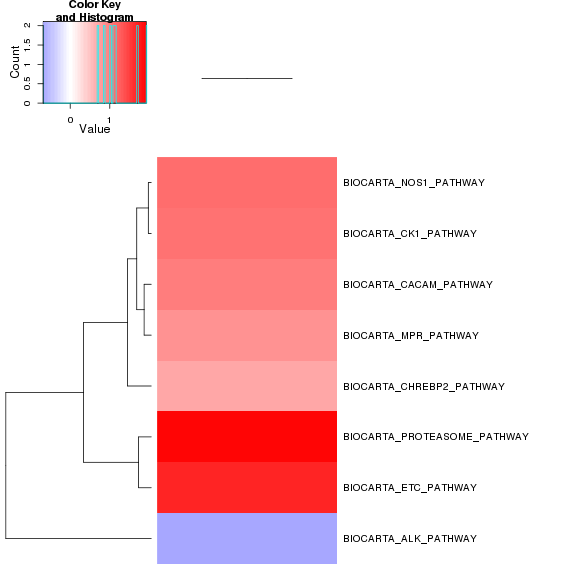 


Reactome enrichment: 


```
## Error: no locations are finite
```

 


Reactome zscore: 

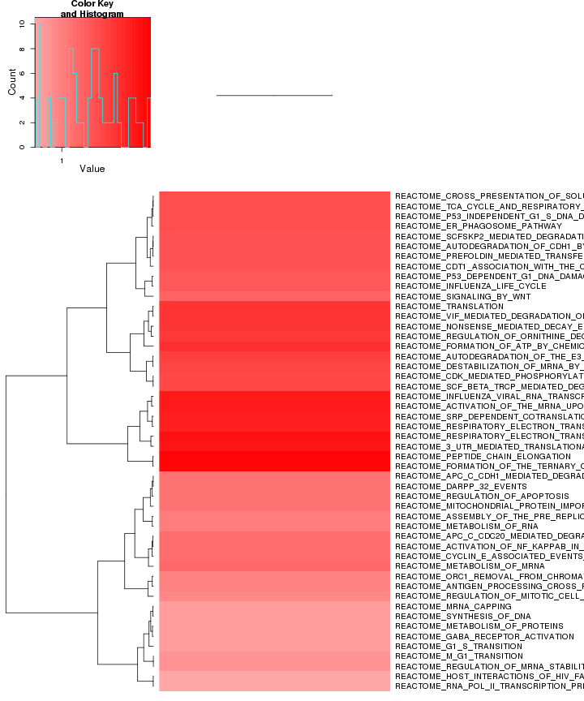 


Kegg enrichment: 

 

Kegg zscore: 

 

Interneuron enrichment:


```
## Error: no locations are finite
```

 

Interneuron zscore:

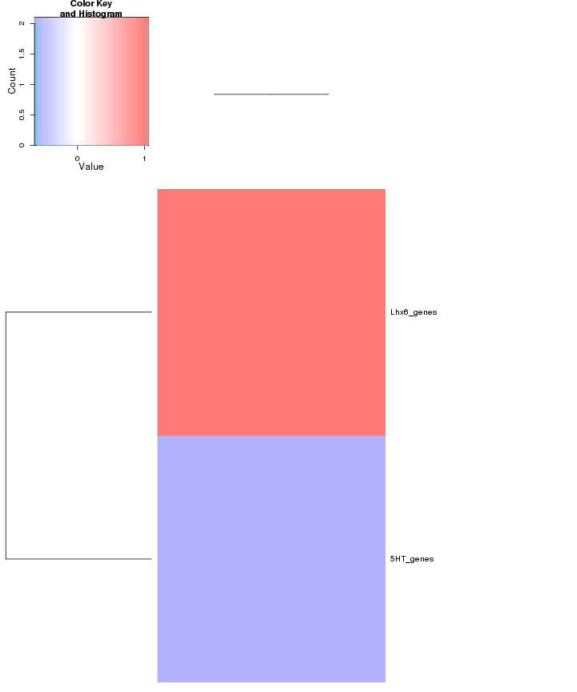 


## GO enrichment 
Cluster profiler used to call enichments of significantly differentially regulated genes that map to Entrez IDs. 


```
## Error: arguments imply differing number of rows: 298, 293
```

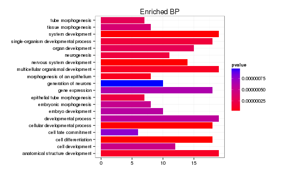 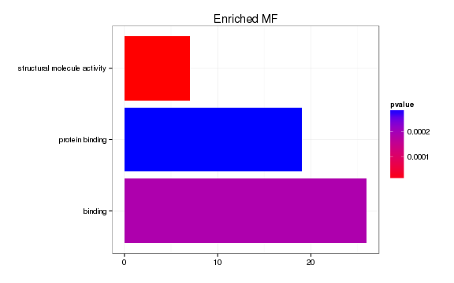 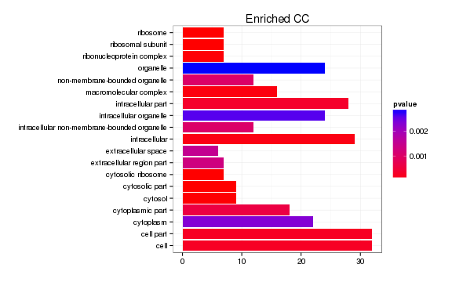 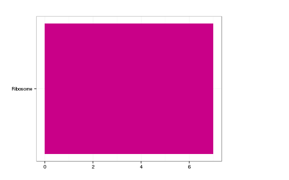 

```
## Error: error in evaluating the argument 'x' in selecting a method for function 'plot': Error: object 'pathway' not found
```

# Cis vs Trans (locally)

log2 Foldchange and test statistic are calculated with the ratio of fpkm(KO)/fpkm(WT), thus the test_stat is positive if a gene is higher in the KO and negative if a gene has lower expression in the KO


The pvalue for 2 genes significantly regulated in a region this size  is: 0.907 


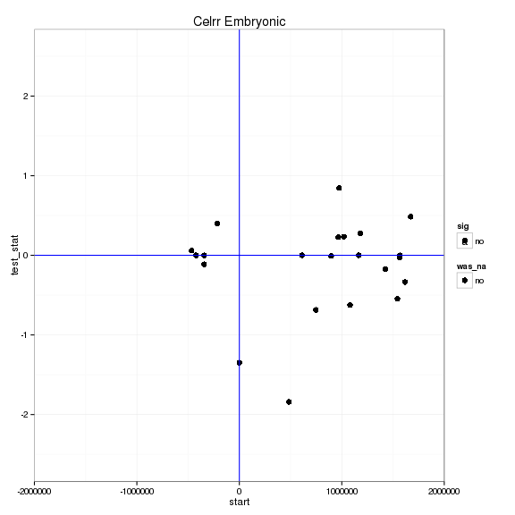 

# Notes

## Samples used are:
<!-- html table generated in R 3.0.2 by xtable 1.7-3 package -->
<!-- Mon Jul 14 18:39:16 2014 -->
<TABLE border=1>
<TR> <TH>  </TH> <TH> 10 </TH>  </TR>
  <TR> <TD align="right"> 1 </TD> <TD> JR753 </TD> </TR>
  <TR> <TD align="right"> 2 </TD> <TD> JR750 </TD> </TR>
  <TR> <TD align="right"> 3 </TD> <TD> JR771 </TD> </TR>
  <TR> <TD align="right"> 4 </TD> <TD> JR755 </TD> </TR>
  <TR> <TD align="right"> 5 </TD> <TD> JR811 </TD> </TR>
  <TR> <TD align="right"> 6 </TD> <TD> JR768 </TD> </TR>
  <TR> <TD align="right"> 7 </TD> <TD> JR761 </TD> </TR>
  <TR> <TD align="right"> 8 </TD> <TD> JR815 </TD> </TR>
  <TR> <TD align="right"> 9 </TD> <TD> JR789 </TD> </TR>
  <TR> <TD align="right"> 10 </TD> <TD> JR748 </TD> </TR>
  <TR> <TD align="right"> 11 </TD> <TD> JR716 </TD> </TR>
  <TR> <TD align="right"> 12 </TD> <TD> JR717 </TD> </TR>
  <TR> <TD align="right"> 13 </TD> <TD> JR719 </TD> </TR>
  <TR> <TD align="right"> 14 </TD> <TD> JR756 </TD> </TR>
  <TR> <TD align="right"> 15 </TD> <TD> JR773 </TD> </TR>
  <TR> <TD align="right"> 16 </TD> <TD> JR760 </TD> </TR>
  <TR> <TD align="right"> 17 </TD> <TD> JR863 </TD> </TR>
   </TABLE>

## Replicates
<!-- html table generated in R 3.0.2 by xtable 1.7-3 package -->
<!-- Mon Jul 14 18:39:16 2014 -->
<TABLE border=1>
<TR> <TH>  </TH> <TH> file </TH> <TH> sample_name </TH> <TH> replicate </TH> <TH> rep_name </TH> <TH> total_mass </TH> <TH> norm_mass </TH> <TH> internal_scale </TH> <TH> external_scale </TH>  </TR>
  <TR> <TD align="right"> 1 </TD> <TD> /n/rinn_data1/seq/lgoff/Projects/BrainMap/data/quants/JR753/abundances.cxb </TD> <TD> WT </TD> <TD align="right">   0 </TD> <TD> WT_0 </TD> <TD align="right"> 39331900.00 </TD> <TD align="right"> 32798000.00 </TD> <TD align="right"> 1.25 </TD> <TD align="right"> 1.00 </TD> </TR>
  <TR> <TD align="right"> 2 </TD> <TD> /n/rinn_data1/seq/lgoff/Projects/BrainMap/data/quants/JR750/abundances.cxb </TD> <TD> WT </TD> <TD align="right">   1 </TD> <TD> WT_1 </TD> <TD align="right"> 36031100.00 </TD> <TD align="right"> 32798000.00 </TD> <TD align="right"> 1.09 </TD> <TD align="right"> 1.00 </TD> </TR>
  <TR> <TD align="right"> 3 </TD> <TD> /n/rinn_data1/seq/lgoff/Projects/BrainMap/data/quants/JR771/abundances.cxb </TD> <TD> WT </TD> <TD align="right">   2 </TD> <TD> WT_2 </TD> <TD align="right"> 38857100.00 </TD> <TD align="right"> 32798000.00 </TD> <TD align="right"> 1.22 </TD> <TD align="right"> 1.00 </TD> </TR>
  <TR> <TD align="right"> 4 </TD> <TD> /n/rinn_data1/seq/lgoff/Projects/BrainMap/data/quants/JR755/abundances.cxb </TD> <TD> WT </TD> <TD align="right">   3 </TD> <TD> WT_3 </TD> <TD align="right"> 41811300.00 </TD> <TD align="right"> 32798000.00 </TD> <TD align="right"> 1.27 </TD> <TD align="right"> 1.00 </TD> </TR>
  <TR> <TD align="right"> 5 </TD> <TD> /n/rinn_data1/seq/lgoff/Projects/BrainMap/data/quants/JR811/abundances.cxb </TD> <TD> WT </TD> <TD align="right">   4 </TD> <TD> WT_4 </TD> <TD align="right"> 38172800.00 </TD> <TD align="right"> 32798000.00 </TD> <TD align="right"> 1.20 </TD> <TD align="right"> 1.00 </TD> </TR>
  <TR> <TD align="right"> 6 </TD> <TD> /n/rinn_data1/seq/lgoff/Projects/BrainMap/data/quants/JR768/abundances.cxb </TD> <TD> WT </TD> <TD align="right">   5 </TD> <TD> WT_5 </TD> <TD align="right"> 28375200.00 </TD> <TD align="right"> 32798000.00 </TD> <TD align="right"> 0.88 </TD> <TD align="right"> 1.00 </TD> </TR>
  <TR> <TD align="right"> 7 </TD> <TD> /n/rinn_data1/seq/lgoff/Projects/BrainMap/data/quants/JR761/abundances.cxb </TD> <TD> WT </TD> <TD align="right">   6 </TD> <TD> WT_6 </TD> <TD align="right"> 31706200.00 </TD> <TD align="right"> 32798000.00 </TD> <TD align="right"> 0.97 </TD> <TD align="right"> 1.00 </TD> </TR>
  <TR> <TD align="right"> 8 </TD> <TD> /n/rinn_data1/seq/lgoff/Projects/BrainMap/data/quants/JR815/abundances.cxb </TD> <TD> WT </TD> <TD align="right">   7 </TD> <TD> WT_7 </TD> <TD align="right"> 29733100.00 </TD> <TD align="right"> 32798000.00 </TD> <TD align="right"> 0.91 </TD> <TD align="right"> 1.00 </TD> </TR>
  <TR> <TD align="right"> 9 </TD> <TD> /n/rinn_data1/seq/lgoff/Projects/BrainMap/data/quants/JR789/abundances.cxb </TD> <TD> WT </TD> <TD align="right">   8 </TD> <TD> WT_8 </TD> <TD align="right"> 27681500.00 </TD> <TD align="right"> 32798000.00 </TD> <TD align="right"> 0.85 </TD> <TD align="right"> 1.00 </TD> </TR>
  <TR> <TD align="right"> 10 </TD> <TD> /n/rinn_data1/seq/lgoff/Projects/BrainMap/data/quants/JR748/abundances.cxb </TD> <TD> WT </TD> <TD align="right">   9 </TD> <TD> WT_9 </TD> <TD align="right"> 32367000.00 </TD> <TD align="right"> 32798000.00 </TD> <TD align="right"> 0.95 </TD> <TD align="right"> 1.00 </TD> </TR>
  <TR> <TD align="right"> 11 </TD> <TD> /n/rinn_data1/seq/lgoff/Projects/BrainMap/data/quants/JR716/abundances.cxb </TD> <TD> WT </TD> <TD align="right">  10 </TD> <TD> WT_10 </TD> <TD align="right"> 26144700.00 </TD> <TD align="right"> 32798000.00 </TD> <TD align="right"> 0.80 </TD> <TD align="right"> 1.00 </TD> </TR>
  <TR> <TD align="right"> 12 </TD> <TD> /n/rinn_data1/seq/lgoff/Projects/BrainMap/data/quants/JR717/abundances.cxb </TD> <TD> WT </TD> <TD align="right">  11 </TD> <TD> WT_11 </TD> <TD align="right"> 25565400.00 </TD> <TD align="right"> 32798000.00 </TD> <TD align="right"> 0.79 </TD> <TD align="right"> 1.00 </TD> </TR>
  <TR> <TD align="right"> 13 </TD> <TD> /n/rinn_data1/seq/lgoff/Projects/BrainMap/data/quants/JR719/abundances.cxb </TD> <TD> WT </TD> <TD align="right">  12 </TD> <TD> WT_12 </TD> <TD align="right"> 22697800.00 </TD> <TD align="right"> 32798000.00 </TD> <TD align="right"> 0.68 </TD> <TD align="right"> 1.00 </TD> </TR>
  <TR> <TD align="right"> 14 </TD> <TD> /n/rinn_data1/seq/lgoff/Projects/BrainMap/data/quants/JR756/abundances.cxb </TD> <TD> WT </TD> <TD align="right">  13 </TD> <TD> WT_13 </TD> <TD align="right"> 38948900.00 </TD> <TD align="right"> 32798000.00 </TD> <TD align="right"> 1.21 </TD> <TD align="right"> 1.00 </TD> </TR>
  <TR> <TD align="right"> 15 </TD> <TD> /n/rinn_data1/seq/lgoff/Projects/BrainMap/data/quants/JR773/abundances.cxb </TD> <TD> Celrr </TD> <TD align="right">   0 </TD> <TD> Celrr_0 </TD> <TD align="right"> 37950800.00 </TD> <TD align="right"> 32798000.00 </TD> <TD align="right"> 1.12 </TD> <TD align="right"> 1.00 </TD> </TR>
  <TR> <TD align="right"> 16 </TD> <TD> /n/rinn_data1/seq/lgoff/Projects/BrainMap/data/quants/JR760/abundances.cxb </TD> <TD> Celrr </TD> <TD align="right">   1 </TD> <TD> Celrr_1 </TD> <TD align="right"> 30671700.00 </TD> <TD align="right"> 32798000.00 </TD> <TD align="right"> 0.93 </TD> <TD align="right"> 1.00 </TD> </TR>
  <TR> <TD align="right"> 17 </TD> <TD> /n/rinn_data1/seq/lgoff/Projects/BrainMap/data/quants/JR863/abundances.cxb </TD> <TD> Celrr </TD> <TD align="right">   2 </TD> <TD> Celrr_2 </TD> <TD align="right"> 40066300.00 </TD> <TD align="right"> 32798000.00 </TD> <TD align="right"> 1.14 </TD> <TD align="right"> 1.00 </TD> </TR>
   </TABLE>

## Session Info

```
## R version 3.0.2 (2013-09-25)
## Platform: x86_64-unknown-linux-gnu (64-bit)
## 
## locale:
##  [1] LC_CTYPE=en_US.UTF-8       LC_NUMERIC=C              
##  [3] LC_TIME=en_US.UTF-8        LC_COLLATE=en_US.UTF-8    
##  [5] LC_MONETARY=en_US.UTF-8    LC_MESSAGES=en_US.UTF-8   
##  [7] LC_PAPER=en_US.UTF-8       LC_NAME=C                 
##  [9] LC_ADDRESS=C               LC_TELEPHONE=C            
## [11] LC_MEASUREMENT=en_US.UTF-8 LC_IDENTIFICATION=C       
## 
## attached base packages:
## [1] grid      parallel  methods   stats     graphics  grDevices utils    
## [8] datasets  base     
## 
## other attached packages:
##  [1] plyr_1.8.1                         
##  [2] stringr_0.6.2                      
##  [3] seqbias_1.10.0                     
##  [4] BSgenome.Mmusculus.UCSC.mm10_1.3.19
##  [5] BSgenome_1.30.0                    
##  [6] Biostrings_2.30.1                  
##  [7] GO.db_2.10.1                       
##  [8] org.Mm.eg.db_2.10.1                
##  [9] clusterProfiler_1.13.1             
## [10] DOSE_2.0.0                         
## [11] ReactomePA_1.6.1                   
## [12] AnnotationDbi_1.24.0               
## [13] Biobase_2.22.0                     
## [14] mgcv_1.7-29                        
## [15] nlme_3.1-117                       
## [16] RMySQL_0.9-3                       
## [17] RColorBrewer_1.0-5                 
## [18] gridExtra_0.9.1                    
## [19] gtable_0.1.2                       
## [20] marray_1.40.0                      
## [21] gplots_2.13.0                      
## [22] GSA_1.03                           
## [23] limma_3.18.13                      
## [24] xtable_1.7-3                       
## [25] cummeRbund_2.7.2                   
## [26] Gviz_1.6.0                         
## [27] rtracklayer_1.22.7                 
## [28] GenomicRanges_1.14.4               
## [29] XVector_0.2.0                      
## [30] IRanges_1.20.7                     
## [31] fastcluster_1.1.13                 
## [32] reshape2_1.4                       
## [33] ggplot2_1.0.0                      
## [34] RSQLite_0.11.4                     
## [35] DBI_0.2-7                          
## [36] BiocGenerics_0.8.0                 
## [37] knitr_1.6                          
## 
## loaded via a namespace (and not attached):
##  [1] biomaRt_2.18.0         biovizBase_1.10.8      bitops_1.0-6          
##  [4] caTools_1.17           cluster_1.15.2         colorspace_1.2-4      
##  [7] dichromat_2.0-0        digest_0.6.4           DO.db_2.7             
## [10] evaluate_0.5.5         formatR_0.10           Formula_1.1-1         
## [13] gdata_2.13.3           GenomicFeatures_1.14.5 GOSemSim_1.20.3       
## [16] graph_1.40.1           graphite_1.8.1         gtools_3.4.1          
## [19] Hmisc_3.14-4           igraph_0.7.1           KEGG.db_2.10.1        
## [22] KernSmooth_2.23-12     labeling_0.2           lattice_0.20-29       
## [25] latticeExtra_0.6-26    MASS_7.3-33            Matrix_1.1-3          
## [28] munsell_0.4.2          org.Hs.eg.db_2.10.1    proto_0.3-10          
## [31] qvalue_1.36.0          Rcpp_0.11.2            RCurl_1.95-4.1        
## [34] reactome.db_1.46.1     Rsamtools_1.14.3       scales_0.2.4          
## [37] splines_3.0.2          stats4_3.0.2           survival_2.37-7       
## [40] tcltk_3.0.2            tools_3.0.2            XML_3.98-1.1          
## [43] zlibbioc_1.8.0
```

## Run Info

```
##           param
## 1      cmd_line
## 2       version
## 3  SVN_revision
## 4 boost_version
## 5        genome
##                                                                                                                                                                                                                                                                                                                                                                                                                                                                                                                                                                                                                                                                                                                                                                                                                                                                                                                                                                                                                                                                                                                                                                                                                                                                                                                                                                                                                                                                                                                                       value
## 1 cuffdiff -p 10 -L WT,Celrr -o /n/rinn_data1/seq/lgoff/Projects/BrainMap/data/diffs/Celrr_vs_WT_Embryonic /n/rinn_data1/seq/lgoff/Projects/BrainMap/data/annotation/mm10_gencode_vM2_with_lncRNAs_and_LacZ.gtf /n/rinn_data1/seq/lgoff/Projects/BrainMap/data/quants/JR753/abundances.cxb,/n/rinn_data1/seq/lgoff/Projects/BrainMap/data/quants/JR750/abundances.cxb,/n/rinn_data1/seq/lgoff/Projects/BrainMap/data/quants/JR771/abundances.cxb,/n/rinn_data1/seq/lgoff/Projects/BrainMap/data/quants/JR755/abundances.cxb,/n/rinn_data1/seq/lgoff/Projects/BrainMap/data/quants/JR811/abundances.cxb,/n/rinn_data1/seq/lgoff/Projects/BrainMap/data/quants/JR768/abundances.cxb,/n/rinn_data1/seq/lgoff/Projects/BrainMap/data/quants/JR761/abundances.cxb,/n/rinn_data1/seq/lgoff/Projects/BrainMap/data/quants/JR815/abundances.cxb,/n/rinn_data1/seq/lgoff/Projects/BrainMap/data/quants/JR789/abundances.cxb,/n/rinn_data1/seq/lgoff/Projects/BrainMap/data/quants/JR748/abundances.cxb,/n/rinn_data1/seq/lgoff/Projects/BrainMap/data/quants/JR716/abundances.cxb,/n/rinn_data1/seq/lgoff/Projects/BrainMap/data/quants/JR717/abundances.cxb,/n/rinn_data1/seq/lgoff/Projects/BrainMap/data/quants/JR719/abundances.cxb,/n/rinn_data1/seq/lgoff/Projects/BrainMap/data/quants/JR756/abundances.cxb /n/rinn_data1/seq/lgoff/Projects/BrainMap/data/quants/JR773/abundances.cxb,/n/rinn_data1/seq/lgoff/Projects/BrainMap/data/quants/JR760/abundances.cxb,/n/rinn_data1/seq/lgoff/Projects/BrainMap/data/quants/JR863/abundances.cxb 
## 2                                                                                                                                                                                                                                                                                                                                                                                                                                                                                                                                                                                                                                                                                                                                                                                                                                                                                                                                                                                                                                                                                                                                                                                                                                                                                                                                                                                                                                                                                                                                     2.2.1
## 3                                                                                                                                                                                                                                                                                                                                                                                                                                                                                                                                                                                                                                                                                                                                                                                                                                                                                                                                                                                                                                                                                                                                                                                                                                                                                                                                                                                                                                                                                                                                      4237
## 4                                                                                                                                                                                                                                                                                                                                                                                                                                                                                                                                                                                                                                                                                                                                                                                                                                                                                                                                                                                                                                                                                                                                                                                                                                                                                                                                                                                                                                                                                                                                    104700
## 5                                                                                                                                                                                                                                                                                                                                                                                                                                                                                                                                                                                                                                                                                                                                                                                                                                                                                                                                                                                                                                                                                                                                                                                                                                                                                                                                                                                                                                                                                                                                      mm10
```


