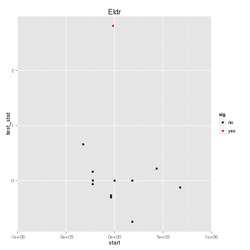

Eldr KO vs WT (Adult)
======================================


- add labels, descriptions
- turn off all caching ! 
- other heatmap labels (csHeatmap)
- overlap figure
- tracks 
- should import litter info


# Intialize


# Design Overview

This file shows the wt-v-ko comparison for Eldr. 

Cuff overview:

```
## CuffSet instance with:
## 	 2 samples
## 	 26754 genes
## 	 77524 isoforms
## 	 0 TSS
## 	 0 CDS
## 	 0 promoters
## 	 0 splicing
## 	 0 relCDS
```


# QC

## Dispersion

Dispersion plot for genes in cuff:
(Overdispersion can lead to innacurate quants)


```
## Error: 'from' cannot be NA, NaN or infinite
```

## Cross-replicate variability (fpkmSCVplot)
Differences in CV 2 can result in lower numbers of differentially expressed genes due to a higher degree of variability between replicate fpkm estimates.

Genes:
 


Isoforms: 
 

## Volcano

```
## Error: One or more values of 'x' or 'y' are not valid sample names!
```

### Volcano matrix (replicates)

 

## MvA plot

```
## Error: non-numeric argument to binary operator
```
   
### MvA plot counts

```
## Error: non-numeric argument to binary operator
```

## Scatterplot
 

### Scatter matrix (replicates) -- SKIP FOR NOW CAUSING PROBLEMS 


## Distributions

### Boxplots

Boxplot (genes)

 

Boxplot (genes, replicates)

 

Boxplot (isoforms)

 

Boxplot (isoforms, replicates)

 

### Density

Density (genes)

 

Density (genes, replicates)

 


## Clustering

### Replicate Clusters
 

```
## 'dendrogram' with 2 branches and 18 members total, at height 0.07546
```

### PCA (genes)
 

### MDS (genes)
 


# KO assessment

## Endogenous lncRNA expression

 

Endogenous expression of Eldr isoforms:

 

Barplot of gene expression:

 

Barplot of isoform expression:

 


## LacZ expression

  


## Digital Genotyping (LacZ vs Endogenous lncRNA and Sex)
Expression plot (endogenous linc, lacZ, Y-expressed gene):

 

Expression heatmap:
 

# Differential Analysis

## Differential Genes 


There are 59 significantly differentially expressed genes. They are:

<!-- html table generated in R 3.0.2 by xtable 1.7-3 package -->
<!-- Wed Jun 18 16:44:19 2014 -->
<TABLE border=1>
<TR> <TH>  </TH> <TH> geneAnnot$gene_short_name </TH>  </TR>
  <TR> <TD align="right"> 1 </TD> <TD> Klf4 </TD> </TR>
  <TR> <TD align="right"> 2 </TD> <TD> Fosb </TD> </TR>
  <TR> <TD align="right"> 3 </TD> <TD> Nes </TD> </TR>
  <TR> <TD align="right"> 4 </TD> <TD> Ubc </TD> </TR>
  <TR> <TD align="right"> 5 </TD> <TD> Btg2 </TD> </TR>
  <TR> <TD align="right"> 6 </TD> <TD> Igfbp3 </TD> </TR>
  <TR> <TD align="right"> 7 </TD> <TD> Xbp1 </TD> </TR>
  <TR> <TD align="right"> 8 </TD> <TD> Adi1 </TD> </TR>
  <TR> <TD align="right"> 9 </TD> <TD> Per1 </TD> </TR>
  <TR> <TD align="right"> 10 </TD> <TD> Fos </TD> </TR>
  <TR> <TD align="right"> 11 </TD> <TD> 4930452B06Rik </TD> </TR>
  <TR> <TD align="right"> 12 </TD> <TD> Arc </TD> </TR>
  <TR> <TD align="right"> 13 </TD> <TD> Adamts1 </TD> </TR>
  <TR> <TD align="right"> 14 </TD> <TD> Nr4a1 </TD> </TR>
  <TR> <TD align="right"> 15 </TD> <TD> Celsr3 </TD> </TR>
  <TR> <TD align="right"> 16 </TD> <TD> Xdh </TD> </TR>
  <TR> <TD align="right"> 17 </TD> <TD> Dusp1 </TD> </TR>
  <TR> <TD align="right"> 18 </TD> <TD> Flnb </TD> </TR>
  <TR> <TD align="right"> 19 </TD> <TD> Hspa5 </TD> </TR>
  <TR> <TD align="right"> 20 </TD> <TD> Cyr61 </TD> </TR>
  <TR> <TD align="right"> 21 </TD> <TD> Nr4a3 </TD> </TR>
  <TR> <TD align="right"> 22 </TD> <TD> Ndufs5 </TD> </TR>
  <TR> <TD align="right"> 23 </TD> <TD> Fosl2 </TD> </TR>
  <TR> <TD align="right"> 24 </TD> <TD> Ugt2a1 </TD> </TR>
  <TR> <TD align="right"> 25 </TD> <TD> Hddc3 </TD> </TR>
  <TR> <TD align="right"> 26 </TD> <TD> Ndn </TD> </TR>
  <TR> <TD align="right"> 27 </TD> <TD> Tlr13 </TD> </TR>
  <TR> <TD align="right"> 28 </TD> <TD> Arhgap27 </TD> </TR>
  <TR> <TD align="right"> 29 </TD> <TD> Prr7 </TD> </TR>
  <TR> <TD align="right"> 30 </TD> <TD> Rps29 </TD> </TR>
  <TR> <TD align="right"> 31 </TD> <TD> Egr2 </TD> </TR>
  <TR> <TD align="right"> 32 </TD> <TD> Egr1 </TD> </TR>
  <TR> <TD align="right"> 33 </TD> <TD> Irs2 </TD> </TR>
  <TR> <TD align="right"> 34 </TD> <TD> Pcsk1n </TD> </TR>
  <TR> <TD align="right"> 35 </TD> <TD> Klhl42 </TD> </TR>
  <TR> <TD align="right"> 36 </TD> <TD> Xaf1 </TD> </TR>
  <TR> <TD align="right"> 37 </TD> <TD> Slc25a34 </TD> </TR>
  <TR> <TD align="right"> 38 </TD> <TD> C1qtnf4 </TD> </TR>
  <TR> <TD align="right"> 39 </TD> <TD> Maff </TD> </TR>
  <TR> <TD align="right"> 40 </TD> <TD> Tuba1c </TD> </TR>
  <TR> <TD align="right"> 41 </TD> <TD> Gm9493 </TD> </TR>
  <TR> <TD align="right"> 42 </TD> <TD> Acp1 </TD> </TR>
  <TR> <TD align="right"> 43 </TD> <TD> Fbxo48 </TD> </TR>
  <TR> <TD align="right"> 44 </TD> <TD> Npas4 </TD> </TR>
  <TR> <TD align="right"> 45 </TD> <TD> Junb </TD> </TR>
  <TR> <TD align="right"> 46 </TD> <TD> Nudcd3 </TD> </TR>
  <TR> <TD align="right"> 47 </TD> <TD> Klf2 </TD> </TR>
  <TR> <TD align="right"> 48 </TD> <TD> Gm10020 </TD> </TR>
  <TR> <TD align="right"> 49 </TD> <TD> Capn11 </TD> </TR>
  <TR> <TD align="right"> 50 </TD> <TD> Ddx3y </TD> </TR>
  <TR> <TD align="right"> 51 </TD> <TD> Serpinh1 </TD> </TR>
  <TR> <TD align="right"> 52 </TD> <TD> Jund </TD> </TR>
  <TR> <TD align="right"> 53 </TD> <TD> Egr4 </TD> </TR>
  <TR> <TD align="right"> 54 </TD> <TD> Gm7292 </TD> </TR>
  <TR> <TD align="right"> 55 </TD> <TD> Wdfy1 </TD> </TR>
  <TR> <TD align="right"> 56 </TD> <TD> Ier5l </TD> </TR>
  <TR> <TD align="right"> 57 </TD> <TD> Apold1 </TD> </TR>
  <TR> <TD align="right"> 58 </TD> <TD> AA465934 </TD> </TR>
  <TR> <TD align="right"> 59 </TD> <TD> LacZ </TD> </TR>
   </TABLE>

### Matrix of gene significant differences between conditions

(skip for Brainmap wt-v-ko comparisons)

 

### Significant gene expression differences between conditions

Expression plot (genes):
  

Significant genes with expression >50fpkm (any condition):
 

An individual look at each of the highly expressed significantly differentially regulated genes:
(eval=false for first pass)


### Expression-level/significance relationship

Scatter plot of significant genes only:

```
## Error: One or more values of 'x' or 'y' are not valid sample names!
```

Volcano plot with significant genes only:

```
## Error: One or more values of 'x' or 'y' are not valid sample names!
```


## Differential Splicing

### Differential Isoforms between conditions
Per isoform difference between conditions:
 

These isoforms are:
<!-- html table generated in R 3.0.2 by xtable 1.7-3 package -->
<!-- Wed Jun 18 16:44:29 2014 -->
<TABLE border=1>
<TR> <TH>  </TH> <TH> isoAnnot$gene_short_name </TH>  </TR>
  <TR> <TD align="right"> 1 </TD> <TD> Rec8 </TD> </TR>
  <TR> <TD align="right"> 2 </TD> <TD> Klf4 </TD> </TR>
  <TR> <TD align="right"> 3 </TD> <TD> Fosb </TD> </TR>
  <TR> <TD align="right"> 4 </TD> <TD> Nes </TD> </TR>
  <TR> <TD align="right"> 5 </TD> <TD> Cyp2a5 </TD> </TR>
  <TR> <TD align="right"> 6 </TD> <TD> Ubc </TD> </TR>
  <TR> <TD align="right"> 7 </TD> <TD> Etnppl </TD> </TR>
  <TR> <TD align="right"> 8 </TD> <TD> Btg2 </TD> </TR>
  <TR> <TD align="right"> 9 </TD> <TD> Igfbp3 </TD> </TR>
  <TR> <TD align="right"> 10 </TD> <TD> Xbp1 </TD> </TR>
  <TR> <TD align="right"> 11 </TD> <TD> Fos </TD> </TR>
  <TR> <TD align="right"> 12 </TD> <TD> 4930452B06Rik </TD> </TR>
  <TR> <TD align="right"> 13 </TD> <TD> Arc </TD> </TR>
  <TR> <TD align="right"> 14 </TD> <TD> Adamts1 </TD> </TR>
  <TR> <TD align="right"> 15 </TD> <TD> Nr4a1 </TD> </TR>
  <TR> <TD align="right"> 16 </TD> <TD> Atp6v0c </TD> </TR>
  <TR> <TD align="right"> 17 </TD> <TD> Dusp1 </TD> </TR>
  <TR> <TD align="right"> 18 </TD> <TD> Fkbp5 </TD> </TR>
  <TR> <TD align="right"> 19 </TD> <TD> Flnb </TD> </TR>
  <TR> <TD align="right"> 20 </TD> <TD> Col5a1 </TD> </TR>
  <TR> <TD align="right"> 21 </TD> <TD> Cyr61 </TD> </TR>
  <TR> <TD align="right"> 22 </TD> <TD> Ndufs5 </TD> </TR>
  <TR> <TD align="right"> 23 </TD> <TD> Fosl2 </TD> </TR>
  <TR> <TD align="right"> 24 </TD> <TD> Col1a2 </TD> </TR>
  <TR> <TD align="right"> 25 </TD> <TD> Hddc3 </TD> </TR>
  <TR> <TD align="right"> 26 </TD> <TD> Ndn </TD> </TR>
  <TR> <TD align="right"> 27 </TD> <TD> Prr7 </TD> </TR>
  <TR> <TD align="right"> 28 </TD> <TD> Egr2 </TD> </TR>
  <TR> <TD align="right"> 29 </TD> <TD> Egr1 </TD> </TR>
  <TR> <TD align="right"> 30 </TD> <TD> Irs2 </TD> </TR>
  <TR> <TD align="right"> 31 </TD> <TD> Pcsk1n </TD> </TR>
  <TR> <TD align="right"> 32 </TD> <TD> Klhl42 </TD> </TR>
  <TR> <TD align="right"> 33 </TD> <TD> Slc25a34 </TD> </TR>
  <TR> <TD align="right"> 34 </TD> <TD> C1qtnf4 </TD> </TR>
  <TR> <TD align="right"> 35 </TD> <TD> Tuba1c </TD> </TR>
  <TR> <TD align="right"> 36 </TD> <TD> Fbxo48 </TD> </TR>
  <TR> <TD align="right"> 37 </TD> <TD> Npas4 </TD> </TR>
  <TR> <TD align="right"> 38 </TD> <TD> Junb </TD> </TR>
  <TR> <TD align="right"> 39 </TD> <TD> Klf2 </TD> </TR>
  <TR> <TD align="right"> 40 </TD> <TD> Gm10020 </TD> </TR>
  <TR> <TD align="right"> 41 </TD> <TD> Capn11 </TD> </TR>
  <TR> <TD align="right"> 42 </TD> <TD> Ddx3y </TD> </TR>
  <TR> <TD align="right"> 43 </TD> <TD> Gprin1 </TD> </TR>
  <TR> <TD align="right"> 44 </TD> <TD> Jund </TD> </TR>
  <TR> <TD align="right"> 45 </TD> <TD> Egr4 </TD> </TR>
  <TR> <TD align="right"> 46 </TD> <TD> Gm7292 </TD> </TR>
  <TR> <TD align="right"> 47 </TD> <TD> Ier5l </TD> </TR>
  <TR> <TD align="right"> 48 </TD> <TD> Apold1 </TD> </TR>
  <TR> <TD align="right"> 49 </TD> <TD> LacZ </TD> </TR>
   </TABLE>


 

### Differential Splicing between conditions

(eval false for first pass)

Per condition differences in isoforms (Does gene have diff piechart between conditions?)


These genes are:


Splicing heatmap by isoform:


Splicing heatmap by gene


The following are significantly differentially spliced genes (relative portion of isoform per condition): 


 


# Gene/Pathway Analysis

## GSEA


 

 

## GO enrichment 
Cluster profiler used to call enichments of significantly differentially regulated genes that map to Entrez IDs. 


   

```
## Error: need finite 'xlim' values
```

 

```
## Error: need finite 'xlim' values
```

# Cis vs Trans (locally)

```
## Error: argument "seed" is missing, with no default
```

The pvalue for genes significantly regulated in this region is: 3.0106 &times; 10<sup>-19</sup>

 


# Notes

## Samples used are:
<!-- html table generated in R 3.0.2 by xtable 1.7-3 package -->
<!-- Wed Jun 18 17:01:07 2014 -->
<TABLE border=1>
<TR> <TH>  </TH> <TH> 10 </TH>  </TR>
  <TR> <TD align="right"> 1 </TD> <TD> JR729 </TD> </TR>
  <TR> <TD align="right"> 2 </TD> <TD> JR728 </TD> </TR>
  <TR> <TD align="right"> 3 </TD> <TD> JR796 </TD> </TR>
  <TR> <TD align="right"> 4 </TD> <TD> JR797 </TD> </TR>
  <TR> <TD align="right"> 5 </TD> <TD> JR740 </TD> </TR>
  <TR> <TD align="right"> 6 </TD> <TD> JR800 </TD> </TR>
  <TR> <TD align="right"> 7 </TD> <TD> JR827 </TD> </TR>
  <TR> <TD align="right"> 8 </TD> <TD> JR778 </TD> </TR>
  <TR> <TD align="right"> 9 </TD> <TD> JR734 </TD> </TR>
  <TR> <TD align="right"> 10 </TD> <TD> JR802 </TD> </TR>
  <TR> <TD align="right"> 11 </TD> <TD> JR803 </TD> </TR>
  <TR> <TD align="right"> 12 </TD> <TD> JR735 </TD> </TR>
  <TR> <TD align="right"> 13 </TD> <TD> JR817 </TD> </TR>
  <TR> <TD align="right"> 14 </TD> <TD> JR785 </TD> </TR>
  <TR> <TD align="right"> 15 </TD> <TD> JR781 </TD> </TR>
  <TR> <TD align="right"> 16 </TD> <TD> JR733 </TD> </TR>
  <TR> <TD align="right"> 17 </TD> <TD> JR799 </TD> </TR>
  <TR> <TD align="right"> 18 </TD> <TD> JR777 </TD> </TR>
   </TABLE>

## Replicates
<!-- html table generated in R 3.0.2 by xtable 1.7-3 package -->
<!-- Wed Jun 18 17:01:07 2014 -->
<TABLE border=1>
<TR> <TH>  </TH> <TH> file </TH> <TH> sample_name </TH> <TH> replicate </TH> <TH> rep_name </TH> <TH> total_mass </TH> <TH> norm_mass </TH> <TH> internal_scale </TH> <TH> external_scale </TH>  </TR>
  <TR> <TD align="right"> 1 </TD> <TD> /n/rinn_data1/seq/lgoff/Projects/BrainMap/data/quants/JR729/abundances.cxb </TD> <TD> WT </TD> <TD align="right">   0 </TD> <TD> WT_0 </TD> <TD align="right"> 26338300.00 </TD> <TD align="right"> 34022000.00 </TD> <TD align="right"> 0.77 </TD> <TD align="right"> 1.00 </TD> </TR>
  <TR> <TD align="right"> 2 </TD> <TD> /n/rinn_data1/seq/lgoff/Projects/BrainMap/data/quants/JR728/abundances.cxb </TD> <TD> WT </TD> <TD align="right">   1 </TD> <TD> WT_1 </TD> <TD align="right"> 20332100.00 </TD> <TD align="right"> 34022000.00 </TD> <TD align="right"> 0.60 </TD> <TD align="right"> 1.00 </TD> </TR>
  <TR> <TD align="right"> 3 </TD> <TD> /n/rinn_data1/seq/lgoff/Projects/BrainMap/data/quants/JR796/abundances.cxb </TD> <TD> WT </TD> <TD align="right">   2 </TD> <TD> WT_2 </TD> <TD align="right"> 34093300.00 </TD> <TD align="right"> 34022000.00 </TD> <TD align="right"> 1.00 </TD> <TD align="right"> 1.00 </TD> </TR>
  <TR> <TD align="right"> 4 </TD> <TD> /n/rinn_data1/seq/lgoff/Projects/BrainMap/data/quants/JR797/abundances.cxb </TD> <TD> WT </TD> <TD align="right">   3 </TD> <TD> WT_3 </TD> <TD align="right"> 28111900.00 </TD> <TD align="right"> 34022000.00 </TD> <TD align="right"> 0.82 </TD> <TD align="right"> 1.00 </TD> </TR>
  <TR> <TD align="right"> 5 </TD> <TD> /n/rinn_data1/seq/lgoff/Projects/BrainMap/data/quants/JR740/abundances.cxb </TD> <TD> WT </TD> <TD align="right">   4 </TD> <TD> WT_4 </TD> <TD align="right"> 35813300.00 </TD> <TD align="right"> 34022000.00 </TD> <TD align="right"> 1.05 </TD> <TD align="right"> 1.00 </TD> </TR>
  <TR> <TD align="right"> 6 </TD> <TD> /n/rinn_data1/seq/lgoff/Projects/BrainMap/data/quants/JR800/abundances.cxb </TD> <TD> WT </TD> <TD align="right">   5 </TD> <TD> WT_5 </TD> <TD align="right"> 37017800.00 </TD> <TD align="right"> 34022000.00 </TD> <TD align="right"> 1.09 </TD> <TD align="right"> 1.00 </TD> </TR>
  <TR> <TD align="right"> 7 </TD> <TD> /n/rinn_data1/seq/lgoff/Projects/BrainMap/data/quants/JR827/abundances.cxb </TD> <TD> WT </TD> <TD align="right">   6 </TD> <TD> WT_6 </TD> <TD align="right"> 27790600.00 </TD> <TD align="right"> 34022000.00 </TD> <TD align="right"> 0.82 </TD> <TD align="right"> 1.00 </TD> </TR>
  <TR> <TD align="right"> 8 </TD> <TD> /n/rinn_data1/seq/lgoff/Projects/BrainMap/data/quants/JR778/abundances.cxb </TD> <TD> WT </TD> <TD align="right">   7 </TD> <TD> WT_7 </TD> <TD align="right"> 39549100.00 </TD> <TD align="right"> 34022000.00 </TD> <TD align="right"> 1.18 </TD> <TD align="right"> 1.00 </TD> </TR>
  <TR> <TD align="right"> 9 </TD> <TD> /n/rinn_data1/seq/lgoff/Projects/BrainMap/data/quants/JR734/abundances.cxb </TD> <TD> WT </TD> <TD align="right">   8 </TD> <TD> WT_8 </TD> <TD align="right"> 34485000.00 </TD> <TD align="right"> 34022000.00 </TD> <TD align="right"> 1.03 </TD> <TD align="right"> 1.00 </TD> </TR>
  <TR> <TD align="right"> 10 </TD> <TD> /n/rinn_data1/seq/lgoff/Projects/BrainMap/data/quants/JR802/abundances.cxb </TD> <TD> WT </TD> <TD align="right">   9 </TD> <TD> WT_9 </TD> <TD align="right"> 45472800.00 </TD> <TD align="right"> 34022000.00 </TD> <TD align="right"> 1.32 </TD> <TD align="right"> 1.00 </TD> </TR>
  <TR> <TD align="right"> 11 </TD> <TD> /n/rinn_data1/seq/lgoff/Projects/BrainMap/data/quants/JR803/abundances.cxb </TD> <TD> WT </TD> <TD align="right">  10 </TD> <TD> WT_10 </TD> <TD align="right"> 52136700.00 </TD> <TD align="right"> 34022000.00 </TD> <TD align="right"> 1.53 </TD> <TD align="right"> 1.00 </TD> </TR>
  <TR> <TD align="right"> 12 </TD> <TD> /n/rinn_data1/seq/lgoff/Projects/BrainMap/data/quants/JR735/abundances.cxb </TD> <TD> WT </TD> <TD align="right">  11 </TD> <TD> WT_11 </TD> <TD align="right"> 34999600.00 </TD> <TD align="right"> 34022000.00 </TD> <TD align="right"> 1.03 </TD> <TD align="right"> 1.00 </TD> </TR>
  <TR> <TD align="right"> 13 </TD> <TD> /n/rinn_data1/seq/lgoff/Projects/BrainMap/data/quants/JR817/abundances.cxb </TD> <TD> WT </TD> <TD align="right">  12 </TD> <TD> WT_12 </TD> <TD align="right"> 30811500.00 </TD> <TD align="right"> 34022000.00 </TD> <TD align="right"> 0.91 </TD> <TD align="right"> 1.00 </TD> </TR>
  <TR> <TD align="right"> 14 </TD> <TD> /n/rinn_data1/seq/lgoff/Projects/BrainMap/data/quants/JR785/abundances.cxb </TD> <TD> WT </TD> <TD align="right">  13 </TD> <TD> WT_13 </TD> <TD align="right"> 34180700.00 </TD> <TD align="right"> 34022000.00 </TD> <TD align="right"> 0.99 </TD> <TD align="right"> 1.00 </TD> </TR>
  <TR> <TD align="right"> 15 </TD> <TD> /n/rinn_data1/seq/lgoff/Projects/BrainMap/data/quants/JR781/abundances.cxb </TD> <TD> WT </TD> <TD align="right">  14 </TD> <TD> WT_14 </TD> <TD align="right"> 41544600.00 </TD> <TD align="right"> 34022000.00 </TD> <TD align="right"> 1.23 </TD> <TD align="right"> 1.00 </TD> </TR>
  <TR> <TD align="right"> 16 </TD> <TD> /n/rinn_data1/seq/lgoff/Projects/BrainMap/data/quants/JR733/abundances.cxb </TD> <TD> Eldr </TD> <TD align="right">   0 </TD> <TD> Eldr_0 </TD> <TD align="right"> 26503500.00 </TD> <TD align="right"> 34022000.00 </TD> <TD align="right"> 0.78 </TD> <TD align="right"> 1.00 </TD> </TR>
  <TR> <TD align="right"> 17 </TD> <TD> /n/rinn_data1/seq/lgoff/Projects/BrainMap/data/quants/JR799/abundances.cxb </TD> <TD> Eldr </TD> <TD align="right">   1 </TD> <TD> Eldr_1 </TD> <TD align="right"> 36459500.00 </TD> <TD align="right"> 34022000.00 </TD> <TD align="right"> 1.06 </TD> <TD align="right"> 1.00 </TD> </TR>
  <TR> <TD align="right"> 18 </TD> <TD> /n/rinn_data1/seq/lgoff/Projects/BrainMap/data/quants/JR777/abundances.cxb </TD> <TD> Eldr </TD> <TD align="right">   2 </TD> <TD> Eldr_2 </TD> <TD align="right"> 42746700.00 </TD> <TD align="right"> 34022000.00 </TD> <TD align="right"> 1.26 </TD> <TD align="right"> 1.00 </TD> </TR>
   </TABLE>

## Session Info

```
## R version 3.0.2 (2013-09-25)
## Platform: x86_64-unknown-linux-gnu (64-bit)
## 
## locale:
##  [1] LC_CTYPE=en_US.UTF-8       LC_NUMERIC=C              
##  [3] LC_TIME=en_US.UTF-8        LC_COLLATE=en_US.UTF-8    
##  [5] LC_MONETARY=en_US.UTF-8    LC_MESSAGES=en_US.UTF-8   
##  [7] LC_PAPER=en_US.UTF-8       LC_NAME=C                 
##  [9] LC_ADDRESS=C               LC_TELEPHONE=C            
## [11] LC_MEASUREMENT=en_US.UTF-8 LC_IDENTIFICATION=C       
## 
## attached base packages:
## [1] grid      parallel  stats     graphics  grDevices utils     datasets 
## [8] methods   base     
## 
## other attached packages:
##  [1] plyr_1.8.1                         
##  [2] stringr_0.6.2                      
##  [3] seqbias_1.10.0                     
##  [4] BSgenome.Mmusculus.UCSC.mm10_1.3.19
##  [5] BSgenome_1.30.0                    
##  [6] Biostrings_2.30.1                  
##  [7] GO.db_2.10.1                       
##  [8] org.Mm.eg.db_2.10.1                
##  [9] clusterProfiler_1.13.1             
## [10] DOSE_2.0.0                         
## [11] ReactomePA_1.6.1                   
## [12] AnnotationDbi_1.24.0               
## [13] Biobase_2.22.0                     
## [14] mgcv_1.7-29                        
## [15] nlme_3.1-117                       
## [16] gridExtra_0.9.1                    
## [17] gtable_0.1.2                       
## [18] marray_1.40.0                      
## [19] gplots_2.13.0                      
## [20] GSA_1.03                           
## [21] limma_3.18.13                      
## [22] xtable_1.7-3                       
## [23] knitr_1.6                          
## [24] cummeRbund_2.7.2                   
## [25] Gviz_1.6.0                         
## [26] rtracklayer_1.22.7                 
## [27] GenomicRanges_1.14.4               
## [28] XVector_0.2.0                      
## [29] IRanges_1.20.7                     
## [30] fastcluster_1.1.13                 
## [31] reshape2_1.4                       
## [32] ggplot2_1.0.0                      
## [33] RSQLite_0.11.4                     
## [34] DBI_0.2-7                          
## [35] BiocGenerics_0.8.0                 
## 
## loaded via a namespace (and not attached):
##  [1] biomaRt_2.18.0         biovizBase_1.10.8      bitops_1.0-6          
##  [4] caTools_1.17           cluster_1.15.2         colorspace_1.2-4      
##  [7] dichromat_2.0-0        digest_0.6.4           DO.db_2.7             
## [10] evaluate_0.5.5         formatR_0.10           Formula_1.1-1         
## [13] gdata_2.13.3           GenomicFeatures_1.14.5 GOSemSim_1.20.3       
## [16] graph_1.40.1           graphite_1.8.1         gtools_3.4.1          
## [19] Hmisc_3.14-4           igraph_0.7.1           KEGG.db_2.10.1        
## [22] KernSmooth_2.23-12     labeling_0.2           lattice_0.20-29       
## [25] latticeExtra_0.6-26    markdown_0.7           MASS_7.3-33           
## [28] Matrix_1.1-3           mime_0.1.1             munsell_0.4.2         
## [31] org.Hs.eg.db_2.10.1    proto_0.3-10           qvalue_1.36.0         
## [34] RColorBrewer_1.0-5     Rcpp_0.11.1            RCurl_1.95-4.1        
## [37] reactome.db_1.46.1     Rsamtools_1.14.3       scales_0.2.4          
## [40] splines_3.0.2          stats4_3.0.2           survival_2.37-7       
## [43] tcltk_3.0.2            tools_3.0.2            XML_3.98-1.1          
## [46] zlibbioc_1.8.0
```

## Run Info

```
##           param
## 1      cmd_line
## 2       version
## 3  SVN_revision
## 4 boost_version
## 5        genome
##                                                                                                                                                                                                                                                                                                                                                                                                                                                                                                                                                                                                                                                                                                                                                                                                                                                                                                                                                                                                                                                                                                                                                                                                                                                                                                                                                                                                                                                                                                                                                                                                            value
## 1 cuffdiff -p 10 -L WT,Eldr -o /n/rinn_data1/seq/lgoff/Projects/BrainMap/data/diffs/Eldr_vs_WT_Adult /n/rinn_data1/seq/lgoff/Projects/BrainMap/data/annotation/mm10_gencode_vM2_with_lncRNAs_and_LacZ.gtf /n/rinn_data1/seq/lgoff/Projects/BrainMap/data/quants/JR729/abundances.cxb,/n/rinn_data1/seq/lgoff/Projects/BrainMap/data/quants/JR728/abundances.cxb,/n/rinn_data1/seq/lgoff/Projects/BrainMap/data/quants/JR796/abundances.cxb,/n/rinn_data1/seq/lgoff/Projects/BrainMap/data/quants/JR797/abundances.cxb,/n/rinn_data1/seq/lgoff/Projects/BrainMap/data/quants/JR740/abundances.cxb,/n/rinn_data1/seq/lgoff/Projects/BrainMap/data/quants/JR800/abundances.cxb,/n/rinn_data1/seq/lgoff/Projects/BrainMap/data/quants/JR827/abundances.cxb,/n/rinn_data1/seq/lgoff/Projects/BrainMap/data/quants/JR778/abundances.cxb,/n/rinn_data1/seq/lgoff/Projects/BrainMap/data/quants/JR734/abundances.cxb,/n/rinn_data1/seq/lgoff/Projects/BrainMap/data/quants/JR802/abundances.cxb,/n/rinn_data1/seq/lgoff/Projects/BrainMap/data/quants/JR803/abundances.cxb,/n/rinn_data1/seq/lgoff/Projects/BrainMap/data/quants/JR735/abundances.cxb,/n/rinn_data1/seq/lgoff/Projects/BrainMap/data/quants/JR817/abundances.cxb,/n/rinn_data1/seq/lgoff/Projects/BrainMap/data/quants/JR785/abundances.cxb,/n/rinn_data1/seq/lgoff/Projects/BrainMap/data/quants/JR781/abundances.cxb /n/rinn_data1/seq/lgoff/Projects/BrainMap/data/quants/JR733/abundances.cxb,/n/rinn_data1/seq/lgoff/Projects/BrainMap/data/quants/JR799/abundances.cxb,/n/rinn_data1/seq/lgoff/Projects/BrainMap/data/quants/JR777/abundances.cxb 
## 2                                                                                                                                                                                                                                                                                                                                                                                                                                                                                                                                                                                                                                                                                                                                                                                                                                                                                                                                                                                                                                                                                                                                                                                                                                                                                                                                                                                                                                                                                                                                                                                                          2.2.1
## 3                                                                                                                                                                                                                                                                                                                                                                                                                                                                                                                                                                                                                                                                                                                                                                                                                                                                                                                                                                                                                                                                                                                                                                                                                                                                                                                                                                                                                                                                                                                                                                                                           4237
## 4                                                                                                                                                                                                                                                                                                                                                                                                                                                                                                                                                                                                                                                                                                                                                                                                                                                                                                                                                                                                                                                                                                                                                                                                                                                                                                                                                                                                                                                                                                                                                                                                         104700
## 5                                                                                                                                                                                                                                                                                                                                                                                                                                                                                                                                                                                                                                                                                                                                                                                                                                                                                                                                                                                                                                                                                                                                                                                                                                                                                                                                                                                                                                                                                                                                                                                                           mm10
```
