Eldr KO vs WT (Embryonic)
======================================


- add labels, descriptions
- turn off all caching ! 
- other heatmap labels (csHeatmap)
- overlap figure
- tracks 
- should import litter info


# Intialize


# Design Overview

This file shows the wt-v-ko comparison for Eldr. 

Cuff overview:

```
## CuffSet instance with:
## 	 2 samples
## 	 26754 genes
## 	 77524 isoforms
## 	 0 TSS
## 	 0 CDS
## 	 0 promoters
## 	 0 splicing
## 	 0 relCDS
```


# QC

## Dispersion

Dispersion plot for genes in cuff:
(Overdispersion can lead to innacurate quants)


```
## Error: 'from' cannot be NA, NaN or infinite
```

## Cross-replicate variability (fpkmSCVplot)
Differences in CV 2 can result in lower numbers of differentially expressed genes due to a higher degree of variability between replicate fpkm estimates.

Genes:
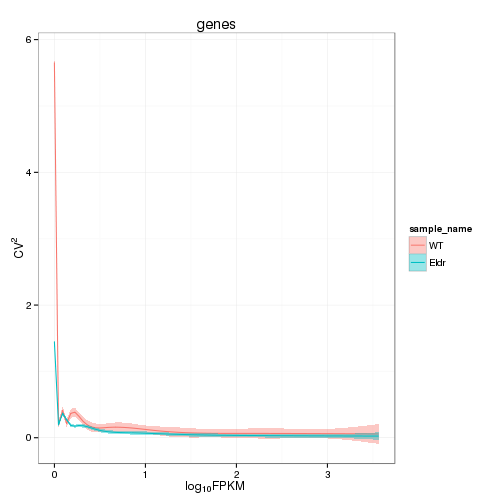 


Isoforms: 
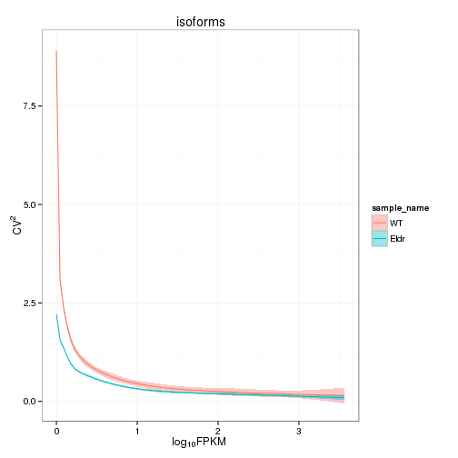 

## Volcano

```
## Error: One or more values of 'x' or 'y' are not valid sample names!
```

### Volcano matrix (replicates)

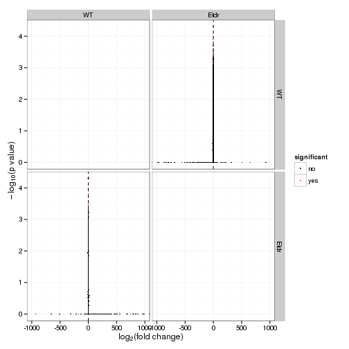 

## MvA plot

```
## Error: non-numeric argument to binary operator
```
   
### MvA plot counts

```
## Error: non-numeric argument to binary operator
```

## Scatterplot
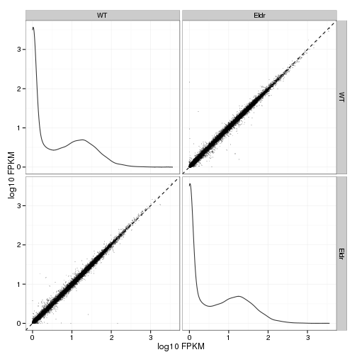 

### Scatter matrix (replicates) -- SKIP FOR NOW CAUSING PROBLEMS 


## Distributions

### Boxplots

Boxplot (genes)

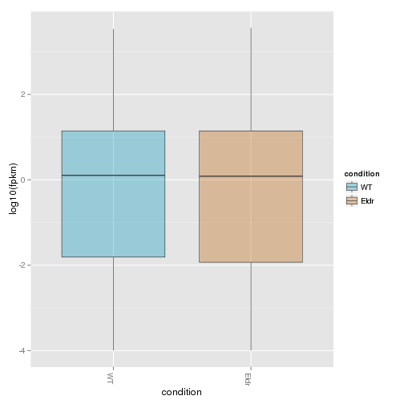 

Boxplot (genes, replicates)

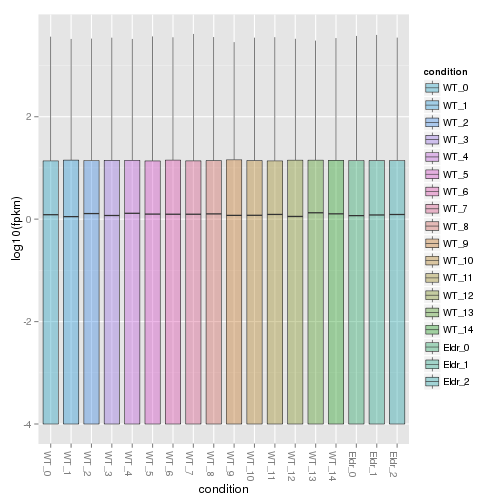 

Boxplot (isoforms)

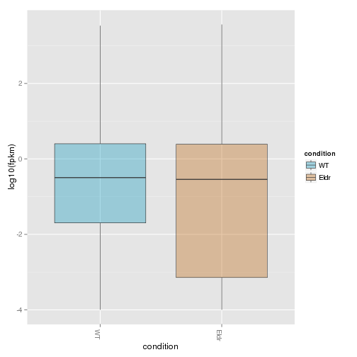 

Boxplot (isoforms, replicates)

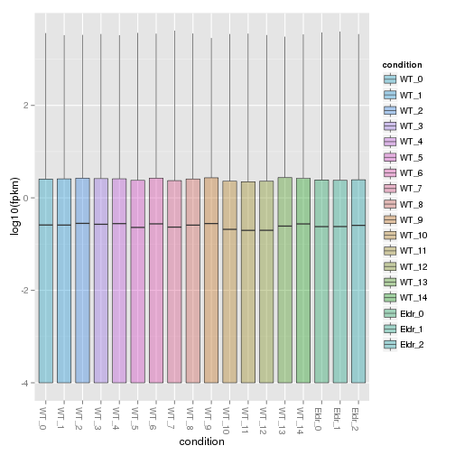 

### Density

Density (genes)

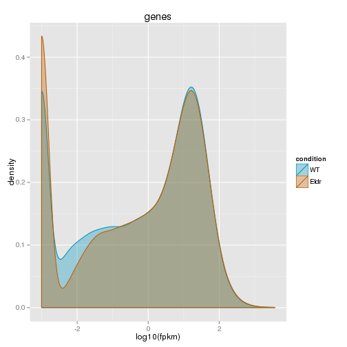 

Density (genes, replicates)

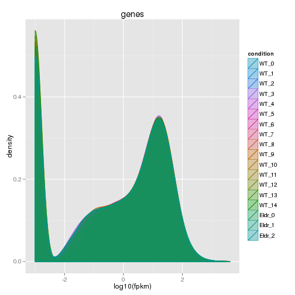 


## Clustering

### Replicate Clusters
 

```
## 'dendrogram' with 2 branches and 18 members total, at height 0.08401
```

### PCA (genes)
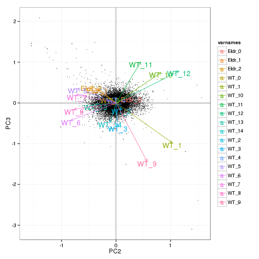 

### MDS (genes)
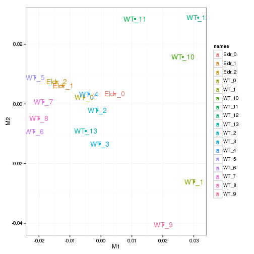 


# KO assessment

## Endogenous lncRNA expression

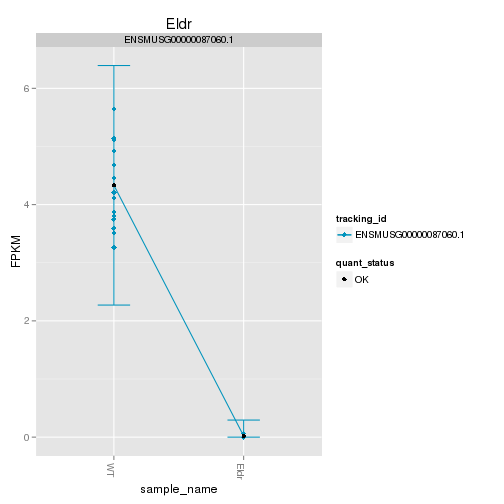 

Endogenous expression of Eldr isoforms:

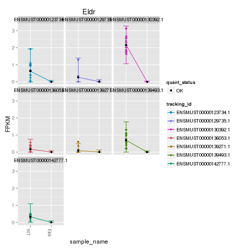 

Barplot of gene expression:

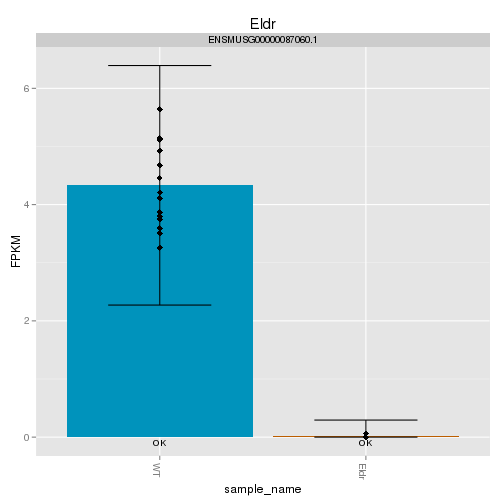 

Barplot of isoform expression:

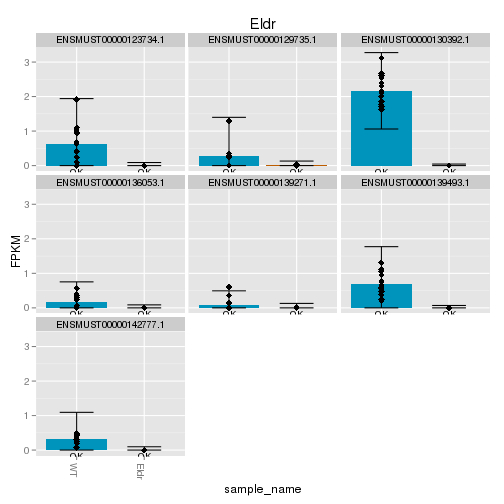 


## LacZ expression

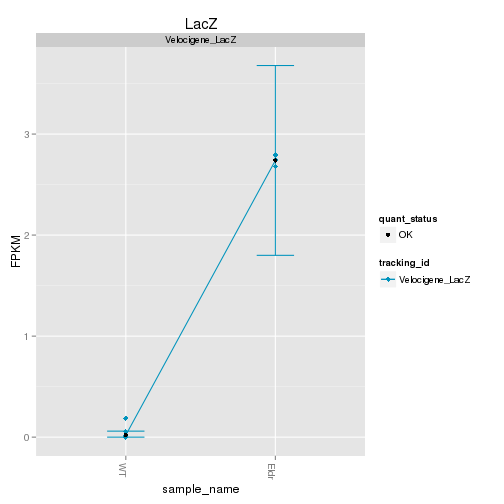 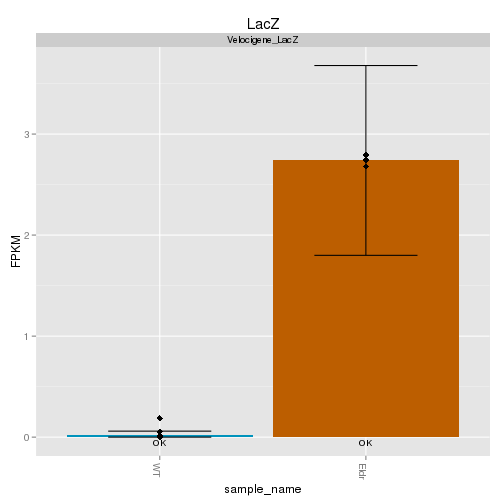 


## Digital Genotyping (LacZ vs Endogenous lncRNA and Sex)
Expression plot (endogenous linc, lacZ, Y-expressed gene):

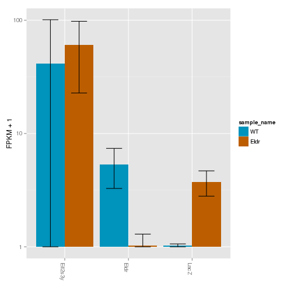 

Expression heatmap:
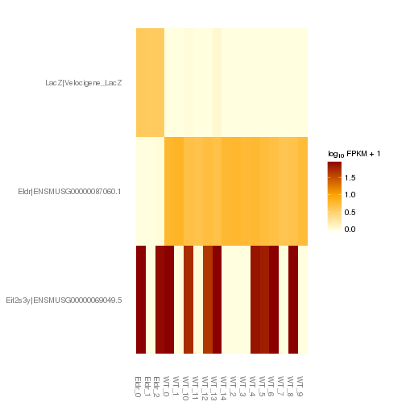 

# Differential Analysis

## Differential Genes 


There are 144 significantly differentially expressed genes. They are:

<!-- html table generated in R 3.0.2 by xtable 1.7-3 package -->
<!-- Tue Jun 17 01:12:40 2014 -->
<TABLE border=1>
<TR> <TH>  </TH> <TH> geneAnnot$gene_short_name </TH>  </TR>
  <TR> <TD align="right"> 1 </TD> <TD> Cdh1 </TD> </TR>
  <TR> <TD align="right"> 2 </TD> <TD> Col1a1 </TD> </TR>
  <TR> <TD align="right"> 3 </TD> <TD> Lamb1 </TD> </TR>
  <TR> <TD align="right"> 4 </TD> <TD> Cacna1e </TD> </TR>
  <TR> <TD align="right"> 5 </TD> <TD> Polr2a </TD> </TR>
  <TR> <TD align="right"> 6 </TD> <TD> Nid1 </TD> </TR>
  <TR> <TD align="right"> 7 </TD> <TD> Vax1 </TD> </TR>
  <TR> <TD align="right"> 8 </TD> <TD> Rplp1 </TD> </TR>
  <TR> <TD align="right"> 9 </TD> <TD> Ttc9b </TD> </TR>
  <TR> <TD align="right"> 10 </TD> <TD> Odc1 </TD> </TR>
  <TR> <TD align="right"> 11 </TD> <TD> Cad </TD> </TR>
  <TR> <TD align="right"> 12 </TD> <TD> Ptgds </TD> </TR>
  <TR> <TD align="right"> 13 </TD> <TD> Abca1 </TD> </TR>
  <TR> <TD align="right"> 14 </TD> <TD> Dync1h1 </TD> </TR>
  <TR> <TD align="right"> 15 </TD> <TD> Utrn </TD> </TR>
  <TR> <TD align="right"> 16 </TD> <TD> D10Bwg1379e </TD> </TR>
  <TR> <TD align="right"> 17 </TD> <TD> Lama2 </TD> </TR>
  <TR> <TD align="right"> 18 </TD> <TD> Gm872 </TD> </TR>
  <TR> <TD align="right"> 19 </TD> <TD> Snrpf </TD> </TR>
  <TR> <TD align="right"> 20 </TD> <TD> Aebp1 </TD> </TR>
  <TR> <TD align="right"> 21 </TD> <TD> Prpf8 </TD> </TR>
  <TR> <TD align="right"> 22 </TD> <TD> Hoxb9 </TD> </TR>
  <TR> <TD align="right"> 23 </TD> <TD> Pdhb </TD> </TR>
  <TR> <TD align="right"> 24 </TD> <TD> BC067074 </TD> </TR>
  <TR> <TD align="right"> 25 </TD> <TD> Nid2 </TD> </TR>
  <TR> <TD align="right"> 26 </TD> <TD> Myh9 </TD> </TR>
  <TR> <TD align="right"> 27 </TD> <TD> Col2a1 </TD> </TR>
  <TR> <TD align="right"> 28 </TD> <TD> Plec </TD> </TR>
  <TR> <TD align="right"> 29 </TD> <TD> Dlx2 </TD> </TR>
  <TR> <TD align="right"> 30 </TD> <TD> Igf2r </TD> </TR>
  <TR> <TD align="right"> 31 </TD> <TD> Fbn2 </TD> </TR>
  <TR> <TD align="right"> 32 </TD> <TD> Rps14 </TD> </TR>
  <TR> <TD align="right"> 33 </TD> <TD> Slit1 </TD> </TR>
  <TR> <TD align="right"> 34 </TD> <TD> Lbx1 </TD> </TR>
  <TR> <TD align="right"> 35 </TD> <TD> Dock9 </TD> </TR>
  <TR> <TD align="right"> 36 </TD> <TD> Pgm2 </TD> </TR>
  <TR> <TD align="right"> 37 </TD> <TD> Col5a2 </TD> </TR>
  <TR> <TD align="right"> 38 </TD> <TD> Col3a1 </TD> </TR>
  <TR> <TD align="right"> 39 </TD> <TD> Fn1 </TD> </TR>
  <TR> <TD align="right"> 40 </TD> <TD> Lamc1 </TD> </TR>
  <TR> <TD align="right"> 41 </TD> <TD> Ddr2 </TD> </TR>
  <TR> <TD align="right"> 42 </TD> <TD> Lamc3 </TD> </TR>
  <TR> <TD align="right"> 43 </TD> <TD> Lrp2 </TD> </TR>
  <TR> <TD align="right"> 44 </TD> <TD> Fbn1 </TD> </TR>
  <TR> <TD align="right"> 45 </TD> <TD> Notch2 </TD> </TR>
  <TR> <TD align="right"> 46 </TD> <TD> Col11a1 </TD> </TR>
  <TR> <TD align="right"> 47 </TD> <TD> Tnc </TD> </TR>
  <TR> <TD align="right"> 48 </TD> <TD> Svep1 </TD> </TR>
  <TR> <TD align="right"> 49 </TD> <TD> Snapc3 </TD> </TR>
  <TR> <TD align="right"> 50 </TD> <TD> Scp2 </TD> </TR>
  <TR> <TD align="right"> 51 </TD> <TD> Kcnq4 </TD> </TR>
  <TR> <TD align="right"> 52 </TD> <TD> Ndufs5 </TD> </TR>
  <TR> <TD align="right"> 53 </TD> <TD> Wdr65 </TD> </TR>
  <TR> <TD align="right"> 54 </TD> <TD> Pdgfra </TD> </TR>
  <TR> <TD align="right"> 55 </TD> <TD> Uncx </TD> </TR>
  <TR> <TD align="right"> 56 </TD> <TD> Col1a2 </TD> </TR>
  <TR> <TD align="right"> 57 </TD> <TD> Slc13a4 </TD> </TR>
  <TR> <TD align="right"> 58 </TD> <TD> Itpr1 </TD> </TR>
  <TR> <TD align="right"> 59 </TD> <TD> Dera </TD> </TR>
  <TR> <TD align="right"> 60 </TD> <TD> Herc2 </TD> </TR>
  <TR> <TD align="right"> 61 </TD> <TD> Iqgap1 </TD> </TR>
  <TR> <TD align="right"> 62 </TD> <TD> Eif3f </TD> </TR>
  <TR> <TD align="right"> 63 </TD> <TD> Col4a5 </TD> </TR>
  <TR> <TD align="right"> 64 </TD> <TD> Gtf3c1 </TD> </TR>
  <TR> <TD align="right"> 65 </TD> <TD> Lama1 </TD> </TR>
  <TR> <TD align="right"> 66 </TD> <TD> 3830406C13Rik </TD> </TR>
  <TR> <TD align="right"> 67 </TD> <TD> Adamts15 </TD> </TR>
  <TR> <TD align="right"> 68 </TD> <TD> Gbx2 </TD> </TR>
  <TR> <TD align="right"> 69 </TD> <TD> Prr7 </TD> </TR>
  <TR> <TD align="right"> 70 </TD> <TD> Fras1 </TD> </TR>
  <TR> <TD align="right"> 71 </TD> <TD> Vps13c </TD> </TR>
  <TR> <TD align="right"> 72 </TD> <TD> Fignl1 </TD> </TR>
  <TR> <TD align="right"> 73 </TD> <TD> Cox8a </TD> </TR>
  <TR> <TD align="right"> 74 </TD> <TD> Frem2 </TD> </TR>
  <TR> <TD align="right"> 75 </TD> <TD> Rps16 </TD> </TR>
  <TR> <TD align="right"> 76 </TD> <TD> Vstm2l </TD> </TR>
  <TR> <TD align="right"> 77 </TD> <TD> Notch3 </TD> </TR>
  <TR> <TD align="right"> 78 </TD> <TD> Ift172 </TD> </TR>
  <TR> <TD align="right"> 79 </TD> <TD> Hoxb4 </TD> </TR>
  <TR> <TD align="right"> 80 </TD> <TD> Srrm2 </TD> </TR>
  <TR> <TD align="right"> 81 </TD> <TD> Pcsk1n </TD> </TR>
  <TR> <TD align="right"> 82 </TD> <TD> Klhl42 </TD> </TR>
  <TR> <TD align="right"> 83 </TD> <TD> Tlx3 </TD> </TR>
  <TR> <TD align="right"> 84 </TD> <TD> C1qtnf4 </TD> </TR>
  <TR> <TD align="right"> 85 </TD> <TD> Dnah7b </TD> </TR>
  <TR> <TD align="right"> 86 </TD> <TD> 2310036O22Rik </TD> </TR>
  <TR> <TD align="right"> 87 </TD> <TD> Nkx6-2 </TD> </TR>
  <TR> <TD align="right"> 88 </TD> <TD> Fmod </TD> </TR>
  <TR> <TD align="right"> 89 </TD> <TD> Cox6a1 </TD> </TR>
  <TR> <TD align="right"> 90 </TD> <TD> Hebp1 </TD> </TR>
  <TR> <TD align="right"> 91 </TD> <TD> Lor </TD> </TR>
  <TR> <TD align="right"> 92 </TD> <TD> Pgp </TD> </TR>
  <TR> <TD align="right"> 93 </TD> <TD> Gm9493 </TD> </TR>
  <TR> <TD align="right"> 94 </TD> <TD> Rps2 </TD> </TR>
  <TR> <TD align="right"> 95 </TD> <TD> Acp1 </TD> </TR>
  <TR> <TD align="right"> 96 </TD> <TD> Wdr89 </TD> </TR>
  <TR> <TD align="right"> 97 </TD> <TD> Gm7729 </TD> </TR>
  <TR> <TD align="right"> 98 </TD> <TD> Fat4 </TD> </TR>
  <TR> <TD align="right"> 99 </TD> <TD> Dync2h1 </TD> </TR>
  <TR> <TD align="right"> 100 </TD> <TD> Kmt2d </TD> </TR>
  <TR> <TD align="right"> 101 </TD> <TD> Rpl29 </TD> </TR>
  <TR> <TD align="right"> 102 </TD> <TD> H2afx </TD> </TR>
  <TR> <TD align="right"> 103 </TD> <TD> Pla2g4e </TD> </TR>
  <TR> <TD align="right"> 104 </TD> <TD> Dnah6 </TD> </TR>
  <TR> <TD align="right"> 105 </TD> <TD> Lamb2 </TD> </TR>
  <TR> <TD align="right"> 106 </TD> <TD> Tusc1 </TD> </TR>
  <TR> <TD align="right"> 107 </TD> <TD> Zfp771 </TD> </TR>
  <TR> <TD align="right"> 108 </TD> <TD> Mrfap1 </TD> </TR>
  <TR> <TD align="right"> 109 </TD> <TD> Gm10020 </TD> </TR>
  <TR> <TD align="right"> 110 </TD> <TD> Rpl36 </TD> </TR>
  <TR> <TD align="right"> 111 </TD> <TD> Capn11 </TD> </TR>
  <TR> <TD align="right"> 112 </TD> <TD> Fdps </TD> </TR>
  <TR> <TD align="right"> 113 </TD> <TD> H2afj </TD> </TR>
  <TR> <TD align="right"> 114 </TD> <TD> Tpt1 </TD> </TR>
  <TR> <TD align="right"> 115 </TD> <TD> Rpl17 </TD> </TR>
  <TR> <TD align="right"> 116 </TD> <TD> Otof </TD> </TR>
  <TR> <TD align="right"> 117 </TD> <TD> Rpl35 </TD> </TR>
  <TR> <TD align="right"> 118 </TD> <TD> Sox11 </TD> </TR>
  <TR> <TD align="right"> 119 </TD> <TD> Zfp428 </TD> </TR>
  <TR> <TD align="right"> 120 </TD> <TD> Flnc </TD> </TR>
  <TR> <TD align="right"> 121 </TD> <TD> Ptprz1 </TD> </TR>
  <TR> <TD align="right"> 122 </TD> <TD> Nkain2 </TD> </TR>
  <TR> <TD align="right"> 123 </TD> <TD> Ahnak </TD> </TR>
  <TR> <TD align="right"> 124 </TD> <TD> Fat1 </TD> </TR>
  <TR> <TD align="right"> 125 </TD> <TD> Gm1673 </TD> </TR>
  <TR> <TD align="right"> 126 </TD> <TD> Klhl9 </TD> </TR>
  <TR> <TD align="right"> 127 </TD> <TD> Jund </TD> </TR>
  <TR> <TD align="right"> 128 </TD> <TD> Rpl23 </TD> </TR>
  <TR> <TD align="right"> 129 </TD> <TD> Gpr27 </TD> </TR>
  <TR> <TD align="right"> 130 </TD> <TD> Srp54a </TD> </TR>
  <TR> <TD align="right"> 131 </TD> <TD> Wdfy1 </TD> </TR>
  <TR> <TD align="right"> 132 </TD> <TD> Hbb-bt </TD> </TR>
  <TR> <TD align="right"> 133 </TD> <TD> Fat3 </TD> </TR>
  <TR> <TD align="right"> 134 </TD> <TD> Nrbp2 </TD> </TR>
  <TR> <TD align="right"> 135 </TD> <TD> Gm11273 </TD> </TR>
  <TR> <TD align="right"> 136 </TD> <TD> Ccdc85c </TD> </TR>
  <TR> <TD align="right"> 137 </TD> <TD> Ier5l </TD> </TR>
  <TR> <TD align="right"> 138 </TD> <TD> Gm3739 </TD> </TR>
  <TR> <TD align="right"> 139 </TD> <TD> Malat1 </TD> </TR>
  <TR> <TD align="right"> 140 </TD> <TD> Gm10406 </TD> </TR>
  <TR> <TD align="right"> 141 </TD> <TD> Ccdc85b </TD> </TR>
  <TR> <TD align="right"> 142 </TD> <TD> Gm8281 </TD> </TR>
  <TR> <TD align="right"> 143 </TD> <TD> Gm9825 </TD> </TR>
  <TR> <TD align="right"> 144 </TD> <TD> Gm3591 </TD> </TR>
   </TABLE>

### Matrix of gene significant differences between conditions

(skip for Brainmap wt-v-ko comparisons)

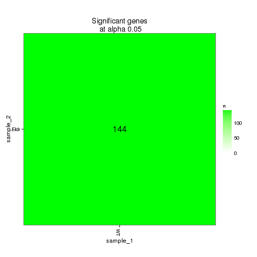 

### Significant gene expression differences between conditions

Expression plot (genes):
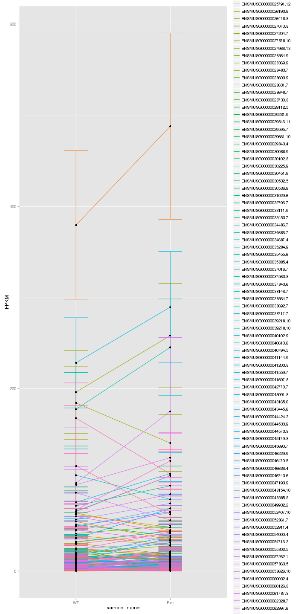 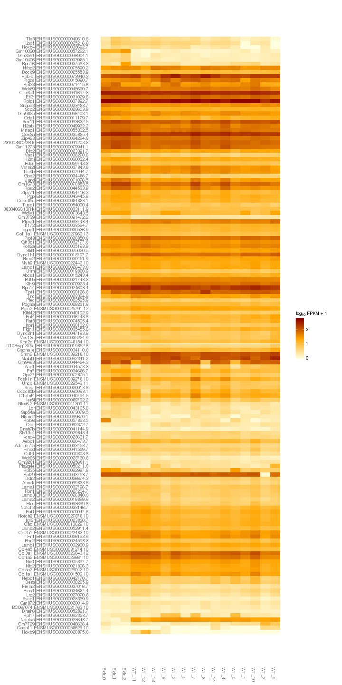 

Significant genes with expression >50fpkm (any condition):
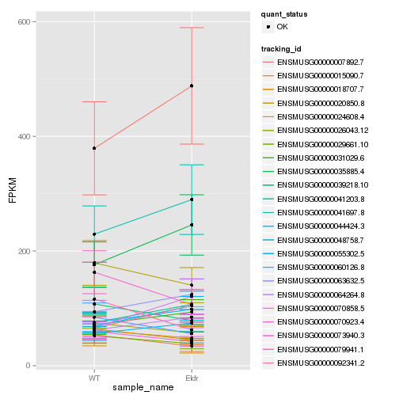 

An individual look at each of the highly expressed significantly differentially regulated genes:
(eval=false for first pass)


### Expression-level/significance relationship

Scatter plot of significant genes only:

```
## Error: One or more values of 'x' or 'y' are not valid sample names!
```

Volcano plot with significant genes only:

```
## Error: One or more values of 'x' or 'y' are not valid sample names!
```


## Differential Splicing

### Differential Isoforms between conditions
Per isoform difference between conditions:
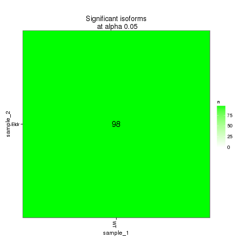 

These isoforms are:
<!-- html table generated in R 3.0.2 by xtable 1.7-3 package -->
<!-- Tue Jun 17 01:12:59 2014 -->
<TABLE border=1>
<TR> <TH>  </TH> <TH> isoAnnot$gene_short_name </TH>  </TR>
  <TR> <TD align="right"> 1 </TD> <TD> Cdh1 </TD> </TR>
  <TR> <TD align="right"> 2 </TD> <TD> Col1a1 </TD> </TR>
  <TR> <TD align="right"> 3 </TD> <TD> Lamb1 </TD> </TR>
  <TR> <TD align="right"> 4 </TD> <TD> Cacna1e </TD> </TR>
  <TR> <TD align="right"> 5 </TD> <TD> Nid1 </TD> </TR>
  <TR> <TD align="right"> 6 </TD> <TD> Cad </TD> </TR>
  <TR> <TD align="right"> 7 </TD> <TD> Abca1 </TD> </TR>
  <TR> <TD align="right"> 8 </TD> <TD> Lama5 </TD> </TR>
  <TR> <TD align="right"> 9 </TD> <TD> Dync1h1 </TD> </TR>
  <TR> <TD align="right"> 10 </TD> <TD> Lama2 </TD> </TR>
  <TR> <TD align="right"> 11 </TD> <TD> Gm872 </TD> </TR>
  <TR> <TD align="right"> 12 </TD> <TD> Egfr </TD> </TR>
  <TR> <TD align="right"> 13 </TD> <TD> Aebp1 </TD> </TR>
  <TR> <TD align="right"> 14 </TD> <TD> Mrc2 </TD> </TR>
  <TR> <TD align="right"> 15 </TD> <TD> Nid2 </TD> </TR>
  <TR> <TD align="right"> 16 </TD> <TD> Myh9 </TD> </TR>
  <TR> <TD align="right"> 17 </TD> <TD> Dlx2 </TD> </TR>
  <TR> <TD align="right"> 18 </TD> <TD> Igf2r </TD> </TR>
  <TR> <TD align="right"> 19 </TD> <TD> Fbn2 </TD> </TR>
  <TR> <TD align="right"> 20 </TD> <TD> Fasn </TD> </TR>
  <TR> <TD align="right"> 21 </TD> <TD> Pgm2 </TD> </TR>
  <TR> <TD align="right"> 22 </TD> <TD> Fn1 </TD> </TR>
  <TR> <TD align="right"> 23 </TD> <TD> Lamc1 </TD> </TR>
  <TR> <TD align="right"> 24 </TD> <TD> Col5a1 </TD> </TR>
  <TR> <TD align="right"> 25 </TD> <TD> Lamc3 </TD> </TR>
  <TR> <TD align="right"> 26 </TD> <TD> Notch1 </TD> </TR>
  <TR> <TD align="right"> 27 </TD> <TD> Lrp2 </TD> </TR>
  <TR> <TD align="right"> 28 </TD> <TD> Fbn1 </TD> </TR>
  <TR> <TD align="right"> 29 </TD> <TD> Notch2 </TD> </TR>
  <TR> <TD align="right"> 30 </TD> <TD> Tnc </TD> </TR>
  <TR> <TD align="right"> 31 </TD> <TD> Svep1 </TD> </TR>
  <TR> <TD align="right"> 32 </TD> <TD> Snapc3 </TD> </TR>
  <TR> <TD align="right"> 33 </TD> <TD> Scp2 </TD> </TR>
  <TR> <TD align="right"> 34 </TD> <TD> Kcnq4 </TD> </TR>
  <TR> <TD align="right"> 35 </TD> <TD> Trp73 </TD> </TR>
  <TR> <TD align="right"> 36 </TD> <TD> Uncx </TD> </TR>
  <TR> <TD align="right"> 37 </TD> <TD> Col1a2 </TD> </TR>
  <TR> <TD align="right"> 38 </TD> <TD> Slc13a4 </TD> </TR>
  <TR> <TD align="right"> 39 </TD> <TD> Itpr1 </TD> </TR>
  <TR> <TD align="right"> 40 </TD> <TD> Grin2b </TD> </TR>
  <TR> <TD align="right"> 41 </TD> <TD> Eif3f </TD> </TR>
  <TR> <TD align="right"> 42 </TD> <TD> Col12a1 </TD> </TR>
  <TR> <TD align="right"> 43 </TD> <TD> Lama1 </TD> </TR>
  <TR> <TD align="right"> 44 </TD> <TD> Szt2 </TD> </TR>
  <TR> <TD align="right"> 45 </TD> <TD> Golgb1 </TD> </TR>
  <TR> <TD align="right"> 46 </TD> <TD> Gbx2 </TD> </TR>
  <TR> <TD align="right"> 47 </TD> <TD> Prr7 </TD> </TR>
  <TR> <TD align="right"> 48 </TD> <TD> Fras1 </TD> </TR>
  <TR> <TD align="right"> 49 </TD> <TD> Vps13c </TD> </TR>
  <TR> <TD align="right"> 50 </TD> <TD> Leng8 </TD> </TR>
  <TR> <TD align="right"> 51 </TD> <TD> Cox8a </TD> </TR>
  <TR> <TD align="right"> 52 </TD> <TD> Frem2 </TD> </TR>
  <TR> <TD align="right"> 53 </TD> <TD> Vstm2l </TD> </TR>
  <TR> <TD align="right"> 54 </TD> <TD> Notch3 </TD> </TR>
  <TR> <TD align="right"> 55 </TD> <TD> Pcsk1n </TD> </TR>
  <TR> <TD align="right"> 56 </TD> <TD> Klhl42 </TD> </TR>
  <TR> <TD align="right"> 57 </TD> <TD> Lrp1 </TD> </TR>
  <TR> <TD align="right"> 58 </TD> <TD> Tlx3 </TD> </TR>
  <TR> <TD align="right"> 59 </TD> <TD> C1qtnf4 </TD> </TR>
  <TR> <TD align="right"> 60 </TD> <TD> Dnah7b </TD> </TR>
  <TR> <TD align="right"> 61 </TD> <TD> 2310036O22Rik </TD> </TR>
  <TR> <TD align="right"> 62 </TD> <TD> Reln </TD> </TR>
  <TR> <TD align="right"> 63 </TD> <TD> Hebp1 </TD> </TR>
  <TR> <TD align="right"> 64 </TD> <TD> Gm9493 </TD> </TR>
  <TR> <TD align="right"> 65 </TD> <TD> Wdr89 </TD> </TR>
  <TR> <TD align="right"> 66 </TD> <TD> Gm7729 </TD> </TR>
  <TR> <TD align="right"> 67 </TD> <TD> Fat4 </TD> </TR>
  <TR> <TD align="right"> 68 </TD> <TD> Sned1 </TD> </TR>
  <TR> <TD align="right"> 69 </TD> <TD> Col6a3 </TD> </TR>
  <TR> <TD align="right"> 70 </TD> <TD> H2afx </TD> </TR>
  <TR> <TD align="right"> 71 </TD> <TD> Ccdc171 </TD> </TR>
  <TR> <TD align="right"> 72 </TD> <TD> Lamb2 </TD> </TR>
  <TR> <TD align="right"> 73 </TD> <TD> Tusc1 </TD> </TR>
  <TR> <TD align="right"> 74 </TD> <TD> Zfp771 </TD> </TR>
  <TR> <TD align="right"> 75 </TD> <TD> Mrfap1 </TD> </TR>
  <TR> <TD align="right"> 76 </TD> <TD> Gm10020 </TD> </TR>
  <TR> <TD align="right"> 77 </TD> <TD> Rpl36 </TD> </TR>
  <TR> <TD align="right"> 78 </TD> <TD> H2afj </TD> </TR>
  <TR> <TD align="right"> 79 </TD> <TD> Tpt1 </TD> </TR>
  <TR> <TD align="right"> 80 </TD> <TD> Rpl17 </TD> </TR>
  <TR> <TD align="right"> 81 </TD> <TD> Ptprz1 </TD> </TR>
  <TR> <TD align="right"> 82 </TD> <TD> Gpr98 </TD> </TR>
  <TR> <TD align="right"> 83 </TD> <TD> Ahnak </TD> </TR>
  <TR> <TD align="right"> 84 </TD> <TD> Fat1 </TD> </TR>
  <TR> <TD align="right"> 85 </TD> <TD> Klhl9 </TD> </TR>
  <TR> <TD align="right"> 86 </TD> <TD> Jund </TD> </TR>
  <TR> <TD align="right"> 87 </TD> <TD> Gpr27 </TD> </TR>
  <TR> <TD align="right"> 88 </TD> <TD> Srp54a </TD> </TR>
  <TR> <TD align="right"> 89 </TD> <TD> Hbb-bt </TD> </TR>
  <TR> <TD align="right"> 90 </TD> <TD> Fat3 </TD> </TR>
  <TR> <TD align="right"> 91 </TD> <TD> Gm11273 </TD> </TR>
  <TR> <TD align="right"> 92 </TD> <TD> Ccdc85c </TD> </TR>
  <TR> <TD align="right"> 93 </TD> <TD> Ier5l </TD> </TR>
  <TR> <TD align="right"> 94 </TD> <TD> Gm3739 </TD> </TR>
  <TR> <TD align="right"> 95 </TD> <TD> Malat1 </TD> </TR>
  <TR> <TD align="right"> 96 </TD> <TD> Ccdc85b </TD> </TR>
  <TR> <TD align="right"> 97 </TD> <TD> Gm9825 </TD> </TR>
  <TR> <TD align="right"> 98 </TD> <TD> Gm3591 </TD> </TR>
   </TABLE>


```
## Error: NaN dissimilarity value.
```

### Differential Splicing between conditions

(eval false for first pass)

Per condition differences in isoforms (Does gene have diff piechart between conditions?)


These genes are:


Splicing heatmap by isoform:


Splicing heatmap by gene


The following are significantly differentially spliced genes (relative portion of isoform per condition): 


 


# Gene/Pathway Analysis

## GSEA


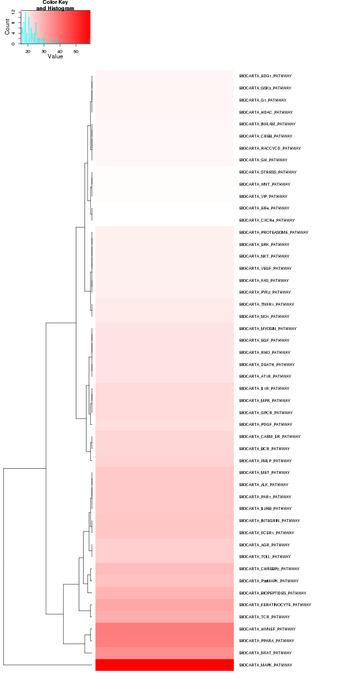 

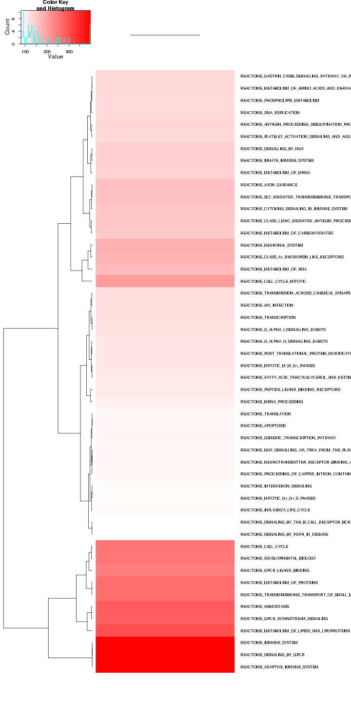 

## GO enrichment 
Cluster profiler used to call enichments of significantly differentially regulated genes that map to Entrez IDs. 


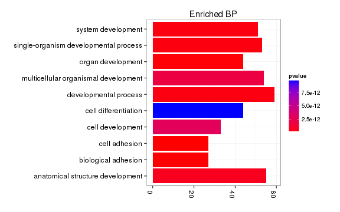 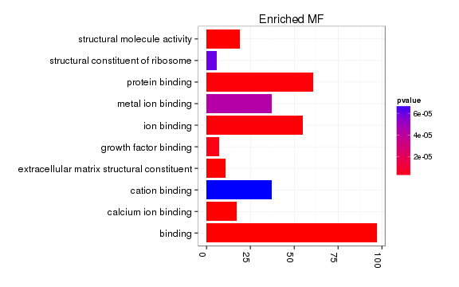 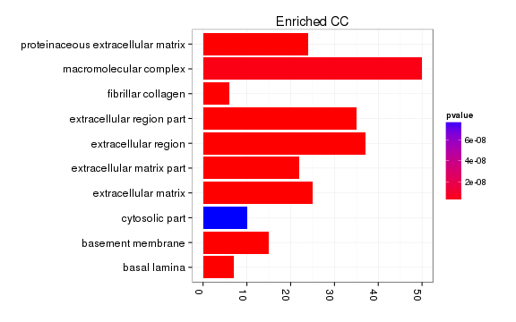 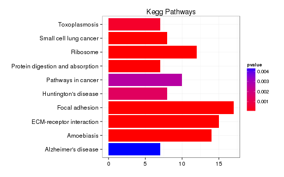  

# Cis vs Trans (locally)


# Notes

## Samples used are:
<!-- html table generated in R 3.0.2 by xtable 1.7-3 package -->
<!-- Tue Jun 17 01:15:36 2014 -->
<TABLE border=1>
<TR> <TH>  </TH> <TH> 10 </TH>  </TR>
  <TR> <TD align="right"> 1 </TD> <TD> JR753 </TD> </TR>
  <TR> <TD align="right"> 2 </TD> <TD> JR750 </TD> </TR>
  <TR> <TD align="right"> 3 </TD> <TD> JR771 </TD> </TR>
  <TR> <TD align="right"> 4 </TD> <TD> JR755 </TD> </TR>
  <TR> <TD align="right"> 5 </TD> <TD> JR811 </TD> </TR>
  <TR> <TD align="right"> 6 </TD> <TD> JR768 </TD> </TR>
  <TR> <TD align="right"> 7 </TD> <TD> JR761 </TD> </TR>
  <TR> <TD align="right"> 8 </TD> <TD> JR815 </TD> </TR>
  <TR> <TD align="right"> 9 </TD> <TD> JR789 </TD> </TR>
  <TR> <TD align="right"> 10 </TD> <TD> JR748 </TD> </TR>
  <TR> <TD align="right"> 11 </TD> <TD> JR716 </TD> </TR>
  <TR> <TD align="right"> 12 </TD> <TD> JR717 </TD> </TR>
  <TR> <TD align="right"> 13 </TD> <TD> JR719 </TD> </TR>
  <TR> <TD align="right"> 14 </TD> <TD> JR791 </TD> </TR>
  <TR> <TD align="right"> 15 </TD> <TD> JR756 </TD> </TR>
  <TR> <TD align="right"> 16 </TD> <TD> JR787 </TD> </TR>
  <TR> <TD align="right"> 17 </TD> <TD> JR810 </TD> </TR>
  <TR> <TD align="right"> 18 </TD> <TD> JR838 </TD> </TR>
   </TABLE>

## Replicates
<!-- html table generated in R 3.0.2 by xtable 1.7-3 package -->
<!-- Tue Jun 17 01:15:36 2014 -->
<TABLE border=1>
<TR> <TH>  </TH> <TH> file </TH> <TH> sample_name </TH> <TH> replicate </TH> <TH> rep_name </TH> <TH> total_mass </TH> <TH> norm_mass </TH> <TH> internal_scale </TH> <TH> external_scale </TH>  </TR>
  <TR> <TD align="right"> 1 </TD> <TD> /n/rinn_data1/seq/lgoff/Projects/BrainMap/data/quants/JR753/abundances.cxb </TD> <TD> WT </TD> <TD align="right">   0 </TD> <TD> WT_0 </TD> <TD align="right"> 39343800.00 </TD> <TD align="right"> 30904000.00 </TD> <TD align="right"> 1.32 </TD> <TD align="right"> 1.00 </TD> </TR>
  <TR> <TD align="right"> 2 </TD> <TD> /n/rinn_data1/seq/lgoff/Projects/BrainMap/data/quants/JR750/abundances.cxb </TD> <TD> WT </TD> <TD align="right">   1 </TD> <TD> WT_1 </TD> <TD align="right"> 36041100.00 </TD> <TD align="right"> 30904000.00 </TD> <TD align="right"> 1.15 </TD> <TD align="right"> 1.00 </TD> </TR>
  <TR> <TD align="right"> 3 </TD> <TD> /n/rinn_data1/seq/lgoff/Projects/BrainMap/data/quants/JR771/abundances.cxb </TD> <TD> WT </TD> <TD align="right">   2 </TD> <TD> WT_2 </TD> <TD align="right"> 38877000.00 </TD> <TD align="right"> 30904000.00 </TD> <TD align="right"> 1.28 </TD> <TD align="right"> 1.00 </TD> </TR>
  <TR> <TD align="right"> 4 </TD> <TD> /n/rinn_data1/seq/lgoff/Projects/BrainMap/data/quants/JR755/abundances.cxb </TD> <TD> WT </TD> <TD align="right">   3 </TD> <TD> WT_3 </TD> <TD align="right"> 41822800.00 </TD> <TD align="right"> 30904000.00 </TD> <TD align="right"> 1.34 </TD> <TD align="right"> 1.00 </TD> </TR>
  <TR> <TD align="right"> 5 </TD> <TD> /n/rinn_data1/seq/lgoff/Projects/BrainMap/data/quants/JR811/abundances.cxb </TD> <TD> WT </TD> <TD align="right">   4 </TD> <TD> WT_4 </TD> <TD align="right"> 38186700.00 </TD> <TD align="right"> 30904000.00 </TD> <TD align="right"> 1.25 </TD> <TD align="right"> 1.00 </TD> </TR>
  <TR> <TD align="right"> 6 </TD> <TD> /n/rinn_data1/seq/lgoff/Projects/BrainMap/data/quants/JR768/abundances.cxb </TD> <TD> WT </TD> <TD align="right">   5 </TD> <TD> WT_5 </TD> <TD align="right"> 28382500.00 </TD> <TD align="right"> 30904000.00 </TD> <TD align="right"> 0.93 </TD> <TD align="right"> 1.00 </TD> </TR>
  <TR> <TD align="right"> 7 </TD> <TD> /n/rinn_data1/seq/lgoff/Projects/BrainMap/data/quants/JR761/abundances.cxb </TD> <TD> WT </TD> <TD align="right">   6 </TD> <TD> WT_6 </TD> <TD align="right"> 31711800.00 </TD> <TD align="right"> 30904000.00 </TD> <TD align="right"> 1.01 </TD> <TD align="right"> 1.00 </TD> </TR>
  <TR> <TD align="right"> 8 </TD> <TD> /n/rinn_data1/seq/lgoff/Projects/BrainMap/data/quants/JR815/abundances.cxb </TD> <TD> WT </TD> <TD align="right">   7 </TD> <TD> WT_7 </TD> <TD align="right"> 29744300.00 </TD> <TD align="right"> 30904000.00 </TD> <TD align="right"> 0.96 </TD> <TD align="right"> 1.00 </TD> </TR>
  <TR> <TD align="right"> 9 </TD> <TD> /n/rinn_data1/seq/lgoff/Projects/BrainMap/data/quants/JR789/abundances.cxb </TD> <TD> WT </TD> <TD align="right">   8 </TD> <TD> WT_8 </TD> <TD align="right"> 27686600.00 </TD> <TD align="right"> 30904000.00 </TD> <TD align="right"> 0.90 </TD> <TD align="right"> 1.00 </TD> </TR>
  <TR> <TD align="right"> 10 </TD> <TD> /n/rinn_data1/seq/lgoff/Projects/BrainMap/data/quants/JR748/abundances.cxb </TD> <TD> WT </TD> <TD align="right">   9 </TD> <TD> WT_9 </TD> <TD align="right"> 32374600.00 </TD> <TD align="right"> 30904000.00 </TD> <TD align="right"> 1.00 </TD> <TD align="right"> 1.00 </TD> </TR>
  <TR> <TD align="right"> 11 </TD> <TD> /n/rinn_data1/seq/lgoff/Projects/BrainMap/data/quants/JR716/abundances.cxb </TD> <TD> WT </TD> <TD align="right">  10 </TD> <TD> WT_10 </TD> <TD align="right"> 26148700.00 </TD> <TD align="right"> 30904000.00 </TD> <TD align="right"> 0.84 </TD> <TD align="right"> 1.00 </TD> </TR>
  <TR> <TD align="right"> 12 </TD> <TD> /n/rinn_data1/seq/lgoff/Projects/BrainMap/data/quants/JR717/abundances.cxb </TD> <TD> WT </TD> <TD align="right">  11 </TD> <TD> WT_11 </TD> <TD align="right"> 25571500.00 </TD> <TD align="right"> 30904000.00 </TD> <TD align="right"> 0.83 </TD> <TD align="right"> 1.00 </TD> </TR>
  <TR> <TD align="right"> 13 </TD> <TD> /n/rinn_data1/seq/lgoff/Projects/BrainMap/data/quants/JR719/abundances.cxb </TD> <TD> WT </TD> <TD align="right">  12 </TD> <TD> WT_12 </TD> <TD align="right"> 22702200.00 </TD> <TD align="right"> 30904000.00 </TD> <TD align="right"> 0.71 </TD> <TD align="right"> 1.00 </TD> </TR>
  <TR> <TD align="right"> 14 </TD> <TD> /n/rinn_data1/seq/lgoff/Projects/BrainMap/data/quants/JR791/abundances.cxb </TD> <TD> WT </TD> <TD align="right">  13 </TD> <TD> WT_13 </TD> <TD align="right"> 12886300.00 </TD> <TD align="right"> 30904000.00 </TD> <TD align="right"> 0.42 </TD> <TD align="right"> 1.00 </TD> </TR>
  <TR> <TD align="right"> 15 </TD> <TD> /n/rinn_data1/seq/lgoff/Projects/BrainMap/data/quants/JR756/abundances.cxb </TD> <TD> WT </TD> <TD align="right">  14 </TD> <TD> WT_14 </TD> <TD align="right"> 38957200.00 </TD> <TD align="right"> 30904000.00 </TD> <TD align="right"> 1.26 </TD> <TD align="right"> 1.00 </TD> </TR>
  <TR> <TD align="right"> 16 </TD> <TD> /n/rinn_data1/seq/lgoff/Projects/BrainMap/data/quants/JR787/abundances.cxb </TD> <TD> Eldr </TD> <TD align="right">   0 </TD> <TD> Eldr_0 </TD> <TD align="right"> 26903500.00 </TD> <TD align="right"> 30904000.00 </TD> <TD align="right"> 0.88 </TD> <TD align="right"> 1.00 </TD> </TR>
  <TR> <TD align="right"> 17 </TD> <TD> /n/rinn_data1/seq/lgoff/Projects/BrainMap/data/quants/JR810/abundances.cxb </TD> <TD> Eldr </TD> <TD align="right">   1 </TD> <TD> Eldr_1 </TD> <TD align="right"> 41840900.00 </TD> <TD align="right"> 30904000.00 </TD> <TD align="right"> 1.36 </TD> <TD align="right"> 1.00 </TD> </TR>
  <TR> <TD align="right"> 18 </TD> <TD> /n/rinn_data1/seq/lgoff/Projects/BrainMap/data/quants/JR838/abundances.cxb </TD> <TD> Eldr </TD> <TD align="right">   2 </TD> <TD> Eldr_2 </TD> <TD align="right"> 37007300.00 </TD> <TD align="right"> 30904000.00 </TD> <TD align="right"> 1.21 </TD> <TD align="right"> 1.00 </TD> </TR>
   </TABLE>

## Session Info

```
## R version 3.0.2 (2013-09-25)
## Platform: x86_64-unknown-linux-gnu (64-bit)
## 
## locale:
##  [1] LC_CTYPE=en_US.UTF-8       LC_NUMERIC=C              
##  [3] LC_TIME=en_US.UTF-8        LC_COLLATE=en_US.UTF-8    
##  [5] LC_MONETARY=en_US.UTF-8    LC_MESSAGES=en_US.UTF-8   
##  [7] LC_PAPER=en_US.UTF-8       LC_NAME=C                 
##  [9] LC_ADDRESS=C               LC_TELEPHONE=C            
## [11] LC_MEASUREMENT=en_US.UTF-8 LC_IDENTIFICATION=C       
## 
## attached base packages:
## [1] grid      parallel  stats     graphics  grDevices utils     datasets 
## [8] methods   base     
## 
## other attached packages:
##  [1] GO.db_2.10.1           org.Mm.eg.db_2.10.1    clusterProfiler_1.13.1
##  [4] DOSE_2.0.0             ReactomePA_1.6.1       AnnotationDbi_1.24.0  
##  [7] Biobase_2.22.0         mgcv_1.7-29            nlme_3.1-117          
## [10] gridExtra_0.9.1        gtable_0.1.2           marray_1.40.0         
## [13] gplots_2.13.0          GSA_1.03               limma_3.18.13         
## [16] xtable_1.7-3           knitr_1.6              cummeRbund_2.7.2      
## [19] Gviz_1.6.0             rtracklayer_1.22.7     GenomicRanges_1.14.4  
## [22] XVector_0.2.0          IRanges_1.20.7         fastcluster_1.1.13    
## [25] reshape2_1.4           ggplot2_1.0.0          RSQLite_0.11.4        
## [28] DBI_0.2-7              BiocGenerics_0.8.0    
## 
## loaded via a namespace (and not attached):
##  [1] biomaRt_2.18.0         Biostrings_2.30.1      biovizBase_1.10.8     
##  [4] bitops_1.0-6           BSgenome_1.30.0        caTools_1.17          
##  [7] cluster_1.15.2         colorspace_1.2-4       dichromat_2.0-0       
## [10] digest_0.6.4           DO.db_2.7              evaluate_0.5.5        
## [13] formatR_0.10           Formula_1.1-1          gdata_2.13.3          
## [16] GenomicFeatures_1.14.5 GOSemSim_1.20.3        graph_1.40.1          
## [19] graphite_1.8.1         gtools_3.4.1           Hmisc_3.14-4          
## [22] igraph_0.7.1           KEGG.db_2.10.1         KernSmooth_2.23-12    
## [25] labeling_0.2           lattice_0.20-29        latticeExtra_0.6-26   
## [28] markdown_0.7           MASS_7.3-33            Matrix_1.1-3          
## [31] mime_0.1.1             munsell_0.4.2          org.Hs.eg.db_2.10.1   
## [34] plyr_1.8.1             proto_0.3-10           qvalue_1.36.0         
## [37] RColorBrewer_1.0-5     Rcpp_0.11.1            RCurl_1.95-4.1        
## [40] reactome.db_1.46.1     Rsamtools_1.14.3       scales_0.2.4          
## [43] splines_3.0.2          stats4_3.0.2           stringr_0.6.2         
## [46] survival_2.37-7        tcltk_3.0.2            tools_3.0.2           
## [49] XML_3.98-1.1           zlibbioc_1.8.0
```

## Run Info

```
##           param
## 1      cmd_line
## 2       version
## 3  SVN_revision
## 4 boost_version
## 5        genome
##                                                                                                                                                                                                                                                                                                                                                                                                                                                                                                                                                                                                                                                                                                                                                                                                                                                                                                                                                                                                                                                                                                                                                                                                                                                                                                                                                                                                                                                                                                                                                                                                           value
## 1 cuffdiff -p 10 -L WT,Eldr -o /n/rinn_data1/seq/lgoff/Projects/BrainMap/diffs/Eldr_vs_WT_Embryonic /n/rinn_data1/seq/lgoff/Projects/BrainMap/data/annotation/mm10_gencode_vM2_with_lncRNAs_and_LacZ.gtf /n/rinn_data1/seq/lgoff/Projects/BrainMap/data/quants/JR753/abundances.cxb,/n/rinn_data1/seq/lgoff/Projects/BrainMap/data/quants/JR750/abundances.cxb,/n/rinn_data1/seq/lgoff/Projects/BrainMap/data/quants/JR771/abundances.cxb,/n/rinn_data1/seq/lgoff/Projects/BrainMap/data/quants/JR755/abundances.cxb,/n/rinn_data1/seq/lgoff/Projects/BrainMap/data/quants/JR811/abundances.cxb,/n/rinn_data1/seq/lgoff/Projects/BrainMap/data/quants/JR768/abundances.cxb,/n/rinn_data1/seq/lgoff/Projects/BrainMap/data/quants/JR761/abundances.cxb,/n/rinn_data1/seq/lgoff/Projects/BrainMap/data/quants/JR815/abundances.cxb,/n/rinn_data1/seq/lgoff/Projects/BrainMap/data/quants/JR789/abundances.cxb,/n/rinn_data1/seq/lgoff/Projects/BrainMap/data/quants/JR748/abundances.cxb,/n/rinn_data1/seq/lgoff/Projects/BrainMap/data/quants/JR716/abundances.cxb,/n/rinn_data1/seq/lgoff/Projects/BrainMap/data/quants/JR717/abundances.cxb,/n/rinn_data1/seq/lgoff/Projects/BrainMap/data/quants/JR719/abundances.cxb,/n/rinn_data1/seq/lgoff/Projects/BrainMap/data/quants/JR791/abundances.cxb,/n/rinn_data1/seq/lgoff/Projects/BrainMap/data/quants/JR756/abundances.cxb /n/rinn_data1/seq/lgoff/Projects/BrainMap/data/quants/JR787/abundances.cxb,/n/rinn_data1/seq/lgoff/Projects/BrainMap/data/quants/JR810/abundances.cxb,/n/rinn_data1/seq/lgoff/Projects/BrainMap/data/quants/JR838/abundances.cxb 
## 2                                                                                                                                                                                                                                                                                                                                                                                                                                                                                                                                                                                                                                                                                                                                                                                                                                                                                                                                                                                                                                                                                                                                                                                                                                                                                                                                                                                                                                                                                                                                                                                                         2.2.1
## 3                                                                                                                                                                                                                                                                                                                                                                                                                                                                                                                                                                                                                                                                                                                                                                                                                                                                                                                                                                                                                                                                                                                                                                                                                                                                                                                                                                                                                                                                                                                                                                                                          4237
## 4                                                                                                                                                                                                                                                                                                                                                                                                                                                                                                                                                                                                                                                                                                                                                                                                                                                                                                                                                                                                                                                                                                                                                                                                                                                                                                                                                                                                                                                                                                                                                                                                        104700
## 5                                                                                                                                                                                                                                                                                                                                                                                                                                                                                                                                                                                                                                                                                                                                                                                                                                                                                                                                                                                                                                                                                                                                                                                                                                                                                                                                                                                                                                                                                                                                                                                                          mm10
```
