Eldr KO vs WT (Embryonic)
======================================


This file shows the wt-v-ko comparison for Eldr. 

Cuff overview:


```
## CuffSet instance with:
## 	 2 samples
## 	 26754 genes
## 	 77524 isoforms
## 	 0 TSS
## 	 23066 CDS
## 	 0 promoters
## 	 0 splicing
## 	 19954 relCDS
```

# QC

## Dispersion

Dispersion plot for genes in cuff:
(Overdispersion can lead to innacurate quants)

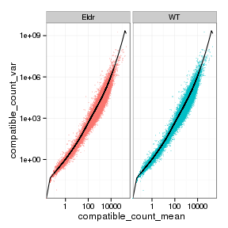 

## Cross-replicate variability (fpkmSCVplot)
Differences in CV 2 can result in lower numbers of differentially expressed genes due to a higher degree of variability between replicate fpkm estimates.

Genes:

 

Isoforms: 

 


## MvA plot

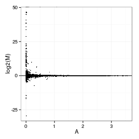 
   
### MvA plot counts

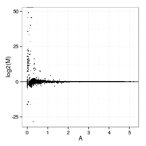 

## Scatterplot matrix

 

## Distributions

### Boxplots

Boxplot (genes)

 

Boxplot (genes, replicates)

 

Boxplot (isoforms)

 

Boxplot (isoforms, replicates)

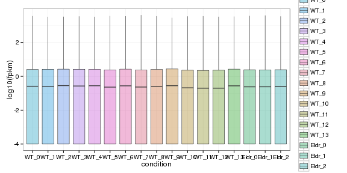 

### Density

Density (genes)

 

Density (genes, replicates)

 


## Clustering

### Replicate Clusters

 

```
## NULL
```

### PCA (genes)

 

### MDS (genes)

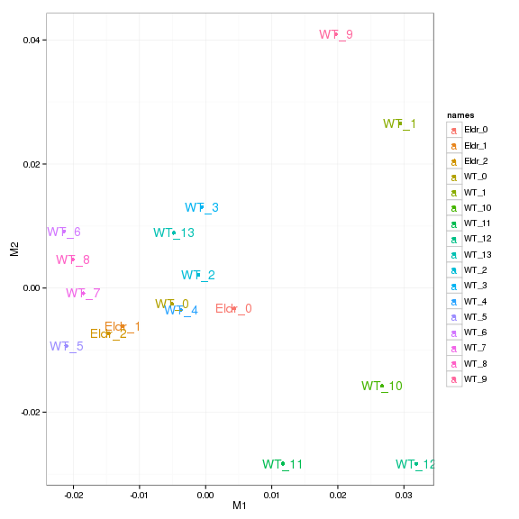 


# KO assessment

## Endogenous lncRNA expression

 

Endogenous expression of Eldr isoforms:

 

Barplot of gene expression:

 

Barplot of isoform expression:

 


## LacZ expression

  


## Digital Genotyping (LacZ vs Endogenous lncRNA and Sex)

Eif2s3y is a y-expressed gene, Xist is an x-expressed gene 
Expression plot (endogenous linc, lacZ, Y-expressed gene):

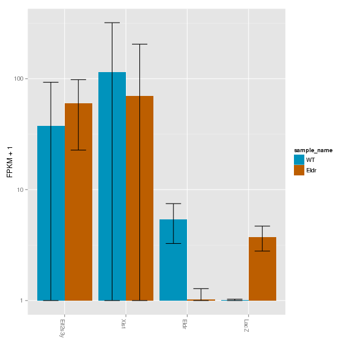 

Expression heatmap:

 


### Track visualization 

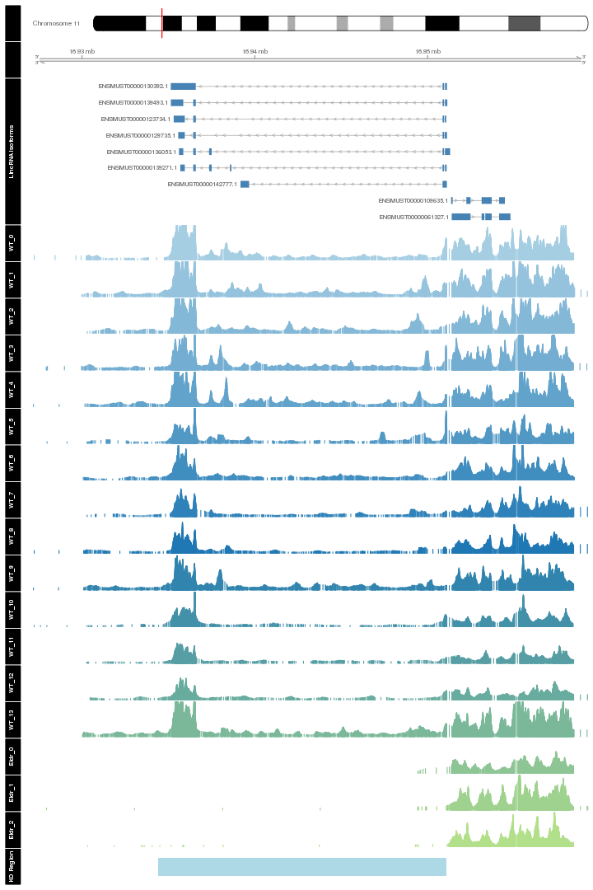 

# Differential Analysis

## Differential Genes 


There are 151 significantly differentially expressed genes. They are:

<!-- html table generated in R 3.0.2 by xtable 1.7-3 package -->
<!-- Tue Jul 15 18:33:15 2014 -->
<TABLE border=1>
<TR> <TH>  </TH> <TH> geneAnnot$gene_short_name </TH>  </TR>
  <TR> <TD align="right"> 1 </TD> <TD> Cdh1 </TD> </TR>
  <TR> <TD align="right"> 2 </TD> <TD> Col1a1 </TD> </TR>
  <TR> <TD align="right"> 3 </TD> <TD> Cacna1e </TD> </TR>
  <TR> <TD align="right"> 4 </TD> <TD> Utp20 </TD> </TR>
  <TR> <TD align="right"> 5 </TD> <TD> Polr2a </TD> </TR>
  <TR> <TD align="right"> 6 </TD> <TD> Nid1 </TD> </TR>
  <TR> <TD align="right"> 7 </TD> <TD> Vax1 </TD> </TR>
  <TR> <TD align="right"> 8 </TD> <TD> Rplp1 </TD> </TR>
  <TR> <TD align="right"> 9 </TD> <TD> Ttc9b </TD> </TR>
  <TR> <TD align="right"> 10 </TD> <TD> Ptgds </TD> </TR>
  <TR> <TD align="right"> 11 </TD> <TD> Abca1 </TD> </TR>
  <TR> <TD align="right"> 12 </TD> <TD> Dync1h1 </TD> </TR>
  <TR> <TD align="right"> 13 </TD> <TD> D10Bwg1379e </TD> </TR>
  <TR> <TD align="right"> 14 </TD> <TD> Lama2 </TD> </TR>
  <TR> <TD align="right"> 15 </TD> <TD> Snrpf </TD> </TR>
  <TR> <TD align="right"> 16 </TD> <TD> Egfr </TD> </TR>
  <TR> <TD align="right"> 17 </TD> <TD> Pold2 </TD> </TR>
  <TR> <TD align="right"> 18 </TD> <TD> Aebp1 </TD> </TR>
  <TR> <TD align="right"> 19 </TD> <TD> Prpf8 </TD> </TR>
  <TR> <TD align="right"> 20 </TD> <TD> Hoxb9 </TD> </TR>
  <TR> <TD align="right"> 21 </TD> <TD> Pdhb </TD> </TR>
  <TR> <TD align="right"> 22 </TD> <TD> Nid2 </TD> </TR>
  <TR> <TD align="right"> 23 </TD> <TD> Sla </TD> </TR>
  <TR> <TD align="right"> 24 </TD> <TD> Myh9 </TD> </TR>
  <TR> <TD align="right"> 25 </TD> <TD> Col2a1 </TD> </TR>
  <TR> <TD align="right"> 26 </TD> <TD> Dlx2 </TD> </TR>
  <TR> <TD align="right"> 27 </TD> <TD> Igf2r </TD> </TR>
  <TR> <TD align="right"> 28 </TD> <TD> Prss41 </TD> </TR>
  <TR> <TD align="right"> 29 </TD> <TD> Fbn2 </TD> </TR>
  <TR> <TD align="right"> 30 </TD> <TD> Rps14 </TD> </TR>
  <TR> <TD align="right"> 31 </TD> <TD> Lbx1 </TD> </TR>
  <TR> <TD align="right"> 32 </TD> <TD> Rps26 </TD> </TR>
  <TR> <TD align="right"> 33 </TD> <TD> Pgm2 </TD> </TR>
  <TR> <TD align="right"> 34 </TD> <TD> Fn1 </TD> </TR>
  <TR> <TD align="right"> 35 </TD> <TD> Lamc1 </TD> </TR>
  <TR> <TD align="right"> 36 </TD> <TD> Ddr2 </TD> </TR>
  <TR> <TD align="right"> 37 </TD> <TD> Lrp2 </TD> </TR>
  <TR> <TD align="right"> 38 </TD> <TD> Fbn1 </TD> </TR>
  <TR> <TD align="right"> 39 </TD> <TD> Notch2 </TD> </TR>
  <TR> <TD align="right"> 40 </TD> <TD> Col11a1 </TD> </TR>
  <TR> <TD align="right"> 41 </TD> <TD> Tnc </TD> </TR>
  <TR> <TD align="right"> 42 </TD> <TD> Svep1 </TD> </TR>
  <TR> <TD align="right"> 43 </TD> <TD> Snapc3 </TD> </TR>
  <TR> <TD align="right"> 44 </TD> <TD> Scp2 </TD> </TR>
  <TR> <TD align="right"> 45 </TD> <TD> Kcnq4 </TD> </TR>
  <TR> <TD align="right"> 46 </TD> <TD> Ndufs5 </TD> </TR>
  <TR> <TD align="right"> 47 </TD> <TD> Wdr65 </TD> </TR>
  <TR> <TD align="right"> 48 </TD> <TD> Nkx1-1 </TD> </TR>
  <TR> <TD align="right"> 49 </TD> <TD> Pdgfra </TD> </TR>
  <TR> <TD align="right"> 50 </TD> <TD> Uncx </TD> </TR>
  <TR> <TD align="right"> 51 </TD> <TD> Lhx5 </TD> </TR>
  <TR> <TD align="right"> 52 </TD> <TD> Col1a2 </TD> </TR>
  <TR> <TD align="right"> 53 </TD> <TD> Slc13a4 </TD> </TR>
  <TR> <TD align="right"> 54 </TD> <TD> Aldh1l1 </TD> </TR>
  <TR> <TD align="right"> 55 </TD> <TD> Itpr1 </TD> </TR>
  <TR> <TD align="right"> 56 </TD> <TD> Dera </TD> </TR>
  <TR> <TD align="right"> 57 </TD> <TD> Herc2 </TD> </TR>
  <TR> <TD align="right"> 58 </TD> <TD> Hddc3 </TD> </TR>
  <TR> <TD align="right"> 59 </TD> <TD> Iqgap1 </TD> </TR>
  <TR> <TD align="right"> 60 </TD> <TD> Eif3f </TD> </TR>
  <TR> <TD align="right"> 61 </TD> <TD> Lama1 </TD> </TR>
  <TR> <TD align="right"> 62 </TD> <TD> 3830406C13Rik </TD> </TR>
  <TR> <TD align="right"> 63 </TD> <TD> Adamts15 </TD> </TR>
  <TR> <TD align="right"> 64 </TD> <TD> Gbx2 </TD> </TR>
  <TR> <TD align="right"> 65 </TD> <TD> Prr7 </TD> </TR>
  <TR> <TD align="right"> 66 </TD> <TD> Fras1 </TD> </TR>
  <TR> <TD align="right"> 67 </TD> <TD> Vps13c </TD> </TR>
  <TR> <TD align="right"> 68 </TD> <TD> Fignl1 </TD> </TR>
  <TR> <TD align="right"> 69 </TD> <TD> Cox8a </TD> </TR>
  <TR> <TD align="right"> 70 </TD> <TD> Frem2 </TD> </TR>
  <TR> <TD align="right"> 71 </TD> <TD> Rps16 </TD> </TR>
  <TR> <TD align="right"> 72 </TD> <TD> Vstm2l </TD> </TR>
  <TR> <TD align="right"> 73 </TD> <TD> Notch3 </TD> </TR>
  <TR> <TD align="right"> 74 </TD> <TD> Ift172 </TD> </TR>
  <TR> <TD align="right"> 75 </TD> <TD> Hoxb4 </TD> </TR>
  <TR> <TD align="right"> 76 </TD> <TD> Atp5l </TD> </TR>
  <TR> <TD align="right"> 77 </TD> <TD> Srrm2 </TD> </TR>
  <TR> <TD align="right"> 78 </TD> <TD> Pcsk1n </TD> </TR>
  <TR> <TD align="right"> 79 </TD> <TD> Klhl42 </TD> </TR>
  <TR> <TD align="right"> 80 </TD> <TD> Tlx3 </TD> </TR>
  <TR> <TD align="right"> 81 </TD> <TD> C1qtnf4 </TD> </TR>
  <TR> <TD align="right"> 82 </TD> <TD> Dnah7b </TD> </TR>
  <TR> <TD align="right"> 83 </TD> <TD> 2310036O22Rik </TD> </TR>
  <TR> <TD align="right"> 84 </TD> <TD> Fmod </TD> </TR>
  <TR> <TD align="right"> 85 </TD> <TD> Hebp1 </TD> </TR>
  <TR> <TD align="right"> 86 </TD> <TD> Tuba1c </TD> </TR>
  <TR> <TD align="right"> 87 </TD> <TD> Lor </TD> </TR>
  <TR> <TD align="right"> 88 </TD> <TD> Pgp </TD> </TR>
  <TR> <TD align="right"> 89 </TD> <TD> Gm9493 </TD> </TR>
  <TR> <TD align="right"> 90 </TD> <TD> Rps2 </TD> </TR>
  <TR> <TD align="right"> 91 </TD> <TD> Acp1 </TD> </TR>
  <TR> <TD align="right"> 92 </TD> <TD> Sox3 </TD> </TR>
  <TR> <TD align="right"> 93 </TD> <TD> Wdr89 </TD> </TR>
  <TR> <TD align="right"> 94 </TD> <TD> Scand1 </TD> </TR>
  <TR> <TD align="right"> 95 </TD> <TD> Sox18 </TD> </TR>
  <TR> <TD align="right"> 96 </TD> <TD> Gm7729 </TD> </TR>
  <TR> <TD align="right"> 97 </TD> <TD> Fat4 </TD> </TR>
  <TR> <TD align="right"> 98 </TD> <TD> Dync2h1 </TD> </TR>
  <TR> <TD align="right"> 99 </TD> <TD> Kmt2d </TD> </TR>
  <TR> <TD align="right"> 100 </TD> <TD> Scrt1 </TD> </TR>
  <TR> <TD align="right"> 101 </TD> <TD> Rpl29 </TD> </TR>
  <TR> <TD align="right"> 102 </TD> <TD> H2afx </TD> </TR>
  <TR> <TD align="right"> 103 </TD> <TD> Ccdc171 </TD> </TR>
  <TR> <TD align="right"> 104 </TD> <TD> Dnah6 </TD> </TR>
  <TR> <TD align="right"> 105 </TD> <TD> Lamb2 </TD> </TR>
  <TR> <TD align="right"> 106 </TD> <TD> Tusc1 </TD> </TR>
  <TR> <TD align="right"> 107 </TD> <TD> Zfp771 </TD> </TR>
  <TR> <TD align="right"> 108 </TD> <TD> Mrfap1 </TD> </TR>
  <TR> <TD align="right"> 109 </TD> <TD> Gm10020 </TD> </TR>
  <TR> <TD align="right"> 110 </TD> <TD> Rpl36 </TD> </TR>
  <TR> <TD align="right"> 111 </TD> <TD> Capn11 </TD> </TR>
  <TR> <TD align="right"> 112 </TD> <TD> H2afj </TD> </TR>
  <TR> <TD align="right"> 113 </TD> <TD> Tpt1 </TD> </TR>
  <TR> <TD align="right"> 114 </TD> <TD> Rps12 </TD> </TR>
  <TR> <TD align="right"> 115 </TD> <TD> Rpl35 </TD> </TR>
  <TR> <TD align="right"> 116 </TD> <TD> Sox11 </TD> </TR>
  <TR> <TD align="right"> 117 </TD> <TD> Zfp428 </TD> </TR>
  <TR> <TD align="right"> 118 </TD> <TD> Rpl36-ps3 </TD> </TR>
  <TR> <TD align="right"> 119 </TD> <TD> Flnc </TD> </TR>
  <TR> <TD align="right"> 120 </TD> <TD> Ptprz1 </TD> </TR>
  <TR> <TD align="right"> 121 </TD> <TD> Ddx3y </TD> </TR>
  <TR> <TD align="right"> 122 </TD> <TD> Nkain2 </TD> </TR>
  <TR> <TD align="right"> 123 </TD> <TD> Ahnak </TD> </TR>
  <TR> <TD align="right"> 124 </TD> <TD> Fat1 </TD> </TR>
  <TR> <TD align="right"> 125 </TD> <TD> Gm1673 </TD> </TR>
  <TR> <TD align="right"> 126 </TD> <TD> Klhl9 </TD> </TR>
  <TR> <TD align="right"> 127 </TD> <TD> Jund </TD> </TR>
  <TR> <TD align="right"> 128 </TD> <TD> Gm10340 </TD> </TR>
  <TR> <TD align="right"> 129 </TD> <TD> Gm7292 </TD> </TR>
  <TR> <TD align="right"> 130 </TD> <TD> Gpr27 </TD> </TR>
  <TR> <TD align="right"> 131 </TD> <TD> Srp54a </TD> </TR>
  <TR> <TD align="right"> 132 </TD> <TD> Wdfy1 </TD> </TR>
  <TR> <TD align="right"> 133 </TD> <TD> Hbb-bt </TD> </TR>
  <TR> <TD align="right"> 134 </TD> <TD> Fat3 </TD> </TR>
  <TR> <TD align="right"> 135 </TD> <TD> Gm3558 </TD> </TR>
  <TR> <TD align="right"> 136 </TD> <TD> Gm2974 </TD> </TR>
  <TR> <TD align="right"> 137 </TD> <TD> Gm3411 </TD> </TR>
  <TR> <TD align="right"> 138 </TD> <TD> Gm2897 </TD> </TR>
  <TR> <TD align="right"> 139 </TD> <TD> Gm11273 </TD> </TR>
  <TR> <TD align="right"> 140 </TD> <TD> Ccdc85c </TD> </TR>
  <TR> <TD align="right"> 141 </TD> <TD> Ier5l </TD> </TR>
  <TR> <TD align="right"> 142 </TD> <TD> Gm3739 </TD> </TR>
  <TR> <TD align="right"> 143 </TD> <TD> Malat1 </TD> </TR>
  <TR> <TD align="right"> 144 </TD> <TD> Gm10406 </TD> </TR>
  <TR> <TD align="right"> 145 </TD> <TD> Gm3373 </TD> </TR>
  <TR> <TD align="right"> 146 </TD> <TD> Gm3526 </TD> </TR>
  <TR> <TD align="right"> 147 </TD> <TD> Ccdc85b </TD> </TR>
  <TR> <TD align="right"> 148 </TD> <TD> Gm3500 </TD> </TR>
  <TR> <TD align="right"> 149 </TD> <TD> Gm9825 </TD> </TR>
  <TR> <TD align="right"> 150 </TD> <TD> Gm5796 </TD> </TR>
  <TR> <TD align="right"> 151 </TD> <TD> Gm3591 </TD> </TR>
   </TABLE>

### Matrix of gene significant differences between conditions

(skip for Brainmap wt-v-ko comparisons)

 

### Significant gene expression differences between conditions

Expression plot (genes):(turned off)


 

Significant genes with expression >50fpkm (any condition):(turned off)


An individual look at each of the highly expressed significantly differentially regulated genes:
(eval=false for first pass)


### Expression-level/significance relationship

Scatter plot of significant genes only:

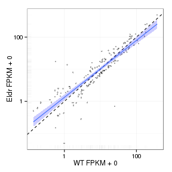 

Volcano Plot

 

Volcano plot with significant genes only:

 

FoldChange Heatmap

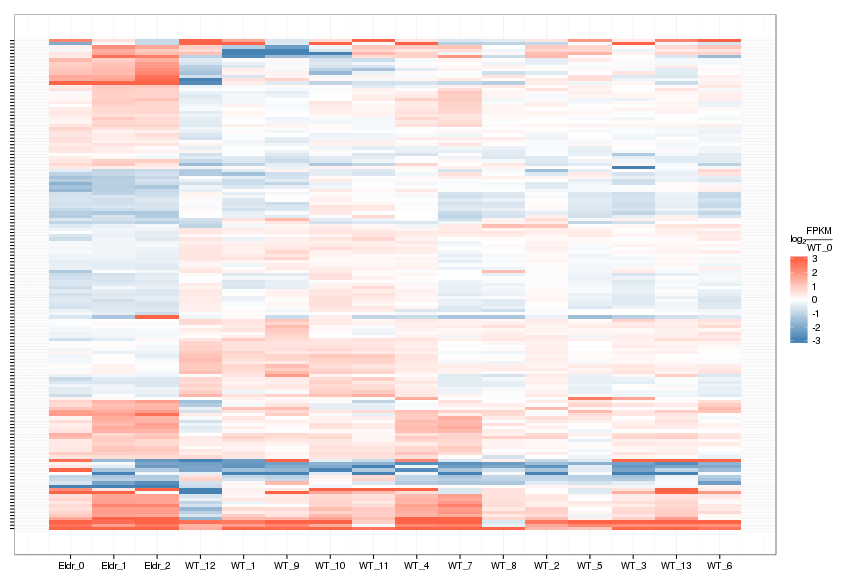 


## Differential Splicing

### Differential Isoforms between conditions

Per isoform difference between conditions:

 

These isoforms are:

<!-- html table generated in R 3.0.2 by xtable 1.7-3 package -->
<!-- Tue Jul 15 18:35:31 2014 -->
<TABLE border=1>
<TR> <TH>  </TH> <TH> isoAnnot$gene_short_name </TH>  </TR>
  <TR> <TD align="right"> 1 </TD> <TD> Cdh1 </TD> </TR>
  <TR> <TD align="right"> 2 </TD> <TD> Col1a1 </TD> </TR>
  <TR> <TD align="right"> 3 </TD> <TD> Lamb1 </TD> </TR>
  <TR> <TD align="right"> 4 </TD> <TD> Nid1 </TD> </TR>
  <TR> <TD align="right"> 5 </TD> <TD> Ttc9b </TD> </TR>
  <TR> <TD align="right"> 6 </TD> <TD> Cad </TD> </TR>
  <TR> <TD align="right"> 7 </TD> <TD> Abca1 </TD> </TR>
  <TR> <TD align="right"> 8 </TD> <TD> Lama5 </TD> </TR>
  <TR> <TD align="right"> 9 </TD> <TD> Dync1h1 </TD> </TR>
  <TR> <TD align="right"> 10 </TD> <TD> Lama2 </TD> </TR>
  <TR> <TD align="right"> 11 </TD> <TD> Gm872 </TD> </TR>
  <TR> <TD align="right"> 12 </TD> <TD> Egfr </TD> </TR>
  <TR> <TD align="right"> 13 </TD> <TD> Pold2 </TD> </TR>
  <TR> <TD align="right"> 14 </TD> <TD> Mrc2 </TD> </TR>
  <TR> <TD align="right"> 15 </TD> <TD> Hoxb9 </TD> </TR>
  <TR> <TD align="right"> 16 </TD> <TD> Nid2 </TD> </TR>
  <TR> <TD align="right"> 17 </TD> <TD> Myh9 </TD> </TR>
  <TR> <TD align="right"> 18 </TD> <TD> Dlx2 </TD> </TR>
  <TR> <TD align="right"> 19 </TD> <TD> Igf2r </TD> </TR>
  <TR> <TD align="right"> 20 </TD> <TD> Fbn2 </TD> </TR>
  <TR> <TD align="right"> 21 </TD> <TD> Rps14 </TD> </TR>
  <TR> <TD align="right"> 22 </TD> <TD> Fasn </TD> </TR>
  <TR> <TD align="right"> 23 </TD> <TD> Lbx1 </TD> </TR>
  <TR> <TD align="right"> 24 </TD> <TD> Pgm2 </TD> </TR>
  <TR> <TD align="right"> 25 </TD> <TD> Dst </TD> </TR>
  <TR> <TD align="right"> 26 </TD> <TD> Fn1 </TD> </TR>
  <TR> <TD align="right"> 27 </TD> <TD> Lamc1 </TD> </TR>
  <TR> <TD align="right"> 28 </TD> <TD> Col5a1 </TD> </TR>
  <TR> <TD align="right"> 29 </TD> <TD> Notch1 </TD> </TR>
  <TR> <TD align="right"> 30 </TD> <TD> Lrp2 </TD> </TR>
  <TR> <TD align="right"> 31 </TD> <TD> Fbn1 </TD> </TR>
  <TR> <TD align="right"> 32 </TD> <TD> Notch2 </TD> </TR>
  <TR> <TD align="right"> 33 </TD> <TD> Tnc </TD> </TR>
  <TR> <TD align="right"> 34 </TD> <TD> Svep1 </TD> </TR>
  <TR> <TD align="right"> 35 </TD> <TD> Snapc3 </TD> </TR>
  <TR> <TD align="right"> 36 </TD> <TD> Scp2 </TD> </TR>
  <TR> <TD align="right"> 37 </TD> <TD> Kcnq4 </TD> </TR>
  <TR> <TD align="right"> 38 </TD> <TD> Trp73 </TD> </TR>
  <TR> <TD align="right"> 39 </TD> <TD> Uncx </TD> </TR>
  <TR> <TD align="right"> 40 </TD> <TD> Col1a2 </TD> </TR>
  <TR> <TD align="right"> 41 </TD> <TD> Slc13a4 </TD> </TR>
  <TR> <TD align="right"> 42 </TD> <TD> Itpr1 </TD> </TR>
  <TR> <TD align="right"> 43 </TD> <TD> Dera </TD> </TR>
  <TR> <TD align="right"> 44 </TD> <TD> Eif3f </TD> </TR>
  <TR> <TD align="right"> 45 </TD> <TD> Col12a1 </TD> </TR>
  <TR> <TD align="right"> 46 </TD> <TD> Lama1 </TD> </TR>
  <TR> <TD align="right"> 47 </TD> <TD> Szt2 </TD> </TR>
  <TR> <TD align="right"> 48 </TD> <TD> Adamts15 </TD> </TR>
  <TR> <TD align="right"> 49 </TD> <TD> Gbx2 </TD> </TR>
  <TR> <TD align="right"> 50 </TD> <TD> Prr7 </TD> </TR>
  <TR> <TD align="right"> 51 </TD> <TD> Fras1 </TD> </TR>
  <TR> <TD align="right"> 52 </TD> <TD> Leng8 </TD> </TR>
  <TR> <TD align="right"> 53 </TD> <TD> Cox8a </TD> </TR>
  <TR> <TD align="right"> 54 </TD> <TD> Frem2 </TD> </TR>
  <TR> <TD align="right"> 55 </TD> <TD> Vstm2l </TD> </TR>
  <TR> <TD align="right"> 56 </TD> <TD> Notch3 </TD> </TR>
  <TR> <TD align="right"> 57 </TD> <TD> Hoxb4 </TD> </TR>
  <TR> <TD align="right"> 58 </TD> <TD> Pcsk1n </TD> </TR>
  <TR> <TD align="right"> 59 </TD> <TD> Klhl42 </TD> </TR>
  <TR> <TD align="right"> 60 </TD> <TD> Lrp1 </TD> </TR>
  <TR> <TD align="right"> 61 </TD> <TD> Tlx3 </TD> </TR>
  <TR> <TD align="right"> 62 </TD> <TD> C1qtnf4 </TD> </TR>
  <TR> <TD align="right"> 63 </TD> <TD> Dnah7b </TD> </TR>
  <TR> <TD align="right"> 64 </TD> <TD> 2310036O22Rik </TD> </TR>
  <TR> <TD align="right"> 65 </TD> <TD> Reln </TD> </TR>
  <TR> <TD align="right"> 66 </TD> <TD> Hebp1 </TD> </TR>
  <TR> <TD align="right"> 67 </TD> <TD> Tuba1c </TD> </TR>
  <TR> <TD align="right"> 68 </TD> <TD> Gm9493 </TD> </TR>
  <TR> <TD align="right"> 69 </TD> <TD> Wdr89 </TD> </TR>
  <TR> <TD align="right"> 70 </TD> <TD> Fat4 </TD> </TR>
  <TR> <TD align="right"> 71 </TD> <TD> Col6a3 </TD> </TR>
  <TR> <TD align="right"> 72 </TD> <TD> H2afx </TD> </TR>
  <TR> <TD align="right"> 73 </TD> <TD> Ccdc171 </TD> </TR>
  <TR> <TD align="right"> 74 </TD> <TD> Lamb2 </TD> </TR>
  <TR> <TD align="right"> 75 </TD> <TD> Tusc1 </TD> </TR>
  <TR> <TD align="right"> 76 </TD> <TD> Zfp771 </TD> </TR>
  <TR> <TD align="right"> 77 </TD> <TD> Gm10020 </TD> </TR>
  <TR> <TD align="right"> 78 </TD> <TD> Rpl36 </TD> </TR>
  <TR> <TD align="right"> 79 </TD> <TD> H2afj </TD> </TR>
  <TR> <TD align="right"> 80 </TD> <TD> Tpt1 </TD> </TR>
  <TR> <TD align="right"> 81 </TD> <TD> Rps12 </TD> </TR>
  <TR> <TD align="right"> 82 </TD> <TD> Sox11 </TD> </TR>
  <TR> <TD align="right"> 83 </TD> <TD> Ptprz1 </TD> </TR>
  <TR> <TD align="right"> 84 </TD> <TD> Ddx3y </TD> </TR>
  <TR> <TD align="right"> 85 </TD> <TD> Gpr98 </TD> </TR>
  <TR> <TD align="right"> 86 </TD> <TD> Ahnak </TD> </TR>
  <TR> <TD align="right"> 87 </TD> <TD> Fat1 </TD> </TR>
  <TR> <TD align="right"> 88 </TD> <TD> Klhl9 </TD> </TR>
  <TR> <TD align="right"> 89 </TD> <TD> Jund </TD> </TR>
  <TR> <TD align="right"> 90 </TD> <TD> Gpr27 </TD> </TR>
  <TR> <TD align="right"> 91 </TD> <TD> Srp54a </TD> </TR>
  <TR> <TD align="right"> 92 </TD> <TD> Hbb-bt </TD> </TR>
  <TR> <TD align="right"> 93 </TD> <TD> Fat3 </TD> </TR>
  <TR> <TD align="right"> 94 </TD> <TD> Gm3558 </TD> </TR>
  <TR> <TD align="right"> 95 </TD> <TD> Gm2897 </TD> </TR>
  <TR> <TD align="right"> 96 </TD> <TD> Gm11273 </TD> </TR>
  <TR> <TD align="right"> 97 </TD> <TD> Ccdc85c </TD> </TR>
  <TR> <TD align="right"> 98 </TD> <TD> Ier5l </TD> </TR>
  <TR> <TD align="right"> 99 </TD> <TD> Malat1 </TD> </TR>
  <TR> <TD align="right"> 100 </TD> <TD> Ccdc85b </TD> </TR>
  <TR> <TD align="right"> 101 </TD> <TD> Gm3500 </TD> </TR>
  <TR> <TD align="right"> 102 </TD> <TD> Gm9825 </TD> </TR>
  <TR> <TD align="right"> 103 </TD> <TD> Gm3591 </TD> </TR>
   </TABLE>

Gene-level DE isoform heatmap

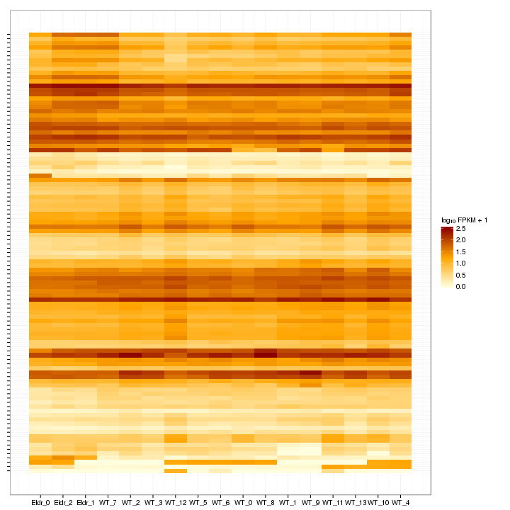 

Isoform foldchange heatmap by isoform:

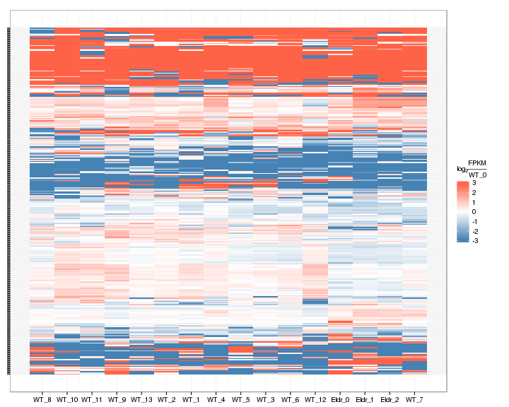 


### Differential Splicing between conditions

(eval false for first pass)

Per condition differences in isoforms (Does gene have diff piechart between conditions?)


These genes are:


Splicing heatmap by isoform:


Splicing heatmap by gene


The following are significantly differentially spliced genes (relative portion of isoform per condition): 


 


# Gene/Pathway Analysis

## GSEA

Enrichment and zscores are calculated based on expression in KO vs WT (fpkmKO/fpkmWT), so genes that are down regulated in KO are shown in blue, while upregulation is shown in red. 

KO/WT
Blue = down in KO
Red = Up in KO


Biocarta enrichment: 


```
## Error: `x' must have at least 2 rows and 2 columns
```

Biocarta zscore: 


```
## Error: incorrect number of dimensions
```

```
## Error: `x' must have at least 2 rows and 2 columns
```


Reactome enrichment: 


```
## Error: subscript out of bounds
```

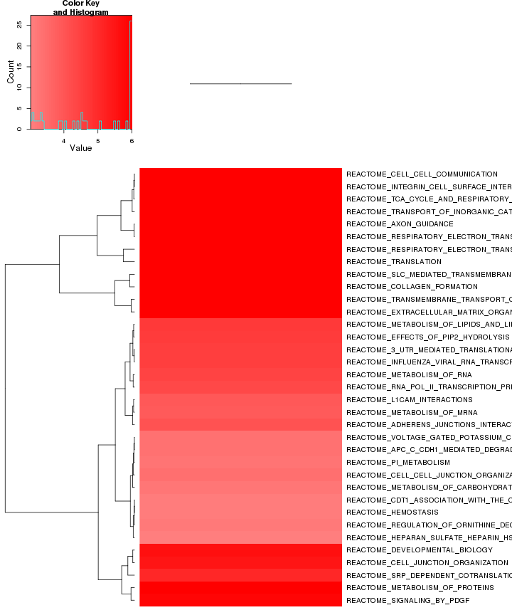 


Reactome zscore: 


```
## Error: subscript out of bounds
```

 


Kegg enrichment: 

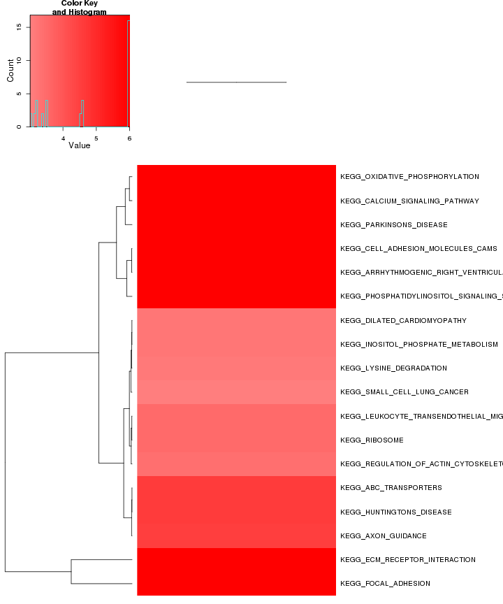 

Kegg zscore: 

 

Interneuron enrichment:


```
## Error: no locations are finite
```

 

Interneuron zscore:

 


Oncogene enrichment: 

 

Oncogene zscore:

 

Immuno enrichment:

 

Immuno zscore:

 

TF enrichment:


```
## Error: subscript out of bounds
```

 

TF zscore:


```
## Error: subscript out of bounds
```

 


## GO enrichment 
Cluster profiler used to call enichments of significantly differentially regulated genes that map to Entrez IDs. 


 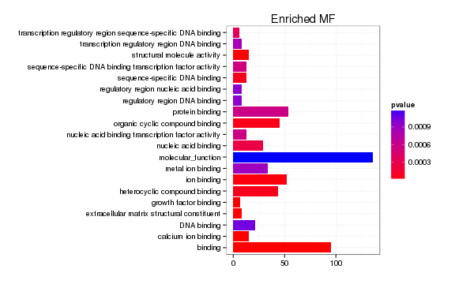  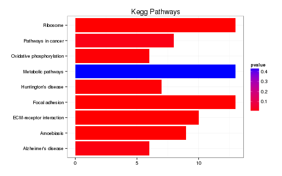 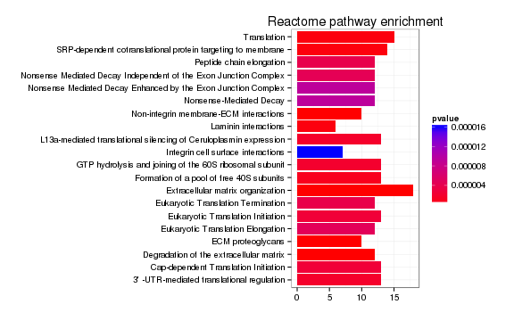 


### Enrichment or depletion for stage-specific cell cycle markers 

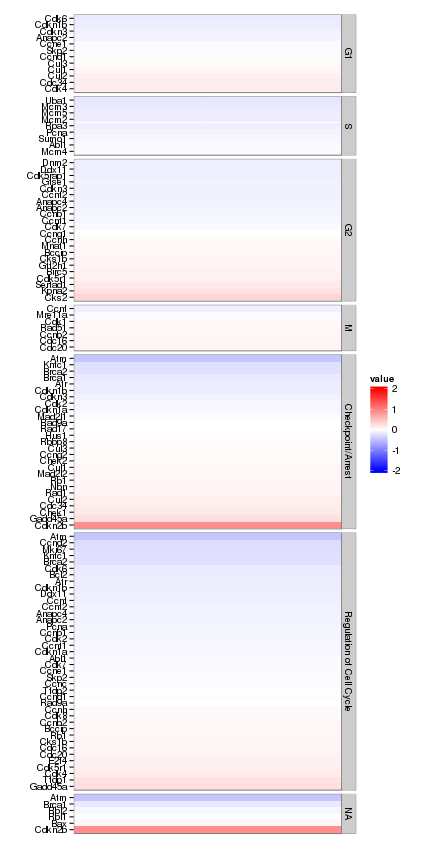 


### Enrichment or depletion for markers of specific cortical layers

 


### Enrichment or depletion for specific neural cell types 
 


### Enrichment or Depletion of neural differentiation markers 

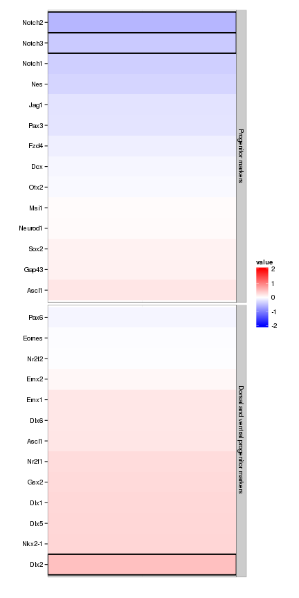 


# Cis vs Trans (locally)

log2 Foldchange and test statistic are calculated with the ratio of fpkm(KO)/fpkm(WT), thus the test_stat is positive if a gene is higher in the KO and negative if a gene has lower expression in the KO


The pvalue for 1 genes significantly regulated in a region this size  is: 1 


 

# Notes

## Samples used are:
<!-- html table generated in R 3.0.2 by xtable 1.7-3 package -->
<!-- Tue Jul 15 19:09:24 2014 -->
<TABLE border=1>
<TR> <TH>  </TH> <TH> 10 </TH>  </TR>
  <TR> <TD align="right"> 1 </TD> <TD> JR753 </TD> </TR>
  <TR> <TD align="right"> 2 </TD> <TD> JR750 </TD> </TR>
  <TR> <TD align="right"> 3 </TD> <TD> JR771 </TD> </TR>
  <TR> <TD align="right"> 4 </TD> <TD> JR755 </TD> </TR>
  <TR> <TD align="right"> 5 </TD> <TD> JR811 </TD> </TR>
  <TR> <TD align="right"> 6 </TD> <TD> JR768 </TD> </TR>
  <TR> <TD align="right"> 7 </TD> <TD> JR761 </TD> </TR>
  <TR> <TD align="right"> 8 </TD> <TD> JR815 </TD> </TR>
  <TR> <TD align="right"> 9 </TD> <TD> JR789 </TD> </TR>
  <TR> <TD align="right"> 10 </TD> <TD> JR748 </TD> </TR>
  <TR> <TD align="right"> 11 </TD> <TD> JR716 </TD> </TR>
  <TR> <TD align="right"> 12 </TD> <TD> JR717 </TD> </TR>
  <TR> <TD align="right"> 13 </TD> <TD> JR719 </TD> </TR>
  <TR> <TD align="right"> 14 </TD> <TD> JR756 </TD> </TR>
  <TR> <TD align="right"> 15 </TD> <TD> JR787 </TD> </TR>
  <TR> <TD align="right"> 16 </TD> <TD> JR810 </TD> </TR>
  <TR> <TD align="right"> 17 </TD> <TD> JR838 </TD> </TR>
   </TABLE>

## Replicates
<!-- html table generated in R 3.0.2 by xtable 1.7-3 package -->
<!-- Tue Jul 15 19:09:24 2014 -->
<TABLE border=1>
<TR> <TH>  </TH> <TH> file </TH> <TH> sample_name </TH> <TH> replicate </TH> <TH> rep_name </TH> <TH> total_mass </TH> <TH> norm_mass </TH> <TH> internal_scale </TH> <TH> external_scale </TH>  </TR>
  <TR> <TD align="right"> 1 </TD> <TD> /n/rinn_data1/seq/lgoff/Projects/BrainMap/data/quants/JR753/abundances.cxb </TD> <TD> WT </TD> <TD align="right">   0 </TD> <TD> WT_0 </TD> <TD align="right"> 39331900.00 </TD> <TD align="right"> 32543000.00 </TD> <TD align="right"> 1.25 </TD> <TD align="right"> 1.00 </TD> </TR>
  <TR> <TD align="right"> 2 </TD> <TD> /n/rinn_data1/seq/lgoff/Projects/BrainMap/data/quants/JR750/abundances.cxb </TD> <TD> WT </TD> <TD align="right">   1 </TD> <TD> WT_1 </TD> <TD align="right"> 36031100.00 </TD> <TD align="right"> 32543000.00 </TD> <TD align="right"> 1.09 </TD> <TD align="right"> 1.00 </TD> </TR>
  <TR> <TD align="right"> 3 </TD> <TD> /n/rinn_data1/seq/lgoff/Projects/BrainMap/data/quants/JR771/abundances.cxb </TD> <TD> WT </TD> <TD align="right">   2 </TD> <TD> WT_2 </TD> <TD align="right"> 38857100.00 </TD> <TD align="right"> 32543000.00 </TD> <TD align="right"> 1.22 </TD> <TD align="right"> 1.00 </TD> </TR>
  <TR> <TD align="right"> 4 </TD> <TD> /n/rinn_data1/seq/lgoff/Projects/BrainMap/data/quants/JR755/abundances.cxb </TD> <TD> WT </TD> <TD align="right">   3 </TD> <TD> WT_3 </TD> <TD align="right"> 41811300.00 </TD> <TD align="right"> 32543000.00 </TD> <TD align="right"> 1.27 </TD> <TD align="right"> 1.00 </TD> </TR>
  <TR> <TD align="right"> 5 </TD> <TD> /n/rinn_data1/seq/lgoff/Projects/BrainMap/data/quants/JR811/abundances.cxb </TD> <TD> WT </TD> <TD align="right">   4 </TD> <TD> WT_4 </TD> <TD align="right"> 38172800.00 </TD> <TD align="right"> 32543000.00 </TD> <TD align="right"> 1.19 </TD> <TD align="right"> 1.00 </TD> </TR>
  <TR> <TD align="right"> 6 </TD> <TD> /n/rinn_data1/seq/lgoff/Projects/BrainMap/data/quants/JR768/abundances.cxb </TD> <TD> WT </TD> <TD align="right">   5 </TD> <TD> WT_5 </TD> <TD align="right"> 28375200.00 </TD> <TD align="right"> 32543000.00 </TD> <TD align="right"> 0.88 </TD> <TD align="right"> 1.00 </TD> </TR>
  <TR> <TD align="right"> 7 </TD> <TD> /n/rinn_data1/seq/lgoff/Projects/BrainMap/data/quants/JR761/abundances.cxb </TD> <TD> WT </TD> <TD align="right">   6 </TD> <TD> WT_6 </TD> <TD align="right"> 31706200.00 </TD> <TD align="right"> 32543000.00 </TD> <TD align="right"> 0.96 </TD> <TD align="right"> 1.00 </TD> </TR>
  <TR> <TD align="right"> 8 </TD> <TD> /n/rinn_data1/seq/lgoff/Projects/BrainMap/data/quants/JR815/abundances.cxb </TD> <TD> WT </TD> <TD align="right">   7 </TD> <TD> WT_7 </TD> <TD align="right"> 29733100.00 </TD> <TD align="right"> 32543000.00 </TD> <TD align="right"> 0.91 </TD> <TD align="right"> 1.00 </TD> </TR>
  <TR> <TD align="right"> 9 </TD> <TD> /n/rinn_data1/seq/lgoff/Projects/BrainMap/data/quants/JR789/abundances.cxb </TD> <TD> WT </TD> <TD align="right">   8 </TD> <TD> WT_8 </TD> <TD align="right"> 27681500.00 </TD> <TD align="right"> 32543000.00 </TD> <TD align="right"> 0.85 </TD> <TD align="right"> 1.00 </TD> </TR>
  <TR> <TD align="right"> 10 </TD> <TD> /n/rinn_data1/seq/lgoff/Projects/BrainMap/data/quants/JR748/abundances.cxb </TD> <TD> WT </TD> <TD align="right">   9 </TD> <TD> WT_9 </TD> <TD align="right"> 32367000.00 </TD> <TD align="right"> 32543000.00 </TD> <TD align="right"> 0.95 </TD> <TD align="right"> 1.00 </TD> </TR>
  <TR> <TD align="right"> 11 </TD> <TD> /n/rinn_data1/seq/lgoff/Projects/BrainMap/data/quants/JR716/abundances.cxb </TD> <TD> WT </TD> <TD align="right">  10 </TD> <TD> WT_10 </TD> <TD align="right"> 26144700.00 </TD> <TD align="right"> 32543000.00 </TD> <TD align="right"> 0.80 </TD> <TD align="right"> 1.00 </TD> </TR>
  <TR> <TD align="right"> 12 </TD> <TD> /n/rinn_data1/seq/lgoff/Projects/BrainMap/data/quants/JR717/abundances.cxb </TD> <TD> WT </TD> <TD align="right">  11 </TD> <TD> WT_11 </TD> <TD align="right"> 25565400.00 </TD> <TD align="right"> 32543000.00 </TD> <TD align="right"> 0.79 </TD> <TD align="right"> 1.00 </TD> </TR>
  <TR> <TD align="right"> 13 </TD> <TD> /n/rinn_data1/seq/lgoff/Projects/BrainMap/data/quants/JR719/abundances.cxb </TD> <TD> WT </TD> <TD align="right">  12 </TD> <TD> WT_12 </TD> <TD align="right"> 22697800.00 </TD> <TD align="right"> 32543000.00 </TD> <TD align="right"> 0.68 </TD> <TD align="right"> 1.00 </TD> </TR>
  <TR> <TD align="right"> 14 </TD> <TD> /n/rinn_data1/seq/lgoff/Projects/BrainMap/data/quants/JR756/abundances.cxb </TD> <TD> WT </TD> <TD align="right">  13 </TD> <TD> WT_13 </TD> <TD align="right"> 38948900.00 </TD> <TD align="right"> 32543000.00 </TD> <TD align="right"> 1.20 </TD> <TD align="right"> 1.00 </TD> </TR>
  <TR> <TD align="right"> 15 </TD> <TD> /n/rinn_data1/seq/lgoff/Projects/BrainMap/data/quants/JR787/abundances.cxb </TD> <TD> Eldr </TD> <TD align="right">   0 </TD> <TD> Eldr_0 </TD> <TD align="right"> 26894700.00 </TD> <TD align="right"> 32543000.00 </TD> <TD align="right"> 0.83 </TD> <TD align="right"> 1.00 </TD> </TR>
  <TR> <TD align="right"> 16 </TD> <TD> /n/rinn_data1/seq/lgoff/Projects/BrainMap/data/quants/JR810/abundances.cxb </TD> <TD> Eldr </TD> <TD align="right">   1 </TD> <TD> Eldr_1 </TD> <TD align="right"> 41828800.00 </TD> <TD align="right"> 32543000.00 </TD> <TD align="right"> 1.29 </TD> <TD align="right"> 1.00 </TD> </TR>
  <TR> <TD align="right"> 17 </TD> <TD> /n/rinn_data1/seq/lgoff/Projects/BrainMap/data/quants/JR838/abundances.cxb </TD> <TD> Eldr </TD> <TD align="right">   2 </TD> <TD> Eldr_2 </TD> <TD align="right"> 37002600.00 </TD> <TD align="right"> 32543000.00 </TD> <TD align="right"> 1.15 </TD> <TD align="right"> 1.00 </TD> </TR>
   </TABLE>

## Session Info

```
## R version 3.0.2 (2013-09-25)
## Platform: x86_64-unknown-linux-gnu (64-bit)
## 
## locale:
##  [1] LC_CTYPE=en_US.UTF-8       LC_NUMERIC=C              
##  [3] LC_TIME=en_US.UTF-8        LC_COLLATE=en_US.UTF-8    
##  [5] LC_MONETARY=en_US.UTF-8    LC_MESSAGES=en_US.UTF-8   
##  [7] LC_PAPER=en_US.UTF-8       LC_NAME=C                 
##  [9] LC_ADDRESS=C               LC_TELEPHONE=C            
## [11] LC_MEASUREMENT=en_US.UTF-8 LC_IDENTIFICATION=C       
## 
## attached base packages:
## [1] grid      parallel  methods   stats     graphics  grDevices utils    
## [8] datasets  base     
## 
## other attached packages:
##  [1] plyr_1.8.1                         
##  [2] stringr_0.6.2                      
##  [3] seqbias_1.10.0                     
##  [4] BSgenome.Mmusculus.UCSC.mm10_1.3.19
##  [5] BSgenome_1.30.0                    
##  [6] Biostrings_2.30.1                  
##  [7] gdata_2.13.3                       
##  [8] GO.db_2.10.1                       
##  [9] org.Mm.eg.db_2.10.1                
## [10] clusterProfiler_1.13.1             
## [11] DOSE_2.0.0                         
## [12] ReactomePA_1.6.1                   
## [13] AnnotationDbi_1.24.0               
## [14] Biobase_2.22.0                     
## [15] mgcv_1.7-29                        
## [16] nlme_3.1-117                       
## [17] RMySQL_0.9-3                       
## [18] RColorBrewer_1.0-5                 
## [19] gridExtra_0.9.1                    
## [20] gtable_0.1.2                       
## [21] marray_1.40.0                      
## [22] gplots_2.13.0                      
## [23] GSA_1.03                           
## [24] limma_3.18.13                      
## [25] xtable_1.7-3                       
## [26] cummeRbund_2.7.2                   
## [27] Gviz_1.6.0                         
## [28] rtracklayer_1.22.7                 
## [29] GenomicRanges_1.14.4               
## [30] XVector_0.2.0                      
## [31] IRanges_1.20.7                     
## [32] fastcluster_1.1.13                 
## [33] reshape2_1.4                       
## [34] ggplot2_1.0.0                      
## [35] RSQLite_0.11.4                     
## [36] DBI_0.2-7                          
## [37] BiocGenerics_0.8.0                 
## [38] knitr_1.6                          
## 
## loaded via a namespace (and not attached):
##  [1] biomaRt_2.18.0         biovizBase_1.10.8      bitops_1.0-6          
##  [4] caTools_1.17           cluster_1.15.2         colorspace_1.2-4      
##  [7] dichromat_2.0-0        digest_0.6.4           DO.db_2.7             
## [10] evaluate_0.5.5         formatR_0.10           Formula_1.1-1         
## [13] GenomicFeatures_1.14.5 GOSemSim_1.20.3        graph_1.40.1          
## [16] graphite_1.8.1         gtools_3.4.1           Hmisc_3.14-4          
## [19] igraph_0.7.1           KEGG.db_2.10.1         KernSmooth_2.23-12    
## [22] labeling_0.2           lattice_0.20-29        latticeExtra_0.6-26   
## [25] MASS_7.3-33            Matrix_1.1-3           munsell_0.4.2         
## [28] org.Hs.eg.db_2.10.1    proto_0.3-10           qvalue_1.36.0         
## [31] Rcpp_0.11.2            RCurl_1.95-4.1         reactome.db_1.46.1    
## [34] Rsamtools_1.14.3       scales_0.2.4           splines_3.0.2         
## [37] stats4_3.0.2           survival_2.37-7        tcltk_3.0.2           
## [40] tools_3.0.2            XML_3.98-1.1           zlibbioc_1.8.0
```

## Run Info

```
##           param
## 1      cmd_line
## 2       version
## 3  SVN_revision
## 4 boost_version
## 5        genome
##                                                                                                                                                                                                                                                                                                                                                                                                                                                                                                                                                                                                                                                                                                                                                                                                                                                                                                                                                                                                                                                                                                                                                                                                                                                                                                                                                                                                                                                                                                                                     value
## 1 cuffdiff -p 10 -L WT,Eldr -o /n/rinn_data1/seq/lgoff/Projects/BrainMap/data/diffs/Eldr_vs_WT_Embryonic /n/rinn_data1/seq/lgoff/Projects/BrainMap/data/annotation/mm10_gencode_vM2_with_lncRNAs_and_LacZ.gtf /n/rinn_data1/seq/lgoff/Projects/BrainMap/data/quants/JR753/abundances.cxb,/n/rinn_data1/seq/lgoff/Projects/BrainMap/data/quants/JR750/abundances.cxb,/n/rinn_data1/seq/lgoff/Projects/BrainMap/data/quants/JR771/abundances.cxb,/n/rinn_data1/seq/lgoff/Projects/BrainMap/data/quants/JR755/abundances.cxb,/n/rinn_data1/seq/lgoff/Projects/BrainMap/data/quants/JR811/abundances.cxb,/n/rinn_data1/seq/lgoff/Projects/BrainMap/data/quants/JR768/abundances.cxb,/n/rinn_data1/seq/lgoff/Projects/BrainMap/data/quants/JR761/abundances.cxb,/n/rinn_data1/seq/lgoff/Projects/BrainMap/data/quants/JR815/abundances.cxb,/n/rinn_data1/seq/lgoff/Projects/BrainMap/data/quants/JR789/abundances.cxb,/n/rinn_data1/seq/lgoff/Projects/BrainMap/data/quants/JR748/abundances.cxb,/n/rinn_data1/seq/lgoff/Projects/BrainMap/data/quants/JR716/abundances.cxb,/n/rinn_data1/seq/lgoff/Projects/BrainMap/data/quants/JR717/abundances.cxb,/n/rinn_data1/seq/lgoff/Projects/BrainMap/data/quants/JR719/abundances.cxb,/n/rinn_data1/seq/lgoff/Projects/BrainMap/data/quants/JR756/abundances.cxb /n/rinn_data1/seq/lgoff/Projects/BrainMap/data/quants/JR787/abundances.cxb,/n/rinn_data1/seq/lgoff/Projects/BrainMap/data/quants/JR810/abundances.cxb,/n/rinn_data1/seq/lgoff/Projects/BrainMap/data/quants/JR838/abundances.cxb 
## 2                                                                                                                                                                                                                                                                                                                                                                                                                                                                                                                                                                                                                                                                                                                                                                                                                                                                                                                                                                                                                                                                                                                                                                                                                                                                                                                                                                                                                                                                                                                                   2.2.1
## 3                                                                                                                                                                                                                                                                                                                                                                                                                                                                                                                                                                                                                                                                                                                                                                                                                                                                                                                                                                                                                                                                                                                                                                                                                                                                                                                                                                                                                                                                                                                                    4237
## 4                                                                                                                                                                                                                                                                                                                                                                                                                                                                                                                                                                                                                                                                                                                                                                                                                                                                                                                                                                                                                                                                                                                                                                                                                                                                                                                                                                                                                                                                                                                                  104700
## 5                                                                                                                                                                                                                                                                                                                                                                                                                                                                                                                                                                                                                                                                                                                                                                                                                                                                                                                                                                                                                                                                                                                                                                                                                                                                                                                                                                                                                                                                                                                                    mm10
```


