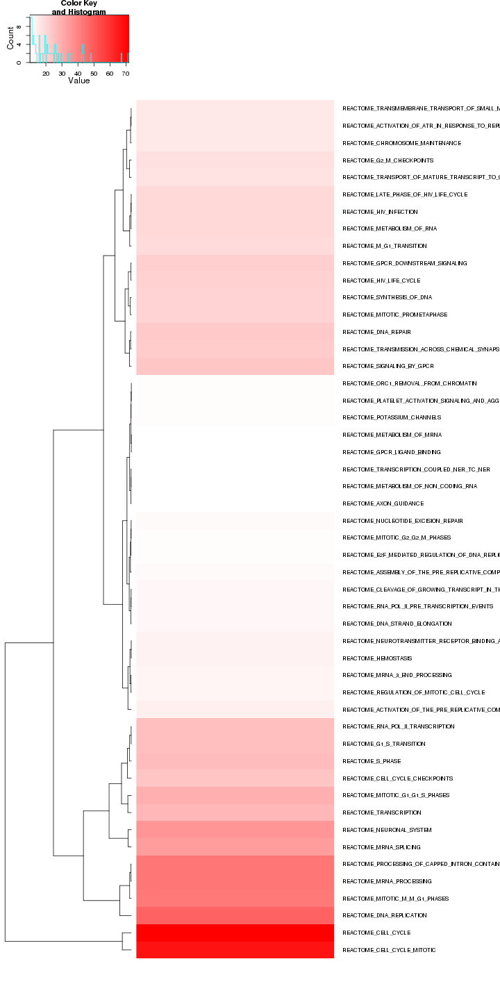
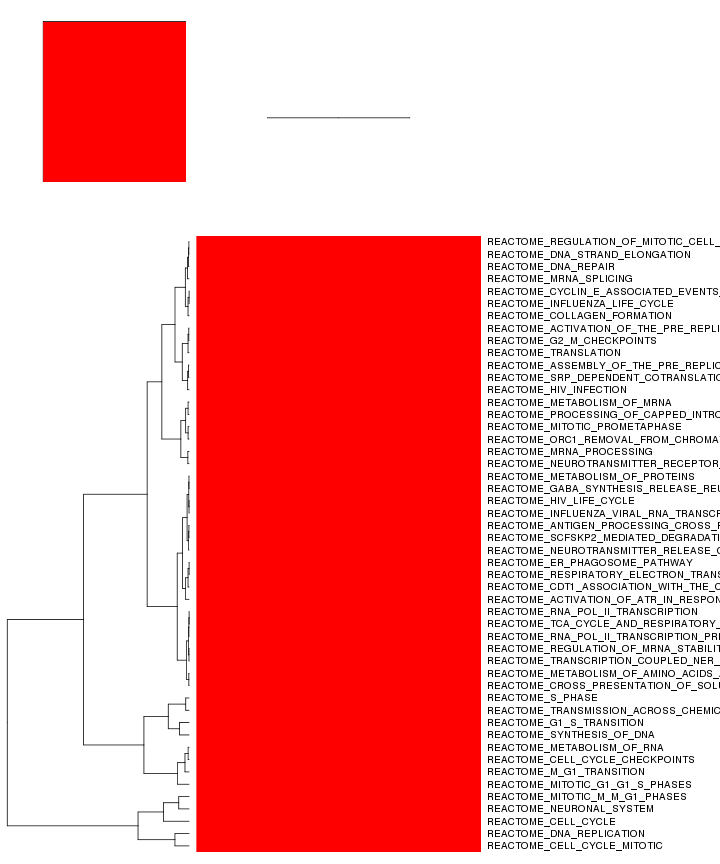

GSEA printing test 
========================================================


Biocarta enrichment: 

 

biocarta zscore: 


```
## Error: length must be non-negative number
```


Reactome enrichment: 

 


Reactome zscore: 


```
## Error: length must be non-negative number
```
