Haunt KO vs WT (Adult)
======================================


This file shows the wt-v-ko comparison for Haunt. 

Cuff overview:


```
## CuffSet instance with:
## 	 2 samples
## 	 26754 genes
## 	 77524 isoforms
## 	 0 TSS
## 	 23066 CDS
## 	 0 promoters
## 	 0 splicing
## 	 19954 relCDS
```

# QC

## Dispersion

Dispersion plot for genes in cuff:
(Overdispersion can lead to innacurate quants)

 

## Cross-replicate variability (fpkmSCVplot)
Differences in CV 2 can result in lower numbers of differentially expressed genes due to a higher degree of variability between replicate fpkm estimates.

Genes:

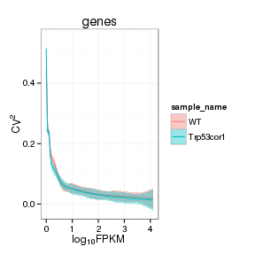 

Isoforms: 

 


## MvA plot

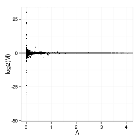 
   
### MvA plot counts

 

## Scatterplot matrix

 

## Distributions

### Boxplots

Boxplot (genes)

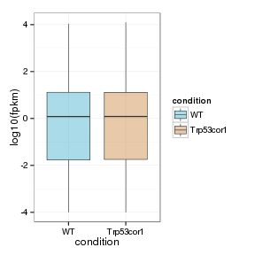 

Boxplot (genes, replicates)

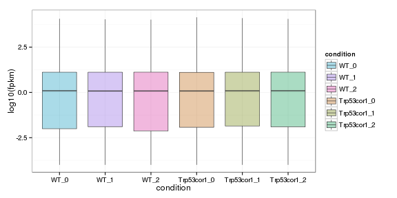 

Boxplot (isoforms)

 

Boxplot (isoforms, replicates)

 

### Density

Density (genes)

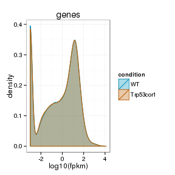 

Density (genes, replicates)

 


## Clustering

### Replicate Clusters

 

```
## NULL
```

### PCA (genes)

 

### MDS (genes)

 


# KO assessment

## Endogenous lncRNA expression

 

Endogenous expression of Haunt isoforms:

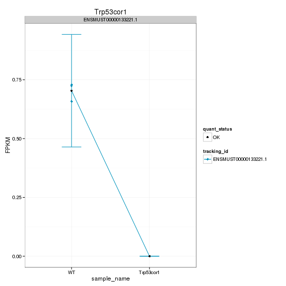 

Barplot of gene expression:

 

Barplot of isoform expression:

 


## LacZ expression

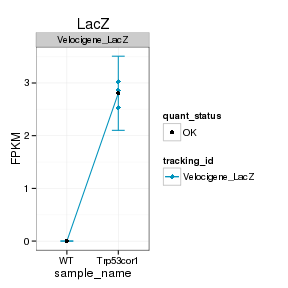  


## Digital Genotyping (LacZ vs Endogenous lncRNA and Sex)

Eif2s3y is a y-expressed gene, Xist is an x-expressed gene 
Expression plot (endogenous linc, lacZ, Y-expressed gene):

 

Expression heatmap:

 


### Track visualization 


```
## Error: dims [product 3] do not match the length of object [4]
```

 

# Differential Analysis

## Differential Genes 


There are 37 significantly differentially expressed genes. They are:

<!-- html table generated in R 3.0.2 by xtable 1.7-3 package -->
<!-- Wed Jul  2 01:07:47 2014 -->
<TABLE border=1>
<TR> <TH>  </TH> <TH> geneAnnot$gene_short_name </TH>  </TR>
  <TR> <TD align="right"> 1 </TD> <TD> Hspa8 </TD> </TR>
  <TR> <TD align="right"> 2 </TD> <TD> Ubb </TD> </TR>
  <TR> <TD align="right"> 3 </TD> <TD> Dusp6 </TD> </TR>
  <TR> <TD align="right"> 4 </TD> <TD> Pttg1 </TD> </TR>
  <TR> <TD align="right"> 5 </TD> <TD> Adi1 </TD> </TR>
  <TR> <TD align="right"> 6 </TD> <TD> Serpina3n </TD> </TR>
  <TR> <TD align="right"> 7 </TD> <TD> Fos </TD> </TR>
  <TR> <TD align="right"> 8 </TD> <TD> Arc </TD> </TR>
  <TR> <TD align="right"> 9 </TD> <TD> Nr4a1 </TD> </TR>
  <TR> <TD align="right"> 10 </TD> <TD> Glo1 </TD> </TR>
  <TR> <TD align="right"> 11 </TD> <TD> Xdh </TD> </TR>
  <TR> <TD align="right"> 12 </TD> <TD> Nr4a3 </TD> </TR>
  <TR> <TD align="right"> 13 </TD> <TD> Hddc3 </TD> </TR>
  <TR> <TD align="right"> 14 </TD> <TD> Cryab </TD> </TR>
  <TR> <TD align="right"> 15 </TD> <TD> Arhgap27 </TD> </TR>
  <TR> <TD align="right"> 16 </TD> <TD> Fam214a </TD> </TR>
  <TR> <TD align="right"> 17 </TD> <TD> Filip1 </TD> </TR>
  <TR> <TD align="right"> 18 </TD> <TD> Klf10 </TD> </TR>
  <TR> <TD align="right"> 19 </TD> <TD> Egr2 </TD> </TR>
  <TR> <TD align="right"> 20 </TD> <TD> Txnip </TD> </TR>
  <TR> <TD align="right"> 21 </TD> <TD> Egr1 </TD> </TR>
  <TR> <TD align="right"> 22 </TD> <TD> Akap12 </TD> </TR>
  <TR> <TD align="right"> 23 </TD> <TD> Atp5l </TD> </TR>
  <TR> <TD align="right"> 24 </TD> <TD> Maff </TD> </TR>
  <TR> <TD align="right"> 25 </TD> <TD> Gm9493 </TD> </TR>
  <TR> <TD align="right"> 26 </TD> <TD> Acp1 </TD> </TR>
  <TR> <TD align="right"> 27 </TD> <TD> Npas4 </TD> </TR>
  <TR> <TD align="right"> 28 </TD> <TD> Hbb-bs </TD> </TR>
  <TR> <TD align="right"> 29 </TD> <TD> Junb </TD> </TR>
  <TR> <TD align="right"> 30 </TD> <TD> Kdm5d </TD> </TR>
  <TR> <TD align="right"> 31 </TD> <TD> Tpm3-rs7 </TD> </TR>
  <TR> <TD align="right"> 32 </TD> <TD> Rpl34 </TD> </TR>
  <TR> <TD align="right"> 33 </TD> <TD> Ddx3y </TD> </TR>
  <TR> <TD align="right"> 34 </TD> <TD> Egr4 </TD> </TR>
  <TR> <TD align="right"> 35 </TD> <TD> Gm7292 </TD> </TR>
  <TR> <TD align="right"> 36 </TD> <TD> AA465934 </TD> </TR>
  <TR> <TD align="right"> 37 </TD> <TD> Gm26825 </TD> </TR>
   </TABLE>

### Matrix of gene significant differences between conditions

(skip for Brainmap wt-v-ko comparisons)

 

### Significant gene expression differences between conditions

Expression plot (genes):(turned off)


 

Significant genes with expression >50fpkm (any condition):(turned off)


An individual look at each of the highly expressed significantly differentially regulated genes:
(eval=false for first pass)


### Expression-level/significance relationship

Scatter plot of significant genes only:

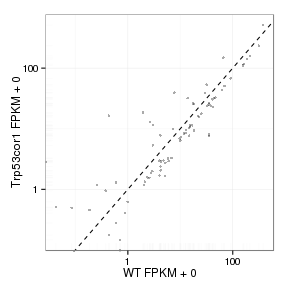 

Volcano Plot

 

Volcano plot with significant genes only:

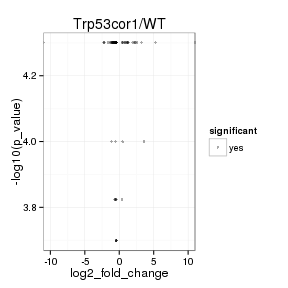 

FoldChange Heatmap

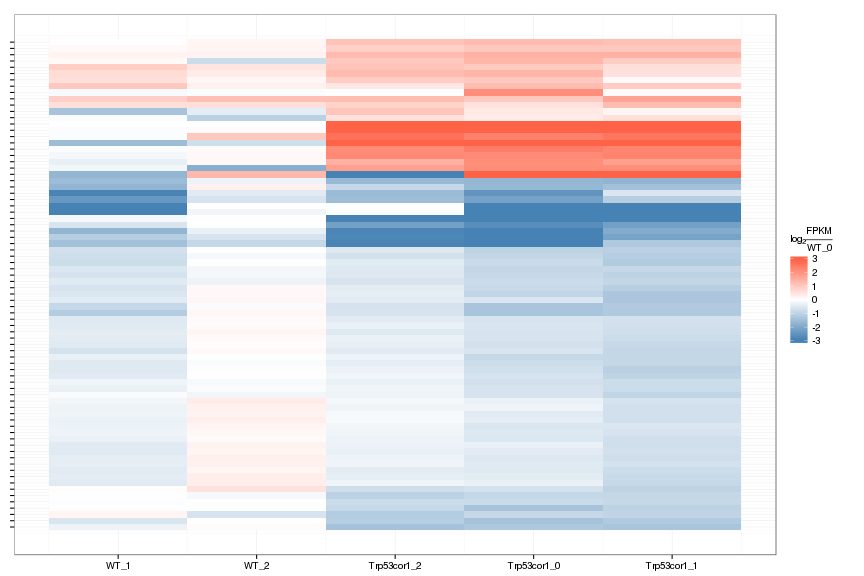 


## Differential Splicing

### Differential Isoforms between conditions

Per isoform difference between conditions:

 

These isoforms are:

[1] "no sig isoforms"

Gene-level DE isoform heatmap


```
## [1] "no sig isoforms"
```

Isoform foldchange heatmap by isoform:


```
## [1] "no sig isoforms"
```


### Differential Splicing between conditions

(eval false for first pass)

Per condition differences in isoforms (Does gene have diff piechart between conditions?)


These genes are:


Splicing heatmap by isoform:


Splicing heatmap by gene


The following are significantly differentially spliced genes (relative portion of isoform per condition): 


 


# Gene/Pathway Analysis

## GSEA

Enrichment and zscores are calculated based on expression in KO vs WT (fpkmKO/fpkmWT), so genes that are down regulated in KO are shown in blue, while upregulation is shown in red. 

KO/WT
Blue = down in KO
Red = Up in KO


Biocarta enrichment: 


```
## Error: `x' must have at least 2 rows and 2 columns
```

Biocarta zscore: 


```
## Error: incorrect number of dimensions
```

```
## Error: `x' must have at least 2 rows and 2 columns
```


Reactome enrichment: 

 


Reactome zscore: 

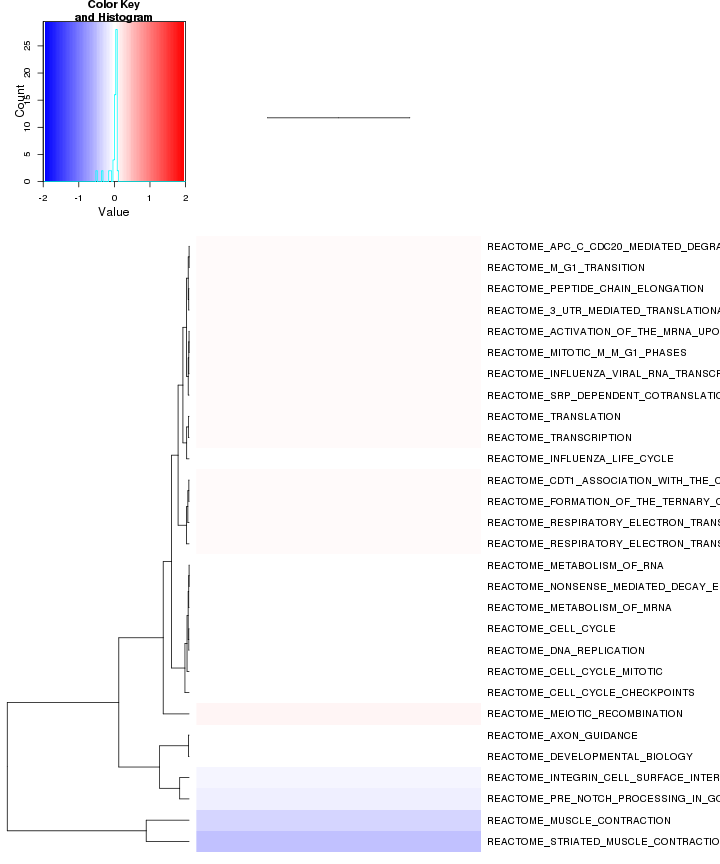 


Kegg enrichment: 

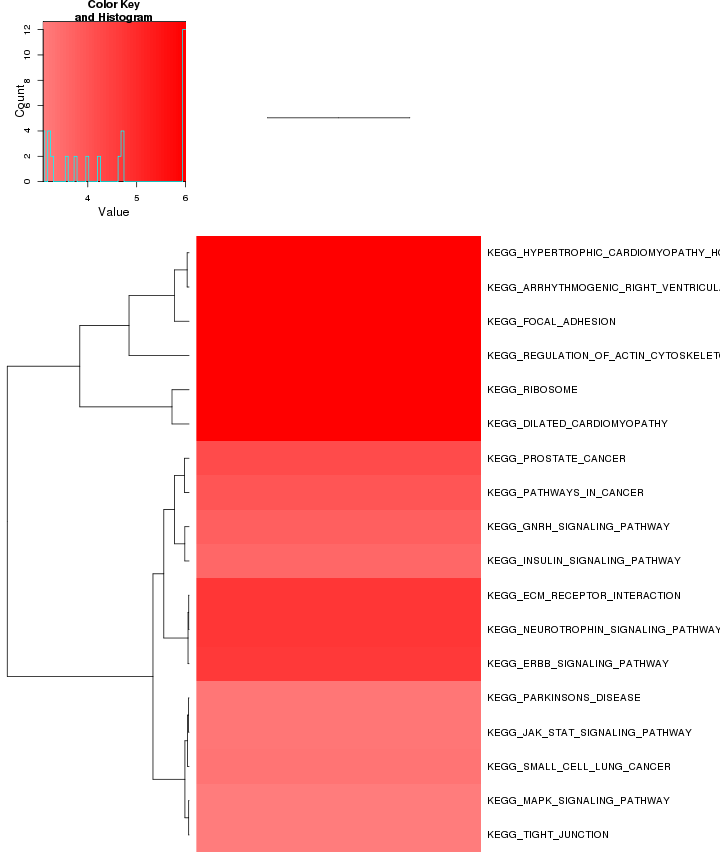 

Kegg zscore: 

 


## GO enrichment 
Cluster profiler used to call enichments of significantly differentially regulated genes that map to Entrez IDs. 


   

```
## Error: need finite 'xlim' values
```

 

```
## Error: need finite 'xlim' values
```

# Cis vs Trans (locally)

log2 Foldchange and test statistic are calculated with the ratio of fpkm(KO)/fpkm(WT), thus the test_stat is positive if a gene is higher in the KO and negative if a gene has lower expression in the KO


The pvalue for 0 genes significantly regulated in a region this size  is: 1 


