Haunt KO vs WT (Embryonic)
======================================


This file shows the wt-v-ko comparison for Haunt. 

Cuff overview:

```
## CuffSet instance with:
## 	 2 samples
## 	 26754 genes
## 	 77524 isoforms
## 	 0 TSS
## 	 23066 CDS
## 	 0 promoters
## 	 0 splicing
## 	 19954 relCDS
```


# QC

## Dispersion

Dispersion plot for genes in cuff:
(Overdispersion can lead to innacurate quants)

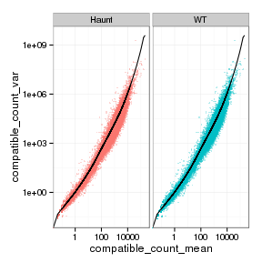 

## Cross-replicate variability (fpkmSCVplot)
Differences in CV 2 can result in lower numbers of differentially expressed genes due to a higher degree of variability between replicate fpkm estimates.

Genes:
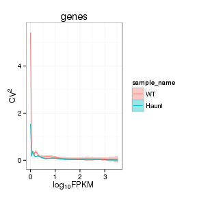 

Isoforms: 
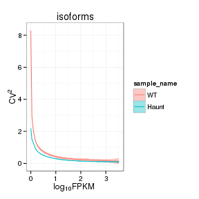 


## MvA plot

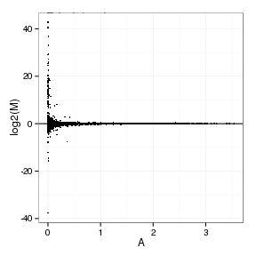 
   
### MvA plot counts

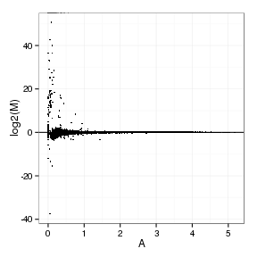 

## Scatterplot matrix

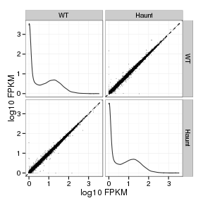 

## Distributions

### Boxplots

Boxplot (genes)

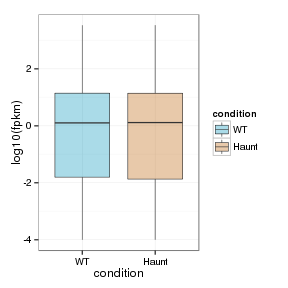 

Boxplot (genes, replicates)

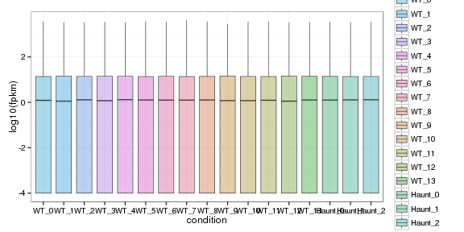 

Boxplot (isoforms)

 

Boxplot (isoforms, replicates)

 

### Density

Density (genes)

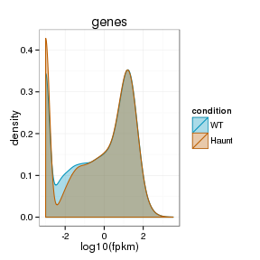 

Density (genes, replicates)

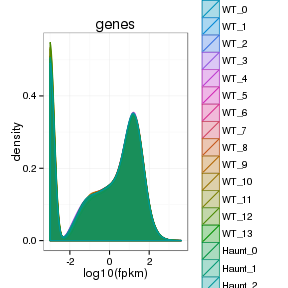 


## Clustering

### Replicate Clusters

 

```
## NULL
```

### PCA (genes)

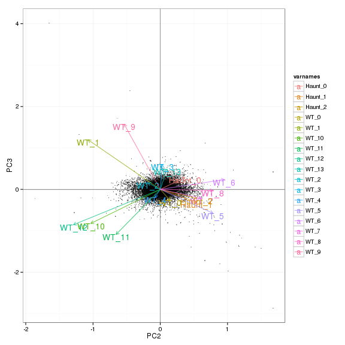 

### MDS (genes)

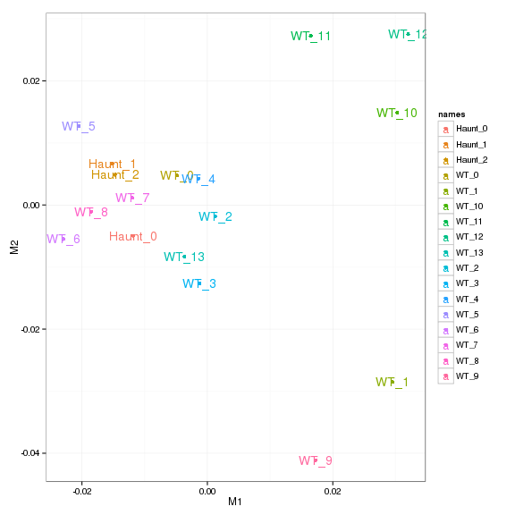 


# KO assessment

## Endogenous lncRNA expression

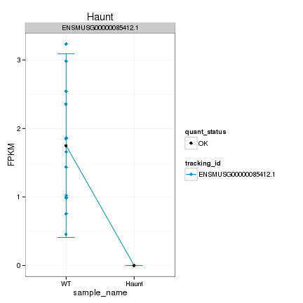 

Endogenous expression of Haunt isoforms:

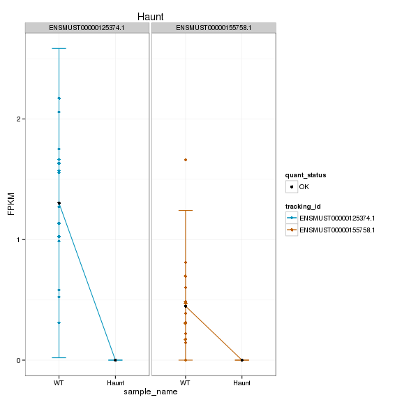 

Barplot of gene expression:

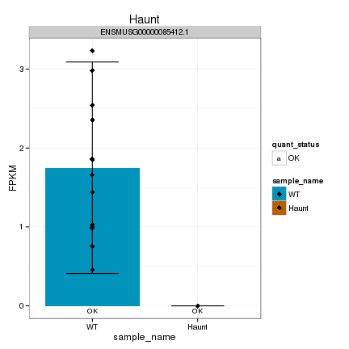 

Barplot of isoform expression:

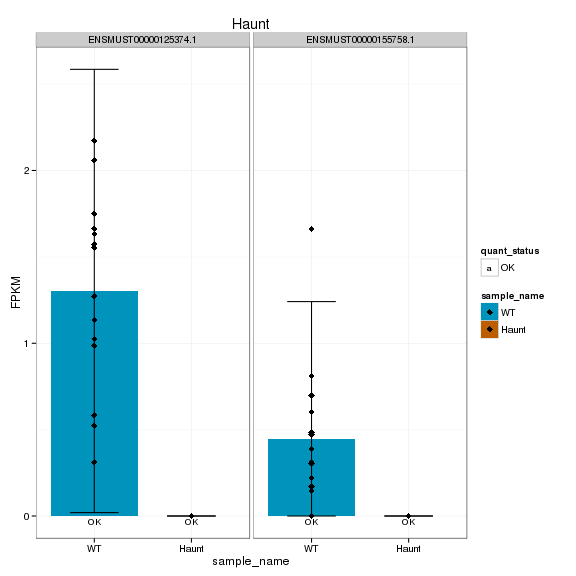 


## LacZ expression

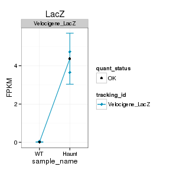 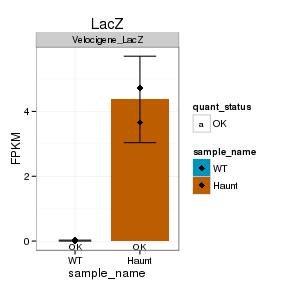 


## Digital Genotyping (LacZ vs Endogenous lncRNA and Sex)
Expression plot (endogenous linc, lacZ, Y-expressed gene):

 

Expression heatmap:

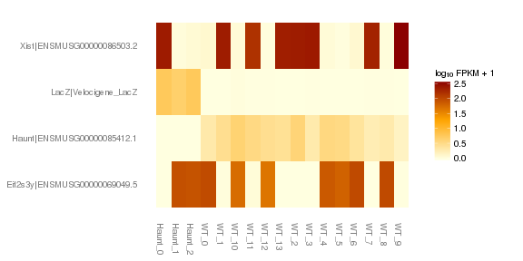 


### Track visualization 

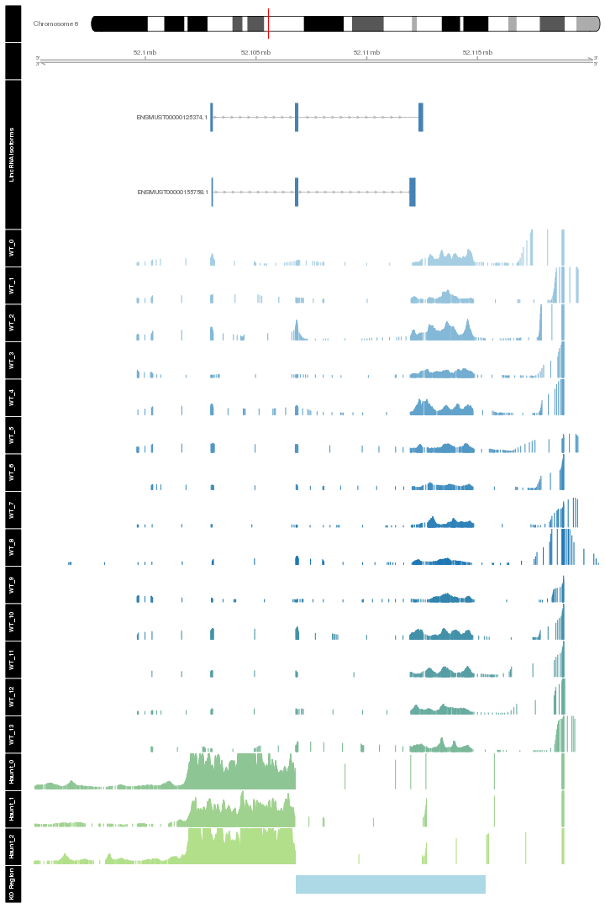 

# Differential Analysis

## Differential Genes 


There are 35 significantly differentially expressed genes. They are:

<!-- html table generated in R 3.0.2 by xtable 1.7-3 package -->
<!-- Thu Jun 26 02:48:54 2014 -->
<TABLE border=1>
<TR> <TH>  </TH> <TH> geneAnnot$gene_short_name </TH>  </TR>
  <TR> <TD align="right"> 1 </TD> <TD> Nkx2-1 </TD> </TR>
  <TR> <TD align="right"> 2 </TD> <TD> Rplp1 </TD> </TR>
  <TR> <TD align="right"> 3 </TD> <TD> Hspa8 </TD> </TR>
  <TR> <TD align="right"> 4 </TD> <TD> Tshz3 </TD> </TR>
  <TR> <TD align="right"> 5 </TD> <TD> Dlx2 </TD> </TR>
  <TR> <TD align="right"> 6 </TD> <TD> Clec3b </TD> </TR>
  <TR> <TD align="right"> 7 </TD> <TD> Lhx6 </TD> </TR>
  <TR> <TD align="right"> 8 </TD> <TD> Hsd3b6 </TD> </TR>
  <TR> <TD align="right"> 9 </TD> <TD> Dlx5 </TD> </TR>
  <TR> <TD align="right"> 10 </TD> <TD> Dera </TD> </TR>
  <TR> <TD align="right"> 11 </TD> <TD> Hddc3 </TD> </TR>
  <TR> <TD align="right"> 12 </TD> <TD> Mki67 </TD> </TR>
  <TR> <TD align="right"> 13 </TD> <TD> Cbl </TD> </TR>
  <TR> <TD align="right"> 14 </TD> <TD> Arx </TD> </TR>
  <TR> <TD align="right"> 15 </TD> <TD> Aox4 </TD> </TR>
  <TR> <TD align="right"> 16 </TD> <TD> Pcsk1n </TD> </TR>
  <TR> <TD align="right"> 17 </TD> <TD> Necab1 </TD> </TR>
  <TR> <TD align="right"> 18 </TD> <TD> Dnah7b </TD> </TR>
  <TR> <TD align="right"> 19 </TD> <TD> Tuba1c </TD> </TR>
  <TR> <TD align="right"> 20 </TD> <TD> Acp1 </TD> </TR>
  <TR> <TD align="right"> 21 </TD> <TD> Rpl29 </TD> </TR>
  <TR> <TD align="right"> 22 </TD> <TD> Creg2 </TD> </TR>
  <TR> <TD align="right"> 23 </TD> <TD> Hbb-y </TD> </TR>
  <TR> <TD align="right"> 24 </TD> <TD> Hbb-bh1 </TD> </TR>
  <TR> <TD align="right"> 25 </TD> <TD> Rnf26 </TD> </TR>
  <TR> <TD align="right"> 26 </TD> <TD> Aldh1a1 </TD> </TR>
  <TR> <TD align="right"> 27 </TD> <TD> Vsnl1 </TD> </TR>
  <TR> <TD align="right"> 28 </TD> <TD> Hba-x </TD> </TR>
  <TR> <TD align="right"> 29 </TD> <TD> Kdm5d </TD> </TR>
  <TR> <TD align="right"> 30 </TD> <TD> Rpl17 </TD> </TR>
  <TR> <TD align="right"> 31 </TD> <TD> Sox11 </TD> </TR>
  <TR> <TD align="right"> 32 </TD> <TD> Ddx3y </TD> </TR>
  <TR> <TD align="right"> 33 </TD> <TD> Gm9008 </TD> </TR>
  <TR> <TD align="right"> 34 </TD> <TD> Haunt </TD> </TR>
  <TR> <TD align="right"> 35 </TD> <TD> Lhx8 </TD> </TR>
   </TABLE>

### Matrix of gene significant differences between conditions

(skip for Brainmap wt-v-ko comparisons)

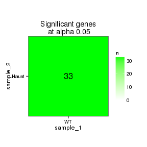 

### Significant gene expression differences between conditions

Expression plot (genes):(turned off)


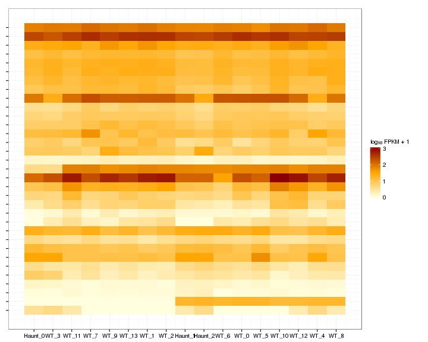 

Significant genes with expression >50fpkm (any condition):(turned off)


An individual look at each of the highly expressed significantly differentially regulated genes:
(eval=false for first pass)


### Expression-level/significance relationship

Scatter plot of significant genes only:

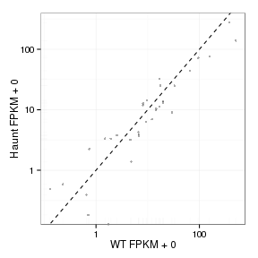 

Volcano Plot

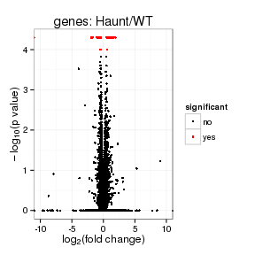 

Volcano plot with significant genes only:

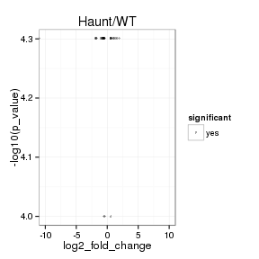 

FoldChange Heatmap

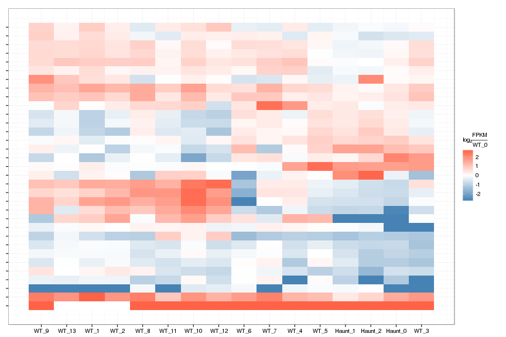 


## Differential Splicing

### Differential Isoforms between conditions

Per isoform difference between conditions:

 

These isoforms are:

[1] "no sig isoforms"

Gene-level DE isoform heatmap


```
## [1] "no sig isoforms"
```

Isoform foldchange heatmap by isoform:


```
## [1] "no sig isoforms"
```


### Differential Splicing between conditions

(eval false for first pass)

Per condition differences in isoforms (Does gene have diff piechart between conditions?)


These genes are:


Splicing heatmap by isoform:


Splicing heatmap by gene


The following are significantly differentially spliced genes (relative portion of isoform per condition): 


 


# Gene/Pathway Analysis

## GSEA


Biocarta enrichment: 

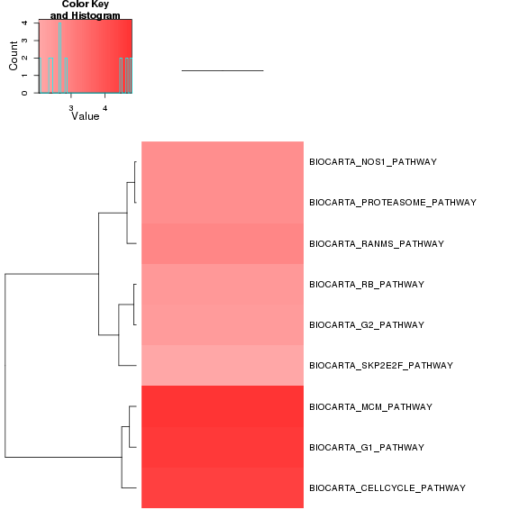 

biocarta zscore: 

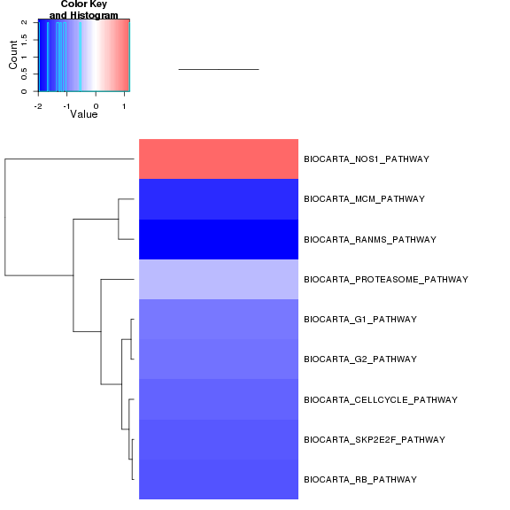 


Reactome enrichment: 

 


Reactome zscore: 

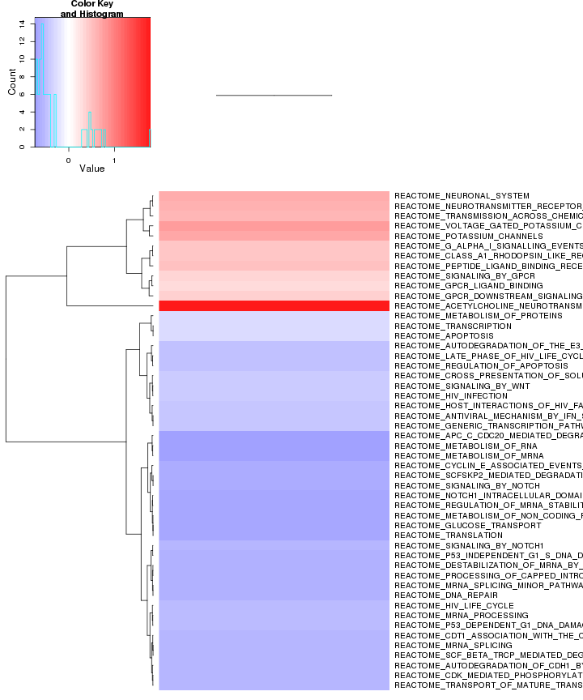 

## GO enrichment 
Cluster profiler used to call enichments of significantly differentially regulated genes that map to Entrez IDs. 


```
## [1] "ERROR: The estimated pi0 <= 0. Check that you have valid p-values or use another lambda method."
```

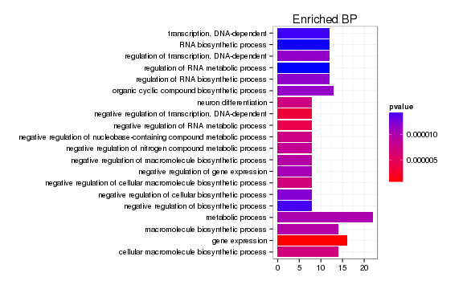 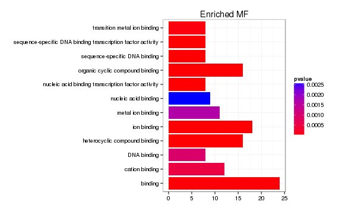 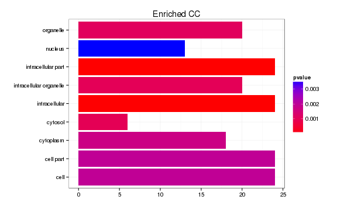 

```
## Error: need finite 'xlim' values
```

 

# Cis vs Trans (locally)


The pvalue for 1 genes significantly regulated in a region this size  is: 1 


```
## Error: missing value where TRUE/FALSE needed
```

# Notes

## Samples used are:
<!-- html table generated in R 3.0.2 by xtable 1.7-3 package -->
<!-- Thu Jun 26 03:12:20 2014 -->
<TABLE border=1>
<TR> <TH>  </TH> <TH> 10 </TH>  </TR>
  <TR> <TD align="right"> 1 </TD> <TD> JR753 </TD> </TR>
  <TR> <TD align="right"> 2 </TD> <TD> JR750 </TD> </TR>
  <TR> <TD align="right"> 3 </TD> <TD> JR771 </TD> </TR>
  <TR> <TD align="right"> 4 </TD> <TD> JR755 </TD> </TR>
  <TR> <TD align="right"> 5 </TD> <TD> JR811 </TD> </TR>
  <TR> <TD align="right"> 6 </TD> <TD> JR768 </TD> </TR>
  <TR> <TD align="right"> 7 </TD> <TD> JR761 </TD> </TR>
  <TR> <TD align="right"> 8 </TD> <TD> JR815 </TD> </TR>
  <TR> <TD align="right"> 9 </TD> <TD> JR789 </TD> </TR>
  <TR> <TD align="right"> 10 </TD> <TD> JR748 </TD> </TR>
  <TR> <TD align="right"> 11 </TD> <TD> JR716 </TD> </TR>
  <TR> <TD align="right"> 12 </TD> <TD> JR717 </TD> </TR>
  <TR> <TD align="right"> 13 </TD> <TD> JR719 </TD> </TR>
  <TR> <TD align="right"> 14 </TD> <TD> JR756 </TD> </TR>
  <TR> <TD align="right"> 15 </TD> <TD> JR754 </TD> </TR>
  <TR> <TD align="right"> 16 </TD> <TD> JR767 </TD> </TR>
  <TR> <TD align="right"> 17 </TD> <TD> JR759 </TD> </TR>
   </TABLE>

## Replicates
<!-- html table generated in R 3.0.2 by xtable 1.7-3 package -->
<!-- Thu Jun 26 03:12:21 2014 -->
<TABLE border=1>
<TR> <TH>  </TH> <TH> file </TH> <TH> sample_name </TH> <TH> replicate </TH> <TH> rep_name </TH> <TH> total_mass </TH> <TH> norm_mass </TH> <TH> internal_scale </TH> <TH> external_scale </TH>  </TR>
  <TR> <TD align="right"> 1 </TD> <TD> /n/rinn_data1/seq/lgoff/Projects/BrainMap/data/quants/JR753/abundances.cxb </TD> <TD> WT </TD> <TD align="right">   0 </TD> <TD> WT_0 </TD> <TD align="right"> 39343800.00 </TD> <TD align="right"> 32564000.00 </TD> <TD align="right"> 1.25 </TD> <TD align="right"> 1.00 </TD> </TR>
  <TR> <TD align="right"> 2 </TD> <TD> /n/rinn_data1/seq/lgoff/Projects/BrainMap/data/quants/JR750/abundances.cxb </TD> <TD> WT </TD> <TD align="right">   1 </TD> <TD> WT_1 </TD> <TD align="right"> 36041100.00 </TD> <TD align="right"> 32564000.00 </TD> <TD align="right"> 1.09 </TD> <TD align="right"> 1.00 </TD> </TR>
  <TR> <TD align="right"> 3 </TD> <TD> /n/rinn_data1/seq/lgoff/Projects/BrainMap/data/quants/JR771/abundances.cxb </TD> <TD> WT </TD> <TD align="right">   2 </TD> <TD> WT_2 </TD> <TD align="right"> 38877000.00 </TD> <TD align="right"> 32564000.00 </TD> <TD align="right"> 1.22 </TD> <TD align="right"> 1.00 </TD> </TR>
  <TR> <TD align="right"> 4 </TD> <TD> /n/rinn_data1/seq/lgoff/Projects/BrainMap/data/quants/JR755/abundances.cxb </TD> <TD> WT </TD> <TD align="right">   3 </TD> <TD> WT_3 </TD> <TD align="right"> 41822800.00 </TD> <TD align="right"> 32564000.00 </TD> <TD align="right"> 1.27 </TD> <TD align="right"> 1.00 </TD> </TR>
  <TR> <TD align="right"> 5 </TD> <TD> /n/rinn_data1/seq/lgoff/Projects/BrainMap/data/quants/JR811/abundances.cxb </TD> <TD> WT </TD> <TD align="right">   4 </TD> <TD> WT_4 </TD> <TD align="right"> 38186700.00 </TD> <TD align="right"> 32564000.00 </TD> <TD align="right"> 1.19 </TD> <TD align="right"> 1.00 </TD> </TR>
  <TR> <TD align="right"> 6 </TD> <TD> /n/rinn_data1/seq/lgoff/Projects/BrainMap/data/quants/JR768/abundances.cxb </TD> <TD> WT </TD> <TD align="right">   5 </TD> <TD> WT_5 </TD> <TD align="right"> 28382500.00 </TD> <TD align="right"> 32564000.00 </TD> <TD align="right"> 0.88 </TD> <TD align="right"> 1.00 </TD> </TR>
  <TR> <TD align="right"> 7 </TD> <TD> /n/rinn_data1/seq/lgoff/Projects/BrainMap/data/quants/JR761/abundances.cxb </TD> <TD> WT </TD> <TD align="right">   6 </TD> <TD> WT_6 </TD> <TD align="right"> 31711800.00 </TD> <TD align="right"> 32564000.00 </TD> <TD align="right"> 0.96 </TD> <TD align="right"> 1.00 </TD> </TR>
  <TR> <TD align="right"> 8 </TD> <TD> /n/rinn_data1/seq/lgoff/Projects/BrainMap/data/quants/JR815/abundances.cxb </TD> <TD> WT </TD> <TD align="right">   7 </TD> <TD> WT_7 </TD> <TD align="right"> 29744300.00 </TD> <TD align="right"> 32564000.00 </TD> <TD align="right"> 0.91 </TD> <TD align="right"> 1.00 </TD> </TR>
  <TR> <TD align="right"> 9 </TD> <TD> /n/rinn_data1/seq/lgoff/Projects/BrainMap/data/quants/JR789/abundances.cxb </TD> <TD> WT </TD> <TD align="right">   8 </TD> <TD> WT_8 </TD> <TD align="right"> 27686600.00 </TD> <TD align="right"> 32564000.00 </TD> <TD align="right"> 0.85 </TD> <TD align="right"> 1.00 </TD> </TR>
  <TR> <TD align="right"> 10 </TD> <TD> /n/rinn_data1/seq/lgoff/Projects/BrainMap/data/quants/JR748/abundances.cxb </TD> <TD> WT </TD> <TD align="right">   9 </TD> <TD> WT_9 </TD> <TD align="right"> 32374600.00 </TD> <TD align="right"> 32564000.00 </TD> <TD align="right"> 0.95 </TD> <TD align="right"> 1.00 </TD> </TR>
  <TR> <TD align="right"> 11 </TD> <TD> /n/rinn_data1/seq/lgoff/Projects/BrainMap/data/quants/JR716/abundances.cxb </TD> <TD> WT </TD> <TD align="right">  10 </TD> <TD> WT_10 </TD> <TD align="right"> 26148700.00 </TD> <TD align="right"> 32564000.00 </TD> <TD align="right"> 0.80 </TD> <TD align="right"> 1.00 </TD> </TR>
  <TR> <TD align="right"> 12 </TD> <TD> /n/rinn_data1/seq/lgoff/Projects/BrainMap/data/quants/JR717/abundances.cxb </TD> <TD> WT </TD> <TD align="right">  11 </TD> <TD> WT_11 </TD> <TD align="right"> 25571500.00 </TD> <TD align="right"> 32564000.00 </TD> <TD align="right"> 0.79 </TD> <TD align="right"> 1.00 </TD> </TR>
  <TR> <TD align="right"> 13 </TD> <TD> /n/rinn_data1/seq/lgoff/Projects/BrainMap/data/quants/JR719/abundances.cxb </TD> <TD> WT </TD> <TD align="right">  12 </TD> <TD> WT_12 </TD> <TD align="right"> 22702200.00 </TD> <TD align="right"> 32564000.00 </TD> <TD align="right"> 0.68 </TD> <TD align="right"> 1.00 </TD> </TR>
  <TR> <TD align="right"> 14 </TD> <TD> /n/rinn_data1/seq/lgoff/Projects/BrainMap/data/quants/JR756/abundances.cxb </TD> <TD> WT </TD> <TD align="right">  13 </TD> <TD> WT_13 </TD> <TD align="right"> 38957200.00 </TD> <TD align="right"> 32564000.00 </TD> <TD align="right"> 1.20 </TD> <TD align="right"> 1.00 </TD> </TR>
  <TR> <TD align="right"> 15 </TD> <TD> /n/rinn_data1/seq/lgoff/Projects/BrainMap/data/quants/JR754/abundances.cxb </TD> <TD> Haunt </TD> <TD align="right">   0 </TD> <TD> Haunt_0 </TD> <TD align="right"> 34283600.00 </TD> <TD align="right"> 32564000.00 </TD> <TD align="right"> 1.05 </TD> <TD align="right"> 1.00 </TD> </TR>
  <TR> <TD align="right"> 16 </TD> <TD> /n/rinn_data1/seq/lgoff/Projects/BrainMap/data/quants/JR767/abundances.cxb </TD> <TD> Haunt </TD> <TD align="right">   1 </TD> <TD> Haunt_1 </TD> <TD align="right"> 30972800.00 </TD> <TD align="right"> 32564000.00 </TD> <TD align="right"> 0.96 </TD> <TD align="right"> 1.00 </TD> </TR>
  <TR> <TD align="right"> 17 </TD> <TD> /n/rinn_data1/seq/lgoff/Projects/BrainMap/data/quants/JR759/abundances.cxb </TD> <TD> Haunt </TD> <TD align="right">   2 </TD> <TD> Haunt_2 </TD> <TD align="right"> 40193200.00 </TD> <TD align="right"> 32564000.00 </TD> <TD align="right"> 1.25 </TD> <TD align="right"> 1.00 </TD> </TR>
   </TABLE>

## Session Info

```
## R version 3.0.2 (2013-09-25)
## Platform: x86_64-unknown-linux-gnu (64-bit)
## 
## locale:
##  [1] LC_CTYPE=en_US.UTF-8       LC_NUMERIC=C              
##  [3] LC_TIME=en_US.UTF-8        LC_COLLATE=en_US.UTF-8    
##  [5] LC_MONETARY=en_US.UTF-8    LC_MESSAGES=en_US.UTF-8   
##  [7] LC_PAPER=en_US.UTF-8       LC_NAME=C                 
##  [9] LC_ADDRESS=C               LC_TELEPHONE=C            
## [11] LC_MEASUREMENT=en_US.UTF-8 LC_IDENTIFICATION=C       
## 
## attached base packages:
## [1] grid      parallel  stats     graphics  grDevices utils     datasets 
## [8] methods   base     
## 
## other attached packages:
##  [1] plyr_1.8.1                         
##  [2] stringr_0.6.2                      
##  [3] seqbias_1.10.0                     
##  [4] BSgenome.Mmusculus.UCSC.mm10_1.3.19
##  [5] BSgenome_1.30.0                    
##  [6] Biostrings_2.30.1                  
##  [7] GO.db_2.10.1                       
##  [8] org.Mm.eg.db_2.10.1                
##  [9] clusterProfiler_1.13.1             
## [10] DOSE_2.0.0                         
## [11] ReactomePA_1.6.1                   
## [12] AnnotationDbi_1.24.0               
## [13] Biobase_2.22.0                     
## [14] RMySQL_0.9-3                       
## [15] mgcv_1.7-29                        
## [16] nlme_3.1-117                       
## [17] RColorBrewer_1.0-5                 
## [18] gridExtra_0.9.1                    
## [19] gtable_0.1.2                       
## [20] marray_1.40.0                      
## [21] gplots_2.13.0                      
## [22] GSA_1.03                           
## [23] limma_3.18.13                      
## [24] xtable_1.7-3                       
## [25] cummeRbund_2.7.2                   
## [26] Gviz_1.6.0                         
## [27] rtracklayer_1.22.7                 
## [28] GenomicRanges_1.14.4               
## [29] XVector_0.2.0                      
## [30] IRanges_1.20.7                     
## [31] fastcluster_1.1.13                 
## [32] reshape2_1.4                       
## [33] ggplot2_1.0.0                      
## [34] RSQLite_0.11.4                     
## [35] DBI_0.2-7                          
## [36] BiocGenerics_0.8.0                 
## [37] knitr_1.6                          
## 
## loaded via a namespace (and not attached):
##  [1] biomaRt_2.18.0         biovizBase_1.10.8      bitops_1.0-6          
##  [4] caTools_1.17           cluster_1.15.2         colorspace_1.2-4      
##  [7] dichromat_2.0-0        digest_0.6.4           DO.db_2.7             
## [10] evaluate_0.5.5         formatR_0.10           Formula_1.1-1         
## [13] gdata_2.13.3           GenomicFeatures_1.14.5 GOSemSim_1.20.3       
## [16] graph_1.40.1           graphite_1.8.1         gtools_3.4.1          
## [19] Hmisc_3.14-4           igraph_0.7.1           KEGG.db_2.10.1        
## [22] KernSmooth_2.23-12     labeling_0.2           lattice_0.20-29       
## [25] latticeExtra_0.6-26    markdown_0.7           MASS_7.3-33           
## [28] Matrix_1.1-3           mime_0.1.1             munsell_0.4.2         
## [31] org.Hs.eg.db_2.10.1    proto_0.3-10           qvalue_1.36.0         
## [34] Rcpp_0.11.1            RCurl_1.95-4.1         reactome.db_1.46.1    
## [37] Rsamtools_1.14.3       scales_0.2.4           splines_3.0.2         
## [40] stats4_3.0.2           survival_2.37-7        tcltk_3.0.2           
## [43] tools_3.0.2            XML_3.98-1.1           zlibbioc_1.8.0
```

## Run Info

```
##           param
## 1      cmd_line
## 2       version
## 3  SVN_revision
## 4 boost_version
## 5        genome
##                                                                                                                                                                                                                                                                                                                                                                                                                                                                                                                                                                                                                                                                                                                                                                                                                                                                                                                                                                                                                                                                                                                                                                                                                                                                                                                                                                                                                                                                                                                                       value
## 1 cuffdiff -p 10 -L WT,Haunt -o /n/rinn_data1/seq/lgoff/Projects/BrainMap/data/diffs/Haunt_vs_WT_Embryonic /n/rinn_data1/seq/lgoff/Projects/BrainMap/data/annotation/mm10_gencode_vM2_with_lncRNAs_and_LacZ.gtf /n/rinn_data1/seq/lgoff/Projects/BrainMap/data/quants/JR753/abundances.cxb,/n/rinn_data1/seq/lgoff/Projects/BrainMap/data/quants/JR750/abundances.cxb,/n/rinn_data1/seq/lgoff/Projects/BrainMap/data/quants/JR771/abundances.cxb,/n/rinn_data1/seq/lgoff/Projects/BrainMap/data/quants/JR755/abundances.cxb,/n/rinn_data1/seq/lgoff/Projects/BrainMap/data/quants/JR811/abundances.cxb,/n/rinn_data1/seq/lgoff/Projects/BrainMap/data/quants/JR768/abundances.cxb,/n/rinn_data1/seq/lgoff/Projects/BrainMap/data/quants/JR761/abundances.cxb,/n/rinn_data1/seq/lgoff/Projects/BrainMap/data/quants/JR815/abundances.cxb,/n/rinn_data1/seq/lgoff/Projects/BrainMap/data/quants/JR789/abundances.cxb,/n/rinn_data1/seq/lgoff/Projects/BrainMap/data/quants/JR748/abundances.cxb,/n/rinn_data1/seq/lgoff/Projects/BrainMap/data/quants/JR716/abundances.cxb,/n/rinn_data1/seq/lgoff/Projects/BrainMap/data/quants/JR717/abundances.cxb,/n/rinn_data1/seq/lgoff/Projects/BrainMap/data/quants/JR719/abundances.cxb,/n/rinn_data1/seq/lgoff/Projects/BrainMap/data/quants/JR756/abundances.cxb /n/rinn_data1/seq/lgoff/Projects/BrainMap/data/quants/JR754/abundances.cxb,/n/rinn_data1/seq/lgoff/Projects/BrainMap/data/quants/JR767/abundances.cxb,/n/rinn_data1/seq/lgoff/Projects/BrainMap/data/quants/JR759/abundances.cxb 
## 2                                                                                                                                                                                                                                                                                                                                                                                                                                                                                                                                                                                                                                                                                                                                                                                                                                                                                                                                                                                                                                                                                                                                                                                                                                                                                                                                                                                                                                                                                                                                     2.2.1
## 3                                                                                                                                                                                                                                                                                                                                                                                                                                                                                                                                                                                                                                                                                                                                                                                                                                                                                                                                                                                                                                                                                                                                                                                                                                                                                                                                                                                                                                                                                                                                      4237
## 4                                                                                                                                                                                                                                                                                                                                                                                                                                                                                                                                                                                                                                                                                                                                                                                                                                                                                                                                                                                                                                                                                                                                                                                                                                                                                                                                                                                                                                                                                                                                    104700
## 5                                                                                                                                                                                                                                                                                                                                                                                                                                                                                                                                                                                                                                                                                                                                                                                                                                                                                                                                                                                                                                                                                                                                                                                                                                                                                                                                                                                                                                                                                                                                      mm10
```


