Kantr KO vs WT (Embryonic)
======================================


This file shows the wt-v-ko comparison for Kantr. 

Cuff overview:


```
## CuffSet instance with:
## 	 2 samples
## 	 26754 genes
## 	 77524 isoforms
## 	 0 TSS
## 	 23066 CDS
## 	 0 promoters
## 	 0 splicing
## 	 19954 relCDS
```

# QC

## Dispersion

Dispersion plot for genes in cuff:
(Overdispersion can lead to innacurate quants)

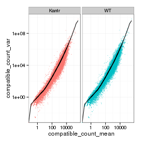 

## Cross-replicate variability (fpkmSCVplot)
Differences in CV 2 can result in lower numbers of differentially expressed genes due to a higher degree of variability between replicate fpkm estimates.

Genes:

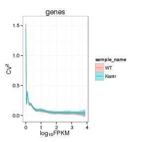 

Isoforms: 

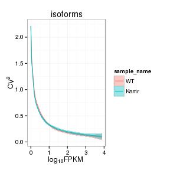 


## MvA plot

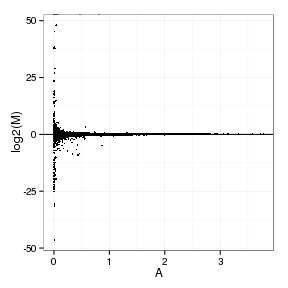 
   
### MvA plot counts

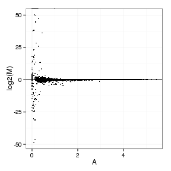 

## Scatterplot matrix

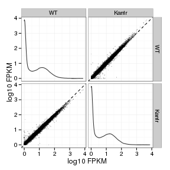 

## Distributions

### Boxplots

Boxplot (genes)

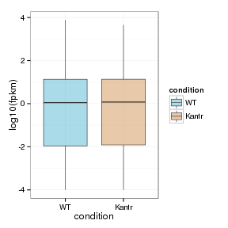 

Boxplot (genes, replicates)

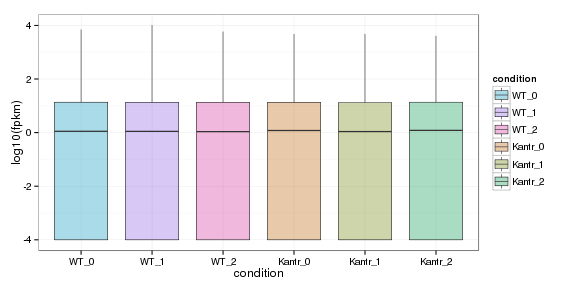 

Boxplot (isoforms)

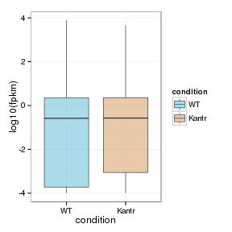 

Boxplot (isoforms, replicates)

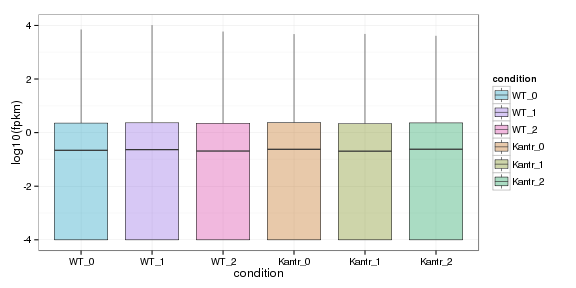 

### Density

Density (genes)

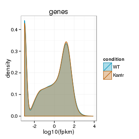 

Density (genes, replicates)

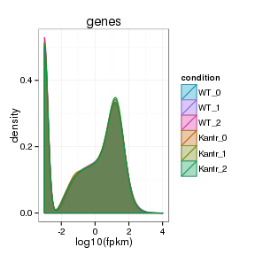 


## Clustering

### Replicate Clusters

 

```
## NULL
```

### PCA (genes)

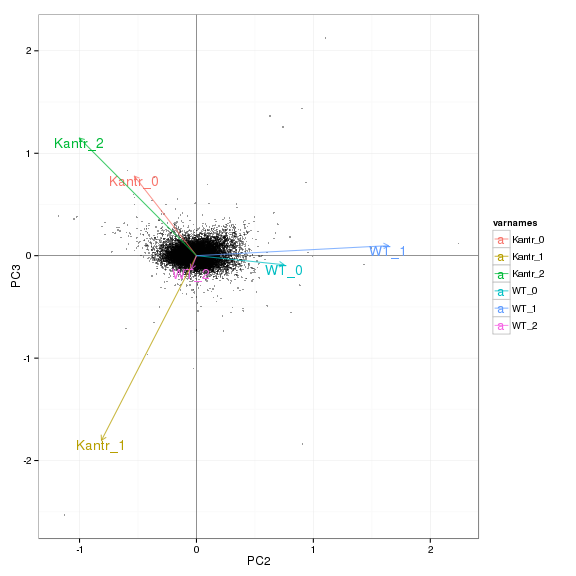 

### MDS (genes)

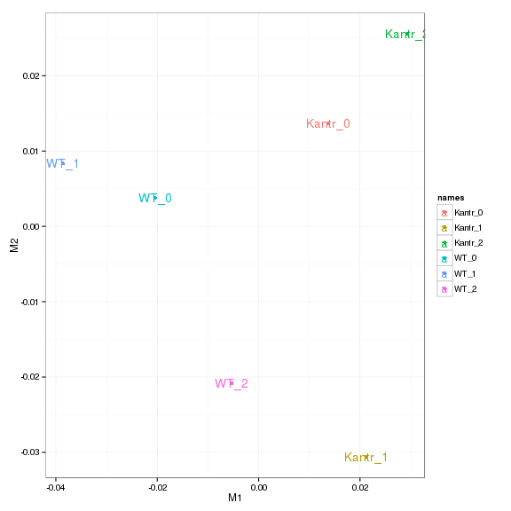 


# KO assessment

## Endogenous lncRNA expression

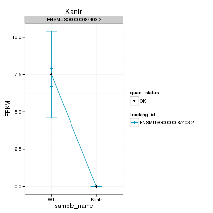 

Endogenous expression of Kantr isoforms:

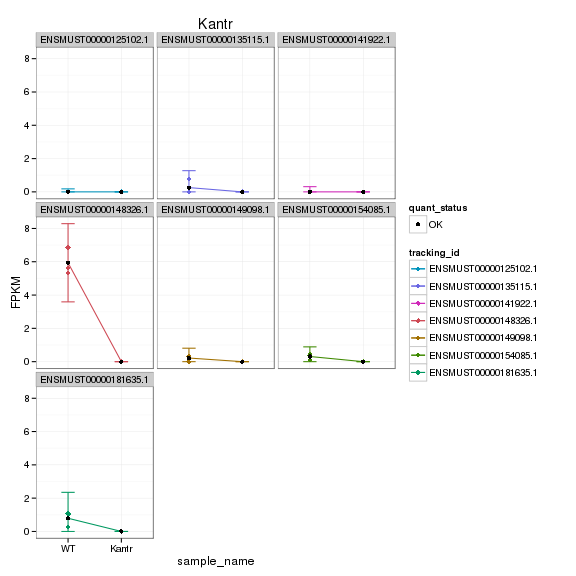 

Barplot of gene expression:

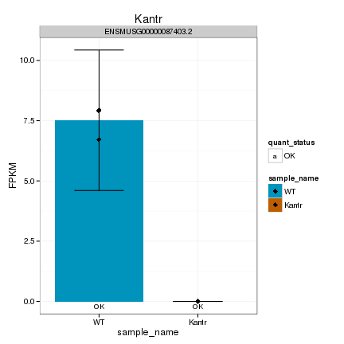 

Barplot of isoform expression:

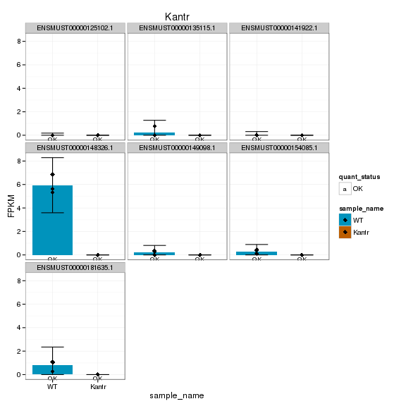 


## LacZ expression

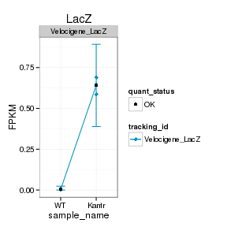 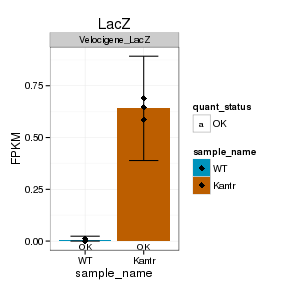 


## Digital Genotyping (LacZ vs Endogenous lncRNA and Sex)

Eif2s3y is a y-expressed gene, Xist is an x-expressed gene 
Expression plot (endogenous linc, lacZ, Y-expressed gene):

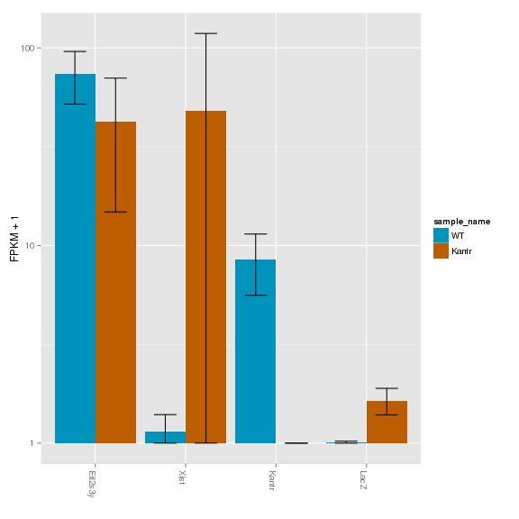 

Expression heatmap:

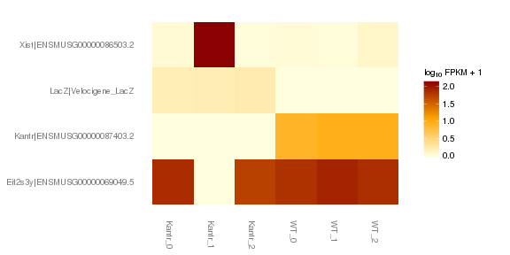 


### Track visualization 

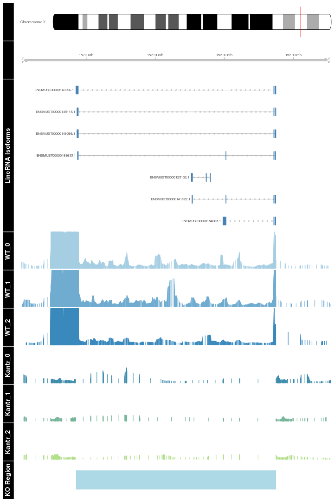 

# Differential Analysis

## Differential Genes 


There are 766 significantly differentially expressed genes. They are:

<!-- html table generated in R 3.0.2 by xtable 1.7-3 package -->
<!-- Tue Jul 15 18:22:06 2014 -->
<TABLE border=1>
<TR> <TH>  </TH> <TH> geneAnnot$gene_short_name </TH>  </TR>
  <TR> <TD align="right"> 1 </TD> <TD> H19 </TD> </TR>
  <TR> <TD align="right"> 2 </TD> <TD> Tbx2 </TD> </TR>
  <TR> <TD align="right"> 3 </TD> <TD> Ngfr </TD> </TR>
  <TR> <TD align="right"> 4 </TD> <TD> Glra1 </TD> </TR>
  <TR> <TD align="right"> 5 </TD> <TD> Hddc2 </TD> </TR>
  <TR> <TD align="right"> 6 </TD> <TD> Cdh1 </TD> </TR>
  <TR> <TD align="right"> 7 </TD> <TD> Mcts1 </TD> </TR>
  <TR> <TD align="right"> 8 </TD> <TD> Itga5 </TD> </TR>
  <TR> <TD align="right"> 9 </TD> <TD> Gabra2 </TD> </TR>
  <TR> <TD align="right"> 10 </TD> <TD> Col6a1 </TD> </TR>
  <TR> <TD align="right"> 11 </TD> <TD> Snrnp27 </TD> </TR>
  <TR> <TD align="right"> 12 </TD> <TD> Gabrg1 </TD> </TR>
  <TR> <TD align="right"> 13 </TD> <TD> Col18a1 </TD> </TR>
  <TR> <TD align="right"> 14 </TD> <TD> Col1a1 </TD> </TR>
  <TR> <TD align="right"> 15 </TD> <TD> Eef1e1 </TD> </TR>
  <TR> <TD align="right"> 16 </TD> <TD> Sept7 </TD> </TR>
  <TR> <TD align="right"> 17 </TD> <TD> Use1 </TD> </TR>
  <TR> <TD align="right"> 18 </TD> <TD> Hltf </TD> </TR>
  <TR> <TD align="right"> 19 </TD> <TD> Zfp40 </TD> </TR>
  <TR> <TD align="right"> 20 </TD> <TD> Shh </TD> </TR>
  <TR> <TD align="right"> 21 </TD> <TD> Lamb1 </TD> </TR>
  <TR> <TD align="right"> 22 </TD> <TD> Fcgrt </TD> </TR>
  <TR> <TD align="right"> 23 </TD> <TD> Bicd1 </TD> </TR>
  <TR> <TD align="right"> 24 </TD> <TD> Calb2 </TD> </TR>
  <TR> <TD align="right"> 25 </TD> <TD> Zfp81 </TD> </TR>
  <TR> <TD align="right"> 26 </TD> <TD> Ptrf </TD> </TR>
  <TR> <TD align="right"> 27 </TD> <TD> Pax2 </TD> </TR>
  <TR> <TD align="right"> 28 </TD> <TD> Sst </TD> </TR>
  <TR> <TD align="right"> 29 </TD> <TD> Col26a1 </TD> </TR>
  <TR> <TD align="right"> 30 </TD> <TD> Aqp1 </TD> </TR>
  <TR> <TD align="right"> 31 </TD> <TD> Tmem242 </TD> </TR>
  <TR> <TD align="right"> 32 </TD> <TD> Wisp1 </TD> </TR>
  <TR> <TD align="right"> 33 </TD> <TD> Polr2a </TD> </TR>
  <TR> <TD align="right"> 34 </TD> <TD> Corin </TD> </TR>
  <TR> <TD align="right"> 35 </TD> <TD> Nid1 </TD> </TR>
  <TR> <TD align="right"> 36 </TD> <TD> Evx1 </TD> </TR>
  <TR> <TD align="right"> 37 </TD> <TD> Tep1 </TD> </TR>
  <TR> <TD align="right"> 38 </TD> <TD> Fbln1 </TD> </TR>
  <TR> <TD align="right"> 39 </TD> <TD> Nphs1 </TD> </TR>
  <TR> <TD align="right"> 40 </TD> <TD> Acot13 </TD> </TR>
  <TR> <TD align="right"> 41 </TD> <TD> Gabrb2 </TD> </TR>
  <TR> <TD align="right"> 42 </TD> <TD> Khsrp </TD> </TR>
  <TR> <TD align="right"> 43 </TD> <TD> Dio2 </TD> </TR>
  <TR> <TD align="right"> 44 </TD> <TD> 0610009B22Rik </TD> </TR>
  <TR> <TD align="right"> 45 </TD> <TD> Zmiz1 </TD> </TR>
  <TR> <TD align="right"> 46 </TD> <TD> Arid1a </TD> </TR>
  <TR> <TD align="right"> 47 </TD> <TD> Rplp1 </TD> </TR>
  <TR> <TD align="right"> 48 </TD> <TD> Snrpb2 </TD> </TR>
  <TR> <TD align="right"> 49 </TD> <TD> Bmp7 </TD> </TR>
  <TR> <TD align="right"> 50 </TD> <TD> Sdhb </TD> </TR>
  <TR> <TD align="right"> 51 </TD> <TD> Slc38a3 </TD> </TR>
  <TR> <TD align="right"> 52 </TD> <TD> Mrpl52 </TD> </TR>
  <TR> <TD align="right"> 53 </TD> <TD> Ebf3 </TD> </TR>
  <TR> <TD align="right"> 54 </TD> <TD> Gabra1 </TD> </TR>
  <TR> <TD align="right"> 55 </TD> <TD> Scarf2 </TD> </TR>
  <TR> <TD align="right"> 56 </TD> <TD> Rpa3 </TD> </TR>
  <TR> <TD align="right"> 57 </TD> <TD> Phox2b </TD> </TR>
  <TR> <TD align="right"> 58 </TD> <TD> Rps5 </TD> </TR>
  <TR> <TD align="right"> 59 </TD> <TD> Slc41a1 </TD> </TR>
  <TR> <TD align="right"> 60 </TD> <TD> Aldh1a2 </TD> </TR>
  <TR> <TD align="right"> 61 </TD> <TD> Tctex1d2 </TD> </TR>
  <TR> <TD align="right"> 62 </TD> <TD> Cacybp </TD> </TR>
  <TR> <TD align="right"> 63 </TD> <TD> Ndufa2 </TD> </TR>
  <TR> <TD align="right"> 64 </TD> <TD> Cox6c </TD> </TR>
  <TR> <TD align="right"> 65 </TD> <TD> Srp19 </TD> </TR>
  <TR> <TD align="right"> 66 </TD> <TD> Hoxa2 </TD> </TR>
  <TR> <TD align="right"> 67 </TD> <TD> Gata2 </TD> </TR>
  <TR> <TD align="right"> 68 </TD> <TD> Ptgds </TD> </TR>
  <TR> <TD align="right"> 69 </TD> <TD> Psma2 </TD> </TR>
  <TR> <TD align="right"> 70 </TD> <TD> Mrpl32 </TD> </TR>
  <TR> <TD align="right"> 71 </TD> <TD> Capza2 </TD> </TR>
  <TR> <TD align="right"> 72 </TD> <TD> Lcorl </TD> </TR>
  <TR> <TD align="right"> 73 </TD> <TD> Lbp </TD> </TR>
  <TR> <TD align="right"> 74 </TD> <TD> Atp5e </TD> </TR>
  <TR> <TD align="right"> 75 </TD> <TD> Ndufa1 </TD> </TR>
  <TR> <TD align="right"> 76 </TD> <TD> Plgrkt </TD> </TR>
  <TR> <TD align="right"> 77 </TD> <TD> Mrps18c </TD> </TR>
  <TR> <TD align="right"> 78 </TD> <TD> Sulf1 </TD> </TR>
  <TR> <TD align="right"> 79 </TD> <TD> Etaa1 </TD> </TR>
  <TR> <TD align="right"> 80 </TD> <TD> Vtn </TD> </TR>
  <TR> <TD align="right"> 81 </TD> <TD> Erbb3 </TD> </TR>
  <TR> <TD align="right"> 82 </TD> <TD> Trove2 </TD> </TR>
  <TR> <TD align="right"> 83 </TD> <TD> Anxa6 </TD> </TR>
  <TR> <TD align="right"> 84 </TD> <TD> Glra2 </TD> </TR>
  <TR> <TD align="right"> 85 </TD> <TD> Slc35g3 </TD> </TR>
  <TR> <TD align="right"> 86 </TD> <TD> Slc16a10 </TD> </TR>
  <TR> <TD align="right"> 87 </TD> <TD> Lama4 </TD> </TR>
  <TR> <TD align="right"> 88 </TD> <TD> Fabp7 </TD> </TR>
  <TR> <TD align="right"> 89 </TD> <TD> Nts </TD> </TR>
  <TR> <TD align="right"> 90 </TD> <TD> Lama2 </TD> </TR>
  <TR> <TD align="right"> 91 </TD> <TD> Actr6 </TD> </TR>
  <TR> <TD align="right"> 92 </TD> <TD> Kitl </TD> </TR>
  <TR> <TD align="right"> 93 </TD> <TD> Enpp3 </TD> </TR>
  <TR> <TD align="right"> 94 </TD> <TD> Meis1 </TD> </TR>
  <TR> <TD align="right"> 95 </TD> <TD> Grb10 </TD> </TR>
  <TR> <TD align="right"> 96 </TD> <TD> Snrpd3 </TD> </TR>
  <TR> <TD align="right"> 97 </TD> <TD> Phlda1 </TD> </TR>
  <TR> <TD align="right"> 98 </TD> <TD> Col6a2 </TD> </TR>
  <TR> <TD align="right"> 99 </TD> <TD> Hint1 </TD> </TR>
  <TR> <TD align="right"> 100 </TD> <TD> Hmmr </TD> </TR>
  <TR> <TD align="right"> 101 </TD> <TD> Flt4 </TD> </TR>
  <TR> <TD align="right"> 102 </TD> <TD> Sar1b </TD> </TR>
  <TR> <TD align="right"> 103 </TD> <TD> Nefh </TD> </TR>
  <TR> <TD align="right"> 104 </TD> <TD> Gabrg2 </TD> </TR>
  <TR> <TD align="right"> 105 </TD> <TD> Rps27a </TD> </TR>
  <TR> <TD align="right"> 106 </TD> <TD> Ccdc104 </TD> </TR>
  <TR> <TD align="right"> 107 </TD> <TD> Aebp1 </TD> </TR>
  <TR> <TD align="right"> 108 </TD> <TD> Smc6 </TD> </TR>
  <TR> <TD align="right"> 109 </TD> <TD> Bcap29 </TD> </TR>
  <TR> <TD align="right"> 110 </TD> <TD> Txndc17 </TD> </TR>
  <TR> <TD align="right"> 111 </TD> <TD> Ntn1 </TD> </TR>
  <TR> <TD align="right"> 112 </TD> <TD> Klhl28 </TD> </TR>
  <TR> <TD align="right"> 113 </TD> <TD> Fkbp3 </TD> </TR>
  <TR> <TD align="right"> 114 </TD> <TD> Scfd1 </TD> </TR>
  <TR> <TD align="right"> 115 </TD> <TD> Nemf </TD> </TR>
  <TR> <TD align="right"> 116 </TD> <TD> Psma6 </TD> </TR>
  <TR> <TD align="right"> 117 </TD> <TD> Mpp5 </TD> </TR>
  <TR> <TD align="right"> 118 </TD> <TD> Eif2s1 </TD> </TR>
  <TR> <TD align="right"> 119 </TD> <TD> Smoc1 </TD> </TR>
  <TR> <TD align="right"> 120 </TD> <TD> 2010107E04Rik </TD> </TR>
  <TR> <TD align="right"> 121 </TD> <TD> Tfap2a </TD> </TR>
  <TR> <TD align="right"> 122 </TD> <TD> Dek </TD> </TR>
  <TR> <TD align="right"> 123 </TD> <TD> Nol8 </TD> </TR>
  <TR> <TD align="right"> 124 </TD> <TD> Ror2 </TD> </TR>
  <TR> <TD align="right"> 125 </TD> <TD> A530054K11Rik </TD> </TR>
  <TR> <TD align="right"> 126 </TD> <TD> Cetn3 </TD> </TR>
  <TR> <TD align="right"> 127 </TD> <TD> Irx4 </TD> </TR>
  <TR> <TD align="right"> 128 </TD> <TD> Slc6a3 </TD> </TR>
  <TR> <TD align="right"> 129 </TD> <TD> Serf1 </TD> </TR>
  <TR> <TD align="right"> 130 </TD> <TD> Otp </TD> </TR>
  <TR> <TD align="right"> 131 </TD> <TD> Trim23 </TD> </TR>
  <TR> <TD align="right"> 132 </TD> <TD> Cenpk </TD> </TR>
  <TR> <TD align="right"> 133 </TD> <TD> Ndufs4 </TD> </TR>
  <TR> <TD align="right"> 134 </TD> <TD> Fam213a </TD> </TR>
  <TR> <TD align="right"> 135 </TD> <TD> Cdhr1 </TD> </TR>
  <TR> <TD align="right"> 136 </TD> <TD> Psmc6 </TD> </TR>
  <TR> <TD align="right"> 137 </TD> <TD> Chat </TD> </TR>
  <TR> <TD align="right"> 138 </TD> <TD> Zdhhc20 </TD> </TR>
  <TR> <TD align="right"> 139 </TD> <TD> Dnajc15 </TD> </TR>
  <TR> <TD align="right"> 140 </TD> <TD> Sugt1 </TD> </TR>
  <TR> <TD align="right"> 141 </TD> <TD> Bnip3l </TD> </TR>
  <TR> <TD align="right"> 142 </TD> <TD> Nefm </TD> </TR>
  <TR> <TD align="right"> 143 </TD> <TD> Uchl3 </TD> </TR>
  <TR> <TD align="right"> 144 </TD> <TD> Dab2 </TD> </TR>
  <TR> <TD align="right"> 145 </TD> <TD> Sub1 </TD> </TR>
  <TR> <TD align="right"> 146 </TD> <TD> Npr3 </TD> </TR>
  <TR> <TD align="right"> 147 </TD> <TD> Skor1 </TD> </TR>
  <TR> <TD align="right"> 148 </TD> <TD> Oxr1 </TD> </TR>
  <TR> <TD align="right"> 149 </TD> <TD> Angpt1 </TD> </TR>
  <TR> <TD align="right"> 150 </TD> <TD> Eif3h </TD> </TR>
  <TR> <TD align="right"> 151 </TD> <TD> Matn2 </TD> </TR>
  <TR> <TD align="right"> 152 </TD> <TD> Eif3e </TD> </TR>
  <TR> <TD align="right"> 153 </TD> <TD> Emc2 </TD> </TR>
  <TR> <TD align="right"> 154 </TD> <TD> Kcnv1 </TD> </TR>
  <TR> <TD align="right"> 155 </TD> <TD> Ndufb9 </TD> </TR>
  <TR> <TD align="right"> 156 </TD> <TD> Sla </TD> </TR>
  <TR> <TD align="right"> 157 </TD> <TD> Lrrc6 </TD> </TR>
  <TR> <TD align="right"> 158 </TD> <TD> Enpp2 </TD> </TR>
  <TR> <TD align="right"> 159 </TD> <TD> Myh9 </TD> </TR>
  <TR> <TD align="right"> 160 </TD> <TD> Ndufa6 </TD> </TR>
  <TR> <TD align="right"> 161 </TD> <TD> Plec </TD> </TR>
  <TR> <TD align="right"> 162 </TD> <TD> Ube2v2 </TD> </TR>
  <TR> <TD align="right"> 163 </TD> <TD> B3gnt5 </TD> </TR>
  <TR> <TD align="right"> 164 </TD> <TD> Sidt1 </TD> </TR>
  <TR> <TD align="right"> 165 </TD> <TD> Ncam2 </TD> </TR>
  <TR> <TD align="right"> 166 </TD> <TD> Arhgap31 </TD> </TR>
  <TR> <TD align="right"> 167 </TD> <TD> Sncg </TD> </TR>
  <TR> <TD align="right"> 168 </TD> <TD> Ndufa5 </TD> </TR>
  <TR> <TD align="right"> 169 </TD> <TD> Scg5 </TD> </TR>
  <TR> <TD align="right"> 170 </TD> <TD> Prph </TD> </TR>
  <TR> <TD align="right"> 171 </TD> <TD> Igf2r </TD> </TR>
  <TR> <TD align="right"> 172 </TD> <TD> Thbs2 </TD> </TR>
  <TR> <TD align="right"> 173 </TD> <TD> Zfp51 </TD> </TR>
  <TR> <TD align="right"> 174 </TD> <TD> Pla2g7 </TD> </TR>
  <TR> <TD align="right"> 175 </TD> <TD> Slc5a7 </TD> </TR>
  <TR> <TD align="right"> 176 </TD> <TD> Arhgap28 </TD> </TR>
  <TR> <TD align="right"> 177 </TD> <TD> Cyp1b1 </TD> </TR>
  <TR> <TD align="right"> 178 </TD> <TD> Ndufv2 </TD> </TR>
  <TR> <TD align="right"> 179 </TD> <TD> Epas1 </TD> </TR>
  <TR> <TD align="right"> 180 </TD> <TD> Cript </TD> </TR>
  <TR> <TD align="right"> 181 </TD> <TD> Uqcc2 </TD> </TR>
  <TR> <TD align="right"> 182 </TD> <TD> Cox7a2l </TD> </TR>
  <TR> <TD align="right"> 183 </TD> <TD> Slc25a46 </TD> </TR>
  <TR> <TD align="right"> 184 </TD> <TD> Rock1 </TD> </TR>
  <TR> <TD align="right"> 185 </TD> <TD> Esco1 </TD> </TR>
  <TR> <TD align="right"> 186 </TD> <TD> Rnf138 </TD> </TR>
  <TR> <TD align="right"> 187 </TD> <TD> Pggt1b </TD> </TR>
  <TR> <TD align="right"> 188 </TD> <TD> Yipf5 </TD> </TR>
  <TR> <TD align="right"> 189 </TD> <TD> Sec11c </TD> </TR>
  <TR> <TD align="right"> 190 </TD> <TD> C330018D20Rik </TD> </TR>
  <TR> <TD align="right"> 191 </TD> <TD> Fbn2 </TD> </TR>
  <TR> <TD align="right"> 192 </TD> <TD> Rps14 </TD> </TR>
  <TR> <TD align="right"> 193 </TD> <TD> Tmx3 </TD> </TR>
  <TR> <TD align="right"> 194 </TD> <TD> Pdgfrb </TD> </TR>
  <TR> <TD align="right"> 195 </TD> <TD> Slc22a6 </TD> </TR>
  <TR> <TD align="right"> 196 </TD> <TD> Aldh1a7 </TD> </TR>
  <TR> <TD align="right"> 197 </TD> <TD> Kif20b </TD> </TR>
  <TR> <TD align="right"> 198 </TD> <TD> Capn1 </TD> </TR>
  <TR> <TD align="right"> 199 </TD> <TD> Slit1 </TD> </TR>
  <TR> <TD align="right"> 200 </TD> <TD> Kazald1 </TD> </TR>
  <TR> <TD align="right"> 201 </TD> <TD> Tlx1 </TD> </TR>
  <TR> <TD align="right"> 202 </TD> <TD> Lbx1 </TD> </TR>
  <TR> <TD align="right"> 203 </TD> <TD> Alas2 </TD> </TR>
  <TR> <TD align="right"> 204 </TD> <TD> Rps24 </TD> </TR>
  <TR> <TD align="right"> 205 </TD> <TD> Itgb8 </TD> </TR>
  <TR> <TD align="right"> 206 </TD> <TD> Rps26 </TD> </TR>
  <TR> <TD align="right"> 207 </TD> <TD> Esyt1 </TD> </TR>
  <TR> <TD align="right"> 208 </TD> <TD> Zfp711 </TD> </TR>
  <TR> <TD align="right"> 209 </TD> <TD> Gaa </TD> </TR>
  <TR> <TD align="right"> 210 </TD> <TD> Tmem47 </TD> </TR>
  <TR> <TD align="right"> 211 </TD> <TD> Gdap1 </TD> </TR>
  <TR> <TD align="right"> 212 </TD> <TD> Itih5 </TD> </TR>
  <TR> <TD align="right"> 213 </TD> <TD> Rpl14 </TD> </TR>
  <TR> <TD align="right"> 214 </TD> <TD> Xiap </TD> </TR>
  <TR> <TD align="right"> 215 </TD> <TD> Kbtbd3 </TD> </TR>
  <TR> <TD align="right"> 216 </TD> <TD> Cwf19l2 </TD> </TR>
  <TR> <TD align="right"> 217 </TD> <TD> Mybl1 </TD> </TR>
  <TR> <TD align="right"> 218 </TD> <TD> Mob4 </TD> </TR>
  <TR> <TD align="right"> 219 </TD> <TD> Nop58 </TD> </TR>
  <TR> <TD align="right"> 220 </TD> <TD> Sumo1 </TD> </TR>
  <TR> <TD align="right"> 221 </TD> <TD> Ndufb3 </TD> </TR>
  <TR> <TD align="right"> 222 </TD> <TD> Sgol2 </TD> </TR>
  <TR> <TD align="right"> 223 </TD> <TD> Col5a2 </TD> </TR>
  <TR> <TD align="right"> 224 </TD> <TD> Col3a1 </TD> </TR>
  <TR> <TD align="right"> 225 </TD> <TD> Tex30 </TD> </TR>
  <TR> <TD align="right"> 226 </TD> <TD> Pdcl3 </TD> </TR>
  <TR> <TD align="right"> 227 </TD> <TD> Mrpl30 </TD> </TR>
  <TR> <TD align="right"> 228 </TD> <TD> Ormdl1 </TD> </TR>
  <TR> <TD align="right"> 229 </TD> <TD> 1110058L19Rik </TD> </TR>
  <TR> <TD align="right"> 230 </TD> <TD> Fn1 </TD> </TR>
  <TR> <TD align="right"> 231 </TD> <TD> Nppc </TD> </TR>
  <TR> <TD align="right"> 232 </TD> <TD> Cfh </TD> </TR>
  <TR> <TD align="right"> 233 </TD> <TD> Tfcp2l1 </TD> </TR>
  <TR> <TD align="right"> 234 </TD> <TD> Dbi </TD> </TR>
  <TR> <TD align="right"> 235 </TD> <TD> Syt2 </TD> </TR>
  <TR> <TD align="right"> 236 </TD> <TD> Lamc1 </TD> </TR>
  <TR> <TD align="right"> 237 </TD> <TD> Kif26b </TD> </TR>
  <TR> <TD align="right"> 238 </TD> <TD> Dusp27 </TD> </TR>
  <TR> <TD align="right"> 239 </TD> <TD> Ptpn14 </TD> </TR>
  <TR> <TD align="right"> 240 </TD> <TD> Vamp4 </TD> </TR>
  <TR> <TD align="right"> 241 </TD> <TD> Mrc1 </TD> </TR>
  <TR> <TD align="right"> 242 </TD> <TD> Rabgap1l </TD> </TR>
  <TR> <TD align="right"> 243 </TD> <TD> Yme1l1 </TD> </TR>
  <TR> <TD align="right"> 244 </TD> <TD> Acbd5 </TD> </TR>
  <TR> <TD align="right"> 245 </TD> <TD> Ermn </TD> </TR>
  <TR> <TD align="right"> 246 </TD> <TD> Lamc3 </TD> </TR>
  <TR> <TD align="right"> 247 </TD> <TD> Gsn </TD> </TR>
  <TR> <TD align="right"> 248 </TD> <TD> Pax8 </TD> </TR>
  <TR> <TD align="right"> 249 </TD> <TD> Kif18a </TD> </TR>
  <TR> <TD align="right"> 250 </TD> <TD> Lin7c </TD> </TR>
  <TR> <TD align="right"> 251 </TD> <TD> B230118H07Rik </TD> </TR>
  <TR> <TD align="right"> 252 </TD> <TD> Eif3m </TD> </TR>
  <TR> <TD align="right"> 253 </TD> <TD> Fbn1 </TD> </TR>
  <TR> <TD align="right"> 254 </TD> <TD> Cops2 </TD> </TR>
  <TR> <TD align="right"> 255 </TD> <TD> Creb3l1 </TD> </TR>
  <TR> <TD align="right"> 256 </TD> <TD> Map1a </TD> </TR>
  <TR> <TD align="right"> 257 </TD> <TD> Lamp5 </TD> </TR>
  <TR> <TD align="right"> 258 </TD> <TD> Nusap1 </TD> </TR>
  <TR> <TD align="right"> 259 </TD> <TD> Casc5 </TD> </TR>
  <TR> <TD align="right"> 260 </TD> <TD> Otor </TD> </TR>
  <TR> <TD align="right"> 261 </TD> <TD> Pkia </TD> </TR>
  <TR> <TD align="right"> 262 </TD> <TD> Snx16 </TD> </TR>
  <TR> <TD align="right"> 263 </TD> <TD> Lrrcc1 </TD> </TR>
  <TR> <TD align="right"> 264 </TD> <TD> Psma7 </TD> </TR>
  <TR> <TD align="right"> 265 </TD> <TD> Sec62 </TD> </TR>
  <TR> <TD align="right"> 266 </TD> <TD> Dcun1d1 </TD> </TR>
  <TR> <TD align="right"> 267 </TD> <TD> Hmgcs2 </TD> </TR>
  <TR> <TD align="right"> 268 </TD> <TD> Olfm3 </TD> </TR>
  <TR> <TD align="right"> 269 </TD> <TD> Sfrp2 </TD> </TR>
  <TR> <TD align="right"> 270 </TD> <TD> Enpep </TD> </TR>
  <TR> <TD align="right"> 271 </TD> <TD> Aimp1 </TD> </TR>
  <TR> <TD align="right"> 272 </TD> <TD> Rps3a1 </TD> </TR>
  <TR> <TD align="right"> 273 </TD> <TD> Depdc1a </TD> </TR>
  <TR> <TD align="right"> 274 </TD> <TD> Rps20 </TD> </TR>
  <TR> <TD align="right"> 275 </TD> <TD> Casp8ap2 </TD> </TR>
  <TR> <TD align="right"> 276 </TD> <TD> Smc2 </TD> </TR>
  <TR> <TD align="right"> 277 </TD> <TD> Svep1 </TD> </TR>
  <TR> <TD align="right"> 278 </TD> <TD> Zfp37 </TD> </TR>
  <TR> <TD align="right"> 279 </TD> <TD> Bspry </TD> </TR>
  <TR> <TD align="right"> 280 </TD> <TD> Nudt2 </TD> </TR>
  <TR> <TD align="right"> 281 </TD> <TD> Rps6 </TD> </TR>
  <TR> <TD align="right"> 282 </TD> <TD> Ift74 </TD> </TR>
  <TR> <TD align="right"> 283 </TD> <TD> Magoh </TD> </TR>
  <TR> <TD align="right"> 284 </TD> <TD> Ccdc23 </TD> </TR>
  <TR> <TD align="right"> 285 </TD> <TD> Cmpk1 </TD> </TR>
  <TR> <TD align="right"> 286 </TD> <TD> Rpl22 </TD> </TR>
  <TR> <TD align="right"> 287 </TD> <TD> Tomm7 </TD> </TR>
  <TR> <TD align="right"> 288 </TD> <TD> Orc5 </TD> </TR>
  <TR> <TD align="right"> 289 </TD> <TD> Slc30a3 </TD> </TR>
  <TR> <TD align="right"> 290 </TD> <TD> Emilin1 </TD> </TR>
  <TR> <TD align="right"> 291 </TD> <TD> Gabra4 </TD> </TR>
  <TR> <TD align="right"> 292 </TD> <TD> Pdgfra </TD> </TR>
  <TR> <TD align="right"> 293 </TD> <TD> Epha5 </TD> </TR>
  <TR> <TD align="right"> 294 </TD> <TD> Tgfbr3 </TD> </TR>
  <TR> <TD align="right"> 295 </TD> <TD> Sparcl1 </TD> </TR>
  <TR> <TD align="right"> 296 </TD> <TD> Alb </TD> </TR>
  <TR> <TD align="right"> 297 </TD> <TD> Ndufa4 </TD> </TR>
  <TR> <TD align="right"> 298 </TD> <TD> Col1a2 </TD> </TR>
  <TR> <TD align="right"> 299 </TD> <TD> Nt5c3 </TD> </TR>
  <TR> <TD align="right"> 300 </TD> <TD> Slc13a4 </TD> </TR>
  <TR> <TD align="right"> 301 </TD> <TD> Zyx </TD> </TR>
  <TR> <TD align="right"> 302 </TD> <TD> Mrps33 </TD> </TR>
  <TR> <TD align="right"> 303 </TD> <TD> Zfml </TD> </TR>
  <TR> <TD align="right"> 304 </TD> <TD> Kbtbd8 </TD> </TR>
  <TR> <TD align="right"> 305 </TD> <TD> Plxna1 </TD> </TR>
  <TR> <TD align="right"> 306 </TD> <TD> Slc6a13 </TD> </TR>
  <TR> <TD align="right"> 307 </TD> <TD> Ret </TD> </TR>
  <TR> <TD align="right"> 308 </TD> <TD> A2m </TD> </TR>
  <TR> <TD align="right"> 309 </TD> <TD> Dera </TD> </TR>
  <TR> <TD align="right"> 310 </TD> <TD> Slc6a11 </TD> </TR>
  <TR> <TD align="right"> 311 </TD> <TD> Zfp606 </TD> </TR>
  <TR> <TD align="right"> 312 </TD> <TD> Gipr </TD> </TR>
  <TR> <TD align="right"> 313 </TD> <TD> Zfp273 </TD> </TR>
  <TR> <TD align="right"> 314 </TD> <TD> Dbx1 </TD> </TR>
  <TR> <TD align="right"> 315 </TD> <TD> Mphosph10 </TD> </TR>
  <TR> <TD align="right"> 316 </TD> <TD> Ccdc90b </TD> </TR>
  <TR> <TD align="right"> 317 </TD> <TD> Tmem126a </TD> </TR>
  <TR> <TD align="right"> 318 </TD> <TD> Zfand6 </TD> </TR>
  <TR> <TD align="right"> 319 </TD> <TD> Ndufc2 </TD> </TR>
  <TR> <TD align="right"> 320 </TD> <TD> Pik3c2a </TD> </TR>
  <TR> <TD align="right"> 321 </TD> <TD> Rps3 </TD> </TR>
  <TR> <TD align="right"> 322 </TD> <TD> Bag3 </TD> </TR>
  <TR> <TD align="right"> 323 </TD> <TD> Ndufb11 </TD> </TR>
  <TR> <TD align="right"> 324 </TD> <TD> Mrgprf </TD> </TR>
  <TR> <TD align="right"> 325 </TD> <TD> Vbp1 </TD> </TR>
  <TR> <TD align="right"> 326 </TD> <TD> Rab39b </TD> </TR>
  <TR> <TD align="right"> 327 </TD> <TD> Cox7b </TD> </TR>
  <TR> <TD align="right"> 328 </TD> <TD> Hmgn5 </TD> </TR>
  <TR> <TD align="right"> 329 </TD> <TD> Sh3bgrl </TD> </TR>
  <TR> <TD align="right"> 330 </TD> <TD> Col4a6 </TD> </TR>
  <TR> <TD align="right"> 331 </TD> <TD> Col4a5 </TD> </TR>
  <TR> <TD align="right"> 332 </TD> <TD> Cetn2 </TD> </TR>
  <TR> <TD align="right"> 333 </TD> <TD> Ap1s2 </TD> </TR>
  <TR> <TD align="right"> 334 </TD> <TD> Bgn </TD> </TR>
  <TR> <TD align="right"> 335 </TD> <TD> Gpr124 </TD> </TR>
  <TR> <TD align="right"> 336 </TD> <TD> Col4a1 </TD> </TR>
  <TR> <TD align="right"> 337 </TD> <TD> Col4a2 </TD> </TR>
  <TR> <TD align="right"> 338 </TD> <TD> Polb </TD> </TR>
  <TR> <TD align="right"> 339 </TD> <TD> Slit2 </TD> </TR>
  <TR> <TD align="right"> 340 </TD> <TD> Pcm1 </TD> </TR>
  <TR> <TD align="right"> 341 </TD> <TD> Scrg1 </TD> </TR>
  <TR> <TD align="right"> 342 </TD> <TD> Irx3 </TD> </TR>
  <TR> <TD align="right"> 343 </TD> <TD> Irx5 </TD> </TR>
  <TR> <TD align="right"> 344 </TD> <TD> Mmp2 </TD> </TR>
  <TR> <TD align="right"> 345 </TD> <TD> Mt3 </TD> </TR>
  <TR> <TD align="right"> 346 </TD> <TD> Cdh5 </TD> </TR>
  <TR> <TD align="right"> 347 </TD> <TD> Hsd11b2 </TD> </TR>
  <TR> <TD align="right"> 348 </TD> <TD> Ankrd49 </TD> </TR>
  <TR> <TD align="right"> 349 </TD> <TD> Cfdp1 </TD> </TR>
  <TR> <TD align="right"> 350 </TD> <TD> Tbx20 </TD> </TR>
  <TR> <TD align="right"> 351 </TD> <TD> Pts </TD> </TR>
  <TR> <TD align="right"> 352 </TD> <TD> Mpzl2 </TD> </TR>
  <TR> <TD align="right"> 353 </TD> <TD> Robo4 </TD> </TR>
  <TR> <TD align="right"> 354 </TD> <TD> Robo3 </TD> </TR>
  <TR> <TD align="right"> 355 </TD> <TD> Kank2 </TD> </TR>
  <TR> <TD align="right"> 356 </TD> <TD> Dock6 </TD> </TR>
  <TR> <TD align="right"> 357 </TD> <TD> Itga11 </TD> </TR>
  <TR> <TD align="right"> 358 </TD> <TD> Phip </TD> </TR>
  <TR> <TD align="right"> 359 </TD> <TD> Crabp1 </TD> </TR>
  <TR> <TD align="right"> 360 </TD> <TD> Isl2 </TD> </TR>
  <TR> <TD align="right"> 361 </TD> <TD> Stra6 </TD> </TR>
  <TR> <TD align="right"> 362 </TD> <TD> Tmem30a </TD> </TR>
  <TR> <TD align="right"> 363 </TD> <TD> Cox7a2 </TD> </TR>
  <TR> <TD align="right"> 364 </TD> <TD> Snapc5 </TD> </TR>
  <TR> <TD align="right"> 365 </TD> <TD> Tgfbr2 </TD> </TR>
  <TR> <TD align="right"> 366 </TD> <TD> Rpsa </TD> </TR>
  <TR> <TD align="right"> 367 </TD> <TD> Mst1r </TD> </TR>
  <TR> <TD align="right"> 368 </TD> <TD> Gpbp1 </TD> </TR>
  <TR> <TD align="right"> 369 </TD> <TD> Lama1 </TD> </TR>
  <TR> <TD align="right"> 370 </TD> <TD> Sox10 </TD> </TR>
  <TR> <TD align="right"> 371 </TD> <TD> Mzt1 </TD> </TR>
  <TR> <TD align="right"> 372 </TD> <TD> Wnt6 </TD> </TR>
  <TR> <TD align="right"> 373 </TD> <TD> Antxr1 </TD> </TR>
  <TR> <TD align="right"> 374 </TD> <TD> Lgi3 </TD> </TR>
  <TR> <TD align="right"> 375 </TD> <TD> Adra2a </TD> </TR>
  <TR> <TD align="right"> 376 </TD> <TD> Tlr13 </TD> </TR>
  <TR> <TD align="right"> 377 </TD> <TD> 9430020K01Rik </TD> </TR>
  <TR> <TD align="right"> 378 </TD> <TD> Zbtb41 </TD> </TR>
  <TR> <TD align="right"> 379 </TD> <TD> Zfp944 </TD> </TR>
  <TR> <TD align="right"> 380 </TD> <TD> Gria2 </TD> </TR>
  <TR> <TD align="right"> 381 </TD> <TD> Lsm3 </TD> </TR>
  <TR> <TD align="right"> 382 </TD> <TD> Smc4 </TD> </TR>
  <TR> <TD align="right"> 383 </TD> <TD> Gbx2 </TD> </TR>
  <TR> <TD align="right"> 384 </TD> <TD> Hdx </TD> </TR>
  <TR> <TD align="right"> 385 </TD> <TD> Ankrd12 </TD> </TR>
  <TR> <TD align="right"> 386 </TD> <TD> Lrrn1 </TD> </TR>
  <TR> <TD align="right"> 387 </TD> <TD> Ppp1r1c </TD> </TR>
  <TR> <TD align="right"> 388 </TD> <TD> Pcdh11x </TD> </TR>
  <TR> <TD align="right"> 389 </TD> <TD> Plvap </TD> </TR>
  <TR> <TD align="right"> 390 </TD> <TD> Parm1 </TD> </TR>
  <TR> <TD align="right"> 391 </TD> <TD> Arhgap5 </TD> </TR>
  <TR> <TD align="right"> 392 </TD> <TD> Nkx6-1 </TD> </TR>
  <TR> <TD align="right"> 393 </TD> <TD> Lars2 </TD> </TR>
  <TR> <TD align="right"> 394 </TD> <TD> Trim13 </TD> </TR>
  <TR> <TD align="right"> 395 </TD> <TD> Ssc5d </TD> </TR>
  <TR> <TD align="right"> 396 </TD> <TD> Lysmd3 </TD> </TR>
  <TR> <TD align="right"> 397 </TD> <TD> Fnip1 </TD> </TR>
  <TR> <TD align="right"> 398 </TD> <TD> Colec12 </TD> </TR>
  <TR> <TD align="right"> 399 </TD> <TD> Pnpla8 </TD> </TR>
  <TR> <TD align="right"> 400 </TD> <TD> Rpl39-ps </TD> </TR>
  <TR> <TD align="right"> 401 </TD> <TD> Lum </TD> </TR>
  <TR> <TD align="right"> 402 </TD> <TD> March1 </TD> </TR>
  <TR> <TD align="right"> 403 </TD> <TD> Rps27l </TD> </TR>
  <TR> <TD align="right"> 404 </TD> <TD> Neto2 </TD> </TR>
  <TR> <TD align="right"> 405 </TD> <TD> Bcorl1 </TD> </TR>
  <TR> <TD align="right"> 406 </TD> <TD> Anapc10 </TD> </TR>
  <TR> <TD align="right"> 407 </TD> <TD> Tenc1 </TD> </TR>
  <TR> <TD align="right"> 408 </TD> <TD> Sep15 </TD> </TR>
  <TR> <TD align="right"> 409 </TD> <TD> Islr </TD> </TR>
  <TR> <TD align="right"> 410 </TD> <TD> Matr3 </TD> </TR>
  <TR> <TD align="right"> 411 </TD> <TD> 0610009D07Rik </TD> </TR>
  <TR> <TD align="right"> 412 </TD> <TD> Thoc2 </TD> </TR>
  <TR> <TD align="right"> 413 </TD> <TD> Cldn11 </TD> </TR>
  <TR> <TD align="right"> 414 </TD> <TD> Cdkn3 </TD> </TR>
  <TR> <TD align="right"> 415 </TD> <TD> Avp </TD> </TR>
  <TR> <TD align="right"> 416 </TD> <TD> Neurod6 </TD> </TR>
  <TR> <TD align="right"> 417 </TD> <TD> 2700029M09Rik </TD> </TR>
  <TR> <TD align="right"> 418 </TD> <TD> Cntln </TD> </TR>
  <TR> <TD align="right"> 419 </TD> <TD> Notch3 </TD> </TR>
  <TR> <TD align="right"> 420 </TD> <TD> Spon1 </TD> </TR>
  <TR> <TD align="right"> 421 </TD> <TD> Fam126b </TD> </TR>
  <TR> <TD align="right"> 422 </TD> <TD> Fau </TD> </TR>
  <TR> <TD align="right"> 423 </TD> <TD> Foxf2 </TD> </TR>
  <TR> <TD align="right"> 424 </TD> <TD> Akap12 </TD> </TR>
  <TR> <TD align="right"> 425 </TD> <TD> Gng10 </TD> </TR>
  <TR> <TD align="right"> 426 </TD> <TD> Med30 </TD> </TR>
  <TR> <TD align="right"> 427 </TD> <TD> Creb3l2 </TD> </TR>
  <TR> <TD align="right"> 428 </TD> <TD> Atp5j2 </TD> </TR>
  <TR> <TD align="right"> 429 </TD> <TD> Lmx1b </TD> </TR>
  <TR> <TD align="right"> 430 </TD> <TD> Rps21 </TD> </TR>
  <TR> <TD align="right"> 431 </TD> <TD> Timm8b </TD> </TR>
  <TR> <TD align="right"> 432 </TD> <TD> Anpep </TD> </TR>
  <TR> <TD align="right"> 433 </TD> <TD> Zfp503 </TD> </TR>
  <TR> <TD align="right"> 434 </TD> <TD> Rpl22l1 </TD> </TR>
  <TR> <TD align="right"> 435 </TD> <TD> Pcsk1n </TD> </TR>
  <TR> <TD align="right"> 436 </TD> <TD> Ralyl </TD> </TR>
  <TR> <TD align="right"> 437 </TD> <TD> Slc6a5 </TD> </TR>
  <TR> <TD align="right"> 438 </TD> <TD> Gjb6 </TD> </TR>
  <TR> <TD align="right"> 439 </TD> <TD> Nxph4 </TD> </TR>
  <TR> <TD align="right"> 440 </TD> <TD> Zfp770 </TD> </TR>
  <TR> <TD align="right"> 441 </TD> <TD> Cdh12 </TD> </TR>
  <TR> <TD align="right"> 442 </TD> <TD> Tlx3 </TD> </TR>
  <TR> <TD align="right"> 443 </TD> <TD> St8sia4 </TD> </TR>
  <TR> <TD align="right"> 444 </TD> <TD> Snrnp25 </TD> </TR>
  <TR> <TD align="right"> 445 </TD> <TD> Slc22a2 </TD> </TR>
  <TR> <TD align="right"> 446 </TD> <TD> Npnt </TD> </TR>
  <TR> <TD align="right"> 447 </TD> <TD> Trim62 </TD> </TR>
  <TR> <TD align="right"> 448 </TD> <TD> Ostc </TD> </TR>
  <TR> <TD align="right"> 449 </TD> <TD> Nbl1 </TD> </TR>
  <TR> <TD align="right"> 450 </TD> <TD> Arhgap11a </TD> </TR>
  <TR> <TD align="right"> 451 </TD> <TD> Car8 </TD> </TR>
  <TR> <TD align="right"> 452 </TD> <TD> Tmem29 </TD> </TR>
  <TR> <TD align="right"> 453 </TD> <TD> Piezo2 </TD> </TR>
  <TR> <TD align="right"> 454 </TD> <TD> Fmod </TD> </TR>
  <TR> <TD align="right"> 455 </TD> <TD> Gucy1a2 </TD> </TR>
  <TR> <TD align="right"> 456 </TD> <TD> Fcho2 </TD> </TR>
  <TR> <TD align="right"> 457 </TD> <TD> Prrxl1 </TD> </TR>
  <TR> <TD align="right"> 458 </TD> <TD> Slc24a4 </TD> </TR>
  <TR> <TD align="right"> 459 </TD> <TD> Abca9 </TD> </TR>
  <TR> <TD align="right"> 460 </TD> <TD> Tbca </TD> </TR>
  <TR> <TD align="right"> 461 </TD> <TD> Zfp386 </TD> </TR>
  <TR> <TD align="right"> 462 </TD> <TD> Bend6 </TD> </TR>
  <TR> <TD align="right"> 463 </TD> <TD> Nxt2 </TD> </TR>
  <TR> <TD align="right"> 464 </TD> <TD> Rbm7 </TD> </TR>
  <TR> <TD align="right"> 465 </TD> <TD> Dctpp1 </TD> </TR>
  <TR> <TD align="right"> 466 </TD> <TD> Klhl14 </TD> </TR>
  <TR> <TD align="right"> 467 </TD> <TD> Shfm1 </TD> </TR>
  <TR> <TD align="right"> 468 </TD> <TD> Sh2b3 </TD> </TR>
  <TR> <TD align="right"> 469 </TD> <TD> Tfap2d </TD> </TR>
  <TR> <TD align="right"> 470 </TD> <TD> Itpr3 </TD> </TR>
  <TR> <TD align="right"> 471 </TD> <TD> Immp1l </TD> </TR>
  <TR> <TD align="right"> 472 </TD> <TD> Selk </TD> </TR>
  <TR> <TD align="right"> 473 </TD> <TD> Wbp5 </TD> </TR>
  <TR> <TD align="right"> 474 </TD> <TD> B630005N14Rik </TD> </TR>
  <TR> <TD align="right"> 475 </TD> <TD> Hebp1 </TD> </TR>
  <TR> <TD align="right"> 476 </TD> <TD> Tuba1c </TD> </TR>
  <TR> <TD align="right"> 477 </TD> <TD> Hic1 </TD> </TR>
  <TR> <TD align="right"> 478 </TD> <TD> Aqp6 </TD> </TR>
  <TR> <TD align="right"> 479 </TD> <TD> Smco3 </TD> </TR>
  <TR> <TD align="right"> 480 </TD> <TD> Rab9b </TD> </TR>
  <TR> <TD align="right"> 481 </TD> <TD> Tril </TD> </TR>
  <TR> <TD align="right"> 482 </TD> <TD> Rpl7 </TD> </TR>
  <TR> <TD align="right"> 483 </TD> <TD> Pura </TD> </TR>
  <TR> <TD align="right"> 484 </TD> <TD> Sptssa </TD> </TR>
  <TR> <TD align="right"> 485 </TD> <TD> Gm9493 </TD> </TR>
  <TR> <TD align="right"> 486 </TD> <TD> Rin3 </TD> </TR>
  <TR> <TD align="right"> 487 </TD> <TD> Zfp758 </TD> </TR>
  <TR> <TD align="right"> 488 </TD> <TD> Trmt10c </TD> </TR>
  <TR> <TD align="right"> 489 </TD> <TD> Rpl18a </TD> </TR>
  <TR> <TD align="right"> 490 </TD> <TD> Dpy19l4 </TD> </TR>
  <TR> <TD align="right"> 491 </TD> <TD> Cenpe </TD> </TR>
  <TR> <TD align="right"> 492 </TD> <TD> Defb11 </TD> </TR>
  <TR> <TD align="right"> 493 </TD> <TD> Gprin3 </TD> </TR>
  <TR> <TD align="right"> 494 </TD> <TD> Onecut3 </TD> </TR>
  <TR> <TD align="right"> 495 </TD> <TD> Penk </TD> </TR>
  <TR> <TD align="right"> 496 </TD> <TD> Olig3 </TD> </TR>
  <TR> <TD align="right"> 497 </TD> <TD> Esf1 </TD> </TR>
  <TR> <TD align="right"> 498 </TD> <TD> Zfp36l2 </TD> </TR>
  <TR> <TD align="right"> 499 </TD> <TD> Polr2k </TD> </TR>
  <TR> <TD align="right"> 500 </TD> <TD> Zfp62 </TD> </TR>
  <TR> <TD align="right"> 501 </TD> <TD> Gjb2 </TD> </TR>
  <TR> <TD align="right"> 502 </TD> <TD> C77370 </TD> </TR>
  <TR> <TD align="right"> 503 </TD> <TD> Olfml2a </TD> </TR>
  <TR> <TD align="right"> 504 </TD> <TD> Ppp1r3b </TD> </TR>
  <TR> <TD align="right"> 505 </TD> <TD> Ccdc108 </TD> </TR>
  <TR> <TD align="right"> 506 </TD> <TD> Zfp654 </TD> </TR>
  <TR> <TD align="right"> 507 </TD> <TD> Dynlrb1 </TD> </TR>
  <TR> <TD align="right"> 508 </TD> <TD> Adamts12 </TD> </TR>
  <TR> <TD align="right"> 509 </TD> <TD> Mafa </TD> </TR>
  <TR> <TD align="right"> 510 </TD> <TD> Rps8 </TD> </TR>
  <TR> <TD align="right"> 511 </TD> <TD> Rpsa-ps10 </TD> </TR>
  <TR> <TD align="right"> 512 </TD> <TD> Zcchc5 </TD> </TR>
  <TR> <TD align="right"> 513 </TD> <TD> Tmem196 </TD> </TR>
  <TR> <TD align="right"> 514 </TD> <TD> Pirt </TD> </TR>
  <TR> <TD align="right"> 515 </TD> <TD> Crebrf </TD> </TR>
  <TR> <TD align="right"> 516 </TD> <TD> Sacs </TD> </TR>
  <TR> <TD align="right"> 517 </TD> <TD> Zfp738 </TD> </TR>
  <TR> <TD align="right"> 518 </TD> <TD> Osr1 </TD> </TR>
  <TR> <TD align="right"> 519 </TD> <TD> Ranbp3l </TD> </TR>
  <TR> <TD align="right"> 520 </TD> <TD> Igf2 </TD> </TR>
  <TR> <TD align="right"> 521 </TD> <TD> Myof </TD> </TR>
  <TR> <TD align="right"> 522 </TD> <TD> C1galt1c1 </TD> </TR>
  <TR> <TD align="right"> 523 </TD> <TD> Mterfd3 </TD> </TR>
  <TR> <TD align="right"> 524 </TD> <TD> Gm8186 </TD> </TR>
  <TR> <TD align="right"> 525 </TD> <TD> Plcxd3 </TD> </TR>
  <TR> <TD align="right"> 526 </TD> <TD> Zfp518a </TD> </TR>
  <TR> <TD align="right"> 527 </TD> <TD> Tceal1 </TD> </TR>
  <TR> <TD align="right"> 528 </TD> <TD> Adamts16 </TD> </TR>
  <TR> <TD align="right"> 529 </TD> <TD> 2410015M20Rik </TD> </TR>
  <TR> <TD align="right"> 530 </TD> <TD> Tmsb4x </TD> </TR>
  <TR> <TD align="right"> 531 </TD> <TD> Shisa3 </TD> </TR>
  <TR> <TD align="right"> 532 </TD> <TD> Foxc1 </TD> </TR>
  <TR> <TD align="right"> 533 </TD> <TD> Gm9843 </TD> </TR>
  <TR> <TD align="right"> 534 </TD> <TD> Foxl2 </TD> </TR>
  <TR> <TD align="right"> 535 </TD> <TD> Gm9846 </TD> </TR>
  <TR> <TD align="right"> 536 </TD> <TD> Atp5k </TD> </TR>
  <TR> <TD align="right"> 537 </TD> <TD> Zfp366 </TD> </TR>
  <TR> <TD align="right"> 538 </TD> <TD> Gja1 </TD> </TR>
  <TR> <TD align="right"> 539 </TD> <TD> Gprc5c </TD> </TR>
  <TR> <TD align="right"> 540 </TD> <TD> Rgs13 </TD> </TR>
  <TR> <TD align="right"> 541 </TD> <TD> Sv2c </TD> </TR>
  <TR> <TD align="right"> 542 </TD> <TD> Commd3 </TD> </TR>
  <TR> <TD align="right"> 543 </TD> <TD> Nhlh1 </TD> </TR>
  <TR> <TD align="right"> 544 </TD> <TD> Gm6563 </TD> </TR>
  <TR> <TD align="right"> 545 </TD> <TD> Tceal8 </TD> </TR>
  <TR> <TD align="right"> 546 </TD> <TD> Coa6 </TD> </TR>
  <TR> <TD align="right"> 547 </TD> <TD> Gypa </TD> </TR>
  <TR> <TD align="right"> 548 </TD> <TD> Xkr4 </TD> </TR>
  <TR> <TD align="right"> 549 </TD> <TD> Pfdn4 </TD> </TR>
  <TR> <TD align="right"> 550 </TD> <TD> Rps10 </TD> </TR>
  <TR> <TD align="right"> 551 </TD> <TD> Gpr17 </TD> </TR>
  <TR> <TD align="right"> 552 </TD> <TD> Hbb-bs </TD> </TR>
  <TR> <TD align="right"> 553 </TD> <TD> Lamb2 </TD> </TR>
  <TR> <TD align="right"> 554 </TD> <TD> C130021I20Rik </TD> </TR>
  <TR> <TD align="right"> 555 </TD> <TD> Aldh1a1 </TD> </TR>
  <TR> <TD align="right"> 556 </TD> <TD> Sec61b </TD> </TR>
  <TR> <TD align="right"> 557 </TD> <TD> Zfp943 </TD> </TR>
  <TR> <TD align="right"> 558 </TD> <TD> Thoc7 </TD> </TR>
  <TR> <TD align="right"> 559 </TD> <TD> Atf7ip </TD> </TR>
  <TR> <TD align="right"> 560 </TD> <TD> Spock3 </TD> </TR>
  <TR> <TD align="right"> 561 </TD> <TD> Atpif1 </TD> </TR>
  <TR> <TD align="right"> 562 </TD> <TD> Adam12 </TD> </TR>
  <TR> <TD align="right"> 563 </TD> <TD> Mmrn1 </TD> </TR>
  <TR> <TD align="right"> 564 </TD> <TD> Hmgb2 </TD> </TR>
  <TR> <TD align="right"> 565 </TD> <TD> Zfp182 </TD> </TR>
  <TR> <TD align="right"> 566 </TD> <TD> Fsd1l </TD> </TR>
  <TR> <TD align="right"> 567 </TD> <TD> Zfp935 </TD> </TR>
  <TR> <TD align="right"> 568 </TD> <TD> Zfp101 </TD> </TR>
  <TR> <TD align="right"> 569 </TD> <TD> Tns1 </TD> </TR>
  <TR> <TD align="right"> 570 </TD> <TD> Fut9 </TD> </TR>
  <TR> <TD align="right"> 571 </TD> <TD> Maf </TD> </TR>
  <TR> <TD align="right"> 572 </TD> <TD> Zfp458 </TD> </TR>
  <TR> <TD align="right"> 573 </TD> <TD> Gpc3 </TD> </TR>
  <TR> <TD align="right"> 574 </TD> <TD> Zfp277 </TD> </TR>
  <TR> <TD align="right"> 575 </TD> <TD> Triqk </TD> </TR>
  <TR> <TD align="right"> 576 </TD> <TD> AI504432 </TD> </TR>
  <TR> <TD align="right"> 577 </TD> <TD> Col8a2 </TD> </TR>
  <TR> <TD align="right"> 578 </TD> <TD> Uts2b </TD> </TR>
  <TR> <TD align="right"> 579 </TD> <TD> Cd248 </TD> </TR>
  <TR> <TD align="right"> 580 </TD> <TD> Foxk1 </TD> </TR>
  <TR> <TD align="right"> 581 </TD> <TD> Mpz </TD> </TR>
  <TR> <TD align="right"> 582 </TD> <TD> Kdm5d </TD> </TR>
  <TR> <TD align="right"> 583 </TD> <TD> Foxb2 </TD> </TR>
  <TR> <TD align="right"> 584 </TD> <TD> Gadl1 </TD> </TR>
  <TR> <TD align="right"> 585 </TD> <TD> Gm7536 </TD> </TR>
  <TR> <TD align="right"> 586 </TD> <TD> Npm1 </TD> </TR>
  <TR> <TD align="right"> 587 </TD> <TD> Zfp759 </TD> </TR>
  <TR> <TD align="right"> 588 </TD> <TD> Mab21l2 </TD> </TR>
  <TR> <TD align="right"> 589 </TD> <TD> Zfp119a </TD> </TR>
  <TR> <TD align="right"> 590 </TD> <TD> Rpl32 </TD> </TR>
  <TR> <TD align="right"> 591 </TD> <TD> AA987161 </TD> </TR>
  <TR> <TD align="right"> 592 </TD> <TD> Gm5148 </TD> </TR>
  <TR> <TD align="right"> 593 </TD> <TD> Zfp68 </TD> </TR>
  <TR> <TD align="right"> 594 </TD> <TD> Zfp85-rs1 </TD> </TR>
  <TR> <TD align="right"> 595 </TD> <TD> Gpc6 </TD> </TR>
  <TR> <TD align="right"> 596 </TD> <TD> Zfp958 </TD> </TR>
  <TR> <TD align="right"> 597 </TD> <TD> Col13a1 </TD> </TR>
  <TR> <TD align="right"> 598 </TD> <TD> Zfp708 </TD> </TR>
  <TR> <TD align="right"> 599 </TD> <TD> Gm10053 </TD> </TR>
  <TR> <TD align="right"> 600 </TD> <TD> Zfp945 </TD> </TR>
  <TR> <TD align="right"> 601 </TD> <TD> Rpl11 </TD> </TR>
  <TR> <TD align="right"> 602 </TD> <TD> Zfp933 </TD> </TR>
  <TR> <TD align="right"> 603 </TD> <TD> Zfp930 </TD> </TR>
  <TR> <TD align="right"> 604 </TD> <TD> Unc5c </TD> </TR>
  <TR> <TD align="right"> 605 </TD> <TD> Gm10073 </TD> </TR>
  <TR> <TD align="right"> 606 </TD> <TD> Rp2h </TD> </TR>
  <TR> <TD align="right"> 607 </TD> <TD> Tpt1 </TD> </TR>
  <TR> <TD align="right"> 608 </TD> <TD> Gm10076 </TD> </TR>
  <TR> <TD align="right"> 609 </TD> <TD> BC002059 </TD> </TR>
  <TR> <TD align="right"> 610 </TD> <TD> Scrt2 </TD> </TR>
  <TR> <TD align="right"> 611 </TD> <TD> 2610008E11Rik </TD> </TR>
  <TR> <TD align="right"> 612 </TD> <TD> linc-Brn1a </TD> </TR>
  <TR> <TD align="right"> 613 </TD> <TD> Rps10-ps1 </TD> </TR>
  <TR> <TD align="right"> 614 </TD> <TD> Tsga10 </TD> </TR>
  <TR> <TD align="right"> 615 </TD> <TD> Rpl26 </TD> </TR>
  <TR> <TD align="right"> 616 </TD> <TD> Zfp873 </TD> </TR>
  <TR> <TD align="right"> 617 </TD> <TD> Rps7 </TD> </TR>
  <TR> <TD align="right"> 618 </TD> <TD> Zic2 </TD> </TR>
  <TR> <TD align="right"> 619 </TD> <TD> Zfp229 </TD> </TR>
  <TR> <TD align="right"> 620 </TD> <TD> Tac1 </TD> </TR>
  <TR> <TD align="right"> 621 </TD> <TD> Rps12 </TD> </TR>
  <TR> <TD align="right"> 622 </TD> <TD> Rpl34 </TD> </TR>
  <TR> <TD align="right"> 623 </TD> <TD> Rpl9-ps6 </TD> </TR>
  <TR> <TD align="right"> 624 </TD> <TD> Rps3a2 </TD> </TR>
  <TR> <TD align="right"> 625 </TD> <TD> Zfp677 </TD> </TR>
  <TR> <TD align="right"> 626 </TD> <TD> Zfp938 </TD> </TR>
  <TR> <TD align="right"> 627 </TD> <TD> Gm10123 </TD> </TR>
  <TR> <TD align="right"> 628 </TD> <TD> Kdr </TD> </TR>
  <TR> <TD align="right"> 629 </TD> <TD> Mrpl42 </TD> </TR>
  <TR> <TD align="right"> 630 </TD> <TD> Sox7 </TD> </TR>
  <TR> <TD align="right"> 631 </TD> <TD> 3300002I08Rik </TD> </TR>
  <TR> <TD align="right"> 632 </TD> <TD> Zfp947 </TD> </TR>
  <TR> <TD align="right"> 633 </TD> <TD> Cyp26b1 </TD> </TR>
  <TR> <TD align="right"> 634 </TD> <TD> Rps15 </TD> </TR>
  <TR> <TD align="right"> 635 </TD> <TD> Col23a1 </TD> </TR>
  <TR> <TD align="right"> 636 </TD> <TD> Chchd1 </TD> </TR>
  <TR> <TD align="right"> 637 </TD> <TD> Uqcrh </TD> </TR>
  <TR> <TD align="right"> 638 </TD> <TD> Fbln2 </TD> </TR>
  <TR> <TD align="right"> 639 </TD> <TD> Gm10146 </TD> </TR>
  <TR> <TD align="right"> 640 </TD> <TD> mt-Nd1 </TD> </TR>
  <TR> <TD align="right"> 641 </TD> <TD> mt-Nd2 </TD> </TR>
  <TR> <TD align="right"> 642 </TD> <TD> mt-Co1 </TD> </TR>
  <TR> <TD align="right"> 643 </TD> <TD> mt-Co2 </TD> </TR>
  <TR> <TD align="right"> 644 </TD> <TD> mt-Co3 </TD> </TR>
  <TR> <TD align="right"> 645 </TD> <TD> mt-Nd4 </TD> </TR>
  <TR> <TD align="right"> 646 </TD> <TD> Rpl36-ps3 </TD> </TR>
  <TR> <TD align="right"> 647 </TD> <TD> Cntnap5b </TD> </TR>
  <TR> <TD align="right"> 648 </TD> <TD> Foxd3 </TD> </TR>
  <TR> <TD align="right"> 649 </TD> <TD> Tspan6 </TD> </TR>
  <TR> <TD align="right"> 650 </TD> <TD> Zfp763 </TD> </TR>
  <TR> <TD align="right"> 651 </TD> <TD> Gm10221 </TD> </TR>
  <TR> <TD align="right"> 652 </TD> <TD> Zfp760 </TD> </TR>
  <TR> <TD align="right"> 653 </TD> <TD> Zfp948 </TD> </TR>
  <TR> <TD align="right"> 654 </TD> <TD> Zfp160 </TD> </TR>
  <TR> <TD align="right"> 655 </TD> <TD> Zfp442 </TD> </TR>
  <TR> <TD align="right"> 656 </TD> <TD> Zfp120 </TD> </TR>
  <TR> <TD align="right"> 657 </TD> <TD> Ndufaf2 </TD> </TR>
  <TR> <TD align="right"> 658 </TD> <TD> Col8a1 </TD> </TR>
  <TR> <TD align="right"> 659 </TD> <TD> Gm11808 </TD> </TR>
  <TR> <TD align="right"> 660 </TD> <TD> Slc4a5 </TD> </TR>
  <TR> <TD align="right"> 661 </TD> <TD> Efcab1 </TD> </TR>
  <TR> <TD align="right"> 662 </TD> <TD> Flnc </TD> </TR>
  <TR> <TD align="right"> 663 </TD> <TD> Gm10250 </TD> </TR>
  <TR> <TD align="right"> 664 </TD> <TD> Rap1a </TD> </TR>
  <TR> <TD align="right"> 665 </TD> <TD> Ssb </TD> </TR>
  <TR> <TD align="right"> 666 </TD> <TD> Ddx3y </TD> </TR>
  <TR> <TD align="right"> 667 </TD> <TD> Gm10260 </TD> </TR>
  <TR> <TD align="right"> 668 </TD> <TD> Nxph2 </TD> </TR>
  <TR> <TD align="right"> 669 </TD> <TD> Zfp72 </TD> </TR>
  <TR> <TD align="right"> 670 </TD> <TD> Gm10275 </TD> </TR>
  <TR> <TD align="right"> 671 </TD> <TD> Gm5595 </TD> </TR>
  <TR> <TD align="right"> 672 </TD> <TD> Zfp820 </TD> </TR>
  <TR> <TD align="right"> 673 </TD> <TD> Hba-a2 </TD> </TR>
  <TR> <TD align="right"> 674 </TD> <TD> Hba-a1 </TD> </TR>
  <TR> <TD align="right"> 675 </TD> <TD> Gm10288 </TD> </TR>
  <TR> <TD align="right"> 676 </TD> <TD> Tmem256 </TD> </TR>
  <TR> <TD align="right"> 677 </TD> <TD> Smim15 </TD> </TR>
  <TR> <TD align="right"> 678 </TD> <TD> Zfp946 </TD> </TR>
  <TR> <TD align="right"> 679 </TD> <TD> Zfp942 </TD> </TR>
  <TR> <TD align="right"> 680 </TD> <TD> Zfp71-rs1 </TD> </TR>
  <TR> <TD align="right"> 681 </TD> <TD> Rpl23 </TD> </TR>
  <TR> <TD align="right"> 682 </TD> <TD> Phf20l1 </TD> </TR>
  <TR> <TD align="right"> 683 </TD> <TD> Gm13826 </TD> </TR>
  <TR> <TD align="right"> 684 </TD> <TD> 4930522L14Rik </TD> </TR>
  <TR> <TD align="right"> 685 </TD> <TD> Vma21 </TD> </TR>
  <TR> <TD align="right"> 686 </TD> <TD> Trim10 </TD> </TR>
  <TR> <TD align="right"> 687 </TD> <TD> Dok6 </TD> </TR>
  <TR> <TD align="right"> 688 </TD> <TD> Myeov2 </TD> </TR>
  <TR> <TD align="right"> 689 </TD> <TD> Nbeal1 </TD> </TR>
  <TR> <TD align="right"> 690 </TD> <TD> Hbb-bt </TD> </TR>
  <TR> <TD align="right"> 691 </TD> <TD> 9830147E19Rik </TD> </TR>
  <TR> <TD align="right"> 692 </TD> <TD> Zfp788 </TD> </TR>
  <TR> <TD align="right"> 693 </TD> <TD> Mafb </TD> </TR>
  <TR> <TD align="right"> 694 </TD> <TD> Gm10742 </TD> </TR>
  <TR> <TD align="right"> 695 </TD> <TD> Thbd </TD> </TR>
  <TR> <TD align="right"> 696 </TD> <TD> Gm561 </TD> </TR>
  <TR> <TD align="right"> 697 </TD> <TD> Zfp808 </TD> </TR>
  <TR> <TD align="right"> 698 </TD> <TD> Ctxn2 </TD> </TR>
  <TR> <TD align="right"> 699 </TD> <TD> Accsl </TD> </TR>
  <TR> <TD align="right"> 700 </TD> <TD> Hoxc4 </TD> </TR>
  <TR> <TD align="right"> 701 </TD> <TD> Nynrin </TD> </TR>
  <TR> <TD align="right"> 702 </TD> <TD> Selt </TD> </TR>
  <TR> <TD align="right"> 703 </TD> <TD> Rpl23a-ps3 </TD> </TR>
  <TR> <TD align="right"> 704 </TD> <TD> Gm2000 </TD> </TR>
  <TR> <TD align="right"> 705 </TD> <TD> Gm3940 </TD> </TR>
  <TR> <TD align="right"> 706 </TD> <TD> Foxd1 </TD> </TR>
  <TR> <TD align="right"> 707 </TD> <TD> Sarnp </TD> </TR>
  <TR> <TD align="right"> 708 </TD> <TD> AU041133 </TD> </TR>
  <TR> <TD align="right"> 709 </TD> <TD> Abracl </TD> </TR>
  <TR> <TD align="right"> 710 </TD> <TD> 2210404O09Rik </TD> </TR>
  <TR> <TD align="right"> 711 </TD> <TD> Zfp931 </TD> </TR>
  <TR> <TD align="right"> 712 </TD> <TD> Gm14326 </TD> </TR>
  <TR> <TD align="right"> 713 </TD> <TD> Gm14322 </TD> </TR>
  <TR> <TD align="right"> 714 </TD> <TD> Gm14418 </TD> </TR>
  <TR> <TD align="right"> 715 </TD> <TD> Gm14305 </TD> </TR>
  <TR> <TD align="right"> 716 </TD> <TD> Gm14391 </TD> </TR>
  <TR> <TD align="right"> 717 </TD> <TD> D130040H23Rik </TD> </TR>
  <TR> <TD align="right"> 718 </TD> <TD> Jrkl </TD> </TR>
  <TR> <TD align="right"> 719 </TD> <TD> Ccdc82 </TD> </TR>
  <TR> <TD align="right"> 720 </TD> <TD> Haus3 </TD> </TR>
  <TR> <TD align="right"> 721 </TD> <TD> Hoxa3 </TD> </TR>
  <TR> <TD align="right"> 722 </TD> <TD> Rpl39 </TD> </TR>
  <TR> <TD align="right"> 723 </TD> <TD> Tceb1 </TD> </TR>
  <TR> <TD align="right"> 724 </TD> <TD> Zfp703 </TD> </TR>
  <TR> <TD align="right"> 725 </TD> <TD> Gm12688 </TD> </TR>
  <TR> <TD align="right"> 726 </TD> <TD> Xist </TD> </TR>
  <TR> <TD align="right"> 727 </TD> <TD> Gm15500 </TD> </TR>
  <TR> <TD align="right"> 728 </TD> <TD> Kantr </TD> </TR>
  <TR> <TD align="right"> 729 </TD> <TD> Gm15501 </TD> </TR>
  <TR> <TD align="right"> 730 </TD> <TD> Tmsb15b2 </TD> </TR>
  <TR> <TD align="right"> 731 </TD> <TD> Dlx6os1 </TD> </TR>
  <TR> <TD align="right"> 732 </TD> <TD> Gm10177 </TD> </TR>
  <TR> <TD align="right"> 733 </TD> <TD> Pcp4 </TD> </TR>
  <TR> <TD align="right"> 734 </TD> <TD> 2810055G20Rik </TD> </TR>
  <TR> <TD align="right"> 735 </TD> <TD> Snrpe </TD> </TR>
  <TR> <TD align="right"> 736 </TD> <TD> Gm5611 </TD> </TR>
  <TR> <TD align="right"> 737 </TD> <TD> Zfp712 </TD> </TR>
  <TR> <TD align="right"> 738 </TD> <TD> Myl6 </TD> </TR>
  <TR> <TD align="right"> 739 </TD> <TD> Lrrc32 </TD> </TR>
  <TR> <TD align="right"> 740 </TD> <TD> Gm5141 </TD> </TR>
  <TR> <TD align="right"> 741 </TD> <TD> Gm10269 </TD> </TR>
  <TR> <TD align="right"> 742 </TD> <TD> Skor2 </TD> </TR>
  <TR> <TD align="right"> 743 </TD> <TD> Tma7 </TD> </TR>
  <TR> <TD align="right"> 744 </TD> <TD> Lsm5 </TD> </TR>
  <TR> <TD align="right"> 745 </TD> <TD> Cox16 </TD> </TR>
  <TR> <TD align="right"> 746 </TD> <TD> Gm4540 </TD> </TR>
  <TR> <TD align="right"> 747 </TD> <TD> Zfp804b </TD> </TR>
  <TR> <TD align="right"> 748 </TD> <TD> Zfp141 </TD> </TR>
  <TR> <TD align="right"> 749 </TD> <TD> Rpl41 </TD> </TR>
  <TR> <TD align="right"> 750 </TD> <TD> Zfp955a </TD> </TR>
  <TR> <TD align="right"> 751 </TD> <TD> Gm14403 </TD> </TR>
  <TR> <TD align="right"> 752 </TD> <TD> Rps2-ps6 </TD> </TR>
  <TR> <TD align="right"> 753 </TD> <TD> Fignl2 </TD> </TR>
  <TR> <TD align="right"> 754 </TD> <TD> Gm6472 </TD> </TR>
  <TR> <TD align="right"> 755 </TD> <TD> Gm7094 </TD> </TR>
  <TR> <TD align="right"> 756 </TD> <TD> Gm4944 </TD> </TR>
  <TR> <TD align="right"> 757 </TD> <TD> Zfp955b </TD> </TR>
  <TR> <TD align="right"> 758 </TD> <TD> Foxl2os </TD> </TR>
  <TR> <TD align="right"> 759 </TD> <TD> A330076H08Rik </TD> </TR>
  <TR> <TD align="right"> 760 </TD> <TD> Gm26917 </TD> </TR>
  <TR> <TD align="right"> 761 </TD> <TD> Gm17750 </TD> </TR>
  <TR> <TD align="right"> 762 </TD> <TD> Gm26924 </TD> </TR>
  <TR> <TD align="right"> 763 </TD> <TD> A430106G13Rik </TD> </TR>
  <TR> <TD align="right"> 764 </TD> <TD> Gm27031 </TD> </TR>
  <TR> <TD align="right"> 765 </TD> <TD> Snhg6 </TD> </TR>
  <TR> <TD align="right"> 766 </TD> <TD> RP23-442I7.1 </TD> </TR>
   </TABLE>

### Matrix of gene significant differences between conditions

(skip for Brainmap wt-v-ko comparisons)

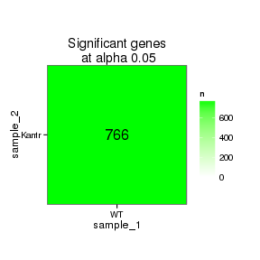 

### Significant gene expression differences between conditions

Expression plot (genes):(turned off)


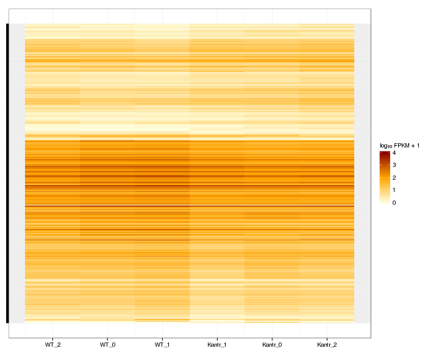 

Significant genes with expression >50fpkm (any condition):(turned off)


An individual look at each of the highly expressed significantly differentially regulated genes:
(eval=false for first pass)


### Expression-level/significance relationship

Scatter plot of significant genes only:

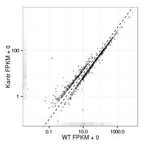 

Volcano Plot

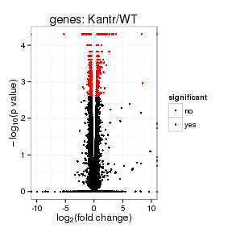 

Volcano plot with significant genes only:

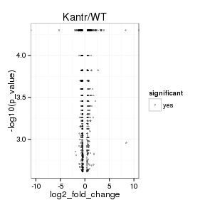 

FoldChange Heatmap

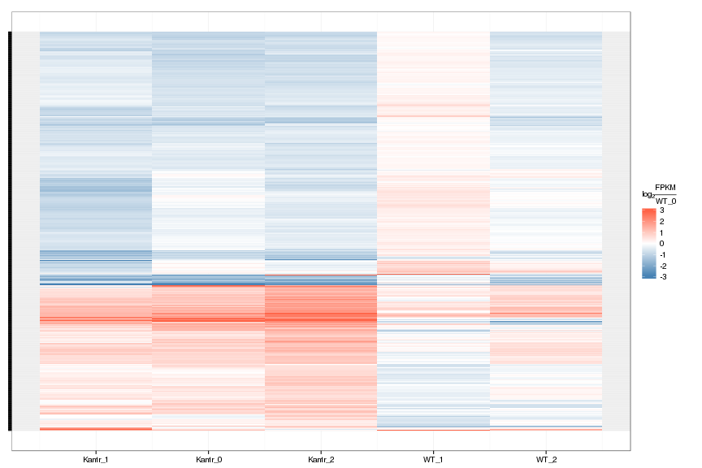 


## Differential Splicing

### Differential Isoforms between conditions

Per isoform difference between conditions:

 

These isoforms are:

<!-- html table generated in R 3.0.2 by xtable 1.7-3 package -->
<!-- Tue Jul 15 18:24:09 2014 -->
<TABLE border=1>
<TR> <TH>  </TH> <TH> isoAnnot$gene_short_name </TH>  </TR>
  <TR> <TD align="right"> 1 </TD> <TD> H19 </TD> </TR>
  <TR> <TD align="right"> 2 </TD> <TD> Tbx2 </TD> </TR>
  <TR> <TD align="right"> 3 </TD> <TD> Ngfr </TD> </TR>
  <TR> <TD align="right"> 4 </TD> <TD> Hddc2 </TD> </TR>
  <TR> <TD align="right"> 5 </TD> <TD> Cdh1 </TD> </TR>
  <TR> <TD align="right"> 6 </TD> <TD> Mcts1 </TD> </TR>
  <TR> <TD align="right"> 7 </TD> <TD> Gabra2 </TD> </TR>
  <TR> <TD align="right"> 8 </TD> <TD> C1d </TD> </TR>
  <TR> <TD align="right"> 9 </TD> <TD> Serpinf1 </TD> </TR>
  <TR> <TD align="right"> 10 </TD> <TD> Col6a1 </TD> </TR>
  <TR> <TD align="right"> 11 </TD> <TD> Gabrg1 </TD> </TR>
  <TR> <TD align="right"> 12 </TD> <TD> Col18a1 </TD> </TR>
  <TR> <TD align="right"> 13 </TD> <TD> Col1a1 </TD> </TR>
  <TR> <TD align="right"> 14 </TD> <TD> Eef1e1 </TD> </TR>
  <TR> <TD align="right"> 15 </TD> <TD> Use1 </TD> </TR>
  <TR> <TD align="right"> 16 </TD> <TD> Zfp40 </TD> </TR>
  <TR> <TD align="right"> 17 </TD> <TD> Lamb1 </TD> </TR>
  <TR> <TD align="right"> 18 </TD> <TD> Dvl3 </TD> </TR>
  <TR> <TD align="right"> 19 </TD> <TD> Fcgrt </TD> </TR>
  <TR> <TD align="right"> 20 </TD> <TD> Bicd1 </TD> </TR>
  <TR> <TD align="right"> 21 </TD> <TD> Zfp81 </TD> </TR>
  <TR> <TD align="right"> 22 </TD> <TD> Ptrf </TD> </TR>
  <TR> <TD align="right"> 23 </TD> <TD> Pax2 </TD> </TR>
  <TR> <TD align="right"> 24 </TD> <TD> Hif3a </TD> </TR>
  <TR> <TD align="right"> 25 </TD> <TD> Sst </TD> </TR>
  <TR> <TD align="right"> 26 </TD> <TD> Aqp1 </TD> </TR>
  <TR> <TD align="right"> 27 </TD> <TD> Tmem242 </TD> </TR>
  <TR> <TD align="right"> 28 </TD> <TD> Wisp1 </TD> </TR>
  <TR> <TD align="right"> 29 </TD> <TD> Corin </TD> </TR>
  <TR> <TD align="right"> 30 </TD> <TD> Nid1 </TD> </TR>
  <TR> <TD align="right"> 31 </TD> <TD> Kif5b </TD> </TR>
  <TR> <TD align="right"> 32 </TD> <TD> Gabrb2 </TD> </TR>
  <TR> <TD align="right"> 33 </TD> <TD> Dio2 </TD> </TR>
  <TR> <TD align="right"> 34 </TD> <TD> 0610009B22Rik </TD> </TR>
  <TR> <TD align="right"> 35 </TD> <TD> Rplp1 </TD> </TR>
  <TR> <TD align="right"> 36 </TD> <TD> Snrpb2 </TD> </TR>
  <TR> <TD align="right"> 37 </TD> <TD> Bmp7 </TD> </TR>
  <TR> <TD align="right"> 38 </TD> <TD> Gabra1 </TD> </TR>
  <TR> <TD align="right"> 39 </TD> <TD> Scarf2 </TD> </TR>
  <TR> <TD align="right"> 40 </TD> <TD> Phox2b </TD> </TR>
  <TR> <TD align="right"> 41 </TD> <TD> Rps5 </TD> </TR>
  <TR> <TD align="right"> 42 </TD> <TD> Cacybp </TD> </TR>
  <TR> <TD align="right"> 43 </TD> <TD> Cox6c </TD> </TR>
  <TR> <TD align="right"> 44 </TD> <TD> Hoxa2 </TD> </TR>
  <TR> <TD align="right"> 45 </TD> <TD> Gata2 </TD> </TR>
  <TR> <TD align="right"> 46 </TD> <TD> Ptgds </TD> </TR>
  <TR> <TD align="right"> 47 </TD> <TD> Psma2 </TD> </TR>
  <TR> <TD align="right"> 48 </TD> <TD> Mrpl32 </TD> </TR>
  <TR> <TD align="right"> 49 </TD> <TD> Capza2 </TD> </TR>
  <TR> <TD align="right"> 50 </TD> <TD> Atp5e </TD> </TR>
  <TR> <TD align="right"> 51 </TD> <TD> Ndufa1 </TD> </TR>
  <TR> <TD align="right"> 52 </TD> <TD> Mrps18c </TD> </TR>
  <TR> <TD align="right"> 53 </TD> <TD> Vtn </TD> </TR>
  <TR> <TD align="right"> 54 </TD> <TD> Erbb3 </TD> </TR>
  <TR> <TD align="right"> 55 </TD> <TD> Trove2 </TD> </TR>
  <TR> <TD align="right"> 56 </TD> <TD> Glra2 </TD> </TR>
  <TR> <TD align="right"> 57 </TD> <TD> Slc35g3 </TD> </TR>
  <TR> <TD align="right"> 58 </TD> <TD> Slc16a10 </TD> </TR>
  <TR> <TD align="right"> 59 </TD> <TD> Lama4 </TD> </TR>
  <TR> <TD align="right"> 60 </TD> <TD> Fabp7 </TD> </TR>
  <TR> <TD align="right"> 61 </TD> <TD> Nts </TD> </TR>
  <TR> <TD align="right"> 62 </TD> <TD> Lama2 </TD> </TR>
  <TR> <TD align="right"> 63 </TD> <TD> Actr6 </TD> </TR>
  <TR> <TD align="right"> 64 </TD> <TD> Kitl </TD> </TR>
  <TR> <TD align="right"> 65 </TD> <TD> Moxd1 </TD> </TR>
  <TR> <TD align="right"> 66 </TD> <TD> Meis1 </TD> </TR>
  <TR> <TD align="right"> 67 </TD> <TD> Col6a2 </TD> </TR>
  <TR> <TD align="right"> 68 </TD> <TD> Hmmr </TD> </TR>
  <TR> <TD align="right"> 69 </TD> <TD> Flt4 </TD> </TR>
  <TR> <TD align="right"> 70 </TD> <TD> Sar1b </TD> </TR>
  <TR> <TD align="right"> 71 </TD> <TD> Nefh </TD> </TR>
  <TR> <TD align="right"> 72 </TD> <TD> Rps27a </TD> </TR>
  <TR> <TD align="right"> 73 </TD> <TD> Ccdc104 </TD> </TR>
  <TR> <TD align="right"> 74 </TD> <TD> Aebp1 </TD> </TR>
  <TR> <TD align="right"> 75 </TD> <TD> Smc6 </TD> </TR>
  <TR> <TD align="right"> 76 </TD> <TD> Fam20a </TD> </TR>
  <TR> <TD align="right"> 77 </TD> <TD> Bcap29 </TD> </TR>
  <TR> <TD align="right"> 78 </TD> <TD> Mrc2 </TD> </TR>
  <TR> <TD align="right"> 79 </TD> <TD> Ntn1 </TD> </TR>
  <TR> <TD align="right"> 80 </TD> <TD> Fkbp3 </TD> </TR>
  <TR> <TD align="right"> 81 </TD> <TD> Scfd1 </TD> </TR>
  <TR> <TD align="right"> 82 </TD> <TD> Mpp5 </TD> </TR>
  <TR> <TD align="right"> 83 </TD> <TD> Eif2s1 </TD> </TR>
  <TR> <TD align="right"> 84 </TD> <TD> Hsp90aa1 </TD> </TR>
  <TR> <TD align="right"> 85 </TD> <TD> 2010107E04Rik </TD> </TR>
  <TR> <TD align="right"> 86 </TD> <TD> Dek </TD> </TR>
  <TR> <TD align="right"> 87 </TD> <TD> Nol8 </TD> </TR>
  <TR> <TD align="right"> 88 </TD> <TD> A530054K11Rik </TD> </TR>
  <TR> <TD align="right"> 89 </TD> <TD> Cetn3 </TD> </TR>
  <TR> <TD align="right"> 90 </TD> <TD> Ankrd32 </TD> </TR>
  <TR> <TD align="right"> 91 </TD> <TD> Irx4 </TD> </TR>
  <TR> <TD align="right"> 92 </TD> <TD> Otp </TD> </TR>
  <TR> <TD align="right"> 93 </TD> <TD> Trim23 </TD> </TR>
  <TR> <TD align="right"> 94 </TD> <TD> Ndufs4 </TD> </TR>
  <TR> <TD align="right"> 95 </TD> <TD> Cdhr1 </TD> </TR>
  <TR> <TD align="right"> 96 </TD> <TD> Psmc6 </TD> </TR>
  <TR> <TD align="right"> 97 </TD> <TD> Chat </TD> </TR>
  <TR> <TD align="right"> 98 </TD> <TD> Zdhhc20 </TD> </TR>
  <TR> <TD align="right"> 99 </TD> <TD> Dnajc15 </TD> </TR>
  <TR> <TD align="right"> 100 </TD> <TD> Sugt1 </TD> </TR>
  <TR> <TD align="right"> 101 </TD> <TD> Nefm </TD> </TR>
  <TR> <TD align="right"> 102 </TD> <TD> Uchl3 </TD> </TR>
  <TR> <TD align="right"> 103 </TD> <TD> Dab2 </TD> </TR>
  <TR> <TD align="right"> 104 </TD> <TD> Npr3 </TD> </TR>
  <TR> <TD align="right"> 105 </TD> <TD> Oxr1 </TD> </TR>
  <TR> <TD align="right"> 106 </TD> <TD> Angpt1 </TD> </TR>
  <TR> <TD align="right"> 107 </TD> <TD> Eif3h </TD> </TR>
  <TR> <TD align="right"> 108 </TD> <TD> Eif3e </TD> </TR>
  <TR> <TD align="right"> 109 </TD> <TD> Emc2 </TD> </TR>
  <TR> <TD align="right"> 110 </TD> <TD> Kcnv1 </TD> </TR>
  <TR> <TD align="right"> 111 </TD> <TD> Col14a1 </TD> </TR>
  <TR> <TD align="right"> 112 </TD> <TD> Enpp2 </TD> </TR>
  <TR> <TD align="right"> 113 </TD> <TD> Myh9 </TD> </TR>
  <TR> <TD align="right"> 114 </TD> <TD> Ndufa6 </TD> </TR>
  <TR> <TD align="right"> 115 </TD> <TD> Ube2v2 </TD> </TR>
  <TR> <TD align="right"> 116 </TD> <TD> B3gnt5 </TD> </TR>
  <TR> <TD align="right"> 117 </TD> <TD> Zbtb20 </TD> </TR>
  <TR> <TD align="right"> 118 </TD> <TD> Fgd4 </TD> </TR>
  <TR> <TD align="right"> 119 </TD> <TD> Arhgap31 </TD> </TR>
  <TR> <TD align="right"> 120 </TD> <TD> Sncg </TD> </TR>
  <TR> <TD align="right"> 121 </TD> <TD> Prph </TD> </TR>
  <TR> <TD align="right"> 122 </TD> <TD> Thbs2 </TD> </TR>
  <TR> <TD align="right"> 123 </TD> <TD> Zfp51 </TD> </TR>
  <TR> <TD align="right"> 124 </TD> <TD> Pla2g7 </TD> </TR>
  <TR> <TD align="right"> 125 </TD> <TD> Slc5a7 </TD> </TR>
  <TR> <TD align="right"> 126 </TD> <TD> Arhgap28 </TD> </TR>
  <TR> <TD align="right"> 127 </TD> <TD> Cyp1b1 </TD> </TR>
  <TR> <TD align="right"> 128 </TD> <TD> Ndufv2 </TD> </TR>
  <TR> <TD align="right"> 129 </TD> <TD> Epas1 </TD> </TR>
  <TR> <TD align="right"> 130 </TD> <TD> Uqcc2 </TD> </TR>
  <TR> <TD align="right"> 131 </TD> <TD> Esco1 </TD> </TR>
  <TR> <TD align="right"> 132 </TD> <TD> Fbn2 </TD> </TR>
  <TR> <TD align="right"> 133 </TD> <TD> Rps14 </TD> </TR>
  <TR> <TD align="right"> 134 </TD> <TD> Tmx3 </TD> </TR>
  <TR> <TD align="right"> 135 </TD> <TD> Pdgfrb </TD> </TR>
  <TR> <TD align="right"> 136 </TD> <TD> Slc22a6 </TD> </TR>
  <TR> <TD align="right"> 137 </TD> <TD> Kif20b </TD> </TR>
  <TR> <TD align="right"> 138 </TD> <TD> Lbx1 </TD> </TR>
  <TR> <TD align="right"> 139 </TD> <TD> Rps24 </TD> </TR>
  <TR> <TD align="right"> 140 </TD> <TD> Rps26 </TD> </TR>
  <TR> <TD align="right"> 141 </TD> <TD> Esyt1 </TD> </TR>
  <TR> <TD align="right"> 142 </TD> <TD> Zfp711 </TD> </TR>
  <TR> <TD align="right"> 143 </TD> <TD> Tmem47 </TD> </TR>
  <TR> <TD align="right"> 144 </TD> <TD> Itih5 </TD> </TR>
  <TR> <TD align="right"> 145 </TD> <TD> Stag2 </TD> </TR>
  <TR> <TD align="right"> 146 </TD> <TD> Cwf19l2 </TD> </TR>
  <TR> <TD align="right"> 147 </TD> <TD> Lypla1 </TD> </TR>
  <TR> <TD align="right"> 148 </TD> <TD> Rb1cc1 </TD> </TR>
  <TR> <TD align="right"> 149 </TD> <TD> Mob4 </TD> </TR>
  <TR> <TD align="right"> 150 </TD> <TD> Nop58 </TD> </TR>
  <TR> <TD align="right"> 151 </TD> <TD> Sumo1 </TD> </TR>
  <TR> <TD align="right"> 152 </TD> <TD> Ndufb3 </TD> </TR>
  <TR> <TD align="right"> 153 </TD> <TD> Col5a2 </TD> </TR>
  <TR> <TD align="right"> 154 </TD> <TD> Col3a1 </TD> </TR>
  <TR> <TD align="right"> 155 </TD> <TD> Mrpl30 </TD> </TR>
  <TR> <TD align="right"> 156 </TD> <TD> 1110058L19Rik </TD> </TR>
  <TR> <TD align="right"> 157 </TD> <TD> Fn1 </TD> </TR>
  <TR> <TD align="right"> 158 </TD> <TD> Nppc </TD> </TR>
  <TR> <TD align="right"> 159 </TD> <TD> Dbi </TD> </TR>
  <TR> <TD align="right"> 160 </TD> <TD> Syt2 </TD> </TR>
  <TR> <TD align="right"> 161 </TD> <TD> Lamc1 </TD> </TR>
  <TR> <TD align="right"> 162 </TD> <TD> Cenpf </TD> </TR>
  <TR> <TD align="right"> 163 </TD> <TD> Mrc1 </TD> </TR>
  <TR> <TD align="right"> 164 </TD> <TD> Itga8 </TD> </TR>
  <TR> <TD align="right"> 165 </TD> <TD> Col5a1 </TD> </TR>
  <TR> <TD align="right"> 166 </TD> <TD> Lamc3 </TD> </TR>
  <TR> <TD align="right"> 167 </TD> <TD> Pax8 </TD> </TR>
  <TR> <TD align="right"> 168 </TD> <TD> Kif18a </TD> </TR>
  <TR> <TD align="right"> 169 </TD> <TD> Eif3m </TD> </TR>
  <TR> <TD align="right"> 170 </TD> <TD> Fbn1 </TD> </TR>
  <TR> <TD align="right"> 171 </TD> <TD> Cops2 </TD> </TR>
  <TR> <TD align="right"> 172 </TD> <TD> Lamp5 </TD> </TR>
  <TR> <TD align="right"> 173 </TD> <TD> Otor </TD> </TR>
  <TR> <TD align="right"> 174 </TD> <TD> Pkia </TD> </TR>
  <TR> <TD align="right"> 175 </TD> <TD> Dcun1d1 </TD> </TR>
  <TR> <TD align="right"> 176 </TD> <TD> Pdcd10 </TD> </TR>
  <TR> <TD align="right"> 177 </TD> <TD> Sfrp2 </TD> </TR>
  <TR> <TD align="right"> 178 </TD> <TD> Enpep </TD> </TR>
  <TR> <TD align="right"> 179 </TD> <TD> Aimp1 </TD> </TR>
  <TR> <TD align="right"> 180 </TD> <TD> Rps3a1 </TD> </TR>
  <TR> <TD align="right"> 181 </TD> <TD> Abca4 </TD> </TR>
  <TR> <TD align="right"> 182 </TD> <TD> Tmem68 </TD> </TR>
  <TR> <TD align="right"> 183 </TD> <TD> Casp8ap2 </TD> </TR>
  <TR> <TD align="right"> 184 </TD> <TD> Svep1 </TD> </TR>
  <TR> <TD align="right"> 185 </TD> <TD> Zfp37 </TD> </TR>
  <TR> <TD align="right"> 186 </TD> <TD> Bspry </TD> </TR>
  <TR> <TD align="right"> 187 </TD> <TD> Rps6 </TD> </TR>
  <TR> <TD align="right"> 188 </TD> <TD> Ift74 </TD> </TR>
  <TR> <TD align="right"> 189 </TD> <TD> Magoh </TD> </TR>
  <TR> <TD align="right"> 190 </TD> <TD> Col9a2 </TD> </TR>
  <TR> <TD align="right"> 191 </TD> <TD> Tomm7 </TD> </TR>
  <TR> <TD align="right"> 192 </TD> <TD> Orc5 </TD> </TR>
  <TR> <TD align="right"> 193 </TD> <TD> Mxra8 </TD> </TR>
  <TR> <TD align="right"> 194 </TD> <TD> Slc30a3 </TD> </TR>
  <TR> <TD align="right"> 195 </TD> <TD> Tgfbr3 </TD> </TR>
  <TR> <TD align="right"> 196 </TD> <TD> Ndufa4 </TD> </TR>
  <TR> <TD align="right"> 197 </TD> <TD> Col1a2 </TD> </TR>
  <TR> <TD align="right"> 198 </TD> <TD> Slc13a4 </TD> </TR>
  <TR> <TD align="right"> 199 </TD> <TD> Zyx </TD> </TR>
  <TR> <TD align="right"> 200 </TD> <TD> Slc6a13 </TD> </TR>
  <TR> <TD align="right"> 201 </TD> <TD> Ret </TD> </TR>
  <TR> <TD align="right"> 202 </TD> <TD> A2m </TD> </TR>
  <TR> <TD align="right"> 203 </TD> <TD> Dera </TD> </TR>
  <TR> <TD align="right"> 204 </TD> <TD> Dbx1 </TD> </TR>
  <TR> <TD align="right"> 205 </TD> <TD> Mphosph10 </TD> </TR>
  <TR> <TD align="right"> 206 </TD> <TD> Ccdc90b </TD> </TR>
  <TR> <TD align="right"> 207 </TD> <TD> Zfand6 </TD> </TR>
  <TR> <TD align="right"> 208 </TD> <TD> Ndufc2 </TD> </TR>
  <TR> <TD align="right"> 209 </TD> <TD> Ndufb11 </TD> </TR>
  <TR> <TD align="right"> 210 </TD> <TD> Zfp300 </TD> </TR>
  <TR> <TD align="right"> 211 </TD> <TD> Vbp1 </TD> </TR>
  <TR> <TD align="right"> 212 </TD> <TD> Atrx </TD> </TR>
  <TR> <TD align="right"> 213 </TD> <TD> Cox7b </TD> </TR>
  <TR> <TD align="right"> 214 </TD> <TD> Hmgn5 </TD> </TR>
  <TR> <TD align="right"> 215 </TD> <TD> Sh3bgrl </TD> </TR>
  <TR> <TD align="right"> 216 </TD> <TD> Col4a6 </TD> </TR>
  <TR> <TD align="right"> 217 </TD> <TD> Bgn </TD> </TR>
  <TR> <TD align="right"> 218 </TD> <TD> Col4a1 </TD> </TR>
  <TR> <TD align="right"> 219 </TD> <TD> Pcm1 </TD> </TR>
  <TR> <TD align="right"> 220 </TD> <TD> Mmp2 </TD> </TR>
  <TR> <TD align="right"> 221 </TD> <TD> Cdh5 </TD> </TR>
  <TR> <TD align="right"> 222 </TD> <TD> Tbx20 </TD> </TR>
  <TR> <TD align="right"> 223 </TD> <TD> Mpzl2 </TD> </TR>
  <TR> <TD align="right"> 224 </TD> <TD> Robo3 </TD> </TR>
  <TR> <TD align="right"> 225 </TD> <TD> Kank2 </TD> </TR>
  <TR> <TD align="right"> 226 </TD> <TD> Dock6 </TD> </TR>
  <TR> <TD align="right"> 227 </TD> <TD> Rora </TD> </TR>
  <TR> <TD align="right"> 228 </TD> <TD> Itga11 </TD> </TR>
  <TR> <TD align="right"> 229 </TD> <TD> Phip </TD> </TR>
  <TR> <TD align="right"> 230 </TD> <TD> Crabp1 </TD> </TR>
  <TR> <TD align="right"> 231 </TD> <TD> Tmem30a </TD> </TR>
  <TR> <TD align="right"> 232 </TD> <TD> Cox7a2 </TD> </TR>
  <TR> <TD align="right"> 233 </TD> <TD> Tgfbr2 </TD> </TR>
  <TR> <TD align="right"> 234 </TD> <TD> Rpsa </TD> </TR>
  <TR> <TD align="right"> 235 </TD> <TD> Ccdc88a </TD> </TR>
  <TR> <TD align="right"> 236 </TD> <TD> Lama1 </TD> </TR>
  <TR> <TD align="right"> 237 </TD> <TD> Sox10 </TD> </TR>
  <TR> <TD align="right"> 238 </TD> <TD> Wnt6 </TD> </TR>
  <TR> <TD align="right"> 239 </TD> <TD> Lgi3 </TD> </TR>
  <TR> <TD align="right"> 240 </TD> <TD> Zfp944 </TD> </TR>
  <TR> <TD align="right"> 241 </TD> <TD> Gria2 </TD> </TR>
  <TR> <TD align="right"> 242 </TD> <TD> Lsm3 </TD> </TR>
  <TR> <TD align="right"> 243 </TD> <TD> Smc4 </TD> </TR>
  <TR> <TD align="right"> 244 </TD> <TD> Gbx2 </TD> </TR>
  <TR> <TD align="right"> 245 </TD> <TD> Pcdh11x </TD> </TR>
  <TR> <TD align="right"> 246 </TD> <TD> Parm1 </TD> </TR>
  <TR> <TD align="right"> 247 </TD> <TD> Wnk4 </TD> </TR>
  <TR> <TD align="right"> 248 </TD> <TD> Arhgap5 </TD> </TR>
  <TR> <TD align="right"> 249 </TD> <TD> 1110059E24Rik </TD> </TR>
  <TR> <TD align="right"> 250 </TD> <TD> Nkx6-1 </TD> </TR>
  <TR> <TD align="right"> 251 </TD> <TD> Lars2 </TD> </TR>
  <TR> <TD align="right"> 252 </TD> <TD> Trim13 </TD> </TR>
  <TR> <TD align="right"> 253 </TD> <TD> Scai </TD> </TR>
  <TR> <TD align="right"> 254 </TD> <TD> G2e3 </TD> </TR>
  <TR> <TD align="right"> 255 </TD> <TD> Lysmd3 </TD> </TR>
  <TR> <TD align="right"> 256 </TD> <TD> Rpl39-ps </TD> </TR>
  <TR> <TD align="right"> 257 </TD> <TD> Rps27l </TD> </TR>
  <TR> <TD align="right"> 258 </TD> <TD> Neto2 </TD> </TR>
  <TR> <TD align="right"> 259 </TD> <TD> Anapc10 </TD> </TR>
  <TR> <TD align="right"> 260 </TD> <TD> Islr </TD> </TR>
  <TR> <TD align="right"> 261 </TD> <TD> Matr3 </TD> </TR>
  <TR> <TD align="right"> 262 </TD> <TD> Itih2 </TD> </TR>
  <TR> <TD align="right"> 263 </TD> <TD> 0610009D07Rik </TD> </TR>
  <TR> <TD align="right"> 264 </TD> <TD> Thoc2 </TD> </TR>
  <TR> <TD align="right"> 265 </TD> <TD> Cldn11 </TD> </TR>
  <TR> <TD align="right"> 266 </TD> <TD> Neurod6 </TD> </TR>
  <TR> <TD align="right"> 267 </TD> <TD> Spon1 </TD> </TR>
  <TR> <TD align="right"> 268 </TD> <TD> Fam126b </TD> </TR>
  <TR> <TD align="right"> 269 </TD> <TD> Foxf2 </TD> </TR>
  <TR> <TD align="right"> 270 </TD> <TD> Akap12 </TD> </TR>
  <TR> <TD align="right"> 271 </TD> <TD> Atp5j2 </TD> </TR>
  <TR> <TD align="right"> 272 </TD> <TD> Lmx1b </TD> </TR>
  <TR> <TD align="right"> 273 </TD> <TD> Rps21 </TD> </TR>
  <TR> <TD align="right"> 274 </TD> <TD> Timm8b </TD> </TR>
  <TR> <TD align="right"> 275 </TD> <TD> Zfp503 </TD> </TR>
  <TR> <TD align="right"> 276 </TD> <TD> Rpl22l1 </TD> </TR>
  <TR> <TD align="right"> 277 </TD> <TD> Slc6a5 </TD> </TR>
  <TR> <TD align="right"> 278 </TD> <TD> Gjb6 </TD> </TR>
  <TR> <TD align="right"> 279 </TD> <TD> Nxph4 </TD> </TR>
  <TR> <TD align="right"> 280 </TD> <TD> Cdh12 </TD> </TR>
  <TR> <TD align="right"> 281 </TD> <TD> Tlx3 </TD> </TR>
  <TR> <TD align="right"> 282 </TD> <TD> St8sia4 </TD> </TR>
  <TR> <TD align="right"> 283 </TD> <TD> Slc22a2 </TD> </TR>
  <TR> <TD align="right"> 284 </TD> <TD> Phf8 </TD> </TR>
  <TR> <TD align="right"> 285 </TD> <TD> Car8 </TD> </TR>
  <TR> <TD align="right"> 286 </TD> <TD> Fmod </TD> </TR>
  <TR> <TD align="right"> 287 </TD> <TD> Gucy1a2 </TD> </TR>
  <TR> <TD align="right"> 288 </TD> <TD> Prrxl1 </TD> </TR>
  <TR> <TD align="right"> 289 </TD> <TD> Abca9 </TD> </TR>
  <TR> <TD align="right"> 290 </TD> <TD> Tbca </TD> </TR>
  <TR> <TD align="right"> 291 </TD> <TD> Zfp386 </TD> </TR>
  <TR> <TD align="right"> 292 </TD> <TD> Bend6 </TD> </TR>
  <TR> <TD align="right"> 293 </TD> <TD> Ehbp1 </TD> </TR>
  <TR> <TD align="right"> 294 </TD> <TD> Dctpp1 </TD> </TR>
  <TR> <TD align="right"> 295 </TD> <TD> Shfm1 </TD> </TR>
  <TR> <TD align="right"> 296 </TD> <TD> Itpr3 </TD> </TR>
  <TR> <TD align="right"> 297 </TD> <TD> Immp1l </TD> </TR>
  <TR> <TD align="right"> 298 </TD> <TD> Selk </TD> </TR>
  <TR> <TD align="right"> 299 </TD> <TD> Wbp5 </TD> </TR>
  <TR> <TD align="right"> 300 </TD> <TD> B630005N14Rik </TD> </TR>
  <TR> <TD align="right"> 301 </TD> <TD> Hebp1 </TD> </TR>
  <TR> <TD align="right"> 302 </TD> <TD> Egflam </TD> </TR>
  <TR> <TD align="right"> 303 </TD> <TD> Tuba1c </TD> </TR>
  <TR> <TD align="right"> 304 </TD> <TD> Hic1 </TD> </TR>
  <TR> <TD align="right"> 305 </TD> <TD> Aqp6 </TD> </TR>
  <TR> <TD align="right"> 306 </TD> <TD> Tril </TD> </TR>
  <TR> <TD align="right"> 307 </TD> <TD> Rpl7 </TD> </TR>
  <TR> <TD align="right"> 308 </TD> <TD> Sptssa </TD> </TR>
  <TR> <TD align="right"> 309 </TD> <TD> Gm9493 </TD> </TR>
  <TR> <TD align="right"> 310 </TD> <TD> Trmt10c </TD> </TR>
  <TR> <TD align="right"> 311 </TD> <TD> Cenpe </TD> </TR>
  <TR> <TD align="right"> 312 </TD> <TD> Onecut3 </TD> </TR>
  <TR> <TD align="right"> 313 </TD> <TD> Penk </TD> </TR>
  <TR> <TD align="right"> 314 </TD> <TD> Olig3 </TD> </TR>
  <TR> <TD align="right"> 315 </TD> <TD> Esf1 </TD> </TR>
  <TR> <TD align="right"> 316 </TD> <TD> Zfp322a </TD> </TR>
  <TR> <TD align="right"> 317 </TD> <TD> Gjb2 </TD> </TR>
  <TR> <TD align="right"> 318 </TD> <TD> Olfml2a </TD> </TR>
  <TR> <TD align="right"> 319 </TD> <TD> Tefm </TD> </TR>
  <TR> <TD align="right"> 320 </TD> <TD> Zfp654 </TD> </TR>
  <TR> <TD align="right"> 321 </TD> <TD> Dynlrb1 </TD> </TR>
  <TR> <TD align="right"> 322 </TD> <TD> Adamts12 </TD> </TR>
  <TR> <TD align="right"> 323 </TD> <TD> Mafa </TD> </TR>
  <TR> <TD align="right"> 324 </TD> <TD> Rps8 </TD> </TR>
  <TR> <TD align="right"> 325 </TD> <TD> Rpsa-ps10 </TD> </TR>
  <TR> <TD align="right"> 326 </TD> <TD> Zcchc5 </TD> </TR>
  <TR> <TD align="right"> 327 </TD> <TD> Sned1 </TD> </TR>
  <TR> <TD align="right"> 328 </TD> <TD> Tmem196 </TD> </TR>
  <TR> <TD align="right"> 329 </TD> <TD> Pirt </TD> </TR>
  <TR> <TD align="right"> 330 </TD> <TD> Col6a3 </TD> </TR>
  <TR> <TD align="right"> 331 </TD> <TD> Zfp738 </TD> </TR>
  <TR> <TD align="right"> 332 </TD> <TD> Osr1 </TD> </TR>
  <TR> <TD align="right"> 333 </TD> <TD> Ranbp3l </TD> </TR>
  <TR> <TD align="right"> 334 </TD> <TD> Igf2 </TD> </TR>
  <TR> <TD align="right"> 335 </TD> <TD> Plcxd3 </TD> </TR>
  <TR> <TD align="right"> 336 </TD> <TD> Zfp518a </TD> </TR>
  <TR> <TD align="right"> 337 </TD> <TD> Tmsb4x </TD> </TR>
  <TR> <TD align="right"> 338 </TD> <TD> Shisa3 </TD> </TR>
  <TR> <TD align="right"> 339 </TD> <TD> Foxc1 </TD> </TR>
  <TR> <TD align="right"> 340 </TD> <TD> Gm9843 </TD> </TR>
  <TR> <TD align="right"> 341 </TD> <TD> Gm9846 </TD> </TR>
  <TR> <TD align="right"> 342 </TD> <TD> Vstm4 </TD> </TR>
  <TR> <TD align="right"> 343 </TD> <TD> Atp5k </TD> </TR>
  <TR> <TD align="right"> 344 </TD> <TD> Gja1 </TD> </TR>
  <TR> <TD align="right"> 345 </TD> <TD> Sv2c </TD> </TR>
  <TR> <TD align="right"> 346 </TD> <TD> Commd3 </TD> </TR>
  <TR> <TD align="right"> 347 </TD> <TD> Nhlh1 </TD> </TR>
  <TR> <TD align="right"> 348 </TD> <TD> Gm6563 </TD> </TR>
  <TR> <TD align="right"> 349 </TD> <TD> Six1 </TD> </TR>
  <TR> <TD align="right"> 350 </TD> <TD> Tceal8 </TD> </TR>
  <TR> <TD align="right"> 351 </TD> <TD> Coa6 </TD> </TR>
  <TR> <TD align="right"> 352 </TD> <TD> Gypa </TD> </TR>
  <TR> <TD align="right"> 353 </TD> <TD> Pfdn4 </TD> </TR>
  <TR> <TD align="right"> 354 </TD> <TD> Il1rapl1 </TD> </TR>
  <TR> <TD align="right"> 355 </TD> <TD> C130021I20Rik </TD> </TR>
  <TR> <TD align="right"> 356 </TD> <TD> Aldh1a1 </TD> </TR>
  <TR> <TD align="right"> 357 </TD> <TD> Sec61b </TD> </TR>
  <TR> <TD align="right"> 358 </TD> <TD> Zfp943 </TD> </TR>
  <TR> <TD align="right"> 359 </TD> <TD> Thoc7 </TD> </TR>
  <TR> <TD align="right"> 360 </TD> <TD> Atf7ip </TD> </TR>
  <TR> <TD align="right"> 361 </TD> <TD> Atpif1 </TD> </TR>
  <TR> <TD align="right"> 362 </TD> <TD> Adam12 </TD> </TR>
  <TR> <TD align="right"> 363 </TD> <TD> Mmrn1 </TD> </TR>
  <TR> <TD align="right"> 364 </TD> <TD> Klhl18 </TD> </TR>
  <TR> <TD align="right"> 365 </TD> <TD> Tns1 </TD> </TR>
  <TR> <TD align="right"> 366 </TD> <TD> Fut9 </TD> </TR>
  <TR> <TD align="right"> 367 </TD> <TD> Gpc3 </TD> </TR>
  <TR> <TD align="right"> 368 </TD> <TD> Triqk </TD> </TR>
  <TR> <TD align="right"> 369 </TD> <TD> AI504432 </TD> </TR>
  <TR> <TD align="right"> 370 </TD> <TD> Col8a2 </TD> </TR>
  <TR> <TD align="right"> 371 </TD> <TD> Uts2b </TD> </TR>
  <TR> <TD align="right"> 372 </TD> <TD> Slit3 </TD> </TR>
  <TR> <TD align="right"> 373 </TD> <TD> Cd248 </TD> </TR>
  <TR> <TD align="right"> 374 </TD> <TD> Mpz </TD> </TR>
  <TR> <TD align="right"> 375 </TD> <TD> Kdm5d </TD> </TR>
  <TR> <TD align="right"> 376 </TD> <TD> Foxb2 </TD> </TR>
  <TR> <TD align="right"> 377 </TD> <TD> Gadl1 </TD> </TR>
  <TR> <TD align="right"> 378 </TD> <TD> Gm7536 </TD> </TR>
  <TR> <TD align="right"> 379 </TD> <TD> Zfp759 </TD> </TR>
  <TR> <TD align="right"> 380 </TD> <TD> Mab21l2 </TD> </TR>
  <TR> <TD align="right"> 381 </TD> <TD> Rpl32 </TD> </TR>
  <TR> <TD align="right"> 382 </TD> <TD> AA987161 </TD> </TR>
  <TR> <TD align="right"> 383 </TD> <TD> Gda </TD> </TR>
  <TR> <TD align="right"> 384 </TD> <TD> Zfp958 </TD> </TR>
  <TR> <TD align="right"> 385 </TD> <TD> Zfp708 </TD> </TR>
  <TR> <TD align="right"> 386 </TD> <TD> Gm10053 </TD> </TR>
  <TR> <TD align="right"> 387 </TD> <TD> Zfp933 </TD> </TR>
  <TR> <TD align="right"> 388 </TD> <TD> Zfp930 </TD> </TR>
  <TR> <TD align="right"> 389 </TD> <TD> Gm10073 </TD> </TR>
  <TR> <TD align="right"> 390 </TD> <TD> Rp2h </TD> </TR>
  <TR> <TD align="right"> 391 </TD> <TD> Scrt2 </TD> </TR>
  <TR> <TD align="right"> 392 </TD> <TD> 2610008E11Rik </TD> </TR>
  <TR> <TD align="right"> 393 </TD> <TD> Zfp868 </TD> </TR>
  <TR> <TD align="right"> 394 </TD> <TD> Rps10-ps1 </TD> </TR>
  <TR> <TD align="right"> 395 </TD> <TD> Rpl26 </TD> </TR>
  <TR> <TD align="right"> 396 </TD> <TD> Zfp873 </TD> </TR>
  <TR> <TD align="right"> 397 </TD> <TD> Rps7 </TD> </TR>
  <TR> <TD align="right"> 398 </TD> <TD> Zic2 </TD> </TR>
  <TR> <TD align="right"> 399 </TD> <TD> Rps12 </TD> </TR>
  <TR> <TD align="right"> 400 </TD> <TD> Rpl34 </TD> </TR>
  <TR> <TD align="right"> 401 </TD> <TD> Rpl9-ps6 </TD> </TR>
  <TR> <TD align="right"> 402 </TD> <TD> Rps3a2 </TD> </TR>
  <TR> <TD align="right"> 403 </TD> <TD> Zfp938 </TD> </TR>
  <TR> <TD align="right"> 404 </TD> <TD> Kdr </TD> </TR>
  <TR> <TD align="right"> 405 </TD> <TD> Mrpl42 </TD> </TR>
  <TR> <TD align="right"> 406 </TD> <TD> Cyp26b1 </TD> </TR>
  <TR> <TD align="right"> 407 </TD> <TD> Rps15 </TD> </TR>
  <TR> <TD align="right"> 408 </TD> <TD> Col23a1 </TD> </TR>
  <TR> <TD align="right"> 409 </TD> <TD> Chchd1 </TD> </TR>
  <TR> <TD align="right"> 410 </TD> <TD> Uqcrh </TD> </TR>
  <TR> <TD align="right"> 411 </TD> <TD> Fbln2 </TD> </TR>
  <TR> <TD align="right"> 412 </TD> <TD> Gm10146 </TD> </TR>
  <TR> <TD align="right"> 413 </TD> <TD> mt-Nd1 </TD> </TR>
  <TR> <TD align="right"> 414 </TD> <TD> mt-Nd2 </TD> </TR>
  <TR> <TD align="right"> 415 </TD> <TD> mt-Nd4 </TD> </TR>
  <TR> <TD align="right"> 416 </TD> <TD> Foxd3 </TD> </TR>
  <TR> <TD align="right"> 417 </TD> <TD> Zfp763 </TD> </TR>
  <TR> <TD align="right"> 418 </TD> <TD> Gm10221 </TD> </TR>
  <TR> <TD align="right"> 419 </TD> <TD> Zfp760 </TD> </TR>
  <TR> <TD align="right"> 420 </TD> <TD> Zfp948 </TD> </TR>
  <TR> <TD align="right"> 421 </TD> <TD> Zfp160 </TD> </TR>
  <TR> <TD align="right"> 422 </TD> <TD> Ndufaf2 </TD> </TR>
  <TR> <TD align="right"> 423 </TD> <TD> Col8a1 </TD> </TR>
  <TR> <TD align="right"> 424 </TD> <TD> Gm11808 </TD> </TR>
  <TR> <TD align="right"> 425 </TD> <TD> Slc4a5 </TD> </TR>
  <TR> <TD align="right"> 426 </TD> <TD> Efcab1 </TD> </TR>
  <TR> <TD align="right"> 427 </TD> <TD> Rap1a </TD> </TR>
  <TR> <TD align="right"> 428 </TD> <TD> Ssb </TD> </TR>
  <TR> <TD align="right"> 429 </TD> <TD> Ddx3y </TD> </TR>
  <TR> <TD align="right"> 430 </TD> <TD> Gm10260 </TD> </TR>
  <TR> <TD align="right"> 431 </TD> <TD> Nxph2 </TD> </TR>
  <TR> <TD align="right"> 432 </TD> <TD> Zfp72 </TD> </TR>
  <TR> <TD align="right"> 433 </TD> <TD> Gm10275 </TD> </TR>
  <TR> <TD align="right"> 434 </TD> <TD> Gm10288 </TD> </TR>
  <TR> <TD align="right"> 435 </TD> <TD> Smim15 </TD> </TR>
  <TR> <TD align="right"> 436 </TD> <TD> Zfp946 </TD> </TR>
  <TR> <TD align="right"> 437 </TD> <TD> Zfp942 </TD> </TR>
  <TR> <TD align="right"> 438 </TD> <TD> Zfp71-rs1 </TD> </TR>
  <TR> <TD align="right"> 439 </TD> <TD> Rpl23 </TD> </TR>
  <TR> <TD align="right"> 440 </TD> <TD> Gm13826 </TD> </TR>
  <TR> <TD align="right"> 441 </TD> <TD> Dok6 </TD> </TR>
  <TR> <TD align="right"> 442 </TD> <TD> Myeov2 </TD> </TR>
  <TR> <TD align="right"> 443 </TD> <TD> Nbeal1 </TD> </TR>
  <TR> <TD align="right"> 444 </TD> <TD> Hbb-bt </TD> </TR>
  <TR> <TD align="right"> 445 </TD> <TD> Rpl13a </TD> </TR>
  <TR> <TD align="right"> 446 </TD> <TD> 9830147E19Rik </TD> </TR>
  <TR> <TD align="right"> 447 </TD> <TD> Ehd2 </TD> </TR>
  <TR> <TD align="right"> 448 </TD> <TD> Mafb </TD> </TR>
  <TR> <TD align="right"> 449 </TD> <TD> Gm10742 </TD> </TR>
  <TR> <TD align="right"> 450 </TD> <TD> Thbd </TD> </TR>
  <TR> <TD align="right"> 451 </TD> <TD> Gm561 </TD> </TR>
  <TR> <TD align="right"> 452 </TD> <TD> Zfp808 </TD> </TR>
  <TR> <TD align="right"> 453 </TD> <TD> Scn2a1 </TD> </TR>
  <TR> <TD align="right"> 454 </TD> <TD> Hoxc4 </TD> </TR>
  <TR> <TD align="right"> 455 </TD> <TD> Rpl23a-ps3 </TD> </TR>
  <TR> <TD align="right"> 456 </TD> <TD> Gm2000 </TD> </TR>
  <TR> <TD align="right"> 457 </TD> <TD> Gm3940 </TD> </TR>
  <TR> <TD align="right"> 458 </TD> <TD> Foxd1 </TD> </TR>
  <TR> <TD align="right"> 459 </TD> <TD> AU041133 </TD> </TR>
  <TR> <TD align="right"> 460 </TD> <TD> Abracl </TD> </TR>
  <TR> <TD align="right"> 461 </TD> <TD> 2210404O09Rik </TD> </TR>
  <TR> <TD align="right"> 462 </TD> <TD> Zfp931 </TD> </TR>
  <TR> <TD align="right"> 463 </TD> <TD> Gm14326 </TD> </TR>
  <TR> <TD align="right"> 464 </TD> <TD> Gm14418 </TD> </TR>
  <TR> <TD align="right"> 465 </TD> <TD> Jrkl </TD> </TR>
  <TR> <TD align="right"> 466 </TD> <TD> Haus3 </TD> </TR>
  <TR> <TD align="right"> 467 </TD> <TD> Rpl39 </TD> </TR>
  <TR> <TD align="right"> 468 </TD> <TD> Tceb1 </TD> </TR>
  <TR> <TD align="right"> 469 </TD> <TD> Zfp703 </TD> </TR>
  <TR> <TD align="right"> 470 </TD> <TD> Gm12688 </TD> </TR>
  <TR> <TD align="right"> 471 </TD> <TD> Xist </TD> </TR>
  <TR> <TD align="right"> 472 </TD> <TD> Gm15500 </TD> </TR>
  <TR> <TD align="right"> 473 </TD> <TD> Kantr </TD> </TR>
  <TR> <TD align="right"> 474 </TD> <TD> Tmsb15b2 </TD> </TR>
  <TR> <TD align="right"> 475 </TD> <TD> 3110047P20Rik </TD> </TR>
  <TR> <TD align="right"> 476 </TD> <TD> Gm10177 </TD> </TR>
  <TR> <TD align="right"> 477 </TD> <TD> Pcp4 </TD> </TR>
  <TR> <TD align="right"> 478 </TD> <TD> 2810055G20Rik </TD> </TR>
  <TR> <TD align="right"> 479 </TD> <TD> Snrpe </TD> </TR>
  <TR> <TD align="right"> 480 </TD> <TD> Zfp712 </TD> </TR>
  <TR> <TD align="right"> 481 </TD> <TD> Myl6 </TD> </TR>
  <TR> <TD align="right"> 482 </TD> <TD> Lrrc32 </TD> </TR>
  <TR> <TD align="right"> 483 </TD> <TD> Gm5141 </TD> </TR>
  <TR> <TD align="right"> 484 </TD> <TD> Gm10269 </TD> </TR>
  <TR> <TD align="right"> 485 </TD> <TD> Tma7 </TD> </TR>
  <TR> <TD align="right"> 486 </TD> <TD> Gm4540 </TD> </TR>
  <TR> <TD align="right"> 487 </TD> <TD> Zfp804b </TD> </TR>
  <TR> <TD align="right"> 488 </TD> <TD> Zfp141 </TD> </TR>
  <TR> <TD align="right"> 489 </TD> <TD> Rpl41 </TD> </TR>
  <TR> <TD align="right"> 490 </TD> <TD> Zfp955a </TD> </TR>
  <TR> <TD align="right"> 491 </TD> <TD> Gm14325 </TD> </TR>
  <TR> <TD align="right"> 492 </TD> <TD> Zfp748 </TD> </TR>
  <TR> <TD align="right"> 493 </TD> <TD> Gm6472 </TD> </TR>
  <TR> <TD align="right"> 494 </TD> <TD> Gm4944 </TD> </TR>
  <TR> <TD align="right"> 495 </TD> <TD> Foxl2os </TD> </TR>
  <TR> <TD align="right"> 496 </TD> <TD> Gm17750 </TD> </TR>
  <TR> <TD align="right"> 497 </TD> <TD> Gm26924 </TD> </TR>
  <TR> <TD align="right"> 498 </TD> <TD> A430106G13Rik </TD> </TR>
  <TR> <TD align="right"> 499 </TD> <TD> Gm27031 </TD> </TR>
  <TR> <TD align="right"> 500 </TD> <TD> Snhg6 </TD> </TR>
   </TABLE>

Gene-level DE isoform heatmap

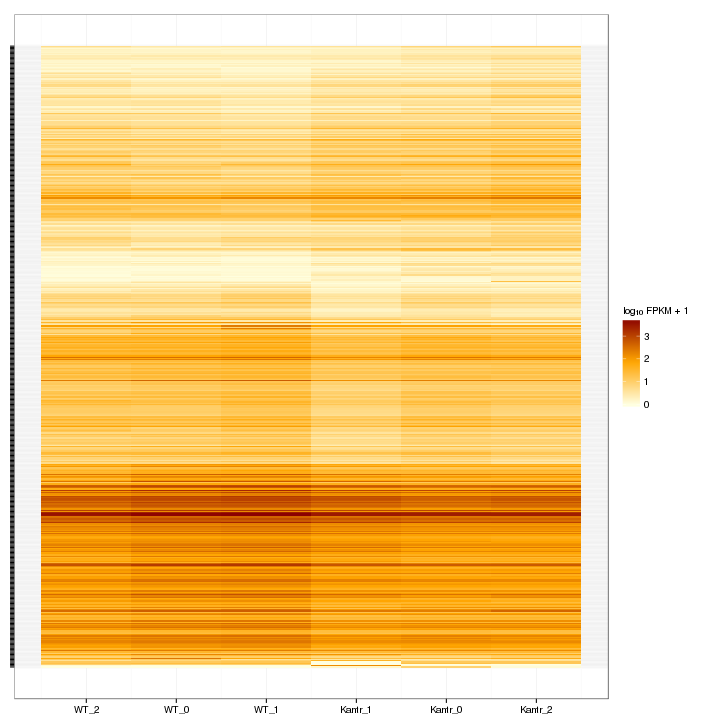 

Isoform foldchange heatmap by isoform:

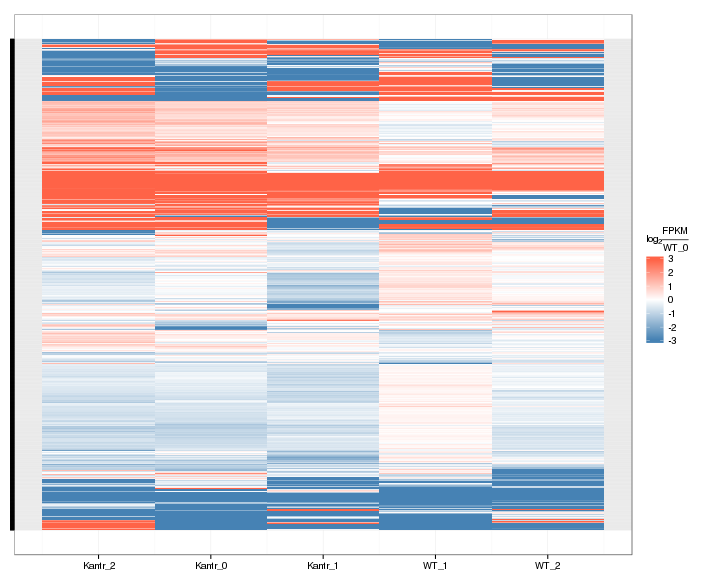 


### Differential Splicing between conditions

(eval false for first pass)

Per condition differences in isoforms (Does gene have diff piechart between conditions?)


These genes are:


Splicing heatmap by isoform:


Splicing heatmap by gene


The following are significantly differentially spliced genes (relative portion of isoform per condition): 


 


# Gene/Pathway Analysis

## GSEA

Enrichment and zscores are calculated based on expression in KO vs WT (fpkmKO/fpkmWT), so genes that are down regulated in KO are shown in blue, while upregulation is shown in red. 

KO/WT
Blue = down in KO
Red = Up in KO


Biocarta enrichment: 

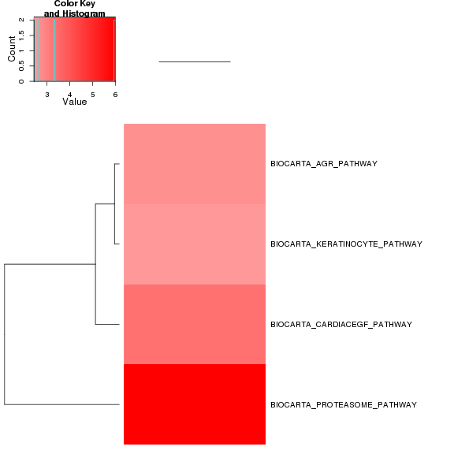 

Biocarta zscore: 

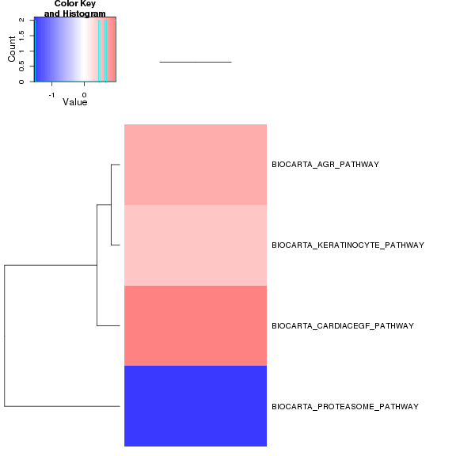 


Reactome enrichment: 

 


Reactome zscore: 

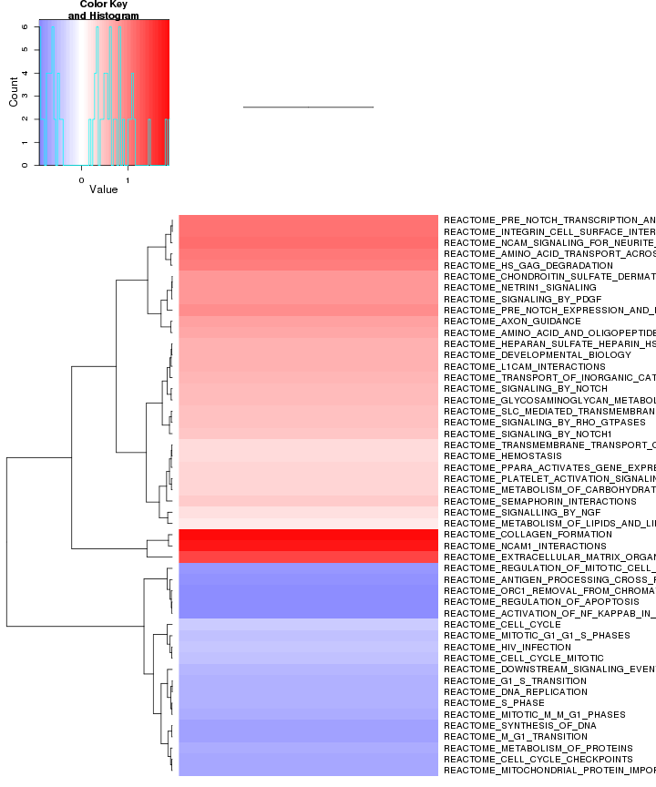 


Kegg enrichment: 

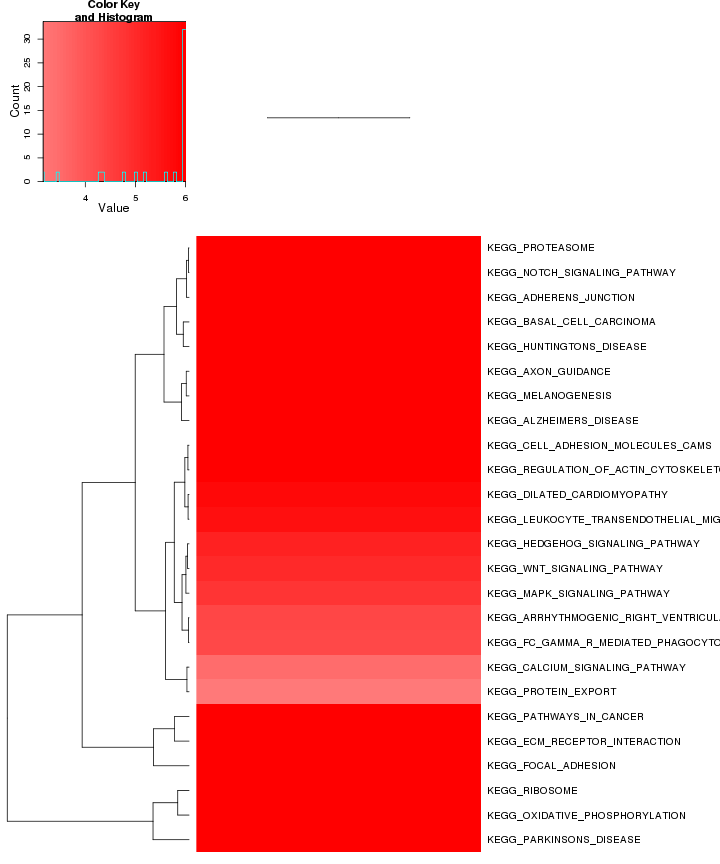 

Kegg zscore: 

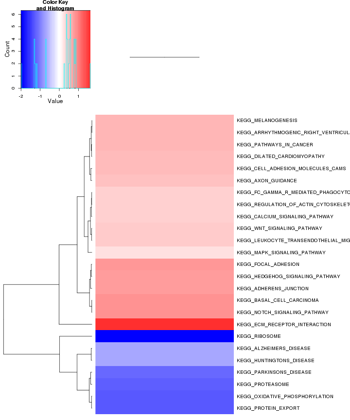 

Interneuron enrichment:


```
## Error: argument is of length zero
```

Interneuron zscore:


```
## Error: incorrect number of dimensions
```

```
## Error: `x' must have at least 2 rows and 2 columns
```


Oncogene enrichment: 


```
## Error: subscript out of bounds
```

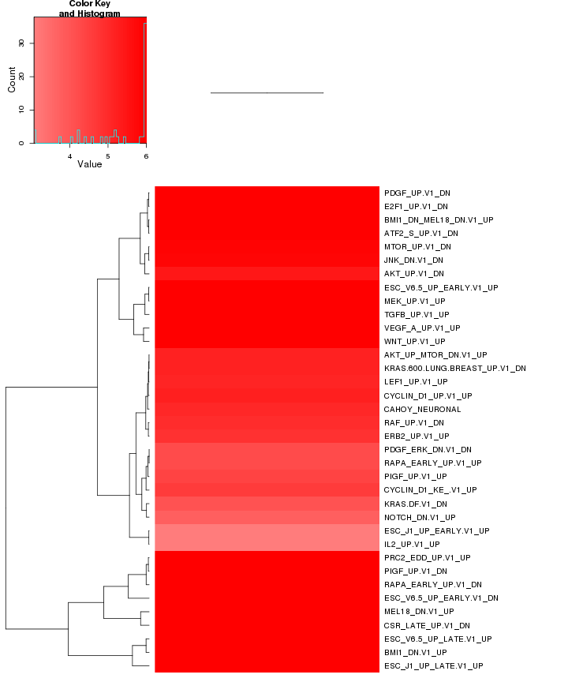 

Oncogene zscore:


```
## Error: subscript out of bounds
```

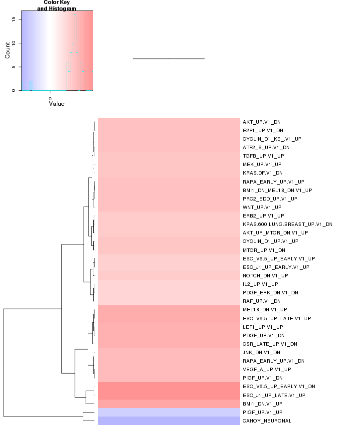 

Immuno enrichment:


```
## Error: no locations are finite
```

 

Immuno zscore:

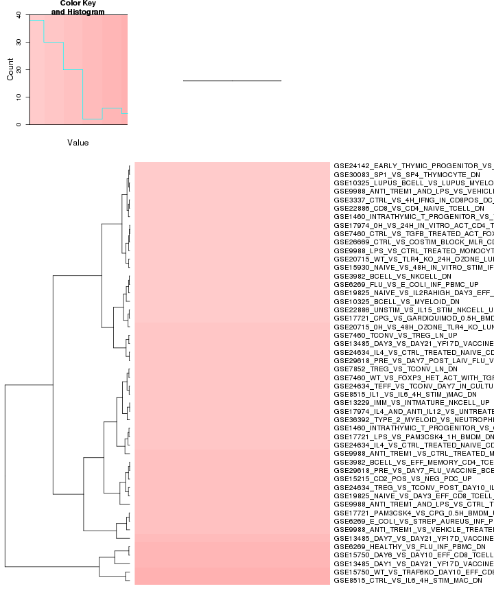 

TF enrichment:


```
## Error: no locations are finite
```

 

TF zscore:

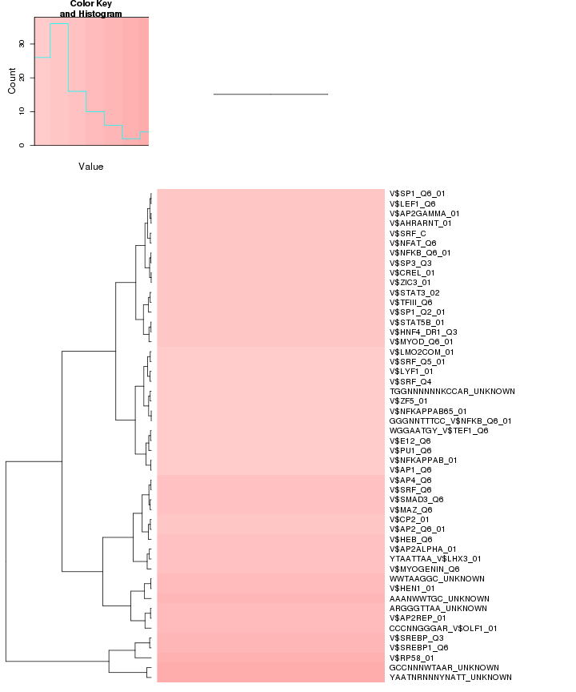 


## GO enrichment 
Cluster profiler used to call enichments of significantly differentially regulated genes that map to Entrez IDs. 


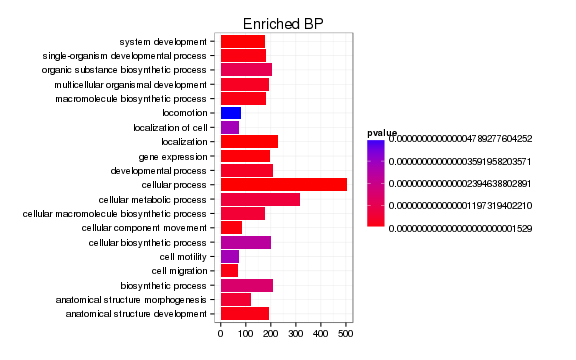 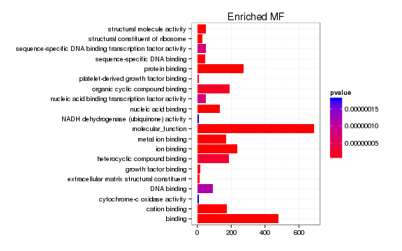 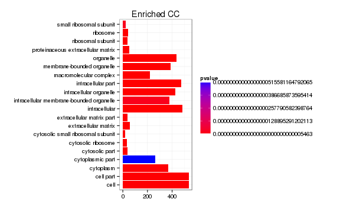 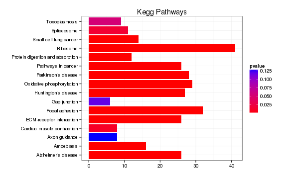 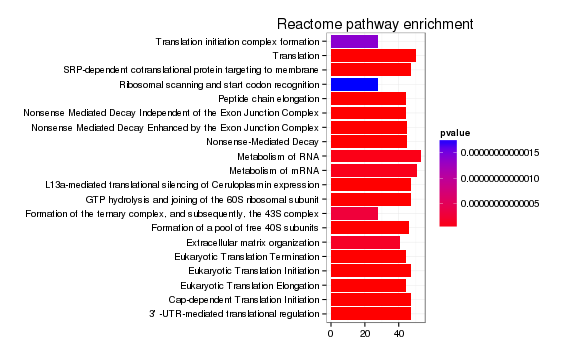 


### Enrichment or depletion for stage-specific cell cycle markers 

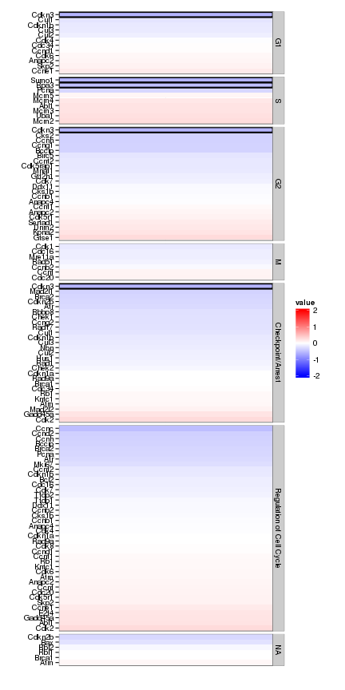 


### Enrichment or depletion for markers of specific cortical layers

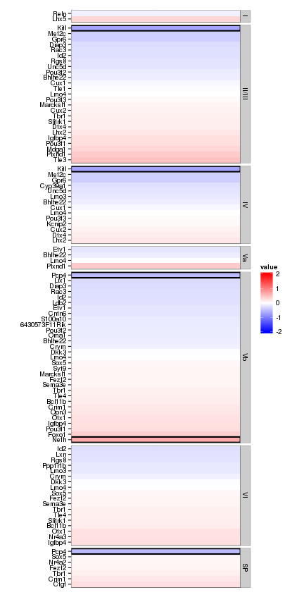 


### Enrichment or depletion for specific neural cell types 
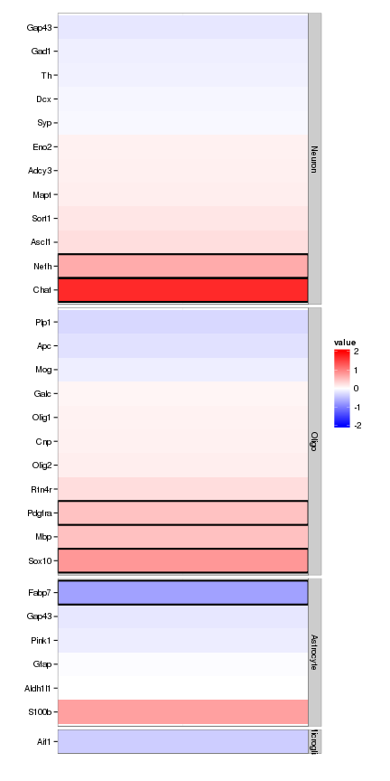 


### Enrichment or Depletion of neural differentiation markers 

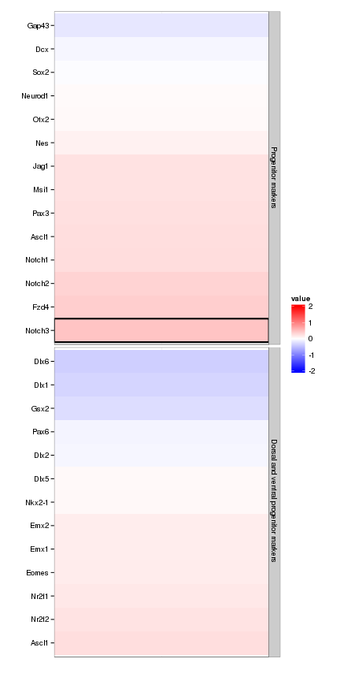 


# Cis vs Trans (locally)

log2 Foldchange and test statistic are calculated with the ratio of fpkm(KO)/fpkm(WT), thus the test_stat is positive if a gene is higher in the KO and negative if a gene has lower expression in the KO


The pvalue for 4 genes significantly regulated in a region this size  is: 0.37 


```
## Error: missing value where TRUE/FALSE needed
```

# Notes

## Samples used are:
<!-- html table generated in R 3.0.2 by xtable 1.7-3 package -->
<!-- Tue Jul 15 18:59:39 2014 -->
<TABLE border=1>
<TR> <TH>  </TH> <TH> 10 </TH>  </TR>
  <TR> <TD align="right"> 1 </TD> <TD> JR762 </TD> </TR>
  <TR> <TD align="right"> 2 </TD> <TD> JR774 </TD> </TR>
  <TR> <TD align="right"> 3 </TD> <TD> JR746 </TD> </TR>
  <TR> <TD align="right"> 4 </TD> <TD> JR775 </TD> </TR>
  <TR> <TD align="right"> 5 </TD> <TD> JR747 </TD> </TR>
  <TR> <TD align="right"> 6 </TD> <TD> JR812 </TD> </TR>
   </TABLE>

## Replicates
<!-- html table generated in R 3.0.2 by xtable 1.7-3 package -->
<!-- Tue Jul 15 18:59:39 2014 -->
<TABLE border=1>
<TR> <TH>  </TH> <TH> file </TH> <TH> sample_name </TH> <TH> replicate </TH> <TH> rep_name </TH> <TH> total_mass </TH> <TH> norm_mass </TH> <TH> internal_scale </TH> <TH> external_scale </TH>  </TR>
  <TR> <TD align="right"> 1 </TD> <TD> /n/rinn_data1/seq/lgoff/Projects/BrainMap/data/quants/JR762/abundances.cxb </TD> <TD> WT </TD> <TD align="right">   0 </TD> <TD> WT_0 </TD> <TD align="right"> 32218100.00 </TD> <TD align="right"> 33340200.00 </TD> <TD align="right"> 0.95 </TD> <TD align="right"> 1.00 </TD> </TR>
  <TR> <TD align="right"> 2 </TD> <TD> /n/rinn_data1/seq/lgoff/Projects/BrainMap/data/quants/JR774/abundances.cxb </TD> <TD> WT </TD> <TD align="right">   1 </TD> <TD> WT_1 </TD> <TD align="right"> 32505000.00 </TD> <TD align="right"> 33340200.00 </TD> <TD align="right"> 0.95 </TD> <TD align="right"> 1.00 </TD> </TR>
  <TR> <TD align="right"> 3 </TD> <TD> /n/rinn_data1/seq/lgoff/Projects/BrainMap/data/quants/JR746/abundances.cxb </TD> <TD> WT </TD> <TD align="right">   2 </TD> <TD> WT_2 </TD> <TD align="right"> 27986400.00 </TD> <TD align="right"> 33340200.00 </TD> <TD align="right"> 0.83 </TD> <TD align="right"> 1.00 </TD> </TR>
  <TR> <TD align="right"> 4 </TD> <TD> /n/rinn_data1/seq/lgoff/Projects/BrainMap/data/quants/JR775/abundances.cxb </TD> <TD> Kantr </TD> <TD align="right">   0 </TD> <TD> Kantr_0 </TD> <TD align="right"> 41486000.00 </TD> <TD align="right"> 33340200.00 </TD> <TD align="right"> 1.27 </TD> <TD align="right"> 1.00 </TD> </TR>
  <TR> <TD align="right"> 5 </TD> <TD> /n/rinn_data1/seq/lgoff/Projects/BrainMap/data/quants/JR747/abundances.cxb </TD> <TD> Kantr </TD> <TD align="right">   1 </TD> <TD> Kantr_1 </TD> <TD align="right"> 33582200.00 </TD> <TD align="right"> 33340200.00 </TD> <TD align="right"> 1.03 </TD> <TD align="right"> 1.00 </TD> </TR>
  <TR> <TD align="right"> 6 </TD> <TD> /n/rinn_data1/seq/lgoff/Projects/BrainMap/data/quants/JR812/abundances.cxb </TD> <TD> Kantr </TD> <TD align="right">   2 </TD> <TD> Kantr_2 </TD> <TD align="right"> 34934000.00 </TD> <TD align="right"> 33340200.00 </TD> <TD align="right"> 1.08 </TD> <TD align="right"> 1.00 </TD> </TR>
   </TABLE>

## Session Info

```
## R version 3.0.2 (2013-09-25)
## Platform: x86_64-unknown-linux-gnu (64-bit)
## 
## locale:
##  [1] LC_CTYPE=en_US.UTF-8       LC_NUMERIC=C              
##  [3] LC_TIME=en_US.UTF-8        LC_COLLATE=en_US.UTF-8    
##  [5] LC_MONETARY=en_US.UTF-8    LC_MESSAGES=en_US.UTF-8   
##  [7] LC_PAPER=en_US.UTF-8       LC_NAME=C                 
##  [9] LC_ADDRESS=C               LC_TELEPHONE=C            
## [11] LC_MEASUREMENT=en_US.UTF-8 LC_IDENTIFICATION=C       
## 
## attached base packages:
## [1] grid      parallel  methods   stats     graphics  grDevices utils    
## [8] datasets  base     
## 
## other attached packages:
##  [1] plyr_1.8.1                         
##  [2] stringr_0.6.2                      
##  [3] seqbias_1.10.0                     
##  [4] BSgenome.Mmusculus.UCSC.mm10_1.3.19
##  [5] BSgenome_1.30.0                    
##  [6] Biostrings_2.30.1                  
##  [7] gdata_2.13.3                       
##  [8] GO.db_2.10.1                       
##  [9] org.Mm.eg.db_2.10.1                
## [10] clusterProfiler_1.13.1             
## [11] DOSE_2.0.0                         
## [12] ReactomePA_1.6.1                   
## [13] AnnotationDbi_1.24.0               
## [14] Biobase_2.22.0                     
## [15] mgcv_1.7-29                        
## [16] nlme_3.1-117                       
## [17] RMySQL_0.9-3                       
## [18] RColorBrewer_1.0-5                 
## [19] gridExtra_0.9.1                    
## [20] gtable_0.1.2                       
## [21] marray_1.40.0                      
## [22] gplots_2.13.0                      
## [23] GSA_1.03                           
## [24] limma_3.18.13                      
## [25] xtable_1.7-3                       
## [26] cummeRbund_2.7.2                   
## [27] Gviz_1.6.0                         
## [28] rtracklayer_1.22.7                 
## [29] GenomicRanges_1.14.4               
## [30] XVector_0.2.0                      
## [31] IRanges_1.20.7                     
## [32] fastcluster_1.1.13                 
## [33] reshape2_1.4                       
## [34] ggplot2_1.0.0                      
## [35] RSQLite_0.11.4                     
## [36] DBI_0.2-7                          
## [37] BiocGenerics_0.8.0                 
## [38] knitr_1.6                          
## 
## loaded via a namespace (and not attached):
##  [1] biomaRt_2.18.0         biovizBase_1.10.8      bitops_1.0-6          
##  [4] caTools_1.17           cluster_1.15.2         colorspace_1.2-4      
##  [7] dichromat_2.0-0        digest_0.6.4           DO.db_2.7             
## [10] evaluate_0.5.5         formatR_0.10           Formula_1.1-1         
## [13] GenomicFeatures_1.14.5 GOSemSim_1.20.3        graph_1.40.1          
## [16] graphite_1.8.1         gtools_3.4.1           Hmisc_3.14-4          
## [19] igraph_0.7.1           KEGG.db_2.10.1         KernSmooth_2.23-12    
## [22] labeling_0.2           lattice_0.20-29        latticeExtra_0.6-26   
## [25] MASS_7.3-33            Matrix_1.1-3           munsell_0.4.2         
## [28] org.Hs.eg.db_2.10.1    proto_0.3-10           qvalue_1.36.0         
## [31] Rcpp_0.11.2            RCurl_1.95-4.1         reactome.db_1.46.1    
## [34] Rsamtools_1.14.3       scales_0.2.4           splines_3.0.2         
## [37] stats4_3.0.2           survival_2.37-7        tcltk_3.0.2           
## [40] tools_3.0.2            XML_3.98-1.1           zlibbioc_1.8.0
```

## Run Info

```
##           param
## 1      cmd_line
## 2       version
## 3  SVN_revision
## 4 boost_version
## 5        genome
##                                                                                                                                                                                                                                                                                                                                                                                                                                                                                                                                                                                                                                                                              value
## 1 cuffdiff -p 10 -L WT,Kantr -o /n/rinn_data1/seq/lgoff/Projects/BrainMap/data/diffs/Kantr_vs_WT_Embryonic /n/rinn_data1/seq/lgoff/Projects/BrainMap/data/annotation/mm10_gencode_vM2_with_lncRNAs_and_LacZ.gtf /n/rinn_data1/seq/lgoff/Projects/BrainMap/data/quants/JR762/abundances.cxb,/n/rinn_data1/seq/lgoff/Projects/BrainMap/data/quants/JR774/abundances.cxb,/n/rinn_data1/seq/lgoff/Projects/BrainMap/data/quants/JR746/abundances.cxb /n/rinn_data1/seq/lgoff/Projects/BrainMap/data/quants/JR775/abundances.cxb,/n/rinn_data1/seq/lgoff/Projects/BrainMap/data/quants/JR747/abundances.cxb,/n/rinn_data1/seq/lgoff/Projects/BrainMap/data/quants/JR812/abundances.cxb 
## 2                                                                                                                                                                                                                                                                                                                                                                                                                                                                                                                                                                                                                                                                            2.2.1
## 3                                                                                                                                                                                                                                                                                                                                                                                                                                                                                                                                                                                                                                                                             4237
## 4                                                                                                                                                                                                                                                                                                                                                                                                                                                                                                                                                                                                                                                                           104700
## 5                                                                                                                                                                                                                                                                                                                                                                                                                                                                                                                                                                                                                                                                             mm10
```


