Manr KO vs WT (Embryonic)
======================================


- add labels, descriptions
- turn off all caching ! 
- other heatmap labels (csHeatmap)
- overlap figure
- tracks 
- should import litter info


# Intialize


# Design Overview

This file shows the wt-v-ko comparison for Manr. 

Cuff overview:

```
## CuffSet instance with:
## 	 2 samples
## 	 26754 genes
## 	 77524 isoforms
## 	 0 TSS
## 	 0 CDS
## 	 0 promoters
## 	 0 splicing
## 	 0 relCDS
```


# QC

## Dispersion

Dispersion plot for genes in cuff:
(Overdispersion can lead to innacurate quants)


```
## Error: 'from' cannot be NA, NaN or infinite
```

## Cross-replicate variability (fpkmSCVplot)
Differences in CV 2 can result in lower numbers of differentially expressed genes due to a higher degree of variability between replicate fpkm estimates.

Genes:

```
## Scale for 'x' is already present. Adding another scale for 'x', which will replace the existing scale.
## geom_smooth: method="auto" and size of largest group is >=1000, so using gam with formula: y ~ s(x, bs = "cs"). Use 'method = x' to change the smoothing method.
```

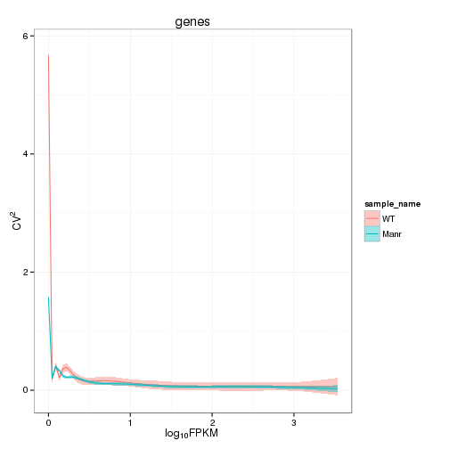 


Isoforms: 

```
## Scale for 'x' is already present. Adding another scale for 'x', which will replace the existing scale.
## geom_smooth: method="auto" and size of largest group is >=1000, so using gam with formula: y ~ s(x, bs = "cs"). Use 'method = x' to change the smoothing method.
```

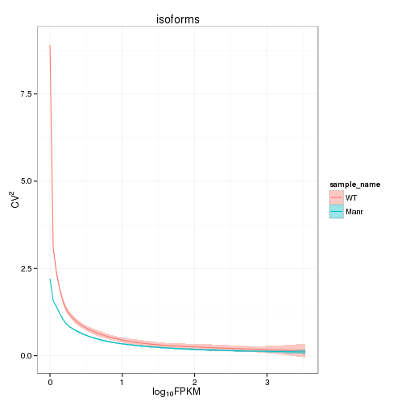 

## Volcano

```
## Error: One or more values of 'x' or 'y' are not valid sample names!
```

### Volcano matrix (replicates)

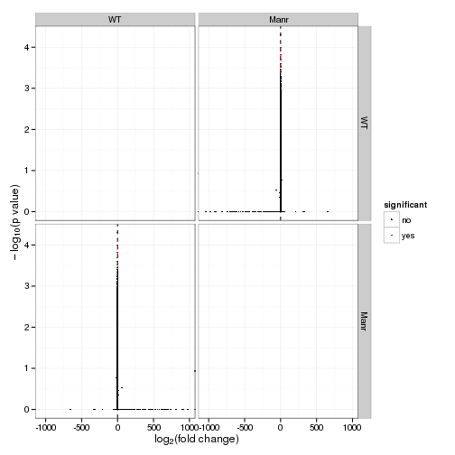 

## MvA plot

```
## Error: non-numeric argument to binary operator
```
   
### MvA plot counts

```
## Error: non-numeric argument to binary operator
```

## Scatterplot
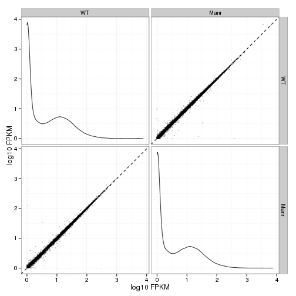 

### Scatter matrix (replicates) -- SKIP FOR NOW CAUSING PROBLEMS 


## Distributions

### Boxplots

Boxplot (genes)

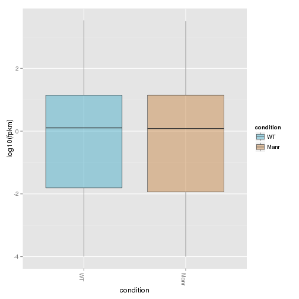 

Boxplot (genes, replicates)

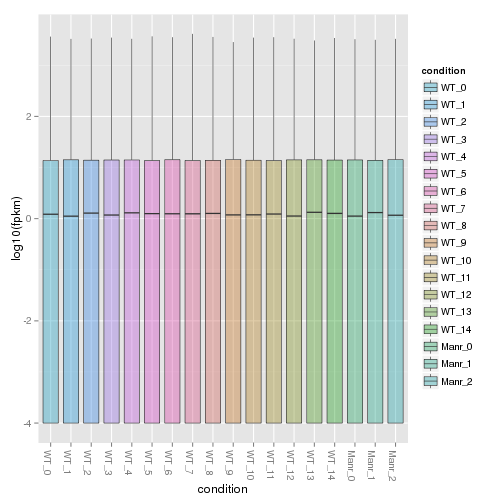 

Boxplot (isoforms)

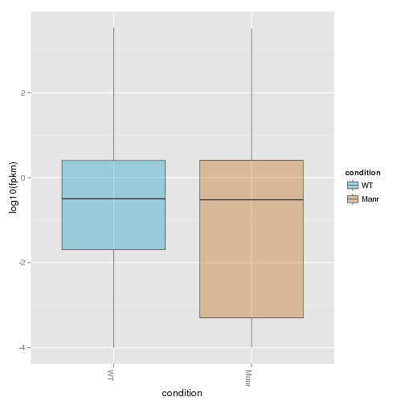 

Boxplot (isoforms, replicates)

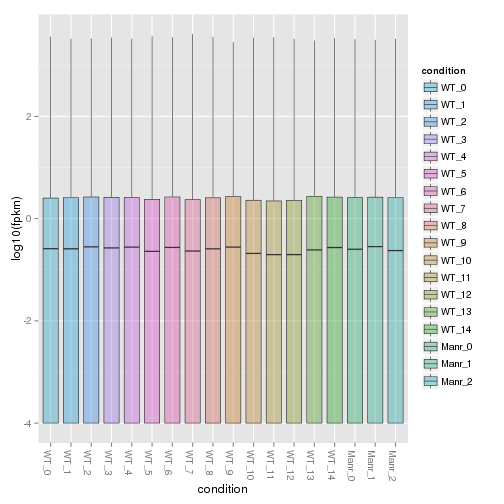 

### Density

Density (genes)

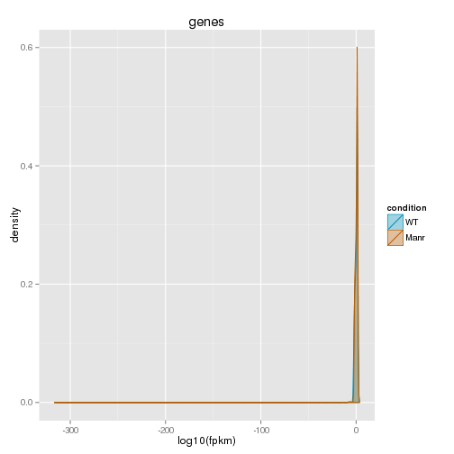 

Density (genes, replicates)

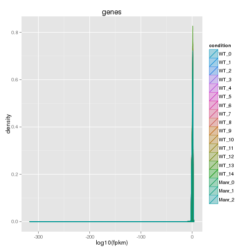 


## Clustering

### Replicate Clusters
 

```
## 'dendrogram' with 2 branches and 18 members total, at height 0.084
```

### PCA (genes)
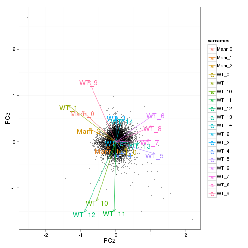 

### MDS (genes)
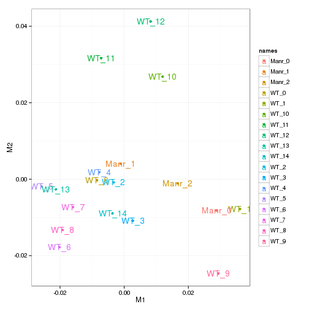 

### Distance Heat Map (genes)
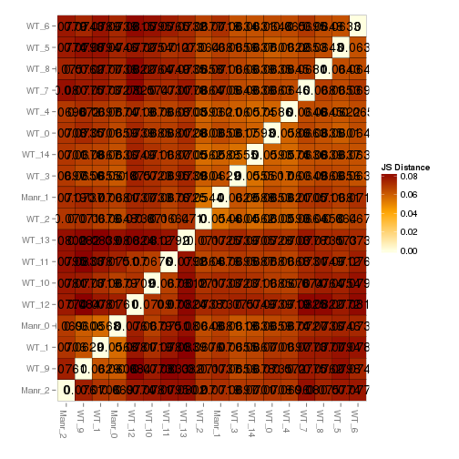 


# KO assessment

## Endogenous lncRNA expression

<!-- html table generated in R 3.0.2 by xtable 1.7-3 package -->
<!-- Mon Jun 16 15:49:37 2014 -->
<TABLE border=1>
<TR> <TH>  </TH> <TH> gene_id </TH> <TH> sample_name </TH> <TH> fpkm </TH> <TH> conf_hi </TH> <TH> conf_lo </TH> <TH> quant_status </TH>  </TR>
  <TR> <TD align="right"> 1 </TD> <TD> Manr </TD> <TD> Manr </TD> <TD align="right"> 0.05 </TD> <TD align="right"> 0.13 </TD> <TD align="right"> 0.00 </TD> <TD> OK </TD> </TR>
  <TR> <TD align="right"> 2 </TD> <TD> Manr </TD> <TD> WT </TD> <TD align="right"> 0.02 </TD> <TD align="right"> 0.07 </TD> <TD align="right"> 0.00 </TD> <TD> OK </TD> </TR>
   </TABLE>
<!-- html table generated in R 3.0.2 by xtable 1.7-3 package -->
<!-- Mon Jun 16 15:49:37 2014 -->
<TABLE border=1>
<TR> <TH>  </TH> <TH> isoform_id </TH> <TH> sample_name </TH> <TH> fpkm </TH> <TH> conf_hi </TH> <TH> conf_lo </TH> <TH> quant_status </TH>  </TR>
  <TR> <TD align="right"> 1 </TD> <TD> uc008oul.1 </TD> <TD> Manr </TD> <TD align="right"> 0.05 </TD> <TD align="right"> 0.13 </TD> <TD align="right"> 0.00 </TD> <TD> OK </TD> </TR>
  <TR> <TD align="right"> 2 </TD> <TD> uc008oul.1 </TD> <TD> WT </TD> <TD align="right"> 0.02 </TD> <TD align="right"> 0.07 </TD> <TD align="right"> 0.00 </TD> <TD> OK </TD> </TR>
   </TABLE>
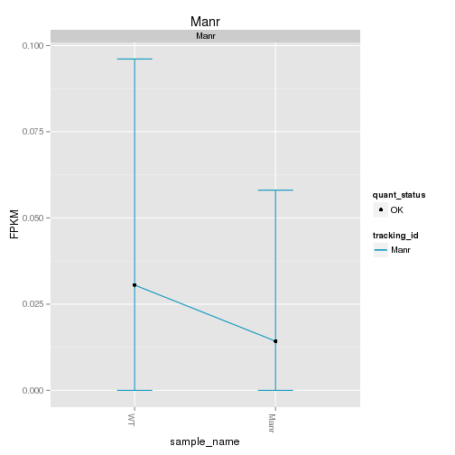 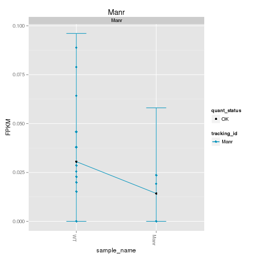 

Endogenous expression of Manr isoforms:

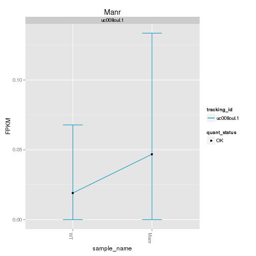  

Barplot of gene expression:

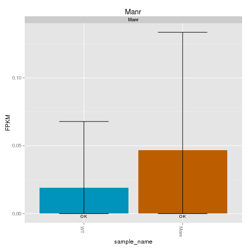  

Barplot of isoform expression:

 


## LacZ expression

<!-- html table generated in R 3.0.2 by xtable 1.7-3 package -->
<!-- Mon Jun 16 15:49:46 2014 -->
<TABLE border=1>
<TR> <TH>  </TH> <TH> gene_id </TH> <TH> sample_name </TH> <TH> fpkm </TH> <TH> conf_hi </TH> <TH> conf_lo </TH> <TH> quant_status </TH>  </TR>
  <TR> <TD align="right"> 1 </TD> <TD> Velocigene_LacZ </TD> <TD> Manr </TD> <TD align="right"> 0.88 </TD> <TD align="right"> 1.30 </TD> <TD align="right"> 0.47 </TD> <TD> OK </TD> </TR>
  <TR> <TD align="right"> 2 </TD> <TD> Velocigene_LacZ </TD> <TD> WT </TD> <TD align="right"> 0.02 </TD> <TD align="right"> 0.06 </TD> <TD align="right"> 0.00 </TD> <TD> OK </TD> </TR>
   </TABLE>
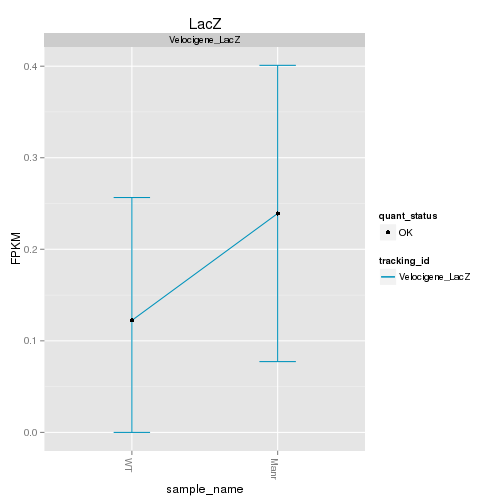 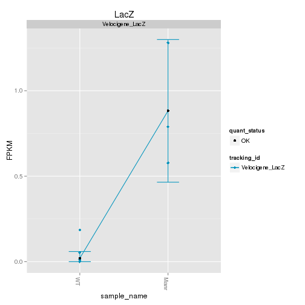  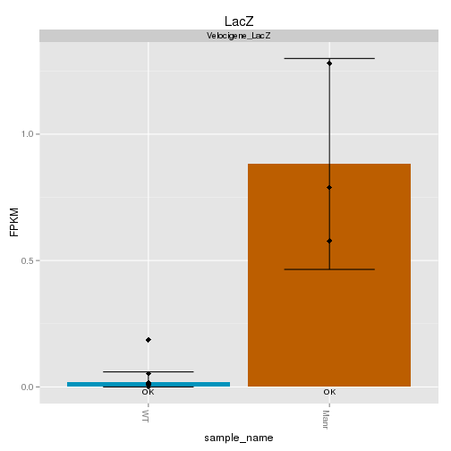 


## Digital Genotyping (LacZ vs Endogenous lncRNA and Sex)
Expression plot (endogenous linc, lacZ, Y-expressed gene):


```
## Scale for 'colour' is already present. Adding another scale for 'colour', which will replace the existing scale.
## ymax not defined: adjusting position using y instead
```

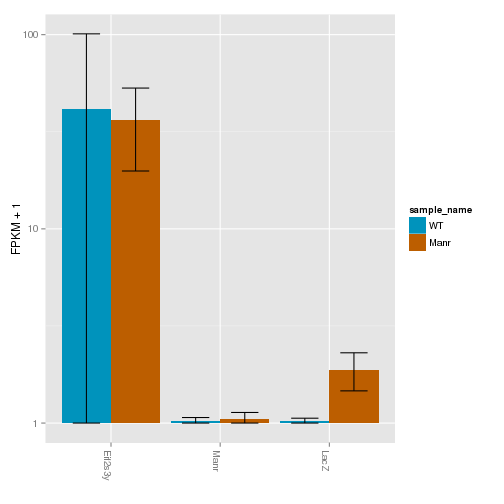 

Expression heatmap:

```
## Using tracking_id, rep_name as id variables
## No id variables; using all as measure variables
```

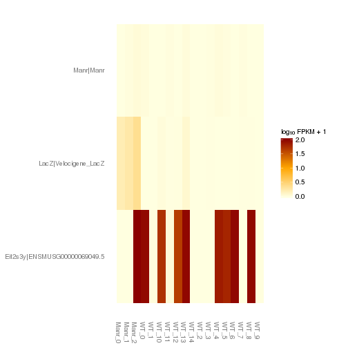 

# Differential Analysis

## Differential Genes 


There are 100 significantly differentially expressed genes. They are:

<!-- html table generated in R 3.0.2 by xtable 1.7-3 package -->
<!-- Mon Jun 16 15:49:54 2014 -->
<TABLE border=1>
<TR> <TH>  </TH> <TH> geneAnnot$gene_short_name </TH>  </TR>
  <TR> <TD align="right"> 1 </TD> <TD> Cdh1 </TD> </TR>
  <TR> <TD align="right"> 2 </TD> <TD> Gabra2 </TD> </TR>
  <TR> <TD align="right"> 3 </TD> <TD> Col1a1 </TD> </TR>
  <TR> <TD align="right"> 4 </TD> <TD> Phyhip </TD> </TR>
  <TR> <TD align="right"> 5 </TD> <TD> Cacna1e </TD> </TR>
  <TR> <TD align="right"> 6 </TD> <TD> Aqp1 </TD> </TR>
  <TR> <TD align="right"> 7 </TD> <TD> Bcan </TD> </TR>
  <TR> <TD align="right"> 8 </TD> <TD> Fam131c </TD> </TR>
  <TR> <TD align="right"> 9 </TD> <TD> Kif11 </TD> </TR>
  <TR> <TD align="right"> 10 </TD> <TD> Ptgds </TD> </TR>
  <TR> <TD align="right"> 11 </TD> <TD> Hivep2 </TD> </TR>
  <TR> <TD align="right"> 12 </TD> <TD> Eef1a2 </TD> </TR>
  <TR> <TD align="right"> 13 </TD> <TD> Ascl1 </TD> </TR>
  <TR> <TD align="right"> 14 </TD> <TD> Adcy1 </TD> </TR>
  <TR> <TD align="right"> 15 </TD> <TD> Doc2b </TD> </TR>
  <TR> <TD align="right"> 16 </TD> <TD> Sptb </TD> </TR>
  <TR> <TD align="right"> 17 </TD> <TD> Gng4 </TD> </TR>
  <TR> <TD align="right"> 18 </TD> <TD> Clu </TD> </TR>
  <TR> <TD align="right"> 19 </TD> <TD> Sla </TD> </TR>
  <TR> <TD align="right"> 20 </TD> <TD> Shisa9 </TD> </TR>
  <TR> <TD align="right"> 21 </TD> <TD> Lynx1 </TD> </TR>
  <TR> <TD align="right"> 22 </TD> <TD> Prss41 </TD> </TR>
  <TR> <TD align="right"> 23 </TD> <TD> Mal2 </TD> </TR>
  <TR> <TD align="right"> 24 </TD> <TD> Gnal </TD> </TR>
  <TR> <TD align="right"> 25 </TD> <TD> Snca </TD> </TR>
  <TR> <TD align="right"> 26 </TD> <TD> Sphkap </TD> </TR>
  <TR> <TD align="right"> 27 </TD> <TD> Cybrd1 </TD> </TR>
  <TR> <TD align="right"> 28 </TD> <TD> Fabp5 </TD> </TR>
  <TR> <TD align="right"> 29 </TD> <TD> Slc7a11 </TD> </TR>
  <TR> <TD align="right"> 30 </TD> <TD> Rps3a1 </TD> </TR>
  <TR> <TD align="right"> 31 </TD> <TD> Nr4a3 </TD> </TR>
  <TR> <TD align="right"> 32 </TD> <TD> Tnc </TD> </TR>
  <TR> <TD align="right"> 33 </TD> <TD> Tal2 </TD> </TR>
  <TR> <TD align="right"> 34 </TD> <TD> Hpca </TD> </TR>
  <TR> <TD align="right"> 35 </TD> <TD> Ppp2r2c </TD> </TR>
  <TR> <TD align="right"> 36 </TD> <TD> Fosl2 </TD> </TR>
  <TR> <TD align="right"> 37 </TD> <TD> Rph3a </TD> </TR>
  <TR> <TD align="right"> 38 </TD> <TD> Eln </TD> </TR>
  <TR> <TD align="right"> 39 </TD> <TD> Dync1i1 </TD> </TR>
  <TR> <TD align="right"> 40 </TD> <TD> Slc6a11 </TD> </TR>
  <TR> <TD align="right"> 41 </TD> <TD> Dbx1 </TD> </TR>
  <TR> <TD align="right"> 42 </TD> <TD> Hddc3 </TD> </TR>
  <TR> <TD align="right"> 43 </TD> <TD> Mfge8 </TD> </TR>
  <TR> <TD align="right"> 44 </TD> <TD> Thy1 </TD> </TR>
  <TR> <TD align="right"> 45 </TD> <TD> Robo3 </TD> </TR>
  <TR> <TD align="right"> 46 </TD> <TD> Clstn2 </TD> </TR>
  <TR> <TD align="right"> 47 </TD> <TD> Cspg5 </TD> </TR>
  <TR> <TD align="right"> 48 </TD> <TD> Ablim3 </TD> </TR>
  <TR> <TD align="right"> 49 </TD> <TD> Camkv </TD> </TR>
  <TR> <TD align="right"> 50 </TD> <TD> Mgll </TD> </TR>
  <TR> <TD align="right"> 51 </TD> <TD> Gucy1a3 </TD> </TR>
  <TR> <TD align="right"> 52 </TD> <TD> Arhgap27 </TD> </TR>
  <TR> <TD align="right"> 53 </TD> <TD> Sncb </TD> </TR>
  <TR> <TD align="right"> 54 </TD> <TD> Mid1 </TD> </TR>
  <TR> <TD align="right"> 55 </TD> <TD> Kif15 </TD> </TR>
  <TR> <TD align="right"> 56 </TD> <TD> Nov </TD> </TR>
  <TR> <TD align="right"> 57 </TD> <TD> Vgf </TD> </TR>
  <TR> <TD align="right"> 58 </TD> <TD> Camk4 </TD> </TR>
  <TR> <TD align="right"> 59 </TD> <TD> Pcsk1n </TD> </TR>
  <TR> <TD align="right"> 60 </TD> <TD> Grin3a </TD> </TR>
  <TR> <TD align="right"> 61 </TD> <TD> Gabbr2 </TD> </TR>
  <TR> <TD align="right"> 62 </TD> <TD> Necab1 </TD> </TR>
  <TR> <TD align="right"> 63 </TD> <TD> Car8 </TD> </TR>
  <TR> <TD align="right"> 64 </TD> <TD> Mpped1 </TD> </TR>
  <TR> <TD align="right"> 65 </TD> <TD> Bend6 </TD> </TR>
  <TR> <TD align="right"> 66 </TD> <TD> Hebp1 </TD> </TR>
  <TR> <TD align="right"> 67 </TD> <TD> Tuba1c </TD> </TR>
  <TR> <TD align="right"> 68 </TD> <TD> Cnpy1 </TD> </TR>
  <TR> <TD align="right"> 69 </TD> <TD> Prkce </TD> </TR>
  <TR> <TD align="right"> 70 </TD> <TD> Olig1 </TD> </TR>
  <TR> <TD align="right"> 71 </TD> <TD> Nxph3 </TD> </TR>
  <TR> <TD align="right"> 72 </TD> <TD> Mc4r </TD> </TR>
  <TR> <TD align="right"> 73 </TD> <TD> Tmem72 </TD> </TR>
  <TR> <TD align="right"> 74 </TD> <TD> Grm5 </TD> </TR>
  <TR> <TD align="right"> 75 </TD> <TD> Pla2g4e </TD> </TR>
  <TR> <TD align="right"> 76 </TD> <TD> Kcns2 </TD> </TR>
  <TR> <TD align="right"> 77 </TD> <TD> Slc6a7 </TD> </TR>
  <TR> <TD align="right"> 78 </TD> <TD> Hbb-y </TD> </TR>
  <TR> <TD align="right"> 79 </TD> <TD> Gpr17 </TD> </TR>
  <TR> <TD align="right"> 80 </TD> <TD> Hbb-bs </TD> </TR>
  <TR> <TD align="right"> 81 </TD> <TD> Aldh1a1 </TD> </TR>
  <TR> <TD align="right"> 82 </TD> <TD> AI854703 </TD> </TR>
  <TR> <TD align="right"> 83 </TD> <TD> 6330403A02Rik </TD> </TR>
  <TR> <TD align="right"> 84 </TD> <TD> Vsnl1 </TD> </TR>
  <TR> <TD align="right"> 85 </TD> <TD> Hmgb2 </TD> </TR>
  <TR> <TD align="right"> 86 </TD> <TD> Gabra5 </TD> </TR>
  <TR> <TD align="right"> 87 </TD> <TD> Adap1 </TD> </TR>
  <TR> <TD align="right"> 88 </TD> <TD> Hmga2 </TD> </TR>
  <TR> <TD align="right"> 89 </TD> <TD> Tpm3-rs7 </TD> </TR>
  <TR> <TD align="right"> 90 </TD> <TD> Caln1 </TD> </TR>
  <TR> <TD align="right"> 91 </TD> <TD> Zfp868 </TD> </TR>
  <TR> <TD align="right"> 92 </TD> <TD> Opcml </TD> </TR>
  <TR> <TD align="right"> 93 </TD> <TD> Otof </TD> </TR>
  <TR> <TD align="right"> 94 </TD> <TD> Pcna-ps2 </TD> </TR>
  <TR> <TD align="right"> 95 </TD> <TD> Rpl23 </TD> </TR>
  <TR> <TD align="right"> 96 </TD> <TD> Wdfy1 </TD> </TR>
  <TR> <TD align="right"> 97 </TD> <TD> Hbb-bt </TD> </TR>
  <TR> <TD align="right"> 98 </TD> <TD> AI593442 </TD> </TR>
  <TR> <TD align="right"> 99 </TD> <TD> Hs3st4 </TD> </TR>
  <TR> <TD align="right"> 100 </TD> <TD> AA465934 </TD> </TR>
   </TABLE>

### Matrix of gene significant differences between conditions

(skip for Brainmap wt-v-ko comparisons)

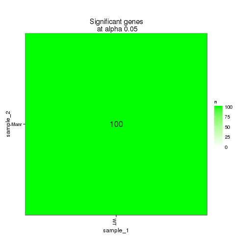 

### Significant gene expression differences between conditions

Expression plot (genes):
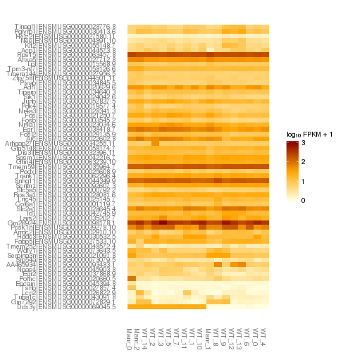 

```
## Using tracking_id, rep_name as id variables
## No id variables; using all as measure variables
```

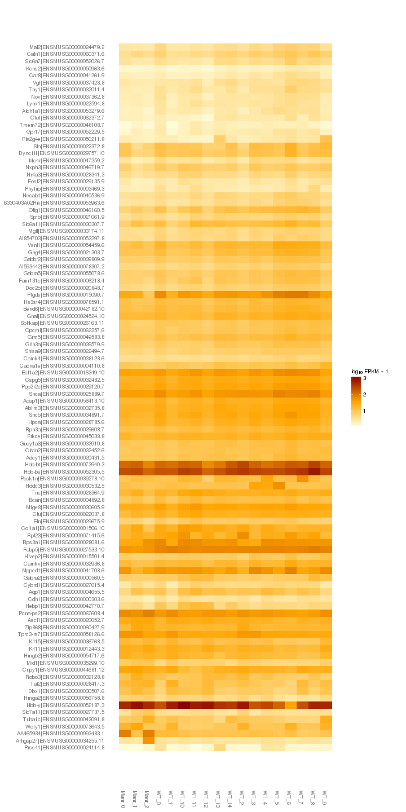 

Significant genes with expression >50fpkm (any condition):

```
## Using tracking_id, sample_name as id variables
```

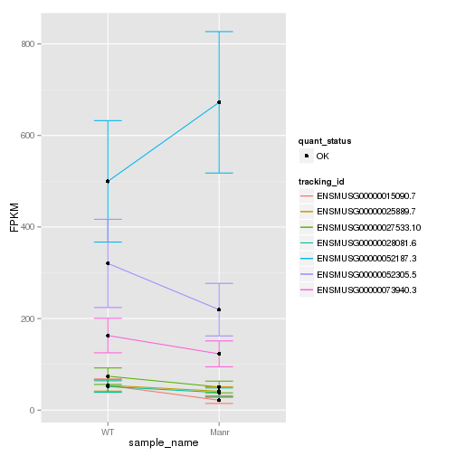 

An individual look at each of the highly expressed significantly differentially regulated genes:
(eval=false for first pass)


### Expression-level/significance relationship

Scatter plot of significant genes only:

```
## Using tracking_id, sample_name as id variables
```

```
## Error: One or more values of 'x' or 'y' are not valid sample names!
```

Volcano plot with significant genes only:

```
## Error: One or more values of 'x' or 'y' are not valid sample names!
```


## Differential Splicing

### Differential Isoforms between conditions
Per isoform difference between conditions:
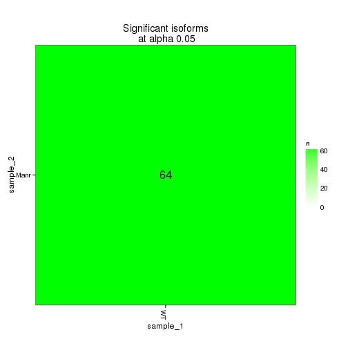 

These isoforms are:

```
## Error: no applicable method for 'xtable' applied to an object of class
## "character"
```


```
## Using tracking_id, rep_name as id variables
```

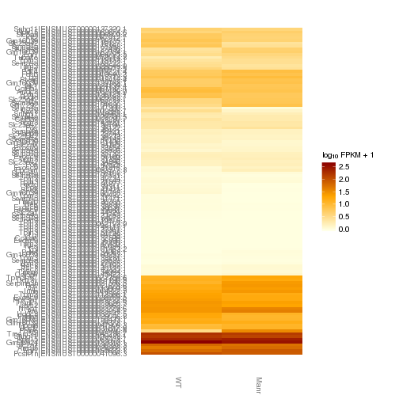 

### Differential Splicing between conditions

(eval false for first pass)

Per condition differences in isoforms (Does gene have diff piechart between conditions?)


These genes are:


Splicing heatmap by isoform:


Splicing heatmap by gene


The following are significantly differentially spliced genes (relative portion of isoform per condition): 


 


# Gene/Pathway Analysis

## GSEA


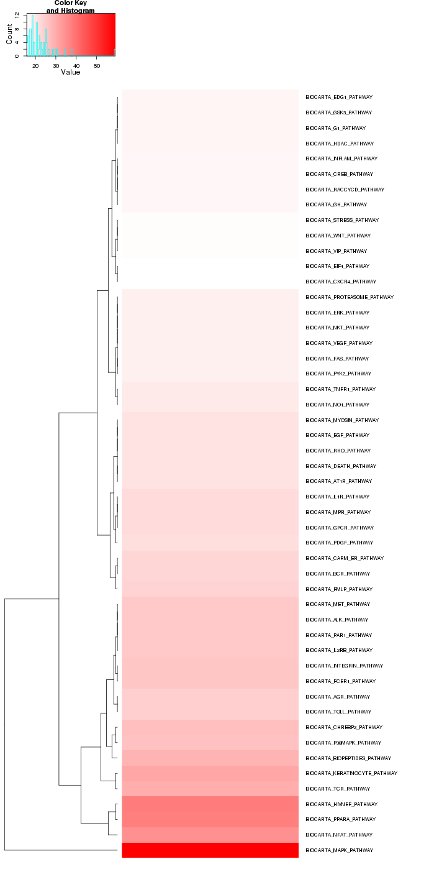 

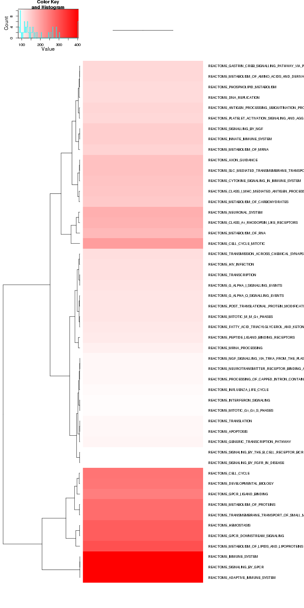 

## GO enrichment 
Cluster profiler used to call enichments of significantly differentially regulated genes that map to Entrez IDs. 

Description/explanation of what's here, and justify all choices. 


biomart to get entrez gene IDS
clusterProfiler does GO enrichment 

BP, MF, CC
enrichKEGG
enrichPathway


```
## Loading required package: biomaRt
## 
## Attaching package: 'biomaRt'
## 
## The following object is masked from 'package:cummeRbund':
## 
##     getGene
```

```
## [1] "ERROR: The estimated pi0 <= 0. Check that you have valid p-values or use another lambda method."
```

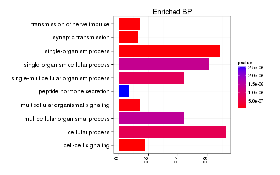 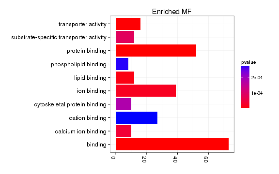   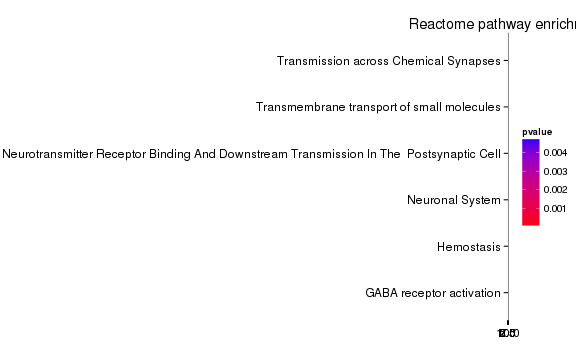 

# Cis vs Trans (locally)


# Notes

## Samples used are:
<!-- html table generated in R 3.0.2 by xtable 1.7-3 package -->
<!-- Mon Jun 16 15:52:38 2014 -->
<TABLE border=1>
<TR> <TH>  </TH> <TH> 10 </TH>  </TR>
  <TR> <TD align="right"> 1 </TD> <TD> JR753 </TD> </TR>
  <TR> <TD align="right"> 2 </TD> <TD> JR750 </TD> </TR>
  <TR> <TD align="right"> 3 </TD> <TD> JR771 </TD> </TR>
  <TR> <TD align="right"> 4 </TD> <TD> JR755 </TD> </TR>
  <TR> <TD align="right"> 5 </TD> <TD> JR811 </TD> </TR>
  <TR> <TD align="right"> 6 </TD> <TD> JR768 </TD> </TR>
  <TR> <TD align="right"> 7 </TD> <TD> JR761 </TD> </TR>
  <TR> <TD align="right"> 8 </TD> <TD> JR815 </TD> </TR>
  <TR> <TD align="right"> 9 </TD> <TD> JR789 </TD> </TR>
  <TR> <TD align="right"> 10 </TD> <TD> JR748 </TD> </TR>
  <TR> <TD align="right"> 11 </TD> <TD> JR716 </TD> </TR>
  <TR> <TD align="right"> 12 </TD> <TD> JR717 </TD> </TR>
  <TR> <TD align="right"> 13 </TD> <TD> JR719 </TD> </TR>
  <TR> <TD align="right"> 14 </TD> <TD> JR791 </TD> </TR>
  <TR> <TD align="right"> 15 </TD> <TD> JR756 </TD> </TR>
  <TR> <TD align="right"> 16 </TD> <TD> JR751 </TD> </TR>
  <TR> <TD align="right"> 17 </TD> <TD> JR772 </TD> </TR>
  <TR> <TD align="right"> 18 </TD> <TD> JR788 </TD> </TR>
   </TABLE>

## Replicates
<!-- html table generated in R 3.0.2 by xtable 1.7-3 package -->
<!-- Mon Jun 16 15:52:38 2014 -->
<TABLE border=1>
<TR> <TH>  </TH> <TH> file </TH> <TH> sample_name </TH> <TH> replicate </TH> <TH> rep_name </TH> <TH> total_mass </TH> <TH> norm_mass </TH> <TH> internal_scale </TH> <TH> external_scale </TH>  </TR>
  <TR> <TD align="right"> 1 </TD> <TD> /n/rinn_data1/seq/lgoff/Projects/BrainMap/data/quants/JR753/abundances.cxb </TD> <TD> WT </TD> <TD align="right">   0 </TD> <TD> WT_0 </TD> <TD align="right"> 39343800.00 </TD> <TD align="right"> 30341200.00 </TD> <TD align="right"> 1.34 </TD> <TD align="right"> 1.00 </TD> </TR>
  <TR> <TD align="right"> 2 </TD> <TD> /n/rinn_data1/seq/lgoff/Projects/BrainMap/data/quants/JR750/abundances.cxb </TD> <TD> WT </TD> <TD align="right">   1 </TD> <TD> WT_1 </TD> <TD align="right"> 36041100.00 </TD> <TD align="right"> 30341200.00 </TD> <TD align="right"> 1.17 </TD> <TD align="right"> 1.00 </TD> </TR>
  <TR> <TD align="right"> 3 </TD> <TD> /n/rinn_data1/seq/lgoff/Projects/BrainMap/data/quants/JR771/abundances.cxb </TD> <TD> WT </TD> <TD align="right">   2 </TD> <TD> WT_2 </TD> <TD align="right"> 38877000.00 </TD> <TD align="right"> 30341200.00 </TD> <TD align="right"> 1.30 </TD> <TD align="right"> 1.00 </TD> </TR>
  <TR> <TD align="right"> 4 </TD> <TD> /n/rinn_data1/seq/lgoff/Projects/BrainMap/data/quants/JR755/abundances.cxb </TD> <TD> WT </TD> <TD align="right">   3 </TD> <TD> WT_3 </TD> <TD align="right"> 41822800.00 </TD> <TD align="right"> 30341200.00 </TD> <TD align="right"> 1.37 </TD> <TD align="right"> 1.00 </TD> </TR>
  <TR> <TD align="right"> 5 </TD> <TD> /n/rinn_data1/seq/lgoff/Projects/BrainMap/data/quants/JR811/abundances.cxb </TD> <TD> WT </TD> <TD align="right">   4 </TD> <TD> WT_4 </TD> <TD align="right"> 38186700.00 </TD> <TD align="right"> 30341200.00 </TD> <TD align="right"> 1.28 </TD> <TD align="right"> 1.00 </TD> </TR>
  <TR> <TD align="right"> 6 </TD> <TD> /n/rinn_data1/seq/lgoff/Projects/BrainMap/data/quants/JR768/abundances.cxb </TD> <TD> WT </TD> <TD align="right">   5 </TD> <TD> WT_5 </TD> <TD align="right"> 28382500.00 </TD> <TD align="right"> 30341200.00 </TD> <TD align="right"> 0.95 </TD> <TD align="right"> 1.00 </TD> </TR>
  <TR> <TD align="right"> 7 </TD> <TD> /n/rinn_data1/seq/lgoff/Projects/BrainMap/data/quants/JR761/abundances.cxb </TD> <TD> WT </TD> <TD align="right">   6 </TD> <TD> WT_6 </TD> <TD align="right"> 31711800.00 </TD> <TD align="right"> 30341200.00 </TD> <TD align="right"> 1.03 </TD> <TD align="right"> 1.00 </TD> </TR>
  <TR> <TD align="right"> 8 </TD> <TD> /n/rinn_data1/seq/lgoff/Projects/BrainMap/data/quants/JR815/abundances.cxb </TD> <TD> WT </TD> <TD align="right">   7 </TD> <TD> WT_7 </TD> <TD align="right"> 29744300.00 </TD> <TD align="right"> 30341200.00 </TD> <TD align="right"> 0.98 </TD> <TD align="right"> 1.00 </TD> </TR>
  <TR> <TD align="right"> 9 </TD> <TD> /n/rinn_data1/seq/lgoff/Projects/BrainMap/data/quants/JR789/abundances.cxb </TD> <TD> WT </TD> <TD align="right">   8 </TD> <TD> WT_8 </TD> <TD align="right"> 27686600.00 </TD> <TD align="right"> 30341200.00 </TD> <TD align="right"> 0.91 </TD> <TD align="right"> 1.00 </TD> </TR>
  <TR> <TD align="right"> 10 </TD> <TD> /n/rinn_data1/seq/lgoff/Projects/BrainMap/data/quants/JR748/abundances.cxb </TD> <TD> WT </TD> <TD align="right">   9 </TD> <TD> WT_9 </TD> <TD align="right"> 32374600.00 </TD> <TD align="right"> 30341200.00 </TD> <TD align="right"> 1.02 </TD> <TD align="right"> 1.00 </TD> </TR>
  <TR> <TD align="right"> 11 </TD> <TD> /n/rinn_data1/seq/lgoff/Projects/BrainMap/data/quants/JR716/abundances.cxb </TD> <TD> WT </TD> <TD align="right">  10 </TD> <TD> WT_10 </TD> <TD align="right"> 26148700.00 </TD> <TD align="right"> 30341200.00 </TD> <TD align="right"> 0.86 </TD> <TD align="right"> 1.00 </TD> </TR>
  <TR> <TD align="right"> 12 </TD> <TD> /n/rinn_data1/seq/lgoff/Projects/BrainMap/data/quants/JR717/abundances.cxb </TD> <TD> WT </TD> <TD align="right">  11 </TD> <TD> WT_11 </TD> <TD align="right"> 25571500.00 </TD> <TD align="right"> 30341200.00 </TD> <TD align="right"> 0.85 </TD> <TD align="right"> 1.00 </TD> </TR>
  <TR> <TD align="right"> 13 </TD> <TD> /n/rinn_data1/seq/lgoff/Projects/BrainMap/data/quants/JR719/abundances.cxb </TD> <TD> WT </TD> <TD align="right">  12 </TD> <TD> WT_12 </TD> <TD align="right"> 22702200.00 </TD> <TD align="right"> 30341200.00 </TD> <TD align="right"> 0.73 </TD> <TD align="right"> 1.00 </TD> </TR>
  <TR> <TD align="right"> 14 </TD> <TD> /n/rinn_data1/seq/lgoff/Projects/BrainMap/data/quants/JR791/abundances.cxb </TD> <TD> WT </TD> <TD align="right">  13 </TD> <TD> WT_13 </TD> <TD align="right"> 12886300.00 </TD> <TD align="right"> 30341200.00 </TD> <TD align="right"> 0.43 </TD> <TD align="right"> 1.00 </TD> </TR>
  <TR> <TD align="right"> 15 </TD> <TD> /n/rinn_data1/seq/lgoff/Projects/BrainMap/data/quants/JR756/abundances.cxb </TD> <TD> WT </TD> <TD align="right">  14 </TD> <TD> WT_14 </TD> <TD align="right"> 38957200.00 </TD> <TD align="right"> 30341200.00 </TD> <TD align="right"> 1.29 </TD> <TD align="right"> 1.00 </TD> </TR>
  <TR> <TD align="right"> 16 </TD> <TD> /n/rinn_data1/seq/lgoff/Projects/BrainMap/data/quants/JR751/abundances.cxb </TD> <TD> Manr </TD> <TD align="right">   0 </TD> <TD> Manr_0 </TD> <TD align="right"> 33268300.00 </TD> <TD align="right"> 30341200.00 </TD> <TD align="right"> 1.09 </TD> <TD align="right"> 1.00 </TD> </TR>
  <TR> <TD align="right"> 17 </TD> <TD> /n/rinn_data1/seq/lgoff/Projects/BrainMap/data/quants/JR772/abundances.cxb </TD> <TD> Manr </TD> <TD align="right">   1 </TD> <TD> Manr_1 </TD> <TD align="right"> 39077100.00 </TD> <TD align="right"> 30341200.00 </TD> <TD align="right"> 1.31 </TD> <TD align="right"> 1.00 </TD> </TR>
  <TR> <TD align="right"> 18 </TD> <TD> /n/rinn_data1/seq/lgoff/Projects/BrainMap/data/quants/JR788/abundances.cxb </TD> <TD> Manr </TD> <TD align="right">   2 </TD> <TD> Manr_2 </TD> <TD align="right"> 23803400.00 </TD> <TD align="right"> 30341200.00 </TD> <TD align="right"> 0.78 </TD> <TD align="right"> 1.00 </TD> </TR>
   </TABLE>

## Session Info

```
## R version 3.0.2 (2013-09-25)
## Platform: x86_64-unknown-linux-gnu (64-bit)
## 
## locale:
##  [1] LC_CTYPE=en_US.UTF-8       LC_NUMERIC=C              
##  [3] LC_TIME=en_US.UTF-8        LC_COLLATE=en_US.UTF-8    
##  [5] LC_MONETARY=en_US.UTF-8    LC_MESSAGES=en_US.UTF-8   
##  [7] LC_PAPER=en_US.UTF-8       LC_NAME=C                 
##  [9] LC_ADDRESS=C               LC_TELEPHONE=C            
## [11] LC_MEASUREMENT=en_US.UTF-8 LC_IDENTIFICATION=C       
## 
## attached base packages:
## [1] grid      parallel  stats     graphics  grDevices utils     datasets 
## [8] methods   base     
## 
## other attached packages:
##  [1] GO.db_2.10.1           org.Mm.eg.db_2.10.1    clusterProfiler_1.13.1
##  [4] DOSE_2.0.0             ReactomePA_1.6.1       AnnotationDbi_1.24.0  
##  [7] Biobase_2.22.0         mgcv_1.7-29            nlme_3.1-117          
## [10] gridExtra_0.9.1        gtable_0.1.2           marray_1.40.0         
## [13] gplots_2.13.0          GSA_1.03               limma_3.18.13         
## [16] xtable_1.7-3           knitr_1.6              cummeRbund_2.7.2      
## [19] Gviz_1.6.0             rtracklayer_1.22.7     GenomicRanges_1.14.4  
## [22] XVector_0.2.0          IRanges_1.20.7         fastcluster_1.1.13    
## [25] reshape2_1.4           ggplot2_1.0.0          RSQLite_0.11.4        
## [28] DBI_0.2-7              BiocGenerics_0.8.0    
## 
## loaded via a namespace (and not attached):
##  [1] biomaRt_2.18.0         Biostrings_2.30.1      biovizBase_1.10.8     
##  [4] bitops_1.0-6           BSgenome_1.30.0        caTools_1.17          
##  [7] cluster_1.15.2         colorspace_1.2-4       dichromat_2.0-0       
## [10] digest_0.6.4           DO.db_2.7              evaluate_0.5.5        
## [13] formatR_0.10           Formula_1.1-1          gdata_2.13.3          
## [16] GenomicFeatures_1.14.5 GOSemSim_1.20.3        graph_1.40.1          
## [19] graphite_1.8.1         gtools_3.4.1           Hmisc_3.14-4          
## [22] igraph_0.7.1           KEGG.db_2.10.1         KernSmooth_2.23-12    
## [25] labeling_0.2           lattice_0.20-29        latticeExtra_0.6-26   
## [28] markdown_0.7           MASS_7.3-33            Matrix_1.1-3          
## [31] mime_0.1.1             munsell_0.4.2          org.Hs.eg.db_2.10.1   
## [34] plyr_1.8.1             proto_0.3-10           qvalue_1.36.0         
## [37] RColorBrewer_1.0-5     Rcpp_0.11.1            RCurl_1.95-4.1        
## [40] reactome.db_1.46.1     Rsamtools_1.14.3       scales_0.2.4          
## [43] splines_3.0.2          stats4_3.0.2           stringr_0.6.2         
## [46] survival_2.37-7        tcltk_3.0.2            tools_3.0.2           
## [49] XML_3.98-1.1           zlibbioc_1.8.0
```

## Run Info

```
##           param
## 1      cmd_line
## 2       version
## 3  SVN_revision
## 4 boost_version
## 5        genome
##                                                                                                                                                                                                                                                                                                                                                                                                                                                                                                                                                                                                                                                                                                                                                                                                                                                                                                                                                                                                                                                                                                                                                                                                                                                                                                                                                                                                                                                                                                                                                                                                           value
## 1 cuffdiff -p 10 -L WT,Manr -o /n/rinn_data1/seq/lgoff/Projects/BrainMap/diffs/Manr_vs_WT_Embryonic /n/rinn_data1/seq/lgoff/Projects/BrainMap/data/annotation/mm10_gencode_vM2_with_lncRNAs_and_LacZ.gtf /n/rinn_data1/seq/lgoff/Projects/BrainMap/data/quants/JR753/abundances.cxb,/n/rinn_data1/seq/lgoff/Projects/BrainMap/data/quants/JR750/abundances.cxb,/n/rinn_data1/seq/lgoff/Projects/BrainMap/data/quants/JR771/abundances.cxb,/n/rinn_data1/seq/lgoff/Projects/BrainMap/data/quants/JR755/abundances.cxb,/n/rinn_data1/seq/lgoff/Projects/BrainMap/data/quants/JR811/abundances.cxb,/n/rinn_data1/seq/lgoff/Projects/BrainMap/data/quants/JR768/abundances.cxb,/n/rinn_data1/seq/lgoff/Projects/BrainMap/data/quants/JR761/abundances.cxb,/n/rinn_data1/seq/lgoff/Projects/BrainMap/data/quants/JR815/abundances.cxb,/n/rinn_data1/seq/lgoff/Projects/BrainMap/data/quants/JR789/abundances.cxb,/n/rinn_data1/seq/lgoff/Projects/BrainMap/data/quants/JR748/abundances.cxb,/n/rinn_data1/seq/lgoff/Projects/BrainMap/data/quants/JR716/abundances.cxb,/n/rinn_data1/seq/lgoff/Projects/BrainMap/data/quants/JR717/abundances.cxb,/n/rinn_data1/seq/lgoff/Projects/BrainMap/data/quants/JR719/abundances.cxb,/n/rinn_data1/seq/lgoff/Projects/BrainMap/data/quants/JR791/abundances.cxb,/n/rinn_data1/seq/lgoff/Projects/BrainMap/data/quants/JR756/abundances.cxb /n/rinn_data1/seq/lgoff/Projects/BrainMap/data/quants/JR751/abundances.cxb,/n/rinn_data1/seq/lgoff/Projects/BrainMap/data/quants/JR772/abundances.cxb,/n/rinn_data1/seq/lgoff/Projects/BrainMap/data/quants/JR788/abundances.cxb 
## 2                                                                                                                                                                                                                                                                                                                                                                                                                                                                                                                                                                                                                                                                                                                                                                                                                                                                                                                                                                                                                                                                                                                                                                                                                                                                                                                                                                                                                                                                                                                                                                                                         2.2.1
## 3                                                                                                                                                                                                                                                                                                                                                                                                                                                                                                                                                                                                                                                                                                                                                                                                                                                                                                                                                                                                                                                                                                                                                                                                                                                                                                                                                                                                                                                                                                                                                                                                          4237
## 4                                                                                                                                                                                                                                                                                                                                                                                                                                                                                                                                                                                                                                                                                                                                                                                                                                                                                                                                                                                                                                                                                                                                                                                                                                                                                                                                                                                                                                                                                                                                                                                                        104700
## 5                                                                                                                                                                                                                                                                                                                                                                                                                                                                                                                                                                                                                                                                                                                                                                                                                                                                                                                                                                                                                                                                                                                                                                                                                                                                                                                                                                                                                                                                                                                                                                                                          mm10
```
