Mouse Data Overview 1
========================================================

```r
opts_chunk$set(echo=FALSE)
```


```
## Loading required package: BiocGenerics
## Loading required package: parallel
## 
## Attaching package: 'BiocGenerics'
## 
## The following objects are masked from 'package:parallel':
## 
##     clusterApply, clusterApplyLB, clusterCall, clusterEvalQ,
##     clusterExport, clusterMap, parApply, parCapply, parLapply,
##     parLapplyLB, parRapply, parSapply, parSapplyLB
## 
## The following object is masked from 'package:stats':
## 
##     xtabs
## 
## The following objects are masked from 'package:base':
## 
##     anyDuplicated, append, as.data.frame, as.vector, cbind,
##     colnames, duplicated, eval, evalq, Filter, Find, get,
##     intersect, is.unsorted, lapply, Map, mapply, match, mget,
##     order, paste, pmax, pmax.int, pmin, pmin.int, Position, rank,
##     rbind, Reduce, rep.int, rownames, sapply, setdiff, sort,
##     table, tapply, union, unique, unlist
## 
## Loading required package: RSQLite
## Loading required package: DBI
## Loading required package: ggplot2
## Loading required package: reshape2
## Loading required package: fastcluster
## 
## Attaching package: 'fastcluster'
## 
## The following object is masked from 'package:stats':
## 
##     hclust
## 
## Loading required package: rtracklayer
## Loading required package: GenomicRanges
## Loading required package: IRanges
## Loading required package: XVector
## Loading required package: Gviz
## Loading required package: grid
## 
## Attaching package: 'cummeRbund'
## 
## The following object is masked from 'package:GenomicRanges':
## 
##     promoters
## 
## The following object is masked from 'package:IRanges':
## 
##     promoters
## 
## The following object is masked from 'package:BiocGenerics':
## 
##     conditions
```

# Adult Samples 
- All have strange density plots: add pseudocount 

Without Pseudocount

```
## Warning: Removed 7158 rows containing non-finite values (stat_density).
## Warning: Removed 7493 rows containing non-finite values (stat_density).
## Warning: Removed 6784 rows containing non-finite values (stat_density).
## Warning: Removed 6978 rows containing non-finite values (stat_density).
## Warning: Removed 6732 rows containing non-finite values (stat_density).
## Warning: Removed 6637 rows containing non-finite values (stat_density).
## Warning: Removed 7026 rows containing non-finite values (stat_density).
## Warning: Removed 6662 rows containing non-finite values (stat_density).
## Warning: Removed 6778 rows containing non-finite values (stat_density).
## Warning: Removed 6406 rows containing non-finite values (stat_density).
## Warning: Removed 6331 rows containing non-finite values (stat_density).
## Warning: Removed 6814 rows containing non-finite values (stat_density).
## Warning: Removed 6835 rows containing non-finite values (stat_density).
## Warning: Removed 6798 rows containing non-finite values (stat_density).
## Warning: Removed 6545 rows containing non-finite values (stat_density).
## Warning: Removed 7304 rows containing non-finite values (stat_density).
## Warning: Removed 6734 rows containing non-finite values (stat_density).
## Warning: Removed 6731 rows containing non-finite values (stat_density).
```

 

With Pseudocount = 0.01 
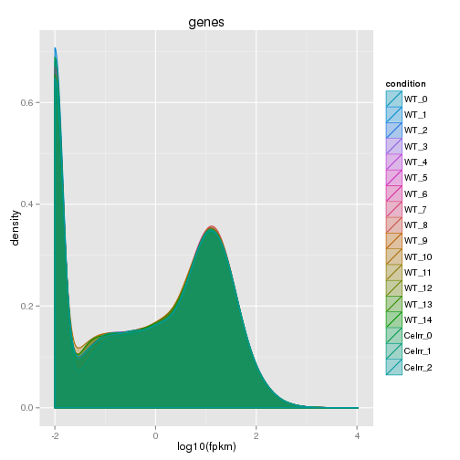 


## WTS:

### Genotyping
- wt 12 is ko/het (JR817)


```
## Error: object 'strain' not found
```

```
## Error: object 'genotypingGeneIDs' not found
```

```
## Error: error in evaluating the argument 'object' in selecting a method for function 'csHeatmap': Error: object 'genotypingGenes' not found
```

### QC 
- wts 9, 10 have smaller fpkm distribution (replicates)

 

- isoform fpkm distributions: WT smaller on whole, but replicates look fine? 

Boxplot (isoforms)

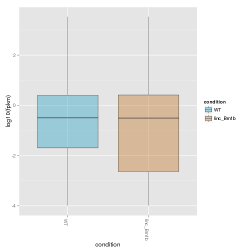 

Boxplot (isoforms, replicates)

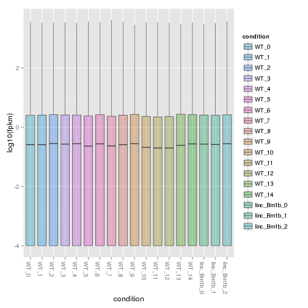 


### Other Notes

## KO Strains

### Celrr

### Crnde

- Either wrong genotyping or isoform beyond KO region stabilized by LZ (need to see tracks)

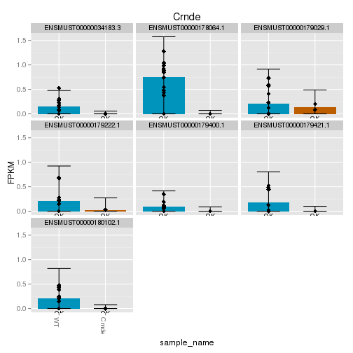 


- Wrong genotyping CRNDE_2 (JR818)

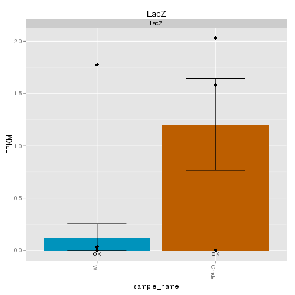 

```
## Using tracking_id, rep_name as id variables
## No id variables; using all as measure variables
```

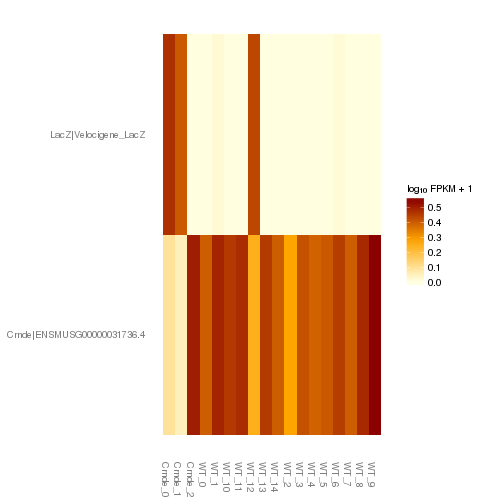 

### Eldr

- Either wrong genotyping or isoform beyond KO region stabilized by LZ (need to see tracks)

 


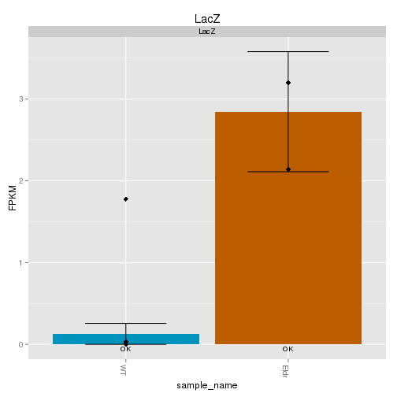 

```
## Using tracking_id, rep_name as id variables
## No id variables; using all as measure variables
```

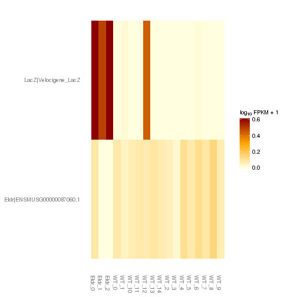 

Problem child is Eldr_0 (JR733)
Does Eldr_1 look like a het? (JR799)

### Haunt

### Kantr (Jarid1C)
YAY! They actually cluster!
 

```
## 'dendrogram' with 2 branches and 6 members total, at height 0.06617
```

### Brn1a
3 isoforms expressed

### Brn1b
LacZ expressed slightly higher than lincRNA

### linc-Cox2
YAY! They cluster together! (is this a litter thing? sex difference thing?)

 

```
## 'dendrogram' with 2 branches and 18 members total, at height 0.07544
```

**THIS DENDROGRAM LOOKS DIFFERENT WHEN PRINTED IN R STUDIO!**

Endogenous linc and LZ approx same expression levels 


### linc-Enc1a

I think this one MIGHT be a mapping error. Endogenous linc expressed at ~ WT levels (very low), but all cells have lacZ robustly expressed. Potentially hets I guess 

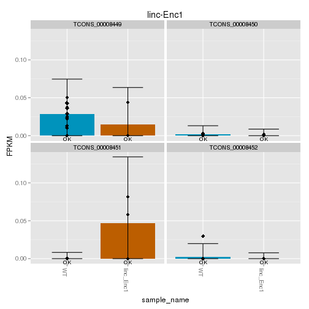 

LacZ and genotyping heatmap
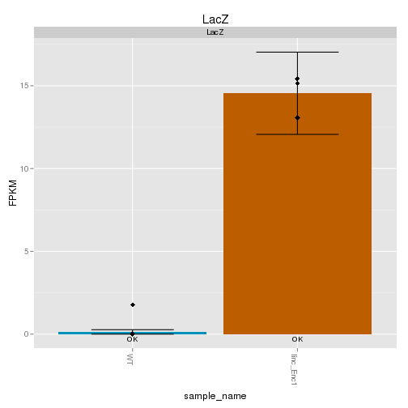 

```
## Using tracking_id, rep_name as id variables
## No id variables; using all as measure variables
```

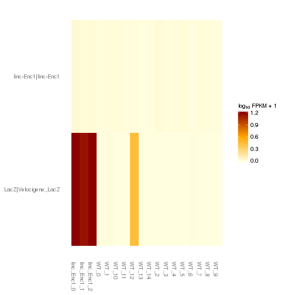 


### Manr
Same as with linc-Enc1a, may be extra-knockout region OR perhaps hets or some sort of artifact.. 

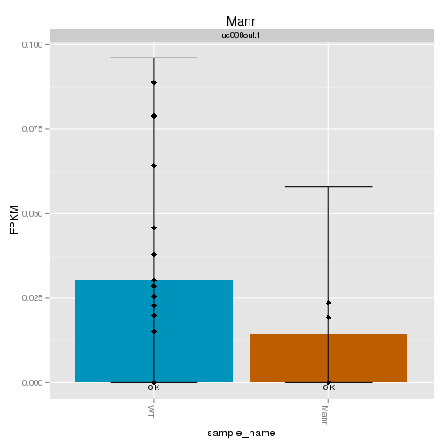 

LacZ and genotyping heatmap
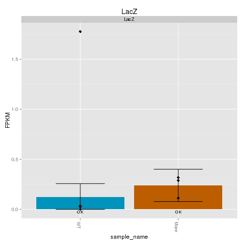 

```
## Using tracking_id, rep_name as id variables
## No id variables; using all as measure variables
```

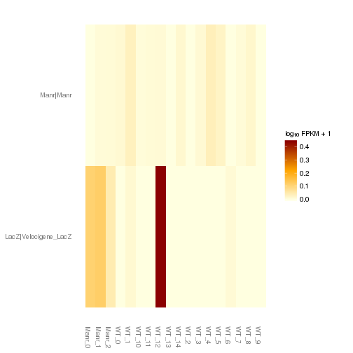 


### Peril

Fairly certai this is extra-knockout region. Need to make tracks! 

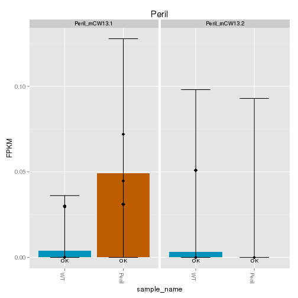 

LacZ and genotyping heatmap
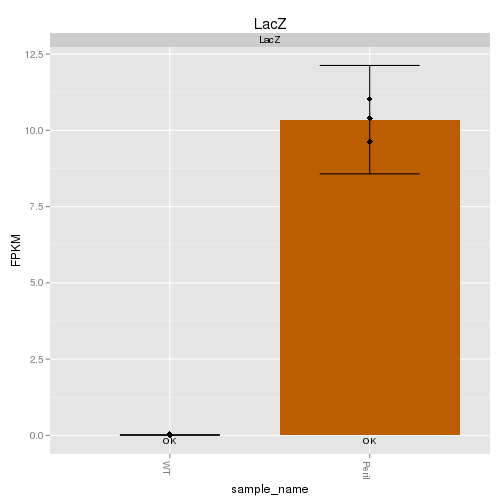 

```
## Using tracking_id, rep_name as id variables
## No id variables; using all as measure variables
```

 

### Trp53cor1 (linc-p21)
Everything very lowly expressed 

### Tug1

LacZ expressed far lower than Tug1 lincRNA 
Why is one of the tug1 replicates missing from plots/dendrogram??


# Embryonic Samples

- wt13 

## WTS:

### Genotyping

### QC 

### Other Notes

## KO Strains

### Celrr
- Celrr: celrr 0 is not KO (seems WT) JR769

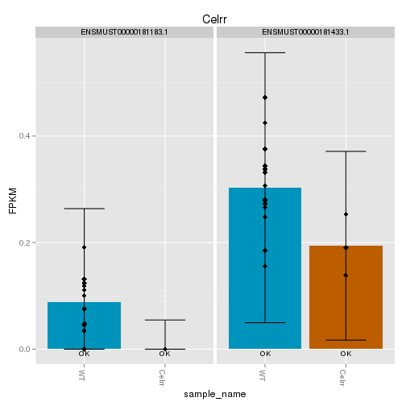 

LacZ and genotyping heatmap
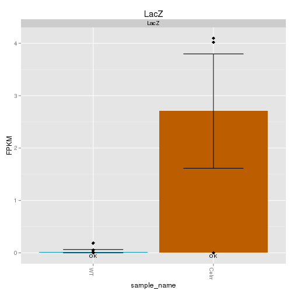 

```
## Using tracking_id, rep_name as id variables
## No id variables; using all as measure variables
```

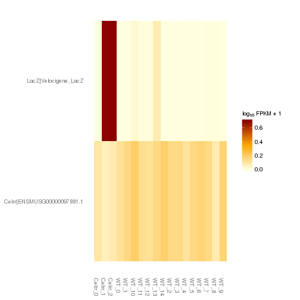 


Number of differentially expressed genes:207

Cell compartment: lots of cytoplasmic stuff... is this linc cytoplasmic?? 

### Crnde
- actually cluster together!

 

```
## 'dendrogram' with 2 branches and 18 members total, at height 0.08401
```


Endogenous expression (isoforms)
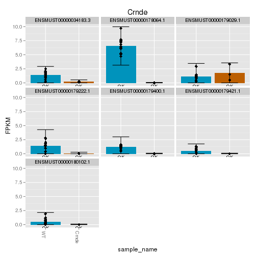 

LacZ and genotyping heatmap
Crnde_2 may be het? Need to check tracks! 
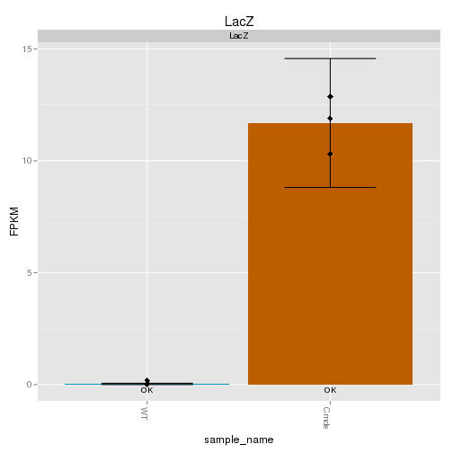 

```
## Using tracking_id, rep_name as id variables
## No id variables; using all as measure variables
```

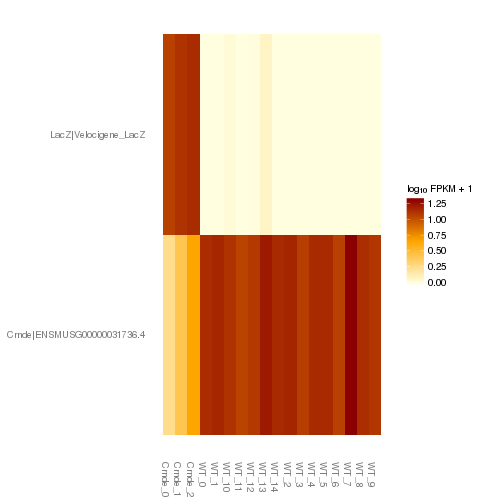 


Number of differentially expressed genes:90

-ECM/collagen... 

### Eldr

genotyping looks good!

Kegg: huntingtons/alzheimers/cancer


Number of differentially expressed genes:144


### Haunt
digital genotyping looks good 


Number of differentially expressed genes:33


### Kantr
Yay! Cluster together! 
 

```
## 'dendrogram' with 2 branches and 6 members total, at height 0.0764
```

Endogenous Kantr expression: 
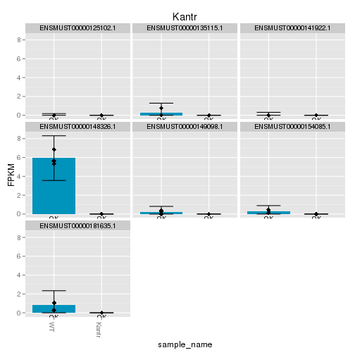 

LacZ and genotyping heatmap
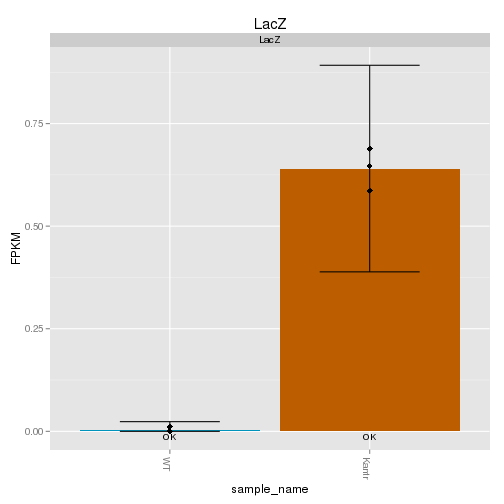 

```
## Using tracking_id, rep_name as id variables
## No id variables; using all as measure variables
```

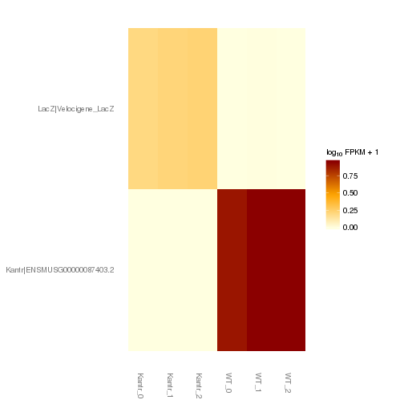 


Number of differentially expressed genes:785


### Brn1a

### Brn1b

### linc-Cox2

### linc-Enc1a

### Manr

### Peril

### Trp53cor (linc-p21)

### Tug1


# SUMMARY
**list of samples to re-check or exclude**


**Interesting or promising strains!**

# TO DO
