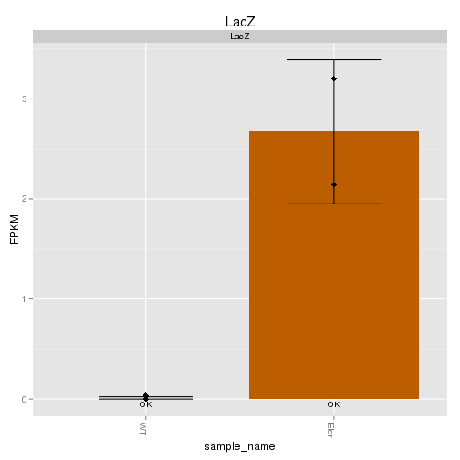
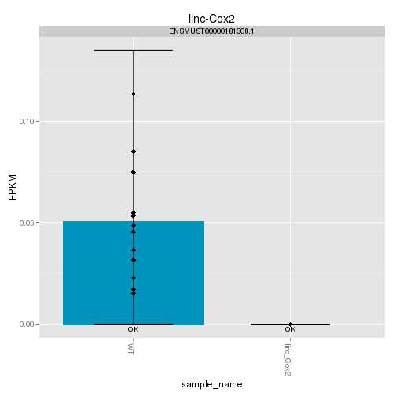
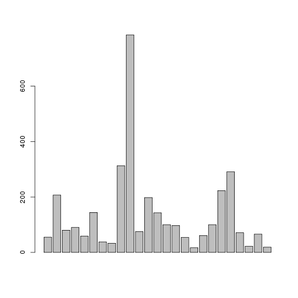
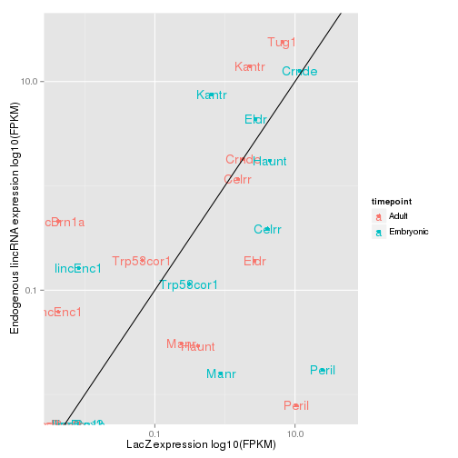

Mouse Data Overview 2
========================================================


# Adult Samples 
- All have strange density plots: add pseudocount 

# Adult Wildtypes Look Fine Now 
- isoform fpkm distributions: WT smaller on whole, but replicates look fine 

# ADULT KNOCKOUT STRAINS 

### Celrr
Eif2s3y is a y-expressed gene 


Number of differentially expressed genes:54

### Crnde


Number of differentially expressed genes:42

### Eldr


 

Problem child is Eldr_0 (JR733)
Does Eldr_1 look like a het? (JR799)


Number of differentially expressed genes:27

### Haunt


Number of differentially expressed genes:37

### Kantr (Jarid1C)

YAY! They actually cluster!

 

```
## 'dendrogram' with 2 branches and 6 members total, at height 0.06594
```


Number of differentially expressed genes:315

### Brn1a
3 isoforms expressed


Number of differentially expressed genes:74


### Brn1b
LacZ expressed slightly higher than lincRNA


Number of differentially expressed genes:193


### linc-Cox2

 

```
## 'dendrogram' with 2 branches and 17 members total, at height 0.07553
```

Endogenous linc and LZ approx same expression levels 


Number of differentially expressed genes:94


### linc-Enc1a

I think this one MIGHT be a mapping error. Endogenous linc expressed at ~ WT levels (very low), but all cells have lacZ robustly expressed. Potentially hets I guess 


LacZ and genotyping heatmap


Number of differentially expressed genes:52


### Manr
Same as with linc-Enc1a, may be extra-knockout region OR perhaps hets or some sort of artifact.. 


LacZ and genotyping heatmap


Number of differentially expressed genes:49


### Peril

Fairly certai this is extra-knockout region. Need to make tracks! 


LacZ and genotyping heatmap

 


Number of differentially expressed genes:215


### Trp53cor1 (linc-p21)
Everything very lowly expressed 


```
## Error: cannot change working directory
```

```
## Error: cannot open the connection
```

Number of differentially expressed genes:215


### Tug1

LacZ expressed far lower than Tug1 lincRNA 
Why is one of the tug1 replicates missing from plots/dendrogram??


Number of differentially expressed genes:67


# Embryonic Samples

## KO Strains

### Celrr


Number of differentially expressed genes:39

### Crnde


Endogenous expression (isoforms)


LacZ and genotyping heatmap


Number of differentially expressed genes:80

### Eldr


Number of differentially expressed genes:151


### Haunt
digital genotyping looks good 


Number of differentially expressed genes:33


### Kantr
Yay! Cluster together! 


Number of differentially expressed genes:766

### Brn1a


### Brn1b 
- digital genotyping looks good 


Number of differentially expressed genes:130


### linc-Cox2

Digital genotyping looks good! 

GO terms ribosome/translation related... 

Cluster together! Yay! 


Number of differentially expressed genes:97


### linc-Enc1a


Number of differentially expressed genes:16


### Manr

- GO terms lots of ion/lipid/protein binding; kegg neuroactive ligand-receptor interaction; and reactome has interesting categories but graph is messed up. 

- Hets? Need to see track... 


Number of differentially expressed genes:86

### Peril

Pretty sure this is an exon-stabilized-by-lacZ issue, but need to see tracks!


Number of differentially expressed genes:254


### Trp53cor1 (linc-p21)

Trp53cor1_1 is wildtype (JR813)


```
## Error: cannot change working directory
```


```
## Error: RS-DBI driver: (error in statement: near ")": syntax error)
```

```
## Error: RS-DBI driver: (RS_SQLite_exec: could not execute1: cannot start a
## transaction within a transaction)
```

Number of differentially expressed genes:0

### Tug1
Digital genotyping looks good. 
Tug1 far more highly expressed than lacZ. 


Number of differentially expressed genes:19


# SUMMARY

Range of number of differentially expressed genes:

<!-- html table generated in R 3.0.2 by xtable 1.7-3 package -->
<!-- Mon Jun 30 11:04:07 2014 -->
<TABLE border=1>
<TR> <TH>  </TH> <TH>       V1 </TH>  </TR>
  <TR> <TD align="right"> 1 </TD> <TD> 215    : 2   </TD> </TR>
  <TR> <TD align="right"> 2 </TD> <TD> 0      : 1   </TD> </TR>
  <TR> <TD align="right"> 3 </TD> <TD> 130    : 1   </TD> </TR>
  <TR> <TD align="right"> 4 </TD> <TD> 151    : 1   </TD> </TR>
  <TR> <TD align="right"> 5 </TD> <TD> 16     : 1   </TD> </TR>
  <TR> <TD align="right"> 6 </TD> <TD> 19     : 1   </TD> </TR>
  <TR> <TD align="right"> 7 </TD> <TD> (Other):30   </TD> </TR>
   </TABLE>


Number of differentially expressed genes, by condition: 


```
## Error: could not find function "length.out"
```

 

 

```
## [1] NA
```


**Interesting or promising strains!**
