Peril KO vs WT (Adult)
======================================


- add labels, descriptions
- turn off all caching 
- other heatmap labels (csHeatmap)
- break into individual replicate bargraphs for genotyping... 
- overlap figure
- tracks 
- should import litter info


# Intialize


# Design Overview

This file shows the wt-v-ko comparison for Peril. 

Samples used are:
<!-- html table generated in R 3.0.2 by xtable 1.7-3 package -->
<!-- Mon Jun 16 13:44:12 2014 -->
<TABLE border=1>
<TR> <TH>  </TH> <TH> 10 </TH>  </TR>
  <TR> <TD align="right"> 1 </TD> <TD> JR729 </TD> </TR>
  <TR> <TD align="right"> 2 </TD> <TD> JR728 </TD> </TR>
  <TR> <TD align="right"> 3 </TD> <TD> JR796 </TD> </TR>
  <TR> <TD align="right"> 4 </TD> <TD> JR797 </TD> </TR>
  <TR> <TD align="right"> 5 </TD> <TD> JR740 </TD> </TR>
  <TR> <TD align="right"> 6 </TD> <TD> JR800 </TD> </TR>
  <TR> <TD align="right"> 7 </TD> <TD> JR827 </TD> </TR>
  <TR> <TD align="right"> 8 </TD> <TD> JR778 </TD> </TR>
  <TR> <TD align="right"> 9 </TD> <TD> JR734 </TD> </TR>
  <TR> <TD align="right"> 10 </TD> <TD> JR802 </TD> </TR>
  <TR> <TD align="right"> 11 </TD> <TD> JR803 </TD> </TR>
  <TR> <TD align="right"> 12 </TD> <TD> JR735 </TD> </TR>
  <TR> <TD align="right"> 13 </TD> <TD> JR817 </TD> </TR>
  <TR> <TD align="right"> 14 </TD> <TD> JR785 </TD> </TR>
  <TR> <TD align="right"> 15 </TD> <TD> JR781 </TD> </TR>
  <TR> <TD align="right"> 16 </TD> <TD> JR806 </TD> </TR>
  <TR> <TD align="right"> 17 </TD> <TD> JR744 </TD> </TR>
  <TR> <TD align="right"> 18 </TD> <TD> JR822 </TD> </TR>
   </TABLE>


Cuff overview:

```
## CuffSet instance with:
## 	 2 samples
## 	 26754 genes
## 	 77524 isoforms
## 	 0 TSS
## 	 0 CDS
## 	 0 promoters
## 	 0 splicing
## 	 0 relCDS
```

## Replicates
<!-- html table generated in R 3.0.2 by xtable 1.7-3 package -->
<!-- Mon Jun 16 13:44:13 2014 -->
<TABLE border=1>
<TR> <TH>  </TH> <TH> file </TH> <TH> sample_name </TH> <TH> replicate </TH> <TH> rep_name </TH> <TH> total_mass </TH> <TH> norm_mass </TH> <TH> internal_scale </TH> <TH> external_scale </TH>  </TR>
  <TR> <TD align="right"> 1 </TD> <TD> /n/rinn_data1/seq/lgoff/Projects/BrainMap/data/quants/JR729/abundances.cxb </TD> <TD> WT </TD> <TD align="right">   0 </TD> <TD> WT_0 </TD> <TD align="right"> 26338300.00 </TD> <TD align="right"> 34489500.00 </TD> <TD align="right"> 0.76 </TD> <TD align="right"> 1.00 </TD> </TR>
  <TR> <TD align="right"> 2 </TD> <TD> /n/rinn_data1/seq/lgoff/Projects/BrainMap/data/quants/JR728/abundances.cxb </TD> <TD> WT </TD> <TD align="right">   1 </TD> <TD> WT_1 </TD> <TD align="right"> 20332100.00 </TD> <TD align="right"> 34489500.00 </TD> <TD align="right"> 0.59 </TD> <TD align="right"> 1.00 </TD> </TR>
  <TR> <TD align="right"> 3 </TD> <TD> /n/rinn_data1/seq/lgoff/Projects/BrainMap/data/quants/JR796/abundances.cxb </TD> <TD> WT </TD> <TD align="right">   2 </TD> <TD> WT_2 </TD> <TD align="right"> 34093300.00 </TD> <TD align="right"> 34489500.00 </TD> <TD align="right"> 0.98 </TD> <TD align="right"> 1.00 </TD> </TR>
  <TR> <TD align="right"> 4 </TD> <TD> /n/rinn_data1/seq/lgoff/Projects/BrainMap/data/quants/JR797/abundances.cxb </TD> <TD> WT </TD> <TD align="right">   3 </TD> <TD> WT_3 </TD> <TD align="right"> 28111900.00 </TD> <TD align="right"> 34489500.00 </TD> <TD align="right"> 0.80 </TD> <TD align="right"> 1.00 </TD> </TR>
  <TR> <TD align="right"> 5 </TD> <TD> /n/rinn_data1/seq/lgoff/Projects/BrainMap/data/quants/JR740/abundances.cxb </TD> <TD> WT </TD> <TD align="right">   4 </TD> <TD> WT_4 </TD> <TD align="right"> 35813300.00 </TD> <TD align="right"> 34489500.00 </TD> <TD align="right"> 1.04 </TD> <TD align="right"> 1.00 </TD> </TR>
  <TR> <TD align="right"> 6 </TD> <TD> /n/rinn_data1/seq/lgoff/Projects/BrainMap/data/quants/JR800/abundances.cxb </TD> <TD> WT </TD> <TD align="right">   5 </TD> <TD> WT_5 </TD> <TD align="right"> 37017800.00 </TD> <TD align="right"> 34489500.00 </TD> <TD align="right"> 1.07 </TD> <TD align="right"> 1.00 </TD> </TR>
  <TR> <TD align="right"> 7 </TD> <TD> /n/rinn_data1/seq/lgoff/Projects/BrainMap/data/quants/JR827/abundances.cxb </TD> <TD> WT </TD> <TD align="right">   6 </TD> <TD> WT_6 </TD> <TD align="right"> 27790600.00 </TD> <TD align="right"> 34489500.00 </TD> <TD align="right"> 0.81 </TD> <TD align="right"> 1.00 </TD> </TR>
  <TR> <TD align="right"> 8 </TD> <TD> /n/rinn_data1/seq/lgoff/Projects/BrainMap/data/quants/JR778/abundances.cxb </TD> <TD> WT </TD> <TD align="right">   7 </TD> <TD> WT_7 </TD> <TD align="right"> 39549100.00 </TD> <TD align="right"> 34489500.00 </TD> <TD align="right"> 1.16 </TD> <TD align="right"> 1.00 </TD> </TR>
  <TR> <TD align="right"> 9 </TD> <TD> /n/rinn_data1/seq/lgoff/Projects/BrainMap/data/quants/JR734/abundances.cxb </TD> <TD> WT </TD> <TD align="right">   8 </TD> <TD> WT_8 </TD> <TD align="right"> 34485000.00 </TD> <TD align="right"> 34489500.00 </TD> <TD align="right"> 1.01 </TD> <TD align="right"> 1.00 </TD> </TR>
  <TR> <TD align="right"> 10 </TD> <TD> /n/rinn_data1/seq/lgoff/Projects/BrainMap/data/quants/JR802/abundances.cxb </TD> <TD> WT </TD> <TD align="right">   9 </TD> <TD> WT_9 </TD> <TD align="right"> 45472800.00 </TD> <TD align="right"> 34489500.00 </TD> <TD align="right"> 1.30 </TD> <TD align="right"> 1.00 </TD> </TR>
  <TR> <TD align="right"> 11 </TD> <TD> /n/rinn_data1/seq/lgoff/Projects/BrainMap/data/quants/JR803/abundances.cxb </TD> <TD> WT </TD> <TD align="right">  10 </TD> <TD> WT_10 </TD> <TD align="right"> 52136700.00 </TD> <TD align="right"> 34489500.00 </TD> <TD align="right"> 1.51 </TD> <TD align="right"> 1.00 </TD> </TR>
  <TR> <TD align="right"> 12 </TD> <TD> /n/rinn_data1/seq/lgoff/Projects/BrainMap/data/quants/JR735/abundances.cxb </TD> <TD> WT </TD> <TD align="right">  11 </TD> <TD> WT_11 </TD> <TD align="right"> 34999600.00 </TD> <TD align="right"> 34489500.00 </TD> <TD align="right"> 1.02 </TD> <TD align="right"> 1.00 </TD> </TR>
  <TR> <TD align="right"> 13 </TD> <TD> /n/rinn_data1/seq/lgoff/Projects/BrainMap/data/quants/JR817/abundances.cxb </TD> <TD> WT </TD> <TD align="right">  12 </TD> <TD> WT_12 </TD> <TD align="right"> 30811500.00 </TD> <TD align="right"> 34489500.00 </TD> <TD align="right"> 0.90 </TD> <TD align="right"> 1.00 </TD> </TR>
  <TR> <TD align="right"> 14 </TD> <TD> /n/rinn_data1/seq/lgoff/Projects/BrainMap/data/quants/JR785/abundances.cxb </TD> <TD> WT </TD> <TD align="right">  13 </TD> <TD> WT_13 </TD> <TD align="right"> 34180700.00 </TD> <TD align="right"> 34489500.00 </TD> <TD align="right"> 0.98 </TD> <TD align="right"> 1.00 </TD> </TR>
  <TR> <TD align="right"> 15 </TD> <TD> /n/rinn_data1/seq/lgoff/Projects/BrainMap/data/quants/JR781/abundances.cxb </TD> <TD> WT </TD> <TD align="right">  14 </TD> <TD> WT_14 </TD> <TD align="right"> 41544600.00 </TD> <TD align="right"> 34489500.00 </TD> <TD align="right"> 1.21 </TD> <TD align="right"> 1.00 </TD> </TR>
  <TR> <TD align="right"> 16 </TD> <TD> /n/rinn_data1/seq/lgoff/Projects/BrainMap/data/quants/JR806/abundances.cxb </TD> <TD> Peril </TD> <TD align="right">   0 </TD> <TD> Peril_0 </TD> <TD align="right"> 40534200.00 </TD> <TD align="right"> 34489500.00 </TD> <TD align="right"> 1.17 </TD> <TD align="right"> 1.00 </TD> </TR>
  <TR> <TD align="right"> 17 </TD> <TD> /n/rinn_data1/seq/lgoff/Projects/BrainMap/data/quants/JR744/abundances.cxb </TD> <TD> Peril </TD> <TD align="right">   1 </TD> <TD> Peril_1 </TD> <TD align="right"> 38775900.00 </TD> <TD align="right"> 34489500.00 </TD> <TD align="right"> 1.14 </TD> <TD align="right"> 1.00 </TD> </TR>
  <TR> <TD align="right"> 18 </TD> <TD> /n/rinn_data1/seq/lgoff/Projects/BrainMap/data/quants/JR822/abundances.cxb </TD> <TD> Peril </TD> <TD align="right">   2 </TD> <TD> Peril_2 </TD> <TD align="right"> 33336500.00 </TD> <TD align="right"> 34489500.00 </TD> <TD align="right"> 0.97 </TD> <TD align="right"> 1.00 </TD> </TR>
   </TABLE>

# QC

## Dispersion

Dispersion plot for genes in cuff:
(Overdispersion can lead to innacurate quants)


```
## Error: 'from' cannot be NA, NaN or infinite
```

## Cross-replicate variability (fpkmSCVplot)
Differences in CV 2 can result in lower numbers of differentially expressed genes due to a higher degree of variability between replicate fpkm estimates.

Genes:

```
## Scale for 'x' is already present. Adding another scale for 'x', which will replace the existing scale.
## geom_smooth: method="auto" and size of largest group is >=1000, so using gam with formula: y ~ s(x, bs = "cs"). Use 'method = x' to change the smoothing method.
```

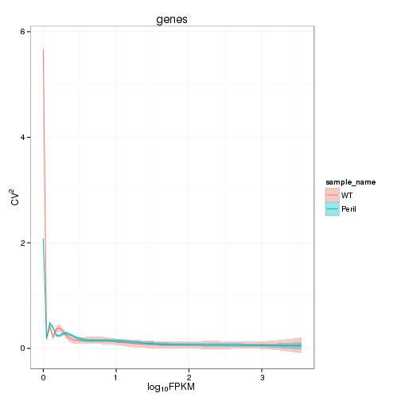 


Isoforms: 

```
## Scale for 'x' is already present. Adding another scale for 'x', which will replace the existing scale.
## geom_smooth: method="auto" and size of largest group is >=1000, so using gam with formula: y ~ s(x, bs = "cs"). Use 'method = x' to change the smoothing method.
```

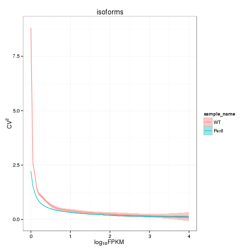 

## Volcano

```
## Error: One or more values of 'x' or 'y' are not valid sample names!
```

### Volcano matrix (replicates)

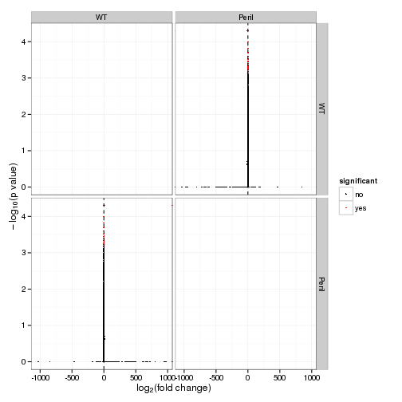 

## MvA plot

```
## Error: non-numeric argument to binary operator
```
   
### MvA plot counts

```
## Error: non-numeric argument to binary operator
```

## Scatterplot
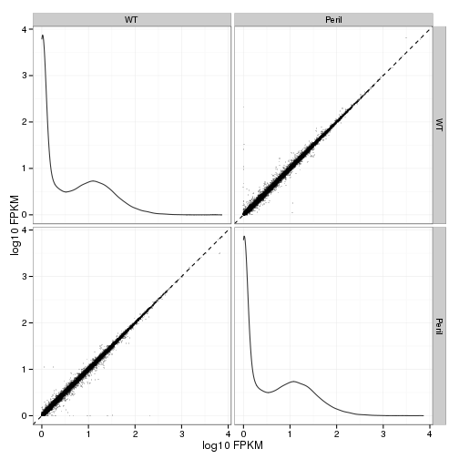 

### Scatter matrix (replicates) -- SKIP FOR NOW CAUSING PROBLEMS 


## Distributions

### Boxplots

Boxplot (genes)

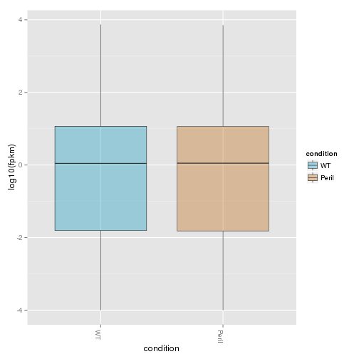 

Boxplot (genes, replicates)

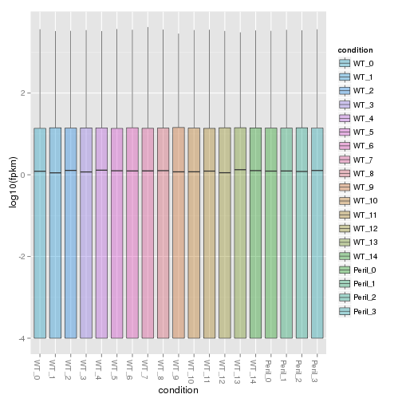 

Boxplot (isoforms)

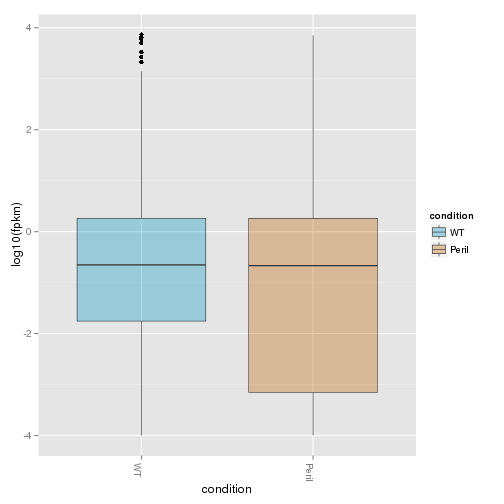 

Boxplot (isoforms, replicates)

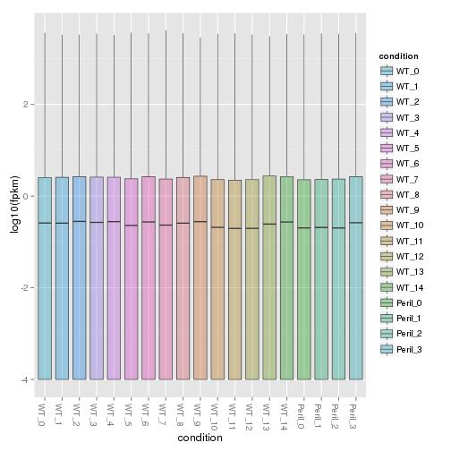 

### Density

Density (genes)

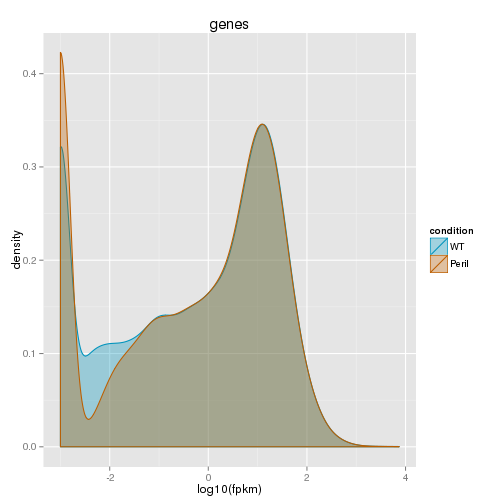 

Density (genes, replicates)

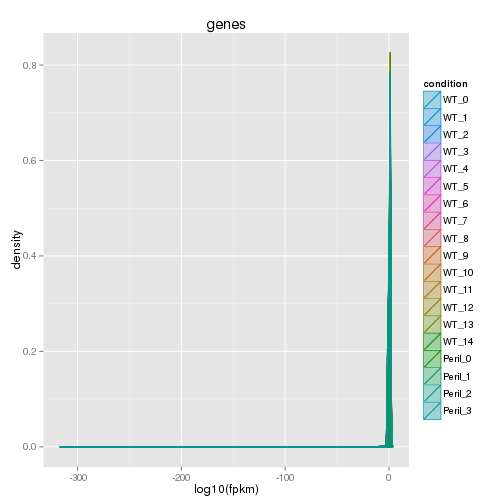 


## Clustering

### Replicate Clusters
 

```
## 'dendrogram' with 2 branches and 18 members total, at height 0.07547
```

### PCA (genes)
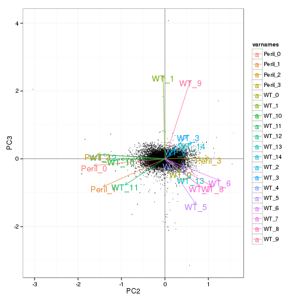 

### MDS (genes)
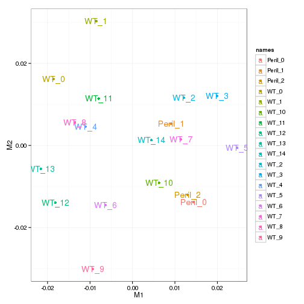 

### Distance Heat Map (genes)
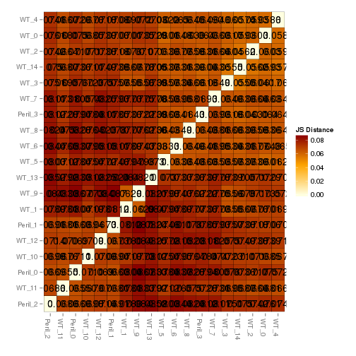 


# KO assessment

## Endogenous lncRNA expression

<!-- html table generated in R 3.0.2 by xtable 1.7-3 package -->
<!-- Mon Jun 16 13:46:33 2014 -->
<TABLE border=1>
<TR> <TH>  </TH> <TH> gene_id </TH> <TH> sample_name </TH> <TH> fpkm </TH> <TH> conf_hi </TH> <TH> conf_lo </TH> <TH> quant_status </TH>  </TR>
  <TR> <TD align="right"> 1 </TD> <TD> Peril </TD> <TD> Peril </TD> <TD align="right"> 0.05 </TD> <TD align="right"> 0.17 </TD> <TD align="right"> 0.00 </TD> <TD> OK </TD> </TR>
  <TR> <TD align="right"> 2 </TD> <TD> Peril </TD> <TD> WT </TD> <TD align="right"> 0.01 </TD> <TD align="right"> 0.11 </TD> <TD align="right"> 0.00 </TD> <TD> OK </TD> </TR>
   </TABLE>
<!-- html table generated in R 3.0.2 by xtable 1.7-3 package -->
<!-- Mon Jun 16 13:46:33 2014 -->
<TABLE border=1>
<TR> <TH>  </TH> <TH> isoform_id </TH> <TH> sample_name </TH> <TH> fpkm </TH> <TH> conf_hi </TH> <TH> conf_lo </TH> <TH> quant_status </TH>  </TR>
  <TR> <TD align="right"> 1 </TD> <TD> Peril_mCW13.1 </TD> <TD> Peril </TD> <TD align="right"> 0.05 </TD> <TD align="right"> 0.13 </TD> <TD align="right"> 0.00 </TD> <TD> OK </TD> </TR>
  <TR> <TD align="right"> 2 </TD> <TD> Peril_mCW13.2 </TD> <TD> Peril </TD> <TD align="right"> 0.00 </TD> <TD align="right"> 0.09 </TD> <TD align="right"> 0.00 </TD> <TD> OK </TD> </TR>
  <TR> <TD align="right"> 3 </TD> <TD> Peril_mCW13.1 </TD> <TD> WT </TD> <TD align="right"> 0.00 </TD> <TD align="right"> 0.04 </TD> <TD align="right"> 0.00 </TD> <TD> OK </TD> </TR>
  <TR> <TD align="right"> 4 </TD> <TD> Peril_mCW13.2 </TD> <TD> WT </TD> <TD align="right"> 0.00 </TD> <TD align="right"> 0.10 </TD> <TD align="right"> 0.00 </TD> <TD> OK </TD> </TR>
   </TABLE>
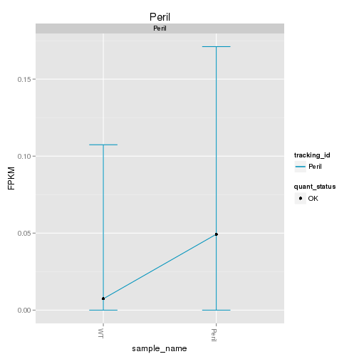  

Endogenous expression of Peril isoforms:

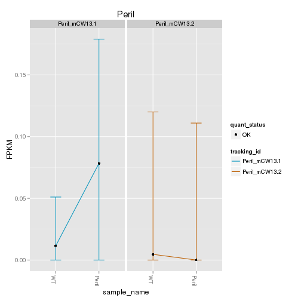 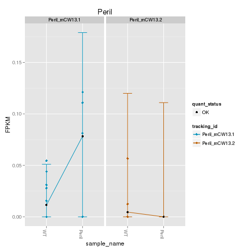 

Barplot of gene expression:

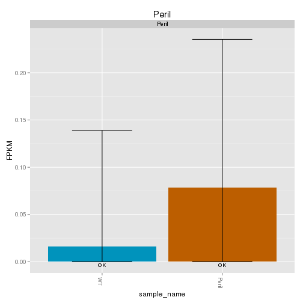 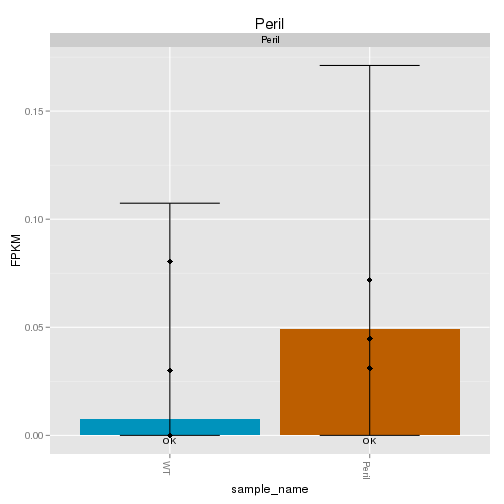 

Barplot of isoform expression:

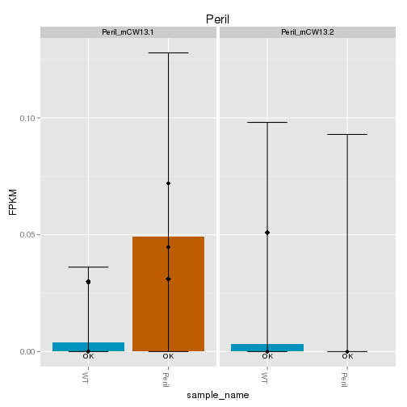 


## LacZ expression

<!-- html table generated in R 3.0.2 by xtable 1.7-3 package -->
<!-- Mon Jun 16 13:46:43 2014 -->
<TABLE border=1>
<TR> <TH>  </TH> <TH> gene_id </TH> <TH> sample_name </TH> <TH> fpkm </TH> <TH> conf_hi </TH> <TH> conf_lo </TH> <TH> quant_status </TH>  </TR>
  <TR> <TD align="right"> 1 </TD> <TD> Velocigene_LacZ </TD> <TD> Peril </TD> <TD align="right"> 10.35 </TD> <TD align="right"> 12.13 </TD> <TD align="right"> 8.57 </TD> <TD> OK </TD> </TR>
  <TR> <TD align="right"> 2 </TD> <TD> Velocigene_LacZ </TD> <TD> WT </TD> <TD align="right"> 0.12 </TD> <TD align="right"> 0.26 </TD> <TD align="right"> 0.00 </TD> <TD> OK </TD> </TR>
   </TABLE>
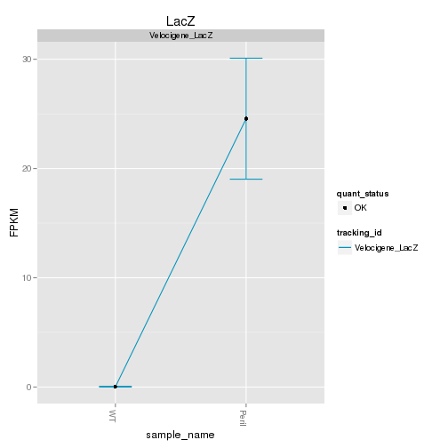  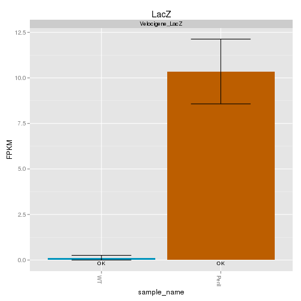  


## Digital Genotyping (LacZ vs Endogenous lncRNA and Sex)
Expression plot (endogenous linc, lacZ, Y-expressed gene):


```
## Scale for 'colour' is already present. Adding another scale for 'colour', which will replace the existing scale.
## ymax not defined: adjusting position using y instead
```

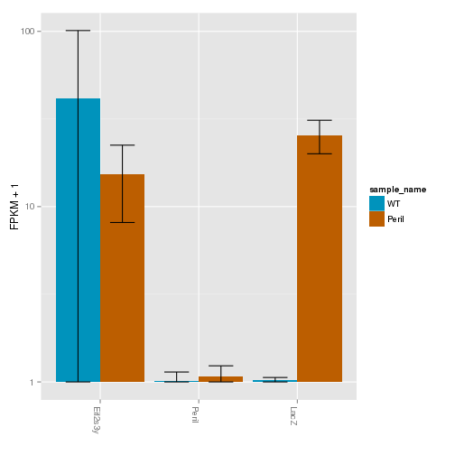 

Expression heatmap:

```
## Using tracking_id, rep_name as id variables
## No id variables; using all as measure variables
```

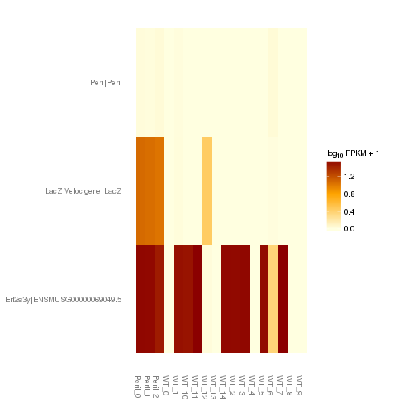 

# Differential Analysis

## Differential Genes 


There are 223 significantly differentially expressed genes. They are:

<!-- html table generated in R 3.0.2 by xtable 1.7-3 package -->
<!-- Mon Jun 16 13:46:56 2014 -->
<TABLE border=1>
<TR> <TH>  </TH> <TH> geneAnnot$gene_short_name </TH>  </TR>
  <TR> <TD align="right"> 1 </TD> <TD> Wnt9a </TD> </TR>
  <TR> <TD align="right"> 2 </TD> <TD> Gabra2 </TD> </TR>
  <TR> <TD align="right"> 3 </TD> <TD> Sox9 </TD> </TR>
  <TR> <TD align="right"> 4 </TD> <TD> Mmp14 </TD> </TR>
  <TR> <TD align="right"> 5 </TD> <TD> Chordc1 </TD> </TR>
  <TR> <TD align="right"> 6 </TD> <TD> Plin4 </TD> </TR>
  <TR> <TD align="right"> 7 </TD> <TD> Arrdc2 </TD> </TR>
  <TR> <TD align="right"> 8 </TD> <TD> Klf4 </TD> </TR>
  <TR> <TD align="right"> 9 </TD> <TD> Calr </TD> </TR>
  <TR> <TD align="right"> 10 </TD> <TD> Hif3a </TD> </TR>
  <TR> <TD align="right"> 11 </TD> <TD> 9330159F19Rik </TD> </TR>
  <TR> <TD align="right"> 12 </TD> <TD> Nes </TD> </TR>
  <TR> <TD align="right"> 13 </TD> <TD> Epha2 </TD> </TR>
  <TR> <TD align="right"> 14 </TD> <TD> Lrrc8a </TD> </TR>
  <TR> <TD align="right"> 15 </TD> <TD> Homer1 </TD> </TR>
  <TR> <TD align="right"> 16 </TD> <TD> Bcl2l1 </TD> </TR>
  <TR> <TD align="right"> 17 </TD> <TD> Dio2 </TD> </TR>
  <TR> <TD align="right"> 18 </TD> <TD> Carhsp1 </TD> </TR>
  <TR> <TD align="right"> 19 </TD> <TD> Mertk </TD> </TR>
  <TR> <TD align="right"> 20 </TD> <TD> Camk1g </TD> </TR>
  <TR> <TD align="right"> 21 </TD> <TD> Sdc4 </TD> </TR>
  <TR> <TD align="right"> 22 </TD> <TD> Ada </TD> </TR>
  <TR> <TD align="right"> 23 </TD> <TD> Etnppl </TD> </TR>
  <TR> <TD align="right"> 24 </TD> <TD> P4ha1 </TD> </TR>
  <TR> <TD align="right"> 25 </TD> <TD> Arid5b </TD> </TR>
  <TR> <TD align="right"> 26 </TD> <TD> Sgk1 </TD> </TR>
  <TR> <TD align="right"> 27 </TD> <TD> Gm872 </TD> </TR>
  <TR> <TD align="right"> 28 </TD> <TD> Ndufa12 </TD> </TR>
  <TR> <TD align="right"> 29 </TD> <TD> Timp3 </TD> </TR>
  <TR> <TD align="right"> 30 </TD> <TD> Ddit4 </TD> </TR>
  <TR> <TD align="right"> 31 </TD> <TD> Cpm </TD> </TR>
  <TR> <TD align="right"> 32 </TD> <TD> Btg2 </TD> </TR>
  <TR> <TD align="right"> 33 </TD> <TD> Xbp1 </TD> </TR>
  <TR> <TD align="right"> 34 </TD> <TD> Pdia6 </TD> </TR>
  <TR> <TD align="right"> 35 </TD> <TD> Fam20a </TD> </TR>
  <TR> <TD align="right"> 36 </TD> <TD> Camkk1 </TD> </TR>
  <TR> <TD align="right"> 37 </TD> <TD> Per1 </TD> </TR>
  <TR> <TD align="right"> 38 </TD> <TD> Nfkbia </TD> </TR>
  <TR> <TD align="right"> 39 </TD> <TD> Serpina3n </TD> </TR>
  <TR> <TD align="right"> 40 </TD> <TD> Zfp36l1 </TD> </TR>
  <TR> <TD align="right"> 41 </TD> <TD> Fos </TD> </TR>
  <TR> <TD align="right"> 42 </TD> <TD> Pcsk1 </TD> </TR>
  <TR> <TD align="right"> 43 </TD> <TD> Fam107a </TD> </TR>
  <TR> <TD align="right"> 44 </TD> <TD> Dnajc3 </TD> </TR>
  <TR> <TD align="right"> 45 </TD> <TD> Fzd6 </TD> </TR>
  <TR> <TD align="right"> 46 </TD> <TD> Myh9 </TD> </TR>
  <TR> <TD align="right"> 47 </TD> <TD> Slc38a2 </TD> </TR>
  <TR> <TD align="right"> 48 </TD> <TD> Bcl6 </TD> </TR>
  <TR> <TD align="right"> 49 </TD> <TD> Arc </TD> </TR>
  <TR> <TD align="right"> 50 </TD> <TD> Sdf2l1 </TD> </TR>
  <TR> <TD align="right"> 51 </TD> <TD> Arhgap31 </TD> </TR>
  <TR> <TD align="right"> 52 </TD> <TD> Ifnar1 </TD> </TR>
  <TR> <TD align="right"> 53 </TD> <TD> Cdkn1a </TD> </TR>
  <TR> <TD align="right"> 54 </TD> <TD> Serinc2 </TD> </TR>
  <TR> <TD align="right"> 55 </TD> <TD> Creld2 </TD> </TR>
  <TR> <TD align="right"> 56 </TD> <TD> Tnfrsf12a </TD> </TR>
  <TR> <TD align="right"> 57 </TD> <TD> Xdh </TD> </TR>
  <TR> <TD align="right"> 58 </TD> <TD> Tekt4 </TD> </TR>
  <TR> <TD align="right"> 59 </TD> <TD> Dusp1 </TD> </TR>
  <TR> <TD align="right"> 60 </TD> <TD> Fkbp5 </TD> </TR>
  <TR> <TD align="right"> 61 </TD> <TD> Spry4 </TD> </TR>
  <TR> <TD align="right"> 62 </TD> <TD> Pdgfrb </TD> </TR>
  <TR> <TD align="right"> 63 </TD> <TD> Atp10a </TD> </TR>
  <TR> <TD align="right"> 64 </TD> <TD> Kdm5c </TD> </TR>
  <TR> <TD align="right"> 65 </TD> <TD> D3Ertd751e </TD> </TR>
  <TR> <TD align="right"> 66 </TD> <TD> Pdia4 </TD> </TR>
  <TR> <TD align="right"> 67 </TD> <TD> Paqr8 </TD> </TR>
  <TR> <TD align="right"> 68 </TD> <TD> Slc40a1 </TD> </TR>
  <TR> <TD align="right"> 69 </TD> <TD> Pfkfb3 </TD> </TR>
  <TR> <TD align="right"> 70 </TD> <TD> Hspa5 </TD> </TR>
  <TR> <TD align="right"> 71 </TD> <TD> Spred1 </TD> </TR>
  <TR> <TD align="right"> 72 </TD> <TD> Fam83d </TD> </TR>
  <TR> <TD align="right"> 73 </TD> <TD> Anxa5 </TD> </TR>
  <TR> <TD align="right"> 74 </TD> <TD> Exosc9 </TD> </TR>
  <TR> <TD align="right"> 75 </TD> <TD> Schip1 </TD> </TR>
  <TR> <TD align="right"> 76 </TD> <TD> F3 </TD> </TR>
  <TR> <TD align="right"> 77 </TD> <TD> Trp53inp1 </TD> </TR>
  <TR> <TD align="right"> 78 </TD> <TD> Nr4a3 </TD> </TR>
  <TR> <TD align="right"> 79 </TD> <TD> Slc2a1 </TD> </TR>
  <TR> <TD align="right"> 80 </TD> <TD> Mfsd2a </TD> </TR>
  <TR> <TD align="right"> 81 </TD> <TD> Tinagl1 </TD> </TR>
  <TR> <TD align="right"> 82 </TD> <TD> Errfi1 </TD> </TR>
  <TR> <TD align="right"> 83 </TD> <TD> Fosl2 </TD> </TR>
  <TR> <TD align="right"> 84 </TD> <TD> Aff1 </TD> </TR>
  <TR> <TD align="right"> 85 </TD> <TD> Rasgef1b </TD> </TR>
  <TR> <TD align="right"> 86 </TD> <TD> Lfng </TD> </TR>
  <TR> <TD align="right"> 87 </TD> <TD> Hsph1 </TD> </TR>
  <TR> <TD align="right"> 88 </TD> <TD> Gkn3 </TD> </TR>
  <TR> <TD align="right"> 89 </TD> <TD> Klf15 </TD> </TR>
  <TR> <TD align="right"> 90 </TD> <TD> Slc6a6 </TD> </TR>
  <TR> <TD align="right"> 91 </TD> <TD> Bhlhe40 </TD> </TR>
  <TR> <TD align="right"> 92 </TD> <TD> Adipor2 </TD> </TR>
  <TR> <TD align="right"> 93 </TD> <TD> Emp1 </TD> </TR>
  <TR> <TD align="right"> 94 </TD> <TD> Pglyrp1 </TD> </TR>
  <TR> <TD align="right"> 95 </TD> <TD> Rhpn2 </TD> </TR>
  <TR> <TD align="right"> 96 </TD> <TD> Hddc3 </TD> </TR>
  <TR> <TD align="right"> 97 </TD> <TD> Sytl2 </TD> </TR>
  <TR> <TD align="right"> 98 </TD> <TD> Sult1a1 </TD> </TR>
  <TR> <TD align="right"> 99 </TD> <TD> Lyve1 </TD> </TR>
  <TR> <TD align="right"> 100 </TD> <TD> Polr3e </TD> </TR>
  <TR> <TD align="right"> 101 </TD> <TD> Tsc22d3 </TD> </TR>
  <TR> <TD align="right"> 102 </TD> <TD> Dusp4 </TD> </TR>
  <TR> <TD align="right"> 103 </TD> <TD> Plat </TD> </TR>
  <TR> <TD align="right"> 104 </TD> <TD> Galnt7 </TD> </TR>
  <TR> <TD align="right"> 105 </TD> <TD> Gpt2 </TD> </TR>
  <TR> <TD align="right"> 106 </TD> <TD> Mt2 </TD> </TR>
  <TR> <TD align="right"> 107 </TD> <TD> Mt1 </TD> </TR>
  <TR> <TD align="right"> 108 </TD> <TD> Ldlr </TD> </TR>
  <TR> <TD align="right"> 109 </TD> <TD> Eomes </TD> </TR>
  <TR> <TD align="right"> 110 </TD> <TD> Slc16a1 </TD> </TR>
  <TR> <TD align="right"> 111 </TD> <TD> Tbc1d4 </TD> </TR>
  <TR> <TD align="right"> 112 </TD> <TD> Galnt9 </TD> </TR>
  <TR> <TD align="right"> 113 </TD> <TD> Egr3 </TD> </TR>
  <TR> <TD align="right"> 114 </TD> <TD> Tlr13 </TD> </TR>
  <TR> <TD align="right"> 115 </TD> <TD> Klf9 </TD> </TR>
  <TR> <TD align="right"> 116 </TD> <TD> Trim36 </TD> </TR>
  <TR> <TD align="right"> 117 </TD> <TD> Trim59 </TD> </TR>
  <TR> <TD align="right"> 118 </TD> <TD> Pla2g3 </TD> </TR>
  <TR> <TD align="right"> 119 </TD> <TD> Nostrin </TD> </TR>
  <TR> <TD align="right"> 120 </TD> <TD> Dusp5 </TD> </TR>
  <TR> <TD align="right"> 121 </TD> <TD> Filip1 </TD> </TR>
  <TR> <TD align="right"> 122 </TD> <TD> Arl4d </TD> </TR>
  <TR> <TD align="right"> 123 </TD> <TD> Lars2 </TD> </TR>
  <TR> <TD align="right"> 124 </TD> <TD> Adrb1 </TD> </TR>
  <TR> <TD align="right"> 125 </TD> <TD> Uba6 </TD> </TR>
  <TR> <TD align="right"> 126 </TD> <TD> Dnajb5 </TD> </TR>
  <TR> <TD align="right"> 127 </TD> <TD> Prr5 </TD> </TR>
  <TR> <TD align="right"> 128 </TD> <TD> Micall2 </TD> </TR>
  <TR> <TD align="right"> 129 </TD> <TD> Anln </TD> </TR>
  <TR> <TD align="right"> 130 </TD> <TD> Psenen </TD> </TR>
  <TR> <TD align="right"> 131 </TD> <TD> Mxd4 </TD> </TR>
  <TR> <TD align="right"> 132 </TD> <TD> Tob1 </TD> </TR>
  <TR> <TD align="right"> 133 </TD> <TD> Smim3 </TD> </TR>
  <TR> <TD align="right"> 134 </TD> <TD> Bend3 </TD> </TR>
  <TR> <TD align="right"> 135 </TD> <TD> Sesn1 </TD> </TR>
  <TR> <TD align="right"> 136 </TD> <TD> Txnip </TD> </TR>
  <TR> <TD align="right"> 137 </TD> <TD> Egr1 </TD> </TR>
  <TR> <TD align="right"> 138 </TD> <TD> Irs2 </TD> </TR>
  <TR> <TD align="right"> 139 </TD> <TD> Eltd1 </TD> </TR>
  <TR> <TD align="right"> 140 </TD> <TD> Pcsk1n </TD> </TR>
  <TR> <TD align="right"> 141 </TD> <TD> Tnfsf10 </TD> </TR>
  <TR> <TD align="right"> 142 </TD> <TD> C1qtnf4 </TD> </TR>
  <TR> <TD align="right"> 143 </TD> <TD> Cables1 </TD> </TR>
  <TR> <TD align="right"> 144 </TD> <TD> Nkx6-2 </TD> </TR>
  <TR> <TD align="right"> 145 </TD> <TD> Mup4 </TD> </TR>
  <TR> <TD align="right"> 146 </TD> <TD> Cldn5 </TD> </TR>
  <TR> <TD align="right"> 147 </TD> <TD> Pkp2 </TD> </TR>
  <TR> <TD align="right"> 148 </TD> <TD> Sgsm1 </TD> </TR>
  <TR> <TD align="right"> 149 </TD> <TD> Jhdm1d </TD> </TR>
  <TR> <TD align="right"> 150 </TD> <TD> Maff </TD> </TR>
  <TR> <TD align="right"> 151 </TD> <TD> Id1 </TD> </TR>
  <TR> <TD align="right"> 152 </TD> <TD> 1700048O20Rik </TD> </TR>
  <TR> <TD align="right"> 153 </TD> <TD> Nxpe4 </TD> </TR>
  <TR> <TD align="right"> 154 </TD> <TD> Ctla2a </TD> </TR>
  <TR> <TD align="right"> 155 </TD> <TD> Cirbp </TD> </TR>
  <TR> <TD align="right"> 156 </TD> <TD> Zfp36l2 </TD> </TR>
  <TR> <TD align="right"> 157 </TD> <TD> Npas4 </TD> </TR>
  <TR> <TD align="right"> 158 </TD> <TD> Plaur </TD> </TR>
  <TR> <TD align="right"> 159 </TD> <TD> Fat4 </TD> </TR>
  <TR> <TD align="right"> 160 </TD> <TD> Marcksl1 </TD> </TR>
  <TR> <TD align="right"> 161 </TD> <TD> Stbd1 </TD> </TR>
  <TR> <TD align="right"> 162 </TD> <TD> Bdnf </TD> </TR>
  <TR> <TD align="right"> 163 </TD> <TD> Mex3d </TD> </TR>
  <TR> <TD align="right"> 164 </TD> <TD> Dact2 </TD> </TR>
  <TR> <TD align="right"> 165 </TD> <TD> Pdp1 </TD> </TR>
  <TR> <TD align="right"> 166 </TD> <TD> Cdc42ep1 </TD> </TR>
  <TR> <TD align="right"> 167 </TD> <TD> Rasd1 </TD> </TR>
  <TR> <TD align="right"> 168 </TD> <TD> Opalin </TD> </TR>
  <TR> <TD align="right"> 169 </TD> <TD> Ppp1r3g </TD> </TR>
  <TR> <TD align="right"> 170 </TD> <TD> Plekho2 </TD> </TR>
  <TR> <TD align="right"> 171 </TD> <TD> Islr2 </TD> </TR>
  <TR> <TD align="right"> 172 </TD> <TD> Gfod1 </TD> </TR>
  <TR> <TD align="right"> 173 </TD> <TD> Klf13 </TD> </TR>
  <TR> <TD align="right"> 174 </TD> <TD> Jun </TD> </TR>
  <TR> <TD align="right"> 175 </TD> <TD> Junb </TD> </TR>
  <TR> <TD align="right"> 176 </TD> <TD> Tnfaip6 </TD> </TR>
  <TR> <TD align="right"> 177 </TD> <TD> Ier2 </TD> </TR>
  <TR> <TD align="right"> 178 </TD> <TD> Mat2a </TD> </TR>
  <TR> <TD align="right"> 179 </TD> <TD> Iigp1 </TD> </TR>
  <TR> <TD align="right"> 180 </TD> <TD> 1810037I17Rik </TD> </TR>
  <TR> <TD align="right"> 181 </TD> <TD> A930005H10Rik </TD> </TR>
  <TR> <TD align="right"> 182 </TD> <TD> Mettl7a1 </TD> </TR>
  <TR> <TD align="right"> 183 </TD> <TD> Klf2 </TD> </TR>
  <TR> <TD align="right"> 184 </TD> <TD> Per2 </TD> </TR>
  <TR> <TD align="right"> 185 </TD> <TD> 1810011O10Rik </TD> </TR>
  <TR> <TD align="right"> 186 </TD> <TD> Kdm5d </TD> </TR>
  <TR> <TD align="right"> 187 </TD> <TD> Mex3b </TD> </TR>
  <TR> <TD align="right"> 188 </TD> <TD> Tpm3-rs7 </TD> </TR>
  <TR> <TD align="right"> 189 </TD> <TD> Rpl30 </TD> </TR>
  <TR> <TD align="right"> 190 </TD> <TD> Gm5506 </TD> </TR>
  <TR> <TD align="right"> 191 </TD> <TD> Sclt1 </TD> </TR>
  <TR> <TD align="right"> 192 </TD> <TD> Alox5ap </TD> </TR>
  <TR> <TD align="right"> 193 </TD> <TD> Zbtb40 </TD> </TR>
  <TR> <TD align="right"> 194 </TD> <TD> Rps7 </TD> </TR>
  <TR> <TD align="right"> 195 </TD> <TD> Cox5b </TD> </TR>
  <TR> <TD align="right"> 196 </TD> <TD> Rpl34 </TD> </TR>
  <TR> <TD align="right"> 197 </TD> <TD> Kdr </TD> </TR>
  <TR> <TD align="right"> 198 </TD> <TD> Aldoart2 </TD> </TR>
  <TR> <TD align="right"> 199 </TD> <TD> mt-Co1 </TD> </TR>
  <TR> <TD align="right"> 200 </TD> <TD> Zbtb16 </TD> </TR>
  <TR> <TD align="right"> 201 </TD> <TD> Ddx3y </TD> </TR>
  <TR> <TD align="right"> 202 </TD> <TD> Ahnak </TD> </TR>
  <TR> <TD align="right"> 203 </TD> <TD> Top1 </TD> </TR>
  <TR> <TD align="right"> 204 </TD> <TD> Jund </TD> </TR>
  <TR> <TD align="right"> 205 </TD> <TD> Egr4 </TD> </TR>
  <TR> <TD align="right"> 206 </TD> <TD> Gm7292 </TD> </TR>
  <TR> <TD align="right"> 207 </TD> <TD> Plekhf1 </TD> </TR>
  <TR> <TD align="right"> 208 </TD> <TD> Ccl28 </TD> </TR>
  <TR> <TD align="right"> 209 </TD> <TD> Ctla2b </TD> </TR>
  <TR> <TD align="right"> 210 </TD> <TD> B3galt5 </TD> </TR>
  <TR> <TD align="right"> 211 </TD> <TD> Fjx1 </TD> </TR>
  <TR> <TD align="right"> 212 </TD> <TD> Rprm </TD> </TR>
  <TR> <TD align="right"> 213 </TD> <TD> Ly6a </TD> </TR>
  <TR> <TD align="right"> 214 </TD> <TD> Ly6c1 </TD> </TR>
  <TR> <TD align="right"> 215 </TD> <TD> Xist </TD> </TR>
  <TR> <TD align="right"> 216 </TD> <TD> Slc5a3 </TD> </TR>
  <TR> <TD align="right"> 217 </TD> <TD> A930033H14Rik </TD> </TR>
  <TR> <TD align="right"> 218 </TD> <TD> Apold1 </TD> </TR>
  <TR> <TD align="right"> 219 </TD> <TD> Hspa1b </TD> </TR>
  <TR> <TD align="right"> 220 </TD> <TD> Neat1 </TD> </TR>
  <TR> <TD align="right"> 221 </TD> <TD> AA465934 </TD> </TR>
  <TR> <TD align="right"> 222 </TD> <TD> Gm7094 </TD> </TR>
  <TR> <TD align="right"> 223 </TD> <TD> LacZ </TD> </TR>
   </TABLE>

### Matrix of gene significant differences between conditions

(skip for Brainmap wt-v-ko comparisons)

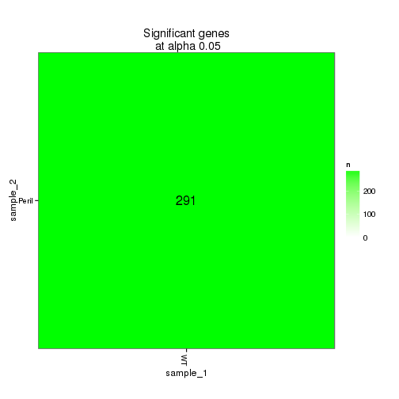 

### Significant gene expression differences between conditions

Expression plot (genes):
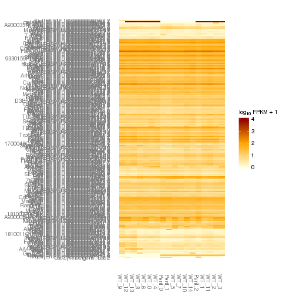 

```
## Using tracking_id, rep_name as id variables
## No id variables; using all as measure variables
```

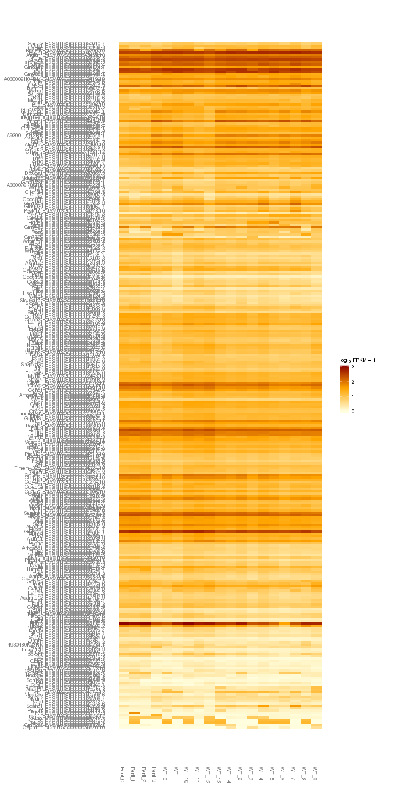 

Significant genes with expression >50fpkm (any condition):

```
## Using tracking_id, sample_name as id variables
```

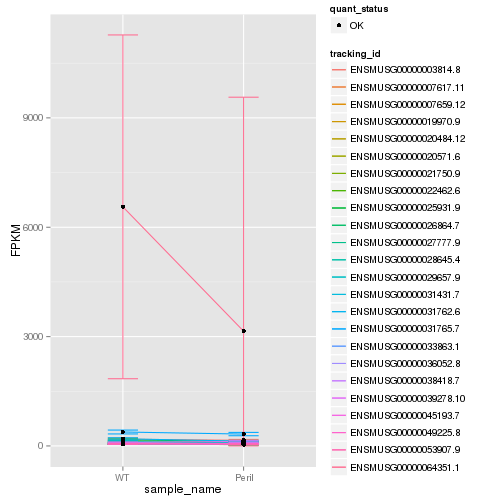 

An individual look at each of the highly expressed significantly differentially regulated genes:
(eval=false for first pass)


### Expression-level/significance relationship

Scatter plot of significant genes only:

```
## Using tracking_id, sample_name as id variables
```

```
## Error: One or more values of 'x' or 'y' are not valid sample names!
```

Volcano plot with significant genes only:

```
## Error: One or more values of 'x' or 'y' are not valid sample names!
```


## Differential Splicing

### Differential Isoforms between conditions
Per isoform difference between conditions:
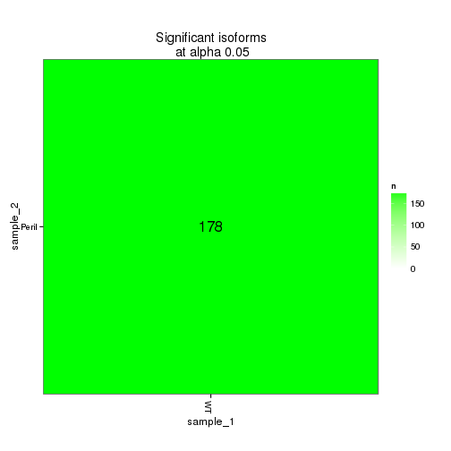 

These isoforms are:

```
## Error: no applicable method for 'xtable' applied to an object of class
## "character"
```


```
## Using tracking_id, rep_name as id variables
```

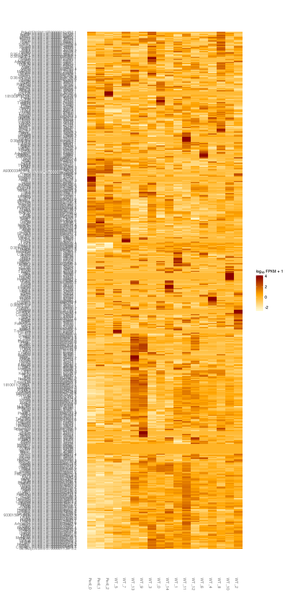 

### Differential Splicing between conditions

(eval false for first pass)

Per condition differences in isoforms (Does gene have diff piechart between conditions?)


These genes are:


Splicing heatmap by isoform:


Splicing heatmap by gene


The following are significantly differentially spliced genes (relative portion of isoform per condition): 


 


# Gene/Pathway Analysis

## GSEA


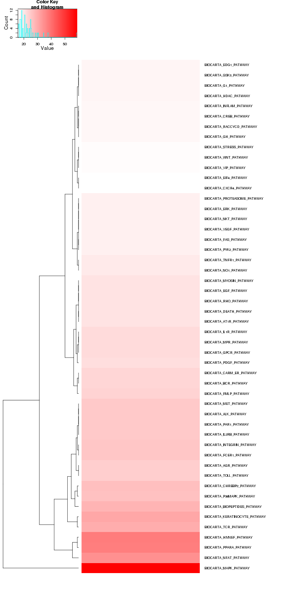 

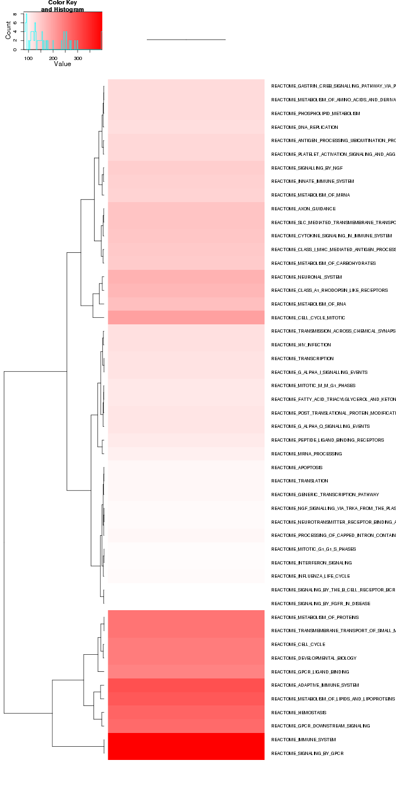 

## GO enrichment 
Cluster profiler used to call enichments of significantly differentially regulated genes that map to Entrez IDs. 

Description/explanation of what's here, and justify all choices. 


```
## Loading required package: AnnotationDbi
## Loading required package: Biobase
## Welcome to Bioconductor
## 
##     Vignettes contain introductory material; view with
##     'browseVignettes()'. To cite Bioconductor, see
##     'citation("Biobase")', and for packages 'citation("pkgname")'.
## 
## 
## Attaching package: 'Biobase'
## 
## The following object is masked from 'package:cummeRbund':
## 
##     samples
```

```
## Warning: Can't find a usable tk.tcl in the following directories: 
##     /n/sw/centos6/tcl8.5.14/lib/tcl8.5/tk8.5 /n/sw/centos6/tcl8.5.14/lib/tk8.5 ./lib/tk8.5 ./library
## 
## 
## 
## This probably means that tk wasn't installed properly.
```

```
## 
## 
## Attaching package: 'DOSE'
## 
## The following object is masked from 'package:ReactomePA':
## 
##     gseAnalyzer
```

biomart to get entrez gene IDS
clusterProfiler does GO enrichment 

BP, MF, CC
enrichKEGG
enrichPathway


```
## Error: error in evaluating the argument 'x' in selecting a method for function 'plot': Error: object 'goBP' not found
```

```
## Error: error in evaluating the argument 'x' in selecting a method for function 'plot': Error: object 'goMF' not found
```

```
## Error: error in evaluating the argument 'x' in selecting a method for function 'plot': Error: object 'goCC' not found
```

```
## Error: error in evaluating the argument 'x' in selecting a method for function 'plot': Error: object 'kegg' not found
```

```
## Error: error in evaluating the argument 'x' in selecting a method for function 'plot': Error: object 'pathway' not found
```

```
## Error: invalid 'name' argument
```

# Cis vs Trans (locally)


# Notes

# Session Info

```
## R version 3.0.2 (2013-09-25)
## Platform: x86_64-unknown-linux-gnu (64-bit)
## 
## locale:
##  [1] LC_CTYPE=en_US.UTF-8       LC_NUMERIC=C              
##  [3] LC_TIME=en_US.UTF-8        LC_COLLATE=en_US.UTF-8    
##  [5] LC_MONETARY=en_US.UTF-8    LC_MESSAGES=en_US.UTF-8   
##  [7] LC_PAPER=en_US.UTF-8       LC_NAME=C                 
##  [9] LC_ADDRESS=C               LC_TELEPHONE=C            
## [11] LC_MEASUREMENT=en_US.UTF-8 LC_IDENTIFICATION=C       
## 
## attached base packages:
## [1] grid      parallel  stats     graphics  grDevices utils     datasets 
## [8] methods   base     
## 
## other attached packages:
##  [1] DOSE_2.0.0           ReactomePA_1.6.1     AnnotationDbi_1.24.0
##  [4] Biobase_2.22.0       mgcv_1.7-29          nlme_3.1-117        
##  [7] gridExtra_0.9.1      gtable_0.1.2         marray_1.40.0       
## [10] gplots_2.13.0        GSA_1.03             limma_3.18.13       
## [13] xtable_1.7-3         knitr_1.6            cummeRbund_2.7.2    
## [16] Gviz_1.6.0           rtracklayer_1.22.7   GenomicRanges_1.14.4
## [19] XVector_0.2.0        IRanges_1.20.7       fastcluster_1.1.13  
## [22] reshape2_1.4         ggplot2_1.0.0        RSQLite_0.11.4      
## [25] DBI_0.2-7            BiocGenerics_0.8.0  
## 
## loaded via a namespace (and not attached):
##  [1] biomaRt_2.18.0         Biostrings_2.30.1      biovizBase_1.10.8     
##  [4] bitops_1.0-6           BSgenome_1.30.0        caTools_1.17          
##  [7] cluster_1.15.2         colorspace_1.2-4       dichromat_2.0-0       
## [10] digest_0.6.4           DO.db_2.7              evaluate_0.5.5        
## [13] formatR_0.10           Formula_1.1-1          gdata_2.13.3          
## [16] GenomicFeatures_1.14.5 GO.db_2.10.1           GOSemSim_1.20.3       
## [19] graph_1.40.1           graphite_1.8.1         gtools_3.4.1          
## [22] Hmisc_3.14-4           igraph_0.7.1           KernSmooth_2.23-12    
## [25] labeling_0.2           lattice_0.20-29        latticeExtra_0.6-26   
## [28] MASS_7.3-33            Matrix_1.1-3           munsell_0.4.2         
## [31] org.Hs.eg.db_2.10.1    plyr_1.8.1             proto_0.3-10          
## [34] qvalue_1.36.0          RColorBrewer_1.0-5     Rcpp_0.11.1           
## [37] RCurl_1.95-4.1         reactome.db_1.46.1     Rsamtools_1.14.3      
## [40] scales_0.2.4           splines_3.0.2          stats4_3.0.2          
## [43] stringr_0.6.2          survival_2.37-7        tcltk_3.0.2           
## [46] tools_3.0.2            XML_3.98-1.1           zlibbioc_1.8.0
```

#Run Info

```
##           param
## 1      cmd_line
## 2       version
## 3  SVN_revision
## 4 boost_version
## 5        genome
##                                                                                                                                                                                                                                                                                                                                                                                                                                                                                                                                                                                                                                                                                                                                                                                                                                                                                                                                                                                                                                                                                                                                                                                                                                                                                                                                                                                                                                                                                                                                                                                                              value
## 1 cuffdiff -p 10 -L WT,Peril -o /n/rinn_data1/seq/lgoff/Projects/BrainMap/data/diffs/Peril_vs_WT_Adult /n/rinn_data1/seq/lgoff/Projects/BrainMap/data/annotation/mm10_gencode_vM2_with_lncRNAs_and_LacZ.gtf /n/rinn_data1/seq/lgoff/Projects/BrainMap/data/quants/JR729/abundances.cxb,/n/rinn_data1/seq/lgoff/Projects/BrainMap/data/quants/JR728/abundances.cxb,/n/rinn_data1/seq/lgoff/Projects/BrainMap/data/quants/JR796/abundances.cxb,/n/rinn_data1/seq/lgoff/Projects/BrainMap/data/quants/JR797/abundances.cxb,/n/rinn_data1/seq/lgoff/Projects/BrainMap/data/quants/JR740/abundances.cxb,/n/rinn_data1/seq/lgoff/Projects/BrainMap/data/quants/JR800/abundances.cxb,/n/rinn_data1/seq/lgoff/Projects/BrainMap/data/quants/JR827/abundances.cxb,/n/rinn_data1/seq/lgoff/Projects/BrainMap/data/quants/JR778/abundances.cxb,/n/rinn_data1/seq/lgoff/Projects/BrainMap/data/quants/JR734/abundances.cxb,/n/rinn_data1/seq/lgoff/Projects/BrainMap/data/quants/JR802/abundances.cxb,/n/rinn_data1/seq/lgoff/Projects/BrainMap/data/quants/JR803/abundances.cxb,/n/rinn_data1/seq/lgoff/Projects/BrainMap/data/quants/JR735/abundances.cxb,/n/rinn_data1/seq/lgoff/Projects/BrainMap/data/quants/JR817/abundances.cxb,/n/rinn_data1/seq/lgoff/Projects/BrainMap/data/quants/JR785/abundances.cxb,/n/rinn_data1/seq/lgoff/Projects/BrainMap/data/quants/JR781/abundances.cxb /n/rinn_data1/seq/lgoff/Projects/BrainMap/data/quants/JR806/abundances.cxb,/n/rinn_data1/seq/lgoff/Projects/BrainMap/data/quants/JR744/abundances.cxb,/n/rinn_data1/seq/lgoff/Projects/BrainMap/data/quants/JR822/abundances.cxb 
## 2                                                                                                                                                                                                                                                                                                                                                                                                                                                                                                                                                                                                                                                                                                                                                                                                                                                                                                                                                                                                                                                                                                                                                                                                                                                                                                                                                                                                                                                                                                                                                                                                            2.2.1
## 3                                                                                                                                                                                                                                                                                                                                                                                                                                                                                                                                                                                                                                                                                                                                                                                                                                                                                                                                                                                                                                                                                                                                                                                                                                                                                                                                                                                                                                                                                                                                                                                                             4237
## 4                                                                                                                                                                                                                                                                                                                                                                                                                                                                                                                                                                                                                                                                                                                                                                                                                                                                                                                                                                                                                                                                                                                                                                                                                                                                                                                                                                                                                                                                                                                                                                                                           104700
## 5                                                                                                                                                                                                                                                                                                                                                                                                                                                                                                                                                                                                                                                                                                                                                                                                                                                                                                                                                                                                                                                                                                                                                                                                                                                                                                                                                                                                                                                                                                                                                                                                             mm10
```
