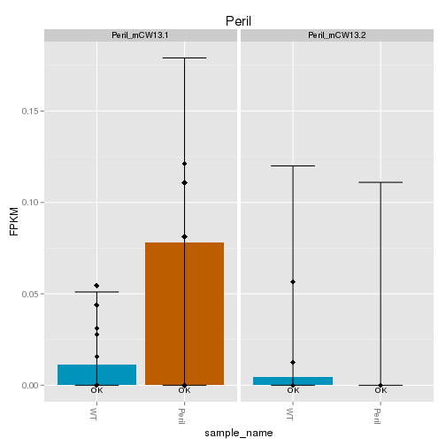

Peril KO vs WT (Embryonic)
======================================


- add labels, descriptions
- turn off all caching 
- other heatmap labels (csHeatmap)
- break into individual replicate bargraphs for genotyping... 
- overlap figure
- tracks 


# Intialize


# Design Overview

This file shows the wt-v-ko comparison for Peril. 

Samples used are:
<!-- html table generated in R 3.0.2 by xtable 1.7-3 package -->
<!-- Sun Jun 15 23:32:56 2014 -->
<TABLE border=1>
<TR> <TH>  </TH> <TH> 10 </TH>  </TR>
  <TR> <TD align="right"> 1 </TD> <TD> JR753 </TD> </TR>
  <TR> <TD align="right"> 2 </TD> <TD> JR750 </TD> </TR>
  <TR> <TD align="right"> 3 </TD> <TD> JR771 </TD> </TR>
  <TR> <TD align="right"> 4 </TD> <TD> JR755 </TD> </TR>
  <TR> <TD align="right"> 5 </TD> <TD> JR811 </TD> </TR>
  <TR> <TD align="right"> 6 </TD> <TD> JR768 </TD> </TR>
  <TR> <TD align="right"> 7 </TD> <TD> JR761 </TD> </TR>
  <TR> <TD align="right"> 8 </TD> <TD> JR815 </TD> </TR>
  <TR> <TD align="right"> 9 </TD> <TD> JR789 </TD> </TR>
  <TR> <TD align="right"> 10 </TD> <TD> JR748 </TD> </TR>
  <TR> <TD align="right"> 11 </TD> <TD> JR716 </TD> </TR>
  <TR> <TD align="right"> 12 </TD> <TD> JR717 </TD> </TR>
  <TR> <TD align="right"> 13 </TD> <TD> JR719 </TD> </TR>
  <TR> <TD align="right"> 14 </TD> <TD> JR791 </TD> </TR>
  <TR> <TD align="right"> 15 </TD> <TD> JR756 </TD> </TR>
  <TR> <TD align="right"> 16 </TD> <TD> JR721 </TD> </TR>
  <TR> <TD align="right"> 17 </TD> <TD> JR718 </TD> </TR>
  <TR> <TD align="right"> 18 </TD> <TD> JR720 </TD> </TR>
  <TR> <TD align="right"> 19 </TD> <TD> JR792 </TD> </TR>
   </TABLE>


Cuff overview:

```
## CuffSet instance with:
## 	 2 samples
## 	 26754 genes
## 	 77524 isoforms
## 	 0 TSS
## 	 0 CDS
## 	 0 promoters
## 	 0 splicing
## 	 0 relCDS
```

## Replicates
<!-- html table generated in R 3.0.2 by xtable 1.7-3 package -->
<!-- Sun Jun 15 23:32:57 2014 -->
<TABLE border=1>
<TR> <TH>  </TH> <TH> file </TH> <TH> sample_name </TH> <TH> replicate </TH> <TH> rep_name </TH> <TH> total_mass </TH> <TH> norm_mass </TH> <TH> internal_scale </TH> <TH> external_scale </TH>  </TR>
  <TR> <TD align="right"> 1 </TD> <TD> /n/rinn_data1/seq/lgoff/Projects/BrainMap/data/quants/JR753/abundances.cxb </TD> <TD> WT </TD> <TD align="right">   0 </TD> <TD> WT_0 </TD> <TD align="right"> 39343800.00 </TD> <TD align="right"> 28875500.00 </TD> <TD align="right"> 1.41 </TD> <TD align="right"> 1.00 </TD> </TR>
  <TR> <TD align="right"> 2 </TD> <TD> /n/rinn_data1/seq/lgoff/Projects/BrainMap/data/quants/JR750/abundances.cxb </TD> <TD> WT </TD> <TD align="right">   1 </TD> <TD> WT_1 </TD> <TD align="right"> 36041100.00 </TD> <TD align="right"> 28875500.00 </TD> <TD align="right"> 1.23 </TD> <TD align="right"> 1.00 </TD> </TR>
  <TR> <TD align="right"> 3 </TD> <TD> /n/rinn_data1/seq/lgoff/Projects/BrainMap/data/quants/JR771/abundances.cxb </TD> <TD> WT </TD> <TD align="right">   2 </TD> <TD> WT_2 </TD> <TD align="right"> 38877000.00 </TD> <TD align="right"> 28875500.00 </TD> <TD align="right"> 1.37 </TD> <TD align="right"> 1.00 </TD> </TR>
  <TR> <TD align="right"> 4 </TD> <TD> /n/rinn_data1/seq/lgoff/Projects/BrainMap/data/quants/JR755/abundances.cxb </TD> <TD> WT </TD> <TD align="right">   3 </TD> <TD> WT_3 </TD> <TD align="right"> 41822800.00 </TD> <TD align="right"> 28875500.00 </TD> <TD align="right"> 1.44 </TD> <TD align="right"> 1.00 </TD> </TR>
  <TR> <TD align="right"> 5 </TD> <TD> /n/rinn_data1/seq/lgoff/Projects/BrainMap/data/quants/JR811/abundances.cxb </TD> <TD> WT </TD> <TD align="right">   4 </TD> <TD> WT_4 </TD> <TD align="right"> 38186700.00 </TD> <TD align="right"> 28875500.00 </TD> <TD align="right"> 1.34 </TD> <TD align="right"> 1.00 </TD> </TR>
  <TR> <TD align="right"> 6 </TD> <TD> /n/rinn_data1/seq/lgoff/Projects/BrainMap/data/quants/JR768/abundances.cxb </TD> <TD> WT </TD> <TD align="right">   5 </TD> <TD> WT_5 </TD> <TD align="right"> 28382500.00 </TD> <TD align="right"> 28875500.00 </TD> <TD align="right"> 1.00 </TD> <TD align="right"> 1.00 </TD> </TR>
  <TR> <TD align="right"> 7 </TD> <TD> /n/rinn_data1/seq/lgoff/Projects/BrainMap/data/quants/JR761/abundances.cxb </TD> <TD> WT </TD> <TD align="right">   6 </TD> <TD> WT_6 </TD> <TD align="right"> 31711800.00 </TD> <TD align="right"> 28875500.00 </TD> <TD align="right"> 1.09 </TD> <TD align="right"> 1.00 </TD> </TR>
  <TR> <TD align="right"> 8 </TD> <TD> /n/rinn_data1/seq/lgoff/Projects/BrainMap/data/quants/JR815/abundances.cxb </TD> <TD> WT </TD> <TD align="right">   7 </TD> <TD> WT_7 </TD> <TD align="right"> 29744300.00 </TD> <TD align="right"> 28875500.00 </TD> <TD align="right"> 1.03 </TD> <TD align="right"> 1.00 </TD> </TR>
  <TR> <TD align="right"> 9 </TD> <TD> /n/rinn_data1/seq/lgoff/Projects/BrainMap/data/quants/JR789/abundances.cxb </TD> <TD> WT </TD> <TD align="right">   8 </TD> <TD> WT_8 </TD> <TD align="right"> 27686600.00 </TD> <TD align="right"> 28875500.00 </TD> <TD align="right"> 0.96 </TD> <TD align="right"> 1.00 </TD> </TR>
  <TR> <TD align="right"> 10 </TD> <TD> /n/rinn_data1/seq/lgoff/Projects/BrainMap/data/quants/JR748/abundances.cxb </TD> <TD> WT </TD> <TD align="right">   9 </TD> <TD> WT_9 </TD> <TD align="right"> 32374600.00 </TD> <TD align="right"> 28875500.00 </TD> <TD align="right"> 1.07 </TD> <TD align="right"> 1.00 </TD> </TR>
  <TR> <TD align="right"> 11 </TD> <TD> /n/rinn_data1/seq/lgoff/Projects/BrainMap/data/quants/JR716/abundances.cxb </TD> <TD> WT </TD> <TD align="right">  10 </TD> <TD> WT_10 </TD> <TD align="right"> 26148700.00 </TD> <TD align="right"> 28875500.00 </TD> <TD align="right"> 0.91 </TD> <TD align="right"> 1.00 </TD> </TR>
  <TR> <TD align="right"> 12 </TD> <TD> /n/rinn_data1/seq/lgoff/Projects/BrainMap/data/quants/JR717/abundances.cxb </TD> <TD> WT </TD> <TD align="right">  11 </TD> <TD> WT_11 </TD> <TD align="right"> 25571500.00 </TD> <TD align="right"> 28875500.00 </TD> <TD align="right"> 0.89 </TD> <TD align="right"> 1.00 </TD> </TR>
  <TR> <TD align="right"> 13 </TD> <TD> /n/rinn_data1/seq/lgoff/Projects/BrainMap/data/quants/JR719/abundances.cxb </TD> <TD> WT </TD> <TD align="right">  12 </TD> <TD> WT_12 </TD> <TD align="right"> 22702200.00 </TD> <TD align="right"> 28875500.00 </TD> <TD align="right"> 0.77 </TD> <TD align="right"> 1.00 </TD> </TR>
  <TR> <TD align="right"> 14 </TD> <TD> /n/rinn_data1/seq/lgoff/Projects/BrainMap/data/quants/JR791/abundances.cxb </TD> <TD> WT </TD> <TD align="right">  13 </TD> <TD> WT_13 </TD> <TD align="right"> 12886300.00 </TD> <TD align="right"> 28875500.00 </TD> <TD align="right"> 0.45 </TD> <TD align="right"> 1.00 </TD> </TR>
  <TR> <TD align="right"> 15 </TD> <TD> /n/rinn_data1/seq/lgoff/Projects/BrainMap/data/quants/JR756/abundances.cxb </TD> <TD> WT </TD> <TD align="right">  14 </TD> <TD> WT_14 </TD> <TD align="right"> 38957200.00 </TD> <TD align="right"> 28875500.00 </TD> <TD align="right"> 1.36 </TD> <TD align="right"> 1.00 </TD> </TR>
  <TR> <TD align="right"> 16 </TD> <TD> /n/rinn_data1/seq/lgoff/Projects/BrainMap/data/quants/JR721/abundances.cxb </TD> <TD> Peril </TD> <TD align="right">   0 </TD> <TD> Peril_0 </TD> <TD align="right"> 22596900.00 </TD> <TD align="right"> 28875500.00 </TD> <TD align="right"> 0.79 </TD> <TD align="right"> 1.00 </TD> </TR>
  <TR> <TD align="right"> 17 </TD> <TD> /n/rinn_data1/seq/lgoff/Projects/BrainMap/data/quants/JR718/abundances.cxb </TD> <TD> Peril </TD> <TD align="right">   1 </TD> <TD> Peril_1 </TD> <TD align="right"> 27641100.00 </TD> <TD align="right"> 28875500.00 </TD> <TD align="right"> 0.96 </TD> <TD align="right"> 1.00 </TD> </TR>
  <TR> <TD align="right"> 18 </TD> <TD> /n/rinn_data1/seq/lgoff/Projects/BrainMap/data/quants/JR720/abundances.cxb </TD> <TD> Peril </TD> <TD align="right">   2 </TD> <TD> Peril_2 </TD> <TD align="right"> 19595400.00 </TD> <TD align="right"> 28875500.00 </TD> <TD align="right"> 0.67 </TD> <TD align="right"> 1.00 </TD> </TR>
  <TR> <TD align="right"> 19 </TD> <TD> /n/rinn_data1/seq/lgoff/Projects/BrainMap/data/quants/JR792/abundances.cxb </TD> <TD> Peril </TD> <TD align="right">   3 </TD> <TD> Peril_3 </TD> <TD align="right"> 29660500.00 </TD> <TD align="right"> 28875500.00 </TD> <TD align="right"> 1.04 </TD> <TD align="right"> 1.00 </TD> </TR>
   </TABLE>

# QC

## Dispersion

Dispersion plot for genes in cuff:
(Overdispersion can lead to innacurate quants)


```
## Error: 'from' cannot be NA, NaN or infinite
```

## Cross-replicate variability (fpkmSCVplot)
Differences in CV 2 can result in lower numbers of differentially expressed genes due to a higher degree of variability between replicate fpkm estimates.

Genes:

```
## Scale for 'x' is already present. Adding another scale for 'x', which will replace the existing scale.
## geom_smooth: method="auto" and size of largest group is >=1000, so using gam with formula: y ~ s(x, bs = "cs"). Use 'method = x' to change the smoothing method.
```

 


Isoforms: 

```
## Scale for 'x' is already present. Adding another scale for 'x', which will replace the existing scale.
## geom_smooth: method="auto" and size of largest group is >=1000, so using gam with formula: y ~ s(x, bs = "cs"). Use 'method = x' to change the smoothing method.
```

 

## Volcano

```
## Error: One or more values of 'x' or 'y' are not valid sample names!
```

### Volcano matrix (replicates)

 

## MvA plot

```
## Error: non-numeric argument to binary operator
```
   
### MvA plot counts

```
## Error: non-numeric argument to binary operator
```

## Scatterplot
 

### Scatter matrix (replicates) -- SKIP FOR NOW CAUSING PROBLEMS 


## Distributions

### Boxplots

Boxplot (genes)

 

Boxplot (genes, replicates)

 

Boxplot (isoforms)

 

Boxplot (isoforms, replicates)

 

### Density
Density (genes)

```
## Warning: Removed 4349 rows containing non-finite values (stat_density).
## Warning: Removed 5830 rows containing non-finite values (stat_density).
```

 
Density (genes, replicates)

```
## Warning: Removed 6674 rows containing non-finite values (stat_density).
## Warning: Removed 7002 rows containing non-finite values (stat_density).
## Warning: Removed 6665 rows containing non-finite values (stat_density).
## Warning: Removed 6660 rows containing non-finite values (stat_density).
## Warning: Removed 6658 rows containing non-finite values (stat_density).
## Warning: Removed 6924 rows containing non-finite values (stat_density).
## Warning: Removed 6924 rows containing non-finite values (stat_density).
## Warning: Removed 6977 rows containing non-finite values (stat_density).
## Warning: Removed 6968 rows containing non-finite values (stat_density).
## Warning: Removed 6936 rows containing non-finite values (stat_density).
## Warning: Removed 7397 rows containing non-finite values (stat_density).
## Warning: Removed 7319 rows containing non-finite values (stat_density).
## Warning: Removed 7685 rows containing non-finite values (stat_density).
## Warning: Removed 7859 rows containing non-finite values (stat_density).
## Warning: Removed 6664 rows containing non-finite values (stat_density).
## Warning: Removed 7575 rows containing non-finite values (stat_density).
## Warning: Removed 7296 rows containing non-finite values (stat_density).
## Warning: Removed 7734 rows containing non-finite values (stat_density).
## Warning: Removed 6897 rows containing non-finite values (stat_density).
```

 


## Clustering

### Replicate Clusters
 

```
## 'dendrogram' with 2 branches and 19 members total, at height 0.08699
```

### PCA (genes)
 

### MDS (genes)
 

### Distance Heat Map (genes)
 


# KO assessment

## Endogenous lncRNA expression
<!-- html table generated in R 3.0.2 by xtable 1.7-3 package -->
<!-- Sun Jun 15 23:35:06 2014 -->
<TABLE border=1>
<TR> <TH>  </TH> <TH> gene_id </TH> <TH> sample_name </TH> <TH> fpkm </TH> <TH> conf_hi </TH> <TH> conf_lo </TH> <TH> quant_status </TH>  </TR>
  <TR> <TD align="right"> 1 </TD> <TD> Peril </TD> <TD> Peril </TD> <TD align="right"> 0.08 </TD> <TD align="right"> 0.24 </TD> <TD align="right"> 0.00 </TD> <TD> OK </TD> </TR>
  <TR> <TD align="right"> 2 </TD> <TD> Peril </TD> <TD> WT </TD> <TD align="right"> 0.02 </TD> <TD align="right"> 0.14 </TD> <TD align="right"> 0.00 </TD> <TD> OK </TD> </TR>
   </TABLE>
<!-- html table generated in R 3.0.2 by xtable 1.7-3 package -->
<!-- Sun Jun 15 23:35:06 2014 -->
<TABLE border=1>
<TR> <TH>  </TH> <TH> isoform_id </TH> <TH> sample_name </TH> <TH> fpkm </TH> <TH> conf_hi </TH> <TH> conf_lo </TH> <TH> quant_status </TH>  </TR>
  <TR> <TD align="right"> 1 </TD> <TD> Peril_mCW13.1 </TD> <TD> Peril </TD> <TD align="right"> 0.08 </TD> <TD align="right"> 0.18 </TD> <TD align="right"> 0.00 </TD> <TD> OK </TD> </TR>
  <TR> <TD align="right"> 2 </TD> <TD> Peril_mCW13.2 </TD> <TD> Peril </TD> <TD align="right"> 0.00 </TD> <TD align="right"> 0.11 </TD> <TD align="right"> 0.00 </TD> <TD> OK </TD> </TR>
  <TR> <TD align="right"> 3 </TD> <TD> Peril_mCW13.1 </TD> <TD> WT </TD> <TD align="right"> 0.01 </TD> <TD align="right"> 0.05 </TD> <TD align="right"> 0.00 </TD> <TD> OK </TD> </TR>
  <TR> <TD align="right"> 4 </TD> <TD> Peril_mCW13.2 </TD> <TD> WT </TD> <TD align="right"> 0.00 </TD> <TD align="right"> 0.12 </TD> <TD align="right"> 0.00 </TD> <TD> OK </TD> </TR>
   </TABLE>
  

Endogenous expression of Peril isoforms:
  

Barplot of gene expression:
  

Barplot of isoform expression:
  


## LacZ expression
<!-- html table generated in R 3.0.2 by xtable 1.7-3 package -->
<!-- Sun Jun 15 23:35:15 2014 -->
<TABLE border=1>
<TR> <TH>  </TH> <TH> gene_id </TH> <TH> sample_name </TH> <TH> fpkm </TH> <TH> conf_hi </TH> <TH> conf_lo </TH> <TH> quant_status </TH>  </TR>
  <TR> <TD align="right"> 1 </TD> <TD> Velocigene_LacZ </TD> <TD> Peril </TD> <TD align="right"> 24.56 </TD> <TD align="right"> 30.10 </TD> <TD align="right"> 19.02 </TD> <TD> OK </TD> </TR>
  <TR> <TD align="right"> 2 </TD> <TD> Velocigene_LacZ </TD> <TD> WT </TD> <TD align="right"> 0.02 </TD> <TD align="right"> 0.06 </TD> <TD align="right"> 0.00 </TD> <TD> OK </TD> </TR>
   </TABLE>
    


## Digital Genotyping (LacZ vs Endogenous lncRNA and Sex)
Expression plot (endogenous linc, lacZ, Y-expressed gene):


```
## Scale for 'colour' is already present. Adding another scale for 'colour', which will replace the existing scale.
## ymax not defined: adjusting position using y instead
```

 

Expression heatmap:

```
## Using tracking_id, rep_name as id variables
## No id variables; using all as measure variables
```

 

# Differential Analysis

## Differential Genes 


There are 291 significantly differentially expressed genes. They are:

<!-- html table generated in R 3.0.2 by xtable 1.7-3 package -->
<!-- Sun Jun 15 23:35:28 2014 -->
<TABLE border=1>
<TR> <TH>  </TH> <TH> geneAnnot$gene_short_name </TH>  </TR>
  <TR> <TD align="right"> 1 </TD> <TD> Wnt9a </TD> </TR>
  <TR> <TD align="right"> 2 </TD> <TD> Ccnd2 </TD> </TR>
  <TR> <TD align="right"> 3 </TD> <TD> Itga5 </TD> </TR>
  <TR> <TD align="right"> 4 </TD> <TD> Gabra2 </TD> </TR>
  <TR> <TD align="right"> 5 </TD> <TD> Sox9 </TD> </TR>
  <TR> <TD align="right"> 6 </TD> <TD> Col18a1 </TD> </TR>
  <TR> <TD align="right"> 7 </TD> <TD> Col1a1 </TD> </TR>
  <TR> <TD align="right"> 8 </TD> <TD> Phyhip </TD> </TR>
  <TR> <TD align="right"> 9 </TD> <TD> Ddr1 </TD> </TR>
  <TR> <TD align="right"> 10 </TD> <TD> Kifc2 </TD> </TR>
  <TR> <TD align="right"> 11 </TD> <TD> Aqp1 </TD> </TR>
  <TR> <TD align="right"> 12 </TD> <TD> Pax3 </TD> </TR>
  <TR> <TD align="right"> 13 </TD> <TD> Nes </TD> </TR>
  <TR> <TD align="right"> 14 </TD> <TD> Wisp1 </TD> </TR>
  <TR> <TD align="right"> 15 </TD> <TD> Nid1 </TD> </TR>
  <TR> <TD align="right"> 16 </TD> <TD> Hmox1 </TD> </TR>
  <TR> <TD align="right"> 17 </TD> <TD> Osgep </TD> </TR>
  <TR> <TD align="right"> 18 </TD> <TD> Rplp1 </TD> </TR>
  <TR> <TD align="right"> 19 </TD> <TD> Bmp7 </TD> </TR>
  <TR> <TD align="right"> 20 </TD> <TD> Wnt3a </TD> </TR>
  <TR> <TD align="right"> 21 </TD> <TD> Odc1 </TD> </TR>
  <TR> <TD align="right"> 22 </TD> <TD> Aldh1a2 </TD> </TR>
  <TR> <TD align="right"> 23 </TD> <TD> Dennd6b </TD> </TR>
  <TR> <TD align="right"> 24 </TD> <TD> Celsr1 </TD> </TR>
  <TR> <TD align="right"> 25 </TD> <TD> Sulf1 </TD> </TR>
  <TR> <TD align="right"> 26 </TD> <TD> Utrn </TD> </TR>
  <TR> <TD align="right"> 27 </TD> <TD> Slc16a10 </TD> </TR>
  <TR> <TD align="right"> 28 </TD> <TD> Rspo3 </TD> </TR>
  <TR> <TD align="right"> 29 </TD> <TD> Lrriq1 </TD> </TR>
  <TR> <TD align="right"> 30 </TD> <TD> Lama2 </TD> </TR>
  <TR> <TD align="right"> 31 </TD> <TD> Ndufa12 </TD> </TR>
  <TR> <TD align="right"> 32 </TD> <TD> Rfx4 </TD> </TR>
  <TR> <TD align="right"> 33 </TD> <TD> Grb10 </TD> </TR>
  <TR> <TD align="right"> 34 </TD> <TD> Aebp1 </TD> </TR>
  <TR> <TD align="right"> 35 </TD> <TD> Pomc </TD> </TR>
  <TR> <TD align="right"> 36 </TD> <TD> Galk1 </TD> </TR>
  <TR> <TD align="right"> 37 </TD> <TD> Nxn </TD> </TR>
  <TR> <TD align="right"> 38 </TD> <TD> Ntn1 </TD> </TR>
  <TR> <TD align="right"> 39 </TD> <TD> Amn </TD> </TR>
  <TR> <TD align="right"> 40 </TD> <TD> Msx2 </TD> </TR>
  <TR> <TD align="right"> 41 </TD> <TD> Gpx8 </TD> </TR>
  <TR> <TD align="right"> 42 </TD> <TD> Nid2 </TD> </TR>
  <TR> <TD align="right"> 43 </TD> <TD> Gdf10 </TD> </TR>
  <TR> <TD align="right"> 44 </TD> <TD> Esd </TD> </TR>
  <TR> <TD align="right"> 45 </TD> <TD> Tnfrsf10b </TD> </TR>
  <TR> <TD align="right"> 46 </TD> <TD> Psmb5 </TD> </TR>
  <TR> <TD align="right"> 47 </TD> <TD> Npr3 </TD> </TR>
  <TR> <TD align="right"> 48 </TD> <TD> Col14a1 </TD> </TR>
  <TR> <TD align="right"> 49 </TD> <TD> Wnt7b </TD> </TR>
  <TR> <TD align="right"> 50 </TD> <TD> Myh9 </TD> </TR>
  <TR> <TD align="right"> 51 </TD> <TD> Arhgap31 </TD> </TR>
  <TR> <TD align="right"> 52 </TD> <TD> Adamts1 </TD> </TR>
  <TR> <TD align="right"> 53 </TD> <TD> Clic6 </TD> </TR>
  <TR> <TD align="right"> 54 </TD> <TD> Wnt1 </TD> </TR>
  <TR> <TD align="right"> 55 </TD> <TD> Krt18 </TD> </TR>
  <TR> <TD align="right"> 56 </TD> <TD> Dlx2 </TD> </TR>
  <TR> <TD align="right"> 57 </TD> <TD> Igf2r </TD> </TR>
  <TR> <TD align="right"> 58 </TD> <TD> Prss41 </TD> </TR>
  <TR> <TD align="right"> 59 </TD> <TD> Gfra3 </TD> </TR>
  <TR> <TD align="right"> 60 </TD> <TD> H2-M5 </TD> </TR>
  <TR> <TD align="right"> 61 </TD> <TD> Pou4f3 </TD> </TR>
  <TR> <TD align="right"> 62 </TD> <TD> Lox </TD> </TR>
  <TR> <TD align="right"> 63 </TD> <TD> Megf10 </TD> </TR>
  <TR> <TD align="right"> 64 </TD> <TD> Fbn2 </TD> </TR>
  <TR> <TD align="right"> 65 </TD> <TD> Pdgfrb </TD> </TR>
  <TR> <TD align="right"> 66 </TD> <TD> Gldc </TD> </TR>
  <TR> <TD align="right"> 67 </TD> <TD> Cpt1a </TD> </TR>
  <TR> <TD align="right"> 68 </TD> <TD> Slc18a2 </TD> </TR>
  <TR> <TD align="right"> 69 </TD> <TD> Rps24 </TD> </TR>
  <TR> <TD align="right"> 70 </TD> <TD> Podxl </TD> </TR>
  <TR> <TD align="right"> 71 </TD> <TD> Pdia4 </TD> </TR>
  <TR> <TD align="right"> 72 </TD> <TD> Col5a2 </TD> </TR>
  <TR> <TD align="right"> 73 </TD> <TD> Col3a1 </TD> </TR>
  <TR> <TD align="right"> 74 </TD> <TD> Stk17b </TD> </TR>
  <TR> <TD align="right"> 75 </TD> <TD> Igfbp5 </TD> </TR>
  <TR> <TD align="right"> 76 </TD> <TD> Fn1 </TD> </TR>
  <TR> <TD align="right"> 77 </TD> <TD> Ptma </TD> </TR>
  <TR> <TD align="right"> 78 </TD> <TD> Lamc1 </TD> </TR>
  <TR> <TD align="right"> 79 </TD> <TD> Ptpn14 </TD> </TR>
  <TR> <TD align="right"> 80 </TD> <TD> Ddr2 </TD> </TR>
  <TR> <TD align="right"> 81 </TD> <TD> Lmx1a </TD> </TR>
  <TR> <TD align="right"> 82 </TD> <TD> Gad2 </TD> </TR>
  <TR> <TD align="right"> 83 </TD> <TD> Col5a1 </TD> </TR>
  <TR> <TD align="right"> 84 </TD> <TD> Lamc3 </TD> </TR>
  <TR> <TD align="right"> 85 </TD> <TD> Hspa5 </TD> </TR>
  <TR> <TD align="right"> 86 </TD> <TD> Lhx6 </TD> </TR>
  <TR> <TD align="right"> 87 </TD> <TD> Notch1 </TD> </TR>
  <TR> <TD align="right"> 88 </TD> <TD> Lrp2 </TD> </TR>
  <TR> <TD align="right"> 89 </TD> <TD> Fbn1 </TD> </TR>
  <TR> <TD align="right"> 90 </TD> <TD> Cd82 </TD> </TR>
  <TR> <TD align="right"> 91 </TD> <TD> Tspan18 </TD> </TR>
  <TR> <TD align="right"> 92 </TD> <TD> Syt13 </TD> </TR>
  <TR> <TD align="right"> 93 </TD> <TD> Mccc1 </TD> </TR>
  <TR> <TD align="right"> 94 </TD> <TD> Slc7a11 </TD> </TR>
  <TR> <TD align="right"> 95 </TD> <TD> Hsd3b6 </TD> </TR>
  <TR> <TD align="right"> 96 </TD> <TD> Notch2 </TD> </TR>
  <TR> <TD align="right"> 97 </TD> <TD> Vcam1 </TD> </TR>
  <TR> <TD align="right"> 98 </TD> <TD> Hadh </TD> </TR>
  <TR> <TD align="right"> 99 </TD> <TD> Wls </TD> </TR>
  <TR> <TD align="right"> 100 </TD> <TD> Sfrs18 </TD> </TR>
  <TR> <TD align="right"> 101 </TD> <TD> Tnc </TD> </TR>
  <TR> <TD align="right"> 102 </TD> <TD> Svep1 </TD> </TR>
  <TR> <TD align="right"> 103 </TD> <TD> Rps6 </TD> </TR>
  <TR> <TD align="right"> 104 </TD> <TD> Stmn1 </TD> </TR>
  <TR> <TD align="right"> 105 </TD> <TD> Trp73 </TD> </TR>
  <TR> <TD align="right"> 106 </TD> <TD> Nsun7 </TD> </TR>
  <TR> <TD align="right"> 107 </TD> <TD> Pdgfra </TD> </TR>
  <TR> <TD align="right"> 108 </TD> <TD> Gm996 </TD> </TR>
  <TR> <TD align="right"> 109 </TD> <TD> Col1a2 </TD> </TR>
  <TR> <TD align="right"> 110 </TD> <TD> Ephb4 </TD> </TR>
  <TR> <TD align="right"> 111 </TD> <TD> Dlx5 </TD> </TR>
  <TR> <TD align="right"> 112 </TD> <TD> Fkbp9 </TD> </TR>
  <TR> <TD align="right"> 113 </TD> <TD> Lrig1 </TD> </TR>
  <TR> <TD align="right"> 114 </TD> <TD> Aldh1l1 </TD> </TR>
  <TR> <TD align="right"> 115 </TD> <TD> Plxnd1 </TD> </TR>
  <TR> <TD align="right"> 116 </TD> <TD> Emp1 </TD> </TR>
  <TR> <TD align="right"> 117 </TD> <TD> Dbx1 </TD> </TR>
  <TR> <TD align="right"> 118 </TD> <TD> Trpm1 </TD> </TR>
  <TR> <TD align="right"> 119 </TD> <TD> Hddc3 </TD> </TR>
  <TR> <TD align="right"> 120 </TD> <TD> Zkscan2 </TD> </TR>
  <TR> <TD align="right"> 121 </TD> <TD> Dkk3 </TD> </TR>
  <TR> <TD align="right"> 122 </TD> <TD> Lyve1 </TD> </TR>
  <TR> <TD align="right"> 123 </TD> <TD> St5 </TD> </TR>
  <TR> <TD align="right"> 124 </TD> <TD> Elf4 </TD> </TR>
  <TR> <TD align="right"> 125 </TD> <TD> Heph </TD> </TR>
  <TR> <TD align="right"> 126 </TD> <TD> Col4a5 </TD> </TR>
  <TR> <TD align="right"> 127 </TD> <TD> Plat </TD> </TR>
  <TR> <TD align="right"> 128 </TD> <TD> Slit2 </TD> </TR>
  <TR> <TD align="right"> 129 </TD> <TD> Gab1 </TD> </TR>
  <TR> <TD align="right"> 130 </TD> <TD> Ccdc135 </TD> </TR>
  <TR> <TD align="right"> 131 </TD> <TD> Hsd11b2 </TD> </TR>
  <TR> <TD align="right"> 132 </TD> <TD> Itga11 </TD> </TR>
  <TR> <TD align="right"> 133 </TD> <TD> Col12a1 </TD> </TR>
  <TR> <TD align="right"> 134 </TD> <TD> Gsta4 </TD> </TR>
  <TR> <TD align="right"> 135 </TD> <TD> Car12 </TD> </TR>
  <TR> <TD align="right"> 136 </TD> <TD> Rpsa </TD> </TR>
  <TR> <TD align="right"> 137 </TD> <TD> Inppl1 </TD> </TR>
  <TR> <TD align="right"> 138 </TD> <TD> Lama1 </TD> </TR>
  <TR> <TD align="right"> 139 </TD> <TD> Ndn </TD> </TR>
  <TR> <TD align="right"> 140 </TD> <TD> Tlr13 </TD> </TR>
  <TR> <TD align="right"> 141 </TD> <TD> Gria2 </TD> </TR>
  <TR> <TD align="right"> 142 </TD> <TD> Foxj1 </TD> </TR>
  <TR> <TD align="right"> 143 </TD> <TD> Tmem132c </TD> </TR>
  <TR> <TD align="right"> 144 </TD> <TD> Gbx2 </TD> </TR>
  <TR> <TD align="right"> 145 </TD> <TD> Scn10a </TD> </TR>
  <TR> <TD align="right"> 146 </TD> <TD> Ptpn13 </TD> </TR>
  <TR> <TD align="right"> 147 </TD> <TD> Ankrd12 </TD> </TR>
  <TR> <TD align="right"> 148 </TD> <TD> Tdg </TD> </TR>
  <TR> <TD align="right"> 149 </TD> <TD> Prr7 </TD> </TR>
  <TR> <TD align="right"> 150 </TD> <TD> Fras1 </TD> </TR>
  <TR> <TD align="right"> 151 </TD> <TD> Arl4d </TD> </TR>
  <TR> <TD align="right"> 152 </TD> <TD> Heatr5a </TD> </TR>
  <TR> <TD align="right"> 153 </TD> <TD> Arx </TD> </TR>
  <TR> <TD align="right"> 154 </TD> <TD> Ror1 </TD> </TR>
  <TR> <TD align="right"> 155 </TD> <TD> Ccl2 </TD> </TR>
  <TR> <TD align="right"> 156 </TD> <TD> Tgfbi </TD> </TR>
  <TR> <TD align="right"> 157 </TD> <TD> Cox8a </TD> </TR>
  <TR> <TD align="right"> 158 </TD> <TD> Colec12 </TD> </TR>
  <TR> <TD align="right"> 159 </TD> <TD> Gatad2a </TD> </TR>
  <TR> <TD align="right"> 160 </TD> <TD> Lum </TD> </TR>
  <TR> <TD align="right"> 161 </TD> <TD> C1ql2 </TD> </TR>
  <TR> <TD align="right"> 162 </TD> <TD> Wnt8b </TD> </TR>
  <TR> <TD align="right"> 163 </TD> <TD> Frem2 </TD> </TR>
  <TR> <TD align="right"> 164 </TD> <TD> Atp11b </TD> </TR>
  <TR> <TD align="right"> 165 </TD> <TD> Vstm2l </TD> </TR>
  <TR> <TD align="right"> 166 </TD> <TD> Notch3 </TD> </TR>
  <TR> <TD align="right"> 167 </TD> <TD> Spon1 </TD> </TR>
  <TR> <TD align="right"> 168 </TD> <TD> Satb2 </TD> </TR>
  <TR> <TD align="right"> 169 </TD> <TD> Akap12 </TD> </TR>
  <TR> <TD align="right"> 170 </TD> <TD> Atp5l </TD> </TR>
  <TR> <TD align="right"> 171 </TD> <TD> Itpkb </TD> </TR>
  <TR> <TD align="right"> 172 </TD> <TD> Anpep </TD> </TR>
  <TR> <TD align="right"> 173 </TD> <TD> Rbpj </TD> </TR>
  <TR> <TD align="right"> 174 </TD> <TD> Pcsk1n </TD> </TR>
  <TR> <TD align="right"> 175 </TD> <TD> Igfbp2 </TD> </TR>
  <TR> <TD align="right"> 176 </TD> <TD> Kcne2 </TD> </TR>
  <TR> <TD align="right"> 177 </TD> <TD> Dag1 </TD> </TR>
  <TR> <TD align="right"> 178 </TD> <TD> Bmf </TD> </TR>
  <TR> <TD align="right"> 179 </TD> <TD> Thbs1 </TD> </TR>
  <TR> <TD align="right"> 180 </TD> <TD> Arglu1 </TD> </TR>
  <TR> <TD align="right"> 181 </TD> <TD> Abcb1a </TD> </TR>
  <TR> <TD align="right"> 182 </TD> <TD> Ildr2 </TD> </TR>
  <TR> <TD align="right"> 183 </TD> <TD> C1qtnf4 </TD> </TR>
  <TR> <TD align="right"> 184 </TD> <TD> Abhd4 </TD> </TR>
  <TR> <TD align="right"> 185 </TD> <TD> Npnt </TD> </TR>
  <TR> <TD align="right"> 186 </TD> <TD> Fzd7 </TD> </TR>
  <TR> <TD align="right"> 187 </TD> <TD> Ccdc8 </TD> </TR>
  <TR> <TD align="right"> 188 </TD> <TD> Arhgap11a </TD> </TR>
  <TR> <TD align="right"> 189 </TD> <TD> Htr2c </TD> </TR>
  <TR> <TD align="right"> 190 </TD> <TD> Prelp </TD> </TR>
  <TR> <TD align="right"> 191 </TD> <TD> Nlrp5-ps </TD> </TR>
  <TR> <TD align="right"> 192 </TD> <TD> Pgm5 </TD> </TR>
  <TR> <TD align="right"> 193 </TD> <TD> Dlx1 </TD> </TR>
  <TR> <TD align="right"> 194 </TD> <TD> Rassf4 </TD> </TR>
  <TR> <TD align="right"> 195 </TD> <TD> Dmrt3 </TD> </TR>
  <TR> <TD align="right"> 196 </TD> <TD> Lor </TD> </TR>
  <TR> <TD align="right"> 197 </TD> <TD> A030009H04Rik </TD> </TR>
  <TR> <TD align="right"> 198 </TD> <TD> Tmem145 </TD> </TR>
  <TR> <TD align="right"> 199 </TD> <TD> Wfikkn2 </TD> </TR>
  <TR> <TD align="right"> 200 </TD> <TD> Snhg11 </TD> </TR>
  <TR> <TD align="right"> 201 </TD> <TD> Gm9493 </TD> </TR>
  <TR> <TD align="right"> 202 </TD> <TD> Acp1 </TD> </TR>
  <TR> <TD align="right"> 203 </TD> <TD> Cnpy1 </TD> </TR>
  <TR> <TD align="right"> 204 </TD> <TD> Basp1 </TD> </TR>
  <TR> <TD align="right"> 205 </TD> <TD> Olig1 </TD> </TR>
  <TR> <TD align="right"> 206 </TD> <TD> Scand1 </TD> </TR>
  <TR> <TD align="right"> 207 </TD> <TD> Gm7729 </TD> </TR>
  <TR> <TD align="right"> 208 </TD> <TD> Fat4 </TD> </TR>
  <TR> <TD align="right"> 209 </TD> <TD> Tmem164 </TD> </TR>
  <TR> <TD align="right"> 210 </TD> <TD> Adamts12 </TD> </TR>
  <TR> <TD align="right"> 211 </TD> <TD> Pirt </TD> </TR>
  <TR> <TD align="right"> 212 </TD> <TD> Msx1 </TD> </TR>
  <TR> <TD align="right"> 213 </TD> <TD> Fzd9 </TD> </TR>
  <TR> <TD align="right"> 214 </TD> <TD> Shisa3 </TD> </TR>
  <TR> <TD align="right"> 215 </TD> <TD> Pla2g4e </TD> </TR>
  <TR> <TD align="right"> 216 </TD> <TD> Gja1 </TD> </TR>
  <TR> <TD align="right"> 217 </TD> <TD> Rspo2 </TD> </TR>
  <TR> <TD align="right"> 218 </TD> <TD> Slc6a7 </TD> </TR>
  <TR> <TD align="right"> 219 </TD> <TD> Pfdn4 </TD> </TR>
  <TR> <TD align="right"> 220 </TD> <TD> Hbb-y </TD> </TR>
  <TR> <TD align="right"> 221 </TD> <TD> Hbb-bh1 </TD> </TR>
  <TR> <TD align="right"> 222 </TD> <TD> Dnah6 </TD> </TR>
  <TR> <TD align="right"> 223 </TD> <TD> Lamb2 </TD> </TR>
  <TR> <TD align="right"> 224 </TD> <TD> Glis3 </TD> </TR>
  <TR> <TD align="right"> 225 </TD> <TD> Yap1 </TD> </TR>
  <TR> <TD align="right"> 226 </TD> <TD> Sh3pxd2a </TD> </TR>
  <TR> <TD align="right"> 227 </TD> <TD> Gm9934 </TD> </TR>
  <TR> <TD align="right"> 228 </TD> <TD> Fgfr3 </TD> </TR>
  <TR> <TD align="right"> 229 </TD> <TD> Vsnl1 </TD> </TR>
  <TR> <TD align="right"> 230 </TD> <TD> Hba-x </TD> </TR>
  <TR> <TD align="right"> 231 </TD> <TD> Dach1 </TD> </TR>
  <TR> <TD align="right"> 232 </TD> <TD> Klhl25 </TD> </TR>
  <TR> <TD align="right"> 233 </TD> <TD> Myh8 </TD> </TR>
  <TR> <TD align="right"> 234 </TD> <TD> Col8a2 </TD> </TR>
  <TR> <TD align="right"> 235 </TD> <TD> Pgpep1 </TD> </TR>
  <TR> <TD align="right"> 236 </TD> <TD> Slit3 </TD> </TR>
  <TR> <TD align="right"> 237 </TD> <TD> Cd248 </TD> </TR>
  <TR> <TD align="right"> 238 </TD> <TD> Kdm5d </TD> </TR>
  <TR> <TD align="right"> 239 </TD> <TD> Gulp1 </TD> </TR>
  <TR> <TD align="right"> 240 </TD> <TD> Hist3h2ba </TD> </TR>
  <TR> <TD align="right"> 241 </TD> <TD> Rit2 </TD> </TR>
  <TR> <TD align="right"> 242 </TD> <TD> Gm5148 </TD> </TR>
  <TR> <TD align="right"> 243 </TD> <TD> Capn11 </TD> </TR>
  <TR> <TD align="right"> 244 </TD> <TD> Vwa8 </TD> </TR>
  <TR> <TD align="right"> 245 </TD> <TD> Sclt1 </TD> </TR>
  <TR> <TD align="right"> 246 </TD> <TD> Hydin </TD> </TR>
  <TR> <TD align="right"> 247 </TD> <TD> Dcc </TD> </TR>
  <TR> <TD align="right"> 248 </TD> <TD> Trank1 </TD> </TR>
  <TR> <TD align="right"> 249 </TD> <TD> Rpl17 </TD> </TR>
  <TR> <TD align="right"> 250 </TD> <TD> Otof </TD> </TR>
  <TR> <TD align="right"> 251 </TD> <TD> Ldha </TD> </TR>
  <TR> <TD align="right"> 252 </TD> <TD> Cyp26b1 </TD> </TR>
  <TR> <TD align="right"> 253 </TD> <TD> Scn1a </TD> </TR>
  <TR> <TD align="right"> 254 </TD> <TD> Cldn9 </TD> </TR>
  <TR> <TD align="right"> 255 </TD> <TD> Lgals1 </TD> </TR>
  <TR> <TD align="right"> 256 </TD> <TD> Flnc </TD> </TR>
  <TR> <TD align="right"> 257 </TD> <TD> Sp9 </TD> </TR>
  <TR> <TD align="right"> 258 </TD> <TD> Ddx3y </TD> </TR>
  <TR> <TD align="right"> 259 </TD> <TD> Ahnak </TD> </TR>
  <TR> <TD align="right"> 260 </TD> <TD> Fat1 </TD> </TR>
  <TR> <TD align="right"> 261 </TD> <TD> Ccnd1 </TD> </TR>
  <TR> <TD align="right"> 262 </TD> <TD> Serpinh1 </TD> </TR>
  <TR> <TD align="right"> 263 </TD> <TD> Peg12 </TD> </TR>
  <TR> <TD align="right"> 264 </TD> <TD> Gm10282 </TD> </TR>
  <TR> <TD align="right"> 265 </TD> <TD> Gm1673 </TD> </TR>
  <TR> <TD align="right"> 266 </TD> <TD> Gad1 </TD> </TR>
  <TR> <TD align="right"> 267 </TD> <TD> Jund </TD> </TR>
  <TR> <TD align="right"> 268 </TD> <TD> Ppia </TD> </TR>
  <TR> <TD align="right"> 269 </TD> <TD> Fam84b </TD> </TR>
  <TR> <TD align="right"> 270 </TD> <TD> Gm7292 </TD> </TR>
  <TR> <TD align="right"> 271 </TD> <TD> Drc1 </TD> </TR>
  <TR> <TD align="right"> 272 </TD> <TD> Wdfy1 </TD> </TR>
  <TR> <TD align="right"> 273 </TD> <TD> Hbb-bt </TD> </TR>
  <TR> <TD align="right"> 274 </TD> <TD> Nynrin </TD> </TR>
  <TR> <TD align="right"> 275 </TD> <TD> Ywhaq </TD> </TR>
  <TR> <TD align="right"> 276 </TD> <TD> Fzd10 </TD> </TR>
  <TR> <TD align="right"> 277 </TD> <TD> Pisd-ps1 </TD> </TR>
  <TR> <TD align="right"> 278 </TD> <TD> Gm14204 </TD> </TR>
  <TR> <TD align="right"> 279 </TD> <TD> Ier5l </TD> </TR>
  <TR> <TD align="right"> 280 </TD> <TD> Dlx6os1 </TD> </TR>
  <TR> <TD align="right"> 281 </TD> <TD> Pou3f1 </TD> </TR>
  <TR> <TD align="right"> 282 </TD> <TD> Ccdc85b </TD> </TR>
  <TR> <TD align="right"> 283 </TD> <TD> Gm21781 </TD> </TR>
  <TR> <TD align="right"> 284 </TD> <TD> Gm6472 </TD> </TR>
  <TR> <TD align="right"> 285 </TD> <TD> Dynlt1f </TD> </TR>
  <TR> <TD align="right"> 286 </TD> <TD> Lhx8 </TD> </TR>
  <TR> <TD align="right"> 287 </TD> <TD> Gm9825 </TD> </TR>
  <TR> <TD align="right"> 288 </TD> <TD> A330076H08Rik </TD> </TR>
  <TR> <TD align="right"> 289 </TD> <TD> 4930480K23Rik </TD> </TR>
  <TR> <TD align="right"> 290 </TD> <TD> A930011O12Rik </TD> </TR>
  <TR> <TD align="right"> 291 </TD> <TD> Gm27000 </TD> </TR>
   </TABLE>

### Matrix of gene significant differences between conditions

(skip for Brainmap wt-v-ko comparisons)

 

### Significant gene expression differences between conditions

Expression plot (genes):
 

```
## Using tracking_id, rep_name as id variables
## No id variables; using all as measure variables
```

 

Significant genes with expression >50fpkm (any condition):

```
## Using tracking_id, sample_name as id variables
```

 

An individual look at each of the highly expressed significantly differentially regulated genes:
(eval=false for first pass)


### Expression-level/significance relationship

Scatter plot of significant genes only:

```
## Using tracking_id, sample_name as id variables
```

```
## Error: One or more values of 'x' or 'y' are not valid sample names!
```

Volcano plot with significant genes only:

```
## Error: One or more values of 'x' or 'y' are not valid sample names!
```


## Differential Splicing

### Differential Isoforms between conditions
Per isoform difference between conditions:
 

These isoforms are:

```
## Error: no applicable method for 'xtable' applied to an object of class
## "character"
```


```
## Using tracking_id, rep_name as id variables
```

 

### Differential Splicing between conditions

(eval false for first pass)

Per condition differences in isoforms (Does gene have diff piechart between conditions?)


These genes are:


Splicing heatmap by isoform:


Splicing heatmap by gene


The following are significantly differentially spliced genes (relative portion of isoform per condition): 


 


# Gene/Pathway Analysis

## GSEA


 

 

## GO enrichment 
Cluster profiler used to call enichments of significantly differentially regulated genes that map to Entrez IDs. 

Description/explanation of what's here, and justify all choices. 


biomart to get entrez gene IDS
clusterProfiler does GO enrichment 

BP, MF, CC
enrichKEGG
enrichPathway


```
## Error: error in evaluating the argument 'x' in selecting a method for function 'plot': Error: object 'goBP' not found
```

```
## Error: error in evaluating the argument 'x' in selecting a method for function 'plot': Error: object 'goMF' not found
```

```
## Error: error in evaluating the argument 'x' in selecting a method for function 'plot': Error: object 'goCC' not found
```

```
## Error: error in evaluating the argument 'x' in selecting a method for function 'plot': Error: object 'kegg' not found
```

```
## Error: error in evaluating the argument 'x' in selecting a method for function 'plot': Error: object 'pathway' not found
```

```
## Error: invalid 'name' argument
```

# Cis vs Trans (locally)


# Notes

# Session Info

```
## R version 3.0.2 (2013-09-25)
## Platform: x86_64-unknown-linux-gnu (64-bit)
## 
## locale:
##  [1] LC_CTYPE=en_US.UTF-8       LC_NUMERIC=C              
##  [3] LC_TIME=en_US.UTF-8        LC_COLLATE=en_US.UTF-8    
##  [5] LC_MONETARY=en_US.UTF-8    LC_MESSAGES=en_US.UTF-8   
##  [7] LC_PAPER=en_US.UTF-8       LC_NAME=C                 
##  [9] LC_ADDRESS=C               LC_TELEPHONE=C            
## [11] LC_MEASUREMENT=en_US.UTF-8 LC_IDENTIFICATION=C       
## 
## attached base packages:
## [1] grid      parallel  stats     graphics  grDevices utils     datasets 
## [8] methods   base     
## 
## other attached packages:
##  [1] DOSE_2.0.0           ReactomePA_1.6.1     AnnotationDbi_1.24.0
##  [4] Biobase_2.22.0       mgcv_1.7-29          nlme_3.1-117        
##  [7] gridExtra_0.9.1      gtable_0.1.2         marray_1.40.0       
## [10] gplots_2.13.0        GSA_1.03             limma_3.18.13       
## [13] xtable_1.7-3         cummeRbund_2.7.2     Gviz_1.6.0          
## [16] rtracklayer_1.22.7   GenomicRanges_1.14.4 XVector_0.2.0       
## [19] IRanges_1.20.7       fastcluster_1.1.13   reshape2_1.4        
## [22] ggplot2_1.0.0        RSQLite_0.11.4       DBI_0.2-7           
## [25] BiocGenerics_0.8.0   knitr_1.6           
## 
## loaded via a namespace (and not attached):
##  [1] biomaRt_2.18.0         Biostrings_2.30.1      biovizBase_1.10.8     
##  [4] bitops_1.0-6           BSgenome_1.30.0        caTools_1.17          
##  [7] cluster_1.15.2         colorspace_1.2-4       dichromat_2.0-0       
## [10] digest_0.6.4           DO.db_2.7              evaluate_0.5.5        
## [13] formatR_0.10           Formula_1.1-1          gdata_2.13.3          
## [16] GenomicFeatures_1.14.5 GO.db_2.10.1           GOSemSim_1.20.3       
## [19] graph_1.40.1           graphite_1.8.1         gtools_3.4.1          
## [22] Hmisc_3.14-4           igraph_0.7.1           KernSmooth_2.23-12    
## [25] labeling_0.2           lattice_0.20-29        latticeExtra_0.6-26   
## [28] markdown_0.7           MASS_7.3-33            Matrix_1.1-3          
## [31] mime_0.1.1             munsell_0.4.2          org.Hs.eg.db_2.10.1   
## [34] plyr_1.8.1             proto_0.3-10           qvalue_1.36.0         
## [37] RColorBrewer_1.0-5     Rcpp_0.11.1            RCurl_1.95-4.1        
## [40] reactome.db_1.46.1     Rsamtools_1.14.3       scales_0.2.4          
## [43] splines_3.0.2          stats4_3.0.2           stringr_0.6.2         
## [46] survival_2.37-7        tcltk_3.0.2            tools_3.0.2           
## [49] XML_3.98-1.1           zlibbioc_1.8.0
```

#Run Info

```
##           param
## 1      cmd_line
## 2       version
## 3  SVN_revision
## 4 boost_version
## 5        genome
##                                                                                                                                                                                                                                                                                                                                                                                                                                                                                                                                                                                                                                                                                                                                                                                                                                                                                                                                                                                                                                                                                                                                                                                                                                                                                                                                                                                                                                                                                                                                                                                                                                                                                        value
## 1 cuffdiff -p 10 -L WT,Peril -o /n/rinn_data1/seq/lgoff/Projects/BrainMap/diffs/Peril_vs_WT_Embryonic /n/rinn_data1/seq/lgoff/Projects/BrainMap/data/annotation/mm10_gencode_vM2_with_lncRNAs_and_LacZ.gtf /n/rinn_data1/seq/lgoff/Projects/BrainMap/data/quants/JR753/abundances.cxb,/n/rinn_data1/seq/lgoff/Projects/BrainMap/data/quants/JR750/abundances.cxb,/n/rinn_data1/seq/lgoff/Projects/BrainMap/data/quants/JR771/abundances.cxb,/n/rinn_data1/seq/lgoff/Projects/BrainMap/data/quants/JR755/abundances.cxb,/n/rinn_data1/seq/lgoff/Projects/BrainMap/data/quants/JR811/abundances.cxb,/n/rinn_data1/seq/lgoff/Projects/BrainMap/data/quants/JR768/abundances.cxb,/n/rinn_data1/seq/lgoff/Projects/BrainMap/data/quants/JR761/abundances.cxb,/n/rinn_data1/seq/lgoff/Projects/BrainMap/data/quants/JR815/abundances.cxb,/n/rinn_data1/seq/lgoff/Projects/BrainMap/data/quants/JR789/abundances.cxb,/n/rinn_data1/seq/lgoff/Projects/BrainMap/data/quants/JR748/abundances.cxb,/n/rinn_data1/seq/lgoff/Projects/BrainMap/data/quants/JR716/abundances.cxb,/n/rinn_data1/seq/lgoff/Projects/BrainMap/data/quants/JR717/abundances.cxb,/n/rinn_data1/seq/lgoff/Projects/BrainMap/data/quants/JR719/abundances.cxb,/n/rinn_data1/seq/lgoff/Projects/BrainMap/data/quants/JR791/abundances.cxb,/n/rinn_data1/seq/lgoff/Projects/BrainMap/data/quants/JR756/abundances.cxb /n/rinn_data1/seq/lgoff/Projects/BrainMap/data/quants/JR721/abundances.cxb,/n/rinn_data1/seq/lgoff/Projects/BrainMap/data/quants/JR718/abundances.cxb,/n/rinn_data1/seq/lgoff/Projects/BrainMap/data/quants/JR720/abundances.cxb,/n/rinn_data1/seq/lgoff/Projects/BrainMap/data/quants/JR792/abundances.cxb 
## 2                                                                                                                                                                                                                                                                                                                                                                                                                                                                                                                                                                                                                                                                                                                                                                                                                                                                                                                                                                                                                                                                                                                                                                                                                                                                                                                                                                                                                                                                                                                                                                                                                                                                                      2.2.1
## 3                                                                                                                                                                                                                                                                                                                                                                                                                                                                                                                                                                                                                                                                                                                                                                                                                                                                                                                                                                                                                                                                                                                                                                                                                                                                                                                                                                                                                                                                                                                                                                                                                                                                                       4237
## 4                                                                                                                                                                                                                                                                                                                                                                                                                                                                                                                                                                                                                                                                                                                                                                                                                                                                                                                                                                                                                                                                                                                                                                                                                                                                                                                                                                                                                                                                                                                                                                                                                                                                                     104700
## 5                                                                                                                                                                                                                                                                                                                                                                                                                                                                                                                                                                                                                                                                                                                                                                                                                                                                                                                                                                                                                                                                                                                                                                                                                                                                                                                                                                                                                                                                                                                                                                                                                                                                                       mm10
```
