```r
strain<-"Cellr"
timepoint<-"Adult"
```
Cellr KO vs WT (Adult)
======================================


- add labels, descriptions
- turn off all caching 
- other heatmap labels (csHeatmap)
- overlap figure
- tracks 


# Intialize


# Design Overview

This file shows the wt-v-ko comparison for Cellr. 

Samples used are:
<!-- html table generated in R 3.0.2 by xtable 1.7-3 package -->
<!-- Sun Jun 15 16:47:31 2014 -->
<TABLE border=1>
<TR> <TH>  </TH> <TH> 9 </TH>  </TR>
  <TR> <TD align="right"> c......n....rinn_data1....seq....lgoff....Projects....BrainMap... </TD> <TD> quants </TD> </TR>
  <TR> <TD align="right"> c......n....rinn_data1....seq....lgoff....Projects....BrainMap....1 </TD> <TD> quants </TD> </TR>
  <TR> <TD align="right"> c......n....rinn_data1....seq....lgoff....Projects....BrainMap....2 </TD> <TD> quants </TD> </TR>
  <TR> <TD align="right"> c......n....rinn_data1....seq....lgoff....Projects....BrainMap....3 </TD> <TD> quants </TD> </TR>
  <TR> <TD align="right"> c......n....rinn_data1....seq....lgoff....Projects....BrainMap....4 </TD> <TD> quants </TD> </TR>
  <TR> <TD align="right"> c......n....rinn_data1....seq....lgoff....Projects....BrainMap....5 </TD> <TD> quants </TD> </TR>
  <TR> <TD align="right"> c......n....rinn_data1....seq....lgoff....Projects....BrainMap....6 </TD> <TD> quants </TD> </TR>
  <TR> <TD align="right"> c......n....rinn_data1....seq....lgoff....Projects....BrainMap....7 </TD> <TD> quants </TD> </TR>
  <TR> <TD align="right"> c......n....rinn_data1....seq....lgoff....Projects....BrainMap....8 </TD> <TD> quants </TD> </TR>
  <TR> <TD align="right"> c......n....rinn_data1....seq....lgoff....Projects....BrainMap....9 </TD> <TD> quants </TD> </TR>
  <TR> <TD align="right"> c......n....rinn_data1....seq....lgoff....Projects....BrainMap....10 </TD> <TD> quants </TD> </TR>
  <TR> <TD align="right"> c......n....rinn_data1....seq....lgoff....Projects....BrainMap....11 </TD> <TD> quants </TD> </TR>
  <TR> <TD align="right"> c......n....rinn_data1....seq....lgoff....Projects....BrainMap....12 </TD> <TD> quants </TD> </TR>
  <TR> <TD align="right"> c......n....rinn_data1....seq....lgoff....Projects....BrainMap....13 </TD> <TD> quants </TD> </TR>
  <TR> <TD align="right"> c......n....rinn_data1....seq....lgoff....Projects....BrainMap....14 </TD> <TD> quants </TD> </TR>
  <TR> <TD align="right"> c......n....rinn_data1....seq....lgoff....Projects....BrainMap....15 </TD> <TD> quants </TD> </TR>
  <TR> <TD align="right"> c......n....rinn_data1....seq....lgoff....Projects....BrainMap....16 </TD> <TD> quants </TD> </TR>
  <TR> <TD align="right"> c......n....rinn_data1....seq....lgoff....Projects....BrainMap....17 </TD> <TD> quants </TD> </TR>
   </TABLE>


Cuff overview:

```
## CuffSet instance with:
## 	 2 samples
## 	 26754 genes
## 	 77524 isoforms
## 	 0 TSS
## 	 0 CDS
## 	 0 promoters
## 	 0 splicing
## 	 0 relCDS
```

## Replicates
<!-- html table generated in R 3.0.2 by xtable 1.7-3 package -->
<!-- Sun Jun 15 16:47:33 2014 -->
<TABLE border=1>
<TR> <TH>  </TH> <TH> file </TH> <TH> sample_name </TH> <TH> replicate </TH> <TH> rep_name </TH> <TH> total_mass </TH> <TH> norm_mass </TH> <TH> internal_scale </TH> <TH> external_scale </TH>  </TR>
  <TR> <TD align="right"> 1 </TD> <TD> /n/rinn_data1/seq/lgoff/Projects/BrainMap/data/quants/JR729/abundances.cxb </TD> <TD> WT </TD> <TD align="right">   0 </TD> <TD> WT_0 </TD> <TD align="right"> 26338300.00 </TD> <TD align="right"> 33696500.00 </TD> <TD align="right"> 0.78 </TD> <TD align="right"> 1.00 </TD> </TR>
  <TR> <TD align="right"> 2 </TD> <TD> /n/rinn_data1/seq/lgoff/Projects/BrainMap/data/quants/JR728/abundances.cxb </TD> <TD> WT </TD> <TD align="right">   1 </TD> <TD> WT_1 </TD> <TD align="right"> 20332100.00 </TD> <TD align="right"> 33696500.00 </TD> <TD align="right"> 0.60 </TD> <TD align="right"> 1.00 </TD> </TR>
  <TR> <TD align="right"> 3 </TD> <TD> /n/rinn_data1/seq/lgoff/Projects/BrainMap/data/quants/JR796/abundances.cxb </TD> <TD> WT </TD> <TD align="right">   2 </TD> <TD> WT_2 </TD> <TD align="right"> 34093300.00 </TD> <TD align="right"> 33696500.00 </TD> <TD align="right"> 1.01 </TD> <TD align="right"> 1.00 </TD> </TR>
  <TR> <TD align="right"> 4 </TD> <TD> /n/rinn_data1/seq/lgoff/Projects/BrainMap/data/quants/JR797/abundances.cxb </TD> <TD> WT </TD> <TD align="right">   3 </TD> <TD> WT_3 </TD> <TD align="right"> 28111900.00 </TD> <TD align="right"> 33696500.00 </TD> <TD align="right"> 0.82 </TD> <TD align="right"> 1.00 </TD> </TR>
  <TR> <TD align="right"> 5 </TD> <TD> /n/rinn_data1/seq/lgoff/Projects/BrainMap/data/quants/JR740/abundances.cxb </TD> <TD> WT </TD> <TD align="right">   4 </TD> <TD> WT_4 </TD> <TD align="right"> 35813300.00 </TD> <TD align="right"> 33696500.00 </TD> <TD align="right"> 1.06 </TD> <TD align="right"> 1.00 </TD> </TR>
  <TR> <TD align="right"> 6 </TD> <TD> /n/rinn_data1/seq/lgoff/Projects/BrainMap/data/quants/JR800/abundances.cxb </TD> <TD> WT </TD> <TD align="right">   5 </TD> <TD> WT_5 </TD> <TD align="right"> 37017800.00 </TD> <TD align="right"> 33696500.00 </TD> <TD align="right"> 1.10 </TD> <TD align="right"> 1.00 </TD> </TR>
  <TR> <TD align="right"> 7 </TD> <TD> /n/rinn_data1/seq/lgoff/Projects/BrainMap/data/quants/JR827/abundances.cxb </TD> <TD> WT </TD> <TD align="right">   6 </TD> <TD> WT_6 </TD> <TD align="right"> 27790600.00 </TD> <TD align="right"> 33696500.00 </TD> <TD align="right"> 0.83 </TD> <TD align="right"> 1.00 </TD> </TR>
  <TR> <TD align="right"> 8 </TD> <TD> /n/rinn_data1/seq/lgoff/Projects/BrainMap/data/quants/JR778/abundances.cxb </TD> <TD> WT </TD> <TD align="right">   7 </TD> <TD> WT_7 </TD> <TD align="right"> 39549100.00 </TD> <TD align="right"> 33696500.00 </TD> <TD align="right"> 1.19 </TD> <TD align="right"> 1.00 </TD> </TR>
  <TR> <TD align="right"> 9 </TD> <TD> /n/rinn_data1/seq/lgoff/Projects/BrainMap/data/quants/JR734/abundances.cxb </TD> <TD> WT </TD> <TD align="right">   8 </TD> <TD> WT_8 </TD> <TD align="right"> 34485000.00 </TD> <TD align="right"> 33696500.00 </TD> <TD align="right"> 1.04 </TD> <TD align="right"> 1.00 </TD> </TR>
  <TR> <TD align="right"> 10 </TD> <TD> /n/rinn_data1/seq/lgoff/Projects/BrainMap/data/quants/JR802/abundances.cxb </TD> <TD> WT </TD> <TD align="right">   9 </TD> <TD> WT_9 </TD> <TD align="right"> 45472800.00 </TD> <TD align="right"> 33696500.00 </TD> <TD align="right"> 1.34 </TD> <TD align="right"> 1.00 </TD> </TR>
  <TR> <TD align="right"> 11 </TD> <TD> /n/rinn_data1/seq/lgoff/Projects/BrainMap/data/quants/JR803/abundances.cxb </TD> <TD> WT </TD> <TD align="right">  10 </TD> <TD> WT_10 </TD> <TD align="right"> 52136700.00 </TD> <TD align="right"> 33696500.00 </TD> <TD align="right"> 1.55 </TD> <TD align="right"> 1.00 </TD> </TR>
  <TR> <TD align="right"> 12 </TD> <TD> /n/rinn_data1/seq/lgoff/Projects/BrainMap/data/quants/JR735/abundances.cxb </TD> <TD> WT </TD> <TD align="right">  11 </TD> <TD> WT_11 </TD> <TD align="right"> 34999600.00 </TD> <TD align="right"> 33696500.00 </TD> <TD align="right"> 1.04 </TD> <TD align="right"> 1.00 </TD> </TR>
  <TR> <TD align="right"> 13 </TD> <TD> /n/rinn_data1/seq/lgoff/Projects/BrainMap/data/quants/JR817/abundances.cxb </TD> <TD> WT </TD> <TD align="right">  12 </TD> <TD> WT_12 </TD> <TD align="right"> 30811500.00 </TD> <TD align="right"> 33696500.00 </TD> <TD align="right"> 0.92 </TD> <TD align="right"> 1.00 </TD> </TR>
  <TR> <TD align="right"> 14 </TD> <TD> /n/rinn_data1/seq/lgoff/Projects/BrainMap/data/quants/JR785/abundances.cxb </TD> <TD> WT </TD> <TD align="right">  13 </TD> <TD> WT_13 </TD> <TD align="right"> 34180700.00 </TD> <TD align="right"> 33696500.00 </TD> <TD align="right"> 1.00 </TD> <TD align="right"> 1.00 </TD> </TR>
  <TR> <TD align="right"> 15 </TD> <TD> /n/rinn_data1/seq/lgoff/Projects/BrainMap/data/quants/JR781/abundances.cxb </TD> <TD> WT </TD> <TD align="right">  14 </TD> <TD> WT_14 </TD> <TD align="right"> 41544600.00 </TD> <TD align="right"> 33696500.00 </TD> <TD align="right"> 1.24 </TD> <TD align="right"> 1.00 </TD> </TR>
  <TR> <TD align="right"> 16 </TD> <TD> /n/rinn_data1/seq/lgoff/Projects/BrainMap/data/quants/JR739/abundances.cxb </TD> <TD> Celrr </TD> <TD align="right">   0 </TD> <TD> Celrr_0 </TD> <TD align="right"> 23329000.00 </TD> <TD align="right"> 33696500.00 </TD> <TD align="right"> 0.69 </TD> <TD align="right"> 1.00 </TD> </TR>
  <TR> <TD align="right"> 17 </TD> <TD> /n/rinn_data1/seq/lgoff/Projects/BrainMap/data/quants/JR783/abundances.cxb </TD> <TD> Celrr </TD> <TD align="right">   1 </TD> <TD> Celrr_1 </TD> <TD align="right"> 37164200.00 </TD> <TD align="right"> 33696500.00 </TD> <TD align="right"> 1.10 </TD> <TD align="right"> 1.00 </TD> </TR>
  <TR> <TD align="right"> 18 </TD> <TD> /n/rinn_data1/seq/lgoff/Projects/BrainMap/data/quants/JR804/abundances.cxb </TD> <TD> Celrr </TD> <TD align="right">   2 </TD> <TD> Celrr_2 </TD> <TD align="right"> 39723200.00 </TD> <TD align="right"> 33696500.00 </TD> <TD align="right"> 1.16 </TD> <TD align="right"> 1.00 </TD> </TR>
   </TABLE>

# QC

## Dispersion

This shows count (WHAT IS COUNT? fragment counts? per gene?) vs dispersion (of those counts), or the spread in measurements for a particular gene across replicates. 

from cummerbund manual: Overdispersion is a common problem in RNA-Seq data. As of cufflinks v2.0 mean counts, variance, and dispersion are all emitted, allowing you to visualize the estimated overdispersion for each sample as a quality control measure. - See more at: http://compbio.mit.edu/cummeRbund/manual_2_0.html#sthash.9YRYxwRV.dpuf


```
## Error: 'from' cannot be NA, NaN or infinite
```

## Cross-replicate variability (fpkmSCVplot)
The squared coefficient of variation is a normalized measure of cross replicate variability that can be useful for evaluating the quality your RNA-seq data. Differences in CV 2 can result in lower numbers of differentially expressed genes due to a higher degree of variability between replicate fpkm estimates.

Genes:

```
## Scale for 'x' is already present. Adding another scale for 'x', which will replace the existing scale.
## geom_smooth: method="auto" and size of largest group is >=1000, so using gam with formula: y ~ s(x, bs = "cs"). Use 'method = x' to change the smoothing method.
```

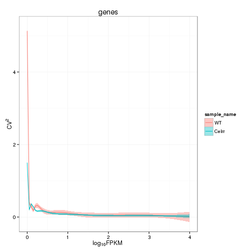 


Isoforms: 

```
## Scale for 'x' is already present. Adding another scale for 'x', which will replace the existing scale.
## geom_smooth: method="auto" and size of largest group is >=1000, so using gam with formula: y ~ s(x, bs = "cs"). Use 'method = x' to change the smoothing method.
```

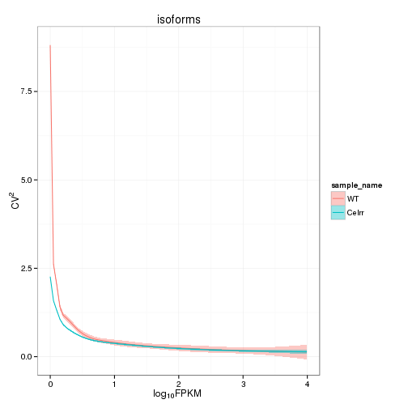 

## Volcano

```
## Error: One or more values of 'x' or 'y' are not valid sample names!
```

### Volcano matrix (replicates)
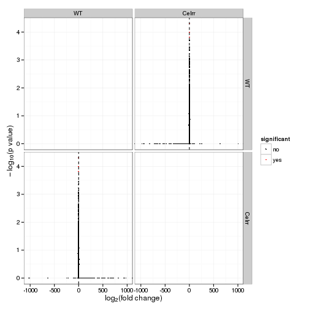 

## MvA plot

```
## Error: non-numeric argument to binary operator
```
   
### MvA plot counts

```
## Error: non-numeric argument to binary operator
```

## Scatterplot
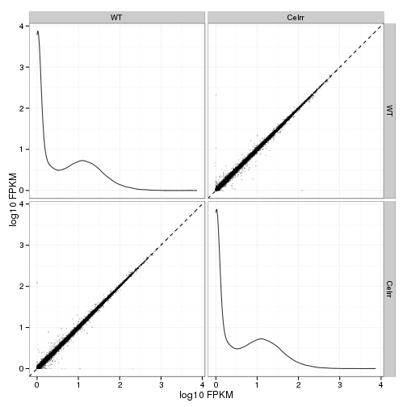 

### Scatter matrix (replicates) -- SKIP FOR NOW CAUSING PROBLEMS 


## Distributions

### Boxplot
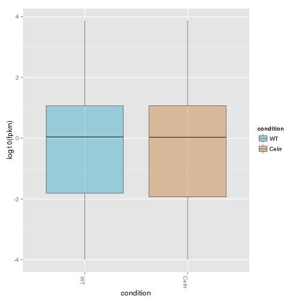 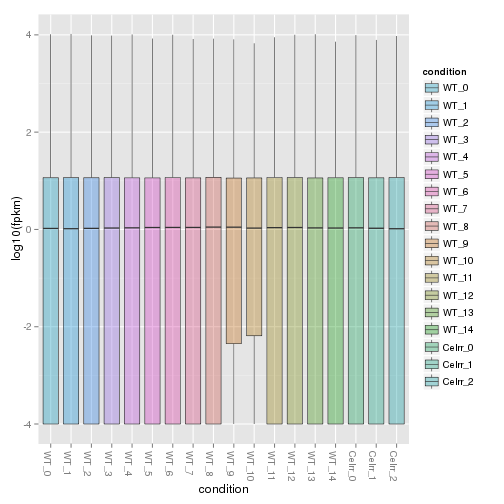 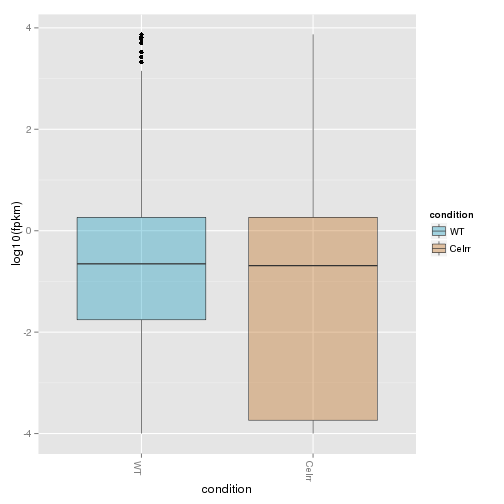 

### Density

```
## Warning: Removed 3902 rows containing non-finite values (stat_density).
## Warning: Removed 5688 rows containing non-finite values (stat_density).
```

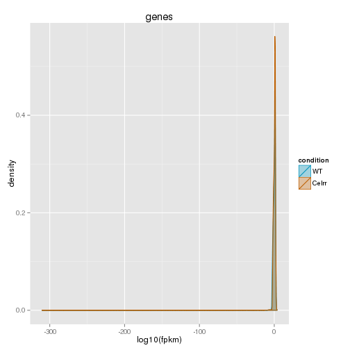 

```
## Warning: Removed 7158 rows containing non-finite values (stat_density).
## Warning: Removed 7493 rows containing non-finite values (stat_density).
## Warning: Removed 6784 rows containing non-finite values (stat_density).
## Warning: Removed 6978 rows containing non-finite values (stat_density).
## Warning: Removed 6732 rows containing non-finite values (stat_density).
## Warning: Removed 6637 rows containing non-finite values (stat_density).
## Warning: Removed 7026 rows containing non-finite values (stat_density).
## Warning: Removed 6662 rows containing non-finite values (stat_density).
## Warning: Removed 6778 rows containing non-finite values (stat_density).
## Warning: Removed 6406 rows containing non-finite values (stat_density).
## Warning: Removed 6331 rows containing non-finite values (stat_density).
## Warning: Removed 6814 rows containing non-finite values (stat_density).
## Warning: Removed 6835 rows containing non-finite values (stat_density).
## Warning: Removed 6798 rows containing non-finite values (stat_density).
## Warning: Removed 6545 rows containing non-finite values (stat_density).
## Warning: Removed 7304 rows containing non-finite values (stat_density).
## Warning: Removed 6734 rows containing non-finite values (stat_density).
## Warning: Removed 6731 rows containing non-finite values (stat_density).
```

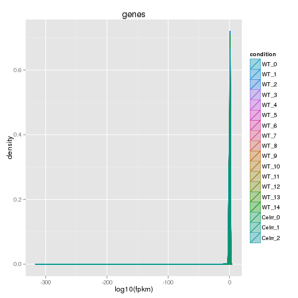 


## Clustering

### Replicate Clusters
 

```
## 'dendrogram' with 2 branches and 18 members total, at height 0.07545
```

### PCA
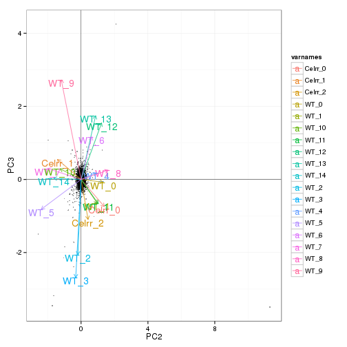 

### MDS 
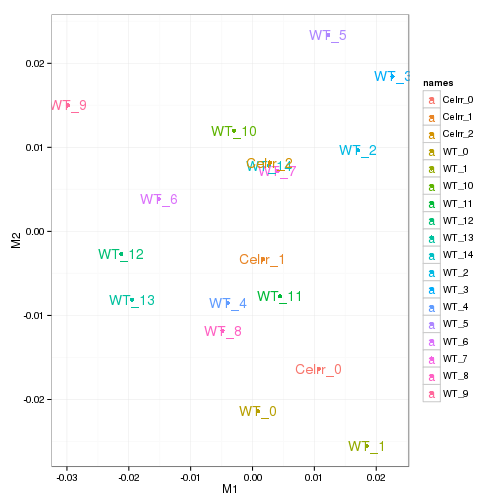 

### Distance Heat Map
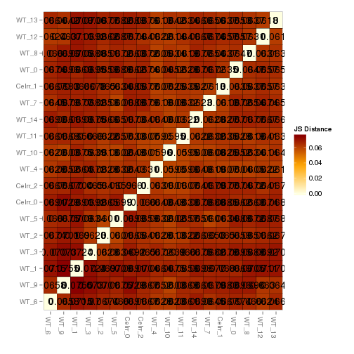 


# KO assessment

## Endogenous lncRNA expression

```
## Error: invalid class "CuffGene" object: FALSE
```

```
## Error: error in evaluating the argument 'object' in selecting a method for function 'fpkm': Error: object 'myGene' not found
```

```
## Error: error in evaluating the argument 'object' in selecting a method for function 'fpkm': Error in isoforms(myGene) : 
##   error in evaluating the argument 'object' in selecting a method for function 'isoforms': Error: object 'myGene' not found
```

```
## Error: error in evaluating the argument 'object' in selecting a method for function 'expressionPlot': Error: object 'myGene' not found
```

```
## Error: error in evaluating the argument 'object' in selecting a method for function 'expressionPlot': Error: object 'myGene' not found
```

```
## Error: error in evaluating the argument 'object' in selecting a method for function 'expressionPlot': Error in isoforms(myGene) : 
##   error in evaluating the argument 'object' in selecting a method for function 'isoforms': Error: object 'myGene' not found
```

```
## Error: error in evaluating the argument 'object' in selecting a method for function 'expressionPlot': Error in isoforms(myGene) : 
##   error in evaluating the argument 'object' in selecting a method for function 'isoforms': Error: object 'myGene' not found
```

```
## Error: error in evaluating the argument 'object' in selecting a method for function 'expressionBarplot': Error: object 'myGene' not found
```

```
## Error: error in evaluating the argument 'object' in selecting a method for function 'expressionBarplot': Error: object 'myGene' not found
```

```
## Error: error in evaluating the argument 'object' in selecting a method for function 'expressionBarplot': Error in isoforms(myGene) : 
##   error in evaluating the argument 'object' in selecting a method for function 'isoforms': Error: object 'myGene' not found
```

```
## Error: error in evaluating the argument 'object' in selecting a method for function 'expressionBarplot': Error in isoforms(myGene) : 
##   error in evaluating the argument 'object' in selecting a method for function 'isoforms': Error: object 'myGene' not found
```


## LacZ expression

```
## Error: object 'LacZ' not found
```

```
## Error: object 'myGeneId' not found
```

```
## Error: error in evaluating the argument 'object' in selecting a method for function 'fpkm': Error: object 'myGene' not found
```

```
## Error: error in evaluating the argument 'object' in selecting a method for function 'expressionPlot': Error: object 'myGene' not found
```

```
## Error: error in evaluating the argument 'object' in selecting a method for function 'expressionPlot': Error: object 'myGene' not found
```

```
## Error: error in evaluating the argument 'object' in selecting a method for function 'expressionBarplot': Error: object 'myGene' not found
```

```
## Error: error in evaluating the argument 'object' in selecting a method for function 'expressionBarplot': Error: object 'myGene' not found
```


## Digital Genotyping (LacZ vs Endogenous lncRNA and Sex)

```
## Scale for 'colour' is already present. Adding another scale for 'colour', which will replace the existing scale.
## ymax not defined: adjusting position using y instead
```

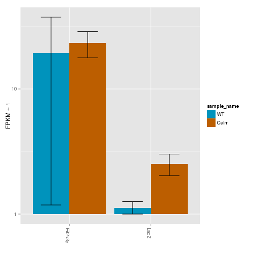 

```
## Scale for 'colour' is already present. Adding another scale for 'colour', which will replace the existing scale.
## ymax not defined: adjusting position using y instead
```

 


# Differential Analysis

## Differential Genes 


There are 55 significantly differentially expressed genes. They are:


```
## Error: no applicable method for 'xtable' applied to an object of class
## "character"
```

### Matrix of gene significant differences between conditions
(skip for Brainmap wt-v-ko comparisons)

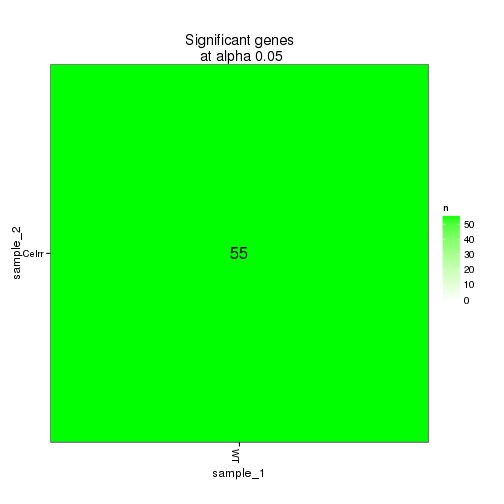 

### Significant gene expression differences between conditions


```
## Using tracking_id, rep_name as id variables
## No id variables; using all as measure variables
```

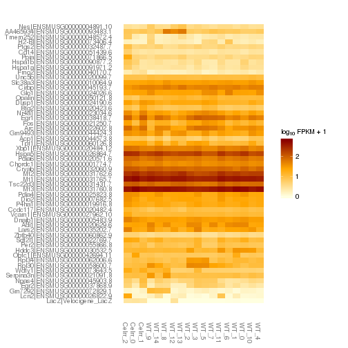 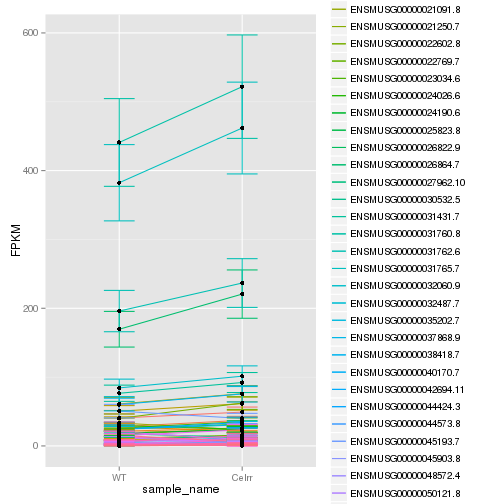 

```
## Scale for 'colour' is already present. Adding another scale for 'colour', which will replace the existing scale.
## ymax not defined: adjusting position using y instead
```

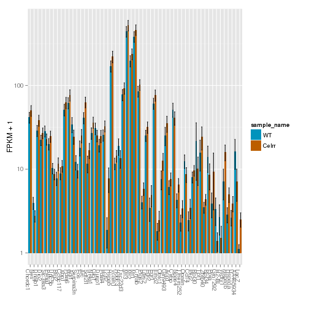 

An individual look at each of the significantly differentially regulated genes:
(eval=false for first pass)


### Expression-level significance relationship

**Interesting comments n stuff!**


```
## Using tracking_id, sample_name as id variables
```

```
## Error: One or more values of 'x' or 'y' are not valid sample names!
```

```
## Error: One or more values of 'x' or 'y' are not valid sample names!
```

## Differential Splicing

### Differential Isoforms between conditions
Per isoform difference between conditions:
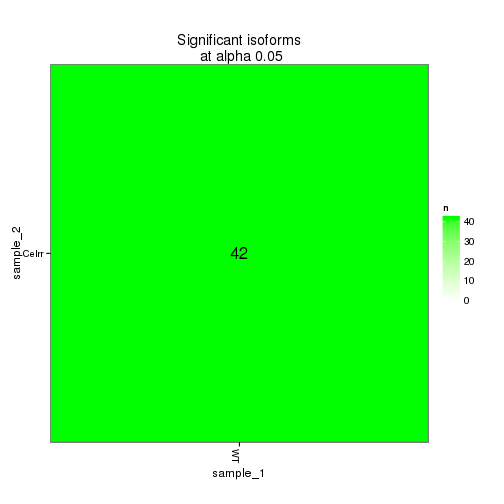 

These isoforms are:

```
## Error: no applicable method for 'xtable' applied to an object of class
## "character"
```


```
## Using tracking_id, sample_name as id variables
## No id variables; using all as measure variables
```

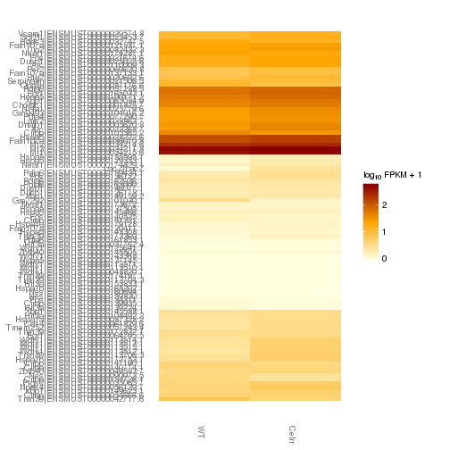 

### Differential Splicing between conditions

Per condition differences in isoforms (Does gene have diff piechart between conditions?)


These genes are:


Splicing heatmap by isoform:

```
## Error: error in evaluating the argument 'object' in selecting a method for function 'csHeatmap': Error in isoforms(splicingSigGenes) : 
##   error in evaluating the argument 'object' in selecting a method for function 'isoforms': Error: object 'splicingSigGenes' not found
```

Splicing heatmap by gene


The following are significantly differentially spliced genes (relative portion of isoform per condition): 

eval false for first pass


 


# Gene/Pathway Analysis

## GSEA


## GO enrichment 
Cluster profiler used to call enichments of significantly differentially regulated genes that map to Entrez IDs. 

Description/explanation of what's here, and justify all choices. 


biomart to get entrez gene IDS
clusterProfiler does GO enrichment 

BP, MF, CC
enrichKEGG
enrichPathway


# Cis vs Trans (locally)


# Interesting Genes
Hand pick these after initial round of analysis?

# Notes

# Session Info

```
## R version 3.0.2 (2013-09-25)
## Platform: x86_64-unknown-linux-gnu (64-bit)
## 
## locale:
##  [1] LC_CTYPE=en_US.UTF-8       LC_NUMERIC=C              
##  [3] LC_TIME=en_US.UTF-8        LC_COLLATE=en_US.UTF-8    
##  [5] LC_MONETARY=en_US.UTF-8    LC_MESSAGES=en_US.UTF-8   
##  [7] LC_PAPER=en_US.UTF-8       LC_NAME=C                 
##  [9] LC_ADDRESS=C               LC_TELEPHONE=C            
## [11] LC_MEASUREMENT=en_US.UTF-8 LC_IDENTIFICATION=C       
## 
## attached base packages:
## [1] grid      parallel  stats     graphics  grDevices utils     datasets 
## [8] methods   base     
## 
## other attached packages:
##  [1] mgcv_1.7-29          nlme_3.1-117         gridExtra_0.9.1     
##  [4] gtable_0.1.2         marray_1.40.0        gplots_2.13.0       
##  [7] GSA_1.03             limma_3.18.13        xtable_1.7-3        
## [10] cummeRbund_2.7.2     Gviz_1.6.0           rtracklayer_1.22.7  
## [13] GenomicRanges_1.14.4 XVector_0.2.0        IRanges_1.20.7      
## [16] fastcluster_1.1.13   reshape2_1.4         ggplot2_1.0.0       
## [19] RSQLite_0.11.4       DBI_0.2-7            BiocGenerics_0.8.0  
## [22] knitr_1.6           
## 
## loaded via a namespace (and not attached):
##  [1] AnnotationDbi_1.24.0   Biobase_2.22.0         biomaRt_2.18.0        
##  [4] Biostrings_2.30.1      biovizBase_1.10.8      bitops_1.0-6          
##  [7] BSgenome_1.30.0        caTools_1.17           cluster_1.15.2        
## [10] colorspace_1.2-4       dichromat_2.0-0        digest_0.6.4          
## [13] evaluate_0.5.5         formatR_0.10           Formula_1.1-1         
## [16] gdata_2.13.3           GenomicFeatures_1.14.5 gtools_3.4.1          
## [19] Hmisc_3.14-4           KernSmooth_2.23-12     labeling_0.2          
## [22] lattice_0.20-29        latticeExtra_0.6-26    MASS_7.3-33           
## [25] Matrix_1.1-3           munsell_0.4.2          plyr_1.8.1            
## [28] proto_0.3-10           RColorBrewer_1.0-5     Rcpp_0.11.1           
## [31] RCurl_1.95-4.1         Rsamtools_1.14.3       scales_0.2.4          
## [34] splines_3.0.2          stats4_3.0.2           stringr_0.6.2         
## [37] survival_2.37-7        tools_3.0.2            XML_3.98-1.1          
## [40] zlibbioc_1.8.0
```

#Run Info

```
##           param
## 1      cmd_line
## 2       version
## 3  SVN_revision
## 4 boost_version
## 5        genome
##                                                                                                                                                                                                                                                                                                                                                                                                                                                                                                                                                                                                                                                                                                                                                                                                                                                                                                                                                                                                                                                                                                                                                                                                                                                                                                                                                                                                                                                                                                                                                                                                              value
## 1 cuffdiff -p 10 -L WT,Celrr -o /n/rinn_data1/seq/lgoff/Projects/BrainMap/data/diffs/Celrr_vs_WT_Adult /n/rinn_data1/seq/lgoff/Projects/BrainMap/data/annotation/mm10_gencode_vM2_with_lncRNAs_and_LacZ.gtf /n/rinn_data1/seq/lgoff/Projects/BrainMap/data/quants/JR729/abundances.cxb,/n/rinn_data1/seq/lgoff/Projects/BrainMap/data/quants/JR728/abundances.cxb,/n/rinn_data1/seq/lgoff/Projects/BrainMap/data/quants/JR796/abundances.cxb,/n/rinn_data1/seq/lgoff/Projects/BrainMap/data/quants/JR797/abundances.cxb,/n/rinn_data1/seq/lgoff/Projects/BrainMap/data/quants/JR740/abundances.cxb,/n/rinn_data1/seq/lgoff/Projects/BrainMap/data/quants/JR800/abundances.cxb,/n/rinn_data1/seq/lgoff/Projects/BrainMap/data/quants/JR827/abundances.cxb,/n/rinn_data1/seq/lgoff/Projects/BrainMap/data/quants/JR778/abundances.cxb,/n/rinn_data1/seq/lgoff/Projects/BrainMap/data/quants/JR734/abundances.cxb,/n/rinn_data1/seq/lgoff/Projects/BrainMap/data/quants/JR802/abundances.cxb,/n/rinn_data1/seq/lgoff/Projects/BrainMap/data/quants/JR803/abundances.cxb,/n/rinn_data1/seq/lgoff/Projects/BrainMap/data/quants/JR735/abundances.cxb,/n/rinn_data1/seq/lgoff/Projects/BrainMap/data/quants/JR817/abundances.cxb,/n/rinn_data1/seq/lgoff/Projects/BrainMap/data/quants/JR785/abundances.cxb,/n/rinn_data1/seq/lgoff/Projects/BrainMap/data/quants/JR781/abundances.cxb /n/rinn_data1/seq/lgoff/Projects/BrainMap/data/quants/JR739/abundances.cxb,/n/rinn_data1/seq/lgoff/Projects/BrainMap/data/quants/JR783/abundances.cxb,/n/rinn_data1/seq/lgoff/Projects/BrainMap/data/quants/JR804/abundances.cxb 
## 2                                                                                                                                                                                                                                                                                                                                                                                                                                                                                                                                                                                                                                                                                                                                                                                                                                                                                                                                                                                                                                                                                                                                                                                                                                                                                                                                                                                                                                                                                                                                                                                                            2.2.1
## 3                                                                                                                                                                                                                                                                                                                                                                                                                                                                                                                                                                                                                                                                                                                                                                                                                                                                                                                                                                                                                                                                                                                                                                                                                                                                                                                                                                                                                                                                                                                                                                                                             4237
## 4                                                                                                                                                                                                                                                                                                                                                                                                                                                                                                                                                                                                                                                                                                                                                                                                                                                                                                                                                                                                                                                                                                                                                                                                                                                                                                                                                                                                                                                                                                                                                                                                           104700
## 5                                                                                                                                                                                                                                                                                                                                                                                                                                                                                                                                                                                                                                                                                                                                                                                                                                                                                                                                                                                                                                                                                                                                                                                                                                                                                                                                                                                                                                                                                                                                                                                                             mm10
```
