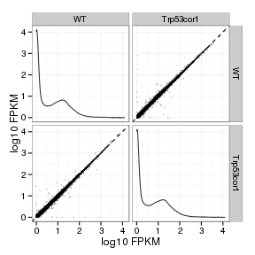
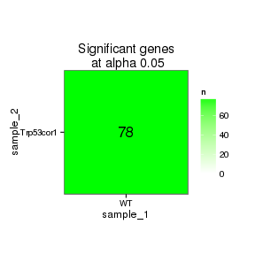

 BRN1B strain KO vs WT (r timepoint EMBRYONIC)
======================================


- add labels, descriptions
- turn off all caching ! 
- other heatmap labels (csHeatmap)
- overlap figure
- tracks 
- should import litter info


```
## Error: object 'strain' not found
```

```
## Error: object 'path' not found
```


# Intialize


# Design Overview

This file shows the wt-v-ko comparison for linc-Brn1b. 

Cuff overview:

```r
cuff
```

```
## CuffSet instance with:
## 	 2 samples
## 	 26754 genes
## 	 77524 isoforms
## 	 0 TSS
## 	 0 CDS
## 	 0 promoters
## 	 0 splicing
## 	 0 relCDS
```


# QC

## Dispersion

Dispersion plot for genes in cuff:
(Overdispersion can lead to innacurate quants)


```r
dispersionPlot(genes(cuff))
```

```
## Error: 'from' cannot be NA, NaN or infinite
```

## Cross-replicate variability (fpkmSCVplot)
Differences in CV 2 can result in lower numbers of differentially expressed genes due to a higher degree of variability between replicate fpkm estimates.

Genes:

```r
fpkmSCVPlot(genes(cuff))
```

```
## Scale for 'x' is already present. Adding another scale for 'x', which will replace the existing scale.
## geom_smooth: method="auto" and size of largest group is >=1000, so using gam with formula: y ~ s(x, bs = "cs"). Use 'method = x' to change the smoothing method.
```

 


Isoforms: 

```r
fpkmSCVPlot(isoforms(cuff))
```

```
## Scale for 'x' is already present. Adding another scale for 'x', which will replace the existing scale.
## geom_smooth: method="auto" and size of largest group is >=1000, so using gam with formula: y ~ s(x, bs = "cs"). Use 'method = x' to change the smoothing method.
```

 

## Volcano

```r
csVolcano(genes(cuff),"wt","ko")
```

```
## Error: One or more values of 'x' or 'y' are not valid sample names!
```

### Volcano matrix (replicates)


```r
csVolcanoMatrix(genes(cuff),replicates=T)
```

 

## MvA plot

```r
MAplot(genes(cuff),"wt","ko")
```

```
## Error: non-numeric argument to binary operator
```
   
### MvA plot counts

```r
MAplot(genes(cuff),"wt","ko",useCount=T)
```

```
## Error: non-numeric argument to binary operator
```

## Scatterplot

```r
csScatterMatrix(genes(cuff))
```

 

### Scatter matrix (replicates) -- SKIP FOR NOW CAUSING PROBLEMS 


```r
#csScatterMatrix(genes(cuff),replicates=T)
```


## Distributions

### Boxplots

Boxplot (genes)


```r
csBoxplot(genes(cuff))
```

 

Boxplot (genes, replicates)


```r
csBoxplot(genes(cuff),replicates=T)
```

 

Boxplot (isoforms)


```r
csBoxplot(isoforms(cuff))
```

 

Boxplot (isoforms, replicates)


```r
csBoxplot(isoforms(cuff), replicates=T)
```

 

### Density

Density (genes)


```r
csDensity(genes(cuff),pseudocount=0.001)
```

 

Density (genes, replicates)


```r
csDensity(genes(cuff),pseudocount=0.001,replicates=T)
```

 


## Clustering

### Replicate Clusters

```r
csDendro(genes(cuff),replicates=T)
```

 

```
## 'dendrogram' with 2 branches and 18 members total, at height 0.08408
```

### PCA (genes)

```r
PCAplot(genes(cuff),"PC2","PC3", replicates=T)
```

 

### MDS (genes)

```r
MDSplot(genes(cuff),replicates=T)
```

 

### Distance Heat Map (genes)

```r
csDistHeat(genes(cuff), replicates=T)
```

 


# KO assessment

## Endogenous lncRNA expression


```r
myGeneID<-strain
myGene<-getGene(cuff, myGeneID)
print(xtable(fpkm(myGene)),type="html")
```

<!-- html table generated in R 3.0.2 by xtable 1.7-3 package -->
<!-- Mon Jun 16 20:35:26 2014 -->
<TABLE border=1>
<TR> <TH>  </TH> <TH> gene_id </TH> <TH> sample_name </TH> <TH> fpkm </TH> <TH> conf_hi </TH> <TH> conf_lo </TH> <TH> quant_status </TH>  </TR>
  <TR> <TD align="right"> 1 </TD> <TD> ENSMUSG00000097063.2 </TD> <TD> WT </TD> <TD align="right"> 2.32 </TD> <TD align="right"> 10.15 </TD> <TD align="right"> 0.00 </TD> <TD> OK </TD> </TR>
  <TR> <TD align="right"> 2 </TD> <TD> ENSMUSG00000097063.2 </TD> <TD> linc_Brn1b </TD> <TD align="right"> 0.00 </TD> <TD align="right"> 0.00 </TD> <TD align="right"> 0.00 </TD> <TD> OK </TD> </TR>
   </TABLE>

```r
print(xtable(fpkm(isoforms(myGene))), type="html")
```

<!-- html table generated in R 3.0.2 by xtable 1.7-3 package -->
<!-- Mon Jun 16 20:35:26 2014 -->
<TABLE border=1>
<TR> <TH>  </TH> <TH> isoform_id </TH> <TH> sample_name </TH> <TH> fpkm </TH> <TH> conf_hi </TH> <TH> conf_lo </TH> <TH> quant_status </TH>  </TR>
  <TR> <TD align="right"> 1 </TD> <TD> ENSMUST00000180589.1 </TD> <TD> WT </TD> <TD align="right"> 2.32 </TD> <TD align="right"> 10.15 </TD> <TD align="right"> 0.00 </TD> <TD> OK </TD> </TR>
  <TR> <TD align="right"> 2 </TD> <TD> ENSMUST00000180589.1 </TD> <TD> linc_Brn1b </TD> <TD align="right"> 0.00 </TD> <TD align="right"> 0.14 </TD> <TD align="right"> 0.00 </TD> <TD> OK </TD> </TR>
   </TABLE>

```r
expressionPlot(myGene)
```

 

```r
expressionPlot(myGene, replicates=TRUE)
```

 

Endogenous expression of linc-Brn1b isoforms:


```r
expressionPlot(isoforms(myGene))
```

 

```r
expressionPlot(isoforms(myGene), replicates=T)
```

 

Barplot of gene expression:


```r
expressionBarplot(myGene)
```

 

```r
expressionBarplot(myGene,replicates=T)
```

 

Barplot of isoform expression:


```r
#expressionBarplot(isoforms(myGene))     
expressionBarplot(isoforms(myGene), replicates=T)
```

 


## LacZ expression


```r
myGeneID<-"LacZ"
myGene<-getGene(cuff, myGeneID)

print(xtable(fpkm(myGene)),type="html")
```

<!-- html table generated in R 3.0.2 by xtable 1.7-3 package -->
<!-- Mon Jun 16 20:35:36 2014 -->
<TABLE border=1>
<TR> <TH>  </TH> <TH> gene_id </TH> <TH> sample_name </TH> <TH> fpkm </TH> <TH> conf_hi </TH> <TH> conf_lo </TH> <TH> quant_status </TH>  </TR>
  <TR> <TD align="right"> 1 </TD> <TD> Velocigene_LacZ </TD> <TD> WT </TD> <TD align="right"> 0.02 </TD> <TD align="right"> 0.06 </TD> <TD align="right"> 0.00 </TD> <TD> OK </TD> </TR>
  <TR> <TD align="right"> 2 </TD> <TD> Velocigene_LacZ </TD> <TD> linc_Brn1b </TD> <TD align="right"> 9.26 </TD> <TD align="right"> 11.68 </TD> <TD align="right"> 6.85 </TD> <TD> OK </TD> </TR>
   </TABLE>

```r
expressionPlot(myGene)
```

 

```r
expressionPlot(myGene, replicates=TRUE)
```

 

```r
expressionBarplot(myGene)
```

 

```r
expressionBarplot(myGene,replicates=T)
```

 


## Digital Genotyping (LacZ vs Endogenous lncRNA and Sex)
Expression plot (endogenous linc, lacZ, Y-expressed gene):


```r
genotypingGeneIDs<-c(strain,"LacZ","Eif2s3y")
genotypingGenes<-getGenes(cuff,genotypingGeneIDs)
expressionBarplot(genotypingGenes,replicates=T)
```

```
## Scale for 'colour' is already present. Adding another scale for 'colour', which will replace the existing scale.
## ymax not defined: adjusting position using y instead
```

 

Expression heatmap:

```r
csHeatmap(genotypingGenes,replicates=T)
```

```
## Using tracking_id, rep_name as id variables
## No id variables; using all as measure variables
```

 

# Differential Analysis

## Differential Genes 


```r
sig<-getSig(cuff,alpha=alpha)       
sigGenes<-getGenes(cuff,sig)
geneAnnot<-annotation(sigGenes)
```

There are 143 significantly differentially expressed genes. They are:


```r
print(xtable(as.data.frame(geneAnnot$gene_short_name)),type="html")
```

<!-- html table generated in R 3.0.2 by xtable 1.7-3 package -->
<!-- Mon Jun 16 20:35:50 2014 -->
<TABLE border=1>
<TR> <TH>  </TH> <TH> geneAnnot$gene_short_name </TH>  </TR>
  <TR> <TD align="right"> 1 </TD> <TD> Sez6 </TD> </TR>
  <TR> <TD align="right"> 2 </TD> <TD> Nfix </TD> </TR>
  <TR> <TD align="right"> 3 </TD> <TD> Grik3 </TD> </TR>
  <TR> <TD align="right"> 4 </TD> <TD> Dlgap1 </TD> </TR>
  <TR> <TD align="right"> 5 </TD> <TD> Brinp2 </TD> </TR>
  <TR> <TD align="right"> 6 </TD> <TD> Cacna1e </TD> </TR>
  <TR> <TD align="right"> 7 </TD> <TD> Sst </TD> </TR>
  <TR> <TD align="right"> 8 </TD> <TD> Pax3 </TD> </TR>
  <TR> <TD align="right"> 9 </TD> <TD> Crabp2 </TD> </TR>
  <TR> <TD align="right"> 10 </TD> <TD> Ndrg1 </TD> </TR>
  <TR> <TD align="right"> 11 </TD> <TD> Mef2c </TD> </TR>
  <TR> <TD align="right"> 12 </TD> <TD> Syngr3 </TD> </TR>
  <TR> <TD align="right"> 13 </TD> <TD> Syn2 </TD> </TR>
  <TR> <TD align="right"> 14 </TD> <TD> Prox1 </TD> </TR>
  <TR> <TD align="right"> 15 </TD> <TD> Ebf3 </TD> </TR>
  <TR> <TD align="right"> 16 </TD> <TD> Phox2b </TD> </TR>
  <TR> <TD align="right"> 17 </TD> <TD> Ptgds </TD> </TR>
  <TR> <TD align="right"> 18 </TD> <TD> Hivep2 </TD> </TR>
  <TR> <TD align="right"> 19 </TD> <TD> Rxrg </TD> </TR>
  <TR> <TD align="right"> 20 </TD> <TD> Celsr1 </TD> </TR>
  <TR> <TD align="right"> 21 </TD> <TD> Lhx1 </TD> </TR>
  <TR> <TD align="right"> 22 </TD> <TD> Kitl </TD> </TR>
  <TR> <TD align="right"> 23 </TD> <TD> Gria1 </TD> </TR>
  <TR> <TD align="right"> 24 </TD> <TD> Fam49a </TD> </TR>
  <TR> <TD align="right"> 25 </TD> <TD> Foxg1 </TD> </TR>
  <TR> <TD align="right"> 26 </TD> <TD> Tfap2a </TD> </TR>
  <TR> <TD align="right"> 27 </TD> <TD> Drd1a </TD> </TR>
  <TR> <TD align="right"> 28 </TD> <TD> Fezf2 </TD> </TR>
  <TR> <TD align="right"> 29 </TD> <TD> Clu </TD> </TR>
  <TR> <TD align="right"> 30 </TD> <TD> Skor1 </TD> </TR>
  <TR> <TD align="right"> 31 </TD> <TD> Sla </TD> </TR>
  <TR> <TD align="right"> 32 </TD> <TD> Sncg </TD> </TR>
  <TR> <TD align="right"> 33 </TD> <TD> Dlx2 </TD> </TR>
  <TR> <TD align="right"> 34 </TD> <TD> Prph </TD> </TR>
  <TR> <TD align="right"> 35 </TD> <TD> Tiam2 </TD> </TR>
  <TR> <TD align="right"> 36 </TD> <TD> Lbx1 </TD> </TR>
  <TR> <TD align="right"> 37 </TD> <TD> Nnt </TD> </TR>
  <TR> <TD align="right"> 38 </TD> <TD> Msx3 </TD> </TR>
  <TR> <TD align="right"> 39 </TD> <TD> Asb1 </TD> </TR>
  <TR> <TD align="right"> 40 </TD> <TD> Dbi </TD> </TR>
  <TR> <TD align="right"> 41 </TD> <TD> Plxna2 </TD> </TR>
  <TR> <TD align="right"> 42 </TD> <TD> Lhx6 </TD> </TR>
  <TR> <TD align="right"> 43 </TD> <TD> Syt13 </TD> </TR>
  <TR> <TD align="right"> 44 </TD> <TD> Chst1 </TD> </TR>
  <TR> <TD align="right"> 45 </TD> <TD> Lamp5 </TD> </TR>
  <TR> <TD align="right"> 46 </TD> <TD> Ntsr1 </TD> </TR>
  <TR> <TD align="right"> 47 </TD> <TD> Hsd3b6 </TD> </TR>
  <TR> <TD align="right"> 48 </TD> <TD> Nr4a3 </TD> </TR>
  <TR> <TD align="right"> 49 </TD> <TD> Tnc </TD> </TR>
  <TR> <TD align="right"> 50 </TD> <TD> Tal2 </TD> </TR>
  <TR> <TD align="right"> 51 </TD> <TD> Ppp2r2c </TD> </TR>
  <TR> <TD align="right"> 52 </TD> <TD> Fosl2 </TD> </TR>
  <TR> <TD align="right"> 53 </TD> <TD> Nos1 </TD> </TR>
  <TR> <TD align="right"> 54 </TD> <TD> Uncx </TD> </TR>
  <TR> <TD align="right"> 55 </TD> <TD> Rph3a </TD> </TR>
  <TR> <TD align="right"> 56 </TD> <TD> Dlx5 </TD> </TR>
  <TR> <TD align="right"> 57 </TD> <TD> Dync1i1 </TD> </TR>
  <TR> <TD align="right"> 58 </TD> <TD> Plxna4 </TD> </TR>
  <TR> <TD align="right"> 59 </TD> <TD> Rasgef1a </TD> </TR>
  <TR> <TD align="right"> 60 </TD> <TD> Hddc3 </TD> </TR>
  <TR> <TD align="right"> 61 </TD> <TD> Mfge8 </TD> </TR>
  <TR> <TD align="right"> 62 </TD> <TD> Tbx20 </TD> </TR>
  <TR> <TD align="right"> 63 </TD> <TD> Thy1 </TD> </TR>
  <TR> <TD align="right"> 64 </TD> <TD> Kirrel3 </TD> </TR>
  <TR> <TD align="right"> 65 </TD> <TD> Dscaml1 </TD> </TR>
  <TR> <TD align="right"> 66 </TD> <TD> Robo3 </TD> </TR>
  <TR> <TD align="right"> 67 </TD> <TD> Camkv </TD> </TR>
  <TR> <TD align="right"> 68 </TD> <TD> Gas7 </TD> </TR>
  <TR> <TD align="right"> 69 </TD> <TD> Tbc1d4 </TD> </TR>
  <TR> <TD align="right"> 70 </TD> <TD> Ttc28 </TD> </TR>
  <TR> <TD align="right"> 71 </TD> <TD> 4833424O15Rik </TD> </TR>
  <TR> <TD align="right"> 72 </TD> <TD> Gucy1a3 </TD> </TR>
  <TR> <TD align="right"> 73 </TD> <TD> Sncb </TD> </TR>
  <TR> <TD align="right"> 74 </TD> <TD> Arl4d </TD> </TR>
  <TR> <TD align="right"> 75 </TD> <TD> Tbr1 </TD> </TR>
  <TR> <TD align="right"> 76 </TD> <TD> Lars2 </TD> </TR>
  <TR> <TD align="right"> 77 </TD> <TD> Arx </TD> </TR>
  <TR> <TD align="right"> 78 </TD> <TD> Lum </TD> </TR>
  <TR> <TD align="right"> 79 </TD> <TD> Vgf </TD> </TR>
  <TR> <TD align="right"> 80 </TD> <TD> Kcnh3 </TD> </TR>
  <TR> <TD align="right"> 81 </TD> <TD> Neurod6 </TD> </TR>
  <TR> <TD align="right"> 82 </TD> <TD> Camk4 </TD> </TR>
  <TR> <TD align="right"> 83 </TD> <TD> Neurod2 </TD> </TR>
  <TR> <TD align="right"> 84 </TD> <TD> Satb2 </TD> </TR>
  <TR> <TD align="right"> 85 </TD> <TD> Ttk </TD> </TR>
  <TR> <TD align="right"> 86 </TD> <TD> Hoxb4 </TD> </TR>
  <TR> <TD align="right"> 87 </TD> <TD> Ldb2 </TD> </TR>
  <TR> <TD align="right"> 88 </TD> <TD> Slc6a5 </TD> </TR>
  <TR> <TD align="right"> 89 </TD> <TD> Abcc8 </TD> </TR>
  <TR> <TD align="right"> 90 </TD> <TD> Zfp704 </TD> </TR>
  <TR> <TD align="right"> 91 </TD> <TD> Tlx3 </TD> </TR>
  <TR> <TD align="right"> 92 </TD> <TD> Mpped1 </TD> </TR>
  <TR> <TD align="right"> 93 </TD> <TD> Dlx1 </TD> </TR>
  <TR> <TD align="right"> 94 </TD> <TD> Adamts3 </TD> </TR>
  <TR> <TD align="right"> 95 </TD> <TD> Gm9493 </TD> </TR>
  <TR> <TD align="right"> 96 </TD> <TD> Rps2 </TD> </TR>
  <TR> <TD align="right"> 97 </TD> <TD> D3Bwg0562e </TD> </TR>
  <TR> <TD align="right"> 98 </TD> <TD> Cnpy1 </TD> </TR>
  <TR> <TD align="right"> 99 </TD> <TD> Prkce </TD> </TR>
  <TR> <TD align="right"> 100 </TD> <TD> Hpcal4 </TD> </TR>
  <TR> <TD align="right"> 101 </TD> <TD> Olig1 </TD> </TR>
  <TR> <TD align="right"> 102 </TD> <TD> Gm7729 </TD> </TR>
  <TR> <TD align="right"> 103 </TD> <TD> Nxph3 </TD> </TR>
  <TR> <TD align="right"> 104 </TD> <TD> Fat4 </TD> </TR>
  <TR> <TD align="right"> 105 </TD> <TD> Mc4r </TD> </TR>
  <TR> <TD align="right"> 106 </TD> <TD> Pirt </TD> </TR>
  <TR> <TD align="right"> 107 </TD> <TD> Bcl11b </TD> </TR>
  <TR> <TD align="right"> 108 </TD> <TD> Pou4f1 </TD> </TR>
  <TR> <TD align="right"> 109 </TD> <TD> Nhlh2 </TD> </TR>
  <TR> <TD align="right"> 110 </TD> <TD> Rpl29 </TD> </TR>
  <TR> <TD align="right"> 111 </TD> <TD> Pla2g4e </TD> </TR>
  <TR> <TD align="right"> 112 </TD> <TD> Slc6a7 </TD> </TR>
  <TR> <TD align="right"> 113 </TD> <TD> Hbb-y </TD> </TR>
  <TR> <TD align="right"> 114 </TD> <TD> Hbb-bh1 </TD> </TR>
  <TR> <TD align="right"> 115 </TD> <TD> Adamts18 </TD> </TR>
  <TR> <TD align="right"> 116 </TD> <TD> Hba-x </TD> </TR>
  <TR> <TD align="right"> 117 </TD> <TD> Pign </TD> </TR>
  <TR> <TD align="right"> 118 </TD> <TD> Kdm5d </TD> </TR>
  <TR> <TD align="right"> 119 </TD> <TD> Hmga2 </TD> </TR>
  <TR> <TD align="right"> 120 </TD> <TD> Camk2b </TD> </TR>
  <TR> <TD align="right"> 121 </TD> <TD> Sez6l </TD> </TR>
  <TR> <TD align="right"> 122 </TD> <TD> Gda </TD> </TR>
  <TR> <TD align="right"> 123 </TD> <TD> Ppp1r1b </TD> </TR>
  <TR> <TD align="right"> 124 </TD> <TD> Rps12 </TD> </TR>
  <TR> <TD align="right"> 125 </TD> <TD> Trank1 </TD> </TR>
  <TR> <TD align="right"> 126 </TD> <TD> Zbtb18 </TD> </TR>
  <TR> <TD align="right"> 127 </TD> <TD> D430041D05Rik </TD> </TR>
  <TR> <TD align="right"> 128 </TD> <TD> Gpr88 </TD> </TR>
  <TR> <TD align="right"> 129 </TD> <TD> Ptprz1 </TD> </TR>
  <TR> <TD align="right"> 130 </TD> <TD> Ddx3y </TD> </TR>
  <TR> <TD align="right"> 131 </TD> <TD> Tmem132b </TD> </TR>
  <TR> <TD align="right"> 132 </TD> <TD> Slc17a7 </TD> </TR>
  <TR> <TD align="right"> 133 </TD> <TD> Gm9008 </TD> </TR>
  <TR> <TD align="right"> 134 </TD> <TD> Wdfy1 </TD> </TR>
  <TR> <TD align="right"> 135 </TD> <TD> Gm10709 </TD> </TR>
  <TR> <TD align="right"> 136 </TD> <TD> Commd6 </TD> </TR>
  <TR> <TD align="right"> 137 </TD> <TD> Hs3st4 </TD> </TR>
  <TR> <TD align="right"> 138 </TD> <TD> Dlx6os1 </TD> </TR>
  <TR> <TD align="right"> 139 </TD> <TD> Myl6 </TD> </TR>
  <TR> <TD align="right"> 140 </TD> <TD> Skor2 </TD> </TR>
  <TR> <TD align="right"> 141 </TD> <TD> Lhx8 </TD> </TR>
  <TR> <TD align="right"> 142 </TD> <TD> Gm26924 </TD> </TR>
  <TR> <TD align="right"> 143 </TD> <TD> RP24-312G4.2 </TD> </TR>
   </TABLE>

### Matrix of gene significant differences between conditions

(skip for Brainmap wt-v-ko comparisons)


```r
sigMatrix(cuff, level="genes", alpha=alpha)
```

 

### Significant gene expression differences between conditions

Expression plot (genes):

```r
#RELABEL!
rowlabel<-geneAnnot$gene_short_name
expressionPlot(sigGenes)
```

 

```r
csHeatmap(sigGenes, cluster="both",replicates=T)
```

```
## Using tracking_id, rep_name as id variables
## No id variables; using all as measure variables
```

 

```r
#Maybe do cluster="col"
#expressionBarplot(sigGenes)
```

Significant genes with expression >50fpkm (any condition):

```r
sigFPKMs<-fpkmMatrix(sigGenes)
```

```
## Using tracking_id, sample_name as id variables
```

```r
high<-sigFPKMs[which(sigFPKMs>50),]
high<-high[complete.cases(high),]
highIDs<-rownames(high)
highGenes<-getGenes(cuff,highIDs)
expressionPlot(highGenes)
```

 

An individual look at each of the highly expressed significantly differentially regulated genes:
(eval=false for first pass)

```r
plots<-lapply(highIDs,function(x){
  myGene<-getGene(cuff,x)
  return(expressionPlot(myGene,replicates=T))
  })
do.call(grid.arrange, plots)
```


### Expression-level/significance relationship

Scatter plot of significant genes only:

```r
csScatter(sigGenes, "wt", "ko", smooth=T)
```

```
## Using tracking_id, sample_name as id variables
```

```
## Error: One or more values of 'x' or 'y' are not valid sample names!
```

Volcano plot with significant genes only:

```r
csVolcano(sigGenes, "wt", "ko")
```

```
## Error: One or more values of 'x' or 'y' are not valid sample names!
```


## Differential Splicing

### Differential Isoforms between conditions
Per isoform difference between conditions:

```r
sigMatrix(cuff, level="isoforms",alpha=alpha)
```

 

```r
isoformSigIDs<-getSig(cuff,level="isoforms",alpha=alpha)
isoformSigGenes<-getGenes(cuff,isoformSigIDs)
isoAnnot<-annotation(isoformSigGenes)
```

These isoforms are:

```r
print(xtable(as.data.frame(isoAnnot$gene_short_name)),type="html")
```

<!-- html table generated in R 3.0.2 by xtable 1.7-3 package -->
<!-- Mon Jun 16 20:36:13 2014 -->
<TABLE border=1>
<TR> <TH>  </TH> <TH> isoAnnot$gene_short_name </TH>  </TR>
  <TR> <TD align="right"> 1 </TD> <TD> Nfix </TD> </TR>
  <TR> <TD align="right"> 2 </TD> <TD> Grik3 </TD> </TR>
  <TR> <TD align="right"> 3 </TD> <TD> Rec8 </TD> </TR>
  <TR> <TD align="right"> 4 </TD> <TD> Cacna1e </TD> </TR>
  <TR> <TD align="right"> 5 </TD> <TD> Crabp2 </TD> </TR>
  <TR> <TD align="right"> 6 </TD> <TD> Ndrg1 </TD> </TR>
  <TR> <TD align="right"> 7 </TD> <TD> Mef2c </TD> </TR>
  <TR> <TD align="right"> 8 </TD> <TD> Prox1 </TD> </TR>
  <TR> <TD align="right"> 9 </TD> <TD> Phox2b </TD> </TR>
  <TR> <TD align="right"> 10 </TD> <TD> Hivep2 </TD> </TR>
  <TR> <TD align="right"> 11 </TD> <TD> Celsr1 </TD> </TR>
  <TR> <TD align="right"> 12 </TD> <TD> Lhx1 </TD> </TR>
  <TR> <TD align="right"> 13 </TD> <TD> Kitl </TD> </TR>
  <TR> <TD align="right"> 14 </TD> <TD> Foxg1 </TD> </TR>
  <TR> <TD align="right"> 15 </TD> <TD> Clu </TD> </TR>
  <TR> <TD align="right"> 16 </TD> <TD> Sla </TD> </TR>
  <TR> <TD align="right"> 17 </TD> <TD> Sncg </TD> </TR>
  <TR> <TD align="right"> 18 </TD> <TD> Dlx2 </TD> </TR>
  <TR> <TD align="right"> 19 </TD> <TD> Prph </TD> </TR>
  <TR> <TD align="right"> 20 </TD> <TD> Tiam2 </TD> </TR>
  <TR> <TD align="right"> 21 </TD> <TD> Lbx1 </TD> </TR>
  <TR> <TD align="right"> 22 </TD> <TD> Nnt </TD> </TR>
  <TR> <TD align="right"> 23 </TD> <TD> Lancl1 </TD> </TR>
  <TR> <TD align="right"> 24 </TD> <TD> Ngef </TD> </TR>
  <TR> <TD align="right"> 25 </TD> <TD> Asb1 </TD> </TR>
  <TR> <TD align="right"> 26 </TD> <TD> Lypd1 </TD> </TR>
  <TR> <TD align="right"> 27 </TD> <TD> Lhx6 </TD> </TR>
  <TR> <TD align="right"> 28 </TD> <TD> Syt13 </TD> </TR>
  <TR> <TD align="right"> 29 </TD> <TD> Ntsr1 </TD> </TR>
  <TR> <TD align="right"> 30 </TD> <TD> Tal2 </TD> </TR>
  <TR> <TD align="right"> 31 </TD> <TD> Fosl2 </TD> </TR>
  <TR> <TD align="right"> 32 </TD> <TD> Nos1 </TD> </TR>
  <TR> <TD align="right"> 33 </TD> <TD> Rph3a </TD> </TR>
  <TR> <TD align="right"> 34 </TD> <TD> Dlx5 </TD> </TR>
  <TR> <TD align="right"> 35 </TD> <TD> Rasgef1a </TD> </TR>
  <TR> <TD align="right"> 36 </TD> <TD> Grin2b </TD> </TR>
  <TR> <TD align="right"> 37 </TD> <TD> Hddc3 </TD> </TR>
  <TR> <TD align="right"> 38 </TD> <TD> Thy1 </TD> </TR>
  <TR> <TD align="right"> 39 </TD> <TD> Kirrel3 </TD> </TR>
  <TR> <TD align="right"> 40 </TD> <TD> Dscaml1 </TD> </TR>
  <TR> <TD align="right"> 41 </TD> <TD> Camkv </TD> </TR>
  <TR> <TD align="right"> 42 </TD> <TD> Gas7 </TD> </TR>
  <TR> <TD align="right"> 43 </TD> <TD> Fndc3c1 </TD> </TR>
  <TR> <TD align="right"> 44 </TD> <TD> Gucy1a3 </TD> </TR>
  <TR> <TD align="right"> 45 </TD> <TD> Sncb </TD> </TR>
  <TR> <TD align="right"> 46 </TD> <TD> Arl4d </TD> </TR>
  <TR> <TD align="right"> 47 </TD> <TD> Tbr1 </TD> </TR>
  <TR> <TD align="right"> 48 </TD> <TD> Lars2 </TD> </TR>
  <TR> <TD align="right"> 49 </TD> <TD> Arx </TD> </TR>
  <TR> <TD align="right"> 50 </TD> <TD> Kcnh3 </TD> </TR>
  <TR> <TD align="right"> 51 </TD> <TD> Sh3rf3 </TD> </TR>
  <TR> <TD align="right"> 52 </TD> <TD> Satb2 </TD> </TR>
  <TR> <TD align="right"> 53 </TD> <TD> Ttk </TD> </TR>
  <TR> <TD align="right"> 54 </TD> <TD> Hoxb4 </TD> </TR>
  <TR> <TD align="right"> 55 </TD> <TD> Slc6a5 </TD> </TR>
  <TR> <TD align="right"> 56 </TD> <TD> Abcc8 </TD> </TR>
  <TR> <TD align="right"> 57 </TD> <TD> Zfp704 </TD> </TR>
  <TR> <TD align="right"> 58 </TD> <TD> Tlx3 </TD> </TR>
  <TR> <TD align="right"> 59 </TD> <TD> Sox5 </TD> </TR>
  <TR> <TD align="right"> 60 </TD> <TD> Mpped1 </TD> </TR>
  <TR> <TD align="right"> 61 </TD> <TD> Dlx1 </TD> </TR>
  <TR> <TD align="right"> 62 </TD> <TD> Reln </TD> </TR>
  <TR> <TD align="right"> 63 </TD> <TD> Adamts3 </TD> </TR>
  <TR> <TD align="right"> 64 </TD> <TD> Prkce </TD> </TR>
  <TR> <TD align="right"> 65 </TD> <TD> Hpcal4 </TD> </TR>
  <TR> <TD align="right"> 66 </TD> <TD> Olig1 </TD> </TR>
  <TR> <TD align="right"> 67 </TD> <TD> Nxph3 </TD> </TR>
  <TR> <TD align="right"> 68 </TD> <TD> Fat4 </TD> </TR>
  <TR> <TD align="right"> 69 </TD> <TD> Mc4r </TD> </TR>
  <TR> <TD align="right"> 70 </TD> <TD> Pirt </TD> </TR>
  <TR> <TD align="right"> 71 </TD> <TD> Bcl11b </TD> </TR>
  <TR> <TD align="right"> 72 </TD> <TD> Pou4f1 </TD> </TR>
  <TR> <TD align="right"> 73 </TD> <TD> Pla2g4e </TD> </TR>
  <TR> <TD align="right"> 74 </TD> <TD> Slc6a7 </TD> </TR>
  <TR> <TD align="right"> 75 </TD> <TD> Hbb-y </TD> </TR>
  <TR> <TD align="right"> 76 </TD> <TD> Hbb-bh1 </TD> </TR>
  <TR> <TD align="right"> 77 </TD> <TD> Adamts18 </TD> </TR>
  <TR> <TD align="right"> 78 </TD> <TD> Hba-x </TD> </TR>
  <TR> <TD align="right"> 79 </TD> <TD> Kcnq3 </TD> </TR>
  <TR> <TD align="right"> 80 </TD> <TD> Pign </TD> </TR>
  <TR> <TD align="right"> 81 </TD> <TD> Kdm5d </TD> </TR>
  <TR> <TD align="right"> 82 </TD> <TD> Gda </TD> </TR>
  <TR> <TD align="right"> 83 </TD> <TD> Opcml </TD> </TR>
  <TR> <TD align="right"> 84 </TD> <TD> Trank1 </TD> </TR>
  <TR> <TD align="right"> 85 </TD> <TD> Ddx3y </TD> </TR>
  <TR> <TD align="right"> 86 </TD> <TD> Tmem132b </TD> </TR>
  <TR> <TD align="right"> 87 </TD> <TD> Slc17a7 </TD> </TR>
  <TR> <TD align="right"> 88 </TD> <TD> Gm9008 </TD> </TR>
  <TR> <TD align="right"> 89 </TD> <TD> D2hgdh </TD> </TR>
  <TR> <TD align="right"> 90 </TD> <TD> Gm10709 </TD> </TR>
  <TR> <TD align="right"> 91 </TD> <TD> Myl6 </TD> </TR>
  <TR> <TD align="right"> 92 </TD> <TD> Gm26924 </TD> </TR>
  <TR> <TD align="right"> 93 </TD> <TD> RP24-312G4.2 </TD> </TR>
   </TABLE>


```r
csHeatmap(isoforms(isoformSigGenes),cluster='both',rescaling='row',method=dist, replicates=T)
```

```
## Using tracking_id, rep_name as id variables
```

 

### Differential Splicing between conditions

(eval false for first pass)

Per condition differences in isoforms (Does gene have diff piechart between conditions?)


```r
splicingSigIDs<-getSig(cuff,level="splicing",alpha=alpha)
splicingSigGenes<-getGenes(cuff,splicingSigIDs)

sigMatrix(cuff, level='splicing', alpha=alpha)

spliceAnnot<-annotation(splicingSigGenes)
```

These genes are:

```r
print(xtable(as.data.frame(spliceAnnot$gene_short_name)), type="html")
```

Splicing heatmap by isoform:

```r
#pdf("sigSplicing_heatmap.pdf",width=10,height=20)
csHeatmap(isoforms(splicingSigGenes),cluster='both',method=dist)
#dev.off()
```

Splicing heatmap by gene

```r
csHeatmap(splicingSigGenes,cluster='both',method=dist)
```

The following are significantly differentially spliced genes (relative portion of isoform per condition): 


```r
#fig.height=(20 +1*length(splicingSigIDs)), fig.width=(20 +1*length(splicingSigIDs))
#csPiePlots<-lapply(splicingSigIDs,function(x){
#  myGene<-getGene(cuff,x)
#  annot<-annotation(myGene)
#  csPie(myGene) + ggtitle(annot$gene_short_name)
#})
#do.call(grid.arrange,csPiePlots)
```


 


# Gene/Pathway Analysis

## GSEA


```r
population<-genes(cuff)
population.diff<-diffData(population)
annotation<-annotation(genes(cuff))
gene_names<-merge(annotation,population.diff)

gene_set_index <- function(genelist, short_names){
  which(short_names %in% genelist)   
}

get_gene_set_p_vals <- function(input, gs, alternative){
  gene_set_indices <- lapply(gs$genesets, function(short_name){
    gene_set_index(input$short_name, short_name)
    })
  pvl<-lapply(gene_set_indices,geneSetTest,input$test_stat, alternative=alternative)
  pvl_mat<-as.data.frame(t(unlist(pvl)))
  colnames(pvl_mat) <- gs$geneset.names
   return(pvl_mat)
}
 
get_gene_set_q_vals <- function(pvl_mat, method="bonferroni"){
	comp_corrected <- matrix(p.adjust(pvl_mat, method=method), nrow=nrow(pvl_mat), ncol=ncol(pvl_mat))
	colnames(comp_corrected) <- colnames(pvl_mat)
	rownames(comp_corrected) <- rownames(pvl_mat)
	return(comp_corrected)
}

colMins<-function(x){
  apply(x,2,min)
}
rowMins<-function(x){
  apply(x,1,min)
}
 
InputCols<-maPalette(low="white",high="red",k=100)
```


```r
df.pop<-data.frame("short_name"=toupper(gene_names$gene_short_name),"test_stat"=gene_names$test_stat)
#row.names(df.pop)=population.diff$gene_id
df.pop.unique<-unique(df.pop)
rownames(df.pop.unique)<-NULL
df.pop.unique.ordered<-df.pop.unique[order(df.pop.unique$test_stat),]
Input.df<-df.pop.unique.ordered

reactome_pvl_mat <- get_gene_set_p_vals(Input.df, reactome_gs,alternative="mixed")
reactome_pvl_corrected <- get_gene_set_q_vals(reactome_pvl_mat)
reactome_pvl_corrected<-rbind(reactome_pvl_corrected,reactome_pvl_corrected)


biocarta_pvl_mat <- get_gene_set_p_vals(Input.df, biocarta_gs, alternative="mixed")
biocarta_pvl_corrected <- get_gene_set_q_vals(biocarta_pvl_mat)
biocarta_pvl_corrected<-rbind(biocarta_pvl_corrected,biocarta_pvl_corrected)
```


```r
#two options, print as pdf, and adjust size in separate code block
#make minimum height and then increment scaled by number of rows to return 


#setwd('/n/rinn_data1/users/agroff/GITHUB/BrainMap/analysis')

#print to file 
#pdf("components_GSEA_biocarta.pdf",width=10,height=30)

#take top 50
x<-(-log10(t(biocarta_pvl_corrected[,which(colMins(biocarta_pvl_corrected) < 0.001)])))

x_ordered<-x[order(x[,1], decreasing=TRUE),]
x_ordered_subset<-x_ordered[1:50,]
noinfinities_x<-x_ordered_subset[which(x_ordered_subset !="Inf")]
x_max<-max(noinfinities_x)+100
x_ordered_subset[x_ordered_subset=="Inf"]<-x_max


heatmap.2(x_ordered_subset, trace="none", margins=c(5,20), col=InputCols,dendrogram="row",lhei =c(0.1,0.9), labCol=c(""))
```

 

```r
#dev.off()

#print to report 
#heatmap.2(x_ordered_subset, trace="none", margins=c(5,30), col=InputCols,dendrogram="row",lhei =c(0.1,0.9), labCol=c(""))
```


```r
#print to file
#pdf("components_GSEA_reactome.pdf",width=10,height=30)

#take top 50 because this is ridiculous
#x<-(-log10(t(reactome_pvl_corrected[,which(colMins(reactome_pvl_corrected) < 0.0000000000000000000000001)])))

x<-(-log10(t(reactome_pvl_corrected[,which(colMins(reactome_pvl_corrected) < 0.0001)])))
x_ordered<-x[order(x[,1], decreasing=TRUE),]
x_ordered_subset<-x_ordered[1:50,]
noinfinities_x<-x_ordered_subset[which(x_ordered_subset !="Inf")]
x_max<-max(noinfinities_x)+100
x_ordered_subset[x_ordered_subset=="Inf"]<-x_max


heatmap.2(x_ordered_subset, trace="none", margins=c(5,20),col=InputCols,dendrogram="both",lhei = c(0.1,0.90), labCol=c(""))
```

 

```r
#cexRow = (0.2 + .5/log10(dim(x)[1]))
#dev.off()

#print to report 
#heatmap.2(x_ordered_subset, trace="none", margins=c(5,30),col=InputCols,dendrogram="both",lhei = c(0.1,0.90), labCol=c(""))
```

## GO enrichment 
Cluster profiler used to call enichments of significantly differentially regulated genes that map to Entrez IDs. 

Description/explanation of what's here, and justify all choices. 


```r
#source("http://bioconductor.org/biocLite.R")
#biocLite("ReactomePA")

library(ReactomePA)
```

```
## Loading required package: AnnotationDbi
## Loading required package: Biobase
## Welcome to Bioconductor
## 
##     Vignettes contain introductory material; view with
##     'browseVignettes()'. To cite Bioconductor, see
##     'citation("Biobase")', and for packages 'citation("pkgname")'.
## 
## 
## Attaching package: 'Biobase'
## 
## The following object is masked from 'package:cummeRbund':
## 
##     samples
```

```
## Warning: Can't find a usable tk.tcl in the following directories: 
##     /n/sw/centos6/tcl8.5.14/lib/tcl8.5/tk8.5 /n/sw/centos6/tcl8.5.14/lib/tk8.5 ./lib/tk8.5 ./library
## 
## 
## 
## This probably means that tk wasn't installed properly.
```

```
## 
```

```r
library(DOSE)
```

```
## 
## Attaching package: 'DOSE'
## 
## The following object is masked from 'package:ReactomePA':
## 
##     gseAnalyzer
```

```r
sigGeneIDs<-getSig(cuff, alpha=alpha)
sigGenes<-getGenes(cuff,sigGeneIDs)
geneAnnot<-annotation(sigGenes)
geneNames<-geneAnnot$gene_short_name
sigDiff<-diffData(sigGenes)
sigDiff$foldChange<-sigDiff$value_1/sigDiff$value_2


# Top genes by test stat
#diff<-diffData(genes(cuff))
#diff<-diff[order(abs(diff$test_stat),decreasing=TRUE),]
#top_genes<-diff[which(diff$p_value<0.1),]
#top_genes_annot<-merge(top_genes,population)
#geneNames<-top_genes_annot$gene_short_name
```


```r
library(clusterProfiler)
```

```
## 
## KEGG.db contains mappings based on older data because the original
##   resource was removed from the the public domain before the most
##   recent update was produced. This package should now be
##   considered deprecated and future versions of Bioconductor may
##   not have it available.  Users who want more current data are
##   encouraged to look at the KEGGREST or reactome.db packages
```

```r
require(biomaRt)
```

```
## Loading required package: biomaRt
## 
## Attaching package: 'biomaRt'
## 
## The following object is masked from 'package:cummeRbund':
## 
##     getGene
```

```r
#source("http://bioconductor.org/biocLite.R")
#biocLite("clusterProfiler")
#biocLite("org.Mm.eg.db")
#http://www.bioconductor.org/packages/release/bioc/vignettes/biomaRt/inst/doc/biomaRt.pdf

ensembl <- useMart("ENSEMBL_MART_ENSEMBL","mmusculus_gene_ensembl", 
host="www.ensembl.org")

#Get entrezIDs
getEntrezIDs<-function (geneNames)
{
    tmp <- getBM(attributes = c("entrezgene"), filters = "mgi_symbol", values = geneNames, mart = ensembl)
    tmp
}
sigEntrez<-getEntrezIDs(geneNames)
sigEZ<-strsplit(as.character(sigEntrez), ", ")
sigEZ<-unlist(sigEZ)
require(org.Mm.eg.db) #mapping of entrez IDs to genbank
```

```
## Loading required package: org.Mm.eg.db
```

```r
goBP<-enrichGO(gene=sigEZ, organism="mouse",ont="BP",pvalueCutoff=0.01,readable=T)
```

```
## Loading required package: GO.db
```

```r
goMF<-enrichGO(gene=sigEZ, organism="mouse",ont="MF",pvalueCutoff=0.01,readable=T)

goCC<-enrichGO(gene=sigEZ, organism="mouse",ont="CC",pvalueCutoff=0.01,readable=T)

kegg<-enrichKEGG(gene=sigEZ, organism="mouse",pvalueCutoff=1, readable=T)

pathway<-enrichPathway(gene=sigEZ,organism="mouse",pvalueCutoff=0.01, readable=T)
```


```r
plot(goBP,showCategory=10) + theme(axis.text.x=element_text(angle=-90,hjust=0)) + ggtitle("Enriched BP")
```

 

```r
plot(goMF,showCategory=10) + theme(axis.text.x=element_text(angle=-90,hjust=0)) + ggtitle("Enriched MF")
```

 

```r
plot(goCC,showCategory=10) + theme(axis.text.x=element_text(angle=-90,hjust=0)) + ggtitle("Enriched CC")
```

 

```r
plot(kegg, showCategory=10) + ggtitle("Kegg Pathways")
```

 

```r
plot(pathway,showCategory=10) + ggtitle("Reactome pathway enrichment")
```

 

```r
detach("package:biomaRt")
```

# Cis vs Trans (locally)

```r
window<-1000000
```


# Notes

## Samples used are:
<!-- html table generated in R 3.0.2 by xtable 1.7-3 package -->
<!-- Mon Jun 16 20:39:17 2014 -->
<TABLE border=1>
<TR> <TH>  </TH> <TH> 10 </TH>  </TR>
  <TR> <TD align="right"> 1 </TD> <TD> JR753 </TD> </TR>
  <TR> <TD align="right"> 2 </TD> <TD> JR750 </TD> </TR>
  <TR> <TD align="right"> 3 </TD> <TD> JR771 </TD> </TR>
  <TR> <TD align="right"> 4 </TD> <TD> JR755 </TD> </TR>
  <TR> <TD align="right"> 5 </TD> <TD> JR811 </TD> </TR>
  <TR> <TD align="right"> 6 </TD> <TD> JR768 </TD> </TR>
  <TR> <TD align="right"> 7 </TD> <TD> JR761 </TD> </TR>
  <TR> <TD align="right"> 8 </TD> <TD> JR815 </TD> </TR>
  <TR> <TD align="right"> 9 </TD> <TD> JR789 </TD> </TR>
  <TR> <TD align="right"> 10 </TD> <TD> JR748 </TD> </TR>
  <TR> <TD align="right"> 11 </TD> <TD> JR716 </TD> </TR>
  <TR> <TD align="right"> 12 </TD> <TD> JR717 </TD> </TR>
  <TR> <TD align="right"> 13 </TD> <TD> JR719 </TD> </TR>
  <TR> <TD align="right"> 14 </TD> <TD> JR791 </TD> </TR>
  <TR> <TD align="right"> 15 </TD> <TD> JR756 </TD> </TR>
  <TR> <TD align="right"> 16 </TD> <TD> JR758 </TD> </TR>
  <TR> <TD align="right"> 17 </TD> <TD> JR764 </TD> </TR>
  <TR> <TD align="right"> 18 </TD> <TD> JR808 </TD> </TR>
   </TABLE>

## Replicates

```r
print(xtable(replicates(cuff)),type="html")
```

<!-- html table generated in R 3.0.2 by xtable 1.7-3 package -->
<!-- Mon Jun 16 20:39:17 2014 -->
<TABLE border=1>
<TR> <TH>  </TH> <TH> file </TH> <TH> sample_name </TH> <TH> replicate </TH> <TH> rep_name </TH> <TH> total_mass </TH> <TH> norm_mass </TH> <TH> internal_scale </TH> <TH> external_scale </TH>  </TR>
  <TR> <TD align="right"> 1 </TD> <TD> /n/rinn_data1/seq/lgoff/Projects/BrainMap/data/quants/JR753/abundances.cxb </TD> <TD> WT </TD> <TD align="right">   0 </TD> <TD> WT_0 </TD> <TD align="right"> 39343800.00 </TD> <TD align="right"> 30772700.00 </TD> <TD align="right"> 1.32 </TD> <TD align="right"> 1.00 </TD> </TR>
  <TR> <TD align="right"> 2 </TD> <TD> /n/rinn_data1/seq/lgoff/Projects/BrainMap/data/quants/JR750/abundances.cxb </TD> <TD> WT </TD> <TD align="right">   1 </TD> <TD> WT_1 </TD> <TD align="right"> 36041100.00 </TD> <TD align="right"> 30772700.00 </TD> <TD align="right"> 1.15 </TD> <TD align="right"> 1.00 </TD> </TR>
  <TR> <TD align="right"> 3 </TD> <TD> /n/rinn_data1/seq/lgoff/Projects/BrainMap/data/quants/JR771/abundances.cxb </TD> <TD> WT </TD> <TD align="right">   2 </TD> <TD> WT_2 </TD> <TD align="right"> 38877000.00 </TD> <TD align="right"> 30772700.00 </TD> <TD align="right"> 1.28 </TD> <TD align="right"> 1.00 </TD> </TR>
  <TR> <TD align="right"> 4 </TD> <TD> /n/rinn_data1/seq/lgoff/Projects/BrainMap/data/quants/JR755/abundances.cxb </TD> <TD> WT </TD> <TD align="right">   3 </TD> <TD> WT_3 </TD> <TD align="right"> 41822800.00 </TD> <TD align="right"> 30772700.00 </TD> <TD align="right"> 1.35 </TD> <TD align="right"> 1.00 </TD> </TR>
  <TR> <TD align="right"> 5 </TD> <TD> /n/rinn_data1/seq/lgoff/Projects/BrainMap/data/quants/JR811/abundances.cxb </TD> <TD> WT </TD> <TD align="right">   4 </TD> <TD> WT_4 </TD> <TD align="right"> 38186700.00 </TD> <TD align="right"> 30772700.00 </TD> <TD align="right"> 1.26 </TD> <TD align="right"> 1.00 </TD> </TR>
  <TR> <TD align="right"> 6 </TD> <TD> /n/rinn_data1/seq/lgoff/Projects/BrainMap/data/quants/JR768/abundances.cxb </TD> <TD> WT </TD> <TD align="right">   5 </TD> <TD> WT_5 </TD> <TD align="right"> 28382500.00 </TD> <TD align="right"> 30772700.00 </TD> <TD align="right"> 0.93 </TD> <TD align="right"> 1.00 </TD> </TR>
  <TR> <TD align="right"> 7 </TD> <TD> /n/rinn_data1/seq/lgoff/Projects/BrainMap/data/quants/JR761/abundances.cxb </TD> <TD> WT </TD> <TD align="right">   6 </TD> <TD> WT_6 </TD> <TD align="right"> 31711800.00 </TD> <TD align="right"> 30772700.00 </TD> <TD align="right"> 1.02 </TD> <TD align="right"> 1.00 </TD> </TR>
  <TR> <TD align="right"> 8 </TD> <TD> /n/rinn_data1/seq/lgoff/Projects/BrainMap/data/quants/JR815/abundances.cxb </TD> <TD> WT </TD> <TD align="right">   7 </TD> <TD> WT_7 </TD> <TD align="right"> 29744300.00 </TD> <TD align="right"> 30772700.00 </TD> <TD align="right"> 0.96 </TD> <TD align="right"> 1.00 </TD> </TR>
  <TR> <TD align="right"> 9 </TD> <TD> /n/rinn_data1/seq/lgoff/Projects/BrainMap/data/quants/JR789/abundances.cxb </TD> <TD> WT </TD> <TD align="right">   8 </TD> <TD> WT_8 </TD> <TD align="right"> 27686600.00 </TD> <TD align="right"> 30772700.00 </TD> <TD align="right"> 0.90 </TD> <TD align="right"> 1.00 </TD> </TR>
  <TR> <TD align="right"> 10 </TD> <TD> /n/rinn_data1/seq/lgoff/Projects/BrainMap/data/quants/JR748/abundances.cxb </TD> <TD> WT </TD> <TD align="right">   9 </TD> <TD> WT_9 </TD> <TD align="right"> 32374600.00 </TD> <TD align="right"> 30772700.00 </TD> <TD align="right"> 1.00 </TD> <TD align="right"> 1.00 </TD> </TR>
  <TR> <TD align="right"> 11 </TD> <TD> /n/rinn_data1/seq/lgoff/Projects/BrainMap/data/quants/JR716/abundances.cxb </TD> <TD> WT </TD> <TD align="right">  10 </TD> <TD> WT_10 </TD> <TD align="right"> 26148700.00 </TD> <TD align="right"> 30772700.00 </TD> <TD align="right"> 0.85 </TD> <TD align="right"> 1.00 </TD> </TR>
  <TR> <TD align="right"> 12 </TD> <TD> /n/rinn_data1/seq/lgoff/Projects/BrainMap/data/quants/JR717/abundances.cxb </TD> <TD> WT </TD> <TD align="right">  11 </TD> <TD> WT_11 </TD> <TD align="right"> 25571500.00 </TD> <TD align="right"> 30772700.00 </TD> <TD align="right"> 0.83 </TD> <TD align="right"> 1.00 </TD> </TR>
  <TR> <TD align="right"> 13 </TD> <TD> /n/rinn_data1/seq/lgoff/Projects/BrainMap/data/quants/JR719/abundances.cxb </TD> <TD> WT </TD> <TD align="right">  12 </TD> <TD> WT_12 </TD> <TD align="right"> 22702200.00 </TD> <TD align="right"> 30772700.00 </TD> <TD align="right"> 0.72 </TD> <TD align="right"> 1.00 </TD> </TR>
  <TR> <TD align="right"> 14 </TD> <TD> /n/rinn_data1/seq/lgoff/Projects/BrainMap/data/quants/JR791/abundances.cxb </TD> <TD> WT </TD> <TD align="right">  13 </TD> <TD> WT_13 </TD> <TD align="right"> 12886300.00 </TD> <TD align="right"> 30772700.00 </TD> <TD align="right"> 0.42 </TD> <TD align="right"> 1.00 </TD> </TR>
  <TR> <TD align="right"> 15 </TD> <TD> /n/rinn_data1/seq/lgoff/Projects/BrainMap/data/quants/JR756/abundances.cxb </TD> <TD> WT </TD> <TD align="right">  14 </TD> <TD> WT_14 </TD> <TD align="right"> 38957200.00 </TD> <TD align="right"> 30772700.00 </TD> <TD align="right"> 1.27 </TD> <TD align="right"> 1.00 </TD> </TR>
  <TR> <TD align="right"> 16 </TD> <TD> /n/rinn_data1/seq/lgoff/Projects/BrainMap/data/quants/JR758/abundances.cxb </TD> <TD> linc_Brn1b </TD> <TD align="right">   0 </TD> <TD> linc_Brn1b_0 </TD> <TD align="right"> 41606000.00 </TD> <TD align="right"> 30772700.00 </TD> <TD align="right"> 1.38 </TD> <TD align="right"> 1.00 </TD> </TR>
  <TR> <TD align="right"> 17 </TD> <TD> /n/rinn_data1/seq/lgoff/Projects/BrainMap/data/quants/JR764/abundances.cxb </TD> <TD> linc_Brn1b </TD> <TD align="right">   1 </TD> <TD> linc_Brn1b_1 </TD> <TD align="right"> 30304600.00 </TD> <TD align="right"> 30772700.00 </TD> <TD align="right"> 1.00 </TD> <TD align="right"> 1.00 </TD> </TR>
  <TR> <TD align="right"> 18 </TD> <TD> /n/rinn_data1/seq/lgoff/Projects/BrainMap/data/quants/JR808/abundances.cxb </TD> <TD> linc_Brn1b </TD> <TD align="right">   2 </TD> <TD> linc_Brn1b_2 </TD> <TD align="right"> 31233900.00 </TD> <TD align="right"> 30772700.00 </TD> <TD align="right"> 1.02 </TD> <TD align="right"> 1.00 </TD> </TR>
   </TABLE>

## Session Info

```r
sessionInfo()
```

```
## R version 3.0.2 (2013-09-25)
## Platform: x86_64-unknown-linux-gnu (64-bit)
## 
## locale:
##  [1] LC_CTYPE=en_US.UTF-8       LC_NUMERIC=C              
##  [3] LC_TIME=en_US.UTF-8        LC_COLLATE=en_US.UTF-8    
##  [5] LC_MONETARY=en_US.UTF-8    LC_MESSAGES=en_US.UTF-8   
##  [7] LC_PAPER=en_US.UTF-8       LC_NAME=C                 
##  [9] LC_ADDRESS=C               LC_TELEPHONE=C            
## [11] LC_MEASUREMENT=en_US.UTF-8 LC_IDENTIFICATION=C       
## 
## attached base packages:
## [1] grid      parallel  stats     graphics  grDevices utils     datasets 
## [8] methods   base     
## 
## other attached packages:
##  [1] GO.db_2.10.1           org.Mm.eg.db_2.10.1    clusterProfiler_1.13.1
##  [4] DOSE_2.0.0             ReactomePA_1.6.1       AnnotationDbi_1.24.0  
##  [7] Biobase_2.22.0         mgcv_1.7-29            nlme_3.1-117          
## [10] gridExtra_0.9.1        gtable_0.1.2           marray_1.40.0         
## [13] gplots_2.13.0          GSA_1.03               limma_3.18.13         
## [16] xtable_1.7-3           cummeRbund_2.7.2       Gviz_1.6.0            
## [19] rtracklayer_1.22.7     GenomicRanges_1.14.4   XVector_0.2.0         
## [22] IRanges_1.20.7         fastcluster_1.1.13     reshape2_1.4          
## [25] ggplot2_1.0.0          RSQLite_0.11.4         DBI_0.2-7             
## [28] BiocGenerics_0.8.0     knitr_1.6             
## 
## loaded via a namespace (and not attached):
##  [1] biomaRt_2.18.0         Biostrings_2.30.1      biovizBase_1.10.8     
##  [4] bitops_1.0-6           BSgenome_1.30.0        caTools_1.17          
##  [7] cluster_1.15.2         colorspace_1.2-4       dichromat_2.0-0       
## [10] digest_0.6.4           DO.db_2.7              evaluate_0.5.5        
## [13] formatR_0.10           Formula_1.1-1          gdata_2.13.3          
## [16] GenomicFeatures_1.14.5 GOSemSim_1.20.3        graph_1.40.1          
## [19] graphite_1.8.1         gtools_3.4.1           Hmisc_3.14-4          
## [22] igraph_0.7.1           KEGG.db_2.10.1         KernSmooth_2.23-12    
## [25] labeling_0.2           lattice_0.20-29        latticeExtra_0.6-26   
## [28] MASS_7.3-33            Matrix_1.1-3           munsell_0.4.2         
## [31] org.Hs.eg.db_2.10.1    plyr_1.8.1             proto_0.3-10          
## [34] qvalue_1.36.0          RColorBrewer_1.0-5     Rcpp_0.11.1           
## [37] RCurl_1.95-4.1         reactome.db_1.46.1     Rsamtools_1.14.3      
## [40] scales_0.2.4           splines_3.0.2          stats4_3.0.2          
## [43] stringr_0.6.2          survival_2.37-7        tcltk_3.0.2           
## [46] tools_3.0.2            XML_3.98-1.1           zlibbioc_1.8.0
```

## Run Info

```r
runInfo(cuff)
```

```
##           param
## 1      cmd_line
## 2       version
## 3  SVN_revision
## 4 boost_version
## 5        genome
##                                                                                                                                                                                                                                                                                                                                                                                                                                                                                                                                                                                                                                                                                                                                                                                                                                                                                                                                                                                                                                                                                                                                                                                                                                                                                                                                                                                                                                                                                                                                                                                                                       value
## 1 cuffdiff -p 10 -L WT,linc-Brn1b -o /n/rinn_data1/seq/lgoff/Projects/BrainMap/diffs/linc-Brn1b_vs_WT_Embryonic /n/rinn_data1/seq/lgoff/Projects/BrainMap/data/annotation/mm10_gencode_vM2_with_lncRNAs_and_LacZ.gtf /n/rinn_data1/seq/lgoff/Projects/BrainMap/data/quants/JR753/abundances.cxb,/n/rinn_data1/seq/lgoff/Projects/BrainMap/data/quants/JR750/abundances.cxb,/n/rinn_data1/seq/lgoff/Projects/BrainMap/data/quants/JR771/abundances.cxb,/n/rinn_data1/seq/lgoff/Projects/BrainMap/data/quants/JR755/abundances.cxb,/n/rinn_data1/seq/lgoff/Projects/BrainMap/data/quants/JR811/abundances.cxb,/n/rinn_data1/seq/lgoff/Projects/BrainMap/data/quants/JR768/abundances.cxb,/n/rinn_data1/seq/lgoff/Projects/BrainMap/data/quants/JR761/abundances.cxb,/n/rinn_data1/seq/lgoff/Projects/BrainMap/data/quants/JR815/abundances.cxb,/n/rinn_data1/seq/lgoff/Projects/BrainMap/data/quants/JR789/abundances.cxb,/n/rinn_data1/seq/lgoff/Projects/BrainMap/data/quants/JR748/abundances.cxb,/n/rinn_data1/seq/lgoff/Projects/BrainMap/data/quants/JR716/abundances.cxb,/n/rinn_data1/seq/lgoff/Projects/BrainMap/data/quants/JR717/abundances.cxb,/n/rinn_data1/seq/lgoff/Projects/BrainMap/data/quants/JR719/abundances.cxb,/n/rinn_data1/seq/lgoff/Projects/BrainMap/data/quants/JR791/abundances.cxb,/n/rinn_data1/seq/lgoff/Projects/BrainMap/data/quants/JR756/abundances.cxb /n/rinn_data1/seq/lgoff/Projects/BrainMap/data/quants/JR758/abundances.cxb,/n/rinn_data1/seq/lgoff/Projects/BrainMap/data/quants/JR764/abundances.cxb,/n/rinn_data1/seq/lgoff/Projects/BrainMap/data/quants/JR808/abundances.cxb 
## 2                                                                                                                                                                                                                                                                                                                                                                                                                                                                                                                                                                                                                                                                                                                                                                                                                                                                                                                                                                                                                                                                                                                                                                                                                                                                                                                                                                                                                                                                                                                                                                                                                     2.2.1
## 3                                                                                                                                                                                                                                                                                                                                                                                                                                                                                                                                                                                                                                                                                                                                                                                                                                                                                                                                                                                                                                                                                                                                                                                                                                                                                                                                                                                                                                                                                                                                                                                                                      4237
## 4                                                                                                                                                                                                                                                                                                                                                                                                                                                                                                                                                                                                                                                                                                                                                                                                                                                                                                                                                                                                                                                                                                                                                                                                                                                                                                                                                                                                                                                                                                                                                                                                                    104700
## 5                                                                                                                                                                                                                                                                                                                                                                                                                                                                                                                                                                                                                                                                                                                                                                                                                                                                                                                                                                                                                                                                                                                                                                                                                                                                                                                                                                                                                                                                                                                                                                                                                      mm10
```
