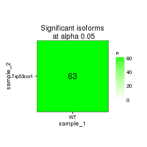

Trp53cor1 KO vs WT (Embryonic)
======================================


```
## Error: cannot open the connection
```

```
## Error: object 'deletionCoords' not found
```


This file shows the wt-v-ko comparison for Trp53cor1. 

Cuff overview:


```
## CuffSet instance with:
## 	 0 samples
## 	 0 genes
## 	 0 isoforms
## 	 0 TSS
## 	 0 CDS
## 	 0 promoters
## 	 0 splicing
## 	 0 relCDS
```

# QC

## Dispersion

Dispersion plot for genes in cuff:
(Overdispersion can lead to innacurate quants)


```
## Error: replacement has 1 row, data has 0
```

## Cross-replicate variability (fpkmSCVplot)
Differences in CV 2 can result in lower numbers of differentially expressed genes due to a higher degree of variability between replicate fpkm estimates.

Genes:


```
## Error: RS-DBI driver: (error in statement: near ")": syntax error)
```

Isoforms: 


```
## Error: RS-DBI driver: (error in statement: near ")": syntax error)
```


## MvA plot


```
## Error: non-numeric argument to binary operator
```
   
### MvA plot counts


```
## Error: non-numeric argument to binary operator
```

## Scatterplot matrix


```
## Error: RS-DBI driver: (error in statement: near "from": syntax error)
```

## Distributions

### Boxplots

Boxplot (genes)


```
## Error: RS-DBI driver: (error in statement: near ")": syntax error)
```

Boxplot (genes, replicates)


```
## Error: RS-DBI driver: (error in statement: near ")": syntax error)
```

Boxplot (isoforms)


```
## Error: RS-DBI driver: (error in statement: near ")": syntax error)
```

Boxplot (isoforms, replicates)


```
## Error: RS-DBI driver: (error in statement: near ")": syntax error)
```

### Density

Density (genes)


```
## Error: RS-DBI driver: (error in statement: near ")": syntax error)
```

Density (genes, replicates)


```
## Error: RS-DBI driver: (error in statement: near ")": syntax error)
```


## Clustering

### Replicate Clusters


```
## Error: RS-DBI driver: (error in statement: near "from": syntax error)
```

### PCA (genes)


```
## Error: RS-DBI driver: (error in statement: near "from": syntax error)
```

### MDS (genes)


```
## Error: RS-DBI driver: (error in statement: near "from": syntax error)
```


# KO assessment

## Endogenous lncRNA expression


```
## Error: RS-DBI driver: (error in statement: near ")": syntax error)
```

```
## Error: error in evaluating the argument 'object' in selecting a method for function 'expressionPlot': Error: object 'myGene' not found
```

Endogenous expression of Trp53cor1 isoforms:


```
## Error: error in evaluating the argument 'object' in selecting a method for function 'expressionPlot': Error in isoforms(myGene) : 
##   error in evaluating the argument 'object' in selecting a method for function 'isoforms': Error: object 'myGene' not found
```

Barplot of gene expression:


```
## Error: error in evaluating the argument 'object' in selecting a method for function 'expressionBarplot': Error: object 'myGene' not found
```

Barplot of isoform expression:


```
## Error: error in evaluating the argument 'object' in selecting a method for function 'expressionBarplot': Error in isoforms(myGene) : 
##   error in evaluating the argument 'object' in selecting a method for function 'isoforms': Error: object 'myGene' not found
```


## LacZ expression


```
## Error: RS-DBI driver: (RS_SQLite_exec: could not execute1: cannot start a
## transaction within a transaction)
```

```
## Error: error in evaluating the argument 'object' in selecting a method for function 'expressionPlot': Error: object 'myGene' not found
```

```
## Error: error in evaluating the argument 'object' in selecting a method for function 'expressionBarplot': Error: object 'myGene' not found
```


## Digital Genotyping (LacZ vs Endogenous lncRNA and Sex)

Eif2s3y is a y-expressed gene, Xist is an x-expressed gene 
Expression plot (endogenous linc, lacZ, Y-expressed gene):


```
## Error: RS-DBI driver: (RS_SQLite_exec: could not execute1: cannot start a
## transaction within a transaction)
```

```
## Error: error in evaluating the argument 'object' in selecting a method for function 'expressionBarplot': Error: object 'genotypingGenes' not found
```

Expression heatmap:


```
## Error: error in evaluating the argument 'object' in selecting a method for function 'csHeatmap': Error: object 'genotypingGenes' not found
```


### Track visualization 


```
## Error: RS-DBI driver: (RS_SQLite_exec: could not execute1: cannot start a
## transaction within a transaction)
```

```
## Error: error in evaluating the argument 'object' in selecting a method for function 'annotation': Error: object 'myGene' not found
```

```
## Error: object 'annot' not found
```

```
## Error: error in evaluating the argument 'x' in selecting a method for function 'unlist': Error: object 'locus' not found
```

```
## Error: object 'locus' not found
```

```
## Error: object 'locus' not found
```

```
## Error: error in evaluating the argument 'x' in selecting a method for function 'unlist': Error: object 'start_and_end' not found
```

```
## Error: object 'start_and_end' not found
```

```
## Error: object 'start_and_end' not found
```

```
## Error: error in evaluating the argument 'start' in selecting a method for function '.buildRange': Error: object 'from' not found
```

```
## Error: cannot open the connection
```

```
## Error: object 'deletionCoords' not found
```

```
## Error: object 'deletionCoords' not found
```

```
## Error: non-character argument
```

```
## Error: object of type 'closure' is not subsettable
```

```
## Error: object of type 'closure' is not subsettable
```

```
## Error: error in evaluating the argument 'x' in selecting a method for function 'unlist': Error: object 'positions' not found
```

```
## Error: object 'positions' not found
```

```
## Error: object 'positions' not found
```

```
## Error: unique() applies only to vectors
```

# Differential Analysis

## Differential Genes 


```
## Error: RS-DBI driver: (error in statement: near ")": syntax error)
```

```
## Error: error in evaluating the argument 'object' in selecting a method for function 'annotation': Error: object 'sigGenes' not found
```


[1] "No sig genes!"

### Matrix of gene significant differences between conditions

(skip for Brainmap wt-v-ko comparisons)

 

### Significant gene expression differences between conditions

Expression plot (genes):(turned off)


```
## Error: error in evaluating the argument 'object' in selecting a method for function 'csHeatmap': Error: object 'sigGenes' not found
```

Significant genes with expression >50fpkm (any condition):(turned off)


An individual look at each of the highly expressed significantly differentially regulated genes:
(eval=false for first pass)


### Expression-level/significance relationship

Scatter plot of significant genes only:


```
## Error: error in evaluating the argument 'object' in selecting a method for function 'csScatter': Error: object 'sigGenes' not found
```

Volcano Plot


```
## Error: One or more values of 'x' or 'y' are not valid sample names!
```

Volcano plot with significant genes only:


```
## Error: error in evaluating the argument 'object' in selecting a method for function 'csVolcano': Error: object 'sigGenes' not found
```

FoldChange Heatmap


```
## Error: error in evaluating the argument 'object' in selecting a method for function 'csFoldChangeHeatmap': Error: object 'sigGenes' not found
```


## Differential Splicing

### Differential Isoforms between conditions

Per isoform difference between conditions:

 

These isoforms are:

[1] "no sig isoforms"

Gene-level DE isoform heatmap


```
## [1] "no sig isoforms"
```

Isoform foldchange heatmap by isoform:


```
## [1] "no sig isoforms"
```


### Differential Splicing between conditions

(eval false for first pass)

Per condition differences in isoforms (Does gene have diff piechart between conditions?)


These genes are:


Splicing heatmap by isoform:


Splicing heatmap by gene


The following are significantly differentially spliced genes (relative portion of isoform per condition): 


 


# Gene/Pathway Analysis

## GSEA

Enrichment and zscores are calculated based on expression in KO vs WT (fpkmKO/fpkmWT), so genes that are down regulated in KO are shown in blue, while upregulation is shown in red. 

KO/WT
Blue = down in KO
Red = Up in KO


```
## Error: Only alternative="mixed" is possible with F-like statistics.
```

```
## Error: object 'reactome_pvl_mat' not found
```

```
## Error: object 'reactome_pvl_corrected' not found
```

```
## Error: Only alternative="mixed" is possible with F-like statistics.
```

```
## Error: object 'biocarta_pvl_mat' not found
```

```
## Error: object 'biocarta_pvl_corrected' not found
```

```
## Error: Only alternative="mixed" is possible with F-like statistics.
```

```
## Error: object 'kegg_pvl_mat' not found
```

```
## Error: object 'kegg_pvl_corrected' not found
```

```
## Error: Only alternative="mixed" is possible with F-like statistics.
```

```
## Error: object 'interneuron_pvl_mat' not found
```

```
## Error: object 'interneuron_pvl_corrected' not found
```

```
## Error: Only alternative="mixed" is possible with F-like statistics.
```

```
## Error: object 'oncogene_pvl_mat' not found
```

```
## Error: object 'oncogene_pvl_corrected' not found
```

```
## Error: Only alternative="mixed" is possible with F-like statistics.
```

```
## Error: object 'immuno_pvl_mat' not found
```

```
## Error: object 'immuno_pvl_corrected' not found
```

```
## Error: Only alternative="mixed" is possible with F-like statistics.
```

```
## Error: object 'tf_pvl_mat' not found
```

```
## Error: object 'tf_pvl_corrected' not found
```


Biocarta enrichment: 


```
## Error: error in evaluating the argument 'x' in selecting a method for function 't': Error: object 'biocarta_pvl_corrected' not found
```

```
## Error: object 'x' not found
```

```
## Error: object 'x_ordered' not found
```

```
## Error: object 'x_ordered' not found
```

```
## Error: object 'noinfinities_x' not found
```

```
## Error: object 'x_max' not found
```

```
## Error: error in evaluating the argument 'x' in selecting a method for function 'as.matrix': Error: object 'x_ordered' not found
```

```
## Error: object 'x_ordered' not found
```

Biocarta zscore: 


```
## Error: error in evaluating the argument 'x' in selecting a method for function 'which': Error in apply(x, 2, min) : object 'biocarta_pvl_corrected' not found
## Calls: colMins -> apply
```

```
## Error: object 'x' not found
```

```
## Error: object 'x_ordered' not found
```

```
## Error: error in evaluating the argument 'x' in selecting a method for function 'as.matrix': Error: object 'x_ordered' not found
```

```
## Error: object 'x_ordered' not found
```


Reactome enrichment: 


```
## Error: error in evaluating the argument 'x' in selecting a method for function 't': Error: object 'reactome_pvl_corrected' not found
```

```
## Error: object 'x' not found
```

```
## Error: object 'x_ordered' not found
```

```
## Error: object 'x_ordered' not found
```

```
## Error: object 'noinfinities_x' not found
```

```
## Error: object 'x_max' not found
```

```
## Error: object 'x_ordered' not found
```


Reactome zscore: 


```
## Error: error in evaluating the argument 'x' in selecting a method for function 'which': Error in apply(x, 2, min) : object 'reactome_pvl_corrected' not found
## Calls: colMins -> apply
```

```
## Error: object 'x' not found
```

```
## Error: object 'x_ordered' not found
```

```
## Error: error in evaluating the argument 'x' in selecting a method for function 'as.matrix': Error: object 'x_ordered' not found
```

```
## Error: object 'x_ordered' not found
```


Kegg enrichment: 


```
## Error: error in evaluating the argument 'x' in selecting a method for function 't': Error: object 'kegg_pvl_corrected' not found
```

```
## Error: object 'x' not found
```

```
## Error: object 'x_ordered' not found
```

```
## Error: object 'x_ordered' not found
```

```
## Error: object 'noinfinities_x' not found
```

```
## Error: object 'x_max' not found
```

```
## Error: object 'x_ordered' not found
```

Kegg zscore: 


```
## Error: error in evaluating the argument 'x' in selecting a method for function 'which': Error in apply(x, 2, min) : object 'kegg_pvl_corrected' not found
## Calls: colMins -> apply
```

```
## Error: object 'x' not found
```

```
## Error: object 'x_ordered' not found
```

```
## Error: error in evaluating the argument 'x' in selecting a method for function 'as.matrix': Error: object 'x_ordered' not found
```

```
## Error: object 'x_ordered' not found
```

Interneuron enrichment:


```
## Error: error in evaluating the argument 'x' in selecting a method for function 't': Error: object 'interneuron_pvl_corrected' not found
```

```
## Error: object 'x' not found
```

```
## Error: object 'x_ordered' not found
```

```
## Error: object 'x_ordered' not found
```

```
## Error: object 'noinfinities_x' not found
```

```
## Error: object 'x_max' not found
```

```
## Error: object 'x_ordered' not found
```

Interneuron zscore:


```
## Error: error in evaluating the argument 'x' in selecting a method for function 'which': Error in apply(x, 2, min) : object 'interneuron_pvl_corrected' not found
## Calls: colMins -> apply
```

```
## Error: object 'x' not found
```

```
## Error: object 'x_ordered' not found
```

```
## Error: error in evaluating the argument 'x' in selecting a method for function 'as.matrix': Error: object 'x_ordered' not found
```

```
## Error: object 'x_ordered' not found
```


Oncogene enrichment: 


```
## Error: error in evaluating the argument 'x' in selecting a method for function 't': Error: object 'oncogene_pvl_corrected' not found
```

```
## Error: object 'x' not found
```

```
## Error: object 'x_ordered' not found
```

```
## Error: object 'x_ordered' not found
```

```
## Error: object 'noinfinities_x' not found
```

```
## Error: object 'x_max' not found
```

```
## Error: object 'x_ordered' not found
```

Oncogene zscore:


```
## Error: error in evaluating the argument 'x' in selecting a method for function 'which': Error in apply(x, 2, min) : object 'oncogene_pvl_corrected' not found
## Calls: colMins -> apply
```

```
## Error: object 'x' not found
```

```
## Error: object 'x_ordered' not found
```

```
## Error: error in evaluating the argument 'x' in selecting a method for function 'as.matrix': Error: object 'x_ordered' not found
```

```
## Error: object 'x_ordered' not found
```

Immuno enrichment:


```
## Error: error in evaluating the argument 'x' in selecting a method for function 't': Error: object 'immuno_pvl_corrected' not found
```

```
## Error: object 'x' not found
```

```
## Error: object 'x_ordered' not found
```

```
## Error: object 'x_ordered' not found
```

```
## Error: object 'noinfinities_x' not found
```

```
## Error: object 'x_max' not found
```

```
## Error: object 'x_ordered' not found
```

Immuno zscore:


```
## Error: error in evaluating the argument 'x' in selecting a method for function 'which': Error in apply(x, 2, min) : object 'immuno_pvl_corrected' not found
## Calls: colMins -> apply
```

```
## Error: object 'x' not found
```

```
## Error: object 'x_ordered' not found
```

```
## Error: error in evaluating the argument 'x' in selecting a method for function 'as.matrix': Error: object 'x_ordered' not found
```

```
## Error: object 'x_ordered' not found
```

TF enrichment:


```
## Error: error in evaluating the argument 'x' in selecting a method for function 't': Error: object 'tf_pvl_corrected' not found
```

```
## Error: object 'x' not found
```

```
## Error: object 'x_ordered' not found
```

```
## Error: object 'x_ordered' not found
```

```
## Error: object 'noinfinities_x' not found
```

```
## Error: object 'x_max' not found
```

```
## Error: object 'x_ordered' not found
```

TF zscore:


```
## Error: error in evaluating the argument 'x' in selecting a method for function 'which': Error in apply(x, 2, min) : object 'tf_pvl_corrected' not found
## Calls: colMins -> apply
```

```
## Error: object 'x' not found
```

```
## Error: object 'x_ordered' not found
```

```
## Error: error in evaluating the argument 'x' in selecting a method for function 'as.matrix': Error: object 'x_ordered' not found
```

```
## Error: object 'x_ordered' not found
```


## GO enrichment 
Cluster profiler used to call enichments of significantly differentially regulated genes that map to Entrez IDs. 


```
## Error: RS-DBI driver: (error in statement: near ")": syntax error)
```

```
## Error: error in evaluating the argument 'object' in selecting a method for function 'annotation': Error: object 'sigGenes' not found
```

```
## Error: object 'geneAnnot' not found
```

```
## Error: error in evaluating the argument 'object' in selecting a method for function 'diffData': Error: object 'sigGenes' not found
```

```
## Error: object 'sigDiff' not found
```


```
## Error: object 'geneNames' not found
```

```
## Error: object 'sigEntrez' not found
```

```
## Error: error in evaluating the argument 'x' in selecting a method for function 'unlist': Error: object 'sigEZ' not found
```

```
## Error: object 'sigEZ' not found
```

```
## Error: object 'sigEZ' not found
```

```
## Error: object 'sigEZ' not found
```

```
## Error: object 'sigEZ' not found
```

```
## Error: object 'sigEZ' not found
```


```
## Error: error in evaluating the argument 'x' in selecting a method for function 'plot': Error: object 'goBP' not found
```

```
## Error: error in evaluating the argument 'x' in selecting a method for function 'plot': Error: object 'goMF' not found
```

```
## Error: error in evaluating the argument 'x' in selecting a method for function 'plot': Error: object 'goCC' not found
```

```
## Error: error in evaluating the argument 'x' in selecting a method for function 'plot': Error: object 'kegg' not found
```

```
## Error: error in evaluating the argument 'x' in selecting a method for function 'plot': Error: object 'pathway' not found
```


### Enrichment or depletion for stage-specific cell cycle markers 


```
## Error: RS-DBI driver: (RS_SQLite_exec: could not execute1: cannot start a
## transaction within a transaction)
```

```
## Error: error in evaluating the argument 'object' in selecting a method for function 'annotation': Error: object 'cellcycle_genes' not found
```

```
## Error: error in evaluating the argument 'object' in selecting a method for function 'diffData': Error: object 'cellcycle_genes' not found
```

```
## Error: error in evaluating the argument 'x' in selecting a method for function 'merge': Error: object 'diffDat' not found
```

```
## Error: object 'cellcycle' not found
```

```
## Error: error in evaluating the argument 'x' in selecting a method for function 'merge': Error: object 'cellcycle' not found
```

```
## Error: object 'cellcycle' not found
```

```
## Error: object 'cellcycle' not found
```

```
## Error: object 'cellcycle.melt' not found
```

```
## Error: object 'cellcycle.melt' not found
```

```
## Error: object 'cellcycle.melt' not found
```

```
## Error: object 'cellcycle.p' not found
```

```
## Error: object 'cellcycle.p' not found
```


### Enrichment or depletion for markers of specific cortical layers


```
## Error: RS-DBI driver: (RS_SQLite_exec: could not execute1: cannot start a
## transaction within a transaction)
```

```
## Error: error in evaluating the argument 'object' in selecting a method for function 'annotation': Error: object 'cortical_genes' not found
```

```
## Error: error in evaluating the argument 'object' in selecting a method for function 'diffData': Error: object 'cortical_genes' not found
```

```
## Error: error in evaluating the argument 'x' in selecting a method for function 'merge': Error: object 'diffDat' not found
```

```
## Error: object 'cortical' not found
```

```
## Error: error in evaluating the argument 'x' in selecting a method for function 'merge': Error: object 'cortical' not found
```

```
## Error: object 'cortical' not found
```

```
## Error: object 'cortical' not found
```

```
## Error: object 'cortical.melt' not found
```

```
## Error: object 'cortical.melt' not found
```

```
## Error: object 'cortical.melt' not found
```

```
## Error: object 'cortical.p' not found
```

```
## Error: object 'cortical.p' not found
```

```
## Error: object 'cortical.p' not found
```


### Enrichment or depletion for specific neural cell types 

```
## Error: RS-DBI driver: (RS_SQLite_exec: could not execute1: cannot start a
## transaction within a transaction)
```

```
## Error: error in evaluating the argument 'object' in selecting a method for function 'annotation': Error: object 'neuralcell_genes' not found
```

```
## Error: error in evaluating the argument 'object' in selecting a method for function 'diffData': Error: object 'neuralcell_genes' not found
```

```
## Error: error in evaluating the argument 'x' in selecting a method for function 'merge': Error: object 'diffDat' not found
```

```
## Error: object 'neuralcelltype' not found
```

```
## Error: error in evaluating the argument 'x' in selecting a method for function 'merge': Error: object 'neuralcelltype' not found
```

```
## Error: object 'neuralcelltype' not found
```

```
## Error: object 'neuralcelltype' not found
```

```
## Error: object 'neuralcelltype' not found
```

```
## Error: object 'neuralcelltype.melt' not found
```

```
## Error: object 'neuralcelltype.melt' not found
```

```
## Error: object 'neuralcelltype.p' not found
```

```
## Error: object 'neuralcelltype.p' not found
```

```
## Error: object 'neuralcelltype.p' not found
```


### Enrichment or Depletion of neural differentiation markers 


```
## Error: RS-DBI driver: (RS_SQLite_exec: could not execute1: cannot start a
## transaction within a transaction)
```

```
## Error: error in evaluating the argument 'object' in selecting a method for function 'annotation': Error: object 'neural_diff_genes' not found
```

```
## Error: error in evaluating the argument 'object' in selecting a method for function 'diffData': Error: object 'neural_diff_genes' not found
```

```
## Error: error in evaluating the argument 'x' in selecting a method for function 'merge': Error: object 'diffDat' not found
```

```
## Error: object 'ndiff' not found
```

```
## Error: error in evaluating the argument 'x' in selecting a method for function 'merge': Error: object 'ndiff' not found
```

```
## Error: object 'ndiff' not found
```

```
## Error: object 'ndiff' not found
```

```
## Error: object 'ndiff.melt' not found
```

```
## Error: object 'ndiff.melt' not found
```

```
## Error: object 'ndiff.melt' not found
```

```
## Error: object 'ndiff.p' not found
```

```
## Error: object 'ndiff.p' not found
```

```
## Error: object 'ndiff.p' not found
```


# Cis vs Trans (locally)

log2 Foldchange and test statistic are calculated with the ratio of fpkm(KO)/fpkm(WT), thus the test_stat is positive if a gene is higher in the KO and negative if a gene has lower expression in the KO


```
## Error: dims [product 1] do not match the length of object [0]
```

```
## Error: object 'fullTable' not found
```

```
## Error: object 'myGene' not found
```

```
## Error: object 'myGene' not found
```

```
## Error: object 'myGene' not found
```

```
## Error: object 'fullTable' not found
```

```
## Error: error in evaluating the argument 'x' in selecting a method for function 'nrow': Error in empty(.data) : object 'sigGenesRegion' not found
## Calls: ddply -> empty
```

```
## Error: object 'fullTable' not found
```

```
## Error: object 'fullTable' not found
```

```
## Error: object 'myGene' not found
```

```
## Error: object 'genesInRegion' not found
```

```
## Error: object 'genesInRegion' not found
```

```
## Error: object 'genesInRegion' not found
```

```
## Error: object 'genesInRegion' not found
```

```
## Error: object of type 'closure' is not subsettable
```

```
## Error: object of type 'closure' is not subsettable
```

```
## Error: object of type 'closure' is not subsettable
```

```
## Error: object of type 'closure' is not subsettable
```

```
## Error: object of type 'closure' is not subsettable
```

```
## Error: ggplot2 doesn't know how to deal with data of class function
```

The pvalue for ----- genes significantly regulated in a region this size  is: -----


```
## Error: object 'currplot' not found
```

# Notes

## Samples used are:
<!-- html table generated in R 3.0.2 by xtable 1.7-3 package -->
<!-- Thu Sep 25 16:16:59 2014 -->
<TABLE border=1>
<TR> <TH>  </TH> <TH> NA </TH>  </TR>
  </TABLE>

## Replicates
<!-- html table generated in R 3.0.2 by xtable 1.7-3 package -->
<!-- Thu Sep 25 16:16:59 2014 -->
<TABLE border=1>
<TR> <TH>  </TH> <TH> file </TH> <TH> sample_name </TH> <TH> replicate </TH> <TH> rep_name </TH> <TH> total_mass </TH> <TH> norm_mass </TH> <TH> internal_scale </TH> <TH> external_scale </TH>  </TR>
  </TABLE>

## Session Info

```
## R version 3.0.2 (2013-09-25)
## Platform: x86_64-unknown-linux-gnu (64-bit)
## 
## locale:
##  [1] LC_CTYPE=en_US.UTF-8       LC_NUMERIC=C              
##  [3] LC_TIME=en_US.UTF-8        LC_COLLATE=en_US.UTF-8    
##  [5] LC_MONETARY=en_US.UTF-8    LC_MESSAGES=en_US.UTF-8   
##  [7] LC_PAPER=en_US.UTF-8       LC_NAME=C                 
##  [9] LC_ADDRESS=C               LC_TELEPHONE=C            
## [11] LC_MEASUREMENT=en_US.UTF-8 LC_IDENTIFICATION=C       
## 
## attached base packages:
## [1] grid      parallel  stats     graphics  grDevices utils     datasets 
## [8] methods   base     
## 
## other attached packages:
##  [1] plyr_1.8.1                         
##  [2] stringr_0.6.2                      
##  [3] seqbias_1.10.0                     
##  [4] BSgenome.Mmusculus.UCSC.mm10_1.3.19
##  [5] BSgenome_1.30.0                    
##  [6] Biostrings_2.30.1                  
##  [7] gdata_2.13.3                       
##  [8] org.Mm.eg.db_2.10.1                
##  [9] clusterProfiler_1.13.1             
## [10] DOSE_2.0.0                         
## [11] ReactomePA_1.6.1                   
## [12] AnnotationDbi_1.24.0               
## [13] Biobase_2.22.0                     
## [14] RMySQL_0.9-3                       
## [15] RColorBrewer_1.0-5                 
## [16] gridExtra_0.9.1                    
## [17] gtable_0.1.2                       
## [18] marray_1.40.0                      
## [19] gplots_2.14.2                      
## [20] GSA_1.03                           
## [21] limma_3.18.13                      
## [22] xtable_1.7-3                       
## [23] cummeRbund_2.7.2                   
## [24] Gviz_1.6.0                         
## [25] rtracklayer_1.22.7                 
## [26] GenomicRanges_1.14.4               
## [27] XVector_0.2.0                      
## [28] IRanges_1.20.7                     
## [29] fastcluster_1.1.13                 
## [30] reshape2_1.4                       
## [31] ggplot2_1.0.0                      
## [32] RSQLite_0.11.4                     
## [33] DBI_0.2-7                          
## [34] BiocGenerics_0.8.0                 
## [35] knitr_1.6                          
## 
## loaded via a namespace (and not attached):
##  [1] biomaRt_2.18.0         biovizBase_1.10.8      bitops_1.0-6          
##  [4] caTools_1.17.1         cluster_1.15.2         colorspace_1.2-4      
##  [7] dichromat_2.0-0        digest_0.6.4           DO.db_2.7             
## [10] evaluate_0.5.5         formatR_1.0            Formula_1.1-2         
## [13] GenomicFeatures_1.14.5 GO.db_2.10.1           GOSemSim_1.20.3       
## [16] graph_1.40.1           graphite_1.8.1         gtools_3.4.1          
## [19] Hmisc_3.14-4           igraph_0.7.1           KEGG.db_2.10.1        
## [22] KernSmooth_2.23-12     lattice_0.20-29        latticeExtra_0.6-26   
## [25] MASS_7.3-33            munsell_0.4.2          org.Hs.eg.db_2.10.1   
## [28] proto_0.3-10           qvalue_1.36.0          Rcpp_0.11.2           
## [31] RCurl_1.95-4.3         reactome.db_1.46.1     Rsamtools_1.14.3      
## [34] scales_0.2.4           splines_3.0.2          stats4_3.0.2          
## [37] survival_2.37-7        tcltk_3.0.2            tools_3.0.2           
## [40] XML_3.98-1.1           zlibbioc_1.8.0
```

## Run Info

```
##    param value
## 1 genome  mm10
```


