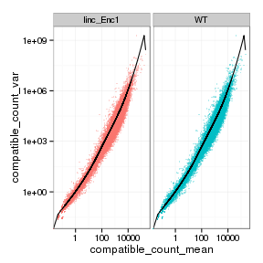
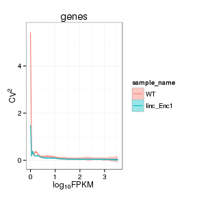
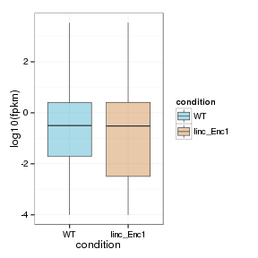
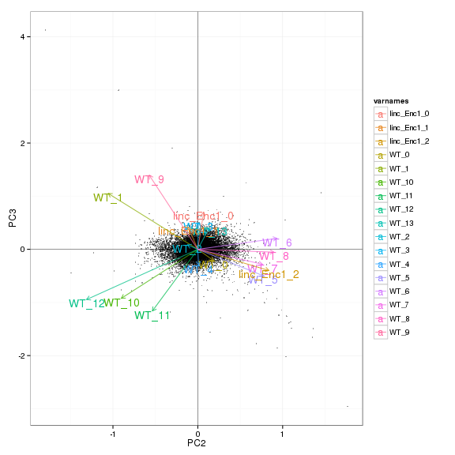
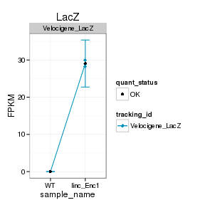
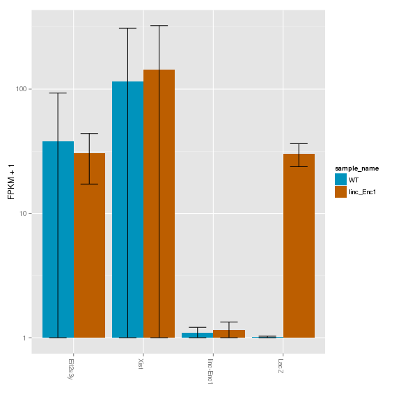
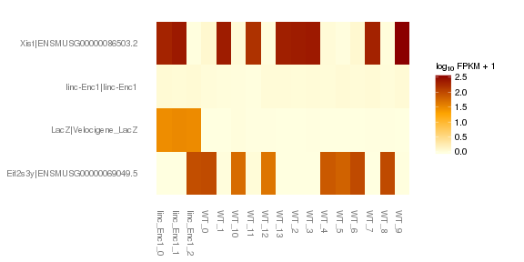
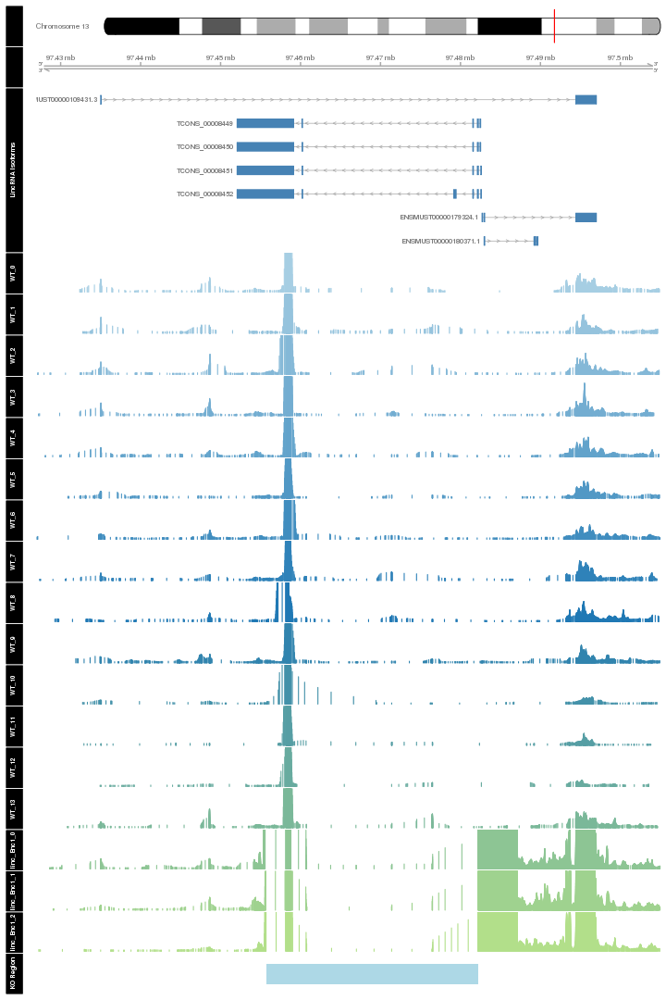
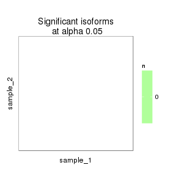
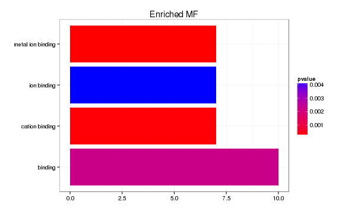

linc-Enc1 KO vs WT (Embryonic)
======================================

- other heatmap labels (csHeatmap)
- cache gsea and overlap figure!! 
- tracks 
- should import litter info


# Intialize


# Design Overview

This file shows the wt-v-ko comparison for linc-Enc1. 

Cuff overview:

```
## CuffSet instance with:
## 	 2 samples
## 	 26754 genes
## 	 77524 isoforms
## 	 0 TSS
## 	 23066 CDS
## 	 0 promoters
## 	 0 splicing
## 	 19954 relCDS
```


# QC

## Dispersion

Dispersion plot for genes in cuff:
(Overdispersion can lead to innacurate quants)

 

## Cross-replicate variability (fpkmSCVplot)
Differences in CV 2 can result in lower numbers of differentially expressed genes due to a higher degree of variability between replicate fpkm estimates.

Genes:
 


Isoforms: 
 

## Volcano


### Volcano matrix (replicates) -- why is xlim not working? 

 

## MvA plot

   
### MvA plot counts


## Scatterplot
 

### Scatter matrix (replicates) -- SKIP FOR NOW CAUSING PROBLEMS 


## Distributions

### Boxplots

Boxplot (genes)

 

Boxplot (genes, replicates)

 

Boxplot (isoforms)

 

Boxplot (isoforms, replicates)

 

### Density

Density (genes)

 

Density (genes, replicates)

 


## Clustering

### Replicate Clusters
 

```
## 'dendrogram' with 2 branches and 17 members total, at height 0.08406
```

### PCA (genes)
 

### MDS (genes)
 


# KO assessment

## Endogenous lncRNA expression

 

Endogenous expression of linc-Enc1 isoforms:

 

Barplot of gene expression:

 

Barplot of isoform expression:

 


## LacZ expression

  


## Digital Genotyping (LacZ vs Endogenous lncRNA and Sex)
Expression plot (endogenous linc, lacZ, Y-expressed gene):

 

Expression heatmap:
 


### Track visualization 

 

# Differential Analysis

## Differential Genes 


There are 18 significantly differentially expressed genes. They are:

<!-- html table generated in R 3.0.2 by xtable 1.7-3 package -->
<!-- Tue Jun 24 12:45:07 2014 -->
<TABLE border=1>
<TR> <TH>  </TH> <TH> geneAnnot$gene_short_name </TH>  </TR>
  <TR> <TD align="right"> 1 </TD> <TD> Rec8 </TD> </TR>
  <TR> <TD align="right"> 2 </TD> <TD> Hoxb9 </TD> </TR>
  <TR> <TD align="right"> 3 </TD> <TD> Nnt </TD> </TR>
  <TR> <TD align="right"> 4 </TD> <TD> Fn1 </TD> </TR>
  <TR> <TD align="right"> 5 </TD> <TD> Bspry </TD> </TR>
  <TR> <TD align="right"> 6 </TD> <TD> Alad </TD> </TR>
  <TR> <TD align="right"> 7 </TD> <TD> Hddc3 </TD> </TR>
  <TR> <TD align="right"> 8 </TD> <TD> Enc1 </TD> </TR>
  <TR> <TD align="right"> 9 </TD> <TD> Gm9493 </TD> </TR>
  <TR> <TD align="right"> 10 </TD> <TD> Fat4 </TD> </TR>
  <TR> <TD align="right"> 11 </TD> <TD> Hbb-y </TD> </TR>
  <TR> <TD align="right"> 12 </TD> <TD> Hbb-bh1 </TD> </TR>
  <TR> <TD align="right"> 13 </TD> <TD> Hba-x </TD> </TR>
  <TR> <TD align="right"> 14 </TD> <TD> Capn11 </TD> </TR>
  <TR> <TD align="right"> 15 </TD> <TD> Alox5ap </TD> </TR>
  <TR> <TD align="right"> 16 </TD> <TD> Rpl17 </TD> </TR>
  <TR> <TD align="right"> 17 </TD> <TD> Gstm6 </TD> </TR>
  <TR> <TD align="right"> 18 </TD> <TD> Gm2373 </TD> </TR>
   </TABLE>

### Matrix of gene significant differences between conditions

(skip for Brainmap wt-v-ko comparisons)

 

### Significant gene expression differences between conditions

Expression plot (genes):
  

Significant genes with expression >50fpkm (any condition):
 

An individual look at each of the highly expressed significantly differentially regulated genes:
(eval=false for first pass)


### Expression-level/significance relationship

Scatter plot of significant genes only:

```
## Error: One or more values of 'x' or 'y' are not valid sample names!
```

Volcano plot with significant genes only:

```
## Error: One or more values of 'x' or 'y' are not valid sample names!
```


## Differential Splicing

### Differential Isoforms between conditions
Per isoform difference between conditions:
 

```
## Error: RS-DBI driver: (error in statement: near ")": syntax error)
```

```
## Error: error in evaluating the argument 'object' in selecting a method for function 'annotation': Error: object 'isoformSigGenes' not found
```

These isoforms are:


```
## Error: error in evaluating the argument 'object' in selecting a method for function 'csHeatmap': Error in isoforms(isoformSigGenes) : 
##   error in evaluating the argument 'object' in selecting a method for function 'isoforms': Error: object 'isoformSigGenes' not found
```

### Differential Splicing between conditions

(eval false for first pass)

Per condition differences in isoforms (Does gene have diff piechart between conditions?)


These genes are:


Splicing heatmap by isoform:


Splicing heatmap by gene


The following are significantly differentially spliced genes (relative portion of isoform per condition): 


 


# Gene/Pathway Analysis

## GSEA


```
## Error: unable to find an inherited method for function 'genes' for
## signature '"CuffSet"'
```

```
## Error: error in evaluating the argument 'object' in selecting a method for function 'diffData': Error: object 'population' not found
```

```
## Error: error in evaluating the argument 'object' in selecting a method for function 'annotation': Error in (function (classes, fdef, mtable)  : 
##   unable to find an inherited method for function 'genes' for signature '"CuffSet"'
## Calls: genes -> <Anonymous>
```

```
## Error: error in evaluating the argument 'y' in selecting a method for function 'merge': Error: object 'population.diff' not found
```


```
## Error: error in evaluating the argument 'x' in selecting a method for function 'toupper': Error: object 'gene_names' not found
```

```
## Error: error in evaluating the argument 'x' in selecting a method for function 'unique': Error: object 'df.pop' not found
```

```
## Error: object 'df.pop.unique' not found
```

```
## Error: object 'df.pop.unique' not found
```

```
## Error: object 'df.pop.unique.ordered' not found
```

```
## Error: object 'Input.df' not found
```

```
## Error: error in evaluating the argument 'x' in selecting a method for function 'which': Error in short_names %in% genelist : 
##   error in evaluating the argument 'x' in selecting a method for function '%in%': Error: object 'Input.df' not found
```

```
## Error: object 'reactome_pvl_mat' not found
```

```
## Error: object 'reactome_pvl_corrected' not found
```

```
## Error: error in evaluating the argument 'x' in selecting a method for function 'which': Error in short_names %in% genelist : 
##   error in evaluating the argument 'x' in selecting a method for function '%in%': Error: object 'Input.df' not found
```

```
## Error: object 'biocarta_pvl_mat' not found
```

```
## Error: object 'biocarta_pvl_corrected' not found
```


```
## Error: error in evaluating the argument 'x' in selecting a method for function 't': Error: object 'reactome_pvl_corrected' not found
```

```
## Error: object 'x' not found
```

```
## Error: object 'x_ordered' not found
```

```
## Error: object 'x_ordered' not found
```

```
## Error: object 'noinfinities_x' not found
```

```
## Error: object 'x_max' not found
```

```
## Error: object 'x_ordered' not found
```


```
## Error: error in evaluating the argument 'x' in selecting a method for function 't': Error: object 'reactome_pvl_corrected' not found
```

```
## Error: object 'x' not found
```

```
## Error: object 'x_ordered' not found
```

```
## Error: object 'x_ordered' not found
```

```
## Error: object 'noinfinities_x' not found
```

```
## Error: object 'x_max' not found
```

```
## Error: object 'x_ordered' not found
```

## GO enrichment 
Cluster profiler used to call enichments of significantly differentially regulated genes that map to Entrez IDs. 


```
## Error: 'x' and 'units' must have length > 0
```

 

```
## Error: 'x' and 'units' must have length > 0
```

```
## Error: need finite 'xlim' values
```

 

```
## Error: need finite 'xlim' values
```

# Cis vs Trans (locally)

```
## Error: error in evaluating the argument 'object' in selecting a method for function 'diffTable': Error in (function (classes, fdef, mtable)  : 
##   unable to find an inherited method for function 'genes' for signature '"CuffSet"'
## Calls: genes -> <Anonymous>
```

```
## Error: object 'fullTable' not found
```

```
## Error: $ operator not defined for this S4 class
```

```
## Error: $ operator not defined for this S4 class
```

```
## Error: $ operator not defined for this S4 class
```

```
## Error: object 'fullTable' not found
```

```
## Error: error in evaluating the argument 'x' in selecting a method for function 'nrow': Error in empty(.data) : object 'sigGenesRegion' not found
## Calls: ddply -> empty
```

```
## Error: object 'fullTable' not found
```

```
## Error: object 'fullTable' not found
```

```
## Error: $ operator not defined for this S4 class
```

```
## Error: object 'genesInRegion' not found
```

```
## Error: object 'genesInRegion' not found
```

```
## Error: object 'genesInRegion' not found
```

```
## Error: object 'genesInRegion' not found
```

```
## Error: object of type 'closure' is not subsettable
```


