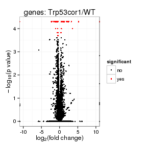
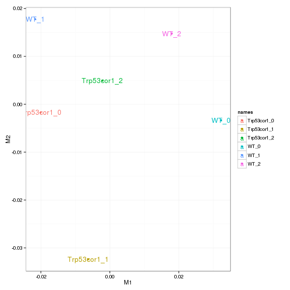

Strain X KO vs WT (Embryonic or Adult)
======================================


```r
# Set knitr opts
```


```
## 1234567891011121314151617181920212223242526272829303132333435363738394041424344454647484950515253545556575859606162636465666768697071727374757677787980818283848586878889909192939495969798991001011021031041051061071081091101111121131141151161171181191201211221231241251261271281291301311321331341351361371381391401411421431441451461471481491501511521531541551561571581591601611621631641651661671681691701711721731741751761771781791801811821831841851861871881891901911921931941951961971981992002012022032042052062072082092102112122132142152162172182192202212222232242252262272282292302312322332342352362372382392402412422432442452462472482492502512522532542552562572582592602612622632642652662672682692702712722732742752762772782792802812822832842852862872882892902912922932942952962972982993003013023033043053063073083093103113123133143153163173183193203213223233243253263273283293303313323333343353363373383393403413423433443453463473483493503513523533543553563573583593603613623633643653663673683693703713723733743753763773783793803813823833843853863873883893903913923933943953963973983994004014024034044054064074084094104114124134144154164174184194204214224234244254264274284294304314324334344354364374384394404414424434444454464474484494504514524534544554564574584594604614624634644654664674684694704714724734744754764774784794804814824834844854864874884894904914924934944954964974984995005015025035045055065075085095105115125135145155165175185195205215225235245255265275285295305315325335345355365375385395405415425435445455465475485495505515525535545555565575585595605615625635645655665675685695705715725735745755765775785795805815825835845855865875885895905915925935945955965975985996006016026036046056066076086096106116126136146156166176186196206216226236246256266276286296306316326336346356366376386396406416426436446456466476486496506516526536546556566576586596606616626636646656666676686696706716726736741
## 2
## 3
## 4
## 5
## 6
## 7
## 8
## 9
## 10
## 11
## 12
## 13
## 14
## 15
## 16
## 17
## 18
## 19
## 20
## 21
## 22
## 23
## 24
## 25
## 26
## 27
## 28
## 29
## 30
## 31
## 32
## 33
## 34
## 35
## 36
## 37
## 38
## 39
## 40
## 41
## 42
## 43
## 44
## 45
## 46
## 47
## 48
## 49
## 50
## 51
## 52
## 53
## 54
## 55
## 56
## 57
## 58
## 59
## 60
## 61
## 62
## 63
## 64
## 65
## 66
## 67
## 68
## 69
## 70
## 71
## 72
## 73
## 74
## 75
## 76
## 77
## 78
## 79
## 80
## 81
## 82
## 83
## 84
## 85
## 86
## 87
## 88
## 89
## 90
## 91
## 92
## 93
## 94
## 95
## 96
## 97
## 98
## 99
## 100
## 101
## 102
## 103
## 104
## 105
## 106
## 107
## 108
## 109
## 110
## 111
## 112
## 113
## 114
## 115
## 116
## 117
## 118
## 119
## 120
## 121
## 122
## 123
## 124
## 125
## 126
## 127
## 128
## 129
## 130
## 131
## 132
## 133
## 134
## 135
## 136
## 137
## 138
## 139
## 140
## 141
## 142
## 143
## 144
## 145
## 146
## 147
## 148
## 149
## 150
## 151
## 152
## 153
## 154
## 155
## 156
## 157
## 158
## 159
## 160
## 161
## 162
## 163
## 164
## 165
## 166
## 167
## 168
## 169
## 170
## 171
## 172
## 173
## 174
## 175
## 176
## 177
## 178
## 179
## 180
## 181
## 182
## 183
## 184
## 185
## 186
## 187
## 188
## 189
## 190
## 191
## 192
## 193
## 194
## 195
## 196
## 197
## 198
## 199
## 200
## 201
## 202
## 203
## 204
## 205
## 206
## 207
## 208
## 209
## 210
## 211
## 212
## 213
## 214
## 215
## 216
## 217
## 218
## 219
## 220
## 221
## 222
## 223
## 224
## 225
## 226
## 227
## 228
## 229
## 230
## 231
## 232
## 233
## 234
## 235
## 236
## 237
## 238
## 239
## 240
## 241
## 242
## 243
## 244
## 245
## 246
## 247
## 248
## 249
## 250
## 251
## 252
## 253
## 254
## 255
## 256
## 257
## 258
## 259
## 260
## 261
## 262
## 263
## 264
## 265
## 266
## 267
## 268
## 269
## 270
## 271
## 272
## 273
## 274
## 275
## 276
## 277
## 278
## 279
## 280
## 281
## 282
## 283
## 284
## 285
## 286
## 287
## 288
## 289
## 290
## 291
## 292
## 293
## 294
## 295
## 296
## 297
## 298
## 299
## 300
## 301
## 302
## 303
## 304
## 305
## 306
## 307
## 308
## 309
## 310
## 311
## 312
## 313
## 314
## 315
## 316
## 317
## 318
## 319
## 320
## 321
## 322
## 323
## 324
## 325
## 326
## 327
## 328
## 329
## 330
## 331
## 332
## 333
## 334
## 335
## 336
## 337
## 338
## 339
## 340
## 341
## 342
## 343
## 344
## 345
## 346
## 347
## 348
## 349
## 350
## 351
## 352
## 353
## 354
## 355
## 356
## 357
## 358
## 359
## 360
## 361
## 362
## 363
## 364
## 365
## 366
## 367
## 368
## 369
## 370
## 371
## 372
## 373
## 374
## 375
## 376
## 377
## 378
## 379
## 380
## 381
## 382
## 383
## 384
## 385
## 386
## 387
## 388
## 389
## 390
## 391
## 392
## 393
## 394
## 395
## 396
## 397
## 398
## 399
## 400
## 401
## 402
## 403
## 404
## 405
## 406
## 407
## 408
## 409
## 410
## 411
## 412
## 413
## 414
## 415
## 416
## 417
## 418
## 419
## 420
## 421
## 422
## 423
## 424
## 425
## 426
## 427
## 428
## 429
## 430
## 431
## 432
## 433
## 434
## 435
## 436
## 437
## 438
## 439
## 440
## 441
## 442
## 443
## 444
## 445
## 446
## 447
## 448
## 449
## 450
## 451
## 452
## 453
## 454
## 455
## 456
## 457
## 458
## 459
## 460
## 461
## 462
## 463
## 464
## 465
## 466
## 467
## 468
## 469
## 470
## 471
## 472
## 473
## 474
## 475
## 476
## 477
## 478
## 479
## 480
## 481
## 482
## 483
## 484
## 485
## 486
## 487
## 488
## 489
## 490
## 491
## 492
## 493
## 494
## 495
## 496
## 497
## 498
## 499
## 500
## 501
## 502
## 503
## 504
## 505
## 506
## 507
## 508
## 509
## 510
## 511
## 512
## 513
## 514
## 515
## 516
## 517
## 518
## 519
## 520
## 521
## 522
## 523
## 524
## 525
## 526
## 527
## 528
## 529
## 530
## 531
## 532
## 533
## 534
## 535
## 536
## 537
## 538
## 539
## 540
## 541
## 542
## 543
## 544
## 545
## 546
## 547
## 548
## 549
## 550
## 551
## 552
## 553
## 554
## 555
## 556
## 557
## 558
## 559
## 560
## 561
## 562
## 563
## 564
## 565
## 566
## 567
## 568
## 569
## 570
## 571
## 572
## 573
## 574
## 575
## 576
## 577
## 578
## 579
## 580
## 581
## 582
## 583
## 584
## 585
## 586
## 587
## 588
## 589
## 590
## 591
## 592
## 593
## 594
## 595
## 596
## 597
## 598
## 599
## 600
## 601
## 602
## 603
## 604
## 605
## 606
## 607
## 608
## 609
## 610
## 611
## 612
## 613
## 614
## 615
## 616
## 617
## 618
## 619
## 620
## 621
## 622
## 623
## 624
## 625
## 626
## 627
## 628
## 629
## 630
## 631
## 632
## 633
## 634
## 635
## 636
## 637
## 638
## 639
## 640
## 641
## 642
## 643
## 644
## 645
## 646
## 647
## 648
## 649
## 650
## 651
## 652
## 653
## 654
## 655
## 656
## 657
## 658
## 659
## 660
## 661
## 662
## 663
## 664
## 665
## 666
## 667
## 668
## 669
## 670
## 671
## 672
## 673
```

```
## 1234567891011121314151617181920212223242526272829303132333435363738394041424344454647484950515253545556575859606162636465666768697071727374757677787980818283848586878889909192939495969798991001011021031041051061071081091101111121131141151161171181191201211221231241251261271281291301311321331341351361371381391401411421431441451461471481491501511521531541551561571581591601611621631641651661671681691701711721731741751761771781791801811821831841851861871881891901911921931941951961971981992002012022032042052062072082092102112122132142152162171
## 2
## 3
## 4
## 5
## 6
## 7
## 8
## 9
## 10
## 11
## 12
## 13
## 14
## 15
## 16
## 17
## 18
## 19
## 20
## 21
## 22
## 23
## 24
## 25
## 26
## 27
## 28
## 29
## 30
## 31
## 32
## 33
## 34
## 35
## 36
## 37
## 38
## 39
## 40
## 41
## 42
## 43
## 44
## 45
## 46
## 47
## 48
## 49
## 50
## 51
## 52
## 53
## 54
## 55
## 56
## 57
## 58
## 59
## 60
## 61
## 62
## 63
## 64
## 65
## 66
## 67
## 68
## 69
## 70
## 71
## 72
## 73
## 74
## 75
## 76
## 77
## 78
## 79
## 80
## 81
## 82
## 83
## 84
## 85
## 86
## 87
## 88
## 89
## 90
## 91
## 92
## 93
## 94
## 95
## 96
## 97
## 98
## 99
## 100
## 101
## 102
## 103
## 104
## 105
## 106
## 107
## 108
## 109
## 110
## 111
## 112
## 113
## 114
## 115
## 116
## 117
## 118
## 119
## 120
## 121
## 122
## 123
## 124
## 125
## 126
## 127
## 128
## 129
## 130
## 131
## 132
## 133
## 134
## 135
## 136
## 137
## 138
## 139
## 140
## 141
## 142
## 143
## 144
## 145
## 146
## 147
## 148
## 149
## 150
## 151
## 152
## 153
## 154
## 155
## 156
## 157
## 158
## 159
## 160
## 161
## 162
## 163
## 164
## 165
## 166
## 167
## 168
## 169
## 170
## 171
## 172
## 173
## 174
## 175
## 176
## 177
## 178
## 179
## 180
## 181
## 182
## 183
## 184
## 185
## 186
## 187
## 188
## 189
## 190
## 191
## 192
## 193
## 194
## 195
## 196
## 197
## 198
## 199
## 200
## 201
## 202
## 203
## 204
## 205
## 206
## 207
## 208
## 209
## 210
## 211
## 212
## 213
## 214
## 215
## 216
```

# Intialize

```r
setwd('/n/rinn_data1/users/agroff/seq/PERIL/data/diffs/cuffdiff_v221_newgtf/whole_brain/')
cuff<-readCufflinks()
```

# Design Overview
Whole brains from **strain** isolated by **operator**
- wt=wtm1,wtf3,wtm8
- ko=kom4,kof9,kof10
- can we grab any notes from sample sheet here? 

cuff
CuffSet instance with:
   2 samples
	 31926 genes
	 77340 isoforms
	 45508 TSS
	 0 CDS
	 31926 promoters
	 45508 splicing
	 0 relCDS


## Replicates


```r
replicates(cuff)
```

```
##                                                                                                                     file
## 1  /n/rinn_data1/users/agroff/seq/PERIL/data/bams/Sample_JR716_Peril_L43_E14-5_whole_brain_wtM1_CAGATC/accepted_hits.bam
## 2  /n/rinn_data1/users/agroff/seq/PERIL/data/bams/Sample_JR717_Peril_L43_E14-5_whole_brain_wtF3_ACTTGA/accepted_hits.bam
## 3  /n/rinn_data1/users/agroff/seq/PERIL/data/bams/Sample_JR719_Peril_L43_E14-5_whole_brain_wtM8_TAGCTT/accepted_hits.bam
## 4  /n/rinn_data1/users/agroff/seq/PERIL/data/bams/Sample_JR718_Peril_L43_E14-5_whole_brain_koM4_GATCAG/accepted_hits.bam
## 5  /n/rinn_data1/users/agroff/seq/PERIL/data/bams/Sample_JR720_Peril_L43_E14-5_whole_brain_koF9_GGCTAC/accepted_hits.bam
## 6 /n/rinn_data1/users/agroff/seq/PERIL/data/bams/Sample_JR721_Peril_L43_E14-5_whole_brain_koF10_CTTGTA/accepted_hits.bam
##   sample_name replicate rep_name total_mass norm_mass internal_scale
## 1          wt         0     wt_0   28383700  25891500         1.0940
## 2          wt         1     wt_1   27709200  25891500         1.0805
## 3          wt         2     wt_2   24704700  25891500         0.9365
## 4          ko         0     ko_0   30022300  25891500         1.1700
## 5          ko         1     ko_1   21295400  25891500         0.8206
## 6          ko         2     ko_2   24554000  25891500         0.9521
##   external_scale
## 1              1
## 2              1
## 3              1
## 4              1
## 5              1
## 6              1
```

# QC

## Dispersion

```r
dispersionPlot(genes(cuff))
```

 

## Cross-replicate variability (fpkmSCVplot)
The squared coefficient of variation is a normalized measure of cross replicate variability that can be useful for evaluating the quality your RNA-seq data. Differences in CV 2 can result in lower numbers of differentially expressed genes due to a higher degree of variability between replicate fpkm estimates.


```r
fpkmSCVPlot(genes(cuff))
```

```
## Scale for 'x' is already present. Adding another scale for 'x', which will replace the existing scale.
## geom_smooth: method="auto" and size of largest group is >=1000, so using gam with formula: y ~ s(x, bs = "cs"). Use 'method = x' to change the smoothing method.
```

 

```r
fpkmSCVPlot(isoforms(cuff))
```

```
## Scale for 'x' is already present. Adding another scale for 'x', which will replace the existing scale.
## geom_smooth: method="auto" and size of largest group is >=1000, so using gam with formula: y ~ s(x, bs = "cs"). Use 'method = x' to change the smoothing method.
```

 

## Volcano

```r
csVolcano(genes(cuff),"wt","ko")
```

 

### Volcano matrix (replicates)

```r
csVolcanoMatrix(genes(cuff),replicates=T)
```

 

## MvA plot

```r
MAplot(genes(cuff),"wt","ko")
```

```
## Warning: Removed 7410 rows containing missing values (geom_point).
```

 
   
### MvA plot counts

```r
MAplot(genes(cuff),"wt","ko",useCount=T)
```

```
## Warning: Removed 7410 rows containing missing values (geom_point).
```

 

## Scatterplot

```r
csScatterMatrix(genes(cuff))
```

 

### Scatter matrix (replicates)

```r
csScatterMatrix(genes(cuff),replicates=T)
```

 


## Distributions

### Boxplot

```r
csBoxplot(genes(cuff))
```

 

```r
csBoxplot(genes(cuff),replicates=T)
```

 

```r
csBoxplot(isoforms(cuff))
```

 

### Density

```r
csDensity(genes(cuff))
```

```
## Warning: Removed 8487 rows containing non-finite values (stat_density).
## Warning: Removed 8646 rows containing non-finite values (stat_density).
```

 

```r
csDensity(genes(cuff),replicates=T)
```

```
## Warning: Removed 10396 rows containing non-finite values (stat_density).
## Warning: Removed 10329 rows containing non-finite values (stat_density).
## Warning: Removed 10816 rows containing non-finite values (stat_density).
## Warning: Removed 10341 rows containing non-finite values (stat_density).
## Warning: Removed 10985 rows containing non-finite values (stat_density).
## Warning: Removed 10732 rows containing non-finite values (stat_density).
```

 


## Clustering

### Replicate Clusters

```r
csDendro(genes(cuff),replicates=T)
```

 

```
## 'dendrogram' with 2 branches and 6 members total, at height 0.06655
```

### PCA

```r
PCAplot(genes(cuff),"PC2","PC3", replicates=T)
```

 

### MDS 

```r
MDSplot(genes(cuff),replicates=T)
```

 

### Distance Heat Map (?not sure it goes here..)

```r
csDistHeat(genes(cuff))
```

 

```r
csDistHeat(genes(cuff), replicates=T)
```

 


# KO assessment


## Endogenous lncRNA expression

```r
myGeneID<-LINCRNA
myGene<-getGene(cuff, myGeneID)
fpkm(myGene)
```

```
##       gene_id sample_name  fpkm conf_hi conf_lo quant_status
## 1 XLOC_000004          ko 21.47   25.41   17.54           OK
## 2 XLOC_000004          wt 21.50   25.43   17.57           OK
```

```r
fpkm(isoforms(myGene))
```

```
##       isoform_id sample_name    fpkm conf_hi conf_lo quant_status
## 1 TCONS_00000008          ko  0.2898  0.8067    0.00           OK
## 2 TCONS_00000009          ko 21.1837 25.0868   17.28           OK
## 3 TCONS_00000008          wt  0.2852  0.8113    0.00           OK
## 4 TCONS_00000009          wt 21.2131 25.1209   17.31           OK
```

```r
expressionPlot(myGene)
```

 

```r
expressionPlot(myGene, replicates=TRUE)
```

 

```r
expressionPlot(isoforms(myGene))
```

 

```r
expressionPlot(isoforms(myGene), replicates=T)
```

 

```r
expressionPlot(CDS(myGene))
```

```
## Warning: no non-missing arguments to max; returning -Inf
```

```
## Error: replacement has 1 row, data has 0
```

```r
expressionPlot(CDS(myGene),replicates=T)
```

```
## Warning: no non-missing arguments to max; returning -Inf
```

```
## Error: replacement has 1 row, data has 0
```

```r
expressionPlot(TSS(myGene))
```

 

```r
expressionPlot(TSS(myGene),replicates=T)
```

 

```r
expressionBarplot(myGene)
```

 

```r
expressionBarplot(myGene,replicates=T)
```

 

```r
expressionBarplot(isoforms(myGene))     
```

 

```r
expressionBarplot(isoforms(myGene), replicates=T)
```

 

## LacZ expression

```r
myGeneID<-LacZ
```

```
## Error: object 'LacZ' not found
```

```r
myGene<-getGene(cuff, myGeneId)
```

```
## Error: object 'myGeneId' not found
```

```r
fpkm(myGene)
```

```
##       gene_id sample_name  fpkm conf_hi conf_lo quant_status
## 1 XLOC_000004          ko 21.47   25.41   17.54           OK
## 2 XLOC_000004          wt 21.50   25.43   17.57           OK
```

```r
fpkm(isoforms(myGene))
```

```
##       isoform_id sample_name    fpkm conf_hi conf_lo quant_status
## 1 TCONS_00000008          ko  0.2898  0.8067    0.00           OK
## 2 TCONS_00000009          ko 21.1837 25.0868   17.28           OK
## 3 TCONS_00000008          wt  0.2852  0.8113    0.00           OK
## 4 TCONS_00000009          wt 21.2131 25.1209   17.31           OK
```

```r
expressionPlot(myGene)
```

 

```r
expressionPlot(myGene, replicates=TRUE)
```

 

```r
expressionPlot(isoforms(myGene))
```

 

```r
expressionPlot(isoforms(myGene), replicates=T)
```

 

```r
expressionPlot(CDS(myGene))
```

```
## Warning: no non-missing arguments to max; returning -Inf
```

```
## Error: replacement has 1 row, data has 0
```

```r
expressionPlot(CDS(myGene),replicates=T)
```

```
## Warning: no non-missing arguments to max; returning -Inf
```

```
## Error: replacement has 1 row, data has 0
```

```r
expressionPlot(TSS(myGene))
```

 

```r
expressionPlot(TSS(myGene),replicates=T)
```

 

```r
expressionBarplot(myGene)
```

 

```r
expressionBarplot(myGene,replicates=T)
```

 

```r
expressionBarplot(isoforms(myGene))     
```

 

```r
expressionBarplot(isoforms(myGene), replicates=T)
```

 


## Digital Genotyping (LacZ vs Endogenous lncRNA and Sex)

```r
genotypingGeneIDs<-c(LINCRNA,"LacZ","Eif2s3y")
genotypingGenes<-getGenes(cuff,genotypingGeneIDs)
       
expressionBarplot(genotypingGenes)
```

```
## Scale for 'colour' is already present. Adding another scale for 'colour', which will replace the existing scale.
## ymax not defined: adjusting position using y instead
```

 

```r
expressionBarplot(genotypingGenes,replicates=T)
```

```
## Scale for 'colour' is already present. Adding another scale for 'colour', which will replace the existing scale.
## ymax not defined: adjusting position using y instead
```

 


# Differential Analysis


## Differential Genes
There are 24 significantly differentially expressed genes. They are:

```r
print(xtable(geneAnnot$gene_short_name),type="html")
```

```
## Error: no applicable method for 'xtable' applied to an object of class
## "character"
```

```r
#print(xtable((fpkmMatrix(sigPCGenes))),type = "html", include.rownames = T)
```

### Matrix of gene significant differences between conditions

```r
sigMatrix(cuff, level="genes", alpha=alpha)
```

 

```r
sigMatrix(cuff, level="genes", alpha=alpha, replicates=T)
```

```
## Error: unused argument (replicates = T)
```

```r
sigMatrix(cuff, level="isoforms",alpha=alpha)
```

 

```r
sigMatrix(cuff, level="isoforms",alpha=alpha, replicates=T)       
```

```
## Error: unused argument (replicates = T)
```

### Replicate Clustering by significant genes 

```r
csDendro(sigGenes, replicates=T)
```

```
## Using tracking_id, rep_name as id variables
```

 

```
## 'dendrogram' with 2 branches and 6 members total, at height 0.3084
```

### Significant gene expression differences between conditions


```r
csHeatmap(sigGenes, cluster="both",replicates=T)
```

```
## Using tracking_id, rep_name as id variables
## No id variables; using all as measure variables
```

 

```r
expressionPlot(sigGenes)
```

 

```r
       #MOAR PLOTS! 
```


### Expression-level significance relationship

```r
csScatter(sigGenes, "wt", "ko", smooth=T)
```

```
## Using tracking_id, sample_name as id variables
```

 

```r
csVolcano(sigGenes, "wt", "ko")
```

 

## Differential Splicing

### Differential Isoforms between conditions
Per isoform difference between conditions:

```r
isoformSigIDs<-getSig(cuff,level="isoforms",alpha=0.1)
isoformSigGenes<-getGenes(cuff,isoformSigIDs)
annotation(isoformSigGenes)
```

```
##        gene_id class_code nearest_ref_id gene_short_name
## 1  XLOC_003885       <NA>           <NA>       Hist3h2ba
## 2  XLOC_003950       <NA>           <NA>            Pirt
## 3  XLOC_004374       <NA>           <NA>           Arl4d
## 4  XLOC_004617       <NA>           <NA>     Pol mu,Polm
## 5  XLOC_010055       <NA>           <NA>            Prph
## 6  XLOC_015492       <NA>           <NA>             Sp9
## 7  XLOC_015657       <NA>           <NA>         C1qtnf4
## 8  XLOC_016592       <NA>           <NA>            Lhx6
## 9  XLOC_016713       <NA>           <NA>            Dlx1
## 10 XLOC_016714       <NA>           <NA>            Dlx2
## 11 XLOC_016796       <NA>           <NA>           P2rx3
## 12 XLOC_016985       <NA>           <NA>         Gm13889
## 13 XLOC_018553       <NA>           <NA>      Mcca,Mccc1
## 14 XLOC_023878       <NA>           <NA>            Dlx5
## 15 XLOC_025045       <NA>           <NA>          Zfp420
## 16 XLOC_027648       <NA>           <NA>            Jund
## 17 XLOC_030688       <NA>           <NA>          Pcsk1n
## 18 XLOC_031822       <NA>           <NA>         Eif2s3y
##                        locus length coverage
## 1    chr11:58762412-58763032     NA       NA
## 2    chr11:66725492-66742202     NA       NA
## 3  chr11:101526854-101529146     NA       NA
## 4      chr11:5727862-5738019     NA       NA
## 5    chr15:98885604-98889409     NA       NA
## 6     chr2:73109982-73113828     NA       NA
## 7     chr2:90725942-90730683     NA       NA
## 8     chr2:35937472-35960928     NA       NA
## 9     chr2:71367501-71375948     NA       NA
## 10    chr2:71381464-71384811     NA       NA
## 11    chr2:84836708-84875991     NA       NA
## 12    chr2:93795966-93797257     NA       NA
## 13    chr3:35858230-35952469     NA       NA
## 14      chr6:6827804-6832068     NA       NA
## 15    chr7:30644997-30662321     NA       NA
## 16    chr8:73221637-73224515     NA       NA
## 17      chrX:7496947-7505733     NA       NA
## 18        chrY:347054-365037     NA       NA
```

```r
#make tables?
```

### Differential Splicing between conditions ()
Per condition differences in isoforms #Does gene have diff piechart between conditions

```r
splicingSigIDs<-getSig(cuff,level="splicing",alpha=0.05)
splicingSigGenes<-getGenes(cuff,splicingSigIDs)
spliceAnnot<-annotation(splicingSigGenes)
print(xtable(spliceAnnot$gene_short_name), type="html")
```

```
## Error: no applicable method for 'xtable' applied to an object of class
## "character"
```

```r
#Print csPie chart pannel
#how to make ggplot panel? 
#for(gene %in% splicingSigGenes){
#  csPie(cuff,gene) 
#}

#splicing.unique.IDs<-setdiff(annotation(splicingSigGenes)$gene_id#,annotation(sigGenes)$gene_id)
#splicing.unique.IDs

#pdf("sigSplicing_heatmap.pdf",width=10,height=20)
csHeatmap(isoforms(splicingSigGenes),cluster='row',method=dist)
```

```
## Using tracking_id, sample_name as id variables
## No id variables; using all as measure variables
```

 

```r
csHeatmap(isoforms(isoformSigGenes),cluster='row',method=dist)
```

```
## Using tracking_id, sample_name as id variables
## No id variables; using all as measure variables
```

 

```r
  #IS THIS DIFFERENTIAL BETWEEN WT/KO OR ISOFORMS? WHETHER IN ONE CONDITION OR BOTH?
#dev.off()
```


## Differential Promoter usage (isoforms by tss)


```r
sigPromoterIDs<-getSig(cuff,alpha=0.1,level="TSS")
sigPromoterGenes<-getGenes(cuff,sigPromoterIDs)

#promoter.unique.IDs<-setdiff(annotation(sigPromoterGenes)$gene_id,annotation(sigGenes)$gene_id)
#promoter.unique.IDs

id<-sigPromoterIDs[19]
gene<-getGene(cuff,id)
csPie(gene) #how can you get a significantly different promoter but with no isoform diff? 
```

 

```r
csHeatmap(sigPromoterGenes,cluster='row',method=dist)
```

```
## Using tracking_id, sample_name as id variables
## No id variables; using all as measure variables
```

 

```r
#for(id %in% sigPromoterIDs){
#  gene<-getGene(cuff,id)
#  csPie(gene)
#}
```

## Differential Promoter Usage (By "Promoters")


```r
sigPromoterIDs<-getSig(cuff,alpha=0.01,level="promoters")

sigPromoterGenes<-getGenes(cuff,sigPromoterIDs)
```

```
## Error: RS-DBI driver: (error in statement: near ")": syntax error)
```

```r
promoter.unique.IDs<-setdiff(annotation(sigPromoterGenes)$gene_id,annotation(sigGenes)$gene_id)

promoter.unique.IDs
```

```
## [1] "XLOC_002872" "XLOC_011024" "XLOC_018553"
```

```r
pdf("sigPromoter_heatmap.pdf",width=10,height=20)
csHeatmap(sigPromoterGenes,cluster='row',method=dist)
```

```
## Using tracking_id, sample_name as id variables
## No id variables; using all as measure variables
```

```r
dev.off()
```

```
## pdf 
##   2
```

## Differential CDS? (unique protein coding isoforms)

```r
sigCDSIDs<-getSig(cuff,alpha=0.1,level="relCDS")
#sigCDSIDs<-getSig(cuff,alpha=0.1,level="CDS")
sigCDSGenes<-getGenes(cuff,sigCDSIDs)
```

```
## Error: RS-DBI driver: (error in statement: near ")": syntax error)
```

```r
CDS.unique.IDs<-setdiff(annotation(sigCDSGenes)$gene_id,annotation(sigGenes)$gene_id)
```

```
## Error: error in evaluating the argument 'x' in selecting a method for function 'setdiff': Error in annotation(sigCDSGenes) : 
##   error in evaluating the argument 'object' in selecting a method for function 'annotation': Error: object 'sigCDSGenes' not found
```

```r
CDS.unique.IDs
```

```
## Error: object 'CDS.unique.IDs' not found
```

```r
pdf("sigCDS_heatmap.pdf",width=10,height=20)
csHeatmap(sigCDSGenes,cluster='row',method=dist)
```

```
## Error: error in evaluating the argument 'object' in selecting a method for function 'csHeatmap': Error: object 'sigCDSGenes' not found
```

```r
dev.off()
```

```
## pdf 
##   2
```


```r
master.diff<-union(annotation(sigGenes)$gene_id,union(annotation(splicingSigGenes)$gene_id,union(annotation(sigPromoterGenes)$gene_id,annotation(sigCDSGenes)$gene_id)))
```

```
## Error: error in evaluating the argument 'y' in selecting a method for function 'union': Error in union(annotation(splicingSigGenes)$gene_id, union(annotation(sigPromoterGenes)$gene_id,  : 
##   error in evaluating the argument 'y' in selecting a method for function 'union': Error in union(annotation(sigPromoterGenes)$gene_id, annotation(sigCDSGenes)$gene_id) : 
##   error in evaluating the argument 'y' in selecting a method for function 'union': Error in annotation(sigCDSGenes) : 
##   error in evaluating the argument 'object' in selecting a method for function 'annotation': Error: object 'sigCDSGenes' not found
```

```r
master.diff.df<-data.frame('gene_id'=master.diff)
```

```
## Error: object 'master.diff' not found
```

```r
master.diff.df$sigGene<-0
```

```
## Error: object 'master.diff.df' not found
```

```r
master.diff.df$sigGene[master.diff.df$gene_id %in% annotation(sigGenes)$gene_id]<-1
```

```
## Error: object 'master.diff.df' not found
```

```r
master.diff.df$sigSplicing<-0
```

```
## Error: object 'master.diff.df' not found
```

```r
master.diff.df$sigSplicing[master.diff.df$gene_id %in% annotation(splicingSigGenes)$gene_id]<-1
```

```
## Error: object 'master.diff.df' not found
```

```r
master.diff.df$sigPromoter<-0
```

```
## Error: object 'master.diff.df' not found
```

```r
master.diff.df$sigPromoter[master.diff.df$gene_id %in% annotation(sigPromoterGenes)$gene_id]<-1
```

```
## Error: object 'master.diff.df' not found
```

```r
master.diff.df$sigCDS<-0
```

```
## Error: object 'master.diff.df' not found
```

```r
master.diff.df$sigCDS[master.diff.df$gene_id %in% annotation(sigCDSGenes)$gene_id]<-1
```

```
## Error: object 'master.diff.df' not found
```

```r
write.table(master.diff.df,"Full_diff_gene_lists.tab",row.names=F,col.names=T,sep="\t")
```

```
## Error: object 'master.diff.df' not found
```


## Venn diagram overview of Differential changes

```r
# Make venn diagram of DE genes, DE splicing, DE promoters, DE relCDS (See figure 2)
# require(venneuler)

# diff.venn<-venneuler(c(
#     'Genes'=length(sigGeneIDs),
#     'Splicing'=length(annotation(splicingSigGenes)$gene_id),
#     'Promoters'=length(annotation(sigPromoterGenes)$gene_id),
#     'CDS'=length(annotation(sigCDSGenes)$gene_id),
#     'Genes&Splicing'=length(intersect(sigGeneIDs,annotation(splicingSigGenes)$gene_id)),
#     'Genes&Promoters'=length(intersect(sigGeneIDs,annotation(sigPromoterGenes)$gene_id)),
#     'Genes&CDS'=length(intersect(sigGeneIDs,annotation(sigCDSGenes)$gene_id)),
#     'Splicing&Promoters'=length(intersect(annotation(splicingSigGenes)$gene_id,annotation(sigPromoterGenes)$gene_id)),
#     'Splicing&CDS'=length(intersect(annotation(splicingSigGenes)$gene_id,annotation(sigCDSGenes)$gene_id)),
#     'Promoters&CDS'=length(intersect(annotation(sigPromoterGenes)$gene_id,annotation(sigCDSGenes)$gene_id)),
#     'Genes&Splicing&Promoters'=length(intersect(intersect(sigGeneIDs,annotation(splicingSigGenes)$gene_id),annotation(sigPromoterGenes)$gene_id)),
#     'Genes&Splicing&CDS'=length(intersect(intersect(sigGeneIDs,annotation(splicingSigGenes)$gene_id),annotation(sigCDSGenes)$gene_id)),
#     'Genes&Promoters&CDS'=length(intersect(intersect(sigGeneIDs,annotation(sigPromoterGenes)$gene_id),annotation(sigCDSGenes)$gene_id)),
#     'Splicing&Promoters&CDS'=length(intersect(intersect(annotation(splicingSigGenes)$gene_id,annotation(sigPromoterGenes)$gene_id),annotation(sigCDSGenes)$gene_id)),
#     'Genes&Splicing&Promoters&CDS'=length(intersect(intersect(intersect(sigGeneIDs,annotation(splicingSigGenes)$gene_id),annotation(sigPromoterGenes)$gene_id),annotation(sigCDSGenes)$gene_id))
#   ))
# plot(diff.venn)


require(VennDiagram)
```

```
## Loading required package: VennDiagram
```

```
## Warning: there is no package called 'VennDiagram'
```

```r
    venn.diagram(list(
    'Genes'=sigGeneIDs,
    'Splicing'=annotation(splicingSigGenes)$gene_id,
    'Promoters'=annotation(sigPromoterGenes)$gene_id,
    'CDS'=annotation(sigCDSGenes)$gene_id),
    filename="venn.png",height=1500,width=1500,resolution=500)
```

```
## Error: could not find function "venn.diagram"
```


# Gene/Pathway Analysis

## GSEA


```r
population<-genes(cuff)
population.diff<-diffData(population)
annotation<-annotation(genes(cuff))
gene_names<-merge(annotation,population.diff)

gene_set_index <- function(genelist, short_names){
  which(short_names %in% genelist)   
}

get_gene_set_p_vals <- function(input, gs, alternative){
  gene_set_indices <- lapply(gs$genesets, function(short_name){
    gene_set_index(input$short_name, short_name)
    })
  pvl<-lapply(gene_set_indices,geneSetTest,input$test_stat, alternative=alternative)
  pvl_mat<-as.data.frame(t(unlist(pvl)))
  colnames(pvl_mat) <- gs$geneset.names
   return(pvl_mat)
}
 
get_gene_set_q_vals <- function(pvl_mat, method="bonferroni"){
	comp_corrected <- matrix(p.adjust(pvl_mat, method=method), nrow=nrow(pvl_mat), ncol=ncol(pvl_mat))
	colnames(comp_corrected) <- colnames(pvl_mat)
	rownames(comp_corrected) <- rownames(pvl_mat)
	return(comp_corrected)
}

colMins<-function(x){
  apply(x,2,min)
}
rowMins<-function(x){
  apply(x,1,min)
}
 
InputCols<-maPalette(low="white",high="red",k=100)
```


```r
df.pop<-data.frame("short_name"=toupper(gene_names$gene_short_name),"test_stat"=gene_names$test_stat)
row.names(df.pop)=population.diff$gene_id
df.pop.ordered<-df.pop[order(df.pop$test_stat),]
Input.df<-df.pop.ordered

reactome_pvl_mat <- get_gene_set_p_vals(Input.df, reactome_gs,alternative="mixed")
reactome_pvl_corrected <- get_gene_set_q_vals(reactome_pvl_mat)
reactome_pvl_corrected<-rbind(reactome_pvl_corrected,reactome_pvl_corrected)

biocarta_pvl_mat <- get_gene_set_p_vals(Input.df, biocarta_gs, alternative="mixed")
biocarta_pvl_corrected <- get_gene_set_q_vals(biocarta_pvl_mat)
biocarta_pvl_corrected<-rbind(biocarta_pvl_corrected,biocarta_pvl_corrected)

heatmap.2(-log10(t(biocarta_pvl_corrected[,which(colMins(biocarta_pvl_corrected) < 0.01)])), trace="none", margins=c(5,30),col=InputCols,dendrogram="both",lhei = c(0.1,0.90))
```

```
## Error: figure margins too large
```

 

```r
heatmap.2(-log10(t(reactome_pvl_corrected[,which(colMins(reactome_pvl_corrected) < 0.01)])), trace="none", margins=c(5,30),col=InputCols,dendrogram="both",lhei = c(0.1,0.90))
```

```
## Error: NaN dissimilarity value.
```

## GO enrichment (cluster profiler?)


```r
geneNames<-geneAnnot$gene_short_name

# Top genes by test stat
#diff<-diffData(genes(cuff))
#diff<-diff[order(abs(diff$test_stat),decreasing=TRUE),]
#top_genes<-diff[which(diff$p_value<0.1),]
#top_genes_annot<-merge(top_genes,population)
#geneNames<-top_genes_annot$gene_short_name
```

biomart to get entrez gene IDS
clusterProfiler does GO enrichment 

BP, MF, CC

enrichKEGG
enrichDO
enrichPathway
groupGO


```r
goBP<-enrichGO(gene=sigEZ, organism="mouse",ont="BP",pvalueCutoff=0.01,readable=T)
```

```
## Error: could not find function "enrichGO"
```

```r
goMF<-enrichGO(gene=sigEZ, organism="mouse",ont="MF",pvalueCutoff=0.01,readable=T)
```

```
## Error: could not find function "enrichGO"
```

```r
goCC<-enrichGO(gene=sigEZ, organism="mouse",ont="CC",pvalueCutoff=0.01,readable=T)
```

```
## Error: could not find function "enrichGO"
```

```r
#kegg<-enrichKEGG(gene=sigEZ, organism="mouse",pvalueCutoff=0.01, readable=T)

#disease<-enrichDO(gene=sigEZ, organism="mouse",pvalueCutoff=0.01, readable=T)

#pathway<-enrichPathway(gene=sigEZ,organism="mouse",pvalueCutoff=0.01, readable=T)
```


```r
#Simple method
#plot(goBP)
#plot(goMF)
#plot(goCC)

#Visualizing w clusterProfiler
#barplot(goBP, drop = TRUE, showCategory = 12)
#barplot(goBP, showCategory = 12)
#barplot(goMF,showCategory=12)
#barplot(goCC, showCategory=12)

#WHY DONT THESE FUNCTIONS WORK? 
#cnetplot(goBP, categorySize = "pvalue", foldChange = geneList)
#cnetplot(goBP, categorySize = "geneNum", foldChange = geneList)

#cluster.enrichKEGG<-compareCluster(sigEZ,fun="enrichKEGG",organism="mouse",qvalueCutoff=0.01)
#require(ReactomePA)
#cluster.enrichPathway<-compareCluster(sigEntrezNames,fun="enrichPathway",qvalueCutoff=0.01)

plot(goBP,showCategory=10) + theme(axis.text.x=element_text(angle=-90,hjust=0)) + ggtitle("Enriched BP")
```

```
## Error: object 'goBP' not found
```

```r
plot(goMF,showCategory=10) + theme(axis.text.x=element_text(angle=-90,hjust=0)) + ggtitle("Enriched MF")
```

```
## Error: object 'goMF' not found
```

```r
plot(goCC,showCategory=10) + theme(axis.text.x=element_text(angle=-90,hjust=0)) + ggtitle("Enriched CC")
```

```
## Error: object 'goCC' not found
```

```r
#plot(cluster.enrichKEGG,showCategory=10) + theme(axis.text.x=element_text(angle=-90,hjust=0)) + ggtitle("Enriched KEGG")
#plot(cluster.enrichPathway,showCategory=20) + theme(axis.text.x=element_text(angle=-90,hjust=0)) + ggtitle("Enriched Reactome")

detach("package:biomaRt")
```

```
## Error: invalid 'name' argument
```


# Cis vs Trans (locally)

```r
window<-1000000
```


# Transcription Factor binding enrichment (for sigdiff genes...?)


# Interesting Genes
Hand pick these after initial round of analysis?

# Notes

# Session Info

```r
sessionInfo()
```

```
## R version 3.0.2 (2013-09-25)
## Platform: x86_64-unknown-linux-gnu (64-bit)
## 
## locale:
##  [1] LC_CTYPE=en_US.UTF-8       LC_NUMERIC=C              
##  [3] LC_TIME=en_US.UTF-8        LC_COLLATE=en_US.UTF-8    
##  [5] LC_MONETARY=en_US.UTF-8    LC_MESSAGES=en_US.UTF-8   
##  [7] LC_PAPER=en_US.UTF-8       LC_NAME=C                 
##  [9] LC_ADDRESS=C               LC_TELEPHONE=C            
## [11] LC_MEASUREMENT=en_US.UTF-8 LC_IDENTIFICATION=C       
## 
## attached base packages:
## [1] grid      parallel  stats     graphics  grDevices utils     datasets 
## [8] methods   base     
## 
## other attached packages:
##  [1] mgcv_1.7-29          nlme_3.1-117         cummeRbund_2.7.2    
##  [4] Gviz_1.6.0           rtracklayer_1.22.7   GenomicRanges_1.14.4
##  [7] XVector_0.2.0        IRanges_1.20.7       fastcluster_1.1.13  
## [10] reshape2_1.4         ggplot2_1.0.0        RSQLite_0.11.4      
## [13] DBI_0.2-7            BiocGenerics_0.8.0   marray_1.40.0       
## [16] gplots_2.13.0        GSA_1.03             limma_3.18.13       
## [19] xtable_1.7-3         knitr_1.6           
## 
## loaded via a namespace (and not attached):
##  [1] AnnotationDbi_1.24.0   Biobase_2.22.0         biomaRt_2.18.0        
##  [4] Biostrings_2.30.1      biovizBase_1.10.8      bitops_1.0-6          
##  [7] BSgenome_1.30.0        caTools_1.17           cluster_1.15.2        
## [10] codetools_0.2-8        colorspace_1.2-4       dichromat_2.0-0       
## [13] digest_0.6.4           evaluate_0.5.5         formatR_0.10          
## [16] Formula_1.1-1          gdata_2.13.3           GenomicFeatures_1.14.5
## [19] gtable_0.1.2           gtools_3.4.1           Hmisc_3.14-4          
## [22] KernSmooth_2.23-12     labeling_0.2           lattice_0.20-29       
## [25] latticeExtra_0.6-26    MASS_7.3-33            Matrix_1.1-3          
## [28] munsell_0.4.2          plyr_1.8.1             proto_0.3-10          
## [31] RColorBrewer_1.0-5     Rcpp_0.11.1            RCurl_1.95-4.1        
## [34] Rsamtools_1.14.3       scales_0.2.4           splines_3.0.2         
## [37] stats4_3.0.2           stringr_0.6.2          survival_2.37-7       
## [40] tools_3.0.2            XML_3.98-1.1           zlibbioc_1.8.0
```

#Run Info

```r
runInfo(cuff)
```

```
##           param
## 1      cmd_line
## 2       version
## 3  SVN_revision
## 4 boost_version
##                                                                                                                                                                                                                                                                                                                                                                                                                                                                                                                                                                                                                                                                                                                                                                                                                                                                                                                          value
## 1 cuffdiff -p 8 -o /n/rinn_data1/users/agroff/seq/PERIL/data/diffs/cuffdiff_v221_newgtf/whole_brain -L wt,ko /n/rinn_data1/users/agroff/annotation/mm9/ucsc_no_noncoding_AND_lincdb2.gtf /n/rinn_data1/users/agroff/seq/PERIL/data/bams/Sample_JR716_Peril_L43_E14-5_whole_brain_wtM1_CAGATC/accepted_hits.bam,/n/rinn_data1/users/agroff/seq/PERIL/data/bams/Sample_JR717_Peril_L43_E14-5_whole_brain_wtF3_ACTTGA/accepted_hits.bam,/n/rinn_data1/users/agroff/seq/PERIL/data/bams/Sample_JR719_Peril_L43_E14-5_whole_brain_wtM8_TAGCTT/accepted_hits.bam /n/rinn_data1/users/agroff/seq/PERIL/data/bams/Sample_JR718_Peril_L43_E14-5_whole_brain_koM4_GATCAG/accepted_hits.bam,/n/rinn_data1/users/agroff/seq/PERIL/data/bams/Sample_JR720_Peril_L43_E14-5_whole_brain_koF9_GGCTAC/accepted_hits.bam,/n/rinn_data1/users/agroff/seq/PERIL/data/bams/Sample_JR721_Peril_L43_E14-5_whole_brain_koF10_CTTGTA/accepted_hits.bam 
## 2                                                                                                                                                                                                                                                                                                                                                                                                                                                                                                                                                                                                                                                                                                                                                                                                                                                                                                                        2.2.1
## 3                                                                                                                                                                                                                                                                                                                                                                                                                                                                                                                                                                                                                                                                                                                                                                                                                                                                                                                         4237
## 4                                                                                                                                                                                                                                                                                                                                                                                                                                                                                                                                                                                                                                                                                                                                                                                                                                                                                                                       104700
```
