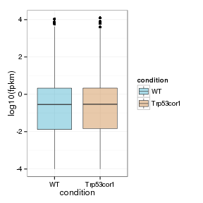
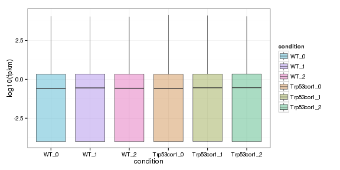
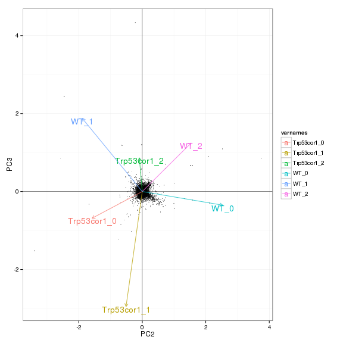
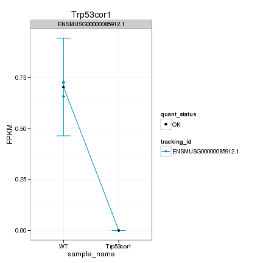
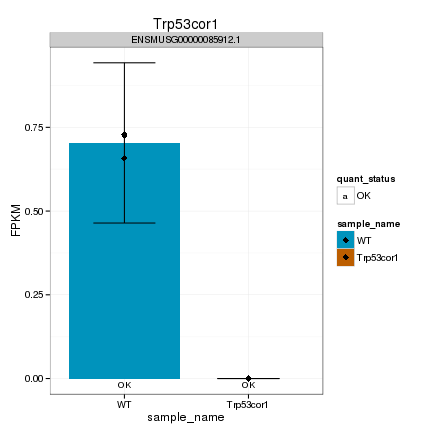
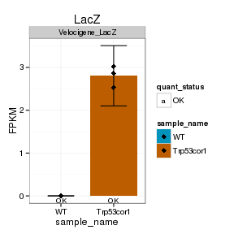
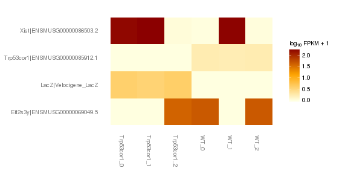
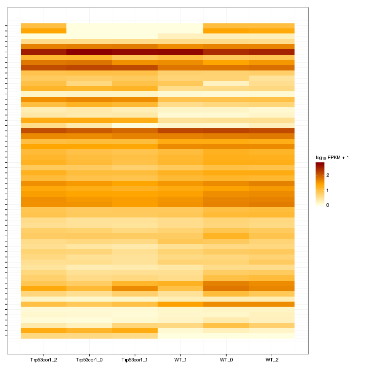

Kdm5c KO vs WT (Adult)
======================================


This file shows the wt-v-ko comparison for Kdm5c. 

Cuff overview:


```
## CuffSet instance with:
## 	 2 samples
## 	 26754 genes
## 	 77524 isoforms
## 	 0 TSS
## 	 23066 CDS
## 	 0 promoters
## 	 0 splicing
## 	 19954 relCDS
```

# QC

## Dispersion

Dispersion plot for genes in cuff:
(Overdispersion can lead to innacurate quants)

 

## Cross-replicate variability (fpkmSCVplot)
Differences in CV 2 can result in lower numbers of differentially expressed genes due to a higher degree of variability between replicate fpkm estimates.

Genes:

 

Isoforms: 

 


## MvA plot


```
## Error: non-numeric argument to binary operator
```
   
### MvA plot counts


```
## Error: non-numeric argument to binary operator
```

## Scatterplot matrix

 

## Distributions

### Boxplots

Boxplot (genes)

 

Boxplot (genes, replicates)

 

Boxplot (isoforms)

 

Boxplot (isoforms, replicates)

 

### Density

Density (genes)

 

Density (genes, replicates)

 


## Clustering

### Replicate Clusters

 

```
## NULL
```

### PCA (genes)

 

### MDS (genes)

 


# KO assessment

## Endogenous lncRNA expression

 

Endogenous expression of Kdm5c isoforms:

 

Barplot of gene expression:

 

Barplot of isoform expression:

 


## LacZ expression

  


## Digital Genotyping (LacZ vs Endogenous lncRNA and Sex)

Eif2s3y is a y-expressed gene, Xist is an x-expressed gene 
Expression plot (endogenous linc, lacZ, Y-expressed gene):

 

Expression heatmap:

 


### Track visualization 


```
## Error: non-character argument
```

```
## Error: error in evaluating the argument 'x' in selecting a method for function 'unlist': Error: object 'positions' not found
```

```
## Error: object 'positions' not found
```

```
## Error: object 'positions' not found
```

```
## Error: object 'koStart' not found
```

# Differential Analysis

## Differential Genes 


There are 113 significantly differentially expressed genes. They are:

<!-- html table generated in R 3.0.2 by xtable 1.7-3 package -->
<!-- Tue Jul  1 18:05:13 2014 -->
<TABLE border=1>
<TR> <TH>  </TH> <TH> geneAnnot$gene_short_name </TH>  </TR>
  <TR> <TD align="right"> 1 </TD> <TD> Ddx3x </TD> </TR>
  <TR> <TD align="right"> 2 </TD> <TD> Col6a1 </TD> </TR>
  <TR> <TD align="right"> 3 </TD> <TD> Klf4 </TD> </TR>
  <TR> <TD align="right"> 4 </TD> <TD> Ranbp2 </TD> </TR>
  <TR> <TD align="right"> 5 </TD> <TD> Fosb </TD> </TR>
  <TR> <TD align="right"> 6 </TD> <TD> Nes </TD> </TR>
  <TR> <TD align="right"> 7 </TD> <TD> Epha2 </TD> </TR>
  <TR> <TD align="right"> 8 </TD> <TD> Rplp1 </TD> </TR>
  <TR> <TD align="right"> 9 </TD> <TD> Arl5b </TD> </TR>
  <TR> <TD align="right"> 10 </TD> <TD> Dusp6 </TD> </TR>
  <TR> <TD align="right"> 11 </TD> <TD> Timp3 </TD> </TR>
  <TR> <TD align="right"> 12 </TD> <TD> Pomc </TD> </TR>
  <TR> <TD align="right"> 13 </TD> <TD> Nfkbia </TD> </TR>
  <TR> <TD align="right"> 14 </TD> <TD> Serpina3n </TD> </TR>
  <TR> <TD align="right"> 15 </TD> <TD> Fos </TD> </TR>
  <TR> <TD align="right"> 16 </TD> <TD> Spry2 </TD> </TR>
  <TR> <TD align="right"> 17 </TD> <TD> Kcnv1 </TD> </TR>
  <TR> <TD align="right"> 18 </TD> <TD> Arc </TD> </TR>
  <TR> <TD align="right"> 19 </TD> <TD> Adamts1 </TD> </TR>
  <TR> <TD align="right"> 20 </TD> <TD> Nr4a1 </TD> </TR>
  <TR> <TD align="right"> 21 </TD> <TD> Cdkn1a </TD> </TR>
  <TR> <TD align="right"> 22 </TD> <TD> Wfdc1 </TD> </TR>
  <TR> <TD align="right"> 23 </TD> <TD> Glo1 </TD> </TR>
  <TR> <TD align="right"> 24 </TD> <TD> Zfp871 </TD> </TR>
  <TR> <TD align="right"> 25 </TD> <TD> Spry4 </TD> </TR>
  <TR> <TD align="right"> 26 </TD> <TD> Kdm5c </TD> </TR>
  <TR> <TD align="right"> 27 </TD> <TD> Rplp2 </TD> </TR>
  <TR> <TD align="right"> 28 </TD> <TD> Slc40a1 </TD> </TR>
  <TR> <TD align="right"> 29 </TD> <TD> Lcn2 </TD> </TR>
  <TR> <TD align="right"> 30 </TD> <TD> Nr4a2 </TD> </TR>
  <TR> <TD align="right"> 31 </TD> <TD> Slc7a11 </TD> </TR>
  <TR> <TD align="right"> 32 </TD> <TD> Cyr61 </TD> </TR>
  <TR> <TD align="right"> 33 </TD> <TD> Nr4a3 </TD> </TR>
  <TR> <TD align="right"> 34 </TD> <TD> Slc2a1 </TD> </TR>
  <TR> <TD align="right"> 35 </TD> <TD> Tinagl1 </TD> </TR>
  <TR> <TD align="right"> 36 </TD> <TD> Fosl2 </TD> </TR>
  <TR> <TD align="right"> 37 </TD> <TD> Adamts9 </TD> </TR>
  <TR> <TD align="right"> 38 </TD> <TD> Clec2d </TD> </TR>
  <TR> <TD align="right"> 39 </TD> <TD> Emp1 </TD> </TR>
  <TR> <TD align="right"> 40 </TD> <TD> Pglyrp1 </TD> </TR>
  <TR> <TD align="right"> 41 </TD> <TD> Zfp719 </TD> </TR>
  <TR> <TD align="right"> 42 </TD> <TD> Hddc3 </TD> </TR>
  <TR> <TD align="right"> 43 </TD> <TD> Polr3e </TD> </TR>
  <TR> <TD align="right"> 44 </TD> <TD> Plat </TD> </TR>
  <TR> <TD align="right"> 45 </TD> <TD> Slc27a1 </TD> </TR>
  <TR> <TD align="right"> 46 </TD> <TD> Ngp </TD> </TR>
  <TR> <TD align="right"> 47 </TD> <TD> 9430020K01Rik </TD> </TR>
  <TR> <TD align="right"> 48 </TD> <TD> Arhgap27 </TD> </TR>
  <TR> <TD align="right"> 49 </TD> <TD> Trim59 </TD> </TR>
  <TR> <TD align="right"> 50 </TD> <TD> Nostrin </TD> </TR>
  <TR> <TD align="right"> 51 </TD> <TD> Dusp5 </TD> </TR>
  <TR> <TD align="right"> 52 </TD> <TD> Eif2s3x </TD> </TR>
  <TR> <TD align="right"> 53 </TD> <TD> Kdm6a </TD> </TR>
  <TR> <TD align="right"> 54 </TD> <TD> Klf10 </TD> </TR>
  <TR> <TD align="right"> 55 </TD> <TD> Rps16 </TD> </TR>
  <TR> <TD align="right"> 56 </TD> <TD> Egr2 </TD> </TR>
  <TR> <TD align="right"> 57 </TD> <TD> Egr1 </TD> </TR>
  <TR> <TD align="right"> 58 </TD> <TD> Akap12 </TD> </TR>
  <TR> <TD align="right"> 59 </TD> <TD> Olig2 </TD> </TR>
  <TR> <TD align="right"> 60 </TD> <TD> St8sia4 </TD> </TR>
  <TR> <TD align="right"> 61 </TD> <TD> Maff </TD> </TR>
  <TR> <TD align="right"> 62 </TD> <TD> Id1 </TD> </TR>
  <TR> <TD align="right"> 63 </TD> <TD> Tuba1c </TD> </TR>
  <TR> <TD align="right"> 64 </TD> <TD> Pura </TD> </TR>
  <TR> <TD align="right"> 65 </TD> <TD> Ctla2a </TD> </TR>
  <TR> <TD align="right"> 66 </TD> <TD> Zfp36 </TD> </TR>
  <TR> <TD align="right"> 67 </TD> <TD> Npas4 </TD> </TR>
  <TR> <TD align="right"> 68 </TD> <TD> Olig1 </TD> </TR>
  <TR> <TD align="right"> 69 </TD> <TD> Plaur </TD> </TR>
  <TR> <TD align="right"> 70 </TD> <TD> Rps8 </TD> </TR>
  <TR> <TD align="right"> 71 </TD> <TD> Tnrc6b </TD> </TR>
  <TR> <TD align="right"> 72 </TD> <TD> Socs4 </TD> </TR>
  <TR> <TD align="right"> 73 </TD> <TD> Bdnf </TD> </TR>
  <TR> <TD align="right"> 74 </TD> <TD> Spty2d1 </TD> </TR>
  <TR> <TD align="right"> 75 </TD> <TD> Pcdh20 </TD> </TR>
  <TR> <TD align="right"> 76 </TD> <TD> Nrros </TD> </TR>
  <TR> <TD align="right"> 77 </TD> <TD> Junb </TD> </TR>
  <TR> <TD align="right"> 78 </TD> <TD> Klf2 </TD> </TR>
  <TR> <TD align="right"> 79 </TD> <TD> Per2 </TD> </TR>
  <TR> <TD align="right"> 80 </TD> <TD> S100a8 </TD> </TR>
  <TR> <TD align="right"> 81 </TD> <TD> S100a9 </TD> </TR>
  <TR> <TD align="right"> 82 </TD> <TD> 1810011O10Rik </TD> </TR>
  <TR> <TD align="right"> 83 </TD> <TD> Zfp658 </TD> </TR>
  <TR> <TD align="right"> 84 </TD> <TD> Kdm5d </TD> </TR>
  <TR> <TD align="right"> 85 </TD> <TD> Rpl36 </TD> </TR>
  <TR> <TD align="right"> 86 </TD> <TD> Zfp874b </TD> </TR>
  <TR> <TD align="right"> 87 </TD> <TD> Tpt1 </TD> </TR>
  <TR> <TD align="right"> 88 </TD> <TD> Klk1b22 </TD> </TR>
  <TR> <TD align="right"> 89 </TD> <TD> B2m </TD> </TR>
  <TR> <TD align="right"> 90 </TD> <TD> Rpl34 </TD> </TR>
  <TR> <TD align="right"> 91 </TD> <TD> Obp2a </TD> </TR>
  <TR> <TD align="right"> 92 </TD> <TD> Aldoart2 </TD> </TR>
  <TR> <TD align="right"> 93 </TD> <TD> BC048507 </TD> </TR>
  <TR> <TD align="right"> 94 </TD> <TD> mt-Co1 </TD> </TR>
  <TR> <TD align="right"> 95 </TD> <TD> Bpifb9b </TD> </TR>
  <TR> <TD align="right"> 96 </TD> <TD> Bpifb3 </TD> </TR>
  <TR> <TD align="right"> 97 </TD> <TD> Bpifb6 </TD> </TR>
  <TR> <TD align="right"> 98 </TD> <TD> Gm11808 </TD> </TR>
  <TR> <TD align="right"> 99 </TD> <TD> Ddx3y </TD> </TR>
  <TR> <TD align="right"> 100 </TD> <TD> Egr4 </TD> </TR>
  <TR> <TD align="right"> 101 </TD> <TD> Fam84b </TD> </TR>
  <TR> <TD align="right"> 102 </TD> <TD> Gm7292 </TD> </TR>
  <TR> <TD align="right"> 103 </TD> <TD> Gm10709 </TD> </TR>
  <TR> <TD align="right"> 104 </TD> <TD> Bpifb4 </TD> </TR>
  <TR> <TD align="right"> 105 </TD> <TD> Xist </TD> </TR>
  <TR> <TD align="right"> 106 </TD> <TD> 5530601H04Rik </TD> </TR>
  <TR> <TD align="right"> 107 </TD> <TD> Gad1-ps </TD> </TR>
  <TR> <TD align="right"> 108 </TD> <TD> Apold1 </TD> </TR>
  <TR> <TD align="right"> 109 </TD> <TD> Myl6 </TD> </TR>
  <TR> <TD align="right"> 110 </TD> <TD> Lrrc32 </TD> </TR>
  <TR> <TD align="right"> 111 </TD> <TD> AA465934 </TD> </TR>
  <TR> <TD align="right"> 112 </TD> <TD> Rpl41 </TD> </TR>
  <TR> <TD align="right"> 113 </TD> <TD> Gm26924 </TD> </TR>
   </TABLE>

### Matrix of gene significant differences between conditions

(skip for Brainmap wt-v-ko comparisons)

 

### Significant gene expression differences between conditions

Expression plot (genes):(turned off)


 

Significant genes with expression >50fpkm (any condition):(turned off)


An individual look at each of the highly expressed significantly differentially regulated genes:
(eval=false for first pass)


### Expression-level/significance relationship

Scatter plot of significant genes only:


```
## Error: One or more values of 'x' or 'y' are not valid sample names!
```

Volcano Plot


```
## Error: One or more values of 'x' or 'y' are not valid sample names!
```

Volcano plot with significant genes only:


```
## Error: One or more values of 'x' or 'y' are not valid sample names!
```

FoldChange Heatmap


```
## Error: undefined columns selected
```


## Differential Splicing

### Differential Isoforms between conditions

Per isoform difference between conditions:

 

These isoforms are:

<!-- html table generated in R 3.0.2 by xtable 1.7-3 package -->
<!-- Tue Jul  1 18:05:59 2014 -->
<TABLE border=1>
<TR> <TH>  </TH> <TH> isoAnnot$gene_short_name </TH>  </TR>
  <TR> <TD align="right"> 1 </TD> <TD> Ddx3x </TD> </TR>
  <TR> <TD align="right"> 2 </TD> <TD> Col6a1 </TD> </TR>
  <TR> <TD align="right"> 3 </TD> <TD> Klf4 </TD> </TR>
  <TR> <TD align="right"> 4 </TD> <TD> Fosb </TD> </TR>
  <TR> <TD align="right"> 5 </TD> <TD> Hif3a </TD> </TR>
  <TR> <TD align="right"> 6 </TD> <TD> Nes </TD> </TR>
  <TR> <TD align="right"> 7 </TD> <TD> Prlr </TD> </TR>
  <TR> <TD align="right"> 8 </TD> <TD> Cyp2a5 </TD> </TR>
  <TR> <TD align="right"> 9 </TD> <TD> Epha2 </TD> </TR>
  <TR> <TD align="right"> 10 </TD> <TD> Zfp655 </TD> </TR>
  <TR> <TD align="right"> 11 </TD> <TD> Rplp1 </TD> </TR>
  <TR> <TD align="right"> 12 </TD> <TD> Arl5b </TD> </TR>
  <TR> <TD align="right"> 13 </TD> <TD> Dusp6 </TD> </TR>
  <TR> <TD align="right"> 14 </TD> <TD> Nfkbia </TD> </TR>
  <TR> <TD align="right"> 15 </TD> <TD> Serpina3n </TD> </TR>
  <TR> <TD align="right"> 16 </TD> <TD> Fos </TD> </TR>
  <TR> <TD align="right"> 17 </TD> <TD> Kcnv1 </TD> </TR>
  <TR> <TD align="right"> 18 </TD> <TD> Arc </TD> </TR>
  <TR> <TD align="right"> 19 </TD> <TD> Adamts1 </TD> </TR>
  <TR> <TD align="right"> 20 </TD> <TD> Nr4a1 </TD> </TR>
  <TR> <TD align="right"> 21 </TD> <TD> Cdkn1a </TD> </TR>
  <TR> <TD align="right"> 22 </TD> <TD> Wfdc1 </TD> </TR>
  <TR> <TD align="right"> 23 </TD> <TD> Glo1 </TD> </TR>
  <TR> <TD align="right"> 24 </TD> <TD> Spry4 </TD> </TR>
  <TR> <TD align="right"> 25 </TD> <TD> Kdm5c </TD> </TR>
  <TR> <TD align="right"> 26 </TD> <TD> Slc40a1 </TD> </TR>
  <TR> <TD align="right"> 27 </TD> <TD> Cyr61 </TD> </TR>
  <TR> <TD align="right"> 28 </TD> <TD> Slc2a1 </TD> </TR>
  <TR> <TD align="right"> 29 </TD> <TD> Tinagl1 </TD> </TR>
  <TR> <TD align="right"> 30 </TD> <TD> Fosl2 </TD> </TR>
  <TR> <TD align="right"> 31 </TD> <TD> Clec2d </TD> </TR>
  <TR> <TD align="right"> 32 </TD> <TD> Emp1 </TD> </TR>
  <TR> <TD align="right"> 33 </TD> <TD> Pglyrp1 </TD> </TR>
  <TR> <TD align="right"> 34 </TD> <TD> Hddc3 </TD> </TR>
  <TR> <TD align="right"> 35 </TD> <TD> 9430020K01Rik </TD> </TR>
  <TR> <TD align="right"> 36 </TD> <TD> Trim59 </TD> </TR>
  <TR> <TD align="right"> 37 </TD> <TD> Nostrin </TD> </TR>
  <TR> <TD align="right"> 38 </TD> <TD> Dusp5 </TD> </TR>
  <TR> <TD align="right"> 39 </TD> <TD> Eif2s3x </TD> </TR>
  <TR> <TD align="right"> 40 </TD> <TD> Midn </TD> </TR>
  <TR> <TD align="right"> 41 </TD> <TD> Smad6 </TD> </TR>
  <TR> <TD align="right"> 42 </TD> <TD> Kdm6a </TD> </TR>
  <TR> <TD align="right"> 43 </TD> <TD> Klf10 </TD> </TR>
  <TR> <TD align="right"> 44 </TD> <TD> Egr2 </TD> </TR>
  <TR> <TD align="right"> 45 </TD> <TD> Egr1 </TD> </TR>
  <TR> <TD align="right"> 46 </TD> <TD> Akap12 </TD> </TR>
  <TR> <TD align="right"> 47 </TD> <TD> Eltd1 </TD> </TR>
  <TR> <TD align="right"> 48 </TD> <TD> Olig2 </TD> </TR>
  <TR> <TD align="right"> 49 </TD> <TD> Id1 </TD> </TR>
  <TR> <TD align="right"> 50 </TD> <TD> Tuba1c </TD> </TR>
  <TR> <TD align="right"> 51 </TD> <TD> Ctla2a </TD> </TR>
  <TR> <TD align="right"> 52 </TD> <TD> Zfp36 </TD> </TR>
  <TR> <TD align="right"> 53 </TD> <TD> Npas4 </TD> </TR>
  <TR> <TD align="right"> 54 </TD> <TD> Olig1 </TD> </TR>
  <TR> <TD align="right"> 55 </TD> <TD> Plaur </TD> </TR>
  <TR> <TD align="right"> 56 </TD> <TD> Socs4 </TD> </TR>
  <TR> <TD align="right"> 57 </TD> <TD> Spty2d1 </TD> </TR>
  <TR> <TD align="right"> 58 </TD> <TD> Junb </TD> </TR>
  <TR> <TD align="right"> 59 </TD> <TD> Klf2 </TD> </TR>
  <TR> <TD align="right"> 60 </TD> <TD> Per2 </TD> </TR>
  <TR> <TD align="right"> 61 </TD> <TD> S100a8 </TD> </TR>
  <TR> <TD align="right"> 62 </TD> <TD> S100a9 </TD> </TR>
  <TR> <TD align="right"> 63 </TD> <TD> 1810011O10Rik </TD> </TR>
  <TR> <TD align="right"> 64 </TD> <TD> Kdm5d </TD> </TR>
  <TR> <TD align="right"> 65 </TD> <TD> Zfp874b </TD> </TR>
  <TR> <TD align="right"> 66 </TD> <TD> Klk1b22 </TD> </TR>
  <TR> <TD align="right"> 67 </TD> <TD> B2m </TD> </TR>
  <TR> <TD align="right"> 68 </TD> <TD> Obp2a </TD> </TR>
  <TR> <TD align="right"> 69 </TD> <TD> Aldoart2 </TD> </TR>
  <TR> <TD align="right"> 70 </TD> <TD> BC048507 </TD> </TR>
  <TR> <TD align="right"> 71 </TD> <TD> mt-Co1 </TD> </TR>
  <TR> <TD align="right"> 72 </TD> <TD> Bpifb3 </TD> </TR>
  <TR> <TD align="right"> 73 </TD> <TD> Gm11808 </TD> </TR>
  <TR> <TD align="right"> 74 </TD> <TD> Ddx3y </TD> </TR>
  <TR> <TD align="right"> 75 </TD> <TD> Egr4 </TD> </TR>
  <TR> <TD align="right"> 76 </TD> <TD> Gm7292 </TD> </TR>
  <TR> <TD align="right"> 77 </TD> <TD> Gm10709 </TD> </TR>
  <TR> <TD align="right"> 78 </TD> <TD> Xist </TD> </TR>
  <TR> <TD align="right"> 79 </TD> <TD> Gad1-ps </TD> </TR>
  <TR> <TD align="right"> 80 </TD> <TD> Apold1 </TD> </TR>
  <TR> <TD align="right"> 81 </TD> <TD> Myl6 </TD> </TR>
  <TR> <TD align="right"> 82 </TD> <TD> Lrrc32 </TD> </TR>
  <TR> <TD align="right"> 83 </TD> <TD> 4930480K23Rik </TD> </TR>
  <TR> <TD align="right"> 84 </TD> <TD> Gm26924 </TD> </TR>
   </TABLE>

Gene-level DE isoform heatmap

 

Isoform foldchange heatmap by isoform:


```
## Error: undefined columns selected
```


### Differential Splicing between conditions

(eval false for first pass)

Per condition differences in isoforms (Does gene have diff piechart between conditions?)


These genes are:


Splicing heatmap by isoform:


Splicing heatmap by gene


The following are significantly differentially spliced genes (relative portion of isoform per condition): 


 


# Gene/Pathway Analysis

## GSEA

Enrichment and zscores are calculated based on expression in KO vs WT (fpkmKO/fpkmWT), so genes that are down regulated in KO are shown in blue, while upregulation is shown in red. 

KO/WT
Blue = down in KO
Red = Up in KO


Biocarta enrichment: 


```
## [1] "Not enough significant categories to print a heatmap!"
```

Biocarta zscore: 


```
## [1] "Not enough significant categories to print a heatmap!"
```


Reactome enrichment: 

 


Reactome zscore: 

 


Kegg enrichment: 

 

Kegg zscore: 

 


## GO enrichment 
Cluster profiler used to call enichments of significantly differentially regulated genes that map to Entrez IDs. 


```
## [1] "ERROR: The estimated pi0 <= 0. Check that you have valid p-values or use another lambda method."
```

     

# Cis vs Trans (locally)

log2 Foldchange and test statistic are calculated with the ratio of fpkm(KO)/fpkm(WT), thus the test_stat is positive if a gene is higher in the KO and negative if a gene has lower expression in the KO


The pvalue for 1 genes significantly regulated in a region this size  is: 1 


 

# Notes

## Samples used are:
<!-- html table generated in R 3.0.2 by xtable 1.7-3 package -->
<!-- Tue Jul  1 18:31:57 2014 -->
<TABLE border=1>
<TR> <TH>  </TH> <TH> 10 </TH>  </TR>
  <TR> <TD align="right"> 1 </TD> <TD> JR728 </TD> </TR>
  <TR> <TD align="right"> 2 </TD> <TD> JR803 </TD> </TR>
  <TR> <TD align="right"> 3 </TD> <TD> JR735 </TD> </TR>
  <TR> <TD align="right"> 4 </TD> <TD> JR781 </TD> </TR>
  <TR> <TD align="right"> 5 </TD> <TD> JR796 </TD> </TR>
  <TR> <TD align="right"> 6 </TD> <TD> JR797 </TD> </TR>
  <TR> <TD align="right"> 7 </TD> <TD> JR800 </TD> </TR>
  <TR> <TD align="right"> 8 </TD> <TD> JR778 </TD> </TR>
  <TR> <TD align="right"> 9 </TD> <TD> JR729 </TD> </TR>
  <TR> <TD align="right"> 10 </TD> <TD> JR740 </TD> </TR>
  <TR> <TD align="right"> 11 </TD> <TD> JR827 </TD> </TR>
  <TR> <TD align="right"> 12 </TD> <TD> JR734 </TD> </TR>
  <TR> <TD align="right"> 13 </TD> <TD> JR802 </TD> </TR>
  <TR> <TD align="right"> 14 </TD> <TD> JR785 </TD> </TR>
   </TABLE>

## Replicates
<!-- html table generated in R 3.0.2 by xtable 1.7-3 package -->
<!-- Tue Jul  1 18:31:57 2014 -->
<TABLE border=1>
<TR> <TH>  </TH> <TH> file </TH> <TH> sample_name </TH> <TH> replicate </TH> <TH> rep_name </TH> <TH> total_mass </TH> <TH> norm_mass </TH> <TH> internal_scale </TH> <TH> external_scale </TH>  </TR>
  <TR> <TD align="right"> 1 </TD> <TD> /n/rinn_data1/seq/lgoff/Projects/BrainMap/data/quants/JR728/abundances.cxb </TD> <TD> MALE </TD> <TD align="right">   0 </TD> <TD> MALE_0 </TD> <TD align="right"> 20329200.00 </TD> <TD align="right"> 34174100.00 </TD> <TD align="right"> 0.59 </TD> <TD align="right"> 1.00 </TD> </TR>
  <TR> <TD align="right"> 2 </TD> <TD> /n/rinn_data1/seq/lgoff/Projects/BrainMap/data/quants/JR803/abundances.cxb </TD> <TD> MALE </TD> <TD align="right">   1 </TD> <TD> MALE_1 </TD> <TD align="right"> 52130400.00 </TD> <TD align="right"> 34174100.00 </TD> <TD align="right"> 1.53 </TD> <TD align="right"> 1.00 </TD> </TR>
  <TR> <TD align="right"> 3 </TD> <TD> /n/rinn_data1/seq/lgoff/Projects/BrainMap/data/quants/JR735/abundances.cxb </TD> <TD> MALE </TD> <TD align="right">   2 </TD> <TD> MALE_2 </TD> <TD align="right"> 34994400.00 </TD> <TD align="right"> 34174100.00 </TD> <TD align="right"> 1.03 </TD> <TD align="right"> 1.00 </TD> </TR>
  <TR> <TD align="right"> 4 </TD> <TD> /n/rinn_data1/seq/lgoff/Projects/BrainMap/data/quants/JR781/abundances.cxb </TD> <TD> MALE </TD> <TD align="right">   3 </TD> <TD> MALE_3 </TD> <TD align="right"> 41538900.00 </TD> <TD align="right"> 34174100.00 </TD> <TD align="right"> 1.22 </TD> <TD align="right"> 1.00 </TD> </TR>
  <TR> <TD align="right"> 5 </TD> <TD> /n/rinn_data1/seq/lgoff/Projects/BrainMap/data/quants/JR796/abundances.cxb </TD> <TD> MALE </TD> <TD align="right">   4 </TD> <TD> MALE_4 </TD> <TD align="right"> 34089000.00 </TD> <TD align="right"> 34174100.00 </TD> <TD align="right"> 0.99 </TD> <TD align="right"> 1.00 </TD> </TR>
  <TR> <TD align="right"> 6 </TD> <TD> /n/rinn_data1/seq/lgoff/Projects/BrainMap/data/quants/JR797/abundances.cxb </TD> <TD> MALE </TD> <TD align="right">   5 </TD> <TD> MALE_5 </TD> <TD align="right"> 28103300.00 </TD> <TD align="right"> 34174100.00 </TD> <TD align="right"> 0.81 </TD> <TD align="right"> 1.00 </TD> </TR>
  <TR> <TD align="right"> 7 </TD> <TD> /n/rinn_data1/seq/lgoff/Projects/BrainMap/data/quants/JR800/abundances.cxb </TD> <TD> MALE </TD> <TD align="right">   6 </TD> <TD> MALE_6 </TD> <TD align="right"> 37012200.00 </TD> <TD align="right"> 34174100.00 </TD> <TD align="right"> 1.08 </TD> <TD align="right"> 1.00 </TD> </TR>
  <TR> <TD align="right"> 8 </TD> <TD> /n/rinn_data1/seq/lgoff/Projects/BrainMap/data/quants/JR778/abundances.cxb </TD> <TD> MALE </TD> <TD align="right">   7 </TD> <TD> MALE_7 </TD> <TD align="right"> 39541900.00 </TD> <TD align="right"> 34174100.00 </TD> <TD align="right"> 1.17 </TD> <TD align="right"> 1.00 </TD> </TR>
  <TR> <TD align="right"> 9 </TD> <TD> /n/rinn_data1/seq/lgoff/Projects/BrainMap/data/quants/JR729/abundances.cxb </TD> <TD> FEMALE </TD> <TD align="right">   0 </TD> <TD> FEMALE_0 </TD> <TD align="right"> 26334400.00 </TD> <TD align="right"> 34174100.00 </TD> <TD align="right"> 0.77 </TD> <TD align="right"> 1.00 </TD> </TR>
  <TR> <TD align="right"> 10 </TD> <TD> /n/rinn_data1/seq/lgoff/Projects/BrainMap/data/quants/JR740/abundances.cxb </TD> <TD> FEMALE </TD> <TD align="right">   1 </TD> <TD> FEMALE_1 </TD> <TD align="right"> 35808200.00 </TD> <TD align="right"> 34174100.00 </TD> <TD align="right"> 1.05 </TD> <TD align="right"> 1.00 </TD> </TR>
  <TR> <TD align="right"> 11 </TD> <TD> /n/rinn_data1/seq/lgoff/Projects/BrainMap/data/quants/JR827/abundances.cxb </TD> <TD> FEMALE </TD> <TD align="right">   2 </TD> <TD> FEMALE_2 </TD> <TD align="right"> 27786600.00 </TD> <TD align="right"> 34174100.00 </TD> <TD align="right"> 0.82 </TD> <TD align="right"> 1.00 </TD> </TR>
  <TR> <TD align="right"> 12 </TD> <TD> /n/rinn_data1/seq/lgoff/Projects/BrainMap/data/quants/JR734/abundances.cxb </TD> <TD> FEMALE </TD> <TD align="right">   3 </TD> <TD> FEMALE_3 </TD> <TD align="right"> 34480600.00 </TD> <TD align="right"> 34174100.00 </TD> <TD align="right"> 1.02 </TD> <TD align="right"> 1.00 </TD> </TR>
  <TR> <TD align="right"> 13 </TD> <TD> /n/rinn_data1/seq/lgoff/Projects/BrainMap/data/quants/JR802/abundances.cxb </TD> <TD> FEMALE </TD> <TD align="right">   4 </TD> <TD> FEMALE_4 </TD> <TD align="right"> 45467400.00 </TD> <TD align="right"> 34174100.00 </TD> <TD align="right"> 1.32 </TD> <TD align="right"> 1.00 </TD> </TR>
  <TR> <TD align="right"> 14 </TD> <TD> /n/rinn_data1/seq/lgoff/Projects/BrainMap/data/quants/JR785/abundances.cxb </TD> <TD> FEMALE </TD> <TD align="right">   5 </TD> <TD> FEMALE_5 </TD> <TD align="right"> 34173600.00 </TD> <TD align="right"> 34174100.00 </TD> <TD align="right"> 0.99 </TD> <TD align="right"> 1.00 </TD> </TR>
   </TABLE>

## Session Info

```
## R version 3.0.2 (2013-09-25)
## Platform: x86_64-unknown-linux-gnu (64-bit)
## 
## locale:
##  [1] LC_CTYPE=en_US.UTF-8       LC_NUMERIC=C              
##  [3] LC_TIME=en_US.UTF-8        LC_COLLATE=en_US.UTF-8    
##  [5] LC_MONETARY=en_US.UTF-8    LC_MESSAGES=en_US.UTF-8   
##  [7] LC_PAPER=en_US.UTF-8       LC_NAME=C                 
##  [9] LC_ADDRESS=C               LC_TELEPHONE=C            
## [11] LC_MEASUREMENT=en_US.UTF-8 LC_IDENTIFICATION=C       
## 
## attached base packages:
## [1] grid      parallel  stats     graphics  grDevices utils     datasets 
## [8] methods   base     
## 
## other attached packages:
##  [1] plyr_1.8.1                         
##  [2] stringr_0.6.2                      
##  [3] seqbias_1.10.0                     
##  [4] BSgenome.Mmusculus.UCSC.mm10_1.3.19
##  [5] BSgenome_1.30.0                    
##  [6] Biostrings_2.30.1                  
##  [7] GO.db_2.10.1                       
##  [8] org.Mm.eg.db_2.10.1                
##  [9] clusterProfiler_1.13.1             
## [10] DOSE_2.0.0                         
## [11] ReactomePA_1.6.1                   
## [12] AnnotationDbi_1.24.0               
## [13] Biobase_2.22.0                     
## [14] mgcv_1.7-29                        
## [15] nlme_3.1-117                       
## [16] RMySQL_0.9-3                       
## [17] RColorBrewer_1.0-5                 
## [18] gridExtra_0.9.1                    
## [19] gtable_0.1.2                       
## [20] marray_1.40.0                      
## [21] gplots_2.13.0                      
## [22] GSA_1.03                           
## [23] limma_3.18.13                      
## [24] xtable_1.7-3                       
## [25] cummeRbund_2.7.2                   
## [26] Gviz_1.6.0                         
## [27] rtracklayer_1.22.7                 
## [28] GenomicRanges_1.14.4               
## [29] XVector_0.2.0                      
## [30] IRanges_1.20.7                     
## [31] fastcluster_1.1.13                 
## [32] reshape2_1.4                       
## [33] ggplot2_1.0.0                      
## [34] RSQLite_0.11.4                     
## [35] DBI_0.2-7                          
## [36] BiocGenerics_0.8.0                 
## [37] knitr_1.6                          
## 
## loaded via a namespace (and not attached):
##  [1] biomaRt_2.18.0         biovizBase_1.10.8      bitops_1.0-6          
##  [4] caTools_1.17           cluster_1.15.2         colorspace_1.2-4      
##  [7] dichromat_2.0-0        digest_0.6.4           DO.db_2.7             
## [10] evaluate_0.5.5         formatR_0.10           Formula_1.1-1         
## [13] gdata_2.13.3           GenomicFeatures_1.14.5 GOSemSim_1.20.3       
## [16] graph_1.40.1           graphite_1.8.1         gtools_3.4.1          
## [19] Hmisc_3.14-4           igraph_0.7.1           KEGG.db_2.10.1        
## [22] KernSmooth_2.23-12     labeling_0.2           lattice_0.20-29       
## [25] latticeExtra_0.6-26    MASS_7.3-33            Matrix_1.1-3          
## [28] munsell_0.4.2          org.Hs.eg.db_2.10.1    proto_0.3-10          
## [31] qvalue_1.36.0          Rcpp_0.11.2            RCurl_1.95-4.1        
## [34] reactome.db_1.46.1     Rsamtools_1.14.3       scales_0.2.4          
## [37] splines_3.0.2          stats4_3.0.2           survival_2.37-7       
## [40] tcltk_3.0.2            tools_3.0.2            XML_3.98-1.1          
## [43] zlibbioc_1.8.0
```

## Run Info

```
##           param
## 1      cmd_line
## 2       version
## 3  SVN_revision
## 4 boost_version
## 5        genome
##                                                                                                                                                                                                                                                                                                                                                                                                                                                                                                                                                                                                                                                                                                                                                                                                                                                                                                                                                                                                                                                                                                                                                                                                                                                                                                          value
## 1 cuffdiff -p 10 -L MALE,FEMALE -o /n/rinn_data1/seq/lgoff/Projects/BrainMap/data/diffs/WT_Adult_Male_v_Female /n/rinn_data1/seq/lgoff/Projects/BrainMap/data/annotation/mm10_gencode_vM2_with_lncRNAs_and_LacZ.gtf /n/rinn_data1/seq/lgoff/Projects/BrainMap/data/quants/JR728/abundances.cxb,/n/rinn_data1/seq/lgoff/Projects/BrainMap/data/quants/JR803/abundances.cxb,/n/rinn_data1/seq/lgoff/Projects/BrainMap/data/quants/JR735/abundances.cxb,/n/rinn_data1/seq/lgoff/Projects/BrainMap/data/quants/JR781/abundances.cxb,/n/rinn_data1/seq/lgoff/Projects/BrainMap/data/quants/JR796/abundances.cxb,/n/rinn_data1/seq/lgoff/Projects/BrainMap/data/quants/JR797/abundances.cxb,/n/rinn_data1/seq/lgoff/Projects/BrainMap/data/quants/JR800/abundances.cxb,/n/rinn_data1/seq/lgoff/Projects/BrainMap/data/quants/JR778/abundances.cxb /n/rinn_data1/seq/lgoff/Projects/BrainMap/data/quants/JR729/abundances.cxb,/n/rinn_data1/seq/lgoff/Projects/BrainMap/data/quants/JR740/abundances.cxb,/n/rinn_data1/seq/lgoff/Projects/BrainMap/data/quants/JR827/abundances.cxb,/n/rinn_data1/seq/lgoff/Projects/BrainMap/data/quants/JR734/abundances.cxb,/n/rinn_data1/seq/lgoff/Projects/BrainMap/data/quants/JR802/abundances.cxb,/n/rinn_data1/seq/lgoff/Projects/BrainMap/data/quants/JR785/abundances.cxb 
## 2                                                                                                                                                                                                                                                                                                                                                                                                                                                                                                                                                                                                                                                                                                                                                                                                                                                                                                                                                                                                                                                                                                                                                                                                                                                                                                        2.2.1
## 3                                                                                                                                                                                                                                                                                                                                                                                                                                                                                                                                                                                                                                                                                                                                                                                                                                                                                                                                                                                                                                                                                                                                                                                                                                                                                                         4237
## 4                                                                                                                                                                                                                                                                                                                                                                                                                                                                                                                                                                                                                                                                                                                                                                                                                                                                                                                                                                                                                                                                                                                                                                                                                                                                                                       104700
## 5                                                                                                                                                                                                                                                                                                                                                                                                                                                                                                                                                                                                                                                                                                                                                                                                                                                                                                                                                                                                                                                                                                                                                                                                                                                                                                         mm10
```


