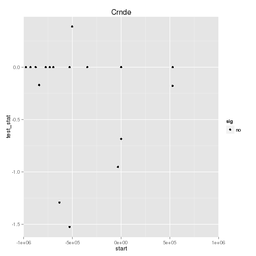

Celrr Adult Cis-v-Trans
========================================================


```r
#source("http://bioconductor.org/biocLite.R")
#biocLite("BSgenome.Mmusculus.UCSC.mm9")
#biocLite("seqbias")
#biocLite("stringr")
#source("http://bioconductor.org/biocLite.R")
#biocLite("BSgenome.Mmusculus.UCSC.mm10")
#biocLite("ggplot2")
#biocLite("rtracklayer")
#biocLite("seqbias")
#biocLite("BiocParallel")
#biocLite("IRanges")

#setup 
library(cummeRbund)
library(BSgenome.Mmusculus.UCSC.mm10)
library(seqbias)
library(stringr)
library(plyr)

myLengths<-seqlengths(Mmusculus)[!grepl("_random",names(seqlengths(Mmusculus)))]
mm10.granges<-GRanges(seqnames = names(myLengths), ranges = IRanges(start = 1, end = myLengths),seqlengths=myLengths)

#Constants
nIter<-1000
windowSize<-2000000
set.seed()
```

```
## Error: argument "seed" is missing, with no default
```

```r
myRandom<-random.intervals(mm10.granges,n=nIter,ms=windowSize)

getTable<-function(object){
  fullTable<-diffTable(genes(object))
  write("First Split",stderr())
  firstSplit<-str_split_fixed(fullTable$locus,":",2)
  write("Second Split",stderr())
  secondSplit<-str_split_fixed(firstSplit[,2],"-",2)
  fullTable$chromosome<-firstSplit[,1]
  fullTable$start<-as.numeric(secondSplit[,1])
  fullTable$end<-as.numeric(secondSplit[,2])
  
  fullTable<-fullTable[fullTable$chromosome %in% names(seqlengths(mm10.granges)),]
  fullTable$chromosome<-factor(fullTable$chromosome, levels=names(seqlengths(mm10.granges)))
  fullTable
}


setwd(dir)
cuff<-readCufflinks()


fullTable<-getTable(cuff)

myGene<-fullTable[which(fullTable$gene_short_name==strain),][1,] #any problems w this?
chromosome<-myGene$chromosome
start<-myGene$start-(windowSize/2)
end<-myGene$end+(windowSize/2)
sigGenesRegion<-fullTable[which(fullTable[,40]==chromosome & fullTable[,39]=="yes" & fullTable[,9]>=start & fullTable[,10]<=end),]
nSig<-nrow(ddply(sigGenesRegion,.(gene_name),head,n=1))

score<-0
signeighbors<-data.frame(rep(NULL,nIter))

#if(nSig==0){nSig<-1} # we know for nSig that one gene is KO. May not show up as differentially
# expressed, but we know it's a differential. And we dont want mu 
# to ever be -1 

for (i in 1:nIter){
  write(i,stderr())
  sigGenesRegion<-fullTable[which(fullTable[,40]==seqnames(myRandom[i])@values & fullTable[,39]=="yes" & fullTable[,9]>=start(myRandom[i])-(windowSize/2) & fullTable[,10]<=end(myRandom[i])+(windowSize/2)),]
  nSigIter<-nrow(ddply(sigGenesRegion,.(gene_name),head,n=1))
  write(nSigIter,stderr())
  if(nSigIter >= nSig-1) {score<-score+1}
  signeighbors[1,i]<-nSigIter
}


#ttest<-t.test(signeighbors,alternative="less",mu=nSig-1)
#pval_for_region<-ttest$p.value
pval_for_region<-score/nIter


#first   question, region enriched over genomic background for cis significance? (pvalue)

#second task:
#plot all genes in region according to start position in region. color code red=yes, black=no

genesInRegion<-fullTable[which(fullTable[,40]==chromosome & fullTable[,9]>=start & fullTable[,10]<=end),]
genesInRegion$start<-myGene$start-genesInRegion$start
colnames(genesInRegion)[39]<-"sig"
colnames(genesInRegion)[35]<-"log2foldchange"
colnames(genesInRegion)[36]<-"test_stat"
data<-ddply(genesInRegion,.(gene_id),head,n=1)
data$test_stat<-as.numeric(data$test_stat)
```

# P-value for 0 DE genes in a region this size in this dataset is: 1 


```r
ggplot(data,aes(start,test_stat,color=sig))+geom_point()+scale_color_manual(values=c("black", "red"))+coord_cartesian(xlim=c(-windowSize/2, windowSize/2))+labs(title=strain)
```

 


