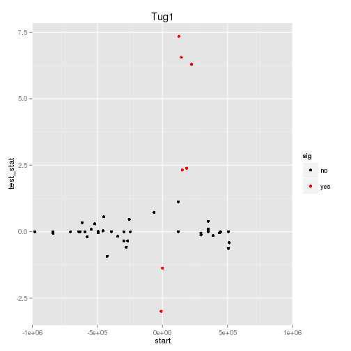
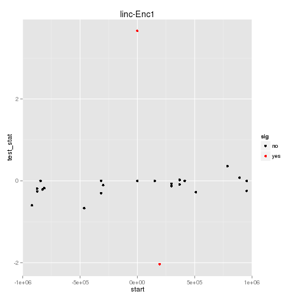

linc-Enc1 Adult Cis-v-Trans
========================================================

```r
path<-paste("figure/",strain,"/",timepoint,"/", sep="")
#cachepath<-paste("cache/",strain,"/",timepoint,"/", sep="")
opts_chunk$set(fig.path=path, echo=FALSE, message=FALSE, warning=FALSE)
```


```
## Error: argument "seed" is missing, with no default
```

 

# P-value for 2 DE genes in a region this size in this dataset is: 0.008 

 


