Kantr KO vs WT (Adult)
======================================


# Intialize


# Design Overview

This file shows the wt-v-ko comparison for Kantr. 

Cuff overview:

```
## CuffSet instance with:
## 	 2 samples
## 	 26754 genes
## 	 77524 isoforms
## 	 0 TSS
## 	 23066 CDS
## 	 0 promoters
## 	 0 splicing
## 	 19954 relCDS
```


# QC

## Dispersion

Dispersion plot for genes in cuff:
(Overdispersion can lead to innacurate quants)

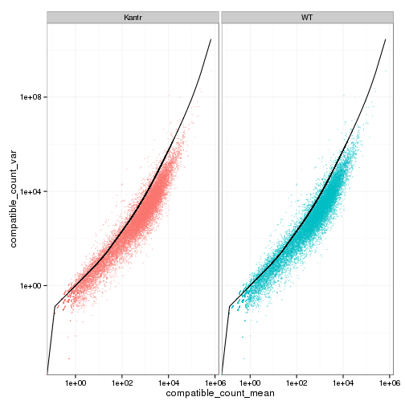 

## Cross-replicate variability (fpkmSCVplot)
Differences in CV 2 can result in lower numbers of differentially expressed genes due to a higher degree of variability between replicate fpkm estimates.

Genes:
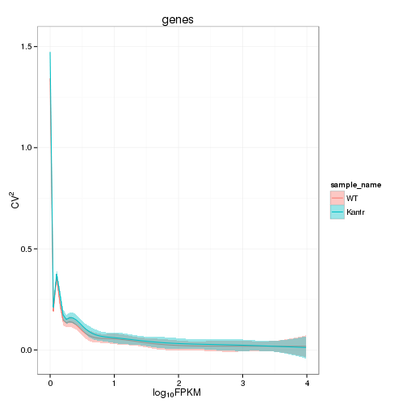 

Isoforms: 
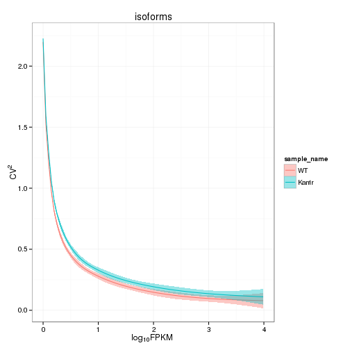 


## MvA plot
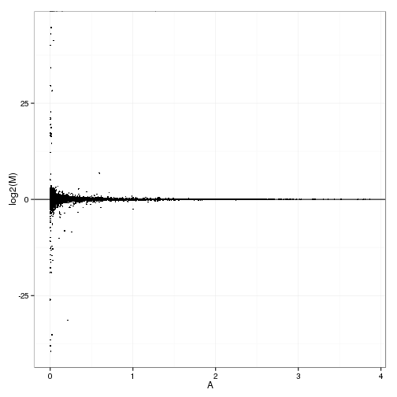 
   
### MvA plot counts
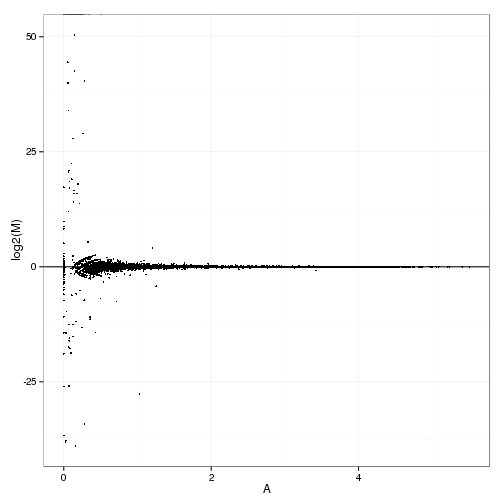 

## Scatterplot matrix
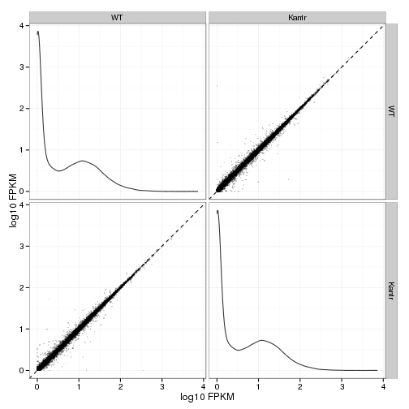 

## Distributions

### Boxplots

Boxplot (genes)

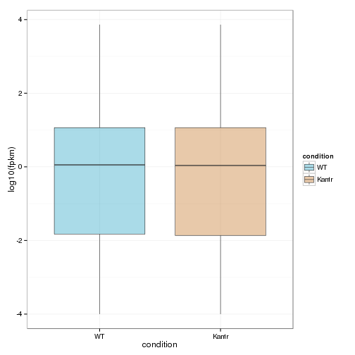 

Boxplot (genes, replicates)

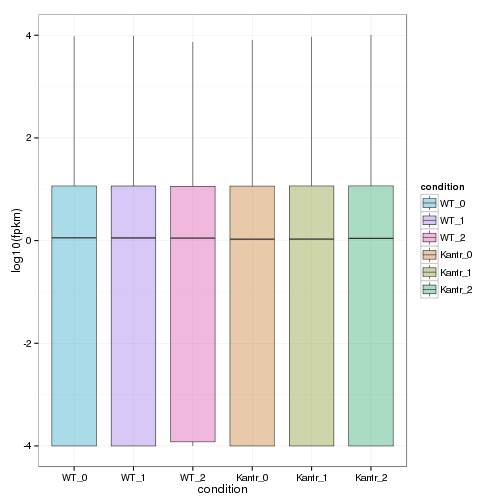 

Boxplot (isoforms)

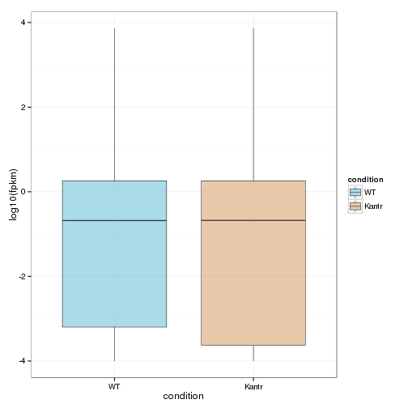 

Boxplot (isoforms, replicates)

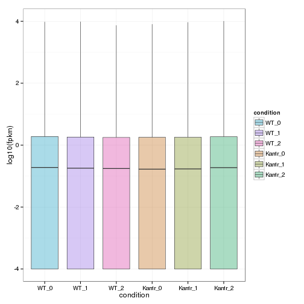 

### Density

Density (genes)

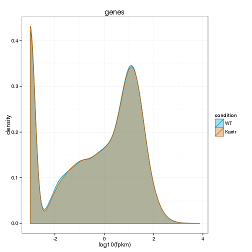 

Density (genes, replicates)

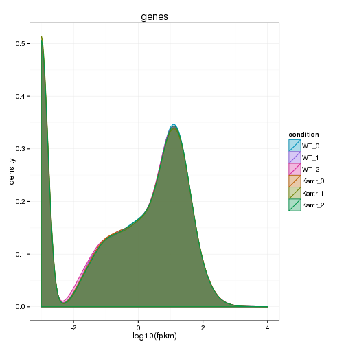 


## Clustering

### Replicate Clusters
 

```
## NULL
```

### PCA (genes)
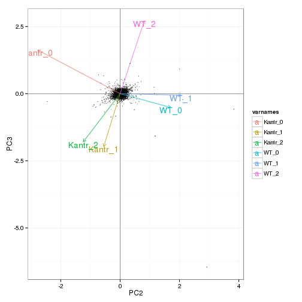 

### MDS (genes)
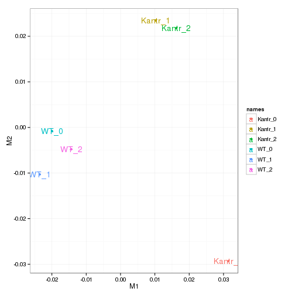 


# KO assessment

## Endogenous lncRNA expression

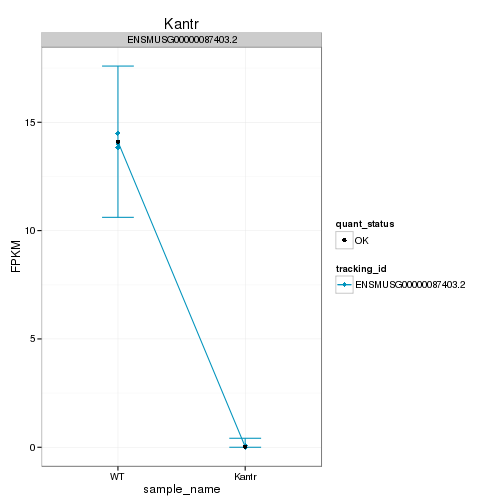 

Endogenous expression of Kantr isoforms:

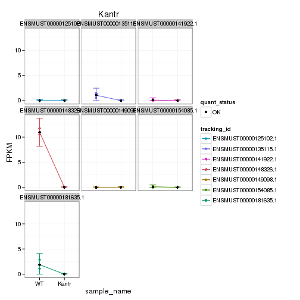 

Barplot of gene expression:

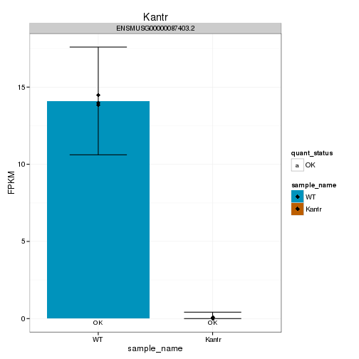 

Barplot of isoform expression:

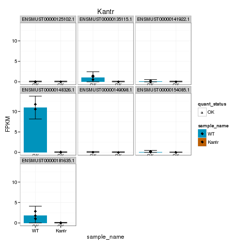 


## LacZ expression

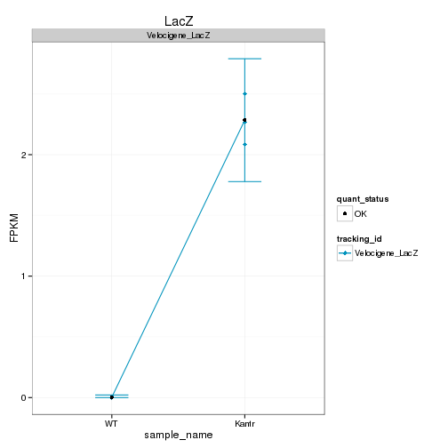 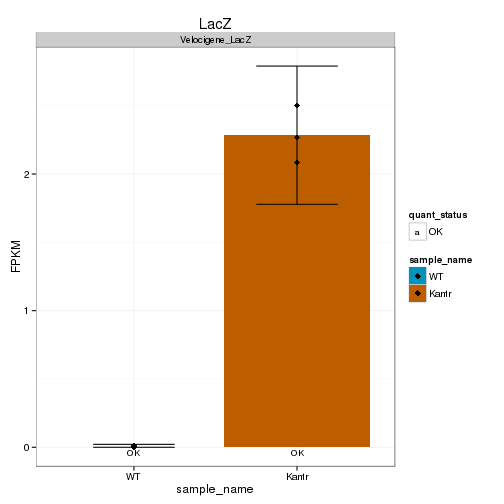 


## Digital Genotyping (LacZ vs Endogenous lncRNA and Sex)
Expression plot (endogenous linc, lacZ, Y-expressed gene):

 

Expression heatmap:
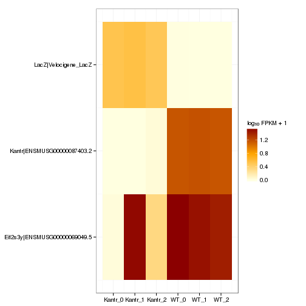 


### Track visualization 

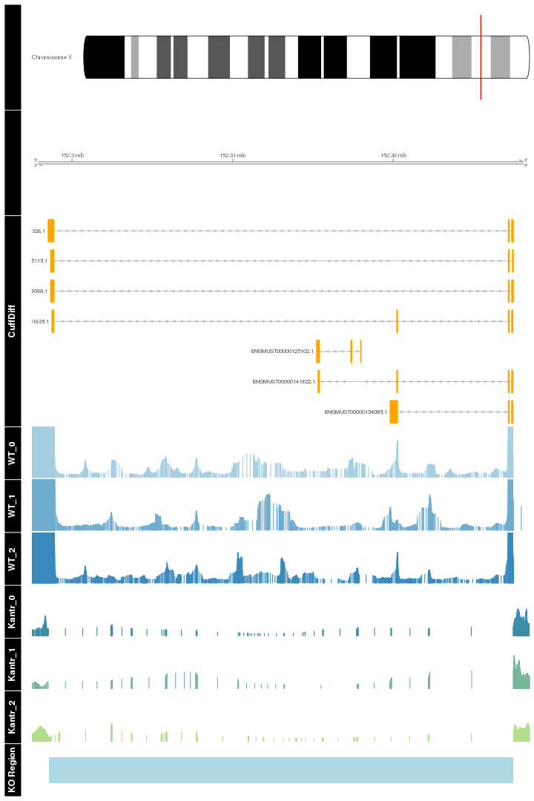 

# Differential Analysis

## Differential Genes 


There are 313 significantly differentially expressed genes. They are:

<!-- html table generated in R 3.0.2 by xtable 1.7-3 package -->
<!-- Wed Jun 25 09:24:55 2014 -->
<TABLE border=1>
<TR> <TH>  </TH> <TH> geneAnnot$gene_short_name </TH>  </TR>
  <TR> <TD align="right"> 1 </TD> <TD> Sox9 </TD> </TR>
  <TR> <TD align="right"> 2 </TD> <TD> Il12rb1 </TD> </TR>
  <TR> <TD align="right"> 3 </TD> <TD> Mmp14 </TD> </TR>
  <TR> <TD align="right"> 4 </TD> <TD> S100a5 </TD> </TR>
  <TR> <TD align="right"> 5 </TD> <TD> N4bp3 </TD> </TR>
  <TR> <TD align="right"> 6 </TD> <TD> Ramp2 </TD> </TR>
  <TR> <TD align="right"> 7 </TD> <TD> Meox1 </TD> </TR>
  <TR> <TD align="right"> 8 </TD> <TD> Gramd3 </TD> </TR>
  <TR> <TD align="right"> 9 </TD> <TD> Plin4 </TD> </TR>
  <TR> <TD align="right"> 10 </TD> <TD> Arrdc2 </TD> </TR>
  <TR> <TD align="right"> 11 </TD> <TD> Fosb </TD> </TR>
  <TR> <TD align="right"> 12 </TD> <TD> Hif3a </TD> </TR>
  <TR> <TD align="right"> 13 </TD> <TD> 9330159F19Rik </TD> </TR>
  <TR> <TD align="right"> 14 </TD> <TD> Cd33 </TD> </TR>
  <TR> <TD align="right"> 15 </TD> <TD> Sh2b2 </TD> </TR>
  <TR> <TD align="right"> 16 </TD> <TD> Osgep </TD> </TR>
  <TR> <TD align="right"> 17 </TD> <TD> Bcl2l1 </TD> </TR>
  <TR> <TD align="right"> 18 </TD> <TD> Dio2 </TD> </TR>
  <TR> <TD align="right"> 19 </TD> <TD> Id3 </TD> </TR>
  <TR> <TD align="right"> 20 </TD> <TD> Fgfrl1 </TD> </TR>
  <TR> <TD align="right"> 21 </TD> <TD> Cd163 </TD> </TR>
  <TR> <TD align="right"> 22 </TD> <TD> Derl3 </TD> </TR>
  <TR> <TD align="right"> 23 </TD> <TD> Gm266 </TD> </TR>
  <TR> <TD align="right"> 24 </TD> <TD> Tjap1 </TD> </TR>
  <TR> <TD align="right"> 25 </TD> <TD> Trpv4 </TD> </TR>
  <TR> <TD align="right"> 26 </TD> <TD> Mertk </TD> </TR>
  <TR> <TD align="right"> 27 </TD> <TD> Gata2 </TD> </TR>
  <TR> <TD align="right"> 28 </TD> <TD> Slc25a13 </TD> </TR>
  <TR> <TD align="right"> 29 </TD> <TD> Cnksr3 </TD> </TR>
  <TR> <TD align="right"> 30 </TD> <TD> Sdc4 </TD> </TR>
  <TR> <TD align="right"> 31 </TD> <TD> Rhbdl3 </TD> </TR>
  <TR> <TD align="right"> 32 </TD> <TD> Ada </TD> </TR>
  <TR> <TD align="right"> 33 </TD> <TD> Med13l </TD> </TR>
  <TR> <TD align="right"> 34 </TD> <TD> Erbb3 </TD> </TR>
  <TR> <TD align="right"> 35 </TD> <TD> Ksr1 </TD> </TR>
  <TR> <TD align="right"> 36 </TD> <TD> Etnppl </TD> </TR>
  <TR> <TD align="right"> 37 </TD> <TD> Pdk4 </TD> </TR>
  <TR> <TD align="right"> 38 </TD> <TD> Lama4 </TD> </TR>
  <TR> <TD align="right"> 39 </TD> <TD> Arid5b </TD> </TR>
  <TR> <TD align="right"> 40 </TD> <TD> Sgk1 </TD> </TR>
  <TR> <TD align="right"> 41 </TD> <TD> Ddit4 </TD> </TR>
  <TR> <TD align="right"> 42 </TD> <TD> Cpm </TD> </TR>
  <TR> <TD align="right"> 43 </TD> <TD> Nipal4 </TD> </TR>
  <TR> <TD align="right"> 44 </TD> <TD> Btg2 </TD> </TR>
  <TR> <TD align="right"> 45 </TD> <TD> Gatsl3 </TD> </TR>
  <TR> <TD align="right"> 46 </TD> <TD> Igfbp3 </TD> </TR>
  <TR> <TD align="right"> 47 </TD> <TD> Pomc </TD> </TR>
  <TR> <TD align="right"> 48 </TD> <TD> Gh </TD> </TR>
  <TR> <TD align="right"> 49 </TD> <TD> Nfkbia </TD> </TR>
  <TR> <TD align="right"> 50 </TD> <TD> Zfp36l1 </TD> </TR>
  <TR> <TD align="right"> 51 </TD> <TD> Net1 </TD> </TR>
  <TR> <TD align="right"> 52 </TD> <TD> Fos </TD> </TR>
  <TR> <TD align="right"> 53 </TD> <TD> Dapk1 </TD> </TR>
  <TR> <TD align="right"> 54 </TD> <TD> Elovl7 </TD> </TR>
  <TR> <TD align="right"> 55 </TD> <TD> 4930452B06Rik </TD> </TR>
  <TR> <TD align="right"> 56 </TD> <TD> Fst </TD> </TR>
  <TR> <TD align="right"> 57 </TD> <TD> Ldb3 </TD> </TR>
  <TR> <TD align="right"> 58 </TD> <TD> Galnt15 </TD> </TR>
  <TR> <TD align="right"> 59 </TD> <TD> Sema3g </TD> </TR>
  <TR> <TD align="right"> 60 </TD> <TD> Ednrb </TD> </TR>
  <TR> <TD align="right"> 61 </TD> <TD> Psmb5 </TD> </TR>
  <TR> <TD align="right"> 62 </TD> <TD> Fzd6 </TD> </TR>
  <TR> <TD align="right"> 63 </TD> <TD> Slc38a2 </TD> </TR>
  <TR> <TD align="right"> 64 </TD> <TD> Bcl6 </TD> </TR>
  <TR> <TD align="right"> 65 </TD> <TD> Crebbp </TD> </TR>
  <TR> <TD align="right"> 66 </TD> <TD> Arc </TD> </TR>
  <TR> <TD align="right"> 67 </TD> <TD> Nde1 </TD> </TR>
  <TR> <TD align="right"> 68 </TD> <TD> Adamts1 </TD> </TR>
  <TR> <TD align="right"> 69 </TD> <TD> Nr4a1 </TD> </TR>
  <TR> <TD align="right"> 70 </TD> <TD> Cdkn1a </TD> </TR>
  <TR> <TD align="right"> 71 </TD> <TD> Tmem52 </TD> </TR>
  <TR> <TD align="right"> 72 </TD> <TD> Clic5 </TD> </TR>
  <TR> <TD align="right"> 73 </TD> <TD> Trem2 </TD> </TR>
  <TR> <TD align="right"> 74 </TD> <TD> Glo1 </TD> </TR>
  <TR> <TD align="right"> 75 </TD> <TD> Sik1 </TD> </TR>
  <TR> <TD align="right"> 76 </TD> <TD> Xdh </TD> </TR>
  <TR> <TD align="right"> 77 </TD> <TD> Atp6v0c </TD> </TR>
  <TR> <TD align="right"> 78 </TD> <TD> Tekt4 </TD> </TR>
  <TR> <TD align="right"> 79 </TD> <TD> Dusp1 </TD> </TR>
  <TR> <TD align="right"> 80 </TD> <TD> Fkbp5 </TD> </TR>
  <TR> <TD align="right"> 81 </TD> <TD> Nedd4l </TD> </TR>
  <TR> <TD align="right"> 82 </TD> <TD> Cd74 </TD> </TR>
  <TR> <TD align="right"> 83 </TD> <TD> Pdgfrb </TD> </TR>
  <TR> <TD align="right"> 84 </TD> <TD> Rab3il1 </TD> </TR>
  <TR> <TD align="right"> 85 </TD> <TD> Fas </TD> </TR>
  <TR> <TD align="right"> 86 </TD> <TD> Frmd8 </TD> </TR>
  <TR> <TD align="right"> 87 </TD> <TD> Hhex </TD> </TR>
  <TR> <TD align="right"> 88 </TD> <TD> Atp10a </TD> </TR>
  <TR> <TD align="right"> 89 </TD> <TD> Kdm5c </TD> </TR>
  <TR> <TD align="right"> 90 </TD> <TD> Pnpla2 </TD> </TR>
  <TR> <TD align="right"> 91 </TD> <TD> D3Ertd751e </TD> </TR>
  <TR> <TD align="right"> 92 </TD> <TD> Sgk3 </TD> </TR>
  <TR> <TD align="right"> 93 </TD> <TD> Paqr8 </TD> </TR>
  <TR> <TD align="right"> 94 </TD> <TD> Slc40a1 </TD> </TR>
  <TR> <TD align="right"> 95 </TD> <TD> Il1r1 </TD> </TR>
  <TR> <TD align="right"> 96 </TD> <TD> 2810459M11Rik </TD> </TR>
  <TR> <TD align="right"> 97 </TD> <TD> Myoc </TD> </TR>
  <TR> <TD align="right"> 98 </TD> <TD> Lcn2 </TD> </TR>
  <TR> <TD align="right"> 99 </TD> <TD> Col5a1 </TD> </TR>
  <TR> <TD align="right"> 100 </TD> <TD> Depdc7 </TD> </TR>
  <TR> <TD align="right"> 101 </TD> <TD> Dll4 </TD> </TR>
  <TR> <TD align="right"> 102 </TD> <TD> Bpifa1 </TD> </TR>
  <TR> <TD align="right"> 103 </TD> <TD> Phactr3 </TD> </TR>
  <TR> <TD align="right"> 104 </TD> <TD> Fam83d </TD> </TR>
  <TR> <TD align="right"> 105 </TD> <TD> Anxa5 </TD> </TR>
  <TR> <TD align="right"> 106 </TD> <TD> Exosc9 </TD> </TR>
  <TR> <TD align="right"> 107 </TD> <TD> Dclre1b </TD> </TR>
  <TR> <TD align="right"> 108 </TD> <TD> Tmem144 </TD> </TR>
  <TR> <TD align="right"> 109 </TD> <TD> Cyr61 </TD> </TR>
  <TR> <TD align="right"> 110 </TD> <TD> Trp53inp1 </TD> </TR>
  <TR> <TD align="right"> 111 </TD> <TD> Gbp3 </TD> </TR>
  <TR> <TD align="right"> 112 </TD> <TD> Gbp2 </TD> </TR>
  <TR> <TD align="right"> 113 </TD> <TD> Nr4a3 </TD> </TR>
  <TR> <TD align="right"> 114 </TD> <TD> Slc44a5 </TD> </TR>
  <TR> <TD align="right"> 115 </TD> <TD> Rps6 </TD> </TR>
  <TR> <TD align="right"> 116 </TD> <TD> Slc2a1 </TD> </TR>
  <TR> <TD align="right"> 117 </TD> <TD> Mfsd2a </TD> </TR>
  <TR> <TD align="right"> 118 </TD> <TD> Alpl </TD> </TR>
  <TR> <TD align="right"> 119 </TD> <TD> Tinagl1 </TD> </TR>
  <TR> <TD align="right"> 120 </TD> <TD> Map3k6 </TD> </TR>
  <TR> <TD align="right"> 121 </TD> <TD> Errfi1 </TD> </TR>
  <TR> <TD align="right"> 122 </TD> <TD> Ugt2a1 </TD> </TR>
  <TR> <TD align="right"> 123 </TD> <TD> Gbp9 </TD> </TR>
  <TR> <TD align="right"> 124 </TD> <TD> Aff1 </TD> </TR>
  <TR> <TD align="right"> 125 </TD> <TD> Rasgef1b </TD> </TR>
  <TR> <TD align="right"> 126 </TD> <TD> Bmp3 </TD> </TR>
  <TR> <TD align="right"> 127 </TD> <TD> Uncx </TD> </TR>
  <TR> <TD align="right"> 128 </TD> <TD> Lfng </TD> </TR>
  <TR> <TD align="right"> 129 </TD> <TD> Nfe2l3 </TD> </TR>
  <TR> <TD align="right"> 130 </TD> <TD> Gkn3 </TD> </TR>
  <TR> <TD align="right"> 131 </TD> <TD> Klf15 </TD> </TR>
  <TR> <TD align="right"> 132 </TD> <TD> Lag3 </TD> </TR>
  <TR> <TD align="right"> 133 </TD> <TD> Clec2d </TD> </TR>
  <TR> <TD align="right"> 134 </TD> <TD> Adipor2 </TD> </TR>
  <TR> <TD align="right"> 135 </TD> <TD> Dusp16 </TD> </TR>
  <TR> <TD align="right"> 136 </TD> <TD> Vgll4 </TD> </TR>
  <TR> <TD align="right"> 137 </TD> <TD> Rhpn2 </TD> </TR>
  <TR> <TD align="right"> 138 </TD> <TD> Sult1a1 </TD> </TR>
  <TR> <TD align="right"> 139 </TD> <TD> Lyve1 </TD> </TR>
  <TR> <TD align="right"> 140 </TD> <TD> Cckbr </TD> </TR>
  <TR> <TD align="right"> 141 </TD> <TD> Slc38a5 </TD> </TR>
  <TR> <TD align="right"> 142 </TD> <TD> Tsc22d3 </TD> </TR>
  <TR> <TD align="right"> 143 </TD> <TD> Plat </TD> </TR>
  <TR> <TD align="right"> 144 </TD> <TD> Sall1 </TD> </TR>
  <TR> <TD align="right"> 145 </TD> <TD> Gpt2 </TD> </TR>
  <TR> <TD align="right"> 146 </TD> <TD> Gab1 </TD> </TR>
  <TR> <TD align="right"> 147 </TD> <TD> Mt2 </TD> </TR>
  <TR> <TD align="right"> 148 </TD> <TD> Mt1 </TD> </TR>
  <TR> <TD align="right"> 149 </TD> <TD> Cmtm3 </TD> </TR>
  <TR> <TD align="right"> 150 </TD> <TD> Ets1 </TD> </TR>
  <TR> <TD align="right"> 151 </TD> <TD> Mcam </TD> </TR>
  <TR> <TD align="right"> 152 </TD> <TD> Ldlr </TD> </TR>
  <TR> <TD align="right"> 153 </TD> <TD> Paqr5 </TD> </TR>
  <TR> <TD align="right"> 154 </TD> <TD> Igdcc3 </TD> </TR>
  <TR> <TD align="right"> 155 </TD> <TD> Heyl </TD> </TR>
  <TR> <TD align="right"> 156 </TD> <TD> Gng11 </TD> </TR>
  <TR> <TD align="right"> 157 </TD> <TD> Alox12b </TD> </TR>
  <TR> <TD align="right"> 158 </TD> <TD> Slc16a1 </TD> </TR>
  <TR> <TD align="right"> 159 </TD> <TD> Sox10 </TD> </TR>
  <TR> <TD align="right"> 160 </TD> <TD> Tbc1d4 </TD> </TR>
  <TR> <TD align="right"> 161 </TD> <TD> Tlr13 </TD> </TR>
  <TR> <TD align="right"> 162 </TD> <TD> Ston1 </TD> </TR>
  <TR> <TD align="right"> 163 </TD> <TD> Klf9 </TD> </TR>
  <TR> <TD align="right"> 164 </TD> <TD> Trim36 </TD> </TR>
  <TR> <TD align="right"> 165 </TD> <TD> Neu4 </TD> </TR>
  <TR> <TD align="right"> 166 </TD> <TD> Igsf9b </TD> </TR>
  <TR> <TD align="right"> 167 </TD> <TD> Trim59 </TD> </TR>
  <TR> <TD align="right"> 168 </TD> <TD> Cbl </TD> </TR>
  <TR> <TD align="right"> 169 </TD> <TD> Pla2g3 </TD> </TR>
  <TR> <TD align="right"> 170 </TD> <TD> Nostrin </TD> </TR>
  <TR> <TD align="right"> 171 </TD> <TD> Fam214a </TD> </TR>
  <TR> <TD align="right"> 172 </TD> <TD> Eva1a </TD> </TR>
  <TR> <TD align="right"> 173 </TD> <TD> Lars2 </TD> </TR>
  <TR> <TD align="right"> 174 </TD> <TD> Tmem98 </TD> </TR>
  <TR> <TD align="right"> 175 </TD> <TD> Prr5 </TD> </TR>
  <TR> <TD align="right"> 176 </TD> <TD> Tmem260 </TD> </TR>
  <TR> <TD align="right"> 177 </TD> <TD> Micall2 </TD> </TR>
  <TR> <TD align="right"> 178 </TD> <TD> Kirrel2 </TD> </TR>
  <TR> <TD align="right"> 179 </TD> <TD> Tenc1 </TD> </TR>
  <TR> <TD align="right"> 180 </TD> <TD> Ppp1r14a </TD> </TR>
  <TR> <TD align="right"> 181 </TD> <TD> Mxd4 </TD> </TR>
  <TR> <TD align="right"> 182 </TD> <TD> Galnt6 </TD> </TR>
  <TR> <TD align="right"> 183 </TD> <TD> Uvssa </TD> </TR>
  <TR> <TD align="right"> 184 </TD> <TD> Slc30a1 </TD> </TR>
  <TR> <TD align="right"> 185 </TD> <TD> Avp </TD> </TR>
  <TR> <TD align="right"> 186 </TD> <TD> Dzip1l </TD> </TR>
  <TR> <TD align="right"> 187 </TD> <TD> Egr2 </TD> </TR>
  <TR> <TD align="right"> 188 </TD> <TD> Smim3 </TD> </TR>
  <TR> <TD align="right"> 189 </TD> <TD> Foxf2 </TD> </TR>
  <TR> <TD align="right"> 190 </TD> <TD> Egr1 </TD> </TR>
  <TR> <TD align="right"> 191 </TD> <TD> Olfml2b </TD> </TR>
  <TR> <TD align="right"> 192 </TD> <TD> Atp5l </TD> </TR>
  <TR> <TD align="right"> 193 </TD> <TD> Mboat1 </TD> </TR>
  <TR> <TD align="right"> 194 </TD> <TD> Pcsk1n </TD> </TR>
  <TR> <TD align="right"> 195 </TD> <TD> Tnfsf10 </TD> </TR>
  <TR> <TD align="right"> 196 </TD> <TD> Hlx </TD> </TR>
  <TR> <TD align="right"> 197 </TD> <TD> Atp8b1 </TD> </TR>
  <TR> <TD align="right"> 198 </TD> <TD> Zfp189 </TD> </TR>
  <TR> <TD align="right"> 199 </TD> <TD> Gpr37 </TD> </TR>
  <TR> <TD align="right"> 200 </TD> <TD> Spsb1 </TD> </TR>
  <TR> <TD align="right"> 201 </TD> <TD> Gbp5 </TD> </TR>
  <TR> <TD align="right"> 202 </TD> <TD> Cables1 </TD> </TR>
  <TR> <TD align="right"> 203 </TD> <TD> Nkx6-2 </TD> </TR>
  <TR> <TD align="right"> 204 </TD> <TD> Cldn5 </TD> </TR>
  <TR> <TD align="right"> 205 </TD> <TD> Syt15 </TD> </TR>
  <TR> <TD align="right"> 206 </TD> <TD> Cdc42ep4 </TD> </TR>
  <TR> <TD align="right"> 207 </TD> <TD> Pkp2 </TD> </TR>
  <TR> <TD align="right"> 208 </TD> <TD> Klhl6 </TD> </TR>
  <TR> <TD align="right"> 209 </TD> <TD> Gjc2 </TD> </TR>
  <TR> <TD align="right"> 210 </TD> <TD> Dmrta1 </TD> </TR>
  <TR> <TD align="right"> 211 </TD> <TD> Zfp488 </TD> </TR>
  <TR> <TD align="right"> 212 </TD> <TD> Tlr7 </TD> </TR>
  <TR> <TD align="right"> 213 </TD> <TD> Serpinb1a </TD> </TR>
  <TR> <TD align="right"> 214 </TD> <TD> Rassf9 </TD> </TR>
  <TR> <TD align="right"> 215 </TD> <TD> S1pr5 </TD> </TR>
  <TR> <TD align="right"> 216 </TD> <TD> Cirbp </TD> </TR>
  <TR> <TD align="right"> 217 </TD> <TD> Insig1 </TD> </TR>
  <TR> <TD align="right"> 218 </TD> <TD> Zfp36l2 </TD> </TR>
  <TR> <TD align="right"> 219 </TD> <TD> Npas4 </TD> </TR>
  <TR> <TD align="right"> 220 </TD> <TD> Clec14a </TD> </TR>
  <TR> <TD align="right"> 221 </TD> <TD> Gjb2 </TD> </TR>
  <TR> <TD align="right"> 222 </TD> <TD> Hmga1 </TD> </TR>
  <TR> <TD align="right"> 223 </TD> <TD> Kcne4 </TD> </TR>
  <TR> <TD align="right"> 224 </TD> <TD> Gjb1 </TD> </TR>
  <TR> <TD align="right"> 225 </TD> <TD> Kmt2d </TD> </TR>
  <TR> <TD align="right"> 226 </TD> <TD> Ccdc6 </TD> </TR>
  <TR> <TD align="right"> 227 </TD> <TD> Dact2 </TD> </TR>
  <TR> <TD align="right"> 228 </TD> <TD> Acap2 </TD> </TR>
  <TR> <TD align="right"> 229 </TD> <TD> Cdc42ep1 </TD> </TR>
  <TR> <TD align="right"> 230 </TD> <TD> Cyp2g1 </TD> </TR>
  <TR> <TD align="right"> 231 </TD> <TD> Rasd1 </TD> </TR>
  <TR> <TD align="right"> 232 </TD> <TD> Opalin </TD> </TR>
  <TR> <TD align="right"> 233 </TD> <TD> Fzd2 </TD> </TR>
  <TR> <TD align="right"> 234 </TD> <TD> Ppp1r3g </TD> </TR>
  <TR> <TD align="right"> 235 </TD> <TD> Plekho2 </TD> </TR>
  <TR> <TD align="right"> 236 </TD> <TD> Hs3st1 </TD> </TR>
  <TR> <TD align="right"> 237 </TD> <TD> Olfml1 </TD> </TR>
  <TR> <TD align="right"> 238 </TD> <TD> Islr2 </TD> </TR>
  <TR> <TD align="right"> 239 </TD> <TD> Gfod1 </TD> </TR>
  <TR> <TD align="right"> 240 </TD> <TD> BC068281 </TD> </TR>
  <TR> <TD align="right"> 241 </TD> <TD> Klf13 </TD> </TR>
  <TR> <TD align="right"> 242 </TD> <TD> Hbb-y </TD> </TR>
  <TR> <TD align="right"> 243 </TD> <TD> Gpr17 </TD> </TR>
  <TR> <TD align="right"> 244 </TD> <TD> Hbb-bs </TD> </TR>
  <TR> <TD align="right"> 245 </TD> <TD> Nrros </TD> </TR>
  <TR> <TD align="right"> 246 </TD> <TD> Jun </TD> </TR>
  <TR> <TD align="right"> 247 </TD> <TD> Junb </TD> </TR>
  <TR> <TD align="right"> 248 </TD> <TD> Creb5 </TD> </TR>
  <TR> <TD align="right"> 249 </TD> <TD> Myh7 </TD> </TR>
  <TR> <TD align="right"> 250 </TD> <TD> Ier2 </TD> </TR>
  <TR> <TD align="right"> 251 </TD> <TD> Iigp1 </TD> </TR>
  <TR> <TD align="right"> 252 </TD> <TD> Lifr </TD> </TR>
  <TR> <TD align="right"> 253 </TD> <TD> Kcnn2 </TD> </TR>
  <TR> <TD align="right"> 254 </TD> <TD> Lrrc8c </TD> </TR>
  <TR> <TD align="right"> 255 </TD> <TD> Zcchc24 </TD> </TR>
  <TR> <TD align="right"> 256 </TD> <TD> Per2 </TD> </TR>
  <TR> <TD align="right"> 257 </TD> <TD> S100a9 </TD> </TR>
  <TR> <TD align="right"> 258 </TD> <TD> 1810011O10Rik </TD> </TR>
  <TR> <TD align="right"> 259 </TD> <TD> Kdm5d </TD> </TR>
  <TR> <TD align="right"> 260 </TD> <TD> Chsy3 </TD> </TR>
  <TR> <TD align="right"> 261 </TD> <TD> Sclt1 </TD> </TR>
  <TR> <TD align="right"> 262 </TD> <TD> Zbtb40 </TD> </TR>
  <TR> <TD align="right"> 263 </TD> <TD> Rpl26 </TD> </TR>
  <TR> <TD align="right"> 264 </TD> <TD> Cox5b </TD> </TR>
  <TR> <TD align="right"> 265 </TD> <TD> Ksr2 </TD> </TR>
  <TR> <TD align="right"> 266 </TD> <TD> Kdr </TD> </TR>
  <TR> <TD align="right"> 267 </TD> <TD> D630045J12Rik </TD> </TR>
  <TR> <TD align="right"> 268 </TD> <TD> Phactr4 </TD> </TR>
  <TR> <TD align="right"> 269 </TD> <TD> Zbtb16 </TD> </TR>
  <TR> <TD align="right"> 270 </TD> <TD> Ppp1r3c </TD> </TR>
  <TR> <TD align="right"> 271 </TD> <TD> Uty </TD> </TR>
  <TR> <TD align="right"> 272 </TD> <TD> Il3ra </TD> </TR>
  <TR> <TD align="right"> 273 </TD> <TD> Ddx3y </TD> </TR>
  <TR> <TD align="right"> 274 </TD> <TD> Eif2s3y </TD> </TR>
  <TR> <TD align="right"> 275 </TD> <TD> Ahnak </TD> </TR>
  <TR> <TD align="right"> 276 </TD> <TD> Hba-a1 </TD> </TR>
  <TR> <TD align="right"> 277 </TD> <TD> 1700084C01Rik </TD> </TR>
  <TR> <TD align="right"> 278 </TD> <TD> Rasgrp3 </TD> </TR>
  <TR> <TD align="right"> 279 </TD> <TD> Jund </TD> </TR>
  <TR> <TD align="right"> 280 </TD> <TD> Egr4 </TD> </TR>
  <TR> <TD align="right"> 281 </TD> <TD> Ccnb1ip1 </TD> </TR>
  <TR> <TD align="right"> 282 </TD> <TD> Ppia </TD> </TR>
  <TR> <TD align="right"> 283 </TD> <TD> Ppp1r3e </TD> </TR>
  <TR> <TD align="right"> 284 </TD> <TD> Gm7292 </TD> </TR>
  <TR> <TD align="right"> 285 </TD> <TD> H2-Bl </TD> </TR>
  <TR> <TD align="right"> 286 </TD> <TD> H2-Ab1 </TD> </TR>
  <TR> <TD align="right"> 287 </TD> <TD> Tmem88b </TD> </TR>
  <TR> <TD align="right"> 288 </TD> <TD> Hbb-bt </TD> </TR>
  <TR> <TD align="right"> 289 </TD> <TD> Plekhf1 </TD> </TR>
  <TR> <TD align="right"> 290 </TD> <TD> Adh1 </TD> </TR>
  <TR> <TD align="right"> 291 </TD> <TD> Sox2 </TD> </TR>
  <TR> <TD align="right"> 292 </TD> <TD> Bpifb4 </TD> </TR>
  <TR> <TD align="right"> 293 </TD> <TD> B3galt5 </TD> </TR>
  <TR> <TD align="right"> 294 </TD> <TD> Nrarp </TD> </TR>
  <TR> <TD align="right"> 295 </TD> <TD> Gm17414 </TD> </TR>
  <TR> <TD align="right"> 296 </TD> <TD> Gbp4 </TD> </TR>
  <TR> <TD align="right"> 297 </TD> <TD> Gm15631 </TD> </TR>
  <TR> <TD align="right"> 298 </TD> <TD> Xist </TD> </TR>
  <TR> <TD align="right"> 299 </TD> <TD> BC064078 </TD> </TR>
  <TR> <TD align="right"> 300 </TD> <TD> Slc5a3 </TD> </TR>
  <TR> <TD align="right"> 301 </TD> <TD> Apold1 </TD> </TR>
  <TR> <TD align="right"> 302 </TD> <TD> Sox2ot </TD> </TR>
  <TR> <TD align="right"> 303 </TD> <TD> Myl6 </TD> </TR>
  <TR> <TD align="right"> 304 </TD> <TD> A930018M24Rik </TD> </TR>
  <TR> <TD align="right"> 305 </TD> <TD> Gm3739 </TD> </TR>
  <TR> <TD align="right"> 306 </TD> <TD> Neat1 </TD> </TR>
  <TR> <TD align="right"> 307 </TD> <TD> Gm10406 </TD> </TR>
  <TR> <TD align="right"> 308 </TD> <TD> Gm7094 </TD> </TR>
  <TR> <TD align="right"> 309 </TD> <TD> Fam181a </TD> </TR>
  <TR> <TD align="right"> 310 </TD> <TD> 4732491K20Rik </TD> </TR>
  <TR> <TD align="right"> 311 </TD> <TD> Gm26782 </TD> </TR>
  <TR> <TD align="right"> 312 </TD> <TD> Bin2 </TD> </TR>
  <TR> <TD align="right"> 313 </TD> <TD> Gm26924 </TD> </TR>
   </TABLE>

### Matrix of gene significant differences between conditions

(skip for Brainmap wt-v-ko comparisons)

 

### Significant gene expression differences between conditions

Expression plot (genes):

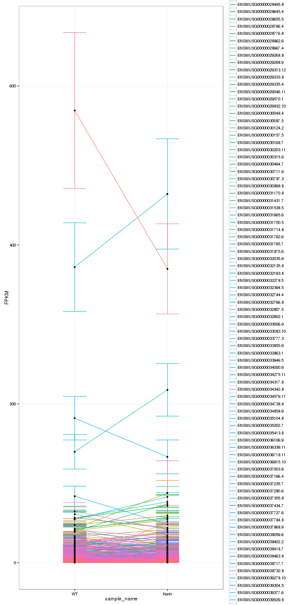 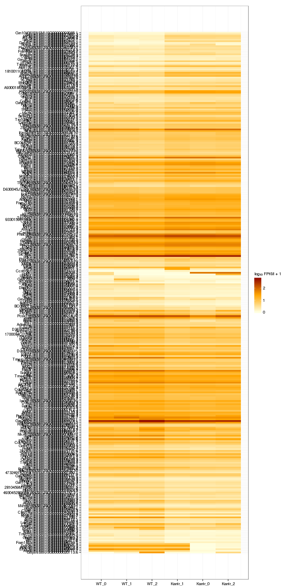 

Significant genes with expression >50fpkm (any condition):

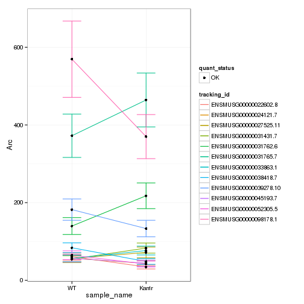 

An individual look at each of the highly expressed significantly differentially regulated genes:
(eval=false for first pass)


### Expression-level/significance relationship

Scatter plot of significant genes only:

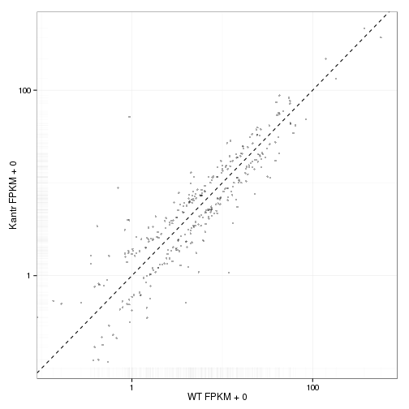 

Volcano Plot


Volcano plot with significant genes only:

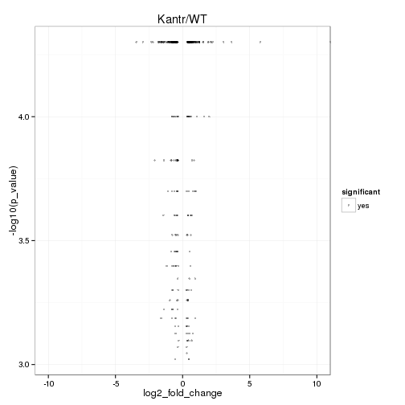 

FoldChange Heatmap

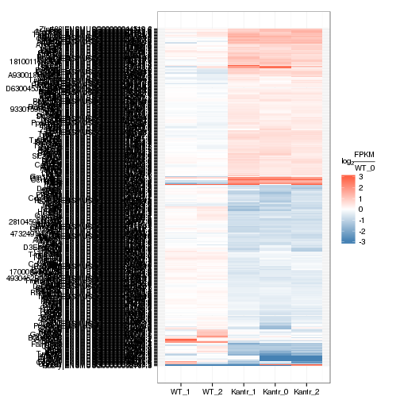 


## Differential Splicing

### Differential Isoforms between conditions

Per isoform difference between conditions:

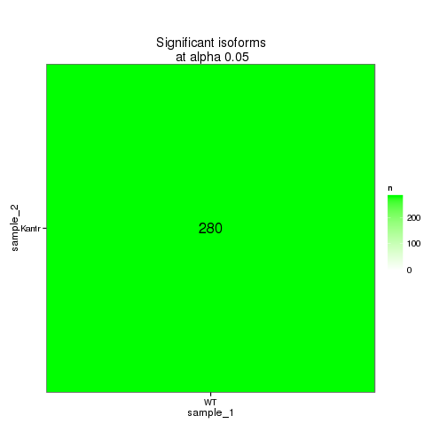 

These isoforms are:

<!-- html table generated in R 3.0.2 by xtable 1.7-3 package -->
<!-- Wed Jun 25 09:25:53 2014 -->
<TABLE border=1>
<TR> <TH>  </TH> <TH> isoAnnot$gene_short_name </TH>  </TR>
  <TR> <TD align="right"> 1 </TD> <TD> Sox9 </TD> </TR>
  <TR> <TD align="right"> 2 </TD> <TD> Il12rb1 </TD> </TR>
  <TR> <TD align="right"> 3 </TD> <TD> Mmp14 </TD> </TR>
  <TR> <TD align="right"> 4 </TD> <TD> N4bp3 </TD> </TR>
  <TR> <TD align="right"> 5 </TD> <TD> Gramd3 </TD> </TR>
  <TR> <TD align="right"> 6 </TD> <TD> Angptl4 </TD> </TR>
  <TR> <TD align="right"> 7 </TD> <TD> Golga2 </TD> </TR>
  <TR> <TD align="right"> 8 </TD> <TD> Plin4 </TD> </TR>
  <TR> <TD align="right"> 9 </TD> <TD> Arrdc2 </TD> </TR>
  <TR> <TD align="right"> 10 </TD> <TD> Fosb </TD> </TR>
  <TR> <TD align="right"> 11 </TD> <TD> Hif3a </TD> </TR>
  <TR> <TD align="right"> 12 </TD> <TD> 9330159F19Rik </TD> </TR>
  <TR> <TD align="right"> 13 </TD> <TD> Sh2b2 </TD> </TR>
  <TR> <TD align="right"> 14 </TD> <TD> Prlr </TD> </TR>
  <TR> <TD align="right"> 15 </TD> <TD> Cyp2a5 </TD> </TR>
  <TR> <TD align="right"> 16 </TD> <TD> Lrrc8a </TD> </TR>
  <TR> <TD align="right"> 17 </TD> <TD> Bcl2l1 </TD> </TR>
  <TR> <TD align="right"> 18 </TD> <TD> Dio2 </TD> </TR>
  <TR> <TD align="right"> 19 </TD> <TD> Id3 </TD> </TR>
  <TR> <TD align="right"> 20 </TD> <TD> Derl3 </TD> </TR>
  <TR> <TD align="right"> 21 </TD> <TD> Gm266 </TD> </TR>
  <TR> <TD align="right"> 22 </TD> <TD> Med15 </TD> </TR>
  <TR> <TD align="right"> 23 </TD> <TD> Tjap1 </TD> </TR>
  <TR> <TD align="right"> 24 </TD> <TD> Mertk </TD> </TR>
  <TR> <TD align="right"> 25 </TD> <TD> Slc25a13 </TD> </TR>
  <TR> <TD align="right"> 26 </TD> <TD> Cnksr3 </TD> </TR>
  <TR> <TD align="right"> 27 </TD> <TD> Notch4 </TD> </TR>
  <TR> <TD align="right"> 28 </TD> <TD> Camk1g </TD> </TR>
  <TR> <TD align="right"> 29 </TD> <TD> Sdc4 </TD> </TR>
  <TR> <TD align="right"> 30 </TD> <TD> Ada </TD> </TR>
  <TR> <TD align="right"> 31 </TD> <TD> Erbb3 </TD> </TR>
  <TR> <TD align="right"> 32 </TD> <TD> Ksr1 </TD> </TR>
  <TR> <TD align="right"> 33 </TD> <TD> Pdk4 </TD> </TR>
  <TR> <TD align="right"> 34 </TD> <TD> Sema6a </TD> </TR>
  <TR> <TD align="right"> 35 </TD> <TD> Lama4 </TD> </TR>
  <TR> <TD align="right"> 36 </TD> <TD> Arid5b </TD> </TR>
  <TR> <TD align="right"> 37 </TD> <TD> Sgk1 </TD> </TR>
  <TR> <TD align="right"> 38 </TD> <TD> Ddit4 </TD> </TR>
  <TR> <TD align="right"> 39 </TD> <TD> Vps54 </TD> </TR>
  <TR> <TD align="right"> 40 </TD> <TD> Ddc </TD> </TR>
  <TR> <TD align="right"> 41 </TD> <TD> Cpm </TD> </TR>
  <TR> <TD align="right"> 42 </TD> <TD> Nipal4 </TD> </TR>
  <TR> <TD align="right"> 43 </TD> <TD> Tns3 </TD> </TR>
  <TR> <TD align="right"> 44 </TD> <TD> Btg2 </TD> </TR>
  <TR> <TD align="right"> 45 </TD> <TD> Gatsl3 </TD> </TR>
  <TR> <TD align="right"> 46 </TD> <TD> Pomc </TD> </TR>
  <TR> <TD align="right"> 47 </TD> <TD> Pxdn </TD> </TR>
  <TR> <TD align="right"> 48 </TD> <TD> Gh </TD> </TR>
  <TR> <TD align="right"> 49 </TD> <TD> Nfkbia </TD> </TR>
  <TR> <TD align="right"> 50 </TD> <TD> Zfp36l1 </TD> </TR>
  <TR> <TD align="right"> 51 </TD> <TD> Otub2 </TD> </TR>
  <TR> <TD align="right"> 52 </TD> <TD> Net1 </TD> </TR>
  <TR> <TD align="right"> 53 </TD> <TD> Fos </TD> </TR>
  <TR> <TD align="right"> 54 </TD> <TD> Zkscan3 </TD> </TR>
  <TR> <TD align="right"> 55 </TD> <TD> Elovl7 </TD> </TR>
  <TR> <TD align="right"> 56 </TD> <TD> 4930452B06Rik </TD> </TR>
  <TR> <TD align="right"> 57 </TD> <TD> Fst </TD> </TR>
  <TR> <TD align="right"> 58 </TD> <TD> Galnt15 </TD> </TR>
  <TR> <TD align="right"> 59 </TD> <TD> Sema3g </TD> </TR>
  <TR> <TD align="right"> 60 </TD> <TD> Psmb5 </TD> </TR>
  <TR> <TD align="right"> 61 </TD> <TD> Myo10 </TD> </TR>
  <TR> <TD align="right"> 62 </TD> <TD> Slc38a2 </TD> </TR>
  <TR> <TD align="right"> 63 </TD> <TD> Litaf </TD> </TR>
  <TR> <TD align="right"> 64 </TD> <TD> Bcl6 </TD> </TR>
  <TR> <TD align="right"> 65 </TD> <TD> Arc </TD> </TR>
  <TR> <TD align="right"> 66 </TD> <TD> Adamts1 </TD> </TR>
  <TR> <TD align="right"> 67 </TD> <TD> Slc15a2 </TD> </TR>
  <TR> <TD align="right"> 68 </TD> <TD> Nr4a1 </TD> </TR>
  <TR> <TD align="right"> 69 </TD> <TD> Cdkn1a </TD> </TR>
  <TR> <TD align="right"> 70 </TD> <TD> Vegfa </TD> </TR>
  <TR> <TD align="right"> 71 </TD> <TD> Clic5 </TD> </TR>
  <TR> <TD align="right"> 72 </TD> <TD> Glo1 </TD> </TR>
  <TR> <TD align="right"> 73 </TD> <TD> Sik1 </TD> </TR>
  <TR> <TD align="right"> 74 </TD> <TD> Xdh </TD> </TR>
  <TR> <TD align="right"> 75 </TD> <TD> Atp6v0c </TD> </TR>
  <TR> <TD align="right"> 76 </TD> <TD> Tekt4 </TD> </TR>
  <TR> <TD align="right"> 77 </TD> <TD> Dusp1 </TD> </TR>
  <TR> <TD align="right"> 78 </TD> <TD> Fkbp5 </TD> </TR>
  <TR> <TD align="right"> 79 </TD> <TD> Sncaip </TD> </TR>
  <TR> <TD align="right"> 80 </TD> <TD> Pdgfrb </TD> </TR>
  <TR> <TD align="right"> 81 </TD> <TD> Fas </TD> </TR>
  <TR> <TD align="right"> 82 </TD> <TD> Frmd8 </TD> </TR>
  <TR> <TD align="right"> 83 </TD> <TD> Hhex </TD> </TR>
  <TR> <TD align="right"> 84 </TD> <TD> Alas2 </TD> </TR>
  <TR> <TD align="right"> 85 </TD> <TD> Atp10a </TD> </TR>
  <TR> <TD align="right"> 86 </TD> <TD> D3Ertd751e </TD> </TR>
  <TR> <TD align="right"> 87 </TD> <TD> Sgk3 </TD> </TR>
  <TR> <TD align="right"> 88 </TD> <TD> Paqr8 </TD> </TR>
  <TR> <TD align="right"> 89 </TD> <TD> Slc40a1 </TD> </TR>
  <TR> <TD align="right"> 90 </TD> <TD> Lamc1 </TD> </TR>
  <TR> <TD align="right"> 91 </TD> <TD> Myoc </TD> </TR>
  <TR> <TD align="right"> 92 </TD> <TD> Lypd6b </TD> </TR>
  <TR> <TD align="right"> 93 </TD> <TD> Lcn2 </TD> </TR>
  <TR> <TD align="right"> 94 </TD> <TD> Depdc7 </TD> </TR>
  <TR> <TD align="right"> 95 </TD> <TD> Jag1 </TD> </TR>
  <TR> <TD align="right"> 96 </TD> <TD> Dll4 </TD> </TR>
  <TR> <TD align="right"> 97 </TD> <TD> Nkx2-2 </TD> </TR>
  <TR> <TD align="right"> 98 </TD> <TD> Bpifa1 </TD> </TR>
  <TR> <TD align="right"> 99 </TD> <TD> Fam83d </TD> </TR>
  <TR> <TD align="right"> 100 </TD> <TD> Anxa5 </TD> </TR>
  <TR> <TD align="right"> 101 </TD> <TD> Exosc9 </TD> </TR>
  <TR> <TD align="right"> 102 </TD> <TD> Dclre1b </TD> </TR>
  <TR> <TD align="right"> 103 </TD> <TD> Fam198b </TD> </TR>
  <TR> <TD align="right"> 104 </TD> <TD> Alpk1 </TD> </TR>
  <TR> <TD align="right"> 105 </TD> <TD> Cyr61 </TD> </TR>
  <TR> <TD align="right"> 106 </TD> <TD> Gbp2 </TD> </TR>
  <TR> <TD align="right"> 107 </TD> <TD> Nr4a3 </TD> </TR>
  <TR> <TD align="right"> 108 </TD> <TD> Rps6 </TD> </TR>
  <TR> <TD align="right"> 109 </TD> <TD> Slc2a1 </TD> </TR>
  <TR> <TD align="right"> 110 </TD> <TD> Mfsd2a </TD> </TR>
  <TR> <TD align="right"> 111 </TD> <TD> Hspg2 </TD> </TR>
  <TR> <TD align="right"> 112 </TD> <TD> Tinagl1 </TD> </TR>
  <TR> <TD align="right"> 113 </TD> <TD> Map3k6 </TD> </TR>
  <TR> <TD align="right"> 114 </TD> <TD> Arhgef19 </TD> </TR>
  <TR> <TD align="right"> 115 </TD> <TD> Errfi1 </TD> </TR>
  <TR> <TD align="right"> 116 </TD> <TD> Ugt2a1 </TD> </TR>
  <TR> <TD align="right"> 117 </TD> <TD> Aff1 </TD> </TR>
  <TR> <TD align="right"> 118 </TD> <TD> Rasgef1b </TD> </TR>
  <TR> <TD align="right"> 119 </TD> <TD> Pitpnm2 </TD> </TR>
  <TR> <TD align="right"> 120 </TD> <TD> Lfng </TD> </TR>
  <TR> <TD align="right"> 121 </TD> <TD> Nfe2l3 </TD> </TR>
  <TR> <TD align="right"> 122 </TD> <TD> Gkn3 </TD> </TR>
  <TR> <TD align="right"> 123 </TD> <TD> Klf15 </TD> </TR>
  <TR> <TD align="right"> 124 </TD> <TD> Lag3 </TD> </TR>
  <TR> <TD align="right"> 125 </TD> <TD> Clec2d </TD> </TR>
  <TR> <TD align="right"> 126 </TD> <TD> Adipor2 </TD> </TR>
  <TR> <TD align="right"> 127 </TD> <TD> Dusp16 </TD> </TR>
  <TR> <TD align="right"> 128 </TD> <TD> Slco1a4 </TD> </TR>
  <TR> <TD align="right"> 129 </TD> <TD> Rhpn2 </TD> </TR>
  <TR> <TD align="right"> 130 </TD> <TD> Sult1a1 </TD> </TR>
  <TR> <TD align="right"> 131 </TD> <TD> Disp1 </TD> </TR>
  <TR> <TD align="right"> 132 </TD> <TD> Lyve1 </TD> </TR>
  <TR> <TD align="right"> 133 </TD> <TD> Cckbr </TD> </TR>
  <TR> <TD align="right"> 134 </TD> <TD> Slc38a5 </TD> </TR>
  <TR> <TD align="right"> 135 </TD> <TD> Col4a5 </TD> </TR>
  <TR> <TD align="right"> 136 </TD> <TD> Mtm1 </TD> </TR>
  <TR> <TD align="right"> 137 </TD> <TD> Tsc22d3 </TD> </TR>
  <TR> <TD align="right"> 138 </TD> <TD> Plat </TD> </TR>
  <TR> <TD align="right"> 139 </TD> <TD> Sall1 </TD> </TR>
  <TR> <TD align="right"> 140 </TD> <TD> Gpt2 </TD> </TR>
  <TR> <TD align="right"> 141 </TD> <TD> Gab1 </TD> </TR>
  <TR> <TD align="right"> 142 </TD> <TD> Mt2 </TD> </TR>
  <TR> <TD align="right"> 143 </TD> <TD> Mt1 </TD> </TR>
  <TR> <TD align="right"> 144 </TD> <TD> Cmtm3 </TD> </TR>
  <TR> <TD align="right"> 145 </TD> <TD> Ets1 </TD> </TR>
  <TR> <TD align="right"> 146 </TD> <TD> Ldlr </TD> </TR>
  <TR> <TD align="right"> 147 </TD> <TD> Heyl </TD> </TR>
  <TR> <TD align="right"> 148 </TD> <TD> Gng11 </TD> </TR>
  <TR> <TD align="right"> 149 </TD> <TD> Alox12b </TD> </TR>
  <TR> <TD align="right"> 150 </TD> <TD> Rnft2 </TD> </TR>
  <TR> <TD align="right"> 151 </TD> <TD> Slc16a1 </TD> </TR>
  <TR> <TD align="right"> 152 </TD> <TD> Sox10 </TD> </TR>
  <TR> <TD align="right"> 153 </TD> <TD> Tbc1d4 </TD> </TR>
  <TR> <TD align="right"> 154 </TD> <TD> Ucp2 </TD> </TR>
  <TR> <TD align="right"> 155 </TD> <TD> Klf9 </TD> </TR>
  <TR> <TD align="right"> 156 </TD> <TD> Trim36 </TD> </TR>
  <TR> <TD align="right"> 157 </TD> <TD> Neu4 </TD> </TR>
  <TR> <TD align="right"> 158 </TD> <TD> Igsf9b </TD> </TR>
  <TR> <TD align="right"> 159 </TD> <TD> Trim59 </TD> </TR>
  <TR> <TD align="right"> 160 </TD> <TD> Nostrin </TD> </TR>
  <TR> <TD align="right"> 161 </TD> <TD> Fam214a </TD> </TR>
  <TR> <TD align="right"> 162 </TD> <TD> Eva1a </TD> </TR>
  <TR> <TD align="right"> 163 </TD> <TD> Lars2 </TD> </TR>
  <TR> <TD align="right"> 164 </TD> <TD> Tmem98 </TD> </TR>
  <TR> <TD align="right"> 165 </TD> <TD> Prr5 </TD> </TR>
  <TR> <TD align="right"> 166 </TD> <TD> Tmem260 </TD> </TR>
  <TR> <TD align="right"> 167 </TD> <TD> Micall2 </TD> </TR>
  <TR> <TD align="right"> 168 </TD> <TD> Kirrel2 </TD> </TR>
  <TR> <TD align="right"> 169 </TD> <TD> Ppp1r14a </TD> </TR>
  <TR> <TD align="right"> 170 </TD> <TD> Mxd4 </TD> </TR>
  <TR> <TD align="right"> 171 </TD> <TD> 4932438A13Rik </TD> </TR>
  <TR> <TD align="right"> 172 </TD> <TD> Ovol2 </TD> </TR>
  <TR> <TD align="right"> 173 </TD> <TD> Avp </TD> </TR>
  <TR> <TD align="right"> 174 </TD> <TD> Egr2 </TD> </TR>
  <TR> <TD align="right"> 175 </TD> <TD> Sh3rf3 </TD> </TR>
  <TR> <TD align="right"> 176 </TD> <TD> Smim3 </TD> </TR>
  <TR> <TD align="right"> 177 </TD> <TD> Galnt11 </TD> </TR>
  <TR> <TD align="right"> 178 </TD> <TD> Foxf2 </TD> </TR>
  <TR> <TD align="right"> 179 </TD> <TD> Egr1 </TD> </TR>
  <TR> <TD align="right"> 180 </TD> <TD> Olfml2b </TD> </TR>
  <TR> <TD align="right"> 181 </TD> <TD> Atp5l </TD> </TR>
  <TR> <TD align="right"> 182 </TD> <TD> Mboat1 </TD> </TR>
  <TR> <TD align="right"> 183 </TD> <TD> Pcsk1n </TD> </TR>
  <TR> <TD align="right"> 184 </TD> <TD> Tnfsf10 </TD> </TR>
  <TR> <TD align="right"> 185 </TD> <TD> Atp8b1 </TD> </TR>
  <TR> <TD align="right"> 186 </TD> <TD> Zfp189 </TD> </TR>
  <TR> <TD align="right"> 187 </TD> <TD> Cercam </TD> </TR>
  <TR> <TD align="right"> 188 </TD> <TD> Gpr37 </TD> </TR>
  <TR> <TD align="right"> 189 </TD> <TD> Spsb1 </TD> </TR>
  <TR> <TD align="right"> 190 </TD> <TD> Gjb6 </TD> </TR>
  <TR> <TD align="right"> 191 </TD> <TD> Gbp5 </TD> </TR>
  <TR> <TD align="right"> 192 </TD> <TD> Nkx6-2 </TD> </TR>
  <TR> <TD align="right"> 193 </TD> <TD> Cldn5 </TD> </TR>
  <TR> <TD align="right"> 194 </TD> <TD> Syt15 </TD> </TR>
  <TR> <TD align="right"> 195 </TD> <TD> Sdk2 </TD> </TR>
  <TR> <TD align="right"> 196 </TD> <TD> Cdc42ep4 </TD> </TR>
  <TR> <TD align="right"> 197 </TD> <TD> Pkp2 </TD> </TR>
  <TR> <TD align="right"> 198 </TD> <TD> Hps4 </TD> </TR>
  <TR> <TD align="right"> 199 </TD> <TD> Greb1l </TD> </TR>
  <TR> <TD align="right"> 200 </TD> <TD> Aplnr </TD> </TR>
  <TR> <TD align="right"> 201 </TD> <TD> Zfp488 </TD> </TR>
  <TR> <TD align="right"> 202 </TD> <TD> Tlr7 </TD> </TR>
  <TR> <TD align="right"> 203 </TD> <TD> Serpinb1a </TD> </TR>
  <TR> <TD align="right"> 204 </TD> <TD> Rassf9 </TD> </TR>
  <TR> <TD align="right"> 205 </TD> <TD> Cirbp </TD> </TR>
  <TR> <TD align="right"> 206 </TD> <TD> Insig1 </TD> </TR>
  <TR> <TD align="right"> 207 </TD> <TD> Zfp36l2 </TD> </TR>
  <TR> <TD align="right"> 208 </TD> <TD> Npas4 </TD> </TR>
  <TR> <TD align="right"> 209 </TD> <TD> Clec14a </TD> </TR>
  <TR> <TD align="right"> 210 </TD> <TD> Gjb2 </TD> </TR>
  <TR> <TD align="right"> 211 </TD> <TD> Gjb1 </TD> </TR>
  <TR> <TD align="right"> 212 </TD> <TD> Kmt2d </TD> </TR>
  <TR> <TD align="right"> 213 </TD> <TD> Ranbp3l </TD> </TR>
  <TR> <TD align="right"> 214 </TD> <TD> Ccdc6 </TD> </TR>
  <TR> <TD align="right"> 215 </TD> <TD> Dact2 </TD> </TR>
  <TR> <TD align="right"> 216 </TD> <TD> Acap2 </TD> </TR>
  <TR> <TD align="right"> 217 </TD> <TD> Cdc42ep1 </TD> </TR>
  <TR> <TD align="right"> 218 </TD> <TD> Rasd1 </TD> </TR>
  <TR> <TD align="right"> 219 </TD> <TD> Opalin </TD> </TR>
  <TR> <TD align="right"> 220 </TD> <TD> Fzd2 </TD> </TR>
  <TR> <TD align="right"> 221 </TD> <TD> Ppp1r3g </TD> </TR>
  <TR> <TD align="right"> 222 </TD> <TD> Plekho2 </TD> </TR>
  <TR> <TD align="right"> 223 </TD> <TD> Olfml1 </TD> </TR>
  <TR> <TD align="right"> 224 </TD> <TD> Klf13 </TD> </TR>
  <TR> <TD align="right"> 225 </TD> <TD> Hbb-y </TD> </TR>
  <TR> <TD align="right"> 226 </TD> <TD> Gpr17 </TD> </TR>
  <TR> <TD align="right"> 227 </TD> <TD> Hbb-bs </TD> </TR>
  <TR> <TD align="right"> 228 </TD> <TD> Junb </TD> </TR>
  <TR> <TD align="right"> 229 </TD> <TD> Creb5 </TD> </TR>
  <TR> <TD align="right"> 230 </TD> <TD> Ier2 </TD> </TR>
  <TR> <TD align="right"> 231 </TD> <TD> Lifr </TD> </TR>
  <TR> <TD align="right"> 232 </TD> <TD> Lrrc8c </TD> </TR>
  <TR> <TD align="right"> 233 </TD> <TD> Per2 </TD> </TR>
  <TR> <TD align="right"> 234 </TD> <TD> Pla2g4a </TD> </TR>
  <TR> <TD align="right"> 235 </TD> <TD> Ncoa4 </TD> </TR>
  <TR> <TD align="right"> 236 </TD> <TD> 1810011O10Rik </TD> </TR>
  <TR> <TD align="right"> 237 </TD> <TD> Kdm5d </TD> </TR>
  <TR> <TD align="right"> 238 </TD> <TD> Chsy3 </TD> </TR>
  <TR> <TD align="right"> 239 </TD> <TD> Calcrl </TD> </TR>
  <TR> <TD align="right"> 240 </TD> <TD> Rpl26 </TD> </TR>
  <TR> <TD align="right"> 241 </TD> <TD> Cxcl12 </TD> </TR>
  <TR> <TD align="right"> 242 </TD> <TD> Cox5b </TD> </TR>
  <TR> <TD align="right"> 243 </TD> <TD> Kdr </TD> </TR>
  <TR> <TD align="right"> 244 </TD> <TD> Slc22a8 </TD> </TR>
  <TR> <TD align="right"> 245 </TD> <TD> Zfp428 </TD> </TR>
  <TR> <TD align="right"> 246 </TD> <TD> Cntn4 </TD> </TR>
  <TR> <TD align="right"> 247 </TD> <TD> Phactr4 </TD> </TR>
  <TR> <TD align="right"> 248 </TD> <TD> Zbtb16 </TD> </TR>
  <TR> <TD align="right"> 249 </TD> <TD> Ppp1r3c </TD> </TR>
  <TR> <TD align="right"> 250 </TD> <TD> Ddx3y </TD> </TR>
  <TR> <TD align="right"> 251 </TD> <TD> Ahnak </TD> </TR>
  <TR> <TD align="right"> 252 </TD> <TD> 1700084C01Rik </TD> </TR>
  <TR> <TD align="right"> 253 </TD> <TD> Jund </TD> </TR>
  <TR> <TD align="right"> 254 </TD> <TD> Egr4 </TD> </TR>
  <TR> <TD align="right"> 255 </TD> <TD> Ccnb1ip1 </TD> </TR>
  <TR> <TD align="right"> 256 </TD> <TD> Ppp1r3e </TD> </TR>
  <TR> <TD align="right"> 257 </TD> <TD> Gm7292 </TD> </TR>
  <TR> <TD align="right"> 258 </TD> <TD> H2-Bl </TD> </TR>
  <TR> <TD align="right"> 259 </TD> <TD> Tmem88b </TD> </TR>
  <TR> <TD align="right"> 260 </TD> <TD> Hbb-bt </TD> </TR>
  <TR> <TD align="right"> 261 </TD> <TD> Plekhf1 </TD> </TR>
  <TR> <TD align="right"> 262 </TD> <TD> Adh1 </TD> </TR>
  <TR> <TD align="right"> 263 </TD> <TD> B3galt5 </TD> </TR>
  <TR> <TD align="right"> 264 </TD> <TD> Nrarp </TD> </TR>
  <TR> <TD align="right"> 265 </TD> <TD> Aoc2 </TD> </TR>
  <TR> <TD align="right"> 266 </TD> <TD> Nhsl2 </TD> </TR>
  <TR> <TD align="right"> 267 </TD> <TD> Gm15631 </TD> </TR>
  <TR> <TD align="right"> 268 </TD> <TD> Xist </TD> </TR>
  <TR> <TD align="right"> 269 </TD> <TD> BC064078 </TD> </TR>
  <TR> <TD align="right"> 270 </TD> <TD> Apold1 </TD> </TR>
  <TR> <TD align="right"> 271 </TD> <TD> A930018M24Rik </TD> </TR>
  <TR> <TD align="right"> 272 </TD> <TD> Gm3739 </TD> </TR>
  <TR> <TD align="right"> 273 </TD> <TD> Neat1 </TD> </TR>
  <TR> <TD align="right"> 274 </TD> <TD> Malat1 </TD> </TR>
  <TR> <TD align="right"> 275 </TD> <TD> Gm7094 </TD> </TR>
  <TR> <TD align="right"> 276 </TD> <TD> Fam181a </TD> </TR>
  <TR> <TD align="right"> 277 </TD> <TD> Gm26782 </TD> </TR>
  <TR> <TD align="right"> 278 </TD> <TD> Bin2 </TD> </TR>
  <TR> <TD align="right"> 279 </TD> <TD> Gm26924 </TD> </TR>
   </TABLE>

Gene-level DE isoform heatmap

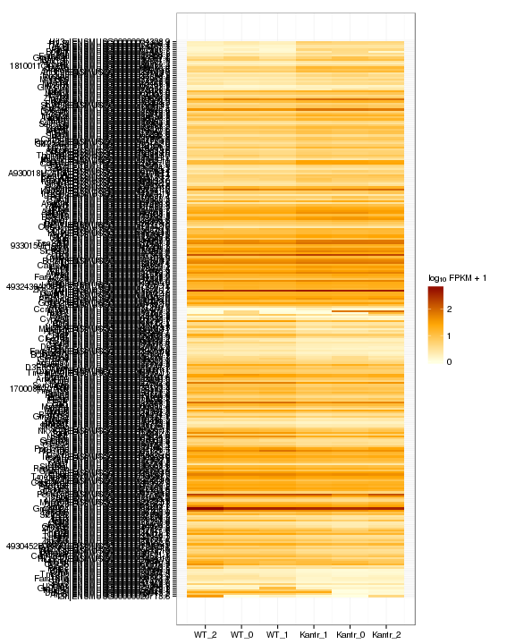 

Isoform foldchange heatmap by isoform:

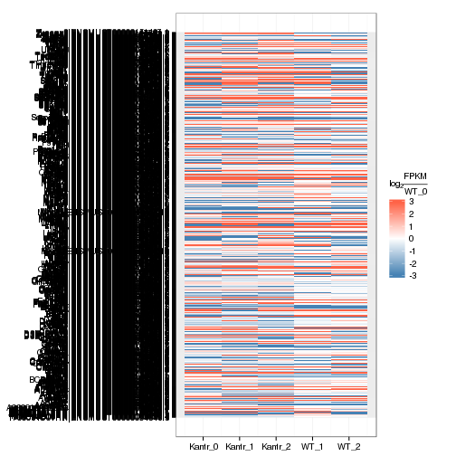 


### Differential Splicing between conditions

(eval false for first pass)

Per condition differences in isoforms (Does gene have diff piechart between conditions?)


These genes are:


Splicing heatmap by isoform:


Splicing heatmap by gene


The following are significantly differentially spliced genes (relative portion of isoform per condition): 


 


# Gene/Pathway Analysis

## GSEA


Biocarta enrichment: 


```
## Error: `x' must have at least 2 rows and 2 columns
```

biocarta zscore: 


```
## Error: incorrect number of dimensions
```

```
## Error: `x' must have at least 2 rows and 2 columns
```


Reactome enrichment: 


```
## Error: figure margins too large
```

 


Reactome zscore: 

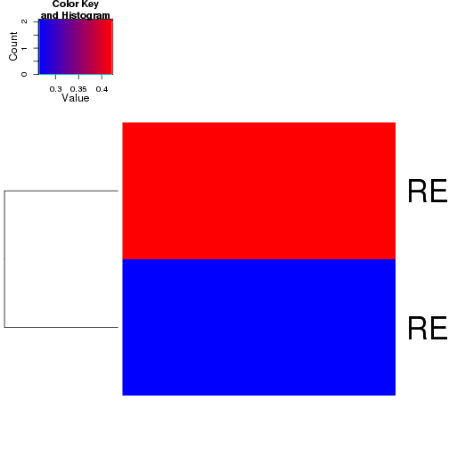 

## GO enrichment 
Cluster profiler used to call enichments of significantly differentially regulated genes that map to Entrez IDs. 


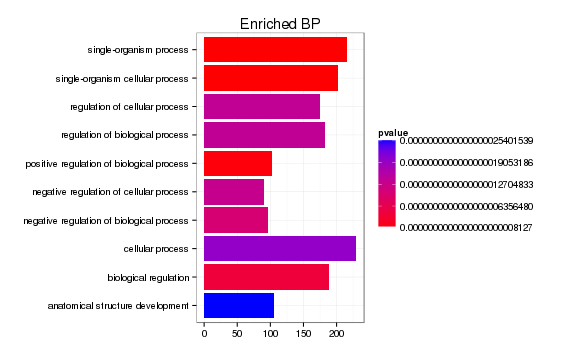 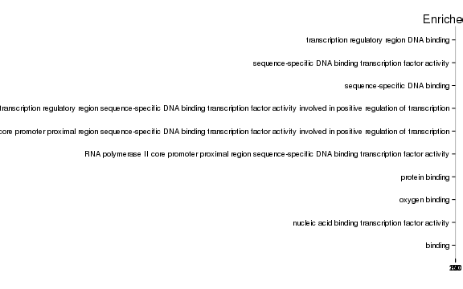 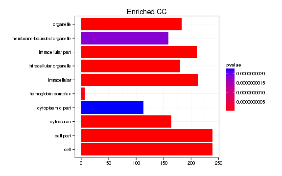 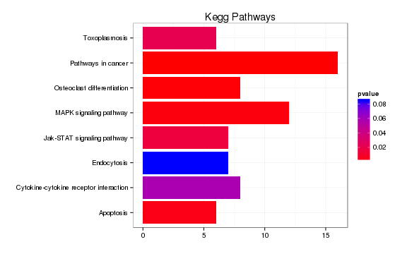 

```
## Error: 'x' and 'units' must have length > 0
```

# Cis vs Trans (locally)


The pvalue for 1 genes significantly regulated in a region this size  is: 1 


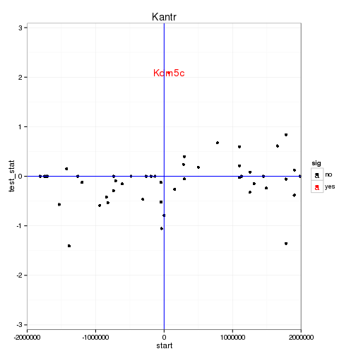 

# Notes

## Samples used are:
<!-- html table generated in R 3.0.2 by xtable 1.7-3 package -->
<!-- Wed Jun 25 09:48:23 2014 -->
<TABLE border=1>
<TR> <TH>  </TH> <TH> 10 </TH>  </TR>
  <TR> <TD align="right"> 1 </TD> <TD> JR824 </TD> </TR>
  <TR> <TD align="right"> 2 </TD> <TD> JR820 </TD> </TR>
  <TR> <TD align="right"> 3 </TD> <TD> JR821 </TD> </TR>
  <TR> <TD align="right"> 4 </TD> <TD> JR742 </TD> </TR>
  <TR> <TD align="right"> 5 </TD> <TD> JR819 </TD> </TR>
  <TR> <TD align="right"> 6 </TD> <TD> JR823 </TD> </TR>
   </TABLE>

## Replicates
<!-- html table generated in R 3.0.2 by xtable 1.7-3 package -->
<!-- Wed Jun 25 09:48:24 2014 -->
<TABLE border=1>
<TR> <TH>  </TH> <TH> file </TH> <TH> sample_name </TH> <TH> replicate </TH> <TH> rep_name </TH> <TH> total_mass </TH> <TH> norm_mass </TH> <TH> internal_scale </TH> <TH> external_scale </TH>  </TR>
  <TR> <TD align="right"> 1 </TD> <TD> /n/rinn_data1/seq/lgoff/Projects/BrainMap/data/quants/JR824/abundances.cxb </TD> <TD> WT </TD> <TD align="right">   0 </TD> <TD> WT_0 </TD> <TD align="right"> 34312500.00 </TD> <TD align="right"> 36018100.00 </TD> <TD align="right"> 0.96 </TD> <TD align="right"> 1.00 </TD> </TR>
  <TR> <TD align="right"> 2 </TD> <TD> /n/rinn_data1/seq/lgoff/Projects/BrainMap/data/quants/JR820/abundances.cxb </TD> <TD> WT </TD> <TD align="right">   1 </TD> <TD> WT_1 </TD> <TD align="right"> 36264600.00 </TD> <TD align="right"> 36018100.00 </TD> <TD align="right"> 1.01 </TD> <TD align="right"> 1.00 </TD> </TR>
  <TR> <TD align="right"> 3 </TD> <TD> /n/rinn_data1/seq/lgoff/Projects/BrainMap/data/quants/JR821/abundances.cxb </TD> <TD> WT </TD> <TD align="right">   2 </TD> <TD> WT_2 </TD> <TD align="right"> 45857300.00 </TD> <TD align="right"> 36018100.00 </TD> <TD align="right"> 1.29 </TD> <TD align="right"> 1.00 </TD> </TR>
  <TR> <TD align="right"> 4 </TD> <TD> /n/rinn_data1/seq/lgoff/Projects/BrainMap/data/quants/JR742/abundances.cxb </TD> <TD> Kantr </TD> <TD align="right">   0 </TD> <TD> Kantr_0 </TD> <TD align="right"> 35618600.00 </TD> <TD align="right"> 36018100.00 </TD> <TD align="right"> 0.98 </TD> <TD align="right"> 1.00 </TD> </TR>
  <TR> <TD align="right"> 5 </TD> <TD> /n/rinn_data1/seq/lgoff/Projects/BrainMap/data/quants/JR819/abundances.cxb </TD> <TD> Kantr </TD> <TD align="right">   1 </TD> <TD> Kantr_1 </TD> <TD align="right"> 32413300.00 </TD> <TD align="right"> 36018100.00 </TD> <TD align="right"> 0.89 </TD> <TD align="right"> 1.00 </TD> </TR>
  <TR> <TD align="right"> 6 </TD> <TD> /n/rinn_data1/seq/lgoff/Projects/BrainMap/data/quants/JR823/abundances.cxb </TD> <TD> Kantr </TD> <TD align="right">   2 </TD> <TD> Kantr_2 </TD> <TD align="right"> 33432600.00 </TD> <TD align="right"> 36018100.00 </TD> <TD align="right"> 0.92 </TD> <TD align="right"> 1.00 </TD> </TR>
   </TABLE>

## Session Info

```
## R version 3.0.2 (2013-09-25)
## Platform: x86_64-unknown-linux-gnu (64-bit)
## 
## locale:
##  [1] LC_CTYPE=en_US.UTF-8       LC_NUMERIC=C              
##  [3] LC_TIME=en_US.UTF-8        LC_COLLATE=en_US.UTF-8    
##  [5] LC_MONETARY=en_US.UTF-8    LC_MESSAGES=en_US.UTF-8   
##  [7] LC_PAPER=en_US.UTF-8       LC_NAME=C                 
##  [9] LC_ADDRESS=C               LC_TELEPHONE=C            
## [11] LC_MEASUREMENT=en_US.UTF-8 LC_IDENTIFICATION=C       
## 
## attached base packages:
## [1] grid      parallel  stats     graphics  grDevices utils     datasets 
## [8] methods   base     
## 
## other attached packages:
##  [1] plyr_1.8.1                         
##  [2] stringr_0.6.2                      
##  [3] seqbias_1.10.0                     
##  [4] BSgenome.Mmusculus.UCSC.mm10_1.3.19
##  [5] BSgenome_1.30.0                    
##  [6] Biostrings_2.30.1                  
##  [7] GO.db_2.10.1                       
##  [8] org.Mm.eg.db_2.10.1                
##  [9] clusterProfiler_1.13.1             
## [10] DOSE_2.0.0                         
## [11] ReactomePA_1.6.1                   
## [12] AnnotationDbi_1.24.0               
## [13] Biobase_2.22.0                     
## [14] RMySQL_0.9-3                       
## [15] mgcv_1.7-29                        
## [16] nlme_3.1-117                       
## [17] RColorBrewer_1.0-5                 
## [18] gridExtra_0.9.1                    
## [19] gtable_0.1.2                       
## [20] marray_1.40.0                      
## [21] gplots_2.13.0                      
## [22] GSA_1.03                           
## [23] limma_3.18.13                      
## [24] xtable_1.7-3                       
## [25] cummeRbund_2.7.2                   
## [26] Gviz_1.6.0                         
## [27] rtracklayer_1.22.7                 
## [28] GenomicRanges_1.14.4               
## [29] XVector_0.2.0                      
## [30] IRanges_1.20.7                     
## [31] fastcluster_1.1.13                 
## [32] reshape2_1.4                       
## [33] ggplot2_1.0.0                      
## [34] RSQLite_0.11.4                     
## [35] DBI_0.2-7                          
## [36] BiocGenerics_0.8.0                 
## [37] knitr_1.6                          
## 
## loaded via a namespace (and not attached):
##  [1] biomaRt_2.18.0         biovizBase_1.10.8      bitops_1.0-6          
##  [4] caTools_1.17           cluster_1.15.2         colorspace_1.2-4      
##  [7] dichromat_2.0-0        digest_0.6.4           DO.db_2.7             
## [10] evaluate_0.5.5         formatR_0.10           Formula_1.1-1         
## [13] gdata_2.13.3           GenomicFeatures_1.14.5 GOSemSim_1.20.3       
## [16] graph_1.40.1           graphite_1.8.1         gtools_3.4.1          
## [19] Hmisc_3.14-4           igraph_0.7.1           KEGG.db_2.10.1        
## [22] KernSmooth_2.23-12     labeling_0.2           lattice_0.20-29       
## [25] latticeExtra_0.6-26    MASS_7.3-33            Matrix_1.1-3          
## [28] munsell_0.4.2          org.Hs.eg.db_2.10.1    proto_0.3-10          
## [31] qvalue_1.36.0          Rcpp_0.11.1            RCurl_1.95-4.1        
## [34] reactome.db_1.46.1     Rsamtools_1.14.3       scales_0.2.4          
## [37] splines_3.0.2          stats4_3.0.2           survival_2.37-7       
## [40] tcltk_3.0.2            tools_3.0.2            XML_3.98-1.1          
## [43] zlibbioc_1.8.0
```

## Run Info

```
##           param
## 1      cmd_line
## 2       version
## 3  SVN_revision
## 4 boost_version
## 5        genome
##                                                                                                                                                                                                                                                                                                                                                                                                                                                                                                                                                                                                                                                                          value
## 1 cuffdiff -p 10 -L WT,Kantr -o /n/rinn_data1/seq/lgoff/Projects/BrainMap/data/diffs/Kantr_vs_WT_Adult /n/rinn_data1/seq/lgoff/Projects/BrainMap/data/annotation/mm10_gencode_vM2_with_lncRNAs_and_LacZ.gtf /n/rinn_data1/seq/lgoff/Projects/BrainMap/data/quants/JR824/abundances.cxb,/n/rinn_data1/seq/lgoff/Projects/BrainMap/data/quants/JR820/abundances.cxb,/n/rinn_data1/seq/lgoff/Projects/BrainMap/data/quants/JR821/abundances.cxb /n/rinn_data1/seq/lgoff/Projects/BrainMap/data/quants/JR742/abundances.cxb,/n/rinn_data1/seq/lgoff/Projects/BrainMap/data/quants/JR819/abundances.cxb,/n/rinn_data1/seq/lgoff/Projects/BrainMap/data/quants/JR823/abundances.cxb 
## 2                                                                                                                                                                                                                                                                                                                                                                                                                                                                                                                                                                                                                                                                        2.2.1
## 3                                                                                                                                                                                                                                                                                                                                                                                                                                                                                                                                                                                                                                                                         4237
## 4                                                                                                                                                                                                                                                                                                                                                                                                                                                                                                                                                                                                                                                                       104700
## 5                                                                                                                                                                                                                                                                                                                                                                                                                                                                                                                                                                                                                                                                         mm10
```
