Interesting Strains 
========================================================

```
## Loading required package: BiocGenerics
## Loading required package: parallel
## 
## Attaching package: 'BiocGenerics'
## 
## The following objects are masked from 'package:parallel':
## 
##     clusterApply, clusterApplyLB, clusterCall, clusterEvalQ,
##     clusterExport, clusterMap, parApply, parCapply, parLapply,
##     parLapplyLB, parRapply, parSapply, parSapplyLB
## 
## The following object is masked from 'package:stats':
## 
##     xtabs
## 
## The following objects are masked from 'package:base':
## 
##     anyDuplicated, append, as.data.frame, as.vector, cbind,
##     colnames, duplicated, eval, evalq, Filter, Find, get,
##     intersect, is.unsorted, lapply, Map, mapply, match, mget,
##     order, paste, pmax, pmax.int, pmin, pmin.int, Position, rank,
##     rbind, Reduce, rep.int, rownames, sapply, setdiff, sort,
##     table, tapply, union, unique, unlist
## 
## Loading required package: RSQLite
## Loading required package: DBI
## Loading required package: ggplot2
## Loading required package: reshape2
## Loading required package: fastcluster
## 
## Attaching package: 'fastcluster'
## 
## The following object is masked from 'package:stats':
## 
##     hclust
## 
## Loading required package: rtracklayer
## Loading required package: GenomicRanges
## Loading required package: IRanges
## Loading required package: XVector
## Loading required package: Gviz
## Loading required package: grid
## 
## Attaching package: 'cummeRbund'
## 
## The following object is masked from 'package:GenomicRanges':
## 
##     promoters
## 
## The following object is masked from 'package:IRanges':
## 
##     promoters
## 
## The following object is masked from 'package:BiocGenerics':
## 
##     conditions
## 
## 
## Attaching package: 'limma'
## 
## The following object is masked from 'package:BiocGenerics':
## 
##     plotMA
## 
## KernSmooth 2.23 loaded
## Copyright M. P. Wand 1997-2009
## 
## Attaching package: 'gplots'
## 
## The following object is masked from 'package:rtracklayer':
## 
##     space
## 
## The following object is masked from 'package:IRanges':
## 
##     space
## 
## The following object is masked from 'package:stats':
## 
##     lowess
```

# Kantr

## Adult Kantr

 

```
## 'dendrogram' with 2 branches and 6 members total, at height 0.06618
```


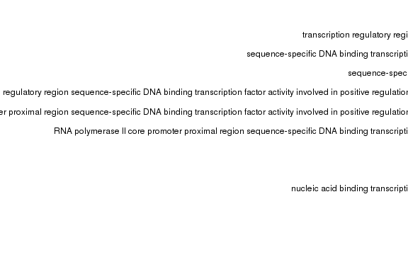 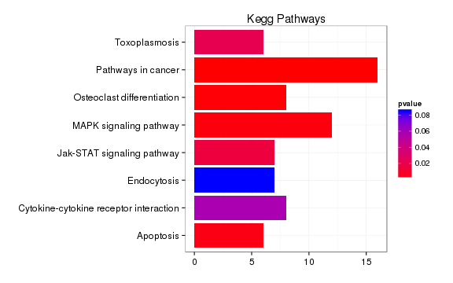 


## Embryo Kantr

 

```
## 'dendrogram' with 2 branches and 6 members total, at height 0.07638
```


There are 313 differentially expressed genes in Kantr adult brain and 785 in Kantr embryos. 


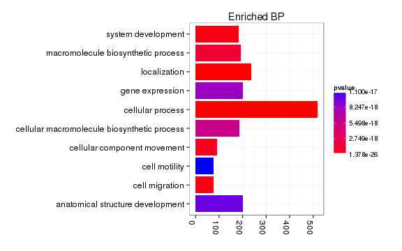 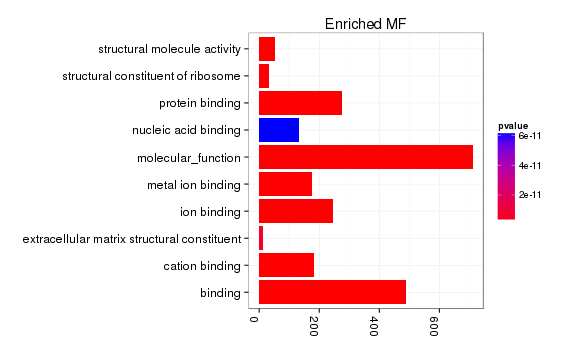    


# Crnde

## Adult Crnde 

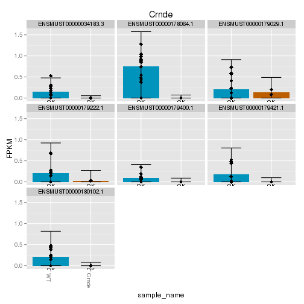 


```
## Error: object 'diffGeneSummary' not found
```


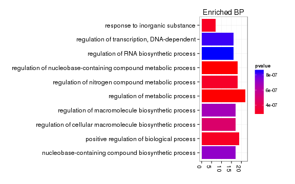 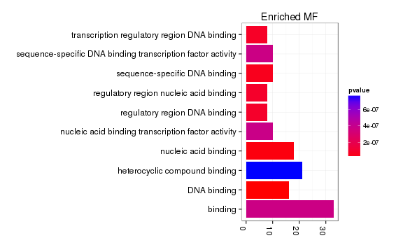 

## Embryo Crnde 

 

```
## 'dendrogram' with 2 branches and 17 members total, at height 0.08401
```

Endogenous expression (isoforms)

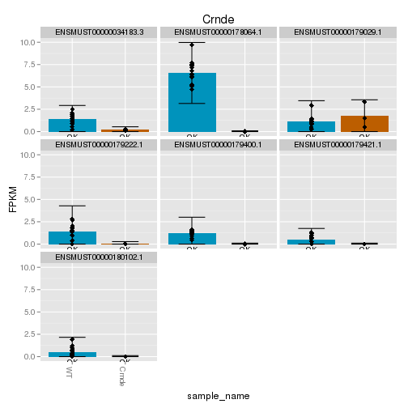 

LacZ and genotyping heatmap


```
## Error: object 'diffGeneSummary' not found
```


```
## [1] "ERROR: The estimated pi0 <= 0. Check that you have valid p-values or use another lambda method."
```

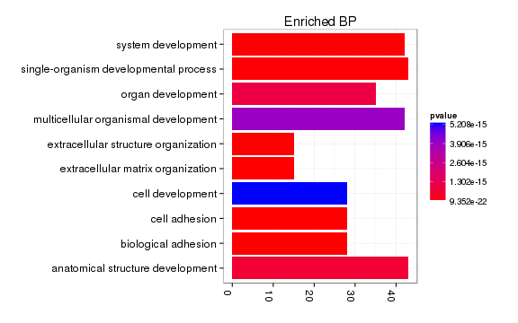    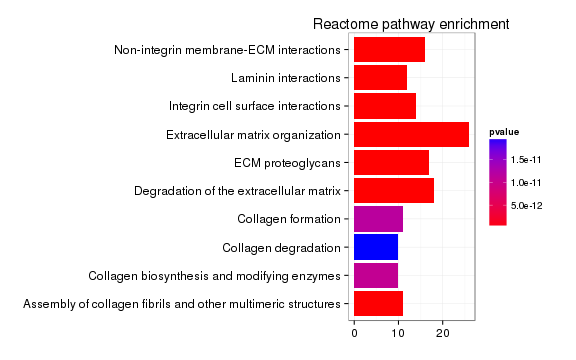 

# Brn1b

## Adult Brn1b 


```
## Error: object 'diffGeneSummary' not found
```


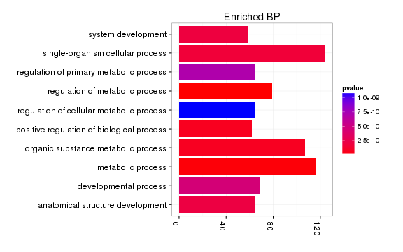 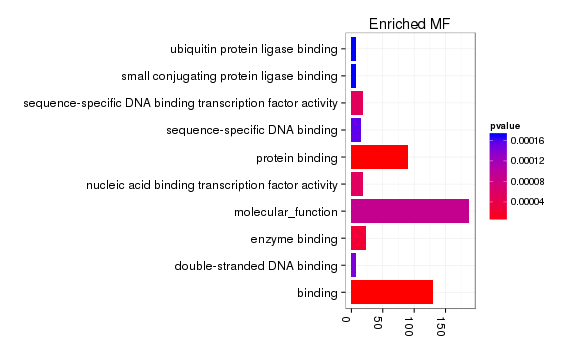 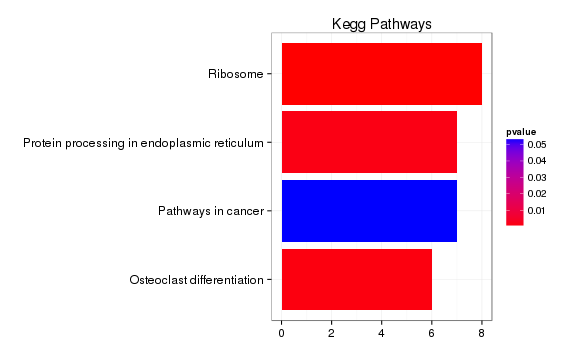 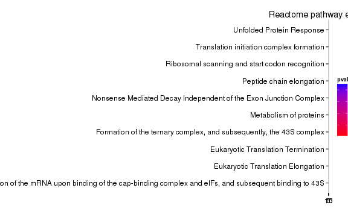 

## Embryonic Brn1b


```
## Error: object 'diffGeneSummary' not found
```

Number of differentially expressed embryonic genes:131


 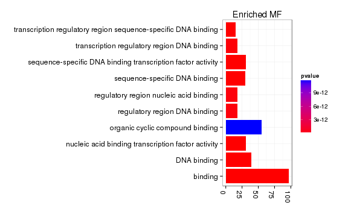 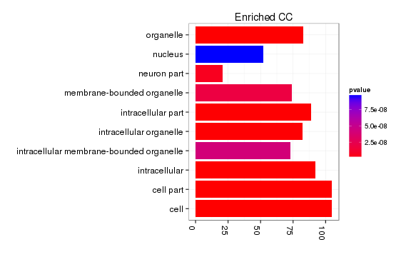   


# Peril

 

LacZ and genotyping heatmap

 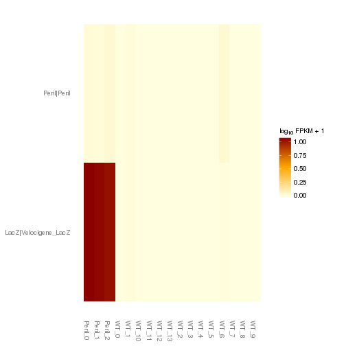 


```
## Error: object 'diffGeneSummary' not found
```


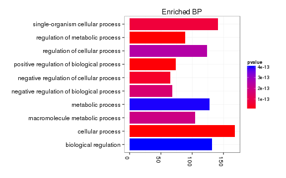  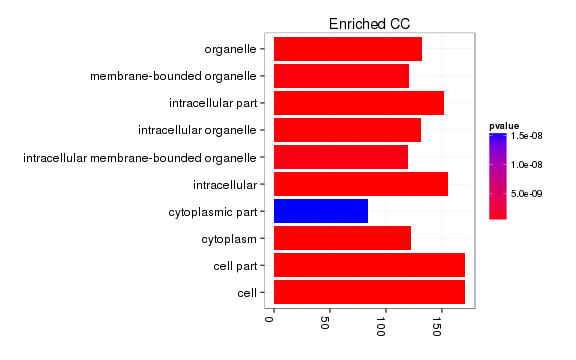 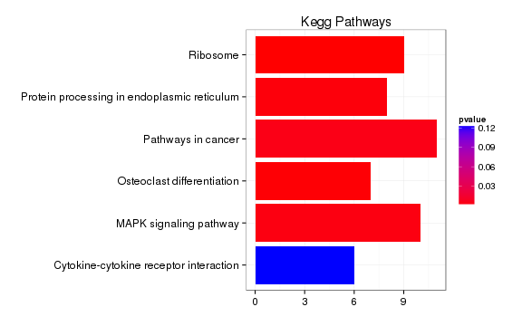 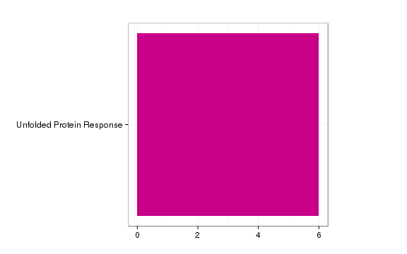 


## Peril Embryonic 

 


```
## Error: object 'diffGeneSummary' not found
```


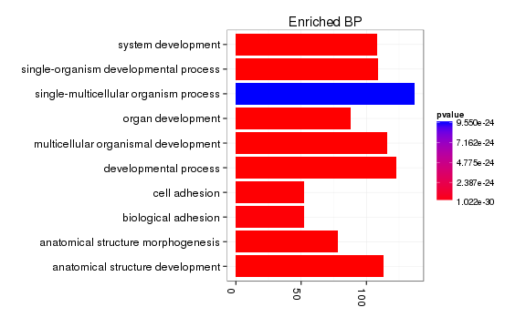 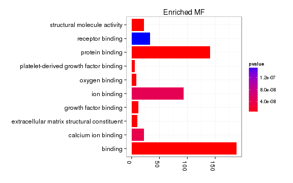  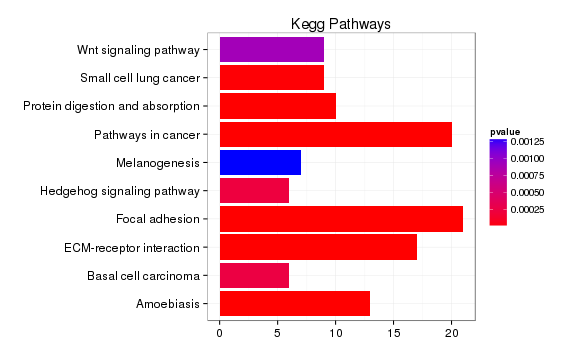 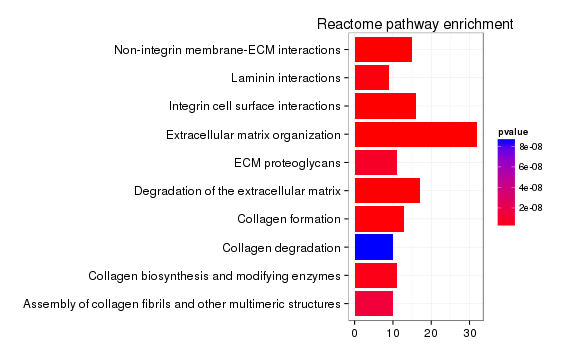 


# Tug1 

## Tug1 Adult 


```
## Error: object 'diffGeneSummary' not found
```


```
## [1] "ERROR: The estimated pi0 <= 0. Check that you have valid p-values or use another lambda method."
```

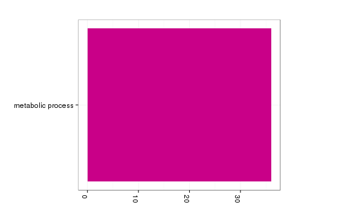 

```
## Error: 'x' and 'units' must have length > 0
```

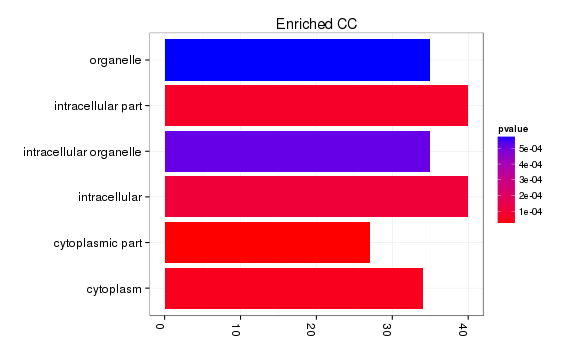 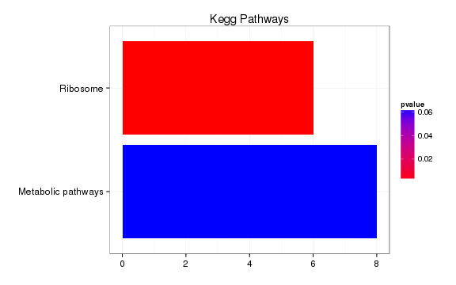 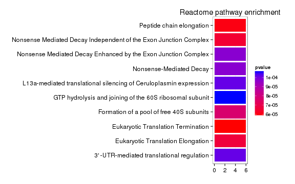 


```
## Error: argument "seed" is missing, with no default
```

```
## Error: error in evaluating the argument 'x' in selecting a method for function 'which': Error: object 'strain' not found
```

```
## Error: $ operator not defined for this S4 class
```

```
## Error: $ operator not defined for this S4 class
```

```
## Error: $ operator not defined for this S4 class
```

```
## Error: error in evaluating the argument 'x' in selecting a method for function 'which': Error in `==.default`(fullTable[, 40], chromosome) : 
##   comparison (1) is possible only for atomic and list types
## Calls: Ops.factor -> NextMethod
```

```
## Error: error in evaluating the argument 'x' in selecting a method for function 'nrow': Error in empty(.data) : object 'sigGenesRegion' not found
## Calls: ddply -> empty
```

```
## Error: error in evaluating the argument 'x' in selecting a method for function 'which': Error in `==.default`(fullTable[, 40], chromosome) : 
##   comparison (1) is possible only for atomic and list types
## Calls: Ops.factor -> NextMethod
```

```
## Error: $ operator not defined for this S4 class
```

```
## Error: object 'genesInRegion' not found
```

```
## Error: object 'genesInRegion' not found
```

```
## Error: object 'genesInRegion' not found
```

```
## Error: object 'genesInRegion' not found
```

```
## Error: object of type 'closure' is not subsettable
```

```
## Error: ggplot2 doesn't know how to deal with data of class function
```

## Tug1 Embryonic 


```
## Error: error in evaluating the argument 'x' in selecting a method for function 'which': Error: object 'strain' not found
```

```
## Error: $ operator not defined for this S4 class
```

```
## Error: $ operator not defined for this S4 class
```

```
## Error: $ operator not defined for this S4 class
```

```
## Error: error in evaluating the argument 'x' in selecting a method for function 'which': Error in `==.default`(fullTable[, 40], chromosome) : 
##   comparison (1) is possible only for atomic and list types
## Calls: Ops.factor -> NextMethod
```

```
## Error: error in evaluating the argument 'x' in selecting a method for function 'nrow': Error in empty(.data) : object 'sigGenesRegion' not found
## Calls: ddply -> empty
```

```
## Error: error in evaluating the argument 'x' in selecting a method for function 'which': Error in `==.default`(fullTable[, 40], chromosome) : 
##   comparison (1) is possible only for atomic and list types
## Calls: Ops.factor -> NextMethod
```

```
## Error: $ operator not defined for this S4 class
```

```
## Error: object 'genesInRegion' not found
```

```
## Error: object 'genesInRegion' not found
```

```
## Error: object 'genesInRegion' not found
```

```
## Error: object 'genesInRegion' not found
```

```
## Error: object of type 'closure' is not subsettable
```

```
## Error: ggplot2 doesn't know how to deal with data of class function
```


Examples 
========================================================

# Adult

## Kantr

## Brn1a 

## Trp53cor1

## Tug1


# Embryo

## Crnde 

## Eldr

## Kantr 

## Manr

## Peril

## linc-Cox2

## linc-Enc1 

