Interesting Strains 
========================================================

```
## Loading required package: BiocGenerics
## Loading required package: parallel
## 
## Attaching package: 'BiocGenerics'
## 
## The following objects are masked from 'package:parallel':
## 
##     clusterApply, clusterApplyLB, clusterCall, clusterEvalQ,
##     clusterExport, clusterMap, parApply, parCapply, parLapply,
##     parLapplyLB, parRapply, parSapply, parSapplyLB
## 
## The following object is masked from 'package:stats':
## 
##     xtabs
## 
## The following objects are masked from 'package:base':
## 
##     anyDuplicated, append, as.data.frame, as.vector, cbind,
##     colnames, duplicated, eval, evalq, Filter, Find, get,
##     intersect, is.unsorted, lapply, Map, mapply, match, mget,
##     order, paste, pmax, pmax.int, pmin, pmin.int, Position, rank,
##     rbind, Reduce, rep.int, rownames, sapply, setdiff, sort,
##     table, tapply, union, unique, unlist
## 
## Loading required package: RSQLite
## Loading required package: DBI
## Loading required package: ggplot2
## Loading required package: reshape2
## Loading required package: fastcluster
## 
## Attaching package: 'fastcluster'
## 
## The following object is masked from 'package:stats':
## 
##     hclust
## 
## Loading required package: rtracklayer
## Loading required package: GenomicRanges
## Loading required package: IRanges
## Loading required package: XVector
## Loading required package: Gviz
## Loading required package: grid
## 
## Attaching package: 'cummeRbund'
## 
## The following object is masked from 'package:GenomicRanges':
## 
##     promoters
## 
## The following object is masked from 'package:IRanges':
## 
##     promoters
## 
## The following object is masked from 'package:BiocGenerics':
## 
##     conditions
## 
## 
## Attaching package: 'limma'
## 
## The following object is masked from 'package:BiocGenerics':
## 
##     plotMA
## 
## KernSmooth 2.23 loaded
## Copyright M. P. Wand 1997-2009
## 
## Attaching package: 'gplots'
## 
## The following object is masked from 'package:rtracklayer':
## 
##     space
## 
## The following object is masked from 'package:IRanges':
## 
##     space
## 
## The following object is masked from 'package:stats':
## 
##     lowess
```

```
## Error: object 'cachepath' not found
```

# Kantr

## Adult Kantr


```r
dir<-"/n/rinn_data1/seq/lgoff/Projects/BrainMap/data/diffs/Kantr_vs_WT_Adult"
alpha<-0.05
setwd(dir)
id<-"Kantr"
cuff<-readCufflinks(gtfFile="/n/rinn_data1/seq/lgoff/Projects/BrainMap/data/annotation/mm10_gencode_vM2_with_lncRNAs_and_LacZ.gtf",genome="mm10") 
csDendro(genes(cuff),replicates=TRUE)
```

 

```
## 'dendrogram' with 2 branches and 6 members total, at height 0.06618
```

```r
myGene<-getGene(cuff,id)
```


```r
sigAdult<-getSig(cuff, alpha=alpha)
```


```r
library(ReactomePA)
```

```
## Loading required package: AnnotationDbi
## Loading required package: Biobase
## Welcome to Bioconductor
## 
##     Vignettes contain introductory material; view with
##     'browseVignettes()'. To cite Bioconductor, see
##     'citation("Biobase")', and for packages 'citation("pkgname")'.
## 
## 
## Attaching package: 'Biobase'
## 
## The following object is masked from 'package:cummeRbund':
## 
##     samples
```

```
## Warning: Can't find a usable tk.tcl in the following directories: 
##     /n/sw/centos6/tcl8.5.14/lib/tcl8.5/tk8.5 /n/sw/centos6/tcl8.5.14/lib/tk8.5 ./lib/tk8.5 ./library
## 
## 
## 
## This probably means that tk wasn't installed properly.
```

```
## 
```

```r
library(DOSE)
```

```
## 
## Attaching package: 'DOSE'
## 
## The following object is masked from 'package:ReactomePA':
## 
##     gseAnalyzer
```

```r
library(clusterProfiler)
```

```
## 
## KEGG.db contains mappings based on older data because the original
##   resource was removed from the the public domain before the most
##   recent update was produced. This package should now be
##   considered deprecated and future versions of Bioconductor may
##   not have it available.  Users who want more current data are
##   encouraged to look at the KEGGREST or reactome.db packages
```

```r
require(biomaRt)
```

```
## Loading required package: biomaRt
## 
## Attaching package: 'biomaRt'
## 
## The following object is masked from 'package:cummeRbund':
## 
##     getGene
```

```r
ensembl <- useMart("ENSEMBL_MART_ENSEMBL","mmusculus_gene_ensembl", 
host="www.ensembl.org")

#Get entrezIDs
getEntrezIDs<-function (geneNames)
{
    tmp <- getBM(attributes = c("entrezgene"), filters = "mgi_symbol", values = geneNames, mart = ensembl)
    tmp
}
```


```r
sigGeneIDs<-getSig(cuff, alpha=alpha)
sigGenes<-getGenes(cuff,sigGeneIDs)
geneAnnot<-annotation(sigGenes)
geneNames<-geneAnnot$gene_short_name
sigDiff<-diffData(sigGenes)
sigEntrez<-getEntrezIDs(geneNames)
sigEZ<-strsplit(as.character(sigEntrez), ", ")
sigEZ<-unlist(sigEZ)
require(org.Mm.eg.db) #mapping of entrez IDs to genbank
```

```
## Loading required package: org.Mm.eg.db
```

```r
#goBP<-enrichGO(gene=sigEZ, organism="mouse",ont="BP",pvalueCutoff=0.01,readable=T)

goMF<-enrichGO(gene=sigEZ, organism="mouse",ont="MF",pvalueCutoff=0.01,readable=T)
```

```
## Loading required package: GO.db
```

```r
#goCC<-enrichGO(gene=sigEZ, organism="mouse",ont="CC",pvalueCutoff=0.01,readable=T)

kegg<-enrichKEGG(gene=sigEZ, organism="mouse",pvalueCutoff=1, readable=T)

#pathway<-enrichPathway(gene=sigEZ,organism="mouse",pvalueCutoff=0.01, readable=T)
```


```r
#plot(goBP,showCategory=10) + theme(axis.text.x=element_text(angle=-90,hjust=0)) + ggtitle("Enriched BP")

plot(goMF,showCategory=10) + theme(axis.text.x=element_text(angle=-90,hjust=0)) + ggtitle("Enriched MF")
```

 

```r
#plot(goCC,showCategory=10) + theme(axis.text.x=element_text(angle=-90,hjust=0)) + ggtitle("Enriched CC")

plot(kegg, showCategory=10) + ggtitle("Kegg Pathways")
```

 

```r
#plot(pathway,showCategory=10) + ggtitle("Reactome pathway enrichment")
detach("package:biomaRt")
```


## Embryo Kantr


```r
dir<-"/n/rinn_data1/seq/lgoff/Projects/BrainMap/data/diffs/Kantr_vs_WT_Embryonic"
setwd(dir)
cuff<-readCufflinks(gtfFile="/n/rinn_data1/seq/lgoff/Projects/BrainMap/data/annotation/mm10_gencode_vM2_with_lncRNAs_and_LacZ.gtf",genome="mm10") 
csDendro(genes(cuff),replicates=TRUE)
```

 

```
## 'dendrogram' with 2 branches and 6 members total, at height 0.07638
```

```r
myGene<-getGene(cuff,id)
```


```r
sigEmbryo<-getSig(cuff, alpha=alpha)
```

There are 313 differentially expressed genes in Kantr adult brain and 785 in Kantr embryos. 


```r
library(ReactomePA)
library(DOSE)


library(clusterProfiler)
require(biomaRt)
```

```
## Loading required package: biomaRt
## 
## Attaching package: 'biomaRt'
## 
## The following object is masked from 'package:cummeRbund':
## 
##     getGene
```

```r
ensembl <- useMart("ENSEMBL_MART_ENSEMBL","mmusculus_gene_ensembl", 
host="www.ensembl.org")

#Get entrezIDs
getEntrezIDs<-function (geneNames)
{
    tmp <- getBM(attributes = c("entrezgene"), filters = "mgi_symbol", values = geneNames, mart = ensembl)
    tmp
}
```


```r
sigGeneIDs<-getSig(cuff, alpha=alpha)
sigGenes<-getGenes(cuff,sigGeneIDs)
geneAnnot<-annotation(sigGenes)
geneNames<-geneAnnot$gene_short_name
sigDiff<-diffData(sigGenes)

sigEntrez<-getEntrezIDs(geneNames)
sigEZ<-strsplit(as.character(sigEntrez), ", ")
sigEZ<-unlist(sigEZ)
require(org.Mm.eg.db) #mapping of entrez IDs to genbank

goBP<-enrichGO(gene=sigEZ, organism="mouse",ont="BP",pvalueCutoff=0.01,readable=T)

goMF<-enrichGO(gene=sigEZ, organism="mouse",ont="MF",pvalueCutoff=0.01,readable=T)

goCC<-enrichGO(gene=sigEZ, organism="mouse",ont="CC",pvalueCutoff=0.01,readable=T)

kegg<-enrichKEGG(gene=sigEZ, organism="mouse",pvalueCutoff=1, readable=T)

pathway<-enrichPathway(gene=sigEZ,organism="mouse",pvalueCutoff=0.01, readable=T)
```


```r
plot(goBP,showCategory=10) + theme(axis.text.x=element_text(angle=-90,hjust=0)) + ggtitle("Enriched BP")
```

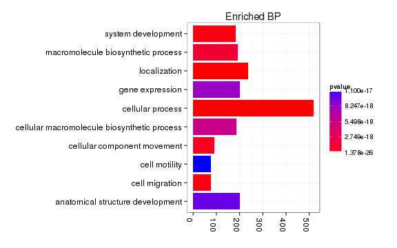 

```r
plot(goMF,showCategory=10) + theme(axis.text.x=element_text(angle=-90,hjust=0)) + ggtitle("Enriched MF")
```

 

```r
plot(goCC,showCategory=10) + theme(axis.text.x=element_text(angle=-90,hjust=0)) + ggtitle("Enriched CC")
```

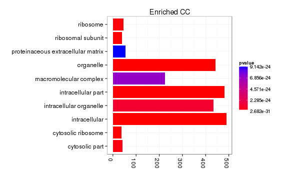 

```r
plot(kegg, showCategory=10) + ggtitle("Kegg Pathways")
```

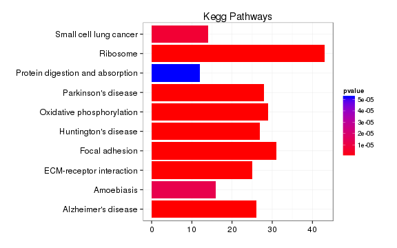 

```r
plot(pathway,showCategory=10) + ggtitle("Reactome pathway enrichment")
```

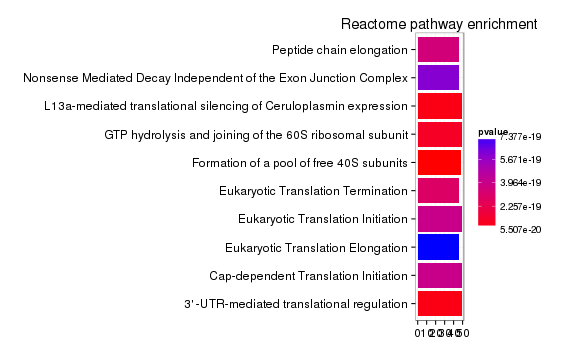 

```r
detach("package:biomaRt")
```


# Crnde

## Adult Crnde 


```r
dir<-"/n/rinn_data1/seq/lgoff/Projects/BrainMap/data/diffs/Crnde_vs_WT_Adult"
setwd(dir)
cuff<-readCufflinks(gtfFile="/n/rinn_data1/seq/lgoff/Projects/BrainMap/data/annotation/mm10_gencode_vM2_with_lncRNAs_and_LacZ.gtf",genome="mm10") 
id<-"Crnde"
myGene<-getGene(cuff,id)
expressionBarplot(isoforms(myGene), replicates=T)
```

 


```r
sig<-getSig(cuff, alpha=alpha)
diffGeneSummary$Crnde_vs_WT_Adult<-length(sig)
```

```
## Error: object 'diffGeneSummary' not found
```


```r
library(ReactomePA)
library(DOSE)
library(clusterProfiler)
require(biomaRt)
```

```
## Loading required package: biomaRt
## 
## Attaching package: 'biomaRt'
## 
## The following object is masked from 'package:cummeRbund':
## 
##     getGene
```

```r
ensembl <- useMart("ENSEMBL_MART_ENSEMBL","mmusculus_gene_ensembl", 
host="www.ensembl.org")
```


```r
sigGeneIDs<-getSig(cuff, alpha=alpha)
sigGenes<-getGenes(cuff,sigGeneIDs)
geneAnnot<-annotation(sigGenes)
geneNames<-geneAnnot$gene_short_name
sigDiff<-diffData(sigGenes)
sigEntrez<-getEntrezIDs(geneNames)
sigEZ<-strsplit(as.character(sigEntrez), ", ")
sigEZ<-unlist(sigEZ)
require(org.Mm.eg.db) #mapping of entrez IDs to genbank

goBP<-enrichGO(gene=sigEZ, organism="mouse",ont="BP",pvalueCutoff=0.01,readable=T)

goMF<-enrichGO(gene=sigEZ, organism="mouse",ont="MF",pvalueCutoff=0.01,readable=T)

#goCC<-enrichGO(gene=sigEZ, organism="mouse",ont="CC",pvalueCutoff=0.01,readable=T)

#kegg<-enrichKEGG(gene=sigEZ, organism="mouse",pvalueCutoff=1, readable=T)

#pathway<-enrichPathway(gene=sigEZ,organism="mouse",pvalueCutoff=0.01, readable=T)
```


```r
plot(goBP,showCategory=10) + theme(axis.text.x=element_text(angle=-90,hjust=0)) + ggtitle("Enriched BP")
```

 

```r
plot(goMF,showCategory=10) + theme(axis.text.x=element_text(angle=-90,hjust=0)) + ggtitle("Enriched MF")
```

 

```r
#plot(goCC,showCategory=10) + theme(axis.text.x=element_text(angle=-90,hjust=0)) + ggtitle("Enriched CC")

#plot(kegg, showCategory=10) + ggtitle("Kegg Pathways")

#plot(pathway,showCategory=10) + ggtitle("Reactome pathway enrichment")
detach("package:biomaRt")
```

## Embryo Crnde 


```r
dir<-"/n/rinn_data1/seq/lgoff/Projects/BrainMap/data/diffs/Crnde_vs_WT_Embryonic"
setwd(dir)
cuff<-readCufflinks(gtfFile="/n/rinn_data1/seq/lgoff/Projects/BrainMap/data/annotation/mm10_gencode_vM2_with_lncRNAs_and_LacZ.gtf",genome="mm10") 
csDendro(genes(cuff),replicates=TRUE)
```

 

```
## 'dendrogram' with 2 branches and 17 members total, at height 0.08401
```

Endogenous expression (isoforms)


```r
id<-"Crnde"
myGene<-getGene(cuff,id)
expressionBarplot(isoforms(myGene), replicates=T)
```

 

LacZ and genotyping heatmap


```r
sig<-getSig(cuff, alpha=alpha)
diffGeneSummary$Crnde_vs_WT_Embryonic<-length(sig)
```

```
## Error: object 'diffGeneSummary' not found
```


```r
library(ReactomePA)
library(DOSE)
library(clusterProfiler)
require(biomaRt)
```

```
## Loading required package: biomaRt
## 
## Attaching package: 'biomaRt'
## 
## The following object is masked from 'package:cummeRbund':
## 
##     getGene
```

```r
ensembl <- useMart("ENSEMBL_MART_ENSEMBL","mmusculus_gene_ensembl", 
host="www.ensembl.org")

#Get entrezIDs
getEntrezIDs<-function (geneNames)
{
    tmp <- getBM(attributes = c("entrezgene"), filters = "mgi_symbol", values = geneNames, mart = ensembl)
    tmp
}
```


```r
sigGeneIDs<-getSig(cuff, alpha=alpha)
sigGenes<-getGenes(cuff,sigGeneIDs)
geneAnnot<-annotation(sigGenes)
geneNames<-geneAnnot$gene_short_name
sigDiff<-diffData(sigGenes)

sigEntrez<-getEntrezIDs(geneNames)
sigEZ<-strsplit(as.character(sigEntrez), ", ")
sigEZ<-unlist(sigEZ)
require(org.Mm.eg.db) #mapping of entrez IDs to genbank

goBP<-enrichGO(gene=sigEZ, organism="mouse",ont="BP",pvalueCutoff=0.01,readable=T)

goMF<-enrichGO(gene=sigEZ, organism="mouse",ont="MF",pvalueCutoff=0.01,readable=T)

goCC<-enrichGO(gene=sigEZ, organism="mouse",ont="CC",pvalueCutoff=0.01,readable=T)

kegg<-enrichKEGG(gene=sigEZ, organism="mouse",pvalueCutoff=1, readable=T)
```

```
## [1] "ERROR: The estimated pi0 <= 0. Check that you have valid p-values or use another lambda method."
```

```r
pathway<-enrichPathway(gene=sigEZ,organism="mouse",pvalueCutoff=0.01, readable=T)
```


```r
plot(goBP,showCategory=10) + theme(axis.text.x=element_text(angle=-90,hjust=0)) + ggtitle("Enriched BP")
```

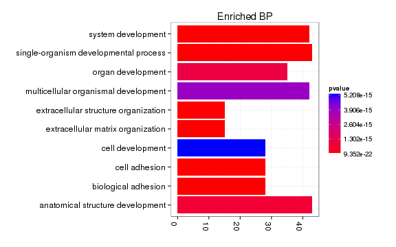 

```r
plot(goMF,showCategory=10) + theme(axis.text.x=element_text(angle=-90,hjust=0)) + ggtitle("Enriched MF")
```

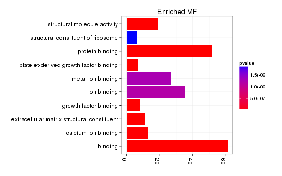 

```r
plot(goCC,showCategory=10) + theme(axis.text.x=element_text(angle=-90,hjust=0)) + ggtitle("Enriched CC")
```

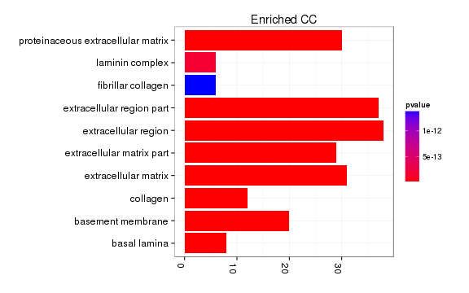 

```r
plot(kegg, showCategory=10) + ggtitle("Kegg Pathways")
```

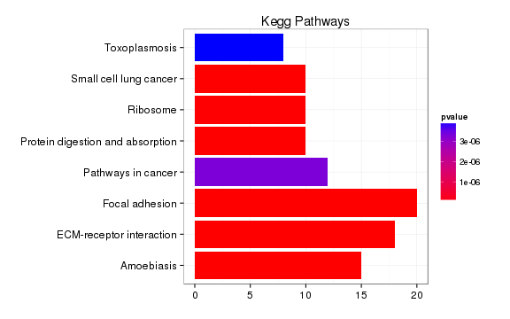 

```r
plot(pathway,showCategory=10) + ggtitle("Reactome pathway enrichment")
```

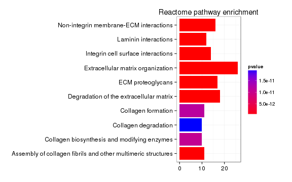 

```r
detach("package:biomaRt")
```

# Brn1b

## Adult Brn1b 


```r
dir<-"/n/rinn_data1/seq/lgoff/Projects/BrainMap/data/diffs/linc-Brn1b_vs_WT_Adult/"
setwd(dir)
cuff<-readCufflinks(gtfFile="/n/rinn_data1/seq/lgoff/Projects/BrainMap/data/annotation/mm10_gencode_vM2_with_lncRNAs_and_LacZ.gtf",genome="mm10") 
sig<-getSig(cuff, alpha=alpha)
diffGeneSummary$lincBrn1b_vs_WT_Adult<-length(sig)
```

```
## Error: object 'diffGeneSummary' not found
```


```r
library(ReactomePA)
library(DOSE)
library(clusterProfiler)
require(biomaRt)
```

```
## Loading required package: biomaRt
## 
## Attaching package: 'biomaRt'
## 
## The following object is masked from 'package:cummeRbund':
## 
##     getGene
```

```r
ensembl <- useMart("ENSEMBL_MART_ENSEMBL","mmusculus_gene_ensembl", 
host="www.ensembl.org")

#Get entrezIDs
getEntrezIDs<-function (geneNames)
{
    tmp <- getBM(attributes = c("entrezgene"), filters = "mgi_symbol", values = geneNames, mart = ensembl)
    tmp
}
```


```r
sigGeneIDs<-getSig(cuff, alpha=alpha)
sigGenes<-getGenes(cuff,sigGeneIDs)
geneAnnot<-annotation(sigGenes)
geneNames<-geneAnnot$gene_short_name
sigDiff<-diffData(sigGenes)

sigEntrez<-getEntrezIDs(geneNames)
sigEZ<-strsplit(as.character(sigEntrez), ", ")
sigEZ<-unlist(sigEZ)
require(org.Mm.eg.db) #mapping of entrez IDs to genbank

goBP<-enrichGO(gene=sigEZ, organism="mouse",ont="BP",pvalueCutoff=0.01,readable=T)

goMF<-enrichGO(gene=sigEZ, organism="mouse",ont="MF",pvalueCutoff=0.01,readable=T)

goCC<-enrichGO(gene=sigEZ, organism="mouse",ont="CC",pvalueCutoff=0.01,readable=T)

kegg<-enrichKEGG(gene=sigEZ, organism="mouse",pvalueCutoff=1, readable=T)

pathway<-enrichPathway(gene=sigEZ,organism="mouse",pvalueCutoff=0.01, readable=T)
```


```r
plot(goBP,showCategory=10) + theme(axis.text.x=element_text(angle=-90,hjust=0)) + ggtitle("Enriched BP")
```

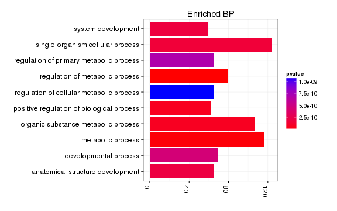 

```r
plot(goMF,showCategory=10) + theme(axis.text.x=element_text(angle=-90,hjust=0)) + ggtitle("Enriched MF")
```

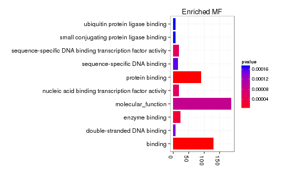 

```r
#plot(goCC,showCategory=10) + theme(axis.text.x=element_text(angle=-90,hjust=0)) + ggtitle("Enriched CC")

plot(kegg, showCategory=10) + ggtitle("Kegg Pathways")
```

 

```r
plot(pathway,showCategory=10) + ggtitle("Reactome pathway enrichment")
```

 

```r
detach("package:biomaRt")
```

## Embryonic Brn1b


```r
dir<-"/n/rinn_data1/seq/lgoff/Projects/BrainMap/data/diffs/linc-Brn1b_vs_WT_Embryonic"
setwd(dir)
cuff<-readCufflinks(gtfFile="/n/rinn_data1/seq/lgoff/Projects/BrainMap/data/annotation/mm10_gencode_vM2_with_lncRNAs_and_LacZ.gtf",genome="mm10") 
sig<-getSig(cuff, alpha=alpha)
diffGeneSummary$lincBrn1b_vs_WT_Embryonic<-length(sig)
```

```
## Error: object 'diffGeneSummary' not found
```

Number of differentially expressed embryonic genes:131


```r
library(ReactomePA)
library(DOSE)
library(clusterProfiler)
require(biomaRt)
```

```
## Loading required package: biomaRt
## 
## Attaching package: 'biomaRt'
## 
## The following object is masked from 'package:cummeRbund':
## 
##     getGene
```

```r
ensembl <- useMart("ENSEMBL_MART_ENSEMBL","mmusculus_gene_ensembl", 
host="www.ensembl.org")

#Get entrezIDs
getEntrezIDs<-function (geneNames)
{
    tmp <- getBM(attributes = c("entrezgene"), filters = "mgi_symbol", values = geneNames, mart = ensembl)
    tmp
}
```


```r
sigGeneIDs<-getSig(cuff, alpha=alpha)
sigGenes<-getGenes(cuff,sigGeneIDs)
geneAnnot<-annotation(sigGenes)
geneNames<-geneAnnot$gene_short_name
sigDiff<-diffData(sigGenes)

sigEntrez<-getEntrezIDs(geneNames)
sigEZ<-strsplit(as.character(sigEntrez), ", ")
sigEZ<-unlist(sigEZ)
require(org.Mm.eg.db) #mapping of entrez IDs to genbank

goBP<-enrichGO(gene=sigEZ, organism="mouse",ont="BP",pvalueCutoff=0.01,readable=T)

goMF<-enrichGO(gene=sigEZ, organism="mouse",ont="MF",pvalueCutoff=0.01,readable=T)

goCC<-enrichGO(gene=sigEZ, organism="mouse",ont="CC",pvalueCutoff=0.01,readable=T)

# kegg<-enrichKEGG(gene=sigEZ, organism="mouse",pvalueCutoff=1, readable=T)

# pathway<-enrichPathway(gene=sigEZ,organism="mouse",pvalueCutoff=0.01, readable=T)
```


```r
plot(goBP,showCategory=10) + theme(axis.text.x=element_text(angle=-90,hjust=0)) + ggtitle("Enriched BP")
```

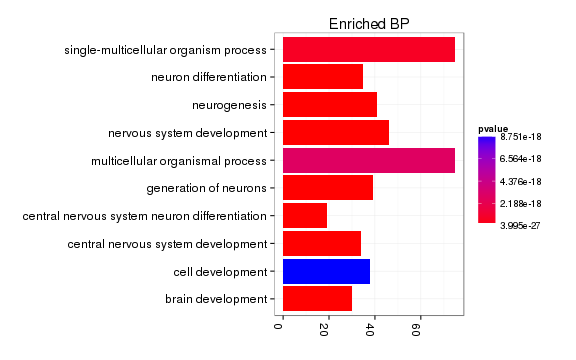 

```r
plot(goMF,showCategory=10) + theme(axis.text.x=element_text(angle=-90,hjust=0)) + ggtitle("Enriched MF")
```

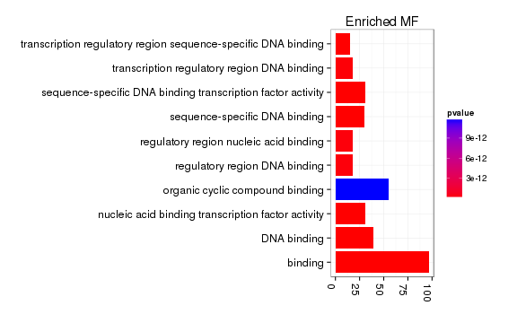 

```r
plot(goCC,showCategory=10) + theme(axis.text.x=element_text(angle=-90,hjust=0)) + ggtitle("Enriched CC")
```

 

```r
plot(kegg, showCategory=10) + ggtitle("Kegg Pathways")
```

 

```r
plot(pathway,showCategory=10) + ggtitle("Reactome pathway enrichment")
```

 

```r
detach("package:biomaRt")
```


# Peril


```r
dir<-"/n/rinn_data1/seq/lgoff/Projects/BrainMap/data/diffs/Peril_vs_WT_Adult"
setwd(dir)
cuff<-readCufflinks(gtfFile="/n/rinn_data1/seq/lgoff/Projects/BrainMap/data/annotation/mm10_gencode_vM2_with_lncRNAs_and_LacZ.gtf",genome="mm10") 
id<-"Peril"
myGene<-getGene(cuff,id)
expressionBarplot(isoforms(myGene), replicates=T)
```

 

LacZ and genotyping heatmap


```r
lz<-"LacZ"
myGene<-getGene(cuff,lz)
expressionBarplot(isoforms(myGene), replicates=T)
```

 

```r
ids<-c(id,lz)
myGenes<-getGenes(cuff,ids)
csHeatmap(myGenes,replicates=TRUE)
```

```
## Using tracking_id, rep_name as id variables
## No id variables; using all as measure variables
```

 


```r
sig<-getSig(cuff, alpha=alpha)
diffGeneSummary$Peril_vs_WT_Adult<-length(sig)
```

```
## Error: object 'diffGeneSummary' not found
```


```r
library(ReactomePA)
library(DOSE)
library(clusterProfiler)
require(biomaRt)
```

```
## Loading required package: biomaRt
## 
## Attaching package: 'biomaRt'
## 
## The following object is masked from 'package:cummeRbund':
## 
##     getGene
```

```r
ensembl <- useMart("ENSEMBL_MART_ENSEMBL","mmusculus_gene_ensembl", 
host="www.ensembl.org")

#Get entrezIDs
getEntrezIDs<-function (geneNames)
{
    tmp <- getBM(attributes = c("entrezgene"), filters = "mgi_symbol", values = geneNames, mart = ensembl)
    tmp
}
```


```r
sigGeneIDs<-getSig(cuff, alpha=alpha)
sigGenes<-getGenes(cuff,sigGeneIDs)
geneAnnot<-annotation(sigGenes)
geneNames<-geneAnnot$gene_short_name
sigDiff<-diffData(sigGenes)

sigEntrez<-getEntrezIDs(geneNames)
sigEZ<-strsplit(as.character(sigEntrez), ", ")
sigEZ<-unlist(sigEZ)
require(org.Mm.eg.db) #mapping of entrez IDs to genbank

goBP<-enrichGO(gene=sigEZ, organism="mouse",ont="BP",pvalueCutoff=0.01,readable=T)

goMF<-enrichGO(gene=sigEZ, organism="mouse",ont="MF",pvalueCutoff=0.01,readable=T)

goCC<-enrichGO(gene=sigEZ, organism="mouse",ont="CC",pvalueCutoff=0.01,readable=T)

 kegg<-enrichKEGG(gene=sigEZ, organism="mouse",pvalueCutoff=1, readable=T)

 pathway<-enrichPathway(gene=sigEZ,organism="mouse",pvalueCutoff=0.01, readable=T)
```


```r
plot(goBP,showCategory=10) + theme(axis.text.x=element_text(angle=-90,hjust=0)) + ggtitle("Enriched BP")
```

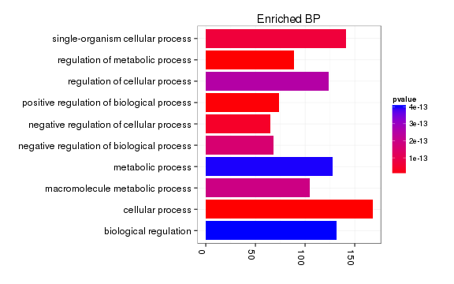 

```r
plot(goMF,showCategory=10) + theme(axis.text.x=element_text(angle=-90,hjust=0)) + ggtitle("Enriched MF")
```

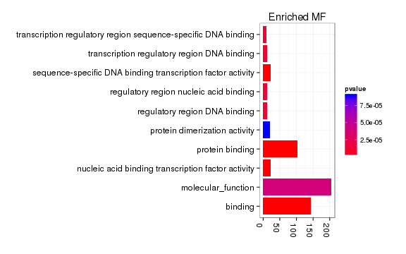 

```r
plot(goCC,showCategory=10) + theme(axis.text.x=element_text(angle=-90,hjust=0)) + ggtitle("Enriched CC")
```

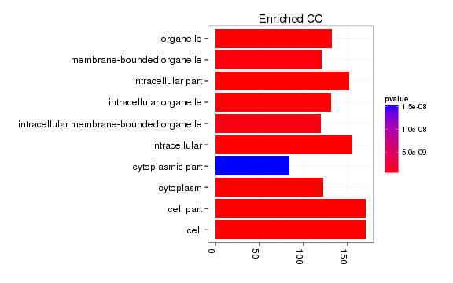 

```r
plot(kegg, showCategory=10) + ggtitle("Kegg Pathways")
```

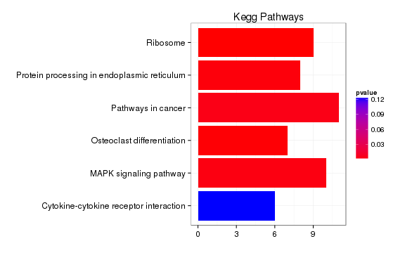 

```r
plot(pathway,showCategory=10) + ggtitle("Reactome pathway enrichment")
```

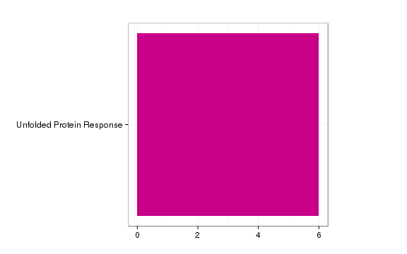 

```r
detach("package:biomaRt")
```


## Peril Embryonic 


```r
dir<-"/n/rinn_data1/seq/lgoff/Projects/BrainMap/data/diffs/Peril_vs_WT_Embryonic/"
setwd(dir)
cuff<-readCufflinks(gtfFile="/n/rinn_data1/seq/lgoff/Projects/BrainMap/data/annotation/mm10_gencode_vM2_with_lncRNAs_and_LacZ.gtf",genome="mm10") 
id<-"Peril"
myGene<-getGene(cuff,id)
expressionBarplot(isoforms(myGene), replicates=T)
```

 


```r
sig<-getSig(cuff, alpha=alpha)
diffGeneSummary$Peril_vs_WT_Embryonic<-length(sig)
```

```
## Error: object 'diffGeneSummary' not found
```


```r
library(ReactomePA)
library(DOSE)
library(clusterProfiler)
require(biomaRt)
```

```
## Loading required package: biomaRt
## 
## Attaching package: 'biomaRt'
## 
## The following object is masked from 'package:cummeRbund':
## 
##     getGene
```

```r
ensembl <- useMart("ENSEMBL_MART_ENSEMBL","mmusculus_gene_ensembl", 
host="www.ensembl.org")

#Get entrezIDs
getEntrezIDs<-function (geneNames)
{
    tmp <- getBM(attributes = c("entrezgene"), filters = "mgi_symbol", values = geneNames, mart = ensembl)
    tmp
}
```


```r
sigGeneIDs<-getSig(cuff, alpha=alpha)
sigGenes<-getGenes(cuff,sigGeneIDs)
geneAnnot<-annotation(sigGenes)
geneNames<-geneAnnot$gene_short_name
sigDiff<-diffData(sigGenes)

sigEntrez<-getEntrezIDs(geneNames)
sigEZ<-strsplit(as.character(sigEntrez), ", ")
sigEZ<-unlist(sigEZ)
require(org.Mm.eg.db) #mapping of entrez IDs to genbank

goBP<-enrichGO(gene=sigEZ, organism="mouse",ont="BP",pvalueCutoff=0.01,readable=T)

goMF<-enrichGO(gene=sigEZ, organism="mouse",ont="MF",pvalueCutoff=0.01,readable=T)

goCC<-enrichGO(gene=sigEZ, organism="mouse",ont="CC",pvalueCutoff=0.01,readable=T)

 kegg<-enrichKEGG(gene=sigEZ, organism="mouse",pvalueCutoff=1, readable=T)

 pathway<-enrichPathway(gene=sigEZ,organism="mouse",pvalueCutoff=0.01, readable=T)
```


```r
plot(goBP,showCategory=10) + theme(axis.text.x=element_text(angle=-90,hjust=0)) + ggtitle("Enriched BP")
```

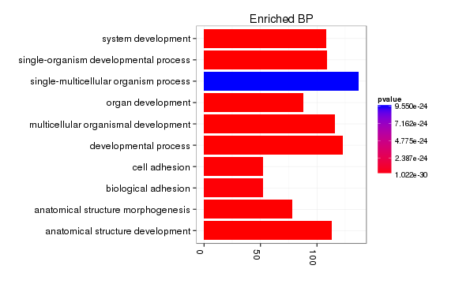 

```r
plot(goMF,showCategory=10) + theme(axis.text.x=element_text(angle=-90,hjust=0)) + ggtitle("Enriched MF")
```

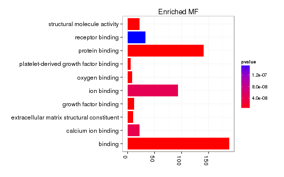 

```r
plot(goCC,showCategory=10) + theme(axis.text.x=element_text(angle=-90,hjust=0)) + ggtitle("Enriched CC")
```

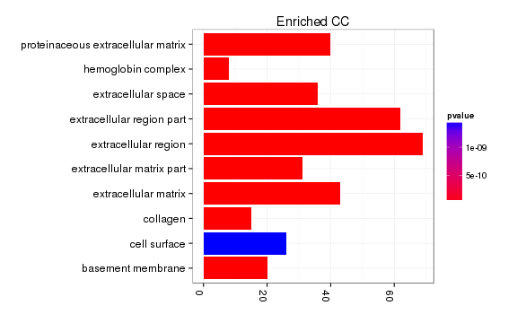 

```r
plot(kegg, showCategory=10) + ggtitle("Kegg Pathways")
```

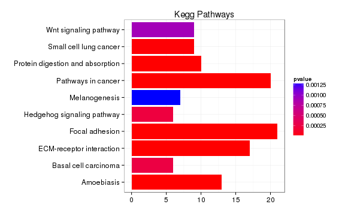 

```r
plot(pathway,showCategory=10) + ggtitle("Reactome pathway enrichment")
```

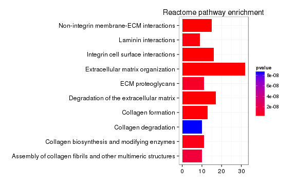 

```r
detach("package:biomaRt")
```


# Tug1 

## Tug1 Adult 


```r
dir<-"/n/rinn_data1/seq/lgoff/Projects/BrainMap/data/diffs/Tug1_vs_WT_Adult/"
setwd(dir)
cuff<-readCufflinks(gtfFile="/n/rinn_data1/seq/lgoff/Projects/BrainMap/data/annotation/mm10_gencode_vM2_with_lncRNAs_and_LacZ.gtf",genome="mm10") 
sig<-getSig(cuff, alpha=alpha)
diffGeneSummary$Tug1_vs_WT_Adult<-length(sig)
```

```
## Error: object 'diffGeneSummary' not found
```


```r
library(ReactomePA)
library(DOSE)
library(clusterProfiler)
require(biomaRt)
```

```
## Loading required package: biomaRt
## 
## Attaching package: 'biomaRt'
## 
## The following object is masked from 'package:cummeRbund':
## 
##     getGene
```

```r
ensembl <- useMart("ENSEMBL_MART_ENSEMBL","mmusculus_gene_ensembl", 
host="www.ensembl.org")

#Get entrezIDs
getEntrezIDs<-function (geneNames)
{
    tmp <- getBM(attributes = c("entrezgene"), filters = "mgi_symbol", values = geneNames, mart = ensembl)
    tmp
}
```


```r
sigGeneIDs<-getSig(cuff, alpha=alpha)
sigGenes<-getGenes(cuff,sigGeneIDs)
geneAnnot<-annotation(sigGenes)
geneNames<-geneAnnot$gene_short_name
sigDiff<-diffData(sigGenes)

sigEntrez<-getEntrezIDs(geneNames)
sigEZ<-strsplit(as.character(sigEntrez), ", ")
sigEZ<-unlist(sigEZ)
require(org.Mm.eg.db) #mapping of entrez IDs to genbank

goBP<-enrichGO(gene=sigEZ, organism="mouse",ont="BP",pvalueCutoff=0.01,readable=T)

goMF<-enrichGO(gene=sigEZ, organism="mouse",ont="MF",pvalueCutoff=0.01,readable=T)

goCC<-enrichGO(gene=sigEZ, organism="mouse",ont="CC",pvalueCutoff=0.01,readable=T)

 kegg<-enrichKEGG(gene=sigEZ, organism="mouse",pvalueCutoff=1, readable=T)

 pathway<-enrichPathway(gene=sigEZ,organism="mouse",pvalueCutoff=0.01, readable=T)
```

```
## [1] "ERROR: The estimated pi0 <= 0. Check that you have valid p-values or use another lambda method."
```


```r
plot(goBP,showCategory=10) + theme(axis.text.x=element_text(angle=-90,hjust=0)) + ggtitle("Enriched BP")
```

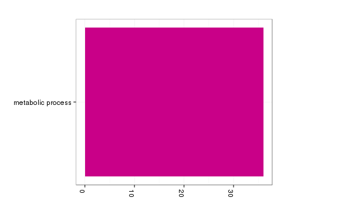 

```r
plot(goMF,showCategory=10) + theme(axis.text.x=element_text(angle=-90,hjust=0)) + ggtitle("Enriched MF")
```

```
## Error: 'x' and 'units' must have length > 0
```

```r
plot(goCC,showCategory=10) + theme(axis.text.x=element_text(angle=-90,hjust=0)) + ggtitle("Enriched CC")
```

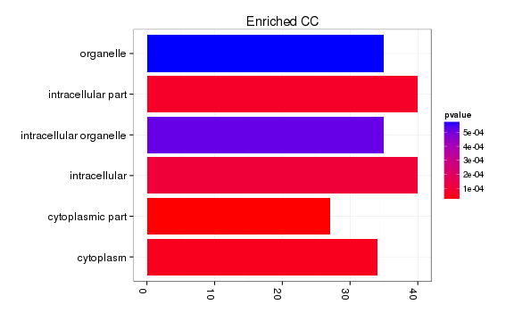 

```r
plot(kegg, showCategory=10) + ggtitle("Kegg Pathways")
```

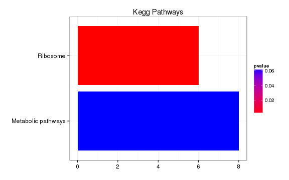 

```r
plot(pathway,showCategory=10) + ggtitle("Reactome pathway enrichment")
```

 

```r
detach("package:biomaRt")
```


```r
library(BSgenome.Mmusculus.UCSC.mm10)
```

```
## Loading required package: BSgenome
## Loading required package: Biostrings
## 
## Attaching package: 'BSgenome'
## 
## The following object is masked from 'package:AnnotationDbi':
## 
##     species
```

```r
library(seqbias)
library(stringr)
library(plyr)
```

```
## 
## Attaching package: 'plyr'
## 
## The following object is masked from 'package:cummeRbund':
## 
##     count
## 
## The following object is masked from 'package:XVector':
## 
##     compact
## 
## The following objects are masked from 'package:IRanges':
## 
##     desc, rename
```

```r
myLengths<-seqlengths(Mmusculus)[!grepl("_random",names(seqlengths(Mmusculus)))]
mm10.granges<-GRanges(seqnames = names(myLengths), ranges = IRanges(start = 1, end = myLengths),seqlengths=myLengths)

#Constants
nIter<-1000
windowSize<-2000000
set.seed()
```

```
## Error: argument "seed" is missing, with no default
```

```r
myRandom<-random.intervals(mm10.granges,n=nIter,ms=windowSize)

getTable<-function(object){
  fullTable<-diffTable(genes(object))
  write("First Split",stderr())
  firstSplit<-str_split_fixed(fullTable$locus,":",2)
  write("Second Split",stderr())
  secondSplit<-str_split_fixed(firstSplit[,2],"-",2)
  fullTable$chromosome<-firstSplit[,1]
  fullTable$start<-as.numeric(secondSplit[,1])
  fullTable$end<-as.numeric(secondSplit[,2])
  fullTable<-fullTable[fullTable$chromosome %in% names(seqlengths(mm10.granges)),]
  fullTable$chromosome<-factor(fullTable$chromosome, levels=names(seqlengths(mm10.granges)))
  fullTable
}
fullTable<-getTable(cuff)

myGene<-fullTable[which(fullTable$gene_short_name==strain),][1,] #any problems w this?
```

```
## Error: error in evaluating the argument 'x' in selecting a method for function 'which': Error: object 'strain' not found
```

```r
chromosome<-myGene$chromosome
```

```
## Error: $ operator not defined for this S4 class
```

```r
start<-myGene$start-(windowSize/2)
```

```
## Error: $ operator not defined for this S4 class
```

```r
end<-myGene$end+(windowSize/2)
```

```
## Error: $ operator not defined for this S4 class
```

```r
sigGenesRegion<-fullTable[which(fullTable[,40]==chromosome & fullTable[,39]=="yes" & fullTable[,9]>=start & fullTable[,10]<=end),]
```

```
## Error: error in evaluating the argument 'x' in selecting a method for function 'which': Error in `==.default`(fullTable[, 40], chromosome) : 
##   comparison (1) is possible only for atomic and list types
## Calls: Ops.factor -> NextMethod
```

```r
nSig<-nrow(ddply(sigGenesRegion,.(gene_name),head,n=1))
```

```
## Error: error in evaluating the argument 'x' in selecting a method for function 'nrow': Error in empty(.data) : object 'sigGenesRegion' not found
## Calls: ddply -> empty
```

```r
genesInRegion<-fullTable[which(fullTable[,40]==chromosome & fullTable[,9]>=start & fullTable[,10]<=end),]
```

```
## Error: error in evaluating the argument 'x' in selecting a method for function 'which': Error in `==.default`(fullTable[, 40], chromosome) : 
##   comparison (1) is possible only for atomic and list types
## Calls: Ops.factor -> NextMethod
```

```r
genesInRegion$start<-myGene$start-genesInRegion$start
```

```
## Error: $ operator not defined for this S4 class
```

```r
colnames(genesInRegion)[39]<-"sig"
```

```
## Error: object 'genesInRegion' not found
```

```r
colnames(genesInRegion)[35]<-"log2foldchange"
```

```
## Error: object 'genesInRegion' not found
```

```r
colnames(genesInRegion)[36]<-"test_stat"
```

```
## Error: object 'genesInRegion' not found
```

```r
data<-ddply(genesInRegion,.(gene_id),head,n=1)
```

```
## Error: object 'genesInRegion' not found
```

```r
data$test_stat<-as.numeric(data$test_stat)
```

```
## Error: object of type 'closure' is not subsettable
```

```r
ggplot(data,aes(start,test_stat,color=sig))+geom_point()+scale_color_manual(values=c("black", "red"))+coord_cartesian(xlim=c(-windowSize/2, windowSize/2))+labs(title=strain)
```

```
## Error: ggplot2 doesn't know how to deal with data of class function
```

## Tug1 Embryonic 


```r
dir<-"/n/rinn_data1/seq/lgoff/Projects/BrainMap/data/diffs/Tug1_vs_WT_Embryonic/"
setwd(dir)
cuff<-readCufflinks(gtfFile="/n/rinn_data1/seq/lgoff/Projects/BrainMap/data/annotation/mm10_gencode_vM2_with_lncRNAs_and_LacZ.gtf",genome="mm10") 
id<-"Tug1"
myGene<-getGene(cuff,id)
expressionBarplot(isoforms(myGene), replicates=T)
```

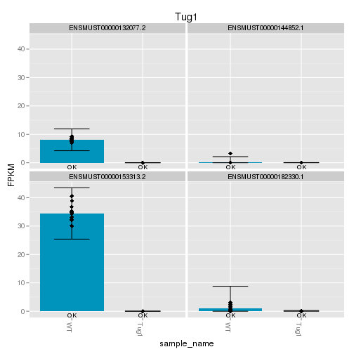 


```r
sig<-getSig(cuff, alpha=alpha)
diffGeneSummary$Tug1_vs_WT_Embryonic<-length(sig)
```

```
## Error: object 'diffGeneSummary' not found
```


```r
fullTable<-getTable(cuff)

myGene<-fullTable[which(fullTable$gene_short_name==strain),][1,] #any problems w this?
```

```
## Error: error in evaluating the argument 'x' in selecting a method for function 'which': Error: object 'strain' not found
```

```r
chromosome<-myGene$chromosome
```

```
## Error: $ operator not defined for this S4 class
```

```r
start<-myGene$start-(windowSize/2)
```

```
## Error: $ operator not defined for this S4 class
```

```r
end<-myGene$end+(windowSize/2)
```

```
## Error: $ operator not defined for this S4 class
```

```r
sigGenesRegion<-fullTable[which(fullTable[,40]==chromosome & fullTable[,39]=="yes" & fullTable[,9]>=start & fullTable[,10]<=end),]
```

```
## Error: error in evaluating the argument 'x' in selecting a method for function 'which': Error in `==.default`(fullTable[, 40], chromosome) : 
##   comparison (1) is possible only for atomic and list types
## Calls: Ops.factor -> NextMethod
```

```r
nSig<-nrow(ddply(sigGenesRegion,.(gene_name),head,n=1))
```

```
## Error: error in evaluating the argument 'x' in selecting a method for function 'nrow': Error in empty(.data) : object 'sigGenesRegion' not found
## Calls: ddply -> empty
```

```r
genesInRegion<-fullTable[which(fullTable[,40]==chromosome & fullTable[,9]>=start & fullTable[,10]<=end),]
```

```
## Error: error in evaluating the argument 'x' in selecting a method for function 'which': Error in `==.default`(fullTable[, 40], chromosome) : 
##   comparison (1) is possible only for atomic and list types
## Calls: Ops.factor -> NextMethod
```

```r
genesInRegion$start<-myGene$start-genesInRegion$start
```

```
## Error: $ operator not defined for this S4 class
```

```r
colnames(genesInRegion)[39]<-"sig"
```

```
## Error: object 'genesInRegion' not found
```

```r
colnames(genesInRegion)[35]<-"log2foldchange"
```

```
## Error: object 'genesInRegion' not found
```

```r
colnames(genesInRegion)[36]<-"test_stat"
```

```
## Error: object 'genesInRegion' not found
```

```r
data<-ddply(genesInRegion,.(gene_id),head,n=1)
```

```
## Error: object 'genesInRegion' not found
```

```r
data$test_stat<-as.numeric(data$test_stat)
```

```
## Error: object of type 'closure' is not subsettable
```

```r
ggplot(data,aes(start,test_stat,color=sig))+geom_point()+scale_color_manual(values=c("black", "red"))+coord_cartesian(xlim=c(-windowSize/2, windowSize/2))+labs(title=strain)
```

```
## Error: ggplot2 doesn't know how to deal with data of class function
```


Examples 
========================================================

# Adult

## Kantr

## Brn1a 

## Trp53cor1

## Tug1


# Embryo

## Crnde 

## Eldr

## Kantr 

## Manr

## Peril

## linc-Cox2

## linc-Enc1 

