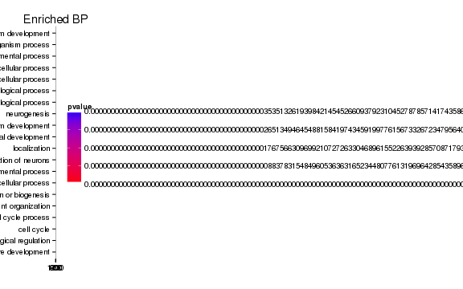
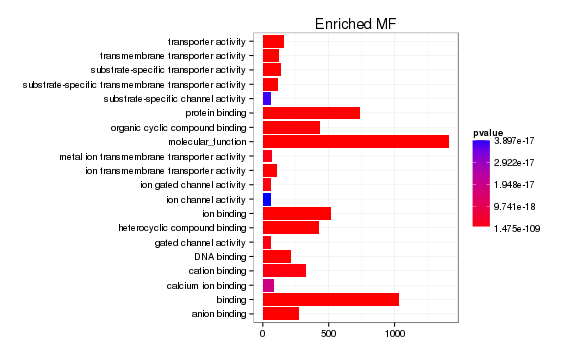
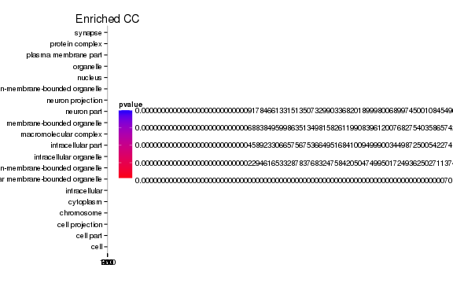
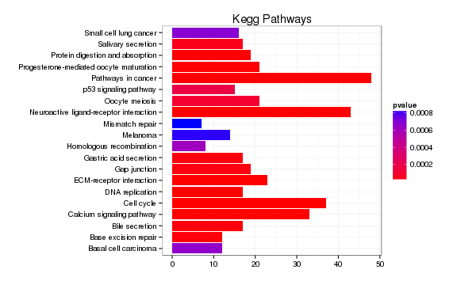

linc-Brn1a KO vs WT (Embryonic)
======================================


THINGS TO REMEMBER: change oldbam to bam and olddiff to diff once new set done! 


This file shows the wt-v-ko comparison for linc-Brn1a. 

Cuff overview:

```
## CuffSet instance with:
## 	 0 samples
## 	 0 genes
## 	 0 isoforms
## 	 0 TSS
## 	 0 CDS
## 	 0 promoters
## 	 0 splicing
## 	 0 relCDS
```


# QC

## Dispersion

Dispersion plot for genes in cuff:
(Overdispersion can lead to innacurate quants)


```
## Error: replacement has 1 row, data has 0
```

## Cross-replicate variability (fpkmSCVplot)
Differences in CV 2 can result in lower numbers of differentially expressed genes due to a higher degree of variability between replicate fpkm estimates.

Genes:

```
## Error: RS-DBI driver: (error in statement: near ")": syntax error)
```

Isoforms: 

```
## Error: RS-DBI driver: (error in statement: near ")": syntax error)
```


## MvA plot


```
## Error: non-numeric argument to binary operator
```
   
### MvA plot counts


```
## Error: non-numeric argument to binary operator
```

## Scatterplot matrix


```
## Error: RS-DBI driver: (error in statement: near "from": syntax error)
```

## Distributions

### Boxplots

Boxplot (genes)


```
## Error: RS-DBI driver: (error in statement: near ")": syntax error)
```

Boxplot (genes, replicates)


```
## Error: RS-DBI driver: (error in statement: near ")": syntax error)
```

Boxplot (isoforms)


```
## Error: RS-DBI driver: (error in statement: near ")": syntax error)
```

Boxplot (isoforms, replicates)


```
## Error: RS-DBI driver: (error in statement: near ")": syntax error)
```

### Density

Density (genes)


```
## Error: RS-DBI driver: (error in statement: near ")": syntax error)
```

Density (genes, replicates)


```
## Error: RS-DBI driver: (error in statement: near ")": syntax error)
```


## Clustering

### Replicate Clusters


```
## Error: RS-DBI driver: (error in statement: near "from": syntax error)
```

### PCA (genes)


```
## Error: RS-DBI driver: (error in statement: near "from": syntax error)
```

### MDS (genes)


```
## Error: RS-DBI driver: (error in statement: near "from": syntax error)
```


# KO assessment

## Endogenous lncRNA expression


```
## Error: RS-DBI driver: (error in statement: near ")": syntax error)
```

```
## Error: unable to find an inherited method for function 'expressionPlot'
## for signature '"data.frame"'
```

Endogenous expression of linc-Brn1a isoforms:


```
## Error: error in evaluating the argument 'object' in selecting a method for function 'expressionPlot': Error in (function (classes, fdef, mtable)  : 
##   unable to find an inherited method for function 'isoforms' for signature '"data.frame"'
```

Barplot of gene expression:


```
## Error: unable to find an inherited method for function 'expressionBarplot'
## for signature '"data.frame"'
```

Barplot of isoform expression:


```
## Error: error in evaluating the argument 'object' in selecting a method for function 'expressionBarplot': Error in (function (classes, fdef, mtable)  : 
##   unable to find an inherited method for function 'isoforms' for signature '"data.frame"'
```


## LacZ expression


```
## Error: RS-DBI driver: (RS_SQLite_exec: could not execute1: cannot start a
## transaction within a transaction)
```

```
## Error: unable to find an inherited method for function 'expressionPlot'
## for signature '"data.frame"'
```

```
## Error: unable to find an inherited method for function 'expressionBarplot'
## for signature '"data.frame"'
```


## Digital Genotyping (LacZ vs Endogenous lncRNA and Sex)
Expression plot (endogenous linc, lacZ, Y-expressed gene):


```
## Error: RS-DBI driver: (RS_SQLite_exec: could not execute1: cannot start a
## transaction within a transaction)
```

```
## Error: error in evaluating the argument 'object' in selecting a method for function 'expressionBarplot': Error: object 'genotypingGenes' not found
```

Expression heatmap:


```
## Error: error in evaluating the argument 'object' in selecting a method for function 'csHeatmap': Error: object 'genotypingGenes' not found
```


### Track visualization 


```
## Error: unable to find an inherited method for function 'annotation' for
## signature '"data.frame"'
```

```
## Error: Invalid chromosome identifier 'velocigene_Zen_UB1_N3'
## Please consider setting options(ucscChromosomeNames=FALSE) to allow for arbitrary chromosome identifiers.
```

```
## Error: Invalid chromosome identifier 'velocigene_Zen_UB1_N3'
## Please consider setting options(ucscChromosomeNames=FALSE) to allow for arbitrary chromosome identifiers.
```

# Differential Analysis

## Differential Genes 


```
## Error: RS-DBI driver: (error in statement: near ")": syntax error)
```

```
## Error: error in evaluating the argument 'object' in selecting a method for function 'annotation': Error: object 'sigGenes' not found
```

There are 0 significantly differentially expressed genes. They are:

[1] "No sig genes!"

### Matrix of gene significant differences between conditions

(skip for Brainmap wt-v-ko comparisons)

 

### Significant gene expression differences between conditions

Expression plot (genes):(turned off)


```
## Error: error in evaluating the argument 'object' in selecting a method for function 'csHeatmap': Error: object 'sigGenes' not found
```

Significant genes with expression >50fpkm (any condition):(turned off)


An individual look at each of the highly expressed significantly differentially regulated genes:
(eval=false for first pass)


### Expression-level/significance relationship

Scatter plot of significant genes only:


```
## Error: error in evaluating the argument 'object' in selecting a method for function 'csScatter': Error: object 'sigGenes' not found
```

Volcano Plot


```
## Error: One or more values of 'x' or 'y' are not valid sample names!
```

Volcano plot with significant genes only:


```
## Error: error in evaluating the argument 'object' in selecting a method for function 'csVolcano': Error: object 'sigGenes' not found
```

FoldChange Heatmap


```
## Error: error in evaluating the argument 'object' in selecting a method for function 'csFoldChangeHeatmap': Error: object 'sigGenes' not found
```


## Differential Splicing

### Differential Isoforms between conditions

Per isoform difference between conditions:

 

These isoforms are:

[1] "no sig isoforms"

Gene-level DE isoform heatmap


```
## [1] "no sig isoforms"
```

Isoform foldchange heatmap by isoform:


```
## [1] "no sig isoforms"
```


### Differential Splicing between conditions

(eval false for first pass)

Per condition differences in isoforms (Does gene have diff piechart between conditions?)


These genes are:


Splicing heatmap by isoform:


Splicing heatmap by gene


The following are significantly differentially spliced genes (relative portion of isoform per condition): 


 


# Gene/Pathway Analysis

## GSEA


```
## Error: Only alternative="mixed" is possible with F-like statistics.
```

```
## Error: Only alternative="mixed" is possible with F-like statistics.
```

```
## Error: Only alternative="mixed" is possible with F-like statistics.
```


Biocarta enrichment: 

 

Biocarta zscore: 


```
## Error: NaN dissimilarity value.
```


Reactome enrichment: 


```
## Error: no locations are finite
```

 


Reactome zscore: 


```
## Error: NaN dissimilarity value.
```


Kegg enrichment: 

 

Kegg zscore: 


```
## Error: NaN dissimilarity value.
```


## GO enrichment 
Cluster profiler used to call enichments of significantly differentially regulated genes that map to Entrez IDs. 


```
## Error: RS-DBI driver: (error in statement: near ")": syntax error)
```

```
## Error: error in evaluating the argument 'object' in selecting a method for function 'annotation': Error: object 'sigGenes' not found
```

```
## Error: object 'geneAnnot' not found
```

```
## Error: error in evaluating the argument 'object' in selecting a method for function 'diffData': Error: object 'sigGenes' not found
```


     

# Cis vs Trans (locally)


```
## Error: dims [product 1] do not match the length of object [0]
```

```
## Error: object 'fullTable' not found
```

```
## Error: object 'fullTable' not found
```

```
## Error: object 'fullTable' not found
```

```
## Error: object 'fullTable' not found
```

The pvalue for 3 genes significantly regulated in a region this size  is: 0 


```
## Error: missing value where TRUE/FALSE needed
```

# Notes

## Samples used are:
<!-- html table generated in R 3.0.2 by xtable 1.7-3 package -->
<!-- Fri Jun 27 11:47:39 2014 -->
<TABLE border=1>
<TR> <TH>  </TH> <TH> NA </TH>  </TR>
  </TABLE>

## Replicates
<!-- html table generated in R 3.0.2 by xtable 1.7-3 package -->
<!-- Fri Jun 27 11:47:39 2014 -->
<TABLE border=1>
<TR> <TH>  </TH> <TH> file </TH> <TH> sample_name </TH> <TH> replicate </TH> <TH> rep_name </TH> <TH> total_mass </TH> <TH> norm_mass </TH> <TH> internal_scale </TH> <TH> external_scale </TH>  </TR>
  </TABLE>

## Session Info

```
## R version 3.0.2 (2013-09-25)
## Platform: x86_64-unknown-linux-gnu (64-bit)
## 
## locale:
##  [1] LC_CTYPE=en_US.UTF-8       LC_NUMERIC=C              
##  [3] LC_TIME=en_US.UTF-8        LC_COLLATE=en_US.UTF-8    
##  [5] LC_MONETARY=en_US.UTF-8    LC_MESSAGES=en_US.UTF-8   
##  [7] LC_PAPER=en_US.UTF-8       LC_NAME=C                 
##  [9] LC_ADDRESS=C               LC_TELEPHONE=C            
## [11] LC_MEASUREMENT=en_US.UTF-8 LC_IDENTIFICATION=C       
## 
## attached base packages:
## [1] grid      parallel  stats     graphics  grDevices utils     datasets 
## [8] methods   base     
## 
## other attached packages:
##  [1] plyr_1.8.1                         
##  [2] stringr_0.6.2                      
##  [3] seqbias_1.10.0                     
##  [4] BSgenome.Mmusculus.UCSC.mm10_1.3.19
##  [5] BSgenome_1.30.0                    
##  [6] Biostrings_2.30.1                  
##  [7] GO.db_2.10.1                       
##  [8] org.Mm.eg.db_2.10.1                
##  [9] clusterProfiler_1.13.1             
## [10] DOSE_2.0.0                         
## [11] ReactomePA_1.6.1                   
## [12] AnnotationDbi_1.24.0               
## [13] Biobase_2.22.0                     
## [14] mgcv_1.7-29                        
## [15] nlme_3.1-117                       
## [16] RMySQL_0.9-3                       
## [17] RColorBrewer_1.0-5                 
## [18] gridExtra_0.9.1                    
## [19] gtable_0.1.2                       
## [20] marray_1.40.0                      
## [21] gplots_2.13.0                      
## [22] GSA_1.03                           
## [23] limma_3.18.13                      
## [24] xtable_1.7-3                       
## [25] cummeRbund_2.7.2                   
## [26] Gviz_1.6.0                         
## [27] rtracklayer_1.22.7                 
## [28] GenomicRanges_1.14.4               
## [29] XVector_0.2.0                      
## [30] IRanges_1.20.7                     
## [31] fastcluster_1.1.13                 
## [32] reshape2_1.4                       
## [33] ggplot2_1.0.0                      
## [34] RSQLite_0.11.4                     
## [35] DBI_0.2-7                          
## [36] BiocGenerics_0.8.0                 
## [37] knitr_1.6                          
## 
## loaded via a namespace (and not attached):
##  [1] biomaRt_2.18.0         biovizBase_1.10.8      bitops_1.0-6          
##  [4] caTools_1.17           cluster_1.15.2         colorspace_1.2-4      
##  [7] dichromat_2.0-0        digest_0.6.4           DO.db_2.7             
## [10] evaluate_0.5.5         formatR_0.10           Formula_1.1-1         
## [13] gdata_2.13.3           GenomicFeatures_1.14.5 GOSemSim_1.20.3       
## [16] graph_1.40.1           graphite_1.8.1         gtools_3.4.1          
## [19] Hmisc_3.14-4           igraph_0.7.1           KEGG.db_2.10.1        
## [22] KernSmooth_2.23-12     labeling_0.2           lattice_0.20-29       
## [25] latticeExtra_0.6-26    markdown_0.7           MASS_7.3-33           
## [28] Matrix_1.1-3           mime_0.1.1             munsell_0.4.2         
## [31] org.Hs.eg.db_2.10.1    proto_0.3-10           qvalue_1.36.0         
## [34] Rcpp_0.11.1            RCurl_1.95-4.1         reactome.db_1.46.1    
## [37] Rsamtools_1.14.3       scales_0.2.4           splines_3.0.2         
## [40] stats4_3.0.2           survival_2.37-7        tcltk_3.0.2           
## [43] tools_3.0.2            XML_3.98-1.1           zlibbioc_1.8.0
```

## Run Info

```
## [1] param value
## <0 rows> (or 0-length row.names)
```


