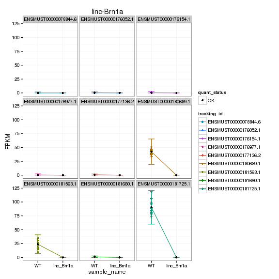
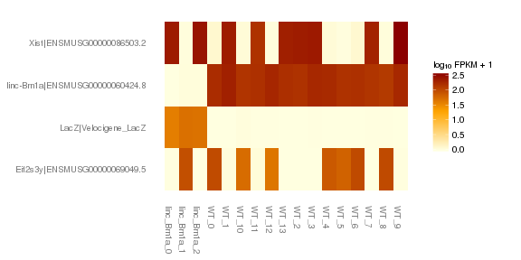
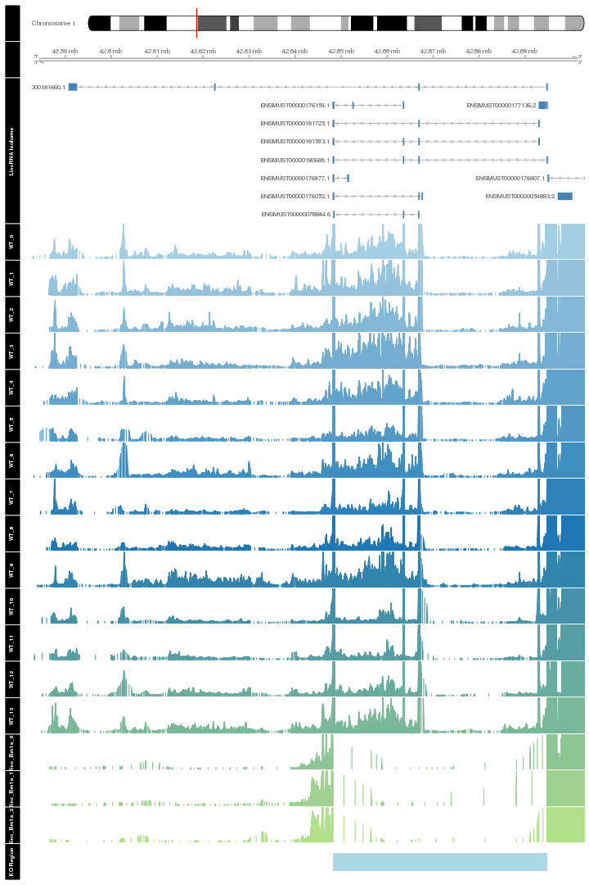
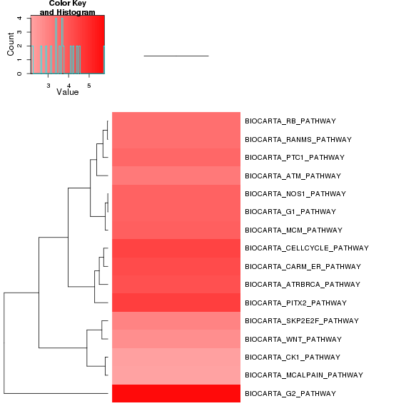
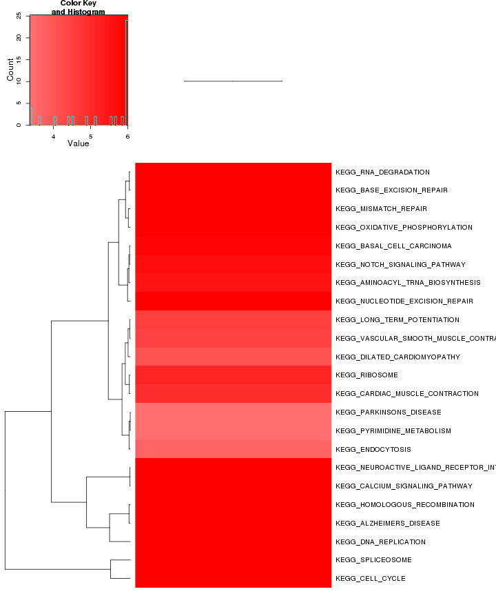
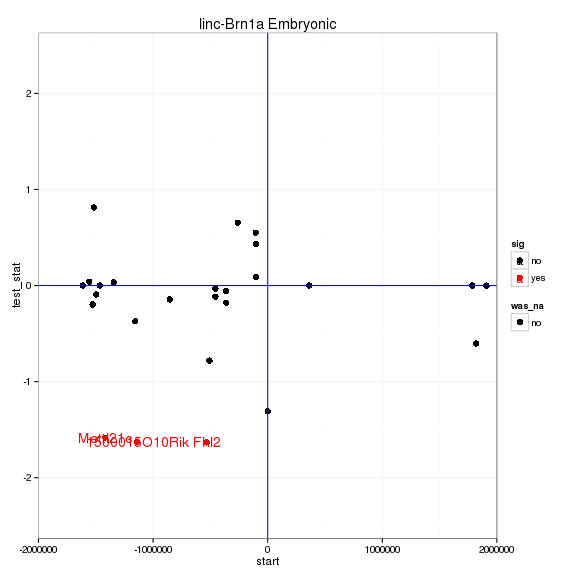

linc-Brn1a KO vs WT (Embryonic)
======================================


This file shows the wt-v-ko comparison for linc-Brn1a. 

Cuff overview:


```
## CuffSet instance with:
## 	 2 samples
## 	 26754 genes
## 	 77524 isoforms
## 	 0 TSS
## 	 23066 CDS
## 	 0 promoters
## 	 0 splicing
## 	 19954 relCDS
```

# QC

## Dispersion

Dispersion plot for genes in cuff:
(Overdispersion can lead to innacurate quants)

 

## Cross-replicate variability (fpkmSCVplot)
Differences in CV 2 can result in lower numbers of differentially expressed genes due to a higher degree of variability between replicate fpkm estimates.

Genes:

 

Isoforms: 

 


## MvA plot

 
   
### MvA plot counts

 

## Scatterplot matrix

 

## Distributions

### Boxplots

Boxplot (genes)

 

Boxplot (genes, replicates)

 

Boxplot (isoforms)

 

Boxplot (isoforms, replicates)

 

### Density

Density (genes)

 

Density (genes, replicates)

 


## Clustering

### Replicate Clusters

 

```
## NULL
```

### PCA (genes)

 

### MDS (genes)

 


# KO assessment

## Endogenous lncRNA expression

 

Endogenous expression of linc-Brn1a isoforms:

 

Barplot of gene expression:

 

Barplot of isoform expression:

 


## LacZ expression

  


## Digital Genotyping (LacZ vs Endogenous lncRNA and Sex)

Eif2s3y is a y-expressed gene, Xist is an x-expressed gene 
Expression plot (endogenous linc, lacZ, Y-expressed gene):

 

Expression heatmap:

 


### Track visualization 

 

# Differential Analysis

## Differential Genes 


There are 1536 significantly differentially expressed genes. They are:

<!-- html table generated in R 3.0.2 by xtable 1.7-3 package -->
<!-- Mon Jul 14 17:11:16 2014 -->
<TABLE border=1>
<TR> <TH>  </TH> <TH> geneAnnot$gene_short_name </TH>  </TR>
  <TR> <TD align="right"> 1 </TD> <TD> H19 </TD> </TR>
  <TR> <TD align="right"> 2 </TD> <TD> Nalcn </TD> </TR>
  <TR> <TD align="right"> 3 </TD> <TD> Lhx2 </TD> </TR>
  <TR> <TD align="right"> 4 </TD> <TD> Cdh1 </TD> </TR>
  <TR> <TD align="right"> 5 </TD> <TD> Ckmt1 </TD> </TR>
  <TR> <TD align="right"> 6 </TD> <TD> Sox9 </TD> </TR>
  <TR> <TD align="right"> 7 </TD> <TD> Sema4f </TD> </TR>
  <TR> <TD align="right"> 8 </TD> <TD> Hk2 </TD> </TR>
  <TR> <TD align="right"> 9 </TD> <TD> Rpa1 </TD> </TR>
  <TR> <TD align="right"> 10 </TD> <TD> S100a6 </TD> </TR>
  <TR> <TD align="right"> 11 </TD> <TD> Col6a1 </TD> </TR>
  <TR> <TD align="right"> 12 </TD> <TD> Pcnt </TD> </TR>
  <TR> <TD align="right"> 13 </TD> <TD> Uhrf1 </TD> </TR>
  <TR> <TD align="right"> 14 </TD> <TD> Gabrg1 </TD> </TR>
  <TR> <TD align="right"> 15 </TD> <TD> Ckb </TD> </TR>
  <TR> <TD align="right"> 16 </TD> <TD> Sp1 </TD> </TR>
  <TR> <TD align="right"> 17 </TD> <TD> Fndc5 </TD> </TR>
  <TR> <TD align="right"> 18 </TD> <TD> Ube2c </TD> </TR>
  <TR> <TD align="right"> 19 </TD> <TD> Nkx2-1 </TD> </TR>
  <TR> <TD align="right"> 20 </TD> <TD> Col1a1 </TD> </TR>
  <TR> <TD align="right"> 21 </TD> <TD> Foxm1 </TD> </TR>
  <TR> <TD align="right"> 22 </TD> <TD> Smo </TD> </TR>
  <TR> <TD align="right"> 23 </TD> <TD> Fbxo7 </TD> </TR>
  <TR> <TD align="right"> 24 </TD> <TD> Folr1 </TD> </TR>
  <TR> <TD align="right"> 25 </TD> <TD> Slc1a5 </TD> </TR>
  <TR> <TD align="right"> 26 </TD> <TD> Pnck </TD> </TR>
  <TR> <TD align="right"> 27 </TD> <TD> Spag5 </TD> </TR>
  <TR> <TD align="right"> 28 </TD> <TD> Tead3 </TD> </TR>
  <TR> <TD align="right"> 29 </TD> <TD> Dbf4 </TD> </TR>
  <TR> <TD align="right"> 30 </TD> <TD> Rec8 </TD> </TR>
  <TR> <TD align="right"> 31 </TD> <TD> Baz1b </TD> </TR>
  <TR> <TD align="right"> 32 </TD> <TD> Chaf1a </TD> </TR>
  <TR> <TD align="right"> 33 </TD> <TD> Mcm2 </TD> </TR>
  <TR> <TD align="right"> 34 </TD> <TD> Kcnn1 </TD> </TR>
  <TR> <TD align="right"> 35 </TD> <TD> Ppp1r17 </TD> </TR>
  <TR> <TD align="right"> 36 </TD> <TD> Cd36 </TD> </TR>
  <TR> <TD align="right"> 37 </TD> <TD> Apoe </TD> </TR>
  <TR> <TD align="right"> 38 </TD> <TD> Prkar2b </TD> </TR>
  <TR> <TD align="right"> 39 </TD> <TD> Hmgn2 </TD> </TR>
  <TR> <TD align="right"> 40 </TD> <TD> Cdk12 </TD> </TR>
  <TR> <TD align="right"> 41 </TD> <TD> Slc2a3 </TD> </TR>
  <TR> <TD align="right"> 42 </TD> <TD> Dlgap1 </TD> </TR>
  <TR> <TD align="right"> 43 </TD> <TD> Plag1 </TD> </TR>
  <TR> <TD align="right"> 44 </TD> <TD> Fcgrt </TD> </TR>
  <TR> <TD align="right"> 45 </TD> <TD> Dll3 </TD> </TR>
  <TR> <TD align="right"> 46 </TD> <TD> Phyhip </TD> </TR>
  <TR> <TD align="right"> 47 </TD> <TD> Ddr1 </TD> </TR>
  <TR> <TD align="right"> 48 </TD> <TD> Calb2 </TD> </TR>
  <TR> <TD align="right"> 49 </TD> <TD> Snrnp200 </TD> </TR>
  <TR> <TD align="right"> 50 </TD> <TD> Man1a </TD> </TR>
  <TR> <TD align="right"> 51 </TD> <TD> Hlf </TD> </TR>
  <TR> <TD align="right"> 52 </TD> <TD> Grm3 </TD> </TR>
  <TR> <TD align="right"> 53 </TD> <TD> Brinp2 </TD> </TR>
  <TR> <TD align="right"> 54 </TD> <TD> Ptrf </TD> </TR>
  <TR> <TD align="right"> 55 </TD> <TD> Dnmt1 </TD> </TR>
  <TR> <TD align="right"> 56 </TD> <TD> Cacna1e </TD> </TR>
  <TR> <TD align="right"> 57 </TD> <TD> Kifc2 </TD> </TR>
  <TR> <TD align="right"> 58 </TD> <TD> Pax2 </TD> </TR>
  <TR> <TD align="right"> 59 </TD> <TD> Eno2 </TD> </TR>
  <TR> <TD align="right"> 60 </TD> <TD> Utp20 </TD> </TR>
  <TR> <TD align="right"> 61 </TD> <TD> 9330159F19Rik </TD> </TR>
  <TR> <TD align="right"> 62 </TD> <TD> Sst </TD> </TR>
  <TR> <TD align="right"> 63 </TD> <TD> Ndrg2 </TD> </TR>
  <TR> <TD align="right"> 64 </TD> <TD> Aqp1 </TD> </TR>
  <TR> <TD align="right"> 65 </TD> <TD> Arid3b </TD> </TR>
  <TR> <TD align="right"> 66 </TD> <TD> Emr1 </TD> </TR>
  <TR> <TD align="right"> 67 </TD> <TD> Chmp2b </TD> </TR>
  <TR> <TD align="right"> 68 </TD> <TD> Pax3 </TD> </TR>
  <TR> <TD align="right"> 69 </TD> <TD> Lbr </TD> </TR>
  <TR> <TD align="right"> 70 </TD> <TD> Crabp2 </TD> </TR>
  <TR> <TD align="right"> 71 </TD> <TD> Nes </TD> </TR>
  <TR> <TD align="right"> 72 </TD> <TD> Bcan </TD> </TR>
  <TR> <TD align="right"> 73 </TD> <TD> Slc25a18 </TD> </TR>
  <TR> <TD align="right"> 74 </TD> <TD> Matk </TD> </TR>
  <TR> <TD align="right"> 75 </TD> <TD> Syt5 </TD> </TR>
  <TR> <TD align="right"> 76 </TD> <TD> Prkacb </TD> </TR>
  <TR> <TD align="right"> 77 </TD> <TD> Chd5 </TD> </TR>
  <TR> <TD align="right"> 78 </TD> <TD> Wisp1 </TD> </TR>
  <TR> <TD align="right"> 79 </TD> <TD> Ndrg1 </TD> </TR>
  <TR> <TD align="right"> 80 </TD> <TD> Polr2a </TD> </TR>
  <TR> <TD align="right"> 81 </TD> <TD> Spc25 </TD> </TR>
  <TR> <TD align="right"> 82 </TD> <TD> Slc1a6 </TD> </TR>
  <TR> <TD align="right"> 83 </TD> <TD> Slc1a3 </TD> </TR>
  <TR> <TD align="right"> 84 </TD> <TD> Nid1 </TD> </TR>
  <TR> <TD align="right"> 85 </TD> <TD> Mcm5 </TD> </TR>
  <TR> <TD align="right"> 86 </TD> <TD> Asf1b </TD> </TR>
  <TR> <TD align="right"> 87 </TD> <TD> Mef2c </TD> </TR>
  <TR> <TD align="right"> 88 </TD> <TD> Pan2 </TD> </TR>
  <TR> <TD align="right"> 89 </TD> <TD> Ampd3 </TD> </TR>
  <TR> <TD align="right"> 90 </TD> <TD> Pvalb </TD> </TR>
  <TR> <TD align="right"> 91 </TD> <TD> Slc30a4 </TD> </TR>
  <TR> <TD align="right"> 92 </TD> <TD> Reep5 </TD> </TR>
  <TR> <TD align="right"> 93 </TD> <TD> Otx1 </TD> </TR>
  <TR> <TD align="right"> 94 </TD> <TD> Fam131c </TD> </TR>
  <TR> <TD align="right"> 95 </TD> <TD> Vax1 </TD> </TR>
  <TR> <TD align="right"> 96 </TD> <TD> Cdc20 </TD> </TR>
  <TR> <TD align="right"> 97 </TD> <TD> Neurl1a </TD> </TR>
  <TR> <TD align="right"> 98 </TD> <TD> Epha2 </TD> </TR>
  <TR> <TD align="right"> 99 </TD> <TD> Slc4a1 </TD> </TR>
  <TR> <TD align="right"> 100 </TD> <TD> Nphs1 </TD> </TR>
  <TR> <TD align="right"> 101 </TD> <TD> Pola1 </TD> </TR>
  <TR> <TD align="right"> 102 </TD> <TD> Gmnn </TD> </TR>
  <TR> <TD align="right"> 103 </TD> <TD> Cdk4 </TD> </TR>
  <TR> <TD align="right"> 104 </TD> <TD> B4galnt1 </TD> </TR>
  <TR> <TD align="right"> 105 </TD> <TD> Tph2 </TD> </TR>
  <TR> <TD align="right"> 106 </TD> <TD> Klk4 </TD> </TR>
  <TR> <TD align="right"> 107 </TD> <TD> Syngr3 </TD> </TR>
  <TR> <TD align="right"> 108 </TD> <TD> Pole </TD> </TR>
  <TR> <TD align="right"> 109 </TD> <TD> Pcdha2 </TD> </TR>
  <TR> <TD align="right"> 110 </TD> <TD> Tinf2 </TD> </TR>
  <TR> <TD align="right"> 111 </TD> <TD> Tgfbr1 </TD> </TR>
  <TR> <TD align="right"> 112 </TD> <TD> Khsrp </TD> </TR>
  <TR> <TD align="right"> 113 </TD> <TD> Rplp1 </TD> </TR>
  <TR> <TD align="right"> 114 </TD> <TD> Fhl2 </TD> </TR>
  <TR> <TD align="right"> 115 </TD> <TD> Rbfox1 </TD> </TR>
  <TR> <TD align="right"> 116 </TD> <TD> Ewsr1 </TD> </TR>
  <TR> <TD align="right"> 117 </TD> <TD> Bcl2l13 </TD> </TR>
  <TR> <TD align="right"> 118 </TD> <TD> Fam163b </TD> </TR>
  <TR> <TD align="right"> 119 </TD> <TD> Slc16a12 </TD> </TR>
  <TR> <TD align="right"> 120 </TD> <TD> Syn2 </TD> </TR>
  <TR> <TD align="right"> 121 </TD> <TD> Nuak2 </TD> </TR>
  <TR> <TD align="right"> 122 </TD> <TD> Slc38a3 </TD> </TR>
  <TR> <TD align="right"> 123 </TD> <TD> Pifo </TD> </TR>
  <TR> <TD align="right"> 124 </TD> <TD> Raver1 </TD> </TR>
  <TR> <TD align="right"> 125 </TD> <TD> Eya4 </TD> </TR>
  <TR> <TD align="right"> 126 </TD> <TD> Myt1 </TD> </TR>
  <TR> <TD align="right"> 127 </TD> <TD> Lmbr1 </TD> </TR>
  <TR> <TD align="right"> 128 </TD> <TD> Odc1 </TD> </TR>
  <TR> <TD align="right"> 129 </TD> <TD> Sptbn4 </TD> </TR>
  <TR> <TD align="right"> 130 </TD> <TD> Gltp </TD> </TR>
  <TR> <TD align="right"> 131 </TD> <TD> Kif11 </TD> </TR>
  <TR> <TD align="right"> 132 </TD> <TD> Phox2b </TD> </TR>
  <TR> <TD align="right"> 133 </TD> <TD> Enkd1 </TD> </TR>
  <TR> <TD align="right"> 134 </TD> <TD> Igf2bp1 </TD> </TR>
  <TR> <TD align="right"> 135 </TD> <TD> Aldh1a2 </TD> </TR>
  <TR> <TD align="right"> 136 </TD> <TD> Cad </TD> </TR>
  <TR> <TD align="right"> 137 </TD> <TD> Dll1 </TD> </TR>
  <TR> <TD align="right"> 138 </TD> <TD> Ptgds </TD> </TR>
  <TR> <TD align="right"> 139 </TD> <TD> Slc25a13 </TD> </TR>
  <TR> <TD align="right"> 140 </TD> <TD> Ube2i </TD> </TR>
  <TR> <TD align="right"> 141 </TD> <TD> Nolc1 </TD> </TR>
  <TR> <TD align="right"> 142 </TD> <TD> Abca1 </TD> </TR>
  <TR> <TD align="right"> 143 </TD> <TD> Cd83 </TD> </TR>
  <TR> <TD align="right"> 144 </TD> <TD> Hivep2 </TD> </TR>
  <TR> <TD align="right"> 145 </TD> <TD> Anp32e </TD> </TR>
  <TR> <TD align="right"> 146 </TD> <TD> Eps8 </TD> </TR>
  <TR> <TD align="right"> 147 </TD> <TD> Tnr </TD> </TR>
  <TR> <TD align="right"> 148 </TD> <TD> Rxrg </TD> </TR>
  <TR> <TD align="right"> 149 </TD> <TD> Ncapg </TD> </TR>
  <TR> <TD align="right"> 150 </TD> <TD> Stk32c </TD> </TR>
  <TR> <TD align="right"> 151 </TD> <TD> Celsr1 </TD> </TR>
  <TR> <TD align="right"> 152 </TD> <TD> Slc25a5 </TD> </TR>
  <TR> <TD align="right"> 153 </TD> <TD> Eef1a2 </TD> </TR>
  <TR> <TD align="right"> 154 </TD> <TD> Mapkapk2 </TD> </TR>
  <TR> <TD align="right"> 155 </TD> <TD> Phf21b </TD> </TR>
  <TR> <TD align="right"> 156 </TD> <TD> Matn4 </TD> </TR>
  <TR> <TD align="right"> 157 </TD> <TD> Il13ra1 </TD> </TR>
  <TR> <TD align="right"> 158 </TD> <TD> Rnd3 </TD> </TR>
  <TR> <TD align="right"> 159 </TD> <TD> Brca1 </TD> </TR>
  <TR> <TD align="right"> 160 </TD> <TD> Vtn </TD> </TR>
  <TR> <TD align="right"> 161 </TD> <TD> Traf4 </TD> </TR>
  <TR> <TD align="right"> 162 </TD> <TD> Aldoc </TD> </TR>
  <TR> <TD align="right"> 163 </TD> <TD> Timp2 </TD> </TR>
  <TR> <TD align="right"> 164 </TD> <TD> Rarb </TD> </TR>
  <TR> <TD align="right"> 165 </TD> <TD> Cdc6 </TD> </TR>
  <TR> <TD align="right"> 166 </TD> <TD> Atad5 </TD> </TR>
  <TR> <TD align="right"> 167 </TD> <TD> Zfp334 </TD> </TR>
  <TR> <TD align="right"> 168 </TD> <TD> Rhbdl3 </TD> </TR>
  <TR> <TD align="right"> 169 </TD> <TD> Birc5 </TD> </TR>
  <TR> <TD align="right"> 170 </TD> <TD> Wfdc2 </TD> </TR>
  <TR> <TD align="right"> 171 </TD> <TD> Mmp9 </TD> </TR>
  <TR> <TD align="right"> 172 </TD> <TD> Slc12a7 </TD> </TR>
  <TR> <TD align="right"> 173 </TD> <TD> Mybl2 </TD> </TR>
  <TR> <TD align="right"> 174 </TD> <TD> Rac3 </TD> </TR>
  <TR> <TD align="right"> 175 </TD> <TD> Erbb3 </TD> </TR>
  <TR> <TD align="right"> 176 </TD> <TD> Mfng </TD> </TR>
  <TR> <TD align="right"> 177 </TD> <TD> Pmp22 </TD> </TR>
  <TR> <TD align="right"> 178 </TD> <TD> Anxa6 </TD> </TR>
  <TR> <TD align="right"> 179 </TD> <TD> Kpna2 </TD> </TR>
  <TR> <TD align="right"> 180 </TD> <TD> Mapt </TD> </TR>
  <TR> <TD align="right"> 181 </TD> <TD> Glra2 </TD> </TR>
  <TR> <TD align="right"> 182 </TD> <TD> Sparc </TD> </TR>
  <TR> <TD align="right"> 183 </TD> <TD> Crhr1 </TD> </TR>
  <TR> <TD align="right"> 184 </TD> <TD> Ikzf1 </TD> </TR>
  <TR> <TD align="right"> 185 </TD> <TD> Cbx1 </TD> </TR>
  <TR> <TD align="right"> 186 </TD> <TD> Lhx1 </TD> </TR>
  <TR> <TD align="right"> 187 </TD> <TD> Sfrp5 </TD> </TR>
  <TR> <TD align="right"> 188 </TD> <TD> Sult4a1 </TD> </TR>
  <TR> <TD align="right"> 189 </TD> <TD> E2f2 </TD> </TR>
  <TR> <TD align="right"> 190 </TD> <TD> Cacng2 </TD> </TR>
  <TR> <TD align="right"> 191 </TD> <TD> Scn1b </TD> </TR>
  <TR> <TD align="right"> 192 </TD> <TD> Lhx9 </TD> </TR>
  <TR> <TD align="right"> 193 </TD> <TD> Syne1 </TD> </TR>
  <TR> <TD align="right"> 194 </TD> <TD> Fbxo5 </TD> </TR>
  <TR> <TD align="right"> 195 </TD> <TD> Nr2e1 </TD> </TR>
  <TR> <TD align="right"> 196 </TD> <TD> Plagl1 </TD> </TR>
  <TR> <TD align="right"> 197 </TD> <TD> Grm1 </TD> </TR>
  <TR> <TD align="right"> 198 </TD> <TD> Perp </TD> </TR>
  <TR> <TD align="right"> 199 </TD> <TD> Smpdl3a </TD> </TR>
  <TR> <TD align="right"> 200 </TD> <TD> Fabp7 </TD> </TR>
  <TR> <TD align="right"> 201 </TD> <TD> Nts </TD> </TR>
  <TR> <TD align="right"> 202 </TD> <TD> Slc6a15 </TD> </TR>
  <TR> <TD align="right"> 203 </TD> <TD> Sim1 </TD> </TR>
  <TR> <TD align="right"> 204 </TD> <TD> Dcn </TD> </TR>
  <TR> <TD align="right"> 205 </TD> <TD> Cdk1 </TD> </TR>
  <TR> <TD align="right"> 206 </TD> <TD> Actr6 </TD> </TR>
  <TR> <TD align="right"> 207 </TD> <TD> Tmpo </TD> </TR>
  <TR> <TD align="right"> 208 </TD> <TD> Kitl </TD> </TR>
  <TR> <TD align="right"> 209 </TD> <TD> Ahi1 </TD> </TR>
  <TR> <TD align="right"> 210 </TD> <TD> Nedd1 </TD> </TR>
  <TR> <TD align="right"> 211 </TD> <TD> Mtfr2 </TD> </TR>
  <TR> <TD align="right"> 212 </TD> <TD> Stx7 </TD> </TR>
  <TR> <TD align="right"> 213 </TD> <TD> Moxd1 </TD> </TR>
  <TR> <TD align="right"> 214 </TD> <TD> Usp44 </TD> </TR>
  <TR> <TD align="right"> 215 </TD> <TD> Ascl1 </TD> </TR>
  <TR> <TD align="right"> 216 </TD> <TD> Ptprr </TD> </TR>
  <TR> <TD align="right"> 217 </TD> <TD> Mum1 </TD> </TR>
  <TR> <TD align="right"> 218 </TD> <TD> Meis1 </TD> </TR>
  <TR> <TD align="right"> 219 </TD> <TD> Tcf3 </TD> </TR>
  <TR> <TD align="right"> 220 </TD> <TD> Cobl </TD> </TR>
  <TR> <TD align="right"> 221 </TD> <TD> Grb10 </TD> </TR>
  <TR> <TD align="right"> 222 </TD> <TD> E2f7 </TD> </TR>
  <TR> <TD align="right"> 223 </TD> <TD> Mdm1 </TD> </TR>
  <TR> <TD align="right"> 224 </TD> <TD> Col6a2 </TD> </TR>
  <TR> <TD align="right"> 225 </TD> <TD> Glyctk </TD> </TR>
  <TR> <TD align="right"> 226 </TD> <TD> Hmmr </TD> </TR>
  <TR> <TD align="right"> 227 </TD> <TD> Hcn2 </TD> </TR>
  <TR> <TD align="right"> 228 </TD> <TD> Slc22a4 </TD> </TR>
  <TR> <TD align="right"> 229 </TD> <TD> Rasgef1c </TD> </TR>
  <TR> <TD align="right"> 230 </TD> <TD> Sar1b </TD> </TR>
  <TR> <TD align="right"> 231 </TD> <TD> Nefh </TD> </TR>
  <TR> <TD align="right"> 232 </TD> <TD> Btg2 </TD> </TR>
  <TR> <TD align="right"> 233 </TD> <TD> Igfbp3 </TD> </TR>
  <TR> <TD align="right"> 234 </TD> <TD> Adcy1 </TD> </TR>
  <TR> <TD align="right"> 235 </TD> <TD> Aebp1 </TD> </TR>
  <TR> <TD align="right"> 236 </TD> <TD> Prr11 </TD> </TR>
  <TR> <TD align="right"> 237 </TD> <TD> Gria1 </TD> </TR>
  <TR> <TD align="right"> 238 </TD> <TD> Shmt1 </TD> </TR>
  <TR> <TD align="right"> 239 </TD> <TD> Llgl1 </TD> </TR>
  <TR> <TD align="right"> 240 </TD> <TD> Pctp </TD> </TR>
  <TR> <TD align="right"> 241 </TD> <TD> Fam49a </TD> </TR>
  <TR> <TD align="right"> 242 </TD> <TD> Fam84a </TD> </TR>
  <TR> <TD align="right"> 243 </TD> <TD> Id2 </TD> </TR>
  <TR> <TD align="right"> 244 </TD> <TD> Rrm2 </TD> </TR>
  <TR> <TD align="right"> 245 </TD> <TD> Ace </TD> </TR>
  <TR> <TD align="right"> 246 </TD> <TD> Rasl10b </TD> </TR>
  <TR> <TD align="right"> 247 </TD> <TD> Asic2 </TD> </TR>
  <TR> <TD align="right"> 248 </TD> <TD> Slc9a3r1 </TD> </TR>
  <TR> <TD align="right"> 249 </TD> <TD> Fam64a </TD> </TR>
  <TR> <TD align="right"> 250 </TD> <TD> Cygb </TD> </TR>
  <TR> <TD align="right"> 251 </TD> <TD> Pld2 </TD> </TR>
  <TR> <TD align="right"> 252 </TD> <TD> Slc6a4 </TD> </TR>
  <TR> <TD align="right"> 253 </TD> <TD> Doc2b </TD> </TR>
  <TR> <TD align="right"> 254 </TD> <TD> Prpf8 </TD> </TR>
  <TR> <TD align="right"> 255 </TD> <TD> Aurkb </TD> </TR>
  <TR> <TD align="right"> 256 </TD> <TD> Pfas </TD> </TR>
  <TR> <TD align="right"> 257 </TD> <TD> Top2a </TD> </TR>
  <TR> <TD align="right"> 258 </TD> <TD> Higd1b </TD> </TR>
  <TR> <TD align="right"> 259 </TD> <TD> Pole2 </TD> </TR>
  <TR> <TD align="right"> 260 </TD> <TD> Ptpn21 </TD> </TR>
  <TR> <TD align="right"> 261 </TD> <TD> Ngb </TD> </TR>
  <TR> <TD align="right"> 262 </TD> <TD> Sptb </TD> </TR>
  <TR> <TD align="right"> 263 </TD> <TD> Zfp36l1 </TD> </TR>
  <TR> <TD align="right"> 264 </TD> <TD> Efcab11 </TD> </TR>
  <TR> <TD align="right"> 265 </TD> <TD> Ccdc88c </TD> </TR>
  <TR> <TD align="right"> 266 </TD> <TD> Fbln5 </TD> </TR>
  <TR> <TD align="right"> 267 </TD> <TD> Lgmn </TD> </TR>
  <TR> <TD align="right"> 268 </TD> <TD> Tshz3 </TD> </TR>
  <TR> <TD align="right"> 269 </TD> <TD> Rgs6 </TD> </TR>
  <TR> <TD align="right"> 270 </TD> <TD> Ppp1r13b </TD> </TR>
  <TR> <TD align="right"> 271 </TD> <TD> Kif26a </TD> </TR>
  <TR> <TD align="right"> 272 </TD> <TD> Gng4 </TD> </TR>
  <TR> <TD align="right"> 273 </TD> <TD> Ryr2 </TD> </TR>
  <TR> <TD align="right"> 274 </TD> <TD> Amph </TD> </TR>
  <TR> <TD align="right"> 275 </TD> <TD> Gli3 </TD> </TR>
  <TR> <TD align="right"> 276 </TD> <TD> Dek </TD> </TR>
  <TR> <TD align="right"> 277 </TD> <TD> Ogn </TD> </TR>
  <TR> <TD align="right"> 278 </TD> <TD> Gadd45g </TD> </TR>
  <TR> <TD align="right"> 279 </TD> <TD> Ror2 </TD> </TR>
  <TR> <TD align="right"> 280 </TD> <TD> Habp4 </TD> </TR>
  <TR> <TD align="right"> 281 </TD> <TD> Drd1a </TD> </TR>
  <TR> <TD align="right"> 282 </TD> <TD> Adcy2 </TD> </TR>
  <TR> <TD align="right"> 283 </TD> <TD> Golm1 </TD> </TR>
  <TR> <TD align="right"> 284 </TD> <TD> Trip13 </TD> </TR>
  <TR> <TD align="right"> 285 </TD> <TD> Cep72 </TD> </TR>
  <TR> <TD align="right"> 286 </TD> <TD> Slc6a3 </TD> </TR>
  <TR> <TD align="right"> 287 </TD> <TD> Ocln </TD> </TR>
  <TR> <TD align="right"> 288 </TD> <TD> Arhgef28 </TD> </TR>
  <TR> <TD align="right"> 289 </TD> <TD> Iqgap2 </TD> </TR>
  <TR> <TD align="right"> 290 </TD> <TD> Elovl7 </TD> </TR>
  <TR> <TD align="right"> 291 </TD> <TD> Depdc1b </TD> </TR>
  <TR> <TD align="right"> 292 </TD> <TD> Rasgrf2 </TD> </TR>
  <TR> <TD align="right"> 293 </TD> <TD> Nln </TD> </TR>
  <TR> <TD align="right"> 294 </TD> <TD> Rgs7bp </TD> </TR>
  <TR> <TD align="right"> 295 </TD> <TD> Htr1a </TD> </TR>
  <TR> <TD align="right"> 296 </TD> <TD> Hcn1 </TD> </TR>
  <TR> <TD align="right"> 297 </TD> <TD> Cdhr1 </TD> </TR>
  <TR> <TD align="right"> 298 </TD> <TD> Dnajc9 </TD> </TR>
  <TR> <TD align="right"> 299 </TD> <TD> Otx2 </TD> </TR>
  <TR> <TD align="right"> 300 </TD> <TD> Slc35f4 </TD> </TR>
  <TR> <TD align="right"> 301 </TD> <TD> Rnase4 </TD> </TR>
  <TR> <TD align="right"> 302 </TD> <TD> Sh3bp5 </TD> </TR>
  <TR> <TD align="right"> 303 </TD> <TD> Arhgef3 </TD> </TR>
  <TR> <TD align="right"> 304 </TD> <TD> Gdf10 </TD> </TR>
  <TR> <TD align="right"> 305 </TD> <TD> Xpo4 </TD> </TR>
  <TR> <TD align="right"> 306 </TD> <TD> Ska3 </TD> </TR>
  <TR> <TD align="right"> 307 </TD> <TD> Ints9 </TD> </TR>
  <TR> <TD align="right"> 308 </TD> <TD> Cacna2d3 </TD> </TR>
  <TR> <TD align="right"> 309 </TD> <TD> Wnt5a </TD> </TR>
  <TR> <TD align="right"> 310 </TD> <TD> Diap3 </TD> </TR>
  <TR> <TD align="right"> 311 </TD> <TD> Pbk </TD> </TR>
  <TR> <TD align="right"> 312 </TD> <TD> Esco2 </TD> </TR>
  <TR> <TD align="right"> 313 </TD> <TD> Clu </TD> </TR>
  <TR> <TD align="right"> 314 </TD> <TD> Ephx2 </TD> </TR>
  <TR> <TD align="right"> 315 </TD> <TD> Stmn4 </TD> </TR>
  <TR> <TD align="right"> 316 </TD> <TD> Ebf2 </TD> </TR>
  <TR> <TD align="right"> 317 </TD> <TD> Bora </TD> </TR>
  <TR> <TD align="right"> 318 </TD> <TD> Klhl1 </TD> </TR>
  <TR> <TD align="right"> 319 </TD> <TD> Fgf17 </TD> </TR>
  <TR> <TD align="right"> 320 </TD> <TD> Osmr </TD> </TR>
  <TR> <TD align="right"> 321 </TD> <TD> Haus4 </TD> </TR>
  <TR> <TD align="right"> 322 </TD> <TD> Ajuba </TD> </TR>
  <TR> <TD align="right"> 323 </TD> <TD> Psmb5 </TD> </TR>
  <TR> <TD align="right"> 324 </TD> <TD> Efs </TD> </TR>
  <TR> <TD align="right"> 325 </TD> <TD> Cpne6 </TD> </TR>
  <TR> <TD align="right"> 326 </TD> <TD> Sema5a </TD> </TR>
  <TR> <TD align="right"> 327 </TD> <TD> Cmbl </TD> </TR>
  <TR> <TD align="right"> 328 </TD> <TD> Rai14 </TD> </TR>
  <TR> <TD align="right"> 329 </TD> <TD> Baalc </TD> </TR>
  <TR> <TD align="right"> 330 </TD> <TD> Csmd3 </TD> </TR>
  <TR> <TD align="right"> 331 </TD> <TD> Cdh10 </TD> </TR>
  <TR> <TD align="right"> 332 </TD> <TD> Shcbp1 </TD> </TR>
  <TR> <TD align="right"> 333 </TD> <TD> Matn2 </TD> </TR>
  <TR> <TD align="right"> 334 </TD> <TD> Kcnv1 </TD> </TR>
  <TR> <TD align="right"> 335 </TD> <TD> Atad2 </TD> </TR>
  <TR> <TD align="right"> 336 </TD> <TD> Sla </TD> </TR>
  <TR> <TD align="right"> 337 </TD> <TD> Adcy8 </TD> </TR>
  <TR> <TD align="right"> 338 </TD> <TD> Gtse1 </TD> </TR>
  <TR> <TD align="right"> 339 </TD> <TD> Syngr1 </TD> </TR>
  <TR> <TD align="right"> 340 </TD> <TD> Dscc1 </TD> </TR>
  <TR> <TD align="right"> 341 </TD> <TD> Enpp2 </TD> </TR>
  <TR> <TD align="right"> 342 </TD> <TD> Col2a1 </TD> </TR>
  <TR> <TD align="right"> 343 </TD> <TD> Shisa9 </TD> </TR>
  <TR> <TD align="right"> 344 </TD> <TD> Emp2 </TD> </TR>
  <TR> <TD align="right"> 345 </TD> <TD> Cldn1 </TD> </TR>
  <TR> <TD align="right"> 346 </TD> <TD> Fgf12 </TD> </TR>
  <TR> <TD align="right"> 347 </TD> <TD> Hrasls </TD> </TR>
  <TR> <TD align="right"> 348 </TD> <TD> Apod </TD> </TR>
  <TR> <TD align="right"> 349 </TD> <TD> Ly6h </TD> </TR>
  <TR> <TD align="right"> 350 </TD> <TD> Lynx1 </TD> </TR>
  <TR> <TD align="right"> 351 </TD> <TD> Mapk12 </TD> </TR>
  <TR> <TD align="right"> 352 </TD> <TD> Cd200 </TD> </TR>
  <TR> <TD align="right"> 353 </TD> <TD> Prkdc </TD> </TR>
  <TR> <TD align="right"> 354 </TD> <TD> Mcm4 </TD> </TR>
  <TR> <TD align="right"> 355 </TD> <TD> Nde1 </TD> </TR>
  <TR> <TD align="right"> 356 </TD> <TD> Mpv17l </TD> </TR>
  <TR> <TD align="right"> 357 </TD> <TD> Boc </TD> </TR>
  <TR> <TD align="right"> 358 </TD> <TD> Sidt1 </TD> </TR>
  <TR> <TD align="right"> 359 </TD> <TD> Slc7a4 </TD> </TR>
  <TR> <TD align="right"> 360 </TD> <TD> Ncam2 </TD> </TR>
  <TR> <TD align="right"> 361 </TD> <TD> Itgb5 </TD> </TR>
  <TR> <TD align="right"> 362 </TD> <TD> Ccdc14 </TD> </TR>
  <TR> <TD align="right"> 363 </TD> <TD> Adcy5 </TD> </TR>
  <TR> <TD align="right"> 364 </TD> <TD> Grik1 </TD> </TR>
  <TR> <TD align="right"> 365 </TD> <TD> Chaf1b </TD> </TR>
  <TR> <TD align="right"> 366 </TD> <TD> Clic6 </TD> </TR>
  <TR> <TD align="right"> 367 </TD> <TD> Gart </TD> </TR>
  <TR> <TD align="right"> 368 </TD> <TD> Tmem50b </TD> </TR>
  <TR> <TD align="right"> 369 </TD> <TD> Ifngr2 </TD> </TR>
  <TR> <TD align="right"> 370 </TD> <TD> Faim2 </TD> </TR>
  <TR> <TD align="right"> 371 </TD> <TD> Racgap1 </TD> </TR>
  <TR> <TD align="right"> 372 </TD> <TD> Krt18 </TD> </TR>
  <TR> <TD align="right"> 373 </TD> <TD> Sncg </TD> </TR>
  <TR> <TD align="right"> 374 </TD> <TD> Rttn </TD> </TR>
  <TR> <TD align="right"> 375 </TD> <TD> Serinc2 </TD> </TR>
  <TR> <TD align="right"> 376 </TD> <TD> Kcnk5 </TD> </TR>
  <TR> <TD align="right"> 377 </TD> <TD> Dlx2 </TD> </TR>
  <TR> <TD align="right"> 378 </TD> <TD> Prph </TD> </TR>
  <TR> <TD align="right"> 379 </TD> <TD> Cdca3 </TD> </TR>
  <TR> <TD align="right"> 380 </TD> <TD> Tiam2 </TD> </TR>
  <TR> <TD align="right"> 381 </TD> <TD> Thbs2 </TD> </TR>
  <TR> <TD align="right"> 382 </TD> <TD> Smoc2 </TD> </TR>
  <TR> <TD align="right"> 383 </TD> <TD> Pla2g7 </TD> </TR>
  <TR> <TD align="right"> 384 </TD> <TD> Slc5a7 </TD> </TR>
  <TR> <TD align="right"> 385 </TD> <TD> Enpp5 </TD> </TR>
  <TR> <TD align="right"> 386 </TD> <TD> Pim1 </TD> </TR>
  <TR> <TD align="right"> 387 </TD> <TD> Ndc80 </TD> </TR>
  <TR> <TD align="right"> 388 </TD> <TD> Crim1 </TD> </TR>
  <TR> <TD align="right"> 389 </TD> <TD> Cyp1b1 </TD> </TR>
  <TR> <TD align="right"> 390 </TD> <TD> Lhcgr </TD> </TR>
  <TR> <TD align="right"> 391 </TD> <TD> Hn1l </TD> </TR>
  <TR> <TD align="right"> 392 </TD> <TD> Syt4 </TD> </TR>
  <TR> <TD align="right"> 393 </TD> <TD> Kifc5b </TD> </TR>
  <TR> <TD align="right"> 394 </TD> <TD> Aqp4 </TD> </TR>
  <TR> <TD align="right"> 395 </TD> <TD> Lama3 </TD> </TR>
  <TR> <TD align="right"> 396 </TD> <TD> Ndfip1 </TD> </TR>
  <TR> <TD align="right"> 397 </TD> <TD> Mal2 </TD> </TR>
  <TR> <TD align="right"> 398 </TD> <TD> Hbegf </TD> </TR>
  <TR> <TD align="right"> 399 </TD> <TD> Ppp2r2b </TD> </TR>
  <TR> <TD align="right"> 400 </TD> <TD> Rab27b </TD> </TR>
  <TR> <TD align="right"> 401 </TD> <TD> Gnal </TD> </TR>
  <TR> <TD align="right"> 402 </TD> <TD> Lox </TD> </TR>
  <TR> <TD align="right"> 403 </TD> <TD> Cep192 </TD> </TR>
  <TR> <TD align="right"> 404 </TD> <TD> Slc14a2 </TD> </TR>
  <TR> <TD align="right"> 405 </TD> <TD> Lmnb1 </TD> </TR>
  <TR> <TD align="right"> 406 </TD> <TD> Megf10 </TD> </TR>
  <TR> <TD align="right"> 407 </TD> <TD> Slc22a6 </TD> </TR>
  <TR> <TD align="right"> 408 </TD> <TD> Anxa1 </TD> </TR>
  <TR> <TD align="right"> 409 </TD> <TD> Incenp </TD> </TR>
  <TR> <TD align="right"> 410 </TD> <TD> Fads3 </TD> </TR>
  <TR> <TD align="right"> 411 </TD> <TD> Fen1 </TD> </TR>
  <TR> <TD align="right"> 412 </TD> <TD> Tmem2 </TD> </TR>
  <TR> <TD align="right"> 413 </TD> <TD> Stambpl1 </TD> </TR>
  <TR> <TD align="right"> 414 </TD> <TD> Cdca5 </TD> </TR>
  <TR> <TD align="right"> 415 </TD> <TD> Kif20b </TD> </TR>
  <TR> <TD align="right"> 416 </TD> <TD> Htr7 </TD> </TR>
  <TR> <TD align="right"> 417 </TD> <TD> Gldc </TD> </TR>
  <TR> <TD align="right"> 418 </TD> <TD> Pola2 </TD> </TR>
  <TR> <TD align="right"> 419 </TD> <TD> Eif1ad </TD> </TR>
  <TR> <TD align="right"> 420 </TD> <TD> Apba1 </TD> </TR>
  <TR> <TD align="right"> 421 </TD> <TD> Slc1a1 </TD> </TR>
  <TR> <TD align="right"> 422 </TD> <TD> Rcor2 </TD> </TR>
  <TR> <TD align="right"> 423 </TD> <TD> Cep55 </TD> </TR>
  <TR> <TD align="right"> 424 </TD> <TD> Rbp4 </TD> </TR>
  <TR> <TD align="right"> 425 </TD> <TD> Hells </TD> </TR>
  <TR> <TD align="right"> 426 </TD> <TD> Aldh18a1 </TD> </TR>
  <TR> <TD align="right"> 427 </TD> <TD> Lcor </TD> </TR>
  <TR> <TD align="right"> 428 </TD> <TD> Maoa </TD> </TR>
  <TR> <TD align="right"> 429 </TD> <TD> Pdcd11 </TD> </TR>
  <TR> <TD align="right"> 430 </TD> <TD> Nhlrc2 </TD> </TR>
  <TR> <TD align="right"> 431 </TD> <TD> Afap1l2 </TD> </TR>
  <TR> <TD align="right"> 432 </TD> <TD> Ablim1 </TD> </TR>
  <TR> <TD align="right"> 433 </TD> <TD> Hspa12a </TD> </TR>
  <TR> <TD align="right"> 434 </TD> <TD> Bhlhe22 </TD> </TR>
  <TR> <TD align="right"> 435 </TD> <TD> Arhgap19 </TD> </TR>
  <TR> <TD align="right"> 436 </TD> <TD> Lbx1 </TD> </TR>
  <TR> <TD align="right"> 437 </TD> <TD> Kcnip2 </TD> </TR>
  <TR> <TD align="right"> 438 </TD> <TD> Limd1 </TD> </TR>
  <TR> <TD align="right"> 439 </TD> <TD> Itga7 </TD> </TR>
  <TR> <TD align="right"> 440 </TD> <TD> Cdk2 </TD> </TR>
  <TR> <TD align="right"> 441 </TD> <TD> Cdh9 </TD> </TR>
  <TR> <TD align="right"> 442 </TD> <TD> Aatk </TD> </TR>
  <TR> <TD align="right"> 443 </TD> <TD> Agap2 </TD> </TR>
  <TR> <TD align="right"> 444 </TD> <TD> Caly </TD> </TR>
  <TR> <TD align="right"> 445 </TD> <TD> Ifitm3 </TD> </TR>
  <TR> <TD align="right"> 446 </TD> <TD> Lrdd </TD> </TR>
  <TR> <TD align="right"> 447 </TD> <TD> Dock9 </TD> </TR>
  <TR> <TD align="right"> 448 </TD> <TD> Tk1 </TD> </TR>
  <TR> <TD align="right"> 449 </TD> <TD> Cbx2 </TD> </TR>
  <TR> <TD align="right"> 450 </TD> <TD> Klhl4 </TD> </TR>
  <TR> <TD align="right"> 451 </TD> <TD> Sdc3 </TD> </TR>
  <TR> <TD align="right"> 452 </TD> <TD> Tyms </TD> </TR>
  <TR> <TD align="right"> 453 </TD> <TD> Plk4 </TD> </TR>
  <TR> <TD align="right"> 454 </TD> <TD> Gdap1 </TD> </TR>
  <TR> <TD align="right"> 455 </TD> <TD> Itih5 </TD> </TR>
  <TR> <TD align="right"> 456 </TD> <TD> Clec3b </TD> </TR>
  <TR> <TD align="right"> 457 </TD> <TD> Ccr1 </TD> </TR>
  <TR> <TD align="right"> 458 </TD> <TD> Nrp1 </TD> </TR>
  <TR> <TD align="right"> 459 </TD> <TD> Prkar1b </TD> </TR>
  <TR> <TD align="right"> 460 </TD> <TD> Snca </TD> </TR>
  <TR> <TD align="right"> 461 </TD> <TD> Gria4 </TD> </TR>
  <TR> <TD align="right"> 462 </TD> <TD> Paqr8 </TD> </TR>
  <TR> <TD align="right"> 463 </TD> <TD> Slco5a1 </TD> </TR>
  <TR> <TD align="right"> 464 </TD> <TD> Slc40a1 </TD> </TR>
  <TR> <TD align="right"> 465 </TD> <TD> Ica1l </TD> </TR>
  <TR> <TD align="right"> 466 </TD> <TD> Sgol2 </TD> </TR>
  <TR> <TD align="right"> 467 </TD> <TD> Col3a1 </TD> </TR>
  <TR> <TD align="right"> 468 </TD> <TD> 1500015O10Rik </TD> </TR>
  <TR> <TD align="right"> 469 </TD> <TD> 2010300C02Rik </TD> </TR>
  <TR> <TD align="right"> 470 </TD> <TD> Tmeff2 </TD> </TR>
  <TR> <TD align="right"> 471 </TD> <TD> Sphkap </TD> </TR>
  <TR> <TD align="right"> 472 </TD> <TD> Bard1 </TD> </TR>
  <TR> <TD align="right"> 473 </TD> <TD> 2810459M11Rik </TD> </TR>
  <TR> <TD align="right"> 474 </TD> <TD> Nppc </TD> </TR>
  <TR> <TD align="right"> 475 </TD> <TD> Serpine2 </TD> </TR>
  <TR> <TD align="right"> 476 </TD> <TD> Lypd1 </TD> </TR>
  <TR> <TD align="right"> 477 </TD> <TD> Mcm6 </TD> </TR>
  <TR> <TD align="right"> 478 </TD> <TD> Cfh </TD> </TR>
  <TR> <TD align="right"> 479 </TD> <TD> Epb4.1l5 </TD> </TR>
  <TR> <TD align="right"> 480 </TD> <TD> Dbi </TD> </TR>
  <TR> <TD align="right"> 481 </TD> <TD> Cd55 </TD> </TR>
  <TR> <TD align="right"> 482 </TD> <TD> Tnni1 </TD> </TR>
  <TR> <TD align="right"> 483 </TD> <TD> Slc45a3 </TD> </TR>
  <TR> <TD align="right"> 484 </TD> <TD> Pik3c2b </TD> </TR>
  <TR> <TD align="right"> 485 </TD> <TD> Ppfia4 </TD> </TR>
  <TR> <TD align="right"> 486 </TD> <TD> Lamc2 </TD> </TR>
  <TR> <TD align="right"> 487 </TD> <TD> Parp1 </TD> </TR>
  <TR> <TD align="right"> 488 </TD> <TD> Cnih3 </TD> </TR>
  <TR> <TD align="right"> 489 </TD> <TD> Rgs7 </TD> </TR>
  <TR> <TD align="right"> 490 </TD> <TD> Uck2 </TD> </TR>
  <TR> <TD align="right"> 491 </TD> <TD> Atp1b1 </TD> </TR>
  <TR> <TD align="right"> 492 </TD> <TD> Kifap3 </TD> </TR>
  <TR> <TD align="right"> 493 </TD> <TD> Cenpf </TD> </TR>
  <TR> <TD align="right"> 494 </TD> <TD> Nek2 </TD> </TR>
  <TR> <TD align="right"> 495 </TD> <TD> Mcm10 </TD> </TR>
  <TR> <TD align="right"> 496 </TD> <TD> Optn </TD> </TR>
  <TR> <TD align="right"> 497 </TD> <TD> Ddr2 </TD> </TR>
  <TR> <TD align="right"> 498 </TD> <TD> Hsd17b7 </TD> </TR>
  <TR> <TD align="right"> 499 </TD> <TD> Rgs5 </TD> </TR>
  <TR> <TD align="right"> 500 </TD> <TD> Nuf2 </TD> </TR>
  <TR> <TD align="right"> 501 </TD> <TD> Prdx6 </TD> </TR>
  <TR> <TD align="right"> 502 </TD> <TD> Mrc1 </TD> </TR>
  <TR> <TD align="right"> 503 </TD> <TD> Rabgap1l </TD> </TR>
  <TR> <TD align="right"> 504 </TD> <TD> Nr5a1 </TD> </TR>
  <TR> <TD align="right"> 505 </TD> <TD> Prkcq </TD> </TR>
  <TR> <TD align="right"> 506 </TD> <TD> Mastl </TD> </TR>
  <TR> <TD align="right"> 507 </TD> <TD> Stxbp1 </TD> </TR>
  <TR> <TD align="right"> 508 </TD> <TD> Traf1 </TD> </TR>
  <TR> <TD align="right"> 509 </TD> <TD> Grb14 </TD> </TR>
  <TR> <TD align="right"> 510 </TD> <TD> Slc4a10 </TD> </TR>
  <TR> <TD align="right"> 511 </TD> <TD> Notch1 </TD> </TR>
  <TR> <TD align="right"> 512 </TD> <TD> Sapcd2 </TD> </TR>
  <TR> <TD align="right"> 513 </TD> <TD> Grin1 </TD> </TR>
  <TR> <TD align="right"> 514 </TD> <TD> Hnmt </TD> </TR>
  <TR> <TD align="right"> 515 </TD> <TD> Cybrd1 </TD> </TR>
  <TR> <TD align="right"> 516 </TD> <TD> Lrp2 </TD> </TR>
  <TR> <TD align="right"> 517 </TD> <TD> Slc43a1 </TD> </TR>
  <TR> <TD align="right"> 518 </TD> <TD> Kif18a </TD> </TR>
  <TR> <TD align="right"> 519 </TD> <TD> Pax6 </TD> </TR>
  <TR> <TD align="right"> 520 </TD> <TD> Dut </TD> </TR>
  <TR> <TD align="right"> 521 </TD> <TD> Mdk </TD> </TR>
  <TR> <TD align="right"> 522 </TD> <TD> Wdr76 </TD> </TR>
  <TR> <TD align="right"> 523 </TD> <TD> Lrp4 </TD> </TR>
  <TR> <TD align="right"> 524 </TD> <TD> Lamp5 </TD> </TR>
  <TR> <TD align="right"> 525 </TD> <TD> Snap25 </TD> </TR>
  <TR> <TD align="right"> 526 </TD> <TD> Nusap1 </TD> </TR>
  <TR> <TD align="right"> 527 </TD> <TD> Gfra4 </TD> </TR>
  <TR> <TD align="right"> 528 </TD> <TD> Rad51 </TD> </TR>
  <TR> <TD align="right"> 529 </TD> <TD> Casc5 </TD> </TR>
  <TR> <TD align="right"> 530 </TD> <TD> Knstrn </TD> </TR>
  <TR> <TD align="right"> 531 </TD> <TD> Pcna </TD> </TR>
  <TR> <TD align="right"> 532 </TD> <TD> Bub1 </TD> </TR>
  <TR> <TD align="right"> 533 </TD> <TD> Pdyn </TD> </TR>
  <TR> <TD align="right"> 534 </TD> <TD> Nkx2-2 </TD> </TR>
  <TR> <TD align="right"> 535 </TD> <TD> Acss1 </TD> </TR>
  <TR> <TD align="right"> 536 </TD> <TD> Gins1 </TD> </TR>
  <TR> <TD align="right"> 537 </TD> <TD> Tpx2 </TD> </TR>
  <TR> <TD align="right"> 538 </TD> <TD> E2f1 </TD> </TR>
  <TR> <TD align="right"> 539 </TD> <TD> Aurka </TD> </TR>
  <TR> <TD align="right"> 540 </TD> <TD> Pkia </TD> </TR>
  <TR> <TD align="right"> 541 </TD> <TD> Rbm38 </TD> </TR>
  <TR> <TD align="right"> 542 </TD> <TD> Snx16 </TD> </TR>
  <TR> <TD align="right"> 543 </TD> <TD> Atp9a </TD> </TR>
  <TR> <TD align="right"> 544 </TD> <TD> Sall4 </TD> </TR>
  <TR> <TD align="right"> 545 </TD> <TD> Col9a3 </TD> </TR>
  <TR> <TD align="right"> 546 </TD> <TD> Map1lc3a </TD> </TR>
  <TR> <TD align="right"> 547 </TD> <TD> Mmp24 </TD> </TR>
  <TR> <TD align="right"> 548 </TD> <TD> Dsn1 </TD> </TR>
  <TR> <TD align="right"> 549 </TD> <TD> Rbl1 </TD> </TR>
  <TR> <TD align="right"> 550 </TD> <TD> Tti1 </TD> </TR>
  <TR> <TD align="right"> 551 </TD> <TD> Fam83d </TD> </TR>
  <TR> <TD align="right"> 552 </TD> <TD> Gnb4 </TD> </TR>
  <TR> <TD align="right"> 553 </TD> <TD> Ect2 </TD> </TR>
  <TR> <TD align="right"> 554 </TD> <TD> Anxa5 </TD> </TR>
  <TR> <TD align="right"> 555 </TD> <TD> Ccna2 </TD> </TR>
  <TR> <TD align="right"> 556 </TD> <TD> Slc7a11 </TD> </TR>
  <TR> <TD align="right"> 557 </TD> <TD> Postn </TD> </TR>
  <TR> <TD align="right"> 558 </TD> <TD> Tm4sf1 </TD> </TR>
  <TR> <TD align="right"> 559 </TD> <TD> Shox2 </TD> </TR>
  <TR> <TD align="right"> 560 </TD> <TD> Hsd3b6 </TD> </TR>
  <TR> <TD align="right"> 561 </TD> <TD> Hmgcs2 </TD> </TR>
  <TR> <TD align="right"> 562 </TD> <TD> Sypl2 </TD> </TR>
  <TR> <TD align="right"> 563 </TD> <TD> Slc6a17 </TD> </TR>
  <TR> <TD align="right"> 564 </TD> <TD> Kcnc4 </TD> </TR>
  <TR> <TD align="right"> 565 </TD> <TD> Neurog2 </TD> </TR>
  <TR> <TD align="right"> 566 </TD> <TD> Gucy1b3 </TD> </TR>
  <TR> <TD align="right"> 567 </TD> <TD> Glrb </TD> </TR>
  <TR> <TD align="right"> 568 </TD> <TD> Enpep </TD> </TR>
  <TR> <TD align="right"> 569 </TD> <TD> Cks1b </TD> </TR>
  <TR> <TD align="right"> 570 </TD> <TD> Pmf1 </TD> </TR>
  <TR> <TD align="right"> 571 </TD> <TD> Iqgap3 </TD> </TR>
  <TR> <TD align="right"> 572 </TD> <TD> Chd1l </TD> </TR>
  <TR> <TD align="right"> 573 </TD> <TD> Them4 </TD> </TR>
  <TR> <TD align="right"> 574 </TD> <TD> Cdh17 </TD> </TR>
  <TR> <TD align="right"> 575 </TD> <TD> Smc2 </TD> </TR>
  <TR> <TD align="right"> 576 </TD> <TD> Anp32b </TD> </TR>
  <TR> <TD align="right"> 577 </TD> <TD> Nr4a3 </TD> </TR>
  <TR> <TD align="right"> 578 </TD> <TD> Brinp1 </TD> </TR>
  <TR> <TD align="right"> 579 </TD> <TD> Tnc </TD> </TR>
  <TR> <TD align="right"> 580 </TD> <TD> Pappa </TD> </TR>
  <TR> <TD align="right"> 581 </TD> <TD> Bspry </TD> </TR>
  <TR> <TD align="right"> 582 </TD> <TD> Mpdz </TD> </TR>
  <TR> <TD align="right"> 583 </TD> <TD> Tal2 </TD> </TR>
  <TR> <TD align="right"> 584 </TD> <TD> Kif24 </TD> </TR>
  <TR> <TD align="right"> 585 </TD> <TD> Cntfr </TD> </TR>
  <TR> <TD align="right"> 586 </TD> <TD> Sh3gl2 </TD> </TR>
  <TR> <TD align="right"> 587 </TD> <TD> Prkaa2 </TD> </TR>
  <TR> <TD align="right"> 588 </TD> <TD> Pde4b </TD> </TR>
  <TR> <TD align="right"> 589 </TD> <TD> Dnajc6 </TD> </TR>
  <TR> <TD align="right"> 590 </TD> <TD> Jak1 </TD> </TR>
  <TR> <TD align="right"> 591 </TD> <TD> Usp1 </TD> </TR>
  <TR> <TD align="right"> 592 </TD> <TD> Dmrtb1 </TD> </TR>
  <TR> <TD align="right"> 593 </TD> <TD> Col9a2 </TD> </TR>
  <TR> <TD align="right"> 594 </TD> <TD> Tfap2c </TD> </TR>
  <TR> <TD align="right"> 595 </TD> <TD> Slc2a1 </TD> </TR>
  <TR> <TD align="right"> 596 </TD> <TD> Ephb2 </TD> </TR>
  <TR> <TD align="right"> 597 </TD> <TD> Kif2c </TD> </TR>
  <TR> <TD align="right"> 598 </TD> <TD> Plk3 </TD> </TR>
  <TR> <TD align="right"> 599 </TD> <TD> Nasp </TD> </TR>
  <TR> <TD align="right"> 600 </TD> <TD> Rad54l </TD> </TR>
  <TR> <TD align="right"> 601 </TD> <TD> Stil </TD> </TR>
  <TR> <TD align="right"> 602 </TD> <TD> Pax7 </TD> </TR>
  <TR> <TD align="right"> 603 </TD> <TD> Hpca </TD> </TR>
  <TR> <TD align="right"> 604 </TD> <TD> Rspo1 </TD> </TR>
  <TR> <TD align="right"> 605 </TD> <TD> Cdca8 </TD> </TR>
  <TR> <TD align="right"> 606 </TD> <TD> Rpa2 </TD> </TR>
  <TR> <TD align="right"> 607 </TD> <TD> Rcc1 </TD> </TR>
  <TR> <TD align="right"> 608 </TD> <TD> Epb4.1 </TD> </TR>
  <TR> <TD align="right"> 609 </TD> <TD> Abcf2 </TD> </TR>
  <TR> <TD align="right"> 610 </TD> <TD> Prom1 </TD> </TR>
  <TR> <TD align="right"> 611 </TD> <TD> Kcnip4 </TD> </TR>
  <TR> <TD align="right"> 612 </TD> <TD> Gpr125 </TD> </TR>
  <TR> <TD align="right"> 613 </TD> <TD> Ablim2 </TD> </TR>
  <TR> <TD align="right"> 614 </TD> <TD> Ppp2r2c </TD> </TR>
  <TR> <TD align="right"> 615 </TD> <TD> Stk32b </TD> </TR>
  <TR> <TD align="right"> 616 </TD> <TD> Nsg1 </TD> </TR>
  <TR> <TD align="right"> 617 </TD> <TD> Rnf32 </TD> </TR>
  <TR> <TD align="right"> 618 </TD> <TD> Fosl2 </TD> </TR>
  <TR> <TD align="right"> 619 </TD> <TD> Cgref1 </TD> </TR>
  <TR> <TD align="right"> 620 </TD> <TD> Cenpa </TD> </TR>
  <TR> <TD align="right"> 621 </TD> <TD> Rfc1 </TD> </TR>
  <TR> <TD align="right"> 622 </TD> <TD> Pds5a </TD> </TR>
  <TR> <TD align="right"> 623 </TD> <TD> Gabra4 </TD> </TR>
  <TR> <TD align="right"> 624 </TD> <TD> Gabrb1 </TD> </TR>
  <TR> <TD align="right"> 625 </TD> <TD> Tec </TD> </TR>
  <TR> <TD align="right"> 626 </TD> <TD> Pdgfra </TD> </TR>
  <TR> <TD align="right"> 627 </TD> <TD> Tgfbr3 </TD> </TR>
  <TR> <TD align="right"> 628 </TD> <TD> Spp1 </TD> </TR>
  <TR> <TD align="right"> 629 </TD> <TD> Sparcl1 </TD> </TR>
  <TR> <TD align="right"> 630 </TD> <TD> Hsd17b11 </TD> </TR>
  <TR> <TD align="right"> 631 </TD> <TD> Nos1 </TD> </TR>
  <TR> <TD align="right"> 632 </TD> <TD> Dck </TD> </TR>
  <TR> <TD align="right"> 633 </TD> <TD> Pf4 </TD> </TR>
  <TR> <TD align="right"> 634 </TD> <TD> Shroom3 </TD> </TR>
  <TR> <TD align="right"> 635 </TD> <TD> Cdkl2 </TD> </TR>
  <TR> <TD align="right"> 636 </TD> <TD> Abcb9 </TD> </TR>
  <TR> <TD align="right"> 637 </TD> <TD> Kntc1 </TD> </TR>
  <TR> <TD align="right"> 638 </TD> <TD> Rimbp2 </TD> </TR>
  <TR> <TD align="right"> 639 </TD> <TD> Uncx </TD> </TR>
  <TR> <TD align="right"> 640 </TD> <TD> Ung </TD> </TR>
  <TR> <TD align="right"> 641 </TD> <TD> Lhx5 </TD> </TR>
  <TR> <TD align="right"> 642 </TD> <TD> Rph3a </TD> </TR>
  <TR> <TD align="right"> 643 </TD> <TD> Col1a2 </TD> </TR>
  <TR> <TD align="right"> 644 </TD> <TD> Fam3c </TD> </TR>
  <TR> <TD align="right"> 645 </TD> <TD> Eln </TD> </TR>
  <TR> <TD align="right"> 646 </TD> <TD> Ezh2 </TD> </TR>
  <TR> <TD align="right"> 647 </TD> <TD> Fezf1 </TD> </TR>
  <TR> <TD align="right"> 648 </TD> <TD> Asns </TD> </TR>
  <TR> <TD align="right"> 649 </TD> <TD> Dync1i1 </TD> </TR>
  <TR> <TD align="right"> 650 </TD> <TD> Akr1b8 </TD> </TR>
  <TR> <TD align="right"> 651 </TD> <TD> Igf2bp3 </TD> </TR>
  <TR> <TD align="right"> 652 </TD> <TD> Npy </TD> </TR>
  <TR> <TD align="right"> 653 </TD> <TD> Ptn </TD> </TR>
  <TR> <TD align="right"> 654 </TD> <TD> Slc13a4 </TD> </TR>
  <TR> <TD align="right"> 655 </TD> <TD> Kel </TD> </TR>
  <TR> <TD align="right"> 656 </TD> <TD> Dbpht2 </TD> </TR>
  <TR> <TD align="right"> 657 </TD> <TD> Mad2l1 </TD> </TR>
  <TR> <TD align="right"> 658 </TD> <TD> Tgfa </TD> </TR>
  <TR> <TD align="right"> 659 </TD> <TD> Fbxl14 </TD> </TR>
  <TR> <TD align="right"> 660 </TD> <TD> Cntn3 </TD> </TR>
  <TR> <TD align="right"> 661 </TD> <TD> Chl1 </TD> </TR>
  <TR> <TD align="right"> 662 </TD> <TD> Aldh1l1 </TD> </TR>
  <TR> <TD align="right"> 663 </TD> <TD> Cntn6 </TD> </TR>
  <TR> <TD align="right"> 664 </TD> <TD> Grip2 </TD> </TR>
  <TR> <TD align="right"> 665 </TD> <TD> Slc6a13 </TD> </TR>
  <TR> <TD align="right"> 666 </TD> <TD> Slc6a12 </TD> </TR>
  <TR> <TD align="right"> 667 </TD> <TD> Ret </TD> </TR>
  <TR> <TD align="right"> 668 </TD> <TD> A2m </TD> </TR>
  <TR> <TD align="right"> 669 </TD> <TD> Rasgef1a </TD> </TR>
  <TR> <TD align="right"> 670 </TD> <TD> Dusp16 </TD> </TR>
  <TR> <TD align="right"> 671 </TD> <TD> Emp1 </TD> </TR>
  <TR> <TD align="right"> 672 </TD> <TD> Plbd1 </TD> </TR>
  <TR> <TD align="right"> 673 </TD> <TD> Mgp </TD> </TR>
  <TR> <TD align="right"> 674 </TD> <TD> Slco1c1 </TD> </TR>
  <TR> <TD align="right"> 675 </TD> <TD> Rad18 </TD> </TR>
  <TR> <TD align="right"> 676 </TD> <TD> Tmtc1 </TD> </TR>
  <TR> <TD align="right"> 677 </TD> <TD> Slc6a11 </TD> </TR>
  <TR> <TD align="right"> 678 </TD> <TD> Cand2 </TD> </TR>
  <TR> <TD align="right"> 679 </TD> <TD> Mbd4 </TD> </TR>
  <TR> <TD align="right"> 680 </TD> <TD> Pianp </TD> </TR>
  <TR> <TD align="right"> 681 </TD> <TD> Cd9 </TD> </TR>
  <TR> <TD align="right"> 682 </TD> <TD> Rad51ap1 </TD> </TR>
  <TR> <TD align="right"> 683 </TD> <TD> Tspan11 </TD> </TR>
  <TR> <TD align="right"> 684 </TD> <TD> U2af2 </TD> </TR>
  <TR> <TD align="right"> 685 </TD> <TD> Dbx1 </TD> </TR>
  <TR> <TD align="right"> 686 </TD> <TD> Blm </TD> </TR>
  <TR> <TD align="right"> 687 </TD> <TD> Hddc3 </TD> </TR>
  <TR> <TD align="right"> 688 </TD> <TD> Idh2 </TD> </TR>
  <TR> <TD align="right"> 689 </TD> <TD> Mfge8 </TD> </TR>
  <TR> <TD align="right"> 690 </TD> <TD> Ndufc2 </TD> </TR>
  <TR> <TD align="right"> 691 </TD> <TD> Ipo5 </TD> </TR>
  <TR> <TD align="right"> 692 </TD> <TD> Kif22 </TD> </TR>
  <TR> <TD align="right"> 693 </TD> <TD> Nupr1 </TD> </TR>
  <TR> <TD align="right"> 694 </TD> <TD> Syt3 </TD> </TR>
  <TR> <TD align="right"> 695 </TD> <TD> Dkk3 </TD> </TR>
  <TR> <TD align="right"> 696 </TD> <TD> Lyve1 </TD> </TR>
  <TR> <TD align="right"> 697 </TD> <TD> Tead2 </TD> </TR>
  <TR> <TD align="right"> 698 </TD> <TD> Plk1 </TD> </TR>
  <TR> <TD align="right"> 699 </TD> <TD> Rrm1 </TD> </TR>
  <TR> <TD align="right"> 700 </TD> <TD> Mki67 </TD> </TR>
  <TR> <TD align="right"> 701 </TD> <TD> Wee1 </TD> </TR>
  <TR> <TD align="right"> 702 </TD> <TD> Mrgprf </TD> </TR>
  <TR> <TD align="right"> 703 </TD> <TD> Fgf15 </TD> </TR>
  <TR> <TD align="right"> 704 </TD> <TD> Ano1 </TD> </TR>
  <TR> <TD align="right"> 705 </TD> <TD> Fgf13 </TD> </TR>
  <TR> <TD align="right"> 706 </TD> <TD> Syp </TD> </TR>
  <TR> <TD align="right"> 707 </TD> <TD> Slc38a5 </TD> </TR>
  <TR> <TD align="right"> 708 </TD> <TD> Msn </TD> </TR>
  <TR> <TD align="right"> 709 </TD> <TD> Efnb1 </TD> </TR>
  <TR> <TD align="right"> 710 </TD> <TD> Magee1 </TD> </TR>
  <TR> <TD align="right"> 711 </TD> <TD> Itm2a </TD> </TR>
  <TR> <TD align="right"> 712 </TD> <TD> 2610002M06Rik </TD> </TR>
  <TR> <TD align="right"> 713 </TD> <TD> Phka2 </TD> </TR>
  <TR> <TD align="right"> 714 </TD> <TD> Gabra3 </TD> </TR>
  <TR> <TD align="right"> 715 </TD> <TD> Ap1s2 </TD> </TR>
  <TR> <TD align="right"> 716 </TD> <TD> Zfp92 </TD> </TR>
  <TR> <TD align="right"> 717 </TD> <TD> Atp2b3 </TD> </TR>
  <TR> <TD align="right"> 718 </TD> <TD> Tceal6 </TD> </TR>
  <TR> <TD align="right"> 719 </TD> <TD> Rnf128 </TD> </TR>
  <TR> <TD align="right"> 720 </TD> <TD> Gas6 </TD> </TR>
  <TR> <TD align="right"> 721 </TD> <TD> Chrna6 </TD> </TR>
  <TR> <TD align="right"> 722 </TD> <TD> Gpm6a </TD> </TR>
  <TR> <TD align="right"> 723 </TD> <TD> Tmem66 </TD> </TR>
  <TR> <TD align="right"> 724 </TD> <TD> Plat </TD> </TR>
  <TR> <TD align="right"> 725 </TD> <TD> Sfrp1 </TD> </TR>
  <TR> <TD align="right"> 726 </TD> <TD> Scrg1 </TD> </TR>
  <TR> <TD align="right"> 727 </TD> <TD> Sall1 </TD> </TR>
  <TR> <TD align="right"> 728 </TD> <TD> Itfg1 </TD> </TR>
  <TR> <TD align="right"> 729 </TD> <TD> Irx3 </TD> </TR>
  <TR> <TD align="right"> 730 </TD> <TD> Irx5 </TD> </TR>
  <TR> <TD align="right"> 731 </TD> <TD> Il34 </TD> </TR>
  <TR> <TD align="right"> 732 </TD> <TD> Cenpn </TD> </TR>
  <TR> <TD align="right"> 733 </TD> <TD> Mt3 </TD> </TR>
  <TR> <TD align="right"> 734 </TD> <TD> Cntnap4 </TD> </TR>
  <TR> <TD align="right"> 735 </TD> <TD> Gpr56 </TD> </TR>
  <TR> <TD align="right"> 736 </TD> <TD> Rab3a </TD> </TR>
  <TR> <TD align="right"> 737 </TD> <TD> Cdh13 </TD> </TR>
  <TR> <TD align="right"> 738 </TD> <TD> BC021891 </TD> </TR>
  <TR> <TD align="right"> 739 </TD> <TD> Bean1 </TD> </TR>
  <TR> <TD align="right"> 740 </TD> <TD> Hsd11b2 </TD> </TR>
  <TR> <TD align="right"> 741 </TD> <TD> Jam3 </TD> </TR>
  <TR> <TD align="right"> 742 </TD> <TD> Pdgfd </TD> </TR>
  <TR> <TD align="right"> 743 </TD> <TD> Thy1 </TD> </TR>
  <TR> <TD align="right"> 744 </TD> <TD> Kirrel3 </TD> </TR>
  <TR> <TD align="right"> 745 </TD> <TD> Cryab </TD> </TR>
  <TR> <TD align="right"> 746 </TD> <TD> Mpzl2 </TD> </TR>
  <TR> <TD align="right"> 747 </TD> <TD> Robo3 </TD> </TR>
  <TR> <TD align="right"> 748 </TD> <TD> Olfm2 </TD> </TR>
  <TR> <TD align="right"> 749 </TD> <TD> Ldlr </TD> </TR>
  <TR> <TD align="right"> 750 </TD> <TD> Ccnb2 </TD> </TR>
  <TR> <TD align="right"> 751 </TD> <TD> Anxa2 </TD> </TR>
  <TR> <TD align="right"> 752 </TD> <TD> Kif23 </TD> </TR>
  <TR> <TD align="right"> 753 </TD> <TD> Pkm </TD> </TR>
  <TR> <TD align="right"> 754 </TD> <TD> 1700017B05Rik </TD> </TR>
  <TR> <TD align="right"> 755 </TD> <TD> Nptn </TD> </TR>
  <TR> <TD align="right"> 756 </TD> <TD> Mlip </TD> </TR>
  <TR> <TD align="right"> 757 </TD> <TD> Car12 </TD> </TR>
  <TR> <TD align="right"> 758 </TD> <TD> Igdcc3 </TD> </TR>
  <TR> <TD align="right"> 759 </TD> <TD> Tipin </TD> </TR>
  <TR> <TD align="right"> 760 </TD> <TD> Zwilch </TD> </TR>
  <TR> <TD align="right"> 761 </TD> <TD> Tfdp2 </TD> </TR>
  <TR> <TD align="right"> 762 </TD> <TD> Clstn2 </TD> </TR>
  <TR> <TD align="right"> 763 </TD> <TD> Cdc25a </TD> </TR>
  <TR> <TD align="right"> 764 </TD> <TD> Cspg5 </TD> </TR>
  <TR> <TD align="right"> 765 </TD> <TD> Dclk3 </TD> </TR>
  <TR> <TD align="right"> 766 </TD> <TD> Scn5a </TD> </TR>
  <TR> <TD align="right"> 767 </TD> <TD> Slco2a1 </TD> </TR>
  <TR> <TD align="right"> 768 </TD> <TD> Topbp1 </TD> </TR>
  <TR> <TD align="right"> 769 </TD> <TD> Thsd7a </TD> </TR>
  <TR> <TD align="right"> 770 </TD> <TD> Colgalt2 </TD> </TR>
  <TR> <TD align="right"> 771 </TD> <TD> Ablim3 </TD> </TR>
  <TR> <TD align="right"> 772 </TD> <TD> Inppl1 </TD> </TR>
  <TR> <TD align="right"> 773 </TD> <TD> Chrm1 </TD> </TR>
  <TR> <TD align="right"> 774 </TD> <TD> Troap </TD> </TR>
  <TR> <TD align="right"> 775 </TD> <TD> Pdxk </TD> </TR>
  <TR> <TD align="right"> 776 </TD> <TD> Ccdc85a </TD> </TR>
  <TR> <TD align="right"> 777 </TD> <TD> Rims3 </TD> </TR>
  <TR> <TD align="right"> 778 </TD> <TD> Itgbl1 </TD> </TR>
  <TR> <TD align="right"> 779 </TD> <TD> Camkv </TD> </TR>
  <TR> <TD align="right"> 780 </TD> <TD> Nup93 </TD> </TR>
  <TR> <TD align="right"> 781 </TD> <TD> Rasgrp2 </TD> </TR>
  <TR> <TD align="right"> 782 </TD> <TD> Sox10 </TD> </TR>
  <TR> <TD align="right"> 783 </TD> <TD> Cdo1 </TD> </TR>
  <TR> <TD align="right"> 784 </TD> <TD> C330027C09Rik </TD> </TR>
  <TR> <TD align="right"> 785 </TD> <TD> Cntnap3 </TD> </TR>
  <TR> <TD align="right"> 786 </TD> <TD> Gas7 </TD> </TR>
  <TR> <TD align="right"> 787 </TD> <TD> Mgll </TD> </TR>
  <TR> <TD align="right"> 788 </TD> <TD> S100b </TD> </TR>
  <TR> <TD align="right"> 789 </TD> <TD> Ttf2 </TD> </TR>
  <TR> <TD align="right"> 790 </TD> <TD> Wnt6 </TD> </TR>
  <TR> <TD align="right"> 791 </TD> <TD> Ttll4 </TD> </TR>
  <TR> <TD align="right"> 792 </TD> <TD> Galnt9 </TD> </TR>
  <TR> <TD align="right"> 793 </TD> <TD> 4833424O15Rik </TD> </TR>
  <TR> <TD align="right"> 794 </TD> <TD> Snap91 </TD> </TR>
  <TR> <TD align="right"> 795 </TD> <TD> Adamts15 </TD> </TR>
  <TR> <TD align="right"> 796 </TD> <TD> Prss35 </TD> </TR>
  <TR> <TD align="right"> 797 </TD> <TD> Cdc14a </TD> </TR>
  <TR> <TD align="right"> 798 </TD> <TD> Bai3 </TD> </TR>
  <TR> <TD align="right"> 799 </TD> <TD> Ndn </TD> </TR>
  <TR> <TD align="right"> 800 </TD> <TD> Rfwd3 </TD> </TR>
  <TR> <TD align="right"> 801 </TD> <TD> Cplx1 </TD> </TR>
  <TR> <TD align="right"> 802 </TD> <TD> Gabrb3 </TD> </TR>
  <TR> <TD align="right"> 803 </TD> <TD> Adra2a </TD> </TR>
  <TR> <TD align="right"> 804 </TD> <TD> Emx1 </TD> </TR>
  <TR> <TD align="right"> 805 </TD> <TD> Fndc3c1 </TD> </TR>
  <TR> <TD align="right"> 806 </TD> <TD> Recql4 </TD> </TR>
  <TR> <TD align="right"> 807 </TD> <TD> D930015E06Rik </TD> </TR>
  <TR> <TD align="right"> 808 </TD> <TD> Map9 </TD> </TR>
  <TR> <TD align="right"> 809 </TD> <TD> Gucy1a3 </TD> </TR>
  <TR> <TD align="right"> 810 </TD> <TD> Zswim5 </TD> </TR>
  <TR> <TD align="right"> 811 </TD> <TD> Aspm </TD> </TR>
  <TR> <TD align="right"> 812 </TD> <TD> 9430020K01Rik </TD> </TR>
  <TR> <TD align="right"> 813 </TD> <TD> Gria2 </TD> </TR>
  <TR> <TD align="right"> 814 </TD> <TD> Kcnk1 </TD> </TR>
  <TR> <TD align="right"> 815 </TD> <TD> Fancd2 </TD> </TR>
  <TR> <TD align="right"> 816 </TD> <TD> Rpap1 </TD> </TR>
  <TR> <TD align="right"> 817 </TD> <TD> Fstl5 </TD> </TR>
  <TR> <TD align="right"> 818 </TD> <TD> Polq </TD> </TR>
  <TR> <TD align="right"> 819 </TD> <TD> Rhov </TD> </TR>
  <TR> <TD align="right"> 820 </TD> <TD> Slc25a37 </TD> </TR>
  <TR> <TD align="right"> 821 </TD> <TD> Tmem132d </TD> </TR>
  <TR> <TD align="right"> 822 </TD> <TD> Kif4 </TD> </TR>
  <TR> <TD align="right"> 823 </TD> <TD> Cbl </TD> </TR>
  <TR> <TD align="right"> 824 </TD> <TD> Smc4 </TD> </TR>
  <TR> <TD align="right"> 825 </TD> <TD> Ramp1 </TD> </TR>
  <TR> <TD align="right"> 826 </TD> <TD> Barhl2 </TD> </TR>
  <TR> <TD align="right"> 827 </TD> <TD> Gbx2 </TD> </TR>
  <TR> <TD align="right"> 828 </TD> <TD> Slc41a2 </TD> </TR>
  <TR> <TD align="right"> 829 </TD> <TD> Pbx2 </TD> </TR>
  <TR> <TD align="right"> 830 </TD> <TD> Tdg </TD> </TR>
  <TR> <TD align="right"> 831 </TD> <TD> Fras1 </TD> </TR>
  <TR> <TD align="right"> 832 </TD> <TD> Mfrp </TD> </TR>
  <TR> <TD align="right"> 833 </TD> <TD> Pcdh11x </TD> </TR>
  <TR> <TD align="right"> 834 </TD> <TD> BC030867 </TD> </TR>
  <TR> <TD align="right"> 835 </TD> <TD> Nrip3 </TD> </TR>
  <TR> <TD align="right"> 836 </TD> <TD> Larp6 </TD> </TR>
  <TR> <TD align="right"> 837 </TD> <TD> Plvap </TD> </TR>
  <TR> <TD align="right"> 838 </TD> <TD> Sncb </TD> </TR>
  <TR> <TD align="right"> 839 </TD> <TD> Ncaph </TD> </TR>
  <TR> <TD align="right"> 840 </TD> <TD> Htr2a </TD> </TR>
  <TR> <TD align="right"> 841 </TD> <TD> Dpp4 </TD> </TR>
  <TR> <TD align="right"> 842 </TD> <TD> Ncapd3 </TD> </TR>
  <TR> <TD align="right"> 843 </TD> <TD> Brinp3 </TD> </TR>
  <TR> <TD align="right"> 844 </TD> <TD> Lars2 </TD> </TR>
  <TR> <TD align="right"> 845 </TD> <TD> Rims4 </TD> </TR>
  <TR> <TD align="right"> 846 </TD> <TD> Arx </TD> </TR>
  <TR> <TD align="right"> 847 </TD> <TD> Mid1 </TD> </TR>
  <TR> <TD align="right"> 848 </TD> <TD> Lzts2 </TD> </TR>
  <TR> <TD align="right"> 849 </TD> <TD> Tmem98 </TD> </TR>
  <TR> <TD align="right"> 850 </TD> <TD> Fignl1 </TD> </TR>
  <TR> <TD align="right"> 851 </TD> <TD> Pcdh17 </TD> </TR>
  <TR> <TD align="right"> 852 </TD> <TD> Lrfn5 </TD> </TR>
  <TR> <TD align="right"> 853 </TD> <TD> Zswim4 </TD> </TR>
  <TR> <TD align="right"> 854 </TD> <TD> Melk </TD> </TR>
  <TR> <TD align="right"> 855 </TD> <TD> Mlc1 </TD> </TR>
  <TR> <TD align="right"> 856 </TD> <TD> Ddx11 </TD> </TR>
  <TR> <TD align="right"> 857 </TD> <TD> Ids </TD> </TR>
  <TR> <TD align="right"> 858 </TD> <TD> Syt1 </TD> </TR>
  <TR> <TD align="right"> 859 </TD> <TD> Tmem59l </TD> </TR>
  <TR> <TD align="right"> 860 </TD> <TD> Colec12 </TD> </TR>
  <TR> <TD align="right"> 861 </TD> <TD> Prickle1 </TD> </TR>
  <TR> <TD align="right"> 862 </TD> <TD> Sostdc1 </TD> </TR>
  <TR> <TD align="right"> 863 </TD> <TD> Ska1 </TD> </TR>
  <TR> <TD align="right"> 864 </TD> <TD> Lrrn3 </TD> </TR>
  <TR> <TD align="right"> 865 </TD> <TD> Cep135 </TD> </TR>
  <TR> <TD align="right"> 866 </TD> <TD> Npy1r </TD> </TR>
  <TR> <TD align="right"> 867 </TD> <TD> March1 </TD> </TR>
  <TR> <TD align="right"> 868 </TD> <TD> Greb1 </TD> </TR>
  <TR> <TD align="right"> 869 </TD> <TD> Fxyd1 </TD> </TR>
  <TR> <TD align="right"> 870 </TD> <TD> Fxyd7 </TD> </TR>
  <TR> <TD align="right"> 871 </TD> <TD> Aaas </TD> </TR>
  <TR> <TD align="right"> 872 </TD> <TD> Zcchc12 </TD> </TR>
  <TR> <TD align="right"> 873 </TD> <TD> Tubb4b </TD> </TR>
  <TR> <TD align="right"> 874 </TD> <TD> Dner </TD> </TR>
  <TR> <TD align="right"> 875 </TD> <TD> Kif15 </TD> </TR>
  <TR> <TD align="right"> 876 </TD> <TD> Anln </TD> </TR>
  <TR> <TD align="right"> 877 </TD> <TD> Dpp10 </TD> </TR>
  <TR> <TD align="right"> 878 </TD> <TD> Plch1 </TD> </TR>
  <TR> <TD align="right"> 879 </TD> <TD> Wnt4 </TD> </TR>
  <TR> <TD align="right"> 880 </TD> <TD> Dna2 </TD> </TR>
  <TR> <TD align="right"> 881 </TD> <TD> C1qa </TD> </TR>
  <TR> <TD align="right"> 882 </TD> <TD> C1qc </TD> </TR>
  <TR> <TD align="right"> 883 </TD> <TD> Neto2 </TD> </TR>
  <TR> <TD align="right"> 884 </TD> <TD> Fzd8 </TD> </TR>
  <TR> <TD align="right"> 885 </TD> <TD> Slc39a12 </TD> </TR>
  <TR> <TD align="right"> 886 </TD> <TD> Wnt8b </TD> </TR>
  <TR> <TD align="right"> 887 </TD> <TD> Spryd3 </TD> </TR>
  <TR> <TD align="right"> 888 </TD> <TD> Hk1 </TD> </TR>
  <TR> <TD align="right"> 889 </TD> <TD> Sstr4 </TD> </TR>
  <TR> <TD align="right"> 890 </TD> <TD> 1110059M19Rik </TD> </TR>
  <TR> <TD align="right"> 891 </TD> <TD> Mgarp </TD> </TR>
  <TR> <TD align="right"> 892 </TD> <TD> Ppp1r14a </TD> </TR>
  <TR> <TD align="right"> 893 </TD> <TD> Pacrg </TD> </TR>
  <TR> <TD align="right"> 894 </TD> <TD> Islr </TD> </TR>
  <TR> <TD align="right"> 895 </TD> <TD> Clic4 </TD> </TR>
  <TR> <TD align="right"> 896 </TD> <TD> Itih2 </TD> </TR>
  <TR> <TD align="right"> 897 </TD> <TD> Tacc3 </TD> </TR>
  <TR> <TD align="right"> 898 </TD> <TD> Slc9a7 </TD> </TR>
  <TR> <TD align="right"> 899 </TD> <TD> Paqr7 </TD> </TR>
  <TR> <TD align="right"> 900 </TD> <TD> Nov </TD> </TR>
  <TR> <TD align="right"> 901 </TD> <TD> Endod1 </TD> </TR>
  <TR> <TD align="right"> 902 </TD> <TD> Vgf </TD> </TR>
  <TR> <TD align="right"> 903 </TD> <TD> 4930427A07Rik </TD> </TR>
  <TR> <TD align="right"> 904 </TD> <TD> Dtl </TD> </TR>
  <TR> <TD align="right"> 905 </TD> <TD> Dlgap5 </TD> </TR>
  <TR> <TD align="right"> 906 </TD> <TD> Wdhd1 </TD> </TR>
  <TR> <TD align="right"> 907 </TD> <TD> Cldn11 </TD> </TR>
  <TR> <TD align="right"> 908 </TD> <TD> Ckap2 </TD> </TR>
  <TR> <TD align="right"> 909 </TD> <TD> Phyhipl </TD> </TR>
  <TR> <TD align="right"> 910 </TD> <TD> Ppp1r16b </TD> </TR>
  <TR> <TD align="right"> 911 </TD> <TD> Slc16a9 </TD> </TR>
  <TR> <TD align="right"> 912 </TD> <TD> Ctnna1 </TD> </TR>
  <TR> <TD align="right"> 913 </TD> <TD> Neurod6 </TD> </TR>
  <TR> <TD align="right"> 914 </TD> <TD> Rmi2 </TD> </TR>
  <TR> <TD align="right"> 915 </TD> <TD> Dhx38 </TD> </TR>
  <TR> <TD align="right"> 916 </TD> <TD> Igsf9 </TD> </TR>
  <TR> <TD align="right"> 917 </TD> <TD> Cramp1l </TD> </TR>
  <TR> <TD align="right"> 918 </TD> <TD> Haus6 </TD> </TR>
  <TR> <TD align="right"> 919 </TD> <TD> 2410066E13Rik </TD> </TR>
  <TR> <TD align="right"> 920 </TD> <TD> Kcna6 </TD> </TR>
  <TR> <TD align="right"> 921 </TD> <TD> AW551984 </TD> </TR>
  <TR> <TD align="right"> 922 </TD> <TD> Cdon </TD> </TR>
  <TR> <TD align="right"> 923 </TD> <TD> Camk4 </TD> </TR>
  <TR> <TD align="right"> 924 </TD> <TD> Notch3 </TD> </TR>
  <TR> <TD align="right"> 925 </TD> <TD> Cep250 </TD> </TR>
  <TR> <TD align="right"> 926 </TD> <TD> Ncapd2 </TD> </TR>
  <TR> <TD align="right"> 927 </TD> <TD> Glra3 </TD> </TR>
  <TR> <TD align="right"> 928 </TD> <TD> Fau </TD> </TR>
  <TR> <TD align="right"> 929 </TD> <TD> Satb2 </TD> </TR>
  <TR> <TD align="right"> 930 </TD> <TD> Ttk </TD> </TR>
  <TR> <TD align="right"> 931 </TD> <TD> Sv2a </TD> </TR>
  <TR> <TD align="right"> 932 </TD> <TD> Rgs4 </TD> </TR>
  <TR> <TD align="right"> 933 </TD> <TD> Akap12 </TD> </TR>
  <TR> <TD align="right"> 934 </TD> <TD> Pold1 </TD> </TR>
  <TR> <TD align="right"> 935 </TD> <TD> Hoxb4 </TD> </TR>
  <TR> <TD align="right"> 936 </TD> <TD> Trhr </TD> </TR>
  <TR> <TD align="right"> 937 </TD> <TD> Ephx1 </TD> </TR>
  <TR> <TD align="right"> 938 </TD> <TD> Prc1 </TD> </TR>
  <TR> <TD align="right"> 939 </TD> <TD> Tspyl5 </TD> </TR>
  <TR> <TD align="right"> 940 </TD> <TD> Bmp6 </TD> </TR>
  <TR> <TD align="right"> 941 </TD> <TD> Cpq </TD> </TR>
  <TR> <TD align="right"> 942 </TD> <TD> Myo16 </TD> </TR>
  <TR> <TD align="right"> 943 </TD> <TD> Anpep </TD> </TR>
  <TR> <TD align="right"> 944 </TD> <TD> En2 </TD> </TR>
  <TR> <TD align="right"> 945 </TD> <TD> Htr5a </TD> </TR>
  <TR> <TD align="right"> 946 </TD> <TD> F13a1 </TD> </TR>
  <TR> <TD align="right"> 947 </TD> <TD> Gpr126 </TD> </TR>
  <TR> <TD align="right"> 948 </TD> <TD> Prune2 </TD> </TR>
  <TR> <TD align="right"> 949 </TD> <TD> Camk1d </TD> </TR>
  <TR> <TD align="right"> 950 </TD> <TD> Akna </TD> </TR>
  <TR> <TD align="right"> 951 </TD> <TD> Tekt5 </TD> </TR>
  <TR> <TD align="right"> 952 </TD> <TD> Rbpj </TD> </TR>
  <TR> <TD align="right"> 953 </TD> <TD> Suv39h1 </TD> </TR>
  <TR> <TD align="right"> 954 </TD> <TD> AF529169 </TD> </TR>
  <TR> <TD align="right"> 955 </TD> <TD> Rnf122 </TD> </TR>
  <TR> <TD align="right"> 956 </TD> <TD> March4 </TD> </TR>
  <TR> <TD align="right"> 957 </TD> <TD> Neil3 </TD> </TR>
  <TR> <TD align="right"> 958 </TD> <TD> Tspyl4 </TD> </TR>
  <TR> <TD align="right"> 959 </TD> <TD> Cntn5 </TD> </TR>
  <TR> <TD align="right"> 960 </TD> <TD> Mmd2 </TD> </TR>
  <TR> <TD align="right"> 961 </TD> <TD> Grin3a </TD> </TR>
  <TR> <TD align="right"> 962 </TD> <TD> Tmem246 </TD> </TR>
  <TR> <TD align="right"> 963 </TD> <TD> Strip2 </TD> </TR>
  <TR> <TD align="right"> 964 </TD> <TD> Kcne2 </TD> </TR>
  <TR> <TD align="right"> 965 </TD> <TD> Ncoa7 </TD> </TR>
  <TR> <TD align="right"> 966 </TD> <TD> Ldb2 </TD> </TR>
  <TR> <TD align="right"> 967 </TD> <TD> Ralyl </TD> </TR>
  <TR> <TD align="right"> 968 </TD> <TD> Slc6a5 </TD> </TR>
  <TR> <TD align="right"> 969 </TD> <TD> Exo1 </TD> </TR>
  <TR> <TD align="right"> 970 </TD> <TD> Cpeb2 </TD> </TR>
  <TR> <TD align="right"> 971 </TD> <TD> Gabbr2 </TD> </TR>
  <TR> <TD align="right"> 972 </TD> <TD> Xkr5 </TD> </TR>
  <TR> <TD align="right"> 973 </TD> <TD> Arhgap29 </TD> </TR>
  <TR> <TD align="right"> 974 </TD> <TD> Fam60a </TD> </TR>
  <TR> <TD align="right"> 975 </TD> <TD> Timeless </TD> </TR>
  <TR> <TD align="right"> 976 </TD> <TD> Baz2a </TD> </TR>
  <TR> <TD align="right"> 977 </TD> <TD> Bub1b </TD> </TR>
  <TR> <TD align="right"> 978 </TD> <TD> Gpr176 </TD> </TR>
  <TR> <TD align="right"> 979 </TD> <TD> Abcc8 </TD> </TR>
  <TR> <TD align="right"> 980 </TD> <TD> Kcns1 </TD> </TR>
  <TR> <TD align="right"> 981 </TD> <TD> 2810417H13Rik </TD> </TR>
  <TR> <TD align="right"> 982 </TD> <TD> Sema3d </TD> </TR>
  <TR> <TD align="right"> 983 </TD> <TD> Dnm3 </TD> </TR>
  <TR> <TD align="right"> 984 </TD> <TD> Hey1 </TD> </TR>
  <TR> <TD align="right"> 985 </TD> <TD> Cacng5 </TD> </TR>
  <TR> <TD align="right"> 986 </TD> <TD> Cdh18 </TD> </TR>
  <TR> <TD align="right"> 987 </TD> <TD> Cdh12 </TD> </TR>
  <TR> <TD align="right"> 988 </TD> <TD> Prdm13 </TD> </TR>
  <TR> <TD align="right"> 989 </TD> <TD> Necab1 </TD> </TR>
  <TR> <TD align="right"> 990 </TD> <TD> Pitpnm3 </TD> </TR>
  <TR> <TD align="right"> 991 </TD> <TD> C3ar1 </TD> </TR>
  <TR> <TD align="right"> 992 </TD> <TD> Abcb1a </TD> </TR>
  <TR> <TD align="right"> 993 </TD> <TD> Ildr2 </TD> </TR>
  <TR> <TD align="right"> 994 </TD> <TD> Erc2 </TD> </TR>
  <TR> <TD align="right"> 995 </TD> <TD> Ppp1r14c </TD> </TR>
  <TR> <TD align="right"> 996 </TD> <TD> Rad54l2 </TD> </TR>
  <TR> <TD align="right"> 997 </TD> <TD> St8sia4 </TD> </TR>
  <TR> <TD align="right"> 998 </TD> <TD> Il17rd </TD> </TR>
  <TR> <TD align="right"> 999 </TD> <TD> Hnrnpul1 </TD> </TR>
  <TR> <TD align="right"> 1000 </TD> <TD> Six5 </TD> </TR>
  <TR> <TD align="right"> 1001 </TD> <TD> Reps2 </TD> </TR>
  <TR> <TD align="right"> 1002 </TD> <TD> Atp1a3 </TD> </TR>
  <TR> <TD align="right"> 1003 </TD> <TD> Tet2 </TD> </TR>
  <TR> <TD align="right"> 1004 </TD> <TD> Rcc2 </TD> </TR>
  <TR> <TD align="right"> 1005 </TD> <TD> Slc22a2 </TD> </TR>
  <TR> <TD align="right"> 1006 </TD> <TD> Npnt </TD> </TR>
  <TR> <TD align="right"> 1007 </TD> <TD> Nrg3 </TD> </TR>
  <TR> <TD align="right"> 1008 </TD> <TD> Fam117b </TD> </TR>
  <TR> <TD align="right"> 1009 </TD> <TD> Pif1 </TD> </TR>
  <TR> <TD align="right"> 1010 </TD> <TD> Grid1 </TD> </TR>
  <TR> <TD align="right"> 1011 </TD> <TD> Nbl1 </TD> </TR>
  <TR> <TD align="right"> 1012 </TD> <TD> H2afv </TD> </TR>
  <TR> <TD align="right"> 1013 </TD> <TD> Dnah7b </TD> </TR>
  <TR> <TD align="right"> 1014 </TD> <TD> Brca2 </TD> </TR>
  <TR> <TD align="right"> 1015 </TD> <TD> Arhgap11a </TD> </TR>
  <TR> <TD align="right"> 1016 </TD> <TD> Chd7 </TD> </TR>
  <TR> <TD align="right"> 1017 </TD> <TD> Rbbp8 </TD> </TR>
  <TR> <TD align="right"> 1018 </TD> <TD> Car8 </TD> </TR>
  <TR> <TD align="right"> 1019 </TD> <TD> Nkx6-2 </TD> </TR>
  <TR> <TD align="right"> 1020 </TD> <TD> Inhba </TD> </TR>
  <TR> <TD align="right"> 1021 </TD> <TD> Atp1b2 </TD> </TR>
  <TR> <TD align="right"> 1022 </TD> <TD> Wrap53 </TD> </TR>
  <TR> <TD align="right"> 1023 </TD> <TD> Rap1gap </TD> </TR>
  <TR> <TD align="right"> 1024 </TD> <TD> 4930506M07Rik </TD> </TR>
  <TR> <TD align="right"> 1025 </TD> <TD> Cldn5 </TD> </TR>
  <TR> <TD align="right"> 1026 </TD> <TD> Dicer1 </TD> </TR>
  <TR> <TD align="right"> 1027 </TD> <TD> Pik3r1 </TD> </TR>
  <TR> <TD align="right"> 1028 </TD> <TD> Ccnb1 </TD> </TR>
  <TR> <TD align="right"> 1029 </TD> <TD> Gpr12 </TD> </TR>
  <TR> <TD align="right"> 1030 </TD> <TD> Kif14 </TD> </TR>
  <TR> <TD align="right"> 1031 </TD> <TD> Ago1 </TD> </TR>
  <TR> <TD align="right"> 1032 </TD> <TD> Fmod </TD> </TR>
  <TR> <TD align="right"> 1033 </TD> <TD> Nlrp5-ps </TD> </TR>
  <TR> <TD align="right"> 1034 </TD> <TD> Cdc42ep4 </TD> </TR>
  <TR> <TD align="right"> 1035 </TD> <TD> Rims1 </TD> </TR>
  <TR> <TD align="right"> 1036 </TD> <TD> Kcnj2 </TD> </TR>
  <TR> <TD align="right"> 1037 </TD> <TD> Mpped1 </TD> </TR>
  <TR> <TD align="right"> 1038 </TD> <TD> Trpc5 </TD> </TR>
  <TR> <TD align="right"> 1039 </TD> <TD> Kirrel </TD> </TR>
  <TR> <TD align="right"> 1040 </TD> <TD> Plekha6 </TD> </TR>
  <TR> <TD align="right"> 1041 </TD> <TD> Myrip </TD> </TR>
  <TR> <TD align="right"> 1042 </TD> <TD> Abca9 </TD> </TR>
  <TR> <TD align="right"> 1043 </TD> <TD> Ptpre </TD> </TR>
  <TR> <TD align="right"> 1044 </TD> <TD> Mcm3 </TD> </TR>
  <TR> <TD align="right"> 1045 </TD> <TD> Ipo9 </TD> </TR>
  <TR> <TD align="right"> 1046 </TD> <TD> S100a10 </TD> </TR>
  <TR> <TD align="right"> 1047 </TD> <TD> Spidr </TD> </TR>
  <TR> <TD align="right"> 1048 </TD> <TD> Elmod1 </TD> </TR>
  <TR> <TD align="right"> 1049 </TD> <TD> Foxn4 </TD> </TR>
  <TR> <TD align="right"> 1050 </TD> <TD> Ncapg2 </TD> </TR>
  <TR> <TD align="right"> 1051 </TD> <TD> Tbca </TD> </TR>
  <TR> <TD align="right"> 1052 </TD> <TD> Bend6 </TD> </TR>
  <TR> <TD align="right"> 1053 </TD> <TD> Slc35f2 </TD> </TR>
  <TR> <TD align="right"> 1054 </TD> <TD> Specc1 </TD> </TR>
  <TR> <TD align="right"> 1055 </TD> <TD> Grap2 </TD> </TR>
  <TR> <TD align="right"> 1056 </TD> <TD> Dmrt3 </TD> </TR>
  <TR> <TD align="right"> 1057 </TD> <TD> Adora1 </TD> </TR>
  <TR> <TD align="right"> 1058 </TD> <TD> Clspn </TD> </TR>
  <TR> <TD align="right"> 1059 </TD> <TD> Kcnj12 </TD> </TR>
  <TR> <TD align="right"> 1060 </TD> <TD> Golga7b </TD> </TR>
  <TR> <TD align="right"> 1061 </TD> <TD> Jhdm1d </TD> </TR>
  <TR> <TD align="right"> 1062 </TD> <TD> Mrap2 </TD> </TR>
  <TR> <TD align="right"> 1063 </TD> <TD> Hebp1 </TD> </TR>
  <TR> <TD align="right"> 1064 </TD> <TD> Smg7 </TD> </TR>
  <TR> <TD align="right"> 1065 </TD> <TD> Muc1 </TD> </TR>
  <TR> <TD align="right"> 1066 </TD> <TD> Egflam </TD> </TR>
  <TR> <TD align="right"> 1067 </TD> <TD> Onecut1 </TD> </TR>
  <TR> <TD align="right"> 1068 </TD> <TD> Smco3 </TD> </TR>
  <TR> <TD align="right"> 1069 </TD> <TD> B3galnt1 </TD> </TR>
  <TR> <TD align="right"> 1070 </TD> <TD> Kcnj6 </TD> </TR>
  <TR> <TD align="right"> 1071 </TD> <TD> Tmem130 </TD> </TR>
  <TR> <TD align="right"> 1072 </TD> <TD> E130012A19Rik </TD> </TR>
  <TR> <TD align="right"> 1073 </TD> <TD> Elfn2 </TD> </TR>
  <TR> <TD align="right"> 1074 </TD> <TD> Acpl2 </TD> </TR>
  <TR> <TD align="right"> 1075 </TD> <TD> Adamts3 </TD> </TR>
  <TR> <TD align="right"> 1076 </TD> <TD> Diras1 </TD> </TR>
  <TR> <TD align="right"> 1077 </TD> <TD> Dmrta1 </TD> </TR>
  <TR> <TD align="right"> 1078 </TD> <TD> 1700048O20Rik </TD> </TR>
  <TR> <TD align="right"> 1079 </TD> <TD> Clrn1 </TD> </TR>
  <TR> <TD align="right"> 1080 </TD> <TD> Fam19a2 </TD> </TR>
  <TR> <TD align="right"> 1081 </TD> <TD> Cdc25c </TD> </TR>
  <TR> <TD align="right"> 1082 </TD> <TD> Snhg11 </TD> </TR>
  <TR> <TD align="right"> 1083 </TD> <TD> Shisa2 </TD> </TR>
  <TR> <TD align="right"> 1084 </TD> <TD> Fam46c </TD> </TR>
  <TR> <TD align="right"> 1085 </TD> <TD> Rps2 </TD> </TR>
  <TR> <TD align="right"> 1086 </TD> <TD> Cnrip1 </TD> </TR>
  <TR> <TD align="right"> 1087 </TD> <TD> D3Bwg0562e </TD> </TR>
  <TR> <TD align="right"> 1088 </TD> <TD> Fzd1 </TD> </TR>
  <TR> <TD align="right"> 1089 </TD> <TD> Cnpy1 </TD> </TR>
  <TR> <TD align="right"> 1090 </TD> <TD> Ccnjl </TD> </TR>
  <TR> <TD align="right"> 1091 </TD> <TD> Kcnj10 </TD> </TR>
  <TR> <TD align="right"> 1092 </TD> <TD> Fads6 </TD> </TR>
  <TR> <TD align="right"> 1093 </TD> <TD> Syt16 </TD> </TR>
  <TR> <TD align="right"> 1094 </TD> <TD> Napepld </TD> </TR>
  <TR> <TD align="right"> 1095 </TD> <TD> Ankrd34b </TD> </TR>
  <TR> <TD align="right"> 1096 </TD> <TD> Prkce </TD> </TR>
  <TR> <TD align="right"> 1097 </TD> <TD> Pcdhb7 </TD> </TR>
  <TR> <TD align="right"> 1098 </TD> <TD> Lingo2 </TD> </TR>
  <TR> <TD align="right"> 1099 </TD> <TD> Sox3 </TD> </TR>
  <TR> <TD align="right"> 1100 </TD> <TD> Shroom2 </TD> </TR>
  <TR> <TD align="right"> 1101 </TD> <TD> Lrrc3b </TD> </TR>
  <TR> <TD align="right"> 1102 </TD> <TD> Cenph </TD> </TR>
  <TR> <TD align="right"> 1103 </TD> <TD> Lhfpl2 </TD> </TR>
  <TR> <TD align="right"> 1104 </TD> <TD> Cenpe </TD> </TR>
  <TR> <TD align="right"> 1105 </TD> <TD> Gprin3 </TD> </TR>
  <TR> <TD align="right"> 1106 </TD> <TD> Bhlhe23 </TD> </TR>
  <TR> <TD align="right"> 1107 </TD> <TD> Penk </TD> </TR>
  <TR> <TD align="right"> 1108 </TD> <TD> Frrs1l </TD> </TR>
  <TR> <TD align="right"> 1109 </TD> <TD> Olig3 </TD> </TR>
  <TR> <TD align="right"> 1110 </TD> <TD> Dbx2 </TD> </TR>
  <TR> <TD align="right"> 1111 </TD> <TD> Chrm2 </TD> </TR>
  <TR> <TD align="right"> 1112 </TD> <TD> Zfp629 </TD> </TR>
  <TR> <TD align="right"> 1113 </TD> <TD> Vwc2l </TD> </TR>
  <TR> <TD align="right"> 1114 </TD> <TD> Plekha7 </TD> </TR>
  <TR> <TD align="right"> 1115 </TD> <TD> Cdc42ep2 </TD> </TR>
  <TR> <TD align="right"> 1116 </TD> <TD> Mms22l </TD> </TR>
  <TR> <TD align="right"> 1117 </TD> <TD> C2cd4c </TD> </TR>
  <TR> <TD align="right"> 1118 </TD> <TD> Sdpr </TD> </TR>
  <TR> <TD align="right"> 1119 </TD> <TD> Onecut2 </TD> </TR>
  <TR> <TD align="right"> 1120 </TD> <TD> Hpcal4 </TD> </TR>
  <TR> <TD align="right"> 1121 </TD> <TD> Chrm3 </TD> </TR>
  <TR> <TD align="right"> 1122 </TD> <TD> Olig1 </TD> </TR>
  <TR> <TD align="right"> 1123 </TD> <TD> Nxph1 </TD> </TR>
  <TR> <TD align="right"> 1124 </TD> <TD> E2f8 </TD> </TR>
  <TR> <TD align="right"> 1125 </TD> <TD> Gsg1l </TD> </TR>
  <TR> <TD align="right"> 1126 </TD> <TD> Iqub </TD> </TR>
  <TR> <TD align="right"> 1127 </TD> <TD> Hepacam </TD> </TR>
  <TR> <TD align="right"> 1128 </TD> <TD> Ankle1 </TD> </TR>
  <TR> <TD align="right"> 1129 </TD> <TD> Hs3st2 </TD> </TR>
  <TR> <TD align="right"> 1130 </TD> <TD> Gjb2 </TD> </TR>
  <TR> <TD align="right"> 1131 </TD> <TD> Camk2n1 </TD> </TR>
  <TR> <TD align="right"> 1132 </TD> <TD> C77370 </TD> </TR>
  <TR> <TD align="right"> 1133 </TD> <TD> Ticrr </TD> </TR>
  <TR> <TD align="right"> 1134 </TD> <TD> Hrk </TD> </TR>
  <TR> <TD align="right"> 1135 </TD> <TD> Olfml2a </TD> </TR>
  <TR> <TD align="right"> 1136 </TD> <TD> Hmga1 </TD> </TR>
  <TR> <TD align="right"> 1137 </TD> <TD> Nxph3 </TD> </TR>
  <TR> <TD align="right"> 1138 </TD> <TD> Ppp1r3b </TD> </TR>
  <TR> <TD align="right"> 1139 </TD> <TD> Fam211b </TD> </TR>
  <TR> <TD align="right"> 1140 </TD> <TD> Vat1l </TD> </TR>
  <TR> <TD align="right"> 1141 </TD> <TD> Fbl </TD> </TR>
  <TR> <TD align="right"> 1142 </TD> <TD> Spsb4 </TD> </TR>
  <TR> <TD align="right"> 1143 </TD> <TD> Zfp41 </TD> </TR>
  <TR> <TD align="right"> 1144 </TD> <TD> Fbxo41 </TD> </TR>
  <TR> <TD align="right"> 1145 </TD> <TD> Dmrta2 </TD> </TR>
  <TR> <TD align="right"> 1146 </TD> <TD> Helt </TD> </TR>
  <TR> <TD align="right"> 1147 </TD> <TD> C2cd3 </TD> </TR>
  <TR> <TD align="right"> 1148 </TD> <TD> Mc4r </TD> </TR>
  <TR> <TD align="right"> 1149 </TD> <TD> Gap43 </TD> </TR>
  <TR> <TD align="right"> 1150 </TD> <TD> Mettl21c </TD> </TR>
  <TR> <TD align="right"> 1151 </TD> <TD> Fam180a </TD> </TR>
  <TR> <TD align="right"> 1152 </TD> <TD> Rnf152 </TD> </TR>
  <TR> <TD align="right"> 1153 </TD> <TD> Mis18bp1 </TD> </TR>
  <TR> <TD align="right"> 1154 </TD> <TD> Cltb </TD> </TR>
  <TR> <TD align="right"> 1155 </TD> <TD> Fgfbp3 </TD> </TR>
  <TR> <TD align="right"> 1156 </TD> <TD> Lix1 </TD> </TR>
  <TR> <TD align="right"> 1157 </TD> <TD> Cdca4 </TD> </TR>
  <TR> <TD align="right"> 1158 </TD> <TD> Diras2 </TD> </TR>
  <TR> <TD align="right"> 1159 </TD> <TD> Tshz2 </TD> </TR>
  <TR> <TD align="right"> 1160 </TD> <TD> Hes5 </TD> </TR>
  <TR> <TD align="right"> 1161 </TD> <TD> Ldlrad3 </TD> </TR>
  <TR> <TD align="right"> 1162 </TD> <TD> Pirt </TD> </TR>
  <TR> <TD align="right"> 1163 </TD> <TD> Tmem72 </TD> </TR>
  <TR> <TD align="right"> 1164 </TD> <TD> Rbm15 </TD> </TR>
  <TR> <TD align="right"> 1165 </TD> <TD> Col6a3 </TD> </TR>
  <TR> <TD align="right"> 1166 </TD> <TD> Dmrt2 </TD> </TR>
  <TR> <TD align="right"> 1167 </TD> <TD> Nwd1 </TD> </TR>
  <TR> <TD align="right"> 1168 </TD> <TD> Gpr85 </TD> </TR>
  <TR> <TD align="right"> 1169 </TD> <TD> Slitrk3 </TD> </TR>
  <TR> <TD align="right"> 1170 </TD> <TD> Ckap2l </TD> </TR>
  <TR> <TD align="right"> 1171 </TD> <TD> Pou4f1 </TD> </TR>
  <TR> <TD align="right"> 1172 </TD> <TD> Arxes1 </TD> </TR>
  <TR> <TD align="right"> 1173 </TD> <TD> Fgfbp1 </TD> </TR>
  <TR> <TD align="right"> 1174 </TD> <TD> Gli2 </TD> </TR>
  <TR> <TD align="right"> 1175 </TD> <TD> Nhlh2 </TD> </TR>
  <TR> <TD align="right"> 1176 </TD> <TD> Sp8 </TD> </TR>
  <TR> <TD align="right"> 1177 </TD> <TD> Igf2 </TD> </TR>
  <TR> <TD align="right"> 1178 </TD> <TD> Myof </TD> </TR>
  <TR> <TD align="right"> 1179 </TD> <TD> Rhno1 </TD> </TR>
  <TR> <TD align="right"> 1180 </TD> <TD> Rpl29 </TD> </TR>
  <TR> <TD align="right"> 1181 </TD> <TD> Lonrf2 </TD> </TR>
  <TR> <TD align="right"> 1182 </TD> <TD> Vstm2a </TD> </TR>
  <TR> <TD align="right"> 1183 </TD> <TD> Neurog1 </TD> </TR>
  <TR> <TD align="right"> 1184 </TD> <TD> Cdca2 </TD> </TR>
  <TR> <TD align="right"> 1185 </TD> <TD> Atp13a5 </TD> </TR>
  <TR> <TD align="right"> 1186 </TD> <TD> Nrsn1 </TD> </TR>
  <TR> <TD align="right"> 1187 </TD> <TD> Rapgef4 </TD> </TR>
  <TR> <TD align="right"> 1188 </TD> <TD> Oxtr </TD> </TR>
  <TR> <TD align="right"> 1189 </TD> <TD> Frmd3 </TD> </TR>
  <TR> <TD align="right"> 1190 </TD> <TD> Frmpd4 </TD> </TR>
  <TR> <TD align="right"> 1191 </TD> <TD> Lrp1b </TD> </TR>
  <TR> <TD align="right"> 1192 </TD> <TD> Kcnk3 </TD> </TR>
  <TR> <TD align="right"> 1193 </TD> <TD> Scn3b </TD> </TR>
  <TR> <TD align="right"> 1194 </TD> <TD> Zfp219 </TD> </TR>
  <TR> <TD align="right"> 1195 </TD> <TD> Rps23 </TD> </TR>
  <TR> <TD align="right"> 1196 </TD> <TD> Lingo1 </TD> </TR>
  <TR> <TD align="right"> 1197 </TD> <TD> Grm5 </TD> </TR>
  <TR> <TD align="right"> 1198 </TD> <TD> Crh </TD> </TR>
  <TR> <TD align="right"> 1199 </TD> <TD> Armcx4 </TD> </TR>
  <TR> <TD align="right"> 1200 </TD> <TD> Fam26e </TD> </TR>
  <TR> <TD align="right"> 1201 </TD> <TD> 2610318N02Rik </TD> </TR>
  <TR> <TD align="right"> 1202 </TD> <TD> H2afx </TD> </TR>
  <TR> <TD align="right"> 1203 </TD> <TD> Ankrd55 </TD> </TR>
  <TR> <TD align="right"> 1204 </TD> <TD> Hic2 </TD> </TR>
  <TR> <TD align="right"> 1205 </TD> <TD> Fzd2 </TD> </TR>
  <TR> <TD align="right"> 1206 </TD> <TD> Neto1 </TD> </TR>
  <TR> <TD align="right"> 1207 </TD> <TD> Lgals3 </TD> </TR>
  <TR> <TD align="right"> 1208 </TD> <TD> Tcf19 </TD> </TR>
  <TR> <TD align="right"> 1209 </TD> <TD> Pcdh20 </TD> </TR>
  <TR> <TD align="right"> 1210 </TD> <TD> Adra1b </TD> </TR>
  <TR> <TD align="right"> 1211 </TD> <TD> Trhde </TD> </TR>
  <TR> <TD align="right"> 1212 </TD> <TD> Vstm4 </TD> </TR>
  <TR> <TD align="right"> 1213 </TD> <TD> Emilin3 </TD> </TR>
  <TR> <TD align="right"> 1214 </TD> <TD> Scg2 </TD> </TR>
  <TR> <TD align="right"> 1215 </TD> <TD> Sgms2 </TD> </TR>
  <TR> <TD align="right"> 1216 </TD> <TD> Gja1 </TD> </TR>
  <TR> <TD align="right"> 1217 </TD> <TD> Kcns2 </TD> </TR>
  <TR> <TD align="right"> 1218 </TD> <TD> Lin28a </TD> </TR>
  <TR> <TD align="right"> 1219 </TD> <TD> Olfml1 </TD> </TR>
  <TR> <TD align="right"> 1220 </TD> <TD> P4ha3 </TD> </TR>
  <TR> <TD align="right"> 1221 </TD> <TD> Lingo3 </TD> </TR>
  <TR> <TD align="right"> 1222 </TD> <TD> Mblac2 </TD> </TR>
  <TR> <TD align="right"> 1223 </TD> <TD> Sv2c </TD> </TR>
  <TR> <TD align="right"> 1224 </TD> <TD> Ercc6l </TD> </TR>
  <TR> <TD align="right"> 1225 </TD> <TD> Gen1 </TD> </TR>
  <TR> <TD align="right"> 1226 </TD> <TD> Msrb3 </TD> </TR>
  <TR> <TD align="right"> 1227 </TD> <TD> Nhlh1 </TD> </TR>
  <TR> <TD align="right"> 1228 </TD> <TD> 4930422G04Rik </TD> </TR>
  <TR> <TD align="right"> 1229 </TD> <TD> Gfod1 </TD> </TR>
  <TR> <TD align="right"> 1230 </TD> <TD> Ncald </TD> </TR>
  <TR> <TD align="right"> 1231 </TD> <TD> Plagl2 </TD> </TR>
  <TR> <TD align="right"> 1232 </TD> <TD> Kcnj16 </TD> </TR>
  <TR> <TD align="right"> 1233 </TD> <TD> Arhgef39 </TD> </TR>
  <TR> <TD align="right"> 1234 </TD> <TD> Map3k19 </TD> </TR>
  <TR> <TD align="right"> 1235 </TD> <TD> Mest </TD> </TR>
  <TR> <TD align="right"> 1236 </TD> <TD> Sox6 </TD> </TR>
  <TR> <TD align="right"> 1237 </TD> <TD> Xkr4 </TD> </TR>
  <TR> <TD align="right"> 1238 </TD> <TD> Slc6a7 </TD> </TR>
  <TR> <TD align="right"> 1239 </TD> <TD> Zfp217 </TD> </TR>
  <TR> <TD align="right"> 1240 </TD> <TD> Sema5b </TD> </TR>
  <TR> <TD align="right"> 1241 </TD> <TD> Hbb-y </TD> </TR>
  <TR> <TD align="right"> 1242 </TD> <TD> Hbb-bh1 </TD> </TR>
  <TR> <TD align="right"> 1243 </TD> <TD> Gpr17 </TD> </TR>
  <TR> <TD align="right"> 1244 </TD> <TD> Hbb-bs </TD> </TR>
  <TR> <TD align="right"> 1245 </TD> <TD> Dlg2 </TD> </TR>
  <TR> <TD align="right"> 1246 </TD> <TD> Lrrtm4 </TD> </TR>
  <TR> <TD align="right"> 1247 </TD> <TD> Jun </TD> </TR>
  <TR> <TD align="right"> 1248 </TD> <TD> Reep1 </TD> </TR>
  <TR> <TD align="right"> 1249 </TD> <TD> Dnah6 </TD> </TR>
  <TR> <TD align="right"> 1250 </TD> <TD> Prkcb </TD> </TR>
  <TR> <TD align="right"> 1251 </TD> <TD> Gas1 </TD> </TR>
  <TR> <TD align="right"> 1252 </TD> <TD> Ube2ql1 </TD> </TR>
  <TR> <TD align="right"> 1253 </TD> <TD> Sv2b </TD> </TR>
  <TR> <TD align="right"> 1254 </TD> <TD> Yap1 </TD> </TR>
  <TR> <TD align="right"> 1255 </TD> <TD> E330013P04Rik </TD> </TR>
  <TR> <TD align="right"> 1256 </TD> <TD> Rnf26 </TD> </TR>
  <TR> <TD align="right"> 1257 </TD> <TD> Gsx1 </TD> </TR>
  <TR> <TD align="right"> 1258 </TD> <TD> Mapk11 </TD> </TR>
  <TR> <TD align="right"> 1259 </TD> <TD> Ptprt </TD> </TR>
  <TR> <TD align="right"> 1260 </TD> <TD> Arhgap20 </TD> </TR>
  <TR> <TD align="right"> 1261 </TD> <TD> Aldh1a1 </TD> </TR>
  <TR> <TD align="right"> 1262 </TD> <TD> AI854703 </TD> </TR>
  <TR> <TD align="right"> 1263 </TD> <TD> Phgdh </TD> </TR>
  <TR> <TD align="right"> 1264 </TD> <TD> Kdm3a </TD> </TR>
  <TR> <TD align="right"> 1265 </TD> <TD> Kcnip1 </TD> </TR>
  <TR> <TD align="right"> 1266 </TD> <TD> Plxnb1 </TD> </TR>
  <TR> <TD align="right"> 1267 </TD> <TD> Exoc6 </TD> </TR>
  <TR> <TD align="right"> 1268 </TD> <TD> Ppfia2 </TD> </TR>
  <TR> <TD align="right"> 1269 </TD> <TD> Cnn3 </TD> </TR>
  <TR> <TD align="right"> 1270 </TD> <TD> 6330403A02Rik </TD> </TR>
  <TR> <TD align="right"> 1271 </TD> <TD> Tmem179 </TD> </TR>
  <TR> <TD align="right"> 1272 </TD> <TD> Nt5dc3 </TD> </TR>
  <TR> <TD align="right"> 1273 </TD> <TD> Skp2 </TD> </TR>
  <TR> <TD align="right"> 1274 </TD> <TD> Spock3 </TD> </TR>
  <TR> <TD align="right"> 1275 </TD> <TD> 4922502B01Rik </TD> </TR>
  <TR> <TD align="right"> 1276 </TD> <TD> Fgfr3 </TD> </TR>
  <TR> <TD align="right"> 1277 </TD> <TD> Msi1 </TD> </TR>
  <TR> <TD align="right"> 1278 </TD> <TD> Cadps </TD> </TR>
  <TR> <TD align="right"> 1279 </TD> <TD> Sytl5 </TD> </TR>
  <TR> <TD align="right"> 1280 </TD> <TD> Vsnl1 </TD> </TR>
  <TR> <TD align="right"> 1281 </TD> <TD> Slc8a1 </TD> </TR>
  <TR> <TD align="right"> 1282 </TD> <TD> Hmgb2 </TD> </TR>
  <TR> <TD align="right"> 1283 </TD> <TD> 6330419J24Rik </TD> </TR>
  <TR> <TD align="right"> 1284 </TD> <TD> Tmem158 </TD> </TR>
  <TR> <TD align="right"> 1285 </TD> <TD> Nyap2 </TD> </TR>
  <TR> <TD align="right"> 1286 </TD> <TD> Lrtm2 </TD> </TR>
  <TR> <TD align="right"> 1287 </TD> <TD> Cntn1 </TD> </TR>
  <TR> <TD align="right"> 1288 </TD> <TD> Gabra5 </TD> </TR>
  <TR> <TD align="right"> 1289 </TD> <TD> Ntrk2 </TD> </TR>
  <TR> <TD align="right"> 1290 </TD> <TD> Nell1 </TD> </TR>
  <TR> <TD align="right"> 1291 </TD> <TD> Maf </TD> </TR>
  <TR> <TD align="right"> 1292 </TD> <TD> Alk </TD> </TR>
  <TR> <TD align="right"> 1293 </TD> <TD> Epha6 </TD> </TR>
  <TR> <TD align="right"> 1294 </TD> <TD> Hba-x </TD> </TR>
  <TR> <TD align="right"> 1295 </TD> <TD> Cdca7 </TD> </TR>
  <TR> <TD align="right"> 1296 </TD> <TD> Gpc3 </TD> </TR>
  <TR> <TD align="right"> 1297 </TD> <TD> Nap1l3 </TD> </TR>
  <TR> <TD align="right"> 1298 </TD> <TD> Abcd2 </TD> </TR>
  <TR> <TD align="right"> 1299 </TD> <TD> Car10 </TD> </TR>
  <TR> <TD align="right"> 1300 </TD> <TD> Col8a2 </TD> </TR>
  <TR> <TD align="right"> 1301 </TD> <TD> Synpr </TD> </TR>
  <TR> <TD align="right"> 1302 </TD> <TD> Lig1 </TD> </TR>
  <TR> <TD align="right"> 1303 </TD> <TD> Adap1 </TD> </TR>
  <TR> <TD align="right"> 1304 </TD> <TD> Pign </TD> </TR>
  <TR> <TD align="right"> 1305 </TD> <TD> Mpz </TD> </TR>
  <TR> <TD align="right"> 1306 </TD> <TD> Trnp1 </TD> </TR>
  <TR> <TD align="right"> 1307 </TD> <TD> Fry </TD> </TR>
  <TR> <TD align="right"> 1308 </TD> <TD> Grm7 </TD> </TR>
  <TR> <TD align="right"> 1309 </TD> <TD> Hmga2 </TD> </TR>
  <TR> <TD align="right"> 1310 </TD> <TD> Pou3f4 </TD> </TR>
  <TR> <TD align="right"> 1311 </TD> <TD> Jakmip3 </TD> </TR>
  <TR> <TD align="right"> 1312 </TD> <TD> Hist3h2ba </TD> </TR>
  <TR> <TD align="right"> 1313 </TD> <TD> Magel2 </TD> </TR>
  <TR> <TD align="right"> 1314 </TD> <TD> Slc35f3 </TD> </TR>
  <TR> <TD align="right"> 1315 </TD> <TD> Cep110 </TD> </TR>
  <TR> <TD align="right"> 1316 </TD> <TD> 4922502B01Rik </TD> </TR>
  <TR> <TD align="right"> 1317 </TD> <TD> Rit2 </TD> </TR>
  <TR> <TD align="right"> 1318 </TD> <TD> Gnai1 </TD> </TR>
  <TR> <TD align="right"> 1319 </TD> <TD> Ldoc1 </TD> </TR>
  <TR> <TD align="right"> 1320 </TD> <TD> A830018L16Rik </TD> </TR>
  <TR> <TD align="right"> 1321 </TD> <TD> Lepr </TD> </TR>
  <TR> <TD align="right"> 1322 </TD> <TD> Camk2b </TD> </TR>
  <TR> <TD align="right"> 1323 </TD> <TD> Palld </TD> </TR>
  <TR> <TD align="right"> 1324 </TD> <TD> Gm10036 </TD> </TR>
  <TR> <TD align="right"> 1325 </TD> <TD> Gstm1 </TD> </TR>
  <TR> <TD align="right"> 1326 </TD> <TD> Tspan7 </TD> </TR>
  <TR> <TD align="right"> 1327 </TD> <TD> Espl1 </TD> </TR>
  <TR> <TD align="right"> 1328 </TD> <TD> Spock2 </TD> </TR>
  <TR> <TD align="right"> 1329 </TD> <TD> Nrf1 </TD> </TR>
  <TR> <TD align="right"> 1330 </TD> <TD> Znrf2 </TD> </TR>
  <TR> <TD align="right"> 1331 </TD> <TD> Gpc6 </TD> </TR>
  <TR> <TD align="right"> 1332 </TD> <TD> Anks1b </TD> </TR>
  <TR> <TD align="right"> 1333 </TD> <TD> Gda </TD> </TR>
  <TR> <TD align="right"> 1334 </TD> <TD> Capn11 </TD> </TR>
  <TR> <TD align="right"> 1335 </TD> <TD> Samd12 </TD> </TR>
  <TR> <TD align="right"> 1336 </TD> <TD> Tubb2a </TD> </TR>
  <TR> <TD align="right"> 1337 </TD> <TD> Zfp516 </TD> </TR>
  <TR> <TD align="right"> 1338 </TD> <TD> Pde1a </TD> </TR>
  <TR> <TD align="right"> 1339 </TD> <TD> Skap2 </TD> </TR>
  <TR> <TD align="right"> 1340 </TD> <TD> Fam19a1 </TD> </TR>
  <TR> <TD align="right"> 1341 </TD> <TD> Il1rapl2 </TD> </TR>
  <TR> <TD align="right"> 1342 </TD> <TD> Hopx </TD> </TR>
  <TR> <TD align="right"> 1343 </TD> <TD> Fcgr3 </TD> </TR>
  <TR> <TD align="right"> 1344 </TD> <TD> Trp53 </TD> </TR>
  <TR> <TD align="right"> 1345 </TD> <TD> Rcan3 </TD> </TR>
  <TR> <TD align="right"> 1346 </TD> <TD> Zfp422 </TD> </TR>
  <TR> <TD align="right"> 1347 </TD> <TD> Ntm </TD> </TR>
  <TR> <TD align="right"> 1348 </TD> <TD> Alox5ap </TD> </TR>
  <TR> <TD align="right"> 1349 </TD> <TD> Cend1 </TD> </TR>
  <TR> <TD align="right"> 1350 </TD> <TD> Scrt2 </TD> </TR>
  <TR> <TD align="right"> 1351 </TD> <TD> Caln1 </TD> </TR>
  <TR> <TD align="right"> 1352 </TD> <TD> Rnf14 </TD> </TR>
  <TR> <TD align="right"> 1353 </TD> <TD> Dcc </TD> </TR>
  <TR> <TD align="right"> 1354 </TD> <TD> Hist1h4i </TD> </TR>
  <TR> <TD align="right"> 1355 </TD> <TD> Kcnd2 </TD> </TR>
  <TR> <TD align="right"> 1356 </TD> <TD> Acyp2 </TD> </TR>
  <TR> <TD align="right"> 1357 </TD> <TD> Csmd1 </TD> </TR>
  <TR> <TD align="right"> 1358 </TD> <TD> Slc4a4 </TD> </TR>
  <TR> <TD align="right"> 1359 </TD> <TD> Cdh3 </TD> </TR>
  <TR> <TD align="right"> 1360 </TD> <TD> Gm10093 </TD> </TR>
  <TR> <TD align="right"> 1361 </TD> <TD> Maml3 </TD> </TR>
  <TR> <TD align="right"> 1362 </TD> <TD> Fiz1 </TD> </TR>
  <TR> <TD align="right"> 1363 </TD> <TD> Acvr2b </TD> </TR>
  <TR> <TD align="right"> 1364 </TD> <TD> Hipk2 </TD> </TR>
  <TR> <TD align="right"> 1365 </TD> <TD> Snrpa </TD> </TR>
  <TR> <TD align="right"> 1366 </TD> <TD> Sox21 </TD> </TR>
  <TR> <TD align="right"> 1367 </TD> <TD> Pclo </TD> </TR>
  <TR> <TD align="right"> 1368 </TD> <TD> Mdc1 </TD> </TR>
  <TR> <TD align="right"> 1369 </TD> <TD> Tmem91 </TD> </TR>
  <TR> <TD align="right"> 1370 </TD> <TD> Ppp1r1b </TD> </TR>
  <TR> <TD align="right"> 1371 </TD> <TD> Tac1 </TD> </TR>
  <TR> <TD align="right"> 1372 </TD> <TD> Ttr </TD> </TR>
  <TR> <TD align="right"> 1373 </TD> <TD> Suclg2 </TD> </TR>
  <TR> <TD align="right"> 1374 </TD> <TD> Galntl6 </TD> </TR>
  <TR> <TD align="right"> 1375 </TD> <TD> Myt1l </TD> </TR>
  <TR> <TD align="right"> 1376 </TD> <TD> Unc13c </TD> </TR>
  <TR> <TD align="right"> 1377 </TD> <TD> Tgif2 </TD> </TR>
  <TR> <TD align="right"> 1378 </TD> <TD> Cks2 </TD> </TR>
  <TR> <TD align="right"> 1379 </TD> <TD> Opcml </TD> </TR>
  <TR> <TD align="right"> 1380 </TD> <TD> Trank1 </TD> </TR>
  <TR> <TD align="right"> 1381 </TD> <TD> Otof </TD> </TR>
  <TR> <TD align="right"> 1382 </TD> <TD> Dgkk </TD> </TR>
  <TR> <TD align="right"> 1383 </TD> <TD> Nsl1 </TD> </TR>
  <TR> <TD align="right"> 1384 </TD> <TD> Sim2 </TD> </TR>
  <TR> <TD align="right"> 1385 </TD> <TD> Mtap </TD> </TR>
  <TR> <TD align="right"> 1386 </TD> <TD> Kcnma1 </TD> </TR>
  <TR> <TD align="right"> 1387 </TD> <TD> Tmem117 </TD> </TR>
  <TR> <TD align="right"> 1388 </TD> <TD> Luzp2 </TD> </TR>
  <TR> <TD align="right"> 1389 </TD> <TD> Cyp26b1 </TD> </TR>
  <TR> <TD align="right"> 1390 </TD> <TD> Sema3e </TD> </TR>
  <TR> <TD align="right"> 1391 </TD> <TD> Jazf1 </TD> </TR>
  <TR> <TD align="right"> 1392 </TD> <TD> Unc5d </TD> </TR>
  <TR> <TD align="right"> 1393 </TD> <TD> Sox11 </TD> </TR>
  <TR> <TD align="right"> 1394 </TD> <TD> Jakmip1 </TD> </TR>
  <TR> <TD align="right"> 1395 </TD> <TD> Crb1 </TD> </TR>
  <TR> <TD align="right"> 1396 </TD> <TD> Slc22a8 </TD> </TR>
  <TR> <TD align="right"> 1397 </TD> <TD> Alms1 </TD> </TR>
  <TR> <TD align="right"> 1398 </TD> <TD> Slc24a3 </TD> </TR>
  <TR> <TD align="right"> 1399 </TD> <TD> Gm7964 </TD> </TR>
  <TR> <TD align="right"> 1400 </TD> <TD> Fbln2 </TD> </TR>
  <TR> <TD align="right"> 1401 </TD> <TD> Ifi27 </TD> </TR>
  <TR> <TD align="right"> 1402 </TD> <TD> Cntn4 </TD> </TR>
  <TR> <TD align="right"> 1403 </TD> <TD> Clasp1 </TD> </TR>
  <TR> <TD align="right"> 1404 </TD> <TD> Scn1a </TD> </TR>
  <TR> <TD align="right"> 1405 </TD> <TD> Sepp1 </TD> </TR>
  <TR> <TD align="right"> 1406 </TD> <TD> Dhrs3 </TD> </TR>
  <TR> <TD align="right"> 1407 </TD> <TD> Phactr4 </TD> </TR>
  <TR> <TD align="right"> 1408 </TD> <TD> Kndc1 </TD> </TR>
  <TR> <TD align="right"> 1409 </TD> <TD> Numa1 </TD> </TR>
  <TR> <TD align="right"> 1410 </TD> <TD> Lefty2 </TD> </TR>
  <TR> <TD align="right"> 1411 </TD> <TD> Psg16 </TD> </TR>
  <TR> <TD align="right"> 1412 </TD> <TD> Gm10184 </TD> </TR>
  <TR> <TD align="right"> 1413 </TD> <TD> Cntnap5b </TD> </TR>
  <TR> <TD align="right"> 1414 </TD> <TD> Hes6 </TD> </TR>
  <TR> <TD align="right"> 1415 </TD> <TD> Xpo5 </TD> </TR>
  <TR> <TD align="right"> 1416 </TD> <TD> Lgi1 </TD> </TR>
  <TR> <TD align="right"> 1417 </TD> <TD> Foxd3 </TD> </TR>
  <TR> <TD align="right"> 1418 </TD> <TD> Ppp1r3c </TD> </TR>
  <TR> <TD align="right"> 1419 </TD> <TD> Cbln4 </TD> </TR>
  <TR> <TD align="right"> 1420 </TD> <TD> Pcna-ps2 </TD> </TR>
  <TR> <TD align="right"> 1421 </TD> <TD> Cenpm </TD> </TR>
  <TR> <TD align="right"> 1422 </TD> <TD> Ninl </TD> </TR>
  <TR> <TD align="right"> 1423 </TD> <TD> Col8a1 </TD> </TR>
  <TR> <TD align="right"> 1424 </TD> <TD> Gm608 </TD> </TR>
  <TR> <TD align="right"> 1425 </TD> <TD> Slc4a5 </TD> </TR>
  <TR> <TD align="right"> 1426 </TD> <TD> Cep152 </TD> </TR>
  <TR> <TD align="right"> 1427 </TD> <TD> Gpr88 </TD> </TR>
  <TR> <TD align="right"> 1428 </TD> <TD> Trp53i11 </TD> </TR>
  <TR> <TD align="right"> 1429 </TD> <TD> Celsr2 </TD> </TR>
  <TR> <TD align="right"> 1430 </TD> <TD> Psrc1 </TD> </TR>
  <TR> <TD align="right"> 1431 </TD> <TD> Col28a1 </TD> </TR>
  <TR> <TD align="right"> 1432 </TD> <TD> Ddx3y </TD> </TR>
  <TR> <TD align="right"> 1433 </TD> <TD> Slc7a14 </TD> </TR>
  <TR> <TD align="right"> 1434 </TD> <TD> Nxph2 </TD> </TR>
  <TR> <TD align="right"> 1435 </TD> <TD> Prdm6 </TD> </TR>
  <TR> <TD align="right"> 1436 </TD> <TD> Lyz2 </TD> </TR>
  <TR> <TD align="right"> 1437 </TD> <TD> Nkain2 </TD> </TR>
  <TR> <TD align="right"> 1438 </TD> <TD> Slfn9 </TD> </TR>
  <TR> <TD align="right"> 1439 </TD> <TD> Hba-a2 </TD> </TR>
  <TR> <TD align="right"> 1440 </TD> <TD> Ccnd1 </TD> </TR>
  <TR> <TD align="right"> 1441 </TD> <TD> Fam217b </TD> </TR>
  <TR> <TD align="right"> 1442 </TD> <TD> Tmem132b </TD> </TR>
  <TR> <TD align="right"> 1443 </TD> <TD> Peg12 </TD> </TR>
  <TR> <TD align="right"> 1444 </TD> <TD> Cntnap5a </TD> </TR>
  <TR> <TD align="right"> 1445 </TD> <TD> Gm10282 </TD> </TR>
  <TR> <TD align="right"> 1446 </TD> <TD> Zfp804a </TD> </TR>
  <TR> <TD align="right"> 1447 </TD> <TD> Jund </TD> </TR>
  <TR> <TD align="right"> 1448 </TD> <TD> Syndig1l </TD> </TR>
  <TR> <TD align="right"> 1449 </TD> <TD> 2410004P03Rik </TD> </TR>
  <TR> <TD align="right"> 1450 </TD> <TD> Rpl23 </TD> </TR>
  <TR> <TD align="right"> 1451 </TD> <TD> Grid2 </TD> </TR>
  <TR> <TD align="right"> 1452 </TD> <TD> Ccnf </TD> </TR>
  <TR> <TD align="right"> 1453 </TD> <TD> Fam84b </TD> </TR>
  <TR> <TD align="right"> 1454 </TD> <TD> Gm7292 </TD> </TR>
  <TR> <TD align="right"> 1455 </TD> <TD> Sod3 </TD> </TR>
  <TR> <TD align="right"> 1456 </TD> <TD> Drc1 </TD> </TR>
  <TR> <TD align="right"> 1457 </TD> <TD> Arhgdig </TD> </TR>
  <TR> <TD align="right"> 1458 </TD> <TD> Cep76 </TD> </TR>
  <TR> <TD align="right"> 1459 </TD> <TD> Wdfy1 </TD> </TR>
  <TR> <TD align="right"> 1460 </TD> <TD> 5730409E04Rik </TD> </TR>
  <TR> <TD align="right"> 1461 </TD> <TD> 4632427E13Rik </TD> </TR>
  <TR> <TD align="right"> 1462 </TD> <TD> Snrnp40 </TD> </TR>
  <TR> <TD align="right"> 1463 </TD> <TD> Spc24 </TD> </TR>
  <TR> <TD align="right"> 1464 </TD> <TD> Mafb </TD> </TR>
  <TR> <TD align="right"> 1465 </TD> <TD> Zcchc3 </TD> </TR>
  <TR> <TD align="right"> 1466 </TD> <TD> Thbd </TD> </TR>
  <TR> <TD align="right"> 1467 </TD> <TD> Gas2l3 </TD> </TR>
  <TR> <TD align="right"> 1468 </TD> <TD> Ctxn2 </TD> </TR>
  <TR> <TD align="right"> 1469 </TD> <TD> Pak6 </TD> </TR>
  <TR> <TD align="right"> 1470 </TD> <TD> Ptar1 </TD> </TR>
  <TR> <TD align="right"> 1471 </TD> <TD> Fibin </TD> </TR>
  <TR> <TD align="right"> 1472 </TD> <TD> Heg1 </TD> </TR>
  <TR> <TD align="right"> 1473 </TD> <TD> Pde11a </TD> </TR>
  <TR> <TD align="right"> 1474 </TD> <TD> Scn2a1 </TD> </TR>
  <TR> <TD align="right"> 1475 </TD> <TD> Selm </TD> </TR>
  <TR> <TD align="right"> 1476 </TD> <TD> 2700094K13Rik </TD> </TR>
  <TR> <TD align="right"> 1477 </TD> <TD> Gm16485 </TD> </TR>
  <TR> <TD align="right"> 1478 </TD> <TD> Gm12184 </TD> </TR>
  <TR> <TD align="right"> 1479 </TD> <TD> Nrarp </TD> </TR>
  <TR> <TD align="right"> 1480 </TD> <TD> Fam43b </TD> </TR>
  <TR> <TD align="right"> 1481 </TD> <TD> AI593442 </TD> </TR>
  <TR> <TD align="right"> 1482 </TD> <TD> Aunip </TD> </TR>
  <TR> <TD align="right"> 1483 </TD> <TD> Hs3st4 </TD> </TR>
  <TR> <TD align="right"> 1484 </TD> <TD> Rad54b </TD> </TR>
  <TR> <TD align="right"> 1485 </TD> <TD> Slc8a3 </TD> </TR>
  <TR> <TD align="right"> 1486 </TD> <TD> Gm14446 </TD> </TR>
  <TR> <TD align="right"> 1487 </TD> <TD> Kifc1 </TD> </TR>
  <TR> <TD align="right"> 1488 </TD> <TD> Clec2l </TD> </TR>
  <TR> <TD align="right"> 1489 </TD> <TD> Prrt4 </TD> </TR>
  <TR> <TD align="right"> 1490 </TD> <TD> Fzd10 </TD> </TR>
  <TR> <TD align="right"> 1491 </TD> <TD> Nap1l2 </TD> </TR>
  <TR> <TD align="right"> 1492 </TD> <TD> Ccdc85c </TD> </TR>
  <TR> <TD align="right"> 1493 </TD> <TD> Gm12371 </TD> </TR>
  <TR> <TD align="right"> 1494 </TD> <TD> Gm14342 </TD> </TR>
  <TR> <TD align="right"> 1495 </TD> <TD> D030055H07Rik </TD> </TR>
  <TR> <TD align="right"> 1496 </TD> <TD> 9130020K20Rik </TD> </TR>
  <TR> <TD align="right"> 1497 </TD> <TD> Mia </TD> </TR>
  <TR> <TD align="right"> 1498 </TD> <TD> Ier5l </TD> </TR>
  <TR> <TD align="right"> 1499 </TD> <TD> Gm16586 </TD> </TR>
  <TR> <TD align="right"> 1500 </TD> <TD> 3110047P20Rik </TD> </TR>
  <TR> <TD align="right"> 1501 </TD> <TD> Pcp4 </TD> </TR>
  <TR> <TD align="right"> 1502 </TD> <TD> Mndal </TD> </TR>
  <TR> <TD align="right"> 1503 </TD> <TD> Cdr1 </TD> </TR>
  <TR> <TD align="right"> 1504 </TD> <TD> Gm340 </TD> </TR>
  <TR> <TD align="right"> 1505 </TD> <TD> Hspa1b </TD> </TR>
  <TR> <TD align="right"> 1506 </TD> <TD> Tcerg1l </TD> </TR>
  <TR> <TD align="right"> 1507 </TD> <TD> Smim13 </TD> </TR>
  <TR> <TD align="right"> 1508 </TD> <TD> D17H6S56E-5 </TD> </TR>
  <TR> <TD align="right"> 1509 </TD> <TD> Gm19345 </TD> </TR>
  <TR> <TD align="right"> 1510 </TD> <TD> Six3os1 </TD> </TR>
  <TR> <TD align="right"> 1511 </TD> <TD> Gm9866 </TD> </TR>
  <TR> <TD align="right"> 1512 </TD> <TD> Pou3f2 </TD> </TR>
  <TR> <TD align="right"> 1513 </TD> <TD> Fignl2 </TD> </TR>
  <TR> <TD align="right"> 1514 </TD> <TD> Sox1 </TD> </TR>
  <TR> <TD align="right"> 1515 </TD> <TD> Kcnj11 </TD> </TR>
  <TR> <TD align="right"> 1516 </TD> <TD> H1f0 </TD> </TR>
  <TR> <TD align="right"> 1517 </TD> <TD> Fam181a </TD> </TR>
  <TR> <TD align="right"> 1518 </TD> <TD> Galntl6 </TD> </TR>
  <TR> <TD align="right"> 1519 </TD> <TD> Gm26872 </TD> </TR>
  <TR> <TD align="right"> 1520 </TD> <TD> AI854517 </TD> </TR>
  <TR> <TD align="right"> 1521 </TD> <TD> Gm3764 </TD> </TR>
  <TR> <TD align="right"> 1522 </TD> <TD> 1700037F24Rik </TD> </TR>
  <TR> <TD align="right"> 1523 </TD> <TD> A930011O12Rik </TD> </TR>
  <TR> <TD align="right"> 1524 </TD> <TD> Gm17388 </TD> </TR>
  <TR> <TD align="right"> 1525 </TD> <TD> Miat </TD> </TR>
  <TR> <TD align="right"> 1526 </TD> <TD> Gm5101 </TD> </TR>
  <TR> <TD align="right"> 1527 </TD> <TD> Gm26809 </TD> </TR>
  <TR> <TD align="right"> 1528 </TD> <TD> 2810011L19Rik </TD> </TR>
  <TR> <TD align="right"> 1529 </TD> <TD> Gm26981 </TD> </TR>
  <TR> <TD align="right"> 1530 </TD> <TD> Gm27032 </TD> </TR>
  <TR> <TD align="right"> 1531 </TD> <TD> Gm17750 </TD> </TR>
  <TR> <TD align="right"> 1532 </TD> <TD> Gm27031 </TD> </TR>
  <TR> <TD align="right"> 1533 </TD> <TD> Pclo </TD> </TR>
  <TR> <TD align="right"> 1534 </TD> <TD> RP23-45G16.5 </TD> </TR>
  <TR> <TD align="right"> 1535 </TD> <TD> KCTD12 </TD> </TR>
  <TR> <TD align="right"> 1536 </TD> <TD> RP24-312B12.1 </TD> </TR>
   </TABLE>

### Matrix of gene significant differences between conditions

(skip for Brainmap wt-v-ko comparisons)

 

### Significant gene expression differences between conditions

Expression plot (genes):(turned off)


 

Significant genes with expression >50fpkm (any condition):(turned off)


An individual look at each of the highly expressed significantly differentially regulated genes:
(eval=false for first pass)


### Expression-level/significance relationship

Scatter plot of significant genes only:

 

Volcano Plot

 

Volcano plot with significant genes only:

 

FoldChange Heatmap

 


## Differential Splicing

### Differential Isoforms between conditions

Per isoform difference between conditions:

 

These isoforms are:

<!-- html table generated in R 3.0.2 by xtable 1.7-3 package -->
<!-- Mon Jul 14 17:14:44 2014 -->
<TABLE border=1>
<TR> <TH>  </TH> <TH> isoAnnot$gene_short_name </TH>  </TR>
  <TR> <TD align="right"> 1 </TD> <TD> H19 </TD> </TR>
  <TR> <TD align="right"> 2 </TD> <TD> Nalcn </TD> </TR>
  <TR> <TD align="right"> 3 </TD> <TD> Lhx2 </TD> </TR>
  <TR> <TD align="right"> 4 </TD> <TD> Cdh1 </TD> </TR>
  <TR> <TD align="right"> 5 </TD> <TD> Ckmt1 </TD> </TR>
  <TR> <TD align="right"> 6 </TD> <TD> C1d </TD> </TR>
  <TR> <TD align="right"> 7 </TD> <TD> Hk2 </TD> </TR>
  <TR> <TD align="right"> 8 </TD> <TD> Rpa1 </TD> </TR>
  <TR> <TD align="right"> 9 </TD> <TD> Snrpn </TD> </TR>
  <TR> <TD align="right"> 10 </TD> <TD> S100a6 </TD> </TR>
  <TR> <TD align="right"> 11 </TD> <TD> Col6a1 </TD> </TR>
  <TR> <TD align="right"> 12 </TD> <TD> Pcnt </TD> </TR>
  <TR> <TD align="right"> 13 </TD> <TD> Uhrf1 </TD> </TR>
  <TR> <TD align="right"> 14 </TD> <TD> Gabrg1 </TD> </TR>
  <TR> <TD align="right"> 15 </TD> <TD> Ckb </TD> </TR>
  <TR> <TD align="right"> 16 </TD> <TD> Ube2c </TD> </TR>
  <TR> <TD align="right"> 17 </TD> <TD> Col1a1 </TD> </TR>
  <TR> <TD align="right"> 18 </TD> <TD> Foxm1 </TD> </TR>
  <TR> <TD align="right"> 19 </TD> <TD> Smo </TD> </TR>
  <TR> <TD align="right"> 20 </TD> <TD> Nfix </TD> </TR>
  <TR> <TD align="right"> 21 </TD> <TD> Gria3 </TD> </TR>
  <TR> <TD align="right"> 22 </TD> <TD> Spag5 </TD> </TR>
  <TR> <TD align="right"> 23 </TD> <TD> Ccne1 </TD> </TR>
  <TR> <TD align="right"> 24 </TD> <TD> Rec8 </TD> </TR>
  <TR> <TD align="right"> 25 </TD> <TD> Grin2d </TD> </TR>
  <TR> <TD align="right"> 26 </TD> <TD> Mcm2 </TD> </TR>
  <TR> <TD align="right"> 27 </TD> <TD> Kcnn1 </TD> </TR>
  <TR> <TD align="right"> 28 </TD> <TD> Apoe </TD> </TR>
  <TR> <TD align="right"> 29 </TD> <TD> Hmgn2 </TD> </TR>
  <TR> <TD align="right"> 30 </TD> <TD> Slc2a3 </TD> </TR>
  <TR> <TD align="right"> 31 </TD> <TD> Dlgap1 </TD> </TR>
  <TR> <TD align="right"> 32 </TD> <TD> Fcgrt </TD> </TR>
  <TR> <TD align="right"> 33 </TD> <TD> Dll3 </TD> </TR>
  <TR> <TD align="right"> 34 </TD> <TD> Calb2 </TD> </TR>
  <TR> <TD align="right"> 35 </TD> <TD> Snrnp200 </TD> </TR>
  <TR> <TD align="right"> 36 </TD> <TD> Man1a </TD> </TR>
  <TR> <TD align="right"> 37 </TD> <TD> Hlf </TD> </TR>
  <TR> <TD align="right"> 38 </TD> <TD> Grm3 </TD> </TR>
  <TR> <TD align="right"> 39 </TD> <TD> Ptrf </TD> </TR>
  <TR> <TD align="right"> 40 </TD> <TD> Cacna1e </TD> </TR>
  <TR> <TD align="right"> 41 </TD> <TD> Kifc2 </TD> </TR>
  <TR> <TD align="right"> 42 </TD> <TD> Eno2 </TD> </TR>
  <TR> <TD align="right"> 43 </TD> <TD> 9330159F19Rik </TD> </TR>
  <TR> <TD align="right"> 44 </TD> <TD> Sst </TD> </TR>
  <TR> <TD align="right"> 45 </TD> <TD> Ndrg2 </TD> </TR>
  <TR> <TD align="right"> 46 </TD> <TD> Aqp1 </TD> </TR>
  <TR> <TD align="right"> 47 </TD> <TD> Chmp2b </TD> </TR>
  <TR> <TD align="right"> 48 </TD> <TD> Lbr </TD> </TR>
  <TR> <TD align="right"> 49 </TD> <TD> Crabp2 </TD> </TR>
  <TR> <TD align="right"> 50 </TD> <TD> Nes </TD> </TR>
  <TR> <TD align="right"> 51 </TD> <TD> Bcan </TD> </TR>
  <TR> <TD align="right"> 52 </TD> <TD> Slc25a18 </TD> </TR>
  <TR> <TD align="right"> 53 </TD> <TD> Syt5 </TD> </TR>
  <TR> <TD align="right"> 54 </TD> <TD> Ndrg1 </TD> </TR>
  <TR> <TD align="right"> 55 </TD> <TD> Polr2a </TD> </TR>
  <TR> <TD align="right"> 56 </TD> <TD> Spc25 </TD> </TR>
  <TR> <TD align="right"> 57 </TD> <TD> Slc1a6 </TD> </TR>
  <TR> <TD align="right"> 58 </TD> <TD> Slc1a3 </TD> </TR>
  <TR> <TD align="right"> 59 </TD> <TD> Nid1 </TD> </TR>
  <TR> <TD align="right"> 60 </TD> <TD> Mcm5 </TD> </TR>
  <TR> <TD align="right"> 61 </TD> <TD> Asf1b </TD> </TR>
  <TR> <TD align="right"> 62 </TD> <TD> Mef2c </TD> </TR>
  <TR> <TD align="right"> 63 </TD> <TD> Ampd3 </TD> </TR>
  <TR> <TD align="right"> 64 </TD> <TD> Reep5 </TD> </TR>
  <TR> <TD align="right"> 65 </TD> <TD> Otx1 </TD> </TR>
  <TR> <TD align="right"> 66 </TD> <TD> Fam131c </TD> </TR>
  <TR> <TD align="right"> 67 </TD> <TD> Cdc20 </TD> </TR>
  <TR> <TD align="right"> 68 </TD> <TD> Slc4a1 </TD> </TR>
  <TR> <TD align="right"> 69 </TD> <TD> Nphs1 </TD> </TR>
  <TR> <TD align="right"> 70 </TD> <TD> Pola1 </TD> </TR>
  <TR> <TD align="right"> 71 </TD> <TD> Gmnn </TD> </TR>
  <TR> <TD align="right"> 72 </TD> <TD> Tph2 </TD> </TR>
  <TR> <TD align="right"> 73 </TD> <TD> Syngr3 </TD> </TR>
  <TR> <TD align="right"> 74 </TD> <TD> Pole </TD> </TR>
  <TR> <TD align="right"> 75 </TD> <TD> Stx1a </TD> </TR>
  <TR> <TD align="right"> 76 </TD> <TD> Tinf2 </TD> </TR>
  <TR> <TD align="right"> 77 </TD> <TD> Khsrp </TD> </TR>
  <TR> <TD align="right"> 78 </TD> <TD> Fhl2 </TD> </TR>
  <TR> <TD align="right"> 79 </TD> <TD> Rbfox1 </TD> </TR>
  <TR> <TD align="right"> 80 </TD> <TD> Fam163b </TD> </TR>
  <TR> <TD align="right"> 81 </TD> <TD> Slc16a12 </TD> </TR>
  <TR> <TD align="right"> 82 </TD> <TD> Syn2 </TD> </TR>
  <TR> <TD align="right"> 83 </TD> <TD> Myt1 </TD> </TR>
  <TR> <TD align="right"> 84 </TD> <TD> Gabra1 </TD> </TR>
  <TR> <TD align="right"> 85 </TD> <TD> Odc1 </TD> </TR>
  <TR> <TD align="right"> 86 </TD> <TD> Kif11 </TD> </TR>
  <TR> <TD align="right"> 87 </TD> <TD> Phox2b </TD> </TR>
  <TR> <TD align="right"> 88 </TD> <TD> Igf2bp1 </TD> </TR>
  <TR> <TD align="right"> 89 </TD> <TD> Aldh1a2 </TD> </TR>
  <TR> <TD align="right"> 90 </TD> <TD> Cad </TD> </TR>
  <TR> <TD align="right"> 91 </TD> <TD> Dll1 </TD> </TR>
  <TR> <TD align="right"> 92 </TD> <TD> Slc25a13 </TD> </TR>
  <TR> <TD align="right"> 93 </TD> <TD> Abca1 </TD> </TR>
  <TR> <TD align="right"> 94 </TD> <TD> Cd83 </TD> </TR>
  <TR> <TD align="right"> 95 </TD> <TD> Hivep2 </TD> </TR>
  <TR> <TD align="right"> 96 </TD> <TD> Rxrg </TD> </TR>
  <TR> <TD align="right"> 97 </TD> <TD> Celsr1 </TD> </TR>
  <TR> <TD align="right"> 98 </TD> <TD> Eef1a2 </TD> </TR>
  <TR> <TD align="right"> 99 </TD> <TD> E2f3 </TD> </TR>
  <TR> <TD align="right"> 100 </TD> <TD> Mapkapk2 </TD> </TR>
  <TR> <TD align="right"> 101 </TD> <TD> Brca1 </TD> </TR>
  <TR> <TD align="right"> 102 </TD> <TD> Vtn </TD> </TR>
  <TR> <TD align="right"> 103 </TD> <TD> Timp2 </TD> </TR>
  <TR> <TD align="right"> 104 </TD> <TD> Rarb </TD> </TR>
  <TR> <TD align="right"> 105 </TD> <TD> Cdc6 </TD> </TR>
  <TR> <TD align="right"> 106 </TD> <TD> Zfp334 </TD> </TR>
  <TR> <TD align="right"> 107 </TD> <TD> Rhbdl3 </TD> </TR>
  <TR> <TD align="right"> 108 </TD> <TD> Birc5 </TD> </TR>
  <TR> <TD align="right"> 109 </TD> <TD> Wfdc2 </TD> </TR>
  <TR> <TD align="right"> 110 </TD> <TD> Mmp9 </TD> </TR>
  <TR> <TD align="right"> 111 </TD> <TD> Slc12a5 </TD> </TR>
  <TR> <TD align="right"> 112 </TD> <TD> Slc12a7 </TD> </TR>
  <TR> <TD align="right"> 113 </TD> <TD> Mybl2 </TD> </TR>
  <TR> <TD align="right"> 114 </TD> <TD> Rac3 </TD> </TR>
  <TR> <TD align="right"> 115 </TD> <TD> Erbb3 </TD> </TR>
  <TR> <TD align="right"> 116 </TD> <TD> Mfng </TD> </TR>
  <TR> <TD align="right"> 117 </TD> <TD> Pmp22 </TD> </TR>
  <TR> <TD align="right"> 118 </TD> <TD> Kpna2 </TD> </TR>
  <TR> <TD align="right"> 119 </TD> <TD> Mapt </TD> </TR>
  <TR> <TD align="right"> 120 </TD> <TD> G3bp1 </TD> </TR>
  <TR> <TD align="right"> 121 </TD> <TD> Glra2 </TD> </TR>
  <TR> <TD align="right"> 122 </TD> <TD> Crhr1 </TD> </TR>
  <TR> <TD align="right"> 123 </TD> <TD> Lhx1 </TD> </TR>
  <TR> <TD align="right"> 124 </TD> <TD> Abca5 </TD> </TR>
  <TR> <TD align="right"> 125 </TD> <TD> Sfrp5 </TD> </TR>
  <TR> <TD align="right"> 126 </TD> <TD> Sult4a1 </TD> </TR>
  <TR> <TD align="right"> 127 </TD> <TD> E2f2 </TD> </TR>
  <TR> <TD align="right"> 128 </TD> <TD> Scn1b </TD> </TR>
  <TR> <TD align="right"> 129 </TD> <TD> Chtf18 </TD> </TR>
  <TR> <TD align="right"> 130 </TD> <TD> Syne1 </TD> </TR>
  <TR> <TD align="right"> 131 </TD> <TD> Fbxo5 </TD> </TR>
  <TR> <TD align="right"> 132 </TD> <TD> Rgs17 </TD> </TR>
  <TR> <TD align="right"> 133 </TD> <TD> Nr2e1 </TD> </TR>
  <TR> <TD align="right"> 134 </TD> <TD> Plagl1 </TD> </TR>
  <TR> <TD align="right"> 135 </TD> <TD> Grm1 </TD> </TR>
  <TR> <TD align="right"> 136 </TD> <TD> Perp </TD> </TR>
  <TR> <TD align="right"> 137 </TD> <TD> Fabp7 </TD> </TR>
  <TR> <TD align="right"> 138 </TD> <TD> Nts </TD> </TR>
  <TR> <TD align="right"> 139 </TD> <TD> Slc6a15 </TD> </TR>
  <TR> <TD align="right"> 140 </TD> <TD> Sim1 </TD> </TR>
  <TR> <TD align="right"> 141 </TD> <TD> Dcn </TD> </TR>
  <TR> <TD align="right"> 142 </TD> <TD> Cdk1 </TD> </TR>
  <TR> <TD align="right"> 143 </TD> <TD> Tmpo </TD> </TR>
  <TR> <TD align="right"> 144 </TD> <TD> Kitl </TD> </TR>
  <TR> <TD align="right"> 145 </TD> <TD> Nedd1 </TD> </TR>
  <TR> <TD align="right"> 146 </TD> <TD> Stx7 </TD> </TR>
  <TR> <TD align="right"> 147 </TD> <TD> Moxd1 </TD> </TR>
  <TR> <TD align="right"> 148 </TD> <TD> Usp44 </TD> </TR>
  <TR> <TD align="right"> 149 </TD> <TD> Ascl1 </TD> </TR>
  <TR> <TD align="right"> 150 </TD> <TD> Igf1 </TD> </TR>
  <TR> <TD align="right"> 151 </TD> <TD> Egfr </TD> </TR>
  <TR> <TD align="right"> 152 </TD> <TD> Grb10 </TD> </TR>
  <TR> <TD align="right"> 153 </TD> <TD> E2f7 </TD> </TR>
  <TR> <TD align="right"> 154 </TD> <TD> Col6a2 </TD> </TR>
  <TR> <TD align="right"> 155 </TD> <TD> Hmmr </TD> </TR>
  <TR> <TD align="right"> 156 </TD> <TD> Rasgef1c </TD> </TR>
  <TR> <TD align="right"> 157 </TD> <TD> Nefh </TD> </TR>
  <TR> <TD align="right"> 158 </TD> <TD> Btg2 </TD> </TR>
  <TR> <TD align="right"> 159 </TD> <TD> Igfbp3 </TD> </TR>
  <TR> <TD align="right"> 160 </TD> <TD> Adcy1 </TD> </TR>
  <TR> <TD align="right"> 161 </TD> <TD> Aebp1 </TD> </TR>
  <TR> <TD align="right"> 162 </TD> <TD> Prr11 </TD> </TR>
  <TR> <TD align="right"> 163 </TD> <TD> Gria1 </TD> </TR>
  <TR> <TD align="right"> 164 </TD> <TD> Fam49a </TD> </TR>
  <TR> <TD align="right"> 165 </TD> <TD> Fam84a </TD> </TR>
  <TR> <TD align="right"> 166 </TD> <TD> Id2 </TD> </TR>
  <TR> <TD align="right"> 167 </TD> <TD> Rrm2 </TD> </TR>
  <TR> <TD align="right"> 168 </TD> <TD> Ace </TD> </TR>
  <TR> <TD align="right"> 169 </TD> <TD> Fam64a </TD> </TR>
  <TR> <TD align="right"> 170 </TD> <TD> Pld2 </TD> </TR>
  <TR> <TD align="right"> 171 </TD> <TD> Doc2b </TD> </TR>
  <TR> <TD align="right"> 172 </TD> <TD> Aurkb </TD> </TR>
  <TR> <TD align="right"> 173 </TD> <TD> Pfas </TD> </TR>
  <TR> <TD align="right"> 174 </TD> <TD> Top2a </TD> </TR>
  <TR> <TD align="right"> 175 </TD> <TD> Sptb </TD> </TR>
  <TR> <TD align="right"> 176 </TD> <TD> Cdca7l </TD> </TR>
  <TR> <TD align="right"> 177 </TD> <TD> Efcab11 </TD> </TR>
  <TR> <TD align="right"> 178 </TD> <TD> Fbln5 </TD> </TR>
  <TR> <TD align="right"> 179 </TD> <TD> Tshz3 </TD> </TR>
  <TR> <TD align="right"> 180 </TD> <TD> Ppp1r13b </TD> </TR>
  <TR> <TD align="right"> 181 </TD> <TD> Kif26a </TD> </TR>
  <TR> <TD align="right"> 182 </TD> <TD> Gng4 </TD> </TR>
  <TR> <TD align="right"> 183 </TD> <TD> Amph </TD> </TR>
  <TR> <TD align="right"> 184 </TD> <TD> Gli3 </TD> </TR>
  <TR> <TD align="right"> 185 </TD> <TD> Gadd45g </TD> </TR>
  <TR> <TD align="right"> 186 </TD> <TD> Drd1a </TD> </TR>
  <TR> <TD align="right"> 187 </TD> <TD> Adcy2 </TD> </TR>
  <TR> <TD align="right"> 188 </TD> <TD> Golm1 </TD> </TR>
  <TR> <TD align="right"> 189 </TD> <TD> Slc6a3 </TD> </TR>
  <TR> <TD align="right"> 190 </TD> <TD> Iqgap2 </TD> </TR>
  <TR> <TD align="right"> 191 </TD> <TD> Depdc1b </TD> </TR>
  <TR> <TD align="right"> 192 </TD> <TD> Rasgrf2 </TD> </TR>
  <TR> <TD align="right"> 193 </TD> <TD> Nln </TD> </TR>
  <TR> <TD align="right"> 194 </TD> <TD> Rgs7bp </TD> </TR>
  <TR> <TD align="right"> 195 </TD> <TD> Htr1a </TD> </TR>
  <TR> <TD align="right"> 196 </TD> <TD> Cdhr1 </TD> </TR>
  <TR> <TD align="right"> 197 </TD> <TD> Sh3bp5 </TD> </TR>
  <TR> <TD align="right"> 198 </TD> <TD> Arhgef3 </TD> </TR>
  <TR> <TD align="right"> 199 </TD> <TD> Gdf10 </TD> </TR>
  <TR> <TD align="right"> 200 </TD> <TD> Ska3 </TD> </TR>
  <TR> <TD align="right"> 201 </TD> <TD> Cacna2d3 </TD> </TR>
  <TR> <TD align="right"> 202 </TD> <TD> Pbk </TD> </TR>
  <TR> <TD align="right"> 203 </TD> <TD> Esco2 </TD> </TR>
  <TR> <TD align="right"> 204 </TD> <TD> Clu </TD> </TR>
  <TR> <TD align="right"> 205 </TD> <TD> Bora </TD> </TR>
  <TR> <TD align="right"> 206 </TD> <TD> Fgf17 </TD> </TR>
  <TR> <TD align="right"> 207 </TD> <TD> Haus4 </TD> </TR>
  <TR> <TD align="right"> 208 </TD> <TD> Ajuba </TD> </TR>
  <TR> <TD align="right"> 209 </TD> <TD> Efs </TD> </TR>
  <TR> <TD align="right"> 210 </TD> <TD> Sema5a </TD> </TR>
  <TR> <TD align="right"> 211 </TD> <TD> Cmbl </TD> </TR>
  <TR> <TD align="right"> 212 </TD> <TD> Rai14 </TD> </TR>
  <TR> <TD align="right"> 213 </TD> <TD> Cdh10 </TD> </TR>
  <TR> <TD align="right"> 214 </TD> <TD> Shcbp1 </TD> </TR>
  <TR> <TD align="right"> 215 </TD> <TD> Kcnv1 </TD> </TR>
  <TR> <TD align="right"> 216 </TD> <TD> Atad2 </TD> </TR>
  <TR> <TD align="right"> 217 </TD> <TD> Adcy8 </TD> </TR>
  <TR> <TD align="right"> 218 </TD> <TD> Gtse1 </TD> </TR>
  <TR> <TD align="right"> 219 </TD> <TD> Syngr1 </TD> </TR>
  <TR> <TD align="right"> 220 </TD> <TD> Enpp2 </TD> </TR>
  <TR> <TD align="right"> 221 </TD> <TD> Shisa9 </TD> </TR>
  <TR> <TD align="right"> 222 </TD> <TD> Emp2 </TD> </TR>
  <TR> <TD align="right"> 223 </TD> <TD> Cldn1 </TD> </TR>
  <TR> <TD align="right"> 224 </TD> <TD> Fgf12 </TD> </TR>
  <TR> <TD align="right"> 225 </TD> <TD> Apod </TD> </TR>
  <TR> <TD align="right"> 226 </TD> <TD> Scrib </TD> </TR>
  <TR> <TD align="right"> 227 </TD> <TD> Lynx1 </TD> </TR>
  <TR> <TD align="right"> 228 </TD> <TD> Mapk12 </TD> </TR>
  <TR> <TD align="right"> 229 </TD> <TD> Alcam </TD> </TR>
  <TR> <TD align="right"> 230 </TD> <TD> Pvrl3 </TD> </TR>
  <TR> <TD align="right"> 231 </TD> <TD> Cd200 </TD> </TR>
  <TR> <TD align="right"> 232 </TD> <TD> Slc35a5 </TD> </TR>
  <TR> <TD align="right"> 233 </TD> <TD> Mcm4 </TD> </TR>
  <TR> <TD align="right"> 234 </TD> <TD> Nde1 </TD> </TR>
  <TR> <TD align="right"> 235 </TD> <TD> Boc </TD> </TR>
  <TR> <TD align="right"> 236 </TD> <TD> Sidt1 </TD> </TR>
  <TR> <TD align="right"> 237 </TD> <TD> Ncam2 </TD> </TR>
  <TR> <TD align="right"> 238 </TD> <TD> Itgb5 </TD> </TR>
  <TR> <TD align="right"> 239 </TD> <TD> Adcy5 </TD> </TR>
  <TR> <TD align="right"> 240 </TD> <TD> Chaf1b </TD> </TR>
  <TR> <TD align="right"> 241 </TD> <TD> Clic6 </TD> </TR>
  <TR> <TD align="right"> 242 </TD> <TD> Tmem50b </TD> </TR>
  <TR> <TD align="right"> 243 </TD> <TD> Faim2 </TD> </TR>
  <TR> <TD align="right"> 244 </TD> <TD> Racgap1 </TD> </TR>
  <TR> <TD align="right"> 245 </TD> <TD> Krt18 </TD> </TR>
  <TR> <TD align="right"> 246 </TD> <TD> Rttn </TD> </TR>
  <TR> <TD align="right"> 247 </TD> <TD> Serinc2 </TD> </TR>
  <TR> <TD align="right"> 248 </TD> <TD> Kcnk5 </TD> </TR>
  <TR> <TD align="right"> 249 </TD> <TD> Dlx2 </TD> </TR>
  <TR> <TD align="right"> 250 </TD> <TD> Prph </TD> </TR>
  <TR> <TD align="right"> 251 </TD> <TD> Cdca3 </TD> </TR>
  <TR> <TD align="right"> 252 </TD> <TD> Tiam2 </TD> </TR>
  <TR> <TD align="right"> 253 </TD> <TD> Thbs2 </TD> </TR>
  <TR> <TD align="right"> 254 </TD> <TD> Smoc2 </TD> </TR>
  <TR> <TD align="right"> 255 </TD> <TD> Pla2g7 </TD> </TR>
  <TR> <TD align="right"> 256 </TD> <TD> Sgol1 </TD> </TR>
  <TR> <TD align="right"> 257 </TD> <TD> Slc5a7 </TD> </TR>
  <TR> <TD align="right"> 258 </TD> <TD> Enpp5 </TD> </TR>
  <TR> <TD align="right"> 259 </TD> <TD> Pim1 </TD> </TR>
  <TR> <TD align="right"> 260 </TD> <TD> Ndc80 </TD> </TR>
  <TR> <TD align="right"> 261 </TD> <TD> Cyp1b1 </TD> </TR>
  <TR> <TD align="right"> 262 </TD> <TD> Lhcgr </TD> </TR>
  <TR> <TD align="right"> 263 </TD> <TD> Nrxn1 </TD> </TR>
  <TR> <TD align="right"> 264 </TD> <TD> Hn1l </TD> </TR>
  <TR> <TD align="right"> 265 </TD> <TD> Syt4 </TD> </TR>
  <TR> <TD align="right"> 266 </TD> <TD> Kifc5b </TD> </TR>
  <TR> <TD align="right"> 267 </TD> <TD> Ndfip1 </TD> </TR>
  <TR> <TD align="right"> 268 </TD> <TD> Mal2 </TD> </TR>
  <TR> <TD align="right"> 269 </TD> <TD> Ppp2r2b </TD> </TR>
  <TR> <TD align="right"> 270 </TD> <TD> Gnal </TD> </TR>
  <TR> <TD align="right"> 271 </TD> <TD> Lox </TD> </TR>
  <TR> <TD align="right"> 272 </TD> <TD> Cep192 </TD> </TR>
  <TR> <TD align="right"> 273 </TD> <TD> Lmnb1 </TD> </TR>
  <TR> <TD align="right"> 274 </TD> <TD> Slc22a6 </TD> </TR>
  <TR> <TD align="right"> 275 </TD> <TD> Anxa1 </TD> </TR>
  <TR> <TD align="right"> 276 </TD> <TD> Incenp </TD> </TR>
  <TR> <TD align="right"> 277 </TD> <TD> Fads3 </TD> </TR>
  <TR> <TD align="right"> 278 </TD> <TD> Tmem2 </TD> </TR>
  <TR> <TD align="right"> 279 </TD> <TD> Cdca5 </TD> </TR>
  <TR> <TD align="right"> 280 </TD> <TD> Kif20b </TD> </TR>
  <TR> <TD align="right"> 281 </TD> <TD> Gldc </TD> </TR>
  <TR> <TD align="right"> 282 </TD> <TD> Pola2 </TD> </TR>
  <TR> <TD align="right"> 283 </TD> <TD> Apba1 </TD> </TR>
  <TR> <TD align="right"> 284 </TD> <TD> Slc1a1 </TD> </TR>
  <TR> <TD align="right"> 285 </TD> <TD> Cep55 </TD> </TR>
  <TR> <TD align="right"> 286 </TD> <TD> Hells </TD> </TR>
  <TR> <TD align="right"> 287 </TD> <TD> Lcor </TD> </TR>
  <TR> <TD align="right"> 288 </TD> <TD> Afap1l2 </TD> </TR>
  <TR> <TD align="right"> 289 </TD> <TD> Ablim1 </TD> </TR>
  <TR> <TD align="right"> 290 </TD> <TD> Hspa12a </TD> </TR>
  <TR> <TD align="right"> 291 </TD> <TD> Bhlhe22 </TD> </TR>
  <TR> <TD align="right"> 292 </TD> <TD> Arhgap19 </TD> </TR>
  <TR> <TD align="right"> 293 </TD> <TD> Lbx1 </TD> </TR>
  <TR> <TD align="right"> 294 </TD> <TD> Cdk2 </TD> </TR>
  <TR> <TD align="right"> 295 </TD> <TD> Cdh9 </TD> </TR>
  <TR> <TD align="right"> 296 </TD> <TD> Cbx2 </TD> </TR>
  <TR> <TD align="right"> 297 </TD> <TD> Gdap1 </TD> </TR>
  <TR> <TD align="right"> 298 </TD> <TD> Clec3b </TD> </TR>
  <TR> <TD align="right"> 299 </TD> <TD> Ccr1 </TD> </TR>
  <TR> <TD align="right"> 300 </TD> <TD> Prkar1b </TD> </TR>
  <TR> <TD align="right"> 301 </TD> <TD> Snca </TD> </TR>
  <TR> <TD align="right"> 302 </TD> <TD> Paqr8 </TD> </TR>
  <TR> <TD align="right"> 303 </TD> <TD> Slc40a1 </TD> </TR>
  <TR> <TD align="right"> 304 </TD> <TD> Lancl1 </TD> </TR>
  <TR> <TD align="right"> 305 </TD> <TD> Ica1l </TD> </TR>
  <TR> <TD align="right"> 306 </TD> <TD> Sgol2 </TD> </TR>
  <TR> <TD align="right"> 307 </TD> <TD> 1500015O10Rik </TD> </TR>
  <TR> <TD align="right"> 308 </TD> <TD> Sphkap </TD> </TR>
  <TR> <TD align="right"> 309 </TD> <TD> Bard1 </TD> </TR>
  <TR> <TD align="right"> 310 </TD> <TD> 2810459M11Rik </TD> </TR>
  <TR> <TD align="right"> 311 </TD> <TD> Serpine2 </TD> </TR>
  <TR> <TD align="right"> 312 </TD> <TD> Ngef </TD> </TR>
  <TR> <TD align="right"> 313 </TD> <TD> Asb1 </TD> </TR>
  <TR> <TD align="right"> 314 </TD> <TD> Lypd1 </TD> </TR>
  <TR> <TD align="right"> 315 </TD> <TD> Mcm6 </TD> </TR>
  <TR> <TD align="right"> 316 </TD> <TD> Cfh </TD> </TR>
  <TR> <TD align="right"> 317 </TD> <TD> Dbi </TD> </TR>
  <TR> <TD align="right"> 318 </TD> <TD> Slc45a3 </TD> </TR>
  <TR> <TD align="right"> 319 </TD> <TD> Pik3c2b </TD> </TR>
  <TR> <TD align="right"> 320 </TD> <TD> Ppfia4 </TD> </TR>
  <TR> <TD align="right"> 321 </TD> <TD> Lamc2 </TD> </TR>
  <TR> <TD align="right"> 322 </TD> <TD> Parp1 </TD> </TR>
  <TR> <TD align="right"> 323 </TD> <TD> Vangl2 </TD> </TR>
  <TR> <TD align="right"> 324 </TD> <TD> Atp1b1 </TD> </TR>
  <TR> <TD align="right"> 325 </TD> <TD> Cenpf </TD> </TR>
  <TR> <TD align="right"> 326 </TD> <TD> Nek2 </TD> </TR>
  <TR> <TD align="right"> 327 </TD> <TD> Mcm10 </TD> </TR>
  <TR> <TD align="right"> 328 </TD> <TD> Ddr2 </TD> </TR>
  <TR> <TD align="right"> 329 </TD> <TD> Rgs5 </TD> </TR>
  <TR> <TD align="right"> 330 </TD> <TD> Mrc1 </TD> </TR>
  <TR> <TD align="right"> 331 </TD> <TD> Rabgap1l </TD> </TR>
  <TR> <TD align="right"> 332 </TD> <TD> Prkcq </TD> </TR>
  <TR> <TD align="right"> 333 </TD> <TD> Mastl </TD> </TR>
  <TR> <TD align="right"> 334 </TD> <TD> Grb14 </TD> </TR>
  <TR> <TD align="right"> 335 </TD> <TD> Notch1 </TD> </TR>
  <TR> <TD align="right"> 336 </TD> <TD> Nacc2 </TD> </TR>
  <TR> <TD align="right"> 337 </TD> <TD> Grin1 </TD> </TR>
  <TR> <TD align="right"> 338 </TD> <TD> Rbms1 </TD> </TR>
  <TR> <TD align="right"> 339 </TD> <TD> Cybrd1 </TD> </TR>
  <TR> <TD align="right"> 340 </TD> <TD> Lrp2 </TD> </TR>
  <TR> <TD align="right"> 341 </TD> <TD> Traf6 </TD> </TR>
  <TR> <TD align="right"> 342 </TD> <TD> Cd82 </TD> </TR>
  <TR> <TD align="right"> 343 </TD> <TD> Mdk </TD> </TR>
  <TR> <TD align="right"> 344 </TD> <TD> Wdr76 </TD> </TR>
  <TR> <TD align="right"> 345 </TD> <TD> Lrp4 </TD> </TR>
  <TR> <TD align="right"> 346 </TD> <TD> Lamp5 </TD> </TR>
  <TR> <TD align="right"> 347 </TD> <TD> Snap25 </TD> </TR>
  <TR> <TD align="right"> 348 </TD> <TD> Nusap1 </TD> </TR>
  <TR> <TD align="right"> 349 </TD> <TD> Casc5 </TD> </TR>
  <TR> <TD align="right"> 350 </TD> <TD> Pcna </TD> </TR>
  <TR> <TD align="right"> 351 </TD> <TD> Bub1 </TD> </TR>
  <TR> <TD align="right"> 352 </TD> <TD> Pdyn </TD> </TR>
  <TR> <TD align="right"> 353 </TD> <TD> Acss1 </TD> </TR>
  <TR> <TD align="right"> 354 </TD> <TD> Pkia </TD> </TR>
  <TR> <TD align="right"> 355 </TD> <TD> Snx16 </TD> </TR>
  <TR> <TD align="right"> 356 </TD> <TD> Sall4 </TD> </TR>
  <TR> <TD align="right"> 357 </TD> <TD> Col9a3 </TD> </TR>
  <TR> <TD align="right"> 358 </TD> <TD> Mmp24 </TD> </TR>
  <TR> <TD align="right"> 359 </TD> <TD> Dsn1 </TD> </TR>
  <TR> <TD align="right"> 360 </TD> <TD> Rbl1 </TD> </TR>
  <TR> <TD align="right"> 361 </TD> <TD> Fam83d </TD> </TR>
  <TR> <TD align="right"> 362 </TD> <TD> Ccna2 </TD> </TR>
  <TR> <TD align="right"> 363 </TD> <TD> Slc7a11 </TD> </TR>
  <TR> <TD align="right"> 364 </TD> <TD> Serpini1 </TD> </TR>
  <TR> <TD align="right"> 365 </TD> <TD> Hmgcs2 </TD> </TR>
  <TR> <TD align="right"> 366 </TD> <TD> Gpsm2 </TD> </TR>
  <TR> <TD align="right"> 367 </TD> <TD> Slc6a17 </TD> </TR>
  <TR> <TD align="right"> 368 </TD> <TD> Kcnc4 </TD> </TR>
  <TR> <TD align="right"> 369 </TD> <TD> Neurog2 </TD> </TR>
  <TR> <TD align="right"> 370 </TD> <TD> Gucy1b3 </TD> </TR>
  <TR> <TD align="right"> 371 </TD> <TD> Glrb </TD> </TR>
  <TR> <TD align="right"> 372 </TD> <TD> Enpep </TD> </TR>
  <TR> <TD align="right"> 373 </TD> <TD> Cks1b </TD> </TR>
  <TR> <TD align="right"> 374 </TD> <TD> Pmf1 </TD> </TR>
  <TR> <TD align="right"> 375 </TD> <TD> Iqgap3 </TD> </TR>
  <TR> <TD align="right"> 376 </TD> <TD> Sh3d19 </TD> </TR>
  <TR> <TD align="right"> 377 </TD> <TD> Them4 </TD> </TR>
  <TR> <TD align="right"> 378 </TD> <TD> Cdh17 </TD> </TR>
  <TR> <TD align="right"> 379 </TD> <TD> Anp32b </TD> </TR>
  <TR> <TD align="right"> 380 </TD> <TD> Brinp1 </TD> </TR>
  <TR> <TD align="right"> 381 </TD> <TD> Zfp618 </TD> </TR>
  <TR> <TD align="right"> 382 </TD> <TD> Tnc </TD> </TR>
  <TR> <TD align="right"> 383 </TD> <TD> Pappa </TD> </TR>
  <TR> <TD align="right"> 384 </TD> <TD> Mpdz </TD> </TR>
  <TR> <TD align="right"> 385 </TD> <TD> Tal2 </TD> </TR>
  <TR> <TD align="right"> 386 </TD> <TD> Kif24 </TD> </TR>
  <TR> <TD align="right"> 387 </TD> <TD> Sh3gl2 </TD> </TR>
  <TR> <TD align="right"> 388 </TD> <TD> Pde4b </TD> </TR>
  <TR> <TD align="right"> 389 </TD> <TD> Orc1 </TD> </TR>
  <TR> <TD align="right"> 390 </TD> <TD> Col9a2 </TD> </TR>
  <TR> <TD align="right"> 391 </TD> <TD> Hivep3 </TD> </TR>
  <TR> <TD align="right"> 392 </TD> <TD> Kif2c </TD> </TR>
  <TR> <TD align="right"> 393 </TD> <TD> Nasp </TD> </TR>
  <TR> <TD align="right"> 394 </TD> <TD> Stil </TD> </TR>
  <TR> <TD align="right"> 395 </TD> <TD> Pax7 </TD> </TR>
  <TR> <TD align="right"> 396 </TD> <TD> Sema3c </TD> </TR>
  <TR> <TD align="right"> 397 </TD> <TD> Hpca </TD> </TR>
  <TR> <TD align="right"> 398 </TD> <TD> Cdca8 </TD> </TR>
  <TR> <TD align="right"> 399 </TD> <TD> Sema3a </TD> </TR>
  <TR> <TD align="right"> 400 </TD> <TD> Rpa2 </TD> </TR>
  <TR> <TD align="right"> 401 </TD> <TD> Mthfr </TD> </TR>
  <TR> <TD align="right"> 402 </TD> <TD> Prom1 </TD> </TR>
  <TR> <TD align="right"> 403 </TD> <TD> Ppp2r2c </TD> </TR>
  <TR> <TD align="right"> 404 </TD> <TD> Stk32b </TD> </TR>
  <TR> <TD align="right"> 405 </TD> <TD> Fosl2 </TD> </TR>
  <TR> <TD align="right"> 406 </TD> <TD> Cgref1 </TD> </TR>
  <TR> <TD align="right"> 407 </TD> <TD> Ppargc1a </TD> </TR>
  <TR> <TD align="right"> 408 </TD> <TD> Cenpa </TD> </TR>
  <TR> <TD align="right"> 409 </TD> <TD> Gabra4 </TD> </TR>
  <TR> <TD align="right"> 410 </TD> <TD> Gabrb1 </TD> </TR>
  <TR> <TD align="right"> 411 </TD> <TD> Pdgfra </TD> </TR>
  <TR> <TD align="right"> 412 </TD> <TD> Sparcl1 </TD> </TR>
  <TR> <TD align="right"> 413 </TD> <TD> Hsd17b11 </TD> </TR>
  <TR> <TD align="right"> 414 </TD> <TD> Cds1 </TD> </TR>
  <TR> <TD align="right"> 415 </TD> <TD> Nos1 </TD> </TR>
  <TR> <TD align="right"> 416 </TD> <TD> Kntc1 </TD> </TR>
  <TR> <TD align="right"> 417 </TD> <TD> Uncx </TD> </TR>
  <TR> <TD align="right"> 418 </TD> <TD> Tmem106b </TD> </TR>
  <TR> <TD align="right"> 419 </TD> <TD> Lhx5 </TD> </TR>
  <TR> <TD align="right"> 420 </TD> <TD> Rph3a </TD> </TR>
  <TR> <TD align="right"> 421 </TD> <TD> Col1a2 </TD> </TR>
  <TR> <TD align="right"> 422 </TD> <TD> Fam3c </TD> </TR>
  <TR> <TD align="right"> 423 </TD> <TD> Eln </TD> </TR>
  <TR> <TD align="right"> 424 </TD> <TD> Fezf1 </TD> </TR>
  <TR> <TD align="right"> 425 </TD> <TD> Asns </TD> </TR>
  <TR> <TD align="right"> 426 </TD> <TD> Dync1i1 </TD> </TR>
  <TR> <TD align="right"> 427 </TD> <TD> Akr1b8 </TD> </TR>
  <TR> <TD align="right"> 428 </TD> <TD> Igf2bp3 </TD> </TR>
  <TR> <TD align="right"> 429 </TD> <TD> Npy </TD> </TR>
  <TR> <TD align="right"> 430 </TD> <TD> Slc13a4 </TD> </TR>
  <TR> <TD align="right"> 431 </TD> <TD> Kel </TD> </TR>
  <TR> <TD align="right"> 432 </TD> <TD> C130060K24Rik </TD> </TR>
  <TR> <TD align="right"> 433 </TD> <TD> Tgfa </TD> </TR>
  <TR> <TD align="right"> 434 </TD> <TD> Cntn3 </TD> </TR>
  <TR> <TD align="right"> 435 </TD> <TD> Chl1 </TD> </TR>
  <TR> <TD align="right"> 436 </TD> <TD> Aldh1l1 </TD> </TR>
  <TR> <TD align="right"> 437 </TD> <TD> Grip2 </TD> </TR>
  <TR> <TD align="right"> 438 </TD> <TD> Slc6a13 </TD> </TR>
  <TR> <TD align="right"> 439 </TD> <TD> Ret </TD> </TR>
  <TR> <TD align="right"> 440 </TD> <TD> A2m </TD> </TR>
  <TR> <TD align="right"> 441 </TD> <TD> Rasgef1a </TD> </TR>
  <TR> <TD align="right"> 442 </TD> <TD> Emp1 </TD> </TR>
  <TR> <TD align="right"> 443 </TD> <TD> Grin2b </TD> </TR>
  <TR> <TD align="right"> 444 </TD> <TD> Slco1c1 </TD> </TR>
  <TR> <TD align="right"> 445 </TD> <TD> Slco1a4 </TD> </TR>
  <TR> <TD align="right"> 446 </TD> <TD> Slc6a11 </TD> </TR>
  <TR> <TD align="right"> 447 </TD> <TD> Cand2 </TD> </TR>
  <TR> <TD align="right"> 448 </TD> <TD> Cd9 </TD> </TR>
  <TR> <TD align="right"> 449 </TD> <TD> Tspan11 </TD> </TR>
  <TR> <TD align="right"> 450 </TD> <TD> Oca2 </TD> </TR>
  <TR> <TD align="right"> 451 </TD> <TD> Dbx1 </TD> </TR>
  <TR> <TD align="right"> 452 </TD> <TD> Blm </TD> </TR>
  <TR> <TD align="right"> 453 </TD> <TD> Hddc3 </TD> </TR>
  <TR> <TD align="right"> 454 </TD> <TD> Mfge8 </TD> </TR>
  <TR> <TD align="right"> 455 </TD> <TD> Ndufc2 </TD> </TR>
  <TR> <TD align="right"> 456 </TD> <TD> Kif22 </TD> </TR>
  <TR> <TD align="right"> 457 </TD> <TD> Nupr1 </TD> </TR>
  <TR> <TD align="right"> 458 </TD> <TD> Tead2 </TD> </TR>
  <TR> <TD align="right"> 459 </TD> <TD> Plk1 </TD> </TR>
  <TR> <TD align="right"> 460 </TD> <TD> Rrm1 </TD> </TR>
  <TR> <TD align="right"> 461 </TD> <TD> Mki67 </TD> </TR>
  <TR> <TD align="right"> 462 </TD> <TD> Wee1 </TD> </TR>
  <TR> <TD align="right"> 463 </TD> <TD> Mrgprf </TD> </TR>
  <TR> <TD align="right"> 464 </TD> <TD> Fgf15 </TD> </TR>
  <TR> <TD align="right"> 465 </TD> <TD> Syp </TD> </TR>
  <TR> <TD align="right"> 466 </TD> <TD> Slc38a5 </TD> </TR>
  <TR> <TD align="right"> 467 </TD> <TD> Msn </TD> </TR>
  <TR> <TD align="right"> 468 </TD> <TD> Efnb1 </TD> </TR>
  <TR> <TD align="right"> 469 </TD> <TD> Itm2a </TD> </TR>
  <TR> <TD align="right"> 470 </TD> <TD> Gabra3 </TD> </TR>
  <TR> <TD align="right"> 471 </TD> <TD> Gas6 </TD> </TR>
  <TR> <TD align="right"> 472 </TD> <TD> Plat </TD> </TR>
  <TR> <TD align="right"> 473 </TD> <TD> Sfrp1 </TD> </TR>
  <TR> <TD align="right"> 474 </TD> <TD> Plekha2 </TD> </TR>
  <TR> <TD align="right"> 475 </TD> <TD> Scrg1 </TD> </TR>
  <TR> <TD align="right"> 476 </TD> <TD> Sall1 </TD> </TR>
  <TR> <TD align="right"> 477 </TD> <TD> Irx3 </TD> </TR>
  <TR> <TD align="right"> 478 </TD> <TD> Irx5 </TD> </TR>
  <TR> <TD align="right"> 479 </TD> <TD> Cenpn </TD> </TR>
  <TR> <TD align="right"> 480 </TD> <TD> Mt3 </TD> </TR>
  <TR> <TD align="right"> 481 </TD> <TD> Cntnap4 </TD> </TR>
  <TR> <TD align="right"> 482 </TD> <TD> Gpr56 </TD> </TR>
  <TR> <TD align="right"> 483 </TD> <TD> Cdh13 </TD> </TR>
  <TR> <TD align="right"> 484 </TD> <TD> Hsd11b2 </TD> </TR>
  <TR> <TD align="right"> 485 </TD> <TD> Jam3 </TD> </TR>
  <TR> <TD align="right"> 486 </TD> <TD> Thy1 </TD> </TR>
  <TR> <TD align="right"> 487 </TD> <TD> Acat1 </TD> </TR>
  <TR> <TD align="right"> 488 </TD> <TD> Cryab </TD> </TR>
  <TR> <TD align="right"> 489 </TD> <TD> Mpzl2 </TD> </TR>
  <TR> <TD align="right"> 490 </TD> <TD> Robo3 </TD> </TR>
  <TR> <TD align="right"> 491 </TD> <TD> Olfm2 </TD> </TR>
  <TR> <TD align="right"> 492 </TD> <TD> Ccnb2 </TD> </TR>
  <TR> <TD align="right"> 493 </TD> <TD> Anxa2 </TD> </TR>
  <TR> <TD align="right"> 494 </TD> <TD> Kif23 </TD> </TR>
  <TR> <TD align="right"> 495 </TD> <TD> Pkm </TD> </TR>
  <TR> <TD align="right"> 496 </TD> <TD> Stra6 </TD> </TR>
  <TR> <TD align="right"> 497 </TD> <TD> Nptn </TD> </TR>
  <TR> <TD align="right"> 498 </TD> <TD> Rasgrf1 </TD> </TR>
  <TR> <TD align="right"> 499 </TD> <TD> Igdcc3 </TD> </TR>
  <TR> <TD align="right"> 500 </TD> <TD> Tipin </TD> </TR>
  <TR> <TD align="right"> 501 </TD> <TD> Zwilch </TD> </TR>
  <TR> <TD align="right"> 502 </TD> <TD> Clstn2 </TD> </TR>
  <TR> <TD align="right"> 503 </TD> <TD> Cdc25a </TD> </TR>
  <TR> <TD align="right"> 504 </TD> <TD> Cspg5 </TD> </TR>
  <TR> <TD align="right"> 505 </TD> <TD> Dclk3 </TD> </TR>
  <TR> <TD align="right"> 506 </TD> <TD> Topbp1 </TD> </TR>
  <TR> <TD align="right"> 507 </TD> <TD> Cpne4 </TD> </TR>
  <TR> <TD align="right"> 508 </TD> <TD> Ablim3 </TD> </TR>
  <TR> <TD align="right"> 509 </TD> <TD> Inppl1 </TD> </TR>
  <TR> <TD align="right"> 510 </TD> <TD> Cntrob </TD> </TR>
  <TR> <TD align="right"> 511 </TD> <TD> Troap </TD> </TR>
  <TR> <TD align="right"> 512 </TD> <TD> Pdxk </TD> </TR>
  <TR> <TD align="right"> 513 </TD> <TD> Ccdc85a </TD> </TR>
  <TR> <TD align="right"> 514 </TD> <TD> Camkv </TD> </TR>
  <TR> <TD align="right"> 515 </TD> <TD> Sox10 </TD> </TR>
  <TR> <TD align="right"> 516 </TD> <TD> C330027C09Rik </TD> </TR>
  <TR> <TD align="right"> 517 </TD> <TD> Gas7 </TD> </TR>
  <TR> <TD align="right"> 518 </TD> <TD> Ttf2 </TD> </TR>
  <TR> <TD align="right"> 519 </TD> <TD> Wnt6 </TD> </TR>
  <TR> <TD align="right"> 520 </TD> <TD> Szt2 </TD> </TR>
  <TR> <TD align="right"> 521 </TD> <TD> Ttll4 </TD> </TR>
  <TR> <TD align="right"> 522 </TD> <TD> Galnt9 </TD> </TR>
  <TR> <TD align="right"> 523 </TD> <TD> 4833424O15Rik </TD> </TR>
  <TR> <TD align="right"> 524 </TD> <TD> Snap91 </TD> </TR>
  <TR> <TD align="right"> 525 </TD> <TD> Adamts15 </TD> </TR>
  <TR> <TD align="right"> 526 </TD> <TD> Cdc14a </TD> </TR>
  <TR> <TD align="right"> 527 </TD> <TD> Rfwd3 </TD> </TR>
  <TR> <TD align="right"> 528 </TD> <TD> Cplx1 </TD> </TR>
  <TR> <TD align="right"> 529 </TD> <TD> Emx1 </TD> </TR>
  <TR> <TD align="right"> 530 </TD> <TD> Fndc3c1 </TD> </TR>
  <TR> <TD align="right"> 531 </TD> <TD> Recql4 </TD> </TR>
  <TR> <TD align="right"> 532 </TD> <TD> Map9 </TD> </TR>
  <TR> <TD align="right"> 533 </TD> <TD> Gucy1a3 </TD> </TR>
  <TR> <TD align="right"> 534 </TD> <TD> Zswim5 </TD> </TR>
  <TR> <TD align="right"> 535 </TD> <TD> Aspm </TD> </TR>
  <TR> <TD align="right"> 536 </TD> <TD> Kcnk1 </TD> </TR>
  <TR> <TD align="right"> 537 </TD> <TD> Fancd2 </TD> </TR>
  <TR> <TD align="right"> 538 </TD> <TD> Wbscr17 </TD> </TR>
  <TR> <TD align="right"> 539 </TD> <TD> Fstl5 </TD> </TR>
  <TR> <TD align="right"> 540 </TD> <TD> Tmem132d </TD> </TR>
  <TR> <TD align="right"> 541 </TD> <TD> Kif4 </TD> </TR>
  <TR> <TD align="right"> 542 </TD> <TD> Brip1 </TD> </TR>
  <TR> <TD align="right"> 543 </TD> <TD> Cbl </TD> </TR>
  <TR> <TD align="right"> 544 </TD> <TD> Ramp1 </TD> </TR>
  <TR> <TD align="right"> 545 </TD> <TD> Barhl2 </TD> </TR>
  <TR> <TD align="right"> 546 </TD> <TD> Six4 </TD> </TR>
  <TR> <TD align="right"> 547 </TD> <TD> Gbx2 </TD> </TR>
  <TR> <TD align="right"> 548 </TD> <TD> Slc41a2 </TD> </TR>
  <TR> <TD align="right"> 549 </TD> <TD> Fras1 </TD> </TR>
  <TR> <TD align="right"> 550 </TD> <TD> Pcdh11x </TD> </TR>
  <TR> <TD align="right"> 551 </TD> <TD> BC030867 </TD> </TR>
  <TR> <TD align="right"> 552 </TD> <TD> Larp6 </TD> </TR>
  <TR> <TD align="right"> 553 </TD> <TD> Sncb </TD> </TR>
  <TR> <TD align="right"> 554 </TD> <TD> Ncaph </TD> </TR>
  <TR> <TD align="right"> 555 </TD> <TD> Htr2a </TD> </TR>
  <TR> <TD align="right"> 556 </TD> <TD> Dpp4 </TD> </TR>
  <TR> <TD align="right"> 557 </TD> <TD> Baz1a </TD> </TR>
  <TR> <TD align="right"> 558 </TD> <TD> Rims4 </TD> </TR>
  <TR> <TD align="right"> 559 </TD> <TD> Klhl35 </TD> </TR>
  <TR> <TD align="right"> 560 </TD> <TD> Pcdh17 </TD> </TR>
  <TR> <TD align="right"> 561 </TD> <TD> Lrfn5 </TD> </TR>
  <TR> <TD align="right"> 562 </TD> <TD> Zswim4 </TD> </TR>
  <TR> <TD align="right"> 563 </TD> <TD> Melk </TD> </TR>
  <TR> <TD align="right"> 564 </TD> <TD> Ddx11 </TD> </TR>
  <TR> <TD align="right"> 565 </TD> <TD> Syt1 </TD> </TR>
  <TR> <TD align="right"> 566 </TD> <TD> Tmem59l </TD> </TR>
  <TR> <TD align="right"> 567 </TD> <TD> Zranb3 </TD> </TR>
  <TR> <TD align="right"> 568 </TD> <TD> Sostdc1 </TD> </TR>
  <TR> <TD align="right"> 569 </TD> <TD> Csgalnact1 </TD> </TR>
  <TR> <TD align="right"> 570 </TD> <TD> Gng12 </TD> </TR>
  <TR> <TD align="right"> 571 </TD> <TD> Npy1r </TD> </TR>
  <TR> <TD align="right"> 572 </TD> <TD> Ndrg4 </TD> </TR>
  <TR> <TD align="right"> 573 </TD> <TD> Fxyd7 </TD> </TR>
  <TR> <TD align="right"> 574 </TD> <TD> Aaas </TD> </TR>
  <TR> <TD align="right"> 575 </TD> <TD> Zcchc12 </TD> </TR>
  <TR> <TD align="right"> 576 </TD> <TD> Dner </TD> </TR>
  <TR> <TD align="right"> 577 </TD> <TD> Kif15 </TD> </TR>
  <TR> <TD align="right"> 578 </TD> <TD> Anln </TD> </TR>
  <TR> <TD align="right"> 579 </TD> <TD> Dpp10 </TD> </TR>
  <TR> <TD align="right"> 580 </TD> <TD> Wnt4 </TD> </TR>
  <TR> <TD align="right"> 581 </TD> <TD> Dna2 </TD> </TR>
  <TR> <TD align="right"> 582 </TD> <TD> Fzd8 </TD> </TR>
  <TR> <TD align="right"> 583 </TD> <TD> Slc39a12 </TD> </TR>
  <TR> <TD align="right"> 584 </TD> <TD> Wnt8b </TD> </TR>
  <TR> <TD align="right"> 585 </TD> <TD> Spryd3 </TD> </TR>
  <TR> <TD align="right"> 586 </TD> <TD> 1110059M19Rik </TD> </TR>
  <TR> <TD align="right"> 587 </TD> <TD> Ppp1r14a </TD> </TR>
  <TR> <TD align="right"> 588 </TD> <TD> Islr </TD> </TR>
  <TR> <TD align="right"> 589 </TD> <TD> Clic4 </TD> </TR>
  <TR> <TD align="right"> 590 </TD> <TD> Itih2 </TD> </TR>
  <TR> <TD align="right"> 591 </TD> <TD> Tacc3 </TD> </TR>
  <TR> <TD align="right"> 592 </TD> <TD> Nov </TD> </TR>
  <TR> <TD align="right"> 593 </TD> <TD> Endod1 </TD> </TR>
  <TR> <TD align="right"> 594 </TD> <TD> 4930427A07Rik </TD> </TR>
  <TR> <TD align="right"> 595 </TD> <TD> Dtl </TD> </TR>
  <TR> <TD align="right"> 596 </TD> <TD> Zmat4 </TD> </TR>
  <TR> <TD align="right"> 597 </TD> <TD> Dlgap5 </TD> </TR>
  <TR> <TD align="right"> 598 </TD> <TD> Wdhd1 </TD> </TR>
  <TR> <TD align="right"> 599 </TD> <TD> Cldn11 </TD> </TR>
  <TR> <TD align="right"> 600 </TD> <TD> Ckap2 </TD> </TR>
  <TR> <TD align="right"> 601 </TD> <TD> Slc16a9 </TD> </TR>
  <TR> <TD align="right"> 602 </TD> <TD> Neurod6 </TD> </TR>
  <TR> <TD align="right"> 603 </TD> <TD> Rmi2 </TD> </TR>
  <TR> <TD align="right"> 604 </TD> <TD> Igsf9 </TD> </TR>
  <TR> <TD align="right"> 605 </TD> <TD> Cramp1l </TD> </TR>
  <TR> <TD align="right"> 606 </TD> <TD> Haus6 </TD> </TR>
  <TR> <TD align="right"> 607 </TD> <TD> AW551984 </TD> </TR>
  <TR> <TD align="right"> 608 </TD> <TD> Camk4 </TD> </TR>
  <TR> <TD align="right"> 609 </TD> <TD> Notch3 </TD> </TR>
  <TR> <TD align="right"> 610 </TD> <TD> Ncapd2 </TD> </TR>
  <TR> <TD align="right"> 611 </TD> <TD> Ttk </TD> </TR>
  <TR> <TD align="right"> 612 </TD> <TD> Rgs4 </TD> </TR>
  <TR> <TD align="right"> 613 </TD> <TD> Pold1 </TD> </TR>
  <TR> <TD align="right"> 614 </TD> <TD> Hoxb4 </TD> </TR>
  <TR> <TD align="right"> 615 </TD> <TD> Trhr </TD> </TR>
  <TR> <TD align="right"> 616 </TD> <TD> Bmp6 </TD> </TR>
  <TR> <TD align="right"> 617 </TD> <TD> Cpq </TD> </TR>
  <TR> <TD align="right"> 618 </TD> <TD> En2 </TD> </TR>
  <TR> <TD align="right"> 619 </TD> <TD> Htr5a </TD> </TR>
  <TR> <TD align="right"> 620 </TD> <TD> F13a1 </TD> </TR>
  <TR> <TD align="right"> 621 </TD> <TD> Gpr126 </TD> </TR>
  <TR> <TD align="right"> 622 </TD> <TD> Akna </TD> </TR>
  <TR> <TD align="right"> 623 </TD> <TD> Cdk5rap2 </TD> </TR>
  <TR> <TD align="right"> 624 </TD> <TD> AF529169 </TD> </TR>
  <TR> <TD align="right"> 625 </TD> <TD> March4 </TD> </TR>
  <TR> <TD align="right"> 626 </TD> <TD> Neil3 </TD> </TR>
  <TR> <TD align="right"> 627 </TD> <TD> Tspyl4 </TD> </TR>
  <TR> <TD align="right"> 628 </TD> <TD> Cntn5 </TD> </TR>
  <TR> <TD align="right"> 629 </TD> <TD> Mmd2 </TD> </TR>
  <TR> <TD align="right"> 630 </TD> <TD> Grin3a </TD> </TR>
  <TR> <TD align="right"> 631 </TD> <TD> Rbms3 </TD> </TR>
  <TR> <TD align="right"> 632 </TD> <TD> Strip2 </TD> </TR>
  <TR> <TD align="right"> 633 </TD> <TD> Kcne2 </TD> </TR>
  <TR> <TD align="right"> 634 </TD> <TD> Ldb2 </TD> </TR>
  <TR> <TD align="right"> 635 </TD> <TD> Ralyl </TD> </TR>
  <TR> <TD align="right"> 636 </TD> <TD> Slc6a5 </TD> </TR>
  <TR> <TD align="right"> 637 </TD> <TD> Bahcc1 </TD> </TR>
  <TR> <TD align="right"> 638 </TD> <TD> Exo1 </TD> </TR>
  <TR> <TD align="right"> 639 </TD> <TD> Cpeb2 </TD> </TR>
  <TR> <TD align="right"> 640 </TD> <TD> Gabbr2 </TD> </TR>
  <TR> <TD align="right"> 641 </TD> <TD> Negr1 </TD> </TR>
  <TR> <TD align="right"> 642 </TD> <TD> Gjb6 </TD> </TR>
  <TR> <TD align="right"> 643 </TD> <TD> Bub1b </TD> </TR>
  <TR> <TD align="right"> 644 </TD> <TD> Gramd1b </TD> </TR>
  <TR> <TD align="right"> 645 </TD> <TD> Abcc8 </TD> </TR>
  <TR> <TD align="right"> 646 </TD> <TD> Kcns1 </TD> </TR>
  <TR> <TD align="right"> 647 </TD> <TD> 2810417H13Rik </TD> </TR>
  <TR> <TD align="right"> 648 </TD> <TD> Sema3d </TD> </TR>
  <TR> <TD align="right"> 649 </TD> <TD> Dnm3 </TD> </TR>
  <TR> <TD align="right"> 650 </TD> <TD> Pacsin1 </TD> </TR>
  <TR> <TD align="right"> 651 </TD> <TD> Hey1 </TD> </TR>
  <TR> <TD align="right"> 652 </TD> <TD> Cdh18 </TD> </TR>
  <TR> <TD align="right"> 653 </TD> <TD> Cdh12 </TD> </TR>
  <TR> <TD align="right"> 654 </TD> <TD> Necab1 </TD> </TR>
  <TR> <TD align="right"> 655 </TD> <TD> Erc2 </TD> </TR>
  <TR> <TD align="right"> 656 </TD> <TD> Ppp1r14c </TD> </TR>
  <TR> <TD align="right"> 657 </TD> <TD> Hnrnpul1 </TD> </TR>
  <TR> <TD align="right"> 658 </TD> <TD> Six5 </TD> </TR>
  <TR> <TD align="right"> 659 </TD> <TD> Erf </TD> </TR>
  <TR> <TD align="right"> 660 </TD> <TD> Atp1a3 </TD> </TR>
  <TR> <TD align="right"> 661 </TD> <TD> Rcc2 </TD> </TR>
  <TR> <TD align="right"> 662 </TD> <TD> Slc22a2 </TD> </TR>
  <TR> <TD align="right"> 663 </TD> <TD> Npnt </TD> </TR>
  <TR> <TD align="right"> 664 </TD> <TD> Nrg3 </TD> </TR>
  <TR> <TD align="right"> 665 </TD> <TD> Map7d2 </TD> </TR>
  <TR> <TD align="right"> 666 </TD> <TD> Nbl1 </TD> </TR>
  <TR> <TD align="right"> 667 </TD> <TD> H2afv </TD> </TR>
  <TR> <TD align="right"> 668 </TD> <TD> Dnah7b </TD> </TR>
  <TR> <TD align="right"> 669 </TD> <TD> Brca2 </TD> </TR>
  <TR> <TD align="right"> 670 </TD> <TD> Chd7 </TD> </TR>
  <TR> <TD align="right"> 671 </TD> <TD> Rbbp8 </TD> </TR>
  <TR> <TD align="right"> 672 </TD> <TD> Car8 </TD> </TR>
  <TR> <TD align="right"> 673 </TD> <TD> Nkx6-2 </TD> </TR>
  <TR> <TD align="right"> 674 </TD> <TD> Atp1b2 </TD> </TR>
  <TR> <TD align="right"> 675 </TD> <TD> Cldn5 </TD> </TR>
  <TR> <TD align="right"> 676 </TD> <TD> Gpr12 </TD> </TR>
  <TR> <TD align="right"> 677 </TD> <TD> Kif14 </TD> </TR>
  <TR> <TD align="right"> 678 </TD> <TD> Ago1 </TD> </TR>
  <TR> <TD align="right"> 679 </TD> <TD> Fmod </TD> </TR>
  <TR> <TD align="right"> 680 </TD> <TD> Nlrp5-ps </TD> </TR>
  <TR> <TD align="right"> 681 </TD> <TD> Cdc42ep4 </TD> </TR>
  <TR> <TD align="right"> 682 </TD> <TD> Mpped1 </TD> </TR>
  <TR> <TD align="right"> 683 </TD> <TD> Trpc5 </TD> </TR>
  <TR> <TD align="right"> 684 </TD> <TD> Myrip </TD> </TR>
  <TR> <TD align="right"> 685 </TD> <TD> Abca9 </TD> </TR>
  <TR> <TD align="right"> 686 </TD> <TD> Mcm3 </TD> </TR>
  <TR> <TD align="right"> 687 </TD> <TD> S100a10 </TD> </TR>
  <TR> <TD align="right"> 688 </TD> <TD> Foxn4 </TD> </TR>
  <TR> <TD align="right"> 689 </TD> <TD> Ncapg2 </TD> </TR>
  <TR> <TD align="right"> 690 </TD> <TD> Bend6 </TD> </TR>
  <TR> <TD align="right"> 691 </TD> <TD> Grap2 </TD> </TR>
  <TR> <TD align="right"> 692 </TD> <TD> Dmrt3 </TD> </TR>
  <TR> <TD align="right"> 693 </TD> <TD> Adora1 </TD> </TR>
  <TR> <TD align="right"> 694 </TD> <TD> Clspn </TD> </TR>
  <TR> <TD align="right"> 695 </TD> <TD> Kcnj12 </TD> </TR>
  <TR> <TD align="right"> 696 </TD> <TD> Jhdm1d </TD> </TR>
  <TR> <TD align="right"> 697 </TD> <TD> Hebp1 </TD> </TR>
  <TR> <TD align="right"> 698 </TD> <TD> Muc1 </TD> </TR>
  <TR> <TD align="right"> 699 </TD> <TD> Lrrtm3 </TD> </TR>
  <TR> <TD align="right"> 700 </TD> <TD> Onecut1 </TD> </TR>
  <TR> <TD align="right"> 701 </TD> <TD> Tmem130 </TD> </TR>
  <TR> <TD align="right"> 702 </TD> <TD> A030009H04Rik </TD> </TR>
  <TR> <TD align="right"> 703 </TD> <TD> Elfn2 </TD> </TR>
  <TR> <TD align="right"> 704 </TD> <TD> Acpl2 </TD> </TR>
  <TR> <TD align="right"> 705 </TD> <TD> Dmrta1 </TD> </TR>
  <TR> <TD align="right"> 706 </TD> <TD> Emx2 </TD> </TR>
  <TR> <TD align="right"> 707 </TD> <TD> Fam19a2 </TD> </TR>
  <TR> <TD align="right"> 708 </TD> <TD> Rnf182 </TD> </TR>
  <TR> <TD align="right"> 709 </TD> <TD> Cdc25c </TD> </TR>
  <TR> <TD align="right"> 710 </TD> <TD> Snhg11 </TD> </TR>
  <TR> <TD align="right"> 711 </TD> <TD> Shisa2 </TD> </TR>
  <TR> <TD align="right"> 712 </TD> <TD> Fam46c </TD> </TR>
  <TR> <TD align="right"> 713 </TD> <TD> Cnrip1 </TD> </TR>
  <TR> <TD align="right"> 714 </TD> <TD> D3Bwg0562e </TD> </TR>
  <TR> <TD align="right"> 715 </TD> <TD> Fzd1 </TD> </TR>
  <TR> <TD align="right"> 716 </TD> <TD> Cnpy1 </TD> </TR>
  <TR> <TD align="right"> 717 </TD> <TD> Ccnjl </TD> </TR>
  <TR> <TD align="right"> 718 </TD> <TD> Kcnj10 </TD> </TR>
  <TR> <TD align="right"> 719 </TD> <TD> Syt16 </TD> </TR>
  <TR> <TD align="right"> 720 </TD> <TD> Ankrd34b </TD> </TR>
  <TR> <TD align="right"> 721 </TD> <TD> Prkce </TD> </TR>
  <TR> <TD align="right"> 722 </TD> <TD> Lingo2 </TD> </TR>
  <TR> <TD align="right"> 723 </TD> <TD> Sox3 </TD> </TR>
  <TR> <TD align="right"> 724 </TD> <TD> Shroom2 </TD> </TR>
  <TR> <TD align="right"> 725 </TD> <TD> Cenph </TD> </TR>
  <TR> <TD align="right"> 726 </TD> <TD> Cenpe </TD> </TR>
  <TR> <TD align="right"> 727 </TD> <TD> Bhlhe23 </TD> </TR>
  <TR> <TD align="right"> 728 </TD> <TD> Penk </TD> </TR>
  <TR> <TD align="right"> 729 </TD> <TD> Frrs1l </TD> </TR>
  <TR> <TD align="right"> 730 </TD> <TD> Olig3 </TD> </TR>
  <TR> <TD align="right"> 731 </TD> <TD> Dbx2 </TD> </TR>
  <TR> <TD align="right"> 732 </TD> <TD> Chrm2 </TD> </TR>
  <TR> <TD align="right"> 733 </TD> <TD> Mms22l </TD> </TR>
  <TR> <TD align="right"> 734 </TD> <TD> Sdpr </TD> </TR>
  <TR> <TD align="right"> 735 </TD> <TD> Hpcal4 </TD> </TR>
  <TR> <TD align="right"> 736 </TD> <TD> Chrm3 </TD> </TR>
  <TR> <TD align="right"> 737 </TD> <TD> Olig1 </TD> </TR>
  <TR> <TD align="right"> 738 </TD> <TD> Iqub </TD> </TR>
  <TR> <TD align="right"> 739 </TD> <TD> Hepacam </TD> </TR>
  <TR> <TD align="right"> 740 </TD> <TD> Hs3st2 </TD> </TR>
  <TR> <TD align="right"> 741 </TD> <TD> Gjb2 </TD> </TR>
  <TR> <TD align="right"> 742 </TD> <TD> C77370 </TD> </TR>
  <TR> <TD align="right"> 743 </TD> <TD> Ticrr </TD> </TR>
  <TR> <TD align="right"> 744 </TD> <TD> Hrk </TD> </TR>
  <TR> <TD align="right"> 745 </TD> <TD> Olfml2a </TD> </TR>
  <TR> <TD align="right"> 746 </TD> <TD> Nxph3 </TD> </TR>
  <TR> <TD align="right"> 747 </TD> <TD> Ppp1r3b </TD> </TR>
  <TR> <TD align="right"> 748 </TD> <TD> Vat1l </TD> </TR>
  <TR> <TD align="right"> 749 </TD> <TD> Spsb4 </TD> </TR>
  <TR> <TD align="right"> 750 </TD> <TD> Zfp41 </TD> </TR>
  <TR> <TD align="right"> 751 </TD> <TD> Dmrta2 </TD> </TR>
  <TR> <TD align="right"> 752 </TD> <TD> Cyp4x1 </TD> </TR>
  <TR> <TD align="right"> 753 </TD> <TD> Helt </TD> </TR>
  <TR> <TD align="right"> 754 </TD> <TD> C2cd3 </TD> </TR>
  <TR> <TD align="right"> 755 </TD> <TD> Mc4r </TD> </TR>
  <TR> <TD align="right"> 756 </TD> <TD> Gap43 </TD> </TR>
  <TR> <TD align="right"> 757 </TD> <TD> Mettl21c </TD> </TR>
  <TR> <TD align="right"> 758 </TD> <TD> Rnf152 </TD> </TR>
  <TR> <TD align="right"> 759 </TD> <TD> Lix1 </TD> </TR>
  <TR> <TD align="right"> 760 </TD> <TD> Cdca4 </TD> </TR>
  <TR> <TD align="right"> 761 </TD> <TD> Diras2 </TD> </TR>
  <TR> <TD align="right"> 762 </TD> <TD> Hes5 </TD> </TR>
  <TR> <TD align="right"> 763 </TD> <TD> Tmem72 </TD> </TR>
  <TR> <TD align="right"> 764 </TD> <TD> Rbm15 </TD> </TR>
  <TR> <TD align="right"> 765 </TD> <TD> Col6a3 </TD> </TR>
  <TR> <TD align="right"> 766 </TD> <TD> Nwd1 </TD> </TR>
  <TR> <TD align="right"> 767 </TD> <TD> Ckap2l </TD> </TR>
  <TR> <TD align="right"> 768 </TD> <TD> Pou4f1 </TD> </TR>
  <TR> <TD align="right"> 769 </TD> <TD> Fgfbp1 </TD> </TR>
  <TR> <TD align="right"> 770 </TD> <TD> Gli2 </TD> </TR>
  <TR> <TD align="right"> 771 </TD> <TD> Nhlh2 </TD> </TR>
  <TR> <TD align="right"> 772 </TD> <TD> Sp8 </TD> </TR>
  <TR> <TD align="right"> 773 </TD> <TD> Igf2 </TD> </TR>
  <TR> <TD align="right"> 774 </TD> <TD> Lonrf2 </TD> </TR>
  <TR> <TD align="right"> 775 </TD> <TD> Vstm2a </TD> </TR>
  <TR> <TD align="right"> 776 </TD> <TD> Neurog1 </TD> </TR>
  <TR> <TD align="right"> 777 </TD> <TD> Cdca2 </TD> </TR>
  <TR> <TD align="right"> 778 </TD> <TD> Atp13a5 </TD> </TR>
  <TR> <TD align="right"> 779 </TD> <TD> Rapgef4 </TD> </TR>
  <TR> <TD align="right"> 780 </TD> <TD> Pcdh10 </TD> </TR>
  <TR> <TD align="right"> 781 </TD> <TD> Frmd3 </TD> </TR>
  <TR> <TD align="right"> 782 </TD> <TD> Zfp219 </TD> </TR>
  <TR> <TD align="right"> 783 </TD> <TD> Htr1b </TD> </TR>
  <TR> <TD align="right"> 784 </TD> <TD> Rps23 </TD> </TR>
  <TR> <TD align="right"> 785 </TD> <TD> Grm5 </TD> </TR>
  <TR> <TD align="right"> 786 </TD> <TD> 2610318N02Rik </TD> </TR>
  <TR> <TD align="right"> 787 </TD> <TD> H2afx </TD> </TR>
  <TR> <TD align="right"> 788 </TD> <TD> Fzd2 </TD> </TR>
  <TR> <TD align="right"> 789 </TD> <TD> Neto1 </TD> </TR>
  <TR> <TD align="right"> 790 </TD> <TD> Trhde </TD> </TR>
  <TR> <TD align="right"> 791 </TD> <TD> Scg2 </TD> </TR>
  <TR> <TD align="right"> 792 </TD> <TD> Gja1 </TD> </TR>
  <TR> <TD align="right"> 793 </TD> <TD> Kcns2 </TD> </TR>
  <TR> <TD align="right"> 794 </TD> <TD> Prkca </TD> </TR>
  <TR> <TD align="right"> 795 </TD> <TD> Lin28a </TD> </TR>
  <TR> <TD align="right"> 796 </TD> <TD> Lingo3 </TD> </TR>
  <TR> <TD align="right"> 797 </TD> <TD> Mblac2 </TD> </TR>
  <TR> <TD align="right"> 798 </TD> <TD> Sv2c </TD> </TR>
  <TR> <TD align="right"> 799 </TD> <TD> Plcb1 </TD> </TR>
  <TR> <TD align="right"> 800 </TD> <TD> Ercc6l </TD> </TR>
  <TR> <TD align="right"> 801 </TD> <TD> Gen1 </TD> </TR>
  <TR> <TD align="right"> 802 </TD> <TD> Msrb3 </TD> </TR>
  <TR> <TD align="right"> 803 </TD> <TD> Nhlh1 </TD> </TR>
  <TR> <TD align="right"> 804 </TD> <TD> 4930422G04Rik </TD> </TR>
  <TR> <TD align="right"> 805 </TD> <TD> Ncald </TD> </TR>
  <TR> <TD align="right"> 806 </TD> <TD> Plagl2 </TD> </TR>
  <TR> <TD align="right"> 807 </TD> <TD> Mest </TD> </TR>
  <TR> <TD align="right"> 808 </TD> <TD> Klhdc1 </TD> </TR>
  <TR> <TD align="right"> 809 </TD> <TD> Slc6a7 </TD> </TR>
  <TR> <TD align="right"> 810 </TD> <TD> Hbb-y </TD> </TR>
  <TR> <TD align="right"> 811 </TD> <TD> Hbb-bh1 </TD> </TR>
  <TR> <TD align="right"> 812 </TD> <TD> Gpr17 </TD> </TR>
  <TR> <TD align="right"> 813 </TD> <TD> Nup188 </TD> </TR>
  <TR> <TD align="right"> 814 </TD> <TD> Gas1 </TD> </TR>
  <TR> <TD align="right"> 815 </TD> <TD> Jam2 </TD> </TR>
  <TR> <TD align="right"> 816 </TD> <TD> E330013P04Rik </TD> </TR>
  <TR> <TD align="right"> 817 </TD> <TD> Gsx1 </TD> </TR>
  <TR> <TD align="right"> 818 </TD> <TD> Mapk11 </TD> </TR>
  <TR> <TD align="right"> 819 </TD> <TD> Arhgap20 </TD> </TR>
  <TR> <TD align="right"> 820 </TD> <TD> Aldh1a1 </TD> </TR>
  <TR> <TD align="right"> 821 </TD> <TD> Kdm3a </TD> </TR>
  <TR> <TD align="right"> 822 </TD> <TD> Plxnb1 </TD> </TR>
  <TR> <TD align="right"> 823 </TD> <TD> Ppfia2 </TD> </TR>
  <TR> <TD align="right"> 824 </TD> <TD> 6330403A02Rik </TD> </TR>
  <TR> <TD align="right"> 825 </TD> <TD> Tmem179 </TD> </TR>
  <TR> <TD align="right"> 826 </TD> <TD> Nt5dc3 </TD> </TR>
  <TR> <TD align="right"> 827 </TD> <TD> Skp2 </TD> </TR>
  <TR> <TD align="right"> 828 </TD> <TD> 4922502B01Rik </TD> </TR>
  <TR> <TD align="right"> 829 </TD> <TD> Msi1 </TD> </TR>
  <TR> <TD align="right"> 830 </TD> <TD> Vsnl1 </TD> </TR>
  <TR> <TD align="right"> 831 </TD> <TD> Adam12 </TD> </TR>
  <TR> <TD align="right"> 832 </TD> <TD> Srsf12 </TD> </TR>
  <TR> <TD align="right"> 833 </TD> <TD> Tmem158 </TD> </TR>
  <TR> <TD align="right"> 834 </TD> <TD> Nyap2 </TD> </TR>
  <TR> <TD align="right"> 835 </TD> <TD> Lrtm2 </TD> </TR>
  <TR> <TD align="right"> 836 </TD> <TD> Gabrg3 </TD> </TR>
  <TR> <TD align="right"> 837 </TD> <TD> Gabra5 </TD> </TR>
  <TR> <TD align="right"> 838 </TD> <TD> Ntrk2 </TD> </TR>
  <TR> <TD align="right"> 839 </TD> <TD> Nell1 </TD> </TR>
  <TR> <TD align="right"> 840 </TD> <TD> Maf </TD> </TR>
  <TR> <TD align="right"> 841 </TD> <TD> Alk </TD> </TR>
  <TR> <TD align="right"> 842 </TD> <TD> Hba-x </TD> </TR>
  <TR> <TD align="right"> 843 </TD> <TD> Cdca7 </TD> </TR>
  <TR> <TD align="right"> 844 </TD> <TD> Gpc3 </TD> </TR>
  <TR> <TD align="right"> 845 </TD> <TD> Nap1l3 </TD> </TR>
  <TR> <TD align="right"> 846 </TD> <TD> Abcd2 </TD> </TR>
  <TR> <TD align="right"> 847 </TD> <TD> 9330182L06Rik </TD> </TR>
  <TR> <TD align="right"> 848 </TD> <TD> Car10 </TD> </TR>
  <TR> <TD align="right"> 849 </TD> <TD> Col8a2 </TD> </TR>
  <TR> <TD align="right"> 850 </TD> <TD> Synpr </TD> </TR>
  <TR> <TD align="right"> 851 </TD> <TD> Adap1 </TD> </TR>
  <TR> <TD align="right"> 852 </TD> <TD> Pign </TD> </TR>
  <TR> <TD align="right"> 853 </TD> <TD> Mpz </TD> </TR>
  <TR> <TD align="right"> 854 </TD> <TD> Trnp1 </TD> </TR>
  <TR> <TD align="right"> 855 </TD> <TD> Fry </TD> </TR>
  <TR> <TD align="right"> 856 </TD> <TD> Grm7 </TD> </TR>
  <TR> <TD align="right"> 857 </TD> <TD> Hmga2 </TD> </TR>
  <TR> <TD align="right"> 858 </TD> <TD> Pou3f4 </TD> </TR>
  <TR> <TD align="right"> 859 </TD> <TD> Jakmip3 </TD> </TR>
  <TR> <TD align="right"> 860 </TD> <TD> Magel2 </TD> </TR>
  <TR> <TD align="right"> 861 </TD> <TD> Rit2 </TD> </TR>
  <TR> <TD align="right"> 862 </TD> <TD> Gnai1 </TD> </TR>
  <TR> <TD align="right"> 863 </TD> <TD> Ldoc1 </TD> </TR>
  <TR> <TD align="right"> 864 </TD> <TD> Lepr </TD> </TR>
  <TR> <TD align="right"> 865 </TD> <TD> Camk2b </TD> </TR>
  <TR> <TD align="right"> 866 </TD> <TD> Gm10036 </TD> </TR>
  <TR> <TD align="right"> 867 </TD> <TD> Tspan7 </TD> </TR>
  <TR> <TD align="right"> 868 </TD> <TD> Espl1 </TD> </TR>
  <TR> <TD align="right"> 869 </TD> <TD> Spock2 </TD> </TR>
  <TR> <TD align="right"> 870 </TD> <TD> Znrf2 </TD> </TR>
  <TR> <TD align="right"> 871 </TD> <TD> Gda </TD> </TR>
  <TR> <TD align="right"> 872 </TD> <TD> Capn11 </TD> </TR>
  <TR> <TD align="right"> 873 </TD> <TD> Tubb2a </TD> </TR>
  <TR> <TD align="right"> 874 </TD> <TD> Fam19a1 </TD> </TR>
  <TR> <TD align="right"> 875 </TD> <TD> Hopx </TD> </TR>
  <TR> <TD align="right"> 876 </TD> <TD> Ntm </TD> </TR>
  <TR> <TD align="right"> 877 </TD> <TD> Scrt2 </TD> </TR>
  <TR> <TD align="right"> 878 </TD> <TD> Dcc </TD> </TR>
  <TR> <TD align="right"> 879 </TD> <TD> Hist1h4i </TD> </TR>
  <TR> <TD align="right"> 880 </TD> <TD> Slc9a6 </TD> </TR>
  <TR> <TD align="right"> 881 </TD> <TD> Kcnd2 </TD> </TR>
  <TR> <TD align="right"> 882 </TD> <TD> Csmd1 </TD> </TR>
  <TR> <TD align="right"> 883 </TD> <TD> Slc4a4 </TD> </TR>
  <TR> <TD align="right"> 884 </TD> <TD> Cdh3 </TD> </TR>
  <TR> <TD align="right"> 885 </TD> <TD> Gm10093 </TD> </TR>
  <TR> <TD align="right"> 886 </TD> <TD> Lsamp </TD> </TR>
  <TR> <TD align="right"> 887 </TD> <TD> Naca </TD> </TR>
  <TR> <TD align="right"> 888 </TD> <TD> Tmem151a </TD> </TR>
  <TR> <TD align="right"> 889 </TD> <TD> Sox21 </TD> </TR>
  <TR> <TD align="right"> 890 </TD> <TD> Mdc1 </TD> </TR>
  <TR> <TD align="right"> 891 </TD> <TD> Ttr </TD> </TR>
  <TR> <TD align="right"> 892 </TD> <TD> Unc13c </TD> </TR>
  <TR> <TD align="right"> 893 </TD> <TD> Cks2 </TD> </TR>
  <TR> <TD align="right"> 894 </TD> <TD> Opcml </TD> </TR>
  <TR> <TD align="right"> 895 </TD> <TD> Trank1 </TD> </TR>
  <TR> <TD align="right"> 896 </TD> <TD> Nsl1 </TD> </TR>
  <TR> <TD align="right"> 897 </TD> <TD> Sim2 </TD> </TR>
  <TR> <TD align="right"> 898 </TD> <TD> Tmem117 </TD> </TR>
  <TR> <TD align="right"> 899 </TD> <TD> Luzp2 </TD> </TR>
  <TR> <TD align="right"> 900 </TD> <TD> Cyp26b1 </TD> </TR>
  <TR> <TD align="right"> 901 </TD> <TD> Jazf1 </TD> </TR>
  <TR> <TD align="right"> 902 </TD> <TD> Sox11 </TD> </TR>
  <TR> <TD align="right"> 903 </TD> <TD> Jakmip1 </TD> </TR>
  <TR> <TD align="right"> 904 </TD> <TD> Alms1 </TD> </TR>
  <TR> <TD align="right"> 905 </TD> <TD> Slc24a3 </TD> </TR>
  <TR> <TD align="right"> 906 </TD> <TD> Nlgn1 </TD> </TR>
  <TR> <TD align="right"> 907 </TD> <TD> Cadm2 </TD> </TR>
  <TR> <TD align="right"> 908 </TD> <TD> Sepp1 </TD> </TR>
  <TR> <TD align="right"> 909 </TD> <TD> Kndc1 </TD> </TR>
  <TR> <TD align="right"> 910 </TD> <TD> Gm10184 </TD> </TR>
  <TR> <TD align="right"> 911 </TD> <TD> Cntnap5b </TD> </TR>
  <TR> <TD align="right"> 912 </TD> <TD> Hes6 </TD> </TR>
  <TR> <TD align="right"> 913 </TD> <TD> Xpo5 </TD> </TR>
  <TR> <TD align="right"> 914 </TD> <TD> Lgi1 </TD> </TR>
  <TR> <TD align="right"> 915 </TD> <TD> Ppp1r3c </TD> </TR>
  <TR> <TD align="right"> 916 </TD> <TD> Cbln4 </TD> </TR>
  <TR> <TD align="right"> 917 </TD> <TD> Pcna-ps2 </TD> </TR>
  <TR> <TD align="right"> 918 </TD> <TD> Zic3 </TD> </TR>
  <TR> <TD align="right"> 919 </TD> <TD> Ninl </TD> </TR>
  <TR> <TD align="right"> 920 </TD> <TD> Col8a1 </TD> </TR>
  <TR> <TD align="right"> 921 </TD> <TD> Slc4a5 </TD> </TR>
  <TR> <TD align="right"> 922 </TD> <TD> Cep152 </TD> </TR>
  <TR> <TD align="right"> 923 </TD> <TD> Gpr88 </TD> </TR>
  <TR> <TD align="right"> 924 </TD> <TD> Celsr2 </TD> </TR>
  <TR> <TD align="right"> 925 </TD> <TD> Psrc1 </TD> </TR>
  <TR> <TD align="right"> 926 </TD> <TD> Col28a1 </TD> </TR>
  <TR> <TD align="right"> 927 </TD> <TD> Ddx3y </TD> </TR>
  <TR> <TD align="right"> 928 </TD> <TD> Slc7a14 </TD> </TR>
  <TR> <TD align="right"> 929 </TD> <TD> Nxph2 </TD> </TR>
  <TR> <TD align="right"> 930 </TD> <TD> Gpr98 </TD> </TR>
  <TR> <TD align="right"> 931 </TD> <TD> Lyz2 </TD> </TR>
  <TR> <TD align="right"> 932 </TD> <TD> Nkain2 </TD> </TR>
  <TR> <TD align="right"> 933 </TD> <TD> Hba-a2 </TD> </TR>
  <TR> <TD align="right"> 934 </TD> <TD> Ccnd1 </TD> </TR>
  <TR> <TD align="right"> 935 </TD> <TD> Fam217b </TD> </TR>
  <TR> <TD align="right"> 936 </TD> <TD> Tmem132b </TD> </TR>
  <TR> <TD align="right"> 937 </TD> <TD> Peg12 </TD> </TR>
  <TR> <TD align="right"> 938 </TD> <TD> Cntnap5a </TD> </TR>
  <TR> <TD align="right"> 939 </TD> <TD> Gm10282 </TD> </TR>
  <TR> <TD align="right"> 940 </TD> <TD> Zfp804a </TD> </TR>
  <TR> <TD align="right"> 941 </TD> <TD> Jund </TD> </TR>
  <TR> <TD align="right"> 942 </TD> <TD> Syndig1l </TD> </TR>
  <TR> <TD align="right"> 943 </TD> <TD> Grid2 </TD> </TR>
  <TR> <TD align="right"> 944 </TD> <TD> Ccnf </TD> </TR>
  <TR> <TD align="right"> 945 </TD> <TD> Sod3 </TD> </TR>
  <TR> <TD align="right"> 946 </TD> <TD> Arhgdig </TD> </TR>
  <TR> <TD align="right"> 947 </TD> <TD> Mob3b </TD> </TR>
  <TR> <TD align="right"> 948 </TD> <TD> 4632427E13Rik </TD> </TR>
  <TR> <TD align="right"> 949 </TD> <TD> Spc24 </TD> </TR>
  <TR> <TD align="right"> 950 </TD> <TD> Mafb </TD> </TR>
  <TR> <TD align="right"> 951 </TD> <TD> Zcchc3 </TD> </TR>
  <TR> <TD align="right"> 952 </TD> <TD> Thbd </TD> </TR>
  <TR> <TD align="right"> 953 </TD> <TD> Ctxn2 </TD> </TR>
  <TR> <TD align="right"> 954 </TD> <TD> Pak6 </TD> </TR>
  <TR> <TD align="right"> 955 </TD> <TD> Fibin </TD> </TR>
  <TR> <TD align="right"> 956 </TD> <TD> Gm12184 </TD> </TR>
  <TR> <TD align="right"> 957 </TD> <TD> Nrarp </TD> </TR>
  <TR> <TD align="right"> 958 </TD> <TD> Fam43b </TD> </TR>
  <TR> <TD align="right"> 959 </TD> <TD> AI593442 </TD> </TR>
  <TR> <TD align="right"> 960 </TD> <TD> Aunip </TD> </TR>
  <TR> <TD align="right"> 961 </TD> <TD> Hs3st4 </TD> </TR>
  <TR> <TD align="right"> 962 </TD> <TD> Kifc1 </TD> </TR>
  <TR> <TD align="right"> 963 </TD> <TD> Clec2l </TD> </TR>
  <TR> <TD align="right"> 964 </TD> <TD> Fzd10 </TD> </TR>
  <TR> <TD align="right"> 965 </TD> <TD> Gm12371 </TD> </TR>
  <TR> <TD align="right"> 966 </TD> <TD> Gm14342 </TD> </TR>
  <TR> <TD align="right"> 967 </TD> <TD> D030055H07Rik </TD> </TR>
  <TR> <TD align="right"> 968 </TD> <TD> 9130020K20Rik </TD> </TR>
  <TR> <TD align="right"> 969 </TD> <TD> Ier5l </TD> </TR>
  <TR> <TD align="right"> 970 </TD> <TD> Gm16586 </TD> </TR>
  <TR> <TD align="right"> 971 </TD> <TD> 3110047P20Rik </TD> </TR>
  <TR> <TD align="right"> 972 </TD> <TD> Pcp4 </TD> </TR>
  <TR> <TD align="right"> 973 </TD> <TD> Mndal </TD> </TR>
  <TR> <TD align="right"> 974 </TD> <TD> Cdr1 </TD> </TR>
  <TR> <TD align="right"> 975 </TD> <TD> Tcerg1l </TD> </TR>
  <TR> <TD align="right"> 976 </TD> <TD> D17H6S56E-5 </TD> </TR>
  <TR> <TD align="right"> 977 </TD> <TD> Smim17 </TD> </TR>
  <TR> <TD align="right"> 978 </TD> <TD> Pou3f2 </TD> </TR>
  <TR> <TD align="right"> 979 </TD> <TD> H1f0 </TD> </TR>
  <TR> <TD align="right"> 980 </TD> <TD> Fam181a </TD> </TR>
  <TR> <TD align="right"> 981 </TD> <TD> Galntl6 </TD> </TR>
  <TR> <TD align="right"> 982 </TD> <TD> Gm26872 </TD> </TR>
  <TR> <TD align="right"> 983 </TD> <TD> Miat </TD> </TR>
  <TR> <TD align="right"> 984 </TD> <TD> Gm5101 </TD> </TR>
  <TR> <TD align="right"> 985 </TD> <TD> Gm26981 </TD> </TR>
  <TR> <TD align="right"> 986 </TD> <TD> Gm17750 </TD> </TR>
  <TR> <TD align="right"> 987 </TD> <TD> Gm27031 </TD> </TR>
  <TR> <TD align="right"> 988 </TD> <TD> Pclo </TD> </TR>
  <TR> <TD align="right"> 989 </TD> <TD> KCTD12 </TD> </TR>
  <TR> <TD align="right"> 990 </TD> <TD> RP24-312B12.1 </TD> </TR>
   </TABLE>

Gene-level DE isoform heatmap

 

Isoform foldchange heatmap by isoform:

 


### Differential Splicing between conditions

(eval false for first pass)

Per condition differences in isoforms (Does gene have diff piechart between conditions?)


These genes are:


Splicing heatmap by isoform:


Splicing heatmap by gene


The following are significantly differentially spliced genes (relative portion of isoform per condition): 


 


# Gene/Pathway Analysis

## GSEA

Enrichment and zscores are calculated based on expression in KO vs WT (fpkmKO/fpkmWT), so genes that are down regulated in KO are shown in blue, while upregulation is shown in red. 

KO/WT
Blue = down in KO
Red = Up in KO


Biocarta enrichment: 

 

Biocarta zscore: 

 


Reactome enrichment: 


```
## Error: no locations are finite
```

 


Reactome zscore: 

 


Kegg enrichment: 

 

Kegg zscore: 

 

Interneuron enrichment:


```
## Error: no locations are finite
```

 

Interneuron zscore:

 


## GO enrichment 
Cluster profiler used to call enichments of significantly differentially regulated genes that map to Entrez IDs. 


     

# Cis vs Trans (locally)

log2 Foldchange and test statistic are calculated with the ratio of fpkm(KO)/fpkm(WT), thus the test_stat is positive if a gene is higher in the KO and negative if a gene has lower expression in the KO


The pvalue for 3 genes significantly regulated in a region this size  is: 0.804 


 

# Notes

## Samples used are:
<!-- html table generated in R 3.0.2 by xtable 1.7-3 package -->
<!-- Mon Jul 14 17:38:12 2014 -->
<TABLE border=1>
<TR> <TH>  </TH> <TH> 10 </TH>  </TR>
  <TR> <TD align="right"> 1 </TD> <TD> JR753 </TD> </TR>
  <TR> <TD align="right"> 2 </TD> <TD> JR750 </TD> </TR>
  <TR> <TD align="right"> 3 </TD> <TD> JR771 </TD> </TR>
  <TR> <TD align="right"> 4 </TD> <TD> JR755 </TD> </TR>
  <TR> <TD align="right"> 5 </TD> <TD> JR811 </TD> </TR>
  <TR> <TD align="right"> 6 </TD> <TD> JR768 </TD> </TR>
  <TR> <TD align="right"> 7 </TD> <TD> JR761 </TD> </TR>
  <TR> <TD align="right"> 8 </TD> <TD> JR815 </TD> </TR>
  <TR> <TD align="right"> 9 </TD> <TD> JR789 </TD> </TR>
  <TR> <TD align="right"> 10 </TD> <TD> JR748 </TD> </TR>
  <TR> <TD align="right"> 11 </TD> <TD> JR716 </TD> </TR>
  <TR> <TD align="right"> 12 </TD> <TD> JR717 </TD> </TR>
  <TR> <TD align="right"> 13 </TD> <TD> JR719 </TD> </TR>
  <TR> <TD align="right"> 14 </TD> <TD> JR756 </TD> </TR>
  <TR> <TD align="right"> 15 </TD> <TD> JR858 </TD> </TR>
  <TR> <TD align="right"> 16 </TD> <TD> JR859 </TD> </TR>
  <TR> <TD align="right"> 17 </TD> <TD> JR860 </TD> </TR>
   </TABLE>

## Replicates
<!-- html table generated in R 3.0.2 by xtable 1.7-3 package -->
<!-- Mon Jul 14 17:38:12 2014 -->
<TABLE border=1>
<TR> <TH>  </TH> <TH> file </TH> <TH> sample_name </TH> <TH> replicate </TH> <TH> rep_name </TH> <TH> total_mass </TH> <TH> norm_mass </TH> <TH> internal_scale </TH> <TH> external_scale </TH>  </TR>
  <TR> <TD align="right"> 1 </TD> <TD> /n/rinn_data1/seq/lgoff/Projects/BrainMap/data/quants/JR753/abundances.cxb </TD> <TD> WT </TD> <TD align="right">   0 </TD> <TD> WT_0 </TD> <TD align="right"> 39331900.00 </TD> <TD align="right"> 33371600.00 </TD> <TD align="right"> 1.23 </TD> <TD align="right"> 1.00 </TD> </TR>
  <TR> <TD align="right"> 2 </TD> <TD> /n/rinn_data1/seq/lgoff/Projects/BrainMap/data/quants/JR750/abundances.cxb </TD> <TD> WT </TD> <TD align="right">   1 </TD> <TD> WT_1 </TD> <TD align="right"> 36031100.00 </TD> <TD align="right"> 33371600.00 </TD> <TD align="right"> 1.07 </TD> <TD align="right"> 1.00 </TD> </TR>
  <TR> <TD align="right"> 3 </TD> <TD> /n/rinn_data1/seq/lgoff/Projects/BrainMap/data/quants/JR771/abundances.cxb </TD> <TD> WT </TD> <TD align="right">   2 </TD> <TD> WT_2 </TD> <TD align="right"> 38857100.00 </TD> <TD align="right"> 33371600.00 </TD> <TD align="right"> 1.19 </TD> <TD align="right"> 1.00 </TD> </TR>
  <TR> <TD align="right"> 4 </TD> <TD> /n/rinn_data1/seq/lgoff/Projects/BrainMap/data/quants/JR755/abundances.cxb </TD> <TD> WT </TD> <TD align="right">   3 </TD> <TD> WT_3 </TD> <TD align="right"> 41811300.00 </TD> <TD align="right"> 33371600.00 </TD> <TD align="right"> 1.25 </TD> <TD align="right"> 1.00 </TD> </TR>
  <TR> <TD align="right"> 5 </TD> <TD> /n/rinn_data1/seq/lgoff/Projects/BrainMap/data/quants/JR811/abundances.cxb </TD> <TD> WT </TD> <TD align="right">   4 </TD> <TD> WT_4 </TD> <TD align="right"> 38172800.00 </TD> <TD align="right"> 33371600.00 </TD> <TD align="right"> 1.16 </TD> <TD align="right"> 1.00 </TD> </TR>
  <TR> <TD align="right"> 6 </TD> <TD> /n/rinn_data1/seq/lgoff/Projects/BrainMap/data/quants/JR768/abundances.cxb </TD> <TD> WT </TD> <TD align="right">   5 </TD> <TD> WT_5 </TD> <TD align="right"> 28375200.00 </TD> <TD align="right"> 33371600.00 </TD> <TD align="right"> 0.87 </TD> <TD align="right"> 1.00 </TD> </TR>
  <TR> <TD align="right"> 7 </TD> <TD> /n/rinn_data1/seq/lgoff/Projects/BrainMap/data/quants/JR761/abundances.cxb </TD> <TD> WT </TD> <TD align="right">   6 </TD> <TD> WT_6 </TD> <TD align="right"> 31706200.00 </TD> <TD align="right"> 33371600.00 </TD> <TD align="right"> 0.94 </TD> <TD align="right"> 1.00 </TD> </TR>
  <TR> <TD align="right"> 8 </TD> <TD> /n/rinn_data1/seq/lgoff/Projects/BrainMap/data/quants/JR815/abundances.cxb </TD> <TD> WT </TD> <TD align="right">   7 </TD> <TD> WT_7 </TD> <TD align="right"> 29733100.00 </TD> <TD align="right"> 33371600.00 </TD> <TD align="right"> 0.90 </TD> <TD align="right"> 1.00 </TD> </TR>
  <TR> <TD align="right"> 9 </TD> <TD> /n/rinn_data1/seq/lgoff/Projects/BrainMap/data/quants/JR789/abundances.cxb </TD> <TD> WT </TD> <TD align="right">   8 </TD> <TD> WT_8 </TD> <TD align="right"> 27681500.00 </TD> <TD align="right"> 33371600.00 </TD> <TD align="right"> 0.84 </TD> <TD align="right"> 1.00 </TD> </TR>
  <TR> <TD align="right"> 10 </TD> <TD> /n/rinn_data1/seq/lgoff/Projects/BrainMap/data/quants/JR748/abundances.cxb </TD> <TD> WT </TD> <TD align="right">   9 </TD> <TD> WT_9 </TD> <TD align="right"> 32367000.00 </TD> <TD align="right"> 33371600.00 </TD> <TD align="right"> 0.93 </TD> <TD align="right"> 1.00 </TD> </TR>
  <TR> <TD align="right"> 11 </TD> <TD> /n/rinn_data1/seq/lgoff/Projects/BrainMap/data/quants/JR716/abundances.cxb </TD> <TD> WT </TD> <TD align="right">  10 </TD> <TD> WT_10 </TD> <TD align="right"> 26144700.00 </TD> <TD align="right"> 33371600.00 </TD> <TD align="right"> 0.78 </TD> <TD align="right"> 1.00 </TD> </TR>
  <TR> <TD align="right"> 12 </TD> <TD> /n/rinn_data1/seq/lgoff/Projects/BrainMap/data/quants/JR717/abundances.cxb </TD> <TD> WT </TD> <TD align="right">  11 </TD> <TD> WT_11 </TD> <TD align="right"> 25565400.00 </TD> <TD align="right"> 33371600.00 </TD> <TD align="right"> 0.78 </TD> <TD align="right"> 1.00 </TD> </TR>
  <TR> <TD align="right"> 13 </TD> <TD> /n/rinn_data1/seq/lgoff/Projects/BrainMap/data/quants/JR719/abundances.cxb </TD> <TD> WT </TD> <TD align="right">  12 </TD> <TD> WT_12 </TD> <TD align="right"> 22697800.00 </TD> <TD align="right"> 33371600.00 </TD> <TD align="right"> 0.67 </TD> <TD align="right"> 1.00 </TD> </TR>
  <TR> <TD align="right"> 14 </TD> <TD> /n/rinn_data1/seq/lgoff/Projects/BrainMap/data/quants/JR756/abundances.cxb </TD> <TD> WT </TD> <TD align="right">  13 </TD> <TD> WT_13 </TD> <TD align="right"> 38948900.00 </TD> <TD align="right"> 33371600.00 </TD> <TD align="right"> 1.18 </TD> <TD align="right"> 1.00 </TD> </TR>
  <TR> <TD align="right"> 15 </TD> <TD> /n/rinn_data1/seq/lgoff/Projects/BrainMap/data/quants/JR858/abundances.cxb </TD> <TD> linc_Brn1a </TD> <TD align="right">   0 </TD> <TD> linc_Brn1a_0 </TD> <TD align="right"> 34867700.00 </TD> <TD align="right"> 33371600.00 </TD> <TD align="right"> 1.08 </TD> <TD align="right"> 1.00 </TD> </TR>
  <TR> <TD align="right"> 16 </TD> <TD> /n/rinn_data1/seq/lgoff/Projects/BrainMap/data/quants/JR859/abundances.cxb </TD> <TD> linc_Brn1a </TD> <TD align="right">   1 </TD> <TD> linc_Brn1a_1 </TD> <TD align="right"> 45282400.00 </TD> <TD align="right"> 33371600.00 </TD> <TD align="right"> 1.30 </TD> <TD align="right"> 1.00 </TD> </TR>
  <TR> <TD align="right"> 17 </TD> <TD> /n/rinn_data1/seq/lgoff/Projects/BrainMap/data/quants/JR860/abundances.cxb </TD> <TD> linc_Brn1a </TD> <TD align="right">   2 </TD> <TD> linc_Brn1a_2 </TD> <TD align="right"> 41604700.00 </TD> <TD align="right"> 33371600.00 </TD> <TD align="right"> 1.20 </TD> <TD align="right"> 1.00 </TD> </TR>
   </TABLE>

## Session Info

```
## R version 3.0.2 (2013-09-25)
## Platform: x86_64-unknown-linux-gnu (64-bit)
## 
## locale:
##  [1] LC_CTYPE=en_US.UTF-8       LC_NUMERIC=C              
##  [3] LC_TIME=en_US.UTF-8        LC_COLLATE=en_US.UTF-8    
##  [5] LC_MONETARY=en_US.UTF-8    LC_MESSAGES=en_US.UTF-8   
##  [7] LC_PAPER=en_US.UTF-8       LC_NAME=C                 
##  [9] LC_ADDRESS=C               LC_TELEPHONE=C            
## [11] LC_MEASUREMENT=en_US.UTF-8 LC_IDENTIFICATION=C       
## 
## attached base packages:
## [1] grid      parallel  methods   stats     graphics  grDevices utils    
## [8] datasets  base     
## 
## other attached packages:
##  [1] plyr_1.8.1                         
##  [2] stringr_0.6.2                      
##  [3] seqbias_1.10.0                     
##  [4] BSgenome.Mmusculus.UCSC.mm10_1.3.19
##  [5] BSgenome_1.30.0                    
##  [6] Biostrings_2.30.1                  
##  [7] GO.db_2.10.1                       
##  [8] org.Mm.eg.db_2.10.1                
##  [9] clusterProfiler_1.13.1             
## [10] DOSE_2.0.0                         
## [11] ReactomePA_1.6.1                   
## [12] AnnotationDbi_1.24.0               
## [13] Biobase_2.22.0                     
## [14] mgcv_1.7-29                        
## [15] nlme_3.1-117                       
## [16] RMySQL_0.9-3                       
## [17] RColorBrewer_1.0-5                 
## [18] gridExtra_0.9.1                    
## [19] gtable_0.1.2                       
## [20] marray_1.40.0                      
## [21] gplots_2.13.0                      
## [22] GSA_1.03                           
## [23] limma_3.18.13                      
## [24] xtable_1.7-3                       
## [25] cummeRbund_2.7.2                   
## [26] Gviz_1.6.0                         
## [27] rtracklayer_1.22.7                 
## [28] GenomicRanges_1.14.4               
## [29] XVector_0.2.0                      
## [30] IRanges_1.20.7                     
## [31] fastcluster_1.1.13                 
## [32] reshape2_1.4                       
## [33] ggplot2_1.0.0                      
## [34] RSQLite_0.11.4                     
## [35] DBI_0.2-7                          
## [36] BiocGenerics_0.8.0                 
## [37] knitr_1.6                          
## 
## loaded via a namespace (and not attached):
##  [1] biomaRt_2.18.0         biovizBase_1.10.8      bitops_1.0-6          
##  [4] caTools_1.17           cluster_1.15.2         colorspace_1.2-4      
##  [7] dichromat_2.0-0        digest_0.6.4           DO.db_2.7             
## [10] evaluate_0.5.5         formatR_0.10           Formula_1.1-1         
## [13] gdata_2.13.3           GenomicFeatures_1.14.5 GOSemSim_1.20.3       
## [16] graph_1.40.1           graphite_1.8.1         gtools_3.4.1          
## [19] Hmisc_3.14-4           igraph_0.7.1           KEGG.db_2.10.1        
## [22] KernSmooth_2.23-12     labeling_0.2           lattice_0.20-29       
## [25] latticeExtra_0.6-26    MASS_7.3-33            Matrix_1.1-3          
## [28] munsell_0.4.2          org.Hs.eg.db_2.10.1    proto_0.3-10          
## [31] qvalue_1.36.0          Rcpp_0.11.2            RCurl_1.95-4.1        
## [34] reactome.db_1.46.1     Rsamtools_1.14.3       scales_0.2.4          
## [37] splines_3.0.2          stats4_3.0.2           survival_2.37-7       
## [40] tcltk_3.0.2            tools_3.0.2            XML_3.98-1.1          
## [43] zlibbioc_1.8.0
```

## Run Info

```
##           param
## 1      cmd_line
## 2       version
## 3  SVN_revision
## 4 boost_version
## 5        genome
##                                                                                                                                                                                                                                                                                                                                                                                                                                                                                                                                                                                                                                                                                                                                                                                                                                                                                                                                                                                                                                                                                                                                                                                                                                                                                                                                                                                                                                                                                                                                                 value
## 1 cuffdiff -p 10 -L WT,linc-Brn1a -o /n/rinn_data1/seq/lgoff/Projects/BrainMap/data/diffs/linc-Brn1a_vs_WT_Embryonic /n/rinn_data1/seq/lgoff/Projects/BrainMap/data/annotation/mm10_gencode_vM2_with_lncRNAs_and_LacZ.gtf /n/rinn_data1/seq/lgoff/Projects/BrainMap/data/quants/JR753/abundances.cxb,/n/rinn_data1/seq/lgoff/Projects/BrainMap/data/quants/JR750/abundances.cxb,/n/rinn_data1/seq/lgoff/Projects/BrainMap/data/quants/JR771/abundances.cxb,/n/rinn_data1/seq/lgoff/Projects/BrainMap/data/quants/JR755/abundances.cxb,/n/rinn_data1/seq/lgoff/Projects/BrainMap/data/quants/JR811/abundances.cxb,/n/rinn_data1/seq/lgoff/Projects/BrainMap/data/quants/JR768/abundances.cxb,/n/rinn_data1/seq/lgoff/Projects/BrainMap/data/quants/JR761/abundances.cxb,/n/rinn_data1/seq/lgoff/Projects/BrainMap/data/quants/JR815/abundances.cxb,/n/rinn_data1/seq/lgoff/Projects/BrainMap/data/quants/JR789/abundances.cxb,/n/rinn_data1/seq/lgoff/Projects/BrainMap/data/quants/JR748/abundances.cxb,/n/rinn_data1/seq/lgoff/Projects/BrainMap/data/quants/JR716/abundances.cxb,/n/rinn_data1/seq/lgoff/Projects/BrainMap/data/quants/JR717/abundances.cxb,/n/rinn_data1/seq/lgoff/Projects/BrainMap/data/quants/JR719/abundances.cxb,/n/rinn_data1/seq/lgoff/Projects/BrainMap/data/quants/JR756/abundances.cxb /n/rinn_data1/seq/lgoff/Projects/BrainMap/data/quants/JR858/abundances.cxb,/n/rinn_data1/seq/lgoff/Projects/BrainMap/data/quants/JR859/abundances.cxb,/n/rinn_data1/seq/lgoff/Projects/BrainMap/data/quants/JR860/abundances.cxb 
## 2                                                                                                                                                                                                                                                                                                                                                                                                                                                                                                                                                                                                                                                                                                                                                                                                                                                                                                                                                                                                                                                                                                                                                                                                                                                                                                                                                                                                                                                                                                                                               2.2.1
## 3                                                                                                                                                                                                                                                                                                                                                                                                                                                                                                                                                                                                                                                                                                                                                                                                                                                                                                                                                                                                                                                                                                                                                                                                                                                                                                                                                                                                                                                                                                                                                4237
## 4                                                                                                                                                                                                                                                                                                                                                                                                                                                                                                                                                                                                                                                                                                                                                                                                                                                                                                                                                                                                                                                                                                                                                                                                                                                                                                                                                                                                                                                                                                                                              104700
## 5                                                                                                                                                                                                                                                                                                                                                                                                                                                                                                                                                                                                                                                                                                                                                                                                                                                                                                                                                                                                                                                                                                                                                                                                                                                                                                                                                                                                                                                                                                                                                mm10
```


