linc-Brn1b KO vs WT (Adult)
======================================


This file shows the wt-v-ko comparison for linc-Brn1b. 

Cuff overview:


```
## CuffSet instance with:
## 	 2 samples
## 	 26754 genes
## 	 77524 isoforms
## 	 0 TSS
## 	 23066 CDS
## 	 0 promoters
## 	 0 splicing
## 	 19954 relCDS
```

# QC

## Dispersion

Dispersion plot for genes in cuff:
(Overdispersion can lead to innacurate quants)

 

## Cross-replicate variability (fpkmSCVplot)
Differences in CV 2 can result in lower numbers of differentially expressed genes due to a higher degree of variability between replicate fpkm estimates.

Genes:

 

Isoforms: 

 


## MvA plot

 
   
### MvA plot counts

 

## Scatterplot matrix

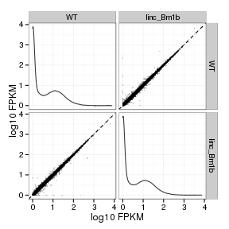 

## Distributions

### Boxplots

Boxplot (genes)

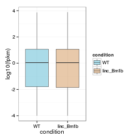 

Boxplot (genes, replicates)

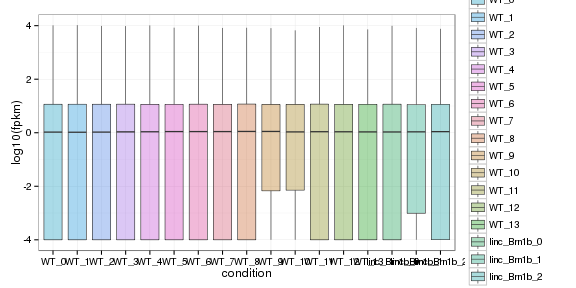 

Boxplot (isoforms)

 

Boxplot (isoforms, replicates)

 

### Density

Density (genes)

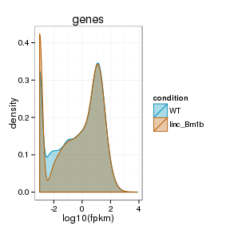 

Density (genes, replicates)

 


## Clustering

### Replicate Clusters

 

```
## NULL
```

### PCA (genes)

 

### MDS (genes)

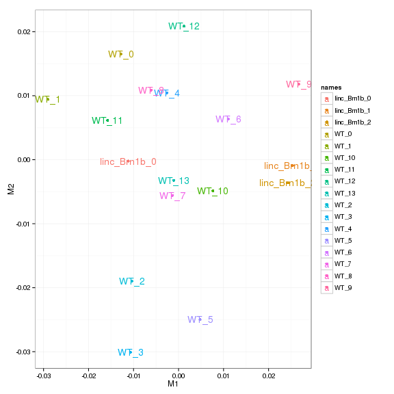 


# KO assessment

## Endogenous lncRNA expression

 

Endogenous expression of linc-Brn1b isoforms:

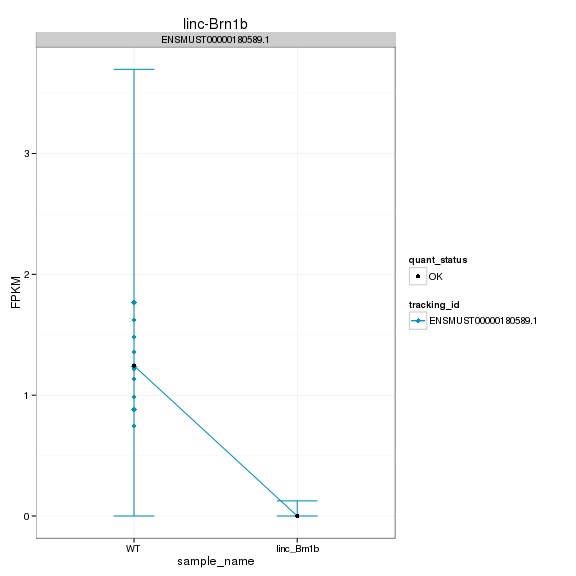 

Barplot of gene expression:

 

Barplot of isoform expression:

 


## LacZ expression

  


## Digital Genotyping (LacZ vs Endogenous lncRNA and Sex)

Eif2s3y is a y-expressed gene, Xist is an x-expressed gene 
Expression plot (endogenous linc, lacZ, Y-expressed gene):

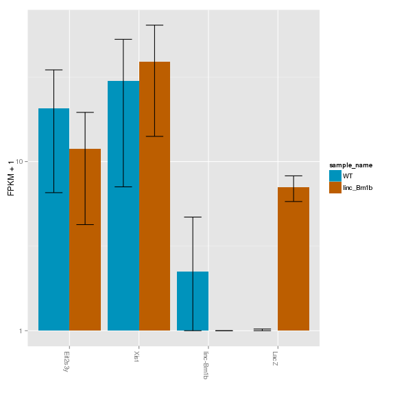 

Expression heatmap:

 


### Track visualization 

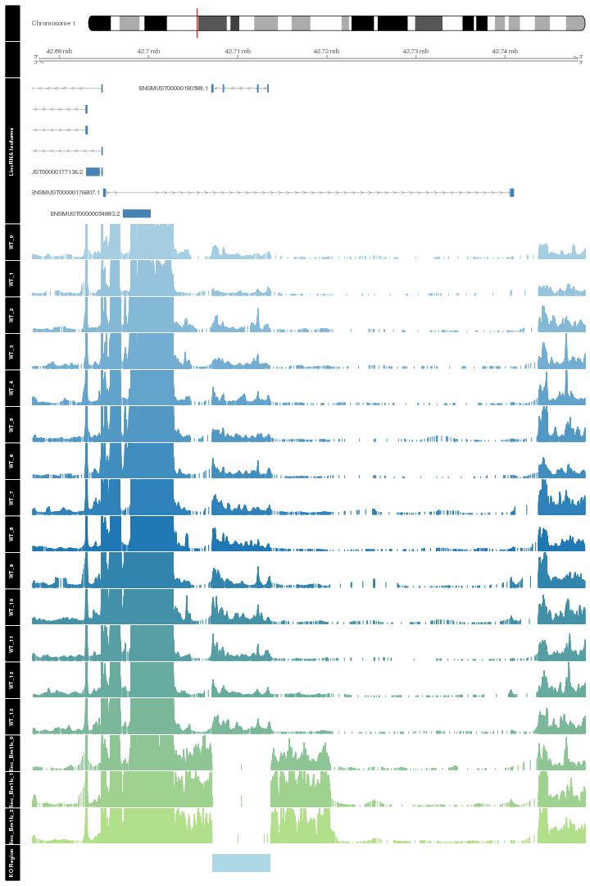 

# Differential Analysis

## Differential Genes 


There are 193 significantly differentially expressed genes. They are:

<!-- html table generated in R 3.0.2 by xtable 1.7-3 package -->
<!-- Fri Jul 18 12:53:54 2014 -->
<TABLE border=1>
<TR> <TH>  </TH> <TH> geneAnnot$gene_short_name </TH>  </TR>
  <TR> <TD align="right"> 1 </TD> <TD> Gabra2 </TD> </TR>
  <TR> <TD align="right"> 2 </TD> <TD> Sox9 </TD> </TR>
  <TR> <TD align="right"> 3 </TD> <TD> Folh1 </TD> </TR>
  <TR> <TD align="right"> 4 </TD> <TD> Kmt2a </TD> </TR>
  <TR> <TD align="right"> 5 </TD> <TD> Rec8 </TD> </TR>
  <TR> <TD align="right"> 6 </TD> <TD> Arrdc2 </TD> </TR>
  <TR> <TD align="right"> 7 </TD> <TD> Calr </TD> </TR>
  <TR> <TD align="right"> 8 </TD> <TD> Gpx6 </TD> </TR>
  <TR> <TD align="right"> 9 </TD> <TD> Pde1c </TD> </TR>
  <TR> <TD align="right"> 10 </TD> <TD> Nes </TD> </TR>
  <TR> <TD align="right"> 11 </TD> <TD> Epha2 </TD> </TR>
  <TR> <TD align="right"> 12 </TD> <TD> Homer1 </TD> </TR>
  <TR> <TD align="right"> 13 </TD> <TD> Dio2 </TD> </TR>
  <TR> <TD align="right"> 14 </TD> <TD> Hnrnpa0 </TD> </TR>
  <TR> <TD align="right"> 15 </TD> <TD> Ttc9b </TD> </TR>
  <TR> <TD align="right"> 16 </TD> <TD> Carhsp1 </TD> </TR>
  <TR> <TD align="right"> 17 </TD> <TD> Tppp3 </TD> </TR>
  <TR> <TD align="right"> 18 </TD> <TD> Etnppl </TD> </TR>
  <TR> <TD align="right"> 19 </TD> <TD> Pdk4 </TD> </TR>
  <TR> <TD align="right"> 20 </TD> <TD> P4ha1 </TD> </TR>
  <TR> <TD align="right"> 21 </TD> <TD> Arid5b </TD> </TR>
  <TR> <TD align="right"> 22 </TD> <TD> Sgk1 </TD> </TR>
  <TR> <TD align="right"> 23 </TD> <TD> Timp3 </TD> </TR>
  <TR> <TD align="right"> 24 </TD> <TD> Ddit4 </TD> </TR>
  <TR> <TD align="right"> 25 </TD> <TD> Btg2 </TD> </TR>
  <TR> <TD align="right"> 26 </TD> <TD> Xbp1 </TD> </TR>
  <TR> <TD align="right"> 27 </TD> <TD> Pdia6 </TD> </TR>
  <TR> <TD align="right"> 28 </TD> <TD> Pxdn </TD> </TR>
  <TR> <TD align="right"> 29 </TD> <TD> Nfkbia </TD> </TR>
  <TR> <TD align="right"> 30 </TD> <TD> Serpina3n </TD> </TR>
  <TR> <TD align="right"> 31 </TD> <TD> Fos </TD> </TR>
  <TR> <TD align="right"> 32 </TD> <TD> Gpr137b </TD> </TR>
  <TR> <TD align="right"> 33 </TD> <TD> Zkscan3 </TD> </TR>
  <TR> <TD align="right"> 34 </TD> <TD> Esd </TD> </TR>
  <TR> <TD align="right"> 35 </TD> <TD> Dnajc3 </TD> </TR>
  <TR> <TD align="right"> 36 </TD> <TD> Slc38a2 </TD> </TR>
  <TR> <TD align="right"> 37 </TD> <TD> Bcl6 </TD> </TR>
  <TR> <TD align="right"> 38 </TD> <TD> Sdf2l1 </TD> </TR>
  <TR> <TD align="right"> 39 </TD> <TD> Cdkn1a </TD> </TR>
  <TR> <TD align="right"> 40 </TD> <TD> Creld2 </TD> </TR>
  <TR> <TD align="right"> 41 </TD> <TD> Glo1 </TD> </TR>
  <TR> <TD align="right"> 42 </TD> <TD> Xdh </TD> </TR>
  <TR> <TD align="right"> 43 </TD> <TD> Atp6v0c </TD> </TR>
  <TR> <TD align="right"> 44 </TD> <TD> Dusp1 </TD> </TR>
  <TR> <TD align="right"> 45 </TD> <TD> Fkbp5 </TD> </TR>
  <TR> <TD align="right"> 46 </TD> <TD> Syt4 </TD> </TR>
  <TR> <TD align="right"> 47 </TD> <TD> Rps24 </TD> </TR>
  <TR> <TD align="right"> 48 </TD> <TD> Pdia4 </TD> </TR>
  <TR> <TD align="right"> 49 </TD> <TD> Slc40a1 </TD> </TR>
  <TR> <TD align="right"> 50 </TD> <TD> Clk1 </TD> </TR>
  <TR> <TD align="right"> 51 </TD> <TD> 2810459M11Rik </TD> </TR>
  <TR> <TD align="right"> 52 </TD> <TD> Bok </TD> </TR>
  <TR> <TD align="right"> 53 </TD> <TD> Mlph </TD> </TR>
  <TR> <TD align="right"> 54 </TD> <TD> Serpinb8 </TD> </TR>
  <TR> <TD align="right"> 55 </TD> <TD> Dbi </TD> </TR>
  <TR> <TD align="right"> 56 </TD> <TD> Atf3 </TD> </TR>
  <TR> <TD align="right"> 57 </TD> <TD> Lcn2 </TD> </TR>
  <TR> <TD align="right"> 58 </TD> <TD> Hspa5 </TD> </TR>
  <TR> <TD align="right"> 59 </TD> <TD> Itpka </TD> </TR>
  <TR> <TD align="right"> 60 </TD> <TD> Spred1 </TD> </TR>
  <TR> <TD align="right"> 61 </TD> <TD> F3 </TD> </TR>
  <TR> <TD align="right"> 62 </TD> <TD> Trp53inp1 </TD> </TR>
  <TR> <TD align="right"> 63 </TD> <TD> Nr4a3 </TD> </TR>
  <TR> <TD align="right"> 64 </TD> <TD> Slc2a1 </TD> </TR>
  <TR> <TD align="right"> 65 </TD> <TD> Tinagl1 </TD> </TR>
  <TR> <TD align="right"> 66 </TD> <TD> Errfi1 </TD> </TR>
  <TR> <TD align="right"> 67 </TD> <TD> Ccnl2 </TD> </TR>
  <TR> <TD align="right"> 68 </TD> <TD> Fosl2 </TD> </TR>
  <TR> <TD align="right"> 69 </TD> <TD> Uncx </TD> </TR>
  <TR> <TD align="right"> 70 </TD> <TD> Klf15 </TD> </TR>
  <TR> <TD align="right"> 71 </TD> <TD> Adipor2 </TD> </TR>
  <TR> <TD align="right"> 72 </TD> <TD> Pglyrp1 </TD> </TR>
  <TR> <TD align="right"> 73 </TD> <TD> Tmem238 </TD> </TR>
  <TR> <TD align="right"> 74 </TD> <TD> Hddc3 </TD> </TR>
  <TR> <TD align="right"> 75 </TD> <TD> Polr3e </TD> </TR>
  <TR> <TD align="right"> 76 </TD> <TD> Tsc22d3 </TD> </TR>
  <TR> <TD align="right"> 77 </TD> <TD> Plat </TD> </TR>
  <TR> <TD align="right"> 78 </TD> <TD> Mt2 </TD> </TR>
  <TR> <TD align="right"> 79 </TD> <TD> Tdgf1 </TD> </TR>
  <TR> <TD align="right"> 80 </TD> <TD> Mlh1 </TD> </TR>
  <TR> <TD align="right"> 81 </TD> <TD> Cck </TD> </TR>
  <TR> <TD align="right"> 82 </TD> <TD> Trf </TD> </TR>
  <TR> <TD align="right"> 83 </TD> <TD> Ugt8a </TD> </TR>
  <TR> <TD align="right"> 84 </TD> <TD> Tbc1d4 </TD> </TR>
  <TR> <TD align="right"> 85 </TD> <TD> Egr3 </TD> </TR>
  <TR> <TD align="right"> 86 </TD> <TD> Tlr13 </TD> </TR>
  <TR> <TD align="right"> 87 </TD> <TD> Slc25a37 </TD> </TR>
  <TR> <TD align="right"> 88 </TD> <TD> Arhgap27 </TD> </TR>
  <TR> <TD align="right"> 89 </TD> <TD> Pla2g3 </TD> </TR>
  <TR> <TD align="right"> 90 </TD> <TD> Tiparp </TD> </TR>
  <TR> <TD align="right"> 91 </TD> <TD> Prr7 </TD> </TR>
  <TR> <TD align="right"> 92 </TD> <TD> Nostrin </TD> </TR>
  <TR> <TD align="right"> 93 </TD> <TD> Filip1 </TD> </TR>
  <TR> <TD align="right"> 94 </TD> <TD> Arl4d </TD> </TR>
  <TR> <TD align="right"> 95 </TD> <TD> Cox8a </TD> </TR>
  <TR> <TD align="right"> 96 </TD> <TD> H2-Q4 </TD> </TR>
  <TR> <TD align="right"> 97 </TD> <TD> Anln </TD> </TR>
  <TR> <TD align="right"> 98 </TD> <TD> Tob1 </TD> </TR>
  <TR> <TD align="right"> 99 </TD> <TD> Avp </TD> </TR>
  <TR> <TD align="right"> 100 </TD> <TD> Vstm2l </TD> </TR>
  <TR> <TD align="right"> 101 </TD> <TD> Smim3 </TD> </TR>
  <TR> <TD align="right"> 102 </TD> <TD> Camk4 </TD> </TR>
  <TR> <TD align="right"> 103 </TD> <TD> Txnip </TD> </TR>
  <TR> <TD align="right"> 104 </TD> <TD> Foxq1 </TD> </TR>
  <TR> <TD align="right"> 105 </TD> <TD> Akap12 </TD> </TR>
  <TR> <TD align="right"> 106 </TD> <TD> Irs2 </TD> </TR>
  <TR> <TD align="right"> 107 </TD> <TD> Pcsk1n </TD> </TR>
  <TR> <TD align="right"> 108 </TD> <TD> Tnfsf10 </TD> </TR>
  <TR> <TD align="right"> 109 </TD> <TD> Zfp189 </TD> </TR>
  <TR> <TD align="right"> 110 </TD> <TD> Slc6a5 </TD> </TR>
  <TR> <TD align="right"> 111 </TD> <TD> C1qtnf4 </TD> </TR>
  <TR> <TD align="right"> 112 </TD> <TD> Nkx6-2 </TD> </TR>
  <TR> <TD align="right"> 113 </TD> <TD> Cldn5 </TD> </TR>
  <TR> <TD align="right"> 114 </TD> <TD> Kcnj2 </TD> </TR>
  <TR> <TD align="right"> 115 </TD> <TD> Maff </TD> </TR>
  <TR> <TD align="right"> 116 </TD> <TD> Tuba1c </TD> </TR>
  <TR> <TD align="right"> 117 </TD> <TD> Lor </TD> </TR>
  <TR> <TD align="right"> 118 </TD> <TD> Nxpe4 </TD> </TR>
  <TR> <TD align="right"> 119 </TD> <TD> Ctla2a </TD> </TR>
  <TR> <TD align="right"> 120 </TD> <TD> Snhg11 </TD> </TR>
  <TR> <TD align="right"> 121 </TD> <TD> Rps2 </TD> </TR>
  <TR> <TD align="right"> 122 </TD> <TD> Hjurp </TD> </TR>
  <TR> <TD align="right"> 123 </TD> <TD> Pcdhb7 </TD> </TR>
  <TR> <TD align="right"> 124 </TD> <TD> Cirbp </TD> </TR>
  <TR> <TD align="right"> 125 </TD> <TD> Nudt18 </TD> </TR>
  <TR> <TD align="right"> 126 </TD> <TD> Pcdhb3 </TD> </TR>
  <TR> <TD align="right"> 127 </TD> <TD> Zfp36l2 </TD> </TR>
  <TR> <TD align="right"> 128 </TD> <TD> Npas4 </TD> </TR>
  <TR> <TD align="right"> 129 </TD> <TD> Clec14a </TD> </TR>
  <TR> <TD align="right"> 130 </TD> <TD> Plaur </TD> </TR>
  <TR> <TD align="right"> 131 </TD> <TD> Mpeg1 </TD> </TR>
  <TR> <TD align="right"> 132 </TD> <TD> Cdh19 </TD> </TR>
  <TR> <TD align="right"> 133 </TD> <TD> Gimap6 </TD> </TR>
  <TR> <TD align="right"> 134 </TD> <TD> Hes5 </TD> </TR>
  <TR> <TD align="right"> 135 </TD> <TD> Tmem252 </TD> </TR>
  <TR> <TD align="right"> 136 </TD> <TD> Ctxn1 </TD> </TR>
  <TR> <TD align="right"> 137 </TD> <TD> Ccdc6 </TD> </TR>
  <TR> <TD align="right"> 138 </TD> <TD> Dact2 </TD> </TR>
  <TR> <TD align="right"> 139 </TD> <TD> Chchd10 </TD> </TR>
  <TR> <TD align="right"> 140 </TD> <TD> Rasd1 </TD> </TR>
  <TR> <TD align="right"> 141 </TD> <TD> Rasl11b </TD> </TR>
  <TR> <TD align="right"> 142 </TD> <TD> Klk6 </TD> </TR>
  <TR> <TD align="right"> 143 </TD> <TD> Kcnk12 </TD> </TR>
  <TR> <TD align="right"> 144 </TD> <TD> Plekho2 </TD> </TR>
  <TR> <TD align="right"> 145 </TD> <TD> Pcdhb6 </TD> </TR>
  <TR> <TD align="right"> 146 </TD> <TD> Hbb-bs </TD> </TR>
  <TR> <TD align="right"> 147 </TD> <TD> Junb </TD> </TR>
  <TR> <TD align="right"> 148 </TD> <TD> Ier2 </TD> </TR>
  <TR> <TD align="right"> 149 </TD> <TD> Mat2a </TD> </TR>
  <TR> <TD align="right"> 150 </TD> <TD> Iigp1 </TD> </TR>
  <TR> <TD align="right"> 151 </TD> <TD> Tmem158 </TD> </TR>
  <TR> <TD align="right"> 152 </TD> <TD> 5033411D12Rik </TD> </TR>
  <TR> <TD align="right"> 153 </TD> <TD> Zcchc24 </TD> </TR>
  <TR> <TD align="right"> 154 </TD> <TD> Pign </TD> </TR>
  <TR> <TD align="right"> 155 </TD> <TD> Kdm5d </TD> </TR>
  <TR> <TD align="right"> 156 </TD> <TD> Ero1lb </TD> </TR>
  <TR> <TD align="right"> 157 </TD> <TD> Mex3b </TD> </TR>
  <TR> <TD align="right"> 158 </TD> <TD> C030014I23Rik </TD> </TR>
  <TR> <TD align="right"> 159 </TD> <TD> Cox5b </TD> </TR>
  <TR> <TD align="right"> 160 </TD> <TD> Rpl34 </TD> </TR>
  <TR> <TD align="right"> 161 </TD> <TD> Scoc </TD> </TR>
  <TR> <TD align="right"> 162 </TD> <TD> BC048507 </TD> </TR>
  <TR> <TD align="right"> 163 </TD> <TD> Zbtb16 </TD> </TR>
  <TR> <TD align="right"> 164 </TD> <TD> Bpifb9b </TD> </TR>
  <TR> <TD align="right"> 165 </TD> <TD> Bpifb3 </TD> </TR>
  <TR> <TD align="right"> 166 </TD> <TD> Ddx3y </TD> </TR>
  <TR> <TD align="right"> 167 </TD> <TD> Irgm2 </TD> </TR>
  <TR> <TD align="right"> 168 </TD> <TD> Gm1673 </TD> </TR>
  <TR> <TD align="right"> 169 </TD> <TD> Jund </TD> </TR>
  <TR> <TD align="right"> 170 </TD> <TD> Egr4 </TD> </TR>
  <TR> <TD align="right"> 171 </TD> <TD> Gm7292 </TD> </TR>
  <TR> <TD align="right"> 172 </TD> <TD> Gpr27 </TD> </TR>
  <TR> <TD align="right"> 173 </TD> <TD> H2-Bl </TD> </TR>
  <TR> <TD align="right"> 174 </TD> <TD> Wdfy1 </TD> </TR>
  <TR> <TD align="right"> 175 </TD> <TD> Plekhf1 </TD> </TR>
  <TR> <TD align="right"> 176 </TD> <TD> Arrdc3 </TD> </TR>
  <TR> <TD align="right"> 177 </TD> <TD> Fjx1 </TD> </TR>
  <TR> <TD align="right"> 178 </TD> <TD> Rprm </TD> </TR>
  <TR> <TD align="right"> 179 </TD> <TD> Nrarp </TD> </TR>
  <TR> <TD align="right"> 180 </TD> <TD> Gbp4 </TD> </TR>
  <TR> <TD align="right"> 181 </TD> <TD> Gm11273 </TD> </TR>
  <TR> <TD align="right"> 182 </TD> <TD> Slc5a3 </TD> </TR>
  <TR> <TD align="right"> 183 </TD> <TD> Cdr1 </TD> </TR>
  <TR> <TD align="right"> 184 </TD> <TD> Apold1 </TD> </TR>
  <TR> <TD align="right"> 185 </TD> <TD> Hspa1b </TD> </TR>
  <TR> <TD align="right"> 186 </TD> <TD> Malat1 </TD> </TR>
  <TR> <TD align="right"> 187 </TD> <TD> AA465934 </TD> </TR>
  <TR> <TD align="right"> 188 </TD> <TD> Gm21967 </TD> </TR>
  <TR> <TD align="right"> 189 </TD> <TD> Ccdc85b </TD> </TR>
  <TR> <TD align="right"> 190 </TD> <TD> Gm6472 </TD> </TR>
  <TR> <TD align="right"> 191 </TD> <TD> AI848285 </TD> </TR>
  <TR> <TD align="right"> 192 </TD> <TD> 4930480K23Rik </TD> </TR>
  <TR> <TD align="right"> 193 </TD> <TD> Gpr137b-ps </TD> </TR>
   </TABLE>

### Matrix of gene significant differences between conditions

(skip for Brainmap wt-v-ko comparisons)

 

### Significant gene expression differences between conditions

Expression plot (genes):(turned off)


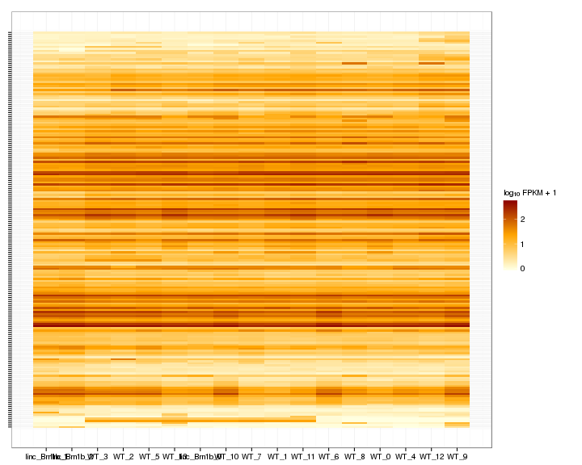 

Significant genes with expression >50fpkm (any condition):(turned off)


An individual look at each of the highly expressed significantly differentially regulated genes:
(eval=false for first pass)


### Expression-level/significance relationship

Scatter plot of significant genes only:

 

Volcano Plot

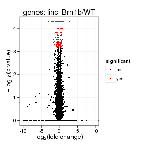 

Volcano plot with significant genes only:

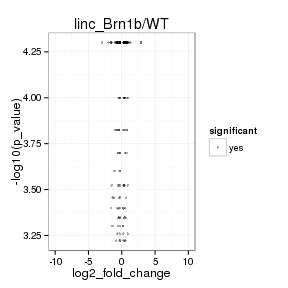 

FoldChange Heatmap

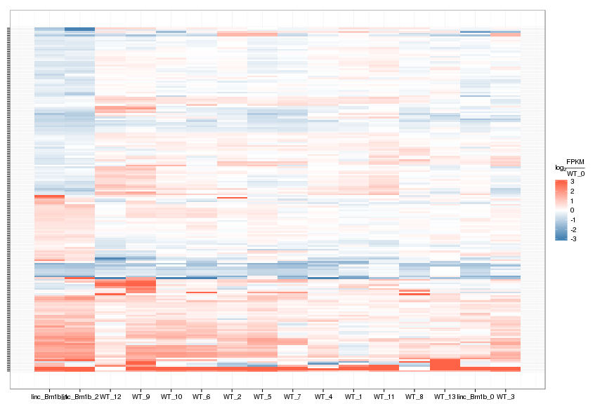 


## Differential Splicing

### Differential Isoforms between conditions

Per isoform difference between conditions:

 

These isoforms are:

<!-- html table generated in R 3.0.2 by xtable 1.7-3 package -->
<!-- Fri Jul 18 12:56:00 2014 -->
<TABLE border=1>
<TR> <TH>  </TH> <TH> isoAnnot$gene_short_name </TH>  </TR>
  <TR> <TD align="right"> 1 </TD> <TD> Gabra2 </TD> </TR>
  <TR> <TD align="right"> 2 </TD> <TD> Sox9 </TD> </TR>
  <TR> <TD align="right"> 3 </TD> <TD> Rec8 </TD> </TR>
  <TR> <TD align="right"> 4 </TD> <TD> Arrdc2 </TD> </TR>
  <TR> <TD align="right"> 5 </TD> <TD> Calr </TD> </TR>
  <TR> <TD align="right"> 6 </TD> <TD> Hif3a </TD> </TR>
  <TR> <TD align="right"> 7 </TD> <TD> Nes </TD> </TR>
  <TR> <TD align="right"> 8 </TD> <TD> Ndrg1 </TD> </TR>
  <TR> <TD align="right"> 9 </TD> <TD> Dio2 </TD> </TR>
  <TR> <TD align="right"> 10 </TD> <TD> Ttc9b </TD> </TR>
  <TR> <TD align="right"> 11 </TD> <TD> Pdk4 </TD> </TR>
  <TR> <TD align="right"> 12 </TD> <TD> Sgk1 </TD> </TR>
  <TR> <TD align="right"> 13 </TD> <TD> Tmcc3 </TD> </TR>
  <TR> <TD align="right"> 14 </TD> <TD> Timp3 </TD> </TR>
  <TR> <TD align="right"> 15 </TD> <TD> Ddit4 </TD> </TR>
  <TR> <TD align="right"> 16 </TD> <TD> Cpm </TD> </TR>
  <TR> <TD align="right"> 17 </TD> <TD> Tns3 </TD> </TR>
  <TR> <TD align="right"> 18 </TD> <TD> Btg2 </TD> </TR>
  <TR> <TD align="right"> 19 </TD> <TD> Xbp1 </TD> </TR>
  <TR> <TD align="right"> 20 </TD> <TD> Pxdn </TD> </TR>
  <TR> <TD align="right"> 21 </TD> <TD> Nfkbia </TD> </TR>
  <TR> <TD align="right"> 22 </TD> <TD> Serpina3n </TD> </TR>
  <TR> <TD align="right"> 23 </TD> <TD> Fos </TD> </TR>
  <TR> <TD align="right"> 24 </TD> <TD> Gpr137b </TD> </TR>
  <TR> <TD align="right"> 25 </TD> <TD> Thbs4 </TD> </TR>
  <TR> <TD align="right"> 26 </TD> <TD> Kat6b </TD> </TR>
  <TR> <TD align="right"> 27 </TD> <TD> Dnajc3 </TD> </TR>
  <TR> <TD align="right"> 28 </TD> <TD> Slc38a2 </TD> </TR>
  <TR> <TD align="right"> 29 </TD> <TD> Bcl6 </TD> </TR>
  <TR> <TD align="right"> 30 </TD> <TD> Sdf2l1 </TD> </TR>
  <TR> <TD align="right"> 31 </TD> <TD> Tfrc </TD> </TR>
  <TR> <TD align="right"> 32 </TD> <TD> Cdkn1a </TD> </TR>
  <TR> <TD align="right"> 33 </TD> <TD> Glo1 </TD> </TR>
  <TR> <TD align="right"> 34 </TD> <TD> Xdh </TD> </TR>
  <TR> <TD align="right"> 35 </TD> <TD> Atp6v0c </TD> </TR>
  <TR> <TD align="right"> 36 </TD> <TD> Dusp1 </TD> </TR>
  <TR> <TD align="right"> 37 </TD> <TD> Fkbp5 </TD> </TR>
  <TR> <TD align="right"> 38 </TD> <TD> Rps24 </TD> </TR>
  <TR> <TD align="right"> 39 </TD> <TD> Pdia4 </TD> </TR>
  <TR> <TD align="right"> 40 </TD> <TD> Bok </TD> </TR>
  <TR> <TD align="right"> 41 </TD> <TD> Mlph </TD> </TR>
  <TR> <TD align="right"> 42 </TD> <TD> Hspa5 </TD> </TR>
  <TR> <TD align="right"> 43 </TD> <TD> Spred1 </TD> </TR>
  <TR> <TD align="right"> 44 </TD> <TD> F3 </TD> </TR>
  <TR> <TD align="right"> 45 </TD> <TD> Slc2a1 </TD> </TR>
  <TR> <TD align="right"> 46 </TD> <TD> Ago3 </TD> </TR>
  <TR> <TD align="right"> 47 </TD> <TD> Map3k6 </TD> </TR>
  <TR> <TD align="right"> 48 </TD> <TD> Errfi1 </TD> </TR>
  <TR> <TD align="right"> 49 </TD> <TD> Ccnl2 </TD> </TR>
  <TR> <TD align="right"> 50 </TD> <TD> Fosl2 </TD> </TR>
  <TR> <TD align="right"> 51 </TD> <TD> Adipor2 </TD> </TR>
  <TR> <TD align="right"> 52 </TD> <TD> Pglyrp1 </TD> </TR>
  <TR> <TD align="right"> 53 </TD> <TD> Hddc3 </TD> </TR>
  <TR> <TD align="right"> 54 </TD> <TD> Tsc22d3 </TD> </TR>
  <TR> <TD align="right"> 55 </TD> <TD> Mt2 </TD> </TR>
  <TR> <TD align="right"> 56 </TD> <TD> Mlh1 </TD> </TR>
  <TR> <TD align="right"> 57 </TD> <TD> Cck </TD> </TR>
  <TR> <TD align="right"> 58 </TD> <TD> Ugt8a </TD> </TR>
  <TR> <TD align="right"> 59 </TD> <TD> Fndc3a </TD> </TR>
  <TR> <TD align="right"> 60 </TD> <TD> Akr1c14 </TD> </TR>
  <TR> <TD align="right"> 61 </TD> <TD> Egr3 </TD> </TR>
  <TR> <TD align="right"> 62 </TD> <TD> Slc25a37 </TD> </TR>
  <TR> <TD align="right"> 63 </TD> <TD> Tiparp </TD> </TR>
  <TR> <TD align="right"> 64 </TD> <TD> Prr7 </TD> </TR>
  <TR> <TD align="right"> 65 </TD> <TD> Arl4d </TD> </TR>
  <TR> <TD align="right"> 66 </TD> <TD> Cox8a </TD> </TR>
  <TR> <TD align="right"> 67 </TD> <TD> Anln </TD> </TR>
  <TR> <TD align="right"> 68 </TD> <TD> Tob1 </TD> </TR>
  <TR> <TD align="right"> 69 </TD> <TD> Avp </TD> </TR>
  <TR> <TD align="right"> 70 </TD> <TD> Vstm2l </TD> </TR>
  <TR> <TD align="right"> 71 </TD> <TD> Acer2 </TD> </TR>
  <TR> <TD align="right"> 72 </TD> <TD> Smim3 </TD> </TR>
  <TR> <TD align="right"> 73 </TD> <TD> Camk4 </TD> </TR>
  <TR> <TD align="right"> 74 </TD> <TD> Slc43a2 </TD> </TR>
  <TR> <TD align="right"> 75 </TD> <TD> Aox4 </TD> </TR>
  <TR> <TD align="right"> 76 </TD> <TD> Txnip </TD> </TR>
  <TR> <TD align="right"> 77 </TD> <TD> Foxq1 </TD> </TR>
  <TR> <TD align="right"> 78 </TD> <TD> Akap12 </TD> </TR>
  <TR> <TD align="right"> 79 </TD> <TD> Pcsk1n </TD> </TR>
  <TR> <TD align="right"> 80 </TD> <TD> Tnfsf10 </TD> </TR>
  <TR> <TD align="right"> 81 </TD> <TD> Slc6a5 </TD> </TR>
  <TR> <TD align="right"> 82 </TD> <TD> Gjb6 </TD> </TR>
  <TR> <TD align="right"> 83 </TD> <TD> C1qtnf4 </TD> </TR>
  <TR> <TD align="right"> 84 </TD> <TD> Nkx6-2 </TD> </TR>
  <TR> <TD align="right"> 85 </TD> <TD> Cldn5 </TD> </TR>
  <TR> <TD align="right"> 86 </TD> <TD> Kcnj2 </TD> </TR>
  <TR> <TD align="right"> 87 </TD> <TD> Ctla2a </TD> </TR>
  <TR> <TD align="right"> 88 </TD> <TD> Snhg11 </TD> </TR>
  <TR> <TD align="right"> 89 </TD> <TD> Acp1 </TD> </TR>
  <TR> <TD align="right"> 90 </TD> <TD> Hjurp </TD> </TR>
  <TR> <TD align="right"> 91 </TD> <TD> Pcdhb7 </TD> </TR>
  <TR> <TD align="right"> 92 </TD> <TD> Nudt18 </TD> </TR>
  <TR> <TD align="right"> 93 </TD> <TD> Zfp36l2 </TD> </TR>
  <TR> <TD align="right"> 94 </TD> <TD> Npas4 </TD> </TR>
  <TR> <TD align="right"> 95 </TD> <TD> Cdh19 </TD> </TR>
  <TR> <TD align="right"> 96 </TD> <TD> Hes5 </TD> </TR>
  <TR> <TD align="right"> 97 </TD> <TD> Dact2 </TD> </TR>
  <TR> <TD align="right"> 98 </TD> <TD> Chchd10 </TD> </TR>
  <TR> <TD align="right"> 99 </TD> <TD> Kcnk12 </TD> </TR>
  <TR> <TD align="right"> 100 </TD> <TD> Pcdhb6 </TD> </TR>
  <TR> <TD align="right"> 101 </TD> <TD> Adarb2 </TD> </TR>
  <TR> <TD align="right"> 102 </TD> <TD> Junb </TD> </TR>
  <TR> <TD align="right"> 103 </TD> <TD> Ier2 </TD> </TR>
  <TR> <TD align="right"> 104 </TD> <TD> Mat2a </TD> </TR>
  <TR> <TD align="right"> 105 </TD> <TD> Zfp771 </TD> </TR>
  <TR> <TD align="right"> 106 </TD> <TD> Tmem158 </TD> </TR>
  <TR> <TD align="right"> 107 </TD> <TD> 5033411D12Rik </TD> </TR>
  <TR> <TD align="right"> 108 </TD> <TD> Pign </TD> </TR>
  <TR> <TD align="right"> 109 </TD> <TD> Kdm5d </TD> </TR>
  <TR> <TD align="right"> 110 </TD> <TD> Ero1lb </TD> </TR>
  <TR> <TD align="right"> 111 </TD> <TD> Mex3b </TD> </TR>
  <TR> <TD align="right"> 112 </TD> <TD> Zbtb16 </TD> </TR>
  <TR> <TD align="right"> 113 </TD> <TD> Bpifb9b </TD> </TR>
  <TR> <TD align="right"> 114 </TD> <TD> Ddx3y </TD> </TR>
  <TR> <TD align="right"> 115 </TD> <TD> Ahnak </TD> </TR>
  <TR> <TD align="right"> 116 </TD> <TD> Jund </TD> </TR>
  <TR> <TD align="right"> 117 </TD> <TD> Egr4 </TD> </TR>
  <TR> <TD align="right"> 118 </TD> <TD> Gm7292 </TD> </TR>
  <TR> <TD align="right"> 119 </TD> <TD> Gpr27 </TD> </TR>
  <TR> <TD align="right"> 120 </TD> <TD> Wdfy1 </TD> </TR>
  <TR> <TD align="right"> 121 </TD> <TD> Plekhf1 </TD> </TR>
  <TR> <TD align="right"> 122 </TD> <TD> Arrdc3 </TD> </TR>
  <TR> <TD align="right"> 123 </TD> <TD> Fjx1 </TD> </TR>
  <TR> <TD align="right"> 124 </TD> <TD> Rprm </TD> </TR>
  <TR> <TD align="right"> 125 </TD> <TD> Nrarp </TD> </TR>
  <TR> <TD align="right"> 126 </TD> <TD> Gbp4 </TD> </TR>
  <TR> <TD align="right"> 127 </TD> <TD> Gm11273 </TD> </TR>
  <TR> <TD align="right"> 128 </TD> <TD> Cdr1 </TD> </TR>
  <TR> <TD align="right"> 129 </TD> <TD> Apold1 </TD> </TR>
  <TR> <TD align="right"> 130 </TD> <TD> Hspa1b </TD> </TR>
  <TR> <TD align="right"> 131 </TD> <TD> Malat1 </TD> </TR>
  <TR> <TD align="right"> 132 </TD> <TD> Ccdc85b </TD> </TR>
  <TR> <TD align="right"> 133 </TD> <TD> Gm6472 </TD> </TR>
  <TR> <TD align="right"> 134 </TD> <TD> AI848285 </TD> </TR>
  <TR> <TD align="right"> 135 </TD> <TD> 4930480K23Rik </TD> </TR>
  <TR> <TD align="right"> 136 </TD> <TD> Gpr137b-ps </TD> </TR>
   </TABLE>

Gene-level DE isoform heatmap

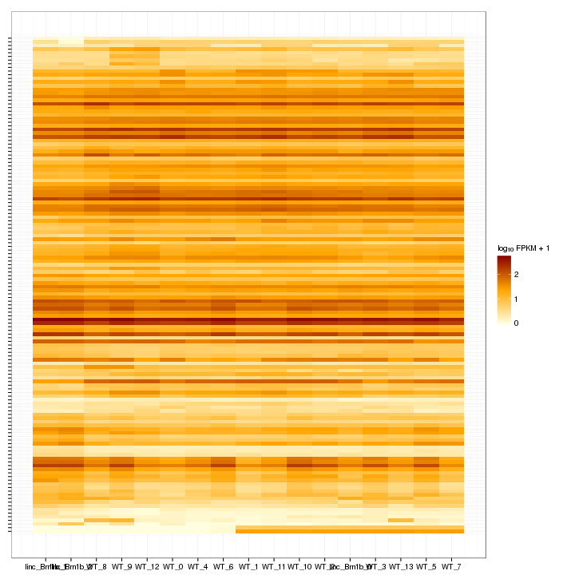 

Isoform foldchange heatmap by isoform:

 


### Differential Splicing between conditions

(eval false for first pass)

Per condition differences in isoforms (Does gene have diff piechart between conditions?)


These genes are:


Splicing heatmap by isoform:


Splicing heatmap by gene


The following are significantly differentially spliced genes (relative portion of isoform per condition): 


 


# Gene/Pathway Analysis

## GSEA

Enrichment and zscores are calculated based on expression in KO vs WT (fpkmKO/fpkmWT), so genes that are down regulated in KO are shown in blue, while upregulation is shown in red. 

KO/WT
Blue = down in KO
Red = Up in KO


Biocarta enrichment: 


```
## [1] "Not enough significant categories to print a heatmap!"
```

Biocarta zscore: 


```
## [1] "Not enough significant categories to print a heatmap!"
```


Reactome enrichment: 

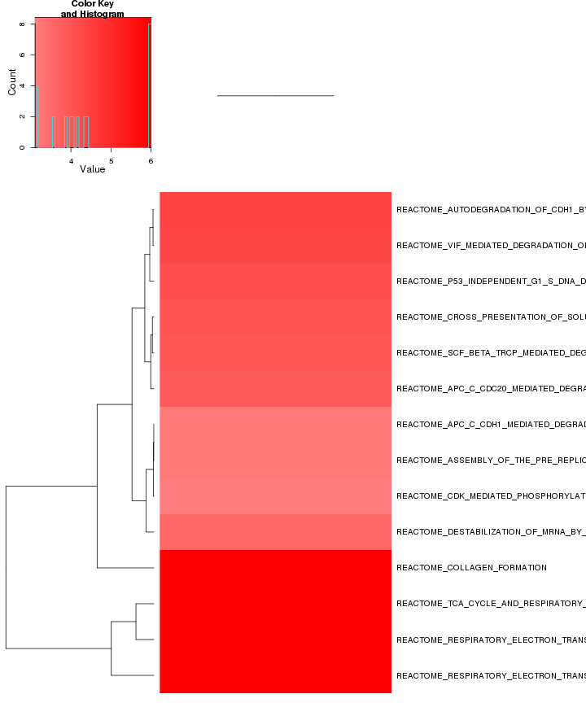 


Reactome zscore: 

 


Kegg enrichment: 

 

Kegg zscore: 

 

Interneuron enrichment:


```
## Error: no locations are finite
```

 

Interneuron zscore:

 


Oncogene enrichment: 

 

Oncogene zscore:

 

Immuno enrichment:

 

Immuno zscore:

 

TF enrichment:

 

TF zscore:

 


## GO enrichment 
Cluster profiler used to call enichments of significantly differentially regulated genes that map to Entrez IDs. 


 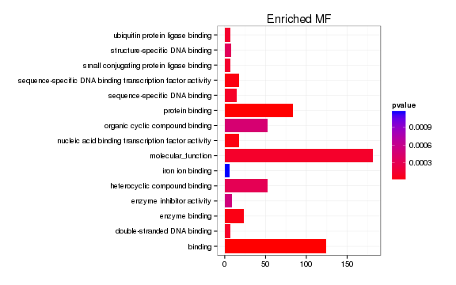 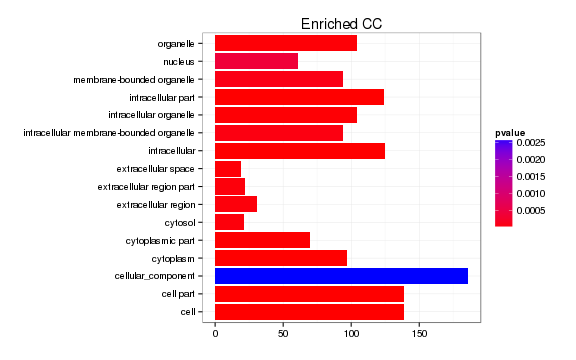 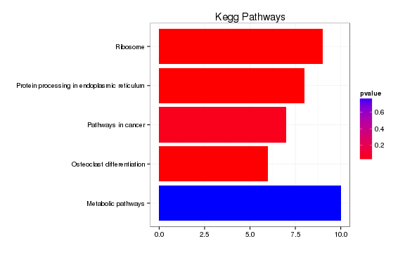 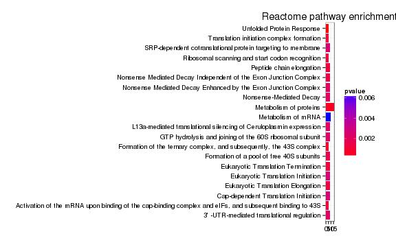 


### Enrichment or depletion for stage-specific cell cycle markers 

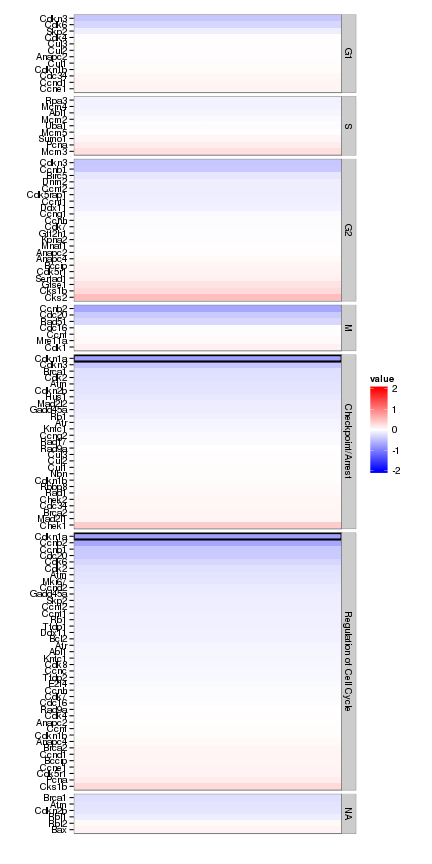 


### Enrichment or depletion for markers of specific cortical layers

 


### Enrichment or depletion for specific neural cell types 
 


### Enrichment or Depletion of neural differentiation markers 

 


# Cis vs Trans (locally)

log2 Foldchange and test statistic are calculated with the ratio of fpkm(KO)/fpkm(WT), thus the test_stat is positive if a gene is higher in the KO and negative if a gene has lower expression in the KO


The pvalue for 0 genes significantly regulated in a region this size  is: 1 


 

# Notes

## Samples used are:
<!-- html table generated in R 3.0.2 by xtable 1.7-3 package -->
<!-- Fri Jul 18 13:31:20 2014 -->
<TABLE border=1>
<TR> <TH>  </TH> <TH> 10 </TH>  </TR>
  <TR> <TD align="right"> 1 </TD> <TD> JR729 </TD> </TR>
  <TR> <TD align="right"> 2 </TD> <TD> JR728 </TD> </TR>
  <TR> <TD align="right"> 3 </TD> <TD> JR796 </TD> </TR>
  <TR> <TD align="right"> 4 </TD> <TD> JR797 </TD> </TR>
  <TR> <TD align="right"> 5 </TD> <TD> JR740 </TD> </TR>
  <TR> <TD align="right"> 6 </TD> <TD> JR800 </TD> </TR>
  <TR> <TD align="right"> 7 </TD> <TD> JR827 </TD> </TR>
  <TR> <TD align="right"> 8 </TD> <TD> JR778 </TD> </TR>
  <TR> <TD align="right"> 9 </TD> <TD> JR734 </TD> </TR>
  <TR> <TD align="right"> 10 </TD> <TD> JR802 </TD> </TR>
  <TR> <TD align="right"> 11 </TD> <TD> JR803 </TD> </TR>
  <TR> <TD align="right"> 12 </TD> <TD> JR735 </TD> </TR>
  <TR> <TD align="right"> 13 </TD> <TD> JR785 </TD> </TR>
  <TR> <TD align="right"> 14 </TD> <TD> JR781 </TD> </TR>
  <TR> <TD align="right"> 15 </TD> <TD> JR731 </TD> </TR>
  <TR> <TD align="right"> 16 </TD> <TD> JR835 </TD> </TR>
  <TR> <TD align="right"> 17 </TD> <TD> JR836 </TD> </TR>
   </TABLE>

## Replicates
<!-- html table generated in R 3.0.2 by xtable 1.7-3 package -->
<!-- Fri Jul 18 13:31:20 2014 -->
<TABLE border=1>
<TR> <TH>  </TH> <TH> file </TH> <TH> sample_name </TH> <TH> replicate </TH> <TH> rep_name </TH> <TH> total_mass </TH> <TH> norm_mass </TH> <TH> internal_scale </TH> <TH> external_scale </TH>  </TR>
  <TR> <TD align="right"> 1 </TD> <TD> /n/rinn_data1/seq/lgoff/Projects/BrainMap/data/quants/JR729/abundances.cxb </TD> <TD> WT </TD> <TD align="right">   0 </TD> <TD> WT_0 </TD> <TD align="right"> 26334400.00 </TD> <TD align="right"> 34504400.00 </TD> <TD align="right"> 0.76 </TD> <TD align="right"> 1.00 </TD> </TR>
  <TR> <TD align="right"> 2 </TD> <TD> /n/rinn_data1/seq/lgoff/Projects/BrainMap/data/quants/JR728/abundances.cxb </TD> <TD> WT </TD> <TD align="right">   1 </TD> <TD> WT_1 </TD> <TD align="right"> 20329200.00 </TD> <TD align="right"> 34504400.00 </TD> <TD align="right"> 0.59 </TD> <TD align="right"> 1.00 </TD> </TR>
  <TR> <TD align="right"> 3 </TD> <TD> /n/rinn_data1/seq/lgoff/Projects/BrainMap/data/quants/JR796/abundances.cxb </TD> <TD> WT </TD> <TD align="right">   2 </TD> <TD> WT_2 </TD> <TD align="right"> 34089000.00 </TD> <TD align="right"> 34504400.00 </TD> <TD align="right"> 0.98 </TD> <TD align="right"> 1.00 </TD> </TR>
  <TR> <TD align="right"> 4 </TD> <TD> /n/rinn_data1/seq/lgoff/Projects/BrainMap/data/quants/JR797/abundances.cxb </TD> <TD> WT </TD> <TD align="right">   3 </TD> <TD> WT_3 </TD> <TD align="right"> 28103300.00 </TD> <TD align="right"> 34504400.00 </TD> <TD align="right"> 0.80 </TD> <TD align="right"> 1.00 </TD> </TR>
  <TR> <TD align="right"> 5 </TD> <TD> /n/rinn_data1/seq/lgoff/Projects/BrainMap/data/quants/JR740/abundances.cxb </TD> <TD> WT </TD> <TD align="right">   4 </TD> <TD> WT_4 </TD> <TD align="right"> 35808200.00 </TD> <TD align="right"> 34504400.00 </TD> <TD align="right"> 1.04 </TD> <TD align="right"> 1.00 </TD> </TR>
  <TR> <TD align="right"> 6 </TD> <TD> /n/rinn_data1/seq/lgoff/Projects/BrainMap/data/quants/JR800/abundances.cxb </TD> <TD> WT </TD> <TD align="right">   5 </TD> <TD> WT_5 </TD> <TD align="right"> 37012200.00 </TD> <TD align="right"> 34504400.00 </TD> <TD align="right"> 1.07 </TD> <TD align="right"> 1.00 </TD> </TR>
  <TR> <TD align="right"> 7 </TD> <TD> /n/rinn_data1/seq/lgoff/Projects/BrainMap/data/quants/JR827/abundances.cxb </TD> <TD> WT </TD> <TD align="right">   6 </TD> <TD> WT_6 </TD> <TD align="right"> 27786600.00 </TD> <TD align="right"> 34504400.00 </TD> <TD align="right"> 0.81 </TD> <TD align="right"> 1.00 </TD> </TR>
  <TR> <TD align="right"> 8 </TD> <TD> /n/rinn_data1/seq/lgoff/Projects/BrainMap/data/quants/JR778/abundances.cxb </TD> <TD> WT </TD> <TD align="right">   7 </TD> <TD> WT_7 </TD> <TD align="right"> 39541900.00 </TD> <TD align="right"> 34504400.00 </TD> <TD align="right"> 1.16 </TD> <TD align="right"> 1.00 </TD> </TR>
  <TR> <TD align="right"> 9 </TD> <TD> /n/rinn_data1/seq/lgoff/Projects/BrainMap/data/quants/JR734/abundances.cxb </TD> <TD> WT </TD> <TD align="right">   8 </TD> <TD> WT_8 </TD> <TD align="right"> 34480600.00 </TD> <TD align="right"> 34504400.00 </TD> <TD align="right"> 1.01 </TD> <TD align="right"> 1.00 </TD> </TR>
  <TR> <TD align="right"> 10 </TD> <TD> /n/rinn_data1/seq/lgoff/Projects/BrainMap/data/quants/JR802/abundances.cxb </TD> <TD> WT </TD> <TD align="right">   9 </TD> <TD> WT_9 </TD> <TD align="right"> 45467400.00 </TD> <TD align="right"> 34504400.00 </TD> <TD align="right"> 1.30 </TD> <TD align="right"> 1.00 </TD> </TR>
  <TR> <TD align="right"> 11 </TD> <TD> /n/rinn_data1/seq/lgoff/Projects/BrainMap/data/quants/JR803/abundances.cxb </TD> <TD> WT </TD> <TD align="right">  10 </TD> <TD> WT_10 </TD> <TD align="right"> 52130400.00 </TD> <TD align="right"> 34504400.00 </TD> <TD align="right"> 1.51 </TD> <TD align="right"> 1.00 </TD> </TR>
  <TR> <TD align="right"> 12 </TD> <TD> /n/rinn_data1/seq/lgoff/Projects/BrainMap/data/quants/JR735/abundances.cxb </TD> <TD> WT </TD> <TD align="right">  11 </TD> <TD> WT_11 </TD> <TD align="right"> 34994400.00 </TD> <TD align="right"> 34504400.00 </TD> <TD align="right"> 1.02 </TD> <TD align="right"> 1.00 </TD> </TR>
  <TR> <TD align="right"> 13 </TD> <TD> /n/rinn_data1/seq/lgoff/Projects/BrainMap/data/quants/JR785/abundances.cxb </TD> <TD> WT </TD> <TD align="right">  12 </TD> <TD> WT_12 </TD> <TD align="right"> 34173600.00 </TD> <TD align="right"> 34504400.00 </TD> <TD align="right"> 0.98 </TD> <TD align="right"> 1.00 </TD> </TR>
  <TR> <TD align="right"> 14 </TD> <TD> /n/rinn_data1/seq/lgoff/Projects/BrainMap/data/quants/JR781/abundances.cxb </TD> <TD> WT </TD> <TD align="right">  13 </TD> <TD> WT_13 </TD> <TD align="right"> 41538900.00 </TD> <TD align="right"> 34504400.00 </TD> <TD align="right"> 1.21 </TD> <TD align="right"> 1.00 </TD> </TR>
  <TR> <TD align="right"> 15 </TD> <TD> /n/rinn_data1/seq/lgoff/Projects/BrainMap/data/quants/JR731/abundances.cxb </TD> <TD> linc_Brn1b </TD> <TD align="right">   0 </TD> <TD> linc_Brn1b_0 </TD> <TD align="right"> 24288100.00 </TD> <TD align="right"> 34504400.00 </TD> <TD align="right"> 0.70 </TD> <TD align="right"> 1.00 </TD> </TR>
  <TR> <TD align="right"> 16 </TD> <TD> /n/rinn_data1/seq/lgoff/Projects/BrainMap/data/quants/JR835/abundances.cxb </TD> <TD> linc_Brn1b </TD> <TD align="right">   1 </TD> <TD> linc_Brn1b_1 </TD> <TD align="right"> 44561200.00 </TD> <TD align="right"> 34504400.00 </TD> <TD align="right"> 1.30 </TD> <TD align="right"> 1.00 </TD> </TR>
  <TR> <TD align="right"> 17 </TD> <TD> /n/rinn_data1/seq/lgoff/Projects/BrainMap/data/quants/JR836/abundances.cxb </TD> <TD> linc_Brn1b </TD> <TD align="right">   2 </TD> <TD> linc_Brn1b_2 </TD> <TD align="right"> 43675800.00 </TD> <TD align="right"> 34504400.00 </TD> <TD align="right"> 1.27 </TD> <TD align="right"> 1.00 </TD> </TR>
   </TABLE>

## Session Info

```
## R version 3.0.2 (2013-09-25)
## Platform: x86_64-unknown-linux-gnu (64-bit)
## 
## locale:
##  [1] LC_CTYPE=en_US.UTF-8       LC_NUMERIC=C              
##  [3] LC_TIME=en_US.UTF-8        LC_COLLATE=en_US.UTF-8    
##  [5] LC_MONETARY=en_US.UTF-8    LC_MESSAGES=en_US.UTF-8   
##  [7] LC_PAPER=en_US.UTF-8       LC_NAME=C                 
##  [9] LC_ADDRESS=C               LC_TELEPHONE=C            
## [11] LC_MEASUREMENT=en_US.UTF-8 LC_IDENTIFICATION=C       
## 
## attached base packages:
## [1] grid      parallel  methods   stats     graphics  grDevices utils    
## [8] datasets  base     
## 
## other attached packages:
##  [1] plyr_1.8.1                         
##  [2] stringr_0.6.2                      
##  [3] seqbias_1.10.0                     
##  [4] BSgenome.Mmusculus.UCSC.mm10_1.3.19
##  [5] BSgenome_1.30.0                    
##  [6] Biostrings_2.30.1                  
##  [7] gdata_2.13.3                       
##  [8] GO.db_2.10.1                       
##  [9] org.Mm.eg.db_2.10.1                
## [10] clusterProfiler_1.13.1             
## [11] DOSE_2.0.0                         
## [12] ReactomePA_1.6.1                   
## [13] AnnotationDbi_1.24.0               
## [14] Biobase_2.22.0                     
## [15] mgcv_1.7-29                        
## [16] nlme_3.1-117                       
## [17] RMySQL_0.9-3                       
## [18] RColorBrewer_1.0-5                 
## [19] gridExtra_0.9.1                    
## [20] gtable_0.1.2                       
## [21] marray_1.40.0                      
## [22] gplots_2.13.0                      
## [23] GSA_1.03                           
## [24] limma_3.18.13                      
## [25] xtable_1.7-3                       
## [26] cummeRbund_2.7.2                   
## [27] Gviz_1.6.0                         
## [28] rtracklayer_1.22.7                 
## [29] GenomicRanges_1.14.4               
## [30] XVector_0.2.0                      
## [31] IRanges_1.20.7                     
## [32] fastcluster_1.1.13                 
## [33] reshape2_1.4                       
## [34] ggplot2_1.0.0                      
## [35] RSQLite_0.11.4                     
## [36] DBI_0.2-7                          
## [37] BiocGenerics_0.8.0                 
## [38] knitr_1.6                          
## 
## loaded via a namespace (and not attached):
##  [1] biomaRt_2.18.0         biovizBase_1.10.8      bitops_1.0-6          
##  [4] caTools_1.17           cluster_1.15.2         colorspace_1.2-4      
##  [7] dichromat_2.0-0        digest_0.6.4           DO.db_2.7             
## [10] evaluate_0.5.5         formatR_0.10           Formula_1.1-1         
## [13] GenomicFeatures_1.14.5 GOSemSim_1.20.3        graph_1.40.1          
## [16] graphite_1.8.1         gtools_3.4.1           Hmisc_3.14-4          
## [19] igraph_0.7.1           KEGG.db_2.10.1         KernSmooth_2.23-12    
## [22] labeling_0.2           lattice_0.20-29        latticeExtra_0.6-26   
## [25] MASS_7.3-33            Matrix_1.1-3           munsell_0.4.2         
## [28] org.Hs.eg.db_2.10.1    proto_0.3-10           qvalue_1.36.0         
## [31] Rcpp_0.11.2            RCurl_1.95-4.1         reactome.db_1.46.1    
## [34] Rsamtools_1.14.3       scales_0.2.4           splines_3.0.2         
## [37] stats4_3.0.2           survival_2.37-7        tcltk_3.0.2           
## [40] tools_3.0.2            XML_3.98-1.1           zlibbioc_1.8.0
```

## Run Info

```
##           param
## 1      cmd_line
## 2       version
## 3  SVN_revision
## 4 boost_version
## 5        genome
##                                                                                                                                                                                                                                                                                                                                                                                                                                                                                                                                                                                                                                                                                                                                                                                                                                                                                                                                                                                                                                                                                                                                                                                                                                                                                                                                                                                                                                                                                                                                             value
## 1 cuffdiff -p 10 -L WT,linc-Brn1b -o /n/rinn_data1/seq/lgoff/Projects/BrainMap/data/diffs/linc-Brn1b_vs_WT_Adult /n/rinn_data1/seq/lgoff/Projects/BrainMap/data/annotation/mm10_gencode_vM2_with_lncRNAs_and_LacZ.gtf /n/rinn_data1/seq/lgoff/Projects/BrainMap/data/quants/JR729/abundances.cxb,/n/rinn_data1/seq/lgoff/Projects/BrainMap/data/quants/JR728/abundances.cxb,/n/rinn_data1/seq/lgoff/Projects/BrainMap/data/quants/JR796/abundances.cxb,/n/rinn_data1/seq/lgoff/Projects/BrainMap/data/quants/JR797/abundances.cxb,/n/rinn_data1/seq/lgoff/Projects/BrainMap/data/quants/JR740/abundances.cxb,/n/rinn_data1/seq/lgoff/Projects/BrainMap/data/quants/JR800/abundances.cxb,/n/rinn_data1/seq/lgoff/Projects/BrainMap/data/quants/JR827/abundances.cxb,/n/rinn_data1/seq/lgoff/Projects/BrainMap/data/quants/JR778/abundances.cxb,/n/rinn_data1/seq/lgoff/Projects/BrainMap/data/quants/JR734/abundances.cxb,/n/rinn_data1/seq/lgoff/Projects/BrainMap/data/quants/JR802/abundances.cxb,/n/rinn_data1/seq/lgoff/Projects/BrainMap/data/quants/JR803/abundances.cxb,/n/rinn_data1/seq/lgoff/Projects/BrainMap/data/quants/JR735/abundances.cxb,/n/rinn_data1/seq/lgoff/Projects/BrainMap/data/quants/JR785/abundances.cxb,/n/rinn_data1/seq/lgoff/Projects/BrainMap/data/quants/JR781/abundances.cxb /n/rinn_data1/seq/lgoff/Projects/BrainMap/data/quants/JR731/abundances.cxb,/n/rinn_data1/seq/lgoff/Projects/BrainMap/data/quants/JR835/abundances.cxb,/n/rinn_data1/seq/lgoff/Projects/BrainMap/data/quants/JR836/abundances.cxb 
## 2                                                                                                                                                                                                                                                                                                                                                                                                                                                                                                                                                                                                                                                                                                                                                                                                                                                                                                                                                                                                                                                                                                                                                                                                                                                                                                                                                                                                                                                                                                                                           2.2.1
## 3                                                                                                                                                                                                                                                                                                                                                                                                                                                                                                                                                                                                                                                                                                                                                                                                                                                                                                                                                                                                                                                                                                                                                                                                                                                                                                                                                                                                                                                                                                                                            4237
## 4                                                                                                                                                                                                                                                                                                                                                                                                                                                                                                                                                                                                                                                                                                                                                                                                                                                                                                                                                                                                                                                                                                                                                                                                                                                                                                                                                                                                                                                                                                                                          104700
## 5                                                                                                                                                                                                                                                                                                                                                                                                                                                                                                                                                                                                                                                                                                                                                                                                                                                                                                                                                                                                                                                                                                                                                                                                                                                                                                                                                                                                                                                                                                                                            mm10
```


