linc-Cox2 KO vs WT (Adult)
======================================


- add labels, descriptions
- turn off all caching 
- other heatmap labels (csHeatmap)
- break into individual replicate bargraphs for genotyping... 
- overlap figure
- tracks 
- should import litter info


# Intialize


# Design Overview

This file shows the wt-v-ko comparison for linc-Cox2. 

Samples used are:
<!-- html table generated in R 3.0.2 by xtable 1.7-3 package -->
<!-- Mon Jun 16 13:20:31 2014 -->
<TABLE border=1>
<TR> <TH>  </TH> <TH> 10 </TH>  </TR>
  <TR> <TD align="right"> 1 </TD> <TD> JR729 </TD> </TR>
  <TR> <TD align="right"> 2 </TD> <TD> JR728 </TD> </TR>
  <TR> <TD align="right"> 3 </TD> <TD> JR796 </TD> </TR>
  <TR> <TD align="right"> 4 </TD> <TD> JR797 </TD> </TR>
  <TR> <TD align="right"> 5 </TD> <TD> JR740 </TD> </TR>
  <TR> <TD align="right"> 6 </TD> <TD> JR800 </TD> </TR>
  <TR> <TD align="right"> 7 </TD> <TD> JR827 </TD> </TR>
  <TR> <TD align="right"> 8 </TD> <TD> JR778 </TD> </TR>
  <TR> <TD align="right"> 9 </TD> <TD> JR734 </TD> </TR>
  <TR> <TD align="right"> 10 </TD> <TD> JR802 </TD> </TR>
  <TR> <TD align="right"> 11 </TD> <TD> JR803 </TD> </TR>
  <TR> <TD align="right"> 12 </TD> <TD> JR735 </TD> </TR>
  <TR> <TD align="right"> 13 </TD> <TD> JR817 </TD> </TR>
  <TR> <TD align="right"> 14 </TD> <TD> JR785 </TD> </TR>
  <TR> <TD align="right"> 15 </TD> <TD> JR781 </TD> </TR>
  <TR> <TD align="right"> 16 </TD> <TD> JR732 </TD> </TR>
  <TR> <TD align="right"> 17 </TD> <TD> JR776 </TD> </TR>
  <TR> <TD align="right"> 18 </TD> <TD> JR798 </TD> </TR>
   </TABLE>


Cuff overview:

```
## CuffSet instance with:
## 	 2 samples
## 	 26754 genes
## 	 77524 isoforms
## 	 0 TSS
## 	 0 CDS
## 	 0 promoters
## 	 0 splicing
## 	 0 relCDS
```

## Replicates
<!-- html table generated in R 3.0.2 by xtable 1.7-3 package -->
<!-- Mon Jun 16 13:20:32 2014 -->
<TABLE border=1>
<TR> <TH>  </TH> <TH> file </TH> <TH> sample_name </TH> <TH> replicate </TH> <TH> rep_name </TH> <TH> total_mass </TH> <TH> norm_mass </TH> <TH> internal_scale </TH> <TH> external_scale </TH>  </TR>
  <TR> <TD align="right"> 1 </TD> <TD> /n/rinn_data1/seq/lgoff/Projects/BrainMap/data/quants/JR729/abundances.cxb </TD> <TD> WT </TD> <TD align="right">   0 </TD> <TD> WT_0 </TD> <TD align="right"> 26338300.00 </TD> <TD align="right"> 33912500.00 </TD> <TD align="right"> 0.78 </TD> <TD align="right"> 1.00 </TD> </TR>
  <TR> <TD align="right"> 2 </TD> <TD> /n/rinn_data1/seq/lgoff/Projects/BrainMap/data/quants/JR728/abundances.cxb </TD> <TD> WT </TD> <TD align="right">   1 </TD> <TD> WT_1 </TD> <TD align="right"> 20332100.00 </TD> <TD align="right"> 33912500.00 </TD> <TD align="right"> 0.60 </TD> <TD align="right"> 1.00 </TD> </TR>
  <TR> <TD align="right"> 3 </TD> <TD> /n/rinn_data1/seq/lgoff/Projects/BrainMap/data/quants/JR796/abundances.cxb </TD> <TD> WT </TD> <TD align="right">   2 </TD> <TD> WT_2 </TD> <TD align="right"> 34093300.00 </TD> <TD align="right"> 33912500.00 </TD> <TD align="right"> 1.00 </TD> <TD align="right"> 1.00 </TD> </TR>
  <TR> <TD align="right"> 4 </TD> <TD> /n/rinn_data1/seq/lgoff/Projects/BrainMap/data/quants/JR797/abundances.cxb </TD> <TD> WT </TD> <TD align="right">   3 </TD> <TD> WT_3 </TD> <TD align="right"> 28111900.00 </TD> <TD align="right"> 33912500.00 </TD> <TD align="right"> 0.82 </TD> <TD align="right"> 1.00 </TD> </TR>
  <TR> <TD align="right"> 5 </TD> <TD> /n/rinn_data1/seq/lgoff/Projects/BrainMap/data/quants/JR740/abundances.cxb </TD> <TD> WT </TD> <TD align="right">   4 </TD> <TD> WT_4 </TD> <TD align="right"> 35813300.00 </TD> <TD align="right"> 33912500.00 </TD> <TD align="right"> 1.06 </TD> <TD align="right"> 1.00 </TD> </TR>
  <TR> <TD align="right"> 6 </TD> <TD> /n/rinn_data1/seq/lgoff/Projects/BrainMap/data/quants/JR800/abundances.cxb </TD> <TD> WT </TD> <TD align="right">   5 </TD> <TD> WT_5 </TD> <TD align="right"> 37017800.00 </TD> <TD align="right"> 33912500.00 </TD> <TD align="right"> 1.09 </TD> <TD align="right"> 1.00 </TD> </TR>
  <TR> <TD align="right"> 7 </TD> <TD> /n/rinn_data1/seq/lgoff/Projects/BrainMap/data/quants/JR827/abundances.cxb </TD> <TD> WT </TD> <TD align="right">   6 </TD> <TD> WT_6 </TD> <TD align="right"> 27790600.00 </TD> <TD align="right"> 33912500.00 </TD> <TD align="right"> 0.82 </TD> <TD align="right"> 1.00 </TD> </TR>
  <TR> <TD align="right"> 8 </TD> <TD> /n/rinn_data1/seq/lgoff/Projects/BrainMap/data/quants/JR778/abundances.cxb </TD> <TD> WT </TD> <TD align="right">   7 </TD> <TD> WT_7 </TD> <TD align="right"> 39549100.00 </TD> <TD align="right"> 33912500.00 </TD> <TD align="right"> 1.18 </TD> <TD align="right"> 1.00 </TD> </TR>
  <TR> <TD align="right"> 9 </TD> <TD> /n/rinn_data1/seq/lgoff/Projects/BrainMap/data/quants/JR734/abundances.cxb </TD> <TD> WT </TD> <TD align="right">   8 </TD> <TD> WT_8 </TD> <TD align="right"> 34485000.00 </TD> <TD align="right"> 33912500.00 </TD> <TD align="right"> 1.03 </TD> <TD align="right"> 1.00 </TD> </TR>
  <TR> <TD align="right"> 10 </TD> <TD> /n/rinn_data1/seq/lgoff/Projects/BrainMap/data/quants/JR802/abundances.cxb </TD> <TD> WT </TD> <TD align="right">   9 </TD> <TD> WT_9 </TD> <TD align="right"> 45472800.00 </TD> <TD align="right"> 33912500.00 </TD> <TD align="right"> 1.33 </TD> <TD align="right"> 1.00 </TD> </TR>
  <TR> <TD align="right"> 11 </TD> <TD> /n/rinn_data1/seq/lgoff/Projects/BrainMap/data/quants/JR803/abundances.cxb </TD> <TD> WT </TD> <TD align="right">  10 </TD> <TD> WT_10 </TD> <TD align="right"> 52136700.00 </TD> <TD align="right"> 33912500.00 </TD> <TD align="right"> 1.54 </TD> <TD align="right"> 1.00 </TD> </TR>
  <TR> <TD align="right"> 12 </TD> <TD> /n/rinn_data1/seq/lgoff/Projects/BrainMap/data/quants/JR735/abundances.cxb </TD> <TD> WT </TD> <TD align="right">  11 </TD> <TD> WT_11 </TD> <TD align="right"> 34999600.00 </TD> <TD align="right"> 33912500.00 </TD> <TD align="right"> 1.04 </TD> <TD align="right"> 1.00 </TD> </TR>
  <TR> <TD align="right"> 13 </TD> <TD> /n/rinn_data1/seq/lgoff/Projects/BrainMap/data/quants/JR817/abundances.cxb </TD> <TD> WT </TD> <TD align="right">  12 </TD> <TD> WT_12 </TD> <TD align="right"> 30811500.00 </TD> <TD align="right"> 33912500.00 </TD> <TD align="right"> 0.92 </TD> <TD align="right"> 1.00 </TD> </TR>
  <TR> <TD align="right"> 14 </TD> <TD> /n/rinn_data1/seq/lgoff/Projects/BrainMap/data/quants/JR785/abundances.cxb </TD> <TD> WT </TD> <TD align="right">  13 </TD> <TD> WT_13 </TD> <TD align="right"> 34180700.00 </TD> <TD align="right"> 33912500.00 </TD> <TD align="right"> 1.00 </TD> <TD align="right"> 1.00 </TD> </TR>
  <TR> <TD align="right"> 15 </TD> <TD> /n/rinn_data1/seq/lgoff/Projects/BrainMap/data/quants/JR781/abundances.cxb </TD> <TD> WT </TD> <TD align="right">  14 </TD> <TD> WT_14 </TD> <TD align="right"> 41544600.00 </TD> <TD align="right"> 33912500.00 </TD> <TD align="right"> 1.23 </TD> <TD align="right"> 1.00 </TD> </TR>
  <TR> <TD align="right"> 16 </TD> <TD> /n/rinn_data1/seq/lgoff/Projects/BrainMap/data/quants/JR732/abundances.cxb </TD> <TD> linc_Cox2 </TD> <TD align="right">   0 </TD> <TD> linc_Cox2_0 </TD> <TD align="right"> 27442900.00 </TD> <TD align="right"> 33912500.00 </TD> <TD align="right"> 0.81 </TD> <TD align="right"> 1.00 </TD> </TR>
  <TR> <TD align="right"> 17 </TD> <TD> /n/rinn_data1/seq/lgoff/Projects/BrainMap/data/quants/JR776/abundances.cxb </TD> <TD> linc_Cox2 </TD> <TD align="right">   1 </TD> <TD> linc_Cox2_1 </TD> <TD align="right"> 39524200.00 </TD> <TD align="right"> 33912500.00 </TD> <TD align="right"> 1.15 </TD> <TD align="right"> 1.00 </TD> </TR>
  <TR> <TD align="right"> 18 </TD> <TD> /n/rinn_data1/seq/lgoff/Projects/BrainMap/data/quants/JR798/abundances.cxb </TD> <TD> linc_Cox2 </TD> <TD align="right">   2 </TD> <TD> linc_Cox2_2 </TD> <TD align="right"> 35641800.00 </TD> <TD align="right"> 33912500.00 </TD> <TD align="right"> 1.04 </TD> <TD align="right"> 1.00 </TD> </TR>
   </TABLE>

# QC

## Dispersion

Dispersion plot for genes in cuff:
(Overdispersion can lead to innacurate quants)


```
## Error: 'from' cannot be NA, NaN or infinite
```

## Cross-replicate variability (fpkmSCVplot)
Differences in CV 2 can result in lower numbers of differentially expressed genes due to a higher degree of variability between replicate fpkm estimates.

Genes:

```
## Scale for 'x' is already present. Adding another scale for 'x', which will replace the existing scale.
## geom_smooth: method="auto" and size of largest group is >=1000, so using gam with formula: y ~ s(x, bs = "cs"). Use 'method = x' to change the smoothing method.
```

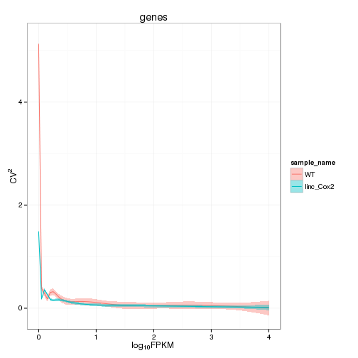 


Isoforms: 

```
## Scale for 'x' is already present. Adding another scale for 'x', which will replace the existing scale.
## geom_smooth: method="auto" and size of largest group is >=1000, so using gam with formula: y ~ s(x, bs = "cs"). Use 'method = x' to change the smoothing method.
```

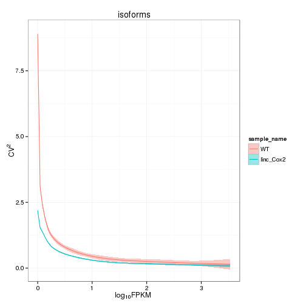 

## Volcano

```
## Error: One or more values of 'x' or 'y' are not valid sample names!
```

### Volcano matrix (replicates)

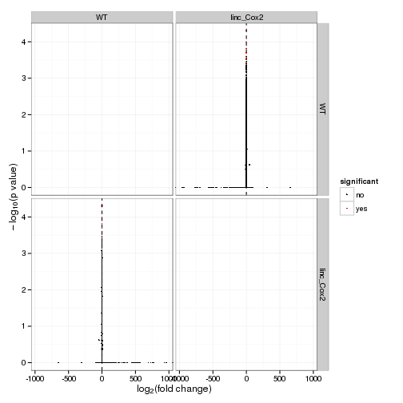 

## MvA plot

```
## Error: non-numeric argument to binary operator
```
   
### MvA plot counts

```
## Error: non-numeric argument to binary operator
```

## Scatterplot
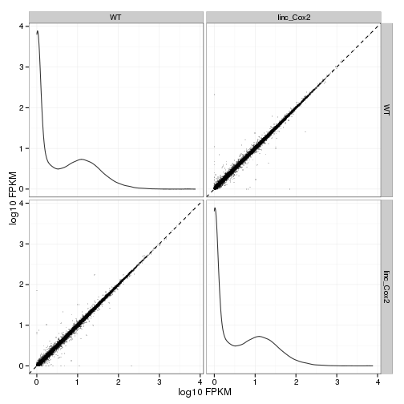 

### Scatter matrix (replicates) -- SKIP FOR NOW CAUSING PROBLEMS 


## Distributions

### Boxplots

Boxplot (genes)

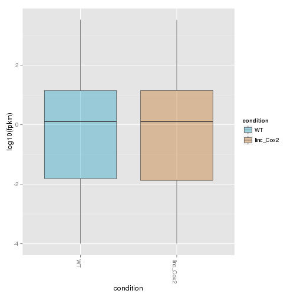 

Boxplot (genes, replicates)

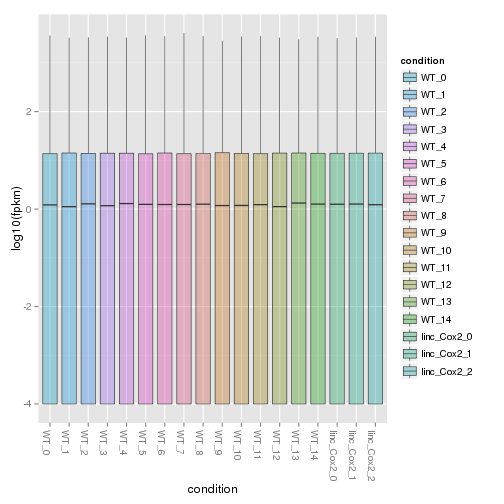 

Boxplot (isoforms)

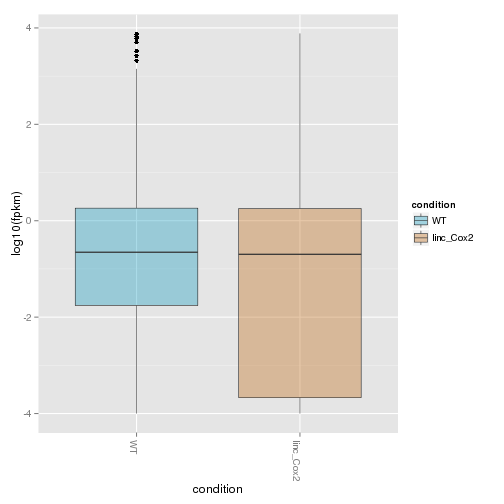 

Boxplot (isoforms, replicates)

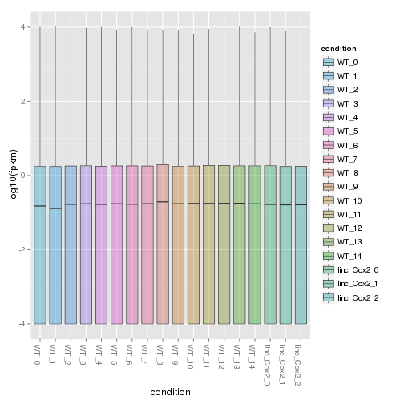 

### Density

Density (genes)


```
## Warning: Removed 3902 rows containing non-finite values (stat_density).
## Warning: Removed 5514 rows containing non-finite values (stat_density).
```

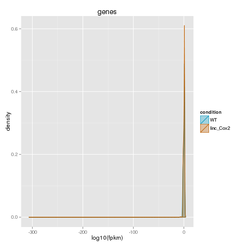 

Density (genes, replicates)


```
## Warning: Removed 7158 rows containing non-finite values (stat_density).
## Warning: Removed 7493 rows containing non-finite values (stat_density).
## Warning: Removed 6785 rows containing non-finite values (stat_density).
## Warning: Removed 6979 rows containing non-finite values (stat_density).
## Warning: Removed 6732 rows containing non-finite values (stat_density).
## Warning: Removed 6637 rows containing non-finite values (stat_density).
## Warning: Removed 7026 rows containing non-finite values (stat_density).
## Warning: Removed 6662 rows containing non-finite values (stat_density).
## Warning: Removed 6778 rows containing non-finite values (stat_density).
## Warning: Removed 6406 rows containing non-finite values (stat_density).
## Warning: Removed 6331 rows containing non-finite values (stat_density).
## Warning: Removed 6815 rows containing non-finite values (stat_density).
## Warning: Removed 6835 rows containing non-finite values (stat_density).
## Warning: Removed 6798 rows containing non-finite values (stat_density).
## Warning: Removed 6545 rows containing non-finite values (stat_density).
## Warning: Removed 7009 rows containing non-finite values (stat_density).
## Warning: Removed 6721 rows containing non-finite values (stat_density).
## Warning: Removed 6646 rows containing non-finite values (stat_density).
```

 


## Clustering

### Replicate Clusters
 

```
## 'dendrogram' with 2 branches and 18 members total, at height 0.07544
```

### PCA (genes)
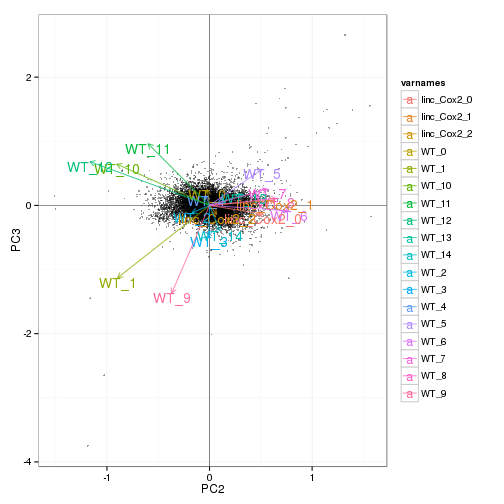 

### MDS (genes)
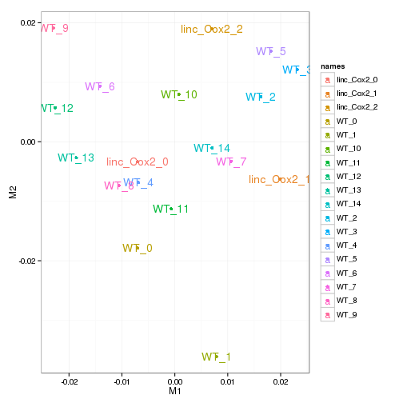 

### Distance Heat Map (genes)
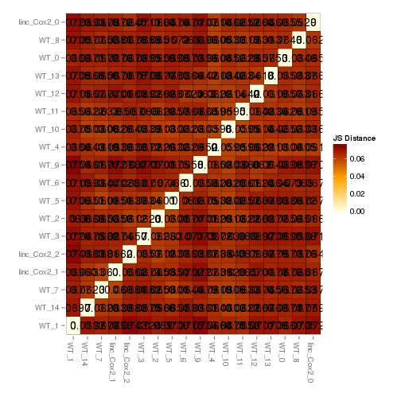 


# KO assessment

## Endogenous lncRNA expression

<!-- html table generated in R 3.0.2 by xtable 1.7-3 package -->
<!-- Mon Jun 16 13:22:58 2014 -->
<TABLE border=1>
<TR> <TH>  </TH> <TH> gene_id </TH> <TH> sample_name </TH> <TH> fpkm </TH> <TH> conf_hi </TH> <TH> conf_lo </TH> <TH> quant_status </TH>  </TR>
  <TR> <TD align="right"> 1 </TD> <TD> ENSMUSG00000097754.1 </TD> <TD> WT </TD> <TD align="right"> 0.05 </TD> <TD align="right"> 0.14 </TD> <TD align="right"> 0.00 </TD> <TD> OK </TD> </TR>
  <TR> <TD align="right"> 2 </TD> <TD> ENSMUSG00000097754.1 </TD> <TD> linc_Cox2 </TD> <TD align="right"> 0.00 </TD> <TD align="right"> 0.00 </TD> <TD align="right"> 0.00 </TD> <TD> OK </TD> </TR>
   </TABLE>
<!-- html table generated in R 3.0.2 by xtable 1.7-3 package -->
<!-- Mon Jun 16 13:22:58 2014 -->
<TABLE border=1>
<TR> <TH>  </TH> <TH> isoform_id </TH> <TH> sample_name </TH> <TH> fpkm </TH> <TH> conf_hi </TH> <TH> conf_lo </TH> <TH> quant_status </TH>  </TR>
  <TR> <TD align="right"> 1 </TD> <TD> ENSMUST00000181308.1 </TD> <TD> WT </TD> <TD align="right"> 0.05 </TD> <TD align="right"> 0.14 </TD> <TD align="right"> 0.00 </TD> <TD> OK </TD> </TR>
  <TR> <TD align="right"> 2 </TD> <TD> ENSMUST00000181308.1 </TD> <TD> linc_Cox2 </TD> <TD align="right"> 0.00 </TD> <TD align="right"> 0.00 </TD> <TD align="right"> 0.00 </TD> <TD> OK </TD> </TR>
   </TABLE>
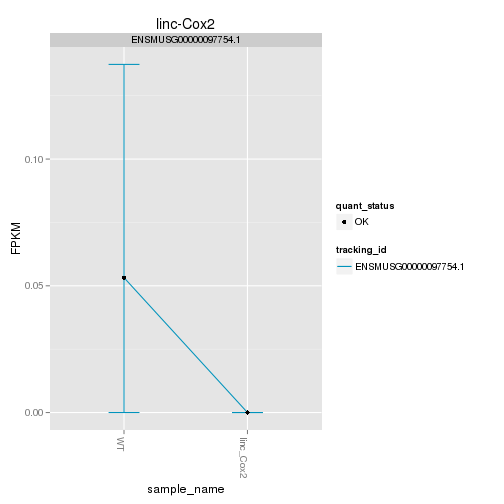  

Endogenous expression of linc-Cox2 isoforms:

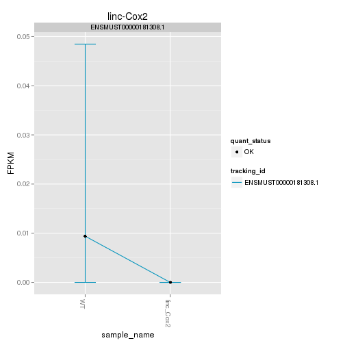 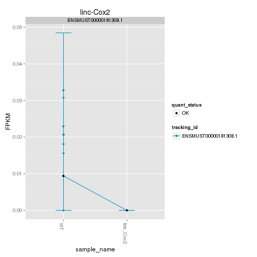 

Barplot of gene expression:

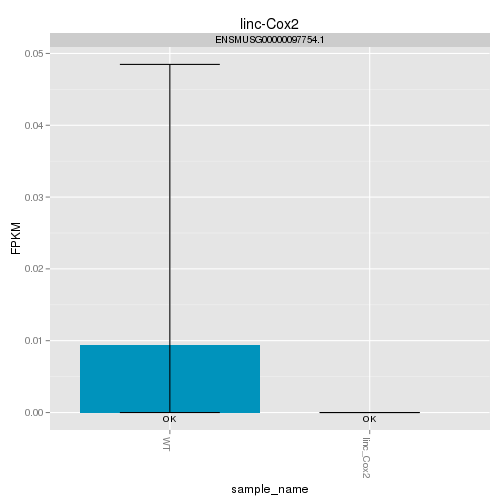 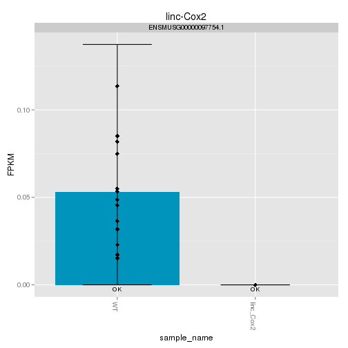 

Barplot of isoform expression:

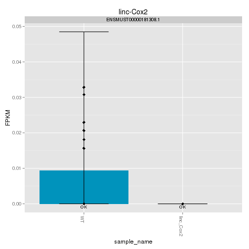 


## LacZ expression

<!-- html table generated in R 3.0.2 by xtable 1.7-3 package -->
<!-- Mon Jun 16 13:23:07 2014 -->
<TABLE border=1>
<TR> <TH>  </TH> <TH> gene_id </TH> <TH> sample_name </TH> <TH> fpkm </TH> <TH> conf_hi </TH> <TH> conf_lo </TH> <TH> quant_status </TH>  </TR>
  <TR> <TD align="right"> 1 </TD> <TD> Velocigene_LacZ </TD> <TD> WT </TD> <TD align="right"> 0.12 </TD> <TD align="right"> 0.26 </TD> <TD align="right"> 0.00 </TD> <TD> OK </TD> </TR>
  <TR> <TD align="right"> 2 </TD> <TD> Velocigene_LacZ </TD> <TD> linc_Cox2 </TD> <TD align="right"> 6.62 </TD> <TD align="right"> 7.93 </TD> <TD align="right"> 5.32 </TD> <TD> OK </TD> </TR>
   </TABLE>
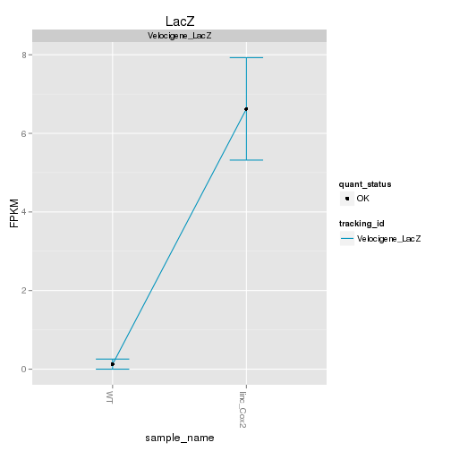 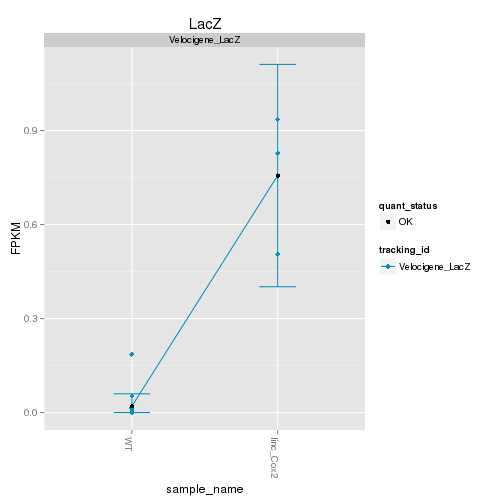 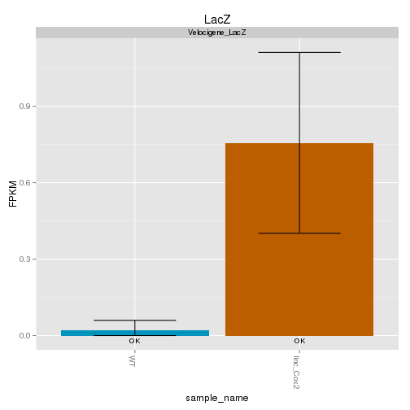 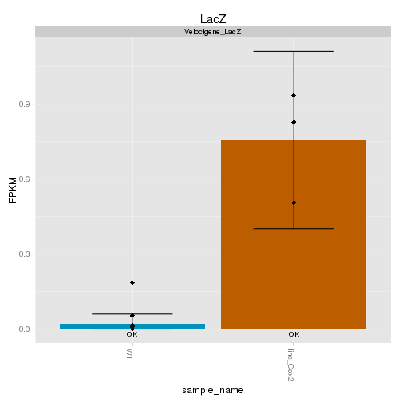 


## Digital Genotyping (LacZ vs Endogenous lncRNA and Sex)
Expression plot (endogenous linc, lacZ, Y-expressed gene):


```
## Scale for 'colour' is already present. Adding another scale for 'colour', which will replace the existing scale.
## ymax not defined: adjusting position using y instead
```

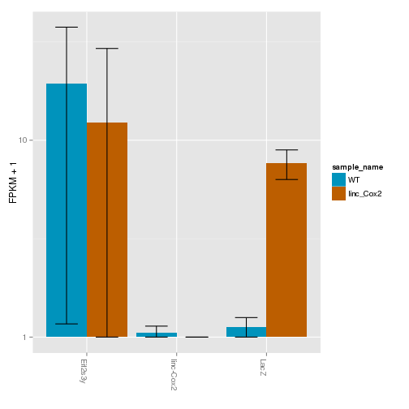 

Expression heatmap:

```
## Using tracking_id, rep_name as id variables
## No id variables; using all as measure variables
```

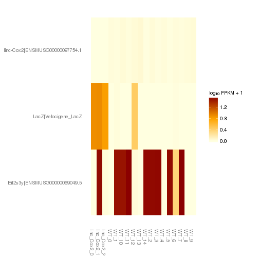 

# Differential Analysis

## Differential Genes 


There are 100 significantly differentially expressed genes. They are:

<!-- html table generated in R 3.0.2 by xtable 1.7-3 package -->
<!-- Mon Jun 16 13:23:19 2014 -->
<TABLE border=1>
<TR> <TH>  </TH> <TH> geneAnnot$gene_short_name </TH>  </TR>
  <TR> <TD align="right"> 1 </TD> <TD> Tubb6 </TD> </TR>
  <TR> <TD align="right"> 2 </TD> <TD> Folh1 </TD> </TR>
  <TR> <TD align="right"> 3 </TD> <TD> Klf4 </TD> </TR>
  <TR> <TD align="right"> 4 </TD> <TD> Nes </TD> </TR>
  <TR> <TD align="right"> 5 </TD> <TD> Epha2 </TD> </TR>
  <TR> <TD align="right"> 6 </TD> <TD> Nav1 </TD> </TR>
  <TR> <TD align="right"> 7 </TD> <TD> Vtn </TD> </TR>
  <TR> <TD align="right"> 8 </TD> <TD> Fabp7 </TD> </TR>
  <TR> <TD align="right"> 9 </TD> <TD> Adi1 </TD> </TR>
  <TR> <TD align="right"> 10 </TD> <TD> Per1 </TD> </TR>
  <TR> <TD align="right"> 11 </TD> <TD> Serpina3n </TD> </TR>
  <TR> <TD align="right"> 12 </TD> <TD> Fos </TD> </TR>
  <TR> <TD align="right"> 13 </TD> <TD> Emp2 </TD> </TR>
  <TR> <TD align="right"> 14 </TD> <TD> Arc </TD> </TR>
  <TR> <TD align="right"> 15 </TD> <TD> Sdf2l1 </TD> </TR>
  <TR> <TD align="right"> 16 </TD> <TD> Nr4a1 </TD> </TR>
  <TR> <TD align="right"> 17 </TD> <TD> Cdkn1a </TD> </TR>
  <TR> <TD align="right"> 18 </TD> <TD> Park2 </TD> </TR>
  <TR> <TD align="right"> 19 </TD> <TD> Glo1 </TD> </TR>
  <TR> <TD align="right"> 20 </TD> <TD> Prss41 </TD> </TR>
  <TR> <TD align="right"> 21 </TD> <TD> Atp6v0c </TD> </TR>
  <TR> <TD align="right"> 22 </TD> <TD> Eci1 </TD> </TR>
  <TR> <TD align="right"> 23 </TD> <TD> Lars </TD> </TR>
  <TR> <TD align="right"> 24 </TD> <TD> Camk2a </TD> </TR>
  <TR> <TD align="right"> 25 </TD> <TD> Cnksr2 </TD> </TR>
  <TR> <TD align="right"> 26 </TD> <TD> 2810459M11Rik </TD> </TR>
  <TR> <TD align="right"> 27 </TD> <TD> Mcm6 </TD> </TR>
  <TR> <TD align="right"> 28 </TD> <TD> Dbi </TD> </TR>
  <TR> <TD align="right"> 29 </TD> <TD> Tnni1 </TD> </TR>
  <TR> <TD align="right"> 30 </TD> <TD> Lamc2 </TD> </TR>
  <TR> <TD align="right"> 31 </TD> <TD> Rgs5 </TD> </TR>
  <TR> <TD align="right"> 32 </TD> <TD> Myoc </TD> </TR>
  <TR> <TD align="right"> 33 </TD> <TD> Lypd6b </TD> </TR>
  <TR> <TD align="right"> 34 </TD> <TD> Hspa5 </TD> </TR>
  <TR> <TD align="right"> 35 </TD> <TD> Olfml3 </TD> </TR>
  <TR> <TD align="right"> 36 </TD> <TD> Rps3a1 </TD> </TR>
  <TR> <TD align="right"> 37 </TD> <TD> Nr4a3 </TD> </TR>
  <TR> <TD align="right"> 38 </TD> <TD> Slc2a1 </TD> </TR>
  <TR> <TD align="right"> 39 </TD> <TD> Tinagl1 </TD> </TR>
  <TR> <TD align="right"> 40 </TD> <TD> Padi2 </TD> </TR>
  <TR> <TD align="right"> 41 </TD> <TD> Hes3 </TD> </TR>
  <TR> <TD align="right"> 42 </TD> <TD> Fbxo44 </TD> </TR>
  <TR> <TD align="right"> 43 </TD> <TD> Fosl2 </TD> </TR>
  <TR> <TD align="right"> 44 </TD> <TD> Gkn3 </TD> </TR>
  <TR> <TD align="right"> 45 </TD> <TD> Hddc3 </TD> </TR>
  <TR> <TD align="right"> 46 </TD> <TD> Col4a1 </TD> </TR>
  <TR> <TD align="right"> 47 </TD> <TD> Ptgs2 </TD> </TR>
  <TR> <TD align="right"> 48 </TD> <TD> Ndn </TD> </TR>
  <TR> <TD align="right"> 49 </TD> <TD> Arhgap27 </TD> </TR>
  <TR> <TD align="right"> 50 </TD> <TD> Rnps1 </TD> </TR>
  <TR> <TD align="right"> 51 </TD> <TD> Prr7 </TD> </TR>
  <TR> <TD align="right"> 52 </TD> <TD> Zranb3 </TD> </TR>
  <TR> <TD align="right"> 53 </TD> <TD> Arl5a </TD> </TR>
  <TR> <TD align="right"> 54 </TD> <TD> Mgat5 </TD> </TR>
  <TR> <TD align="right"> 55 </TD> <TD> Decr2 </TD> </TR>
  <TR> <TD align="right"> 56 </TD> <TD> Egr2 </TD> </TR>
  <TR> <TD align="right"> 57 </TD> <TD> Smim3 </TD> </TR>
  <TR> <TD align="right"> 58 </TD> <TD> Egr1 </TD> </TR>
  <TR> <TD align="right"> 59 </TD> <TD> Akap12 </TD> </TR>
  <TR> <TD align="right"> 60 </TD> <TD> Pcsk1n </TD> </TR>
  <TR> <TD align="right"> 61 </TD> <TD> Fmo2 </TD> </TR>
  <TR> <TD align="right"> 62 </TD> <TD> Slc25a34 </TD> </TR>
  <TR> <TD align="right"> 63 </TD> <TD> C1qtnf4 </TD> </TR>
  <TR> <TD align="right"> 64 </TD> <TD> Cldn5 </TD> </TR>
  <TR> <TD align="right"> 65 </TD> <TD> Gucy1a2 </TD> </TR>
  <TR> <TD align="right"> 66 </TD> <TD> Kif21b </TD> </TR>
  <TR> <TD align="right"> 67 </TD> <TD> Shisa4 </TD> </TR>
  <TR> <TD align="right"> 68 </TD> <TD> Maff </TD> </TR>
  <TR> <TD align="right"> 69 </TD> <TD> Id1 </TD> </TR>
  <TR> <TD align="right"> 70 </TD> <TD> Acp1 </TD> </TR>
  <TR> <TD align="right"> 71 </TD> <TD> 4930503L19Rik </TD> </TR>
  <TR> <TD align="right"> 72 </TD> <TD> Olig1 </TD> </TR>
  <TR> <TD align="right"> 73 </TD> <TD> Olfml2a </TD> </TR>
  <TR> <TD align="right"> 74 </TD> <TD> Tnrc6b </TD> </TR>
  <TR> <TD align="right"> 75 </TD> <TD> Lmod1 </TD> </TR>
  <TR> <TD align="right"> 76 </TD> <TD> Tagap1 </TD> </TR>
  <TR> <TD align="right"> 77 </TD> <TD> Klf2 </TD> </TR>
  <TR> <TD align="right"> 78 </TD> <TD> Per2 </TD> </TR>
  <TR> <TD align="right"> 79 </TD> <TD> Kcnq3 </TD> </TR>
  <TR> <TD align="right"> 80 </TD> <TD> Pign </TD> </TR>
  <TR> <TD align="right"> 81 </TD> <TD> Kdm5d </TD> </TR>
  <TR> <TD align="right"> 82 </TD> <TD> Tpm3-rs7 </TD> </TR>
  <TR> <TD align="right"> 83 </TD> <TD> Capn11 </TD> </TR>
  <TR> <TD align="right"> 84 </TD> <TD> Gm5506 </TD> </TR>
  <TR> <TD align="right"> 85 </TD> <TD> Eno1 </TD> </TR>
  <TR> <TD align="right"> 86 </TD> <TD> Chi3l1 </TD> </TR>
  <TR> <TD align="right"> 87 </TD> <TD> Clasp1 </TD> </TR>
  <TR> <TD align="right"> 88 </TD> <TD> Ddx3y </TD> </TR>
  <TR> <TD align="right"> 89 </TD> <TD> Ppia </TD> </TR>
  <TR> <TD align="right"> 90 </TD> <TD> Gm7292 </TD> </TR>
  <TR> <TD align="right"> 91 </TD> <TD> Wdfy1 </TD> </TR>
  <TR> <TD align="right"> 92 </TD> <TD> Rc3h2 </TD> </TR>
  <TR> <TD align="right"> 93 </TD> <TD> Apold1 </TD> </TR>
  <TR> <TD align="right"> 94 </TD> <TD> Hspa1b </TD> </TR>
  <TR> <TD align="right"> 95 </TD> <TD> Scnm1 </TD> </TR>
  <TR> <TD align="right"> 96 </TD> <TD> AA465934 </TD> </TR>
  <TR> <TD align="right"> 97 </TD> <TD> Gm21967 </TD> </TR>
  <TR> <TD align="right"> 98 </TD> <TD> Gm6472 </TD> </TR>
  <TR> <TD align="right"> 99 </TD> <TD> RP24-390G17.1 </TD> </TR>
  <TR> <TD align="right"> 100 </TD> <TD> LacZ </TD> </TR>
   </TABLE>

### Matrix of gene significant differences between conditions

(skip for Brainmap wt-v-ko comparisons)

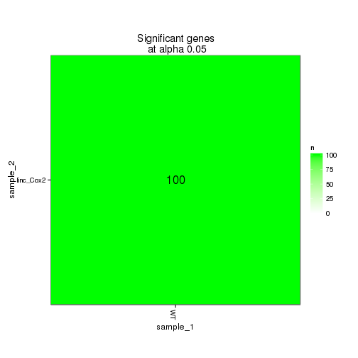 

### Significant gene expression differences between conditions

Expression plot (genes):
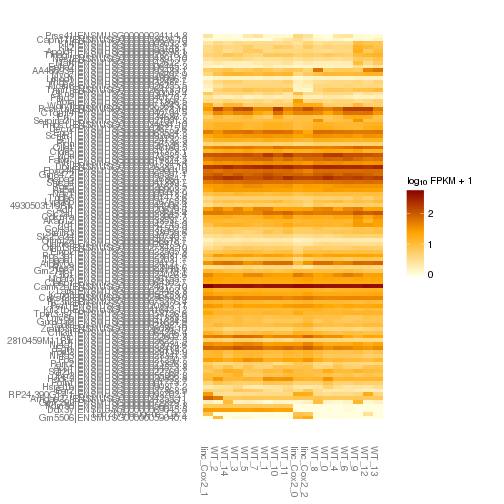 

```
## Using tracking_id, rep_name as id variables
## No id variables; using all as measure variables
```

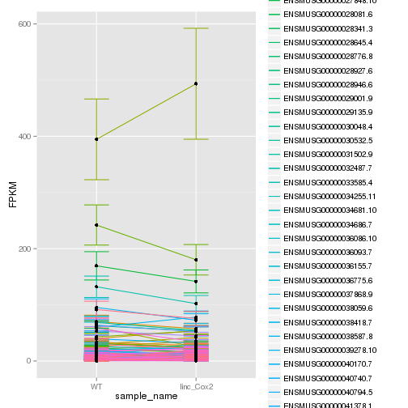 

Significant genes with expression >50fpkm (any condition):

```
## Using tracking_id, sample_name as id variables
```

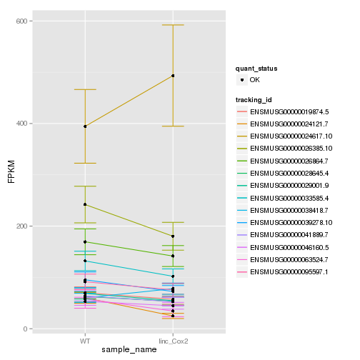 

An individual look at each of the highly expressed significantly differentially regulated genes:
(eval=false for first pass)


### Expression-level/significance relationship

Scatter plot of significant genes only:

```
## Using tracking_id, sample_name as id variables
```

```
## Error: One or more values of 'x' or 'y' are not valid sample names!
```

Volcano plot with significant genes only:

```
## Error: One or more values of 'x' or 'y' are not valid sample names!
```


## Differential Splicing

### Differential Isoforms between conditions
Per isoform difference between conditions:
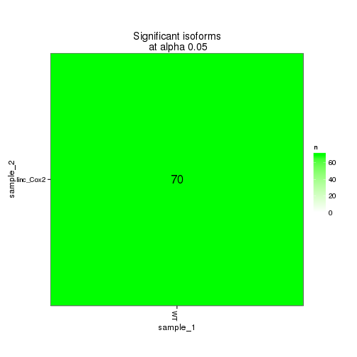 

These isoforms are:

```
## Error: no applicable method for 'xtable' applied to an object of class
## "character"
```


```
## Using tracking_id, rep_name as id variables
```

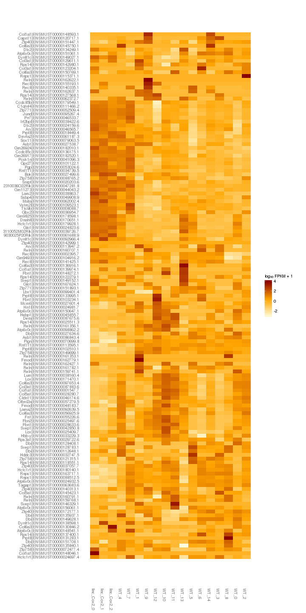 

### Differential Splicing between conditions

(eval false for first pass)

Per condition differences in isoforms (Does gene have diff piechart between conditions?)


These genes are:


Splicing heatmap by isoform:


Splicing heatmap by gene


The following are significantly differentially spliced genes (relative portion of isoform per condition): 


 


# Gene/Pathway Analysis

## GSEA


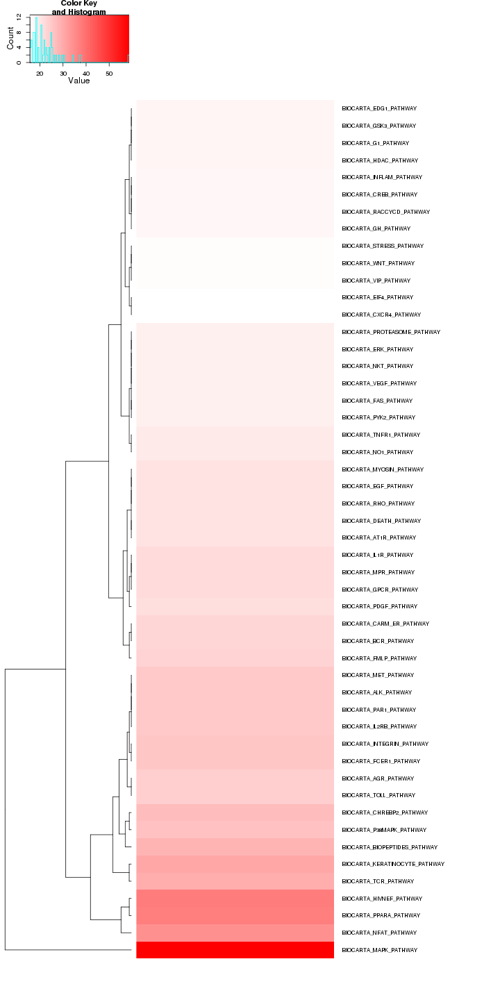 

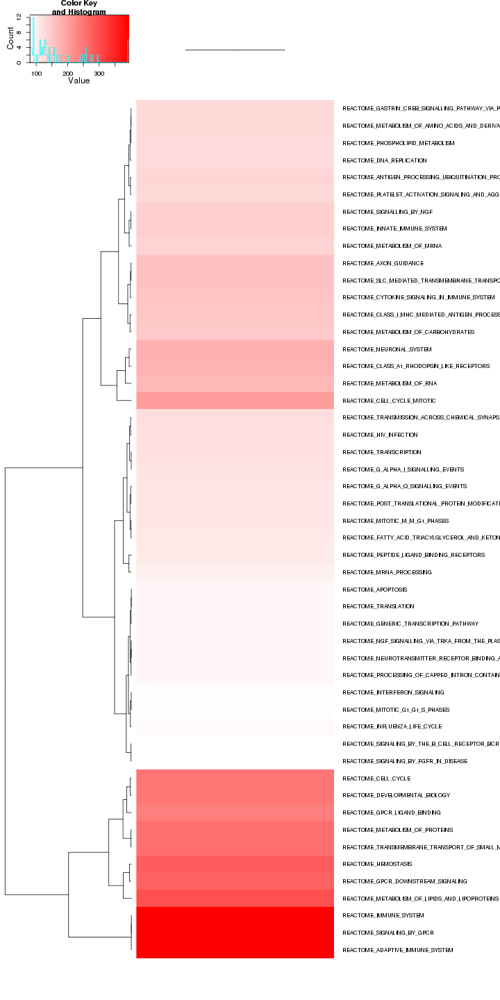 

## GO enrichment 
Cluster profiler used to call enichments of significantly differentially regulated genes that map to Entrez IDs. 

Description/explanation of what's here, and justify all choices. 


```
## Loading required package: AnnotationDbi
## Loading required package: Biobase
## Welcome to Bioconductor
## 
##     Vignettes contain introductory material; view with
##     'browseVignettes()'. To cite Bioconductor, see
##     'citation("Biobase")', and for packages 'citation("pkgname")'.
## 
## 
## Attaching package: 'Biobase'
## 
## The following object is masked from 'package:cummeRbund':
## 
##     samples
```

```
## Error: package or namespace load failed for 'ReactomePA'
```

```
## Error: package or namespace load failed for 'DOSE'
```

biomart to get entrez gene IDS
clusterProfiler does GO enrichment 

BP, MF, CC
enrichKEGG
enrichPathway


```
## Error: object 'goBP' not found
```

```
## Error: object 'goMF' not found
```

```
## Error: object 'goCC' not found
```

```
## Error: object 'kegg' not found
```

```
## Error: object 'pathway' not found
```

```
## Error: invalid 'name' argument
```

# Cis vs Trans (locally)


# Notes

# Session Info

```
## R version 3.0.2 (2013-09-25)
## Platform: x86_64-unknown-linux-gnu (64-bit)
## 
## locale:
##  [1] LC_CTYPE=en_US.UTF-8       LC_NUMERIC=C              
##  [3] LC_TIME=en_US.UTF-8        LC_COLLATE=en_US.UTF-8    
##  [5] LC_MONETARY=en_US.UTF-8    LC_MESSAGES=en_US.UTF-8   
##  [7] LC_PAPER=en_US.UTF-8       LC_NAME=C                 
##  [9] LC_ADDRESS=C               LC_TELEPHONE=C            
## [11] LC_MEASUREMENT=en_US.UTF-8 LC_IDENTIFICATION=C       
## 
## attached base packages:
## [1] grid      parallel  stats     graphics  grDevices utils     datasets 
## [8] methods   base     
## 
## other attached packages:
##  [1] AnnotationDbi_1.24.0 Biobase_2.22.0       mgcv_1.7-29         
##  [4] nlme_3.1-117         gridExtra_0.9.1      gtable_0.1.2        
##  [7] marray_1.40.0        gplots_2.13.0        GSA_1.03            
## [10] limma_3.18.13        xtable_1.7-3         knitr_1.6           
## [13] cummeRbund_2.7.2     Gviz_1.6.0           rtracklayer_1.22.7  
## [16] GenomicRanges_1.14.4 XVector_0.2.0        IRanges_1.20.7      
## [19] fastcluster_1.1.13   reshape2_1.4         ggplot2_1.0.0       
## [22] RSQLite_0.11.4       DBI_0.2-7            BiocGenerics_0.8.0  
## 
## loaded via a namespace (and not attached):
##  [1] biomaRt_2.18.0         Biostrings_2.30.1      biovizBase_1.10.8     
##  [4] bitops_1.0-6           BSgenome_1.30.0        caTools_1.17          
##  [7] cluster_1.15.2         colorspace_1.2-4       dichromat_2.0-0       
## [10] digest_0.6.4           DO.db_2.7              evaluate_0.5.5        
## [13] formatR_0.10           Formula_1.1-1          gdata_2.13.3          
## [16] GenomicFeatures_1.14.5 GO.db_2.10.1           gtools_3.4.1          
## [19] Hmisc_3.14-4           KernSmooth_2.23-12     labeling_0.2          
## [22] lattice_0.20-29        latticeExtra_0.6-26    MASS_7.3-33           
## [25] Matrix_1.1-3           munsell_0.4.2          plyr_1.8.1            
## [28] proto_0.3-10           RColorBrewer_1.0-5     Rcpp_0.11.1           
## [31] RCurl_1.95-4.1         Rsamtools_1.14.3       scales_0.2.4          
## [34] splines_3.0.2          stats4_3.0.2           stringr_0.6.2         
## [37] survival_2.37-7        tools_3.0.2            XML_3.98-1.1          
## [40] zlibbioc_1.8.0
```

#Run Info

```
##           param
## 1      cmd_line
## 2       version
## 3  SVN_revision
## 4 boost_version
## 5        genome
##                                                                                                                                                                                                                                                                                                                                                                                                                                                                                                                                                                                                                                                                                                                                                                                                                                                                                                                                                                                                                                                                                                                                                                                                                                                                                                                                                                                                                                                                                                                                                                                                                      value
## 1 cuffdiff -p 10 -L WT,linc-Cox2 -o /n/rinn_data1/seq/lgoff/Projects/BrainMap/data/diffs/linc-Cox2_vs_WT_Adult /n/rinn_data1/seq/lgoff/Projects/BrainMap/data/annotation/mm10_gencode_vM2_with_lncRNAs_and_LacZ.gtf /n/rinn_data1/seq/lgoff/Projects/BrainMap/data/quants/JR729/abundances.cxb,/n/rinn_data1/seq/lgoff/Projects/BrainMap/data/quants/JR728/abundances.cxb,/n/rinn_data1/seq/lgoff/Projects/BrainMap/data/quants/JR796/abundances.cxb,/n/rinn_data1/seq/lgoff/Projects/BrainMap/data/quants/JR797/abundances.cxb,/n/rinn_data1/seq/lgoff/Projects/BrainMap/data/quants/JR740/abundances.cxb,/n/rinn_data1/seq/lgoff/Projects/BrainMap/data/quants/JR800/abundances.cxb,/n/rinn_data1/seq/lgoff/Projects/BrainMap/data/quants/JR827/abundances.cxb,/n/rinn_data1/seq/lgoff/Projects/BrainMap/data/quants/JR778/abundances.cxb,/n/rinn_data1/seq/lgoff/Projects/BrainMap/data/quants/JR734/abundances.cxb,/n/rinn_data1/seq/lgoff/Projects/BrainMap/data/quants/JR802/abundances.cxb,/n/rinn_data1/seq/lgoff/Projects/BrainMap/data/quants/JR803/abundances.cxb,/n/rinn_data1/seq/lgoff/Projects/BrainMap/data/quants/JR735/abundances.cxb,/n/rinn_data1/seq/lgoff/Projects/BrainMap/data/quants/JR817/abundances.cxb,/n/rinn_data1/seq/lgoff/Projects/BrainMap/data/quants/JR785/abundances.cxb,/n/rinn_data1/seq/lgoff/Projects/BrainMap/data/quants/JR781/abundances.cxb /n/rinn_data1/seq/lgoff/Projects/BrainMap/data/quants/JR732/abundances.cxb,/n/rinn_data1/seq/lgoff/Projects/BrainMap/data/quants/JR776/abundances.cxb,/n/rinn_data1/seq/lgoff/Projects/BrainMap/data/quants/JR798/abundances.cxb 
## 2                                                                                                                                                                                                                                                                                                                                                                                                                                                                                                                                                                                                                                                                                                                                                                                                                                                                                                                                                                                                                                                                                                                                                                                                                                                                                                                                                                                                                                                                                                                                                                                                                    2.2.1
## 3                                                                                                                                                                                                                                                                                                                                                                                                                                                                                                                                                                                                                                                                                                                                                                                                                                                                                                                                                                                                                                                                                                                                                                                                                                                                                                                                                                                                                                                                                                                                                                                                                     4237
## 4                                                                                                                                                                                                                                                                                                                                                                                                                                                                                                                                                                                                                                                                                                                                                                                                                                                                                                                                                                                                                                                                                                                                                                                                                                                                                                                                                                                                                                                                                                                                                                                                                   104700
## 5                                                                                                                                                                                                                                                                                                                                                                                                                                                                                                                                                                                                                                                                                                                                                                                                                                                                                                                                                                                                                                                                                                                                                                                                                                                                                                                                                                                                                                                                                                                                                                                                                     mm10
```
