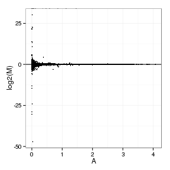
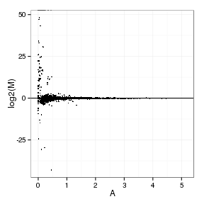
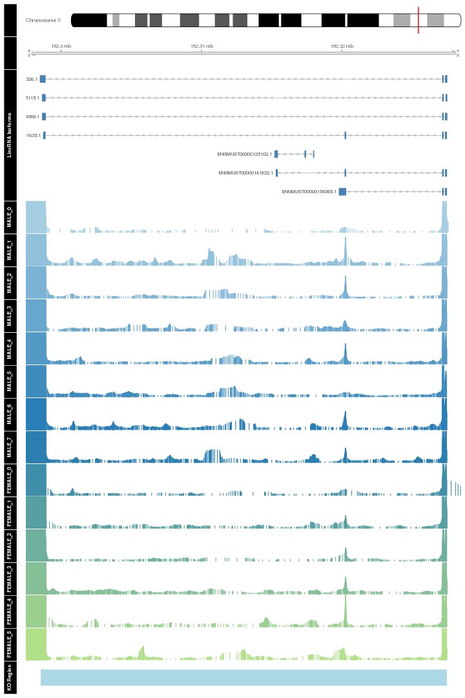
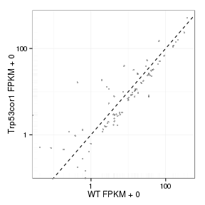
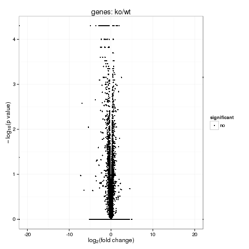
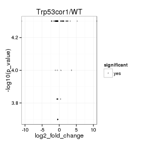
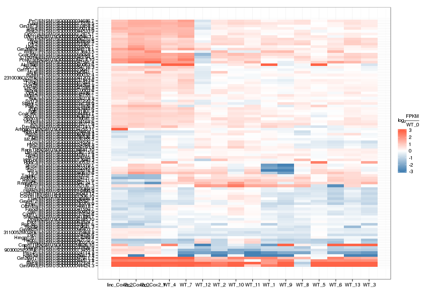
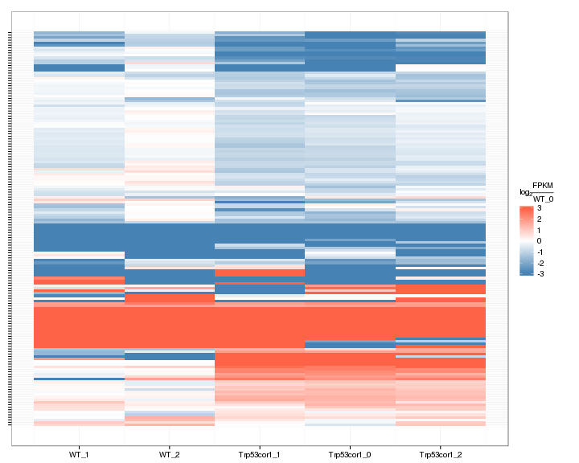
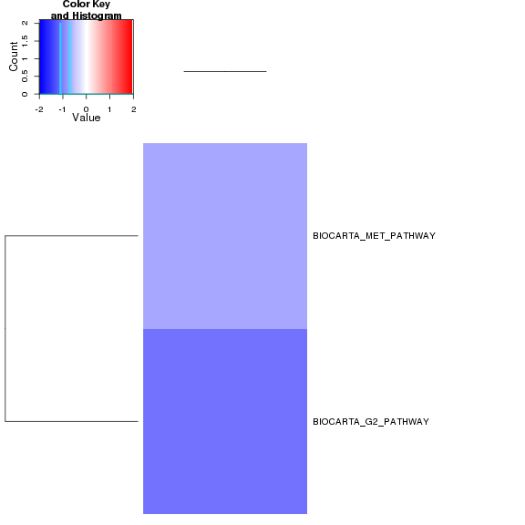

linc-Cox2 KO vs WT (Embryonic)
======================================


This file shows the wt-v-ko comparison for linc-Cox2. 

Cuff overview:


```
## CuffSet instance with:
## 	 2 samples
## 	 26754 genes
## 	 77524 isoforms
## 	 0 TSS
## 	 23066 CDS
## 	 0 promoters
## 	 0 splicing
## 	 19954 relCDS
```

# QC

## Dispersion

Dispersion plot for genes in cuff:
(Overdispersion can lead to innacurate quants)

 

## Cross-replicate variability (fpkmSCVplot)
Differences in CV 2 can result in lower numbers of differentially expressed genes due to a higher degree of variability between replicate fpkm estimates.

Genes:

 

Isoforms: 

 


## MvA plot

 
   
### MvA plot counts

 

## Scatterplot matrix

 

## Distributions

### Boxplots

Boxplot (genes)

 

Boxplot (genes, replicates)

 

Boxplot (isoforms)

 

Boxplot (isoforms, replicates)

 

### Density

Density (genes)

 

Density (genes, replicates)

 


## Clustering

### Replicate Clusters

 

```
## NULL
```

### PCA (genes)

 

### MDS (genes)

 


# KO assessment

## Endogenous lncRNA expression

 

Endogenous expression of linc-Cox2 isoforms:

 

Barplot of gene expression:

 

Barplot of isoform expression:

 


## LacZ expression

  


## Digital Genotyping (LacZ vs Endogenous lncRNA and Sex)

Eif2s3y is a y-expressed gene, Xist is an x-expressed gene 
Expression plot (endogenous linc, lacZ, Y-expressed gene):

 

Expression heatmap:

 


### Track visualization 


```
## Error: dims [product 9] do not match the length of object [10]
```

 

# Differential Analysis

## Differential Genes 


There are 97 significantly differentially expressed genes. They are:

<!-- html table generated in R 3.0.2 by xtable 1.7-3 package -->
<!-- Wed Jul  2 01:07:41 2014 -->
<TABLE border=1>
<TR> <TH>  </TH> <TH> geneAnnot$gene_short_name </TH>  </TR>
  <TR> <TD align="right"> 1 </TD> <TD> Col1a1 </TD> </TR>
  <TR> <TD align="right"> 2 </TD> <TD> Rec8 </TD> </TR>
  <TR> <TD align="right"> 3 </TD> <TD> Zfp40 </TD> </TR>
  <TR> <TD align="right"> 4 </TD> <TD> Fam131c </TD> </TR>
  <TR> <TD align="right"> 5 </TD> <TD> Vax1 </TD> </TR>
  <TR> <TD align="right"> 6 </TD> <TD> Ttc9b </TD> </TR>
  <TR> <TD align="right"> 7 </TD> <TD> Lama2 </TD> </TR>
  <TR> <TD align="right"> 8 </TD> <TD> Snrpf </TD> </TR>
  <TR> <TD align="right"> 9 </TD> <TD> Skor1 </TD> </TR>
  <TR> <TD align="right"> 10 </TD> <TD> Dlx2 </TD> </TR>
  <TR> <TD align="right"> 11 </TD> <TD> Park2 </TD> </TR>
  <TR> <TD align="right"> 12 </TD> <TD> Glo1 </TD> </TR>
  <TR> <TD align="right"> 13 </TD> <TD> Prss41 </TD> </TR>
  <TR> <TD align="right"> 14 </TD> <TD> Atp6v0c </TD> </TR>
  <TR> <TD align="right"> 15 </TD> <TD> Hn1l </TD> </TR>
  <TR> <TD align="right"> 16 </TD> <TD> Lox </TD> </TR>
  <TR> <TD align="right"> 17 </TD> <TD> Fbn2 </TD> </TR>
  <TR> <TD align="right"> 18 </TD> <TD> Rps14 </TD> </TR>
  <TR> <TD align="right"> 19 </TD> <TD> Lbx1 </TD> </TR>
  <TR> <TD align="right"> 20 </TD> <TD> Col3a1 </TD> </TR>
  <TR> <TD align="right"> 21 </TD> <TD> Fn1 </TD> </TR>
  <TR> <TD align="right"> 22 </TD> <TD> Bok </TD> </TR>
  <TR> <TD align="right"> 23 </TD> <TD> Mcm6 </TD> </TR>
  <TR> <TD align="right"> 24 </TD> <TD> Dbi </TD> </TR>
  <TR> <TD align="right"> 25 </TD> <TD> Fbn1 </TD> </TR>
  <TR> <TD align="right"> 26 </TD> <TD> Syt13 </TD> </TR>
  <TR> <TD align="right"> 27 </TD> <TD> Rps3a1 </TD> </TR>
  <TR> <TD align="right"> 28 </TD> <TD> Svep1 </TD> </TR>
  <TR> <TD align="right"> 29 </TD> <TD> Uncx </TD> </TR>
  <TR> <TD align="right"> 30 </TD> <TD> Emp1 </TD> </TR>
  <TR> <TD align="right"> 31 </TD> <TD> Dera </TD> </TR>
  <TR> <TD align="right"> 32 </TD> <TD> Hddc3 </TD> </TR>
  <TR> <TD align="right"> 33 </TD> <TD> Pgls </TD> </TR>
  <TR> <TD align="right"> 34 </TD> <TD> Col12a1 </TD> </TR>
  <TR> <TD align="right"> 35 </TD> <TD> Dnah8 </TD> </TR>
  <TR> <TD align="right"> 36 </TD> <TD> Irf2bpl </TD> </TR>
  <TR> <TD align="right"> 37 </TD> <TD> Arhgap27 </TD> </TR>
  <TR> <TD align="right"> 38 </TD> <TD> Gbx2 </TD> </TR>
  <TR> <TD align="right"> 39 </TD> <TD> Rnps1 </TD> </TR>
  <TR> <TD align="right"> 40 </TD> <TD> Prr7 </TD> </TR>
  <TR> <TD align="right"> 41 </TD> <TD> Lars2 </TD> </TR>
  <TR> <TD align="right"> 42 </TD> <TD> Arx </TD> </TR>
  <TR> <TD align="right"> 43 </TD> <TD> 3110052M02Rik </TD> </TR>
  <TR> <TD align="right"> 44 </TD> <TD> Mgat5 </TD> </TR>
  <TR> <TD align="right"> 45 </TD> <TD> Lum </TD> </TR>
  <TR> <TD align="right"> 46 </TD> <TD> Decr2 </TD> </TR>
  <TR> <TD align="right"> 47 </TD> <TD> Cldn11 </TD> </TR>
  <TR> <TD align="right"> 48 </TD> <TD> Vstm2l </TD> </TR>
  <TR> <TD align="right"> 49 </TD> <TD> Hoxb4 </TD> </TR>
  <TR> <TD align="right"> 50 </TD> <TD> Shank1 </TD> </TR>
  <TR> <TD align="right"> 51 </TD> <TD> Pcsk1n </TD> </TR>
  <TR> <TD align="right"> 52 </TD> <TD> Tlx3 </TD> </TR>
  <TR> <TD align="right"> 53 </TD> <TD> C1qtnf4 </TD> </TR>
  <TR> <TD align="right"> 54 </TD> <TD> 2310036O22Rik </TD> </TR>
  <TR> <TD align="right"> 55 </TD> <TD> Fmod </TD> </TR>
  <TR> <TD align="right"> 56 </TD> <TD> Shisa4 </TD> </TR>
  <TR> <TD align="right"> 57 </TD> <TD> Hebp1 </TD> </TR>
  <TR> <TD align="right"> 58 </TD> <TD> Pgp </TD> </TR>
  <TR> <TD align="right"> 59 </TD> <TD> Gm9493 </TD> </TR>
  <TR> <TD align="right"> 60 </TD> <TD> Rps2 </TD> </TR>
  <TR> <TD align="right"> 61 </TD> <TD> Acp1 </TD> </TR>
  <TR> <TD align="right"> 62 </TD> <TD> Olfml2a </TD> </TR>
  <TR> <TD align="right"> 63 </TD> <TD> Hmga1 </TD> </TR>
  <TR> <TD align="right"> 64 </TD> <TD> Lrrc4b </TD> </TR>
  <TR> <TD align="right"> 65 </TD> <TD> Dmrta2 </TD> </TR>
  <TR> <TD align="right"> 66 </TD> <TD> Mafa </TD> </TR>
  <TR> <TD align="right"> 67 </TD> <TD> Tagap1 </TD> </TR>
  <TR> <TD align="right"> 68 </TD> <TD> Hbb-y </TD> </TR>
  <TR> <TD align="right"> 69 </TD> <TD> Zfp771 </TD> </TR>
  <TR> <TD align="right"> 70 </TD> <TD> Pign </TD> </TR>
  <TR> <TD align="right"> 71 </TD> <TD> Kdm5d </TD> </TR>
  <TR> <TD align="right"> 72 </TD> <TD> Capn11 </TD> </TR>
  <TR> <TD align="right"> 73 </TD> <TD> H2afj </TD> </TR>
  <TR> <TD align="right"> 74 </TD> <TD> Alox5ap </TD> </TR>
  <TR> <TD align="right"> 75 </TD> <TD> Rpl26 </TD> </TR>
  <TR> <TD align="right"> 76 </TD> <TD> Sox11 </TD> </TR>
  <TR> <TD align="right"> 77 </TD> <TD> Zfp428 </TD> </TR>
  <TR> <TD align="right"> 78 </TD> <TD> Sp9 </TD> </TR>
  <TR> <TD align="right"> 79 </TD> <TD> Nkain2 </TD> </TR>
  <TR> <TD align="right"> 80 </TD> <TD> Ssbp4 </TD> </TR>
  <TR> <TD align="right"> 81 </TD> <TD> Gm1673 </TD> </TR>
  <TR> <TD align="right"> 82 </TD> <TD> Jund </TD> </TR>
  <TR> <TD align="right"> 83 </TD> <TD> Gpr27 </TD> </TR>
  <TR> <TD align="right"> 84 </TD> <TD> 9030025P20Rik </TD> </TR>
  <TR> <TD align="right"> 85 </TD> <TD> Wdfy1 </TD> </TR>
  <TR> <TD align="right"> 86 </TD> <TD> Hbb-bt </TD> </TR>
  <TR> <TD align="right"> 87 </TD> <TD> Rpl39 </TD> </TR>
  <TR> <TD align="right"> 88 </TD> <TD> Gm11273 </TD> </TR>
  <TR> <TD align="right"> 89 </TD> <TD> Ccdc85c </TD> </TR>
  <TR> <TD align="right"> 90 </TD> <TD> Ier5l </TD> </TR>
  <TR> <TD align="right"> 91 </TD> <TD> Myl6 </TD> </TR>
  <TR> <TD align="right"> 92 </TD> <TD> Rnaset2b </TD> </TR>
  <TR> <TD align="right"> 93 </TD> <TD> Ccdc85b </TD> </TR>
  <TR> <TD align="right"> 94 </TD> <TD> Gm6472 </TD> </TR>
  <TR> <TD align="right"> 95 </TD> <TD> Gm9825 </TD> </TR>
  <TR> <TD align="right"> 96 </TD> <TD> Gm26917 </TD> </TR>
  <TR> <TD align="right"> 97 </TD> <TD> Gm26924 </TD> </TR>
   </TABLE>

### Matrix of gene significant differences between conditions

(skip for Brainmap wt-v-ko comparisons)

 

### Significant gene expression differences between conditions

Expression plot (genes):(turned off)


 

Significant genes with expression >50fpkm (any condition):(turned off)


An individual look at each of the highly expressed significantly differentially regulated genes:
(eval=false for first pass)


### Expression-level/significance relationship

Scatter plot of significant genes only:

 

Volcano Plot

 

Volcano plot with significant genes only:

 

FoldChange Heatmap

 


## Differential Splicing

### Differential Isoforms between conditions

Per isoform difference between conditions:

 

These isoforms are:

<!-- html table generated in R 3.0.2 by xtable 1.7-3 package -->
<!-- Wed Jul  2 01:08:34 2014 -->
<TABLE border=1>
<TR> <TH>  </TH> <TH> isoAnnot$gene_short_name </TH>  </TR>
  <TR> <TD align="right"> 1 </TD> <TD> Dynlt1c </TD> </TR>
  <TR> <TD align="right"> 2 </TD> <TD> Col1a1 </TD> </TR>
  <TR> <TD align="right"> 3 </TD> <TD> Rec8 </TD> </TR>
  <TR> <TD align="right"> 4 </TD> <TD> Zfp40 </TD> </TR>
  <TR> <TD align="right"> 5 </TD> <TD> Lama2 </TD> </TR>
  <TR> <TD align="right"> 6 </TD> <TD> Snrpf </TD> </TR>
  <TR> <TD align="right"> 7 </TD> <TD> Prpf8 </TD> </TR>
  <TR> <TD align="right"> 8 </TD> <TD> Dlx2 </TD> </TR>
  <TR> <TD align="right"> 9 </TD> <TD> Hcfc1r1 </TD> </TR>
  <TR> <TD align="right"> 10 </TD> <TD> Glo1 </TD> </TR>
  <TR> <TD align="right"> 11 </TD> <TD> Prss41 </TD> </TR>
  <TR> <TD align="right"> 12 </TD> <TD> Atp6v0c </TD> </TR>
  <TR> <TD align="right"> 13 </TD> <TD> Hn1l </TD> </TR>
  <TR> <TD align="right"> 14 </TD> <TD> Lox </TD> </TR>
  <TR> <TD align="right"> 15 </TD> <TD> Rps14 </TD> </TR>
  <TR> <TD align="right"> 16 </TD> <TD> Lbx1 </TD> </TR>
  <TR> <TD align="right"> 17 </TD> <TD> Fn1 </TD> </TR>
  <TR> <TD align="right"> 18 </TD> <TD> Bok </TD> </TR>
  <TR> <TD align="right"> 19 </TD> <TD> Asb1 </TD> </TR>
  <TR> <TD align="right"> 20 </TD> <TD> Mcm6 </TD> </TR>
  <TR> <TD align="right"> 21 </TD> <TD> Dbi </TD> </TR>
  <TR> <TD align="right"> 22 </TD> <TD> Lrp2 </TD> </TR>
  <TR> <TD align="right"> 23 </TD> <TD> Rps3a1 </TD> </TR>
  <TR> <TD align="right"> 24 </TD> <TD> Svep1 </TD> </TR>
  <TR> <TD align="right"> 25 </TD> <TD> Ski </TD> </TR>
  <TR> <TD align="right"> 26 </TD> <TD> Dera </TD> </TR>
  <TR> <TD align="right"> 27 </TD> <TD> Hddc3 </TD> </TR>
  <TR> <TD align="right"> 28 </TD> <TD> Dnah8 </TD> </TR>
  <TR> <TD align="right"> 29 </TD> <TD> Gbx2 </TD> </TR>
  <TR> <TD align="right"> 30 </TD> <TD> Rnps1 </TD> </TR>
  <TR> <TD align="right"> 31 </TD> <TD> Fam171a2 </TD> </TR>
  <TR> <TD align="right"> 32 </TD> <TD> Prr7 </TD> </TR>
  <TR> <TD align="right"> 33 </TD> <TD> Lars2 </TD> </TR>
  <TR> <TD align="right"> 34 </TD> <TD> 3110052M02Rik </TD> </TR>
  <TR> <TD align="right"> 35 </TD> <TD> Cldn11 </TD> </TR>
  <TR> <TD align="right"> 36 </TD> <TD> Vstm2l </TD> </TR>
  <TR> <TD align="right"> 37 </TD> <TD> Pcsk1n </TD> </TR>
  <TR> <TD align="right"> 38 </TD> <TD> Dgkz </TD> </TR>
  <TR> <TD align="right"> 39 </TD> <TD> Tlx3 </TD> </TR>
  <TR> <TD align="right"> 40 </TD> <TD> C1qtnf4 </TD> </TR>
  <TR> <TD align="right"> 41 </TD> <TD> 2310036O22Rik </TD> </TR>
  <TR> <TD align="right"> 42 </TD> <TD> Fmod </TD> </TR>
  <TR> <TD align="right"> 43 </TD> <TD> Dlgap3 </TD> </TR>
  <TR> <TD align="right"> 44 </TD> <TD> Reln </TD> </TR>
  <TR> <TD align="right"> 45 </TD> <TD> Hebp1 </TD> </TR>
  <TR> <TD align="right"> 46 </TD> <TD> Olfml2a </TD> </TR>
  <TR> <TD align="right"> 47 </TD> <TD> Hmga1 </TD> </TR>
  <TR> <TD align="right"> 48 </TD> <TD> Dmrta2 </TD> </TR>
  <TR> <TD align="right"> 49 </TD> <TD> Mafa </TD> </TR>
  <TR> <TD align="right"> 50 </TD> <TD> Col6a3 </TD> </TR>
  <TR> <TD align="right"> 51 </TD> <TD> Tagap1 </TD> </TR>
  <TR> <TD align="right"> 52 </TD> <TD> Hbb-y </TD> </TR>
  <TR> <TD align="right"> 53 </TD> <TD> Zfp771 </TD> </TR>
  <TR> <TD align="right"> 54 </TD> <TD> Pign </TD> </TR>
  <TR> <TD align="right"> 55 </TD> <TD> Capn11 </TD> </TR>
  <TR> <TD align="right"> 56 </TD> <TD> Sox11 </TD> </TR>
  <TR> <TD align="right"> 57 </TD> <TD> Sp9 </TD> </TR>
  <TR> <TD align="right"> 58 </TD> <TD> Gpr98 </TD> </TR>
  <TR> <TD align="right"> 59 </TD> <TD> Ssbp4 </TD> </TR>
  <TR> <TD align="right"> 60 </TD> <TD> Jund </TD> </TR>
  <TR> <TD align="right"> 61 </TD> <TD> Gpr27 </TD> </TR>
  <TR> <TD align="right"> 62 </TD> <TD> 9030025P20Rik </TD> </TR>
  <TR> <TD align="right"> 63 </TD> <TD> Gm11273 </TD> </TR>
  <TR> <TD align="right"> 64 </TD> <TD> Ccdc85c </TD> </TR>
  <TR> <TD align="right"> 65 </TD> <TD> Myl6 </TD> </TR>
  <TR> <TD align="right"> 66 </TD> <TD> Ccdc85b </TD> </TR>
  <TR> <TD align="right"> 67 </TD> <TD> Gm6472 </TD> </TR>
  <TR> <TD align="right"> 68 </TD> <TD> Gm9825 </TD> </TR>
  <TR> <TD align="right"> 69 </TD> <TD> Gm26917 </TD> </TR>
  <TR> <TD align="right"> 70 </TD> <TD> Gm26924 </TD> </TR>
   </TABLE>

Gene-level DE isoform heatmap

 

Isoform foldchange heatmap by isoform:

 


### Differential Splicing between conditions

(eval false for first pass)

Per condition differences in isoforms (Does gene have diff piechart between conditions?)


These genes are:


Splicing heatmap by isoform:


Splicing heatmap by gene


The following are significantly differentially spliced genes (relative portion of isoform per condition): 


 


# Gene/Pathway Analysis

## GSEA

Enrichment and zscores are calculated based on expression in KO vs WT (fpkmKO/fpkmWT), so genes that are down regulated in KO are shown in blue, while upregulation is shown in red. 

KO/WT
Blue = down in KO
Red = Up in KO


Biocarta enrichment: 

 

Biocarta zscore: 

 


Reactome enrichment: 


```
## Error: no locations are finite
```

 


Reactome zscore: 

 


Kegg enrichment: 

 

Kegg zscore: 

 


## GO enrichment 
Cluster profiler used to call enichments of significantly differentially regulated genes that map to Entrez IDs. 


     

# Cis vs Trans (locally)

log2 Foldchange and test statistic are calculated with the ratio of fpkm(KO)/fpkm(WT), thus the test_stat is positive if a gene is higher in the KO and negative if a gene has lower expression in the KO


The pvalue for 0 genes significantly regulated in a region this size  is: 1 


