Celrr KO vs WT (Adult)
======================================


# Intialize


# Design Overview

This file shows the wt-v-ko comparison for Celrr. 

Cuff overview:

```
## CuffSet instance with:
## 	 2 samples
## 	 26754 genes
## 	 77524 isoforms
## 	 0 TSS
## 	 23066 CDS
## 	 0 promoters
## 	 0 splicing
## 	 19954 relCDS
```


# QC

## Dispersion

Dispersion plot for genes in cuff:
(Overdispersion can lead to innacurate quants)

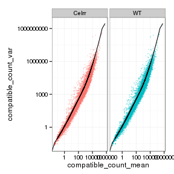 

## Cross-replicate variability (fpkmSCVplot)
Differences in CV 2 can result in lower numbers of differentially expressed genes due to a higher degree of variability between replicate fpkm estimates.

Genes:
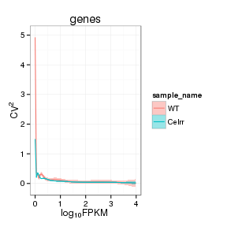 

Isoforms: 
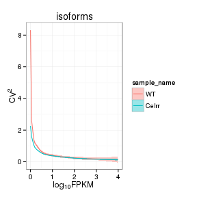 


## MvA plot

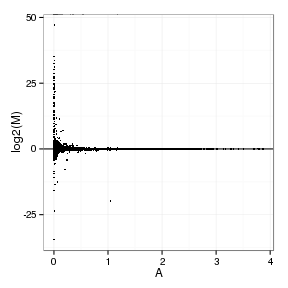 
   
### MvA plot counts

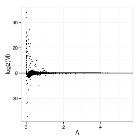 

## Scatterplot matrix

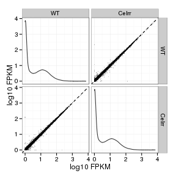 

## Distributions

### Boxplots

Boxplot (genes)

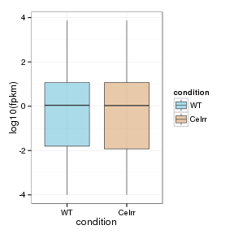 

Boxplot (genes, replicates)

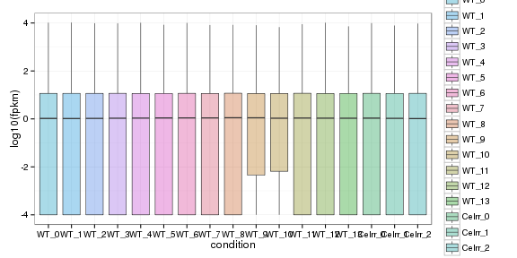 

Boxplot (isoforms)

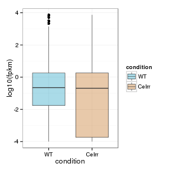 

Boxplot (isoforms, replicates)

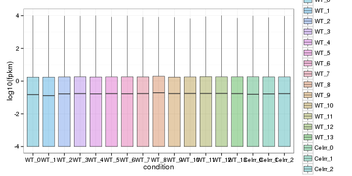 

### Density

Density (genes)

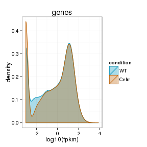 

Density (genes, replicates)

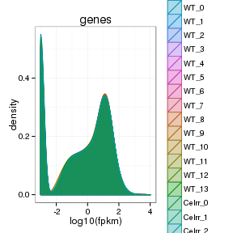 


## Clustering

### Replicate Clusters

 

```
## NULL
```

### PCA (genes)

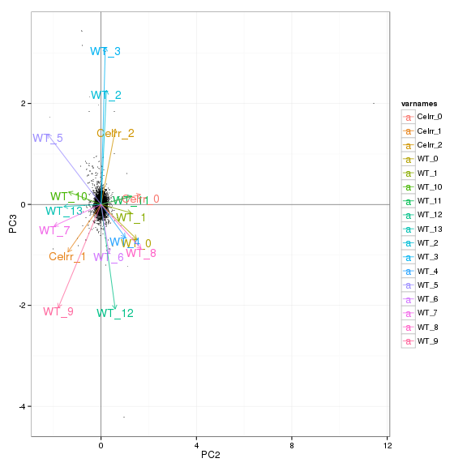 

### MDS (genes)

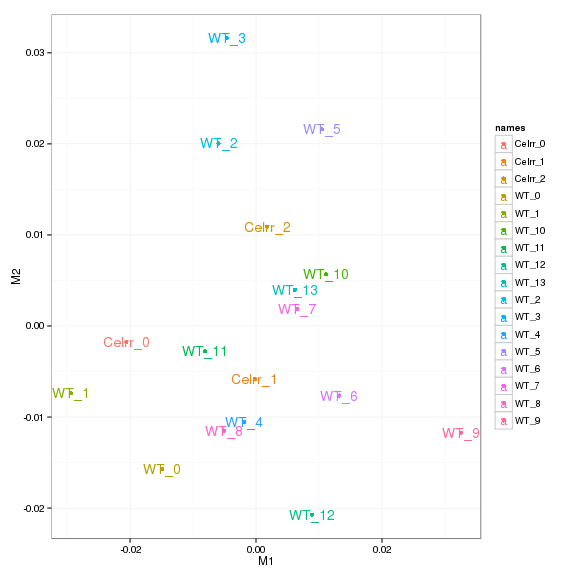 


# KO assessment

## Endogenous lncRNA expression

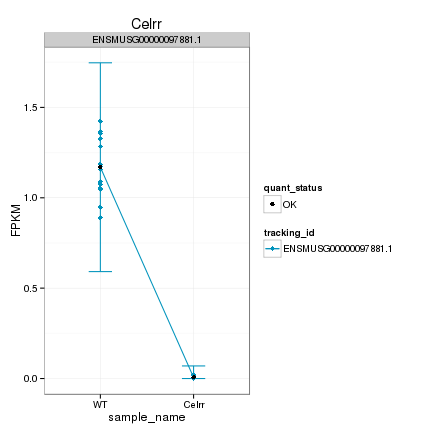 

Endogenous expression of Celrr isoforms:

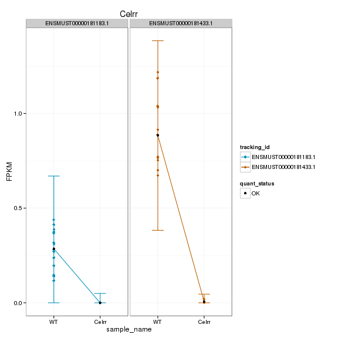 

Barplot of gene expression:

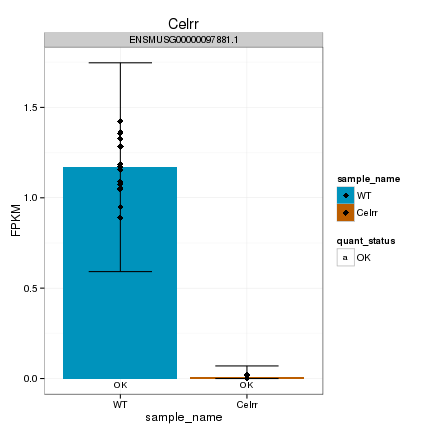 

Barplot of isoform expression:

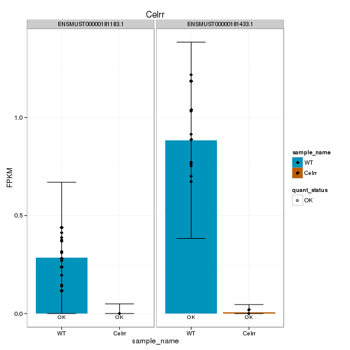 


## LacZ expression

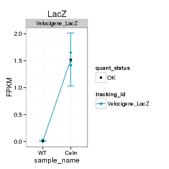 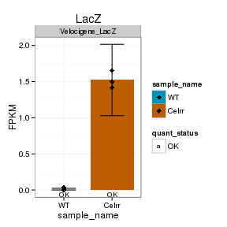 


## Digital Genotyping (LacZ vs Endogenous lncRNA and Sex)
Expression plot (endogenous linc, lacZ, Y-expressed gene):

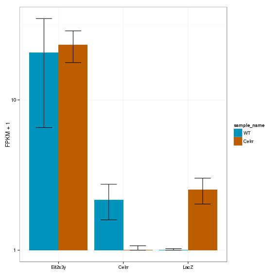 

Expression heatmap:

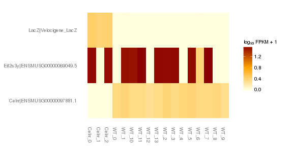 


### Track visualization 

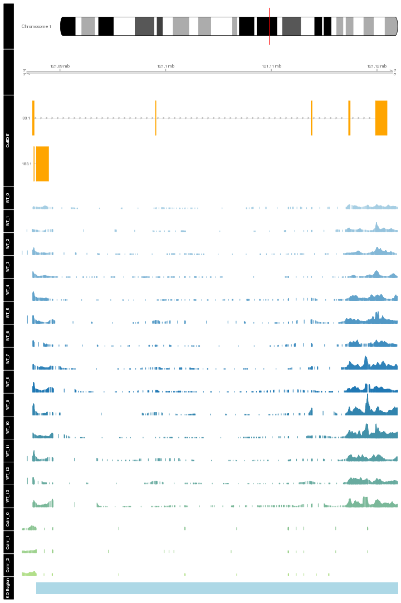 

# Differential Analysis

## Differential Genes 


There are 52 significantly differentially expressed genes. They are:

<!-- html table generated in R 3.0.2 by xtable 1.7-3 package -->
<!-- Wed Jun 25 14:55:28 2014 -->
<TABLE border=1>
<TR> <TH>  </TH> <TH> geneAnnot$gene_short_name </TH>  </TR>
  <TR> <TD align="right"> 1 </TD> <TD> Chordc1 </TD> </TR>
  <TR> <TD align="right"> 2 </TD> <TD> Nes </TD> </TR>
  <TR> <TD align="right"> 3 </TD> <TD> Dnajb1 </TD> </TR>
  <TR> <TD align="right"> 4 </TD> <TD> Dio2 </TD> </TR>
  <TR> <TD align="right"> 5 </TD> <TD> Slc38a3 </TD> </TR>
  <TR> <TD align="right"> 6 </TD> <TD> P4ha1 </TD> </TR>
  <TR> <TD align="right"> 7 </TD> <TD> Btg2 </TD> </TR>
  <TR> <TD align="right"> 8 </TD> <TD> Ccdc117 </TD> </TR>
  <TR> <TD align="right"> 9 </TD> <TD> Pdia6 </TD> </TR>
  <TR> <TD align="right"> 10 </TD> <TD> Adi1 </TD> </TR>
  <TR> <TD align="right"> 11 </TD> <TD> Serpina3n </TD> </TR>
  <TR> <TD align="right"> 12 </TD> <TD> Fos </TD> </TR>
  <TR> <TD align="right"> 13 </TD> <TD> Arc </TD> </TR>
  <TR> <TD align="right"> 14 </TD> <TD> Sdf2l1 </TD> </TR>
  <TR> <TD align="right"> 15 </TD> <TD> Nr4a1 </TD> </TR>
  <TR> <TD align="right"> 16 </TD> <TD> Creld2 </TD> </TR>
  <TR> <TD align="right"> 17 </TD> <TD> Glo1 </TD> </TR>
  <TR> <TD align="right"> 18 </TD> <TD> Dusp1 </TD> </TR>
  <TR> <TD align="right"> 19 </TD> <TD> Pdia4 </TD> </TR>
  <TR> <TD align="right"> 20 </TD> <TD> Lcn2 </TD> </TR>
  <TR> <TD align="right"> 21 </TD> <TD> Hspa5 </TD> </TR>
  <TR> <TD align="right"> 22 </TD> <TD> Vcam1 </TD> </TR>
  <TR> <TD align="right"> 23 </TD> <TD> Hddc3 </TD> </TR>
  <TR> <TD align="right"> 24 </TD> <TD> Tsc22d3 </TD> </TR>
  <TR> <TD align="right"> 25 </TD> <TD> Mt2 </TD> </TR>
  <TR> <TD align="right"> 26 </TD> <TD> Mt1 </TD> </TR>
  <TR> <TD align="right"> 27 </TD> <TD> Pllp </TD> </TR>
  <TR> <TD align="right"> 28 </TD> <TD> Cryab </TD> </TR>
  <TR> <TD align="right"> 29 </TD> <TD> Ptgs2 </TD> </TR>
  <TR> <TD align="right"> 30 </TD> <TD> Lars2 </TD> </TR>
  <TR> <TD align="right"> 31 </TD> <TD> Egr2 </TD> </TR>
  <TR> <TD align="right"> 32 </TD> <TD> Fmo2 </TD> </TR>
  <TR> <TD align="right"> 33 </TD> <TD> Obfc1 </TD> </TR>
  <TR> <TD align="right"> 34 </TD> <TD> Pcsk9 </TD> </TR>
  <TR> <TD align="right"> 35 </TD> <TD> Gm9493 </TD> </TR>
  <TR> <TD align="right"> 36 </TD> <TD> Acp1 </TD> </TR>
  <TR> <TD align="right"> 37 </TD> <TD> Cirbp </TD> </TR>
  <TR> <TD align="right"> 38 </TD> <TD> Npas4 </TD> </TR>
  <TR> <TD align="right"> 39 </TD> <TD> Tmem252 </TD> </TR>
  <TR> <TD align="right"> 40 </TD> <TD> Opalin </TD> </TR>
  <TR> <TD align="right"> 41 </TD> <TD> Cd14 </TD> </TR>
  <TR> <TD align="right"> 42 </TD> <TD> Rpl30 </TD> </TR>
  <TR> <TD align="right"> 43 </TD> <TD> Tpt1 </TD> </TR>
  <TR> <TD align="right"> 44 </TD> <TD> Zbtb40 </TD> </TR>
  <TR> <TD align="right"> 45 </TD> <TD> Rpl34 </TD> </TR>
  <TR> <TD align="right"> 46 </TD> <TD> Ppia </TD> </TR>
  <TR> <TD align="right"> 47 </TD> <TD> Gm7292 </TD> </TR>
  <TR> <TD align="right"> 48 </TD> <TD> H2-Bl </TD> </TR>
  <TR> <TD align="right"> 49 </TD> <TD> Wdfy1 </TD> </TR>
  <TR> <TD align="right"> 50 </TD> <TD> Hspa1b </TD> </TR>
  <TR> <TD align="right"> 51 </TD> <TD> Hspa1a </TD> </TR>
  <TR> <TD align="right"> 52 </TD> <TD> AA465934 </TD> </TR>
   </TABLE>

### Matrix of gene significant differences between conditions

(skip for Brainmap wt-v-ko comparisons)

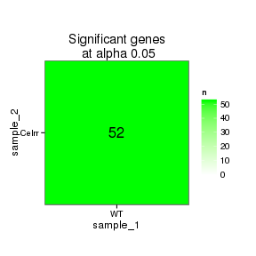 

### Significant gene expression differences between conditions

Expression plot (genes):(turned off)


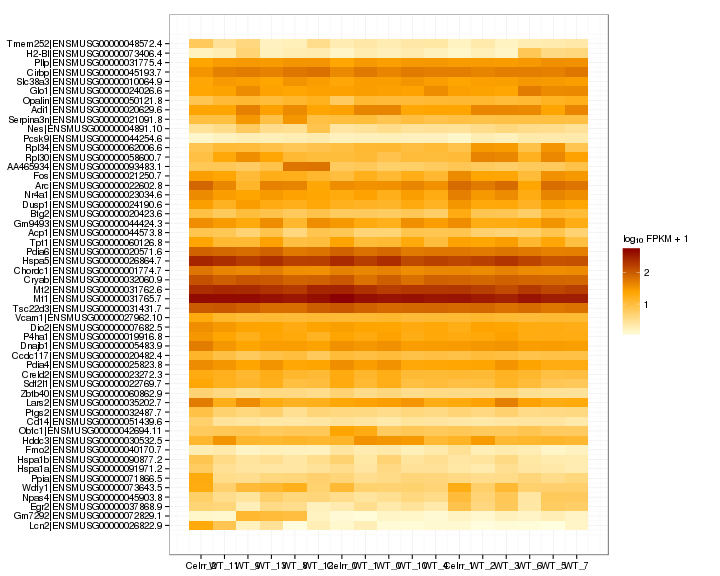 

Significant genes with expression >50fpkm (any condition):(turned off)


An individual look at each of the highly expressed significantly differentially regulated genes:
(eval=false for first pass)


