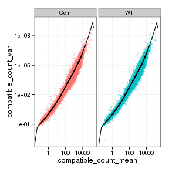
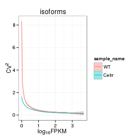

Celrr KO vs WT (Embryonic)
======================================


# Intialize


# Design Overview

This file shows the wt-v-ko comparison for Celrr. 

Cuff overview:

```
## CuffSet instance with:
## 	 2 samples
## 	 26754 genes
## 	 77524 isoforms
## 	 0 TSS
## 	 23066 CDS
## 	 0 promoters
## 	 0 splicing
## 	 19954 relCDS
```


# QC

## Dispersion

Dispersion plot for genes in cuff:
(Overdispersion can lead to innacurate quants)

 

## Cross-replicate variability (fpkmSCVplot)
Differences in CV 2 can result in lower numbers of differentially expressed genes due to a higher degree of variability between replicate fpkm estimates.

Genes:

```
## Error: error in evaluating the argument 'object' in selecting a method for function 'fpkmSCVPlot': Error in (function (classes, fdef, mtable)  : 
##   unable to find an inherited method for function 'genes' for signature '"CuffSet"'
```

Isoforms: 
 


## MvA plot

```
## Error: error in evaluating the argument 'object' in selecting a method for function 'MAplot': Error in (function (classes, fdef, mtable)  : 
##   unable to find an inherited method for function 'genes' for signature '"CuffSet"'
```
   
### MvA plot counts

```
## Error: error in evaluating the argument 'object' in selecting a method for function 'MAplot': Error in (function (classes, fdef, mtable)  : 
##   unable to find an inherited method for function 'genes' for signature '"CuffSet"'
```

## Scatterplot matrix

```
## Error: error in evaluating the argument 'object' in selecting a method for function 'csScatterMatrix': Error in (function (classes, fdef, mtable)  : 
##   unable to find an inherited method for function 'genes' for signature '"CuffSet"'
```
