Eldr KO vs WT (Adult)
======================================


# Intialize


# Design Overview

This file shows the wt-v-ko comparison for Eldr. 

Cuff overview:

```
## CuffSet instance with:
## 	 2 samples
## 	 26754 genes
## 	 77524 isoforms
## 	 0 TSS
## 	 0 CDS
## 	 0 promoters
## 	 0 splicing
## 	 0 relCDS
```


# QC

## Dispersion

Dispersion plot for genes in cuff:
(Overdispersion can lead to innacurate quants)

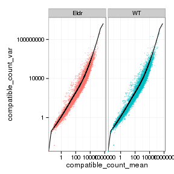 

## Cross-replicate variability (fpkmSCVplot)
Differences in CV 2 can result in lower numbers of differentially expressed genes due to a higher degree of variability between replicate fpkm estimates.

Genes:
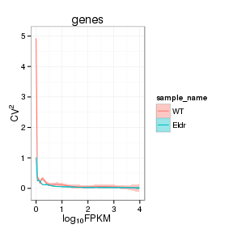 

Isoforms: 

```
## Error: 'from' must be of length 1
```


## MvA plot

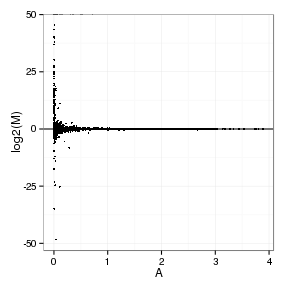 
   
### MvA plot counts

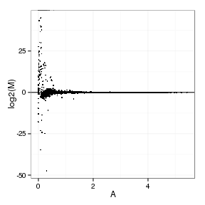 

## Scatterplot matrix

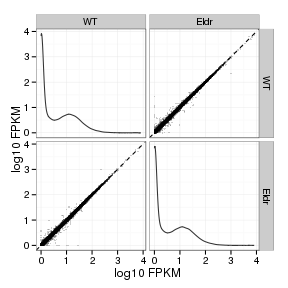 

## Distributions

### Boxplots

Boxplot (genes)

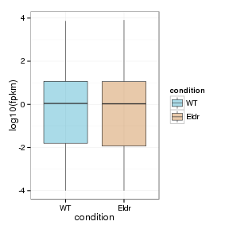 

Boxplot (genes, replicates)

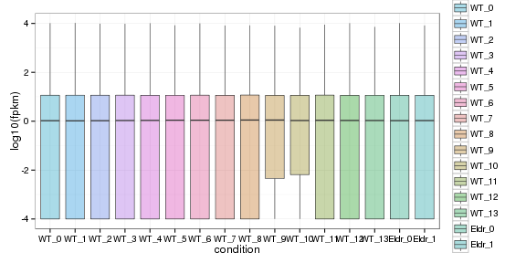 

Boxplot (isoforms)

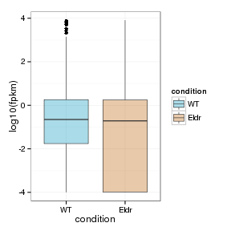 

Boxplot (isoforms, replicates)

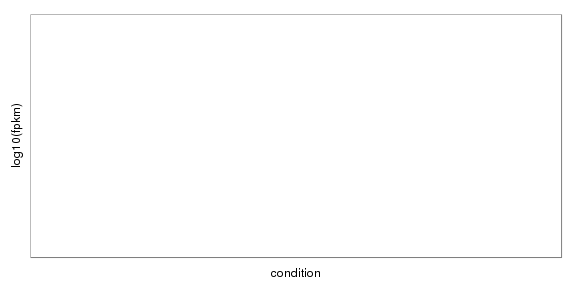 

### Density

Density (genes)

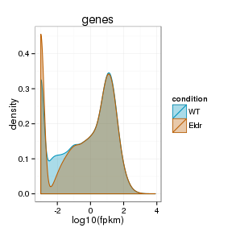 

Density (genes, replicates)

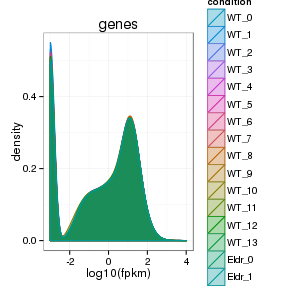 


## Clustering

### Replicate Clusters

 

```
## NULL
```

### PCA (genes)

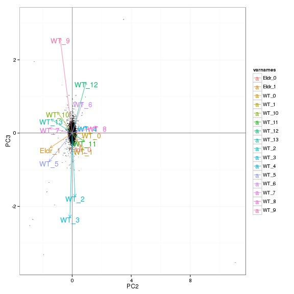 

### MDS (genes)

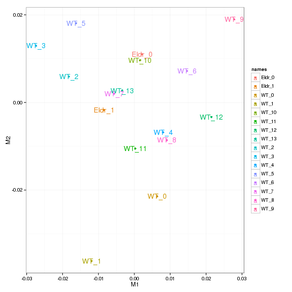 


# KO assessment

## Endogenous lncRNA expression

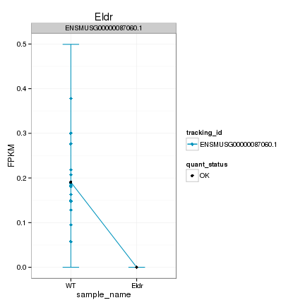 

Endogenous expression of Eldr isoforms:

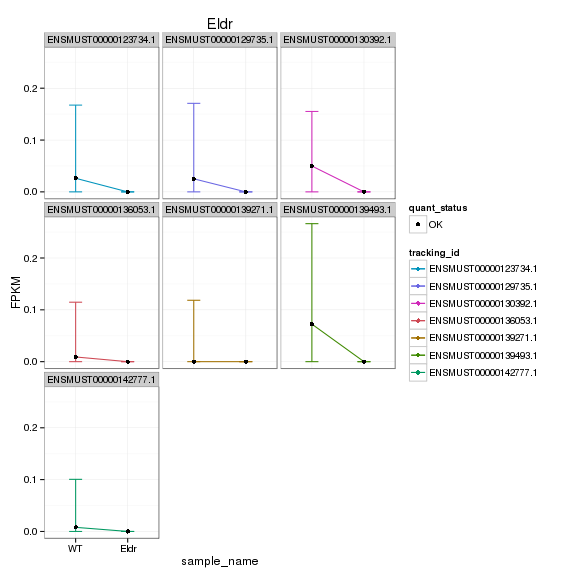 

Barplot of gene expression:

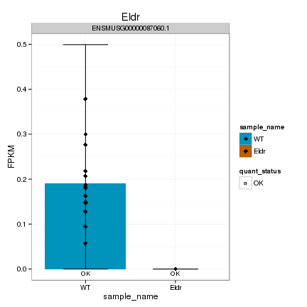 

Barplot of isoform expression:

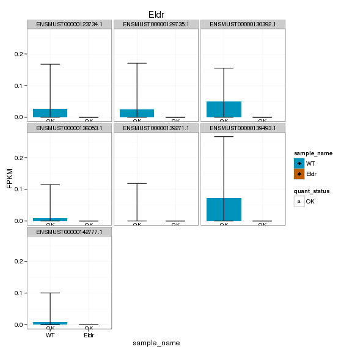 


## LacZ expression

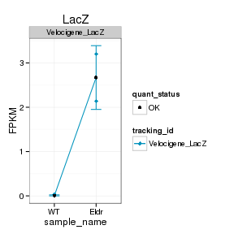 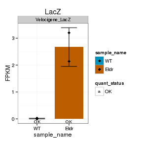 


## Digital Genotyping (LacZ vs Endogenous lncRNA and Sex)
Expression plot (endogenous linc, lacZ, Y-expressed gene):

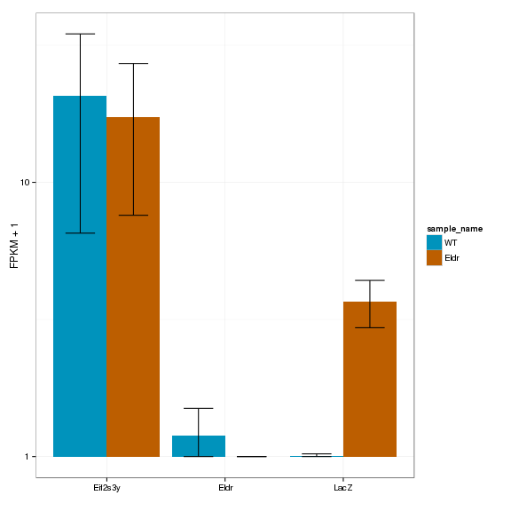 

Expression heatmap:

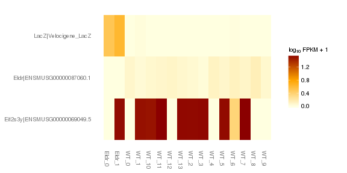 


### Track visualization 

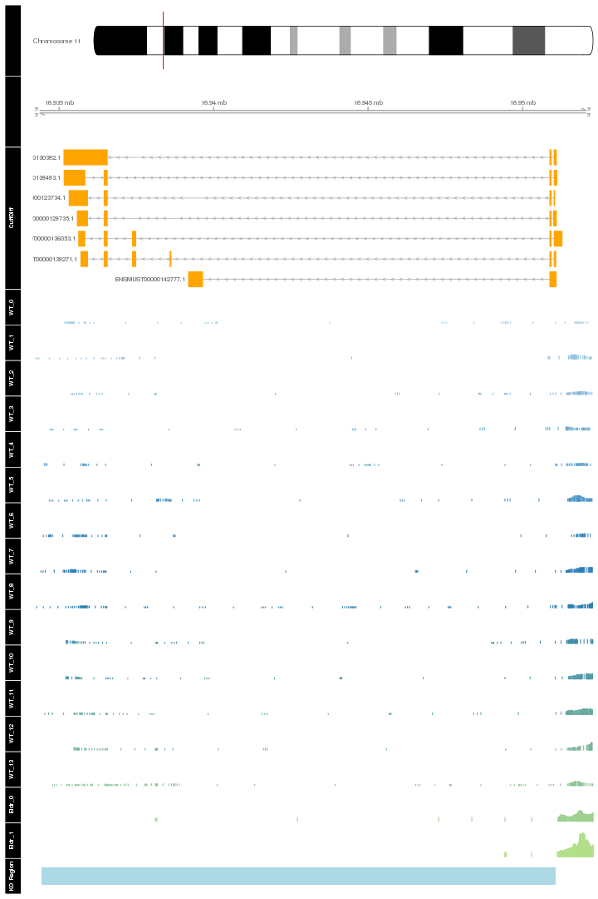 

# Differential Analysis

## Differential Genes 


There are 29 significantly differentially expressed genes. They are:

<!-- html table generated in R 3.0.2 by xtable 1.7-3 package -->
<!-- Wed Jun 25 13:59:21 2014 -->
<TABLE border=1>
<TR> <TH>  </TH> <TH> geneAnnot$gene_short_name </TH>  </TR>
  <TR> <TD align="right"> 1 </TD> <TD> Nes </TD> </TR>
  <TR> <TD align="right"> 2 </TD> <TD> Ubc </TD> </TR>
  <TR> <TD align="right"> 3 </TD> <TD> Tpgs1 </TD> </TR>
  <TR> <TD align="right"> 4 </TD> <TD> Adi1 </TD> </TR>
  <TR> <TD align="right"> 5 </TD> <TD> Fos </TD> </TR>
  <TR> <TD align="right"> 6 </TD> <TD> Nr4a1 </TD> </TR>
  <TR> <TD align="right"> 7 </TD> <TD> Rps14 </TD> </TR>
  <TR> <TD align="right"> 8 </TD> <TD> Rps24 </TD> </TR>
  <TR> <TD align="right"> 9 </TD> <TD> Nr4a3 </TD> </TR>
  <TR> <TD align="right"> 10 </TD> <TD> Ndufs5 </TD> </TR>
  <TR> <TD align="right"> 11 </TD> <TD> Arhgap27 </TD> </TR>
  <TR> <TD align="right"> 12 </TD> <TD> Prr7 </TD> </TR>
  <TR> <TD align="right"> 13 </TD> <TD> Egr2 </TD> </TR>
  <TR> <TD align="right"> 14 </TD> <TD> Egr1 </TD> </TR>
  <TR> <TD align="right"> 15 </TD> <TD> Pcsk1n </TD> </TR>
  <TR> <TD align="right"> 16 </TD> <TD> Klhl42 </TD> </TR>
  <TR> <TD align="right"> 17 </TD> <TD> C1qtnf4 </TD> </TR>
  <TR> <TD align="right"> 18 </TD> <TD> Maff </TD> </TR>
  <TR> <TD align="right"> 19 </TD> <TD> Fbxo48 </TD> </TR>
  <TR> <TD align="right"> 20 </TD> <TD> Junb </TD> </TR>
  <TR> <TD align="right"> 21 </TD> <TD> Fat2 </TD> </TR>
  <TR> <TD align="right"> 22 </TD> <TD> Capn11 </TD> </TR>
  <TR> <TD align="right"> 23 </TD> <TD> Tpt1 </TD> </TR>
  <TR> <TD align="right"> 24 </TD> <TD> Egr4 </TD> </TR>
  <TR> <TD align="right"> 25 </TD> <TD> Gm9008 </TD> </TR>
  <TR> <TD align="right"> 26 </TD> <TD> Gm7292 </TD> </TR>
  <TR> <TD align="right"> 27 </TD> <TD> Wdfy1 </TD> </TR>
  <TR> <TD align="right"> 28 </TD> <TD> Apold1 </TD> </TR>
  <TR> <TD align="right"> 29 </TD> <TD> AA465934 </TD> </TR>
   </TABLE>

### Matrix of gene significant differences between conditions

(skip for Brainmap wt-v-ko comparisons)

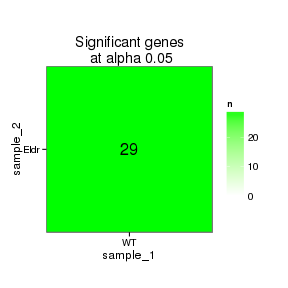 

### Significant gene expression differences between conditions

Expression plot (genes):(turned off)


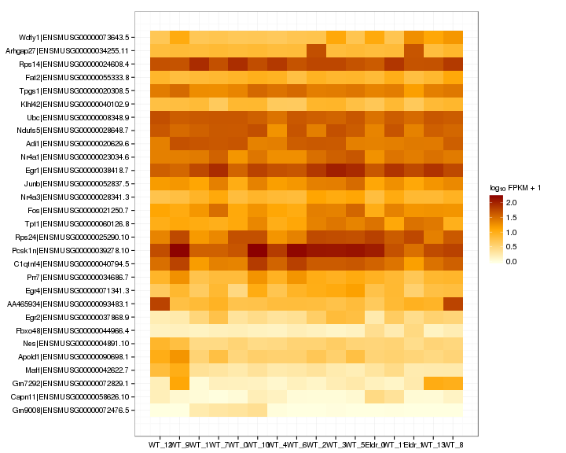 

Significant genes with expression >50fpkm (any condition):(turned off)


An individual look at each of the highly expressed significantly differentially regulated genes:
(eval=false for first pass)


