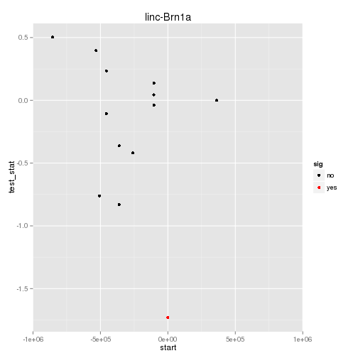

linc-Brn1a Embryonic Cis-v-Trans
========================================================


```
## Error: argument "seed" is missing, with no default
```

```
## Error: dims [product 1] do not match the length of object [0]
```

# P-value for 1 DE genes in a region this size in this dataset is: 0.623 

 

- Figure out how to add name labels to significant genes only! on the graphs! s
