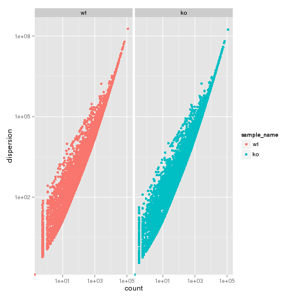

peril_GEOB KO vs WT (Embryonic)
======================================

# questions
- overdispersion
- get tables to work
- counts


# Intialize


# Design Overview

This file shows the wt-v-ko comparison for peril_GEOB. 

Samples used are:

```r
samples
```

```
##                                                                           9
## c......n....rinn_data1....users....agroff....seq....PERIL....data...   bams
## c......n....rinn_data1....users....agroff....seq....PERIL....data....1 bams
## c......n....rinn_data1....users....agroff....seq....PERIL....data....2 bams
## c......n....rinn_data1....users....agroff....seq....PERIL....data....3 bams
```


Cuff overview:

```r
cuff
```

```
## CuffSet instance with:
## 	 2 samples
## 	 31926 genes
## 	 77340 isoforms
## 	 45508 TSS
## 	 0 CDS
## 	 31926 promoters
## 	 45508 splicing
## 	 0 relCDS
```

## Replicates (MAKE TABLES PRETTY >:| )

```r
print(xtable(replicates(cuff),type="html"))
```

```
## % latex table generated in R 3.0.2 by xtable 1.7-3 package
## % Thu Jun 12 11:33:59 2014
## \begin{table}[ht]
## \centering
## \begin{tabular}{rllrlrrrr}
##   \hline
##  & file & sample\_name & replicate & rep\_name & total\_mass & norm\_mass & internal\_scale & external\_scale \\ 
##   \hline
## 1 & /n/rinn\_data1/users/agroff/seq/PERIL/data/bams/Sample\_JR710\_Peril\_L46\_E14-5\_GE\_and\_OB\_wtm1\_ATCACG/accepted\_hits.bam & wt &   0 & wt\_0 & 19373200.00 & 21401800.00 & 0.90 & 1.00 \\ 
##   2 & /n/rinn\_data1/users/agroff/seq/PERIL/data/bams/Sample\_JR712\_Peril\_L46\_E14-5\_GE\_and\_OB\_wtm3\_TTAGGC/accepted\_hits.bam & wt &   1 & wt\_1 & 17389200.00 & 21401800.00 & 0.82 & 1.00 \\ 
##   3 & /n/rinn\_data1/users/agroff/seq/PERIL/data/bams/Sample\_JR711\_Peril\_L46\_E14-5\_GE\_and\_OB\_kof2\_CGATGT/accepted\_hits.bam & ko &   0 & ko\_0 & 31892200.00 & 21401800.00 & 1.49 & 1.00 \\ 
##   4 & /n/rinn\_data1/users/agroff/seq/PERIL/data/bams/Sample\_JR713\_Peril\_L46\_E14-5\_GE\_and\_OB\_kof\_7\_TGACCA/accepted\_hits.bam & ko &   1 & ko\_1 & 19646900.00 & 21401800.00 & 0.91 & 1.00 \\ 
##    \hline
## \end{tabular}
## \end{table}
```

# QC

## Dispersion

This shows count (WHAT IS COUNT? fragment counts? per gene?) vs dispersion (of those counts), or the spread in measurements for a particular gene across replicates. 

from cummerbund manual: Overdispersion is a common problem in RNA-Seq data. As of cufflinks v2.0 mean counts, variance, and dispersion are all emitted, allowing you to visualize the estimated overdispersion for each sample as a quality control measure. - See more at: http://compbio.mit.edu/cummeRbund/manual_2_0.html#sthash.9YRYxwRV.dpuf


```r
dispersionPlot(genes(cuff))
```

 

```r
csDendro(genes(cuff),replicates=TRUE)
```

 

```
## 'dendrogram' with 2 branches and 4 members total, at height 0.0689
```

```r
new.env()
```

```
## <environment: 0x177b9610>
```

```r
rm(cuff)
```
