peril_kidney KO vs WT (Embryonic)
======================================

# questions
- overdispersion
- how do we rescale these plots? or just axes?
- add labels, descriptions
- turn off all caching 
- general figure formatting/table formatting 
- other heatmap labels (csHeatmap)


# Intialize


# Design Overview

This file shows the wt-v-ko comparison for peril_kidney. 

Samples used are:
<!-- html table generated in R 3.0.2 by xtable 1.7-3 package -->
<!-- Fri Jun 13 15:05:46 2014 -->
<TABLE border=1>
<TR> <TH>  </TH> <TH> 9 </TH>  </TR>
  <TR> <TD align="right"> c......n....rinn_data1....users....agroff....seq....PERIL....data... </TD> <TD> bams </TD> </TR>
  <TR> <TD align="right"> c......n....rinn_data1....users....agroff....seq....PERIL....data....1 </TD> <TD> bams </TD> </TR>
  <TR> <TD align="right"> c......n....rinn_data1....users....agroff....seq....PERIL....data....2 </TD> <TD> bams </TD> </TR>
  <TR> <TD align="right"> c......n....rinn_data1....users....agroff....seq....PERIL....data....3 </TD> <TD> bams </TD> </TR>
  <TR> <TD align="right"> c......n....rinn_data1....users....agroff....seq....PERIL....data....4 </TD> <TD> bams </TD> </TR>
  <TR> <TD align="right"> c......n....rinn_data1....users....agroff....seq....PERIL....data....5 </TD> <TD> bams </TD> </TR>
   </TABLE>


Cuff overview:

```
## CuffSet instance with:
## 	 2 samples
## 	 31926 genes
## 	 77340 isoforms
## 	 45508 TSS
## 	 0 CDS
## 	 31926 promoters
## 	 45508 splicing
## 	 0 relCDS
```

## Replicates
<!-- html table generated in R 3.0.2 by xtable 1.7-3 package -->
<!-- Fri Jun 13 15:05:47 2014 -->
<TABLE border=1>
<TR> <TH>  </TH> <TH> file </TH> <TH> sample_name </TH> <TH> replicate </TH> <TH> rep_name </TH> <TH> total_mass </TH> <TH> norm_mass </TH> <TH> internal_scale </TH> <TH> external_scale </TH>  </TR>
  <TR> <TD align="right"> 1 </TD> <TD> /n/rinn_data1/users/agroff/seq/PERIL/data/bams/Sample_JR722_Peril_L43_E14-5_kidney_both_lobeswtM1_ACTGAT/accepted_hits.bam </TD> <TD> wt </TD> <TD align="right">   0 </TD> <TD> wt_0 </TD> <TD align="right"> 32567800.00 </TD> <TD align="right"> 28714000.00 </TD> <TD align="right"> 1.13 </TD> <TD align="right"> 1.00 </TD> </TR>
  <TR> <TD align="right"> 2 </TD> <TD> /n/rinn_data1/users/agroff/seq/PERIL/data/bams/Sample_JR723_Peril_L43_E14-5_kidney_both_lobes_wtf3_AGTCAA/accepted_hits.bam </TD> <TD> wt </TD> <TD align="right">   1 </TD> <TD> wt_1 </TD> <TD align="right"> 24846400.00 </TD> <TD align="right"> 28714000.00 </TD> <TD align="right"> 0.88 </TD> <TD align="right"> 1.00 </TD> </TR>
  <TR> <TD align="right"> 3 </TD> <TD> /n/rinn_data1/users/agroff/seq/PERIL/data/bams/Sample_JR725_Peril_L43_E14-5_kidney_both_lobes_wtm8_ATGTCA/accepted_hits.bam </TD> <TD> wt </TD> <TD align="right">   2 </TD> <TD> wt_2 </TD> <TD align="right"> 18152700.00 </TD> <TD align="right"> 28714000.00 </TD> <TD align="right"> 0.61 </TD> <TD align="right"> 1.00 </TD> </TR>
  <TR> <TD align="right"> 4 </TD> <TD> /n/rinn_data1/users/agroff/seq/PERIL/data/bams/Sample_JR724_Peril_L43_E14-5_kidney_both_lobes_kom7_AGTTCC/accepted_hits.bam </TD> <TD> ko </TD> <TD align="right">   0 </TD> <TD> ko_0 </TD> <TD align="right"> 21233900.00 </TD> <TD align="right"> 28714000.00 </TD> <TD align="right"> 0.75 </TD> <TD align="right"> 1.00 </TD> </TR>
  <TR> <TD align="right"> 5 </TD> <TD> /n/rinn_data1/users/agroff/seq/PERIL/data/bams/Sample_JR726_Peril_L43_E14-5_kidney_both_lobes_kof9_CCGTCC/accepted_hits.bam </TD> <TD> ko </TD> <TD align="right">   1 </TD> <TD> ko_1 </TD> <TD align="right"> 41738700.00 </TD> <TD align="right"> 28714000.00 </TD> <TD align="right"> 1.43 </TD> <TD align="right"> 1.00 </TD> </TR>
  <TR> <TD align="right"> 6 </TD> <TD> /n/rinn_data1/users/agroff/seq/PERIL/data/bams/Sample_JR727_Peril_L43_E14-5_kidney_both_lobes_kof10_ATTCCT/accepted_hits.bam </TD> <TD> ko </TD> <TD align="right">   2 </TD> <TD> ko_2 </TD> <TD align="right"> 43552300.00 </TD> <TD align="right"> 28714000.00 </TD> <TD align="right"> 1.52 </TD> <TD align="right"> 1.00 </TD> </TR>
   </TABLE>

# QC

## Dispersion

This shows count (WHAT IS COUNT? fragment counts? per gene?) vs dispersion (of those counts), or the spread in measurements for a particular gene across replicates. 

from cummerbund manual: Overdispersion is a common problem in RNA-Seq data. As of cufflinks v2.0 mean counts, variance, and dispersion are all emitted, allowing you to visualize the estimated overdispersion for each sample as a quality control measure. - See more at: http://compbio.mit.edu/cummeRbund/manual_2_0.html#sthash.9YRYxwRV.dpuf


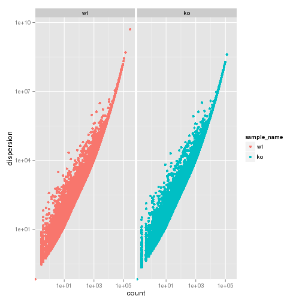 

## Cross-replicate variability (fpkmSCVplot)
The squared coefficient of variation is a normalized measure of cross replicate variability that can be useful for evaluating the quality your RNA-seq data. Differences in CV 2 can result in lower numbers of differentially expressed genes due to a higher degree of variability between replicate fpkm estimates.

Genes:

```
## Scale for 'x' is already present. Adding another scale for 'x', which will replace the existing scale.
## geom_smooth: method="auto" and size of largest group is >=1000, so using gam with formula: y ~ s(x, bs = "cs"). Use 'method = x' to change the smoothing method.
```

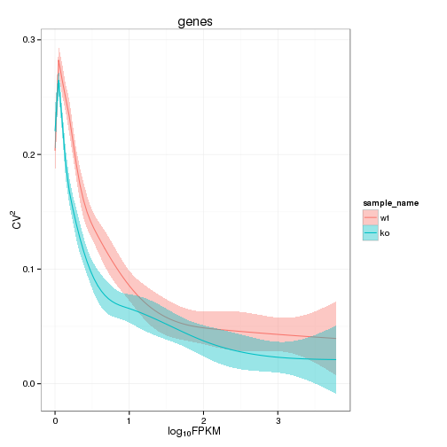 


Isoforms: 

```
## Scale for 'x' is already present. Adding another scale for 'x', which will replace the existing scale.
## geom_smooth: method="auto" and size of largest group is >=1000, so using gam with formula: y ~ s(x, bs = "cs"). Use 'method = x' to change the smoothing method.
```

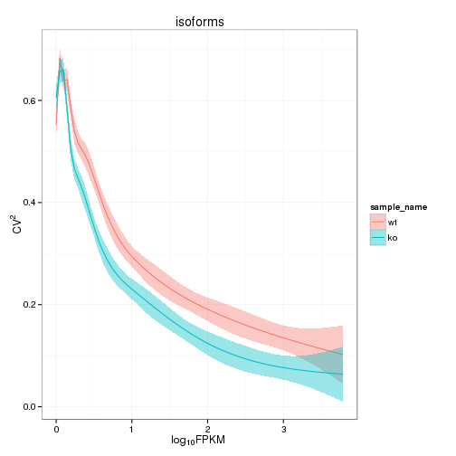 

## Volcano
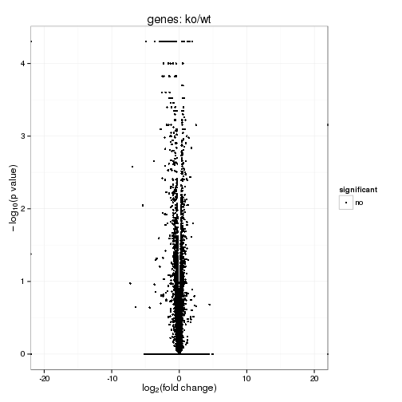 

### Volcano matrix (replicates)
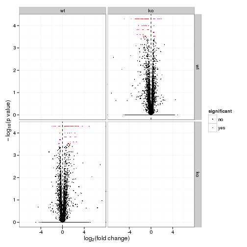 

## MvA plot

```
## Warning: Removed 7893 rows containing missing values (geom_point).
```

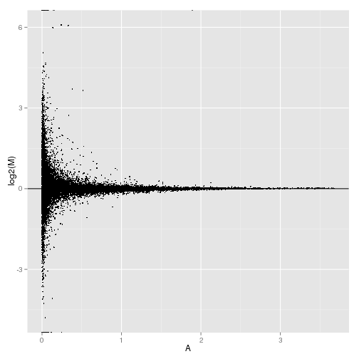 
   
### MvA plot counts

```
## Warning: Removed 7893 rows containing missing values (geom_point).
```

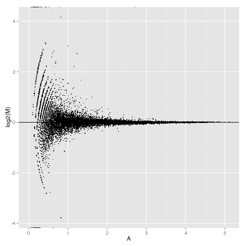 

## Scatterplot
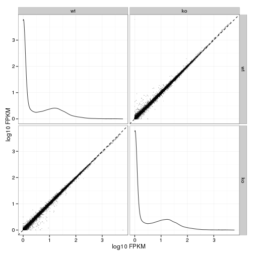 

### Scatter matrix (replicates)
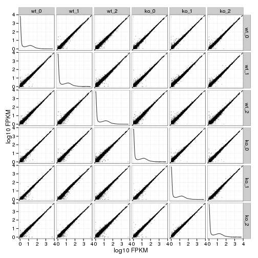 


## Distributions

### Boxplot
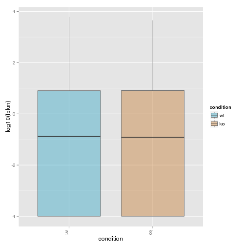 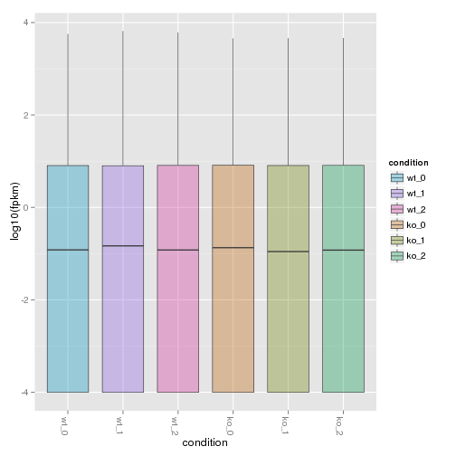 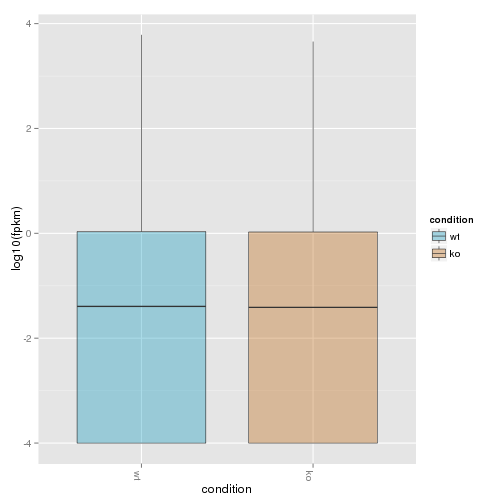 

### Density

```
## Warning: Removed 9343 rows containing non-finite values (stat_density).
## Warning: Removed 8875 rows containing non-finite values (stat_density).
```

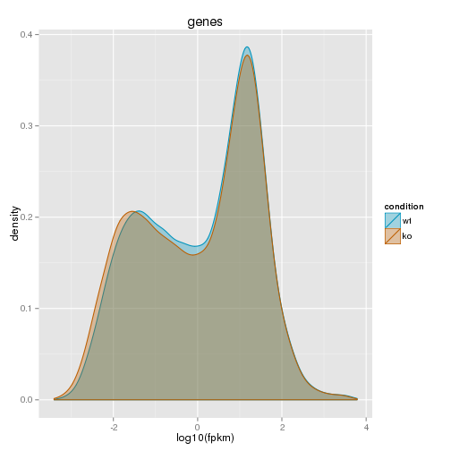 

```
## Warning: Removed 11122 rows containing non-finite values (stat_density).
## Warning: Removed 11165 rows containing non-finite values (stat_density).
## Warning: Removed 12245 rows containing non-finite values (stat_density).
## Warning: Removed 11606 rows containing non-finite values (stat_density).
## Warning: Removed 10794 rows containing non-finite values (stat_density).
## Warning: Removed 10546 rows containing non-finite values (stat_density).
```

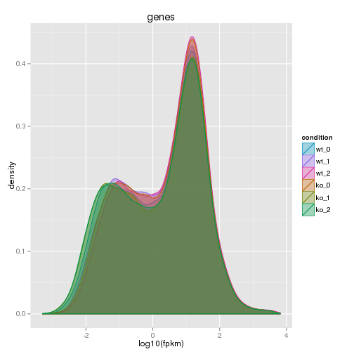 


## Clustering

### Replicate Clusters
 

```
## 'dendrogram' with 2 branches and 6 members total, at height 0.07842
```

### PCA
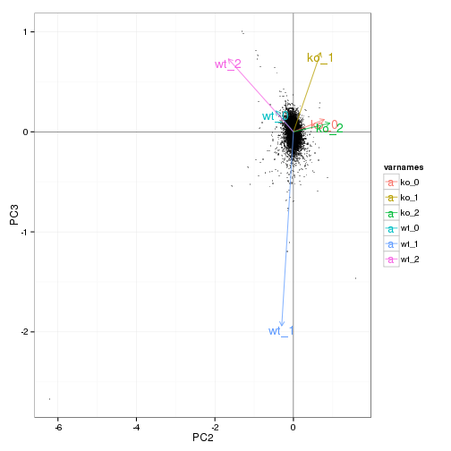 

### MDS 
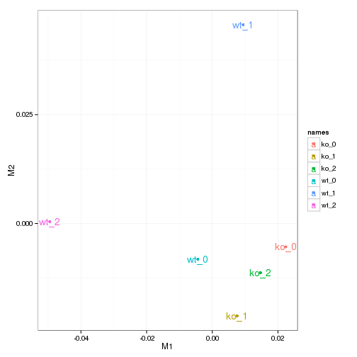 

### Distance Heat Map
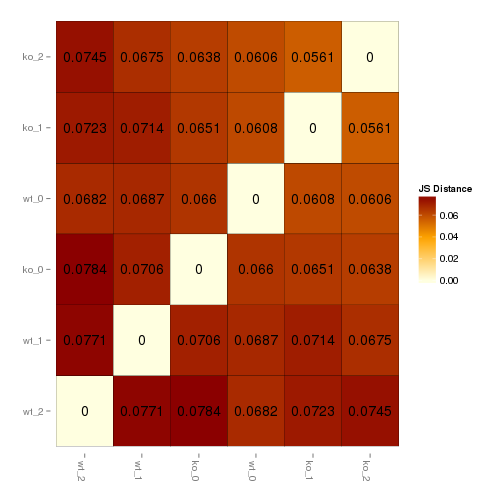 


# KO assessment

## Endogenous lncRNA expression

```
## Error: invalid class "CuffGene" object: FALSE
```

<!-- html table generated in R 3.0.2 by xtable 1.7-3 package -->
<!-- Fri Jun 13 15:08:51 2014 -->
<TABLE border=1>
<TR> <TH>  </TH> <TH> gene_id </TH> <TH> sample_name </TH> <TH> fpkm </TH> <TH> conf_hi </TH> <TH> conf_lo </TH> <TH> quant_status </TH>  </TR>
  <TR> <TD align="right"> 1 </TD> <TD> XLOC_008094 </TD> <TD> ko </TD> <TD align="right"> 1.68 </TD> <TD align="right"> 2.21 </TD> <TD align="right"> 1.14 </TD> <TD> OK </TD> </TR>
  <TR> <TD align="right"> 2 </TD> <TD> XLOC_008094 </TD> <TD> wt </TD> <TD align="right"> 1.77 </TD> <TD align="right"> 2.41 </TD> <TD align="right"> 1.13 </TD> <TD> OK </TD> </TR>
   </TABLE>
<!-- html table generated in R 3.0.2 by xtable 1.7-3 package -->
<!-- Fri Jun 13 15:08:51 2014 -->
<TABLE border=1>
<TR> <TH>  </TH> <TH> isoform_id </TH> <TH> sample_name </TH> <TH> fpkm </TH> <TH> conf_hi </TH> <TH> conf_lo </TH> <TH> quant_status </TH>  </TR>
  <TR> <TD align="right"> 1 </TD> <TD> TCONS_00019669 </TD> <TD> ko </TD> <TD align="right"> 0.05 </TD> <TD align="right"> 0.18 </TD> <TD align="right"> 0.00 </TD> <TD> OK </TD> </TR>
  <TR> <TD align="right"> 2 </TD> <TD> TCONS_00019670 </TD> <TD> ko </TD> <TD align="right"> 0.00 </TD> <TD align="right"> 0.03 </TD> <TD align="right"> 0.00 </TD> <TD> OK </TD> </TR>
  <TR> <TD align="right"> 3 </TD> <TD> TCONS_00019671 </TD> <TD> ko </TD> <TD align="right"> 0.00 </TD> <TD align="right"> 0.02 </TD> <TD align="right"> 0.00 </TD> <TD> OK </TD> </TR>
  <TR> <TD align="right"> 4 </TD> <TD> TCONS_00019672 </TD> <TD> ko </TD> <TD align="right"> 0.38 </TD> <TD align="right"> 0.76 </TD> <TD align="right"> 0.00 </TD> <TD> OK </TD> </TR>
  <TR> <TD align="right"> 5 </TD> <TD> TCONS_00019673 </TD> <TD> ko </TD> <TD align="right"> 0.00 </TD> <TD align="right"> 0.02 </TD> <TD align="right"> 0.00 </TD> <TD> OK </TD> </TR>
  <TR> <TD align="right"> 6 </TD> <TD> TCONS_00019674 </TD> <TD> ko </TD> <TD align="right"> 1.04 </TD> <TD align="right"> 1.53 </TD> <TD align="right"> 0.56 </TD> <TD> OK </TD> </TR>
  <TR> <TD align="right"> 7 </TD> <TD> TCONS_00019675 </TD> <TD> ko </TD> <TD align="right"> 0.10 </TD> <TD align="right"> 0.29 </TD> <TD align="right"> 0.00 </TD> <TD> OK </TD> </TR>
  <TR> <TD align="right"> 8 </TD> <TD> TCONS_00019676 </TD> <TD> ko </TD> <TD align="right"> 0.00 </TD> <TD align="right"> 0.07 </TD> <TD align="right"> 0.00 </TD> <TD> OK </TD> </TR>
  <TR> <TD align="right"> 9 </TD> <TD> TCONS_00019677 </TD> <TD> ko </TD> <TD align="right"> 0.11 </TD> <TD align="right"> 0.37 </TD> <TD align="right"> 0.00 </TD> <TD> OK </TD> </TR>
  <TR> <TD align="right"> 10 </TD> <TD> TCONS_00019669 </TD> <TD> wt </TD> <TD align="right"> 0.23 </TD> <TD align="right"> 0.62 </TD> <TD align="right"> 0.00 </TD> <TD> OK </TD> </TR>
  <TR> <TD align="right"> 11 </TD> <TD> TCONS_00019670 </TD> <TD> wt </TD> <TD align="right"> 0.00 </TD> <TD align="right"> 0.03 </TD> <TD align="right"> 0.00 </TD> <TD> OK </TD> </TR>
  <TR> <TD align="right"> 12 </TD> <TD> TCONS_00019671 </TD> <TD> wt </TD> <TD align="right"> 0.00 </TD> <TD align="right"> 0.02 </TD> <TD align="right"> 0.00 </TD> <TD> OK </TD> </TR>
  <TR> <TD align="right"> 13 </TD> <TD> TCONS_00019672 </TD> <TD> wt </TD> <TD align="right"> 0.19 </TD> <TD align="right"> 0.46 </TD> <TD align="right"> 0.00 </TD> <TD> OK </TD> </TR>
  <TR> <TD align="right"> 14 </TD> <TD> TCONS_00019673 </TD> <TD> wt </TD> <TD align="right"> 0.47 </TD> <TD align="right"> 0.84 </TD> <TD align="right"> 0.11 </TD> <TD> OK </TD> </TR>
  <TR> <TD align="right"> 15 </TD> <TD> TCONS_00019674 </TD> <TD> wt </TD> <TD align="right"> 0.68 </TD> <TD align="right"> 1.05 </TD> <TD align="right"> 0.32 </TD> <TD> OK </TD> </TR>
  <TR> <TD align="right"> 16 </TD> <TD> TCONS_00019675 </TD> <TD> wt </TD> <TD align="right"> 0.08 </TD> <TD align="right"> 0.25 </TD> <TD align="right"> 0.00 </TD> <TD> OK </TD> </TR>
  <TR> <TD align="right"> 17 </TD> <TD> TCONS_00019676 </TD> <TD> wt </TD> <TD align="right"> 0.00 </TD> <TD align="right"> 0.07 </TD> <TD align="right"> 0.00 </TD> <TD> OK </TD> </TR>
  <TR> <TD align="right"> 18 </TD> <TD> TCONS_00019677 </TD> <TD> wt </TD> <TD align="right"> 0.12 </TD> <TD align="right"> 0.56 </TD> <TD align="right"> 0.00 </TD> <TD> OK </TD> </TR>
   </TABLE>
 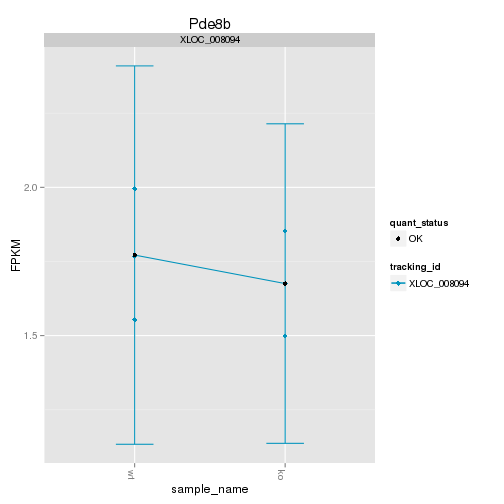 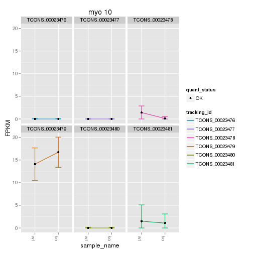 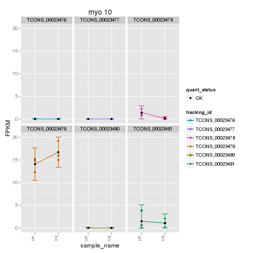   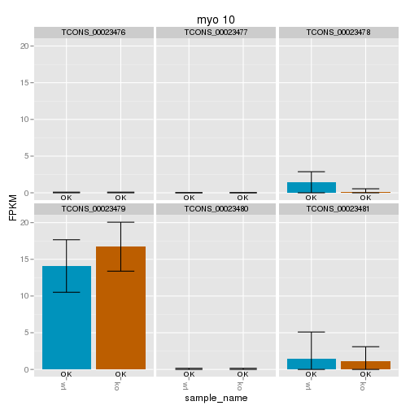 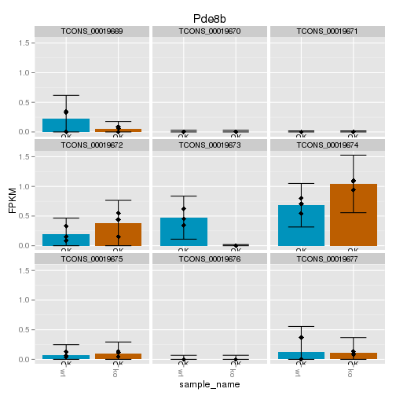 


## LacZ expression

```
## Error: object 'LacZ' not found
```

```
## Error: object 'myGeneId' not found
```

<!-- html table generated in R 3.0.2 by xtable 1.7-3 package -->
<!-- Fri Jun 13 15:09:03 2014 -->
<TABLE border=1>
<TR> <TH>  </TH> <TH> gene_id </TH> <TH> sample_name </TH> <TH> fpkm </TH> <TH> conf_hi </TH> <TH> conf_lo </TH> <TH> quant_status </TH>  </TR>
  <TR> <TD align="right"> 1 </TD> <TD> XLOC_008094 </TD> <TD> ko </TD> <TD align="right"> 1.68 </TD> <TD align="right"> 2.21 </TD> <TD align="right"> 1.14 </TD> <TD> OK </TD> </TR>
  <TR> <TD align="right"> 2 </TD> <TD> XLOC_008094 </TD> <TD> wt </TD> <TD align="right"> 1.77 </TD> <TD align="right"> 2.41 </TD> <TD align="right"> 1.13 </TD> <TD> OK </TD> </TR>
   </TABLE>
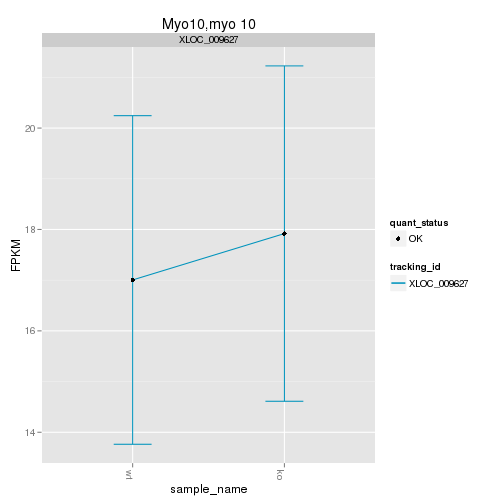   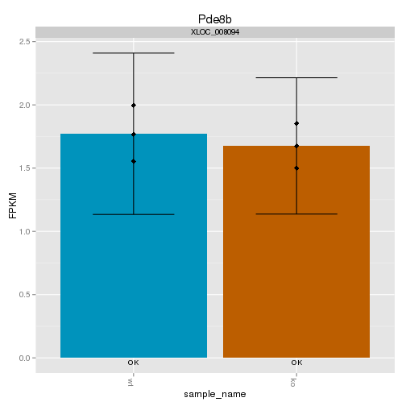 


## Digital Genotyping (LacZ vs Endogenous lncRNA and Sex)

```
## Scale for 'colour' is already present. Adding another scale for 'colour', which will replace the existing scale.
## ymax not defined: adjusting position using y instead
```

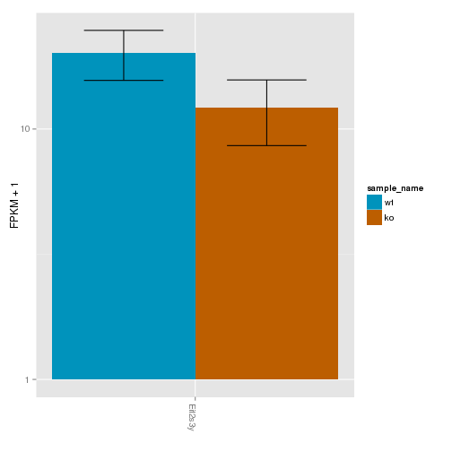 

```
## Scale for 'colour' is already present. Adding another scale for 'colour', which will replace the existing scale.
## ymax not defined: adjusting position using y instead
```

 


# Differential Analysis

## Differential Genes 


There are 95 significantly differentially expressed genes. They are:


```
## Error: no applicable method for 'xtable' applied to an object of class
## "character"
```

### Matrix of gene significant differences between conditions
(skip for Brainmap wt-v-ko comparisons)

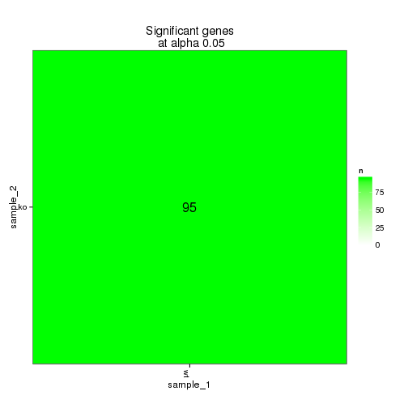 

### Replicate Clustering by significant genes 

```
## Using tracking_id, rep_name as id variables
```

 

```
## 'dendrogram' with 2 branches and 6 members total, at height 0.2567
```

### Significant gene expression differences between conditions


```
## Using tracking_id, rep_name as id variables
## No id variables; using all as measure variables
```

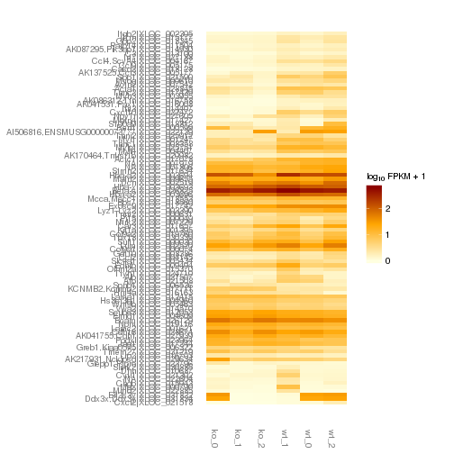 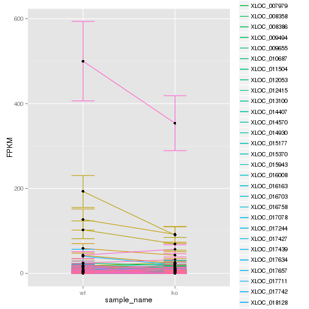 

```
## Scale for 'colour' is already present. Adding another scale for 'colour', which will replace the existing scale.
## ymax not defined: adjusting position using y instead
```

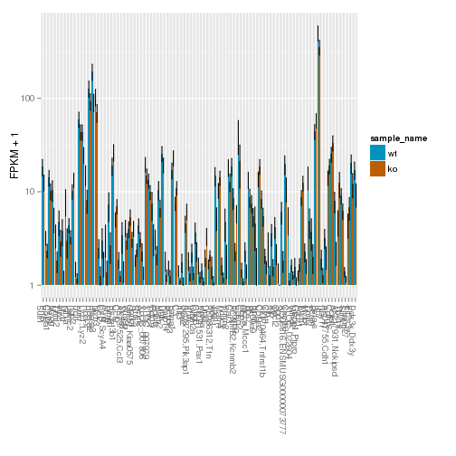 

An individual look at each of the significantly differentially regulated genes:

 


### Expression-level significance relationship

**Interesting comments n stuff!**


```
## Using tracking_id, sample_name as id variables
```

 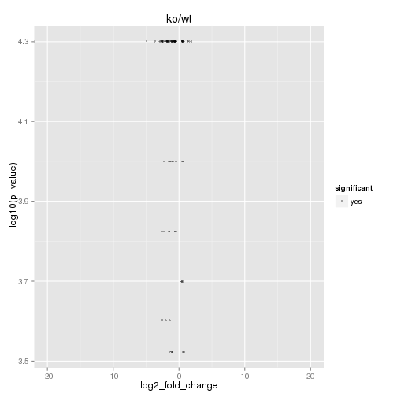 

## Differential Splicing

### Differential Isoforms between conditions
Per isoform difference between conditions:
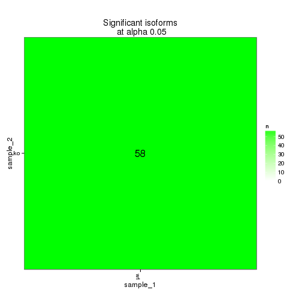 

These isoforms are:

```
## Error: no applicable method for 'xtable' applied to an object of class
## "character"
```


```
## Using tracking_id, sample_name as id variables
## No id variables; using all as measure variables
```

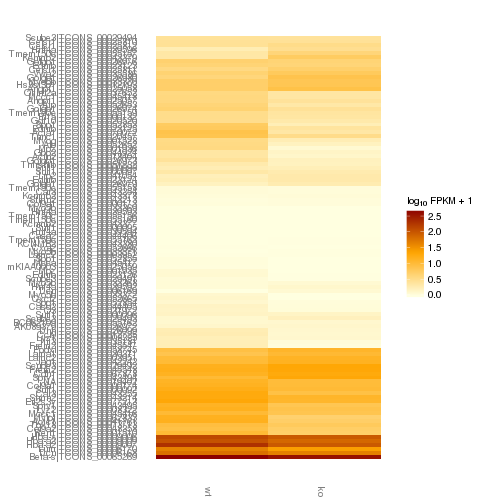 

### Differential Splicing between conditions

Per condition differences in isoforms (Does gene have diff piechart between conditions?)


```
## Error: no slot of name "tables" for this object of class "CuffDist"
```

These genes are:
<!-- html table generated in R 3.0.2 by xtable 1.7-3 package -->
<!-- Fri Jun 13 15:18:22 2014 -->
<TABLE border=1>
<TR> <TH>  </TH> <TH> spliceAnnot$gene_short_name </TH>  </TR>
  <TR> <TD align="right"> 1 </TD> <TD> Cisk,Sgk3 </TD> </TR>
  <TR> <TD align="right"> 2 </TD> <TD> Terf1 </TD> </TR>
  <TR> <TD align="right"> 3 </TD> <TD> Timeless </TD> </TR>
  <TR> <TD align="right"> 4 </TD> <TD> Foxo3 </TD> </TR>
  <TR> <TD align="right"> 5 </TD> <TD> Myo10,myo 10 </TD> </TR>
  <TR> <TD align="right"> 6 </TD> <TD> NSR1,Scarf2 </TD> </TR>
  <TR> <TD align="right"> 7 </TD> <TD> Spry1 </TD> </TR>
  <TR> <TD align="right"> 8 </TD> <TD> Oasl1 </TD> </TR>
   </TABLE>

Splicing heatmap by isoform:

```
## Using tracking_id, sample_name as id variables
## No id variables; using all as measure variables
```

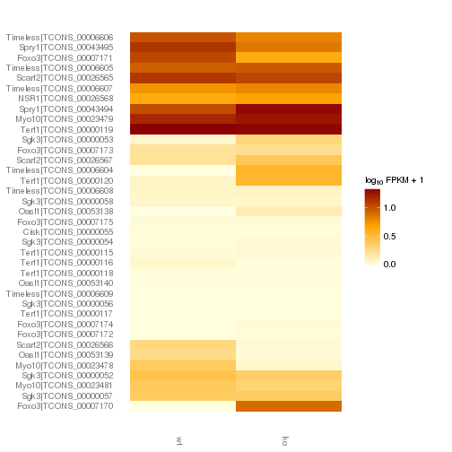 

Splicing heatmap by gene

```
## Using tracking_id, sample_name as id variables
## No id variables; using all as measure variables
```

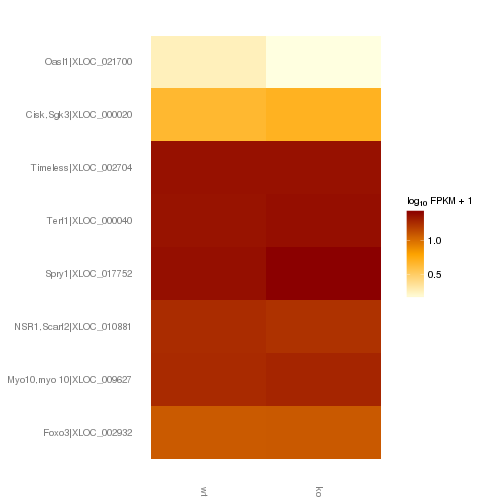 

The following are significantly differentially spliced genes (relative portion of isoform per condition): 

# how do we rescale these plots? or just axes?
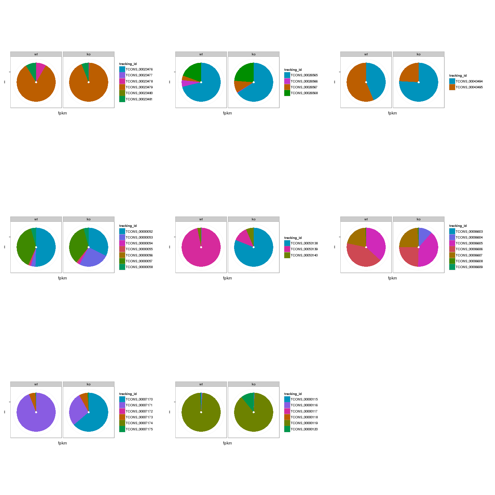 


 


# Gene/Pathway Analysis

## GSEA


```
## Error: object 'noinfinitiesx' not found
```

```
## Error: object 'x_max' not found
```

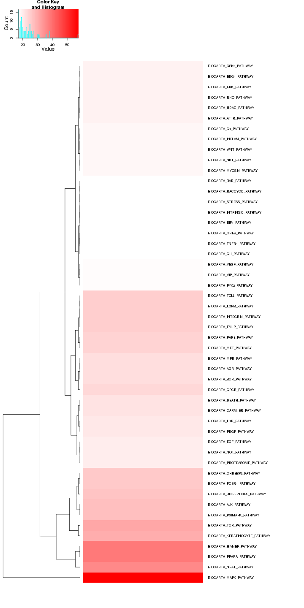 


```
## Error: object 'noinfinitiesx' not found
```

```
## Error: object 'x_max' not found
```

```
## Error: NaN dissimilarity value.
```

## GO enrichment 
Cluster profiler used to call enichments of significantly differentially regulated genes that map to Entrez IDs. 

Description/explanation of what's here, and justify all choices. 


biomart to get entrez gene IDS
clusterProfiler does GO enrichment 

BP, MF, CC
enrichKEGG
enrichPathway


```
## Loading required package: biomaRt
## 
## Attaching package: 'biomaRt'
## 
## The following object is masked from 'package:cummeRbund':
## 
##     getGene
```


```
## [1] "ERROR: The estimated pi0 <= 0. Check that you have valid p-values or use another lambda method."
```

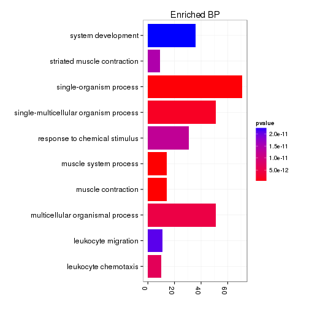 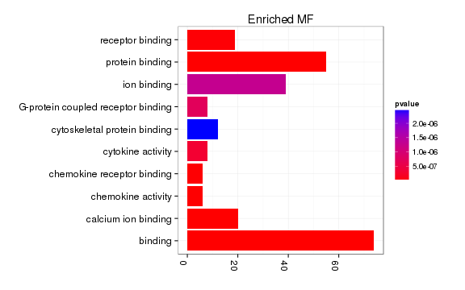 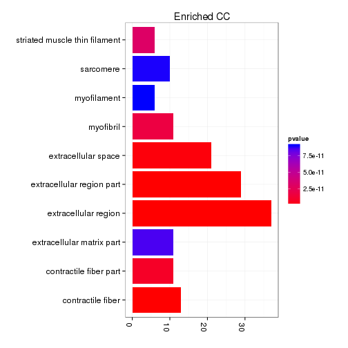 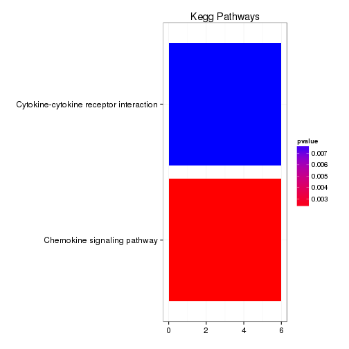 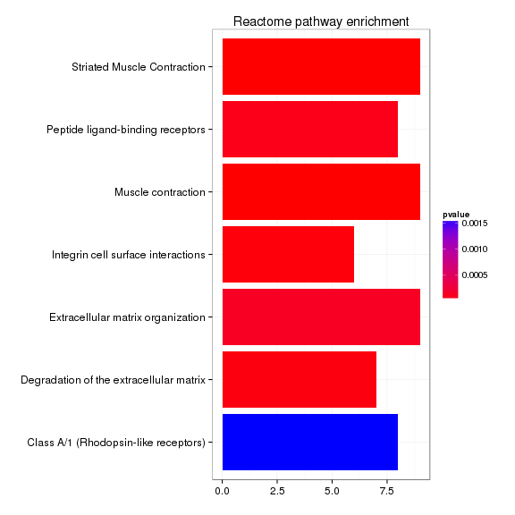 


# Cis vs Trans (locally)


# Interesting Genes
Hand pick these after initial round of analysis?

# Notes

# Session Info

```
## R version 3.0.2 (2013-09-25)
## Platform: x86_64-unknown-linux-gnu (64-bit)
## 
## locale:
##  [1] LC_CTYPE=en_US.UTF-8       LC_NUMERIC=C              
##  [3] LC_TIME=en_US.UTF-8        LC_COLLATE=en_US.UTF-8    
##  [5] LC_MONETARY=en_US.UTF-8    LC_MESSAGES=en_US.UTF-8   
##  [7] LC_PAPER=en_US.UTF-8       LC_NAME=C                 
##  [9] LC_ADDRESS=C               LC_TELEPHONE=C            
## [11] LC_MEASUREMENT=en_US.UTF-8 LC_IDENTIFICATION=C       
## 
## attached base packages:
## [1] grid      parallel  stats     graphics  grDevices utils     datasets 
## [8] methods   base     
## 
## other attached packages:
##  [1] VennDiagram_1.6.5      ReactomePA_1.6.1       org.Mm.eg.db_2.10.1   
##  [4] GO.db_2.10.1           DOSE_2.0.0             clusterProfiler_1.13.1
##  [7] AnnotationDbi_1.24.0   Biobase_2.22.0         mgcv_1.7-29           
## [10] nlme_3.1-117           gridExtra_0.9.1        gtable_0.1.2          
## [13] marray_1.40.0          gplots_2.13.0          GSA_1.03              
## [16] limma_3.18.13          xtable_1.7-3           cummeRbund_2.7.2      
## [19] Gviz_1.6.0             rtracklayer_1.22.7     GenomicRanges_1.14.4  
## [22] XVector_0.2.0          IRanges_1.20.7         fastcluster_1.1.13    
## [25] reshape2_1.4           ggplot2_1.0.0          RSQLite_0.11.4        
## [28] DBI_0.2-7              BiocGenerics_0.8.0     knitr_1.6             
## 
## loaded via a namespace (and not attached):
##  [1] biomaRt_2.18.0         Biostrings_2.30.1      biovizBase_1.10.8     
##  [4] bitops_1.0-6           BSgenome_1.30.0        caTools_1.17          
##  [7] cluster_1.15.2         codetools_0.2-8        colorspace_1.2-4      
## [10] dichromat_2.0-0        digest_0.6.4           DO.db_2.7             
## [13] evaluate_0.5.5         formatR_0.10           Formula_1.1-1         
## [16] gdata_2.13.3           GenomicFeatures_1.14.5 GOSemSim_1.20.3       
## [19] graph_1.40.1           graphite_1.8.1         gtools_3.4.1          
## [22] Hmisc_3.14-4           igraph_0.7.1           KEGG.db_2.10.1        
## [25] KernSmooth_2.23-12     labeling_0.2           lattice_0.20-29       
## [28] latticeExtra_0.6-26    markdown_0.7           MASS_7.3-33           
## [31] Matrix_1.1-3           mime_0.1.1             munsell_0.4.2         
## [34] org.Hs.eg.db_2.10.1    plyr_1.8.1             proto_0.3-10          
## [37] qvalue_1.36.0          RColorBrewer_1.0-5     Rcpp_0.11.1           
## [40] RCurl_1.95-4.1         reactome.db_1.46.1     Rsamtools_1.14.3      
## [43] scales_0.2.4           splines_3.0.2          stats4_3.0.2          
## [46] stringr_0.6.2          survival_2.37-7        tcltk_3.0.2           
## [49] tools_3.0.2            XML_3.98-1.1           zlibbioc_1.8.0
```

#Run Info

```
##           param
## 1      cmd_line
## 2       version
## 3  SVN_revision
## 4 boost_version
##                                                                                                                                                                                                                                                                                                                                                                                                                                                                                                                                                                                                                                                                                                                                                                                                                                                                                                                                                        value
## 1 cuffdiff -p 8 -o /n/rinn_data1/users/agroff/seq/PERIL/data/diffs/cuffdiff_v221_newgtf/Kidney -L wt,ko /n/rinn_data1/users/agroff/annotation/mm9/ucsc_no_noncoding_AND_lincdb2.gtf /n/rinn_data1/users/agroff/seq/PERIL/data/bams/Sample_JR722_Peril_L43_E14-5_kidney_both_lobeswtM1_ACTGAT/accepted_hits.bam,/n/rinn_data1/users/agroff/seq/PERIL/data/bams/Sample_JR723_Peril_L43_E14-5_kidney_both_lobes_wtf3_AGTCAA/accepted_hits.bam,/n/rinn_data1/users/agroff/seq/PERIL/data/bams/Sample_JR725_Peril_L43_E14-5_kidney_both_lobes_wtm8_ATGTCA/accepted_hits.bam /n/rinn_data1/users/agroff/seq/PERIL/data/bams/Sample_JR724_Peril_L43_E14-5_kidney_both_lobes_kom7_AGTTCC/accepted_hits.bam,/n/rinn_data1/users/agroff/seq/PERIL/data/bams/Sample_JR726_Peril_L43_E14-5_kidney_both_lobes_kof9_CCGTCC/accepted_hits.bam,/n/rinn_data1/users/agroff/seq/PERIL/data/bams/Sample_JR727_Peril_L43_E14-5_kidney_both_lobes_kof10_ATTCCT/accepted_hits.bam 
## 2                                                                                                                                                                                                                                                                                                                                                                                                                                                                                                                                                                                                                                                                                                                                                                                                                                                                                                                                                      2.2.1
## 3                                                                                                                                                                                                                                                                                                                                                                                                                                                                                                                                                                                                                                                                                                                                                                                                                                                                                                                                                       4237
## 4                                                                                                                                                                                                                                                                                                                                                                                                                                                                                                                                                                                                                                                                                                                                                                                                                                                                                                                                                     104700
```
