peril_wholebrain KO vs WT (Embryonic)
======================================

# questions
- overdispersion
- get tables to work
- counts


# Intialize


# Design Overview

This file shows the wt-v-ko comparison for peril_wholebrain. 

Samples used are:

```r
samples
```

```
##                                                                           9
## c......n....rinn_data1....users....agroff....seq....PERIL....data...   bams
## c......n....rinn_data1....users....agroff....seq....PERIL....data....1 bams
## c......n....rinn_data1....users....agroff....seq....PERIL....data....2 bams
## c......n....rinn_data1....users....agroff....seq....PERIL....data....3 bams
## c......n....rinn_data1....users....agroff....seq....PERIL....data....4 bams
## c......n....rinn_data1....users....agroff....seq....PERIL....data....5 bams
```


Cuff overview:

```r
cuff
```

```
## CuffSet instance with:
## 	 2 samples
## 	 31926 genes
## 	 77340 isoforms
## 	 45508 TSS
## 	 0 CDS
## 	 31926 promoters
## 	 45508 splicing
## 	 0 relCDS
```

## Replicates (MAKE TABLES PRETTY >:| )

```r
print(xtable(replicates(cuff),type="html"))
```

```
## % latex table generated in R 3.0.2 by xtable 1.7-3 package
## % Fri Jun 13 00:29:17 2014
## \begin{table}[ht]
## \centering
## \begin{tabular}{rllrlrrrr}
##   \hline
##  & file & sample\_name & replicate & rep\_name & total\_mass & norm\_mass & internal\_scale & external\_scale \\ 
##   \hline
## 1 & /n/rinn\_data1/users/agroff/seq/PERIL/data/bams/Sample\_JR716\_Peril\_L43\_E14-5\_whole\_brain\_wtM1\_CAGATC/accepted\_hits.bam & wt &   0 & wt\_0 & 28383700.00 & 25891500.00 & 1.09 & 1.00 \\ 
##   2 & /n/rinn\_data1/users/agroff/seq/PERIL/data/bams/Sample\_JR717\_Peril\_L43\_E14-5\_whole\_brain\_wtF3\_ACTTGA/accepted\_hits.bam & wt &   1 & wt\_1 & 27709200.00 & 25891500.00 & 1.08 & 1.00 \\ 
##   3 & /n/rinn\_data1/users/agroff/seq/PERIL/data/bams/Sample\_JR719\_Peril\_L43\_E14-5\_whole\_brain\_wtM8\_TAGCTT/accepted\_hits.bam & wt &   2 & wt\_2 & 24704700.00 & 25891500.00 & 0.94 & 1.00 \\ 
##   4 & /n/rinn\_data1/users/agroff/seq/PERIL/data/bams/Sample\_JR718\_Peril\_L43\_E14-5\_whole\_brain\_koM4\_GATCAG/accepted\_hits.bam & ko &   0 & ko\_0 & 30022300.00 & 25891500.00 & 1.17 & 1.00 \\ 
##   5 & /n/rinn\_data1/users/agroff/seq/PERIL/data/bams/Sample\_JR720\_Peril\_L43\_E14-5\_whole\_brain\_koF9\_GGCTAC/accepted\_hits.bam & ko &   1 & ko\_1 & 21295400.00 & 25891500.00 & 0.82 & 1.00 \\ 
##   6 & /n/rinn\_data1/users/agroff/seq/PERIL/data/bams/Sample\_JR721\_Peril\_L43\_E14-5\_whole\_brain\_koF10\_CTTGTA/accepted\_hits.bam & ko &   2 & ko\_2 & 24554000.00 & 25891500.00 & 0.95 & 1.00 \\ 
##    \hline
## \end{tabular}
## \end{table}
```

# QC

## Dispersion

This shows count (WHAT IS COUNT? fragment counts? per gene?) vs dispersion (of those counts), or the spread in measurements for a particular gene across replicates. 

from cummerbund manual: Overdispersion is a common problem in RNA-Seq data. As of cufflinks v2.0 mean counts, variance, and dispersion are all emitted, allowing you to visualize the estimated overdispersion for each sample as a quality control measure. - See more at: http://compbio.mit.edu/cummeRbund/manual_2_0.html#sthash.9YRYxwRV.dpuf


```r
dispersionPlot(genes(cuff))
```

 

## Cross-replicate variability (fpkmSCVplot)
The squared coefficient of variation is a normalized measure of cross replicate variability that can be useful for evaluating the quality your RNA-seq data. Differences in CV 2 can result in lower numbers of differentially expressed genes due to a higher degree of variability between replicate fpkm estimates.


```r
fpkmSCVPlot(genes(cuff))
```

```
## Scale for 'x' is already present. Adding another scale for 'x', which will replace the existing scale.
## geom_smooth: method="auto" and size of largest group is >=1000, so using gam with formula: y ~ s(x, bs = "cs"). Use 'method = x' to change the smoothing method.
```

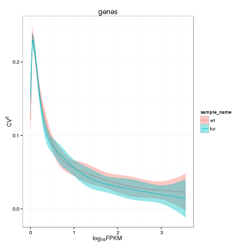 

```r
fpkmSCVPlot(isoforms(cuff))
```

```
## Scale for 'x' is already present. Adding another scale for 'x', which will replace the existing scale.
## geom_smooth: method="auto" and size of largest group is >=1000, so using gam with formula: y ~ s(x, bs = "cs"). Use 'method = x' to change the smoothing method.
```

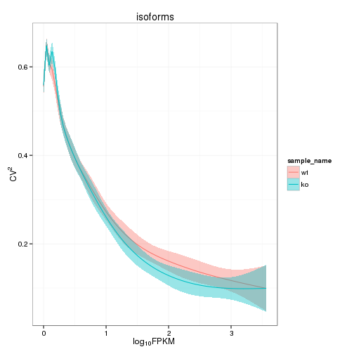 

## Volcano

```r
csVolcano(genes(cuff),"wt","ko")
```

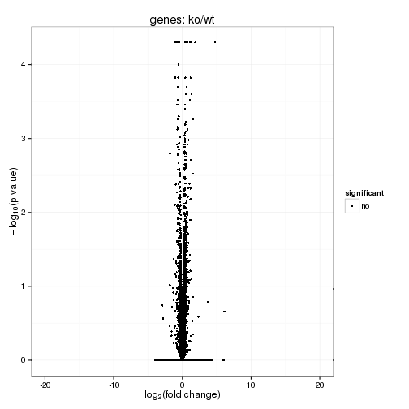 

### Volcano matrix (replicates)

```r
csVolcanoMatrix(genes(cuff),replicates=T)
```

 

## MvA plot

```r
MAplot(genes(cuff),"wt","ko")
```

```
## Warning: Removed 7410 rows containing missing values (geom_point).
```

 
   
### MvA plot counts

```r
MAplot(genes(cuff),"wt","ko",useCount=T)
```

```
## Warning: Removed 7410 rows containing missing values (geom_point).
```

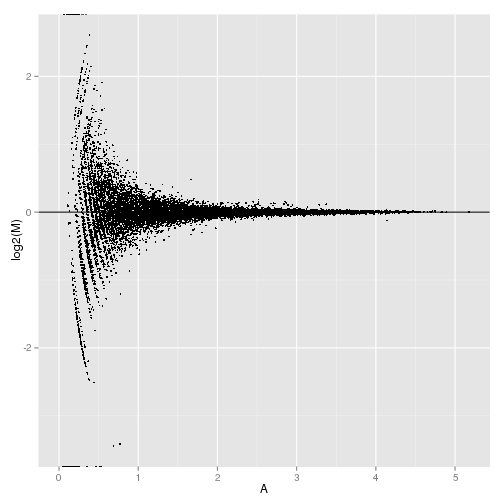 

## Scatterplot

```r
csScatterMatrix(genes(cuff))
```

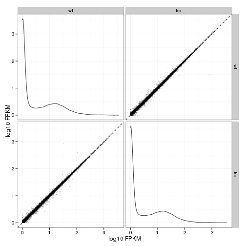 

### Scatter matrix (replicates)

```r
csScatterMatrix(genes(cuff),replicates=T)
```

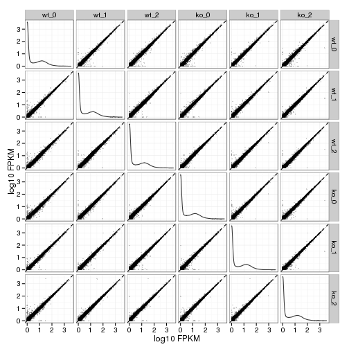 


## Distributions

### Boxplot

```r
csBoxplot(genes(cuff))
```

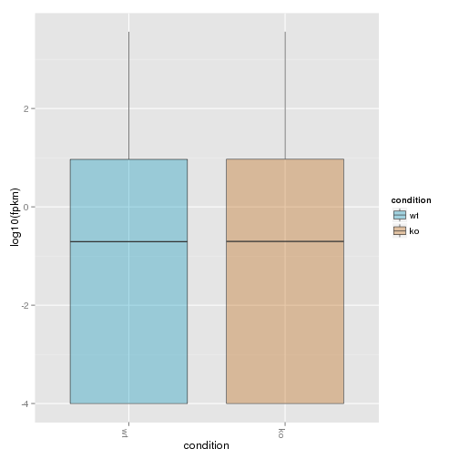 

```r
csBoxplot(genes(cuff),replicates=T)
```

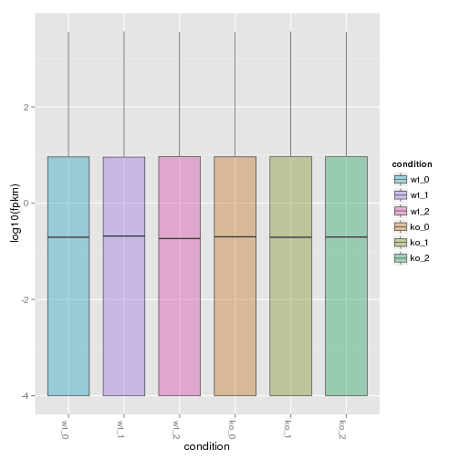 

```r
csBoxplot(isoforms(cuff))
```

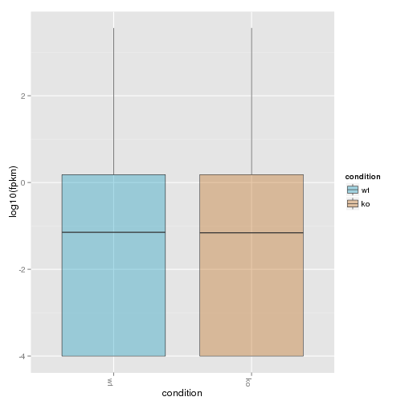 

### Density

```r
csDensity(genes(cuff))
```

```
## Warning: Removed 8487 rows containing non-finite values (stat_density).
## Warning: Removed 8646 rows containing non-finite values (stat_density).
```

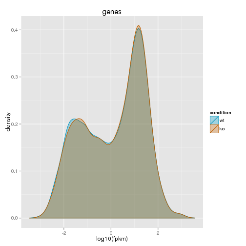 

```r
csDensity(genes(cuff),replicates=T)
```

```
## Warning: Removed 10396 rows containing non-finite values (stat_density).
## Warning: Removed 10329 rows containing non-finite values (stat_density).
## Warning: Removed 10816 rows containing non-finite values (stat_density).
## Warning: Removed 10341 rows containing non-finite values (stat_density).
## Warning: Removed 10985 rows containing non-finite values (stat_density).
## Warning: Removed 10732 rows containing non-finite values (stat_density).
```

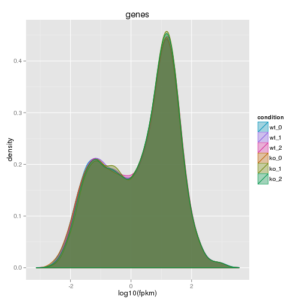 


## Clustering

### Replicate Clusters

```r
csDendro(genes(cuff),replicates=T)
```

 

```
## 'dendrogram' with 2 branches and 6 members total, at height 0.06655
```

### PCA

```r
PCAplot(genes(cuff),"PC2","PC3", replicates=T)
```

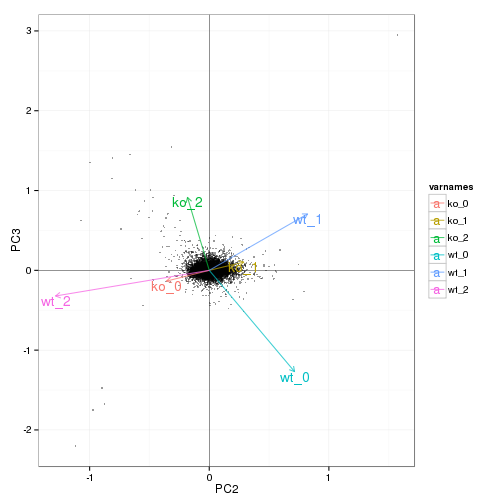 

### MDS 

```r
MDSplot(genes(cuff),replicates=T)
```

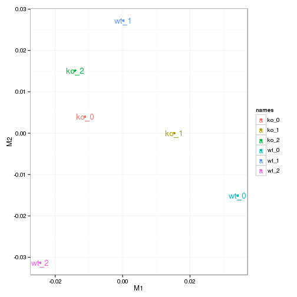 

### Distance Heat Map (?not sure it goes here..)

```r
csDistHeat(genes(cuff), replicates=T)
```

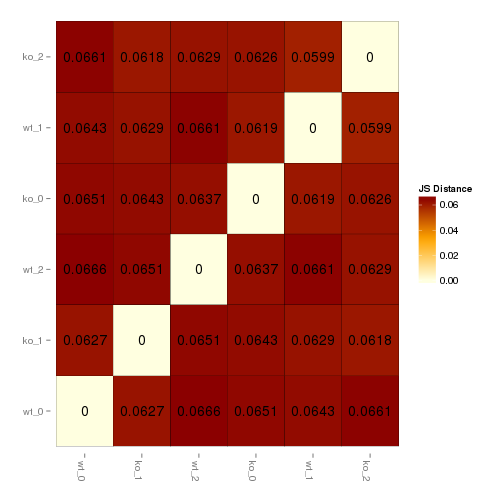 


# KO assessment

## Endogenous lncRNA expression

```r
myGeneID<-LINCRNA
myGene<-getGene(cuff, myGeneID)
```

```
## Error: invalid class "CuffGene" object: FALSE
```

```r
print(xtable(fpkm(myGene)),type="html")
```

<!-- html table generated in R 3.0.2 by xtable 1.7-3 package -->
<!-- Fri Jun 13 00:32:35 2014 -->
<TABLE border=1>
<TR> <TH>  </TH> <TH> gene_id </TH> <TH> sample_name </TH> <TH> fpkm </TH> <TH> conf_hi </TH> <TH> conf_lo </TH> <TH> quant_status </TH>  </TR>
  <TR> <TD align="right"> 1 </TD> <TD> XLOC_009627 </TD> <TD> ko </TD> <TD align="right"> 17.92 </TD> <TD align="right"> 21.23 </TD> <TD align="right"> 14.61 </TD> <TD> OK </TD> </TR>
  <TR> <TD align="right"> 2 </TD> <TD> XLOC_009627 </TD> <TD> wt </TD> <TD align="right"> 17.00 </TD> <TD align="right"> 20.25 </TD> <TD align="right"> 13.76 </TD> <TD> OK </TD> </TR>
   </TABLE>

```r
print(xtable(fpkm(isoforms(myGene))), type="html")
```

<!-- html table generated in R 3.0.2 by xtable 1.7-3 package -->
<!-- Fri Jun 13 00:32:35 2014 -->
<TABLE border=1>
<TR> <TH>  </TH> <TH> isoform_id </TH> <TH> sample_name </TH> <TH> fpkm </TH> <TH> conf_hi </TH> <TH> conf_lo </TH> <TH> quant_status </TH>  </TR>
  <TR> <TD align="right"> 1 </TD> <TD> TCONS_00023476 </TD> <TD> ko </TD> <TD align="right"> 0.00 </TD> <TD align="right"> 0.09 </TD> <TD align="right"> 0.00 </TD> <TD> OK </TD> </TR>
  <TR> <TD align="right"> 2 </TD> <TD> TCONS_00023477 </TD> <TD> ko </TD> <TD align="right"> 0.00 </TD> <TD align="right"> 0.03 </TD> <TD align="right"> 0.00 </TD> <TD> OK </TD> </TR>
  <TR> <TD align="right"> 3 </TD> <TD> TCONS_00023478 </TD> <TD> ko </TD> <TD align="right"> 0.12 </TD> <TD align="right"> 0.55 </TD> <TD align="right"> 0.00 </TD> <TD> OK </TD> </TR>
  <TR> <TD align="right"> 4 </TD> <TD> TCONS_00023479 </TD> <TD> ko </TD> <TD align="right"> 16.72 </TD> <TD align="right"> 20.06 </TD> <TD align="right"> 13.39 </TD> <TD> OK </TD> </TR>
  <TR> <TD align="right"> 5 </TD> <TD> TCONS_00023480 </TD> <TD> ko </TD> <TD align="right"> 0.00 </TD> <TD align="right"> 0.15 </TD> <TD align="right"> 0.00 </TD> <TD> OK </TD> </TR>
  <TR> <TD align="right"> 6 </TD> <TD> TCONS_00023481 </TD> <TD> ko </TD> <TD align="right"> 1.08 </TD> <TD align="right"> 3.09 </TD> <TD align="right"> 0.00 </TD> <TD> OK </TD> </TR>
  <TR> <TD align="right"> 7 </TD> <TD> TCONS_00023476 </TD> <TD> wt </TD> <TD align="right"> 0.00 </TD> <TD align="right"> 0.09 </TD> <TD align="right"> 0.00 </TD> <TD> OK </TD> </TR>
  <TR> <TD align="right"> 8 </TD> <TD> TCONS_00023477 </TD> <TD> wt </TD> <TD align="right"> 0.00 </TD> <TD align="right"> 0.03 </TD> <TD align="right"> 0.00 </TD> <TD> OK </TD> </TR>
  <TR> <TD align="right"> 9 </TD> <TD> TCONS_00023478 </TD> <TD> wt </TD> <TD align="right"> 1.42 </TD> <TD align="right"> 2.87 </TD> <TD align="right"> 0.00 </TD> <TD> OK </TD> </TR>
  <TR> <TD align="right"> 10 </TD> <TD> TCONS_00023479 </TD> <TD> wt </TD> <TD align="right"> 14.09 </TD> <TD align="right"> 17.67 </TD> <TD align="right"> 10.51 </TD> <TD> OK </TD> </TR>
  <TR> <TD align="right"> 11 </TD> <TD> TCONS_00023480 </TD> <TD> wt </TD> <TD align="right"> 0.00 </TD> <TD align="right"> 0.15 </TD> <TD align="right"> 0.00 </TD> <TD> OK </TD> </TR>
  <TR> <TD align="right"> 12 </TD> <TD> TCONS_00023481 </TD> <TD> wt </TD> <TD align="right"> 1.49 </TD> <TD align="right"> 5.09 </TD> <TD align="right"> 0.00 </TD> <TD> OK </TD> </TR>
   </TABLE>

```r
expressionPlot(myGene)
```

 

```r
expressionPlot(myGene, replicates=TRUE)
```

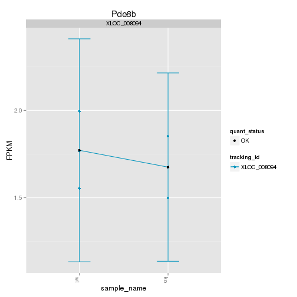 

```r
expressionPlot(isoforms(myGene))
```

 

```r
expressionPlot(isoforms(myGene), replicates=T)
```

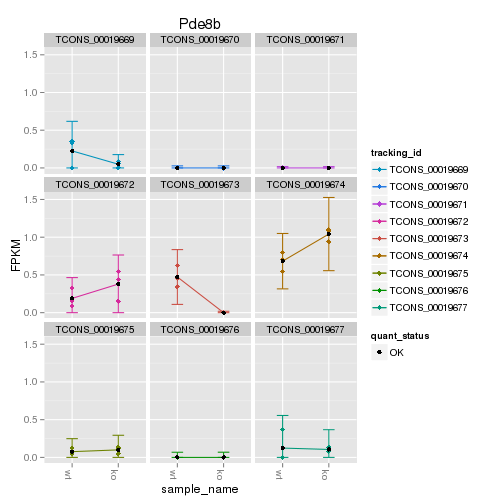 

```r
expressionBarplot(myGene)
```

 

```r
expressionBarplot(myGene,replicates=T)
```

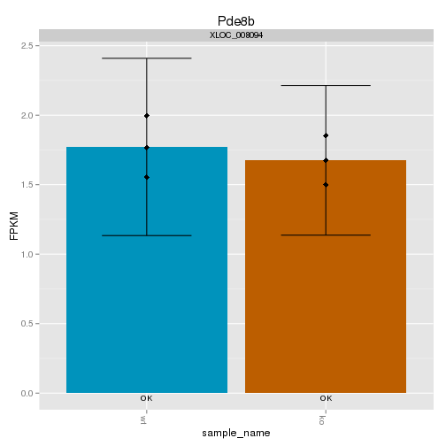 

```r
expressionBarplot(isoforms(myGene))     
```

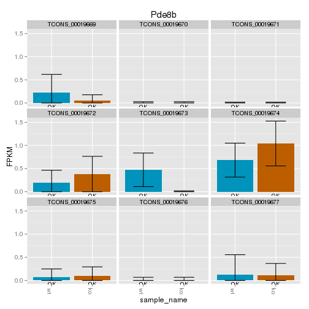 

```r
expressionBarplot(isoforms(myGene), replicates=T)
```

 


## LacZ expression

```r
myGeneID<-LacZ
```

```
## Error: object 'LacZ' not found
```

```r
myGene<-getGene(cuff, myGeneId)
```

```
## Error: object 'myGeneId' not found
```

```r
print(xtable(fpkm(myGene)),type="html")
```

<!-- html table generated in R 3.0.2 by xtable 1.7-3 package -->
<!-- Fri Jun 13 00:32:45 2014 -->
<TABLE border=1>
<TR> <TH>  </TH> <TH> gene_id </TH> <TH> sample_name </TH> <TH> fpkm </TH> <TH> conf_hi </TH> <TH> conf_lo </TH> <TH> quant_status </TH>  </TR>
  <TR> <TD align="right"> 1 </TD> <TD> XLOC_009627 </TD> <TD> ko </TD> <TD align="right"> 17.92 </TD> <TD align="right"> 21.23 </TD> <TD align="right"> 14.61 </TD> <TD> OK </TD> </TR>
  <TR> <TD align="right"> 2 </TD> <TD> XLOC_009627 </TD> <TD> wt </TD> <TD align="right"> 17.00 </TD> <TD align="right"> 20.25 </TD> <TD align="right"> 13.76 </TD> <TD> OK </TD> </TR>
   </TABLE>

```r
expressionPlot(myGene)
```

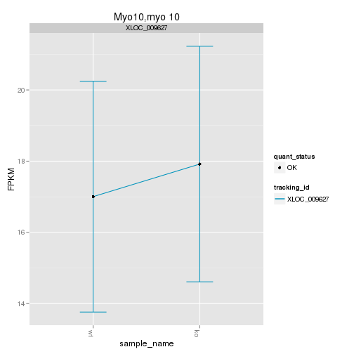 

```r
expressionPlot(myGene, replicates=TRUE)
```

 

```r
expressionBarplot(myGene)
```

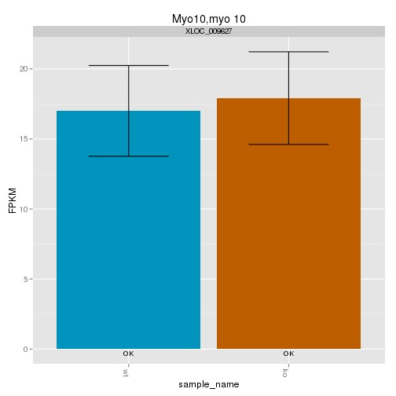 

```r
expressionBarplot(myGene,replicates=T)
```

 


## Digital Genotyping (LacZ vs Endogenous lncRNA and Sex)

```r
genotypingGeneIDs<-c(LINCRNA,"LacZ","Eif2s3y")
genotypingGenes<-getGenes(cuff,genotypingGeneIDs)
       
expressionBarplot(genotypingGenes)
```

```
## Scale for 'colour' is already present. Adding another scale for 'colour', which will replace the existing scale.
## ymax not defined: adjusting position using y instead
```

 

```r
expressionBarplot(genotypingGenes,replicates=T)
```

```
## Scale for 'colour' is already present. Adding another scale for 'colour', which will replace the existing scale.
## ymax not defined: adjusting position using y instead
```

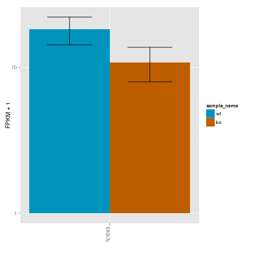 


# Differential Analysis

## Differential Genes 


```r
sig<-getSig(cuff,alpha=alpha)       
sigGenes<-getGenes(cuff,sig)
geneAnnot<-annotation(sigGenes)
```

There are 24 significantly differentially expressed genes. They are:


```r
print(xtable(geneAnnot$gene_short_name),type="html")
```

```
## Error: no applicable method for 'xtable' applied to an object of class
## "character"
```

### Matrix of gene significant differences between conditions
(skip for Brainmap wt-v-ko comparisons)


```r
sigMatrix(cuff, level="genes", alpha=alpha)
```

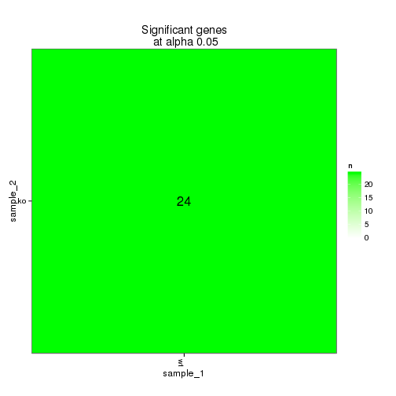 

### Replicate Clustering by significant genes 

```r
csDendro(sigGenes, replicates=T)
```

```
## Using tracking_id, rep_name as id variables
```

 

```
## 'dendrogram' with 2 branches and 6 members total, at height 0.3084
```

### Significant gene expression differences between conditions


```r
csHeatmap(sigGenes, cluster="both",replicates=T)
```

```
## Using tracking_id, rep_name as id variables
## No id variables; using all as measure variables
```

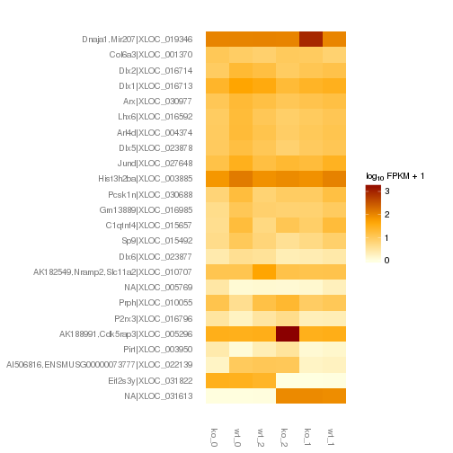 

```r
expressionPlot(sigGenes)
```

 

```r
expressionBarplot(sigGenes)
```

```
## Scale for 'colour' is already present. Adding another scale for 'colour', which will replace the existing scale.
## ymax not defined: adjusting position using y instead
```

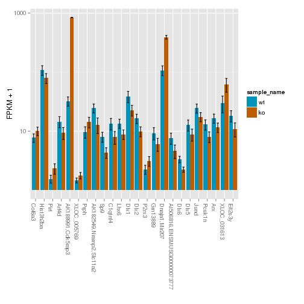 

An individual look at each of the significantly differentially regulated genes:


```r
plots<-lapply(sig,function(x){
  myGene<-getGene(cuff,x)
  return(expressionPlot(myGene,replicates=T))
  })
do.call(grid.arrange, plots)
```

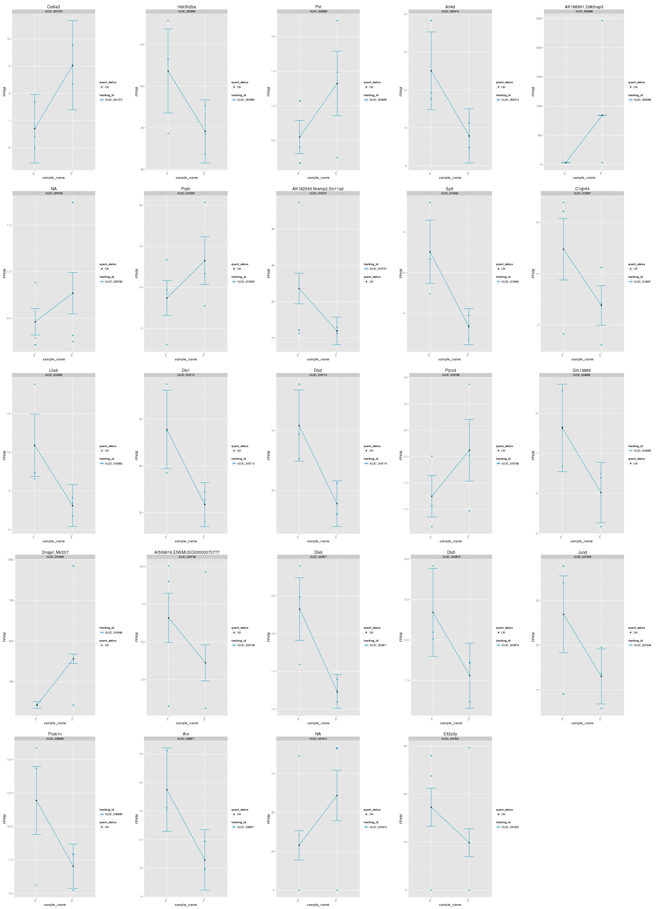 


### Expression-level significance relationship

**Interesting comments n stuff!**


```r
csScatter(sigGenes, "wt", "ko", smooth=T)
```

```
## Using tracking_id, sample_name as id variables
```

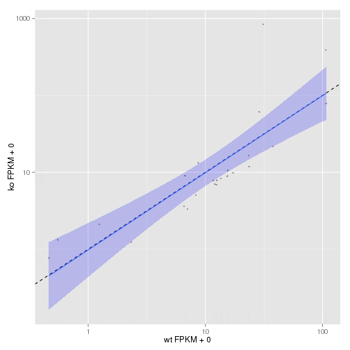 

```r
csVolcano(sigGenes, "wt", "ko")
```

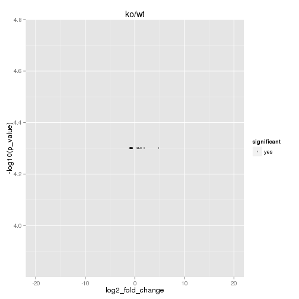 

## Differential Splicing

### Differential Isoforms between conditions
Per isoform difference between conditions:

```r
sigMatrix(cuff, level="isoforms",alpha=alpha)
```

 

```r
isoformSigIDs<-getSig(cuff,level="isoforms",alpha=alpha)
isoformSigGenes<-getGenes(cuff,isoformSigIDs)
```

```
## Error: RS-DBI driver: (error in statement: near ")": syntax error)
```

```r
isoAnnot<-annotation(isoformSigGenes)
```

These isoforms are:

```r
print(xtable(isoAnnot$gene_short_name),type="html")
```

```
## Error: no applicable method for 'xtable' applied to an object of class
## "character"
```


```r
csHeatmap(isoforms(isoformSigGenes),cluster='row',method=dist)
```

```
## Using tracking_id, sample_name as id variables
## No id variables; using all as measure variables
```

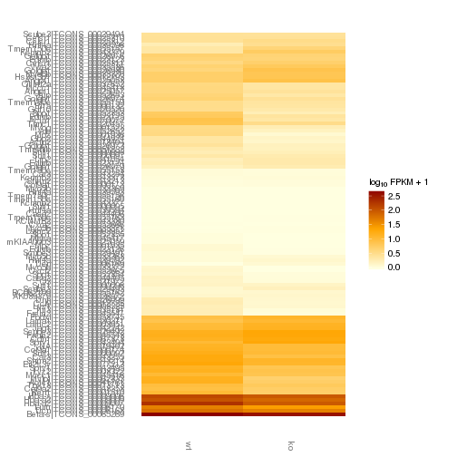 

### Differential Splicing between conditions

Per condition differences in isoforms (Does gene have diff piechart between conditions?)


```r
splicingSigIDs<-getSig(cuff,level="splicing",alpha=alpha)
splicingSigGenes<-getGenes(cuff,splicingSigIDs)

sigMatrix(cuff, level='splicing', alpha=alpha)
```

```
## Error: no slot of name "tables" for this object of class "CuffDist"
```

```r
spliceAnnot<-annotation(splicingSigGenes)
```

These genes are:

```r
print(xtable(as.data.frame(spliceAnnot$gene_short_name)), type="html")
```

<!-- html table generated in R 3.0.2 by xtable 1.7-3 package -->
<!-- Fri Jun 13 00:35:11 2014 -->
<TABLE border=1>
<TR> <TH>  </TH> <TH> spliceAnnot$gene_short_name </TH>  </TR>
  <TR> <TD align="right"> 1 </TD> <TD> Satb2 </TD> </TR>
  <TR> <TD align="right"> 2 </TD> <TD> Tmem104 </TD> </TR>
  <TR> <TD align="right"> 3 </TD> <TD> Pol mu,Polm </TD> </TR>
  <TR> <TD align="right"> 4 </TD> <TD> Rnf112 </TD> </TR>
  <TR> <TD align="right"> 5 </TD> <TD> Pde8b </TD> </TR>
  <TR> <TD align="right"> 6 </TD> <TD> Pxk </TD> </TR>
  <TR> <TD align="right"> 7 </TD> <TD> Nfatc4 </TD> </TR>
  <TR> <TD align="right"> 8 </TD> <TD> Scrib </TD> </TR>
  <TR> <TD align="right"> 9 </TD> <TD> Gnb1l,Wdvcf </TD> </TR>
  <TR> <TD align="right"> 10 </TD> <TD> Ephb3 </TD> </TR>
  <TR> <TD align="right"> 11 </TD> <TD> Kank1 </TD> </TR>
  <TR> <TD align="right"> 12 </TD> <TD> Ralgds,mKIAA1308 </TD> </TR>
  <TR> <TD align="right"> 13 </TD> <TD> Lrp1b </TD> </TR>
  <TR> <TD align="right"> 14 </TD> <TD> Dpp4 </TD> </TR>
  <TR> <TD align="right"> 15 </TD> <TD> EG381438,Gm5148 </TD> </TR>
  <TR> <TD align="right"> 16 </TD> <TD> Dnaja1,Mir207 </TD> </TR>
  <TR> <TD align="right"> 17 </TD> <TD> Col27a1,mKIAA1870 </TD> </TR>
  <TR> <TD align="right"> 18 </TD> <TD> 0610037D15Rik,Ccdc163 </TD> </TR>
  <TR> <TD align="right"> 19 </TD> <TD>  </TD> </TR>
  <TR> <TD align="right"> 20 </TD> <TD> Zfp420 </TD> </TR>
  <TR> <TD align="right"> 21 </TD> <TD> Arntl,bmal1b </TD> </TR>
  <TR> <TD align="right"> 22 </TD> <TD> Itgam </TD> </TR>
  <TR> <TD align="right"> 23 </TD> <TD> Vstm2b </TD> </TR>
  <TR> <TD align="right"> 24 </TD> <TD> Nup93 </TD> </TR>
  <TR> <TD align="right"> 25 </TD> <TD> Nfix </TD> </TR>
   </TABLE>


```r
#pdf("sigSplicing_heatmap.pdf",width=10,height=20)
csHeatmap(isoforms(splicingSigGenes),cluster='row',method=dist)
```

```
## Using tracking_id, sample_name as id variables
## No id variables; using all as measure variables
```

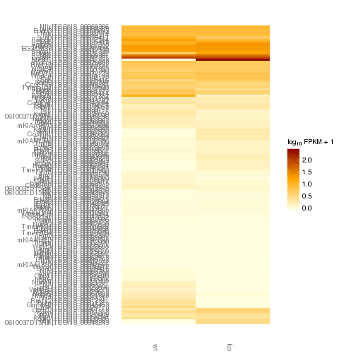 

```r
#dev.off()
```


```r
csHeatmap(splicingSigGenes,cluster='row',method=dist)
```

```
## Using tracking_id, sample_name as id variables
## No id variables; using all as measure variables
```

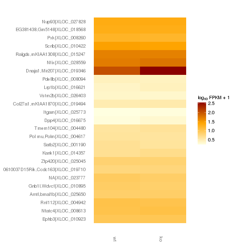 

The following are significantly differentially spliced genes (relative portion of isoform per condition): 

# how do we rescale these plots?

```r
csPiePlots<-lapply(splicingSigIDs,function(x){
  myGene<-getGene(cuff,x)
  csPie(myGene)
})
do.call(grid.arrange,csPiePlots)
```

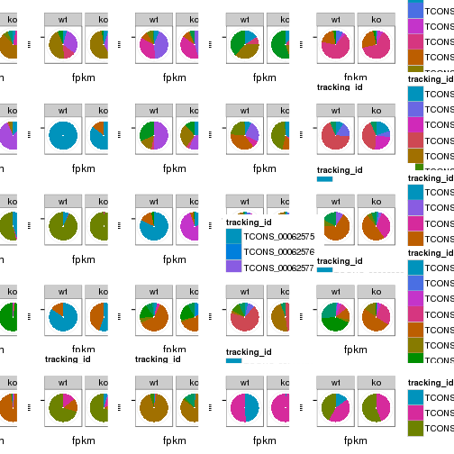 


## Differential Promoter usage (isoforms by tss) <- NOT USING IN BRAINMAP


## Differential Promoter Usage (By "Promoters") <- NOT USING IN BRAINMAP 


## Differential CDS? (unique protein coding isoforms) <-NOT IN BRAINMAP


# Gene/Pathway Analysis

## GSEA


```r
population<-genes(cuff)
population.diff<-diffData(population)
annotation<-annotation(genes(cuff))
gene_names<-merge(annotation,population.diff)

gene_set_index <- function(genelist, short_names){
  which(short_names %in% genelist)   
}

get_gene_set_p_vals <- function(input, gs, alternative){
  gene_set_indices <- lapply(gs$genesets, function(short_name){
    gene_set_index(input$short_name, short_name)
    })
  pvl<-lapply(gene_set_indices,geneSetTest,input$test_stat, alternative=alternative)
  pvl_mat<-as.data.frame(t(unlist(pvl)))
  colnames(pvl_mat) <- gs$geneset.names
   return(pvl_mat)
}
 
get_gene_set_q_vals <- function(pvl_mat, method="bonferroni"){
	comp_corrected <- matrix(p.adjust(pvl_mat, method=method), nrow=nrow(pvl_mat), ncol=ncol(pvl_mat))
	colnames(comp_corrected) <- colnames(pvl_mat)
	rownames(comp_corrected) <- rownames(pvl_mat)
	return(comp_corrected)
}

colMins<-function(x){
  apply(x,2,min)
}
rowMins<-function(x){
  apply(x,1,min)
}
 
InputCols<-maPalette(low="white",high="red",k=100)
```


```r
df.pop<-data.frame("short_name"=toupper(gene_names$gene_short_name),"test_stat"=gene_names$test_stat)
row.names(df.pop)=population.diff$gene_id
df.pop.ordered<-df.pop[order(df.pop$test_stat),]
Input.df<-df.pop.ordered

reactome_pvl_mat <- get_gene_set_p_vals(Input.df, reactome_gs,alternative="mixed")
reactome_pvl_corrected <- get_gene_set_q_vals(reactome_pvl_mat)
reactome_pvl_corrected<-rbind(reactome_pvl_corrected,reactome_pvl_corrected)


biocarta_pvl_mat <- get_gene_set_p_vals(Input.df, biocarta_gs, alternative="mixed")
biocarta_pvl_corrected <- get_gene_set_q_vals(biocarta_pvl_mat)
biocarta_pvl_corrected<-rbind(biocarta_pvl_corrected,biocarta_pvl_corrected)
```


```r
#two options, print as pdf, and adjust size in separate code block
#make minimum height and then increment scaled by number of rows to return 

x<-(-log10(t(biocarta_pvl_corrected[,which(colMins(biocarta_pvl_corrected) < 0.01)])))

labels<-strsplit(rownames(x),"_")
l<-lapply(labels,function(x){return(x[[2]])})
labels<-unlist(l)

setwd('/n/rinn_data1/users/agroff/GITHUB/BrainMap/analysis')

pdf("components_GSEA_biocarta.pdf",width=10,height=30)
heatmap.2(x, trace="none", margins=c(5,30), col=InputCols, labRow=labels,dendrogram="both",lhei =c(0.1,0.9))
dev.off()
```

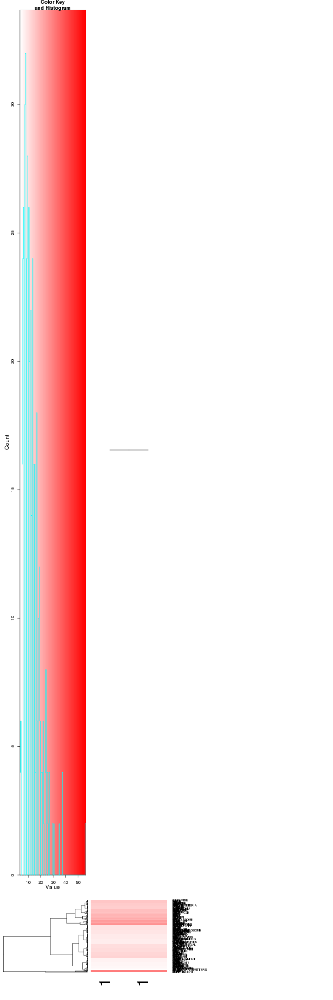 

```
## RStudioGD 
##         2
```


```r
pdf("components_GSEA_reactome.pdf",width=10,height=30)

x<-(-log10(t(reactome_pvl_corrected[,which(colMins(reactome_pvl_corrected) < 0.001)])))
noinfinitiesx<-x[which(x!="Inf")]
x_max<-max(noinfinitiesx)+100
x[x=="Inf"]<-x_max
labels<-strsplit(rownames(x),"_")
l<-lapply(labels,function(x){return(x[-1])})
labels<-as.vector(l)

heatmap.2(x, trace="none", margins=c(5,30),col=InputCols,dendrogram="both",lhei = c(0.1,0.90))
dev.off()
```

 

```
## RStudioGD 
##         2
```

## GO enrichment 
Cluster profiler used to call enichments of significantly differentially regulated genes that map to Entrez IDs. 

Description/explanation of what's here, and justify all choices. 


```r
#source("http://bioconductor.org/biocLite.R")
#biocLite("ReactomePA")

library(ReactomePA)
library(DOSE)


sigGeneIDs<-getSig(cuff, alpha=0.05)
sigGenes<-getGenes(cuff,sigGeneIDs)
geneAnnot<-annotation(sigGenes)
geneNames<-geneAnnot$gene_short_name
sigDiff<-diffData(sigGenes)
sigDiff$foldChange<-sigDiff$value_1/sigDiff$value_2


# Top genes by test stat
#diff<-diffData(genes(cuff))
#diff<-diff[order(abs(diff$test_stat),decreasing=TRUE),]
#top_genes<-diff[which(diff$p_value<0.1),]
#top_genes_annot<-merge(top_genes,population)
#geneNames<-top_genes_annot$gene_short_name
```

biomart to get entrez gene IDS
clusterProfiler does GO enrichment 

BP, MF, CC
enrichKEGG
enrichPathway


```
## Loading required package: biomaRt
## 
## Attaching package: 'biomaRt'
## 
## The following object is masked from 'package:cummeRbund':
## 
##     getGene
```


 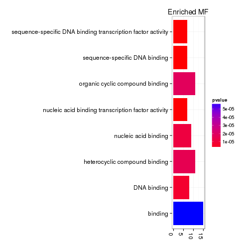 

```
## Error: 'x' and 'units' must have length > 0
```

```
## Warning: no non-missing arguments to min; returning Inf
## Warning: no non-missing arguments to max; returning -Inf
## Warning: no non-missing arguments to min; returning Inf
## Warning: no non-missing arguments to max; returning -Inf
## Warning: "showCategory" is not a graphical parameter
```

```
## Error: need finite 'xlim' values
```

 

```
## Warning: no non-missing arguments to min; returning Inf
## Warning: no non-missing arguments to max; returning -Inf
## Warning: no non-missing arguments to min; returning Inf
## Warning: no non-missing arguments to max; returning -Inf
## Warning: "showCategory" is not a graphical parameter
```

```
## Error: need finite 'xlim' values
```

# Cis vs Trans (locally)

```r
window<-1000000
```


# Interesting Genes
Hand pick these after initial round of analysis?

# Notes

# Session Info

```r
sessionInfo()
```

```
## R version 3.0.2 (2013-09-25)
## Platform: x86_64-unknown-linux-gnu (64-bit)
## 
## locale:
##  [1] LC_CTYPE=en_US.UTF-8       LC_NUMERIC=C              
##  [3] LC_TIME=en_US.UTF-8        LC_COLLATE=en_US.UTF-8    
##  [5] LC_MONETARY=en_US.UTF-8    LC_MESSAGES=en_US.UTF-8   
##  [7] LC_PAPER=en_US.UTF-8       LC_NAME=C                 
##  [9] LC_ADDRESS=C               LC_TELEPHONE=C            
## [11] LC_MEASUREMENT=en_US.UTF-8 LC_IDENTIFICATION=C       
## 
## attached base packages:
## [1] grid      parallel  stats     graphics  grDevices utils     datasets 
## [8] methods   base     
## 
## other attached packages:
##  [1] GO.db_2.10.1           org.Mm.eg.db_2.10.1    clusterProfiler_1.13.1
##  [4] DOSE_2.0.0             ReactomePA_1.6.1       AnnotationDbi_1.24.0  
##  [7] Biobase_2.22.0         VennDiagram_1.6.5      mgcv_1.7-29           
## [10] nlme_3.1-117           marray_1.40.0          gplots_2.13.0         
## [13] GSA_1.03               limma_3.18.13          xtable_1.7-3          
## [16] knitr_1.6              gridExtra_0.9.1        gtable_0.1.2          
## [19] cummeRbund_2.7.2       Gviz_1.6.0             rtracklayer_1.22.7    
## [22] GenomicRanges_1.14.4   XVector_0.2.0          IRanges_1.20.7        
## [25] fastcluster_1.1.13     reshape2_1.4           ggplot2_1.0.0         
## [28] RSQLite_0.11.4         DBI_0.2-7              BiocGenerics_0.8.0    
## 
## loaded via a namespace (and not attached):
##  [1] biomaRt_2.18.0         Biostrings_2.30.1      biovizBase_1.10.8     
##  [4] bitops_1.0-6           BSgenome_1.30.0        caTools_1.17          
##  [7] cluster_1.15.2         codetools_0.2-8        colorspace_1.2-4      
## [10] dichromat_2.0-0        digest_0.6.4           DO.db_2.7             
## [13] evaluate_0.5.5         formatR_0.10           Formula_1.1-1         
## [16] gdata_2.13.3           GenomicFeatures_1.14.5 GOSemSim_1.20.3       
## [19] graph_1.40.1           graphite_1.8.1         gtools_3.4.1          
## [22] Hmisc_3.14-4           igraph_0.7.1           KEGG.db_2.10.1        
## [25] KernSmooth_2.23-12     labeling_0.2           lattice_0.20-29       
## [28] latticeExtra_0.6-26    markdown_0.7           MASS_7.3-33           
## [31] Matrix_1.1-3           mime_0.1.1             munsell_0.4.2         
## [34] org.Hs.eg.db_2.10.1    plyr_1.8.1             proto_0.3-10          
## [37] qvalue_1.36.0          RColorBrewer_1.0-5     Rcpp_0.11.1           
## [40] RCurl_1.95-4.1         reactome.db_1.46.1     Rsamtools_1.14.3      
## [43] scales_0.2.4           splines_3.0.2          stats4_3.0.2          
## [46] stringr_0.6.2          survival_2.37-7        tcltk_3.0.2           
## [49] tools_3.0.2            XML_3.98-1.1           zlibbioc_1.8.0
```

#Run Info

```r
runInfo(cuff)
```

```
##           param
## 1      cmd_line
## 2       version
## 3  SVN_revision
## 4 boost_version
##                                                                                                                                                                                                                                                                                                                                                                                                                                                                                                                                                                                                                                                                                                                                                                                                                                                                                                                          value
## 1 cuffdiff -p 8 -o /n/rinn_data1/users/agroff/seq/PERIL/data/diffs/cuffdiff_v221_newgtf/whole_brain -L wt,ko /n/rinn_data1/users/agroff/annotation/mm9/ucsc_no_noncoding_AND_lincdb2.gtf /n/rinn_data1/users/agroff/seq/PERIL/data/bams/Sample_JR716_Peril_L43_E14-5_whole_brain_wtM1_CAGATC/accepted_hits.bam,/n/rinn_data1/users/agroff/seq/PERIL/data/bams/Sample_JR717_Peril_L43_E14-5_whole_brain_wtF3_ACTTGA/accepted_hits.bam,/n/rinn_data1/users/agroff/seq/PERIL/data/bams/Sample_JR719_Peril_L43_E14-5_whole_brain_wtM8_TAGCTT/accepted_hits.bam /n/rinn_data1/users/agroff/seq/PERIL/data/bams/Sample_JR718_Peril_L43_E14-5_whole_brain_koM4_GATCAG/accepted_hits.bam,/n/rinn_data1/users/agroff/seq/PERIL/data/bams/Sample_JR720_Peril_L43_E14-5_whole_brain_koF9_GGCTAC/accepted_hits.bam,/n/rinn_data1/users/agroff/seq/PERIL/data/bams/Sample_JR721_Peril_L43_E14-5_whole_brain_koF10_CTTGTA/accepted_hits.bam 
## 2                                                                                                                                                                                                                                                                                                                                                                                                                                                                                                                                                                                                                                                                                                                                                                                                                                                                                                                        2.2.1
## 3                                                                                                                                                                                                                                                                                                                                                                                                                                                                                                                                                                                                                                                                                                                                                                                                                                                                                                                         4237
## 4                                                                                                                                                                                                                                                                                                                                                                                                                                                                                                                                                                                                                                                                                                                                                                                                                                                                                                                       104700
```
