peril_wholebrain KO vs WT (Embryonic)
======================================


# Intialize

```
## Error: character argument expected
```

# Design Overview

This file shows the wt-v-ko comparison for peril_wholebrain. 

Samples used are:

```r
samples
```

```
## [1] NA
## <0 rows> (or 0-length row.names)
```


Cuff overview:

```r
cuff
```

```
## CuffSet instance with:
## 	 0 samples
## 	 0 genes
## 	 0 isoforms
## 	 0 TSS
## 	 0 CDS
## 	 0 promoters
## 	 0 splicing
## 	 0 relCDS
```

## Replicates

```r
print(xtable(replicates(cuff),type="html"))
```

```
## % latex table generated in R 3.0.2 by xtable 1.7-3 package
## % Wed Jun 11 20:43:21 2014
## \begin{table}[ht]
## \centering
## \begin{tabular}{rrlrlrrrr}
##   \hline
##  & file & sample\_name & replicate & rep\_name & total\_mass & norm\_mass & internal\_scale & external\_scale \\ 
##   \hline
## \hline
## \end{tabular}
## \end{table}
```

# QC

## Dispersion

```r
dispersionPlot(genes(cuff))
```

```
## Error: RS-DBI driver: (error in statement: near ")": syntax error)
```

## Cross-replicate variability (fpkmSCVplot)
The squared coefficient of variation is a normalized measure of cross replicate variability that can be useful for evaluating the quality your RNA-seq data. Differences in CV 2 can result in lower numbers of differentially expressed genes due to a higher degree of variability between replicate fpkm estimates.


```r
fpkmSCVPlot(genes(cuff))
```

```
## Error: RS-DBI driver: (error in statement: near ")": syntax error)
```

```r
fpkmSCVPlot(isoforms(cuff))
```

```
## Error: RS-DBI driver: (error in statement: near ")": syntax error)
```

## Volcano

```r
csVolcano(genes(cuff),"wt","ko")
```

```
## Error: One or more values of 'x' or 'y' are not valid sample names!
```

### Volcano matrix (replicates)

```r
csVolcanoMatrix(genes(cuff),replicates=T)
```

```
## Error: replacement has 1 row, data has 0
```

## MvA plot

```r
MAplot(genes(cuff),"wt","ko")
```

```
## Error: non-numeric argument to binary operator
```
   
### MvA plot counts

```r
MAplot(genes(cuff),"wt","ko",useCount=T)
```

```
## Error: non-numeric argument to binary operator
```

## Scatterplot

```r
csScatterMatrix(genes(cuff))
```

```
## Error: RS-DBI driver: (error in statement: near "from": syntax error)
```

### Scatter matrix (replicates)

```r
csScatterMatrix(genes(cuff),replicates=T)
```

```
## Error: RS-DBI driver: (error in statement: near "from": syntax error)
```


## Distributions

### Boxplot

```r
csBoxplot(genes(cuff))
```

```
## Error: RS-DBI driver: (error in statement: near ")": syntax error)
```

```r
csBoxplot(genes(cuff),replicates=T)
```

```
## Error: RS-DBI driver: (error in statement: near ")": syntax error)
```

```r
csBoxplot(isoforms(cuff))
```

```
## Error: RS-DBI driver: (error in statement: near ")": syntax error)
```

### Density

```r
csDensity(genes(cuff))
```

```
## Error: RS-DBI driver: (error in statement: near ")": syntax error)
```

```r
csDensity(genes(cuff),replicates=T)
```

```
## Error: RS-DBI driver: (error in statement: near ")": syntax error)
```


## Clustering

### Replicate Clusters

```r
csDendro(genes(cuff),replicates=T)
```

```
## Error: RS-DBI driver: (error in statement: near "from": syntax error)
```

### PCA

```r
PCAplot(genes(cuff),"PC2","PC3", replicates=T)
```

```
## Error: RS-DBI driver: (error in statement: near "from": syntax error)
```

### MDS 

```r
MDSplot(genes(cuff),replicates=T)
```

```
## Error: RS-DBI driver: (error in statement: near "from": syntax error)
```

### Distance Heat Map (?not sure it goes here..)

```r
csDistHeat(genes(cuff))
```

```
## Error: RS-DBI driver: (error in statement: near "from": syntax error)
```

```r
csDistHeat(genes(cuff), replicates=T)
```

```
## Error: RS-DBI driver: (error in statement: near "from": syntax error)
```


# KO assessment

```
## Error: RS-DBI driver: (error in statement: near ")": syntax error)
```

## Endogenous lncRNA expression

```r
myGeneID<-LINCRNA
myGene<-getGene(cuff, myGeneID)
```

```
## Error: RS-DBI driver: (error in statement: near ")": syntax error)
```

```r
fpkm(myGene)
```

```
## Error: error in evaluating the argument 'object' in selecting a method for function 'fpkm': Error: object 'myGene' not found
```

```r
fpkm(isoforms(myGene))
```

```
## Error: error in evaluating the argument 'object' in selecting a method for function 'fpkm': Error in isoforms(myGene) : 
##   error in evaluating the argument 'object' in selecting a method for function 'isoforms': Error: object 'myGene' not found
```

```r
expressionPlot(myGene)
```

```
## Error: error in evaluating the argument 'object' in selecting a method for function 'expressionPlot': Error: object 'myGene' not found
```

```r
expressionPlot(myGene, replicates=TRUE)
```

```
## Error: error in evaluating the argument 'object' in selecting a method for function 'expressionPlot': Error: object 'myGene' not found
```

```r
expressionPlot(isoforms(myGene))
```

```
## Error: error in evaluating the argument 'object' in selecting a method for function 'expressionPlot': Error in isoforms(myGene) : 
##   error in evaluating the argument 'object' in selecting a method for function 'isoforms': Error: object 'myGene' not found
```

```r
expressionPlot(isoforms(myGene), replicates=T)
```

```
## Error: error in evaluating the argument 'object' in selecting a method for function 'expressionPlot': Error in isoforms(myGene) : 
##   error in evaluating the argument 'object' in selecting a method for function 'isoforms': Error: object 'myGene' not found
```

```r
expressionPlot(CDS(myGene))
```

```
## Error: error in evaluating the argument 'object' in selecting a method for function 'expressionPlot': Error in CDS(myGene) : 
##   error in evaluating the argument 'object' in selecting a method for function 'CDS': Error: object 'myGene' not found
```

```r
expressionPlot(CDS(myGene),replicates=T)
```

```
## Error: error in evaluating the argument 'object' in selecting a method for function 'expressionPlot': Error in CDS(myGene) : 
##   error in evaluating the argument 'object' in selecting a method for function 'CDS': Error: object 'myGene' not found
```

```r
expressionPlot(TSS(myGene))
```

```
## Error: error in evaluating the argument 'object' in selecting a method for function 'expressionPlot': Error in TSS(myGene) : 
##   error in evaluating the argument 'object' in selecting a method for function 'TSS': Error: object 'myGene' not found
```

```r
expressionPlot(TSS(myGene),replicates=T)
```

```
## Error: error in evaluating the argument 'object' in selecting a method for function 'expressionPlot': Error in TSS(myGene) : 
##   error in evaluating the argument 'object' in selecting a method for function 'TSS': Error: object 'myGene' not found
```

```r
expressionBarplot(myGene)
```

```
## Error: error in evaluating the argument 'object' in selecting a method for function 'expressionBarplot': Error: object 'myGene' not found
```

```r
expressionBarplot(myGene,replicates=T)
```

```
## Error: error in evaluating the argument 'object' in selecting a method for function 'expressionBarplot': Error: object 'myGene' not found
```

```r
expressionBarplot(isoforms(myGene))     
```

```
## Error: error in evaluating the argument 'object' in selecting a method for function 'expressionBarplot': Error in isoforms(myGene) : 
##   error in evaluating the argument 'object' in selecting a method for function 'isoforms': Error: object 'myGene' not found
```

```r
expressionBarplot(isoforms(myGene), replicates=T)
```

```
## Error: error in evaluating the argument 'object' in selecting a method for function 'expressionBarplot': Error in isoforms(myGene) : 
##   error in evaluating the argument 'object' in selecting a method for function 'isoforms': Error: object 'myGene' not found
```

```r
#include isoform/promoter etc here!!
```


## LacZ expression

```r
myGeneID<-LacZ
```

```
## Error: object 'LacZ' not found
```

```r
myGene<-getGene(cuff, myGeneId)
```

```
## Error: object 'myGeneId' not found
```

```r
fpkm(myGene)
```

```
## Error: error in evaluating the argument 'object' in selecting a method for function 'fpkm': Error: object 'myGene' not found
```

```r
fpkm(isoforms(myGene))
```

```
## Error: error in evaluating the argument 'object' in selecting a method for function 'fpkm': Error in isoforms(myGene) : 
##   error in evaluating the argument 'object' in selecting a method for function 'isoforms': Error: object 'myGene' not found
```

```r
expressionPlot(myGene)
```

```
## Error: error in evaluating the argument 'object' in selecting a method for function 'expressionPlot': Error: object 'myGene' not found
```

```r
expressionPlot(myGene, replicates=TRUE)
```

```
## Error: error in evaluating the argument 'object' in selecting a method for function 'expressionPlot': Error: object 'myGene' not found
```

```r
expressionPlot(isoforms(myGene))
```

```
## Error: error in evaluating the argument 'object' in selecting a method for function 'expressionPlot': Error in isoforms(myGene) : 
##   error in evaluating the argument 'object' in selecting a method for function 'isoforms': Error: object 'myGene' not found
```

```r
expressionPlot(isoforms(myGene), replicates=T)
```

```
## Error: error in evaluating the argument 'object' in selecting a method for function 'expressionPlot': Error in isoforms(myGene) : 
##   error in evaluating the argument 'object' in selecting a method for function 'isoforms': Error: object 'myGene' not found
```

```r
expressionPlot(CDS(myGene))
```

```
## Error: error in evaluating the argument 'object' in selecting a method for function 'expressionPlot': Error in CDS(myGene) : 
##   error in evaluating the argument 'object' in selecting a method for function 'CDS': Error: object 'myGene' not found
```

```r
expressionPlot(CDS(myGene),replicates=T)
```

```
## Error: error in evaluating the argument 'object' in selecting a method for function 'expressionPlot': Error in CDS(myGene) : 
##   error in evaluating the argument 'object' in selecting a method for function 'CDS': Error: object 'myGene' not found
```

```r
expressionPlot(TSS(myGene))
```

```
## Error: error in evaluating the argument 'object' in selecting a method for function 'expressionPlot': Error in TSS(myGene) : 
##   error in evaluating the argument 'object' in selecting a method for function 'TSS': Error: object 'myGene' not found
```

```r
expressionPlot(TSS(myGene),replicates=T)
```

```
## Error: error in evaluating the argument 'object' in selecting a method for function 'expressionPlot': Error in TSS(myGene) : 
##   error in evaluating the argument 'object' in selecting a method for function 'TSS': Error: object 'myGene' not found
```

```r
expressionBarplot(myGene)
```

```
## Error: error in evaluating the argument 'object' in selecting a method for function 'expressionBarplot': Error: object 'myGene' not found
```

```r
expressionBarplot(myGene,replicates=T)
```

```
## Error: error in evaluating the argument 'object' in selecting a method for function 'expressionBarplot': Error: object 'myGene' not found
```

```r
expressionBarplot(isoforms(myGene))     
```

```
## Error: error in evaluating the argument 'object' in selecting a method for function 'expressionBarplot': Error in isoforms(myGene) : 
##   error in evaluating the argument 'object' in selecting a method for function 'isoforms': Error: object 'myGene' not found
```

```r
expressionBarplot(isoforms(myGene), replicates=T)
```

```
## Error: error in evaluating the argument 'object' in selecting a method for function 'expressionBarplot': Error in isoforms(myGene) : 
##   error in evaluating the argument 'object' in selecting a method for function 'isoforms': Error: object 'myGene' not found
```


## Digital Genotyping (LacZ vs Endogenous lncRNA and Sex)

```r
genotypingGeneIDs<-c(LINCRNA,"LacZ","Eif2s3y")
genotypingGenes<-getGenes(cuff,genotypingGeneIDs)
```

```
## Error: RS-DBI driver: (RS_SQLite_exec: could not execute1: cannot start a
## transaction within a transaction)
```

```r
expressionBarplot(genotypingGenes)
```

```
## Scale for 'colour' is already present. Adding another scale for 'colour', which will replace the existing scale.
## ymax not defined: adjusting position using y instead
```

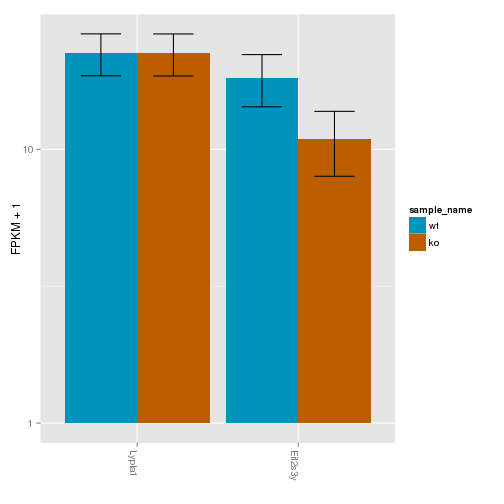 

```r
expressionBarplot(genotypingGenes,replicates=T)
```

```
## Scale for 'colour' is already present. Adding another scale for 'colour', which will replace the existing scale.
## ymax not defined: adjusting position using y instead
```

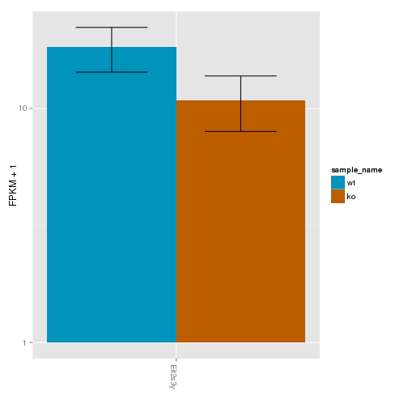 


# Differential Analysis


## Differential Genes
There are 95 significantly differentially expressed genes. They are:

```r
print(xtable(geneAnnot$gene_short_name),type="html")
```

```
## Error: no applicable method for 'xtable' applied to an object of class
## "character"
```

```r
#print(xtable((fpkmMatrix(sigPCGenes))),type = "html", include.rownames = T)
```

### Matrix of gene significant differences between conditions

```r
sigMatrix(cuff, level="genes", alpha=alpha)
```

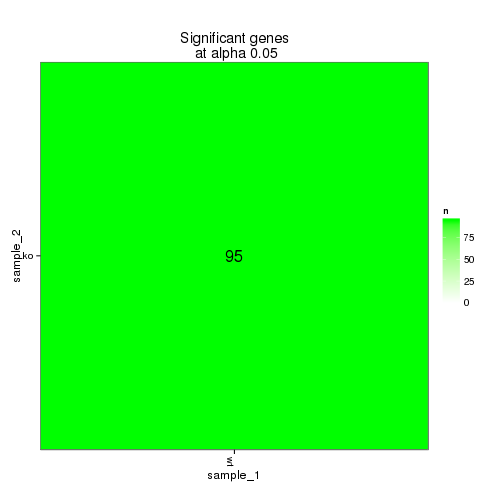 

```r
sigMatrix(cuff, level="genes", alpha=alpha, replicates=T)
```

```
## Error: unused argument (replicates = T)
```

```r
sigMatrix(cuff, level="isoforms",alpha=alpha)
```

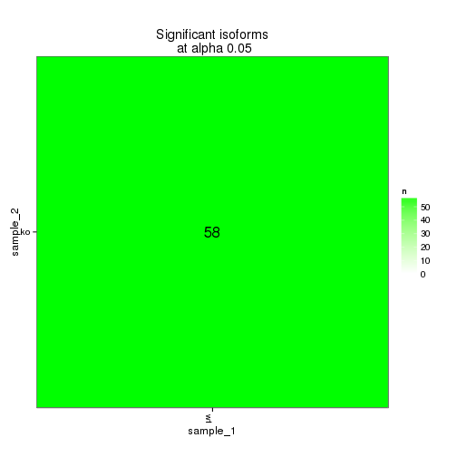 

```r
sigMatrix(cuff, level="isoforms",alpha=alpha, replicates=T)       
```

```
## Error: unused argument (replicates = T)
```

### Replicate Clustering by significant genes 

```r
csDendro(sigGenes, replicates=T)
```

```
## Using tracking_id, rep_name as id variables
```

 

```
## 'dendrogram' with 2 branches and 6 members total, at height 0.2567
```

### Significant gene expression differences between conditions


```r
csHeatmap(sigGenes, cluster="both",replicates=T)
```

```
## Using tracking_id, rep_name as id variables
## No id variables; using all as measure variables
```

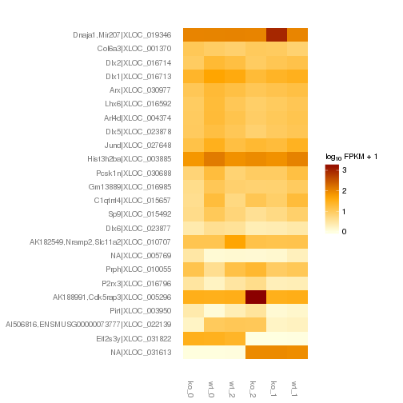 

```r
expressionPlot(sigGenes)
```

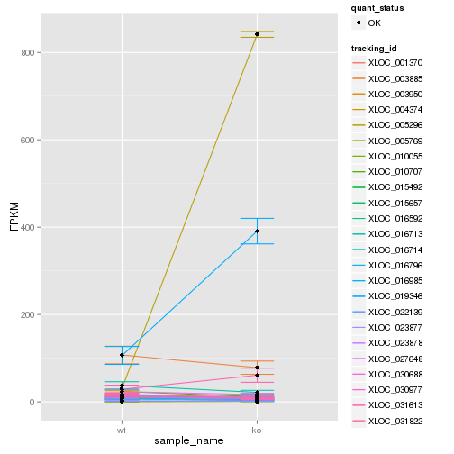 

```r
       #MOAR PLOTS! 
```


### Expression-level significance relationship

```r
csScatter(sigGenes, "wt", "ko", smooth=T)
```

```
## Using tracking_id, sample_name as id variables
```

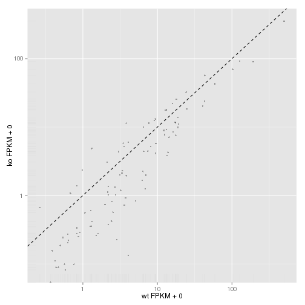 

```r
csVolcano(sigGenes, "wt", "ko")
```

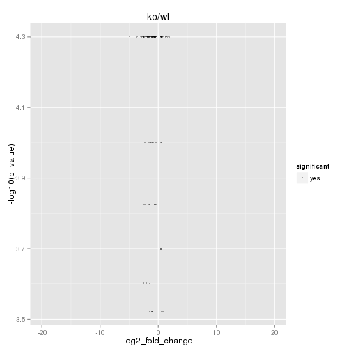 

## Differential Splicing

### Differential Isoforms between conditions
Per isoform difference between conditions:

```r
isoformSigIDs<-getSig(cuff,level="isoforms",alpha=0.1)
isoformSigGenes<-getGenes(cuff,isoformSigIDs)
isoAnnot<-annotation(isoformSigGenes)
print(xtable(isoAnnot$gene_short_name),type="html")
```

```
## Error: no applicable method for 'xtable' applied to an object of class
## "character"
```

### Differential Splicing between conditions
Per condition differences in isoforms #Does gene have diff piechart between conditions

```r
splicingSigIDs<-getSig(cuff,level="splicing",alpha=0.05)
splicingSigGenes<-getGenes(cuff,splicingSigIDs)
```

```
## Error: RS-DBI driver: (error in statement: near ")": syntax error)
```

```r
spliceAnnot<-annotation(splicingSigGenes)

print(xtable(as.data.frame(spliceAnnot$gene_short_name)), type="html")
```

```
## <!-- html table generated in R 3.0.2 by xtable 1.7-3 package -->
## <!-- Wed Jun 11 20:43:30 2014 -->
## <TABLE border=1>
## <TR> <TH>  </TH> <TH> spliceAnnot$gene_short_name </TH>  </TR>
##   <TR> <TD align="right"> 1 </TD> <TD> Cisk,Sgk3 </TD> </TR>
##   <TR> <TD align="right"> 2 </TD> <TD> Terf1 </TD> </TR>
##   <TR> <TD align="right"> 3 </TD> <TD> Timeless </TD> </TR>
##   <TR> <TD align="right"> 4 </TD> <TD> Foxo3 </TD> </TR>
##   <TR> <TD align="right"> 5 </TD> <TD> Myo10,myo 10 </TD> </TR>
##   <TR> <TD align="right"> 6 </TD> <TD> NSR1,Scarf2 </TD> </TR>
##   <TR> <TD align="right"> 7 </TD> <TD> Spry1 </TD> </TR>
##   <TR> <TD align="right"> 8 </TD> <TD> Oasl1 </TD> </TR>
##    </TABLE>
```

```r
#Print csPie chart pannel
#how to make ggplot panel? 
#for(gene %in% splicingSigGenes){
#  csPie(cuff,gene) 
#}

#splicing.unique.IDs<-setdiff(annotation(splicingSigGenes)$gene_id#,annotation(sigGenes)$gene_id)
#splicing.unique.IDs

#pdf("sigSplicing_heatmap.pdf",width=10,height=20)
csHeatmap(isoforms(splicingSigGenes),cluster='row',method=dist)
```

```
## Using tracking_id, sample_name as id variables
## No id variables; using all as measure variables
```

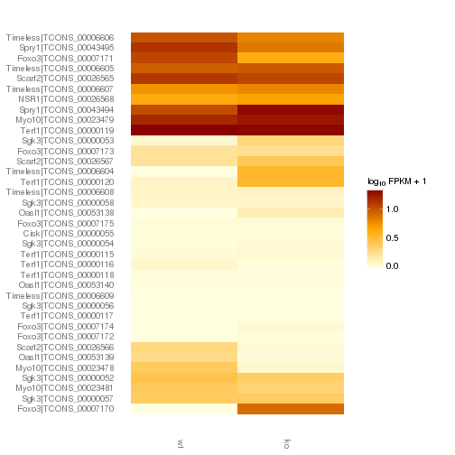 

```r
csHeatmap(isoforms(isoformSigGenes),cluster='row',method=dist)
```

```
## Using tracking_id, sample_name as id variables
## No id variables; using all as measure variables
```

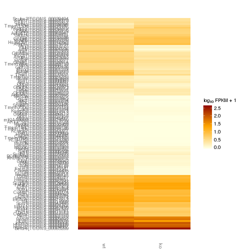 

```r
  #IS THIS DIFFERENTIAL BETWEEN WT/KO OR ISOFORMS? WHETHER IN ONE CONDITION OR BOTH?
#dev.off()
```


## Differential Promoter usage (isoforms by tss)


```r
tssSigIDs<-getSig(cuff,alpha=0.1,level="TSS")
tssSigGenes<-getGenes(cuff,tssSigIDs)

#promoter.unique.IDs<-setdiff(annotation(sigPromoterGenes)$gene_id,annotation(sigGenes)$gene_id)
#promoter.unique.IDs

id<-tssSigIDs[19]
gene<-getGene(cuff,id)
csPie(gene) #how can you get a significantly different promoter but with no isoform diff? 
```

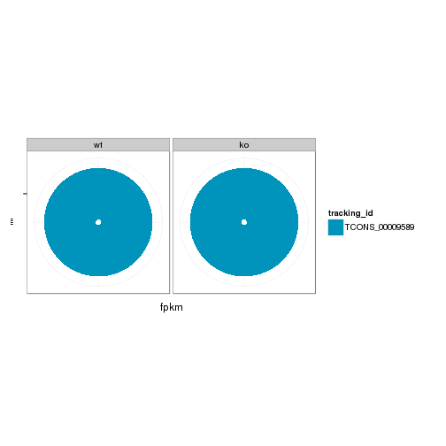 

```r
csHeatmap(tssSigGenes,cluster='row',method=dist)
```

```
## Using tracking_id, sample_name as id variables
## No id variables; using all as measure variables
```

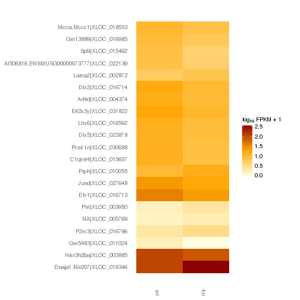 

```r
#for(id %in% sigPromoterIDs){
#  gene<-getGene(cuff,id)
#  csPie(gene)
#}
```

## Differential Promoter Usage (By "Promoters")


```r
promoterSigIDs<-getSig(cuff,alpha=0.1,level="promoters")

promoterSigGenes<-getGenes(cuff,promoterSigIDs)

#promoter.unique.IDs<-setdiff(annotation(sigPromoterGenes)$gene_id,annotation(sigGenes)$gene_id)

#promoter.unique.IDs

pdf("sigPromoter_heatmap.pdf",width=10,height=20)
csHeatmap(promoterSigGenes,cluster='row',method=dist)
```

```
## Using tracking_id, sample_name as id variables
## No id variables; using all as measure variables
```

```r
dev.off()
```

```
## pdf 
##   2
```

## Differential CDS? (unique protein coding isoforms)

```r
cdsSigIDs<-getSig(cuff,alpha=0.1,level="CDS")
#sigCDSIDs<-getSig(cuff,alpha=0.1,level="CDS")
cdsSigGenes<-getGenes(cuff,cdsSigIDs)
```

```
## Error: RS-DBI driver: (error in statement: near ")": syntax error)
```

```r
relcdsSigIDs<-getSig(cuff,alpha=0.1,level="relCDS")
relcdsSigGenes<-getGenes(cuff,relcdsSigIDs)
```

```
## Error: RS-DBI driver: (error in statement: near ")": syntax error)
```

```r
#CDS.unique.IDs<-setdiff(annotation(sigCDSGenes)$gene_id,annotation(sigGenes)$gene_id)
#CDS.unique.IDs

pdf("sigCDS_heatmap.pdf",width=10,height=20)
csHeatmap(cdsSigGenes,cluster='row',method=dist)
```

```
## Error: error in evaluating the argument 'object' in selecting a method for function 'csHeatmap': Error: object 'cdsSigGenes' not found
```

```r
dev.off()
```

```
## pdf 
##   2
```


## Venn diagram overview of Differential changes

```r
# Make venn diagram of DE genes, DE splicing, DE promoters, DE relCDS (See figure 2)

#install.packages("tiff")
#library(tiff)
require(VennDiagram)
venn<-venn.diagram(list(
    'Genes'=sigGeneIDs,
    'Splicing'=splicingSigIDs,
    'Isoforms'=isoformSigIDs,
    'Promoters'=promoterSigIDs,
    'TSS'=tssSigIDs),filename=NULL)
```

```
## Error: object 'sigGeneIDs' not found
```

```r
#'CDS'=cdsSigIDs,
#'relCDS'=relcdsSigIDs
```


# Gene/Pathway Analysis

## GSEA


```r
population<-genes(cuff)
population.diff<-diffData(population)
annotation<-annotation(genes(cuff))
gene_names<-merge(annotation,population.diff)

gene_set_index <- function(genelist, short_names){
  which(short_names %in% genelist)   
}

get_gene_set_p_vals <- function(input, gs, alternative){
  gene_set_indices <- lapply(gs$genesets, function(short_name){
    gene_set_index(input$short_name, short_name)
    })
  pvl<-lapply(gene_set_indices,geneSetTest,input$test_stat, alternative=alternative)
  pvl_mat<-as.data.frame(t(unlist(pvl)))
  colnames(pvl_mat) <- gs$geneset.names
   return(pvl_mat)
}
 
get_gene_set_q_vals <- function(pvl_mat, method="bonferroni"){
	comp_corrected <- matrix(p.adjust(pvl_mat, method=method), nrow=nrow(pvl_mat), ncol=ncol(pvl_mat))
	colnames(comp_corrected) <- colnames(pvl_mat)
	rownames(comp_corrected) <- rownames(pvl_mat)
	return(comp_corrected)
}

colMins<-function(x){
  apply(x,2,min)
}
rowMins<-function(x){
  apply(x,1,min)
}
 
InputCols<-maPalette(low="white",high="red",k=100)
```


```r
df.pop<-data.frame("short_name"=toupper(gene_names$gene_short_name),"test_stat"=gene_names$test_stat)
row.names(df.pop)=population.diff$gene_id
df.pop.ordered<-df.pop[order(df.pop$test_stat),]
Input.df<-df.pop.ordered

reactome_pvl_mat <- get_gene_set_p_vals(Input.df, reactome_gs,alternative="mixed")
reactome_pvl_corrected <- get_gene_set_q_vals(reactome_pvl_mat)
reactome_pvl_corrected<-rbind(reactome_pvl_corrected,reactome_pvl_corrected)

biocarta_pvl_mat <- get_gene_set_p_vals(Input.df, biocarta_gs, alternative="mixed")
biocarta_pvl_corrected <- get_gene_set_q_vals(biocarta_pvl_mat)
biocarta_pvl_corrected<-rbind(biocarta_pvl_corrected,biocarta_pvl_corrected)

heatmap.2(-log10(t(biocarta_pvl_corrected[,which(colMins(biocarta_pvl_corrected) < 0.01)])), trace="none", margins=c(5,30),col=InputCols,dendrogram="both",lhei = c(0.1,0.90))
```

```
## Error: `x' must have at least 2 rows and 2 columns
```

```r
heatmap.2(-log10(t(reactome_pvl_corrected[,which(colMins(reactome_pvl_corrected) < 0.01)])), trace="none", margins=c(5,30),col=InputCols,dendrogram="both",lhei = c(0.1,0.90))
```

```
## Error: `x' must have at least 2 rows and 2 columns
```

## GO enrichment (cluster profiler?)


```r
geneNames<-geneAnnot$gene_short_name

# Top genes by test stat
#diff<-diffData(genes(cuff))
#diff<-diff[order(abs(diff$test_stat),decreasing=TRUE),]
#top_genes<-diff[which(diff$p_value<0.1),]
#top_genes_annot<-merge(top_genes,population)
#geneNames<-top_genes_annot$gene_short_name
```

biomart to get entrez gene IDS
clusterProfiler does GO enrichment 

BP, MF, CC

enrichKEGG
enrichDO
enrichPathway
groupGO


```r
goBP<-enrichGO(gene=sigEZ, organism="mouse",ont="BP",pvalueCutoff=0.01,readable=T)
```

```
## Error: could not find function "enrichGO"
```

```r
goMF<-enrichGO(gene=sigEZ, organism="mouse",ont="MF",pvalueCutoff=0.01,readable=T)
```

```
## Error: could not find function "enrichGO"
```

```r
goCC<-enrichGO(gene=sigEZ, organism="mouse",ont="CC",pvalueCutoff=0.01,readable=T)
```

```
## Error: could not find function "enrichGO"
```

```r
#kegg<-enrichKEGG(gene=sigEZ, organism="mouse",pvalueCutoff=0.01, readable=T)

#disease<-enrichDO(gene=sigEZ, organism="mouse",pvalueCutoff=0.01, readable=T)

#pathway<-enrichPathway(gene=sigEZ,organism="mouse",pvalueCutoff=0.01, readable=T)
```


```r
#Simple method
#plot(goBP)
#plot(goMF)
#plot(goCC)

#Visualizing w clusterProfiler
#barplot(goBP, drop = TRUE, showCategory = 12)
#barplot(goBP, showCategory = 12)
#barplot(goMF,showCategory=12)
#barplot(goCC, showCategory=12)

#WHY DONT THESE FUNCTIONS WORK? 
#cnetplot(goBP, categorySize = "pvalue", foldChange = geneList)
#cnetplot(goBP, categorySize = "geneNum", foldChange = geneList)

#cluster.enrichKEGG<-compareCluster(sigEZ,fun="enrichKEGG",organism="mouse",qvalueCutoff=0.01)
#require(ReactomePA)
#cluster.enrichPathway<-compareCluster(sigEntrezNames,fun="enrichPathway",qvalueCutoff=0.01)

plot(goBP,showCategory=10) + theme(axis.text.x=element_text(angle=-90,hjust=0)) + ggtitle("Enriched BP")
```

```
## Error: object 'goBP' not found
```

```r
plot(goMF,showCategory=10) + theme(axis.text.x=element_text(angle=-90,hjust=0)) + ggtitle("Enriched MF")
```

```
## Error: object 'goMF' not found
```

```r
plot(goCC,showCategory=10) + theme(axis.text.x=element_text(angle=-90,hjust=0)) + ggtitle("Enriched CC")
```

```
## Error: object 'goCC' not found
```

```r
#plot(cluster.enrichKEGG,showCategory=10) + theme(axis.text.x=element_text(angle=-90,hjust=0)) + ggtitle("Enriched KEGG")
#plot(cluster.enrichPathway,showCategory=20) + theme(axis.text.x=element_text(angle=-90,hjust=0)) + ggtitle("Enriched Reactome")

detach("package:biomaRt")
```

```
## Error: invalid 'name' argument
```


# Cis vs Trans (locally)

```r
window<-1000000
```


# Transcription Factor binding enrichment (for sigdiff genes...?)


# Interesting Genes
Hand pick these after initial round of analysis?

# Notes

# Session Info

```r
sessionInfo()
```

```
## R version 3.0.2 (2013-09-25)
## Platform: x86_64-unknown-linux-gnu (64-bit)
## 
## locale:
##  [1] LC_CTYPE=en_US.UTF-8       LC_NUMERIC=C              
##  [3] LC_TIME=en_US.UTF-8        LC_COLLATE=en_US.UTF-8    
##  [5] LC_MONETARY=en_US.UTF-8    LC_MESSAGES=en_US.UTF-8   
##  [7] LC_PAPER=en_US.UTF-8       LC_NAME=C                 
##  [9] LC_ADDRESS=C               LC_TELEPHONE=C            
## [11] LC_MEASUREMENT=en_US.UTF-8 LC_IDENTIFICATION=C       
## 
## attached base packages:
## [1] grid      parallel  stats     graphics  grDevices utils     datasets 
## [8] methods   base     
## 
## other attached packages:
##  [1] VennDiagram_1.6.5    mgcv_1.7-29          nlme_3.1-117        
##  [4] marray_1.40.0        gplots_2.13.0        GSA_1.03            
##  [7] limma_3.18.13        xtable_1.7-3         cummeRbund_2.7.2    
## [10] Gviz_1.6.0           rtracklayer_1.22.7   GenomicRanges_1.14.4
## [13] XVector_0.2.0        IRanges_1.20.7       fastcluster_1.1.13  
## [16] reshape2_1.4         ggplot2_1.0.0        RSQLite_0.11.4      
## [19] DBI_0.2-7            BiocGenerics_0.8.0   knitr_1.6           
## 
## loaded via a namespace (and not attached):
##  [1] AnnotationDbi_1.24.0   Biobase_2.22.0         biomaRt_2.18.0        
##  [4] Biostrings_2.30.1      biovizBase_1.10.8      bitops_1.0-6          
##  [7] BSgenome_1.30.0        caTools_1.17           cluster_1.15.2        
## [10] colorspace_1.2-4       dichromat_2.0-0        digest_0.6.4          
## [13] evaluate_0.5.5         formatR_0.10           Formula_1.1-1         
## [16] gdata_2.13.3           GenomicFeatures_1.14.5 gtable_0.1.2          
## [19] gtools_3.4.1           Hmisc_3.14-4           KernSmooth_2.23-12    
## [22] labeling_0.2           lattice_0.20-29        latticeExtra_0.6-26   
## [25] markdown_0.7           MASS_7.3-33            Matrix_1.1-3          
## [28] mime_0.1.1             munsell_0.4.2          plyr_1.8.1            
## [31] proto_0.3-10           RColorBrewer_1.0-5     Rcpp_0.11.1           
## [34] RCurl_1.95-4.1         Rsamtools_1.14.3       scales_0.2.4          
## [37] splines_3.0.2          stats4_3.0.2           stringr_0.6.2         
## [40] survival_2.37-7        tools_3.0.2            XML_3.98-1.1          
## [43] zlibbioc_1.8.0
```

#Run Info

```r
runInfo(cuff)
```

```
## [1] param value
## <0 rows> (or 0-length row.names)
```
