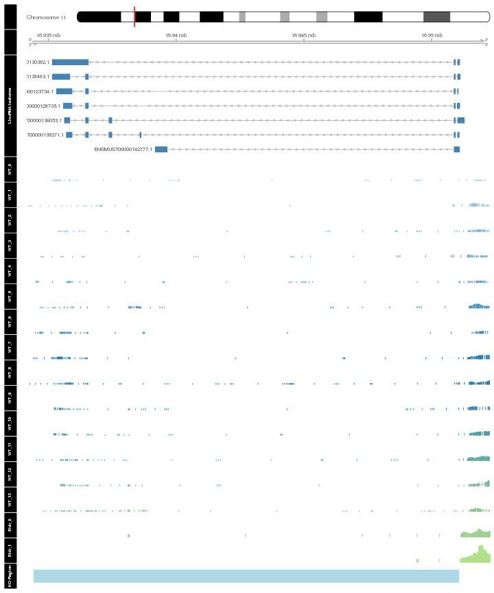

Eldr Adult track visualization 
========================================================


```r
path<-paste(filename,"/figure/",sep="")
opts_chunk$set(echo=FALSE, message=FALSE, warning=FALSE,fig.height=12, fig.width=10,fig.path=path,dev=c('png', 'pdf'))
alpha<-0.05 
```


 

